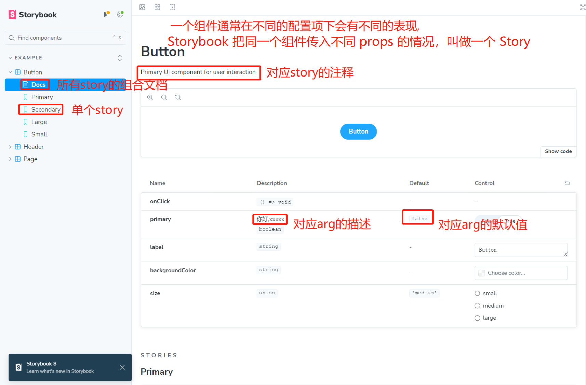

# 初始化项目

```js
//不需要这个
//npx create-react-app --template typescript 项目名称
//装在全局
npx storybook@latest init
//装在本地
npx storybook@latest -s init
```

[https://storybook.js.org](https://storybook.js.org)

[https://juejin.cn/book/7294082310658326565/section/7298717990865633318](https://juejin.cn/book/7294082310658326565/section/7298717990865633318)

# **开造**

storybook运行依赖.storybook下的配置文件,main.ts是主文件,**preview.ts是所有 story 的公共配置**



## 目录结构

```
.storybook
src
    assets
    components
        Button
            Button.stories.ts
            index.css
            index.tsx
```

## 主文件配置
`.storybook/main.js` 配置 storybook 使用的插件以及文件

```js
import type { StorybookConfig } from "@storybook/react-vite";  
  
const config: StorybookConfig = {
  //从那些目录解析stories
  stories: ["../src/**/*.mdx", "../src/components/**/*.stories.@(js|jsx|mjs|ts|tsx)"],  
  //使用的插件
  addons: [  
    // '@storybook/addon-docs',  
    // "@storybook/addon-onboarding",
    // "@storybook/addon-links",
    //提供Toolbars(顶部工具栏),controls组件控制台,docs组件文档,viewport不同分辨率视口,Source,action
    "@storybook/addon-essentials",
    // "@chromatic-com/storybook",  
    // "@storybook/addon-interactions",
  ],  
  framework: {  
    name: "@storybook/react-vite",  
    options: {},  
  },  
};  
export default config;
```

## story 配置
根据 story>meta>preview 的原则覆盖合并
1. preview:指`.storybook/preview.js` 中的配置,是所有 story 的公共配置
2. meta: 指每个`stories.js`或`.mdx`文件中默认导出的内容
3. story:指每个`stories.js`或`.mdx`文件中命名导出的内容(单独导出)

meta 中这些配置项, 除了 title, 都可以写到 preview. ts 中作为全局配置
```javascript
// Button/Button.stories.ts
import type { Meta, StoryObj } from '@storybook/react'; //vue3是@storybook/react
import { expect } from '@storybook/test'
import { Button,ButtonProps } from './index';

type metaType=Meta<typeof Button>;
//Button组件下所有story的公共配置
const meta: metaType = {
  title:'Example/Primary', //显示的名称
  tags:['autodocs'], //生成上图的Docs那个所有story的组合文档
  //传递给组件的参数
  args:{},
  //配置传递给组件的参数的行为
  argTypes:{
	  a:{
		  //control:'text' //控制器类型
		  control:{
			  type:'radio',
			  options:['small', 'middle', 'large']
		  }
	  }
  },
  //配置传递给addon插件的参数
  parameters: {
    //组件的布局方式
    //centered垂直水平居中,fullscreen占满全屏,padded(默认)组件周围填充空白
  	layout: 'centered',
  },
  
  //自定义渲染组件,vue返回配置项即可,常用于根据meta中的数据进行渲染
  render(args:ButtonProps,meta:metaType){
     //meta.loaded loaders数组中 函数的返回值组成的对象
     return <Button {...args}{...meta.loaded} />
  },
  //加载时运行,用来请求基础数据,不晓得有啥用
  loaders: [
	async ({args,...rest}) => {
		const obj=await '假装 fetch'
		return {args:{...args,...obj},...rest}
	}
  ],
  //组件渲染完毕就会执行,常用来测试
  async play(meta:metaType){
      //断言函数,判断meta.args.backgroundColor==='green',结果会在控制台显示
      await expect(meta.args.backgroundColor).toEqual('green');
  },
};
export default meta;

type Story = StoryObj<typeof Button>;


//如果每个story渲染逻辑是一样的,只有入参不一样,可以配置模板
const Template = (props) => {  
  return <Space {...props}>  
   <div className="box"></div>  
   <div className="box"></div>  
   <div className="box"></div>  
  </Space>
} 
  
export const Secondary=Template.bind({});
Secondary.args={  
	label: 'Button',  
}
```


| 配置                        | 说明                                                                                                                                                                                                                                                                                                                                                                                                                                                                                                                                                                                                                                                       |
| ------------------------- | -------------------------------------------------------------------------------------------------------------------------------------------------------------------------------------------------------------------------------------------------------------------------------------------------------------------------------------------------------------------------------------------------------------------------------------------------------------------------------------------------------------------------------------------------------------------------------------------------------------------------------------------------------- |
| (meta 特有)title            | 组件显示在页面中的名称                                                                                                                                                                                                                                                                                                                                                                                                                                                                                                                                                                                                                                              |
| (meta 特有)component:组件     | 应该使用哪个组件                                                                                                                                                                                                                                                                                                                                                                                                                                                                                                                                                                                                                                                 |
| tags: ['autodocs']        | 'autodocs':自动根据配置生成 docs文档<br>'!autodocs': 禁用自动文档                                                                                                                                                                                                                                                                                                                                                                                                                                                                                                                                                                                                        |
| args:{...}                | 传递给组件的参数                                                                                                                                                                                                                                                                                                                                                                                                                                                                                                                                                                                                                                                 |
| argTypes:{...}            | 配置传递给组件的参数的行为(控制器类型,描述等)<br>默认根据参数类型/默认值自动生成对应控制器类型<br><br><br>argTypes:{<br>  参数1:{<br>    //参数描述, 默认取 jsdoc 中的描述<br>    description: '背景',<br><br>    //控制器行为, 只写 type 时可简写为 control: type 类型 <br>    //常见类型有:  text, number, color, date,range, radio, select, inline-radio,   inline-radio, object,<br>    control: 'select',<br><br>    //参数值隐射<br>    mapping:{参数: 隐射的值, 可以是 jsx}<br>  }<br>}<br>                                                                                                                                                                                                                                                  |
| loaders:any               | 用来请求初始化数据, 会打断渲染, 可以是对象, 数组或单个函数,<br>最终 promise 解析后的值作为 loaded 的值<br>loaders: async () => {<br>	await '假装 fetch'<br>	return {list: [111]}<br>},<br>                                                                                                                                                                                                                                                                                                                                                                                                                                                                                                      |
| render (args, meta){}     | 自定义渲染组件,, 常用于根据 meta 中的数据进行渲染<br>render(args: ButtonProps,meta:metaType){<br>     //meta.loaded loaders数组中 函数的返回值组成的对象<br>     return <Button {...args}{...meta.loaded} /><br>},                                                                                                                                                                                                                                                                                                                                                                                                                                                                         |
| play (meta){}             | 组件渲染完毕就会调用, 常用于测试                                                                                                                                                                                                                                                                                                                                                                                                                                                                                                                                                                                                                                        |
| parameters:{...}          | 配置传递给addon插件的参数<br>parameters:{<br>  //组件的布局方式, centered 垂直水平居中, fullscreen 占满全屏, padded (默认) 组件周围填充空白<br>  layout: 'centered'<br><br>  //组件的背景, 来自<br>  backgrounds: [{<br>    default: 'dark',  <br>    values:[{name: 'dark',value: ' #333 '}]<br>  }],<br><br>  docs: {<br>    description: {  <br>      component: '',  //组件的描述<br>      story: '测试',  //单个 story 的描述<br>    },<br>  },<br><br>  //视口<br>  viewport: {<br>    defaultViewport: '默认展示的视口名称',<br>    viewports: {<br>       name: '视口名称', styles:{width: '200px',...} <br>    },<br>  },<br>  <br>  // 自定义参数, 给部分插件使用  <br>  customParameter: {  <br>    key: 'value',  <br>  },<br>} |
| decorators:[(Story)=>jsx] | 用于添加一些额外样式, 例如在 Story 组件外部包裹一层 margin,<br>Story 就是我们写的各个接受完参数的story组件, 例如 Button 组件的 primary                                                                                                                                                                                                                                                                                                                                                                                                                                                                                                                                                             |

