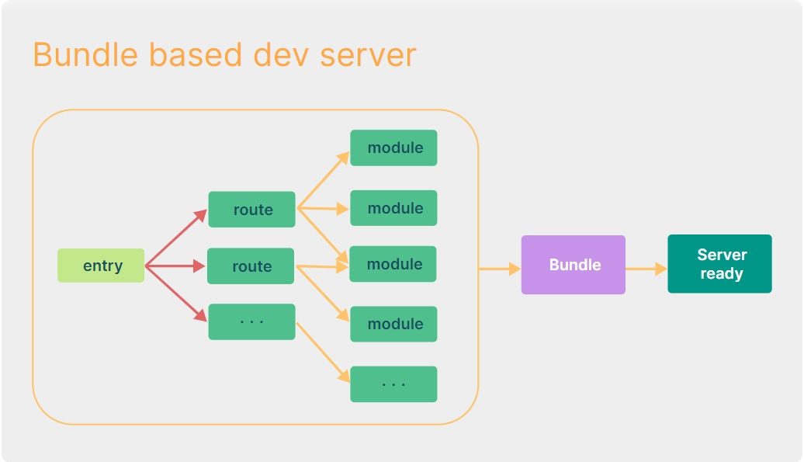

# 原理

vite是基于es module(script type:module&import)实现的，

vite将代码分为源码和依赖两块,依赖是指node module中的第三方包(不会变),源码是指开发的代码(时刻会变)
```js
//函数调用顺序
startServer -> runOptimize -> optimizeDeps -> scanImports -> esbuild.build
```
**预构建:**
在 `启服务(npm run dev等)` 的时候,仅执行预构建操作,会经过`缓存判断`,`依赖扫描`,`依赖打包`三个阶段:
1. 缓存判断:Vite在每次预构建之后会将一些关键信息写入到`_metadata.json`文件中，下次构建时,使用这些信息计算hash值和当前信息计算的hash值进行对比,判断是否使用缓存,关键信息是指:
	1. lock 文件内容
	2. 插件
	3. 预构建配置
	4. 开发环境
	5. 项目根路径
	6. 路径解析配置
	7. 自定义资源类型
2. 依赖扫描:如果缓存判断两次hash值不一样(代表关键信息变化了),会使用`esbuildScanPlugin`从入口文件出发扫描项目使用到的依赖,然后调用Esbuild的build方法进行预打包也就是build函数的write配置项指定为false,不写入磁盘,**由于不写入磁盘,预打包速度非常快**,最后将预打包的信息输出到控制台
3. 依赖打包(将依赖转换为esModule):依赖扫描完毕后,正式调用build方法进行依赖打包,将打包信息(`build返回值.metafile`)写入`_metadata.json`
	1. 将node_modules下非esmodule的处理为esmodule，
	2. 最后将他们进行打包变成一个esmodule模块(结果缓存在node_modules/.vite中)

**源码实时解析:**
服务起了后,vite会基于connect起了一个开发服务并监听请求，并通过中间件处理这些请求(项目跑的时候可以看到那些中间件)，将源码文件进行编译。
当我们访问index.html的时候，浏览器会向服务发起相应文件的请求,vite对这些文件进行实时编译并返回


## 预构建
### 缓存判断
Vite 在每次预构建之后都将一些关键信息写入到了`_metadata.json`文件中，第二次启动项目时会通过这个文件中的 hash 值来进行缓存的判断，如果命中缓存则不会进行后续的预构建流程

关键信息是指:
1. lock 文件内容
2. 插件
3. 预构建配置
4. 开发环境
5. 项目根路径
6. 路径解析配置
7. 自定义资源类型

```js
// _metadata.json 文件所在的路径
const dataPath = path.join(cacheDir, "_metadata.json");
// 根据当前的配置计算出哈希值
const mainHash = getDepHash(root, config);
const data: DepOptimizationMetadata = {
  hash: mainHash,
  browserHash: mainHash,
  optimized: {},
};
// 默认走到里面的逻辑
if (!force) {
  let prevData: DepOptimizationMetadata | undefined;
  try {
    // 读取元数据
    prevData = JSON.parse(fs.readFileSync(dataPath, "utf-8"));
  } catch (e) {}
  // 当前计算出的哈希值与 _metadata.json 中记录的哈希值一致，表示命中缓存，不用预构建
  if (prevData && prevData.hash === data.hash) {
    log("Hash is consistent. Skipping. Use --force to override.");
    return prevData;
  }
}

```

`getHash`函数
```js
const lockfileFormats = ["package-lock.json", "yarn.lock", "pnpm-lock.yaml"];
function getDepHash(root: string, config: ResolvedConfig): string {
  // 获取 lock 文件内容
  let content = lookupFile(root, lockfileFormats) || "";
  // 除了 lock 文件外，还需要考虑下面的一些配置信息
  content += JSON.stringify(
    {
      // 开发/生产环境
      mode: config.mode,
      // 项目根路径
      root: config.root,
      // 路径解析配置
      resolve: config.resolve,
      // 自定义资源类型
      assetsInclude: config.assetsInclude,
      // 插件
      plugins: config.plugins.map((p) => p.name),
      // 预构建配置
      optimizeDeps: {
        include: config.optimizeDeps?.include,
        exclude: config.optimizeDeps?.exclude,
      },
    },
    // 特殊处理函数和正则类型
    (_, value) => {
      if (typeof value === "function" || value instanceof RegExp) {
        return value.toString();
      }
      return value;
    }
  );
  // 最后调用 crypto 库中的 createHash 方法生成哈希
  return createHash("sha256").update(content).digest("hex").substring(0, 8);
}

```
### 依赖扫描
如果没有命中缓存,会调用scanImports方法进行依赖扫描,主要是使用`esbuildScanPlugin`扫描项目使用到的依赖,然后调用Esbuild的build方法进行预打包也就是build函数的write配置项指定为false,不写入磁盘,**由于不写入磁盘,预打包速度非常快**
最后将预打包的信息输出到控制台
```js

({ deps, missing } = await scanImports(config));


-->scanImports核心逻辑
const deps: Record<string, string> = {};
// 扫描用到的 Esbuild 插件
const plugin = esbuildScanPlugin(config, container, deps, missing, entries);
await Promise.all(
  // 应用项目入口
  entries.map((entry) =>
    build({
      absWorkingDir: process.cwd(),
      // 注意这个参数
      write: false,
      entryPoints: [entry],
      bundle: true,
      format: "esm",
      logLevel: "error",
      plugins: [...plugins, plugin],
      ...esbuildOptions,
    })
  )
);

```
### 依赖打包
依赖扫描完毕后,正式调用build方法进行依赖打包,将打包信息写入`_metadata.json`
```js
//依赖打包
	const result = await build({
	  absWorkingDir: process.cwd(),
	  // 所有依赖的 id 数组，在插件中会转换为真实的路径
	  entryPoints: Object.keys(flatIdDeps),
	  bundle: true,
	  format: "esm",
	  target: config.build.target || undefined,
	  external: config.optimizeDeps?.exclude,
	  logLevel: "error",
	  splitting: true,
	  sourcemap: true,
	  outdir: cacheDir,
	  ignoreAnnotations: true,
	  metafile: true,
	  define,
	  plugins: [
	    ...plugins,
	    // 预构建专用的插件
	    esbuildDepPlugin(flatIdDeps, flatIdToExports, config, ssr),
	  ],
	  ...esbuildOptions,
	});
	// 打包元信息，后续会根据这份信息生成 _metadata.json
	const meta = result.metafile!;


//写入磁盘
	const data: DepOptimizationMetadata = {
	  hash: mainHash,
	  browserHash: mainHash,
	  optimized: {},
	};
	// 省略中间的代码
	for (const id in deps) {
	  const entry = deps[id];
	  data.optimized[id] = {
	    file: normalizePath(path.resolve(cacheDir, flattenId(id) + ".js")),
	    src: entry,
	    // 判断是否需要转换成 ESM 格式，后面会介绍
	    needsInterop: needsInterop(
	      id,
	      idToExports[id],
	      meta.outputs,
	      cacheDirOutputPath
	    ),
	  };
	}
	// 元信息写磁盘
	writeFile(dataPath, JSON.stringify(data, null, 2));

```

# 书写插件
https://cn.vitejs.dev/guide/api-plugin

## 示例
```js
export default function(options){
	...,
	return {
		name:'插件的名称',
		enforce:'可选,插件执行顺序',
		...钩子,
	}
}
```

## 插件调用顺序 [​](https://cn.vitejs.dev/guide/api-plugin#plugin-ordering)


执行顺序:

一个 Vite 插件可以额外指定一个 `enforce` 属性（类似于 webpack 加载器）来调整它的应用顺序。`enforce` 的值可以是`pre` 或 `post`。解析后的插件将按照以下顺序排列：

- Alias
- 带有 `enforce: 'pre'` 的用户插件
- Vite 核心插件
- 没有 enforce 值的用户插件
- Vite 构建用的插件
- 带有 `enforce: 'post'` 的用户插件
- Vite 后置构建插件（最小化，manifest，报告）

## 常见钩子
### ## 通用钩子
也就是 rollup 构建钩子, Vite 开发服务器会创建一个插件容器来调用 [Rollup 构建钩子](https://rollupjs.org/plugin-development/#build-hooks):
1. buildStart () : 构建前调用, 用于构建前做一些准备工作
2. buildEnd () : 构建结束后调用, 处理构建完成后的逻辑，如输出日志、生成报告等。
3. resolveId (source, importer): 解析模块时调用, 参数 `source` 是模块路径或内容，`importer` 是请求该模块的模块路径。可以用于自定义模块解析逻辑。
4. load (id): 加载模块内容时调用。参数 `id` 是模块 ID。可以用于自定义模块内容的加载逻辑。
5. transform (source, id): 模块内容加载完毕调用, 用于自定义模板内容, 并返回新的模板内容。参数 `source` 是模块内容，`id` 是模块 ID。

### Vite 独有钩子 

1. **configResolved (config)**
    - 在 Vite 配置被解析后调用。
    - 参数 `config` 是最终的 Vite 配置对象。
    - 可以用于修改配置或基于配置进行一些初始化操作。
2. **configChanged (changed)**
    - 在 Vite 配置发生变化时调用。
    - 参数 `changed` 是一个对象，包含发生变化的配置项。
    - 可以用于处理配置变化后的逻辑。
1. **transformIndexHtml (html, url)**
    - 在转换 index. html 文件时调用。
    - 参数 `html` 是 HTML 内容，`url` 是 HTML 文件的 URL。
    - 可以用于自定义 index. html 的转换逻辑，如插入脚本、修改标题等。
2. **handleHotUpdate (ctx)**
    - 在处理热更新时调用。
    - 参数 `ctx` 包含热更新的相关信息。
    - 可以用于自定义热更新的处理逻辑。
3. **serverStart (server)**
    - 在开发服务器启动时调用。
    - 参数 `server` 是开发服务器的实例。
    - 可以用于自定义开发服务器的行为，如添加中间件、监听事件等。
4. **serverStop ()**
    - 在开发服务器停止时调用。
    - 可以用于处理服务器停止后的逻辑，如清理资源等。
5. **configureServer (server)**
    - 在配置开发服务器时调用。
    - 参数 `server` 是开发服务器的配置对象。
    - 可以用于自定义开发服务器的配置，如添加中间件配置等。
6. **optimizeDeps (deps)**
    - 在优化依赖项时调用。
    - 参数 `deps` 是依赖项的信息。
    - 可以用于自定义依赖项的优化逻辑。


# 环境变量

默认情况下:

npm run dev 会加载 .env 和 .env.development 内的配置npm run build 会加载 .env 和 .env.production 内的配置

development 和production 即mode，mode 可以通过命令行 --mode 选项来重写。

**所有env环境变量保存在import.meta.env对象中**

```
//例如:
"scripts": {
  "test": "vite --mode test",
  "dev": "vite",
  "build": "vite build"
},
​
//此时npm run test 会加载 .env 和 .env.test 内的配置
```

# 特点

1. 依赖采用预构建&强缓存,源码采用按需编译&协商缓存
2. 预构建采用esbuild,而esbuild用go写的,很快
3. 按需编译仅在devServer请求该文件时去编译该文件为ESM返回给浏览器处理

# 模块的区分

vite将模块区分为 `依赖` 和 `源码`

## 依赖

即不会变动的纯 JavaScript,例如组件库

Vite 将会使用 [esbuild](https://esbuild.github.io/) [预构建依赖](https://cn.vitejs.dev/guide/dep-pre-bundling.html)。esbuild 使用 Go 编写，比JavaScript 编写的打包器 (**webpack**) 预构建依赖快 10-100 倍

## 源码

并**非直接是js的文件,而是需要编译的**,例如JSX，CSS 或者 Vue/Svelte 组件,**时常需要编辑**

Vite 以 [原生 ESM](https://developer.mozilla.org/zh-CN/docs/Web/JavaScript/Guide/Modules) 方式提供源码。

Vite 在浏览器请求源码时进行转换并按需提供源码,让浏览器接管打包的部分工作.

而**webpack 是打包完毕后,根据请求按需提供源码**

以实现根据情景动态导入代码，即只在当前屏幕上实际使用时才会被处理。




## 热更新HMR

在 Vite 中，HMR 是在原生 ESM 上执行的。当编辑一个文件时，Vite 只需要精确地使已编辑的模块与其最近的 HMR 边界之间的链失活[[1]](https://cn.vitejs.dev/guide/why.html#footnote-1)（大多数时候只是模块本身），使得无论应用大小如何，HMR 始终能保持快速更新。

Vite 同时利用 HTTP 头来加速整个页面的重新加载（再次让浏览器为我们做更多事情）：

**源码模块**的请求会根据 `304 Not Modified` 进行**协商缓存**

**依赖模块**请求则会通过 `Cache-Control: max-age=31536000,immutable` 进行**强缓存**，因此一旦被缓存它们将不需要再次请求。