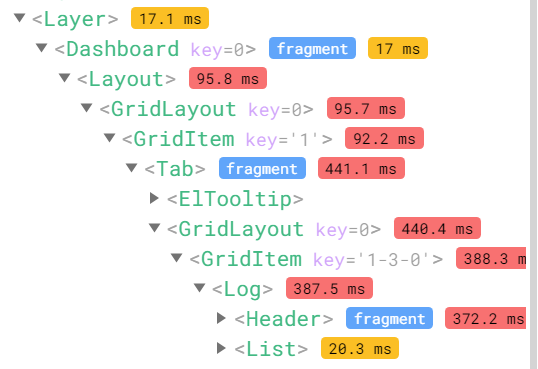
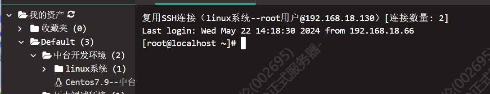

## skywalking



带上时间, 当行数据 (服务名,耗时)跳转到慢sql日志进行查询

权限管理-

**人员管理-点人头 取消再勾选其他的,保存会让两个都勾选**

## **一体化运维**

实时日志:  从打开页面开始实时输出的日志

查看/预览: 从点击的时候,服务器已经写入的日志

## 安装部署
初始弹窗
1. 选择环境, 架构, 操作系统, 安装的目标客户(项目), 
2. 根据弹窗存在本地的数据
	1. projectCodeInfo, 只用了projectCode (项目编码) 和licenseKey (产品授权码, 一体化集成用)
	2. projectCode 项目编码
	3. systemOperate 系统架构
	4. architecture 操作系统
	5. DeployEnvironment 安装环境
	6. ModeIndex 部署模式
	7. remark 备注
3. 查询上一次记录存在本地的数据
	1. 第二步的信息
		1. DataSourceList 数据源配置取值 deployPlanContent. DatasourceDeployConfig
		2. ServerList 服务器配置 deployPlanContent. ServerDeployConfig
	2. 第三步的信息
		1. ServerResourceConfiguration 产品服务配置 取值 `deployPlanContent. ServerResourceConfiguration`
		2. dataList 所有要安装的产品中间件数据库的产品信息 取值 `deployPlanContent.productDeployConfig`
		3. 各个中间件信息 取值遍历 `deployPlanContent.middlewareDeployConfig`
	

第一步
1. 根据 globalconfig 拿到相关依赖，判断依赖是否存在，并且依赖的依赖是否存在
2. 调用版本号接口，判断插件是否需要更新，并与插件建立连接
3. 下载更新插件
4. 点下一步
	1. 判断插件是否需要更新,
	2. 插件更新 sh 脚本 (**未等待更新成功**),
	3. 判断依赖列表中是否都有versionPackagePath
第二步
1. 配置服务器
2. 执行系统调优 (isOpt) 根据是否数据库服务器 (isSql) 取反, 传给插件进行处理
3. 安装并测试钩子,
	1. 先判断本地是否有对应的钩子,
		1. 没有就右下角弹出钩子的下载进度, 钩子下载完毕后, 组装数据 `hostName=serverPath+ serverName` (用于后续展示)
		2. 有就插件把参数传给后端, 后端进行系统调优, 服务器互访(为了方便联调)等操作, 并探测服务器是否能够联通 (钩子是根据架构和操作系统区分的，接口做的，取默认版本或者第一个)
	2. 
4. 点击下一步
	1. 校验信息是否填写完毕
	2. 校验钩子版本是否是最新的
	3. 单台服务器, 校验系统性能调优是否选择“是", 否则提示
第三步
1. 配置中间件，数据库, 根据中间件/数据库的 code 码分别存值
2. 配置产品，存到 ServerResourceConfiguration
3. 点下一步
	1. 校验中间件, 数据库, 产品, 自定义变量的数据是否填写完毕,
	2. 保存部署记录
	3. 将部分依赖数据库的中间件改造为产品, 存在middleToProductList 中, 在middlewareOrProductFormat 中处理
第四步
1. 读取 ServerResourceConfiguration,serverList,dataSourceList,dataList
2. 点下一步
	1. 计算安装时间
第五步
1. 预先下载 redis 计算安装时间
2. uploadProduct.js  产品下载逻辑: 上传产品数据库文件 +  (lvs/微服务/nginx)与他们的日志
3. RedisColony.js redis 下载逻辑: 上传 redis 日志
4. 产品安装完毕, 调用updateVersionInstallTime 更新

### 安装

ctrl+p搜install.js

arrange/components/components/minxins/install.js

- 选择产品界面逻辑:

- 产品清单依赖模块列表的dataList数据移除了,查询的时候,就会把产品清单对应的产品勾选取消,但是仅查询的时候会进行清除,因此需要将当前列表的数据的show改为false
- globalconfig里会返回serviceList,这是微服务列表,用来组装产品的包,会放到db_config的files里

- 确认安装逻辑:

- install.js组装安装前所需数据,并进行安装

- 添加中间件所需步骤:

- 在store/install.js中添加中间件信息,和设置的mutation
- 在middleware文件夹中添加新文件组装成安装必须的数据
- 在installTable.js中组装确认安装中显示的数据
- 在middlewareList.vue中添加服务器资源中显示的个性化中间件,中间件组件放在middlewareComponents文件夹中
- 在middlewareList.vue外面一层的index.vue中添加sessionStorage.removeItem('seata')
- 如果涉及数据库,需要在install中将它添加进产品,现在已经处理,需要在中间件vue组件中添加middle.toLowerCase()}_mysql_db_host的数据,参考seata
- installTableStep.js中的sort方法排列安装顺序(已移除,换为表格顺序datalist)

- 判断包需要更新的逻辑:

- 需要packageId,Id,版本号,versionRandom一致才不会更新,否则就会去云中台尝试拉取新的包

### 组装安装信息

先在installTable.js中组装安装的数据,再去confirmInstall.vue的checkFn中进行下载安装和预估安装时间

```javascript
Content.vue saveConfig保存配置文件中等同的信息


如果需要新增一个中间件需要同时在
index.vue的destroyed         //清空中间件的缓存

utils/installTable/middleware文件夹 //存储中间件配置,用于生成配置文件

utils/installTable/installTable.js//安装数据和提供给外部的数据
    modeIndex                //对应安装模式 1简易 2高可用
    saveMiddlewareList       //强依赖omp产品(一体化运维) ,对应produces
    installMiddleware        //用于组装[安装部署-确认安装的中间件表格]:port对应端口,code对应编码,url对应下载地址,host对应传递给,都必须
        
utils/installTable/installTableStep.js    
    sortFn                    //用于排列中间件的优先级,马上会统一到produce.js中
    
store/index                  //存中间件信息,同时本地化存储
    
produce.js //排列产品和中间件的顺序,用于处理依赖关系

//其他操作
lastPlan                 //查询上一次部署记录,存在本地

middlewareComponents   //中间件组件,可以判断是否是集群或单机
```

## 堡垒机使用



```javascript
//找到对应服务器后
//切换到根目录
cd /

//切换到云中台目录
cd /data/middle/base-env/nginx/html/SHARE_RESOURCE
//切换到一体化运维目录
cd /usr/local/nginx/html/omp

//退回到父目录进行备份 
//复制,原目录还在
cd ..
cp -r SHARE_RESOURCE SHARE_RESOURCE_bak_0522
//移动,原目录不在了
mv SHARE_RESOURCE SHARE_RESOURCE_bak_0522
mkdir SHARE_RESOURCE

//进入云中台目录
cd SHARE_RESOURCE
//删除当前目录下的所有文件
rm -rf *
//上传文件
rz
//解压到当前目录
unzip
```

## SSO

登录界面,用resource1

login-form.js是登录界面的template和js

mobile-form.js是移动端的登录界面的template和js

layout.html是正常登录界面

bjca.html是北京CA的

统一认证的菜单管理,资源id就是配按钮权限的,对应按钮的id

```
一套编码规则,指定哪些机构隶属于同一个集团,查机构即为查集团下所有机构数据
?
一个集团下,多个机构,一个机构多个院区,可能出现出现多个收费项目,如何处理
方案:按机构分类

需要转换机构为集团
以机构->院区->业务域做树
解析接口,获取接口参数


es     搜索
redis 缓存
```

```
脚本升级 (脚本文件,文件中包含sql命令之类的,后端解析执行)
服务升级 (后端的新版本传上去)

云中台
	负责安装部署 安装就是把dist文件放到服务器去
  选择安装产品
  传入服务器信息(excel)
  什么都搞完
  执行安装命令装中间件之类的
  (下载到本地的目录是根据exe插件决定的,同时exe可以上传资源到服务器(可配置))

一个包包含 
  nginx配置
  前端包
  服务器文件
  全局配置
```

`

# skywalking

```
mount(props) {
  app.config.globalProperties.qiankunParentNode = document.getElementById(process.env.VUE_APP_CONTAINER).parentNode;
  // 设置主应用下发的方法
  // ElementUi.Select.directives.Clickoutside._onMouse() //启动ui框架的鼠标按下和松开事件
  global.appLoading = true;
  const loading = document.getElementById('loading');
  loading ? (loading.style.display = 'none') : '';
  Object.keys(props.fn).forEach(method => {
    app.config.globalProperties[`$${method}`] = props.fn[method];
  });
  window.$goLogin = props.fn.goLogin; // 注册返回到登录
  global.userInfo = props.data.userInfo;
  global.software = props.data.software;
  if (!localStorage.getItem('token')) {
    localStorage.setItem('token', global.userInfo.token);
    localStorage.setItem('THPMSCookie', global.userInfo.token);
  }
  const lineRoutes = props.data.lineRoutes;
  const qkRouters = [];
  for (const v of lineRoutes) {
    // 遍历路由
    let url = v.alink ? v.alink.split('?')[0] : '';
    if (
        url !== '#' &&
        url !== '/' &&
        url.indexOf(props.data.baseRoute) == 0 &&
        url.indexOf('editor-web/bi/biEditor') == -1
    ) {
      url = '/' + url.split(props.data.baseRoute)[1];
      let _dir = url;
      if (url.indexOf('_') > -1) {
        _dir = url.split('_')[0];
      }

      //兼容中医附一老菜单
      const _dirArr = _dir.split('/');
      const same = _dirArr.slice(-2);
      if (same[0] == same[1]) {
        _dirArr.splice(-1, 1);
        _dir = _dirArr.join('/');
      }

      //需要缓存的集合
      const aliveRoutes = [
        '/intg/processManagement', //编排管理
        '/apiResources/apiOverview', //api网关
        '/intg/link', //集成链路
        '/access/supplier-manage' //供应商管理
        // '/intg/overview'//集成概况
      ];
      const keepAlive = aliveRoutes.includes(_dir);

      const d = {
        name: v.id,
        path: url,
        component: resolve => require(['@/views' + _dir], resolve),
        props: true,
        meta: {
          firstEnter: true,
          keepAlive,
          title: v.menuname, //页面标题
          canMultipleOpen: true //支持根据参数不同多开不同页签
        }
      };
      if (v.redirect !== undefined) {
        d.redirect = v.redirect;
      }
      qkRouters.push(d);
    }
  }
  global.appLoading = false;

  //监听主应用下发用户信息
  window.axiosPromiseArr = [];
  let routePath = '';

  props.onGlobalStateChange((state, prevState) => {
    //更换主题
    if (state.action == 'changeTheme') {
      setThemeColor(state.color);
    }
    //切换路由清空axiosPromiseArr数组
    if (state.routePath != routePath) {
      routePath = state.routePath;
      if (window.axiosPromiseArr.length > 0) {
        window.axiosPromiseArr = [];
      }
    }
  });
  // 设置通讯
  app.config.globalProperties.$onGlobalStateChange = props.onGlobalStateChange;
  app.config.globalProperties.$setGlobalState = props.setGlobalState;

  mountApp(props);

  //主应用主题传递
  let themeColor = null;
  if (props.fn.getTheme) {
    themeColor = props.fn.getTheme();
  } else {
    //兼容老版本
    require('./assets/css/element-variables.scss');
  }
  if (themeColor) {
    setThemeColor(themeColor);
  }
},
```

1 类型

(1对象:对象选择只能选择开始节点定义的对象,对象有是否集合的开关,

2全局变量:只能选择全局变量属性

3常量:常量选择配置的常量列表

4自定义:自定义可以修改参数名称和配置参数值)

2 参数编码 

3 参数值(如果类型为对象或者全局变量或常量时,则不让修改,为自定义参数时可以修改)

# qi

