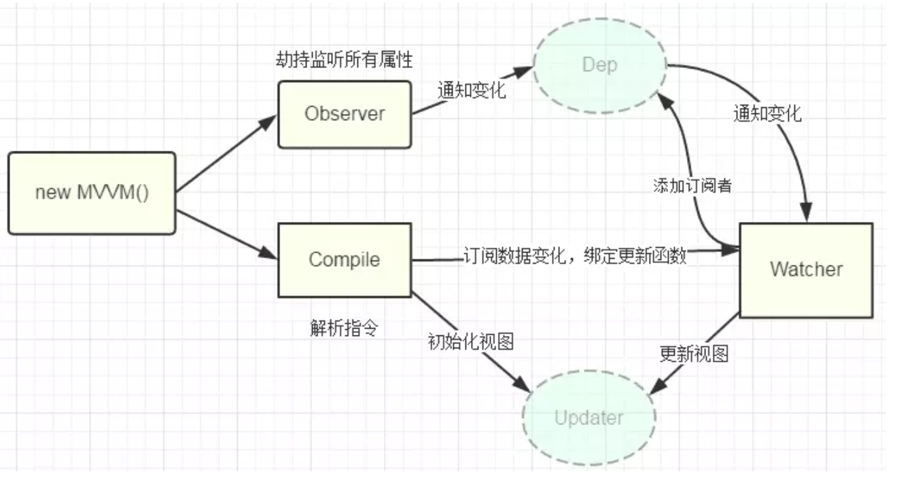

# other
## 需要学习/整理

```
项目如何选型
```

## 一些包
```js
localForage 基于indexDB(浏览器内置数据库)封装的和localstorage的API一样的库
crypto-js 加密的
Qrcode 生成二维码
Qs query/String互相转换
```

# Node
Node 在起进程时, 会将相关代码拷贝一份, 在启用, 这样两个进程互不相关, 且不强依赖 node
# element
## popover 单例实现
```vue
<template>
	<el-popover :ref="`popover-${item.id}`" trigger="click">
		<el-link type="primary" slot="reference" @click="getOrderItemDict(item)">cs</el-link>
	</el-popover>
<template>
<script>
export default{
	methods:{
		getOrderItemDict(item){
			Object.keys(this.$refs).forEach((key) => {
				 if (key.startsWith('popover-')) {
					 const currentRef=this.$refs[key];
					 if(Array.isArray(currentRef)){
						 currentRef.forEach((ref)=>{
							 ref.doClose();
						 })
					 }else{
						 currentRef.doClose();
					 }
				 }
			});
		}
	}
}
</script>
```
# ElementPlus

## 自定义命名空间
将原本的 `el-xxx` 类名全换成 `命名空间-xxx`
用处: 可以避免与其他应用冲突, 当例如微应用那种多应用存在与一个页面时, 格外好用
[参考网站](https://blog.csdn.net/u011159821/article/details/132307062)
[elementplus 官方](https://element-plus.org/zh-CN/guide/namespace.html#%E8%87%AA%E5%AE%9A%E4%B9%89%E5%91%BD%E5%90%8D%E7%A9%BA%E9%97%B4)

```js
/**自定义变量*/
@forward 'element-plus/theme-chalk/src/common/var.scss' with (
  $colors: (
    'primary': (
      'base': green,
    ),
  ),
);
```

```js
// styles/element/index.scss
// 使用自定义命名空间ep代替el前缀
@forward 'element-plus/theme-chalk/src/mixins/config.scss' with (
  $namespace: 'ep'
);
@use "~/styles/element/index.scss" as *;
// ...
```

```js
<!-- App.vue -->
<template>
  //使用el-config-provider包裹根组件,namespace属性的值需要与$namespace保持一致
  <el-config-provider namespace="命名空间的名字,例如wl">
    <!-- ... -->
  </el-config-provider>
</template>
```

```js
-->使项目中的el前缀替换为命名空间的插件
function changeHtmlClassPrefix(htmlString, oldPrefix, newPrefix) {
  const regex = new RegExp(
    `(class|style)\\s*:\\s*((["']((${oldPrefix}\\b)-).*["'])|((_normalizeClass|_normalizeStyle)\\(.*(${oldPrefix}\\b)-.*\\)))`,
    'g'
  )
  return htmlString.replace(regex, (match, p1, offset, string) => {
    return match.replace(oldPrefix, newPrefix)
  })
}

function changeSelectorPrefix(cssString, oldPrefix, newPrefix) {
  const regex = new RegExp(`(\\.${oldPrefix}\\b|\#${oldPrefix}\\b|\--${oldPrefix}\\b)`, 'g')
  return cssString.replace(regex, (match, p1, offset, string) => {
    return match.replace(oldPrefix, newPrefix)
  })
}

export default function addScopedAndReplacePrefixPlugin({ prefixScoped, oldPrefix, newPrefix }) {
  return {
    name: 'addScopedAndReplacePrefix',
    transform(code, id) {
      if (!oldPrefix || !newPrefix) return
      if (id.includes('node_modules')) return

      const cssLangs = ['css', 'scss', 'less', 'stylus', 'styl']
      let newCode = code
      if (id.endsWith('.vue')) {
        newCode = changeHtmlClassPrefix(newCode, oldPrefix, newPrefix)
      }
      // else if (id.includes('.vue') && id.includes('scoped')) {
      else if (cssLangs.some((lang) => id.endsWith(`.${lang}`))) {
        if (oldPrefix && newPrefix) {
          newCode = changeSelectorPrefix(newCode, oldPrefix, newPrefix)
        }
        if (prefixScoped) {
          newCode = `${newCode}${prefixScoped}{${newCode}}`
        }
        return newCode
      }
      return newCode
    }
  }
}

```

```js
-->使用插件
	import addScopedAndReplacePrefixPlugin from './plugins/addScopedAndReplacePrefixPlugin.js'
	export default defineConfig((mode)=>{
		plugins:[
			vue(),
			addScopedAndReplacePrefixPlugin({
				prefixScoped: `div[data-qiankun='${QIANKUN_APP_NAME}']`,  
				oldPrefix: 'el',  
				newPrefix: '命名空间的名字,例如wl'
			})
		]
		...,
	})
```
## 全局注入第三方库 (例如 element-plus 的消息框)
```js
//Element
-->使用方式
	-->1.书写插件
		function addHtmlCode (htmlString, code) {
		  return `${htmlString}${code}`
		}
		
		export default function addElementGlobalMacro () {
		  return {
		    transform (code, id) {
		      if (id.includes('node_modules')) return
		      let newCode = code
		      if (id.endsWith('.vue')) {
		        newCode = addHtmlCode('import {ElMessage,ElMessageBox,ElNotification} from \'element-plus\';', newCode)
		        return newCode
		      }
		    }
		  }
		}

	-->2.全局定义,以防报错
		//global.d.ts文件中
		declare global{
			const ElMessage: typeof import('element-plus/es')['ElMessage']
			const ElMessageBox: typeof import('element-plus/es')['ElMessageBox']
			const ElNotification: typeof import('element-plus/es')['ElNotification']
		}

	-->3.使用插件
		import addElementGlobalMacro from './plugins/addElementGlobalMacro.js'
		export default defineConfig((mode)=>{
			plugins:[
				vue(),
				addElementGlobalMacro()
			]
			...,
		})
```
## ElMessage 样式失效
[参考文章](https://blog.csdn.net/qq_44603011/article/details/135414801)
当使用自动按需引入, 并且手动在组件内部 import 了 ElMesssge 时, ElMessage 样式会失效,
需要在组件内部不要引入，但会导致 eslint 报错, 此时需要将 ElMessage 声明为全局变量
```js
//.eslintrc.js or eslintrc.cjs
module.exports = {
	...,
	//声明全局变量,避免ElMessage警告,defineEmits等也是同理
	globals: {
	  ElMessage: true,
	  ElMessageBox: true
	}
}
```


# 遇到的一些坑

超过16位的数值,在转换为number时会有精度问题

## css错误

设置flex-1的元素被子元素撑开

```
当子元素超出flex-1的元素时,flex-1的元素会被撑开,需要给设置flex-1的元素设置overflow:hidden
```

# 业务

```
一体化运维
  中间件(java中的中间件)
  
​
规则引擎(多熟悉)
​
​
​
​
​
项目->规则
​
规则可以设置常量
​
节点参数(函数入参)
​
值域()
​
负载
```

# react 和 vue 的区别

react:

1. 使用 jsx/tsx, 可使用函数/类式组件
2. 可以在任意函数中返回组件或
3. 具有高阶组件 (接收组件作为参数, 并返回组件的纯函数)

# 功能点

```
架构组件的思路和坑,怎么做的,有什么坑,怎么发布,文档怎么写
-->
​-->
-->文件上传
    拿到文件对象,通过它的size属性,slice分割为多块,一块块的加密上传,最终输出md5值用于比较这个文件上传过没,然后调用合并接口让后端把文件合并,
-->断点续传
    断点续传就是请求失败后后端返回当前下标,下次继续从这里传和加密
​-->控制并发
    控制并发就是将所有请求维护到一个queue中,当当前请求数量小于并发量时,
-->权限管理
    删除一个页面权限后,退出登录重新登录会报错,需要判断当前用户登录的路由是否在动态路由权限中,做法是将当前登录的路由,拿去跟动态权限路由递归比较
    每次动态添加路由的时候,都需要router.matcher=new VueRouter().matcher
```

## 主题切换

- 定义css变量

- 所有使用color和background-color的地方用自定义变量定义

- 切换主题,修改css变量的值

### 定义css变量,并全局使用

```javascript
:root {
  --sw-green: #70c877;
  --sw-orange: #e6a23c;
  --sw-topo-animation: topo-dash 0.3s linear infinite;
}

html {
  --el-color-primary: #409eff;
  --theme-background: #fff;
  --font-color: #3d444f;
  --disabled-color: #ccc;
  --dashboard-tool-bg: rgb(240 242 245);
  --text-color-placeholder: #666;
  --border-color: #dcdfe6;
  --border-color-primary: #eee;
  --layout-background: #f7f9fa;
  --box-shadow-color: #ccc;
  --sw-bg-color-overlay: #fff;
}
```

### 定义主题切换动画

```javascript
<span class="ml-5" ref="themeSwitchRef">
  <el-switch
    v-model="theme"
    :active-icon="Moon"
    :inactive-icon="Sunny"
    inline-prompt
    @change="handleChangeTheme"
  />
</span>

function handleChangeTheme() {
  const x = themeSwitchRef.value?.offsetLeft ?? 0;
  const y = themeSwitchRef.value?.offsetTop ?? 0;
  const endRadius = Math.hypot(Math.max(x, innerWidth - x), Math.max(y, innerHeight - y));
  // 兼容处理
  if (!document.startViewTransition) {
    changeTheme();
    return;
  }
  // api: https://developer.chrome.com/docs/web-platform/view-transitions
  const transition = document.startViewTransition(() => {
    changeTheme();
  });

  transition.ready.then(() => {
    const clipPath = [`circle(0px at ${x}px ${y}px)`, `circle(${endRadius}px at ${x}px ${y}px)`];
    document.documentElement.animate(
      {
        clipPath: !theme.value ? clipPath.reverse() : clipPath,
      },
      {
        duration: 500,
        easing: "ease-in",
        pseudoElement: !theme.value ? "::view-transition-old(root)" : "::view-transition-new(root)",
      },
    );
  });
}
```

### 定义切换主题方法

```javascript
enum Themes {
  Dark = "dark",
  Light = "light",
}

function changeTheme() {
  //获取根节点,这里是html
  const root = document.documentElement;

  if (theme.value) {
    root.classList.add(Themes.Dark);
    root.classList.remove(Themes.Light);
  } else {
    root.classList.add(Themes.Light);
    root.classList.remove(Themes.Dark);
  }
  window.localStorage.setItem("theme-is-dark", String(theme.value));
}
```

### 定义切换主题样式

```javascript
html.dark {
  --el-color-primary: #409eff;
  --theme-background: #212224;
  --font-color: #fafbfc;
  --disabled-color: #999;
  --dashboard-tool-bg: #000;
  --text-color-placeholder: #ccc;
  --border-color: #262629;
  --border-color-primary: #4b4b52;
  --layout-background: #000;
  --box-shadow-color: #606266;
  --sw-bg-color-overlay: #1d1e1f;
  --sw-border-color-light: #414243;
  --popper-hover-bg: rgb(64, 158, 255, 0.1);
  --sw-icon-btn-bg: #222;
  --sw-icon-btn-color: #ccc;
  --sw-icon-btn-border: #999;
}
```

## 复制&大文件上传/下载/控制并发

- [[代码实现#复制函数]]
- [[代码实现#文件下载]]
- [[代码实现#大文件上传]]
- [[代码实现#控制请求并发]]

## jsx错误

### h is not define

正常jsx写在组件内,如data,methods,render中,都不会报h is not define,

但是当jsx语法放到外部js中引入会报错,因为jsx需要关联组件上下文,否则无法解析(
编译的时候h函数在vue组件内,如果放到外部js,外部文件h函数不存在,会直接报错)

此时需要手动传入正确的h函数(当前组件的h函数)

```javascript
//参考config-form

//options.js 所有报错都因为jsx内的内容是从上下文中取的

// h is not define
//因为报h is not define是因为上下文中有h函数,因此,只需要上下文中有h函数即可
//方案1: import {h} form 'vue';
//方案2: 写mixins
//方案3: 传递h,在render中接收

// 提示组件未注册,因为上下文中没有显示这个组件
//方案1:全局注册,vue.component
//方案2:在configFrom实例上局部注册,实例.component
export const render= (formData,h) => {
  return [<el-input v-model={formData.code} placeholder="请输入缓存编码" />];
}

//业务组件内
<template>
    <confingForm :render="render" />
</template>
<script>
    import {render} from './options';
    export default{
        render:render
    }
</script>

//接收jsx render函数的组件内,假设config-form
export default{
    render(h){
        return [<div>
            //代表这一行自定义渲染
            const {render,formData} = this.$props;
            if (render) {
              return [render(formData,h)];
            }else{
              return [];
            }
        </div>];
    }
}
```

### el-select无法回显

原因未知,组件是真的垃圾

```javascript
//在change事件中重新将options的arr覆盖就行
<el-select
  v-model={formData.hospCode}
  style={{ width: '100%' }}
  onchange={() => this.bindOrgYuanqusArr.splice(0, 0)}>
  {this.bindOrgYuanqusArr.map(item => {
    return [<el-option key={item.hospCode} label={item.hospName} value={item.hospCode} />];
  })}
</el-select>
```

## vite引入svg

```js
// vite.config.js
import path from 'path'  
import { createSvgIconsPlugin } from 'vite-plugin-svg-icons'  
import svgLoader from 'vite-svg-loader'  
export default defineConfig((mode) => {
	return {
		plugins:[
			...,
			/** 将 SVG 静态图转化为 Vue 组件 */  
			svgLoader({ defaultImport: 'url' }),  
			createSvgIconsPlugin({  
				 iconDirs: [path.resolve(process.cwd(),'src/assets/svgs/svg')],  
				 symbolId: 'icon-[dir]-[name]'  
			 })
		]
	}
})

```

```js
//svgIcon.vue
<script lang="ts" setup>  
import { computed } from "vue"  
  
interface Props {  
  prefix?: string  
  name: string  
}  
  
const props = withDefaults(defineProps<Props>(), {  
  prefix: "icon"  
})  
  
const symbolId = computed(() => `#${props.prefix}-${props.name}`)  
</script>  
  
<template>  
  <svg class="svg-icon" aria-hidden="true">  
    <use :href="symbolId" />  
  </svg>
</template>
```

```js
//main.js
import { type App } from "vue"  
import SvgIcon from "@/components/SvgIcon.vue" // Svg Component  
import "virtual:svg-icons-register"
app.component("SvgIcon", SvgIcon)
```

## store改造

```js
//针对mutation重复代码问题,重构部分store,使state具有默认mutation
//传统mutation大部分都长这样
// setRouteData(state, newData) {
//   state.routeData = newData;
// },
//最多就进行一下简单操作,比如 state.count+=1;
//针对这种问题,写如下代码
​
//首字母大写功能函数
function capitalizeFirstLetter(string) {
  return string.charAt(0).toUpperCase() + string.slice(1);
}
//使所有state都具有默认修改mutation
function nomarlMutationHandler(names) {
  const res = {};
  for (const name of names) {
    res['set' + capitalizeFirstLetter(name)] = function(state, newData) {
      if (typeof newData === 'function') {
        newData(state);
        return;
      }
      state[name] = newData;
    };
  }
  return res;
}
export default function() {
  return {
    ...nomarlMutationHandler(Object.keys(state))
  };
}
```

## 权限管理

```js
//router.options一般是VueRouter(options)的options
//缓存静态路由
const staticRoutes = router.options.routes;
​
const addRoutes=(routes=[],parentPath = '')=>{
    //还原初始化的静态路由
    router.options.routes = staticRoutes;
    routes.forEach(item => {
        if(item.children){
            addRoutes(item.children,route.path + '/');
        }else{
            item.path=parentPath+item.path
            router.addRoute(item);
        }
    });
}
​
const initRoutes=(router)=>{
    const newRouter = new VueRouter();
    router.matcher = newRouter.matcher;
}
//例如现在退出登录
initRoutes(router);
​
//例如现在登录拿到了动态路由asyncRoutes
addRoutes(asyncRoutes);
​
//route的来源来自于路由守卫,路由守卫中判断,在跳转登录页时,缓存from路由信息作为route
let route={};
router.beforeEach(form,to,next)=>{
    if(to.path==='\login'){
        route=form||{};
    }
    return hasPermission(router,to)?next():next('/login');
}
​
//登录完毕后如果需要重定向到之前的页面,需要判断是否还存在权限
const hasPermission=(router,route)=>{
    const routes=router.matcher.options.routes; //3.0x
    //const routes=router.getRoutes() //4.0x
    const hasRoute=(item,route)=>{
        //路由匹配规则
        const matchRule=item.path===route.path||item.name===route.name;
        //如果有子路由,则匹配子路由和当前路由,否则只匹配当前路由
        return item.children?item.children.find(el=>hasRoute(el,route)||matchRule:matchRule;
    }
    return routes.find(el=>hasRoute(el,route));
}
hasPermission(router,route);
//可以在路由守卫中通过next跳转,也可以通过router.replace跳转
```

## 登录流程

```javascript
//密码加密
前端将用户名和md5加密后的密码传给后端，
后端与数据库的账号密码对比（后端存的加密后的密码），通过后返回token，
前端将token存在本地，每次请求时在请求头携带token，
​
//token失效
过期后后端返回401或者前端本地存储时存个时间戳，一定时间后算过期，过期了前端路由守卫跳转登录页，登录请求新的token
​
//无感刷新
基于登录流程，在token的基础上加一个refreshToken，当token过期返回401时，在响应拦截器中用数组将未请求到新token过程中过期的请求存储起来，用refreshToken请求到新token和新refreshToken后，重新请求
​
注意，这会导致无限刷新token。除非用户长时间未登录，refreshToken过期了
token比refreshToken过期的早
```

## [[代码实现#文件预览(pdf/图片等)]]

## 性能优化

**(具体看前端详细点的性能优化)**

```javascript
代码优化
    尽量减少 data 中的数据，data 中的数据都会增加 getter 和 setter，会收集对应的 watcher
    v-if 和 v-for 不能连用
    如果需要使用 v-for 给每项元素绑定事件时使用事件代理
    SPA 页面采用 keep-alive 缓存组件
    在更多的情况下，使用 v-if 替代 v-show
    key 保证唯一
    requestAnimationFrame处理频繁渲染,避免卡顿
    webWorker 开启单独线程处理时间很长的代码
    
    
SEO 优化
    采用http2代替http1.1 (可管道复用,请求头压缩,响应时额外推送信息)
    预渲染 (使用async/defer script提前加载js)
    服务端渲染 SSR
    使用缓存(客户端缓存、服务端缓存)
    使用路由懒加载、异步组件
    防抖、节流
    第三方模块按需导入
    长列表滚动到可视区域动态加载
    图片懒加载
​
打包优化
    压缩代码,服务端开启 gzip 压缩等。
    Tree Shaking/Scope Hoisting
    使用 cdn 加载第三方模块
    多线程打包 HappyPack开启多线程打包
    splitChunks 抽离公共文件
    sourceMap 优化
​
用户体验
    骨架屏
    PWA
```

## 动态注册组件

动态注册的缺点是 点击组件跳转的功能将失效
[官方文档对import.glob的解释](https://cn.vitejs.dev/guide/features#glob-import)

```js
import { deepClone } from '@/utils';  

export function getComponents (componentFiles, isToUpperCase = false) {  
  const components = {}  
  Object.keys(componentFiles).forEach(modulePath => {  
    const paths = modulePath.split('/')  
    if (isToUpperCase) {  
      let name = paths.pop().split('.')[0].toUpperCase()  
      if (name == 'INDEX') name = paths.pop().split('.')[0].toUpperCase()  
      components[name] = componentFiles[modulePath]  
    } else {  
      let name = paths.pop().split('.')[0]  
      if (name == 'index') name = paths.pop().split('.')[0]  
      components[name] = componentFiles[modulePath]  
    }  
  })  
  const componentNames = Object.keys(components)  
  components.install = function (app) {  
    componentNames.forEach(name => {  
      app.component(name, components[name])  
    })  
  }  
  return components  
}

/**  
 * 获取./component目录下的所有组件,命名需要小驼峰  
 * componentFiles.keys() 获取../components/ 路径下所有文件的文件路径组成的数组,eg:["./wlCheckbox/index.vue","./wlCheckboxGroup/index.vue"]  
 *///动态注册的缺点是 点击组件跳转的功能将失效  
  
//webpack下  
const componentFiles = require.context('./components/', true, /\.vue$/);  
const components = componentFiles.keys().reduce((modules, modulePath) => {  
  const value = componentFiles(modulePath).default;  
  if (value) modules[modulePath] = value;  
  return modules;  
}, {});  
//vite下  
  // 根据官方文档说明，import.meta.glob方式匹配到的文件默认是懒加载的，通过动态导入实现，并会在构建时分离为独立的chunk。  
  
  // 如果直接import.meta.glob("./components/**/*.vue")获取结构为:  
  // const modulesFiles = {  //   './src/foo.vue': () => import('./src/foo.vue'),  //   './src/bar.vue': () => import('./src/bar.vue')  // }  
  // 如果要直接引入所有的模块，传入{ eager: true }  
  // {import:'default'} value取值为 模块 default空间的内容,即export default内容  
  
// const components = import.meta.glob("./components/**/*.vue", { import: 'default', eager: true});  
//!用来排除某些文件
// const componentFiles = import.meta.glob(["./*.vue",'./**/index.vue', '!./index.vue'], { import:'default', eager: true });
  
export default getComponents(components);
```

## 组件发布流程

1. 为组件指定入口文件：在每个包下的 package. Json 文件中添加 main (require 命令的入口) 和 module (import 命令的入口)
   属性，指定组件的入口文件。
2. 设置环境变量：利用工具（如 cross-env）设置环境变量，区分开发环境和生产环境。
3. 添加打包配置文件：在项目的根目录下添加构建配置文件（如 rollup. Config. Js），配置构建和打包的相关参数。
4. Npm config set registry=私库地址/
5. 开发组件
6. Npm publish npm 会根据 package. Json 文件中的 files 字段来决定哪些文件应该被包含在发布的包中。如果`files`字段不存在，npm
   会默认包含除了被`.npmignore`或`.gitignore`文件排除之外的所有文件。

## 优化

```javascript
//造成首屏缓慢的点分为I/O阻塞,DOM渲染和性能

//I/O阻塞(分为减少包体积,请求优化,资源懒加载)
//减少包体积
    JavaScript：UglifyjsPlugin 
    CSS ：MiniCssExtractPlugin(提取css为单独文件) OptimizeCSSAssetsPlugin(压缩css)
    HTML：HtmlWebpackPlugin
    gzip：开启 gzip 压缩(一种压缩算法,减少传输的资源量)，通常开启 gzip 压缩能够有效的缩小传输资源的大小。
    压缩图片：可以使用 image-webpack-loader，在用户肉眼分辨不清的情况下一定程度上压缩图片
    树摇
    使用 svg 图标：相对于用一张图片来表示图标，svg 拥有更好的图片质量，体积更小，并且不需要开启额外的 http 请求
    合理使用第三方库：对于一些第三方 ui 框架、类库，尽量使用按需加载，减少打包体积
    
//请求优化
    请求优化：将第三方的类库放到 CDN 上，能够大幅度减少生产环境中的项目体积，另外 CDN 能够实时地根据网络流量和各节点的连接、负载状况以及到用户的距离和响应时间等综合信息将用户的请求重新导向离用户最近的服务节点上。
    缓存：将长时间不会改变的第三方类库或者静态资源设置为强缓存，将 max-age 设置为一        个非常长的时间，再将访问路径加上哈希达到哈希值变了以后保证获取到最新资源，好的缓存策略有助于减轻服务器的压力，并且显著的提升用户的体验    
    http2：如果系统首屏同一时间需要加载的静态资源非常多，但是浏览器对同域名的 tcp 连接数量是有限制的(chrome 为 6 个)超过规定数量的 tcp 连接，则必须要等到之前的请求收到响应后才能继续发送，而 http2 则可以在多个 tcp 连接中并发多个请求没有限制，在一些网络较差的环境开启 http2 性能提升尤为明显。
    
//资源懒加载
​    懒加载：当 url 匹配到相应的路径时，通过 import 动态加载页面组件，这样首屏的代码量会大幅减少，webpack 会把动态加载的页面组件分离成单独的一个 chunk.js 文件
    图片懒加载：使用图片懒加载可以优化同一时间减少 http 请求开销，避免显示图片导致的画面抖动，提高用户体验

//DOM渲染
    虚拟列表,图片懒加载等各种懒加载

//代码性能优化
    预渲染：由于浏览器在渲染出页面之前，需要先加载和解析相应的 html、css 和 js 文件，为此会有一段白屏的时间，可以添加loading，或者骨架屏幕尽可能的减少白屏对用户的影响体积优化
    使用可视化工具分析打包后的模块体积：webpack-bundle- analyzer 这个插件在每次打包后能够更加直观的分析打包后模块的体积，再对其中比较大的模块进行优化​
    提高代码使用率：利用代码分割，将脚本中无需立即调用的代码在代码构建时转变为异步加载的过程
    封装：构建良好的项目架构，按照项目需求就行全局组件，插件，过滤器，指令，utils 等做一 些公共封装，可以有效减少我们的代码量，而且更容易维护资源优化
```

# vue面试题

## 迁移指南

[vue迁移指南](https://v3-migration.vuejs.org/zh/)

1. ! 涉及代码改动
	1. `setup` 替代之前的 `beforecreate` 和 `created`, **建议将 `created` 换成 `beforeMount`**

	2. `beforeDestroy`→`beforeUnmount`,`destroyed`→`unmounted`

	3. 移除 `Vue.component`, `$on` `$off` 和 `$once`, 导致无法直接通过 `原型链` 传递属性
		1. 无法使用事件总线, 可使用第三方包 `mitt` 代替使用
		2. 挂载在 `vue.prototype` 身上的数据共享数据使用 ` app.config.globalProperties ` 代替

	4. 移除`.sync`,` v-model` 改为与 `.sync` 等同用法, 默认 `v-model` 等同于 `v-model:modelValue`, 即 `vue 2` 的
	   `:modelValue.sync` 也就是 `:modelValue` + `@update:modelValue`
	5. 移除 `$listeners` 合并到 `$attrs` 中, `$attrs`现在包含了所有传递给组件的 `attribute`，包括`class`和`style`。
		1. `vue2`: `<组件 v-on="$linsteners" v-bind="$attrs" />`,`jsx`中
		   `<组件 props={$props} attrs={$attrs} {...$linsteners} />`
		2. `vue3`: `<组件 v-bind="$attrs" />`,`jsx`中`<组件 {...$attrs} />`

	6. 移除 `$scopedSlots`, 统一使用 `$slot`
		1. `vue2`: `this.$scopedSlots.header` 得到父组件传递的 `<template #header>xxx</template>` 内容
		2. `vue3`: `this.$slots.header()` 得到父组件传递的 `<template #header>xxx</template>` 内容
	7. `jsx`中不在使用`scopedSlots`传递插槽,统一改为`v-slots`
	8. 移除 `Vue.extend`, 直接使用 `createApp` 代替, **`extend` 选项还在**
		1. vue2: `const Profile = Vue.extend(组件);new Profile().$mount('#mount-point')`
		2. vue3: `const Profile = createApp(组件);new Profile().$mount('#mount-point')`

	9. 移除 `hook:生命周期` 事件，改为 `@vue:生命周期`
		1. vue2: `@hook:updated` 监听组件的 `updated` 生命周期
		2. vue3: `@vue:updated` 监听组件的 `updated` 生命周期

	10. 移除 `v-on` 的数字 (即键码 keyCode) 修饰符, 仅支持按键修饰符
		1. vue2: `v-on:keyCode.q` 和 `v-on:keyup.page-down/@keyup.page-down`
		2. vue3: `v-on:keypress.q` 和 `v-on:keyup.page-down/@keyup.page-down`

	11. 移除过滤器 `filter`

	12. 移除 `$set`, 可以挂方法替代 `app.config.globalProperties.$set = (obj,key,value)=>obj[key]=value`

	13. 移除.native, 现在绑在组件上的属性不会默认被根组件继承了

	14. 移除 `v-on`的`.native`修饰符除。新增 `Fragments`（片段）：Vue 3 中**添加了 `Fragments`**，也称为空内容标签，允许组件返回多个根元素，不需要每个
		`template` 必须用单元素包裹了。

	15. 移除 `$children`

	16. 新增emits 选项, 可以声明组件可触发的事件, `emits: ['accepted']` '

	17. 自定义指令修改:
		1. **created**→ 新增！在元素的 attribute 或事件监听器被应用之前调用。
		2. bind →**beforeMount**
		3. inserted →**mounted**
		4. **beforeUpdate**：新增！在元素本身被更新之前调用，与组件的生命周期钩子十分相似。
		5. update → 移除！该钩子与`updated`有太多相似之处，因此它是多余的。请改用`updated`。
		6. componentUpdated →**updated**
		7. **beforeUnmount**：新增！与组件的生命周期钩子类似，它将在元素被卸载之前调用。
		8. unbind →**unmounted**

	18. 异步组件需要使用 defineAsyncComponent 包裹异步引入语句, 详见 [[vue#组件懒加载]]和 [[vue3#组件懒加载]]

	19. 修改 2.x 版本时, `template` 不能设置 key, key 设置在 `template` 的子节点上, 3. x 时 `<template v-for>`的`key`
		应该设置在`<template>`标签上 (而不是设置在它的子节点上)。

	20. 修改`v-if`和`v-for`优先级, 二者同时出现在同一个元素身上时，vue2.6 以下 `v-for`会优先作用。3. x 版本中`v-if`优先高于
		`v-for`。**建议避免在同一元素上同时使用两者。**

	21. 获取路由实例与当前路由实例：vue 2 通过 `this.$router/$route` 获取 router 实例，vue 3 通过使用 getCurrentInstance/
		userRoute 和 userRouter 方法获取当前组件实例/路由实例和当前路由实例

2. `&` 不需要代码改动
	1. 修改, h 函数现在是全局导入, 不再传递给 render 函数
	2. 修改 ,对于`v-if` / `v-else` / `v-else-if`的各分支项`key`将不再是必须的，因为现在 Vue 会自动生成唯一的`key`。如果你手动提供
	   `key`，那么每个分支必须使用唯一的`key`。你将不再能通过故意使用相同的`key`来强制重用分支。

	3. 2.x 中，如果一个元素同时定义了`v-bind="object"`和一个相同的独立 attribute，那么这个独立 attribute 总是会覆盖
	   `object`中的绑定。3. X 版本根据绑定的声明顺序将决定它们如何被合并, 即 `v-bind="object"` 在 bind 后则
	   `v-bind="object"` 优先级高, 否则相反。
	4. 所有依赖改为 esModule 形式, 方便树摇, 例如 vue 实例现在需要通过 createApp 创建
	5. 提供 composition api

## 2/3 原理上的区别

1. 源码用ts重写
2. 响应性系统优化：Vue 2使用了Object.defineProperty来实现响应式系统，Vue
   3在reactive和ref接受复杂类型时使用了Proxy来实现,仅在ref接受基本类型时使用defineProperty代理。
	1. defineProperty在对象新增和删除属性时,数组新增,删除,修改属性以及通过length改变长度时不具有响应式
	2. proxy支持更多数据类型的劫持,除Object和Array外,还支持Map,Set,WeakSet,WeakMap
3. proxy劫持数组本身,vue2只能通过数组方法实现对数组的监控
4. 树摇：依赖es module的import和export,通过分析引用关系摇掉冗余代码
5. diff优化:
	- Vue 3在将模板转换为AST树时将动态改变节点结构的部分(例如vif,vfor)放在一个数组中,节点改变时从数组中取值,避免每次动态改变节点重新生成虚拟DOM递归比较
	- 模板解析compile, parse将 template 解析为 AST树, optimize 阶段遍历 AST 树找到静态节点打上标记, generate 阶段根据
	  AST 树生成 Render 函数，同时将静态节点提升到 render 函数外作为常量
	- 生成后遍历AST树寻找静态节点并打上静态标识,在生成高性能渲染函数时将静态节点提取到渲染函数之外，避免每次渲染时重新创建

## 2/3 使用区别

```js
app.config.globalProperties.$set = (obj,key,value)=>{  
  obj[key]=value  
}
```

### 组件懒加载

Vue 2

```js
<template>
    <div>
        <异步组件名 />
    </div>
</template>
<script>
    const 异步组件名 = () => import('组件路径');
    const 异步组件名 = {
      component: () => import('组件路径'),
      delay: 200,
      timeout: 3000,
      error: ErrorComponent,
      loading: LoadingComponent
    }
    export default {
      components: {
        异步组件名,
      },
      delay: 200,
      timeout: 3000,
      error: ErrorComponent, //错误UI组件
      loading: LoadingComponent //加载UI组件
    };
</script>
```

Vue 3

```js
<template>
    <异步组件名 />
</template>
<script setup>
    import {defineAsyncComponent} from 'vue';
    const 异步组件名 = defineAsyncComponent({
        loader: () => import('./views/home.vue'),
        delay: 200,
        timeout: 3000,
        error: ErrorComponent, //错误UI组件
        loading: LoadingComponent //加载UI组件
    })


	const asyncModalWithOptions = defineAsyncComponent({ 
		loader: () => import('./Modal.vue'),
	 	  delay: 200, timeout: 3000,
	    errorComponent: ErrorComponent,
	    loadingComponent: LoadingComponent 
	})
</script>
```

### 路由懒加载

打包时忽略该路由组件当访问该路由时, 该路由组件才会被单独打包成一个 js 文件, 并加载

#### Vue 2

通过 import () 函数动态引入路由组件

```js
const 组件名=() => import('路由组件所在路径');
const routes = [
  {
    path: "路由地址",
    name: "路由别名",
    component: 组件名,
    meta: {
      //路由元信息,该对象会挂载至该路由对象的meta属性身上
    },
  },
```

#### Vue 3

```js
//也可以用vue2的写法
const 组件名=defineAsyncComponent(() => import('路由组件所在路径'));
const routes = [
  {
    path: "路由地址",
    name: "路由别名",
    component: 组件名,
    meta: {
      //路由元信息,该对象会挂载至该路由对象的meta属性身上
    },
  },
```

### Jsx

#### attrs&props&listeners

在 vue 2 中 attrs 和 props 属性用于传递自定义属性,

```js
attrs属性和props属性都可以通过props配置项接收为`$props`
​
被props配置项接收的作为`$props`,
​
仅仅attrs中未被接收的作为`$attrs`
```

Vue 3 中不在存在 props 属性和 attrs 属性, 全部通过像 react 一样的属性绑定方式传递响应式属性

```js
被props配置项接收的作为`$props`,
​
未被接收的作为`$attrs`
//vue2
--父
<Child props={{a:1}} attrs={{b:1,c:2}} on={...$listeners} {...otherCoustomProps} />
​
--子
{
    props:{
        b:{
            type:Number,
            default:0
        }
   },
   render(){
       console.log('kl',this.$attrs,this.$props);  //$attrs:{c:2} $props:{b:1}
       return [{}];
   }
}
​
​
//vue3,props和attrs不在作为专门传递响应式属性的功能
--父
// $attrs:{a:1,b:2,c:3,onChange=()={}}
<Child {...this.$attrs} {...otherCoustomProps} />
​
--子
{
    props:{
        a:{
            type:Number,
            default:0
        }
   },
   mounted(){
       //$attrs:{props:{a:1}} $props:{attrs:{b:1,c:2}}
       console.log('kl',this.$attrs,this.$props);  
       return [{}];
   }
}
```

#### slot

插槽->vue 2 中采用 scopeSlots 传递, slots 接收, vue 3 中采用 v-slot 传递, slots 接收

Vue 2

```js
子组件(接受插槽的地方):
    <组件名>
        <template slot="名字">1</template> //已被遗弃
        <template #名字>1</template>
    </组件名>
​
    //this.$scopedSlots会接收所有slot,$slots只会接收除scopedSlots之外的slot
    jsx写法:
    <div>{ this.$scopedSlots.插槽名字?.(this.value)}</div>
    <div>{this.$slots.插槽名字}</div>
​
父组件(即传递html结构的地方/对应写template #插槽名):
    //scoped对应组件传递给插槽的参数,即this.value,
    //scopedSlots同样可以传递给<slot>标签
    <组件名 scopedSlots={{
            插槽名字: scoped =><span>{scoped.name}</span>
    }}>
    </组件名>
```

Vue 3

```js
子组件(接受插槽的地方):
    setup(props, { slots }) {
        return () =><button>{ slots.插槽名字?.() }</button>
    },
    //or
    setup(props, { slots }) {
        return () =><button>{ renderSlot(slots, '插槽名字') }</button>
    },
​
​
父组件(即传递html结构的地方/对应写template #插槽名):
    //scoped对应组件传递给插槽的参数
    //这种组件包裹插槽的写法不能在组件内写别的内容也就是default插槽的内容,例如:
    //<el-dropdown>
    //    你好
    //    {{dropdown: () =><span></span>}}
    //</el-dropdown>
    
    
    <组件名>
      {{
        插槽名字: scoped =><span>{scoped.name}</span>,
      }}
    </组件名>
​
    //or
    <组件名 v-slots={{
      插槽名字:  scoped =><span>{scoped.name}</span>,
    }}>
    </组件名>
```

### 新组件

#### Teleport

传送门

将包裹的元素传送到样式选择器对应的元素内

不能跨组件传送

```
<div id="teleport-target"></div>
​
<teleport to="#teleport-target">
    <div v-if="visible" class="toast-wrap">
      <div class="toast-msg">我是一个 Toast 文案</div>
    </div>
</teleport>
```

#### Suspense

与 react 的类似

```
//vue3
<Suspense>
    <template #fallback>
         padding状态下的替换
    </template>
    <LazyCompoent />
</Suspense>
//react
<Suspense fallback={padding状态下的替换} >
    <LazyCompoent />
</Suspense>
```

### 新指令

#### V-memo

用于缓存指定元素

```
//v-memo="[依赖项]" 仅当依赖项触发时,元素 及其 内部的子孙元素/组件 才会重新渲染
//v-memo="[表达式]" 仅当表达式为true时,元素 及其 内部的子孙元素/组件 才会渲染
​
<div v-memo="[points<1000]"> //表达式成立时才渲染
//<div v-memo="[points]">  // 除初始渲染外,仅points变化后重新渲染
  <myComponent :points="points" />
</div>
```

#### V-cloak

用于响应式未编译完成前的样式显示

```
//html
<div v-cloak>
  {{ message }} //{{message}}未编译成具体值时,div就不会移除v-cloak属性
</div>
//css
[v-cloak] {
  display: none;
}
```

### 静态提升

```
<div>
  <div>
    <span class="foo"></span>
    <span class="foo"></span>
    <span class="foo"></span>
    <span class="foo"></span>
    <span class="foo"></span>
  </div>
</div>
```

来看这样一个模板，符合静态提升的条件，但是如果没有静态提升的机制，它会被编译成如下代码：

```
return function render(_ctx, _cache) {
  return (_openBlock(), _createBlock("div", null, [
    _createVNode("div", null, [
      _createVNode("span", { class: "foo" }),
      _createVNode("span", { class: "foo" }),
      _createVNode("span", { class: "foo" }),
      _createVNode("span", { class: "foo" }),
      _createVNode("span", { class: "foo" })
    ])
  ]))
}
```

编译后生成的 render 函数很清晰，是一个柯里化的函数，返回一个函数，创建一个根节点的 div，children 里有再创建一个 div
元素，最后在最里面的 div 节点里创建五个 span 子元素。

如果进行静态提升，那么它会被编译成这样：

```
const _hoisted_1 = /*#__PURE__*/_createStaticVNode("<div><span class=\"foo\"></span><span class=\"foo\"></span><span class=\"foo\"></span><span class=\"foo\"></span><span class=\"foo\"></span></div>", 1)
​
return function render(_ctx, _cache) {
  return (_openBlock(), _createBlock("div", null, [
    _hoisted_1
  ]))
}
```

## MVVM与MVC

```javascript
//MVC
Model-View-Constroller
    Model代表数据模型,定义数据操作及业务逻辑
    View代表视图层,也就是前端页面
    Constroller 控制层,接收view层的操作调用Model层的逻辑
    
//MVVM
Model-View-ViewModel,
    是MVC的升级版,Model与View层都相同,不同是ViewModel层
    ViewModel 视图模型层 作为中间人,同步Model与View,像翻译一样，把Model的数据翻译成View能理解的语言并绑定到View上,当用户与视图进行交互时，视图模型会处理用户输入并更新模型中的数据。
```

## 原理

### 响应式原理

```js
//总结:
-->beforeCreate钩子,
-->初始化阶段代理和劫持，vue2 defineProperty,vue3 proxy
-->created钩子,
-->解析配置项，创建Watcher,分为:
		-->每个组件的渲染Watcher,computed计算属性Watcher,
		-->watch侦听器Watcher,
		-->$watch(vue2)/watch函数(vue3)创建的Watcher,
-->编译阶段解析指令->AST抽象语法树->遇动态绑定创建Dep
-->渲染阶段，生成vNode树，diff比较，开始渲染,读取响应式属性时，将dep存于Watcher的deps中，watcher存于dep的subs中
-->更新阶段，触发set,Watcher的dep依赖比较，再次执行渲染阶段
​
Vue响应式的核心分为三大模块:Obsever,Compile,Watcher


​
​数据劫持:
	初始化阶段Obsever将数据 深度代理+劫持,3用proxy

数据监测:
	创建Watcher进行检测,
		组件渲染Watcher,监听组件data、computed等选项中的响应式数据的变化,
		computed计算属性Watcher,
		watch侦听器Watcher,
		$watch创建的Watcher,

依赖收集:
	依赖即dep,利用dep连接Obsever和Watcher,
	编译阶段,调用compile解析指令，生成AST抽象语法树,
		每遇到一个动态绑定就创建一个dep对象，
		解析完毕后生成渲染函数
		
		
	
	渲染阶段读取这个动态绑定的属性时，触发proxy,将dep存到使用到的Watcher对象中
	触发mounted钩子
	
派发更新:
	Watcher的deps数组存dep, dep的subs数组存watcher
	数据更新触发代理,对比两个Watcher中deps(存dep)变化,
	变化了就把dirty设置为true更新,
	触发update钩子,
	通过`watcher.update`调用渲染函数，生成新的vNode树(虚拟dom)

diff阶段:
	比较新旧虚拟dom变化，触发视图更新
​
Watcher
收集依赖,通知视图更新
```



### nextTick作用及原理

```js
作用：vue 更新 DOM 是异步更新的，数据变化，DOM 的更新不会马上完成，nextTick 的回调是在下次 DOM 更新循环结束之后执行的延迟回调。
实现原理：
​
nextTick会将通知视图更新的函数和$nextTick的回调放在callbacks队列中,在一次异步任务中顺序执行,
例如我们在vue中同时执行修改动态数据和调用$nextTick在回调中修改动态数据,修改动态数据和$nextTick的回调会在一次异步任务中执行,
$nextTick的回调导致的动态数据修改会被推入下一个异步任务中执行
​
inputHanlder(e){
    this.$nextTick(()=>{
        this.b+=1;
        console.log('aaa',this.b);
    });
    this.b+=3;
    console.log('bbb',this.b);
}
//异步环境
Promise
MutationObserver
setImmediate
setTimeout
```

### computed原理

```js
beforeCreate阶段会遍历所有计算属性并为他们单独创建lazy模式的Watcher,当我们首次使用这个计算属性时,会执行Watcher传入的函数,会收集依赖(读取动态属性触发get,将Watcher存在dep中,将dep存在Watcher中),并通过value存储计算的值和dirty判断依赖是否变化
​
​
​
​
​
当组件实例触发 beforeCreate 后，会对 computed 进行处理。
​
//遍历computed,为每个计算属性创建watcher用于收集依赖和通知变化,并传入一个函数,这个函数本质上是计算属性的get
​
它会遍历 computed 配置中的所有属性，为每一个属性创建一个 Watcher 对象，并传入一个函数，
​
//该函数的作用是收集依赖,计算结果
​
该函数的本质其实就是 computed 配置中的 getter，这样一来，getter 运行过程中就会收集依赖
但是和渲染函数不同，为计算属性创建的 Watcher 不会立即执行，因为要考虑到该计算属性是否会被渲染函数使用，如果没有使用，就不会得到执行。
​
//利用lazy配置项开启watcher的懒监视
//懒监视会启用dirty和value两个属性,value用于保存计算后的结果,dirty代表依赖是否变化
//首次绑定计算属性时,会触发计算属性的get,收集依赖,返回计算结果,并将结果保存在value中
//当依赖变化时,比较依赖的值是否变化,
    //变化会修改dirty为true,等待再次获取计算属性时,重新触发A函数,将dirty设为false,收集依赖,返回计算结果,更新value的值
    //没变化时,不会修改dirty的值,等待再次获取计算属性时,直接返回value
​
因此，在创建 Watcher 的时候，它使用了 lazy 配置，lazy 配置可以让 Watcher 不会立即执行。
收到 lazy 的影响，Watcher 内部会保存两个关键属性来实现缓存，一个是 value，一个是 dirty
value 属性用于保存 Watcher 运行的结果，受 lazy 的影响，该值在最开始是 undefined
dirty 属性用于指示当前的 value 是否已经过时了，即是否为脏值，受 lazy 的影响，该值在最开始是 true
Watcher 创建好后，vue 会使用代理模式，将计算属性挂载到组件实例中
当读取计算属性时，vue 检查其对应的 Watcher 是否是脏值,即dirty是否为true，如果是，则运行函数，计算依赖，并得到对应的值，保存在 Watcher 的 value 中，然后设置 dirty 为 false，然后返回。
如果 dirty 为 false，则直接返回 watcher 的 value
巧妙的是，在依赖收集时，被依赖的数据不仅会收集到计算属性的 Watcher，还会收集到组件的 Watcher
当计算属性的依赖变化时，会先触发计算属性的 Watcher 执行，此时，它只需设置 dirty 为 true 即可，不做任何处理。
由于依赖同时会收集到组件的 Watcher，因此组件会重新渲染，而重新渲染时又读取到了计算属性，由于计算属性目前已为 dirty，因此会重新运行 getter 进行运算
而对于计算属性的 setter，则极其简单，当设置计算属性时，直接运行 setter 即可。
```

### compile原理

```js
complier 主要分为 3 大块：
parse：接受 template 原始模板，按着模板的节点和数据生成对应的 ast
optimize：遍历 ast 的每一个节点，标记静态节点，这样就知道哪部分不会变化，于是在页面需要更新时，通过 diff 减少去对比这部分DOM，提升性能
generate 把前两步生成完善的 ast，组成 render 字符串，然后将 render 字符串通过 new Function 的方式转换成渲染函数
```

### keep-alive原理

```js
keep-alive维护一个 key 数组和一个缓存对象
​
key 数组记录目前缓存的组件 key 值，如果组件没有指定 key 值，则会为其自动生成一个唯一的 key 值
​
cache 对象以 key 值为键，vnode 为值，用于缓存组件对应的虚拟 DOM
​
在 keep-alive 的渲染函数中，其基本逻辑是判断当前渲染的 vnode 是否有对应的缓存，如果有，从缓存中读取到对应的组件实例；如果没有则将其缓存。
当缓存数量超过 max 数值时，keep-alive 会移除掉 key 数组的第一个元素。
```

### SSR原理

```js
//看性能优化中的SSR
VueSSR 的原理，主要就是通过 vue/server-renderer 把 Vue 的组件输出成一个完整 HTML，输出到客户端，到达客户端后重新展开为一个单页应用。
​
app.js 作为客户端与服务端的公用入口，导出 Vue 根实例，供客户端 entry 与服务端 entry 使用。客户端 entry 主要作用挂载到 DOM 上，服务端 entry 除了创建和返回实例，还需要进行路由匹配与数据预获取。
​
webpack 为客服端打包一个 ClientBundle，为服务端打包一个 ServerBundle。
服务器接收请求时，会根据 url，加载相应组件，获取和解析异步数据，创建一个读取 Server Bundle 的 BundleRenderer，然后生成 html 发送给客户端。
​
客户端混合，客户端收到从服务端传来的 DOM 与自己的生成的 DOM 进行对比，把不相同的 DOM 激活，使其可以能够响应后续变化，这个过程称为客户端激活（也就是转换为单页应用）。为确保混合成功，客户 端与服务器端需要共享同一套数据。在服务端，可以在渲染之前获取数据，填充到 store 里，这样，在客户端挂载到 DOM 之前，可以直接从 store 里取数据。首屏的动态数据通过 window.INITIAL_STATE 发送到客户端
```

### 数据频繁变化为毛只更新一次

```js
//(这就是只会更新一次的原因,因为一个组件的更新函数只会对应一个watcher,watcher被去重后,只会导致一次更新,例如更新数据)
因为vue将所有watcher存在queue队列,而同一个watcher只会被推入一次,
​
//由于更新函数和nextTick的回调在两个函数中,如果nextTick的回调在更新函数之后,也就是数据更新之后,会导致更新多次
等待本次微任务执行完毕后,在微任务环境下callbacks队列中遍历执行所有的nextTick回调,以及视图更新函数
```

### 每个生命周期阶段做了什么

```
//在beforeCreate-created阶段进行初始化计算属性,数据代理,数据劫持
初始化计算属性
遍历computed中的所有计算属性,为每个计算属性new watcher,并传入函数(这个函数本质上是计算属性的get),和lazy配置项
​
数据代理
将data中的所有属性,所有计算属性和$attrs,$listeners代理到组件实例身上
​
数据劫持
将data,$attrs,$listeners进行深度代理,为其中的每个属性创建dep实例,每个dep中维护subs队列存储watcher用于通知依赖更新
在3中采用Proxy实现Obsever,但是Proxy只能代理一层操作,内部会判断如果是对象/数组的话,会进行深层代理处理
​
//在created-beforeMount阶段进行模板解析和编译渲染函数
//从created阶段可以开始操作数据,created阶段操作不会触发update,用于数据初始化
模板解析
根据template或者render函数中的dom结构生成虚拟DOM,将挂载点对应的虚拟dom赋值给$el
    
编译渲染函数
根据虚拟DOM编译渲染函数,new Watcher的同时传入渲染函数
​
//在beforeMount-mounted阶段进行依赖收集
//从mounted开始可以访问真实dom
依赖收集
调用渲染函数,当读取响应式属性时,触发代理,通过dep的subs队列将编译阶段的watcher存储起来
当读取计算属性时,触发代理,通过dep的subs队列将计算属性对应的watcher存储起来,并调用计算属性的get将计算结果存在value中
​
//在beforeUpdate-updated阶段进行计算属性重计算和视图更新
计算属性重计算
当依赖变化时,触发计算属性对应的watcher,比较依赖的值是否变化,变化则修改dirty为true
​
视图更新
依赖变化时,调用渲染函数,经过diff比较后进行视图更新,
更新过程中遇到计算属性,
    如果dirty是true,调用计算属性的get,然后将dirty设为false,重新收集依赖,计算结果后保存到value中
    如果dirty是false,读取value
```

### data为毛得是函数

```
避免组件复用时,重复使用data中的对象,如果是函数,每次复用都会产生新的对象
```

### diff

`双端比较`就是**新列表**和**旧列表**两个列表的头与尾互相对比，在对比的过程中指针会逐渐向内靠拢，直到某一个列表的节点全部遍历过，对比停止。
Vue 2 的 Diff 算法

1. 同级比较：只比较同一层级的节点，不跨层级比较。
2. 双端比较：Vue 2 的 Diff 算法采用双端比较策略，从列表的两端（头部和尾部）开始比较，以尽量减少节点的移动次数。
3. 更新策略：当头尾比较无法匹配时，Vue 2 会尝试复用旧节点，通过更新节点的属性或子节点来匹配新的虚拟节点，同时将其移动到正确的位置，以减少
   DOM 操作次数。
   Vue 2 的 Diff 算法有一些限制，比如：

1. 同级比较：不会进行跨层级的节点比较，这可能导致一些不必要的 DOM 操作。
2. 静态节点优化：对于静态节点，Vue 2 在构建虚拟 DOM 树时会有一些优化，但在更新时，这些优化不会重复利用。
   Vue 3 的 Diff 算法
1. Vue 3 引入了一个全新的编译策略和运行时优化，包括对 Diff 算法的改进。Vue 3 的 Diff 算法带来了更好的性能和更少的内存消耗，主要得益于以下几点：

1. 双端比较优化：Vue 3 继续使用了双端比较算法，但是在细节上进行了优化，比如对于相同节点的处理更加高效。
2. 静态节点提升：Vue 3 在编译时会对静态节点进行提升，这些节点在更新时不会被重新创建，而是直接复用，大大减少了渲染成本。
3. 支持碎片化 (Fragment)：Vue 3 支持碎片化，允许组件有多个根节点，这在 Vue 2 中是不支持的。
4. 区块树 (Block Tree)：Vue 3 引入了区块树概念，它可以跳过静态内容，快速定位到动态节点，减少了 Diff 时的比较次数。
5. 编译时优化：Vue 3 在编译时会对模板进行静态提升，将不会变化的节点和属性提取出来，避免在每次渲染时都重新创建。这样可以减少虚拟
   DOM 树的创建和销毁过程，提高性能。

```js
简单来说，diff 算法有以下过程
​
同级比较，再比较子节点
先判断一方有子节点一方没有子节点的情况(如果新的 children 没有子节点，将旧的子节点移除)
比较都有子节点的情况(核心 diff)
递归比较子节点
​
Vue2 的核心 Diff 算法采用了双端比较的算法，同时从新旧 children 的两端开始进行比较，借助 key 值找到可复用的节点，再进行相关操作。
​
Vue3.x 在创建 VNode 时就确定其类型,将静态内容提升，在 mount/patch 的过程中采用位运算来判断一个 VNode 的类型，在这个基础之上再配合核心的 Diff 算法
​
​
​
​
​
正常 Diff 两个树的时间复杂度是 O(n^3)，但实际情况下我们很少会进行跨层级的移动 DOM，所以 Vue 将 Diff 进行了优化，从O(n^3) -> O(n)，只有当新旧 children 都为多个子节点时才需要用核心的 Diff 算法进行同层级比较。
Vue2 的核心 Diff 算法采用了双端比较的算法，同时从新旧 children 的两端开始进行比较，借助 key 值找到可复用的节点，再进行相关操作。
相比 React 的 Diff 算法，同样情况下可以减少移动节点次数，减少不必要的性能损耗，更加的优雅。
Vue3.x 借鉴了 ivi 算法和 inferno 算法
在创建 VNode 时就确定其类型，以及在 mount/patch 的过程中采用位运算来判断一个 VNode 的类型，在这个基础之上再配合核心的 Diff 算法，使得性能上较 Vue2.x 有了提升。该算法中还运用了动态规划的思想求解最长递归子序列。
```

### scoped原理与样式穿透

样式穿透与局部样式

加了scoped会给当前组件的所有原生dom标签和当前组件的所有子组件的根标签添加data-v-唯一hash值属性

然后给一连串样式选择器的最后添加属性选择器

vue2 /deep/ ::v-deep :deep(选择器)

vue3 :deep(选择器)

将属性选择器移到deep之前那个样式身上,如果没有,放到deep所在的地方

`::v-deep` `/deep/` 使用:

.a .b .c-->.a .b .c[data-v-hash]

.a v-deep .b .c-->.a[data-v-hash] .b .c

v-deep .b-->[data-v-hash] .b

`:deep(类名)` 使用:
:deep(.a) .b .c-->[data-v-hash] a .b .c

## 路由守卫&生命周期

```js
-->路由守卫
离开,更新,进入,解析
​
跳转路由
当前路由组件触发beforeRouteLeave触发
再调用全局的beforeEach,
如果路由参数变化调用beforeRouteUpdate,
再调用路由内守卫beforeEnter,
开始解析异步路由组件和组件,
调用组件内的beforeRouteEnter,
调用全局的beforeResolve,
调用afterEach
DOM更新.
​
-->父子组件生命周期
父beforeCreate
父created
父beforeMount
    子beforeCreate
    子created
    子beforeMount
    子Mounted
父Mounted
父beforeUpdate
    子beforeUpdate
    子updated
父updated
父beforeDestroy
    子beforeDestroy
    子destroyed
父destroyed
```

## 组件通信

### vuex

```js
Vue.use(Vuex),new vuex.store产生一个store,传入new vue的配置对象的store项中,
vuex有6个配置项,modules,namespaced,mutations,actions,state,getters
组件中通过mapState,mapgetters,mapMutations,mapActions等封装方法
也可以用this.$store获取store状态
​
​
3中通过createStore创建,任意vue文件中useStore即可
```

### pinia

```js
通过definePinia创建useStore,用的地方引入调用useStore得到store去使用
```

## computed和methods的区别

```js
computed 当做属性使用，而 methods 则当做方法调用
computed 可以具有 getter 和 setter，因此可以赋值，而 methods 不行
computed 无法接收多个参数，而 methods 可以
computed 具有缓存，而 methods 没有
computed 代理到组件实例的同时,会生成一个函数,根据dirty判断是否触发get,而methods仅复制引用到组件实例
```

## computed和watcher的区别

```js
computed和watcher都可以观察数据变化
​
区别:
//依赖操作多对一与一对一,同步异步,缓存,是否代理,触发时机(初始化是否触发,是否深度)
computed是多个依赖对应一系列操作,watcher是一个响应式对应一系列操作
computed会被代理到在组件实例身上,watcher不会
computed利用get,set函数是同步执行的,watcher利用handler可以异步执行
computed会缓存get的返回值,依赖的值不变化不会重新触发handler,watcher不具有缓存
computed页面初始化渲染时,如果使用了就会触发,watcher根据配置项immediate决定要不要初始化时触发
computed监视依赖本身的变化,watcher可以通过配置项deep开启深度监视
```

## vue的优点

1. 响应式编程：将数据进行代理,使其能够对页面中的部分数据变化做出响应

1. 组件式化：将页面具有类似UI,相似操作的部分进行封装,使其可以复用,提高开发效率

1. 指令化：当具有类似UI,相似操作的部分仅为单个DOM时,采用指令

1. 虚拟DOM：将DOM转变为虚拟DOM对象,对DOM操作进行预处理,减少不必要的渲染

## vueRouter

### history和hash的区别

首先,history和hash都是通过h5新增的pushState和replaceState修改路径的,不会引起页面刷新

/#作为锚点标志,用于区分接口请求地址和前台路由地址

hash带/#

history不带

修改hash路由是修改锚点地址,不会更改接口请求地址,因此不会出现404

history是h5新增的,修改history路由是直接修改接口请求地址,因此刷新页面会出现404

番外:vue的路由怎么通过history的两个方法实现的

### 解决history404?

```js
//在devServer配置项中添加配置项
devServer:{
    historyApiFallback:true,    //将所有404的页面都替换为index.html
}
//webpack中将打包的页面指定为/开头
output:{
    publicPath:'/'    public文件内的引入都变成以/开头
}
//naginx配置服务器始终返回入口文件
location / {
    try_files $uri $uri/ /index.html;
}

```

### params配置项和path配置项可以同时存在吗?

不可以

path可以与query配置项同时存在

name可以与params与query同时存在

### 如何指定params参数可传可不传?

routes配置项中使用:占位符?

这个问号代表可传可不传

### 如果指定name和params配置项,但params参数的值是空串,无法跳转,路径出现问题

问题?

路径会丢失路由地址

直接不传params,但这样不好

在为空传的params参数那使用或运算符替换为undefined

### 路由组件能不能传props参数

通过在组件内使用props接收props配置项传递的参数

如果只需传params参数,直接props:true,props对象映射params对象

如果只需传params和query之外的自定义参数

如果需要传params和query参数以及自定义参数

### vue-router报错3.1.0版本之后引入了promise,重复点击会抛出Uncaught (in promise) NavigationDuplicated

`$router.push/replace是VueRouter显示原型上的方法`

具有三个参数,分别为配置项和两个回调

如果只传配置项和一个回调,这个回调会处理成功和失败的promise

如果传配置选项和两个回调,这两回调会分别处理成功和失败的promise

因此,如果不传回调时,当promise失败时抛出的错误无法处理,就会抛出以上错误

解决方案:

降版本

`$router.push/replace.catch`

或二次封装

```js
let replaceRouterFn = () => {
  const original = Router.prototype.push;
  const originalReplce = Router.prototype.replace;
  Router.prototype.push = (location, ...rest) => {
    rest.length ? 
      original.call(this, location, ...rest) 
      :original.call(this, location, () => {});
  };
  Router.prototype.replace = (location, ...rest) => {
    rest.length ? 
      originalReplce.call(this, location, ...rest) 
      :originalReplce.call(this, location, () => {});
  };
  replaceRouterFn = null;
};
replaceRouterFn();
```

### 编程式路由导航与声明式路由导航的区别

编程时路由导航利用函数实现路由跳转

声明式路由导航利用`<router-link/>`组件标签

**谁的效率高?**

编程式路由导航每次使用创建一个函数

声明式路由导航每次使用创建一个组件,并实例化成组件对象

因此`编程时路由导航效率要高一些`

# React

## 渲染时机

- 普通的 class 组件，setState 就会重新渲染

- 继承 PureComponent 的 class 组件，setState 时除了对比 state 本身地址值变没变，还会比 state 的每个 key 的值变没变，也就是
  `必须state地址值变了且有key的值变了才会重新渲染`

- function 组件在用 useState 的 setXxx 时，仅对比 state 本身地址值变没变，也就是 `state地址值变了就重新渲染`

- 继承 PureComponent 的 class 组件和 memo 的 function 组件会浅对比 props

# vite

vite是基于es module(script type:module&import)实现的，当我们访问index.html的时候，浏览器会引入index.html引入的相关模块及其依赖模块并进行下载操作

vite将代码分为源码和依赖两块,依赖是指node module中的第三方包(不会变),源码是指开发的代码(时刻会变)

在启服务的时候,仅执行预构建,仅包锁(例如package.lock),vue.config.js，node_env变化时会重新预构建

- 先扫描项目引入的依赖，

- 再将node_modules下非esmodule的处理为esmodule，

- 最后将他们进行打包变成一个esmodule模块

服务起了后,vite会基于connect起了一个开发服务并监听请求，并通过中间件处理这些请求(项目跑的时候可以看到那些中间件)
，将源码文件进行编译。

# Css&html

## BFC&层叠顺序&选择器优先级

```js
-->BFC
	块级格式化上下文，内部子元素会按独特的规则进行排列：
		相邻元素margin会发生重叠，无论什么方向
		计算宽高时，float元素也会被计算，不会再高度塌陷
		
	触发条件：
		根元素，即HTML标签
		overflow不为visible
		float不为none
		display为：inline-block flex inline-flex grid inline-gird  inline-table table-cell table-caption
		position 为absolute/fixed

-->层叠顺序
	z-index为负< background< border< 块级元素 <浮动元素 <内联元素 <没有设置z-index的定位元素 < z-index为正

-->选择器优先级
	!important>行内>id>类&伪类(:)>元素&伪元素(::)>通配符*
```

## 五种监听器

### IntersectionObserver

```js
//监听元素在监听器在指定根元素划分的可视区 的 可见性变化,即进入或离开这块区域
const rootElement = document.getElementById('box')
const rootHeight = rootElement.getBoundingClientRect().height  
intersectionObserver = new IntersectionObserver(  
	(entries) => {  
		entries.forEach((entry) => {  
			if (entry.isIntersecting) {} //元素是否进入可视区域
			//entry.isVisible						//元素是否可见
			//entry.boundingClientRect 	//触发的元素当前的getBoundingClientRect()返回对象
			//entry.rootBounds						//监听的根元素当前的getBoundingClientRect()返回对象
			//entry.target								//触发的元素
		})  
	},  
	{  
		root: rootElement,
		// 指定可视区,对应margin,这里是指定根元素的 顶部0 - 顶部60px 为可视区域
		rootMargin: `0px 0px ${-(rootHeight - 60)}px 0px`,
		// 交叉比例,要完全显示或完全隐藏才算变化
		threshold: [1.0]  
	}  
)

intersectionObserver.observe(要监听的元素);
intersectionObserver.unobserve(取消监听的元素);
intersectionObserver.disconnect();
```

```vue
<!--组件封装-->
<template>  
  <div id="intersection-observer-box" v-bind="$attrs">  
    <slot />  </div></template>  
<script setup>  
import { onBeforeUnmount, onMounted } from 'vue'  
  
const props = defineProps({  
  // 元素是否进入视口  
  isIntersecting: {  
    type: Boolean,  
    default: true  
  },  
  // 进入或离开视口的比例  
  threshold: {  
    type: Number,  
    default: 1.0  
  },  
  // 默认进入或离开容器触发监听,  
  // 如果设置了rootMargin，分别对应容器上右下左收缩的比例  
  // 例如[0,0,0.8,0] 代表仅监听0-20%高度部分  
  rootMargin: {  
    type: Array,  
    default: () => [0, 0, 0, 0]  
  },  
  // 需要监听进入/离开容器的元素列表  
  observers: {  
    type: Array,  
    default: () => []  
  },  
  // 需要监听进入/离开容器的元素id列表  
  observerIds: {  
    type: Array,  
    default: () => []  
  }  
})  
/*  
* mutate接受根据isIntersecting判断的进入或离开视口的元素  
* getTargets接受根据observerIds获取到的元素组成的{id:target} 隐射对象  
* */  
const emits = defineEmits(['mutate', 'getTargets'])  
  
let rootElement = null  
let observer, resizeObserver  
onMounted(() => {  
  rootElement = document.getElementById('intersection-observer-box')  
  resizeObserver = new ResizeObserver((entries) => {  
    for (const entry of entries) {  
      if (entry.contentBoxSize) {  
        // Firefox将' contentBoxSize '实现为单个内容矩形，而不是数组  
        const contentBoxSize = Array.isArray(entry.contentBoxSize)  
          ? entry.contentBoxSize[0]  
          : entry.contentBoxSize  
        const { blockSize, inlineSize } = contentBoxSize  
        if (observer) observer.disconnect()  
  
        const { threshold, isIntersecting, observers, observerIds } = props  
  
        let rootMargin = ''  
        props.rootMargin.forEach((item, index) => {  
          rootMargin += `${index % 2 ? -inlineSize * item : -blockSize * item}px `  
        })  
        observer = new IntersectionObserver(  
          (entries) => {  
            entries.forEach((entry) => {  
              console.log('entry', entry)  
              if (entry.isIntersecting == isIntersecting) {  
                emits('mutate', entry)  
              }  
            })  
          },  
          {  
            root: rootElement,  
            rootMargin,  
            threshold: [threshold]  
          }  
        )  
        observers.forEach((domItem) => {  
          observer.observe(domItem)  
        })  
        const targets = observerIds.reduce((p, id) => {  
          p[id] = document.getElementById(id)  
          return p  
        }, {})  
        Object.values(targets).forEach((domItem) => {  
          observer.observe(domItem)  
        })  
        emits('getTargets', targets)  
      }  
    }  
  })  
  resizeObserver.observe(rootElement, {  
    box: 'content-box'  
  })  
})  
onBeforeUnmount(() => {  
  resizeObserver.disconnect()  
  observer.disconnect()  
})  
</script>  
  
<style scoped lang="scss"></style>

```

### ResizeObserver

```js
// 监听元素大小的改变
const resizeObserver = new ResizeObserver((entries) => {  
	for (const entry of entries) {
	    if (entry.contentBoxSize) {
			// Firefox将' contentBoxSize '实现为单个内容矩形，而不是数组
			const contentBoxSize = Array.isArray(entry.contentBoxSize)
				? entry.contentBoxSize[0]
				: entry.contentBoxSize;
			// blockSize元素现在的高度,inlineSize元素现在的宽度
			const { blockSize, inlineSize } = contentBoxSize;
			//do something
	    }
    }
})  
resizeObserver.observe(要监听的元素, {
	box:'border-box' //设置监听的盒模型,content-box（默认）,border-box
})
resizeObserver.unobserve(取消监听的元素);
resizeObserver.disconnect();

  ```

### MutationObserver

```js
// 监听对元素 属性,节点 的修改
// 例如监听水印的移除再添加回去
const mutationObserver = new MutationObserver((mutationsList) => { 
	for (let mutation of mutationsList) {
		if (mutation.type == "childList") {} //子节点新增or删除
		else if (mutation.type == "attributes") {} //属性修改
	}
});
mutationObserver.observe(要监听的元素, {
	childList: false, // 子节点的变动（新增、删除或者更改）  
    attributes: true, // 属性的变动
    attributeFilter: ['style'], 
    characterData: false, // 节点内容或节点文本的变动  
    subtree: false // 是否将观察器应用于该节点的所有后代节点 
});
mutationObserver.unobserve(取消监听的元素);
mutationObserver.disconnect();
```

### PerformanceObserver&ReportingObserver

```js
// PerformanceObserver接收性能报告
// ReportingObserver接收违反安全策略,网络错误等的报告
```

## Other

```js
user-select: none; //禁止文本选中
```

## link和@import

```js
-->link和@import
	`link` 标签会在解析时对于的 `link` 标签时开始下载，`@import` 规则会在在 CSS 文件被下载和解析到包含 `@import` 语句时才开始下载被导入的样式表。这意味着使用 `link` 标签可以更快地加载样式
	
	`link` 标签解析过程中会阻塞后续 dom 解析，阻塞页面渲染，包括解析并下载 `link` 标签中的 `@import` 所引用的 css 文件
	
	`@import` 加载顺序在 `link` 之后，会覆盖 `link` 的样式
	
	`link` 标签是HTML标签，所以它的支持性非常广泛，适用于所有主流的现代浏览器。而 `@import` 规则是CSS提供的一种导入样式表的方式，虽然也被大多数浏览器支持，但在一些旧版本的浏览器中可能存在兼容性问题。
	
	`@import` 规则只能在CSS样式表中使用，而不能在HTML文件中使用。`link` 标签可以用于在HTML文件中导入样式表，还可以用于导入其他类型的文件，如图标文件

-->

```

## 布局方式

```css
flex
flex-driection
justifty-content
align-items
```

## BOM

### 三种鼠标位置

只读

| event.clientX & clientY | 拿的是鼠标相对视口的水平距离和垂直距离，相对的是视口的左上角（以视口左上角为原点)                 |
| ----------------------- | --------------------------------------------------------- |
| event.pageX & pageY     | 拿的是鼠标相对页面的水平距离和垂直距离，相对的是页面的左上角（以页面左上角为原点） 不支持ie9以下        |
| event.offsetX & offsetY | 拿的是鼠标相对绑定事件的元素自身的水平距离和垂直距离，相对的是绑定事件的元素自身的左上角（以元素自身左上角为原点) |

screen

### 四种元素位置

只读

| 元素.getBoundingClientRect().top/buttom/left/right | 拿的是元素距离视口上下左右的距离        |
| ------------------------------------------------ | ----------------------- |
| 元素.clientLeft& clientTop                         | 拿的是元素边框大小               |
| 元素.offsetLeft& offsetTop                         | 元素偏移量 绝对定位值+元素自身的margin |
| 元素.scrollLeft& scrollTop 可写                      | 拿的是元素滚动距离               |

### 四种元素大小

只读

| 元素.getBoundingClientRect().width/height | 拿的是元素内容 + padding + border的宽/高,包含小数                                                     |
| --------------------------------------- | --------------------------------------------------------------------------------------- |
| 元素.clientWidth& clientHeight            | 内容 + padding的宽/高                                                                        |
| 元素.offsetWidth& offsetHeight            | 内容 + padding + border的宽/高                                                               |
| 元素.screenWidth& screenHeight            | 当内容比盒子小的时候，拿的是盒子的clientWidth/Height 当内容比盒子大的时候，拿的是内容的offsetWidth/Height 加一侧外边距+盒子的一侧内边距 |

# js

## typeof & toString & delete

```js
-->typeof可以判断哪些类型
	7种 : number、bigint、string、boolean、undefined、Symbol及function
	对于其他的类型返回结果都是字符串的object,无法进一步判断

-->Object.prototype.toString
	对象在创建之时，会使用用this对象`[[Class]]`记录对象创建时的类型,这个属性是不可读的，Object.prototype.toString调用时,会使用this对象的`[[Class]]`来作为返回值的第二个字段`[[object 第二个字段]]`

-->delete
	delete运算符用于删除变量与值之间的连接,并不是之间删除值
	var a={p:{x:1}};
	var b=a.p;
	delete a.p;
	console.log(b); //{x:1}

```

## ES6

```js
-->??
	空值合并运算符,当左侧的操作表达式值为 null或者 undefined时，返回其右侧操作表达式值，否则返回左侧操作表达式值。
	null??1 //1
	undefined??1 //1
	0??1 //0
-->?.
	可选链操作符,在左侧表达式值为 null或者 undefined时,执行右侧代码

-->super关键字
	super指向当前方法的隐式原型属性`__proto__`

-->new.target属性
	返回实例化了的构造函数, 用于判断构造函数/Class 是否实例化
	1. 该属性一般用在构造函数之中，返回new命令作用于的那个构造函数
	2. 如果构造函数不是通过new命令调用的，则返回undefined
	3. Class 内部调用new.target，返回当前 Class。

-->Set Map WeekSet WeekMap
	Set 类似一维数组,[...],存储的值会去重,保证都是独一无二的
	Map 类似二维数组,[[key,value],..],key和value可以是任何类型,常用于非string类型key的情况
	WeekSet,WeekMap,类似Set,Map,区别是,他们的成员必须是对象,且对成员的引用是弱引用,垃圾回收时会被直接回收掉

-->class

	1. 无修饰符/public,代表公有,声明的属性或方法会挂载在类本身的实例身上,后代通过super继承实例成员后,可通过this访问
	2. constructor方法是类的默认方法，通过new命令生成对象实例时，自动调用该方法。一个类必须有constructor方法，如果没有显式定义，一个空的constructo方法会被默认添加。
	3. static代表静态,声明的属性或方法会挂载在类自身上,后代无法通过this访问
	4. #代表私有, 声明的属性或方法只能在类内部访问

-->Promise
	将异步以同步的形式表现出来,具有all allSettled any race resolve reject 6种静态方法,其原型对象上具有then catch finally 三种方法
	all(Promise[])
 


-->公有/私用/静态/特权
	公有属性和公有方法:属于这个类的所有对象都可以访问到的属性和方法
	私有属性和私有方法:只能在类的内部访问的属性和方法
	静态属性和静态方法:挂载在类自身身上而不是实例身上的方法/属性
	特权方法:有权访问内部私有属性和私有方法的公有方法
```

## 垃圾回收&上下文

```
## 垃圾回收机制&执行上下文&this

```sh
-->垃圾回收机制
    是浏览器回收js垃圾对象的机制,会单独开辟线程
    引用计数法:每包含一次对变量的引用,引用计数+1,为0则清除
    标记清除法:
    将内存区分为新生代和老生代,新生代区域又分为使用区和空闲区,当一个对象超过新生代内存的25%,或经过多次标记仍未清除会被挪到老生代,
    当使用区满时,执行一次垃圾回收机制:
    	从根对象出发,标记所有可达对象,,将所有可达对象复制到空闲区排序,不可达对象清除,使用区与空闲区交换,
    老生代仅清除不可达对象并排序
​
-->执行上下文
    是描述代码执行的抽象概念,描述代码的执行环境
    有以下几个明确步骤:
    确定this绑定
    创建词法环境
    创建变量环境
    ​
    词法环境由以下两部分组成:
    - 环境记录(存储变量和函数)：用于存储变量和函数声明的实际绑定位置,规定了标识符与上下文之间的映射关系
    - 对外部环境的引用(用来实现作用域链)：记录当前环境对外部词法环境的环境记录的引用(全局词法环境对外部环境的引入记录为null)
    ​- 变量环境也是一种词法环境,主要用于存储var声明的变量的实际绑定位置
    - [[Scopes]]是v8引擎在调试过程中使用的一种机制，用来展示当前函数所在的执行上下文可访问的作用域链。

-->this指向
    call,apply,bind强绑指向第一个参数
    new指向实例
    箭头函数没有自己的this,取自它所在的作用域的this
    都没有指向最近调用者,无调用者指向全局(默认window,严格模式undefined,node指向当前模块)
```

## ES6&数组方法

```sh
-->ES6知道什么
模板字符串 rest参数 解构赋值 const let iterator Symbol bigInt Set Map 
class 
    无修饰符(默认public)/public会将成员挂在实例上,后代通过super继承
    static会将成员挂在类自身
    #私有仅类内部访问
Promise
    异步操作以同步的流程表现出来,有6个
    resolve
    reject
    all
    allSettled
    race
    any
async/await generator
​
-->数组方法
​
```

## 继承&深浅拷贝

```
-->继承
原型链继承:使子类与父类通过原型链建立连接,父类构造函数的实例赋值给子类原型对象,并重新将构造器指向子类
借用构造函数继承: 子类构造函数内 将父类函数通过强绑定将this指向子类构造函数实例(即 fn.bind(this))
组合继承:以上两种继承的结合
es6 extends继承
​
-->深浅拷贝
深浅拷贝说的是对象通过创建对象的方式产生一个一模一样的对象的过程
当其中存在引用赋值时,称为浅拷贝,完全不存在引用赋值,就是深拷贝
​
手写要点:
函数接受对象,第二个参数维护一个Map默认值,
判断是对象or数组,
拷贝的时候,将对象/数组的值作为键,新创建的空数组/对象作为值存在Map中,
新创建的对象
​
​
function deepCopy(obj, visited = new WeakMap()) {
  // 如果是基本类型或者已经拷贝过的对象，则直接返回
  if (obj === null || typeof obj !== 'object') {
    return obj;
  }
​
  // 如果已经拷贝过该对象，则直接返回之前创建的副本，避免循环引用
  if (visited.has(obj)) {
    return visited.get(obj);
  }
​
  // 处理特殊情况，如日期对象
  if (obj instanceof Date) {
    return new Date(obj.getTime());
  }
​
  // 处理数组
  if (obj instanceof Array) {
    const arrCopy = [];
    visited.set(obj, arrCopy);
​
    for (let i = 0; i < obj.length; i++) {
      arrCopy[i] = deepCopy(obj[i], visited);
    }
​
    return arrCopy;
  }
​
  // 处理普通对象
  if (obj instanceof Object) {
    const objCopy = {};
    visited.set(obj, objCopy);
​
    for (const key in obj) {
      if (obj.hasOwnProperty(key)) {
        objCopy[key] = deepCopy(obj[key], visited);
      }
    }
​
    return objCopy;
  }
}
```

## 判断数据类型&事件轮询&防抖节流

```javascript
-->如何判断数据类型
typeof可以判断function和除null外的6种基本数据类型(bigInt,Symbol,number,string,boolean,undefined)
instanceof判断除对象外的所有复杂数据类型
isArray判断Array
​
-->事件轮询
当一个异步任务执行时,会将遇到的宏任务推入宏任务队列,微任务推入微任务队列进行等待,当一个宏任务执行完毕,会执行空微任务队列中的所有微任务,再去执行宏任务
​
-->防抖节流
防抖是多次变一次,
节流是多次变少次
```

## 浏览器缓存与存储

```js
-->浏览器缓存
分为强制缓存和协商缓存
强制缓存,服务器返回expires(一个日期代表资源有效期) 和 cache-control(缓存策略)字段,再请求头携带
协商缓存,服务器返回etag(文件唯一标识) 和last-modified(最后修改事件) 字段,请求头携带if-none-Match和if-modified-since(对应服务器返回的那两字段,两两对比相同未修改,不同就修改了)
​
-->浏览器存储
分为cookie&sessionStorage&localStorage&indexDB
三者都是明文传输存在本地,只支持字符串和JSON
cookie         按域名存储   4k,随浏览器一起发送
sessionStorage 按标签页存储 与localSotrage一样是5-10M
indexDB           用于大型存储,localForage作为封装库,可以根据浏览器版本选择indexDB和localStorage
​
token和session不是浏览器存储,token算法存在服务器,session内容存在服务器,分别返回session_id和token字段回浏览器
```

## 输入url做了什么&三次握手&四次挥手

```javascript
-->输入url做了什么
用户输入URL按回车
解析获得ip和端口
通过ip和端口寻址
TCP三次握手,如果是 HTTPS：进行安全的 TLS 握手以建立加密连接。
请求html资源
如果管道未被复用,下载完毕四次挥手
    浏览器开始解析html结构
    先进行预加载,发现预加载内容并进行资源请求,例如async script,preconnect等
    在进行主解析,逐行解析html内容,解析到请求就进行下载
    下载过程中如果未复用TCP管道又会进行TCP握手
当html结构解析完毕后,包括css解析完毕后,生成DOM Tree,cssom tree
    合并两个Tree生成render Tree,渲染树包含了每一个即将出现在屏幕上的节点，以及每一个节点的样式属性
    进行布局计算,计算每个渲染树节点的几何位置。
    将渲染树的每个节点绘制到屏幕上，生成位图。
    栅格化,将位图转换为图块（Tiles），并进行栅格化，准备发送到 GPU。
​    GPU 负责将图块合成并绘制到屏幕上。
-->三次握手
浏览器向服务器发包请求建立连接
服务器发包同意并请求浏览器建立连接
浏览器发包同意
​
-->四次挥手
浏览器向服务器发包请求断开连接
服务器发包同意断开
等待服务器向浏览器传输完资源后,服务器向浏览器发包请求断开连接
浏览器同意断开连接
```

## 手写new

```
-->new
创建一个空对象,
使传入的构造函数的原型对象赋值给这个空对象的原型,
改变构造函数的this使它指向空对象,
根据构造函数的返回值类型是否是复杂数据类型选择返回值
```

## 作用域链&原型链&闭包√

```
-->原型链
所有的函数都是Function创建的,所有的对象都是Object创建的,
每个对象都有原型,每个函数都有原型对象,
对象的原型指向创建它的构造函数的原型对象这样一层层往上的链式结构称为原型链,
原型链的终点是null
​
-->作用域链
作用域指的是变量的有效范围,作用域链指的是查找变量一层层往上的链式结构
​
-->闭包
闭包是引用了外部函数变量的函数
```

## 跨域&简单/复杂请求

```js
-->跨域
同源是指 : 协议、ip、端口号完全相同。域名就是ip+端口关联的新地址 
违背同源策略就是跨域, 通常使用 JSONP, CROS, proxy, 解决跨域
JSONP:
1. 利用 script 标签不会触发跨域的特点, 进行数据传输
2. 定义一个函数用于接收后端返回的数据, 比如 json 串, 例如 `const abc=(data)=> data`
3. 在该函数之后定义一个 script 标签指向服务器的 get接口, 用于指定调用的函数名, 例如`http://localhost:3000/testAJAX?callback=abc`
4. 该接口返回一个字符串用于调用函数并接收 json 串, 例如 `callback(json 串)` 

-->简单请求&复杂请求
简单请求的跨域**只需要服务端设置访问控制允许源 (Access-Control-Allow-Origin) 为请求的地址 (如果请求地址写 `*`, 则代表允许所有跨域访问)**
  简单请求的条件:
1. 请求方法必须是 GET、POST 或 HEAD
2. 请求头中仅包含安全的字段, 常见的安全字段包括：
	1. Accept：表示客户端能够接收的内容类型。
	2. Accept-Language：表示客户端优先接受的语言。
	3. Content-Language：表示资源所用的自然语言。
	4. DPR、Downlink、Save-Data、Viewport-Width、Width：这些字段通常与设备特性或用户偏好相关。
	5. Content-Type：对于 POST 请求，其值必须是 `application/x-www-form-urlencoded`、`multipart/form-data` 或 `text/plain` 中的一个。这些类型主要用于表单数据的提交，对服务器的影响较小。

不满足简单请求的就是复杂请求, 具有如下特点:
1. 在正式通信之前，会先发送一个预检请求
2. 预请求中包含 CORS 特有的内容，如 `Access-Control-Request-Method`（实际请求的种类）和 `Access-Control-Request-Headers`（复杂请求所使用的头部）
```

# 自我介绍

```
面试官你好，我叫汪伦，今年26岁，21年毕业武汉普通本科,软件工程，至今从事前端开发已有三年时间，今天是因为在Boss上看到了贵公司的招聘，所以过来应聘前端工程师一职。
​
平时个人比较喜欢逛掘金,最近在看nest方面的知识。主要做vue
​
毕业以来曾先后就职于武汉软饼成、威高云智这两家公司，上份工作是在威高担任前端开发，在职期间内主要负责药房药库的前端开发工作,曾协助emr组开发
​
以上大致就是我个人的基本介绍，如果你有其他需要了解的，我这边可以再做补充
```

# 项目介绍

业务线怎么讲

```
我最近做过的一个项目是威海市立医院的his系统，为了尽快将这个项目落地，当时组建了一个一百多号人的团队，前端基础业务组有emr和his,总共20来个人,从需求分析到初版上线，整个过程大致耗费了两年。
​
考虑到系统的可用性及拓展性，采用了微服务框架,基于framework基座,通过基础配置管理项目往添加新项目,并在framework基座中添加代理配置,抽离组件common
​
我在项目中主要负责药房药库的开发,协助过emr和基础架构组
​
在项目的开发过程中，其实我们也遇到并解决过过很多问题，例如首页地址信息缺失,线上突发故障的定位排查等等。
​
结束语：以上就是我最近一个项目的大致情况，如果您有其他想了解的，可以随时问我，我这边可以再做补充。
```
