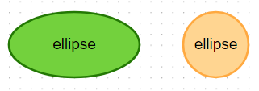
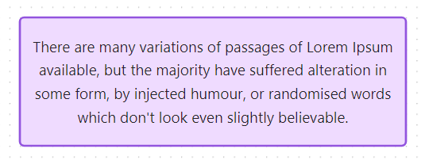
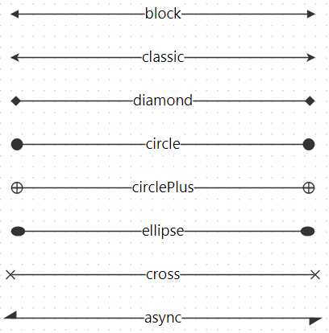
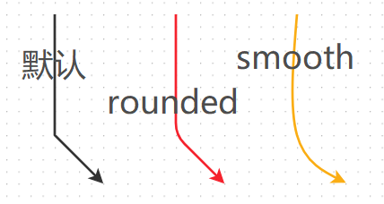

# 说明

适合画连线的图,并能做一些复杂操作

例如:

markupConfig,就是配置里的markupConfig

attrsConfig,就是配置里的attrsConfig

依次类推

# 下载与注意事项

`npm install @antv/x6 --save`

[https://x6.antv.antgroup.com/zh/examples/layout/tree/#mindmap](https://x6.antv.antgroup.com/zh/examples/layout/tree/#mindmap)

# 初始化

```javascript
import { Graph } from '@antv/x6'
const container = document.getElementById('container');
const clientRect = container.getBoundingClientRect();
const width = clientRect.width || 1200;
const height = clientRect.height || 500;
const graph = new Graph({
    width,height,container,
    ...config
})
```

# 配置

基本上,不需要args参数时,都可以简写

## config

| 选项                                                                    | 类型                | 描述                                                                                                                                                                                                              | 示例                                                                                                                                                                                                                                                        |
| --------------------------------------------------------------------- | ----------------- | --------------------------------------------------------------------------------------------------------------------------------------------------------------------------------------------------------------- | --------------------------------------------------------------------------------------------------------------------------------------------------------------------------------------------------------------------------------------------------------- |
| width/height                                                          | string            | 宽/高                                                                                                                                                                                                             |                                                                                                                                                                                                                                                           |
| container                                                             | DOM/string        | 挂载的元素或它的id                                                                                                                                                                                                      |                                                                                                                                                                                                                                                           |
| virtual                                                               | boolean           | 是否只渲染可视区域内容                                                                                                                                                                                                     |                                                                                                                                                                                                                                                           |
| async                                                                 | boolean           | 是否启用异步渲染                                                                                                                                                                                                        |                                                                                                                                                                                                                                                           |
| autoresize                                                            | boolean           | 是否监听容器大小                                                                                                                                                                                                        |                                                                                                                                                                                                                                                           |
| [grid](https://x6.antv.antgroup.com/api/graph/grid)                   | boolean\|\|Object | 背景网格的配置                                                                                                                                                                                                         | `grid:true`                                                                                                                                                                                                                                               |
| [background](https://x6.antv.antgroup.com/api/graph/background)       | Object            | 配置背景                                                                                                                                                                                                            |                                                                                                                                                                                                                                                           |
| [panning](https://x6.antv.antgroup.com/api/graph/panning)             | boolean\|\|Object | 画布是否可拖拽平移                                                                                                                                                                                                       | `panning:true`                                                                                                                                                                                                                                            |
| [mousewheel](https://x6.antv.antgroup.com/api/graph/mousewheel)       | boolean\|\|Object | 画布是否可缩放 (ctrl 加滚轮)                                                                                                                                                                                              |                                                                                                                                                                                                                                                           |
| [scaling](https://x6.antv.antgroup.com/api/graph/transform)           | Object            | 画布的最大最小缩放级别                                                                                                                                                                                                     |                                                                                                                                                                                                                                                           |
| [connecting](https://x6.antv.antgroup.com/api/model/interaction)      | Object            | 交互                                                                                                                                                                                                              | `connecting:connectingCfg`                                                                                                                                                                                                                                |
| [highlighting](https://x6.antv.antgroup.com/api/registry/highlighter) | Object            | 高亮器,支持以下配置项<br>1. `default` 默认高亮选项<br>2. `embedding` 拖动节点进行嵌入操作过程中，节点可以被嵌入时被使用。<br>3. `nodeAvailable` 连线过程中，节点可以被链接时被使用。<br>4. `magnetAvailable` 连线过程中，连接桩可以被链接时被使用。<br>5. `magnetAdsorbed` 连线过程中，自动吸附到连接桩时被使用。 | highlighting: {<br>  magnetAvailable: {<br>    name: 'stroke', // [边框高亮器](https://x6.antv.antgroup.com/api/registry/highlighter#stroke)<br>    name: 'classname' // [样式名高亮器](https://x6.antv.antgroup.com/api/registry/highlighter#classname)<br>  }<br>} |


### connectingCfg

[交互](https://x6.antv.antgroup.com/api/model/interaction)

| 配置项                                                                         | 类型                                | 描述                                                            | 示例                                                                                                                                                                                                                                                           |
| --------------------------------------------------------------------------- | --------------------------------- | ------------------------------------------------------------- | ------------------------------------------------------------------------------------------------------------------------------------------------------------------------------------------------------------------------------------------------------------ |
| [snap](https://x6.antv.antgroup.com/api/model/interaction#snap)             | boolean\|\|string                 | 是否开启自动吸附,<br>触发吸附距离 50px。<br>可通过配置 radius 自定义吸附半径。            | snap: {<br>  radius: 50,<br>},                                                                                                                                                                                                                               |
| allowBlank<br>/ Loop<br>/ Node<br>/ Port<br>/ Multi                         | boolean\|\|(Graph, args)=>boolean | 是否允许指向画板<br>/指向自身<br>/指向节点<br>/指向连接桩<br>/创建多条边                |                                                                                                                                                                                                                                                              |
| highlight                                                                   | boolean                           | 拖动边时，是否高亮所有可用连接桩或节点                                           |                                                                                                                                                                                                                                                              |
| router                                                                      | string/object                     | 边的路径点<br>vertices 做进一步转换处理，<br>并在必要时添加额外的路径点                  | router:{<br>    args:{},<br>    name:'normal',       //默认路由<br>    //{name:'er',        //实体关系路由,Z字形<br>    //name:'orth',       //正交路由<br>    //name:'oneSide'',   //受限正交路由<br>    //name:'manhattan'', //智能正交路由<br>    //name:'metro'',     //智能地铁线路由<br>} |
| createEdge                                                                  | (Graph,args)=>Nilable<Edge>       | 通过该方法自定义新建边的样式                                                |                                                                                                                                                                                                                                                              |
| connector                                                                   | string/object                     | 连接器                                                           |                                                                                                                                                                                                                                                              |
| validateEdge                                                                | (Graph,args)=>boolean             | 当停止拖动边时校验这个边是否有效,<br>false则会删除这条边                             |                                                                                                                                                                                                                                                              |
| validateMagnet                                                              | (Graph,args)=>boolean             | 校验哪些元素可作为磁力点(magnet),                                         |                                                                                                                                                                                                                                                              |
| validateConnection                                                          | (Graph,args)=>boolean             | 校验哪些元素可被连接                                                    |                                                                                                                                                                                                                                                              |
| [anchor](https://x6.antv.antgroup.com/api/model/interaction#anchor)         | Object/String                     | [节点锚点](https://x6.antv.antgroup.com/api/registry/node-anchor) |                                                                                                                                                                                                                                                              |
| [edgeAnchor](https://x6.antv.antgroup.com/api/model/interaction#edgeanchor) | Object/String                     | [边锚点](https://x6.antv.antgroup.com/api/registry/edge-anchor)  |                                                                                                                                                                                                                                                              |
| source/targetEdgeAnchor                                                     | EdgeAnchorOptions                 | 当连接到边时，起点/终点 边的锚点                                             |                                                                                                                                                                                                                                                              |
| targetAnchor                                                                | NodeAnchorOptions                 | 当连接到节点时，                                                      |                                                                                                                                                                                                                                                              |
| [组合](https://x6.antv.antgroup.com/api/model/interaction#%E7%BB%84%E5%90%88) |                                   |                                                               |                                                                                                                                                                                                                                                              |


## elementCfg

元素配置项

基本上,不需要args参数时,都可以简写

| 选项            | 类型                              | 描述                                                                  | 示例                    |
| ------------- | ------------------------------- | ------------------------------------------------------------------- | --------------------- |
| id            | string                          | 节点/边的唯一标识，<br>推荐使用具备业务意义的 ID，<br>默认使用自动生成的 UUID。                    |                       |
| zIndex        | Number                          | 层级,一般用来设置边,<br>防止边遮挡节点                                              |                       |
| markup        | Markup                          | 节点/边的 SVG/HTML 片段。                                                  | markup:markupConfig   |
| attrs         | Attr.CellAttrs                  | 节点/边属性样式。                                                           | attrs:attrsConfig     |
| shape         | string                          | 元素类型<br>节点默认值为rect，<br>边对应的默认值为edge                                 |                       |
| tools         | ToolItem \| ToolItem[] \| Tools | 工具选项。                                                               | Tools                 |
| data          | any                             | 节点/边关联的业务数据。<br>**用来存储与配置无关的数据,<br>通过cell.getData()获取节点/边关联的业务数据。** |                       |
| x/y           | number                          | 节点的定位                                                               | x:120,y:10            |
| label         | string                          | 节点的文本                                                               |                       |
| component     |                                 | 使用组件                                                                | component:MyComponent |
|               |                                 |                                                                     |                       |
| angle         | number                          | 节点的旋转角度。                                                            |                       |
| ports         | object                          | 连接桩。                                                                | 见节点/连接桩               |
|               |                                 |                                                                     |                       |
| source/target | TerminalData                    | 起点/终点 连接的节点id以及连接桩/锚点信息。                                            | target: {             |
| vertices      | Point.PointLike[]               | 路径点。                                                                | vertices: [           |
| router        | RouterData                      | 路由。                                                                 | router:{              |
| connector     | ConnectorData                   | 连接器。如何连接路径点                                                         | connector:{           |
|               |                                 |                                                                     |                       |
| zIndex        | number                          | 节点/边在画布中的层级，默认根据节点/边添加顺序自动确定。                                       |                       |
| visible       | boolean                         | 节点/边是否可见。                                                           |                       |
| parent        | string                          | 父节点。                                                                |                       |
| children      | string[]                        | 子节点/边。                                                              |                       |


### 节点类型

rect


ellipse



text-block



image


## markupConfig

自定义这个东西添加的元素

| 配置项 | 描述 | 类型 | 常见配置示例 | 
| -- | -- | -- | -- |
| tagName | 对应元素类型(与节点类型一致) |   | tagName:'rect', | 
| selector | 当前元素的唯一选择器, |   | selector:'body', | 
| groupSelector | 群组选择器, |   | groupSelector: 'line', | 
| textContent | text类型的元素显示的文字 |   |   | 
| children | 子元素 |   | children:[与父元素一样的配置] | 
|   |   |   |   | 


## attrsConfig

```javascript
//attrs通过指定选择器为元素修改样式
const attrsConfig= {
    body: tagCfg,
    label:tagCfg
    //选择器:tagCfg
}
```

### tagCfg

| 名称 | 类型 | 备注 | 示例 | 
| -- | -- | -- | -- |
|  x/y | Number | 向x/y轴平移多少像素 |  | 
| fill | String | 填充颜色 |   | 
| stroke | String | 边的颜色 |   | 
| strokeWidth | Number | 边的粗细 |   | 
| opacity | Number | 透明度 |   | 
| fontSize | Number | 字体大小 |   | 
| fontFamily | String | 字体 |   | 
| cursor | String | 同css cursor |   | 
| textAnchor | String | 文本基于其锚点的水平对齐方式,值:start,middle(默认),end |   | 
| textVerticalAnchor | String | 文本基于其锚点的垂直对齐方式,值:top,middle(默认),bottom |   | 
| ref | String | 指定 | ref | 
|   | String | 向x/y轴平移的百分比或偏移量 |  refX | 
| refX2/Y2 | String | 通过 | refX | 
| refDx/Dy | String | 设置元素坐标为相对于 |   | 
| refRx/y | String | 椭圆半径 | refRy | 
| refCx/y | String | 椭圆圆心 | refCx | 
| refWidth/Height | String | 宽高为 | refWidth | 
| refWidth2/Height2 | String | 同 | refWidth | 
| source/targetMarker( | String|Object | 边的 |   | 


#### 箭头类型



# tools

直接写在元素的tools配置项上

或者通过 元素.addTools(config)添加

| 工具类型 | 描述 | 
| -- | -- |
|   | 渲染一个包围元素的矩形。注意，该工具仅仅渲染一个矩形，不带任何交互。 | 
|   | 在指定位置处渲染一个按钮，支持自定义按钮的点击交互。 | 
|   | 在指定的位置处，渲染一个删除按钮，点击时删除对应的元素 | 
| (节点特有) | 提供文本编辑功能。 | 
| (边特有) | 提供文本编辑功能。 | 
| (边特有) | 路径点工具，在路径点位置渲染一个小圆点，拖动小圆点修改路径点位置，双击小圆点删除路径点，在边上单击添加路径点。 | 
| (边特有)  | 线段工具。在边的每条线段的中心渲染一个工具条，可以拖动工具条调整线段两端的路径点的位置。 | 
| (边特有)  | 在边的起点或终点渲染一个图形(默认是箭头)，拖动该图形来修改边的起点或终点。 | 


## 使用

```javascript
const tools = [{
  name: 'button', //工具类型
  args: {
    // tools直接在markup中定义元素的样式,格式为[{...,attrs:{样式配置}}]
    markup: [{...markupConfig[0],attrs: arrsConfig.body}],
    x: '100%',y: '100%',
    offset: { x: -20, y: -20 },
    onClick({ cell }: { cell: Cell }) {}, //cell对应点击的节点
  },
}]

// 创建元素时添加小工具
graph.addNode/Edge({ 
    ...,
    tools
})


//判断是否有某个别名的工具
node/edge.hasTools(别名)
// 创建元素后添加小工具
node/edge.addTools(tools,别名)
//移除所有工具
node/edge.removeTools();
```

## 鼠标悬浮添加工具,离开移除

```javascript
graph.on('edge:mouseenter', ({ cell }) => {
  cell.addTools(
    [
      'vertices',        //转折点工具
      'segments',        //调整边工具
      'button-remove',   //移除按钮
      {
        name: 'target-arrowhead',
        args: {
          attrs: {
            fill: 'red'
          }
        }
      }
    ],
    'onhover'
  );
});

graph.on('edge:mouseleave', ({ cell }) => {
  if (cell.hasTools('onhover')) {
    cell.removeTools();
  }
});
```

## 自定义

```javascript
//在原有工具基础上,进行修改
const MyButton = Button.define<Button.Options>()
Graph.registerNodeTool('my-btn', MyButton, true)

//自己实现一个,特别难,搞不了
Graph.registerNodeTool('button', Button)
```

# 方法

## 原生方法

| 方法名 | 说明 | 
| -- | -- |
| graph.getNodes/Edges/Ports() | 获取所有节点/边/连接桩 | 
| graph.addNode/Edge/Port(config) | 添加节点/边/连接桩 | 
| graph.use(plugin) | 使用插件 | 
| graph | resize画布大小 | 
| graph. | 将画布中元素居中展示 | 
| graph | 将画布中的元素自适应到刚好放下 | 
| graph.getNeighbors(cell, | 获取节点相邻的节点,incoming是输入节点,outgoing是输出节点 | 
| graph.getPredecessors/Successors(cell) | 获取节点的所有前序/后续节点, | 
| graph.is | 判断cell2是不是cell的相邻/前序/后续节点 | 
| graph.getConnectedEdges(node,  | 获取节点所连接的边,incoming是输入边,outgoing是输出边 | 
| node.removePort/Edge(Id) | 删除连接桩/边 | 
| node.removePorts/Edges() | 删除所有连接桩/边 | 
| node.portProp(portId, 'attrs/circle/stroke', color) | 更新连接桩 | 
| cell.prop('size', { width: 120, height: 50 }) | 修改元素的配置,这里是修改节点size | 
| cell.prop(path) | 获取元素的配置,没有path就是获取所有的配置 | 
| cell.attr('rect/fill', '#ccc') | 修改元素的属性,这里是修改节点填充色，等价于 cell.prop('attrs/rect/fill', '#ccc') | 
| graph.to/fromJSON() | 导出/导入数据 | 


## 依赖keybord的方法

| 方法名 | 说明 | 
| -- | -- |
| graph.bindKey(key,callback) | 添加快捷键 | 
| graph.unbindKey(key) | 解绑快捷键 | 
| graph.clearKeys() | 解绑所有快捷键 | 


## 依赖history的方法

| 方法名 | 说明 | 
| -- | -- |
| graph.toggleHistory(boolean) | 启用/禁用history功能 | 
| graph.canUndo/Redo() | 获取是否可以撤销/恢复 | 
| graph.undo/redo() | 撤销/恢复 | 


# 鼠标事件

> 需要注意的是，这里的 mousemove 事件和通常的鼠标移动事件有所区别，它需要在鼠标按下后移动鼠标才能触发。


除了 

| 事件 | cell 节点/node 节点/port 连接桩/edge 边/边blank 画布空白区域 | 
| -- | -- |
| 单击 | cell | 
| 双击 | cell | 
| 右键 | cell | 
| 鼠标按下 | cell | 
| 移动鼠标 | cell | 
| 鼠标抬起 | cell | 
| 鼠标滚轮 | cell | 
| 鼠标进入 | cell | 
| 鼠标离开 | cell | 


```javascript
graph.on('cell:click', ({ e, x, y, cell, view }) => {})
graph.on('node:click', ({ e, x, y, node, view }) => {})
graph.on('edge:click', ({ e, x, y, edge, view }) => {})
graph.on('blank:click', ({ e, x, y }) => {})
graph.on('cell:mouseenter', ({ e, cell, view }) => {})
graph.on('node:mouseenter', ({ e, node, view }) => {})
graph.on('edge:mouseenter', ({ e, edge, view }) => {})
graph.on('graph:mouseenter', ({ e }) => {})
```

# 插件

## Keyboard&History&Clipboard&Selection

[Keyboard](https://x6.antv.antgroup.com/tutorial/plugins/keyboard)

[History](https://x6.antv.antgroup.com/tutorial/plugins/history)

[Clipboard](https://x6.antv.antgroup.com/tutorial/plugins/clipboard)

[Selection](https://x6.antv.antgroup.com/tutorial/plugins/selection)

```javascript
//用于快捷键
import { Keyboard } from '@antv/x6-plugin-keyboard'
//启用历史操作
import { History } from '@antv/x6-plugin-history'
//启用粘贴板
import { Clipboard } from '@antv/x6-plugin-clipboard'
//启用框选器
import { Selection } from '@antv/x6-plugin-selection'
import { Graph } from '@antv/x6'

new Graph(config)
  .use(new Selection())
  .use(new Keyboard())
  .use(new Clipboard())
  .use(new History())

// 快捷键与事件
//#region 复制粘贴 需要Clipboard插件
graph.bindKey(['meta+c', 'ctrl+c'], () => {
  const cells = graph.getSelectedCells()
  if (cells.length)graph.copy(cells)
  return false
})
graph.bindKey(['meta+x', 'ctrl+x'], () => {
  const cells = graph.getSelectedCells()
  if (cells.length) graph.cut(cells)
  return false
})
graph.bindKey(['meta+v', 'ctrl+v'], () => {
  if (!graph.isClipboardEmpty()) {
    const cells = graph.paste({ offset: 32 })
    graph.cleanSelection() //清除选中
    graph.select(cells)    //选中哪些元素
  }
  return false
})
//#endregin

//#region 撤销恢复  需要History插件
// undo撤销
graph.bindKey(['meta+z', 'ctrl+z'], () => {
  if (graph.canUndo())graph.undo()
  return false
})
// redo恢复
graph.bindKey(['meta+shift+z', 'ctrl+shift+z'], () => {
  if (graph.canRedo())graph.redo()
  return false
})
//#endregion


// 全选 需要Selection插件
graph.bindKey(['meta+a', 'ctrl+a'], () => {
  const nodes = graph.getNodes()
  if (nodes)graph.select(nodes)
})

// 删除
graph.bindKey('backspace', () => {
  const cells = graph.getSelectedCells()
  if (cells.length)graph.removeCells(cells)
})

// zoom
graph.bindKey(['ctrl+1', 'meta+1'], () => {
  const zoom = graph.zoom()
  if (zoom < 1.5)graph.zoom(0.1)
})
graph.bindKey(['ctrl+2', 'meta+2'], () => {
  const zoom = graph.zoom()
  if (zoom > 0.5)graph.zoom(-0.1)
})
```

## Transform&Snapline&MiniMap&Export

[Transform](https://x6.antv.antgroup.com/tutorial/plugins/transform)

[Snapline](https://x6.antv.antgroup.com/tutorial/plugins/snapline)

[MiniMap](https://x6.antv.antgroup.com/tutorial/plugins/minimap)

[Export](https://x6.antv.antgroup.com/tutorial/plugins/export)

```javascript
//可用于改变节点大小,旋转节点等
import { Transform } from '@antv/x6-plugin-transform'
//对齐线
import { Snapline } from '@antv/x6-plugin-snapline'
//缩略图
import { MiniMap } from '@antv/x6-plugin-minimap'
//导出画布
import { Export } from '@antv/x6-plugin-export'
import { Graph } from '@antv/x6'
const graph = new Graph({
  background: {
    color: '#F2F7FA',
  },
})
graph
  .use(
    new MiniMap({
      container: document.getElementById('minimap'),
    }),
  )
  .use(new Export())
  .use(new Snapline())
  .use(
    new Transform({
      resizing: true,
      rotating: true,
    }),
  )
```

## Stencil

[Stencil](https://x6.antv.antgroup.com/tutorial/plugins/stencil)

```javascript
//用于启动那种拖拽添加节点的菜单
import { Stencil } from '@antv/x6-plugin-stencil'


// #region 初始化 stencil
const stencil = new Stencil({
  title: '流程图',
  target: graph,
  stencilGraphWidth: 200,
  stencilGraphHeight: 180,
  collapsable: true,
  groups: [{
      title: '基础流程图',
      name: 'group1'
  }]
})
document.getElementById('stencil')!.appendChild(stencil.container)
// #endregion

//注册一堆节点,假设是r1,...r6
//加载节点到group1分组
stencil.load([r1, r2, r3, r4, r5, r6], 'group1')
```

# 节点

## 注册节点

```javascript
graph.addNode(elementConfig)
```

## 自定义节点

```javascript
import React from 'react'
import { Graph } from '@antv/x6'
//import { register } from '@antv/x6-vue-shape';
import { register } from '@antv/x6-react-shape'

//react组件
const MyComponent = ({ node }) => {
  const color = node.prop('color')
  return (<div style={{ background: color}} />)
}

//vue组件
const myVueComponent={
    template:'<div>测试</div>',
    inject:['getNode'] //通过getNode方法获取节点实例,再去获取节点的信息
    mounted(){
        const node = this.getNode();
        //监听节点的data改变
        node.on('change:data', ({ current }) => {
          this.data = current;
        });  
    },
    created() {
      this.data = this.getNode().getData();
    }
}}

//注册一个节点类型
register({
  shape: 'custom-node',
  width: 120,height: 50,
  effect: ['color'],
  component: MyComponent,
})
const graph = new Graph({ container: document.getElementById('container')})
//使用该自定义类型添加节点
const source = graph.addNode({
  x: 120, y: 50,
  shape: 'custom-node',
})
```

## 连接桩

默认/自定义/自定义复用

```javascript
//1. 默认样式 连接桩默认为circle,这里仅展示⚪的连接桩
const defaultPort={ id: 'port1' }

//2. 自定义连接桩样式
const portConfig={
  id: 'port2', //连接桩id
  //如果不想用⚪的,需要markup指定用哪些元素绘制连接桩,markup具体解释看节点
  markup: markupConfig,
  attrs: attrsConfig
}
//将具有相同行为和外观的连接桩归为同一组，并通过 group 选项来设置分组
//3. 使用group将自定义样式分组,方便复用
const groupPortConfig={
    groups: {group1: portConfig},
    items: [
      { id: 'port1', group: 'group1' },
      { id: 'port2', group: 'group1' },
    ]
}
const rect = graph.addNode({
  ...,
  //ports: [defaultPort,portConfig],
  ports: groupPortConfig,
})
//元素.addProt(config)/removePort(portId/port)
rect.addPort(portConfig)
```

## 悬浮显示/移开隐藏

```javascript
register({
  shape: 'custom-node',
  width: 25,
  height: 25,
  effect: ['color'],
  component: node,
  ports: {
    groups: {
      top: {
        position: 'top',
        attrs: {
          circle: {
            r: 4,
            magnet: true,
            style: {
              visibility: 'hidden'
            }
          }
        }
      },
    },
    items: [
      { id: 'port1', group: 'top' },
    ]
  }
});

graph.on('node:mouseenter', ({ cell }) => {
  cell.getPorts().forEach(port => {
    cell.setPortProp(port.id, 'attrs/circle/style/visibility', 'visable');
  });
});
graph.on('node:mouseleave', ({ cell }) => {
  cell.getPorts().forEach(port => {
    cell.setPortProp(port.id, 'attrs/circle/style/visibility', 'hidden');
  });
});
```

# 边(连接线)

路由(router):[https://x6.antv.antgroup.com/api/registry/router](https://x6.antv.antgroup.com/api/registry/router)

连接器(connector):[https://x6.antv.antgroup.com/api/registry/connector#jumpover](https://x6.antv.antgroup.com/api/registry/connector#jumpover)

边工具:[https://x6.antv.antgroup.com/api/registry/edge-tool](https://x6.antv.antgroup.com/api/registry/edge-tool)

高亮器:[https://x6.antv.antgroup.com/api/registry/highlighter](https://x6.antv.antgroup.com/api/registry/highlighter)



## 注册边

```javascript
graph.addEdge({
  //source为边的起点,target为终点
  source: { x: 40, y: 150 },
  target: {
    cell: rect, //cell对应元素,这里是连接到矩形
    port: 'port2', // 连接桩 ID,每个元素一圈的小点,为连接桩
  },
  //连接器类型，定义边如何连接起始点、目标点和中间顶点
      //rounded 圆角
      //smooth 用于 单条的平滑曲线
  connector:{name:'rounded'},
  //定义一些固定的转折点,不受router影响
  vertices: [{ x: 240, y: 140 }],
  //路由,自动计算边的转折点, manhattan 智能路由,会避开node
  router :{name: 'manhattan'},
  //边的连接器类型
  attrs: attrConfig,
})
```

# 布局

## dagre层次布局

```javascript
import { DagreLayout } from '@antv/layout'
const dagreLayout = new DagreLayout({
  type: 'dagre',
  rankdir: 'LR',
  align: 'UR',
  ranksepFunc:(e)=> 35, //层次间距
  nodesepFunc:(e)=> 15, //节点间距
})
const model = dagreLayout.layout(data)
graph.fromJSON(model)
```