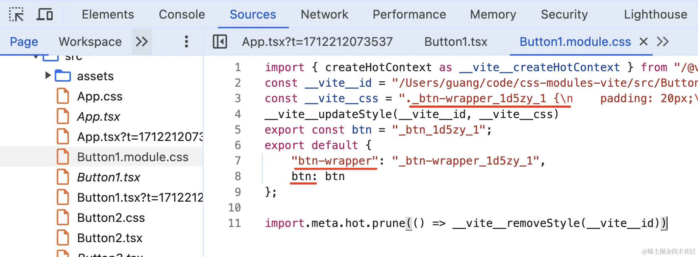

# tailwind

将样式粒子化,变成一个个类名,并在打包后只会保留使用的类名,其余会被摇掉

`npm install -D tailwindcss postcss autoprefixer`

`npx tailwindcss init -p`

## 常用示例


首先要在主文件的.css文件中声明:
```js
-->1.tailwind.config.js中声明生效范围,主题,插件
	/** @type {import('tailwindcss').Config} */
	 module.exports = {
	   //生效的范围
	   content: ["./src/**/*.{vue}"],
	   //主题
	   theme: {
		 //修改tailwind内置的css类
		 ...
	     extend: {
		     //扩展一些类
		     ...
	     },
	   },
	   //插件
	   plugins: [],
	 }

-->2.tailwind.scss中声明引用的样式类型,并通过@layer和@apply扩展一些实用class
	/*基础样式*/  
	@tailwind base;  
	/*组件样式*/  
	@tailwind components;  
	/*实用程序样式*/  
	@tailwind utilities;

	@layer base {  
	//  .your-custom-class {  
	//    @apply ...;
	//  }
	}  
	
	@layer components {  
	//  .your-custom-class {  
	//    @apply ...;
	//  }
	}  
	
	@layer utilities {  
	//  .your-custom-class {  
	//    @apply ...;
	//  }
	}

-->3.vite项目https://www.tailwindcss.cn/docs/guides/vite
	-->1.下载依赖并初始化后直接run dev就行,vite会自动引入postcss.config.js
		npm install -D tailwindcss postcss autoprefixer
		npx tailwindcss init -p

	-->2.base.scss中引入tailwind.scss,同时写一些公共的样式
	     @import "tailwind.css";
	 
	-->3.vite.config.js中引入插件,tailwindcss本身也作为一个postcss插件
		export default defineConfig({
			..., 
			css:{  
			postcss:{  
			  plugins: [tailwindcss, autoprefixer()]  
			}  
		}

-->3.非vite的普通项目

	-->1.下载tailwind并初始化
		npm install -D tailwindcss
		npx tailwindcss init
	
	-->2.base.scss中引入tailwind.scss,同时写一些公共的样式
	     @import "tailwind.css";
	
	-->3.监听使用,动态生成main.css
		npx tailwindcss -i ./src/assets/styles/base.scss -o ./src/assets/styles/main.css --watch 
	
	-->4.main.js中引入main.css
		import './assets/styles/main.css'
		import {createApp} from 'vue'  
		import App from './App.vue'
		createApp(App).mount('#app')
```

use
```css
.aaa {
    background: red;
    font-size: 14px;
}
.aaa:hover {
    font-size: 30px;
}
@media(min-width:768px) {
    .aaa {
        background: blue;
    }
}

//等同于
<div class="text-[14px] bg-red-500 hover:text-[30px] md:bg-blue-500"></div>
```
## 定制化配置内容
### @layer扩展&@apply复用扩展一些css类
```css
/*tailwind.css*/
@tailwind base;       //基础样式
@tailwind components; //组件样式
@tailwind utilities;  //实用程序样式

/*扩展components样式*/
@layer components{
    .hover-and-other{
        //@apply用于允许你应用Tailwind CSS中现有的样式值
        @apply hover:bg-blue-700 focus:outline-none first:pt-0 last:pb-0;
    }
    .font-style{
	    @apply py-2 px-4 font-semibold rounded-lg shadow-md;
    }
}
```

### 自定义插件扩展css类

主要用于多项目复用

```javascript
//.guang.plugin
const plugin = require('tailwindcss/plugin');

module.exports = plugin(function({ addUtilities }) {
    addUtilities({
        '.guang': {
            background: 'blue',
            color: 'yellow'
        },
        '.guangguang': {
            'font-size': '70px'
        }
    })
})
```

### 添加 prefix 避免和自定义 class 重名

```javascript
//tailwind.config.js

/*@type {import('tailwindcss').Config}**/
module.exports ={
    ...,
    //添加 prefix,但是所有的原子 class 都会加上 prefix,
    //因此使用时也需要加上
    prefix:'wl-',
}
```

### 修改默认主题

```javascript
//tailwind.config.js

/*@type {import('tailwindcss').Config}**/
module.exports ={
    //指定需要应用tailwind css类名的文件所在路径
    content:["./src/*/*.{js,jsx,vue}","./components/**/*.{html,js}"],
    //引入上面的自定义插件
    plugins:[require('./guang.plugin')],
    theme:{
	    screens:{sm: '480px',},
	    colors:{'blue': '#1fb6ff',gray: { 100: '#f7fafc'}},
	    fontFamily:{sans: ['Graphik', 'sans-serif'],},
	    fontSizes: {'xs': '.75rem',},
	    spacing:{0: '0',},
	    borderColor: (theme) => ({  
	      ...theme('colors') // 你可以在这里添加额外的边框颜色  
	    }),
	    ... //其他主题配置
		// 扩展设置
        extend:{
            padding:{
                '1':'30px'   
            },
            fontSize:{
                'base':['30px','2rem']
            }
            screens:{
                'md':'300px    
            }        
        }
    }
}
```
### 动态主题切换

```js
//tailwind默认支持暗黑主题切换
	//1.在html/body上写一个属性用于控制主题
		<body data-theme="dark" />
		
	//2.定义tailwind.config.ts
		module.exports = {
			//当某个元素上具有data-mode="dark"属性时,该元素及其子孙元素会应用暗黑主题
			darkMode: ['selector', '[data-mode="dark"]'],
			...
		} 
		
	// 3.定义主题切换函数,用于切换主题
		export const changeTheme = (theme: string) => {
			document.body.setAttribute('data-mode', theme);
		};

// 通过自定义变量手动实现
	// 1.在html写一个属性用于控制主题
		<html data-theme="dark" />
		
	// 2.定义各主题下自定义变量的值
		//../theme1.css
		html[data-theme="theme1"] {
			--color-primary: #f98866;
			--color-secondary: #80bd9e;
			--color-buttons: #89da59;
			--color-typography: #ff320e;
		}
		
		
		// ../theme2.css
		html[data-theme="theme2"] {
			--color-primary: #f4cc70;
			--color-secondary: #6ab187;
			--color-buttons: #de7a22;
			--color-typography: #20948b;
		}
	
	// 3.在主样式文件中引入主题文件与tailwind
		// ../style/main.css
		@tailwind base;
		@tailwind components;
		@tailwind utilities;
		
		@layer base {
			html { //默认主题
				--color-primary: #4285f4;
				--color-secondary: #34a853;
				--color-buttons: #fbbc05;
				--color-typography: #ea4335;
			}
			@import "themes/theme1.css";
			@import "themes/theme2.css";
		}
	
	// 4.设置tailwind,以使用这些css变量
			// tailwind.config.ts
			module.exports = {
			    content: [
			      './src/view/**/*.{js,ts,jsx,tsx,vue}',
			    ],
			    theme: {
			      extend: {
			        colors: {
			          primary: 'var(--color-primary)',
			          secondary: 'var(--color-secondary)',
			          buttons: 'var(--color-buttons)',
			          typography: 'var(--color-typography)',
			        },
			      },
			    },
			    plugins: [],
		  };
	
	// 5.定义主题切换函数,用于切换主题
		// ../theme/main.ts
		export const changeTheme = (theme: string) => {
		  document.body?.setAttribute("data-theme", theme);
		};

```
# css Modules
基于[postcss-modules](https://link.juejin.cn/?target=https%3A%2F%2Fgithub.com%2Fmadyankin%2Fpostcss-modules "https://github.com/madyankin/postcss-modules")
1. Module.Css (module 是一种约定, 表示需要开启 css 模块化).
2. 他会将你的所有类名进行一定规则的替换 (将`类名`改为 `类名_hash值`)
3. 同时创建一个映像对象并默认导出`export default{ 类名: 类名_hash值,... }`
4. 将替换过后的内容塞进 style 标签里然后放入到 head 标签中,
5. 将默认导出的映射对象路径替换`xxx.module.css`的路径,

例如:
```css
/*button.module.css*/
.btn-wrapper {
    padding: 20px;
}

.btn {
    background: blue;
}

```
css Modues会将`button.module.css`文件编译成这个样子



显而易见,它这样用:

```javascript
import styles from './Button1.module.css';
export default function() {
    return <div className={styles['btn-wrapper']}>
        <button className={styles.btn}>button1</button>
    </div>
}
```

# scss&sass
```js
sass就是scss去掉{}和;

//@forward 用于转发另一个模块的成员,@use 用于将外部sass以模块的形式导入
	//1.在'src/list.sass'中定义一些变量
		$color: blue;@mixin a{}
	//2.在'src/bootstrap.scss`中转发
		@forward "src/list";               //直接转发
		@forward "src/list" as list-*      //转发,并给所有成员添加`list-`前缀
		@forward "src/list" hide $color,a  //隐藏部分成员
		@forward "src/list" show $color    //仅展示部分成员
		@forwar "src/list" as list-* with( //转发添加前缀并覆盖部分变量
			$color:red !default,
		)
	//3.其他文件使用@use引入bootstrap模块
	@use "src/bootstrap" as bootstrap;  
	li {
		@include bootstrap.a;      //转发不添加前缀时 
		@include bootstrap.list-a; //转发添加前缀时
	}

//@mixin&@include
	@mixin button-style($padding, $background, $border: 1px solid #ccc) {  
	  padding: $padding;  
	  background-color: $background;  
	  border: $border;  
	} 
	.button-primary {  
	  @include button-style(10px, blue, 2px solid black);  
	}  

//占位符%与继承@extend
	//sass使用%定义占位符,占位符定义的css不会输出到css文件中,并可以使用@extend继承
		%button-style{  
			display: inline-block; 
		}
	
	//sass使用@extend继承某些样式,或占位符样式
	
		//继承占位符样式
			.button-primary {  
				@extend %button-style;
				background-color: red; 
			}
			//编译为
			.button-primary {  
				display: inline-block; 
				background-color: red; 
			}
	
		//继承css样式
			.button{
				color:red;
				&-color{
					@extend .button;
					width:100%
				}
			}
			//编译为
			.button,.button-color{
				color:red;
			}
			.button-color{
				width:100%
			}

//$变量名 定义变量,#{变量名} 插值,@each,@if,@else循环与条件判断
	//sass使用$符定义变量
		 $button:"button";
		 $red:red;
		 $list:(
			 button:'button',
			 primary:blue,
			 debug:$red,
		 );
	//@each遍历list,#{变量名使用变量}
		@each $name,$value in $list{
			.#{$name}:{
				@if($name != button){
					color:#{$value};
				}
				@else{
					color:gray;
				}
			}
		}
		//编译为
		.primary{
			color:blue;
		}
		.debug{
			color:red;
		}
		.button:{
			color:gray;
		}

//属性嵌套
	.funky {
	  font: 20px/24px {
	    family: fantasy;
	    weight: bold;
	  }
	  background{
		  color:black;
	  }
	}
	//编译为
	.funky {
		font: 20px/24px;
		font-family: fantasy;
		font-weight: bold;
		background-color:black;
	}

//&代表父选择器
	.a{
		&.b{}
	}
	//编译为
	.a.b{}

//@import 不建议使用 将外部样式以类css的方式导入,与css的区别是在编译阶段进行,不会产生多次请求
	@import 'variables';
```

# less

```js
//使用@定义变量
	@变量名

//混入无需定义,直接用css样式作为混入
	.a{
		color:red
	}
	.b{
		.a()
	}
```