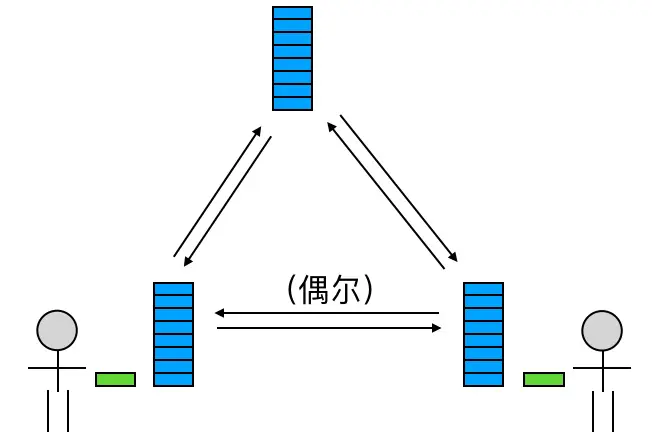
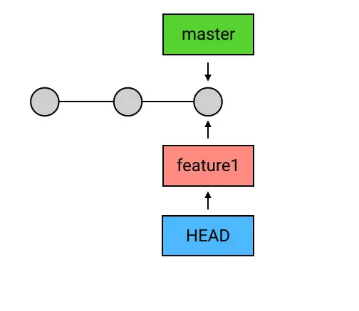
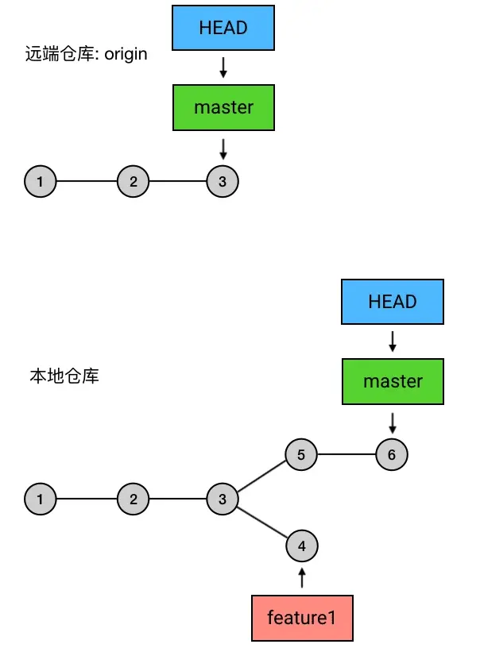
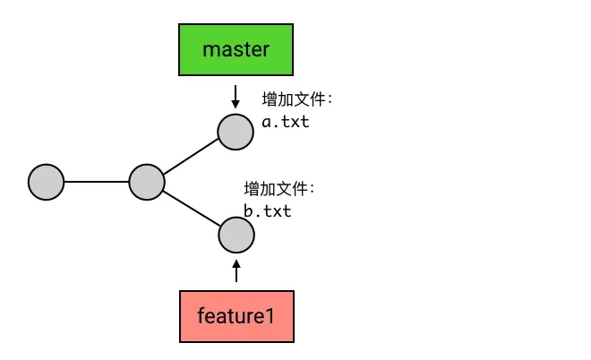
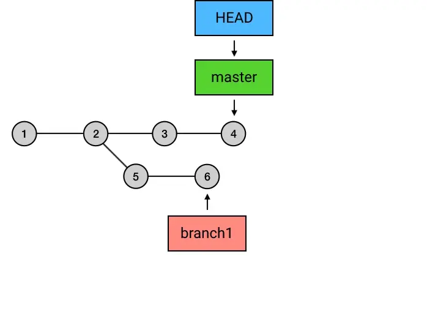

# git有什么特点

1. 主动提交

1. 分布式版本管理系统+中央仓库

分布式仓库工作模型:

1. 首先，你作为主工程师，独立搭建了项目架构，

**并把这些代码提交到了本地仓库**

1. 然后，你在服务器上创建了一个中央仓库，并把 1 中的提交

**从本地仓库推送到了服务器的中央仓库**

1. 其他同事

**把中央仓库的所有内容克隆到本地，拥有了各自的本地仓库**

1. 在之后的开发过程中，你们三人总是每人独立负责开发一个功能，在这个功能开发过程中，

**一个人会把它的每一步改动提交到本地仓库**

1. 在一个人把某个功能开发完成之后，他就可以把这个功能相关的所有提交

**从本地仓库推送到中央仓库**

1. 每次当有人把新的提交推送到中央仓库的时候，另外两个人就可以选择

**把这些提交同步到自己的机器上，并把它们和自己的本地代码合并**



## DVCS的本地仓库、与VCS本地的区别

DVCS 分布式版本控制系统 VCS 版本控制系统

DVCS本地仓库是带版本管理功能的，像可以离线做一些提交，回滚、查看历史、分支等操作，

而VCS的本地备份如脱离服务器则做不上面的这些操作

# 一套git操作合集

```
//新建远程仓库,勾选初始化项目
//现在有两个傻逼A B同时clone远程中央仓库作为自己本地仓库
git clone 仓库地址
git remote add 仓库地址别名 仓库地址
​
//现在要开发了
git checkout -b 版本分支
//开发代码中...,开发完毕
git status //查看代码状态红色的文件,即工作区操作了哪些文件
git add -A  //将修改的代码以及新增删除的文件都提交到暂存区 .是提交修改的代码和新增的文件 -u是修改的代码和删除的文件
git status //查看绿色的文件
git commit -m '提交信息'
//发现有问题想改,改完后
git commit --amend -m '提交信息'  //刚提交的代码有问题
git reset --soft HEAD^ //从本地仓库回退到暂存区
git restore . //从暂存区回退到工作区
git revert 6位数的记录 //撤销指定提交
git rebase i 6位数的记录 //事做绝点,记录节点都干掉
//要合并代码
git merge B //将B和当前分支合并,作为新的节点
git checkout B
git rebase A //将B分支的所有提交合并到A分支链,并将最新代码合并为新节点
​
//突然有个紧急任务,开发不了辣
git stash //将代码提交到一个神奇的区域
//紧急任务搞完辣,切换回之前摸鱼分支
git stash pop //从神奇区域拿出来继续摸鱼
```

## 版本管理原理

git有一个特殊的引用HEAD,该引用默认情况下是指向主分支master的(也有可能是main)

当我们checkout -b 分支时,会将HEAD引用指向新分支

当我们commit时,HEAD会带上它的当前引用,共同指向新的commit

reset --hard实际上是修改HEAD引用

当一个提交记录不在有人引用时,这个记录将被删除,即不存在分支引用它,也不存在HEAD引用它



## git push 原理

git push 的本质就是将HEAD所引用的分支节点与最新引用同步到远程分支,

下图实例仅会将master分支的节点和最新引用更新,

注意,

```
git checkout master
git pull
```



## merge,pull,rebase原理

当我们将一个不属于当前分支的代码合并过来时,通常有三种操作:

1. git pull origin 远程分支

1. git merge 其他分支

1. git rebase master

### pull和merge原理

将另一个分支的代码连接到当前分支节点,并创建新节点存储该内容

**简单理解就是将其他分支代码合并到当前分支,并创建新节点存储**

```
git checkout master
git merge feature
```



### rebase原理

将基点挪到另外一个分支的最后一个节点,并将当前分支的所有节点挪到另外一个节点,并在最后一个节点合并代码

rebase就是变基,下图中,将 branch1的 基点从节点2挪到了4

导致5,6节点挪到了master分支的7,8,并将节点4的代码合并到了8

**简单理解就是将当前分支的所有记录合并到另外一个分支,并合并代码**

```
git checkout branch1
git rebase master
```

如果要使用git rebase i需要配置

```
git config --global --replace core.editor "code --wait"
//丢弃目标commit
git rebase -i 目标commit
```



# git命令

## 配置相关操作与初始化

| 命令名称 | 作用 | 
| -- | -- |
| git init | 仓库初始化 | 
| git config -l | 查看所有配置信息 | 
| git config 变量名 | 查看指定配置信息 | 
| git config --global user.name "你的用户名" | 配置用户名和邮箱 | 
| git config --global --edit | 修改配置信息 | 
| git config --global --unset 变量名 | 删除指定配置信息 | 


## 文件与文件夹相关操作与路径切换

| 命令名称 | 作用 | 
| -- | -- |
| cd 绝对路径 | 切换到指定绝对路径 | 
| ls | 查看当前文件夹下的所有文件 | 
| touch 文件1...文件n | 创建文件 | 
| cat 文件 | 查看文件内容 | 
| mkdir 文件夹1...文件夹n | 创建文件夹 | 
| rm 文件夹1 ..文件夹n -r | 删除工作区文件夹 | 
| rm 文件1 ..文件n | 删除工作区文件 | 


## 代码查看提交回退相关

| 命令名称 | 作用 | 
| -- | -- |
| git status | 查看当前状态 | 
| git restore | 回退至暂存区的状态 | 
| git add -u | 被修改(modified)和被删除(deleted)文件，不包括新文件(new)同步到暂存区 | 
| git add . | 新文件(new)和被修改(modified)文件，不包括被删除(deleted)文件同步到暂存区 | 
| git add -A | 将所有变化同步到暂存区,git add -u 和 git add . 的结合 | 
| git restore -A | 返回至暂存区的状态 | 
| git commit | 进入vim模式添加注释并添加到仓库(按i 编辑 按esc 退出编辑 输入:wq 退出vim模式) | 
| git commit -m 注释 | 为本次操作添加注释并添加到仓库 | 
| git ls-files | 查看所有本地仓库的文件 | 


## 代码推送拉取与别名

| 命令名称 | 作用 | 
| -- | -- |
| git remote -v | 查看当前所有远程地址别名 | 
| git remote add 别名 远程地址 | 起别名并建立与远程仓库的连接 | 
| git remote rm 别名 | 删除别名并断开与远程仓库的连接 | 
| git clone 远程地址 | 将远程仓库的内容克隆到本地( | 
| git pull | 将远程仓库的更新同步到本地 | 
| git pull 远程库地址别名 远程分支名 | 将远程仓库对于分支的更新同步到本地 | 
| git push -f | 提交本地代码到远程仓库并覆盖( | 
| git push -u 别名 分支 | 推送本地分支上的内容到远程仓库并添加关联(-u关联) | 
| git push 别名 --delete 分支名 | 删除远程分支但不删除本地分支(不能删除主分支) | 
|   |   | 


## 版本(就是提交记录)查看回退相关

| 命令名称 | 作用 | 
| -- | -- |
| git log | 查看当前版本以及之前的版本(提交日志) | 
| git reflog | 查看所有提交的历史记录(不只是当前分支的历史记录)。 | 
| git reset --hard 版本号 | 回退到指定版本号的版本,版本号可以只写前七位 | 
| git reset --hard HEAD^ | 回退到上一个版本,每多一个^就多退一个版本 | 
| git reset --hard HEAD~n | 回退到前n个 | 
| git reset --hard HEAD@{n} | 回退到前n个 | 
| git reset --hard 版本号 文件名 | 将指定文件回退到指定版本号(需要先进入该文件目录) | 


## 分支相关操作

| 命令名称 | 作用 | 
| -- | -- |
| git branch | 查看所有分支 | 
| git checkout 分支名 | 切换到指定分支 | 
| git checkout -b 分支名 | 创建新分支并切换到该分支 | 
| git merge 分支名1 ...分支名n | 合并分支 | 
| git branch -d 分支名1 ...分支名n | 删除分支 | 
| git checkout -b 本地分支名 origin/远程分支名 | 基于远程分支创建本地分支 | 


## 清屏和设置git默认编辑器

| 命令名称 | 作用 | 
| -- | -- |
| ctrl+l或clear | 清屏 | 
| git config --global core.editor vim | 将git的默认编辑器设置为vim | 


# 其他

## 配置忽略文件

### 仓库中没有提交该文件

创建一个文件【.gitignore】配置忽略，一般与.git目录同级，

常见情况有：

1. 临时文件

1. 多媒体文件、如音频、视频

1. 编辑器生成的配置文件（.idea）

1. npm安装的第三方模块

```
# 忽略 .swp文件(临时文件)  .mp4文件
.swp
.mp4
​
#忽略指定的文件 .idea
.idea
​
#忽略当前文件夹下的node_modules文件和文件夹
node_modules
```

### 仓库中已经提交该文件

办法1：【非常委婉型】

1. 对于已经加入到暂存区中的文件，可以在暂存区中删除该文件

```
git rm --cached 文件名
```

    2. 然后再.gitignore中配置忽略

```
*.mp4
```

    3. add和commit提交即可

办法2：【简单粗暴型】

    还可以直接将.git目录删掉，然后重新add和commit也可以，但是这样做风险太大，容易找不到之前的版本。

## 免密登录

1. 创建非对称加密对

```
//使用git终端在任意路径输入命令即可
ssh-keygen -t rsa -C '邮箱'

```

1. 文件默认存储在家目录（c:/用户/用户名/.ssh）的 .ssh 文件夹中。

- id_rsa 私钥

- id_rsa.pub 公钥

1. 将公钥（.pub）文件内容配置到账号的秘钥中

- 首页 -> 右上角头像-> settings -> SSH and GPG keys -> new SSH Key

1. 克隆代码时，选择 ssh 模式进行克隆 （地址 在仓库首页 绿色 克隆的位置 选择 use ssh）

```
git clone git@github.com/xiaohigh/team-repo-1.git 

```

5.

- -t

：指定生成密钥的类型，默认使用RSA类型密钥。

- -f

：指定生成密钥的文件名，默认

- -P

：提供旧密码，空表示不需要密码（

- -N

：提供新密码，空表示不需要密码(

- -C

：提供一个新注释，比如邮箱。