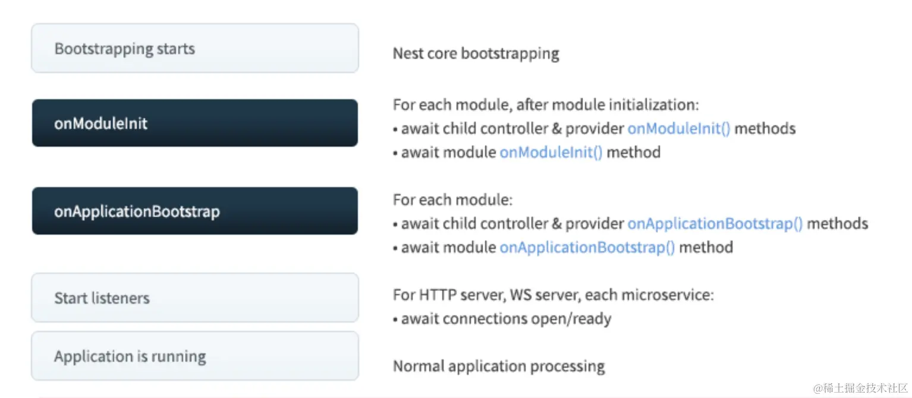

# 串一串

[https://juejin.cn/book/7226988578700525605/section/7237073777937350717](https://juejin.cn/book/7226988578700525605/section/7237073777937350717)

# IOC

## 是什么

在编程领域，IOC是Inversion of Control的缩写，即控制反转。这是一种面向对象编程的设计原则，主要用于降低计算机代码之间的耦合度。其核心思想是将原本由程序直接操控的对象的调用权交给第三方（如Spring这样的框架）来控制，以解耦代码，增加程序的可扩展性和可维护性。控制反转包括依赖注入（Dependency Injection，简称DI）和依赖查找（Dependency Lookup）等方式。

## 解决了什么痛点

后端系统中，会有很多对象：

- Controller 对象：接收 http 请求，调用 Service，返回响应

- Service 对象：实现业务逻辑

- Repository 对象：实现对数据库的增删改查

- DataSource对象: 实现数据库链接

- Config对象: 全局配置

- 等等

这些对象有着错综复杂的关系：

- Controller 依赖了 Service 实现业务逻辑，

- Service 依赖了 Repository 来做增删改查，

- Repository 依赖 DataSource 来建立连接，

- DataSource 又需要从 Config 对象拿到用户名密码等信息。

# 命令

```javascript
//nest g xxx xx命令,还可以设置以下常见选项
    //--no-flat 不创建子目录,生成的应用放在当前目录中
    //--spec    生成应用时顺便生成对应的测试文件
nest g resource other          //在当前目录下,创建子目录other,实现other的curd操作,包含Module,Controller,Service
nest g module other            //在当前目录下,创建子目录other,仅包含Module
nest g controller other        //在当前目录下,创建子目录other,仅包含Controller
nest g service other           //在当前目录下,创建子目录other,仅包含Service
nest g middleware other        //在当前目录下,创建子目录other,仅包含一个中间件
nest g guard other

npx @nestjs/cli new 项目名     //下载nest脚手架并创建项目,注意node版本调高点
nest new provider-test -p npm  //创建一个名为provider-test的nest项目,并指定包管理器为npm(默认就是npm)
nest start --debug             //启动nest项目,并开启调试模式,原理是基于node --inspect

//--inspect 是调试模式运行，而 --inspect-brk 还会在首行断住
node --inspect-brk index.js
```

# 生命周期

## 什么是组件

在 Nest.js 中，组件指应用程序中的各种可注入的对象，包括但不限于module、controller、provider等

## 启动阶段生命周期

**nest初始化阶段**

- **依赖解析和注入阶段**，nestJS首先扫描nest应用中定义的所有module，包括根模块和子模块，在扫描module时,会解析module中定义的组件和它们之间的依赖关系。例如，一个provider可能依赖于另一个provider，或者一个controller可能依赖于一个provider。**解析完毕后,nest会创建一个依赖注入容器(IOC)用来存取组件实例**

- 当一个模块准备初始化时(即将实例化)，Nest会按照这个模块所依赖组件的依赖关系，依次实例化这些组件并注入依赖注入容器中，然后依次调用所有实现了**onModuleInit**接口的组件的**onModuleInit**方法

- 当所有组件实例化完毕后，Nest会按照依赖注入容器中组件的顺序，依次调用所有实现了**onApplicationBootstrap**接口的组件的**onApplicationBootstrap**方法，这个方法一般情况下仅主模块(根模块)会写

- **然后监听网络端口。**

- **再然后nest应用正常运行。**

```javascript
import { Module, OnApplicationBootstrap } from '@nestjs/common';
@Module({
  // 模块的配置
})
export class AppModule implements OnModuleInit,OnApplicationBootstrap
{
    onModuleInit(){}
    onApplicationBootstrap(){}
}
```



## 销毁阶段生命周期

- 当一个模块被销毁时（通常是在应用程序关闭时），Nest会按照依赖注入容器中组件的销毁顺序，依次调用所有实现了 **OnModuleDestroy** 接口的组件的 **onModuleDestroy** 方法。

- 当模块销毁完毕后，nest应用即将关闭前，Nest会按照依赖注入容器中组件的销毁顺序，依次调用所有实现了 **beforeApplicationShutdown** 接口的组件的 **beforeApplicationShutdown** 方法，这个方法一般情况下仅主模块(根模块)会写。

- **停止所有服务**

- 服务停掉后，nest应用正式关闭，Nest会按照依赖注入容器中组件的销毁顺序，依次调用所有实现了 **oneApplicationShutdown** 接口的组件的 **oneApplicationShutdown** 方法，这个方法一般情况下仅主模块(根模块)会写。

- **退出这个模块的进程**

**一般都是通过 moduleRef 取出一些 provider 来销毁，比如关闭连接**，moduleRef 就是当前模块的引用

```javascript
import {moduleRef,NestFactory} from '@nestjs/core'
import {AppModule} from './app.module'

@Global()
@Module({})
export class MongooseCoreModule implements OnApplicationShutdown{    
    constructor(
        private readonly moduleRef:ModuleRef
    ){}
    async onApplicationShutdown(){
        const app = await NestFactory.create(this.moduleRef);  //创建当前模块的应用实例
        app.close()
    }
}
```


# 创建nest应用&切换到fastify

nest封装了[AbstractHttpAdapter 的 抽象接口](https://link.juejin.cn/?target=https%3A%2F%2Fgithub.com%2Fnestjs%2Fnest%2Fblob%2Fd352e6f138bc70ff33cccf830053946d17272b82%2Fpackages%2Fcore%2Fadapters%2Fhttp-adapter.ts%23L12C1-L131)：

默认使用了@nestjs/platform-express包,因此可以使用express

```javascript
//npm i @nestjs/platform-fastify
//main.ts
import { NestFactory } from '@nestjs/core';
import {AppModule} from './app.module'
import { FastifyAdapter,NestFastifyApplication } from '@nestjs/platform-fastify'

function bootstrap(){
    //const app = NestFactory.create(AppModule); //使用express
    const app = NestFactory.create<NestFastifyApplication>(AppModule,new FastifyAdapter()); //使用fastify
    app.use(LogMiddleware)
}
```

# AOP架构

MVC 架构下，请求会先发送给 Controller，由它调度 Model 层的 Service 来完成业务逻辑，然后返回对应的 View。

AOP就是在不改变原架构的情况下,提供一个切面,动态添加通用逻辑,最终返回原架构所能接收的数据

AOP 的好处是可以把一些通用逻辑分离到切面中，保持业务逻辑的纯粹性，这样切面逻辑可以复用，还可以动态的增删。

Nest 实现 AOP 的方式更多，一共有五种，包括 Middleware、Guard、Pipe、Interceptor、ExceptionFilter。


## 它们的执行顺序

- 先执行Middleware,nest只是继承了express,这个在最外层调用

- 在执行Guard,判断是否有权限

- 有权限,调用Interceptor

- 无权限,调用ExceptionFilter 


## Middleware

`nest g Middleware xxx`

Middleware基于express，这种**在 handler 前后**动态增加一些可复用的逻辑，就是 AOP 的切面编程的思想。

常用于**请求处理，路由处理，错误处理，权限验证**

路由处理：在请求到达路由之前进行拦截，根据需要将请求重定向到其他路由，或者直接响应请求，而无需进一步处理。

**需实现NestMiddleware接口**

### 类式实现

```javascript
//logMiddleware.ts
import { Injectable, NestMiddleware } from '@nestjs/common';
import { Request, Response } from 'express';

@Injectable()
export class LogMiddleware implements NestMiddleware {
  use(req: Request, res: Response, next: () => void) {
    next();
  }
}
```

### 函数式实现

```javascript
//logMiddleware.ts
import {Request,Response,NextFunction} from 'express';
export function LogMiddleware(req: Request, res: Response, next: NextFunction) {
    //next用于将请求传递给下一个中间件或者请求处理程序
    next();
}
```

### **全局使用中间件**

整个模块中都应用的中间件,通过 **模块实例.use**使用中间件

```javascript
//main.ts
//这是全局中间件,路由中间件只需要nest g middleware 名字 即可
import { NestFactory } from '@nestjs/core';
import {AppModule} from './app.module'
import {LogMiddleware} from './logMiddleware';

function bootstrap(){
    const app = NestFactory.create(AppModule);
    //在appModule中使用中间件
    app.use(LogMiddleware)
}
```

### 路由使用中间件

仅部分路由使用的中间件，**实现NestModule接口,重写configure方法配置中间件应用范围**

```javascript
//app.module.ts
import { MiddlewareConsumer, Module, NestModule } from '@nestjs/common';
import { AppController } from './app.controller';
import { AppService } from './app.service';
import { LogMiddleware } from './log.middleware';


@Module({
  imports: [],
  controllers: [AppController],
  providers: [AppService,LoggerMiddleware],
})
export class AppModule implements NestModule{
  configure(consumer: MiddlewareConsumer) {
    consumer
        .apply(LogMiddleware) //apply方法用于使用中间件,返回一个可配置中间件的目标对象
        //.apply(中间件2)
        .forRoutes('aaa*');  //仅aaa开头的路由使用这些中间件,如果就写个*,作用和全局的一样
  }
}
```

## Guard

**nest g **

路由守卫

返回 true 或者 false 来决定是否放行

如果返回false， 代表没有权限，返回的状态码会变成 403

**需要实现CanActivate接口**

### 类式实现

实现 CanActivate 接口，实现 canActivate 方法，

从 context 拿到当前请求的各种信息，例如请求对象等，然后做一些权限验证等处理之后返回 true 或者 false。

```javascript
//my-auth.guard.ts
import { Injectable, CanActivate, ExecutionContext } from '@nestjs/common';


@Injectable()
export class MyAuthGuard implements CanActivate {
  canActivate(
    context: ExecutionContext,
  ): boolean | Promise<boolean> {
    //context上下文可以获取到当前请求的各种信息，包括 HTTP 请求对象、处理器对象、路由处理程序对象等
    const user = context.switchToHttp().getRequest()?.user; //获取请求对象的user
    // 如果没有用户信息，返回 false，表示权限不足
    return !!!user;
  }
}
```

### 函数式实现

context 是当前请求的各自信息，例如请求对象等，然后做一些权限验证等处理之后返回 true 或者 false。

```javascript
//my-auth.guard.ts
import { Injectable, CanActivate, ExecutionContext } from '@nestjs/common';


export function myAuthGuard(
  context: ExecutionContext,
): boolean | Promise<boolean> {
  // 在这里编写守卫逻辑
  return true; // 或者返回 false 表示拒绝访问
}
```

### 全局非注入使用

```javascript
//main.ts
import { NestFactory } from '@nestjs/core';
import {AppModule} from './app.module'
import {myAuthGuard} from './my-auth.guard';

function bootstrap(){
    const app = NestFactory.create(AppModule);
    //在appModule中使用路由中间件
    app.useGlobalGuards(new myAuthGuard());
}
```

### **根模块**注入**使用**

会注入IOC容器,这样guard就可以注入其他provider

```javascript
// app.module.ts
import { Module } from '@nestjs/common';
import { MyAuthGuard } from './my-auth.guard';
import { AuthService } from './auth.service';

@Module({
  providers: [MyAuthGuard, AuthService],
})
export class AppModule {}
```

### 局部使用

```javascript
// app.controller.ts
import { Controller, Get, UseGuards, Body } from '@nestjs/common';
import { MyAuthGuard } from './my-auth.guard';

@Controller()
//@UseGuards(MyAuthGuard) //在这个controller使用,应用于它的所有handler
export class AppController {
  @Post('login')
  @UseGuards(MyAuthGuard) //仅在这个接口使用
  async login(@Body() body: any) {
    return { message: 'Login successful!' };
  }
}
```

## Interceptor&rxjs

**nest g interceptor **

拦截器

需要实现

### **实现**

```javascript
//login.interceptor
import { Injectable, NestInterceptor, ExecutionContext, CallHandler } from '@nestjs/common';
import { Observable } from 'rxjs';
import { tap } from 'rxjs/operators';

@Injectable()
export class LoginInterceptor implements NestInterceptor {
  intercept(context: ExecutionContext, next: CallHandler): Observable<any> {
    const now = Date.now();
    console.log(`Before... ${context.getClass().name}`);
    //next.handle 方法返回一个 Observable，调用 next.handle() 将会执行下一个处理程序，
    //.pipe允许您在 Observable 上应用操作符
    //常见操作符
        //map()：用于对 Observable 发出的每个数据项进行转换。
        //filter()：用于筛选 Observable 发出的数据项。
        //tap()：用于在不修改 Observable 数据流的情况下执行副作用，例如记录日志、调试等。
        //switchMap()：用于在 Observable 发出的数据项上执行一个 Observable，并且可以在需要时切换到新的 Observable。
        //catchError()：用于捕获 Observable 发出的错误，并进行处理或者转换。
    return next.handle().pipe(
      tap(() => console.log(`After... ${context.getClass().name} ${Date.now() - now}ms`))
    );
  }
}

```

### 全局非注入使用

```javascript
//main.ts
import { NestFactory } from '@nestjs/core';
import {AppModule} from './app.module'
import {LoginInterceptor} from '.login.interceptor';

function bootstrap(){
    const app = NestFactory.create(AppModule);
    //在appModule中使用拦截器
    app.useGlobalIntercetors(new LoginInterceptor());
}
```

### 根模块注入**使用**

会注入IOC容器,这样interceptor就可以注入其他provider

```javascript
//app.module.ts
import { Module } from '@nestjs/common';
import { AppService } from './app.service';
import {LoginInterceptor} from '.login.interceptor';


@Module({
  imports: [],
  providers: [AppService,LoginInterceptor],
})
export class AppModule{}
```

### 局部使用

```javascript
// app.controller.ts
import { Controller, Get, UseGuards, Body } from '@nestjs/common';
import {LoginInterceptor} from '.login.interceptor';

@Controller()
//@useIntercetors(LoginInterceptor) //在这个controller使用,应用于它的所有handler
export class AppController {
  @Post('login')
  @ueIntercetors(LoginInterceptor) //仅在这个接口使用
  async login(@Body() body: any) {
    return { message: 'Login successful!' };
  }
}
```

 controller 和 handler 上加一些 metadata，这种就只有 interceptor或者 guard 里可以取出来，middleware 不行

## pipe

常用于

需要实现

### 内置管道

- ValidationPipe：用于执行验证，并自动拒绝不符合验证规则的数据。

- ParseIntPipe：用于将参数转换为整数。

- ParseBoolPipe：用于将参数解析为布尔值。

- ParseArrayPipe：用于将参数解析为数组。

### 自定义管道

```javascript
//validate.pipe
import { ArgumentMetadata, BadRequestException, Injectable, PipeTransform } from '@nestjs/common';

@Injectable()
export class ValidatePipe implements PipeTransform {
  transform(value: any, metadata: ArgumentMetadata) {
    //参数验证
    if(Number.isNaN(parseInt(value))) {
      throw new BadRequestException(`参数${metadata.data}错误`)
    }
    //参数转换
    return typeof value === 'number' ? value * 10 : parseInt(value) * 10;
  }
}
```

### 全局非注入**使用**

```javascript
//main.ts
import { NestFactory } from '@nestjs/core';
import {AppModule} from './app.module'
import {ValidatePipe} from './validate.pipe'

function bootstrap(){
    const app = NestFactory.create(AppModule);
    //在appModule中使用拦截器
    app.useGlobalPipes(new ValidatePipe());
}
```

### 根模块注入**使用**

会注入IOC容器,这样pipe就可以注入其他provider

```javascript
//app.module.ts
import { Module } from '@nestjs/common';
import { AppService } from './app.service';
import {ValidatePipe} from './validate.pipe'


@Module({
  imports: [],
  providers: [AppService,ValidatePipe],
})
export class AppModule{}
```

### 局部使用

```javascript
// app.controller.ts
import { Controller, Get, UseGuards, Body } from '@nestjs/common';
import {ValidatePipe} from './validate.pipe'

@Controller()
//@usePipes(ValidatePipe) //在这个controller使用,应用于它的所有handler
export class AppController {
  @Post('login')
  @usePipes(ValidatePipe) //仅在这个接口使用
  async login(@Body() body: any) {
    return { message: 'Login successful!' };
  }
}
```

## **ExceptionFilter**

异常过滤器用于捕获和处理应用程序中抛出的异常。

**需实现ExceptionFilter接口,通过@Catch指定需要捕获的异常**

### 实现

```javascript
//http-exception.filter
import { ExceptionFilter, Catch, ArgumentsHost, HttpException } from '@nestjs/common';  
import { Request, Response } from 'express';  
  
@Catch(HttpException) // 指定此过滤器应捕获的异常类型  
export class HttpExceptionFilter implements ExceptionFilter {  
  catch(exception: HttpException, host: ArgumentsHost) {  
    const ctx = host.switchToHttp();  
    const response = ctx.getResponse<Response>();  
    const request = ctx.getRequest<Request>();  
    const status = exception.getStatus();  
    const message = exception.getResponse();  
      
    response  
      .status(status)  
      .json({  
        statusCode: status,  
        message,  
        timestamp: new Date().toISOString(),  
        path: request.url,  
      });  
  }  
}
```

### 局部使用

```javascript
//cats.controller
import { Controller, UseFilters, Body } from '@nestjs/common';  
import { HttpExceptionFilter } from './http-exception.filter';  

@UseFilters(new HttpExceptionFilter())  
@Controller('cats')  
export class CatsController {  
  // ...  
  @UseFilters(new HttpExceptionFilter())   //仅在这个接口使用
  async login(@Body() body: any) {
    return { message: 'Login successful!' };
  }
}
```

### 根模块注入使用

```javascript
//app.module.ts
import { Module } from '@nestjs/common';
import { AppService } from './app.service';
import { HttpExceptionFilter } from './http-exception.filter';  


@Module({
  imports: [],
  providers: [AppService,HttpExceptionFilter],
})
export class AppModule{}
```

# 装饰器

装饰器本质上是一个函数,通过

**Nest 的装饰器都是依赖 reflect-metadata 实现的**

## 自定义装饰器和合并多个装饰器

Reflect.defineMetadata方法见

```javascript
import { applyDecorators,Controller, Get, UseGuards,Req } from '@nestjs/common';
import { AaaGuard } from './aaa.guard';

//自定义装饰器
const myDecorator=(target: any)=>{}
//封装装饰器函数,通过闭包使其可以获取参数
function mySetMetadata(key: string, value: any) {  
  return function (target: any, propertyKey?: string | symbol) {  
    // 检查是否有 propertyKey，如果有，则应用于属性  
    if (propertyKey !== undefined) {  
      Reflect.defineMetadata(key, value, target, propertyKey);  
    } else {  
      // 否则，应用于类  
      Reflect.defineMetadata(key, value, target);  
    }  
  };  
}
//合并多个装饰器
const GetAndGuard=(path,guard)=> {
  return applyDecorators(
    Get(path),
    UseGuards(guard)
  )
}

@Controller()
@myDecorator
@mySetMetadata('classKey', 'classValue')
export class AppController{
    @GetAndGuard('hello4',AaaGuard);
    @setMetadata('propertyKey', 'propertyValue')  
    getHello(@Req() req){}
}
```

## 自定义参数装饰器

### ts原生写法

```javascript
function PathParam(paramDesc: string) {
    //target     :对于静态成员来说是类的构造函数，对于实例成员是类的原型对象。
    //methodName :对于成员来说是函数名,对于constructor是undefined(因为constructor没有名字)
    //paramIndex :参数的下标
    return function (target: any, methodName: string, paramIndex: number) {
        !target.$meta && (target.$meta = {});
        target.$meta[paramIndex] = paramDesc;
    }
}

class Demo {
    constructor() { }
    getUser( @PathParam("userId") userId: string) { }
}

console.log((<any>Demo).prototype.$meta);
```

### 通过方法快速生成

注意这里有

```javascript
import { createParamDecorator, ExecutionContext,Controller,Get } from '@nestjs/common';

const Ccc = createParamDecorator(
  (data: string, ctx: ExecutionContext) => {
    return 'ccc';
  },
);

@Controller()
export class AppController{
    @Get('hello4')
    getHello(@Ccc() c){
        console.log(c);   //此时访问 域名/hello4会打印 'ccc'    
    }
}
```

## 大全

- **@Module**： 声明 Nest 模块

- **@Controller**：声明模块里的 controller(控制器)

- **@Injectable**：声明模块里可被注入的provider

- **@Inject(token)**：通过 token 手动指定注入的依赖(provider)，token 可以是 class 或者 string

- **@Optional**：声明注入的 依赖(provider) 是可选的，可以为空

- **@Global**：声明全局模块

- **@SetMetadata**：在 class 或者 handler 上添加 metadata

- **@Get、@Post、@Put、@Delete、@Patch、@Options、@Head**：声明 get、post、put、delete、patch、options、head 的请求方式

- **@Param**：取出 url 中的参数，比如 /aaa/:id 中的 id

- **@Query**: 取出 query 部分的参数，比如 /aaa?name=xx 中的 name

- **@Body**：取出请求 body，通过 dto class 来接收

- **@Headers**：取出某个或全部请求头

- **@Session**：取出 session 对象，需要启用 express-session 中间件

- **@HostParm**： 取出 host 里的参数

- **@Req、@Request**：注入 request 对象

- **@Res、@Response**：注入 response 对象，一旦注入了这个 Nest 就不会把返回值作为响应了，除非指定 passthrough 为true

- **@Next**：注入调用下一个 handler 的 next 方法

- **@HttpCode**： 修改响应的状态码

- **@Header**：修改响应头

- **@Redirect**：指定重定向的 url

- **@Render**：指定渲染用的模版引擎

- **@Catch**：声明 exception filter 处理的 exception 类型

- **@UseFilters**：路由级别使用 exception filter

- **@UsePipes**：路由级别使用 pipe

- **@UseInterceptors**：路由级别使用 interceptor

## **Global**

声明模块为全局模块,

尽量少用，不然注入的很多 依赖(provider) 都不知道来源，会降低代码的可维护性。

```javascript
import {Module} from 'next/common'
import {AppController} from './app.controller'
import {AppService} from './app.service'

@Global()
@Module({  //具体解释见Module
    controllers:[AppController],
    providers:[AppService],
    exports:[AppService],
})
export class AppModule{}
```

## Module

nest g module xxx

声明nest中的模块

```javascript
import {Module} from 'next/common'
import {AppController} from './app.controller'
import {AppService} from './app.service'

@Module({
    controllers:[AppController],   //声明该模块使用的控制器,可注入
    providers:[                    //声明该模块可用的provider(服务等),provider可以注入其他的provider
        AppService,                //直接写class,class会作为这个provide的token
        {
           provide:'app-service',  //指定该依赖token,用@Inject('app-seivice')注入该依赖
           useClass:AppService,    //指定值为类的实例(注入这个provide时自动将类实例化)
           //useValue:具体的值,     //指定值为具体对象
           //useExisting: 'person2'//指示 Nest 使用一个已经存在的依赖项实例,这时候@Inject('app-seivice')实际上是@Inject('person2')
           //useFactory:fn         //通过函数指定值,函数参数为其他provide的值
        }
    ],
    imports:[],                    //声明该模块导入的外部模块
    exports:[],                    //指定该模块提供哪些provider供其他模块使用
    path: 'api/v1',                //声明该模块下所有控制器的路由前缀
})
export class AppModule{}
```

## Injectable

声明nest中的服务

```javascript
import {Injectable} from '@nestjs/common';
@Injectable() //声明这个类可被注入成依赖
export class AppService{
    getHello():string
    return 'Hello World!';
}
```

## Controller

nest g 

```javascript
import {Controller} from '@nestjs/common';
@Controller({ host: ':host.0.0.1', path: 'aaa' }) //指定Controller生效的path和host,都是可选的
export class AppController{}
```

## Inject&Optional

@Inject用于注入依赖,分为构造器注入和属性注入,

NestJS 的依赖注入系统可以根据类型自动解析和注入依赖。

```javascript
import {Controller,Get} from '@nestjs/common';
import {AppService} from './app.service';
@Controller()
export class AppController{
    //constructor(private readonly appService:AppService){} //构造器注入
    //@Optional() //注入的provider如果没有声明，创建对象时会报错。但如果用@Optional声明为可选的，就能正常创建这个对象。
    @Inject(AppService)                                     //属性注入
    private appService:AppService;
}
```

## Get

```javascript
import {Controller,Get} from '@nestjs/common';
import {AppService} from './app.service';
@Controller()
export class AppController{
    //@Optional() //注入的provider如果没有声明，创建对象时会报错。但如果用@Optional声明为可选的，就能正常创建这个对象。
    @Inject(AppService)                                     //属性注入
    private appService:AppService;
    @Get()                                                  //指定请求方式为get
    getHello():string{
        return this.appService.getHello();    
    }
}
```

## IP

通过 @Ip 拿到请求的 ip：


## Session

通过 @Session 拿到 session 对象：


但要使用 session 需要安装一个 express 中间件：npm install express-session

在 main.ts 里引入并启用：


指定加密的密钥和 cookie 的存活时间。

## Redirect

@Redirect 装饰器来指定路由重定向的 url：


或者在返回值的地方设置 url：

```javascript
javascript复制代码@Get('xxx')
@Redirect()
async jump() {
    return {
      url:'https://www.baidu.com',
      statusCode: 302
    }
}
```


## SetMetadata

handler 和 class 可以通过 @SetMetadata 指定 metadata：


然后在 guard 或者 interceptor 里取出来：


## **Render**

返回的响应内容指定渲染引擎，不过这需要先这样设置：


```javascript
javascript复制代码import { NestFactory } from '@nestjs/core';
import { AppModule } from './app.module';
import { NestExpressApplication } from '@nestjs/platform-express';
import { join } from 'path';

async function bootstrap() {
  const app = await NestFactory.create<NestExpressApplication>(AppModule);

  app.useStaticAssets(join(__dirname, '..', 'public'));
  app.setBaseViewsDir(join(__dirname, '..', 'views'));
  app.setViewEngine('hbs');

  await app.listen(3000);
}
bootstrap();


```

分别指定静态资源的路径和模版的路径，并指定模版引擎为 handlerbars。

当然，还需要安装模版引擎的包 hbs：

```css
css复制代码npm install --save hbs

```

然后准备图片和模版文件：


在 handler 里指定模版和数据：


就可以看到渲染出的 html 了：


## **Param&Query&Body&**Headers&**Session&HostParm**

这些用法都一样,仅提供Headers的示例

- **@Param**：取出 url 中的参数，比如 /aaa/:id 中的 id

- **@Query**: 取出 query 部分的参数，比如 /aaa?name=xx 中的 name

- **@Body**：取出请求 body，通过 dto class 来接收

- **@Headers**：取出某个或全部请求头

- **@Session**：取出 session 对象，需要启用 express-session 中间件

- **@HostParm**： 取出 host 里的参数

可以通过 @Headers 装饰器取某个请求头 或者全部请求头：


## **UsePipes&UseInterceptors&UseFilters&Catch**

见AOP架构

- UseFilters用于声明ExceptionFilter应用范围

- Catch用于声明ExceptionFilter捕获哪些错误

- UsePipes用于声明Pipe应用范围

- UseInterceptors用于声明Interceptors应用范围

# 切换不同的上下文

## 为什么要这么做

Nest 支持创建 HTTP 服务、WebSocket 服务，还有基于 TCP 通信的微服务。

这些不同类型的服务都需要 Guard、Interceptor、Exception Filter 功能。

那么问题来了：

不同类型的服务它能拿到的参数是不同的，比如 http 服务可以拿到 request、response 对象，而 ws 服务就没有，如何让 Guard、Interceptor、Exception Filter 跨多种上下文复用呢？

Nest 的解决方法是

**ArgumentHost类:**

**    有getType方法可以获取当前的服务类型,**

**    提供**

**ExecutionContext类:**

**    继承于ArgumentHost类,**

**    **

## ExceptionFilter中

利用

```javascript
import { ArgumentsHost, Catch, ExceptionFilter } from '@nestjs/common';
import { Response } from 'express';
import { AaaException } from './AaaException';

@Catch(AaaException)
export class AaaFilter implements ExceptionFilter {
  catch(exception: AaaException, host: ArgumentsHost) {
    if(host.getType() === 'http') {
      const ctx = host.switchToHttp();
      const response = ctx.getResponse<Response>();
      const request = ctx.getRequest<Request>();
      response
        .status(500)
        .json({
          aaa: exception.aaa,
          bbb: exception.bbb
        });
    } 
    else if(host.getType() === 'ws') {}
    else if(host.getType() === 'rpc') {}
  }
}
```

## Guard中

利用

```javascript
import { CanActivate, ExecutionContext, Injectable } from '@nestjs/common';
import { Reflector } from '@nestjs/core';
import { Observable } from 'rxjs';

@Injectable()
export class AaaGuard implements CanActivate {
  constructor(private reflector: Reflector) {}

  canActivate(
    context: ExecutionContext,
  ): boolean | Promise<boolean> | Observable<boolean> {
    if(host.getType() === 'http') {
      const ctx = host.switchToHttp();
    } 
    else if(host.getType() === 'ws') {}
    else if(host.getType() === 'rpc') {}
    return true;
  }
}
```

## Inteceptor中

利用

```javascript
import { Injectable, NestInterceptor, ExecutionContext, CallHandler } from '@nestjs/common';
import { Observable } from 'rxjs';

@Injectable()
export class LoginInterceptor implements NestInterceptor {
  intercept(context: ExecutionContext, next: CallHandler): Observable<any> {
  if(host.getType() === 'http') {
      const ctx = host.switchToHttp();
    } 
    else if(host.getType() === 'ws') {}
    else if(host.getType() === 'rpc') {}

    return next.handle();
  }
}
```

# Metadata和Reflector

nest在Reflect的基础上,扩展了一些用于metadata的方法

而Reflector就是用来获取Reflect对象的

| 方法 | 说明 | 类似于 | 
| -- | -- | -- |
| Reflect.defineMetadata(key, value, target) | 在对象上定义meta | target[key]=value | 
| Reflect.defineMetadata(key, value, target, propertyKey) | 在对象的某个属性上定义meta | target[key][ | 
| Reflect.getMetadata(key, target) | 获取meta | target[key] | 
| Reflect.getMetadata(key, target, propertyKey) | 获取对象某个属性上定义的meta | target[key][ | 
| 以下为原生方法 |   |   | 
| Reflect.has(target,key) | 判断 | target | 
| Reflect.has(target,key,value) | 设置对象属性的值 | target | 
| Reflect.get(target,key) | 获取对象属性的值 | target | 
| Reflect.apply(target,bindObj,args) | 调用fn,传入arg,并将fn的this改为bindObj | target | 
| Reflect.construct(target,args) | 实例化fn,并传入arg列表 | new  | 


例子

```javascript
import {Controller,SetMetadata,Reflector} from '@nestjs/common';
@Controller()
@SetMetadata('aaa','你好')
export class AppController{
    constructor(private readonly reflector:Reflector){}
    getMeta(){
         console.log(this.reflector.get('aaa',AppController))
    }
}
```

# forwardRef解决循环依赖


```javascript
import {forwardRef,Module,Inject} from 'nest/common'
//
@Module({
    imports:[forwardRef(()=>BbbModule)]
})
export AaaModule{}
//
@Module({
    imports:[forwardRef(()=>AaaModule)]
})
export BbbModule{}

//
export CccService{
    //如果CccSerice和DddService相互依赖
    constructor(@Inject(forwardRef(()=>DddService)) private dddService:DddService){}
}
```

# 动态创建模块

**关键在于返回值里 多出个module属性, 值为当前真想引入的module**

**只要满足下面示例里的函数,其实都是动态创建模块,nest约定了下列三种函数名:**

- register/registerAsync：用一次模块传一次配置，一般是**随着请求动态或者参数动态变化的**

- forRoot/forRootAsync：配置一次模块用多次，**全局并且固定了的配置**，比如用 forRoot 指定了数据库链接信息

- forFeature/forFeatureAsync：**基于forRoot的固定配置再进行扩展配置**，比如用 forRoot 指定了数据库链接信息，再用 forFeature 指定某个模块访问哪个数据库和表。

## 怎么写

### 创建包含约定方法的class

```javascript
//bbb.module
import {DynamicModule,Module} from 'nest/common'
export class BbbModule{
    //关键在于返回值里多出个module指向实际引入并实例化的module
    static register(options:Record<string,any>):DynamicModule
{
        return {
            module:BbbModule,
            controllers:[BbbController],
            providers:{
                provide:'CONFIG_OPTIONS',
                usevalue:options,       
            },
            exports:[]
        }
    }
}
```

### 使用

```javascript
//App.Module
import {Module} from '@nestjs/common';
import {BbbModule} from './bbb.module'
@Module({
    imports:[BbbModule.register({
        aaa:1,
        bbb:2
    })]
})
export class AppModule {}
```

## 如何快速创建

### 构建包含约定方法的class

这个class和上门手写的差不多

```javascript
//..
import { ConfigurableModuleBuilder } from "@nestjs/common";
import {CccModuleOptions} from '......'

//默认创建一个包含register和registerAsync方法的动态模块

//MODULE_OPTIONS_TOKEN 模块的配置
//MODULE_OPTIONS_TYPE 模块配置的类型
//.setClassMethodName('forRoot') 可不写,用于forRoot和forFeature两种情况,设置用于注册模块选项的方法名
//.setExtras(config)             可不写,用于设置模块的额外配置,这里是设置为全局模块
//.(definition, extras) =>{}     可不写,修改模块的设置,definition为模块内配置,extras为setExtras添加的配置
//.build()                       必写,用来构造这个模块
export const { ConfigurableModuleClass, MODULE_OPTIONS_TOKEN, MODULE_OPTIONS_TYPE } =
  new ConfigurableModuleBuilder<CccModuleOptions>()
      .setClassMethodName('register')
      .setExtras({
        isGlobal: true
      },(definition, extras) => ({
        ...definition,
        global: extras.isGlobal,
      }))
      .build();  
```

### 继承这个class

```javascript
//ccc.module
import {Module} from '@nestjs/common';
import {ConfigurableModuleclass} from './ccc.module-definition';
@Module({})
export class CccModule extends ConfigurableModuleclass{}
```

### 使用

```javascript
//app.module
import {Module} from '@nestjs/common';
import {CccModule} from './ccc.module';
@Module({
    imports:[
        CccModule.register(config),
        CccModule.registerAsync({
            async useFactory(){}
        })
    ]
})
export class AppModule{}
```

# 日志

Logger提供了在控制台打印日志的方法

winston用来收集日志,将日志写入文件

## 使用winston自定义logger

```javascript
import { ConsoleLogger, LoggerService, LogLevel } from '@nestjs/common';
import { createLogger, format, Logger, transports } from 'winston';
import * as dayjs from 'dayjs';


 //把这个作为依赖注入到容器里,需要用的时候引入使用即可
export class MyLogger implements LoggerService {
    private logger: Logger;
    constructor() {
        super();   
        this.logger = createLogger({
            level: 'debug',
            transports: [new transports.Console({)]
        });
    }
    log(message: string, context: string) {
        const time = dayjs(Date.now()).format('YYYY-MM-DD HH:mm:ss');
        this.logger.log('info', message, { context, time });
    }
}

```

## winston

[transports.md](https://github.com/winstonjs/winston/blob/HEAD/docs/transports.md#winston-core)

```javascript
import winston from 'winston';

const logger = winston.createLogger({
    level: 'debug',                         //打印的日志级别
    format: winston.format.simple(),        //日志格式
    transports: [                           //日志的传输方式
        new winston.transports.Console(),
        new winston.transports.File({ 
             dirname: 'log',                 //文件类型
             filename: 'test.log' ,          //输出的文件名称
             maxsize:1024                    //最大字节,超出会建一个新文件,这里是test1.log
        }),
    ]
});

logger.info('光光光光光光光光光');
logger.error('东东东东东东东东');
logger.debug(66666666);

```

## logger

```javascript
import { ConsoleLogger, Controller, Get, Logger } from '@nestjs/common';
import { AppService } from './app.service';

@Controller()
export class AppController {
  private logger = new Logger();
  constructor(private readonly appService: AppService) {}
  @Get()
  getHello(): string {
    this.logger.debug('aaa', AppController.name);
    this.logger.error('bbb', AppController.name);
    this.logger.log('ccc', AppController.name);
    this.logger.verbose('ddd', AppController.name);
    this.logger.warn('eee', AppController.name);
    return this.appService.getHello();
  }
}
```

## 控制日志启停

```javascript
//main.ts
//这是全局中间件,路由中间件只需要nest g middleware 名字 即可
import { NestFactory } from '@nestjs/core';
import {AppModule} from './app.module'
import {LogMiddleware} from './logMiddleware';

function bootstrap(){
    const app = NestFactory.create(AppModule,{
            logger:['warn'] //控制日志级别,false为关闭日志,array是控制级别,logger实例为替代logger
    });
    //在appModule中使用中间件
    app.use(LogMiddleware)
}
```

# 扩展知识

## 洋葱模型


## OSS

oss即对象存储,

对象存储本质上是key,value存储,无目录结构

我们上传到服务器的信息包含

oss服务器根据元数据分析结构,模拟了文件目录

# 常用三方库

## class-validator

一般用来

```javascript
import { Contains, IsDate, IsEmail, IsFQDN, IsInt, Length, Max, Min } from 'class-validator';
export class Ppp {
    @Length(10, 20)
    title: string;
  
    @Contains('hello') //检测一个字符串是否包含 'hello' 子串
    text: string;
  
    @IsInt()
    @Min(0)
    @Max(10)
    rating: number;
  
    @IsEmail() //是否是有效邮箱地址
    email: string;
  
    @IsFQDN()  //是否是有效域名
    site: string;
}

export class AppController{@Inject(AppService){
    @Get()
    getHello(@Body() post:Ppp):string{
        return this.appService.getHello();    
    }
}
```

## multer

### nest写法

需要先下载multer的ts包

- FileInterceptor(name,options)                         用于单字段单文件

- @UploadedFile()                                             用于单文件的file请求参数

- FilesInterceptor(name,maxCount,options)	用于单字段多文件

- FileFieldsInterceptor([{name,maxCount}]        用于多字段多文件

- AnyFilesInterceptor(options)                            用于任意字段任意文件数

- @UploadedFiles()                                           用于多文件的file请求参数

```javascript
@Post('ccc')
@UseInterceptors(FileFieldsInterceptor([
    { name: 'aaa', maxCount: 2 },
    { name: 'bbb', maxCount: 3 },
], {
    dest: 'uploads'
}))
uploadFileFields(@UploadedFiles() files: { aaa?: Express.Multer.File[], bbb?: Express.Multer.File[] }, @Body() body) {
    console.log('body', body);
    console.log('files', files);
}
```

### express写法

- const upload = multer(options)	目前只知道dest指定保存目录

- upload.single(name)                        用于单字段单文件

- upload.array(name,maxCount)        用于单字段多文件

- upload.fields([{name,maxCount}]    用于多字段多文件

- upload.any()					用于任意字段任意文件

```javascript
const express = require('express')
const multer  = require('multer')
const cors = require('cors');

const app = express()
app.use(cors()); //处理跨域

const upload = multer({ dest: 'uploads/' })
//指定保存目录,这里会在根目录创建uploads目录存文件

//upload.single用于接收formData的单个属性的单个文件
app.post('/aaa', upload.single('aaa'), function (req, res, next) {
  console.log('req.file', req.file);
  console.log('req.body', req.body);
})

//upload.array用于接收formData的单个属性的多个文件,需指定接收文件的最大数量
app.post('/bbb', upload.array('bbb',2), function (req, res, next) {
  console.log('req.files', req.files);
  console.log('req.body', req.body);
})

//upload.fields 用于接收 formData的多个属性的多个文件,
    //name为对应的属性,
    //maxCount为该属性的文件的最大数量
app.post('/ccc', upload.fields([
    { name: 'aaa', maxCount: 3 },
    { name: 'bbb', maxCount: 2 }
]), function (req, res, next) {
    console.log('req.files', req.files);
    console.log('req.body', req.body);
})

//upload.any 用于接收 formData的任意属性的多个文件
 app.post('/ddd', upload.any(), function(req, res, next) {
    console.log('req.files', req.files);
    console.log('req.body', req.body);
});

app.listen(3333);
```

## pm2

见[工程化](note://WEB08809958f6f9e1f0e4b5b1697104a226)中服务管理