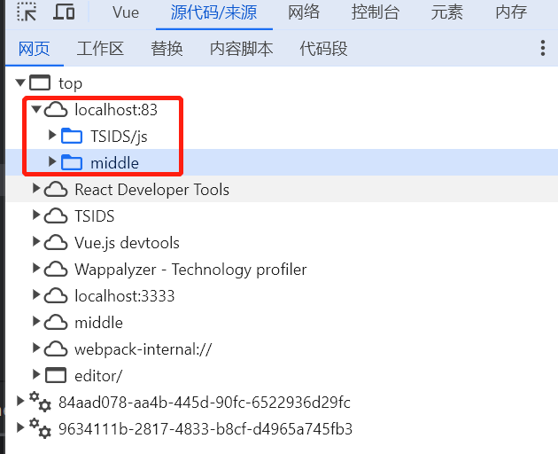

# 初始化项目并下载

```
npm init
npm i qiankun -S
```

# 下载所有依赖

```
//运行所有npm install:xxx格式的命令
npm-run-all --serial install:*
​
//例如
"install:main": "cd main && npm i",
"install:sub-vue": "cd sub-vue && npm i",
"install:sub-react": "cd sub-react && npm i",
```

# 主应用&微应用**注册方式**

```javascript
//任何一个项目都可以作为主应用,在主应用中,用对应元素作为容器容纳子应用
qiankun通过s配置项中activeRule加载对应子路由的entry
​
//手动注册可激活任意子应用,未满足匹配规则的也会在激活状态               调用loadMicroApp,接收一个对象
//自动注册只能激活当前匹配子应用,未满足匹配规则且不是手动注册的会被销毁   调用registerMicroApps,接收对象组成的数组
registerMicroApps([
  {
    name: 'react-app', 
    entry: '//http://192.168.211.180',  // 子应用的入口地址
    container: '#appContainer',         // 子应用挂在的容器元素
    activeRule: '/react-app',           // 子应用的匹配规则
    sandbox: true,                      // 是否启用沙箱隔离
    singular: true,                     // 是否启用微应用的独立运行时
    props: {},                          // 传递给子应用的数据,子应用通过mount生命周期接收
  },
  ...
])
```

# 应用通信

## 乾坤提供的globalState通信方式

```
//父应用通过在注册子应用时,添加props配置项,将actions传递给子应用,子应用则可脱离qiankun包
import {initGlobalState , MicroAppStateActions } from 'qiankun';
​
//初始化globalState
const actions:MicroAppStateActions = initGlobalState(state);
//监听globalState变化
actions.onGlobalStateChange((state,preState)=>{});
//更新globalState
actions.setGlobalState(newState);
//卸载globalState
actions.offGlobalStateChange();
```

## 事件流方式

```
//因为qiankun父子应用在同一个页面上,可以通过事件流进行通信
//实例创建完毕后message不可变,如需要变化,需要重新创建事件实例
new CustomEvent('eventdemo', { detail: message })
window.dispatchEvent('eventdemo');
​
​
mounted() {
  window.addEventListener('eventdemo',res=>{}, false);
},
beforeDestroy() {
  window.removeEventListener('eventdemo', res=>{},false);
}
​
```

# scoped样式冲突

vue的scoped样式其实也有问题，

它是通过.vue文件基于项目根目录的相对路径path+文件名进行计算hash值的，

当主子应用中同时存在一个path和文件名相同时的.vue文件，

它的data-v-XXXXX算出来就是一样的，此时样式还是会冲突

# 生命周期

```
/**
 * bootstrap 只会在微应用初始化的时候调用一次，下次微应用重新进入时会直接调用 mount 钩子，不会再重复触发 bootstrap。
 * 通常我们可以在这里做一些全局变量的初始化，比如不会在 unmount 阶段被销毁的应用级别的缓存等。
 */
export async function bootstrap() {}
/** 应用每次进入都会调用 mount 方法，通常我们在这里触发应用的渲染方法 */
export async function mount(props) {
  console.log('基座下发的能力：', props);
  // 可通过 props.getGlobalState() 获取基座下发的数据
  // props.setGlobalState({user: {name: ''}}) 改变全局的数据
  // props.onGlobalStateChange 监听全局数据的变化
  render();
}
/** 可选生命周期钩子，仅使用 loadMicroApp 方式加载微应用时生效 */
export async function update(props) {}
​
/**  应用每次 切出/卸载 会调用的方法，通常在这里我们会卸载微应用的应用实例*/
export async function unmount() {
  ReactDOM.unmountComponentAtNode(document.getElementById('root'));
}
```

```
server {
    listen 83;
    location ^~/middle/ {
        proxy_pass 
    }
    location ^~/TSIDS/ {
        proxy_pass 
    }
}
当我nginx添加如上代理时,我访问localhost:83/middle/TSIDS实际上访问的是哪个地址,为什么
​
​
```

# 如何在本地连上远程的主应用(壳子)

```javascript
远程主项目在http://192.168.18.228:9999/middle/
本地子项目在http://172.18.120.209:3333/TSIDS/ 本地服务器地址(本地IP+端口,在devsever配置)
​
​
// 子项目通过nginx代理转发请求,使请求能正常请求远程服务器,例如我现在代理83端口,
//  location ^~/middle/ {proxy_pass http://192.168.18.228:9999/middle/; #开发时运行访问地址}
'/middle路由对应主项目,代理middle到主项目所在的远程服务器地址http://192.168.18.228:9999/middle/,'
​
此时,我们访问localhost:83/middle,nginx帮我们代理转发到http://192.168.18.228:9999/middle/,获取到主应用,浏览器会将主应用下载到当前域名,也就是localhost:83下的middle目录(因为主项目的vue.config.js配置了publicPath: '/middle',)
​
//registerMicroApps([
//    {
//        name: 'app1',
//        entry: '/TSIDS/',
//        container: '#container',
//        activeRule: '/middle/TSIDS/',
//    },
//])
​
'主应用设置微应用时注意entry不能和activeRule一样,否则刷新则变成微应用'
'微应用的 webpack 打包和devserver的 publicPath和部署时的目录(相对于主应用所在目录的相对路径) 都需要跟entry一致,这里是 /TSIDS/'
    'publicPath将服务本来是 http://172.18.120.209:3333/的变为 http://172.18.120.209:3333/TSIDS/'
​
'子项目的activeRule会作为子项目的路由基础路径,activeRule为/middle/TSIDS/'
'由于主应用配置子应用时,entry仅指定了相对路径/TSIDS/'
'最终访问localhost:83/middle/TSIDS/会先访问http://192.168.18.228:9999/middle/获取主应用'
'主应用基于当前域名通过相对路径/TSIDS/访问子应用,即localhost:83/TSIDS/,'
'而/TSIDS/又被代理到http://172.18.120.209:3333/TSIDS/,'
'至此,完成了子应用本地连上远程的主应用'
```



# vite特殊配置

vite下依赖vite-plugin-qiankun包

除了注意事项中设置服务基础路径的配置外,还需要使用以下配置

```javascript
//main.ts
import { renderWithQiankun, qiankunWindow } from "vite-plugin-qiankun/dist/helper";
import { createApp } from "vue";
import App from "./App.vue";

const app = createApp(App);
//利用qiankunWindow替代window
if (!qiankunWindow.__POWERED_BY_QIANKUN__) {
  mountApp({});
}
//利用renderWithQiankun来写qiankun的生命周期钩子
renderWithQiankun({
  mount(props) {
    mountApp(props);
  },
  bootstrap() {},
  update() {},
  unmount() {
    app?.unmount();
  },
});

async function mountApp(props: any) {
  app.use(router).mount("#app");
}
```

# 注意事项

## 统一打包规范并配置子项目端口号

```
//所有项目需要统一打包规范为umd
​
//vue,子项目的根目录中vue.config.js配置
configureWebpack: {
    output: {
      // 把子应用打包成 umd 库格式
      library: `${name}-[name]`,
      libraryTarget: 'umd', //统一规范为umd
      jsonpFunction: `webpackJsonp_${name}`
    }
  },
  devServer: {
    port: process.env.VUE_APP_PORT, //指定端口号
    headers: {
      'Access-Control-Allow-Origin': '*'
    }
}
​
//react怎么做到的等会百度
```

## 配置子应用确保资源和路由正常

### 设置应用的基础路径

```
//仅history路由需要
//子应用的src下新建public-path.js,添加如下代码
if (window.__POWERED_BY_QIANKUN__) {
    // eslint-disable-next-line
    //乾坤为确保微应用中的资源能够正确加载,提供的基础路径
    __webpack_public_path__ = window.__INJECTED_PUBLIC_PATH_BY_QIANKUN__
}
if (process.env.NODE_ENV === 'development') {
    // eslint-disable-next-line
    __webpack_public_path__ = `//localhost:${process.env.VUE_APP_PORT}${process.env.BASE_URL}`
}
```

### 设置服务基础路径

如果是vue2那种

```javascript
//vue.config.js或webpack.config.js中
module.exports = {
  //publicPath将服务本来是 http://172.18.120.209:3333/的变为 http://172.18.120.209:3333/TSIDS/
  publicPath: `/TSIDS/`,
  ...,
}
```

如果是vite

```javascript
import qiankun from "vite-plugin-qiankun";
export default ({ mode }: ConfigEnv): UserConfig => {
    return {
        //publicPath将服务本来是 http://172.18.120.209:3333/的变为 http://172.18.120.209:3333/skywalking/
        base: "/skywalking/",,
        plugins:[
            qiankun("skywalking", {
              useDevMode: true, // 开发环境必须配置
            }),
        ]
    }
}
```

### 设置路由基础路径

```
//路由基础路径添加
baseUrl=window.__POWERED_BY_QIANKUN__?props.data.activeRule : process.env.BASE_URL //是乾坤环境用当前子应用的activeRule,否则用环境变量的基础路径
```