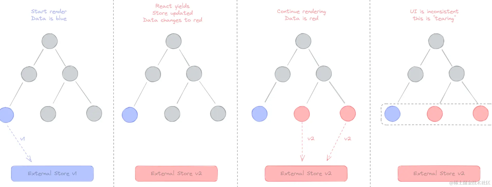
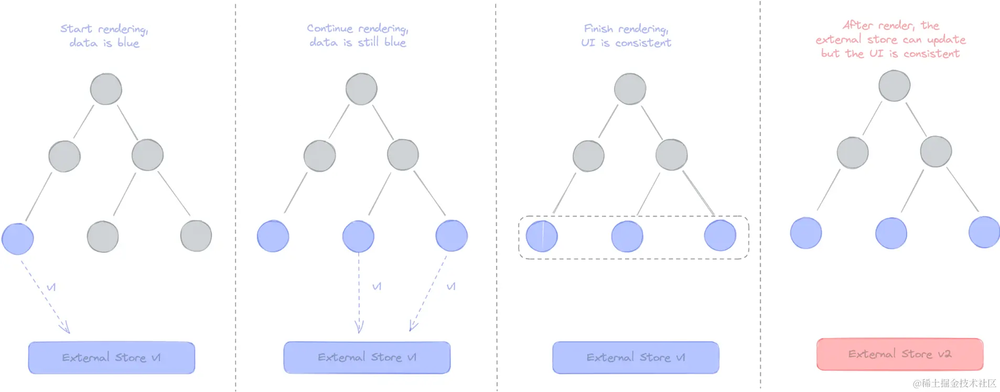
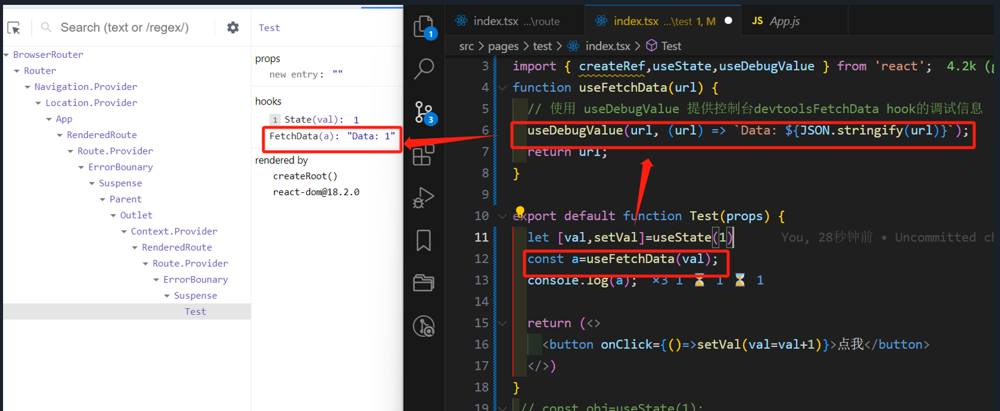
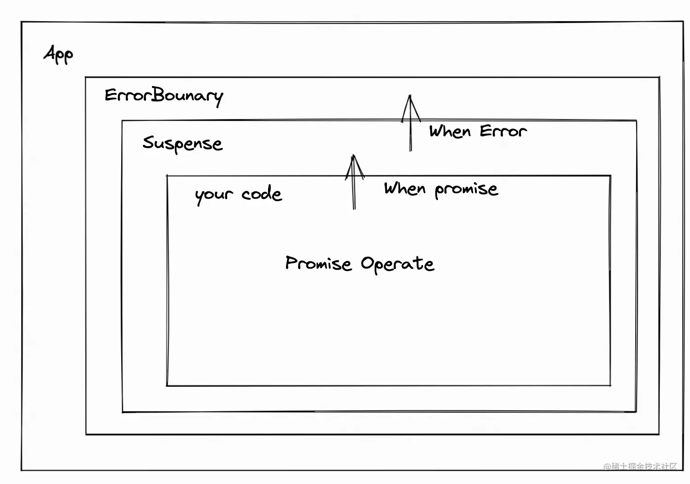
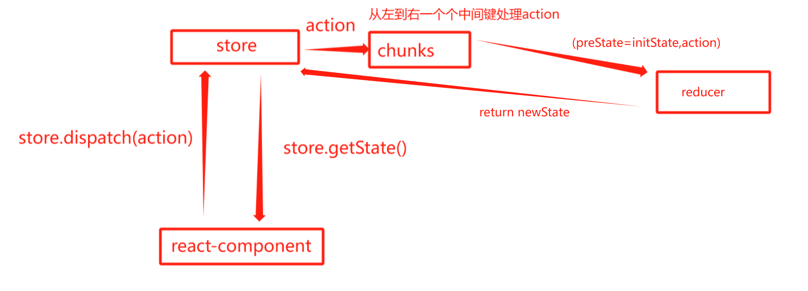
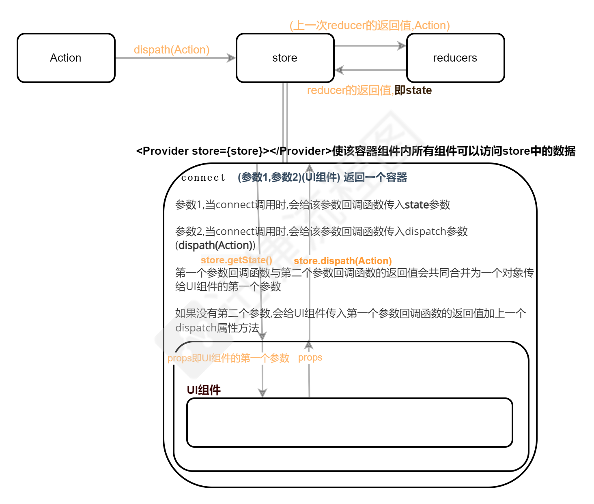
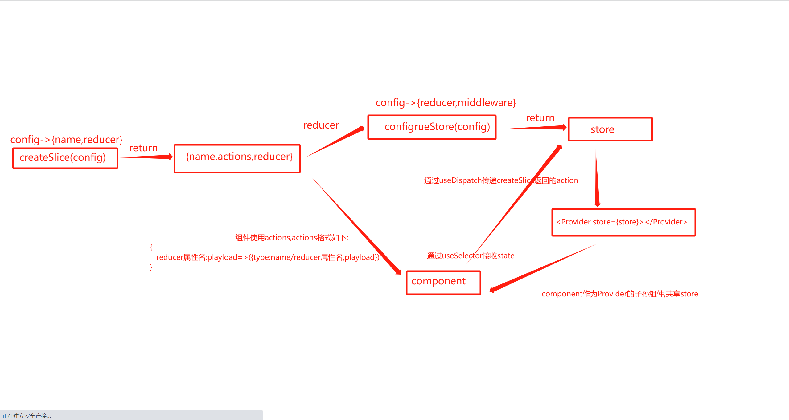
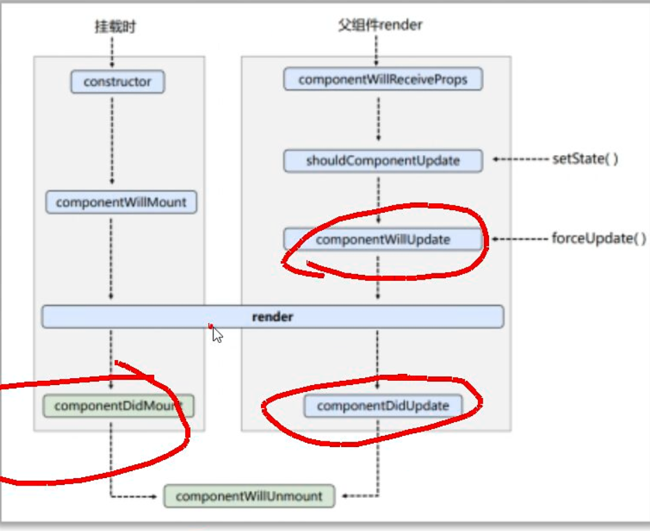
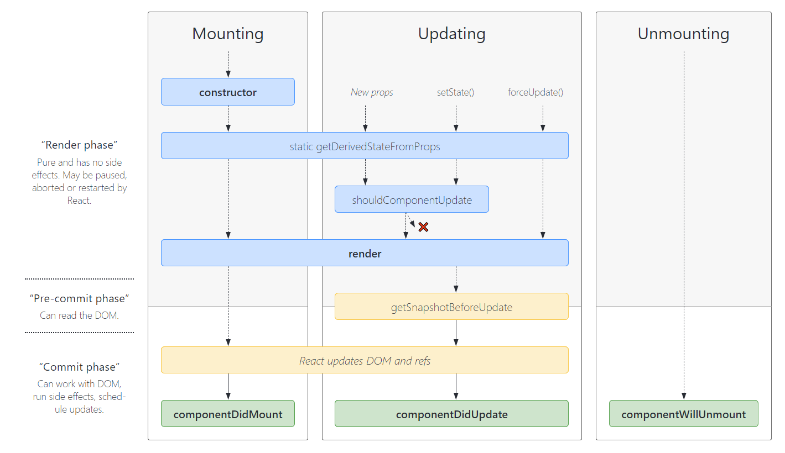

# 大纲
```js
-->创建项目
npx create-react-app 项目文件名

-->React
	-->响应式
		-->useState
			const [state,setState]=useState(基础数据)
		-->useReducer,需要自定义reducer函数用来修改数据
			const initialState={a:1}
			const reducer=(state,action)=>{
				switch (action) {
					case 'increment':
						return state.a+1
					case 'decrement':
						return state.a - 1
					case 'reset':
						return initialState
					default:
						return state
				}
			}
			const [count, dispatch] = useReducer(reducer, initialState)
		-->createContext,创建一个带Provider组件的上下文对象
		-->useContext,Provider组件的子组件使用，返回Provider组件的value属性值
	
	-->ref相关
		-->useRef,用于获取组件/dom实例
			const Ref=useRef()
			将这个Ref传递给组件/dom的ref属性后，会在挂载完毕后获取到组件/dom实例，
			通过在useEffect等挂载完毕后才调用的函数中通过Ref.current获取到组件/dom实例
		-->forwardRef,用于自定义组件暴露的dom元素，而不是默认的组件实例
			const Child=forwardRef((props,ref)=>{
				return <input ref={ref} />
			})
			function Parent(props) {
			    const childRef=useRef();
			    //此时childRef的值为{current:null},在挂载完毕后会变成{current:span元素}
			    return <Child ref={childRef} />;
			}
		-->useImperativeHandle常与forwardRef一起使用,用于自定义组件实例暴露的内容
			const Child=forwardRef((props,ref)=>{
				useImperativeHandle(ref, () => ({
				        focus: () => {
				            inputRef.current.focus();
				        }
				}));
				return <input ref={ref} />
			})
			function Parent(props) {
			    const childRef=useRef();
			    //此时childRef的值为{current:null},在挂载完毕后会变成{current:{focus:focus函数}}
			    return <Child ref={childRef} />;
			}
		
	-->副作用
		-->useEffect，虚拟dom更新并渲染后，处理副作用操作（数据获取/订阅）
			useEffect(() => {
				// 副作用逻辑
				return () => { /* 清理函数 */ }
			}, [依赖]) // 空数组表示只运行一次
		-->useLayoutEffect,虚拟dom更新后，渲染前，类似useEffect但同步执行（DOM更新后立即触发）
			useLayoutEffect(() => {
				// 布局相关的副作用
			}, [依赖])
		-->useInsertionEffect.虚拟dom更新前，类似useEffect
		
	-->性能优化
		-->useMemo，缓存计算结果（性能优化）
			const memoizedValue = useMemo(() =>computeExpensiveValue(a, b), [依赖])
		-->useCallback，缓存函数引用（性能优化）
			const memoizedFn = useCallback(() =>{ doSomething(a, b) }, [依赖])
		-->memo,缓存函数组件，避免父组件重新渲染导致子组件渲染，内部通过Object.is比较props的每一个属性
			//memo(Component,propsAreEqual?:(props,preProps)=>boolean)
			const Child=memo(组件,(props,preProps)=>{...})
		-->lazy，懒加载组件
			const lazyComponent = React.lazy(() => import('./OtherComponent'))
		-->Suspense，懒加载组件过程中的备用UI
			<Suspense fallback={<Spinner />}>
				<LazyComponent />
			</Suspense>

	-->ErrorBoundary,捕获子组件树中的 JavaScript 错误，并显示备用 UI
		class ErrorBoundary extends React.Component {
			state = { hasError: false }
			//子组件或者componentDidCatch抛出错误时触发
			static getDerivedStateFromError(error) {
				return { hasError: true }
			}
			//记录错误信息
			componentDidCatch(error, info) {
				logErrorToService(error, info)
			}
			
			render() {
				if (this.state.hasError) {
					return <h1>Something went wrong.</h1>
				}
				
				return this.props.children
			}
		}
		
-->ReactDom
	-->createPortal(元素，指定容器dom) 将元素挂载到指定容器dom上

-->react router
	-->BrowserRouter，基于HTML5 history API的路由容器  
		<BrowserRouter basename="/app">  
			<App />
		</BrowserRouter>  
		- basename: 基础路径（例："/app"）  
		- forceRefresh: 强制页面刷新（兼容旧浏览器）  
		- keyLength: location.key长度（默认6）  
	-->HashRouter，基于URL hash的路由容器  
		<HashRouter hashType="slash">  
			<App />  
		</HashRouter>  
		- hashType: hash格式（"slash|noslash|hashbang"）  
	-->Routes/Route，路由匹配系统  
		<Routes>  
			<Route path="/" element={<Home />} />  
			<Route path="users/:id" element={<User />} />  
		</Routes>  
		- path: 路径匹配规则  
		- element: 匹配时渲染的组件  
		- caseSensitive: 大小写敏感（默认false）  
	-->useRoutes(routes),Routes/Route的配置化
		const routes = [  
			{ path: "/", element: <Home /> },  
			{ path: "/user", element: <User />, loader: userLoader }  
		];
		useRoutes(routes)
	
	-->RouterProvider，配置路由的容器组件  
		<RouterProvider router={router} fallbackElement={<Loading />} />  
		- fallbackElement: 路由加载中的过渡UI  
	-->createBrowserRouter，配置式history路由创建,需配合RouterProvider使用
		const router = createBrowserRouter([  
			{ path: "/", element: <Home /> },  
			{ path: "/user", element: <User />, loader: userLoader }  
		]);
		//   
	-->createHashRouter，配置式hash路由创建,需配合RouterProvider使用
		const router = createHashRouter([  
			{ path: "/", element: <Home /> },  
			{ path: "/user", element: <User />, loader: userLoader }  
		]);
		
	-->Link，声明式导航组件  
		<Link to="/about" state={{ from: "/" }} replace>关于</Link>  
		- to: 目标路径（支持字符串/对象）  
		- replace: 替换历史记录  
		- state: 携带的隐式状态数据  
	-->NavLink，带激活状态的(class默认多active)导航组件  
		<NavLink  
			to="/news"  
			style={({ isActive }) => ({ color: isActive ? "red" : "black" })}>
			新闻
		</NavLink>  
		- end: 严格匹配子路径（类似exact）  
		- activeClassName: 已过时，推荐用函数式style/className  
	-->useNavigate，编程式导航Hook  
		const navigate = useNavigate();  
		navigate("/login", { replace: true, state: { referrer: currentPath } });  
		- 参数1: 目标路径  
		- 参数2: { replace, state }  
	
	-->useParams，获取动态路由(params)参数  
		const { id } = useParams();  // 匹配路径如 "/user/:id"  
	-->useSearchParams，URL查询参数(query)操作  
		const [searchParams, setSearchParams] = useSearchParams();  
		setSearchParams({ q: "react" });  // 更新为?q=react  
	
	-->useNavigation，获取导航状态  
		const navigation = useNavigation();  
		// navigation.state: "idle|loading|submitting"  
		// navigation.location: 目标路由信息
	-->useLocation，获取当前路由信息  
		const location = useLocation();  
		// 包含 pathname/search/hash/state/key  
	-->useRouteError，获取路由错误信息  
		function ErrorPage() {  
			const error = useRouteError();  
			return <div>{error.statusText || error.message}</div>;  
		}
		
	-->Outlet，嵌套路由占位组件  
		function Layout() {  
			return (  
				<div>  
					<Header />  
					<Outlet />  // 子路由内容将渲染在此处  
					<Footer />  
				</div>  
			)  
		}  
```
# ReactHooks

## 极致缓存示例

缓存会使得依赖更新时组件每次渲染都会被缓存,更费时间,但是的确很多情况下使用缓存可能性能更佳

通常情况下,缓存用于需要昂贵计算量的情况下,比如虚拟列表,比如父组件更新但所有子组件的props未更新等

```
https://juejin.cn/post/7146107198215553055
```

所有耗时的组件应使用如下规范进行缓存:

使用memo缓存子组件,防止子组件因为父组件渲染而重新渲染

使用useCallback缓存传递给子组件的回调,相当于watch依赖项,并更新这个函数和里面的响应式数据

使用useMemo缓存传递给子组件的对象,相当于watch依赖项,并更新这个对象

使用createContext(默认值)创建context对象 , context对象.Provider 的value传递共享数据，当value的值发生改变时，所有依赖该数据的组件会重新渲染  //共享状态组件

使用useReducer/useState创建共享状态,与修改共享状态的方法

使用useMemo缓存  共享状态和修改共享状态的方法

子组件hook组件通过useContext(context对象) 接受共享状态与修改共享状态的方法

jsx中使用context对象.Consumer组件接受共享状态，用法如下

```js
import React, { createContext,useReducer,useCallback, useContext,useMemo,memo } from "react";
const context=createContext({})；
const Provider=context.Porvider;
//共享数据
const reducer=(state,action)=>{...};
const initialState={...};
const {state,dispatch}=useReducer(reducer, initialState)
//子组件
const Child=memo((props)=>{...});
​
const value=useMemo(()=>({ state,dispatch }));
                           
function App(props){
    return (
    <>
        <Provider value={value}>
            const handler=useCallback(传给子组件的回调,依赖)
            <Child handler={}></Child>
        </Provider>           
    </>)
}
​
子组件内:
const {state,dispatch}=useContext(context); //返回共享状态(provider的value的值)
//使用state使用共享数据,使用dispatch修改共享数据
​
​
//Consumer用法
//Consumer会接受共享状态，通过props的形式传递给props.children
const Consumer=context.Consumer;
<Consumer>
 {共享状态=>组件}
</Consumer>
```

## react Hooks

函数式组件每次渲染时,内部代码都会被重新触发,类似以下示例:

```js
//定义一个函数组件
function App(props){
    //constructor代码
    //componentDidMount && componentDidUpdate代码
    useEffect(()=>{
        return componentWillUnmount代码    //唯一区别是:每次调回调的时候都会把这个返回值调了
    },[anyData])
    //render代码
    return ..
}
```

### 状态管理

react具有三大状态管理hooks,分别是useState,useReducer,useContext

这些hooks定义的状态改变时,会触发render方法,重新渲染页面

#### useReducer

是什么?
`useReducer` 是一个用于状态管理的 hook api。

`useReducer` 与 `reducer` 函数(即arr.reduce函数的回调) 有关

`useReducer(reducer, initialState)` 接受2个参数，分别为 reducer 函数和初始状态

`reducer(currentState, action)` 也是接受2个参数，分别为当前状态和 action，返回一个 new state

怎么用?

useReducer(自定义的reducer函数,自定义的初始值ininState)

返回 `[新的响应式状态,reducer发送action的dispatch方法]`

```js
import React, { useReducer } from 'react'

const initialState = 0
const reducer = (state: number, action: string) => {
  switch (action) {
    case 'increment':
      return state + 1
    case 'decrement':
      return state - 1
    case 'reset':
      return initialState
    default:
      return state
  }
}

function CounterOne() {
  const [count, dispatch] = useReducer(reducer, initialState)
  return (
    <div>
      <div>Count - {count}</div>
      <button
        onClick={() => dispatch('increment')}
      >Increment</button>
      <button
        onClick={() => dispatch('decrement')}
      >Decrement</button>
      <button
        onClick={() => dispatch('reset')}
      >Reset</button>
    </div>
  )
}

export default CounterOne

```

原理

待学

#### useState

```javascript
//immer是第三方包,要下载
import { produce } from "immer";

const [state,setState]=useState({a:{b:1}});
setState(produce(state,(proxyState)=>{
    //任意操作,produce通过将state代理实现任意操作,并返回新对象
    proxyState.a.b++;
}))
```

#### useState与useReducer的选择

如果是无需复杂逻辑处理的状态,建议使用useState,常见于基本数据类型

如果是业务逻辑复杂等,建议使用useReducer,常见于复杂数据类型

#### useContext

useContext用于多组件共享的状态

1. 通过 React.createContext(对象)创建一个上下文对象并返回 
2. 新创建的上下文对象上有一个 Provider 属性,该属性是一个组件,使用 Provider 组件的 value 属性接收共享数据
3. 使用<新创建的上下文对象.Provider value={共享的数据}> 子组件若干 </新创建的上下文对象.Provider>使用该组件
4. 该组件内的所有组件都可以使用 React.useContext(新创建的上下文对象)接收共享的数据

例如我们可以将useReducer返回的state,dispatch通过value传递给子组件,让子组件可以跨组件修改状态,而无需层层prop传递

### 并发处理

#### useSyncExternalStore v18

发现状态更新后,强制更新,从而避免v18中并发渲染导致的画面撕裂问题

```js
//api
//useSyncExternalStore(subscribe, getSnapshot, getServerSnapshot?);
import { useSyncExternalStore } from "react";
const Index=()=>{
    const state = useSyncExternalStore(
        store.subscribe,
        () => store.getState().count,
        () => 0
    );
    return (<>
        <div>数据源： {state}</div>
    </>)
}

//subscribe是一个订阅store的函数,该函数需要返回一个取消订阅的函数,用于组件销毁时取消订阅,该函数应该在组件外部订阅,以避免组件重新渲染时的重复订阅

//getSnapshot 一个 用于返回需要使用的共享数据的快照 的函数,useSyncExternalStore会通过Object.is判断每次返回的值是否相等,不同就会更新返回的快照导致组件重新渲染

//getServerSnapshot 一个 返回初始化快照(即初始值) 的函数,一般用于服务端渲染

```

并发渲染

渲染过程中,遇到状态更新,状态更新,页面继续渲染,后续渲染会被新状态影响



同步渲染

渲染过程中,遇到状态更新,停止渲染,将状态更新后开始下次渲染



#### useTransition v18

useTransition 内更新的事件会采取 Concurrent 模式,

startTransition内的callback导致的响应式更新会变成低优先级更新,

Concurrent 模式下，**低优先级更新会被高优先级中断，此时，低优先级更新已经开始的协调会被清除，并且会被重置为未开始的状态**。

当被重置后，导致 transition 更新只有在用户停止输入（或超过 5s）时才会得到有效的处理。

```js
const [padding, startTransition] = useTransition(); //padding初始为false
//不可以接收异步函数
startTransition(()=>{})

//demo
const [tab, setTab] = useState("A");
const [, startTransition] = useTransition();
const changeHandler = p => () => {
    setTab(p); //1 替换默认的紧急任务
    startTransition(() => {
        setTab(p) // 2 替换默认的过渡任务
    });
};

//紧急任务就是一般的响应式数据更新导致的渲染
//startTransition调用后,会将callback降级处理,
//startTransition会查询调用startTransition时是否存在紧急任务,有则调用紧急任务,没有则渲染调用useTransition的组件,同时将padding设为true
//上一步执行完毕后,将padding初始化为false,开始执行callback,若在执行callback期间有紧急任务,则停止执行,去执行紧急任务

//例如以上demo,如果没有标注为1的那一步,将会更新调用useTransaction的组件
//没有标注2的那一步,即startTransition接收空函数,也会更新调用useTransaction的组件

```

### 缓存钩子

[想看memo组件?点击这里](#memo)

react具有两个缓存钩子,分别是

#### useMemo

返回一个缓存之后的值,只有当依赖的数据改变时,才会重新调用第一个参数回调

不足: 不能缓存函数

什么时候用?

当一个操作因为某种原因被重复执行（例如每次渲染都执行），我们需要将它放在useMemo中执行

```js
const value=useMemo(()=>想缓存的值,[依赖的数据1,...])

const sum = useMemo(()=>{
    return sumFun(a,b)
},[a,b])

```

#### useCallback

返回一个缓存之后的函数,只有当依赖的数据改变时,才会重新调用第一个参数回调

什么时候用?

子组件调用父组件的方法修改父组件的响应式状态会导致父组件重新渲染，

重新渲染也就是父组件内的所有代码都会被重新执行。

这样传递给子组件的修改父组件的方法也会被重新创建，

导致子组件的props被更新。这时候memo会失效，这时就需要usecallback

```js
const value=Callback(()=>fn(),[依赖的数据1,...])
```

### 副作用钩子

#### 使用场景及调用顺序

三者使用场景对比

1. useEffect  DOM更新和渲染完毕后调用,用于页面数据处理工作
2. useLayoutEffect   DOM更新完毕,浏览器渲染之前同步调用,**会阻塞浏览器渲染, 用于页面元素布局工作**
3. useInsertionEffect  DOM更新前调用 用于插入动态样式

调用先后以及执行顺序

useInsertionEffect的回调在 React的DOM更新函数 调用前调用

useEeffect的回调在 React的DOM更新函数 执行完毕后调用回调

useEeffect的回调在 React的DOM更新函数 执行完毕后将回调推入异步队列

#### useEffect

异步副作用钩子,在DOM更新和渲染完毕之后,异步执行,在React的DOM更新函数执行完毕后,将该回调推入异步队列

用于数据处理

```js
import {useRffect,useState} from 'react';
function App(props){
    let [count, setCount] = useState(0);
    useEffect(() => {
        const timer=setTimeout(()=>{
            setCount(10 + Math.random() * 100)
        })
        return ()=>clearTimeout(timer);
    }, [count])
    return (<>
        <div>useEffect的count:{count}</div>
    </>)
}
```

副作用钩子函数,用来替代类组件中以下三个生命周期钩子函数: `componentDidMount` `componentDidUpdate` `componentWillUnmount` 没写第二个参数时,相当于同时使用第一二个钩子(即 state 改变就调用) 写了第二个参数时,只有 `第二个数组参数中存放的 state改变时`,第一个参数回调才执行即 `写空数组只能在初始化阶段(DidMount)触发第一个参数回调函数` 第一个参数回调函数返回的回调函数就是第三个钩子函数,但略有不同, `每次调用该 useEffect 函数时,都会将上一次调用 useEffect 时第一个参数回调函数返回的回调函数执行后销毁`

#### useLayoutEffect

同步的useEffect,在DOM更新之后,浏览器渲染之前,同步执行,会打断dom渲染,即React的DOM更新函数执行完毕后,调用该回调

用于页面元素布局

#### useInsertionEffect v18

同步的useEffect,DOM更新前调用,调用完毕后DOM开始更新,即阻塞React的dom更新函数

用于插入动态样式

### useRef

创建一个不变的Ref对象,用来接收Dom/组件实例等

**仅用于函数式组件**

这个对象会贯穿整个函数组件生命周期,组件渲染导致的重复调用**不会使其改变**

[想看与createRef和其他ref的区别?](#获取DOM/组件实例)

```js
function Parent(props) {
    const childRef=useRef();
    //此时childRef的值为{current:null},在将来ref的值会返回给current,这个current是非响应式的,我们可以给current属性传响应式值让其拥有响应式
    return <FancyInput ref={childRef} />;
}

```

### useDebugValue

用于控制台显示调试信息的钩子

```js
import { useState,useDebugValue } from 'react';
function useFetchData(url) {
  // 使用 useDebugValue 提供控制台devtoolsFetchData hook的调试信息
  useDebugValue(url, (url) => `Data: ${JSON.stringify(url)}`);
  return url;
}
​
export default function Test(props) {
  let [val,setVal]=useState(1)
  const a=useFetchData(val);
  console.log(a);
  
  return (<>
    <button onClick={()=>setVal(val=val+1)}>点我</button>
  </>)
}
```



### useImperativeHandle与forwardRef

`useImperativeHandle` 会覆盖ref的默认行为,用于自定义暴露给ref的内容,常与 [forwardRef](#forwardRef) 同用

forwardRef自定义暴露的ref内容

```javascript
//Parent
import {FancyInput} from './Child';
function Parent(props) {
    const childRef=useRef();
    //此时childRef的值为{current:null},在将来会变成{current:{focus:fn}}
    return <FancyInput ref={childRef} />;
}
​
​
//Child
export const FancyInput=forwardRef((props, ref) {
    const inputRef=useRef();
    useImperativeHandle(ref, () => ({
        focus: () => {
            inputRef.current.focus();
        }
    }));
    return <input ref={inputRef} />;
})
```

## react-dom Hooks

### **createPortal**

用于将 组件/元素 挂在到指定的 元素 身上

```javascript
import { useEffect, useRef, createPortal } from 'react';  
const Portal = ({ children, container = document.body }) => {  
  let el;  
  useEffect(() => {  
    // 创建一个新的div元素作为portal的容器,方便维护,这样可以多次portal
    el = document.createElement('div');
    container.appendChild(el);
    // 清理函数，在组件卸载时移除portal的容器  
    return () => {  
      container.removeChild(el);  
    };  
  }, [container]); // 如果container改变，则重新执行这个effect  
  // 使用createPortal将子元素渲染到portal的容器中
  return createPortal(children, el);  
};  
const MyComponent = () => {  
  return (<p>test</p>);  
};  
 
const App = () => {  
  return (  
    <div>
      {/* 使用 Portal 将 MyComponent 挂载到 body 下 */}  
      <Portal>  
        <MyComponent />  
      </Portal>  
    </div>  
  );  
};  
```

## react-router-dom Hooks

react有一下常见路由钩子,都来自于react-router-dom库

useLocation

useParams,usSearchParams

useNavigate

useRoutes

### useLocation

返回location对象

location对象具有多个属性,用于获取

| 属性                | 值(字符串)       |               |
| ----------------- | ------------ | ------------- |
| location.pathname | /frontend    | URL路径与文件名     |
| location.search   | ?sort=newest | URL查询字符串      |
| location.hash     | `#content`   | 哈希地址          |
| location.key      |              | 路由的key,不知道干嘛的 |
| location.state    |              | 路由的状态         |


```js
import {useLocation} from 'react-router-dom'
function App(props){
    const location = useLocation();
    ...
}
```

### useParams

获取params参数

```js
import {useLocation} from 'react-router-dom'
function App(props){
    const params = useParams();
    ...
}
```

### useSearchParams

获取和设置query参数

基于URLSearchParams接口,监听location.search的变化,当触发setQueryParmas时更据入参创建新的URLSearchParams对象，再执行改变路由的方法，进而修改location对象

```js
import {useSearchParams} from 'react-router-dom'
function App(props){
    const [queryParams,setQueryParmas] = useSearchParams();
    //获取参数
    queryParams.get('参数名');
    //设置参数
    setQueryParams({...});
    ...
}

```

### useNavigate

```js
import { useNavigate } from ‘react-router-dom’;
function App(props){
    const navigate = useNavigate();
    //path可以传数字,功能等同于history.go(num);
    //path代表要跳转的路由地址,常见如下: /child/:a  /child?a=1  /child
    navigate(path,{state:...});
    //如果不想将query参数拼接在地址上传递,可以使用如下形式:
    navigate({pathname:path,search:'?a=1',state:任意参数});               
    ...
}

```

### BrowserRouter&useRoutes

```js
// 传统组件式写法（v6.4之前）
<BrowserRouter>
  <Routes>
    <Route path="/" element={<Layout />}>
      <Route index element={<Home />} />
      <Route path="user/:id" element={<User />} />
    </Route>
  </Routes>
</BrowserRouter>

// 配置式写法（v6.4+）
const router = createBrowserRouter([
  {
    path: "/",
    element: <Layout />,
    children: [
      { index: true, element: <Home /> },
      { path: "user/:id", element: <User /> }
    ]
  }
]);
<RouterProvider router={router} fallbackElement={<Loading />}>
</RouterProvider>
```
根据路由表创建路由

```js
import {useRoutes} from 'react-router-dom';
import 路由表 from '...';
function App(){
    return (
        <div>
            {useRoutes(路由表)}
        </div>
    )
}
​
//useRoutes等同于
const useRoutes=(routes=[])=>{
    <Routes>
        {routes.map(el=>{
            return (<Route key={item.id} path={item.path} element={item.element}>
                {useRoutes(item.children)}
            </Route>)
        })}
    </Routes>
}
```

### useHref

```js
import { useHref } from 'react-router-dom';
​
const params = { categoryId: 1 };
const href = useHref({ pathname: "/products", search: `?category=${params.categoryId}`, hash: "#section1" });
//href
"/products?category=1#section1"
```

### useLocation

跳转到某个路由组件时,这个路由组件调用useLocation返回当前路由的信息

**注意state刷新后会丢失,需要进行持久化存储**

```js
import {useLocation} from 'react-router-dom';
const location=useLocation();
//location
{
    hash:路由的哈希地址, //来自path
    pathname:路由地址, //来自path
    search:查询字符串, //来自path
    state:状态路由 //来自path
}
//例如当前路径是 `/products?category=1#section1`
//则
//pathname: /products
//search: ?category=1
//hash: #section1
​
//例如
//<Link to={{ pathname: '/destination', state: { message: 'xxx' } }}>
//or push或者replace
//history.push('/destination', { message: 'xxx' });
//state: {message:'xxx'}
```

### Link/NavLink

NavLink 与 Link 都是基于 a 标签封装的组件, 用于跳转路由

区别: NavLink 在激活时多一个 className="active"

当这两组件被激活时, a 标签会多一个 aria-current="page"

## custom Hook(自定义)

自定义hooks

```js
const useXxx=()=>{}
```
# React.Children
React.Children用来操作children，它有 map、forEach、toArray、only、count 等方法。

相比于 children直接调用,例如children.map,

它有如下不同:
1. 用数组的方法不会对 children 做拍平，而 React.Children 会将children里的虚拟dom拍平为一层
2. 用数组的方法不能做排序，因为 children 的元素是只读的，而用 React.Children.toArray 转成数组就可以了
3. 用数组的方法需要声明 children 为 ReactNode[]类型，这样就必须传入多个元素才行，而React.Children 不用

# React组件

## memo

[想看缓存钩子比较不同?点击这里](#useMemo)

memo函数的特点是: 缓存函数组件，避免父组件重新渲染导致子组件渲染，内部通过 Object. is 比较 props 的每一个属性

如果想控制比较过程,可以传递第二个参数回调

什么时候用?

由于父组件重新渲染时,会导致子组件重新渲染,

当导致父组件重新渲染的原因与子组件无关时,例如父组件的某个响应式状态A改变,而子组件不依赖A,这是没有意义的,这时候就需要缓存

```js
const Child=memo(组件);
const Child=memo(组件,(props,preProps)=>{返回boolean控制是否重新渲染})

```

## Fragment

因为jsx语法只支持返回一个值,因此我们想返回多个元素时,需要想办法将其包裹并返回,

`React.Fragment` 组件用于想返回多个元素,但是不想额外创建 DOM 元素的情况。

`<React.Fragment> </React.Fragment>` 等同于 `<></>`

```
function Children(){
    return (
        <React.Fragment>
            hello<h2>word</h2>
        </React.Fragment>
    )
    //等同于
    <>
        hello<h2>word</h2>
    </>
}

//解析后,页面表现:
hello<h2>word</h2>


//我们还可以使用数组写法,返回多个相连的元素
[<span>1</span>,'a']

```

## lazy

返回LazyComponent  -->懒加载组件

```
//ErrorBounary是自己定义的错误边界组件,用于捕捉组件内的错误
//Suspense接受异步组件,fallback属性定义加载中应显示UI

import { lazy, Suspense, FC } from "react";
const 组件名=lazy(() => import("路由组件所在路径"));
const load = (Comp: FC) => {
  return (
    <ErrorBounary>
      <Suspense fallback={<Loading />}>
        <组件名 />
      </Suspense>
    </ErrorBounary>
  );
};

//使用
const MyComponent: FC = () => {
  return (
    <div>
      {load(组件名)} {/* 使用 load 函数加载组件 */}
    </div>
  );
};

```

## Suspense

Suspense 的作用与 [ErrorBounary](##错误处理ErrorBounary) 相似。Suspense 是当子组件抛出的Promise为padding时，切换呈现的加载 UI

```
<Suspense fallback={padding状态下显示的内容,可以是组件}>
    返回组件的promise
</Suspense>

```




## 错误处理ErrorBounary

[回到Suspense?点我](#suspense)

ErrorBounary用于包装可能抛出错误的组件。 当子孙组件抛出错误（例如网络请求失败）时，切换呈现显示自定义错误 UI。

```js
import React from 'react';
class ErrorBoundary extends React.Component {
	state = { hasError: false }
	//子组件或者componentDidCatch抛出错误时触发
	static getDerivedStateFromError(error) {
		return { hasError: true }
	}
	//记录错误信息
	componentDidCatch(error, info) {
		logErrorToService(error, info)
	}
	
	render() {
		if (this.state.hasError) {
			return <h1>Something went wrong.</h1>
		}
		
		return this.props.children
	}
}
export default ErrorBounary;

```

# react状态管理

目前所知,常用的只有这三

redux-tookit

redux

react-redux

以下仅提供基本用法

## **jotai**

原子化状态管理库

超级好用,用法类似于useState,不同的时,useState只存在与组件内部,jotai状态存在外部,且做了一些优化(

```javascript
// npm install @jotai/core
import React from 'react';
import { atom, useAtom } from '@jotai/core';

// useAtom等同于useAtomValue:返回状态+useSetAtom:返回修改状态的方法
// 创建原子状态
const listAtom = atom([]);

// atom可以接收一个getter函数,一个setter函数
const countAtom = atom(
  // getter 函数，用于获取状态的当前值
  (get) => get(listAtom),
  // setter 函数，用于更新状态的值,param对应下面setCount的参数
  async (get, set, param) => {
    const data = await 假装异步请求;
    set(listAtom, data);
  }
);

const Counter = () => {
  // 使用 useAtom hook 获取原子状态的值和更新函数
  const [count, setCount] = useAtom(countAtom);
    //等同于
    //const count=useAtomValue(countAtom)
    //const setCount=useSetAtom(countAtom)
  return (
    <div>
      <h2>Count: {count}</h2>
      <button onClick={() => setCount((prevCount) => prevCount + 1)}>Increment</button>
      <button onClick={() => setCount((prevCount) => prevCount - 1)}>Decrement</button>
    </div>
  );
};

export default Counter;
```

## redux

### ts

```
import { AnyAction } from "redux"; //定义action的类型
```

### 流程图

initState是利用形参默认值设置的初始值

preState是上一次reducer的返回值

newState是这一次reducer的返回值

chunks是所有中间件



| 名称 | 描述 | 作用 | 
| -- | -- | -- |
| Store | 仓库 | 存状态,通过 | 
| Reducers | 加工状态 | 接收 store 调用 reducer 时传入的( | 
| React Components | react 组件 | 通过 | 
| Action creators | 构建行动 | 通过 | 
| store.dispatch(action) | 派发 action | action就是传递给store的值, | 
| store.subscribe(回调函数) | 监听state是否改变 | 比如监听派发新的 action 后重新渲染根组件 | 


### compose

redux提供的一个柯里化函数,使函数从右到左执行

具体原理在中间键原理章有分析

```
//一般用于多个applyMiddleware时使用
import {legacy_createStore as createStore,applyMiddleware,compose} from 'redux';
const middleWares1 = applyMiddleware(reduxThunk, reduxPromise);
const middleWares2 = applyMiddleware(reduxThunk, reduxPromise);
createStore(reducer,preloadedState, compose(middleWares1,middleWares2));
```

### createStore

legacy_createStore和createStore用法一致,但legacy_createStore可以与控制台交互,控制台可以实时查看和操控state

```
//reducer下述用法中已写
//preloadedState和enhancer是可选参数,preloadedState是初始状态值,enhancer是中间件,有多个enhancer时需要使用applyMiddleware接收1到多个中间件,返回柯里化函数,使中间件从左到右执行
import {legacy_createStore as createStore,applyMiddleware} from 'redux';
createStore(reducer,preloadedState, applyMiddleware(中间件1,...));
```

### combineReducers原理与使用

将多个reducer合并为一个对象

```
//use
//const store=createStore(combineReducers({ reducer的别名: reducer }),applyMiddleware(中间件1,...));
​
const combineReducers=(reducers)=>{
    return (state,action)=>{
        return Object.formEntries(Object.entries(reducers).forEach([key,value]=>{
            return [key,value(state[key],action)];
        }))
    }
}
```

### 怎么实现中间件

**applyMiddleware 里有一段 middleware({getState, dispatch})(store.dispatch) 代码这段代码执行完毕后返回一个接收action的函数,用于接收store.dispatch传递过来的action**

```js
//rest是在调用中间键时自己传递的参数  applyMiddleware(thunk(参数1,...))
export default function thunk(...rest) {
  // 返回一个中间键函数
  // applyMiddleware 里有一段 middleware({getState, dispatch})(store.dispatch) 代码
  // 这段代码执行完毕后返回一个接收action的函数,用于接收store.dispatch传递过来的action
  return ({ dispatch, getState }) => {
    return (next) => {
        return (action) => {
          //中间键逻辑
          if (typeof action === "function") {
            return action(dispatch, getState, ...rest);
          }
          return next(action);
    };
  };
}
```

### action传递过程

调用store.dispatch(action)之后,action会逐个经过中间键中最后返回的action=>{...中间键逻辑;next(action)}函数处理,这个处理完通过next(action) 给下一个,如果没有下一个,放入state中

### 中间件原理

```js
const store={
  dispatch:()=>{},
  getState:()=>{}
}
//将函数柯里化,使其从右到左依次执行,且每个函数的返回值都会作为下一个函数的参数
//如果打印next,会从右到左打印,action从左到右的原因是最后从最左边的函数依次调用返回的回调
const compose =(...fns)=>fns.reduce((a, b) =>(...args) => a(b(...args))); 
const applyMiddleware=(...middlewares)=>{
    let chain = []
    const middlewareAPI = {
        getState: store.getState,
        dispatch: (action) => store.dispatch(action)
    }
    chain = middlewares.map(middleware => middleware(middlewareAPI)(store.dispatch))
    console.log('chain',chain); // [(next) =>  (action) => next(action),...]
    
    //fn(fn(fn(store.dispatch)))
    return compose(...chain)(store.dispatch)
}
const fn=function thunk(...rest) {
  // 返回一个中间键函数
  // applyMiddleware 里有一段 middleware({getState, dispatch})(store.dispatch) 代码,
  // 这段代码执行完毕后返回一个柯里化函数,从store.dispatch开始,按照applyMiddleware接收的函数顺序,
  // 依次将处理后的action传递给下一个函数
  return ({ dispatch, getState }) => {
    return (next) =>  (action) => next(action);
  }
}
applyMiddleware(fn,fn,fn);
​
// createStore就是将action传递给applyMiddleware的返回值,
//即applyMiddleware(fn,fn)({a:1}),也就是fn(fn(fn(store.dispatch)))({a:1}),
```

分析

```
//fn长这样(next)=>(action) => next(action)
const next=store.dispatch;
​
// fn(...args)
const fn1=((next)=>(action)=>next(action))(store.dispatch);
​
// fn(fn(...args))
const fn2=((next)=>(action)=>next(action))(fn1)
​
// fn(fn(fn(...args)))
const fn3=((next)=>(action)=>next(action))(fn2)
​
applyMiddleware(fn,fn,fn)({a:1}) --> fn3({a:1})
```

### redux使用示例

reducer怎么使用&store怎么创建&多个reducer如何使用&中间件如何使用

定义reducer并暴露store

```javascript
import { combineReducers, createStore } from "redux";
import thunk from 'redux-promise'
//immer是第三方包,要下载
import { produce } from
 immer;

//定义reducer
 //preState是当前reducer对应的store的值,action是我们传递过来的参数
const reducer =produce((preState = initState, action) => {
  switch (action.type) {
    case "ADD":
      preState.a+1;
      break
    case "DEL":
      preState.a-1;
      break
    default:
      return preState;
  }
});

//不使用produce,每次都需要手动返回新的store
const reducer = (preState = initState, action) => {
  switch (action.type) {
    case "ADD":
      preState.a+1;
      break
    case "DEL":
      preState.a-1;
      break
    default:
      return {...preState};
  }
};
​
//暴露store出去
//单个reducer的情况
const store = createStore(reducer);

//多个reducer的情况, 
    //combineReducers接收多个reducer返回的store合并为一个store对象,跟vuex的state类似,即vuex中的module
    //修改时,combineReducers将store拆分,分发给对应的reducer,
    //修改store的方式: store.dispatch({type:'reducer的别名/type真的的值',payload})
const store = createStore(combineReducers({ reducer的别名: reducer }),applyMiddleware(thunk));
export default store;
```

使用store接收并传递共享数据

```javascript
//组件内
//store.dispatch 的返回值是经过reducer计算之后的 新action
//store.getState() 获取state
//const unsubscribe = store.subscribe(callback) 订阅state变化,返回一个取消订阅的函数
const Index = () => {
    let [num, setNum] = useState(0);
    const update = () => setNum(num + 1);
    useEffect(() => {
        let unsubcribe = store.subscribe(update);
        return () => unsubcribe();
    }, [num]);
    const action={ type: "ADD",... };
    //or
    const actionFn=(payload)=>{ type: "ADD",payload,... };
    return (<>
        <Button type="primary" onClick={() => store.dispatch(action)}>
        //or
        <Button type="primary" onClick={() => store.dispatch(action(传递的参数))}>
    </>);
};
```

### 异步处理

#### redux-thunk

引入

返回一个async函数,用于await之后dispatch(action),来处理异步问题

```js
import {createStore,combineReducers,applyMiddleware} from 'redux'
import countReducer from '../reducers/countReducer';
import {store} from xxxx;
import thunk from 'redux-thunk'
//thunk使action能够写函数
createStore(combineReducers({count:countReducer}), applyMiddleware(thunk));
​
const asyncAction = (传递的参数)=>{
    //返回action函数,处理异步问题
    return async (dispatch,getState, ...rest)=>{
        const res=await 异步操作;
        dispatch({
            type,
            payload
        })
    }
}
​
store.dispatch(asyncAction);
```

#### redux-thunk原理

```js
//通过if (typeof action === "function")return action(dispatch, getState, ...rest);使其能够处理函数
​
export default function thunk(...rest) {
  // 返回一个中间键函数
  // applyMiddleware 里有一段 middleware({getState, dispatch})(store.dispatch) 代码
  // 这段代码执行完毕后返回一个接收action的函数,用于接收store.dispatch传递过来的action
  return ({ dispatch, getState }) => {
    return (next) => {
        return (action) => {
          //中间键逻辑
          if (typeof action === "function") {
            return action(dispatch, getState, ...rest);
          }
          return next(action);
    };
  };
}
```

#### redux-promise

返回payload是promise的action,或action本身是promise,来处理异步问题

```js
import {createStore,combineReducers,applyMiddleware} from 'redux'
import countReducer from '../reducers/countReducer';
import {store} from xxxx;
import thunk from 'redux-promise'
//thunk会将action内的promise经过await得到promise的结果并作为新的action
createStore(combineReducers({count:countReducer}), applyMiddleware(thunk));
​
//action写函数用于接收参数
const asyncAction = (传递的参数)=>{
    //返回payload是promise的action,或action本身是promise,处理异步问题
    return {
        type,
        payload:传递的参数 //传递的参数是一个promise
    }
}
​
store.dispatch(asyncAction(传递参数));
```

#### redux-promise原理

```js
import isPromise from 'is-promise';
import { isFSA } from 'flux-standard-action';
​
//isFSA就是必须有type属性,payload/error/meta可选,payload传递值,error传递错误,meta传payload相关元信息
​
export default function thunk(...rest) {
  // 返回一个中间键函数
  // applyMiddleware 里有一段 middleware({getState, dispatch})(store.dispatch) 代码
  // 这段代码执行完毕后返回一个接收action的函数,用于接收store.dispatch传递过来的action
    return ({ dispatch, getState }) => {
        return (next) => {
            return (action) => {
                if (!isFSA(action)) {
                    // 判断action是否为promise，是则将action替换为普通action
                    // 注意如果action以reject的形式结束，则不会执行下去
                    return isPromise(action) ? action.then(next) : next(action);
                }
                // 如果action为FSA且action.payload是一个promise
                // 如果promise是fulfilled，payload替换为成功的值
                // 如果promise是rejected ，payload替换为错误的值
                // 否则直接返回普通的action
                return isPromise(action.payload)
                    ? action.payload
                    .then(result => dispatch({ ...action, payload: result }))
                    .catch(error => {
                    dispatch({ ...action, payload: error, error: true });
                    return Promise.reject(error);
                })
                : next(action);
            };
        };
    }
}
```

## react-redux

react-redux 通过 connect 函数将需要访问store的组件 与  store 进行连接，并从 store 中获取所需的状态信息。当组件发生变化时，例如用户对界面进行操作，组件会调用 dispatch() 函数发送一个 action，Redux store 会根据这个 action 更新相应的 state。更新后的 state 将会被传递给所有已连接的组件，组件也会相应地更新。

### 流程--图有点问题

react-redux在 

react-redux 通过 connect 方法返回 高阶组件的方式 将 store , props ,以及mapStateToProps,mapDispatchToProps的返回值 共同组成新的props传递给组件内部

react-redux 无法创建store,通过redux库的createStore(Reducers)创建并连接 store 与 reducers



### ts

```js
import { TypedUseSelectorHook } from "react-redux";
​
type stateType = ReturnType<typeof store.getState>; //定义state类型
type useSelectorType = TypedUseSelectorHook<stateType>; //定义useSelector类型
```

### provider原理与使用

React-Redux 提供的组件,使该容器内的所有组件都能使用 store 访问 store 中的数据

```js
//Provider使用示例,store由redux库中的createStore创建而来
//<Provider store={store} ><component /></Provider>
​
import {createContext} from 'react';
const context=createContext();
export const Provider=(props)=>{
    const {Provider:MyProvider}=context;
    const {store,children}=props;
    return <MyProvider value={store}>{children}</MyProvider>
}
```

### connect原理与使用

接收mapStateToProps和mapDispatchToProps,返回一个高阶组件,高阶组件接收 组件 返回容器组件,

容器组件接收Provider传递的store和自身的属性ownProps并与mapStateToProps的返回值stateProps,mapDispatchToProps的返回值dispatchProps共同组成新的props传递给 compoent 这个真正渲染的组件

```js
//mapStateToProps使用示例,如果不传,则connect不会订阅store变化
//mapStateToProps订阅store变化,mapStateToProps的返回值是否变化决定组件才会重新渲染
//const mapStateToProps=state=>state.count;

//mapDispatchToProps使用示例,如果不传则component会接收dispatch属性
//const mapDispatchToProps=(dispatch) => ({ onIncrement: () => dispatch({ type: 'INCREMENT' })
//const mapDispatchToProps={onIncrement: { type: 'INCREMENT' }} //action creators对象写法

//connect(mapStateToProps,mapDispatchToProps)(component);

import {useContext,useEffect} from 'react';
import {isEqual} from 'loadsh'
const connect = (mapStateToProps, mapDispatchToProps) => {
    return (component) => {
        return (props) => {
            //context来自provider原理一节const context=createContext();定义
            const store=useContext(context);
            // 通过 mapStateToProps 函数将 Redux state 映射到组件的 props
            let stateProps = mapStateToProps?mapStateToProps(store.getState()):null;
            
            //action creators格式化函数
            const actionCreatorsFormat=(actionCreators)=>{
                return actionCreators
                    ?(dispatch)=>{
                    Object.formEntries(Object.entries(obj).map([key,value]=>{
                        return {key:dispatch(value)}
                    })
                    :dispatch
                }
            }
            
            // 通过 mapDispatchToProps 将 Redux dispatch 映射到组件的 props
            const dispatchProps = typeof mapDispatchToProps==='function'?
                  mapDispatchToProps(store.dispatch)
                  :actionCreatorsFormat(mapDispatchToProps)(store.dispatch)
            
            // 合并所有的 props
            const mergedProps = { ...stateProps,...props , ...dispatchProps };
            
            const [componentMergedProps, setComponentMergedProps] = React.useState(mergedProps);
            
            useEffect(() => {
                // 订阅 store 的变化,一变化就获取新的stateProps并传入component
                const unsubscribe = store.subscribe(() => {
                    const newStateProps = mapStateToProps(store.getState());
                    //浅比较新state和之前的state是否相等
                    if(!isEqual(newStateProps,stateProps)){
                        stateProps=newStateProps;
                        setComponentMergedProps({...newStateProps,...props , ...dispatchProps});
                    }
                });

                // 返回取消订阅函数
                return () =>unsubscribe();
            }, []);

            return <component {...componentMergedProps} />;
        };  
    }
};

```

### useDispatch原理与使用

```js
//use
//const dispatch = useDispatch();
//dispatch(action);

// 自定义 useDispatch 钩子
export const useDispatch = () => {
  //context来自provider原理一节const context=createContext();定义
  const store = useContext(ReduxContext);
  return store.dispatch;
};

```

### useSelector原理与使用

```js
//use
//const count = useSelector((state) => state.count);

// 自定义 useSelector 钩子
export const useSelector = (selector) => {
    //context来自provider原理一节const context=createContext();定义
    const store=useContext(context);
    return selector(store.getState());
};

```

### useStore原理与使用

```js
//use
//const store=useStore();

export const useStore = () => {
    //context来自provider原理一节const context=createContext();定义
    const store=useContext(context);
    return store;
};

```

### react-redux使用示例

根组件

store来自其他库创建,例如redux的createStore创建

```js
import { Provider } from "react-redux";
import ReactDOM from "react-dom/client";
//Counter只需在Provider内部即可,可以是任意后代组件,不一定要是子组件
ReactDOM.createRoot(document.getElementById("root")!).createRoot(
    //store来自其他库创建,例如redux的createStore创建
    <Provider store={store}>
        <Counter />
    </Provider>
)

```

counter组件

```js
import { connect } from 'react-redux';
​
function Counter(props) {
    //props写法
    const { count, onIncrement, onDecrement } = props;
    //hook写法
    const mapDispatchHandler=(action)=>useDispatch(dispatch=>dispatch(action));
    const mapStateHandler=(selector)=>useSelector(selector);
    const count = mapStateHandler((state)=>state.count);
    const onIncrement = mapDispatchHandler({ type: 'INCREMENT' });
    const onDecrement= mapDispatchHandler({ type: 'DECREMENT' });
    return (<div>
        <h1>Counter: {count}</h1>
        <button onClick={onIncrement}>+</button>
        <button onClick={onDecrement}>-</button>
    </div>);
}
​
const mapStateToProps = (state) => ({
  count: state,
});
​
const mapDispatchToProps = (dispatch) => ({
  onIncrement: () => dispatch({ type: 'INCREMENT' }),
  onDecrement: () => dispatch({ type: 'DECREMENT' }),
});
​
export default connect(mapStateToProps, mapDispatchToProps)(Counter);
```

## Redux Toolkit

### 流程图



### ts

```js
import {PayloadAction} from 'redux-toolkit'; //action中的payload类型
type stringPayloadType=PayloadAction<string>; //定义一个类型是string的payload
```

### createAction原理

用于快速创建action的函数

```js
//use
//createAciton(type);

const createAciton=(type)=>{
    return (playload)=>({type,playload})
}

```

### createSlice原理

接收配置项,返回actions和reducer

```js
//use
//const countSlice=createSlice(config);

const createSlice=({ name, initialState, reducers })=> {

  // 定义 reducer 函数，根据传入的 reducers 来更新状态
  const reducer = (state = initialState, action) => {
      //"global/setToken"
    const key=action.type.split("/").at(-1);
    if (reducers[key]) {
      return reducers[key](state, action);
    }
    return state;
  };

  // 定义每个 action 创建函数
  const actions = {};
  Object.keys(reducers).forEach(key=>{
      actions[key] = (payload) => ({ type: `${name}/${key}`, payload });
  })

  // 返回一个包含 name、reducer 和 action 创建函数的对象
  return {
    name,
    reducer,
    actions,
  };
}

```

### configureStore原理与options

```js
//use API
configureStore({
    reducer, //接收一个reducer函数,在redux-tookit中是使用createSlice返回的对象中的reducer
    middleware:[], //接收一个包含中间件的数组
    devTools:true, //是否启用devtools调试,默认false
    thunk:true, //是否启用thunk中间件,默认true,用于extraReducers配置项处理异步组件
    saga:true, //是否启用saga中间件
})

import { createStore, applyMiddleware } from 'redux';
const configureStore=({ reducer, middleware })=>{
    const store = createStore(reducer, applyMiddleware(...middleware));
      return store;
}

```

### redux-tookit使用示例

#### 定义store&action&reducer

```js
//store/index.js
import {configureStore,createSlice,createAsyncThunk} from '@reduxjs/toolkit'

//第二个参数是返回promise的函数
const myApi = createAsyncThunk("student", async (state, action): Promise<number> => {
    console.log(state, action);
    return state;
});

const counterSlice=createSlice({
    //给action的type提供命名空间
    name:'counter',
    //给state提供初始值
    initialState:{count:1},
    //配置
    reducers:{
        //和redux中的reducer一样,
        increment(state,action)=>{
            state.count+=action.data;
            return state;
        },
        ...,
    },
    //可选,额外reducer配置
    extraReducers: (builder) => {
        builder
        .addCase(myApi.pending, (state) => {
            state.loading = 'pending';
        })
        .addCase(myApi.fulfilled, (state, action) => {
            state.loading = 'fulfilled';
            state.data = action.payload;
        })
        .addCase(myApi.rejected, (state, action) => {
            state.loading = 'rejected';
            state.error = action.error.message;
        });
    },
})

const {reducer,actions}=counterSlice;

//configureStore部分,返回store
const store = configureStore({
    reducer,
    middleware: [] /* 添加中间件 */,
});
export default store;
export {
    myApi,
    actions
}

```

输出的counterSlice的结构

```js
//注意不包含异步reducer,异步reducer由redux-tookit内的thunk中间件处理
const counterSlice = {
  actions: {
    increment: () => ({ type: 'counter/increment' }),
  },
  reducer: {
    increment: (state={count:1},action) => {
        state.count+=action.data;
        return state;
    },
  },
};

```

#### 挂载共享数据store

```js
import {createRoot} from 'react-dom/client';
import { Provider } from 'react-redux';
import {store} from './store/index.ts'; // 你的根 reducer

import App from './App';

createRoot(document.getElementById("root")!).render(
  <Provider store={store}>
    <App />
  </Provider>
);

```

#### 传递action

```js
//组件内部
import { useDispatch,useSelector } from 'react-redux';
import { myApi,actions } from '@store/index.js';

function App() {
  const count=useSelector(state=>state.count);
  const dispatch = useDispatch();
  const dispatchHandler=(action)=>dispatch(action);
  const {increment} =actions;
  return (<div>
      {count}
      //参数传递到createSlice配置项reducers中对应的reducer函数,这里对应increment
      <p onClick={dispatchHandler(increment(要传递的参数))}>同步操作</p>
      //参数传递到createSlice配置项extraReducers中对应的reducer,这里对应myApi
      <p onClick={dispatchHandler(myApi(要传递的参数))}>异步操作</p>
  </div>);
}

export default App;

```

# Router

react-router

## 相关 js 库

react-router 包含大部分核心功能,包括路由匹配算法,大部分的核心组件和钩子函数

react-router-dom 包括 react-router 的所有内容，并添加了一些特定于 DOM 的 API，包括 
react-router-native 包括 react-router 的所有内容，并添加了一些特定于 React Native 的 API，包括 `<NativeRouter>` 和 `<Link>` 的原生版本

## 路由的基本使用

**多级路由和二级路由写法一样,一层层往下套**

### 注册路由模式
```javascript
// src/main.ts
import React from 'react';
import ReactDOM from 'react-dom/client';
import './index.css';
import App from './App';

//引入history路由器
import {BrowserRouter} from 'react-router-dom'
//或引入hash路由器
//import {HashRouter} from 'react-router-dom'
//包裹携带路由的组件
const root = ReactDOM.createRoot(document.getElementById('root'));
root.render(
  <React.StrictMode>
    <BrowserRouter>
        <App />
    </BrowserRouter>
  </React.StrictMode>
);

```

### 路由表
写路由配置表并导出
```js
//router/index.ts
import Button form './components/button'
export const routes=[
    {
        path:'/',
        element:<Button/>,
        children:[{
            ...
        }]
    }
    ...
]
```

### 导入路由表并使用
```js
//App.tsx
//有一些版本需要从react-router-dom引入
import {useRoutes} from 'react-router';
import {routes} from '...';
function App(){
    return (
        <div>
            {useRoutes(路由表)}
        </div>
    )
}

//useRoutes等同于

const useRoutes=(routes=[])=>{
    <Routes>
        {routes.map(el=>{
            return (<Route key={item.id} path={item.path} element={item.element}>
                {useRoutes(item.children)}
            </Route>)
        })}
    </Routes>
}

```

### 展示路由
要展示路由的组件中写入
```js
//有一些版本需要从react-router-dom引入
import {Outlet} from 'react-router';
<div>
    //Outlet等同于vue的router-view,就是显示路由的地方,outlet组件内的outlet就是子路由,以此类推
    <Outlet></Outlet>
</div>

```

## 声明式路由导航

### link

引入

```js
//有一些版本需要从react-router-dom引入
import {NavLink,Link} from 'react-router';
```

link 标签的用法

link 标签与 a 标签类似都是一个可以跳转的标签

link 标签最终解析为 a 标签

一般 link 标签

```
<Link to='路由地址'></Link>

```

特殊 link 标签

activeClassName 即 NavLink 点击后触发的 class 类名,默认为 active

```
//默认 activeClassName="active"
<NavLink to="路由地址"></NavLink>
//等同于
<Link class="active" to='路由地址'></Link>
```

### navigate

可用于自动跳转 404 等

```
import {Navigate} from 'react-router-dom'
//遇到该组件,自动跳转至路由地址
<Navigate to='路由地址'>
```

## 编程式路由导航

```
import {useNavigate} from 'react-router-dom'
//返回一个方法
const routeNav=useNavigate();
//跳转至路由地址
routeNav('路由地址')
```

## 路由传参

### querystring

格式

```js
//参数会被挂在localtion.search属性身上
​
http:127.0.0.1:3000/home?q=123&w=234
```

在v6之前,都是通过自己写方法或者引入库处理location.serach,v6提供了新hooks用于处理queryparams

原理是基于[URLSearchParams](https://link.juejin.cn/?target=https%3A%2F%2Fdeveloper.mozilla.org%2Fzh-CN%2Fdocs%2FWeb%2FAPI%2FURLSearchParams)接口，先监听location.search变化，当触发setSearchParams时更据入参创建新的URLSearchParams对象，再执行改变路由的方法，进而修改location对象。

```js
const [searchParams, setSearchParams] = useSearchParams()

```

### useParams

在路由表中配置

```js
{
    path:目标路由地址/:参数1.../:参数n
    element:<路由组件名/>
}

```

跳转至 path 路径(目标路由地址/参数 1.../参数 n)

目标路由中

```js
const {参数1,...参数n}=useParams();

```

### useNavigate

通过 useNavigate 返回的方法传参

```
const navigate=useNavigate();
navigate({pathname:目标路由地址,state:...,search:...})
navigate(目标路由地址,{
    state:{
        参数1,
        ...,
        参数n
    }
})

```

### 接收参数

目标路由中

```
const location=useLocation();
const {参数1,...参数n}=location.state;

```

# 路由守卫

写一个高阶组件,参数接收路由组件,判断该路由组件是否满足条件

```
let prePathname=undefined
function withAuthorization(WrappedComponent: FC) {
  return () => {
    const location = useLocation();
    const dispatch = useDispatch();
    const navigate = useNavigate();
    const user = useAppSelector(selectUser);
    // 存在权限,验证用户信息判断登录状态
    if (user.token) {
      //如果存在用户信息,代表正在登录状态,根据当前跳转的目标路由
      if (user.name) {
         //如果跳转的是登录界面,跳转回之前的页面或首页
          if (location.pathname === "/login") {
              if(prePathname)return <Navigate to={prePathname} replace />
              prePathname='/home';
            return <Navigate to="/home" replace />;
          }
          //否则放行
          prePathname=location.pathname;
          return <WrappedComponent />;
      }
      //如果不存在用户信息, 判断当前是否在登录页面;
      if (location.pathname === "/login" || location.pathname === "/") {
          prePathname=location.pathname;
        return <WrappedComponent />;
      }
      // 如果不存在用户信息,获取用户信息
      dispatch(getInfoAsync()).then((res) => {
        // 获取失败,跳转至登录界面重新登录
        if (res.type === "user/getInfo/rejected") {
          dispatch(logout());
          prePathname='/login'
          return navigate("/login");
        }
      });
      //获取到用户信息,放行
      prePathname=location.pathname;
      return <WrappedComponent />;
    // 不存在token
    } else {
      // 如果在登录界面,放行
      if (location.pathname === "/login") {
          prePathname=location.pathname;
        return <WrappedComponent />;
      // 不在登录界面,重新登录
      } else {
          prePathname='/login';
        return <Navigate to="/login" />;
      }
    }
  };
}

```

每个路由的 element 替换为该高阶组件

```
import { lazy, Suspense, FC } from "react";
import withAuthorization from '该组件所在目录';
const Home = lazy(() => import("@pages/Home"));
const Login = lazy(() => import("@pages/Login"));
const routes = [
  {
    path: "/",
    element: withAuthorization(Home),
    children: [
      {
        path: "login",
        element: withAuthorization(Login),
      },
      ...
    ],
  },
  ...
]

```

# 图片懒加载

```
import { LazyLoadImage } from 'react-lazy-load-image-component';
<LazyLoadImage
 //加载失败时显示的图片
 alt={image.alt}
 //图片高度
 height={image.height}
  //图片宽度
 width={image.width}
 //要加载的图片路径
 src={image.src}
 //图片未加载出来时的替代图片,这个替代图片要存本地
 placeholderSrc={image.placeSrc}
/>
```

# 路由懒加载

打包时忽略该路由组件当访问该路由时,该路由组件才会被单独打包成一个 js 文件,并加载

所有 lazy 的组件必须包裹 Suspense 组件，才能实现功能

```
//FC是react提供的函数式组件的ts类型
import { lazy, Suspense, FC } from "react";
const 组件名=lazy(() => import("路由组件所在路径"));
const load = (Comp: FC) => {
  return (
    // fallback用于指定组件未打包并加载完毕时应该显示的组件
    <Suspense fallback={<Loading />}>
      <组件名 />
    </Suspense>
  );
};
​
const routes = [
  {
    path: "路由地址",
    element:load(组件)
  },
  ...
]
```

# 获取DOM/组件实例

react有多种获取ref的方式,各有千秋

相关:

[useImperativeHandle](#useImperativeHandle与forwardRef):用于自定义暴露的ref

[forwardRef](#forwardRef):用于获取函数组件内的ref

[useRef](#useRef):用于函数组件生成可贯穿整个生命周期的ref

## string ref

字符串的 refs 存在一些问题

给 DOM 元素写一个 ref 属性,值为字符串,相当于给该 DOM 元素起别名

当要使用该 DOM 元素时,用该 DOM 元素的 ref 属性的值获取该虚拟 DOM

```
<input ref='ipt'/>
console.log(this.refs.ipt)    //input
```

## handler ref

给 DOM 元素写一个 ref 属性,值为回调函数,该回调函数的第一个参数就是当前 DOM 元素

当要使用该虚拟 DOM 时,用该虚拟 DOM 的 ref 属性的值获取该虚拟 DOM

```
<input ref={c=>this.ipt=c}/>
console.log(this.ipt)    //input
```

## createRef

创建一个新的ref对象,用来接收dom/组件实例等

**用于函数式组件与类式组件**

组件渲染导致的重复调用

[看其与useRef的区别?](#useRef)

```
this.inputRef=React.createRef();
<input ref={this.inputRef}/>
//使用容器名.current获取该元素
this.inputRef.current    //input

```

# 配置代理

## 社区提出 craco 配置方式

安装 @craco/craco包

将package.json的script中的命令的react-scripts开头改为craco开头

新建craco.config.js文件

进行各项配置,配置与 webpack 方式相同

使用 craco 开头的命令,webpack 会优先使用craco的配置代替或新增webpack中的配置

```js
devServer: {
    // 激活代理服务器
    host: '0.0.0.0', // 会映射多个域名地址
  port: 8000, // 默认起始端口号
  open: true, // 自动打开浏览器访问
  proxy: {
    '/app-dev': { // 代理所有以 '/app-dev'开头的请求路径
      // 后台接口地址
      target: '代理服务器访问的目标地址',
      // 服务器得到的就不是当前应用的域名了, 而是后台的域名
      changeOrigin: true,
      // 重写路径: 去掉路径中开头的'/dev-api'
      rewrite: (path) => path.replace(/^\/app-dev/, ''),
      //or
      pathRewrite:{
        '^/api-dev':''
      }
    },
  },
},
```

## 单个代理配置方式

直接在 package.json 中配置代理

```js
'proxy':'代理的目标地址'
//只能配置一个代理
```

## 多个代理配置方式

安装

在 src 文件中新建

```js
const {createProxyMiddleware} = require('http-proxy-middleware');
const express=require('express');
const app=express();
app.use('/api1',
    createProxyMiddleware({
        target:'代理的目标地址',
        changeOrigin:true/false,
        pathRewrite:{
            '^/api':''
        }
    })
)
```

## 生命周期

## 旧生命周期图



## 新生命周期图



## 生命周期 hocks

### 挂载时(挂载过程)

常用 componentDidMount()来做一些页面初始化时做的操作,如 Ajax 请求等

| 函数                                                 | 作用                                                                                                            |
| -------------------------------------------------- | ------------------------------------------------------------------------------------------------------------- |
| constructor(){}                                    | 组件实例产生时调用,即**挂载前被调用**                                                                                         |
| (弃用)componentWillMount(){}                         | **组件即将挂载时被调用**(18 已弃用该函数)                                                                                     |
| (新增)static getDerivedStateFromProps(props,state){} | 接收新 props 或 state 修改或强制更新(f 调用 orceUpdate)时被调用,返回值用来更新的 state,**调用 forceUpdate 或 setState 或子组件接收新 props 时触发** |
| render(){}                                         | **渲染组件**,第一次渲染过程中完成挂载                                                                                         |
| React 更新 DOM 和 refs                                |                                                                                                               |
| componentDidMount(){}                              | **组件完成挂载后时被调用**                                                                                               |


### 更新时(更新过程)

| 函数                                                 | 作用                                                                                                      |
| -------------------------------------------------- | ------------------------------------------------------------------------------------------------------- |
| (弃用)componentWillReceiveProps()                    | 即将获得父组件传的值时被调用,即**子组件重新渲染时触发**(初始化时不执行)                                                                 |
| (新增)static getDerivedStateFromProps(props,state){} | 接收新 props 或 state 修改或强制更新(调用 forceUpdate)时被调用,返回值用来更新的 state,即**调用 forceUpdate 或 setState 或子组件重新渲染时触发** |
| (即将弃用)shouldComponentUpdate(){}                    | 返回布尔值,控制 state 改变或接收新 props 后是否重新渲染--->**子组件调用 forceUpdate 或 setState 时是否重新渲染当前组件**                     |
| (弃用)componentWillUpdate()                          | 页面即将更新时触发,即**当前组件重新渲染前触发**                                                                              |
| render()                                           | 渲染组件                                                                                                    |
| (新增)getSnapshotBeforeUpdate(){}                    | **render 之后,真实 DOM 更新前调用**,用来记录 DOM 更新前的一些信息,返回值给 componentDidUpdate 的第三个参数接收                           |
| React 更新 DOM 和 refs                                |                                                                                                         |
| componentDidUpedate(preprops,prestate,snapshot){}  | **组件更新完成时调用**,snapshot 接收 getSnapshotBeforeUpdate()的返回值                                                 |


### 卸载时(卸载过程)

componenWillUnmount()做一些收尾工作

| 函数                                          | 作用           |
| ------------------------------------------- | ------------ |
| componentWillUnmount(){}                    | 组件即将被卸载时被调用  |
| (弃用)ReactDOM.unmountComponentAtNode(DOM 元素) | 卸载组件         |
| (新增)ReactDOM.createRoot(DOM 元素).unmount()   | 卸载组件(18 的写法) |


