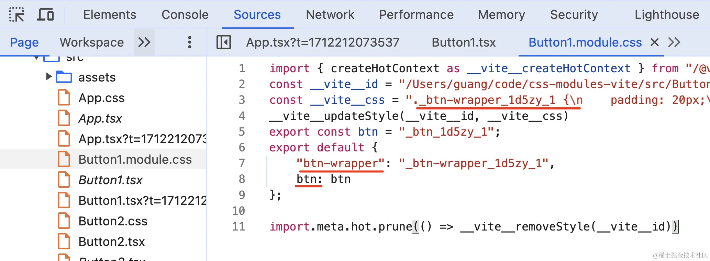

# tailwind

将样式粒子化,变成一个个类名

`npm install -D tailwindcss postcss autoprefixer`

`npx tailwindcss init -p`

## 基础示例

首先要在主文件的.css文件中声明:

```css
//App.css
@tailwind base;       //基础样式
@tailwind components; //组件样式
@tailwind utilities;  //实用程序样式
```

use

```css
.aaa {
    background: red;
    font-size: 14px;
}
.aaa:hover {
    font-size: 30px;
}
@media(min-width:768px) {
    .aaa {
        background: blue;
    }
}

//等同于
<div class="text-[14px] bg-red-500 hover:text-[30px] md:bg-blue-500"></div>
```

## @layer**扩展**&@apply复用

use

```css
//App.css
@tailwind base;       //基础样式
@tailwind components; //组件样式
@tailwind utilities;  //实用程序样式

//扩展components样式
@layer components{
    .btn-pramary{
        //@apply用于允许你应用Tailwind CSS中现有的样式值
        @apply py-2 px-4 text-white font-semibold rounded-lg shadow-md hover:bg-blue-700 focus:outline-none;
    }
}
```

## 自定义插件扩展样式

主要用于多项目复用

```javascript
//.guang.plugin
const plugin = require('tailwindcss/plugin');

module.exports = plugin(function({ addUtilities }) {
    addUtilities({
        '.guang': {
            background: 'blue',
            color: 'yellow'
        },
        '.guangguang': {
            'font-size': '70px'
        }
    })
})
```

## **修改默认样式&修改配置**

```javascript
//tailwind.config.js

/*@type {import('tailwindcss').Config}**/
module.exports ={
    //应用的文件
    content:["./src/*/*.{js,jsx,vue}"],
    //引入上面的自定义插件
    plugins:[require('./guang.plugin')],
    theme:{
        extend:{
            padding:{
                '1':'30px'   
            },
            fontSize:{
                'base':['30px','2rem']
            }
            screens:{
                'md':'300px    
            }        
        }
    }
}
```

## 添加prefix避免和自定义class重名

```javascript
//tailwind.config.js

/*@type {import('tailwindcss').Config}**/
module.exports =
{
    ...,
    //添加 prefix,但是所有的原子 class 都会加上 prefix
    prefix:'qianzui',
}
```

# css Modules

基于postcss


1. Module.Css (module 是一种约定, 表示需要开启 css 模块化).
2. 他会将你的所有类名进行一定规则的替换 (将 footer 替换成 `_footer_i 22 st_1`)
3. 同时创建一个映像对象{ footer: “`_footer_i 22 st_1`” }
4. 将替换过后的内容塞进 style 标签里然后放入到 head 标签中.
5. 将 componentA. Moudle. Css 内容进行全部抹除，替换成 JS 脚本.
6. 将创建的映射对象在脚本中进行默认导出.


css Modues会将.module.css文件编译成这个样子



显而易见,它这样用:

```javascript
import styles from './Button1.module.css';
export default function() {
    return <div className={styles['btn-wrapper']}>
        <button className={styles.btn}>button1</button>
    </div>
}
```