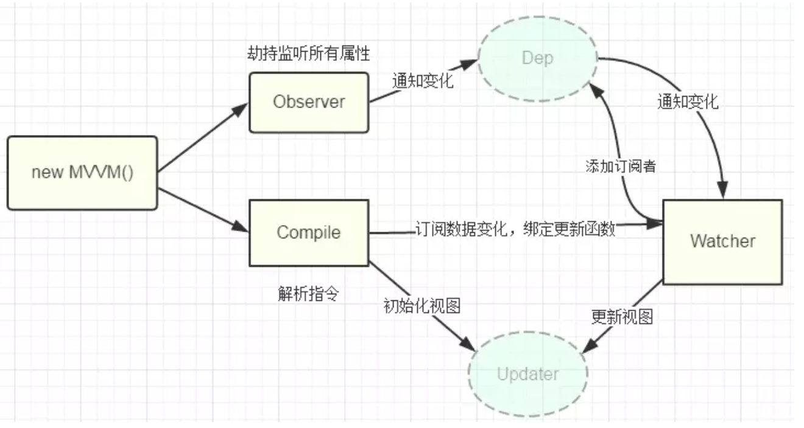

# 原理

## 响应式原理

```js
//总结:
-->beforeCreate钩子,
-->初始化阶段代理和劫持，vue2 defineProperty,vue3 proxy
-->created钩子,
-->解析配置项，创建Watcher,分为:
		-->每个组件的渲染Watcher,computed计算属性Watcher,
		-->watch侦听器Watcher,
		-->$watch(vue2)/watch函数(vue3)创建的Watcher,
-->编译阶段解析指令->AST抽象语法树->遇动态绑定创建Dep
-->渲染阶段，生成vNode树，diff比较，开始渲染,读取响应式属性时，将dep存于Watcher的deps中，watcher存于dep的subs中
-->更新阶段，触发set,Watcher的dep依赖比较，再次执行渲染阶段
​
Vue响应式的核心分为三大模块:Obsever,Compile,Watcher


​
​数据劫持:
	初始化阶段Obsever将数据 深度代理+劫持,3用proxy

数据监测:
	创建Watcher进行检测,
		组件渲染Watcher,监听组件data、computed等选项中的响应式数据的变化,
		computed计算属性Watcher,
		watch侦听器Watcher,
		$watch创建的Watcher,

依赖收集:
	依赖即dep,利用dep连接Obsever和Watcher,
	编译阶段,调用compile解析指令，生成AST抽象语法树,
		每遇到一个动态绑定就创建一个dep对象，
		解析完毕后生成渲染函数
		
		
	
	渲染阶段读取这个动态绑定的属性时，触发proxy,将dep存到使用到的Watcher对象中
	触发mounted钩子
	
派发更新:
	Watcher的deps数组存dep, dep的subs数组存watcher
	数据更新触发代理,对比两个Watcher中deps(存dep)变化,
	变化了就把dirty设置为true更新,
	触发update钩子,
	通过`watcher.update`调用渲染函数，生成新的vNode树(虚拟dom)

diff阶段:
	比较新旧虚拟dom变化，触发视图更新
​
Watcher
收集依赖,通知视图更新
```



## nextTick 作用及原理

```js
作用：vue 更新 DOM 是异步更新的，数据变化，DOM 的更新不会马上完成，nextTick 的回调是在下次 DOM 更新循环结束之后执行的延迟回调。
实现原理：
​
nextTick会将通知视图更新的函数和$nextTick的回调放在callbacks队列中,在一次异步任务中顺序执行,
例如我们在vue中同时执行修改动态数据和调用$nextTick在回调中修改动态数据,修改动态数据和$nextTick的回调会在一次异步任务中执行,
$nextTick的回调导致的动态数据修改会被推入下一个异步任务中执行
​
inputHanlder(e){
    this.$nextTick(()=>{
        this.b+=1;
        console.log('aaa',this.b);
    });
    this.b+=3;
    console.log('bbb',this.b);
}
//异步环境
Promise
MutationObserver
setImmediate
setTimeout
```

## computed 原理

```js
beforeCreate阶段会遍历所有计算属性并为他们单独创建lazy模式的Watcher,当我们首次使用这个计算属性时,会执行Watcher传入的函数,会收集依赖(读取动态属性触发get,将Watcher存在dep中,将dep存在Watcher中),并通过value存储计算的值和dirty判断依赖是否变化
​
​
​
​
​
当组件实例触发 beforeCreate 后，会对 computed 进行处理。
​
//遍历computed,为每个计算属性创建watcher用于收集依赖和通知变化,并传入一个函数,这个函数本质上是计算属性的get
​
它会遍历 computed 配置中的所有属性，为每一个属性创建一个 Watcher 对象，并传入一个函数，
​
//该函数的作用是收集依赖,计算结果
​
该函数的本质其实就是 computed 配置中的 getter，这样一来，getter 运行过程中就会收集依赖
但是和渲染函数不同，为计算属性创建的 Watcher 不会立即执行，因为要考虑到该计算属性是否会被渲染函数使用，如果没有使用，就不会得到执行。
​
//利用lazy配置项开启watcher的懒监视
//懒监视会启用dirty和value两个属性,value用于保存计算后的结果,dirty代表依赖是否变化
//首次绑定计算属性时,会触发计算属性的get,收集依赖,返回计算结果,并将结果保存在value中
//当依赖变化时,比较依赖的值是否变化,
    //变化会修改dirty为true,等待再次获取计算属性时,重新触发A函数,将dirty设为false,收集依赖,返回计算结果,更新value的值
    //没变化时,不会修改dirty的值,等待再次获取计算属性时,直接返回value
​
因此，在创建 Watcher 的时候，它使用了 lazy 配置，lazy 配置可以让 Watcher 不会立即执行。
收到 lazy 的影响，Watcher 内部会保存两个关键属性来实现缓存，一个是 value，一个是 dirty
value 属性用于保存 Watcher 运行的结果，受 lazy 的影响，该值在最开始是 undefined
dirty 属性用于指示当前的 value 是否已经过时了，即是否为脏值，受 lazy 的影响，该值在最开始是 true
Watcher 创建好后，vue 会使用代理模式，将计算属性挂载到组件实例中
当读取计算属性时，vue 检查其对应的 Watcher 是否是脏值,即dirty是否为true，如果是，则运行函数，计算依赖，并得到对应的值，保存在 Watcher 的 value 中，然后设置 dirty 为 false，然后返回。
如果 dirty 为 false，则直接返回 watcher 的 value
巧妙的是，在依赖收集时，被依赖的数据不仅会收集到计算属性的 Watcher，还会收集到组件的 Watcher
当计算属性的依赖变化时，会先触发计算属性的 Watcher 执行，此时，它只需设置 dirty 为 true 即可，不做任何处理。
由于依赖同时会收集到组件的 Watcher，因此组件会重新渲染，而重新渲染时又读取到了计算属性，由于计算属性目前已为 dirty，因此会重新运行 getter 进行运算
而对于计算属性的 setter，则极其简单，当设置计算属性时，直接运行 setter 即可。
```

## compile 原理

```js
complier 主要分为 3 大块：
parse：接受 template 原始模板，按着模板的节点和数据生成对应的 ast
optimize：遍历 ast 的每一个节点，标记静态节点，这样就知道哪部分不会变化，于是在页面需要更新时，通过 diff 减少去对比这部分DOM，提升性能
generate 把前两步生成完善的 ast，组成 render 字符串，然后将 render 字符串通过 new Function 的方式转换成渲染函数
```

## keep-alive 原理

```js
keep-alive维护一个 key 数组和一个缓存对象
​
key 数组记录目前缓存的组件 key 值，如果组件没有指定 key 值，则会为其自动生成一个唯一的 key 值
​
cache 对象以 key 值为键，vnode 为值，用于缓存组件对应的虚拟 DOM
​
在 keep-alive 的渲染函数中，其基本逻辑是判断当前渲染的 vnode 是否有对应的缓存，如果有，从缓存中读取到对应的组件实例；如果没有则将其缓存。
当缓存数量超过 max 数值时，keep-alive 会移除掉 key 数组的第一个元素。
```

## SSR 原理

```js
//看性能优化中的SSR
VueSSR 的原理，主要就是通过 vue/server-renderer 把 Vue 的组件输出成一个完整 HTML，输出到客户端，到达客户端后重新展开为一个单页应用。
​
app.js 作为客户端与服务端的公用入口，导出 Vue 根实例，供客户端 entry 与服务端 entry 使用。客户端 entry 主要作用挂载到 DOM 上，服务端 entry 除了创建和返回实例，还需要进行路由匹配与数据预获取。
​
webpack 为客服端打包一个 ClientBundle，为服务端打包一个 ServerBundle。
服务器接收请求时，会根据 url，加载相应组件，获取和解析异步数据，创建一个读取 Server Bundle 的 BundleRenderer，然后生成 html 发送给客户端。
​
客户端混合，客户端收到从服务端传来的 DOM 与自己的生成的 DOM 进行对比，把不相同的 DOM 激活，使其可以能够响应后续变化，这个过程称为客户端激活（也就是转换为单页应用）。为确保混合成功，客户 端与服务器端需要共享同一套数据。在服务端，可以在渲染之前获取数据，填充到 store 里，这样，在客户端挂载到 DOM 之前，可以直接从 store 里取数据。首屏的动态数据通过 window.INITIAL_STATE 发送到客户端
```

## 数据频繁变化为毛只更新一次

```js
//(这就是只会更新一次的原因,因为一个组件的更新函数只会对应一个watcher,watcher被去重后,只会导致一次更新,例如更新数据)
因为vue将所有watcher存在queue队列,而同一个watcher只会被推入一次,
​
//由于更新函数和nextTick的回调在两个函数中,如果nextTick的回调在更新函数之后,也就是数据更新之后,会导致更新多次
等待本次微任务执行完毕后,在微任务环境下callbacks队列中遍历执行所有的nextTick回调,以及视图更新函数
```

## 每个生命周期阶段做了什么

```
//在beforeCreate-created阶段进行初始化计算属性,数据代理,数据劫持
初始化计算属性
遍历computed中的所有计算属性,为每个计算属性new watcher,并传入函数(这个函数本质上是计算属性的get),和lazy配置项
​
数据代理
将data中的所有属性,所有计算属性和$attrs,$listeners代理到组件实例身上
​
数据劫持
将data,$attrs,$listeners进行深度代理,为其中的每个属性创建dep实例,每个dep中维护subs队列存储watcher用于通知依赖更新
在3中采用Proxy实现Obsever,但是Proxy只能代理一层操作,内部会判断如果是对象/数组的话,会进行深层代理处理
​
//在created-beforeMount阶段进行模板解析和编译渲染函数
//从created阶段可以开始操作数据,created阶段操作不会触发update,用于数据初始化
模板解析
根据template或者render函数中的dom结构生成虚拟DOM,将挂载点对应的虚拟dom赋值给$el
    
编译渲染函数
根据虚拟DOM编译渲染函数,new Watcher的同时传入渲染函数
​
//在beforeMount-mounted阶段进行依赖收集
//从mounted开始可以访问真实dom
依赖收集
调用渲染函数,当读取响应式属性时,触发代理,通过dep的subs队列将编译阶段的watcher存储起来
当读取计算属性时,触发代理,通过dep的subs队列将计算属性对应的watcher存储起来,并调用计算属性的get将计算结果存在value中
​
//在beforeUpdate-updated阶段进行计算属性重计算和视图更新
计算属性重计算
当依赖变化时,触发计算属性对应的watcher,比较依赖的值是否变化,变化则修改dirty为true
​
视图更新
依赖变化时,调用渲染函数,经过diff比较后进行视图更新,
更新过程中遇到计算属性,
    如果dirty是true,调用计算属性的get,然后将dirty设为false,重新收集依赖,计算结果后保存到value中
    如果dirty是false,读取value
```

## data 为毛得是函数

```
避免组件复用时,重复使用data中的对象,如果是函数,每次复用都会产生新的对象
```

## diff

`双端比较` 就是**新列表**和**旧列表**两个列表的头与尾互相对比，在对比的过程中指针会逐渐向内靠拢，直到某一个列表的节点全部遍历过，对比停止。
Vue 2 的 Diff 算法
1. 同级比较：只比较同一层级的节点，不跨层级比较。
2. 双端比较：Vue 2 的 Diff 算法采用双端比较策略，从列表的两端（头部和尾部）开始比较，以尽量减少节点的移动次数。
3. 更新策略：当头尾比较无法匹配时，Vue 2 会尝试复用旧节点，通过更新节点的属性或子节点来匹配新的虚拟节点，同时将其移动到正确的位置，以减少 DOM 操作次数。
Vue 2 的 Diff 算法有一些限制，比如：

1. 同级比较：不会进行跨层级的节点比较，这可能导致一些不必要的 DOM 操作。
2. 静态节点优化：对于静态节点，Vue 2 在构建虚拟 DOM 树时会有一些优化，但在更新时，这些优化不会重复利用。
Vue 3 的 Diff 算法
1. Vue 3 引入了一个全新的编译策略和运行时优化，包括对 Diff 算法的改进。Vue 3 的 Diff 算法带来了更好的性能和更少的内存消耗，主要得益于以下几点：

1. 双端比较优化：Vue 3 继续使用了双端比较算法，但是在细节上进行了优化，比如对于相同节点的处理更加高效。
2. 静态节点提升：Vue 3 在编译时会对静态节点进行提升，这些节点在更新时不会被重新创建，而是直接复用，大大减少了渲染成本。
3. 支持碎片化 (Fragment)：Vue 3 支持碎片化，允许组件有多个根节点，这在 Vue 2 中是不支持的。
4. 区块树 (Block Tree)：Vue 3 引入了区块树概念，它可以跳过静态内容，快速定位到动态节点，减少了 Diff 时的比较次数。
5. 编译时优化：Vue 3 在编译时会对模板进行静态提升，将不会变化的节点和属性提取出来，避免在每次渲染时都重新创建。这样可以减少虚拟 DOM 树的创建和销毁过程，提高性能。


```js
简单来说，diff 算法有以下过程
​
同级比较，再比较子节点
先判断一方有子节点一方没有子节点的情况(如果新的 children 没有子节点，将旧的子节点移除)
比较都有子节点的情况(核心 diff)
递归比较子节点
​
Vue2 的核心 Diff 算法采用了双端比较的算法，同时从新旧 children 的两端开始进行比较，借助 key 值找到可复用的节点，再进行相关操作。
​
Vue3.x 在创建 VNode 时就确定其类型,将静态内容提升，在 mount/patch 的过程中采用位运算来判断一个 VNode 的类型，在这个基础之上再配合核心的 Diff 算法
​
​
​
​
​
正常 Diff 两个树的时间复杂度是 O(n^3)，但实际情况下我们很少会进行跨层级的移动 DOM，所以 Vue 将 Diff 进行了优化，从O(n^3) -> O(n)，只有当新旧 children 都为多个子节点时才需要用核心的 Diff 算法进行同层级比较。
Vue2 的核心 Diff 算法采用了双端比较的算法，同时从新旧 children 的两端开始进行比较，借助 key 值找到可复用的节点，再进行相关操作。
相比 React 的 Diff 算法，同样情况下可以减少移动节点次数，减少不必要的性能损耗，更加的优雅。
Vue3.x 借鉴了 ivi 算法和 inferno 算法
在创建 VNode 时就确定其类型，以及在 mount/patch 的过程中采用位运算来判断一个 VNode 的类型，在这个基础之上再配合核心的 Diff 算法，使得性能上较 Vue2.x 有了提升。该算法中还运用了动态规划的思想求解最长递归子序列。
```

## scoped 原理与样式穿透

样式穿透与局部样式

加了 scoped 会给当前组件的所有原生 dom 标签和当前组件的所有子组件的根标签添加 data-v-唯一 hash 值属性

然后给一连串样式选择器的最后添加属性选择器

vue2  /deep/ :: v-deep : deep (选择器)

vue3 : deep (选择器)

将属性选择器移到 deep 之前那个样式身上, 如果没有, 放到 deep 所在的地方


`::v-deep` `/deep/` 使用:

.a .b .c-->. a .b .c[data-v-hash]

.a v-deep .b .c-->. a[data-v-hash] .b .c

v-deep .b-->[data-v-hash] .b

`:deep(类名)` 使用:
: deep (. a) .b .c-->[data-v-hash] a .b .c


# 神奇的extends与mixins

vue提供了extends和mixins,mixins一个组件,可以直接在它的基础上进行扩展,需要注意的是,

extend功能上与mixins一样,但是会作为第一个mixins

react并没有直接扩展组件的方式,但是可以通过自定义hook,Context或高阶组件的方式进行扩展

```javascript
export default{
    mixins: [组件1,..],
    extends:组件1
}
```
# 创建项目

脚手架 2 版本和之后版本的区别:

2 的 webpack 配置是暴露的, 使用 dev 启动

之后的 webpack 配置是隐藏的, 使用 serve 启动

```javascript
npm i @vue/cli -g
vue create 项目文件名
```
# Vuex💩

## 使用示例

在任意 Vue 组件内通过 this.$store 访问 store

通过 this.$store. state. 模块名. 对应像访问的 state 中的属性访问 store 内的 state 通过...mapState ('模块名',[state 中属性的名字]) 访问 store 内的 state

通过 this.$store.commit ('模块名/mutations 中方法的名字', 参数) 调用 store 内的 mutations

通过 this.$store.dispatch ('模块名/actions 中方法的名字', 参数) 调用 store 内的 actions 通过...mapActions ('模块名',[actions 中方法的名字]) 调用 store 内的 actions
通过...mapGetters ('模块名',[getters 中方法的名字]) 调用 store 内的 getters

namespaced 用于开启命名空间, modules 用于将 store 分成一个个小模块 state 会合并为{模块名: 模块的 state 对象}actions, mutations 会直接添加到 store 身上

**如果遇到同名的 actions/mutations/getters, 会发生命名冲突, 需要开启 namespaced**

```javascript
import Vue from 'vue'
import Vuex from 'vuex'

//处理操作,可异步
//通过$store.dispatch('方法名',参数)触发
const actions={
    方法名({commit,state},传的参数){
        //注意,不需要带模块名
        commit('mutations中方法的名字',传给mutations中方法的参数)
    }
};
//修改状态,仅同步
//通过$store.commit('方法名',参数)触发
const mutations={
    方法名(state,payload){
        //payload就是传的参数
        state.count+=payload;
    }
};
const state={};
//同vue的computed,简化数据操作
//通过$store.getter获取,或者mapGetters
const getters={
    方法名(state){
        return state.count;
    }
};
//划分模块
const countModules= {
    namespaced:true, //开启命名空间
    state,
    actions,
    mutations,
    getters
}

Vue.use(Vuex) //声明并使用官方插件
const store = new Vuex.Store({
    modules:{
        countModules:模块名
    },
    state,
    actions,
    mutations,
    getters
})


new Vue({
    ...,
    store
})
```

## 什么时候用 mutations, 什么时候用 actions

没有异步操作时, 使用 mutations

有异步操作时, 使用 actions 进行异步操作, mutations 仅进行修改 state 操作

## Vuex. Store 配置项

| Vuex 的核心概念 | 是什么                                                              | 怎么写                         | 怎么用                                                                                                                                |                                                                                                                                |     |
| ---------- | ---------------------------------------------------------------- | --------------------------- | ---------------------------------------------------------------------------------------------------------------------------------- | ------------------------------------------------------------------------------------------------------------------------------ | --- |
| modules    | 用于引入小 store, 小 store 会合并为 store                                   |                             |                                                                                                                                    |                                                                                                                                |     |
| namespaced | 命名空间, 避免命名冲突                                                      |                             |                                                                                                                                    |                                                                                                                                |     |
| state      | 共享状态数据                                                           | {状态 1: 值,...}                | 在 Vue 组件内通过 `this.$store.state.状态名 ` 获取状态值                                                                                         |                                                                                                                                |     |
| getters    | 用于简化状态数据操作                                                       | {方法名: (state)=>新数据}          |                                                                                                                                    | 在 Vue 组件内通过 `this.$store.getters.方法名` 获取 getters 里面方法的返回值                                                                      |     |
| mutations  | 用于提供 `直接修改 state` 的方法不能出现在异步, 循环和判断中进行操作 state                    | { 方法名 1 (state, 传的参数){},...}  | 通过 actions 里的方法中 `context.commit('方法名')` 触发 mutations 里的方法 <br>或 Vue 组件内可以通过 this.$sotre.commit ('方法名') 跳过 actions 直接触发 mutations 里的方法 | 两种思考方式:<br>1. 有几个数据, 就写几个修改数据的方法         <br>2.有几个修改数据的时机 (如开始请求, 请求完成), 就写几个修改数据的方法                                                |     |
| actions    | 用于将 vue 操作与 vuex 连接, actions 中的方法接收操作后提交给 mutations 进而修改 vuex 的状态 | {方法名 1 (context, 传的参数){},...} | Vue 组件内通过 `this.$store.dispatch('方法名',传的参数)` 触发 actions 里的方法                                                                       | context 是一个对象, 本质是 store 的阉割复制品, 具有一些方法:<br>context.commit ('mutations 里的方法名', 传的参数) 触发 mutations 里的方法 context. state. 状态获取 state 里的状态 |     |


## mapState/mapMutations/mapActions/mapGetters

返回一个对象, 这四个用法一样, 其中 mapMutations 和 mapActions 几乎不用

mapState 和 mapGetters 是简化数据的操作, 将 vuex 中的数据映射为组件中的数据

mapMutations 和 mapActions 是简化方法的操作, 将 vuex 中的方法映射为组件中的方法 (用的很少)

### 数组写法

```js
computed:{
    //...mapGetters(['方法名',...])
    ...mapState(['状态名',...])
    //...mapGetters('小store名',['方法名',...])
    ...mapState('小store名',['状态名',...])
}
//等同于以下的简写
computed:{
    方法名(){
        return this.$store.getters.方法名
    },
    状态名(){
        return this.$store.state.状态名
    },
    小store方法名(){
        return this.$store.getters.小store名.小store方法名
    },
    小store状态名(){
        return this.$store.小store名.state.状态名
    },
    ...
}

methods:{
    ...mapMutations(['方法名',...]),
    ...mapActions(['方法名',...]),
    ...mapMutations('小store名',['方法名',...]),
    ...mapActions('小store名',['方法名',...]),
}
//等同于以下的简写
methods:{
    mutations方法名(payLoad){
        return this.$store.commit('mutations方法名',payLoad)
    },
    actions方法名(){
        return this.$store.dispatch('actions方法名')
    },
    小store的mutations方法名(payLoad){
        return this.$store.dispatch('小store名/mutations方法名',payLoad)
    }
    小store的actions方法名(){
        return this.$store.dispatch('小store名/actions方法名')
    },
    ...
}

```

### 对象 (取别名) 写法

```js
computed:{
    //...mapGetters({方法名的别名:'方法名',...})
    ...mapState({状态名的别名:'状态名',...})
    //...mapGetters('小store名',{方法名的别名:'方法名',...})
    ...mapState('小store名',{状态名的别名:'状态名',...})
    ...mapState({状态名的别名:state=>state.状态名,...})
    
    ...mapActions({方法名:'别名'})
}

```

## vue3hook

### createStore

替换 VueX 中的 Vuex. Store

```js
import {createStore} from 'vuex';
export createStore(config)

```

### useStore

供 setup 使用

返回 store 对象的函数

```js
const store=useStore()
store.commit()
store.dispatch()
```

# 响应式

vue2数组因为一般情况下数据量很大,Object.defineProperty代理太消耗性能,因此提供七个方法提供响应式:

- push
- unshift
- pop
- shift
- splice
- sort
- reverse

# router

vue-router

## 注册路由器

在 src 文件夹内创建 router 文件夹,并在其内创建 index.js

```javascript
//index.js 中
import Vue from 'vue'
import VueRouter from 'vue-router'
Vue.use(VueRouter) //声明并使用官方插件
import { staticRoutes } from 'router文件夹的目录' //获取静态路由配置表

export default new VueRouter({
    ...,
    mode:'history', //or hash
    routes:staticRoutes,
    //savedPosition存储来时页面的位置,如果是初始化则为undefined
    scrollBehavior (to, from, savedPosition) {
       //跳转路由后页面移动到y:0的位置
       return { y: 0 }
    }
})

```

在 main.js 中注入 router,注入后,可以在任意 Vue 组件内通过 this.$router 获取路由器对象

通过 `this.$route` 获取当前匹配的路由对象

```
new Vue({
    ...,
    router
})

```

## routes

```javascript
routes:[
    {
        path:'/',
        redirect:'重定向的路由地址',
    },
    {
        path:'/路由地址',
        component:路由组件,
        name:'路由名',
        //可以为布尔值,为true会将解析出来的params对象的属性作为属性传参,在路由组件内通过props接收
        //eg:不能接query
        //可以为对象,对象的属性作为属性传参,在路由组件内通过props接收
        //可以为方法,方法的第一个参数是匹配的路由对象,其返回的对象的属性作为属性传参,在路由组件内通过props接收
        props:$route=>({}),
        children:[{
                //可简写为path:'自己的路由名',用于拼接地址
                path:'/父路由名/自己的路由名',    //直接使用该路由地址
                component:路由组件
            },
            {
                //可简写为path:''
                path:'/父路由名',
                redirect:'重定向的路由地址',
            }
        ],
    },
    ...
]

```

```js
const routes = [{
    path: '/new-route1',
    component: NewRouteComponent1,
    children:[{
    path:'/父路由名/自己的路由名',    //直接使用该路由地址
    	component:路由组件
    }]
}]

```

## 动态路由

在特定操作时,改变注册的路由表,一般是在登录的时候获取路由

```javascript
//router.options一般是VueRouter(options)的options
//缓存静态路由
const staticRoutes = router.options.routes;

const addRoutes=(route,parentPath = '')=>{
	//还原初始化的静态路由
	router.options.routes = staticRoutes;
	route.forEach(item => {
		if(route.children){
			addRoutes(route.children,route.path + '/');
		}else{
			router.addRoute(item);
		}
	});
}

const initRoutes=(router)=>{
	const newRouter = new VueRouter();
	router.matcher = newRouter.matcher;
}
//例如现在退出登录
initRoutes(router);

//例如现在登录拿到了动态路由asyncRoutes
addRoutes(asyncRoutes);

//route的来源来自于路由守卫,路由守卫中判断,在跳转登录页时,缓存from路由信息作为route
const route={};
router.beforeEach(form,to,next)=>{
	if(to.path==='\login'){
		route=form||{};
	}
    return hasPermission(router,to)?next():next('/login');
}

//登录完毕后如果需要重定向到之前的页面,需要判断是否还存在权限
const hasPermission=(router,route)=>{
	const routes=router.matcher.options.routes; //3.0x
	//const routes=router.getRoutes() //4.0x
	const hasRoute=(item,route)=>{
		//路由匹配规则
		const matchRule=item.path===route.path||item.name===route.name;
		//如果有子路由,则匹配子路由和当前路由,否则只匹配当前路由
		return item.children?item.children.find(el=>hasRoute(el,route)||matchRule:matchRule;
	}
	return routes.find(el=>hasRoute(el,route));
}
hasPermission(router,route);
//可以在路由守卫中通过next跳转,也可以通过router.replace跳转
```

## 路由导航

name用于匹配路由名称

path对应路由地址

params不能和path共存

## 声明式路由导航

跳转路由使用 `<router-link to="路由地址" />`

`<router-link to="{name:'路由名',params:{参数键值对},query:{参数键值对}}" />`

<router-link to="{name:'路由名',params:{参数键值对},query:{参数键值对}}" />
对象写法需要在路由表中给想匹配的路由写 name

对象写法传的 params 参数如果不在路由表中使用/:key 占位接收,就不会在路径上显示

但仍然可以在路由组件中通过 this.$route.params 获取 params 参数

## 编程式路由导航

`this.$router.push` 跳转路由,并保留之前的记录

`this.$router.replace` 跳转路由,用现在的记录替换之前的记录

`this.$router.replace/push ` 的写法

```javascript
this.$router.replace('路由地址')
//对象写法需要在路由表中给想匹配的路由写name
//对象写法传的params参数如果不在路由表中使用/:key占位接收,就不会在路径上显示
//但仍然可以在路由组件中通过this.$route.params获取params参数
this.$router.replace({
    name:'路由名',
    params:{参数键值对}, //注意写params参数,需要在路由配置中命名路由参数（如 :name 或 :port）
    query:{参数键值对}
})
```

## 展示路由

在要展示路由组件的地方写 `</router-view>`

或 `<keep-alive><router-view/></keep-alive>` 缓存路由组件,使组件不被销毁

二级/多级路由就是在对应的 `</router-view>` 组件内再写 `</router-view>`

## scrollBehavior

- 需要body设置100%,并开启y滚动条,html不能设置height:100%

- 4.0以上是top,left,el; 4.0以下是x,y,selector

- 如果keepalive路由组件,scrollBehavior会失效

### 滚动到固定距离

该函数可以返回一个 ScrollToOptions 位置对象：

```javascript
const router = createRouter({
    scrollBehavior(to, from, savedPosition) {
        // 始终滚动到顶部
        return { top: 0 } //4.0以上是top,left;4.0以下是x,y
    },
})
```

### 滚动到元素位置

可以通过 el 传递一个 CSS 选择器或一个 DOM 元素。在这种情况下，top 和 left 将被视为该元素的相对偏移量。

```javascript
const router = createRouter({
    scrollBehavior(to, from, savedPosition) {
        // 始终在元素 #main 上方滚动 10px
        return {
            // el: document.getElementById('main'),
            el: '#main',//4.0以前用selector
            top: -10,
        }
    },
})
```

### 滚动到锚点位置

```javascript
const router = createRouter({
    scrollBehavior(to, from, savedPosition) {
        if (to.hash) {
            return {
                el: to.hash, //4.0以前用selector
            }
        }
    },
})
```

### 滚动到之前的位置

```javascript
const router = createRouter({
  scrollBehavior(to, from, savedPosition) {
    if (savedPosition) {
      return savedPosition
    } else {
      return { top: 0, behavior: 'smooth' }
    }
  },
})
```

# 路由守卫

(1) 使用该方法时，应该把项目的body的高度设定为100%，y轴方向滚动条显示；（我把html的高也设定100%了，于是导致功能无效）所以html的高度不用设定；

## **完整的路由守卫流程**

导航开始，路由离开。

对应路由组件调用 beforeRouteLeave 守卫并失活。

全部失活后，调用全局的 beforeEach 守卫。

beforeEach结束后，

如果路由的参数发生变化调用 beforeRouteUpdate 守卫 (2.2+)。

在路由配置里调用 beforeEnter。

解析异步路由组件及普通组件。

解析完毕调用组件内部的 beforeRouteEnter。

调用全局的 beforeResolve 守卫 (2.5+)。

导航完毕。

调用全局的 afterEach 钩子。

触发 DOM 更新。

## 全局导航守卫

只要有路由跳转就会拦截

分为前置守卫,解析守卫,后置守卫

在路由配置文件中配置--->router.js | router/index.js

前置守卫

路由开始匹配前拦截(组件未复用)

```javascript
//全局,只挂载在router实例上的
router.[钩子写在这里]

from:当前路由对象
to:目标路由对象
next:一个函数
    next()                        无条件放行
    next(false)                   全部拒绝放行
    next('路径'或一个路由对象)    跳转到指定路由 eg:跳转到新路由后也会触发路由守卫,可能会栈溢出
​
const router=new VueRouter({})
router.beforeEach((to,from,next)=>{
​
})
```

解析守卫

路由匹配完毕后,解析未完成时拦截(组件未复用)

```
router.beforeResolve((to,from,next)={})
```

后置守卫

路由解析完毕后,路由组件未创建时拦截(组件未复用)

```
router.afterEach((to, from) => {})
```

## 路由独享守卫

只有往指定路由跳转时会拦截

路由匹配解析完毕,组件未创建时拦截(组件未复用)

在路由表中指定的路由内配置---router.js|router/index.js--->routes--->指定的路由

```
//路由配置内指写在router配置内的
const router = new VueRuter({
 routes: [
    {
      path: '/admin',
      component: Admin,
      beforeEnter: (to, from, next) =&gt; {
        // 进行权限验证等操作
        if (localStorage.getItem('admin')) {
          next();
        } else {
          next({
            path: '/login',
            query: {redirect: to.fullPath}
          })
        }
      }
   ]
 })
```

## 组件内守卫

只有往指定路由跳转时会拦截

路由匹配并解析完毕,组件未创建时拦截(组件未复用)

配置在组件内

beforeRouterEnter 路由匹配解析完毕,组件即将开始创建时拦截, `不能获取 this` (组件未复用)

beforeRouterUpdate 路由组件开始创建, `可以获取 this`,但页面未更新时拦截(组件复用)

beforeRouterLeave 组件创建完毕,即将离开时拦截(组件销毁)

```javascript
//组件内指写在组件配置内的
<template></template>
export default {
  name: "",
  //钩子写在这里
  data:()=>{
  	return {
  
  	}
  },
};

```

# 图片懒加载

```
npm i vue-lazyload@1 -S
import Vue from 'vue'
import App from './App.vue'
import VueLazyload from 'vue-lazyload'
​
Vue.use(VueLazyload,{
失败的图片
error: require('../src/assets/image/error.png'),
加载中的替代图片
loading: require('../src/assets/image/loading.gif'),
})

​
如果有div包裹着img
<div v-lazy-container="{ selector: 'img' }">
  
</div>
```

# 组件懒加载

```
<template>
    <div>
        <异步组件名 />
    </div>
</template>
<script>
    const 异步组件名 = () => import('组件路径');
    export default {
      component: {
        异步组件名,
      },
      delay: 200,
      timeout: 3000,
      error: ErrorComponent, //错误UI组件
      loading: LoadingComponent //加载UI组件
    };
</script>
```

# 路由懒加载

打包时忽略该路由组件当访问该路由时,该路由组件才会被单独打包成一个 js 文件,并加载

通过 import()函数动态引入路由组件

```
const 组件名=() => import('路由组件所在路径');
const routes = [
  {
    path: "路由地址",
    name: "路由别名",
    component: 组件名,
    meta: {
      //路由元信息,该对象会挂载至该路由对象的meta属性身上
    },
  },
```

# vue自定义

## 自定义过滤器**(vue3没有)**

xx|过滤器名

xx|过滤器名(参数)

### 定义全局过滤器

Vue内都能用

```
//参数1代表xx,arg即过滤器字段传入的一个或多个参数
Vue.filter('过滤器字段',(参数1,..arg)=>{})
```

### 定义局部过滤器

**一般不用局部过滤器**

只在过滤器所在的组件内有用

```
//在配置项中添加filters属性
filters:{
    过滤器名(参数1,..arg){}
}

```

## 自定义指令

指令名不以v-开头,指令名必须全小写,使用v-指令名使用该指令

el代表使用该指令的真实DOM元素

### vue2和3中都有的binging属性

```javascript
{
	value,           //这是指令的绑定值,例如指令是v-lazy="someValue"，value就是"someValue"
	arg,             //这是指令的参数,例如指令是v-lazy:nb，arg就是"nb"
	modifiers:obj,   //这是指令的修饰符,例如指令是v-lazy.nb，modifiers就是{nb:true}
	oldValue,        //这是指令的前一个绑定值
}

```

### vue2

```javascript
// bind的值
	<div v-example:foo.bar="baz">
	binding:{ 
		arg: 'foo',
		modifiers: { bar: true }, //即.xx中的xx,例如 v-指令名.a.b,则为{a:true,b:true}
		value: // =后面的值, 
		oldValue: // 上一次的=后面的值,
	}
// 简写
	// `mounted` 和 `updated`完全一样并且并不需要其他钩子。可简写为一个函数来定义指令
	Vue.directive('指令名',(el, binding, vnode)=>{
	
	})


//定义全局指令
	Vue.directive('指令名',{
	    bind(el,binding, vnode){},             //初次加载绑定的元素时发现有指令绑定时调用
	    inserted(el,binding, vnode){},         //绑定的元素插入到父节点时调用
	    update(el,binding, vnode){},           //当VNode更新时,调用,可理解为响应式数据更新
	    componentUpdated(el,binding, vnode){}, //当组件及其子组件的VNode全部更新后执行操作
	    unbind(el,binding, vnode){},           //指令与元素解绑时调用,例如元素/组件被销毁
	})

```
### vue3

```javascript
// bind的值
	<div v-example:foo.bar="baz">
	binding:{ 
		arg: 'foo',
		modifiers: { bar: true }, //即.xx中的xx,例如 v-指令名.a.b,则为{a:true,b:true}
		value: // =后面的值, 
		oldValue: // 上一次的=后面的值,
	}
// 简写
	// `mounted` 和 `updated`完全一样并且并不需要其他钩子。可简写为一个函数来定义指令
	app.directive('指令名',(el, binding, vnode)=>{
	
	})

//定义全局指令
	app.directive('指令名',{
		//包含vue3除setup外的所有生命周期
	    // 在绑定元素的 attribute 前,或事件监听器应用前调用 
	    created(el, binding, vnode) { 
	    // 下面会介绍各个参数的细节 
	    }, 
	    // 在元素被插入到 DOM 前调用 
	    beforeMount() {}, 
	    // 在绑定元素的父组件 
	    // 及他自己的所有子节点都挂载完成后调用 
	    mounted() {}, 
	    // 绑定元素的父组件更新前调用 
	    beforeUpdate() {}, 
	    // 在绑定元素的父组件,及他自己的所有子节点都更新后调用 
	    updated() {}, 
	    // 绑定元素的父组件卸载前调用 
	    beforeUnmount() {}, 
	    // 绑定元素的父组件卸载后调用 
	    unmounted() {}
	})

```

### 定义局部指令

**一般不用**

只在局部指令所在的组件内有用

```javascript
//在配置项中添加directives属性
directives:{
    //写法同全局指令
}
```

## vue2/3自定义插件与使用

### 使用自定义插件

Vue.use本质是在调用函数,函数式插件直接调用函数,对象式插件调用对象中的install函数

Vue.use(自定义插件)

### 自定义插件

自定义插件分为函数式插件和对象式插件

```javascript
//函数式插件
vue.use(install函数,options);
//对象式插件
vue.use({install,...},options);

//install函数,app是Vue实例
install(app,options){}
//install中options的属性
{
    components,  //全局组件
    directives,  //全局指令
    mixins,      //全局混入
    methods,     //全局方法
    filters,     //全局过滤器
    config,      //全局配置
    store,       //全局store实例
    router,      //全局router实例
}

```

# 获取DOM**/组件实例**

```
<p ref='xx'></p>
配置项中通过this.$refs.x获取

```

# 动态组件

vue2 is是组件name,vue3是组件本身

```
<script setup>
import Foo from './Foo.vue'
import Bar from './Bar.vue'
</script>
​
<template>
  <component :is="Foo" />
  <component :is="someCondition ? Foo : Bar" />
</template>
```

# 配置代理

```javascript
//vue.config.js
devServer: {
  host: '0.0.0.0', // 会映射多个域名地址
  port: 8000, // 默认起始端口号
  open: true, // 自动打开浏览器访问
  proxy: {
    '/app-dev': { // 代理所有以 '/app-dev'开头的请求路径
      // 后台接口地址
      target: '代理服务器访问的目标地址',
      // 服务器得到的就不是当前应用的域名了, 而是后台的域名
      changeOrigin: true,
      // 重写路径: 去掉路径中开头的'/dev-api'
      rewrite: (path) => path.replace(/^\/app-dev/, ''),
      //or
      pathRewrite:{
        '^/api-dev':''
      }
  },
}
```

# vue动态class

以下class里的值都来自于data

## 字符串用法

我们不知道是哪个类时,需要请求后台的数据确定

```javascript
<p :class='style里的类名'></p>
```

## 对象用法

我们不知道使用哪些类,需要请求后台数据确定

```javascript
<p :class='{style里的类名:布尔值,style里的类名:布尔值}'></p>
```

## 数组用法

一般不用

```javascript
<p :class='[style里的类名,style里的类名]'></p>
```

# vue组件通信

数据源在哪,修改数据的方法就在哪

兄弟组件传参:

采用发布订阅模式,一个消息池(共同的祖先组件,store,事件总线等)作为媒介

父子组件传参:

	父传子:prop v-on $children .sync

	子传父:$emit $parent

	v-model默认替代:value+@input

祖孙:

provide/inject

| 2自定义属性       | `props,$attrs`            |     |
| ------------ | ------------------------- | --- |
| 2/3自定义事件     | `$emit/$listeners/$on`    |     |
| 2自定义事件+自定义属性 | `v-model , .sync`         |     |
| 3组件实例        | `$refs,$parent,$children` |     |
| 1非响应式        | `provide/inject`          |     |


## props 组件通信

是 vue 中最基本,使用最多的组件通信方式

用于父子通信:父传子-->通过 props 传值,子传父-->通过函数的参数传值

通过 props 传递过来的数据,不能修改

通过给组件标签添加属性并赋值

props 写法

数组写法

对传递来的数据不做任何限制

```javascript
//接收对应属性名的值
props:['属性名']
```

对象写法

对传递来的数据进行限制

```javascript
//简单限制
props:{
    属性名:类型,
}
​
//复杂限制
props:{
    属性名:{
        type:类型,//还能写成数组,限制类型范围
        default:默认值,//**还能写成函数**并返回默认值
        required:是否必传,不能和default一起出现
    },
}
```

## 自定义事件组件通信

用于发布者向订阅者通信,需要订阅者(

普通的自定义事件通信

用于子向父通信

简单写法

给组件添加自定义事件

```javascript
<Header @自定义事件名='header'></Header>
```

在组件内调用自定义事件

```javascript
//Header组件中
this.$emit('自定义事件名',参数...);
```

麻烦写法

给组件标签添加 ref

```javascript
<Header ref='header'></Header>
```

给组件添加自定义事件

```javascript
mounted(){
    //获取的是组件对象
    this.$refs.header.$on('自定义事件名',事件回调函数)
}
```

在组件内调用自定义事件

```javascript
//Header组件中
this.$emit('自定义事件名',参数...);
```

## 全局事件总线通信

用于发布者向订阅者通信,需要订阅者(

**适用于任意组件间通信**

全局事件总线本质上是一个对象

要作为全局事件总线要符合两个要求:

1. 所有的组件对象都可以访问这个对象

1. 必须能调用

`$on和$emit`

因此,Vue 实例是最佳人选

why?

```javascript
首先,Vue实例与组件实例身上可调用`$emit`和`$bus`
组件实例=new VueComponent();
VueComponent.prototype=Object.create(Vue.prototype);
​
​
//因此
组件实例.__proto__===VueComponent.prototype;
VueComponent.prototype.__proto__===Vue.prototype;
​
//安装总线
const vm=new Vue();
Vue.prototype.$bus=this;
​
​
组件实例.__proto__.__proto__.$bus=vm
//因此
this.$bus可以拿到vm
```

安装总线

一般在 beforeCreate 阶段安装

即给 Vue 的显示原型添加一个属性,该属性指向 Vue 实例

```javascript
Vue.prototype.$bus=this    //这个this得是Vue实例
```

绑定事件

一般在接收数据的一方的 mount 阶段绑定事件

本质上是给$bus 所在的对象添加了事件,这里是给 Vue 实例添加了事件

因为事件函数在接收数据所在的组件,未来触发事件时,传的参会被接收数据所在的组件接收

```javascript
//给vm绑定事件
this.$bus.$on('自定义事件名',函数)
```

触发事件

触发$bus 所在对象上的方法,并给其传参

```javascript
this.$bus.$emit('自定义事件名',参数...)
```

vue.prototype 上的方法

$on

$emit

## 插槽 slot

父向子
子向父传递 props 作为作用域插槽的 scope
父向子传递 html 作为 slot
slot 标签内的内容会作为不传递 slot 的 html 时的默认展示内容


**一个插槽可以接收多个 template 的结构数据**

本质是一个内置的组件-->已经被定义并注册了

插槽分为默认插槽,具名插槽,作用域插槽

插槽标签默认可以写内容

如果父组件标签内使用 template 给插槽填充内容,则使用 template 的内容

如果没有,使用插槽标签内写的内容

**v-slot 可以简写为#**

默认插槽

**默认插槽其实具有名字,名字就叫 default,可以通过 slot name='default'接收**

一个页面一般只有一个,且不写 name

```javascript
<template>
    <父组件标签名>
        //这个v-slot:default可以省略,不写默认就是默认插槽
        <template v-slot:default="scope">
        	<span>{{scope.a}}</span>
        </template>
    </父组件标签名>
</template>
```

父组件标签内

```javascript
<template>
    <slot :a='1'>aaa</slot>
</template>
```

具名插槽

具名插槽可以有多个,每个的 name 值不一样

根据 name 值给对应的插槽传结构数据

```javascript
<template>
    <父组件标签名>
        <template v-slot:name值></template>
    </父组件标签名>
</template>
```

父组件标签内

```javascript
<template>
    <slot name='name值'>aaa</slot>
</template>
```

作用域插槽

数据在父组件中,

数据需要传递给子组件并由子组件展示

父组件标签内

```javascript
<template>
    <子组件标签名 :属性名='属性值'>
        //注意,这个对象可以直接解构-->v-slot='{属性名}'
        //如需指定默认插槽或具名插槽,使用v-slot:default v-slot:name
        <template v-slot="对象别名">
            //得到插槽
            {{对象别名.插槽回传时使用的属性名}}
        </template>
    </子组件标签名>
</template>
```

子组件标签内,子组件通过给插槽绑定属性,回传数据,

这个数据会被子组件标签 v-slot 的值接收,形成一个对象,

在子组件标签的 template 内通过 对象.属性名访问回传的数据

```javascript
<template>
    <slot :属性名='a'></slot>
</template>
```

## v-model

父子之间

给 html 标签使用 v-model='xx',看具体情况

1. radio 和 checkbox 本身没有 value,需要手动写 value
2. radio 收集的是其 value 值
3. select 收集的是其选中的 option 的 value 值
4. checkbox 成组使用时(多个 checkbox 绑定同一个数据),需要使用数组收集其 value 值,最终是选中的 checkbox 的 value 值组成的数组
5. checkbox 单个使用时,收集的是其 checked 属性值

给组件标签使用 v-model='xx',默认情况下相当于

```javascript
可以在组件内通过添加model配置项更改
model:{
    props:'自定义属性名',
    event:'自定义事件名'
}
然后v-model='xx'会变成
:自定义属性名='xx' @自定义事件名='$event.target.value'
```

## .sync

父子之间

`<组件标签名 :自定义属性名.sync='xx' />`

等同于 `<组件标签名 :自定义属性名='xx' @update:自定义属性名='xx= value' />`

update:自定义属性名共同作为一个自定义事件名

组件内通过 `$emit('update:自定义属性名')` 触发

多个属性组成的对象的写法

`:.sync` 后的对象要定义好后赋值,不能直接在指令里写对象

```javascript
:.sync="{a:1}"    //报错
:.sync='xx'    正规写法
xx={a:1}
```

`<组件标签名 :.sync='xx' />`

xx --> `{自定义属性名 1:'xx',自定义属性名 2:'xx'}`

等同于 `<组件标签名 :自定义属性名1='xx' @update:自定义属性名1='xx=value' :自定义属性名2='xx' @update:自定义属性名2='xx=value' />`

## `$attrs` 和 `$listeners `

$attrs

父子之间

`$attrs` 会接收所有未被 `props` 接收的属性形成一个对象

`$attrs ` --> `{自定义属性名 1: 'xx',自定义属性名 2: 'xx'}`

`v-bind="obj"`

`v-bind="$attrs"` --> `:自定义属性名 1="xx" :自定义属性名 2='xx'`

`$listeners `

子向父

`$lisnteners` 会接收组件身上所有的自定义事件形成一个对象

`$lisnteners` --> `{自定义方法名 1:()=>{},自定义方法名 2:()=>{}}`

`v-on="obj"`

`v-on="$listeners"` --> `:自定义方法名 1="xx" :自定义方法名 2='xx'`

## `ref` 和 `$children` 和 ​ `$ parent `

ref

父向子

ref='xx'给 html 标签使用,$refs.xx 获取的是挂载之后的真实 DOM

ref='xx'给组件标签使用,$refs.xx 获取的是组件实例对象

> 扩展:组件对象的$el 可以获取该组件对象的真实 DOM


```javascript
父组件内通过以下方式可以直接操作子组件内的属性
this.refs.xx.组件内的属性
```

$children

父向子,一般用于子组件的统一操作

$children 获取所有子组件实例对象组成的数组

```javascript
父组件内通过以下方式可以直接操作子组件内的属性
this.$children.forEach(item=>item.xx.组件内的属性)
```

$parent

子向父

$parent 获取父组件实例对象

```javascript
子组件内通过以下方式可以直接操作父组件内的属性
this.$parent.xx.组件内的属性
```

## provide 和 inject

祖先组件通过 provide 向其所有子孙后代注入一个依赖,子组件通过 inject 接收

provide

但 provide 可以传响应式数据,使其具有响应式,原理是利用 provide 和 inject 使用的同一地址的响应式对象

例子:

祖先组件:

```javascript
data(){
    return {
        a:1,    -->a=3,不具有响应式
        b:{c:1}    -->b.c=3,-->具有响应式
    }
}
provide(){
    return {
        a:this.a,
        b:this.b
    }
}
```

后代组件:

```javascript
inject:["a","b"]
a=2    -->不具有响应式
b.c=2    -->具有响应式,注意,一定要是响应式对象传递下去才有响应式,provide里拼出来的不具有响应式
```

provide

provide 是组件配置对象的一个配置项

provide 对象写法

```javascript
provide:{}
```

provide 函数写法

```javascript
//函数写法相比对象写法优点:可以通过this操作vm中的数据
provide函数返回一个对象,该对象可以被后代组件inject获取
provide(){return {}}
```

inject

inject 会接收 最近的 与 inject 数组中 属性同名 的 provide 对象的属性

```javascript
inject:['属性1',..]
```

# 生命周期

创建阶段和挂载阶段统称初始化阶段

常用 beforeUpdate 和 mounted 这两个钩子

| 创建 Vue 实例--->new Vue() |   | 
| -- | -- |
| 初始化事件对象和生命周期 |   | 
| beforeCreate | 只执行一次 | 
| 初始化事件代理与事件劫持, |   | 
| created | 只执行一次 | 
| 创建 Vue 实例的 |   | 
| 判断是否有 template, |   | 
| beforeMount |   | 
| 将虚拟 DOM 变成真实 DOM |   | 
| mounted | 只执行一次 | 
| 当虚拟 DOM 或动态数据更新时 |   | 
| beforeUpdate | 执行 0~n 次 | 
| 新旧虚拟 DOM 比较,页面重新渲染( |   | 
| updated | 执行 0~n 次 | 
| 重复以上过程 |   | 
| 当 Vue 实例.$destroy 被调用 |   | 
| beforeDestroy | 只执行一次 | 
| 移除数据代理,事件监听等 |   | 
| destroyed | 只执行一次 | 


# 挂载到根元素并渲染

```javascript
import Vue from "vue";
import App from "./App.vue";
new Vue({
    el:'#root',    //挂载根节点
    render:(h)=>h(App)//渲染根元素
    或
    components:{App}//需要具有模板解析器vue.js使用,默认引入的是不具有的,需要手动更改(vue/dist/vue.esm.js)
})
​
或
new Vue(config).$mount('#root')//挂载根节点
```

