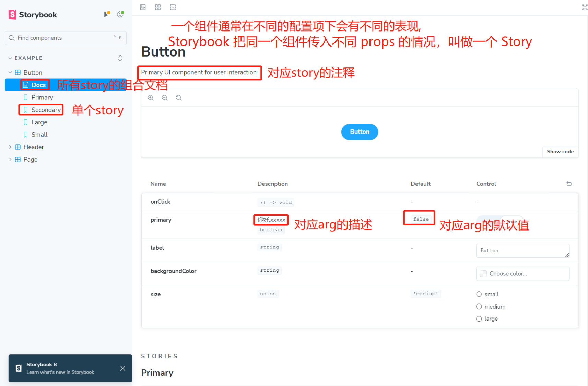

# 初始化项目

npx 

npx 

npx 

[https://storybook.js.org](https://storybook.js.org)

[https://juejin.cn/book/7294082310658326565/section/7298717990865633318](https://juejin.cn/book/7294082310658326565/section/7298717990865633318)

# **开造**

storybook运行依赖.storybook下的配置文件,main.ts是主文件,



## 目录结构

```
.storybook
src
    assets
    components
        Button
            Button.stories.ts
            index.css
            index.tsx
```

## Button组件

```javascript
// Button/index.tsx
import React from 'react';
import './index.css';

export interface ButtonProps {
  /** 你好,xxxxx */
  primary?: boolean;
  backgroundColor?: string;
  size?: 'small' | 'medium' | 'large';
  label?: string;
  onClick?: () => void;
}

/** Primary UI component for user interaction */
export const Button = ({
  primary = false,
  size = 'medium',
  backgroundColor,
  label,
  ...props
}: ButtonProps) => {
  return (<button
      style={{ backgroundColor }}
      {...props}
    >{label}</button>);
};
```

## Button的stories配置

meta中这些配置项,除了title,都可以写到preview.ts中作为全局配置

```javascript
// Button/Button.stories.ts
import type { Meta, StoryObj } from '@storybook/react'; //vue3是@storybook/react
import { expect } from '@storybook/test'
import { Button,ButtonProps } from './index';

type metaType=Meta<typeof Button>;
//Button下所有story的公共配置
const meta: metaType = {
  title:'Example/Primary', //Example/显示的名称
  tags:['autodocs'], //生成上图的Docs那个组合文档
  args:{}, //传递给组件的参数
  argTypes:{}, //补充未写注释,未写默认值的arg描述
  
  //可以用render自定义组件,一般返回组件,vue可返回组件配置项
  render(args:ButtonProps,meta:metaType){
     //meta.loaded loaders数组中 函数的返回值组成的对象
     return <Button {...args} />
  },
  //打断渲染,用来请求初始化数据
  loaders: [
    async () => {
      await '假装 fetch'
      return {list: [111]}
    },
  ],
  //组件渲染完毕就会执行,常用来测试
  async play(meta:metaType){
      //断言函数,判断meta.args.backgroundColor==='green',结果会在控制台显示
      await expect(meta.args.backgroundColor).toEqual('green');
  },
};
export default meta;

type Story = StoryObj<typeof Button>;
//导出的变量会成为Button下的一个story,见上图
export const Primary: Story = {
  args: {}
};
```