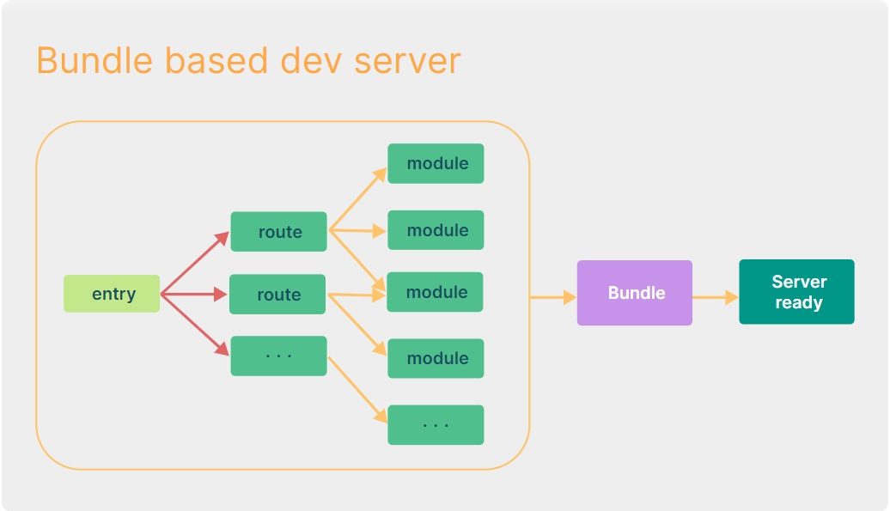
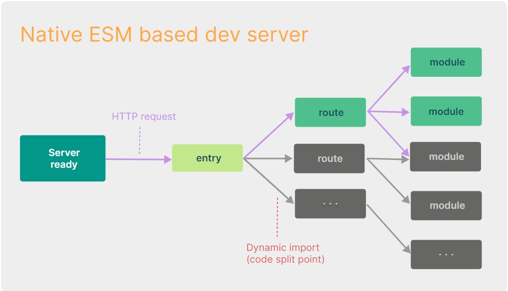

# 原理

vite是基于es module(script type:module&import)实现的，当我们访问index.html的时候，浏览器会引入index.html引入的相关模块及其依赖模块并进行下载操作

vite将代码分为源码和依赖两块,依赖是指node module中的第三方包(不会变),源码是指开发的代码(时刻会变)

在

- 如果有缓存且依赖无变化,直接使用缓存,

- 先扫描项目引入的依赖(通过esbuildScanPlugin)，

- 再将node_modules下非esmodule的处理为esmodule，

- 最后将他们进行打包变成一个esmodule模块(结果缓存在node_modules/.vite中)

服务起了后,vite会基于connect起了一个开发服务并监听请求，并通过中间件处理这些请求(项目跑的时候可以看到那些中间件)，将源码文件进行编译。

# 环境变量

默认情况下:

npm run dev 会加载 .env 和 .env.development 内的配置npm run build 会加载 .env 和 .env.production 内的配置

development 和production 即mode，mode 可以通过命令行 --mode 选项来重写。

**所有env环境变量保存在import.meta.env对象中**

```
//例如:
"scripts": {
  "test": "vite --mode test",
  "dev": "vite",
  "build": "vite build"
},
​
//此时npm run test 会加载 .env 和 .env.test 内的配置
```

# 特点

1. 依赖采用预构建&强缓存,源码采用按需编译&协商缓存

1. 预构建采用esbuild,而esbuild用go写的,很快

1. 按需编译仅在devServer请求该文件时去编译该文件为ESM返回给浏览器处理

# 模块的区分

vite将模块区分为 

## 依赖

即不会变动的纯 JavaScript,例如组件库

Vite 将会使用 

## 源码

并

Vite 以 

Vite 在浏览器请求源码时进行转换并按需提供源码,让浏览器接管打包的部分工作.

而

以实现根据情景动态导入代码，即只在当前屏幕上实际使用时才会被处理。





## 热更新HMR

在 Vite 中，HMR 是在原生 ESM 上执行的。当编辑一个文件时，Vite 只需要精确地使已编辑的模块与其最近的 HMR 边界之间的链失活[

Vite 同时利用 HTTP 头来加速整个页面的重新加载（再次让浏览器为我们做更多事情）：

**源码模块**

**依赖模块**