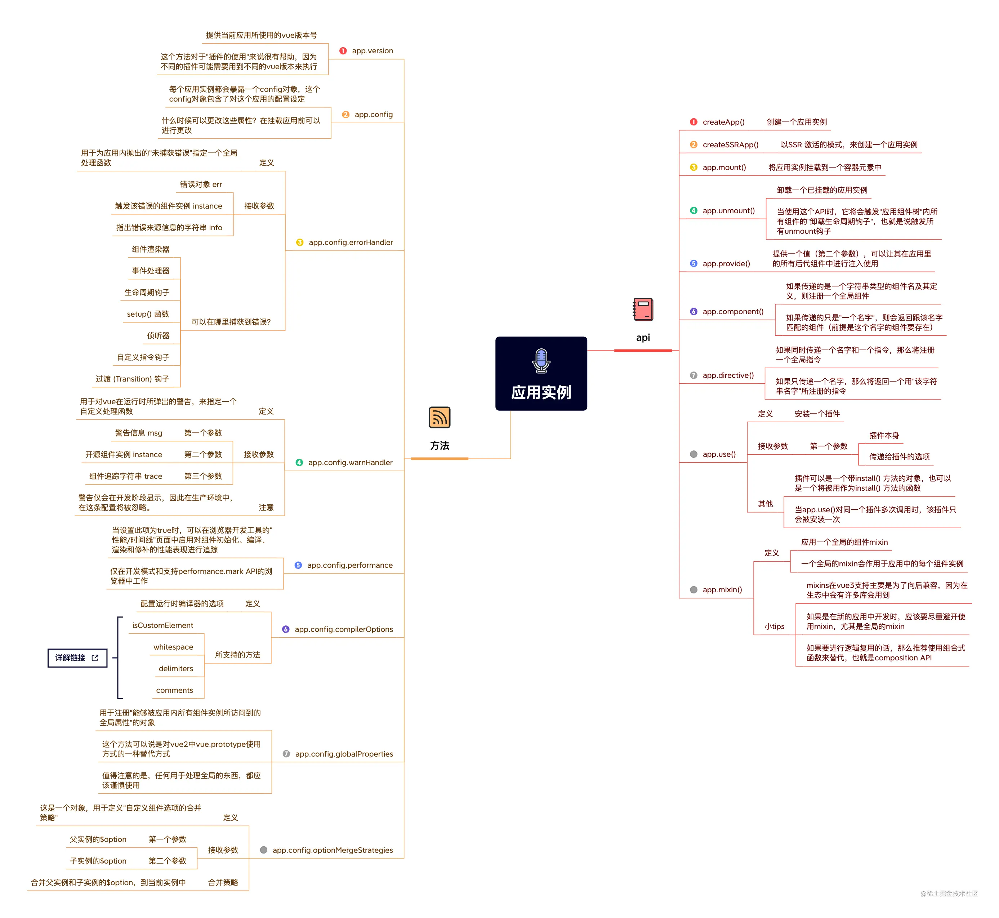
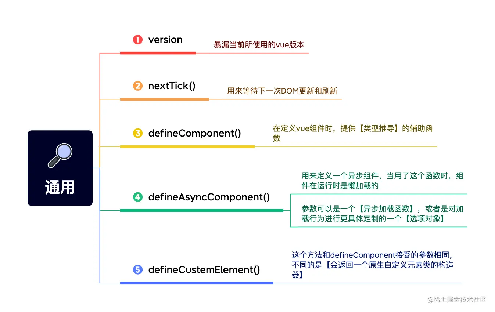
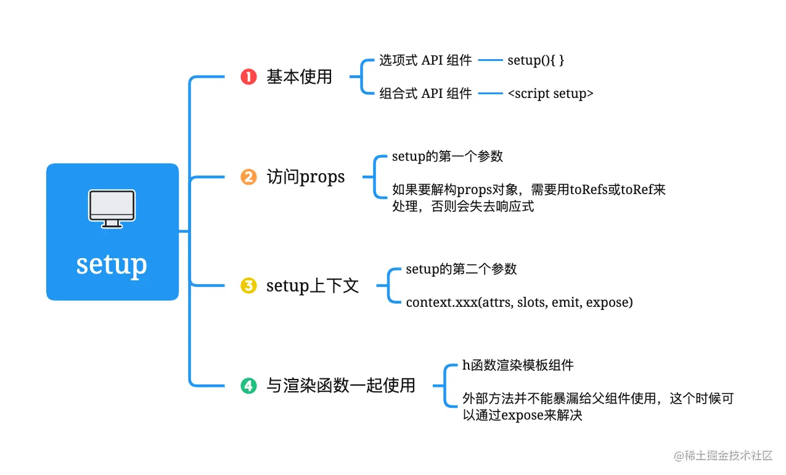
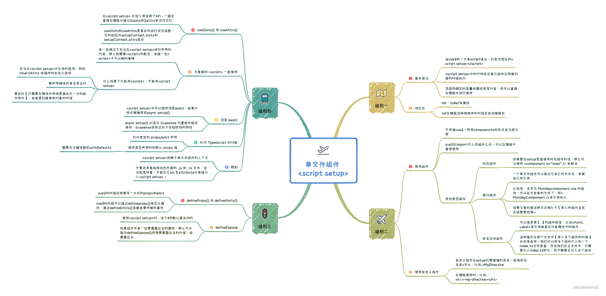
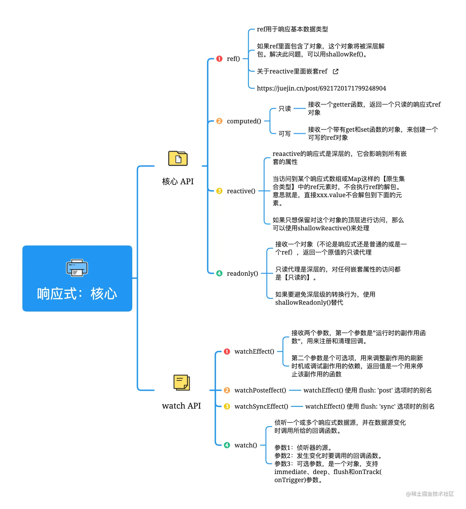
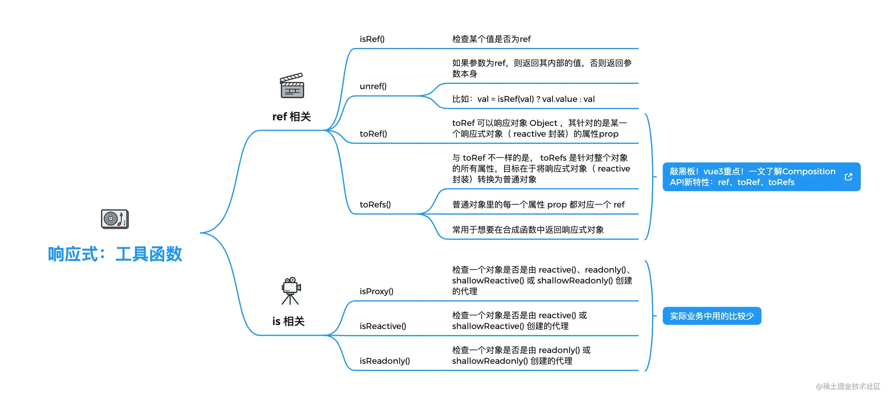
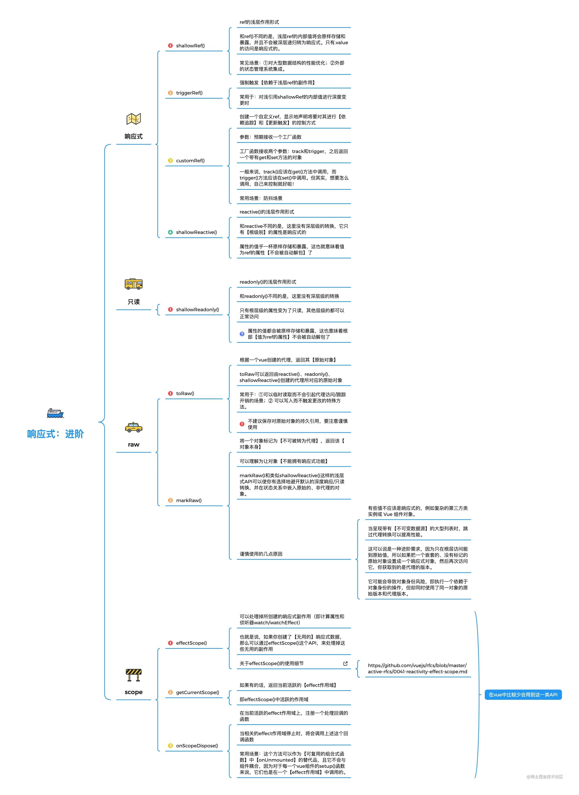
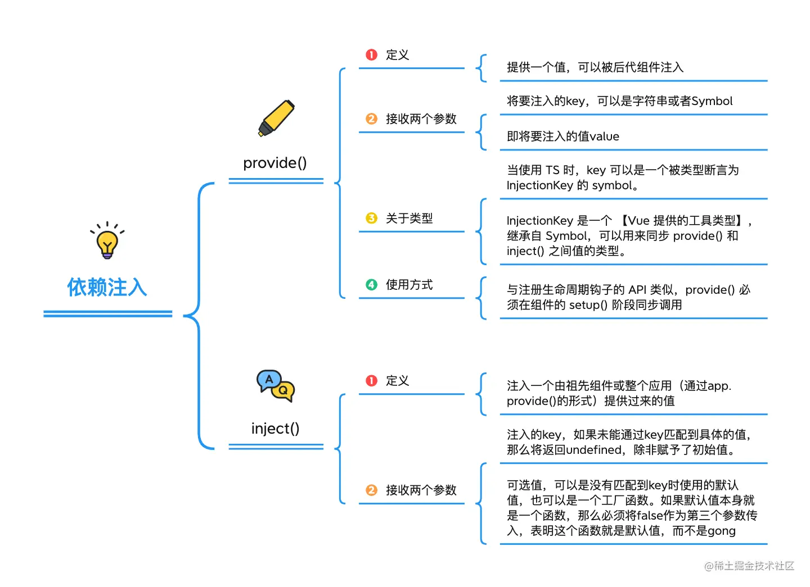
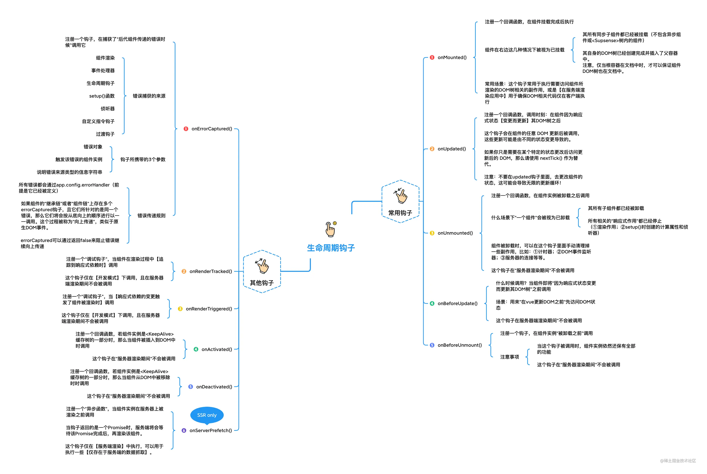
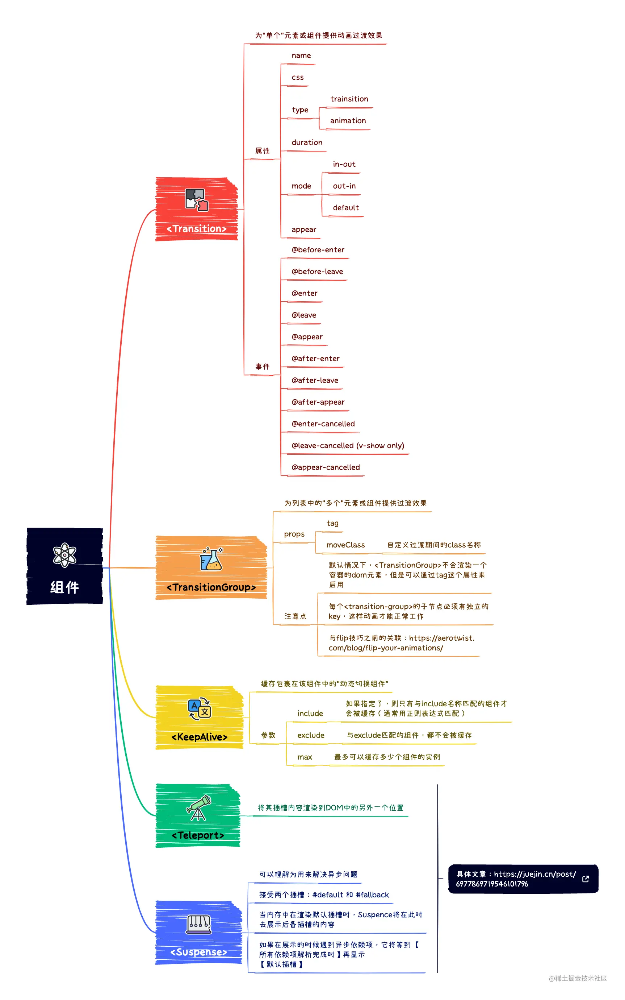

```js
//初始化项目配置
npm init vue@latest
```

# 神奇的extends与mixins

vue提供了extends和mixins,mixins一个组件,可以直接在它的基础上进行扩展,需要注意的是,

extend功能上与mixins一样,但是会作为第一个mixins

react并没有直接扩展组件的方式,但是可以通过自定义hook,Context或高阶组件的方式进行扩展

```javascript
export default{
    mixins: [组件1,..],
    extends:组件1
}
```

# 相关知识

## 什么是副作用?

副作用是指执行某操作时,产生的后果

例如watch的回调,监听依赖触发回调,触发回调就是后果,即副作用

# 应用实例

[https://cn.vuejs.org/api/application.html](https://cn.vuejs.org/api/application.html)



app.createApp(options) :用于创建组件实例,接收optionsAPI

app.use(插件) 用于安装插件 接收插件(插件必须有install方法)

app.mixin(options)

app.mount('#app') 指定挂载到哪个元素

app.unmount() 卸载组件

## app.provide()

提供一个值，可以在应用中的所有后代组件中注入使用。

- 类型


```ts
interface App {
  provide<T>(key: InjectionKey<T> | symbol | string, value: T): this
}
```

- 详细信息

第一个参数应当是注入的 key，第二个参数则是提供的值。返回应用实例本身。

- 示例


```js
import { createApp } from 'vue'
​
const app = createApp(/* ... */)
​
app.provide('message', 'hello')
```

在应用的某个组件中：


```js
import { inject } from 'vue'
​
export default {
  setup() {
    console.log(inject('message')) // 'hello'
  }
}
```

## app.config

### app.config.errorHandler

用于定义 接收应用内未捕获错误的 全局错误处理函数

可以捕获的范围:

1. methods

1. 生命周期钩子,包括setup

1. watch

1. dire

```js
有三个参数:
    err //错误对象
    instance //抛出错误的组件实例
    info //错误来源信息
```

### app.config.warnHandler

与errorHandler一样,接收并处理警告信息

### app.config.performance

设置此项为 ` true` 可以在浏览器开发工具的“性能/时间线”页中启用对组件初始化、编译、渲染和修补的性能表现追踪。

### app.config.globalProperties

替代vue2的vue.prototype

### app.config.compilerOptions.isCustomElement

指定一个检查方法来识别原生自定义元素

```js
// 将所有标签前缀为 `ion-` 的标签视为自定义元素
app.config.compilerOptions.isCustomElement = (tag) => {
  return tag.startsWith('ion-')
}
```

### app.config.optionMergeStrategies

[https://cn.vuejs.org/api/application.html#app-config-optionmergestrategies](https://cn.vuejs.org/api/application.html#app-config-optionmergestrategies)

一个用于定义自定义组件选项的合并策略的对象。

- 类型
```ts
interface AppConfig {
  optionMergeStrategies: Record<string, OptionMergeFunction>
}
​
type OptionMergeFunction = (to: unknown, from: unknown) => any
```

- 详细信息

一些插件或库对自定义组件选项添加了支持 (通过注入全局 mixin)。这些选项在有多个不同来源时可能需要特殊的合并策略 (例如 mixin 或组件继承)。

可以在 `app.config.optionMergeStrategies` 对象上以选项的名称作为 key，可以为一个自定义选项注册分配一个合并策略函数。

合并策略函数分别接受在父实例和子实例上定义的该选项的值作为第一和第二个参数。

- 示例

```js
const app = createApp({
  // 自身的选项
  msg: 'Vue',
  // 来自 mixin 的选项
  mixins: [
    {
      msg: 'Hello '
    }
  ],
  mounted() {
    // 在 this.$options 上暴露被合并的选项
    console.log(this.$options.msg)
  }
})
​
// 为 `msg` 定义一个合并策略函数
app.config.optionMergeStrategies.msg = (parent, child) => {
  return (parent || '') + (child || '')
}
​
app.mount('#app')
// 打印 'Hello Vue'
```

# 通用API



# 组合式API

即composition API

用于setup函数与setup script

# setup



```js
props:['val'],
setup(props, context) {
    //props只能获取props配置项接收的prop
    console.log(props.val)
    
    // 透传 Attributes（非响应式的对象，等价于 $attrs）
    console.log(context.attrs)
​
    // 插槽（非响应式的对象，等价于 $slots）
    console.log(context.slots)
​
    // 触发事件（函数，等价于 $emit）
    console.log(context.emit)
​
    // 如果setup函数返回值是返回渲染函数的函数,或者返回jsx的函数,使用如下方法暴露公共属性（函数）
    //if
    return ()=>jsx
    //or
    return h('div',1);
    //use 它定义暴露给父组件的东西
    context.expose({
      increment
    })
}
```

## script setup



### **编译器宏**

这些script setup中的工具函数,会在编译时自动注入,无需手动引入,为防止类型检测时报错,需要进行类型定义

```javascript
//为了避免eslint检测类型时报错,需要声明这些编译器宏
1.下载eslint-plugin-vue,这个插件默认支持 Vue 3 的编译器宏,在.eslintrc中引用它,更多用法自己去搜
    extends: [
      "plugin:vue/vue3-essential",
      "eslint:recommended",
      "@vue/eslint-config-typescript",
      "@vue/eslint-config-prettier",
    ],
    
2.在.eslintrc中,自己定义
    globals: {
      defineProps: 'readonly',
      defineEmits: 'readonly',
      defineExpose: 'readonly',
      withDefaults: 'readonly',
      useSlots: 'readonly',
      useAttrs: 'readonly'
    },
    
3.在每个script setup中单独定义
    <script setup>
        /* global defineEmits,defineProps,withDefaults,defineExpose,useSlots,useAttrs,defineOptions,defineSlots,defineModel */
        defineProps({})
    </script>
```

仅用于script setup的api,具有以下几个:

#### defineEmits

```javascript
<script setup>
    /* global defineEmits */
    
    //仅限制方法名,不限制参数
    const emit=defineEmits(['事件名',...]);
    //限制方法名和参数
    const emit=defineEmits<{
        (event:'事件名','参数名':类型,...):返回值
        //例子
         (e: 'change', id: number): void
    }>();
    // 3.3+：另一种更简洁的语法
    const emit = defineEmits<{
      事件名: [参数名: 类型] // 具名元组语法
      //例子
      update: [value: string]
    }>()
</script>
```

#### defineProps

```javascript
<script setup>
    /* global defineProps */
    
    //仅限制属性名,不限制类型
    const emit=defineProps(['属性名',...]);
    
    //限制属性名和类型
    const emit=defineProps<{
        属性名:类型,...
    }>();
</script>
```

#### withDefaults

定义props的默认值

```javascript
<script setup>
    /* global withDefaults */
    const props = withDefaults(defineProps<Props>(), {
      msg: 'hello',
      labels: () => ['one', 'two']
    });
</script>
```

#### defineExpose

setup script中的expose,用于自定义暴露给父组件的内容

```javascript
<script setup>
    /* global defineExpose */
    defineExpose({
        ...
    })
</script>
```

#### useSlots&useAttrs

顾名思义,返回slots和attrs

```javascript
<script setup>
    /* global useSlots,useAttrs */
    const slots=useSlots();
    const atrrs=useAttrs();
</script>
```

#### defineOptions 3.3+

用于声明组件选项,即options API,无需再单独定义script

例如定义组件名字

```javascript
<script setup>
    /* global defineExpose */
    defineOptions({
      inheritAttrs: false, //是否将未被props接收的属性绑定到组件根节点上
      customOptions: {
      }
    })
</script>
```

#### defineSlots() 3.3+

定义slot的名称和要传递回去的props

```javascript
//Com
<template>
    <slot name="slotName" :foods="foods" :games="games">我是插槽1</slot>
</template>
<script setup lang="ts">
    /* global defineSlots */
    const slots = defineSlots<{
      slotName(props: { foods: string,games:string }): any, //定义slotName插槽和它属性传参
    }>()
</script>
​
​
// parent
<template>
    <Com>
        <template v-slot:slotName="scope">  //scope--> {foods,games}
            {{ scope }}
        </template>
    </Com>
</template>
```

#### defineModel 3.4+

```javascript
<script setup lang="ts">
     /* global defineModel */
    // 声明 "modelValue" prop，由父组件通过 v-model 使用
    const model = defineModel()
    // 或者：声明带选项的 "modelValue" prop
    const model = defineModel({ type: String })
    
    
    // 在被修改时，触发 "update:modelValue" 事件
    model.value = "hello"
    
    
    // 声明 "count" prop，由父组件通过 v-model:count 使用
    const count = defineModel("count")
    // 或者：声明带选项的 "count" prop
    const count = defineModel("count", { type: Number, default: 0 })
</script>
```

### 顶层await

setup script中使用await表达式,会将setup变为async setup,此时组件需要使用 [[#Suspense]] 组件包裹

### 动态组件

vue2的is绑定组件的name值,vue3的is绑定组件

```js
<script setup>
    import Foo from './Foo.vue'
    import Bar from './Bar.vue'
</script>
​
<template>
  <component :is="Foo" />
  <component :is="someCondition ? Foo : Bar" />
</template>
```

### 递归组件

一个单文件组件可以通过它的文件名被其自己所引用。

例如：名为 `FooBar.vue` 的组件可以在其模板中用引用它自己。

请注意 `这种方式相比于导入的组件优先级更低`。如果有具名的导入和组件自身推导的名字冲突了，可以为导入的组件添加别名

```js
<template>
  <ul>
    <template v-for="item in list">
      <li>{{ item.name }}</li>
      <FooBar v-if="'children' in item" :list="item.children" />
    </template>
  </ul>
</template>
​
<script setup>
const props = defineProps({
  list: {
    type: Array,
    default: () => []
  }
})
</script>
```

### 命名空间组件

```js
* components.js
import { ComA } from './ComA.vue';
import { ComB } from './ComB.vue';
export {ComA,ComB};
​
* App.vue
import { * as Form } from './components';
<Form.ComA />
<Form.ComB />
```

### 自定义指令

局部自定义指令不需要显式注册,命名需要满足小驼峰

```js
<script setup>
const vMyDirective = {
  beforeMount: (el) => {
    // 在元素上做些操作
  }
}
</script>
<template>
  <h1 v-my-directive>This is a Heading</h1>
</template>
```

如果指令是从别处导入的，可以通过重命名来使其符合命名规范：

```js
<script setup>
import { myDirective as vMyDirective } from './MyDirective.js'
</script>
```

### 限制
`<script setup>` 中的代码依赖单文件组件的上下文。
不能将其内容单独移动到外部的.js和.ts文件
这意味着不能与src属性共存
## 响应式：核心



### ref&reactive&readonly

ref:   [https://cn.vuejs.org/api/reactivity-core.html#ref](https://cn.vuejs.org/api/reactivity-core.html#ref)

reactive: [https://cn.vuejs.org/api/reactivity-core.html#reactive](https://cn.vuejs.org/api/reactivity-core.html#reactive)

ref 接收 `基本类型或对象` ,一般用来定义 `基本类型`

reactive 接收 `对象`, 用来定义 `复杂数据类型`

readonly 接收 `Proxy或普通对象`, 定义所有 `属性只读的对象`

ref定义复杂数据类型时,会调用与reactive原理相同的方法,将创建的Proxy对象挂在value属性身上

```
//demo
import {ref,reactive,readonly} from 'vue';
const a=ref(1); //a.value===1
const obj=reactive({a:1}); //object.a===1
const obj1=readonly({a:1}); //
```

### watch&watchEffect&computed

#### watch

以定义的数据源listenState为依赖(指定依赖),在依赖变化时调用回调,根据配置项不同具有不同操作

监听 `ref返回值.value` 或 ` reactive返回值 `

监听 `reactive返回值` 时,会自动添加deep配置项

如需监听对象中的某个属性,第一个参数传回调返回改属性

```
watch(listenState,changeHandler,options);
//回调形式可用于监视单个属性
watch(()=>listenState,changeHandler,options);
```

demo

```
const val=ref(1);
//c,p的值是val.value的值
watch(val,(c,p)=>{},{immidiate:true,...});
​
const val=reactive({a:1});
//监听单个属性的写法
watch(()=>val.a,(c,p)=>{},{immidiate:true});
​
//如果是val.a+1 ,p的值是Proxy {a: 2},p的值是Proxy {a: 1}
//监听reactive,options未写deep配置项时,默认会添加deep:true
watch(val,(c,p)=>{},{immidiate:true});
//等于
watch(val,(c,p)=>{},{immidiate:true,deep:true});
```

#### watchEffect

自动收集并追踪依赖,与computed类似,在依赖更新和初始化时会调用

接收两个参数,参数1是回调,参数2是配置项

返回 终止函数

第一个参数就是要运行的副作用函数。这个副作用函数的参数也是一个函数，用来注册清理回调。清理回调会在该副作用下一次执行前被调用，可以用来清理无效的副作用，例如等待中的异步请求

```
const stop=watchEffect(async (cancelHandler)=>{
    this.a=1;
    cancelHandler(回调) //接收一个回调,该回调会在下次watchEffect回调被调用前被调用,常用于取消请求
},options);
stop() // 终止监听
```

#### computed

返回一个只读的ref对象

```
computed(getHander,debuggerOptions);
computed(options,debuggerOptions)
```

demo

```
const count = ref(1)
//创建只读
const plusOne = computed(() => count.value + 1)
//创建可读可写
const plusOne = computed({
  get: () => count.value + 1,
  set: (val) => {
    count.value = val - 1
  }
})
console.log(plusOne.value) // 2
```

#### flush配置项

watch&watchEffect都有

1. flush:'pre'  默认，dom更新前调用

1. flush: 'post'  dom更新后调用

1. flush: 'sync'  同步调用,即数据更新,立即调用

#### onTrack

三者都有,仅在开发模式下有用

依赖 `被追踪` 时触发,即get的时候

onTrack?: (

#### onTrigger

三者都有,仅在开发模式下有用

依赖 `被更改` 时触发,即set的时候

onTrigger?: (event: DebuggerEvent) => void
#### 三者的共与异

共:

1. 都会在依赖变化时触发副作用
2. 都具有onTrack与onTrigger

异:

1. watchEffect和computed会自动收集依赖,而watch需要指定
2. 仅watch&watchEffect有flush配置项
3. 仅watch&watchEffect会返回用于停止副作用的函数
4. 仅computed有immediate和deep配置项
5. 仅computed会返回只读的ref对象

## 响应式：工具函数



### toRef&toRefs

#### toRef

基于Proxy对象的属性,返回一个Ref对象,当这个ref对象的key改变时,Proxy对象对于的key会改变,反之亦然

```
toRef(object,key);
```

demo

```
const reactiveDemo=reactive({a:1});
const toRefForReactive=toRef(reactiveDemo);
toRefForReactive.value.a=2;  //同时reactiveDemo.a的值会变成2
reactiveDemo.a=3;  //同时toRefForReactive.value.a的值会变成3
​
const refDemo=ref({a:1});
const toRefForRef=toRef(refDemo.value);
toRefForRef.value.a=2; //同时refDemo.value.a的值会变成2
refDemo.value.a=3; //toRefForRef.value.a的值会变成2
```

#### toRefs

与toRef类似,区别是没有key入参,接收一个Proxy,返回一个Porxy对象的属性值转换为Ref对象的普通对象

```
toRefs(object);
```

demo

```
const reactiveDemo=reactive({a:1,b:2});
const toRefsObj=toRefs(reactiveDemo); //toRefsObj:{a:Ref,b:Ref}
toRefsObj.a.value=2;  //同时reactiveDemo.a的值会变成2
reactiveDemo.a=3;  //同时toRefForReactive.value.a.value的值会变成3
```

### isProxy()

检查一个对象是否是由 

- 类型

ts

```
function isProxy(value: unknown): boolean
```

### isReactive()

检查一个对象是否是由 

### isRef

判断某个值是否是ref

```
isRef(ref) :boolean
```

### unRef

如果接收的参数是ref,则返回ref的值,否则返回参数本身

```
unRef(params)
等同于 val=isRef(params)?Params.value:params;
```

## 响应式：进阶



### shallowRef&triggerRef

#### shallowRef

浅层作用形式的Ref

只有根层级的属性即 `仅value具有响应式`

```
const a=shallowRef({a:1});
//a.value=1; //具有响应式
//a.value.a=2; //不具有响应式
```

#### triggerRef

强制触发依赖于一个浅层 ref的副作用,通常在浅层ref 的value是对象时,改变该对象的内部值时使用

```
const shallow = shallowRef({
  greet: 'Hello, world'
})
// 初始化和触发shallow的副作用时打印 "Hello, world"
watchEffect(() => {
  console.log(shallow.value.greet)
})
triggerRef(shallow) //触发副作用,打印 "Hello, world"
​
shallow.value.greet = 'Hello, universe' // 这次变更不会触发副作用，因为这个 ref 是浅层的
​
​
triggerRef(shallow) //触发副作用,打印 "Hello, universe"
```

### shallowReactive&shallowReadonly

浅层作用形式的reactive和readonly

#### shallowReactive

只有根层级的属性具有响应式。

```js
const state = shallowReactive({
  foo: 1,
  nested: {
    bar: 2
  }
})
// 更改状态自身的属性是响应式的
state.foo++
​
// ...但下层嵌套对象不会被转为响应式
isReactive(state.nested) // false
​
// 不是响应式的
state.nested.bar++
```

#### shallowReadonly

只有根层级的属性变为了只读。

```js
const state = shallowReadonly({
  foo: 1,
  nested: {
    bar: 2
  }
})
​
// 更改状态自身的属性会失败
state.foo++
​
// ...但可以更改下层嵌套对象
isReadonly(state.nested) // false
​
// 这是可以通过的
state.nested.bar++
```

### customRef

自定义的 ref，自由控制收集依赖和触发更新的时机

``` js
<script setup>
import { useDebouncedRef } from './debouncedRef'
const text = useDebouncedRef('hello')
</script>
​
<template>
  {{text}}
  <input v-model="text" /> //绑定时要获取值,触发get,收集依赖,修改时,触发set,触发更新
</template>
​ ```
​
```js
​/* - debouncedRef.js */
import { customRef } from 'vue'
//防抖demo,由于每次触发set会清空定时器,导致trigger不会触发,快速敲击时,仅最后一次敲击会延时300ms触发更新视图
export function useDebouncedRef(value, delay = 200) {
  let timeout
  return customRef((track, trigger) => {
    return {
      get() {
        track() //收集依赖
        return value
      },
      set(newValue) {
        clearTimeout(timeout)
        timeout = setTimeout(() => {
          value = newValue
          trigger() //触发更新
        }, delay)
      }
    }
  })
}
```
### effectScope&getCurrentScope&onScopeDispose

#### getCurrentScope

获取当前活跃的effect 作用域

#### onScopeDispose

当前活跃的 effect 作用域 上注册一个处理回调函数,当相关effect停止(即调用stop时)会触发回调

#### effectScope

创建一个 effect 作用域，可以捕获其中所创建的响应式副作用 (即计算属性和侦听器)，这样捕获到的副作用可以一起处理

```
- effectScope
const scope = effectScope()
scope.run(() => {
  const doubled = computed(() => counter.value * 2)
  watch(doubled, () => console.log(doubled.value))
  watchEffect(() => console.log('Count: ', doubled.value))
}
// 处理掉当前作用域内的所有 effect
scope.stop()
​
​
​
/*- 不用effectScope
  const stop1=watch(doubled, () => console.log(doubled.value))
  const stop2=watchEffect(() => console.log('Count: ', doubled.value))
  const stopQueue=[stop1,stop2];
  stopQueue.forEach(i=>i());
*/
```

### toRaw

将响应式对象转换为原始对象

```
const foo = {}
const reactiveFoo = reactive(foo)
​
console.log(toRaw(reactiveFoo) === foo) // true
```

### markRaw

标记对象,使其不能转换为响应式对象

```
const foo = markRaw({})
console.log(isReactive(reactive(foo))) // false
​
// 也适用于嵌套在其他响应性对象
const bar = reactive({ foo })
console.log(isReactive(bar.foo)) // false
```

## 依赖注入



## 生命周期



beforeCreate,created-->被干掉

新增 setup

beforeMount -->onBeforeMount

errorCaptured-->onErrorCaptured

mounted-->onMounted

actived-->onActived

beforeUpdate-->onBeforeUpdate

updated-->onUpdated

deactived-->onDeactived

beforeUnmount-->onBeforeUnmount

unmounted-->onUnmounted

errorCaptured-->onErrorCaptured

## 组件



### 新增组件

#### Teleport

传送门

将包裹的元素传送到样式选择器对应的元素内

不能跨组件传送

```js
<div id="teleport-target"></div>
​
<teleport to="#teleport-target">
    <div v-if="visible" class="toast-wrap">
      <div class="toast-msg">我是一个 Toast 文案</div>
    </div>
</teleport>
```

#### Suspense

与react的类似

```js
//vue3
<Suspense>
    <template #fallback>
         padding状态下的替换
    </template>
    <LazyCompoent />
</Suspense>
//react
<Suspense fallback={padding状态下的替换} >
    <LazyCompoent />
</Suspe
```

# pinia🍍

## 注册pinia并使用全局配置

```js
import {createApp} from 'vue';
import { createPinia } from 'pinia';

const myPiniaPlugin = (context) => {
    context.pinia // 使用 `createPinia()` 创建的 pinia
    context.app // 使用 `createApp()` 创建的当前应用程序（仅限 Vue 3） 
    context.store // 插件正在扩充的 store context.options // 定义存储的选项对象传递给`defineStore()` 
    return obj; //一个对象,需要加到所有store里的共享数据
}

const pinia = createPinia();
//使用全局配置
pinia.use(myPiniaPlugin);
const app = createApp();
//注册pinia
app.use(pinia);
```

## 定义store

### 命名空间写法

```js
import {defineStore} from 'pinia'
const useCountStore = defineStore('小菠萝的名字',{//即命名空间
    state:()=>{
        return {
            状态:值
        }
    },
    //actions和getters中直接通过this.状态获取状态
    actions:{
        //可以接收多个实参了
        方法名(...参数){}
    },
    getters:{}
})
export default useCountStore;

```

### id 写法

```js
import {defineStore} from 'pinia';
const useCountStore=defineStore({
    //即命名空间
    id:'小菠萝的名字',
    state:()=>{
        return {
            count:1
        }
    },
    //actions和getters中直接通过this.状态获取状态
    actions:{
        //接收任意参数,方法内通过this访问state
        方法名(...参数){
            this.count++;
        }
    },
    getters:{
        方法名(state){
            return this.count+2;
        }
    }
})
export default useCountStore;

```

## 访问store

```js
import useCountStore from '定义store的文件路径';
const store=useCountStore();


//注意,不需要.state/.actions/.getters,都挂载在store身上
//获取状态
store.xxx
//调用actions
store.acitons中的方法名(...参数)
//获取getters的返回值
store.getters中的方法名(...参数)

//重置store
store.$reset()

```

## options API

```js
import { mapWritableState } from 'pinia'
import useCountStore from '定义store的文件路径'
export default {
  computed: {
    // 允许访问组件内的 this.counter 并允许设置它
    // 与从 store.counter 读取相同
    
    //可修改的,具有响应式
    ...mapWritableState(useCounterStore, ['counter'])
    // 与上面相同，但将其注册为 this.myOwnName
    ...mapWritableState(useCounterStore, {
      myOwnName: 'counter',
    }),
    
    //不可修改的,同mapWritableState
    ...mapState(useCounterStore, ['counter']);
  },
}

```

## vue2中使用

相比 vue3 的 pinia 需要额外进行配置PiniaVuePlugin

```js
import Vue from 'vue'
import {createPinia,PiniaVuePlugin} from 'pinia'
Vue.use(PiniaVuePlugin)
const pinia = createPinia()
new Vue({
  el: '#root',
  pinia,
  ...
})

```

# router

vue-router

## 注册路由器

在 src 文件夹内创建 router 文件夹,并在其内创建 index.js

```javascript
//index.js 中
import { createRouter, createWebHistory } from "vue-router";
import { staticRoutes } from "router文件夹的目录"; //获取静态路由配置表

const router = createRouter({
  history: createWebHistory(),
  routes: staticRoutes,
  //savedPosition存储来时页面的位置,如果是初始化则为undefined
  scrollBehavior (to, from, savedPosition) {
      return { top: 0, left: 0 };
  }
});
```

## routes

```javascript
routes:[
    {
        path:'/',
        redirect:'重定向的路由地址',
    },
    {
        path:'/路由地址',
        component:路由组件,
        name:'路由名',
        //可以为布尔值,为true会将解析出来的params对象的属性作为属性传参,在路由组件内通过props接收
        //eg:不能接query
        //可以为对象,对象的属性作为属性传参,在路由组件内通过props接收
        //可以为方法,方法的第一个参数是匹配的路由对象,其返回的对象的属性作为属性传参,在路由组件内通过props接收
        props:$route=>({}),
        children:[{
                //可简写为path:'自己的路由名',用于拼接地址
                path:'/父路由名/自己的路由名',    //直接使用该路由地址
                component:路由组件
            },
            {
                //可简写为path:''
                path:'/父路由名',
                redirect:'重定向的路由地址',
            }
        ],
    },
    ...
]

```

```js
const routes = [{
    path: '/new-route1',
    component: NewRouteComponent1,
    children:[{
    path:'/父路由名/自己的路由名',    //直接使用该路由地址
    	component:路由组件
    }]
}]

```

## 动态路由

在特定操作时,改变注册的路由表,一般是在登录的时候获取路由

```javascript
//router.options一般是VueRouter(options)的options
//缓存静态路由
const staticRoutes = router.options.routes;

const addRoutes=(route,parentPath = '')=>{
	//还原初始化的静态路由
	router.options.routes = staticRoutes;
	route.forEach(item => {
		if(route.children){
			addRoutes(route.children,route.path + '/');
		}else{
			router.addRoute(item);
		}
	});
}

const initRoutes=(router)=>{
	const newRouter = new VueRouter();
	router.matcher = newRouter.matcher;
}
//例如现在退出登录
initRoutes(router);

//例如现在登录拿到了动态路由asyncRoutes
addRoutes(asyncRoutes);

//route的来源来自于路由守卫,路由守卫中判断,在跳转登录页时,缓存from路由信息作为route
const route={};
router.beforeEach(form,to,next)=>{
	if(to.path==='\login'){
		route=form||{};
	}
    return hasPermission(router,to)?next():next('/login');
}

//登录完毕后如果需要重定向到之前的页面,需要判断是否还存在权限
const hasPermission=(router,route)=>{
	const routes=router.matcher.options.routes; //3.0x
	//const routes=router.getRoutes() //4.0x
	const hasRoute=(item,route)=>{
		//路由匹配规则
		const matchRule=item.path===route.path||item.name===route.name;
		//如果有子路由,则匹配子路由和当前路由,否则只匹配当前路由
		return item.children?item.children.find(el=>hasRoute(el,route)||matchRule:matchRule;
	}
	return routes.find(el=>hasRoute(el,route));
}
hasPermission(router,route);
//可以在路由守卫中通过next跳转,也可以通过router.replace跳转
```

## 路由导航

name用于匹配路由名称

path对应路由地址

params不能和path共存

## 声明式路由导航

跳转路由使用 `<router-link to="路由地址" />`
<router-link to="{name:'路由名',params:{参数键值对},query:{参数键值对}}" />
`<router-link to="{name:'路由名',params:{参数键值对},query:{参数键值对}}" />`

对象写法需要在路由表中给想匹配的路由写 name

对象写法传的 params 参数如果不在路由表中使用/:key 占位接收,就不会在路径上显示

但仍然可以在路由组件中通过 this.$route.params 获取 params 参数

## 编程式路由导航

```javascript
import { useRouter } from "vue-router";
const route = useRouter();
route.replace('路由地址')
route.replace({
    name:'路由名',
    params:{参数键值对}, //注意写params参数,需要在路由配置中命名路由参数（如 :name 或 :port）
    query:{参数键值对}
})

```

## 展示路由

在要展示路由组件的地方写

或

二级/多级路由就是在

## scrollBehavior

- 需要body设置100%,并开启y滚动条,html不能设置height:100%

- 4.0以上是top,left,el; 4.0以下是x,y,selector

- 如果keepalive路由组件,scrollBehavior会失效

### 滚动到固定距离

该函数可以返回一个 ScrollToOptions 位置对象：

```javascript
const router = createRouter({
    scrollBehavior(to, from, savedPosition) {
        // 始终滚动到顶部
        return { top: 0 } //4.0以上是top,left;4.0以下是x,y
    },
})
```

### 滚动到元素位置

可以通过 el 传递一个 CSS 选择器或一个 DOM 元素。在这种情况下，top 和 left 将被视为该元素的相对偏移量。

```javascript
const router = createRouter({
    scrollBehavior(to, from, savedPosition) {
        // 始终在元素 #main 上方滚动 10px
        return {
            // el: document.getElementById('main'),
            el: '#main',//4.0以前用selector
            top: -10,
        }
    },
})
```

### 滚动到锚点位置

```javascript
const router = createRouter({
    scrollBehavior(to, from, savedPosition) {
        if (to.hash) {
            return {
                el: to.hash, //4.0以前用selector
            }
        }
    },
})
```

### 滚动到之前的位置

```javascript
const router = createRouter({
  scrollBehavior(to, from, savedPosition) {
    if (savedPosition) {
      return savedPosition
    } else {
      return { top: 0, behavior: 'smooth' }
    }
  },
})
```

# 路由守卫

## **完整的路由守卫流程**

导航开始，路由离开。

对应路由组件调用 beforeRouteLeave 守卫并失活。

全部失活后，调用全局的 beforeEach 守卫。

beforeEach结束后，

如果路由的参数发生变化调用 beforeRouteUpdate 守卫 (2.2+)。

在路由配置里调用 beforeEnter。

解析异步路由组件及普通组件。

解析完毕调用组件内部的 beforeRouteEnter。

调用全局的 beforeResolve 守卫 (2.5+)。

导航完毕。

调用全局的 afterEach 钩子。

触发 DOM 更新。

## 全局导航守卫

只要有路由跳转就会拦截

分为前置守卫,解析守卫,后置守卫

在路由配置文件中配置--->router.js | router/index.js

前置守卫

路由开始匹配前拦截(组件未复用)

```javascript
//全局,只挂载在router实例上的
router.[钩子写在这里]

from:当前路由对象
to:目标路由对象
next:一个函数
    next()                        无条件放行
    next(false)                   全部拒绝放行
    next('路径'或一个路由对象)    跳转到指定路由 eg:跳转到新路由后也会触发路由守卫,可能会栈溢出
​
const router=new VueRouter({})
router.beforeEach((to,from,next)=>{
​
})
```

解析守卫

路由匹配完毕后,解析未完成时拦截(组件未复用)

```
router.beforeResolve((to,from,next)={})
```

后置守卫

路由解析完毕后,路由组件未创建时拦截(组件未复用)

```
router.afterEach((to, from) => {})
```

## 路由独享守卫

只有往指定路由跳转时会拦截

路由匹配解析完毕,组件未创建时拦截(组件未复用)

在路由表中指定的路由内配置---router.js|router/index.js--->routes--->指定的路由

```
//路由配置内指写在router配置内的
const router = new VueRuter({
 routes: [
    {
      path: '/admin',
      component: Admin,
      beforeEnter: (to, from, next) =&gt; {
        // 进行权限验证等操作
        if (localStorage.getItem('admin')) {
          next();
        } else {
          next({
            path: '/login',
            query: {redirect: to.fullPath}
          })
        }
      }
   ]
 })
```

## 组件内守卫

只有往指定路由跳转时会拦截

路由匹配并解析完毕,组件未创建时拦截(组件未复用)

配置在组件内

beforeRouterEnter 路由匹配解析完毕,组件即将开始创建时拦截,

beforeRouterUpdate 路由组件开始创建,

beforeRouterLeave 组件创建完毕,即将离开时拦截(组件销毁)

```javascript
//组件内指写在组件配置内的
<template></template>
export default {
  name: "",
  //钩子写在这里
  data:()=>{
  	return {
  
  	}
  },
};

```

# 图片懒加载

```
npm i vue-lazyload@1 -S
import {createApp} from 'vue'
import App from './App.vue'
import VueLazyload from 'vue-lazyload'
const app=createApp(App);
app.use(VueLazyload,{
失败的图片
error: require('../src/assets/image/error.png'),
加载中的替代图片
loading: require('../src/assets/image/loading.gif'),
})

如果有div包裹着img
<div v-lazy-container="{ selector: 'img' }">
  
</div>
```

# 组件懒加载

```
<template>
    <异步组件名 />
</template>
<script setup>
    import {defineAsyncComponent} from 'vue';
    const 异步组件名 = defineAsyncComponent({
        loader: () => import('./views/home.vue'),
        delay: 200,
        timeout: 3000,
        error: ErrorComponent, //错误UI组件
        loading: LoadingComponent //加载UI组件
    })
</script>
```

# 路由懒加载

打包时忽略该路由组件当访问该路由时,该路由组件才会被单独打包成一个 js 文件,并加载

```
//也可以用vue2的写法
const 组件名=defineAsyncComponent(() => import('路由组件所在路径'));
const routes = [
  {
    path: "路由地址",
    name: "路由别名",
    component: 组件名,
    meta: {
      //路由元信息,该对象会挂载至该路由对象的meta属性身上
    },
  },
```

# vue自定义

## vue2自定义过滤器(vue3没有)

xx|过滤器名

xx|过滤器名(参数)

### 定义全局过滤器

Vue内都能用

```
//参数1代表xx,arg即过滤器字段传入的一个或多个参数
Vue.filter('过滤器字段',(参数1,..arg)=>{})

```

### 定义局部过滤器

**一般不用局部过滤器**

只在过滤器所在的组件内有用

```
//在配置项中添加filters属性
filters:{
    过滤器名(参数1,..arg){}
}

```

## 自定义指令

指令名不以v-开头,指令名必须全小写,使用v-指令名使用该指令

el代表使用该指令的真实DOM元素

### vue2和3中都有的binging属性

```javascript
{
	value,           //这是指令的绑定值,例如指令是v-lazy="someValue"，value就是"someValue"
	arg,             //这是指令的参数,例如指令是v-lazy:nb，arg就是"nb"
	modifiers:obj,   //这是指令的修饰符,例如指令是v-lazy.nb，modifiers就是{nb:true}
	oldValue,        //这是指令的前一个绑定值
}

```

### vue2

```javascript
//定义全局指令
Vue.directive('指令名',{
    bind(el,binding){},             //初次加载绑定的元素时发现有指令绑定时调用
    inserted(el,binding){},         //绑定的元素插入到父节点时调用
    update(el,binding){},           //当VNode更新时,调用,可理解为响应式数据更新
    componentUpdated(el,binding){}, //当组件及其子组件的VNode全部更新后执行操作
    unbind(el,binding){},           //指令与元素解绑时调用,例如元素/组件被销毁
})

```

简写

```
//当bind函数和update函数体中的逻辑代码相同时,可以简写为:
Vue.directive('指令名',(el,binding)=>{})

```

### vue3

```javascript
//定义全局指令
app.directive('指令名',{
	//包含vue3除setup外的所有生命周期
    mounted(el,binding, vnode, prevVNode){}
})

```

### 定义局部指令

**一般不用**

只在局部指令所在的组件内有用

```javascript
//在配置项中添加directives属性
directives:{
    //写法同全局指令
}
```

## vue2/3自定义插件与使用

### 使用自定义插件

Vue.use本质是在调用函数,函数式插件直接调用函数,对象式插件调用对象中的install函数

Vue.use(自定义插件)

### 自定义插件

自定义插件分为函数式插件和对象式插件

```javascript
//函数式插件
vue.use(install函数,options);
//对象式插件
vue.use({install,...},options);

//install函数,app是Vue实例
install(app,options){}
//install中options的属性
{
    components,  //全局组件
    directives,  //全局指令
    mixins,      //全局混入
    methods,     //全局方法
    filters,     //全局过滤器
    config,      //全局配置
    store,       //全局store实例
    router,      //全局router实例
}

```

# 获取DOM**/组件实例**

options api用vue2的方式,composition api用useRef

```javascript
<p ref='xx'></p>
//setup函数中
import {useRef} from 'vue'
const xx=useRef()
直接通过xx.value即可获取到
```

# 动态组件

vue2 is是组件name,vue3是组件本身

```javascript
<script setup>
import Foo from './Foo.vue'
import Bar from './Bar.vue'
</script>
​
<template>
  <component :is="Foo" />
  <component :is="someCondition ? Foo : Bar" />
</template>
```

# 配置代理

```javascript
//vite.config.ts
server: {
  host: '0.0.0.0', // 会映射多个域名地址
  port: 8000, // 默认起始端口号
  open: true, // 自动打开浏览器访问
  proxy: {
    '/app-dev': { // 代理所有以 '/app-dev'开头的请求路径
      // 后台接口地址
      target: '代理服务器访问的目标地址',
      // 服务器得到的就不是当前应用的域名了, 而是后台的域名
      changeOrigin: true,
      // 重写路径: 去掉路径中开头的'/dev-api'
      rewrite: (path) => path.replace(/^\/app-dev/, ''),
      pathRewrite:{
        '^/api-dev':''
      }
    },
  },
},
```

# vue动态class

以下class里的值都来自于data

## 字符串用法

我们不知道是哪个类时,需要请求后台的数据确定

```
<p :class='style里的类名'></p>

```

## 对象用法

我们不知道使用哪些类,需要请求后台数据确定

```
<p :class='{style里的类名:布尔值,style里的类名:布尔值}'></p>

```

## 数组用法

一般不用

```
<p :class='[style里的类名,style里的类名]'></p>

```

# vue组件通信

### 汇总

| 2自定义属性 | defineProps([])/接口,useAttrs() | 
| -- | -- |
| 2自定义事件 | defineEmits([])/接口 | 
| 1自定义属性+自定义事件 | 合并v-model+.sync | 
| 1组件实例 | Ref | 
| 1非响应式 | provide('暴露的名称',暴露的值)/inject('暴露的名称') | 


### v-model

vue2

```javascript
<input v-model="xx" />
-->
<input :value="xx" @input="($event)=>$event.target.value" />
​
​
<input value.sync="xx" />
-->
<input :value="xx" @update:value="($event)=>$event.target.value" />
```

vue3

```javascript
<input v-model="xx" />
-->
<input :modelValue="xx" @update:modelValue="($event)=>$event.target.value" />
​
​
<input v-model:value="xx" />
-->
<input :value="xx" @update:value="($event)=>$event.target.value" />
```

### mitt

利用模块化实现全局事件总线

```javascript
//相当于vue2中的Vue.prototype.$bus=new Vue()
type Event{
    自定义事件名:回调函数接收的参数类型
}
export default mitt<Event>();
```

```javascript
import mitt from 'mitt的路径'
mitt.on('自定义事件',回调函数)
mitt.emit('自定义事件',参数)
```

### 内置 API defineProps&withDefaults 和 defineEmits

defineProps

vue2 的 props-->vue3 的 defineProps

用于接收自定义属性的函数

```javascript
defineProps(['自定义属性',...])
defineProps({
    自定义属性: type,
    自定义属性: {
        type,default            
    }
})
//or
interface Props{自定义属性1:类型,自定义属性2:(形参:类型)=>返回值类型...}
defineProps<Props>()

//用于设置默认值
withDefaults(defineProps<Props>(),{
    自定义属性:默认值,
    自定义属性:()=>默认值
})
```

defineEmits

给子组件标签传的自定义事件如果没有通过defineEmits接收,会变成原生dom事件

defineEmits 返回触发自定义事件的方法

vue2 的

```
emits('自定义事件',参数)

const emits=defineEmits(['自定义事件1',...])
//or
interface Emits{
    (参数1: '自定义事件名', 参数2?: 参数值类型): 返回值类型,
    ...
}
const emits=defineEmits<Emits>()

```

### useAttrs

useAttrs 用于接收 defineProps 未接收的自定义属性以及所有自定义事件的函数

```javascript
//返回Proxy对象
const attrs=useAttrs()
```

### Ref

1. Vue3 在解析模板时,会寻找 setup 中与 ref 的值同名的属性,若其属性值为空值的 ref 对象,就会将真实 DOM/组件实例放入 Ref 对象的 value 中

1. 即将 html/组件标签的 ref 属性赋值为 ref 对象,ref 对象的值会变为真实 DOM/组件实例

```javascript
<h1 ref="xx"></h1>
setup(){
    const xx=ref()
    console.log(xx) //h1的真实DOM
}
```

### provide 和 inject

```javascript
//一次只能暴露一个
provide('别名',需要暴露的数据)
```

```javascript
//一次只能接收一个
const a=inject('别名'[,默认值[,)
```

### slot

移除简写的默认插槽,统一使用具名插槽和作用域插槽

具名插槽

具名插槽可以有多个,每个的 name 值不一样

根据 name 值给对应的插槽传结构数据

```javascript
<template>
    <父组件标签名>
        //会传给没写name的slot,或name值为default的slot
        <template #default></template>
        <template v-slot:name值></template>
    </父组件标签名>
</template>
```

父组件标签内

```
<template>
    <slot>aaa</slot>
    <slot name='name值'>aaa</slot>
</template>

```

作用域插槽

数据在父组件中,

数据需要传递给子组件并由子组件展示

父组件标签内

```
<template>
    <子组件标签名 :属性名='属性值'>
        //注意,这个对象可以直接解构-->v-slot='{属性名}'
        //如需指定默认插槽或具名插槽,使用v-slot:default v-slot:name
        <template v-slot="对象别名">
            //得到插槽
            {{对象别名.插槽回传时使用的属性名}}
        </template>
    </子组件标签名>
</template>

```

子组件标签内,子组件通过给插槽绑定属性,回传数据,

这个数据会被子组件标签 v-slot 的值接收,形成一个对象,

在子组件标签的 template 内通过 对象.属性名访问回传的数据

```
<template>
    <slot :属性名='a'></slot>
</template>

```

# 生命周期

### 修改两个生命周期名字

beforeDestory-->beforeUnmount

destoryed-->unmount

### 新增 setup 函数专用生命周期 hooks

beforeCreate,created-->setup

beforeMount -->onBeforeMount

errorCaptured-->onErrorCaptured

mounted-->onMounted

actived-->onActived

beforeUpdate-->onBeforeUpdate

updated-->onUpdated

deactived-->onDeactived

beforeUnmount-->onBeforeUnmount

unmounted-->onUnmounted

### 调试 hocks

onRenderTracked :数据生成一个就调用一次

onRenderTriggered :数据改变一次就调用一次

### 错误处理hooks

errorCaptured-->onErrorCaptured

捕获自身及子组件的错误,通过以下格式返回:

```
function onErrorCaptured(callback: ErrorCapturedHook): void

type ErrorCapturedHook = (
  err: unknown,
  instance: ComponentPublicInstance | null,
  info: string
) => boolean | void

```

# 挂载到根元素并渲染

```
import { createApp } from "vue";
import App from "./App.vue";
const app=createApp(App);//渲染根元素
app.mount('#root')//挂载根节点
```

# 创建项目

脚手架2版本和之后版本的区别:

2的webpack配置是暴露的,使用dev启动

之后的webpack配置是隐藏的,使用serve启动

```
npm i @vue/cli -g
vue create 项目文件名
```