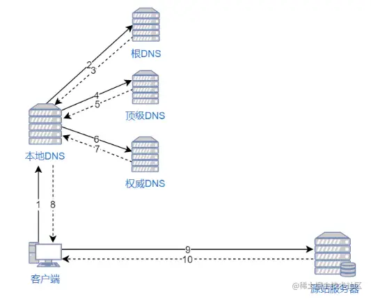
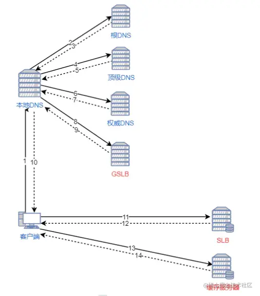
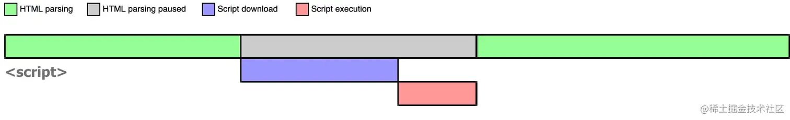
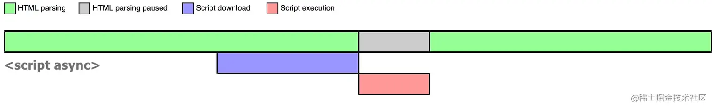
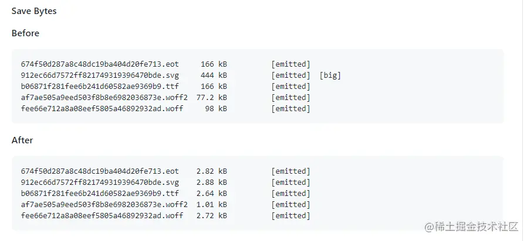

## **代码层面性能优化**

### 采用http2代替http1.1

http2必须采用https
https 就是采用SSL/TLS加密的 http,服务端需要CA数字证书
http2具有如下优势:

1. **基于帧**。http1.1基于文本流，必须不断地读入字节，直到遇到分隔符 CRLF 为止，http2基于二进制帧，每个帧都有表示帧长度的字段。
2. **多路复用**。http1.1提供长连接(keep-alive),多个请求可复用同一个TCP管道，按顺序依次请求，http2多路复用【HTTP/2 复用TCP管道，在一个TCP管道，客户端和服务器都可以同时发送多个请求或回应，而且不用按照顺序一一对应】：每个HTTP请求都有一个序列标识符，这样浏览器可以并发多个请求(公用一个TCP连接)，服务器接收到数据后，再根据序列标识符重新排序成不同的请求报文，而不会导致数据错乱（ [细节参照此文](https://link.juejin.cn/?target=https%3A%2F%2Fsegmentfault.com%2Fq%2F1010000005167289)）。服务端也可以并发返回多个响应给浏览器，浏览器收到后根据序列标识重新排序并归入各自的请求的响应报文。
3. **头部压缩**。HTTP2采用头部压缩，通过HPACK压缩算法实现，具体表现如下:
    1. 采用动态表和静态表
    2. 静态表存储请求&响应头中常见字段和值，并编码为索引
    3. http2允许动态表大小动态调整，用于存储请求&响应头中的特定字段和值，并编码为索引
    4. 由于头部所有字段和值都会被编译为索引，后续只需要发送索引，服务器可以通过索引引用它们
4. **服务器额外推送**。http2中服务器可以对一个客户端请求发送多个响应。即除了对最初请求的响应外，服务器还可以额外向客户端推送资源，而无需客户端明确地请求。例如请求HTML资源，服务器可以根据帧来判断要推送的css资源，以实现提前推送css资源
5. **优先级**。http2可以对比较紧急的请求设置优先级，让服务器优先处理
6. **流量控制**。由于一个TCP连接的带宽受到网络带宽限制，当一个TCP被多路复用时，一个请求占的流量多，另一个请求占的流量就会少。流量控制可以对不同的流的流量进行精确控制。

### 采用服务器渲染

vue用nuxt,

react用next

#### 客户端渲染过程

1. 访问客户端渲染的网站。

1. 客户端通过 HTTP 向服务器请求资源，服务器返回一个包含了引入资源语句 的 HTML 文件。

1. 当必要的资源都加载完毕后，执行 `new Vue()` 接管html进行实例化并渲染页面。

#### 服务端渲染过程

1. 访问服务端渲染的网站。

1. 服务器会查看当前路由组件需要哪些资源文件，然后将这些文件的内容填充到 HTML 文件。如果有 ajax 请求，就会执行它进行数据预取并填充到 HTML 文件里，最后返回这个 HTML 页面。

1. 当客户端接收到这个 HTML 页面时，可以马上就开始渲染页面。与此同时，页面也会加载资源，当必要的资源都加载完毕后，开始执行  `new Vue()` 开始实例化并接管页面。

#### vue示例

由于服务器渲染SSR需要先通过 createSSRApp(配置项) 创建一个html然后返回客户端客户端再通过相同的 createSSRApp(配置项) 激活,即托管到客户端vue的过程因此SSR采用node,因为可以用相同的代码

```javascript
// app.js (在服务器和客户端之间共享)
import { createSSRApp } from 'vue'
​
export function createApp() {
  return createSSRApp({
    data: () => ({ count: 1 }),
    template: `<button @click="count++">{{ count }}</button>`
  })
}
```

服务端

```javascript
import express from 'express';
import { renderToString } from 'vue/server-renderer';
import { createApp } from './app.js';
​
const server = express();
​
server.get('/', (req, res) => {
  const app = createApp();
​
  renderToString(app).then((html) => {
    res.send(`
    <!DOCTYPE html>
    <html>
      <head>
        <title>Vue SSR Example</title>
        <script type="importmap">
          {
            "imports": {
              "vue": "https://unpkg.com/vue@3/dist/vue.esm-browser.js"
            }
          }
        </script>
        <script type="module" src="/client.js"></script>
      </head>
      <body>
        <div id="app">${html}</div>
      </body>
    </html>
    `);
  });
});
//使服务器托管客户端文件
​
//在Express.js中，express.static('.')是一个中间件函数，用于提供静态文件服务。它允许你在应用程序中直接通过URL访问静态文件，比如HTML、CSS、JavaScript、图片等。
​
//express.static('.')告诉Express在当前目录（.表示当前目录）中查找静态文件。即localhost:8000中找静态文件
​
//目地是托管返回的html文件
server.use(express.static('.'));
​
server.listen(3000, () => {
  console.log('ready');
});
​
```

客户端

```javascript
// client.js
import { createApp } from './app.js'
​
createApp().mount('#app')
```

### 采用CDN处理静态资源

CDN可以用于各种静态资源，如CSS文件、图像、字体等。例如:

原理简单来说:

先访问目标地址,得到全局负载均衡系统（GSLB）的 IP 地址。

再访问全局负载均衡系统,得到距离用户较近的本地负载均衡系统（SLB)的 IP 地址。

浏览器再根据 SLB 发回的地址重定向到缓存服务器。

如果缓存服务器有浏览器需要的资源，就将资源发回给浏览器。如果没有，就向源服务器请求资源，再发给浏览器并缓存在本地。

```
<script src="https://ajax.googleapis.com/ajax/libs/jquery/3.6.0/jquery.min.js"></script>
```

通过这种方式，浏览器将从Google的CDN服务器加载 jQuery，而不是从您的服务器或官方网站加载。这通常会更快，因为CDN服务器位于全球各地，可以更快地提供资源，而且CDN通常有缓存机制，可以减轻您的服务器负担。

#### CDN 原理

当用户访问一个网站时，如果没有 CDN，过程是这样的：

1. 浏览器要将域名解析为 IP 地址，所以需要向本地 DNS 发出请求。

1. 本地 DNS 依次向根服务器、顶级域名服务器、权限服务器发出请求，得到网站服务器的 IP 地址。

1. 本地 DNS 将 IP 地址发回给浏览器，浏览器向网站服务器 IP 地址发出请求并得到资源。



如果用户访问的网站部署了 CDN，过程是这样的：

1. 浏览器要将域名解析为 IP 地址，所以需要向本地 DNS 发出请求。
2. 本地 DNS 依次向根服务器、顶级域名服务器、权限服务器发出请求，得到全局负载均衡系统（GSLB）的 IP 地址。
3. 本地 DNS 再向 GSLB 发出请求，GSLB 的主要功能是根据本地 DNS 的 IP 地址判断用户的位置，筛选出距离用户较近的本地负载均衡系统（SLB），并将该 SLB 的 IP 地址作为结果返回给本地 DNS。
4. 本地 DNS 将 SLB 的 IP 地址发回给浏览器，浏览器向 SLB 发出请求。
5. SLB 根据浏览器请求的资源和地址，选出最优的缓存服务器发回给浏览器。
6. 浏览器再根据 SLB 发回的地址重定向到缓存服务器。
7. 如果缓存服务器有浏览器需要的资源，就将资源发回给浏览器。如果没有，就向源服务器请求资源，再发给浏览器并缓存在本地。



参考资料：

- [CDN是什么？使用CDN有什么优势？]([https://link.juejin.cn?target=https%3A%2F%2Fwww.zhihu.com%2Fquestion%2F36514327%2Fanswer%2F193768864](https://link.juejin.cn?target=https%3A%2F%2Fwww.zhihu.com%2Fquestion%2F36514327%2Fanswer%2F193768864))
- [CDN原理简析](https://juejin.im/post/6844903873518239752)

### 预加载

浏览器在解析html的时候,会先进行预加载扫描,扫描过程中会将一些预加载内容提前进行

#### 跨域资源dns-prefetch&&preconnect

对与跨域资源需要dns解析,非常消耗时间

虽然浏览器会缓存DNS解析结果，并根据DNS 响应中的 TTL（Time to Live）指定缓存时间

操作系统也会进行DNS缓存，

- dns-prefetch：DNS预解析，DNS预解析时会缓存和本域名不同的域名解析的IP。

- preconnect：DNS预连接，包括DNS解析、和TCP三次握手，只在最重要的资源请求时需要加，**并不推荐给多个资源加，会占用TCP管道。**

```javascript
<head>  
    <!-- 在最头部放要预解析的域名 -->
    <link rel="dns-prefetch" href="https://fonts.googleapis.com/" />
    <!-- 访问资源,会读取本地缓存的域名解析值(IP) -->
    <link href="https://fonts.googleapis.com/" />
     <!-- 通过这个的content值控制隐式DNS预解析,DNS预解析时会缓存和本域名不同的域名 -->
     <!-- 可在浏览器输入about:dns查看具体信息 -->
    <meta http-equiv="x-dns-prefetch-control" content="on" />
</head>
```

#### **三种script标签与**async/defer

async/defer script可以提前下载js

1. 加载方式**：
    - **普通**：默认情况下，普通的 `script` 标签会立即下载并执行脚本，它会阻塞页面的解析和渲染，直到脚本加载和执行完毕。
    - **`async`**：使用 `async` 属性的 `script` 标签会异步加载脚本，脚本会在下载完成后立即执行，但不会阻塞页面的解析。多个异步脚本之间的执行顺序不确定，取决于哪个脚本率先下载完成。
    - **`defer`**：使用 `defer` 属性的 `script` 标签也会异步加载脚本，但是脚本会在页面解析完毕后、`DOMContentLoaded` 事件之前按顺序执行。多个带有 `defer` 属性的脚本会按照它们在页面中出现的顺序执行。
2. **执行时机**：
    - **普通**：脚本会立即执行，可能会阻塞页面的加载。
    - **`async`**：脚本会在下载完成后立即执行，不会等待其他资源的加载，因此可能在页面还在加载时执行。
    - **`defer`**：脚本会在页面解析完毕后执行，确保它们在文档结构完整之后执行。
3. **多个脚本的执行顺序**：
    - **普通**：多个普通脚本之间的执行顺序是按照它们在页面中出现的顺序执行的，并且一个脚本会阻塞后面脚本的加载和执行。
    - **`async`**：多个异步脚本的执行顺序是不确定的，因为它们可能以不同的顺序下载完成。
    - **`defer`**：多个带有 `defer` 属性的脚本会按照它们在页面中出现的顺序执行，但是它们不会阻塞其他资源的加载。
4. **适用场景**：
    - **普通**：适用于需要立即执行并且需要干扰页面加载的脚本。
    - **`async`**：适用于不依赖其他脚本和需要尽快执行的脚本，例如用于页面统计或广告跟踪的脚本。
    - **`defer`**：适用于需要在页面完全加载后执行的脚本，通常用于初始化应用程序或绑定事件处理程序。

普通script



async script



defer script


### **css写在头部**

css写在头部可避免页面初始化时出现丑陋的无样式页面

### 使用字体图标 iconfont 代替图片图标

字体图标就是将图标制作成一个字体，使用时就跟字体一样，可以设置属性，例如 font-size、color 等等，非常方便。并且字体图标是矢量图，不会失真。还有一个优点是生成的文件特别小。

### 缓存副本

1. 文件缓存
2. 图片缓存
3. 组件缓存

### 减少重绘重排

#### 浏览器渲染流程

1. 解析HTML生成DOM树。

1. 解析CSS生成CSSOM规则树。

1. 解析JS，操作 DOM 树和 CSSOM 规则树。

1. 结合DOM树和CSSOM树生成render Tree(布局树 渲染树)

1. 对渲染树中的结构进行分层,生成图层树

1. 根据图层树,生成图层的绘制指令

1. 栅格化:将图层划分为图块

1. 绘制和展示

##### 重排

当改变 DOM 元素位置或大小时，会导致浏览器重新生成渲染树，这个过程叫重排。

##### 重绘

当重新生成渲染树后，就要将渲染树每个节点绘制到屏幕，这个过程叫重绘。

不是所有的动作都会导致重排，例如改变字体颜色，只会导致重绘。

**重排会导致重绘，重绘不会导致重排 。**

重排和重绘这两个操作都是非常昂贵的，因为 JavaScript 引擎线程与 GUI 渲染线程是互斥，它们同时只能一个在工作。

#### 什么操作会导致重排？

- 添加或删除可见的 DOM 元素

- 元素位置改变

- 元素尺寸改变

- 内容改变

- 浏览器窗口尺寸改变

#### 如何减少重排重绘？

- 用 JavaScript 修改样式时，最好不要直接写样式，而是替换 class 来改变样式。

- 如果要对 DOM 元素执行一系列操作，可以将 DOM 元素脱离文档流，修改完成后，再将它带回文档。推荐使用隐藏元素（display:none）或文档碎片（DocumentFragement），都能很好的实现这个方案。

使用 requestAnimationFrame 或定时器避免页面卡顿

### 避免掉帧
`requestAnimationFrame` 接受一个回调函数作为参数，这个回调函数会在浏览器下一次重绘之前被调用。

**60fps 与设备刷新率**

> 目前大多数设备的屏幕刷新率为 60 次/秒。因此，如果在页面中有一个动画或渐变效果，或者用户正在滚动页面，那么浏览器渲染动画或页面的每一帧的速率也需要跟设备屏幕的刷新率保持一致。 其中每个帧的预算时间仅比 16 毫秒多一点 (1 秒/ 60 = 16.66 毫秒)。但实际上，浏览器有整理工作要做，因此您的所有工作需要在 10 毫秒内完成。如果无法符合此预算，帧率将下降，并且内容会在屏幕上抖动。 此现象通常称为卡顿，会对用户体验产生负面影响。


假如你用 `JavaScript` 修改了 DOM，并触发样式修改，经历重排重绘最后画到屏幕上。如果这其中任意一项的执行时间过长，都会导致渲染这一帧的时间过长，平均帧率就会下降。假设这一帧花了 50 ms，那么此时的帧率为 1s / 50ms = 20fps，页面看起来就像卡顿了一样。

在使用 `JavaScript` 实现动画效果的时候，最好的情况就是每次代码都是在帧的开头开始执行。而**保证 JavaScript 在帧开始时运行**的唯一方式是使用 `requestAnimationFrame`。

```javascript
function requestAnimationFrameFn() {
    let timer = null // 可注掉
    box2.style.left = '0px'
    function callbackFn() {
        let leftVal = parseInt(box2.style.left)
        if (leftVal >= 720) {
            // 取消回调函数执行，相当于定时器中的clearTimeout()
            window.cancelAnimationFrame(timer)
        } else {
            box2.style.left = leftVal + 1 + 'px'
            timer=window.requestAnimationFrame(callbackFn)
        }
    }
    timer=window.requestAnimationFrame(callbackFn)
}

```

如果采取 `setTimeout` 或 `setInterval` 来实现动画的话，回调函数将在帧中的某个时点运行，可能刚好在末尾，而这可能经常会使我们丢失帧，导致卡顿。

### 长任务使用WebWorkers

```javascript
// 主线程
let worker=new Worker('分线程js路径');
worker.postMessage(要传递的数据);
worker.onmessage=function(e){
    console.log(e.data);    //传递回来的值
}
worker.onerror = (error) => {
    console.error('Web Worker Error:', error);  
};
```

```javascript
//分线程
function fn(n){
    if(n<=2)return 1;
    return fn(n-1)+fn(n-2);
}
//slef是代表当前 worker 线程自身的全局对象
slef.onmessage=function(e){
    var data=fn(e.data)            //接收传递回来的值,并调用fn
    self.postMessage(data)        //将计算出来的值传递回去
}

```

### 其他日常代码

1. 防抖、节流

1. 减少时间复杂度&空间复杂度 ->算法

#### if-else 对比 switch

当判断条件数量越来越多时，越倾向于使用 switch

```javascript
if (color == 'blue') {}
else if (color == 'yellow') {} 
else if (color == 'white') {} 
else if (color == 'black') {}
...

switch (color) {
    case 'blue':
        break
    case 'yellow':
        break
    case 'white':
        break
    case 'black':
        break
    ...
}

```

#### 尽量避免重写原生方法

无论你的 JavaScript 代码如何优化，都比不上原生方法。因为原生方法是用低级语言写的（C/C++），并且被编译成机器码，成为浏览器的一部分。当原生方法可用时，尽量使用它们，特别是数学运算和 DOM 操作。

#### 尽量使用 transform 和 opacity 属性

在 CSS 中，`transforms` 和 `opacity` 这两个属性更改不会触发重排与重绘，它们是可以由合成器（`composite`）单独处理的属性。

#### 使用事件委托

利用事件冒泡

## 打包层面性能优化

- 减少打包时间：**缩减范围、缓存副本、定向搜索、提前构建、并行构建、可视结构**

- 减少打包体积：**分割代码、摇树优化、动态垫片、按需加载、作用提升、压缩资源**

### 减少打包时间

#### 缩减范围

**配置include/exclude缩小Loader对文件的搜索范围**，好处是**避免不必要的转译**。`node_modules` 文件夹的体积这么大，那得增加多少时间成本去检索所有文件啊？

`include/exclude` 通常在各大 `Loader` 中配置，`src` 文件夹通常作为源码目录，可做以下处理。当然 `include/exclude` 可根据实际情况修改。

```js
export default {
	// ...
	module: {
    rules: [{
        exclude: /node_modules/,
        include: /src/,
        test: /\.js$/,
        use: "babel-loader"
    }]
	}
};
```

#### 缓存副本

**配置cache缓存Loader对文件的编译副本**，好处是**再次编译时只编译变动的文件**。未变动的文件干嘛要随着变动的文件重新编译？

很多`Loader/Plugin`都会提供一个可用编译缓存的选项，通常包括cache字眼。以`babel-loader`与`eslint-webpack-plugin`为例。


```js
import EslintPlugin from "eslint-webpack-plugin";

export default {
    	// ...
    	module: {
        rules: [{
            // ...
            test: /\.js$/,
            use: [{
                loader: "babel-loader",
                options: { cacheDirectory: true }
            }]
        }]
    	},
    	plugins: [
        // ...
        new EslintPlugin({ cache: true })
    	]
};
```

#### 定向搜索

**配置resolve提高文件的搜索速度**，好处是**定向指定所需文件路径**。若某些第三方库以默认形式引用可能报错或希望程序自动索引指定类型文件都可通过该方式解决。

`alias`表示映射路径，`extensions`表示文件后缀，`noParse`表示过滤无依赖文件。通常配置`alias`与`extensions`就足够。

```js
export default {
    // ...
    resolve: {
        alias: {
            "#": AbsPath(""), // 根目录快捷方式
            "@": AbsPath("src"), // src文件夹快捷方式
            swiper: "swiper/js/swiper.min.js"
        }, // 导入模块快捷方式
        extensions: [".js", ".ts", ".jsx", ".tsx", ".json", ".vue"] // 导入模块省略后缀
    }
};
```

#### 提前构建

**配置DllPlugin将第三方依赖提前打包**，好处是将`DLL`与业务代码完全分离且每次只构建业务代码。这是一个古老配置，在`webpack v2`时已存在，不过现在`webpack v4+`已不推荐使用该配置，因为其版本迭代带来的性能提升足以忽略`DllPlugin`所带来的效益。当然配置了也没事，对于一个上了一定规模的项目，我亲测在二次构建时能快1~2秒。

`DLL`意为**动态链接库**，指一个可由多个程序同时使用的代码库。在前端领域中可认为是另类缓存的存在，它把公共代码打包为dll文件并存放到硬盘中，再次构建时动态链接dll文件就无需再次打包那些公共代码，以提升构建速度，减少打包时间。

总体来说配置`DLL`相比其他配置复杂，配置流程可大致分为三步。

首先告知构建脚本哪些依赖做成 `DLL` 并生成 `dll文件` 与 `DLL映射表文件`。

```js
import { DefinePlugin, DllPlugin } from "webpack";

export default {
    // ...
    entry: {
        vendor: ["react", "react-dom", "react-router-dom"]
    },
    mode: "production",
    optimization: {
        splitChunks: {
            cacheGroups: {
                vendor: {
                	chunks: "all",
                	name: "vendor",
                	test: /node_modules/
                }
            }
        }
    },
    output: {
        filename: "[name].dll.js", // 输出路径与文件名称
        library: "[name]", // 全局变量名称：其他模块会从该变量中获取内部模块
        path: AbsPath("dist/static") // 输出目录路径
    },
    plugins: [
        // ...
        new DefinePlugin({
            "process.env.NODE_ENV": JSON.stringify("development") // DLL模式下覆盖生产环境为开发环境(启动第三方依赖调试模式)
        }),
        new DllPlugin({
            name: "[name]", // 全局变量名称：减小搜索范围，与output.library结合使用
            path: AbsPath("dist/static/[name]-manifest.json") // 输出目录路径
        })
    ]
};

```

然后在`package.json`中指定`scripts`，配置执行脚本且每次构建前首先执行该脚本打包出`dll文件`。

```json
{
    "scripts": {
        "dll": "webpack --config webpack.dll.js"
    }
}

```

最后链接[html-webpack-tags-plugin](https://link.juejin.cn/?target=https%3A%2F%2Fgithub.com%2Fjharris4%2Fhtml-webpack-tags-plugin)在构建时自动加入

```js
import { DllReferencePlugin } from "webpack";
import HtmlTagsPlugin from "html-webpack-tags-plugin";

export default {
    // ...
    plugins: [
        // ...
        new DllReferencePlugin({
            manifest: AbsPath("dist/static/vendor-manifest.json") // manifest文件路径
        }),
        new HtmlTagsPlugin({
            append: false, // 在生成资源后加入
            publicPath: "/", // 使用公共路径
            tags: ["static/vendor.dll.js"] // 资源路径
        })
    ]
};

```

为了那几秒钟的时间成本，我建议配置上较好。当然也可用[autodll-webpack-plugin](https://link.juejin.cn/?target=https%3A%2F%2Fgithub.com%2Fasfktz%2Fautodll-webpack-plugin)代替手动配置。

#### 并行构建

thread-loader   //适用于babel较慢的情况

happyPack	//适用于loader较慢的情况

一般用happyPack就行了

由于运行在 Node.js 之上的 webpack 是单线程模型的，我们需要 webpack 能同一时间处理多个任务，发挥多核 CPU 电脑的威力

HappyPack 就能实现多线程打包，它把任务分解给多个子进程去并发的执行，子进程处理完后再把结果发送给主进程，来提升打包速度

安装

```
npm install HappyPack -D
```

webpack.config.base.js 中引入

```javascript
const HappyPack = require('happypack');
const os = require('os');
//开辟一个线程池，拿到系统CPU的核数，happypack 将编译工作利用所有线程
const happyThreadPool = HappyPack.ThreadPool({ size: os.cpus().length });
module.exports={
  rules:{
    test: /\.jsx?$/,
    //use的左右都定义用于处理匹配到的模块的loader
    //使用 HappyPack 插件的名为 "babel" 的loader 实例来处理匹配到的文件
    use: [{
      loader: 'happypack/loader?id=babel'       
    }],
    exclude: /node_modules/,
    // include: path.resolve(__dirname, "src")
  },
  plugins: [
     new HappyPack({
      id: 'babel',
      //?cacheDirectory=true是开启缓存
      loaders: ['babel-loader?cacheDirectory=true'],
      threadPool: happyThreadPool
    })
  ]
}
​
```

#### 可视结构

**配置BundleAnalyzer分析打包文件结构**

可用[webpack-bundle-analyzer](https://github.com/webpack-contrib/webpack-bundle-analyzer)配置，有了它就能快速找出相关问题。

```js
import { BundleAnalyzerPlugin } from "webpack-bundle-analyzer";

export default {
    // ...
    plugins: [
        // ...
        BundleAnalyzerPlugin()
    ]
};

```

### 减少打包体积

#### 代码分割

**分割各个模块代码，提取相同部分代码**

[optimizationsplitchunks](https://webpack.docschina.org/configuration/optimization/#optimizationsplitchunks)

```javascript
export default {
    // ...
    optimization: {
        runtimeChunk: { name: "manifest" }, // 抽离WebpackRuntime函数
        splitChunks: { // 代码块分割
            cacheGroups: { // 缓存组
                common: {
                	minChunks: 2, // 代码块出现最少次数
                	name: "common", // 代码块名称
                	priority: 5, // 优先级别
                	reuseExistingChunk: true, // 重用已存在代码块
                	test: AbsPath("src")
                },
                vendor: {
                	chunks: "initial", // 代码分割类型
                	name: "vendor",
                	priority: 10,
                	test: /node_modules/
                }
            },
            chunks: "all" // 代码分割类型：all全部模块，async异步模块，initial入口模块
        }
    }
};
```

#### 摇树优化

**删除项目中未被引用代码**

摇树优化

在

```javascript
export default {
    // ...
    mode: "production"
};
```

#### **压缩资源**

压缩文件可以减少文件下载时间，让用户体验性更好。

##### 压缩js/css/html

在 webpack 可以使用如下插件进行压缩：

webpack4

- optimize-css-assets-webpack-plugin：压缩CSS代码，在webpack v5中请使用

- uglifyjs-webpack-plugin：压缩ES5版本的JS代码

- terser-webpack-plugin：压缩ES5 & ES6版本的JS代码

- HTML：HtmlWebpackPlugin

```javascript
const UglifyJsWebpackPlugin = require('uglifyjs-webpack-plugin');
const TerserPlugin = require('terser-webpack-plugin');
const OptimizeCssAssetsPlugin = require('optimize-css-assets-webpack-plugin');
const HtmlWebpackPlugin = require('html-webpack-plugin');
const CleanWebpackPlugin = require('clean-webpack-plugin');
​
//判断是否是开发环境
const devMode = process.env.NODE_ENV !== 'production';

const compressOpts = type => ({ // 压缩配置
	cache: true, // 缓存文件
	parallel: true, // 并行处理
	[`${type}Options`]: {
		beautify: false,
		compress: { drop_console: true }
	}
});
const compressJs = USE_ES6
	? new TerserPlugin(compressOpts("terser"))
	: new UglifyjsPlugin(compressOpts("uglify"));
 
const compressCss = new OptimizeCssAssetsPlugin({
    cssProcessorOptions: {
        autoprefixer: { remove: false }, // 设置autoprefixer保留过时样式
        safe: true // 避免cssnano重新计算z-index
    }
});


export default {
    // ...
    plugin:{
        //用于在构建前清空输出目录
        new CleanWebpackPlugin(),
        HtmlWebpackPlugin({
            // ...
            minify: { // 压缩HTML
                collapseWhitespace: true,
                removeComments: true
            }
        })
    }
    optimization{
        minimizer:[minimizer: [compressCss, compressJs] // 代码压缩],   
    }
};

```

还有更好的方式就是使用 gzip 压缩。可以通过向 HTTP 请求头中的 Accept-Encoding 头添加 gzip 标识来开启这一功能。当然，服务器也得支持这一功能。

gzip 是目前最流行和最有效的压缩方法。举个例子，我用 Vue 开发的项目构建后生成的 app.js 文件大小为 1.4MB，使用 gzip 压缩后只有 573KB，体积减少了将近 60%。

附上 webpack 和 node 配置 gzip 的使用方法。

**下载插件**

```
npm install compression-webpack-plugin --save-dev
npm install compression

```

**webpack 配置**

```
const CompressionPlugin = require('compression-webpack-plugin');

module.exports = {
  plugins: [new CompressionPlugin()],
}

```

**node 配置**

```
const compression = require('compression')
// 在其他中间件前使用
app.use(compression())

```

##### 压缩字体文件

使用 



参考资料：

- fontmin-webpack

- Iconfont-阿里巴巴矢量图标库

#### 作用提升

**分析模块间依赖关系，把打包好的模块合并到一个函数中**

在未开启

在开启

在

```js
export default {
    // ...
    mode: "production"
    };
    
    export default {
    // ...
    optimization: {
    // ...
        concatenateModules: true // 或者显式设置
    }
};
```

#### 图片优化

大概以下几个方向:

1. 图片懒加载(延迟加载)，通过一个自定义属性，一般是data-src存储图片的真实路径，当图片即将进入视窗时，讲data-src替换为src

1. 压缩图片，通过降低图片质量来减少图片的体积

1. 使用webp 格式的图片

1. 能通过css做的图片，尽量用css做，代码通常比图片小很多

1. 动态图片大小，采用媒体查询@media或picure库使图片在不同分辨率下具有不同大小

##### 使用 webp 格式的图片

> WebP 的优势体现在它具有更优的图像数据压缩算法，能带来更小的图片体积，而且拥有肉眼识别无差异的图像质量；同时具备了无损和有损的压缩模式、Alpha 透明以及动画的特性，在 JPEG 和 PNG 上的转化效果都相当优秀、稳定和统一。


参考资料：

- WebP 相对于 PNG、JPG 有什么优势？

##### 压缩图片

例如 JPG 格式的图片，100% 的质量和 90% 质量的通常看不出来区别，尤其是用来当背景图的时候。我经常用 PS 切背景图时， 将图片切成 JPG 格式，并且将它压缩到 60% 的质量，基本上看不出来区别。

压缩方法有两种，一是通过 webpack 插件 

以下附上 webpack 插件 

```javascript
npm i -D image-webpack-loader
```

webpack 配置

```javascript
{
  test: /\.(png|jpe?g|gif|svg)(\?.*)?$/,
  use:[
    {
    loader: 'url-loader',
    options: {
      limit: 10000, /* 图片大小小于1000字节限制时会自动转成 base64 码引用*/
      name: utils.assetsPath('img/[name].[hash:7].[ext]')
      }
    },
    /*对图片进行压缩*/
    {
      loader: 'image-webpack-loader',
      options: {
        bypassOnDebug: true,
      }
    }
  ]
}

```

#### 提取第三方库与公共代码

由于引入的第三方库一般都比较稳定，不会经常改变。所以将它们单独提取出来，作为长期缓存是一个更好的选择。 这里需要使用 webpack4 的 splitChunk 插件 cacheGroups 选项。

规范:

vendor用于处理第三方模块，优先级应该最高

common处理公共模块，优先级应该次之

default处理二者都不处理的模块，优先级应该最低

```
/*
runtimeChunk的作用
具有两个配置项:name mode
name:公共代码拆分后包的名字
mode:具有single multiple两个值,
    默认single,多个入口文件的公共代码打包为一个chunk,这有助于避免在每个生成的文件中重复包含相同的运行时代码。
    如果是multiple,每个入口文件将具有独立的chunk,可能出现重复的代码。
**/
optimization: {
    runtimeChunk: {
      name: 'runchunk'
    },
    splitChunks: {
        cacheGroups: {
            //第三方模块
            vendor: {
                name: 'chunk-vendors', // string/funciton,chunk的名字
                test: /[\\/]node_modules[\\/]/, //匹配规则
                priority: -10, //权重,越大优先级越高
                minSize: 20000, // 模块最小大小
                chunks: 'initial' //默认是async,initial 静态依赖,async 动态依赖:一般是动态引入&按需加载 ,all 所有的
                minChunks: 2, //默认是1,代码块最小应该被引用的次数
                reuseExistingChunk: true  //控制是否重用已经存在的代码块,如果当前的 chunk 包含的模块已经被抽取出去了，那么将不会重新生成新的。
                
            },
            //公共模块
            common: {
                name: 'chunk-common',
                priority: -20,
                chunks: 'initial',
            }
        },
    }
},

```

#### 避免重复es6转es5编译

babel将es6转换为es5时，想要实现和原来代码一样的功能需要借助一些帮助函数

当多个文件使用相同的es6语法时，babel可能产生重复编译，

例如A文件中定义了class，B文件中定义了class，可能产生两个helper函数(一个编译后的文件一个helper函数)，徒增项目体积，

这些帮助函数都存储在

为避免这种现象，引入

Babel 转化后的代码想要实现和原来代码一样的功能需要借助一些帮助函数，比如：

```
class Person {}

```

会被转换为：

```
"use strict";

function _classCallCheck(instance, Constructor) {
  if (!(instance instanceof Constructor)) {
    throw new TypeError("Cannot call a class as a function");
  }
}

var Person = function Person() {
  _classCallCheck(this, Person);
};

```

这里 

这里的 

**而 **

```
"use strict";

var _classCallCheck2 = require("@babel/runtime/helpers/classCallCheck");

var _classCallCheck3 = _interopRequireDefault(_classCallCheck2);

function _interopRequireDefault(obj) {
  return obj && obj.__esModule ? obj : { default: obj };
}

var Person = function Person() {
  (0, _classCallCheck3.default)(this, Person);
};

```

这里就没有再编译出 

**安装**

```
npm i -D @babel/plugin-transform-runtime @babel/runtime

```

**使用**

```
"plugins": [
        "@babel/plugin-transform-runtime"
]

```

参考资料：

- Babel 7.1介绍 transform-runtime polyfill env