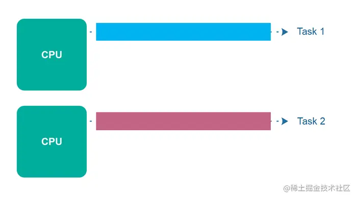
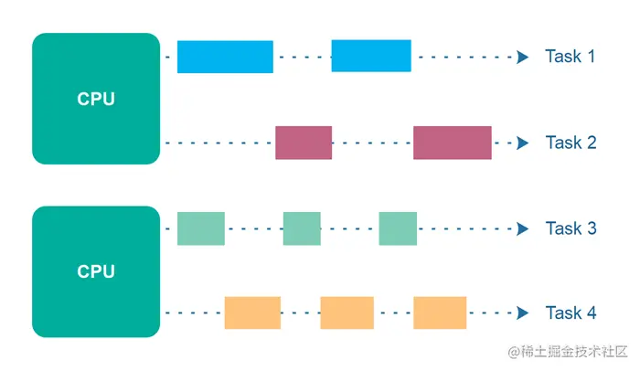
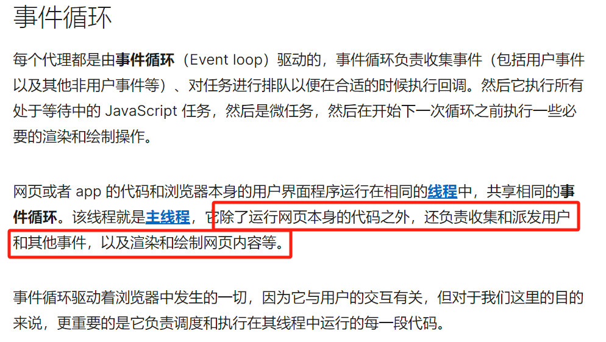
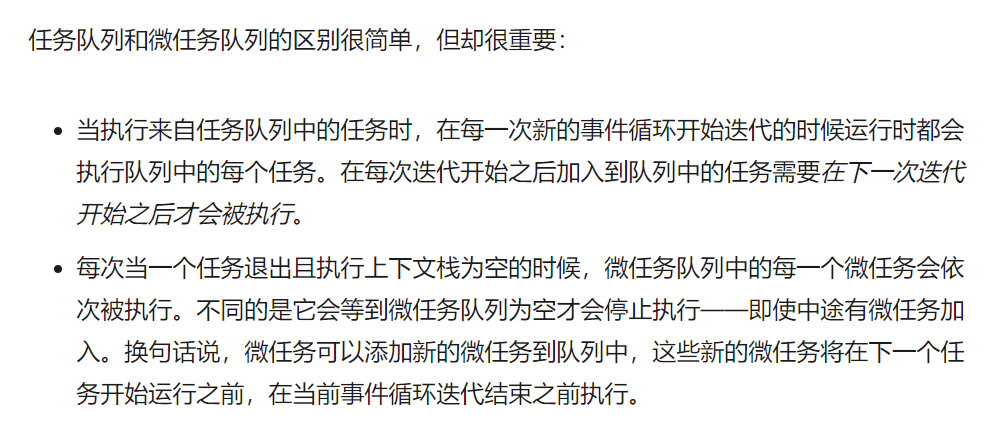
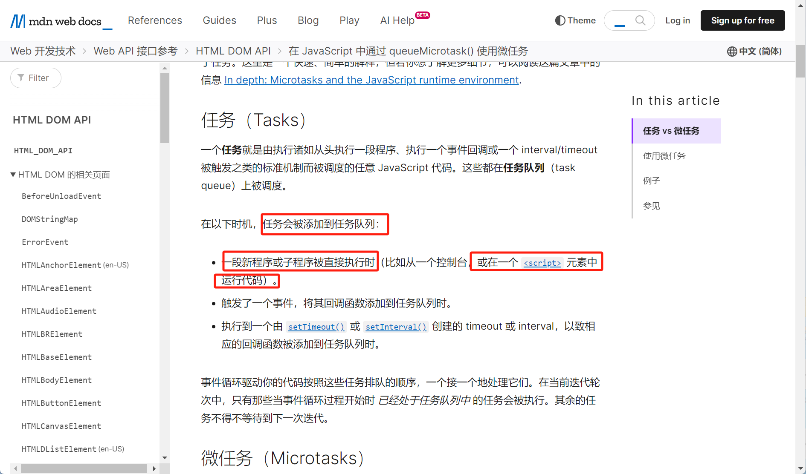
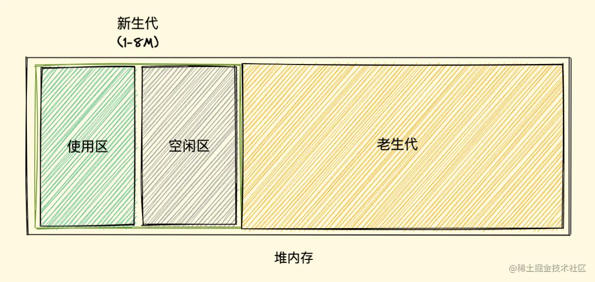
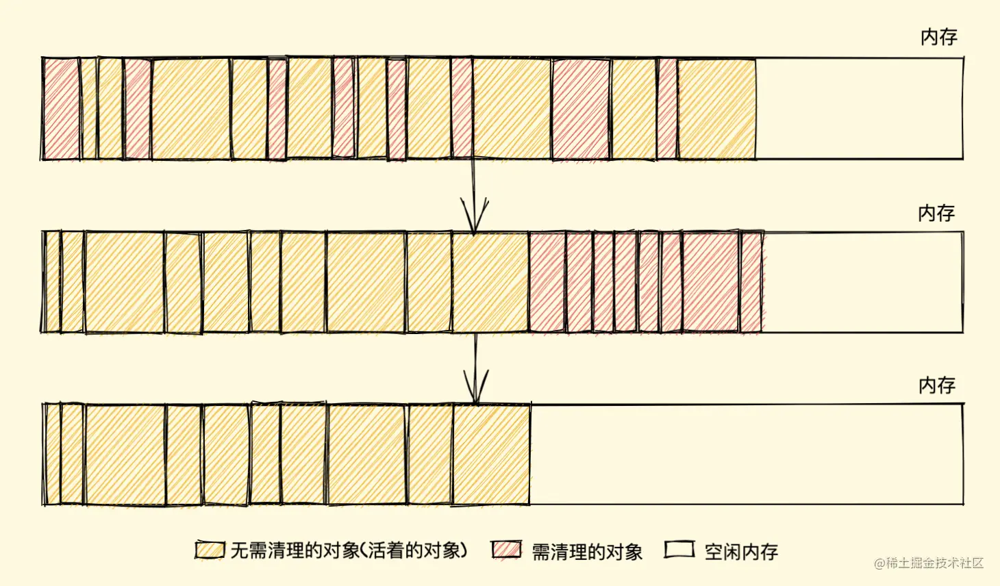
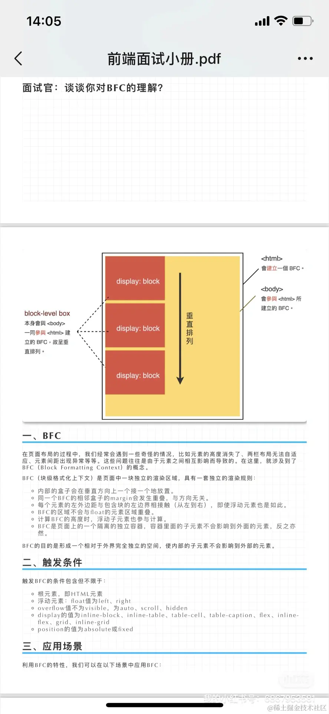

# AOT&JIT

程序主要有两种运行方式：静态编译与动态解释

而静态编译会被提前编译(AOT)为机器码/中间字节码;

动态编译会被即时翻译(JIT)为机器码来执行;

AOT的典型代表是C/C++

JIT的代表很多,如js,py等,**所有脚本语言都支持JIT**

我们**判断AOT的标准是**:**在执行前是否需要编译**,无论其编译产物是字节码还是机器码

# 业务

## to B/C/G

to b 走精，面向企业。用于解决企业效率低下问题，找到利润增大的空间。决策周期长，不会随意更换。版本迭代慢，开发周期长。

to c 走量，面向个人。通过大量宣传快速占据市场。注重优化用户体验。版本迭代快。

to g 与to b相同。面向政府

## 登录流程

```js
//密码加密
前端将用户名和md5加密后的密码传给后端，
后端与数据库的账号密码对比（后端存的加密后的密码），通过后返回token，
前端将token存在本地，每次请求时在请求头携带token，
​
//token失效
过期后后端返回401或者前端本地存储时存个时间戳，一定时间后算过期，过期了前端路由守卫跳转登录页，登录请求新的token
​
//无感刷新
基于登录流程，在token的基础上加一个refreshToken，当token过期返回401时，在响应拦截器中用数组将未请求到新token过程中过期的请求存储起来，用refreshToken请求到新token和新refreshToken后，重新请求
​
注意，这会导致无限刷新token。除非用户长时间未登录，refreshToken过期了
token比refreshToken过期的早
```

## 大文件上传

文件上传一般有两种方式,fromData和base64base64可跨平台。但是会比之前的文件大三分之一。导致请求很慢，不适合大文件上传formData文件流形式可以上传额外信息，当然也可以上传多个文件，适合大文件上传

```js
//拿到文件对象
//假设是file
<Input type="file" @change="hanleInputChange" />
let file;
hanleInputChange=(e)=>{
    file=e.target.files[0]
}
//切片上传
//利用文件对象的slice和size方法,将文件分成一段一段的小片存在数组中
const chunks=[];
const createChunks(chunkSize,file)=>{
    let currentIndex=0;
    for(let i=0;i<file.size,i+=chunckSize){
        chunks.push(file.slice(i, i + chunksize));
    }
}
​
const chunks = createChunks(file, 1024 * 1024 * 5);
​
//秒传
//将整个文件md5加密,将加密后的md5串传给后端,后端校验是否存在这个md5串,存在就返回特殊状态,前端直接状态改成已上传
​
//由于大文件比较大,直接整个一起加密,容错率低,一般一块一块的加密,最终输出结果
//一般使用SparkMD5包,npm i -S spark-md5
​
const createMd5 = (chunks) => {
  const spark = new self.SparkMD5();
​
  return new Promise((resolve) => {
    function _read(i) {
      if (i >= chunks.length) {
        const md5 = spark.end();
        resolve(md5);
        return;
      }
​
      const blob = chunks[i];
      //用于读取文件
      const reader = new FileReader();
      reader.readAsArrayBuffer(blob); //读取 Blob（二进制大对象）的内容
      //读取完成并成功时触发
      reader.onload = (e) => {
        const bytes = e?.target?.result;
        spark.append(bytes);
        _read(i + 1);
      };
    }
    _read(0);
  });
};
​
const md5=createMd5(chunks);
​
//断点续传
//调用校验接口,约定后端返回下标或者未上传的chunk
​
//文件合并
//调用合并接口,后端根据文件的md5值,将所有chunk合并到一块存到数据库
```

# 同步&异步&并发&并行

同步:

    在同一个线程中,等待上一个事件结束完毕后,才能执行下一件事

异步:

    无需等待上一个事件结束,即可执行下一件事

串行:

    在多个线程中,等待上一个事件结束完毕后,才能执行下一件事

并行:

    多件事一起进行,例如开两个线程 ->拿嘴干饭,屁眼子喝水->多个cpu或多个内核 同时进行



并发:

    多件事交替进行,例如开两个线程,一个线程吃饭,一个线程喝水 -> 吃一口饭,喝一口水,再吃,再喝...



# 事件轮询与宏任务与微任务

## 事件对象

触发事件时,浏览器会调用事件回调函数,并将这一次触发的事件相关的所以信息封装成一个对象并传给事件回调的第一个形参,这个对象称为事件对象

## 什么是同步,什么是异步

- 同步任务是指在主线程上排队执行的任务，只有前一个任务执行完毕，后一个同步任务才能执行。

- 异步任务是指不在主线程、而是在任务队列中的任务。只有当任务队列通知主线程，并且执行栈为空时，该任务队列中的任务才会进入主线程执行。

## 浏览器事件轮询机制

js 执行代码的先后顺序: 先宏任务,再微任务

主要模块: 主线程 执行上下文栈 宏任务队列 微任务队列 GUI线程

**MDN将事件轮询分为任务和微任务，其中任务就指的我们常说的宏任务，且明确指出script标签中的代码是宏任务**

**事件轮询过程全过程：**

1. script标签内的代码作为第一个宏任务推入宏任务队列
2. 将任务队列中的任务推入主线程中 解析代码产生上下文
3. 遇到宏任务推入宏任务队列，遇到微任务推入微任务队列，
4. 遇到函数调用推入执行上下文栈，
5. 遍历执行上下文，轮询3，4两步，直到执行上下文栈清空，
6. 遍历微任务队列，轮询2，3，4，5步，直到微任务队列清空，
7. 执行GUI线程
8. 从宏任务队列中提取一个回调，轮询2，3，4，5，直到宏任务队列清空，
9. 轮询6，7，8三步，直到执行上下文栈，宏任务队列，微任务队列，GUI线程都被清空

### src和普通sript论证

以下二者执行结果一致,但当script标签 具有type="module"时,结果会有差异,加上defer可保证执行顺序,具体原因未知,但一定是导致了两文件执行时机变化,不影响二者正常执行机制

```js
<!-- 脚本 1 -->
<script src="./事件轮询论证1.js"></script>
<!-- 脚本 2 -->
<script src="./事件轮询论证2.js"></script>
​
​
​
​
<!-- 脚本 1 -->
<script>
  console.log('1-1')
  setTimeout(() => console.log('1-2'), 0)
  
  new Promise((resolve, reject) => {
      console.log('1-3')
      resolve('1-4')
  }).then((res) => {
      console.log(res)
  })
  console.log('1-5')
</script>
<!-- 脚本 2 -->
<script>
console.log('2-1')
setTimeout(() => console.log('2-2'), 0)
new Promise((resolve, reject) => {
    console.log('2-3')
    resolve('2-4')
}).then((res) => {
    console.log(res)
})
console.log('2-5')
</script>
```

### MDN描述







## nodejs 的事件轮询机制:

- js 是单线程的,我们想要做到非阻塞,那么当我们遇到异步代码的时候,会把异步代码交给 libuv 的线程池进行管理,主线程依然继续向下执行同步代码

- libuv 会开启多个线程去管理不同的异步代码,当异步代码需要被执行的时候,会把回调函数依次放入到 libuv 提供的对应的轮询队列中去,(因为 node 中异步种类繁多,libuv 提供了多种回调队列)

- **事件轮询**

	1. timers 阶段:
		处理定时器回调函数
	2. pending callbacks
		这个阶段用来处理系统操作的回调函数
	3. idle prepare 阶段
		此阶段是仅供 nodejs 内部操作调用
	4. poll 阶段
		这个阶段主要用来处理如 IO 操作，网络请求等异步操作当进入 poll 阶段之后,如果 poll 阶段为空,则除非 timers 阶段和 check 阶段有回调等待,否则就会一直等到 poll 阶段有新的回调执行
	5. check 阶段:
		这个阶段用来处理 setImmediate 的回调函数
	6. close callbacks 阶段
		这个阶段用来处理 close 事件

## 宏任务和微任务:

- 异步代码也分为先后,先执行微任务再执行宏任务

- 宏任务有: `定时器 \ 整个script \ io操作` 等等

- 微任务: `promise` 的 ` then\catch\finally process.nextTick queueMicrotask `

- 执行过程如下:

1. 先执行主线程的同步代码直到结束,如果遇到微任务则放入微任务队列,如果遇到宏任务则交给对应的模块管理

1. 检查微任务队列,并执行微任务中的回调函数,直到全部执行完成

1. 执行宏任务队列中的异步代码,当执行的过程中遇到了微任务,则继续放入微任务队列

1. 每次执行完一个宏任务的时候,都会再次检查微任务队列,执行微任务直到结束

1. 继续轮询宏任务....

# 请求相关

## 跨域

### 什么是跨域

违背浏览器上的同源策略,就是跨域

只有浏览器才会出现跨域

### 什么是同源

 协议、ip、端口号 完全相同。

域名就是ip+端口关联的新地址 

### 如何解决跨域

使用JSONP,CROS,proxy,现在几乎都是使用proxy

### JSONP

#### JSONP 是什么 

根据script标签的跨域能力开发出来的跨域解决方案

#### 有什么问题

需要后端配合,只能用于get请求

#### JSONP 怎么工作的？ 

前端通过地址向后端发送一个字段

1. 利用script标签向目标服务器传递一个字符串形式的属性,

1. 目标服务器将该属性写成字符串形式的方法调用(等待该字符串传递回script标签在js标签内真正调用)

1. 将要响应的数据以参数的形式传给该函数,然后以参数的形式响应回script标签,

1. script标签自动执行响应回来的js脚本代码,并该script标签内书写这个方法,得到传入的数据

#### JSONP 的代码演示

1.动态的创建一个 script 标签

```
var script = document.createElement("script"); 
```

2.设置 script 的 src

```
script.src = "
```

3.服务器中返回一个方法,方法中包含响应数据

```
router.get("/testAJAX" , function (req , res) { 
    console.log("收到请求");
    var callback = req.query.callback; 
    var obj = {
        name:"孙悟空",
        age:18
    }
    res.send(`${callback}(${JSON.stringify(obj)})`);
});
```

4.在新定义的script标签前书写方法

```
function abc(data) {
   return data;
};
```

5.将 script 添加到 body 中 ,让新增的script标签访问服务器,拿到js代码,该代码用于调用abc方法

```
document.body.appendChild(script); 

```

### CORS

#### CORS 是什么？ 

CORS（Cross-Origin Resource Sharing），跨域资源共享。

#### 简单请求:

**简单请求的跨域只需要服务端设置访问控制允许源(Access-Control-Allow-Origin)为请求的地址(如果请求地址写**

- get post初始是简单请求

- http的

**头部信息不能超过以下几种字段 Accept Accept-Language Content-Type**

- Content-Type仅限于application/x-www-form-urlendcoded

#### 复杂请求:

除了需要设置访问控制允许源为请求的地址外(如果请求地址写*,则代表允许所有跨域访问)还需要给所有额外设置的请求头添加允许访问控制

- put和delete初始是复杂请求

- 所有的请求中,只要添加了额外的请求头,那这个请求也属于复杂请求

### 代理

代理服务器代替客户端访问目标服务器

代理服务器的协议IP端口与客户端一致,不会触发跨域

```
proxy:{
    //路径起始标志
    '/api':{
        //目标服务器地址
        target:xx,
        //路径重写,写不写看请求的地址有没有路径起始标志
        pathRewrite:{'/api':''},
        //服务端获取请求的地址时是否是目标服务器地址
        changeOrigin:true
    }
}

```

## 重要报文与MIME类型

### Content-Type是什么?作用?

实体头部 用于指示资源的MIME类型

### MIME类型是什么?作用?

MIME类型也叫媒体类型,是一种标准,

用来指定文档、文件的格式

### Content-Type常见的设置

```
text/plain 纯文本
text/html html文件
text/css css文件

```

```
application/javascript  js内容
application/json json内容
application/x-www-form-urlencoded form表单格式

```

```
image/gif gif格式图片
image/png png格式图片
image/jpeg jpg/jpeg格式图片

```

```
video/mp4 视频格式
audio/mp3 音频格式

```

## 状态码

1XX: 请求正在处理中

2XX: 请求成功

- 200 : 请求成功

- 201 : 请求成功,服务器创建了新的资源,常见post和put请求

- 204 : 请求成功,服务器不需要向客户端返回报文实体

3XX: 重定向

- 301 : 永久重定向

- 302 : 临时重定向

- 304 : 服务端要求客户端读取缓存

4XX: 客户端错误

- 400 : 客户端出现语法错误

- 401 : 客户端没有权限,需要http认证

- 403 : 服务端拒绝客户端的访问

- 404 : 服务端没有找到对应的资源

5XX: 服务端错误

- 500 : 服务端出现错误

- 503 : 服务端超负荷或者宕机

## 从访问地址到最后展示的过程

- 从url输入到最后展示的过程

1. DNS查询 / 解析：将域名解析成ip地址和端口

1. TCP连接： TCP三次握手

1. 发送请求

1. 返回响应

1. 下载文件

1. 渲染页面

1. 断开连接：TCP四次挥手

## http协议

### 协议是什么?

协议是指多台计算机相互之间进行网络通信时所必须共同遵守的规定或规则

### http是什么?作用?

超文本传输协议,从万维网服务器传输超文本到本地浏览器的传输协议

规定了客户端与服务器之间进行数据传输时的报文格式,

我们将客户端向服务端发送的报文称为请求报文,

服务端向客户端发送的报文称为响应报文

### https

HTTPS=HTTP+TLS(以前是SSL后来更改了)

## 三次握手

### 什么是三次握手?

TCP协议在发送数据前,通信双方必须在彼此间建立一条连接,三次握手就是

### 为什么要三次握手?

**确保通信双方都能确定对方的接收和发送能力都正常**

### 过程

SYN 发起一个新连接

ACK 确认有效,确认序号

Seq: 序号

1. 客户端向服务端发送一个SYN(seq=j)数据包,请求客户端向服务端的连接

1. 服务端接收到客户端发来的SYN数据包,确认客户端发送功能正常,向客户端发送一个SYN(seq=k)+ACK(seq=j+1)数据包,请求服务端向客户端的连接

1. 客户端接收到服务端发来的SYN(seq=k)+ACK(seq=j+1)数据包,确认服务端发送与接收功能正常,向服务端发送ACK(seq=k+1)数据包

1. 服务端接收到客户端发来的ACK(seq=k+1)数据包,确认客户端接收功能正常,建立客户端与服务端之间的连接

## 四次挥手

### 什么是四次挥手?

TCP的连接是双向的,所以需要在两个方向分别断开连接,

每个方向连接的断开又需要请求与确认,共需要发送四个包,因此称为四次挥手

### 四次挥手的过程?

Fin：释放连接

SYN 发起一个新连接

ACK 确认有效,确认序号

1. 客户端向服务端发送FIN字段请求断开连接

1. 服务端发送ACK字段答应断开连接请求,

1. 此时服务端可能还有数据未处理完毕,等待数据处理完毕后,向客户端发送FIN字段请求断开连接

1. 客户端发送ACK字段答应断开连接请求

## get和post的区别

1. get是获取数据的，而post是提交数据的。 

1. GET 可缓存， 而POST 不可缓存。

1. post发送的数据更大，get有url长度限制 

1. post能发送更多的数据类型（get只能发送ASCII字符）

## 6种请求

```
扩展:resultful-->后端接口规范

```

GET    查    

POST    增    

PUT    改    

DELETE    删    用来请求服务器删除某资源,数据在地址上

HEAD    

OPTIONS 预检请求,

### 报文头Content-Type属性的常见设置

#### 纯文本/html/css

```
  text/plain 纯文本
  text/html html文件
  text/css css文件


```

#### js/json/form格式

```
  application/javascript  js内容
  application/json json内容
  application/x-www-form-urlencoded form表单格式


```

#### image

```
image/gif gif格式图片
image/png png格式图片
image/jpeg jpg/jpeg格式图片


```

#### mp3/mp4

```
 video/mp4 视频格式
 audio/mp3 音频格式

```

# 存储相关

## cookie&sessionStorage&localStorage

cookie&sessionStorage&localStorage都采用明文传输,存在本地,可以直接看到

cookie按域名存储,只有4kb

sessionStorage按浏览器标签页存储,一个标签一个sessionStorage

sessionStorage与localStorage内存5-10M

三者皆有以下缺点:

1.内存小

2.不安全

3.只支持字符串

## session与token

session存在服务端,返回session_id与过期字段用于校验字段与是否过期

token存在客户端,但是有一套唯一的算法在服务端用于校验

## 客户端存储:cookie

### **特点**

1. cookie是明文发送的

会随着http请求发送，如果过多可能会造成服务器压力

1. cookie按服务端域名保存的

保存在浏览器(客户)端，大小不超过4kb,有个数限制

### cookie的字段

**使用服务端域名保存在浏览器端,同一域名下cookie的字段名不会重复,是唯一的,**

**请求时,会将客户端域名的所有cookie放在请求头中一同发送**

字段名:值

httponly:是否只允许服务端访问

max-age:cookie生命周期    原生的单位为秒,cookie-parser中为毫秒

- 如果设置为正值，指定时间后失效；

- 如果设置为负值，关闭浏览器就失效；

- 如果设置为0，则立即删除该Cookie。

### 过程

1. 客户端向服务端发送请求

1. 服务端对客户端的请求做出成功响应，响应头中携带cookie,cookie中保存着用户信息

1. 客户端接收服务端的响应，并将cookie按服务端域名在客户端进行存储

1. 客户端再次发送请求时，会自动在请求头中携带客户端域名下的所有cookie，一同发送到服务端

1. 服务端接收客户端发送来的cookie，判断是哪个用户

## 本地存储:Web Storage

h5新增的一种用于本地存储数据的方式，解决了cookie存储时一定会给服务器发请求的弊端  分为两种:

localstorage永久存储

sessionStorage临时存储/会话期存储

### **特点**

1. 存储量在2.5-10M之间,谷歌是5M

1. 不会随着http请求发送

1. 低版本ie不兼容

## 服务端存储:session:

## 特点

1. 服务端存储,客户端存储session_id

### 设置过程

1. 客户端向服务端发送请求

1. 服务端接收到客户端的请求，验证成功后创建一个session对象和一个唯一的session_id，将当前用户信息和session_id存入session对象中

1. 服务端向客户端发送响应，响应头中携带着存有session_id的cookie

1. 客户端接收响应，并在客户端域名下存储该cookie

1. 客户端再次发送请求时，会携带客户端域名下的所有cookie一同发送到服务端

1. 服务端在cookie中查找session_id并去服务端查找具有该session_id的session对象中的用户信息并去服务器验证

1. 如果确实存在该用户信息，响应成功，否则响应失败

## token设置过程:

- 客户端发送登录请求到服务端

- 服务端接收到请求之后,和数据库进行比对,验证成功,则生成一个token字符串,响应给客户端

- 客户端接收到token字符串之后,会把token字符串保存在localStorage或者cookie中

- 客户端再次发送请求,会把token字符串放在请求头中

- 服务端解析请求头中的token字符串,如果解析成功,就代表已经是登录状态

## 强制缓存和协商缓存

### 强制缓存：

强制缓存是客户端在浏览器缓存中查找请求结果，根据请求结果判断是否可以使用浏览器缓存的过程   简单来说就是浏览器使用自己的缓存，不需要向服务端发送请求

#### 强制缓存的设置过程

客户端向服务端发送携带有Cache-Control字段值为max-age的请求头，max-age的单位是秒。表示多少秒内该缓存有效，无需向服务端发送新请求

服务端接收客户端的请求，向客户端发送携带有Cache-Control字段，值为max-age的响应头。max-age的单位为秒。表示多少秒内无需向服务端发送请求即可使用该缓存

当下次再次请求的时候，判断自己是否符合强制缓存条件，如果符合，则直接读取缓存，如果不符合，则会走协商缓存

### 协商缓存：

  Etag / If-None-Match优先级比 Last-Modified / If-Modified-Since 高。

  Etag / If-None-Match当前文件的唯一标识

  Last-Modified / If-Modified-Since该资源的最后修改时间

#### 过程

- 第一次：由服务器通过响应头返回 Etag 和 Last-modified 字段

- 第二次：浏览器(客户端)请求时，携带了If-None-Match（值为上一次的Etag的值）和 If-None-Since（值为上一次的Last-modified的值）发送给服务器

- 服务器检查If-None-Match是否等于Etag的值，如果相等直接走浏览器本地缓存，不相等就返回新的资源

- 如果没有If-None-Match，才看If-None-Since的值，检查If-None-Since是否等于的Last-modified的值，如果都相同，则直接响应 304 状态码，要求读取缓存。否则响应数据，并携带最新的 eTag 和 last-modified

# webpack的组成

1. entry 入口 第一个被访问的源码文件。打包开始的地方，指示webpack应该使用哪个模块来作为构建其内部依赖关系图的开始。

webpack可通过入口，加载整个项目的依赖

1. output 出口 打包后输出的目录

1. loader 加载器 将非js资源解析为webpack可识别的资源

1. pugins 插件

实现loader之外的功能，是webpack的支撑，用来实现丰富的功能

1. Mode：模式 生产模式 production 开发模式 development

# css

## object-fit

指定替代内容应该以何种方式适应该元素,

常见于

例如img中,object-fit定义图片应该如何填充img

```
scale-down：选择 contain 和 none 中尺寸小的那个。
contain：元素会等比例缩放以适应容器，完全覆盖容器，保持宽高比。
none：元素保持原始尺寸，不进行缩放。
fill：默认值，元素会被拉伸以填充容器，不保持原始宽高比，可能导致元素变形。
cover：元素会等比例缩放以填充容器，保持宽高比，可能会裁切元素超出容器的部分。

```

# node.js

## Buffer

Buffer是

Buffer中存的是二进制的,打印Buffer会转成16进制显示,打印Buffer中的数据会转成10进制显示

- 可以遍历Buffer中的每一个值

- Buffer可以调用toString方法将Buffer转成字符串

## process

process

## 模块介绍与五个默认形参

js文件被node启动时,这个js文件被称作一个模块

模块默认被一个函数包裹,当js被node启动时,函数直接执行,并传入对应实参

这个函数具有以下形参:

exports    默认指向module.exports初始指定的对象

require    引入模块的方法

module    当前module对象的详细内容

__filename    当前的文件的绝对路径

__dirname    当前的文件所在的文件夹的绝对路径

# JS

## 几种遍历方式的区别

Object.keys/values/entries & for of & for 只会获得自身可枚举的属性

for in 可以获取原型链上的可枚举属性

for & for in & for of在遍历过程中新增元素依然可以按照顺序遍历到最后一个

数组方法 forEach some every filter reduce map find findIndex遍历方式大概如下:

开始缓存了length长度,无论原数组怎么变化,也只会遍历到之前数组的length-1个

```
for(let i=0,length=arr.length;i<length;i++){}

```

Object.getOwnPropertyNames(obj)获取自身的所有属性,包括不可枚举的

Object.getOwnPropertySymbols(obj)获取自身的symbol属性,包括不可枚举的

Object.getOwnPropertyDescriptor(obj, prop),获取自身对于数学的属性描述,包括不可枚举的

```
const D=[1];
for(let i in D){
  if(!D.length)D.push(2);
  console.log(i); //1 2
}

const D=[1];
D.find(i=>{
  D.push(i+2);
  console.log(i); //1
  return false;
})

```

## 作用域与作用域链

### 作用域

#### 是什么

在运行代码时,变量或对象的有效范围就是作用域

#### 用处

隔离变量,避免变量污染和同名冲突

#### 小函数for的特殊作用域

具有两种情况:

1. 采用let const 即产生词法环境

1. 采用var 即产生变量环境

词法环境下:

1. for循环会在执行定义语句时产生初始化上下文，

1. 在首次执行循环体时，拷贝初始化上下文作为循环上下文，并本次循环体执行完毕后传递给下次循环

变量环境下:

1. for循环在执行定义语句时将变量作为全局变量推入全局上下文

1. 执行循环语句时，产生循环上下文

因此二者在循环体内查找变量的过程为：循环体->循环上下文->沿着作用域一直到全局上下文

二者在for循环()中的查找变量的过程为：()内的初始上下文->沿着作用域一直到全局上下文

```
var b=1
for(let b=0, c=()=>{
  console.log(b) // 0 0
  };b<2;++b
){
  console.log('循环内',b); // 0 1
  c();
}

```

```
for(var b=0, c=()=>{
  console.log(b) //0 1
  };b<2;++b
){
  console.log('循环内',b); // 0 1
  c();
}

```

#### 函数的特殊作用域

es6形参默认值出来后,函数的形参也具有了独特作用域

我们观察如下代码得出独特作用域有如下特点:

1. 优先函数体内部的变量

1. 然后获取形参

1. 最后沿着作用域链获取，一直到全局

```
var b=3;
function a(b,c=()=>{
  var b=1;
  console.log(b) //1
  }
){
  b=2;
  c()
}
a();

```

```
var b=3;
function a(b,c=()=>{
  console.log(b) //2
  }
){
  b=2;
  c()
}
a();

```

```
var b=3;
function a(c=()=>{
  console.log(b)
  }
){
  c()
}
a();

```

### 作用域链

#### 是什么

是在执行上下文期间确定的用于查找变量或对象时所经历的链式结构(包含自己的作用域)

由环境记录器和对外部环境的引用组成,环境记录器作为起点,window代替global作为作用域链的最后一个成员

#### 用处

实现变量/对象的有序访问

## 原型和原型链

原型链(一条由proto链接的链式路径): 实例->构造函数.prototype->Function.prototype->Object.prototype->null

其中存在两个手动赋值三个特性:

```
//特性
所有的对象都是Object构造出来的,有__proto__
所有的函数都是Function构造出来的,有prototype和__proto__,因为函数也是对象
实例(即对象)的__proto__指向构造该实例的构造函数的prototype

//两个手动赋值
Object.prototype.__proto__=null
Function.__proto__=Function.prototype

```

### 原型

#### 是什么

原型是一个对象,分为显示原型和隐式原型

每个函数身上都有显示原型

每个对象身上都有隐式原型

函数也是对象,因此其身上具有显示原型与隐式原型

#### 原理

1. 所有的函数都是Function的实例

1. 函数在构造出来时,会被添加prototype与

__proto__

1. 所有的对象都是Object的实例

1. 对象被构造出来时,会被添加

__proto__

1. __proto__

属性指向构造他们的构造函数

1. Function自身是通过赋值强行绑定自身的:Function.

__proto__

1. Object自身是通过赋值强行赋值为null的Object.

__proto__

```
//以下是举例,不是真实的,prototype的值会有偏差

//所有的函数都是Function的实例
Object=new Function();

//所有的对象都是Object的实例
obj=new Object();

//Function在产生函数时,会在函数身上添加prototype属性与__proto__属性
Object.prototype=new Object({constructor:fn});
Object.__proto__=Function.prototype

//Function自身是通过赋值强行绑定自身的
Function.__proto__===Function.prototype


//Object自身是通过赋值强行赋值为null的
Object.__proto__=null;

观察以上例子可以发现:
1.如果没有手动赋值,Object.__proto__将指向Function.prototype
2.如果没有手动赋值,Function.__proto__将没有值

```

### 原型链

#### 是什么?

每个实例身上都有个隐式原型指向创建它的构造函数的显式原型

原型链就是实例和创建它的构造函数之间的链接形成的链式结构

原型链的终点是null

#### 作用?

js通过原型链实现继承,实现属性/方法的共享,减少内存占用

js通过原型链实现继承,通过函数实现封装

#### 在什么地方用过原型链?

1. 全局事件总线,通过给vue原型添加自定义属性,并将vm实例赋值给该属性,因为vueComponent.prototype=Object.create(Vue.prototype),这样每个组件实例都可以访问到我们定义的自定义属性

## 执行上下文

### 上下文又叫环境

### 代码分析

```
function f1() {
    f2();
    console.log(1);
};

function f2() {
    f3();
    console.log(2);
};

function f3() {
    console.log(3);
};

f1();

```

### 执行过程

```
//代码执行前创建全局执行上下文
// f1调用
// f1又调用了f2，f2执行完毕之前无法console 1
// f2又调用了f3，f3执行完毕之前无法console 2
// f3执行完毕，输出3并出栈
// f2执行完毕，输出2并出栈
// f1执行完毕，输出1并出栈
// 此时执行栈中只剩下一个全局执行上下文

```

### 执行上下文

执行上下文是ECMAScript规范中用来描述 JavaScript 代码执行的抽象概念，规定了当前代码执行的环境(当前执行代码片段中的变量、函数、作用域链等)

执行上下文主要干了如下事:

1. 创建执行环境

1. 执行环境中具有三个状态组件

- This绑定组件,用于指定this指向

- 词法环境组件

- 变量环境组件

其中词法环境组件与变量环境组件都是词法环境对象

词法环境中有两个组成部分：

标识符和特定变量与函数之间的映射关系

- 环境记录：规定了标识符与执行上下文之间的映射关系,用于存储变量和函数声明的实际位置

- 对外部环境的引用：记录当前环境对外部词法环境的环境记录的引用(

**全局词法环境对外部环境的引入记录为null**

变量环境也是一个词法环境,他具有词法环境中所有的属性,区别如下:

- 词法环境存储函数声明和变量let和const绑定

- 变量环境仅用于变量var绑定

1. 执行执行环境中代码

1.全局执行上下文一般由浏览器创建(即window对象)，代码执行时就会创建；(所以执行完毕前在执行栈底部永远有个全局执行上下文)

2.函数执行上下文只有函数被调用时才会创建，调用多少次函数就会创建多少上下文。

3.执行上下文栈(调用栈)用于存放所有执行上下文，满足FILO规则(先入后出)

## ECMAScript

模块化js即esModule,具有以下优点:

1. 导入导出变量

1. 每个模块单独作用域

1. 静态导入内容静态解析,在导入时在代码加载之前就已经确定,有助于提高性能

1. 动态导入

1. 支持顶层await

在node中使用

```
//需要先配置package.json,将type设置为module
 - package.json
 {
     "type": "module"
 }
 - module.js
     export const a=1;
 - test.js
     import {a} from './module.js';
     a; //1

```

在script中使用

```
//需将script标签设置 type="module"
<script type="module">

```

## this    

- 强制绑定：首先判断是否存在 bind、apply、call 等方法，如果有，则指向当前方法的第一个参数

- 实例化调用：再判断是否是 new 调用的函数,如果是,则指向实例化对象

- 隐式绑定(上下文对象调用):类似于 a.b() 此时 this 指向上下文对象

- 默认绑定:即没有明显调用者,严格模式指向undefined,js环境指向window,node环境下指向global

- 隐式丢失: 类似于 a = b.fn; a();要观察丢失以后,函数是怎么调用的

- 箭头函数没有自己的this,它的this继承于它的外层作用域

## ~

用于

```
//按位取反
值是 原值取负 -1
~58=-59
~-13=12

~对象=-1

~~111.11=111

```

### 标签声明

即label表达式

[https://cloud.tencent.com/developer/article/1359924?from=15425](https://cloud.tencent.com/developer/article/1359924?from=15425)

**JS是语句优先的，当一段代码既可以按照语句解析，又可以按照语法解析的时候，会优先按语句解析。**

```
标签名:{
    for (var i = 0;i<3;i++){
        break 标签名;
    }
}

eval('{"name": "liu", "age": 20}')    //为什么报错
eval('(' + {"name": "liu", "age": 20} + ')');    //为什么不报错

```

## 函数补充

具名函数的特殊性

```
具名函数调用时,会在其变量收集(环境记录)中添加一个不可变的同名变量,值为函数对象本身,如下代码,会添加b:fn b(){...}

因此如下iife函数内,修改的是这个不可变的变量b,理论上应该报错,但是这里没有,在严格模式下会报错

var b = 10;
(function b(){
b = 20;
console.dir(b);
})();
console.log(b);

```

函数的特殊作用域

```
function()

```

## 表达式

### 什么是表达式

由标识符和运算符组成的式子

### 变量求值规则

无论结合性和优先级如何，求值顺序总是从左到右。

## 运算符

### 运算符规则

#### 引用数据类型运算比较规则

**只要引用数据类似发生隐式转换,就会调用valueOf判断有没有原始值再决定是否调用toString**

即除了引用数据类型之间的判等外,都会调用valueOf判断有没有原始值再决定是否调用toString,然后再进行比较

#### 为什么toString结果不同

Array.prototype.toString

Object.prototype.toString

Function.prototype.toString

每个数据对象原型都有自己独立的toString方法,所以各种对象最终的toString结果不同

#### 逻辑运算符规则

&&  左侧为真，则以右侧式子的值为整个表达式的值，左侧为假，则以左侧式子的值为整个表达式的值，右侧不执行；

||  左侧为真，则以左侧式子的值为整个表达式的值，右侧不执行；左侧为假，则以右侧式子的值为整个表达式的值；

! ，!后面跟的一定是一个布尔值，如果不是先转成布尔值，再执行! 的取反,引用数据类型取反一定为false

#### 判断运算符规则

如果两边类型相等,则直接判断,如果两边类型不等,转换为数字

特殊情况：

- null除了与undefined相等(不全等)外,都不相等

**因为undefined派生自null**

- NaN进行计算时都为NaN,进行判等与比较时都为false(包括NaN自己)

- 相加时

- 如果有字符串,则为拼接

- 如果有引用数据类型,则把引用数据类型按引用数据类型判断规则转换后再进行拼接

- 其他情况全部转数字再相加

- 比较时

- 如果两边都是字符串则比较字符串的Unicode码

- 如果有引用数据类型,则把引用数据类型按引用数据类型判断规则转换后再进行比较

- 其他情况全部转数字再比较

- 双等判断时

- 如果两边都是引用数据类型,比较的是地址

- 如果两边都是字符串,比较的是Unicode码

- 如果只有一边是引用数据类型,则把引用数据类型按引用数据类型判断规则转换后再比较

- 其他情况全部转数字

### 运算符优先级

| . () [] new ?. fn()** | 
| -- |
| +...  -... 前置自增自减 | 
| / % | 
| + - | 
| && | 
| **| | 
| 三元表达式 | 
| = | 
| **, | 


## 判断类型

### typeof可以判断哪些类型

7种

number、bigint、string、boolean、undefined、Symbol及function

对于其他的类型返回结果都是字符串的object,无法进一步判断

## 堆和栈的概念

数据结构的两种，专门用来解决数据的存储和读取

内存：栈内存和堆内存（其它语言），

    栈内存比较小，但是快

    堆内存比较大，但是慢

```
 拓展: 队列结构   先进先出

```

    栈：栈的数据结构   FILO先进后出（有序）

    堆：链表的数据结构，无序的可以随意添加和删除  

## 手写new

```
//new关键字法    
    function fn(a,b,c){
    }
    function new1(fn,...str){
        //1.创建一个空的简单JavaScript对象（即`{}`）
        let obj={};
        //2.为步骤1新创建的对象添加属性`__proto__`，将该属性链接至构造函数的原型对象 
        obj.__proto__=fn.prototype;
        //3.将步骤1新创建的对象作为`this`的上下文
        let result=fn.bind(obj)(...str);
        //4.如果该函数没有返回对象，则返回`this`
        return typeof result===('object'||'function'&&result!==null)?result:obj;
    }
    
    
//new fn()法
let newMethod = function (Parent, ...rest) {
    // 1.以构造函数的prototype属性为原型，创建新对象；
    let child = Object.create(Parent.prototype);
    // 2.使用指定的参数调用构造函数，并将 `this` 绑定到新创建的对象
    let result = Parent.bind(child)(...rest);
    // 3.如果构造函数没有手动返回对象(引用类型)，则返回第一步创建的对象(实例),否则返回手动设置的返回值
    return typeof result===('object'||'function'&&result!==null) ? result : child;
};

```

## 手写call

```
  /*
    call:
    1:调用函数
    2:改变函数的this指向为call的第一个参数
    3:返回函数的返回值
  */
Function.prototype.myCall = function (context, ...argv) {
  /* 
      context有3种情况
      - null undefined ----> window
      - 基本包装类型----> 包装对象
      - 对象类型---->保持
  */
  if (context === null || context === undefined) {
    context = window;
  }
  if (typeof context !== 'object' && typeof context !== "function") {
    context = Object(context);
  }
  //this是被mycall调用改变this的那个函数
  //想要让this代表的函数中的this指向context,需要给context扩展一个方法值为this这个函数
  const sy1 = Symbol();
  context[sy1] = this;
  //调用函数(真正调用的是this指向的那个函数,但是这个函数的this已经指向了context),并且拿到this代表的函数的返回值
  const re = context[sy1](...argv)
  //不影响原来的对象,所以把我们设置的属性删除掉
  delete context[sy1];
  //call返回 被调用函数的返回值
  return re;
}

```

## 活动对象

活动对象就是当执行环境创建时执行环境内的变量对象被激活后的叫法

**活动对象就是作用域链上正在被执行和引用的变量对象。**

活动对象是在进入函数执行环境时刻被创建的，它能通过函数的arguments属性初始化。只有被激活的变量对象（活动对象），活动对象的各种属性才能被访问

## 垃圾回收机制

堆空间的释放是靠

1. 标记清除法

1. 引用计数法

js目前用的是标记清楚法

### 引用计数法

记录每个对象的引用数,只有为0的会被回收

### 标记清除法

新生代垃圾回收

将内存区分为新生代和老生代,新生代区域又分为使用区和空闲区,当一个对象超过新生代内存的25%会被挪到老生代

当使用区满时,执行一次垃圾回收机制,从根对象出发,标记所有可达对象

清除时,将所有不可达对象复制到空闲区排序,不可达对象清除,使用区与空闲区交换

老生代仅清除不可达对象并排序



1. 本来清除后,内存位置不变,导致可用内存碎片化, 优化(可达对象内存左移)后,让内存连续



## 函数相关

### 函数直接量

1. 函数直接量也称为匿名函数

1. 匿名函数可以自己调用，比如加上小括号然后整体调用，或者在最前边添加!-+~一元操作符

### 获取参数的个数

获取实参个数:使用arguments对象的length属性

获取形参个数:使用函数对象的length属性

### IIFE(立即执行函数)

### callee

callee是arguments对象的属性，它引用当前argument对象所在的函数，使用该属性可以在函数体内调用自身。

```
//判断形参与实参个数是否相同
function f4(a,b,c,d) {
    if (arguments.length != arguments.callee.length) {
        throw new Error("参数不一致");
    }else{
        alert("go")
    }
}
f4(1,2,3,4,5)

```

### 函数执行过程X

1. 为函数创建一个执行环境

1. 复制函数的 [[scopes]] 属性中的对象构建起执行环境的作用链域

1. 创建函数活跃对象并推入执行环境作用链域的前端

1. 执行代码

1. 销毁执行环境和活跃对象（闭包情况下活跃对象仍被引用没被销毁）

### 闭包

```
上下文中，具有3个环境组件，this，词法环境，变量环境，变量环境是特殊的词法环境，主要针对var
词法环境中具有对外部环境的引用和环境记录器，
当对外部环境的引用不为空时，即为闭包

```

闭包函数就是拥有外层函数活动对象引用的函数对象,用于封存外部函数活动对象的活动状态

js的执行环境本身就是一个全局的作用域，我们写得每一个js函数只要引用了全局的活动对象就算闭包

我们通常说的闭包是函数嵌套函数

与垃圾回收机制与堆栈存储有关

函数执行完毕后,函数的执行环境将被立即销毁,但其在上下文创建阶段在堆中开辟的用于存储变量的环境记录未被立即销毁,环境记录中的变量只要还被引用,就不会被销毁,就形成了闭包

### 纯函数

一个函数的返回值只依赖其参数,并且对外部没有副作用(没有修改外部)

```
let fn=(a,b)=>a+b //纯函数
let fn=(a,b)=>a+b+1 //非纯函数

```

### 高阶函数

满足以下两个条件其中之一就是高阶函数

    接收的参数是个函数

    返回的是个函数

### 柯里化

将一个具有多个参数的函数转变为多层嵌套的函数:

1. 每层嵌套只使用一个参数,并返回使用剩余参数的函数

1. 直至参数使用完毕,返回使用所有参数后的结果

这个过程称为柯里化

### 函数的入口出口

函数提供两个接口与外界的交互，

其中参数作为入口，接受外界的信息。

返回值作为出口，把运算结果反馈给外界。

### 封装

隐藏对象的属性和实现细节，仅对外公开接口

### 继承X

使得子类对象（实例）具有父类的属性和方法

原型链继承:子类构造函数的显示原型作为父类构造函数的实例

借用构造函数继承:使父类构造函数指向子类构造函数实例

组合继承:以上两种继承的结合,子类构造函数的显示原型作为父类构造函数的实例,并使父类构造函数指向子类构造函数实例

原型式继承:通过Object.create拷贝对象

寄生式继承:通过Object.create拷贝对象,并对这个拷贝出来的对象进行扩展

寄生式组合继承:通过Object.create拷贝父类的原型对象,并对这个拷贝出来的对象进行扩展,然后赋值给子类的原型对象

### 多态  X

同一操作,不同结果

```
function Cat() {}
Cat.prototype.eat = function () {
    console.log("吃猫粮");
}

function Dog() {}
Dog.prototype.eat = function () {
    console.log("吃狗粮");
}

//发出同一个指令 可以执行不同的结果
function sayEat(obj) {
    obj.eat();
}
sayEat(new Cat)
sayEat(new Dog)

```

### 方法重载X

父类的同一个方法根据参数的不同来执行不同的业务逻辑

### 方法重写X

子类写和父类同名的方法

### 继承的代码示例

- 原型继承

让父类的实例作为子类的原型，将子类的原型构造器补充完整 （为了让子类继承方法）

```
<body>
    <script>
        //父类
        function Person(){

        }
        //子类
        function Student(name,age,sex){
            this.name = name;
            this.age = age;
            this.sex = sex;
        }
        //原型继承
        Student.prototype = new Person();
        //因为上一步赋值导致Student的prototype中的构造器丢失
        Student.prototype.constructor = Student;
        //实例化子类对象 
        var s1 = new Student("王五",25,"男");
        console.log(s1); //Student {name: '王五', age: 25, sex: '男'}
    </script>
</body>

```

- 使用构造函数方式继承

在子类当中去调用父类的构造函数（为了让子类继承属性）

```
<body>
    <script>
        //父类
        function Person(){
            this.name = name;
            this.age = age;
            this.sex = sex;
        }
        //子类
        function Student(name,age,sex){
            //使用构造函数方式继承
            Person.call(this,name,age,sex);
        }
        //实例化子类对象 
        var s1 = new Student("王五",25,"男");
        console.log(s1); //Student {name: '王五', age: 25, sex: '男'}
    </script>
</body>

```

- 组合方式继承

原型链加构造函数组合继承

```
<body>
    <script>
        //父类
        function Person(){
            this.name = name;
            this.age = age;
            this.sex = sex;
        }
        //子类
        function Student(name,age,sex){
            //使用构造函数方式继承
            Person.call(this,name,age,sex);
        }
        //原型继承
        Student.prototype = new Person();
        //因为上一步赋值导致Student的prototype中的构造器丢失
        Student.prototype.constructor = Student;
        
        //实例化子类对象 
        var s1 = new Student("王五",25,"男");
        console.log(s1); //Student {name: '王五', age: 25, sex: '男'}
    </script>
</body>

```

### 多态的代码示例

- 方法重载

同一个方法会根据参数的不同来执行不同的业务逻辑

```
<body>
    <script>
        //父类
        function Person(name,age,sex){
            this.name = name;
            this.age = age;
            this.sex = sex;
        }
        Person.prototype.eat = function(num){
            if(typeof num  == "number"){
                console.log('一天吃'+num+'顿');
            }else{
                console.log('今天吃了');
            }
        }
        var p1 = new Person();
        p1.eat(); //今天吃了
        p1.eat(5); //一天吃5顿
    </script>
</body>

```

- 方法重写

和父类同名方法功能不同，被称作方法重写

```
<body>
    <script>
        //父类
        function Person(name,age,sex){
            this.name = name;
            this.age = age;
            this.sex = sex;
            this.eat = function(){
                console.log('吃了吗');
            }
        }
        //子类
        function Student(){
            this.eat = function(){
                console.log('吃了您嘞');
            }
        }
        Student.prototype = new Person();
        Student.prototype.constructor = Student;
        var s1 = new Student();
        s1.eat();  //吃了您嘞
    </script>
</body>

```

## 数组相关

### 多维数组

javascript不支持多维数组,设置元素的值等于数组,可以模拟二维数组结构,如果二维组中每个元素的值也为数组,则可以模拟三维数组,以此类推,通过数组套的形式可以定义多维数组读写多维数组方法与普通方法相同，都是使用中括号进行访问

### 关联数组

- 如果数组的下标值超出范围,如负数、浮点数、布尔值、对象或其他值，js会自动把它转换为一个字符串,并定义为关联数组。

- 关联数组就是与数组关联的对象,简单地说就是数组对象,字符串下标就是数组对象的属性

```
var arr12 = [1,2];
arr12[3.1] = "haha";//相当于给数组扩展了一些属性和方法
arr12[true] = "buer";
console.log(arr12);
console.log(arr12[3.1]);

```

## 对象相关

### Object.prototype.toString为什么能判断数据类型

对象在创建之时，会使用用this对象

### 数据属性和访问器属性

#### 数据属性

数据属性：包含一个数据值的位置，在这个位置可以读取和写入值。数据属性有4个描述其行为的特性：

- value：包含该属性的数据值，默认为undefined。

- writable：是否可写,表示能否修改属性的值。

- enumerable：是否可枚举,表示能否通过for-in循环返回属性。

- configurable:表示能否通过delete删除属性从而重新定义属性，能否修改属性的特性，或能否把属性修改为访问器属性，默认为true。

#### 访问器与访问器属性

**访问器**

**访问器属性**

访问器属性只能设置如下四种属性,不能给访问器属性定义writeable和value

- configurable：标识当前属性表示能否通过delete删除属性从而重新定义属性，能否修改属性的特性，或能否把属性修改为访问器属性，默认为false。

- enumerable：标识当前属性是否能用for in 枚举 默认为 false

- get:   当获取当前属性时的回调函数,默认为undefined。

- set:   当设置当前属性时的回调函数,默认为undefined。

### 成员访问

通过点或中括号操作符访问属性称为成员访问

.称为成员访问

[]称为需计算的成员访问

**需要计算或直接使用变量需要使用[]操作符**

### 包装对象

存取字符串、数字或布尔值的属性时，创建的临时对象称为包装对象

## 深浅拷贝

拷贝:必须开辟新的堆空间才叫拷贝

深浅拷贝说的是对象内部是否存在地址赋值

地址一样叫浅拷贝,地址不一样叫深拷贝

对象内部存在地址赋值即为浅拷贝

```
var obj={a:1,b:{c:1}};
var a={...obj}

```

对象中每一个值都被拷贝,而不存在地址赋值

```
var obj={a:1,b:{c:1}};
var obj1={};
obj1.a=obj.a
obj1.b={}
obj1.b.c=obj.b.c

```

## 防抖

n 秒内连续触发事件时,只执行 一次 触发的事件回调函数。

如果设定时间到来之前，又触发了事件，就重新开始延时。

```
const fn=(callback,time)=>{
  let timer;
  return ()=>{
    clearTimeout(timer);
    timer=setTimeout(callback,time);
  }
}

```

## 节流

n 秒内连续触发事件时,每m秒执行一次

```
const fn=(callback,timer)=>{
  let timer;
  return ()=>{
    if(timer)return;
    timer=setTimeout(()=>{
      timer=null;
      callback();
    },time)
  }
}

```

## 次级知识点

### delete运算符

delete运算符用于删除变量与值之间的连接,并不是之间删除值

```
var a={p:{x:1}};
var b=a.p;
delete a.p;
console.log(b); //{x:1}

```

### JSON.stringfiy

对象key的value为undefined,Function,Symbol的时候,转为JSON会直接忽略该key除非JSON.stringify第二个参数指定

对象的key为Symbol的时候，会被完全忽略(JSON.stringify第二个参数无法指定)

数组里的值为undefined,Function,Symbol时,转换为null

```
JSON.stringfiy(value[, replacer[, space]])
replacer:
可选。用于额外转换的函数或指定转换成员的数组。
    如果为额外转换的函数:传入每个成员的键和值,函数的返回值作为该成员转换后的值。如果此函数返回 undefined，则排除成员。
    如果为指定转换成员的数组:按照数组中key值的顺序依次转换对象中指定的成员,key值不在数组中的成员不转换
space:
可选，添加缩进和换行符，值为数字，代表缩进指定数量的空格，如果space大于10，则缩进10个空格。
space 也可以使用非数字，如：\t。

```

### 序列化与反序列化

对象转JSON称为序列化

JSON转对象称为反序列化

### 错误类型X

ECMA-262规范了7种错误类型。其中Error是基类，其他6种错误类型是子类，都继承了基类。Error类型的主要作用是自定义错误对象。

1. Error：普通异常 。与thorw语句和try/catch语句一起使用

- 属性name可以读写异常类型，

- message属性可以读写详细的错误信息。

1. EvalError：不正确使用eval()方法时抛出

1. SyntaxError：出现语法错误时抛出

1. RangeError：数字超出合法范围之抛出

1. ReferenceError：读取不存在的变量时抛出

1. TypeError：值的类型发生错误的时候抛出

1. URIError：URI编码和解码错误时抛出

1. AggregateError(): 构造函数可以接受两个参数。

- errors：数组，它的每个成员都是一个错误对象。该参数是必须的。

- message：字符串，表示 AggregateError 抛出时的提示信息。该参数是可选的。

```
const error = new AggregateError([
  new Error('ERROR_11112'),
  new TypeError('First name must be a string'),
  new RangeError('Transaction value must be at least 1'),
  new URIError('User profile link must be https'),
], 'Transaction cannot be processed')

```

### 基本类型值

基本类型值都是按值访问 直接操作保存在变量中的实际值基本类型值都是存储在栈区中，我们可以直接通过变量名访问实际值

- 基本类型值的特点：

1. 基本类型的值是不可变的(我们平时修改的是变量的值,并不是直接修改基本类型的值)

1. 我们不能给基本类型值添加属性和方法 就算添加也是获取不到的

1. 基本类型的比较是 值的比较

1. 基本类型的变量是存放在栈区的（栈区指内存里的栈内存),栈区包括了变量的标识符和变量的值

### 引用类型值

- 引用类型值在栈区储存的是 标识符（变量名）和引用地址 在堆区储存的是对象的值

- 当我们访问某一个对象的时候，要先访问到栈区的地址 然后引用到堆区的值

- 引用类型值特点：

1. 引用类型的值是可变的，我们可以为引用类型添加属性和方法

1. 引用类型的值是同时保存在栈内存和堆内存中的对象

1. 引用类型的比较是引用的比较

### 各种类型的构造函数创建方式

#### 包装对象的创建方式

```
new Number()
new String()
new Boolean()
new Object()
//使用valueOf()获取包装对象的值

```

#### 数组

```
new Array('值1',...,'值n');
//如果不传参则创建空数组

```

#### 函数

```
new Function('p1',...'pn','body')
//p1-pn表示所创建函数的参数名称列表,body表示所创建函数的函数结构体语句,语句之间以分号分隔。

```

### 原生构造函数

- Boolean()

- Number()

- String()

- Array()

- Date()

- Function()

- RegExp()

- Error()

- Object()

# ES6

### 操作符

#### 可选链操作符

  

在左侧表达式值为 null或者 undefined时,不会报错

```
undefined.a        //报错
undefined?.a    //undefined

```

等同于这种写法

```
let temp = obj.first;
let nestedProp = ((temp === null || temp === undefined) ? undefined : temp.second);

//可选链写法：
let nestedProp = obj.first?.second

```

#### 空值合并运算符

??

当左侧的操作表达式值为 null或者 undefined时，返回其右侧操作表达式值，否则返回左侧操作表达式值。

```
undefined??1    //1

```

## super关键字

super指向当前方法的隐式原型属性(

## new.target属性

1. 该属性一般用在构造函数之中，返回

new

1. 如果构造函数不是通过

new

1. Class 内部调用

new.target

## Symbol

- Symbol

是一种原始数据类型，表示独一无二的值

```
let foo=Symbol('foo');
console.log(foo);    //Symbol(foo)
console.log(foo.toString()) //"Symbol(foo)"

```

- Symbol不能转数字类型

- 如果把Symbol当作一个对象的属性和方法的时候，一定要用一个变量来储存，否则定义的属性和方法没有办法使用

## bigInt

BigInt (大整数)只用来表示整数,

用来处理大于或等于2的1024次方的数值,

为了与 Number 类型区别，BigInt 类型的数据必须添加后缀

```
1234 // 普通整数
1234n // BigInt

// BigInt 的运算
1n + 2n // 3n

```

```
typeof 1n;    //bigInt

```

## Set

set是一种新的数据结构,类似于数组,但是成员的值都是唯一的，没有重复的值。

可用于数组去重

```
let st=new Set(具有遍历器接口的参数)

```

通过方法修改

## Map

类似于对象，也是键值对的集合，但是“键”的范围不限于字符串，各种类型的值（包括对象）都可以当作键。也就是说，Object 结构提供了“字符串—值”的对应，Map 结构提供了“值—值”的对应，是一种更完善的 Hash 结构实现。

**即键不是字符串类型时,选用map结构**

使用方式与set一样,都需要通过new才能使用,都需要接收一个具有遍历器接口的参数

方法与属性与set一样

## WeakSet和WeakMap

WeakSet /WeakMap结构与 Set/Map 类似

WeakSet的值是没有重复值的对象

WeakMap的值是[key,value]组成的对象

区别如下:

WeakSet  /WeakMap的成员只能是对象

WeakSet /WeakMap 中的对象都是弱引用,垃圾回收机制回收时对弱引用当作没引用

## iterator

遍历器（Iterator）是一种接口，为各种不同的数据结构提供统一的访问机制。任何数据结构只要部署 Iterator 接口，就可以完成遍历操作（即依次处理该数据结构的所有成员）。

iterator 的作用有三个：

- 一是为各种数据结构，提供一个统一的、简便的访问接口；

- 二是使得数据结构的成员能够按某种次序排列；

- 三是 ES6 创造了一种新的遍历命令

for...of

**凡是部署了Symbol.iterator属性的数据结构,就称为部署了遍历器接口。**

调用这个接口，就会返回一个遍历器对象。

原生具备 Iterator 接口的数据结构如下。

- Array

- Map

- Set

- String

- TypedArray

- 函数的 arguments 对象

- NodeList 对象

## class

ES6 引入了 Class（类）这个概念，作为对象的模板。通过

ES6 的

1. 无修饰符/public,代表公有,声明的属性或方法会挂载在类本身的实例身上,后代通过super继承实例成员后,可通过this访问

1. constructor方法是类的默认方法，**通过****new****命令生成对象实例时，自动调用该方法**。一个类必须有constructor方法，如果**没有显式定义，一个空的****constructor****方法会被默认添加**。

1. static**代表静态,声明的属性或方法会挂载在类自身上,后代无法通过this访问**

1. #**代表私有, 声明的属性或方法只能在类内部访问**

### 公有/私用/静态/特权

公有属性和公有方法:属于这个类的所有对象都可以访问到的属性和方法

```
class A{
    //公有属性
    name=1;
    //公有方法
    do(){}
}

function A(name) {
    
}
//公有属性
A.prototype.name = name;
A.prototype.do = function () {
    //公有方法
    console.log(1);
}
let b=new A();

```

私有属性和私有方法:只能在类的内部访问的属性和方法

```
class A{
//私有属性
 #index=1
 //私有方法
 #say(){}
}

function A(name) {
    //私有属性
    var num = 0;
    //私有方法
    function fn() {
    }
}

```

静态属性和静态方法:挂载在类自身身上而不是实例身上的方法/属性

```
class A{
//静态属性
 static index=1
 //静态方法
 static say(){}
}

function A(name) {
}
//静态属性
A.index = 1;
//静态方法
A.say = function () {
    console.log("hello world")
}

```

特权方法:有权访问内部私有属性和私有方法的公有方法

```
function A(name) {
    //私有属性
    var num = 0;
    //特权方法
    this.getName =() =>num
}

```

### 继承

class 通过extends关键字实现继承

```
//class 是一个定义类的关键字(是书写面向对象的语法糖，一种新语法 )
class Person {
    constructor(name, age) {
        this.name = name;
        this.age = age;
    }
    do() {
        console.log("study");
    }
}
class Child extends Person {
    constructor(name, age, gender) {
        //ES6中继承的子类中，如果使用构造函数constructor()那么就必须使用super()方法初始化，这样下面才可以调用this关键字。
        //super()只能用在子类的constructor之中，用在其他地方就会报错
        //这是因为子类自己的this对象，必须先通过父类的构造函数完成塑造，得到与父类同样的实例属性和方法，然后才能对其进行加工，加上子类自己的实例属性和方法。如果不调用super方法，子类就得不到this对象。
        super(name, age);
        this.gender = gender;
    }
}
let p1=new Child();
console.dir(p1);

```

## Promise

### 谈一谈promise

#### 为什么要有promise?

promise是一种异步编程的解决方案,可以使异步操作以同步的流程表现出来,避免了回调地狱(层层嵌套的回调函数)

回调地狱这种回调函数嵌套回调函数的方式使得代码层层嵌套,导致代码臃肿,可读性差,耦合度高,程序难以维护

promise标准化一定程度上解决了js的这种流程操作问题.

#### promise是什么?

  promise是构造函数,需要实例化使用,具有all allSettled any race resolve reject 6种静态方法

  其原型对象上具有then catch finally 三种方法

  其实例上具有PromiseState,PromiseResult两种属性分别代表 promise实例的状态,promise实例的值, 

  其中promise实例的状态分为三种,pending,fulfilled,rejected,只有promise的状态从pending改变,就称为已敲定(settled)

  promise实例的值就是调用resolve或reject方法时传入的参数

### 谈一谈then

从方法本身来讲

then方法是promise原型对象上的方法

  该方法具有两个参数回调函数,分别用来处理调用它的promise实例的成功和失败状态

参数回调函数接收一个参数,参数的值是promise实例的值

从返回值来讲

- 当then方法的具有处理调用该方法的promise实例的参数回调函数时,

- 如果返回值是promise实例对象,则then方法返回与该参数回调函数的值和状态等同promise实例对象

- 如果返回值不是promise实例对象,

- /且该参数回调函数不报错,则then方法返回fulfilled状态的promise实例对象,值是该参数回调函数的返回值

- 如果报错,则then方法返回rejected状态的promise实例对象,值是错误信息

- 当then方法不具有处理调用该方法的promise实例的参数回调函数时,会发生值穿透,

- 即返回与调用then方法的promise实例对象值和状态等同的promise实例对象

值穿透

then或catch不具有处理调用它的promise实例对象状态(包括pending状态)的参数回调函数时,返回与调用then或catch实例对象状态和值等同的promise实例对象

### 谈一谈catch

catch是promise原型对象上的方法

  其具有一个参数回调函数,用来处理promise实例对象的失败状态

  其返回值规则与then等同

### 谈一谈finally

finally是promise原型对象上的方法

具有一个参数回调函数

除了报错和返回失败的promise实例,其他情况都穿透

### promise的6个静态方法

#### resolve

  快速得到一个成功状态的promise实例对象

  如果resolve函数里的参数是promise实例,则返回这个promise实例

  如果resolve函数的参数不是promise实例,则返回成功状态的promise实例,值是调用resolve时传的参数

```
    let p1=Promise.resolve('1');
    let p2=Promise.reject('2');
    console.log(Promise.resolve(p1));
    console.log(Promise.resolve(p1)===p1);
    console.log(Promise.resolve(p2));
    console.log(Promise.resolve('3'));
    值开始是undefined,然后变成调用resolve时传入的参数
    let p3=new Promise((resolve,reject)=>{
        setTimeout(() => {
            resolve('2');
        }, 3000);
    })
    console.log(Promise.resolve(p3));


```

#### reject

  快速得到一个失败状态的promise实例对象

  返回一个失败状态的promise实例对象,值是参数

```
    let p1=Promise.resolve('1');
    let p2=Promise.reject('2');
    console.log(Promise.reject(p1));
    console.log(Promise.reject(p2));;
    console.log(Promise.reject('3'));
    值开始是pending状态的promise实例,然后变成fulfilled状态的promise实例
    let p3=new Promise((resolve,reject)=>{
        setTimeout(() => {
            resolve('2');
        }, 3000);
    })
    console.log(Promise.reject(p3));


```

#### all

  接收一个具有iterator接口的参数,

  默认返回pending状态的promise实例

  当参数接收的所有promise实例都变成成功状态时,返回成功状态的promise实例,值是参数接收的所有promise实例里的值组成的数组

  当参数接收的promise实例有变成失败状态时,返回失败状态的promise实例,值为参数接收的promise实例里面第一个变成失败状态的promise实例的错误信息

```
    let p1=Promise.resolve('1');
    let p2=Promise.resolve('2');
    let p3=Promise.reject('3');
    let p4=Promise.reject('4');
    console.log(Promise.all([p1,p2]));
    console.log(Promise.all([p1,p2,p3,p4]));

```

#### allSettled:

  成功的promise被称作为已兑现,失败的promise被称作为已拒绝,无论成功还是失败,只要状态不是pending,则都被称作为已敲定(settled)

  默认返回pending状态的promise实例,只有当所有的promise实例都已经敲定,则allSettled返回成功的promise实例

  allSettled值 是所有promise实例状态和值组成的对象按顺序组成的数组

```
    let p1=new Promise((resolve,reject)=>{
        setTimeout(() => {
            resolve(1);
        }, 300);
    })

    let p2=new Promise((resolve,reject)=>{
        setTimeout(() => {
            reject(2);
        }, 500);
    })

```

#### any

  默认返回pending状态的promise实例

  返回与参数中promise实例中最先成功的promise实例值和状态等同的promise实例

```
promise.any()

```

#### race

    默认返回pending状态的promise实例​    当参数中的promise实例有结果了,返回与参数中promise实例中最先出结果的promise实例值和状态等同的promise实例

```
    let p1=new Promise((resolve,reject)=>{
        setTimeout(() => {
            resolve(1);
        }, 300);
    })

    let p2=new Promise((resolve,reject)=>{
        setTimeout(() => {
            reject(2);
        }, 500);
    })
    console.log(Promise.race([p1,p2]));

```

## async和await

解决异步编程问题的终极解决方案,用同步方式表达异步操作(操作是异步的,代码是同步的)

async用来声明某个函数是异步函数

async 函数默认返回一个 Promise 实例对象,值为async函数的返回值

### await讲解

await等待的是promise实例状态的敲定,即从pending状态变成resolved或rejected状态,

- 如果await等待的promise实例状态敲定为成功,则继续向下运行

- 如果await等待的promise实例状态敲定为失败,则退出整个函数

- 如果await后面不是一个promise实例,await不在等待,向下执行

**第一个await表达式执行完毕前的代码是同步执行的,之后的代码是异步的**

```
async function foo(){
     await new Promise((resolve,reject)=>{};    
     //因为js代码从上往下,从右往左执行,所以Promise构造函数在这里同步执行,不需要等待
     await 异步操作；
}

```

#### 代码分析

```
    (async function fn() {
        await setTimeout(() => {
            console.log(1);
        }, 3000);
        await setTimeout(() => {
            console.log(2);
        }, 2000);
        await setTimeout(() => {
            console.log(3);
        }, 1000);
    })();

```

类似这样

```
    new Promise((resolve) => {
        resolve(setTimeout(() => {
            console.log(1);
        }, 3000));
    }).then(() => {
        return setTimeout(() => {
            console.log(2);
        }, 2000);
    }).then(() => {
        return setTimeout(() => {
            console.log(3);
        }, 1000);
    })

```

# html补充

## BFC

overflow不为visible

float不为none

display为inline-block flex inline-flex grid inline-gird  inline-table table-cell table-caption

position 为absolute/fixed



## script标签能否自闭合

在HTML中，``标签通常不是自闭合的，因为它们可以包含内联的脚本代码或引用外部脚本文件。 传统的写法是不自闭合的：

```
js复制代码<script src="script.js"></script>

```

然而，根据HTML5规范，

```
js复制代码<script src="script.js" />

```

需要注意的是，自闭合的``标签在一些旧版本的浏览器中可能不被支持，因此为了更好的兼容性，仍然建议使用传统的非自闭合写法。

## 在页面导入样式的时候，使用link导入和使用@import导入有什么区别吗？

在页面导入样式时，使用

1. 加载顺序：

 

1. 兼容性：

 

1. 权重：

 样式表的权重也会有所不同。使用

1. 使用限制：

 

## 100%&auto

width:auto与100%

如果是行内元素,宽度由其内容决定,

如果是块级元素,宽度由以下规则确定:

```
//content-box情况下,子width等于父context+子padding
//border-box情况下,子width等于父content
width:100%


//子width等于父context-子margin
width:auto

```

## 元素层叠顺序：

 z-index为负< background< border< 块级元素 <浮动元素 <内联元素 <没有设置z-index的定位元素 < z-index为正

## 表单属性

### accept属性

指定input:file 所能上传的文件类型

```
<input type='file' accept='image/png,image/gif,image/jpeg'>

```

### multiple

允许表单选择多个文件

```
<input type='file' multiple accept='images/png'>

```

## base64图片

```
</div>


```

### 配置轮播

**如果容器通过类名获取,则会获取整个页面元素的类名相同的,一同进行设置**

```
watch:{
    监听用来渲染轮播图页面结构的数据改变:{
        handler(){
            this.nextTick(()=>{
                new Swiper('容器元素本身,或写容器的class/id',{
                    direction:vertical,    //垂直切换,默认是横向
                    loop:boolean,    //是否循环播放
                    pagination:{    //如果需要小圆点分页器
                        el:'元素本身,或写元素的class/id'
                    },
                    navigation:{    //如果需要箭头前进后退按钮
                        nextEl:'元素本身,或写元素的class/id',
                        prevEl:'元素本身,或写元素的class/id'
                    },
                    slidesPerView:2, //代表一屏显示几张
                    slidesPerGroup:2 //点击切换几张
                })
            })
        }
    }
}


```

# vue-router相关

## 什么是声明式导航,什么是编程式导航

声明式导航:通过标签引导用户跳转

编程式导航:通过JS的API控制用户跳转

## 路由组件和非路由组件的区别

最大的区别是路由组件是跳转时创建,离开时销毁,除非使用

而非路由组件是进入页面时创建,页面关闭时,或调用$destroy销毁

## 路由

两种路由注册方法:

1. 静态注册:项目一运行,一次性注册完毕

1. 动态注册:根据条件(如权限),通过router.addRoute(路由表)在项目运行过程中动态注册

三种路由分类:

常量路由,异步路由,任意路由

1. 常量路由:注册后就一直存在,不需要改变

1. 异步路由:根据异步请求的结果,异步添加添加路由

1. 任意路由:用于匹配所有路由,一般用于匹配不存在的路由重定向到404路由

## history和hash的区别

首先,history和hash都是通过h5新增的pushState和replaceState修改路径的,不会引起页面刷新

/#作为锚点标志,用于区分接口请求地址和前台路由地址

hash带/#

history不带

修改hash路由是修改锚点地址,不会更改接口请求地址,因此不会出现404

history是h5新增的,修改history路由是直接修改接口请求地址,因此刷新页面会出现404

番外:vue的路由怎么通过history的两个方法实现的

## 如何解决history404?

```
//在devServer配置项中添加配置项
devServer:{
    historyApiFallback:true,    //将所有404的页面都替换为index.html
}
//webpack中将打包的页面指定为/开头
output:{
    publicPath:'/'    public文件内的引入都变成以/开头
}
//naginx配置服务器始终返回入口文件
location / {
    try_files $uri $uri/ /index.html;
}

```

## params配置项和path配置项可以同时存在吗?

不可以

path可以与query配置项同时存在

name可以与params与query同时存在

```
this.$router.push/replace({
    path:
    params:
})

```

## 如何指定params参数可传可不传?

routes配置项中使用:占位符?

这个问号代表可传可不传

```
path:'/login/:占位符?',

```

## 如果指定name和params配置项,但params参数的值是空串,无法跳转,路径出现问题

问题?

路径会丢失路由地址

```
this.$router.push({
    name:'xx',
    params:{a:''}
})

地址本来是url/xx路由/params占位符
会变成url/

```

直接不传params,但这样不好

在为空传的params参数那使用或运算符替换为undefined

```
params:{key:value||undefined}

```

## 路由组件能不能传props参数

通过在组件内使用props接收props配置项传递的参数

如果只需传params参数,直接props:true,props对象映射params对象

如果只需传params和query之外的自定义参数

```
props:{
    参数键值对
}

```

如果需要传params和query参数以及自定义参数

```
props(route){
    return {
        key:route.params.xx,
        key:route.query.xx
    }
}

```

## vue-router报错3.1.0版本之后引入了promise,重复点击会抛出Uncaught (in promise) NavigationDuplicated

$router.push/replace是VueRouter显示原型上的方法

具有三个参数,分别为配置项和两个回调

如果只传配置项和一个回调,这个回调会处理成功和失败的promise

如果传配置选项和两个回调,这两回调会分别处理成功和失败的promise

因此,如果不传回调时,当promise失败时抛出的错误无法处理,就会抛出以上错误

解决方案:

降版本

$router.push/replace.catch

或二次封装

```
let replaceRouterFn = () => {
  const original = Router.prototype.push;
  const originalReplce = Router.prototype.replace;
  Router.prototype.push = (location, ...rest) => {
    rest.length ? 
      original.call(this, location, ...rest) 
      :original.call(this, location, () => {});
  };
  Router.prototype.replace = (location, ...rest) => {
    rest.length ? 
      originalReplce.call(this, location, ...rest) 
      :originalReplce.call(this, location, () => {});
  };
  replaceRouterFn = null;
};
replaceRouterFn();

```

## 编程式路由导航与声明式路由导航的区别

编程时路由导航利用函数实现路由跳转

声明式路由导航利用

### 谁的效率高?

编程式路由导航每次使用创建一个函数

声明式路由导航每次使用创建一个组件,并实例化成组件对象

因此编程时路由导航效率要高一些

如果

如果

# vue2相关

## Vue配置对象相关

### 计算属性计算出来的数据和methods调用计算出来的数据有什么区别

计算属性computed内部是有缓存机制的,调用方法是没有缓存的

computed因为缓存机制,只要参与计算的属性不发生改变,多次使用并不会多次调用

### 计算属性什么时候用?

需要和现有的数据有关系的新数据,就使用计算属性得到这个新数据

### computed和watch的区别

相同点:

都可以监视响应式属性的变化

不同点:

使用场景不同

computed 常用于根据已有数据计算出一个我们需要的新数据,这个计算出来的新数据是通过get同步得到的

watch 用于数据改变时进行的一些操作

computed计算所依赖的数据没有改变,计算结果会被缓存

watch不受返回值影响,也不会缓存返回值

### watch在那里用

一般情况:监视已有数据的改变,再调用immediate

特殊情况:当配置项immediate的值为true时,不管改不改变,都会初始执行一次handler

### 组件内的data为什么只能是函数

```
function initData (vm) {
  var data = vm.$options.data;
  data = vm._data = typeof data === 'function'
   ? getData(data, vm)
   : data || {};

```

而vm最初在组件注册时,

因此,如果data是对象,组件复用时,使用的是同一个data,会导致数据混乱

### watch是从什么时候开始监视的

从监视的属性出现之后

除非加immediate让属性一出现就触发handler

否则都是属性改变后才会触发handler

### 为什么监视$route无需深度监视

因为每次地址改变后,都会重新匹配路由,产生新的

### Vue内置指令相关

#### v-if和v-show都可以实现条件渲染,有什么区别

v-if满足条件才会渲染当前元素,否则不会渲染当前元素

而v-show的元素,都会被渲染,只是满足条件的才会显示在页面中,不满足条件的通过display:none隐藏了该元素

#### 优缺点:

如果需要频繁切换,v-show因为不需要销毁组件再重新渲染,更加适合

如果不需要频繁切换,v-if因为渲染的少,加快首次渲染速度,更加适合

## vue相关

### vue是什么

用于构建用户界面的渐进式框架

### 初始化动态渲染页面时谁的性能要高

相比于原生JS操作需要多执行模板解析和创建虚拟DOM,vue的性能会慢一些

### 为什么用vue

虽然初始化动态渲染页面时vue的性能并不高,但是在进行其他操作时性能很高

### 渐进式

只提供主要功能,利用插件逐步完善想要的功能

类似于迭代开发

### 插件

一些功能代码模块,用于给已完成的功能代码提供额外的功能

### key的作用

作为节点唯一标识,用于deffing算法精确比较

如果没有指定key,会按照顺序比较,可能造成大量的重绘重排

### MVVM

M -->model-->本质就是配置对象中的data属性的数据

V -->view-->对应我们的模板

VM -->viewModel-->本质就是Vue实例

利用数据代理实现双向数据绑定

### 动态页面与动态渲染导致的路径问题

#### 动态页面是什么?

动态页面即与后台数据有关联的页面

#### 动态渲染的路径问题

因为动态渲染时,因为获取到数据时可能已经打包完成

因此,动态渲染出来标签路径是相对于打包输出目录的

#### vfor和vif的问题(优先级,怎么同时使用)

vfor的优先级vif比高,vue3中vfor和vif不能在一个标签内同时使用

vif应该放在使用vfor的标签的外层标签上,一般是使用template标签包裹使用vfor的标签,在template上使用vfor

template是h5新增的标签,

当vfor和vif的数据一样时,vfor和vif可以放在一个标签内使用,但是当数据为空时,因为优先级的问题,vfor仍然要解析,不建议这样写

### vue中的事件

#### 原生DOM事件

1. 给html标签绑定的事件

1. 给组件标签通过@事件名.native绑定的

1. 组件标签不会显示在页面中,通过native绑定是事件,最终会绑定在组件的template内的根节点上(template内的最外层的元素)

#### 自定义事件

指的是需要通过$emit触发的自定义事件

1. 给组件通过@事件名绑定的事件

## Vue组件相关

### 内置组件有哪些?

<router-link></router-link>

<transition></transition>

<router-link></router-link>

### SPA

single page web application

单页面应用

整个应用只有一张页面,这个页面由多个组件与模块构成

点击页面中的链接不会刷新整个页面,也不会向服务器发送普通请求

点击页面中的路由链接,只会在页面内局部更新,比如路由跳转时的组件切换

### name值的作用

让vue-devtool工具可以通过name查找该组件

keepAlive根据name按需缓存

```
<keep-Alive include/exclude='组件名'></keep-Alive>

```

注册组件时,给组件命名

```
import 组件 from '路径'
Vue.component(组件.name,组件)

```

递归组件???

### 非单文件组件和单文件组件的区别

单文件组件以.vue后缀命名,一个文件就是一个组件,暴露的是一个配置对象

非单文件组件一个文件允许有多个组件

## 图片懒加载

 图片懒加载的实现原理：将图片的地址放在data-set属性中，由于图片并没有在src中，并不会发送http请求。比较图片到整个页面距离（Y）和  页面滑动的距离 （X） +  浏览器可视区域的大小(Z) ，Y小于两者之和，则图片就显示出来，将图片的data-set属性换为src属性

```
 var imgs = document.querySelectorAll("img");  //获取所有的img元素
 window.onscroll = function(){     //定义触发事件
     var showViewH = document.documentElement.clientHeight;  //获取可视区域的高度
     //获取滚动的高度（兼容性写法）
     var scrollH = document.body.scrollTop || document.documentElement.scrollTop;
     for(var i =0 ; i<imgs.length;i ++){
         //判断图片到页面的高度与可视高度和滑动高度的大小
         if (imgs[i].offsetTop < showViewH + scrollH ) {
             if (imgs[i].getAttribute('src') == '') {
                imgs[i].src = imgs[i].getAttribute('data-set');
             }
         }
     }
 }

```

# react相关

## React的理解,有什么特性X

构建用户界面的js库,提供了UI层面的解决方案(DOM层面)

特性:

1. 采用组件式开发(将界面分成一个个独立的小块,每个小块都是组件,这些组件共同组成页面),声明式编程规范(比如写(声明)一个DIV,就生成一个DIV),函数式编程,使开发更加高效

1. 单向数据流,数据只能从高阶组件向低阶组件传递(通过props),子组件只允许对数据的读操作,不允许对数据的改操作

## 什么是虚拟DOM

## 函数式组件

使用大写字母开头的函数定义的组件

不能使用生命周期函数,

## 组合组件

组件的输出中引入其他组件

## 高阶组件(HOC)

接收一个组件,进行一些处理并返回新组件的函数称为高阶组件

用于权限控制,渲染劫持:等

## 缓存组件

当组件修改时，React会重新生成该组件的虚拟DOM，然后React 会调 用render更新 DOM。

虽然这个比较很快。但是我们仍然可以加快这个过程

 使用

## React事件机制

当我们为事件添加事件回调时,React并没有将事件绑定在DOM上

而是根据事件类型生成合成对象并通过addEventListener绑定到document上,当事件冒泡至document时,React通过dispatchEvent批量处理对应事件类型的合成对象中的事件回调

## React的组件通信

父传子:props

子传父:父通过props给子传函数,子通过函数传参传给父

## 状态提升

即多个组件需要反映相同的变化数据,我们将这个相同的变化数据写在最近的共同的祖先组件的状态中,而不是写在各个组件内的状态中,称为状态提升

## 路由懒加载

打包时忽略该路由组件,等到要用时,再进行编译并加载

使用lazy方法,需要使用

# vue3相关

## 简单判断响应式?

控制台中一个属性的值出现(...)就是响应式

## ref和reactive的区别?

ref可以更改元对象的地址,reactive不能

1. ref的value属性是响应式的,通过修改value可以影响元对象

1. reactive返回的对象不是响应式的,修改reactive返回的对象无法影响元对象

ref使用defineProperty,reactive使用Proxy和Reflect

## 什么是开发依赖,什么是生产依赖

上线后还要用的叫生产依赖

上线后不用的,只在开发中使用,叫开发依赖

## spu,sku

spu:一类商品

sku:一个商品

## 什么时候用数据驱动,什么时候用真实DOM

当数据频繁变化,比如做放大镜动画的时候,追求流畅感,使用真实DOM

其他时候用数据驱动

## .vue文件的style标签中样式的生效流程?

前言:

1. 浏览器不认识.vue文件,所以该类文件最终会编译为html+css+js

1. webpack只认识js与JSON,所有样式文件最终都会被loader编译为js

```
<style type='sass'></style>

```

1. 遇到style标签,发现使用的是sass,通过sass-loader转换为css

1. 通过css-loader,将css转换成js字符串

1. 通过style-loader将js字符串插入style标签中

## 如何控制样式互不干扰

添加scoped,使样式只作用于该.vue文件内所有标签,及所有组件标签的根标签

怎么实现的?

给该.vue文件内所有标签写一个具有唯一hash值的data属性

```
<div><input data-当前组件唯一的hash值 /></div>

```

给写在scoped中的样式的最后添加上属性选择器

```
div input[data-当前组件唯一的hash值]

```

## 如何实现样式穿透?

使用深度选择器

::v-deep(子类) 简写为::deep(子类)会生成一个属性选择器,并添加给deep函数前面那个样式

```
//即可给该组件内所有h2添加样式
<haha class="h" />
haha内的根元素的class='ha'
或
<haha class='ha' />

h{}        //直接消失
ha:deep(h2){}//转换为ha[data-当前组件唯一的hash值] h2{}
ha :deep(h2){}//转换为ha[data-当前组件唯一的hash值] h2{}


```

## localStorage 和 pinia的区别

localStorage是存在本地的(硬盘)

pinia是存在内存中的,项目重启就g了

# 测试

### nextTick test

```
this.$nextTick(() => {
    this.b += 2;    //padding false
});
this.c += 2;    //padding true
this.$nextTick(() => {
    this.d += 2;    //padding true
});
this.$nextTick(() => {
    this.d += 2;    //padding true
});
this.c += 2;    //padding false
```

```
this.c += 2;    //padding false
this.$nextTick(() => {
    this.b += 2;    //padding true
});
this.$nextTick(() => {
    this.d += 2;    //padding true
});
this.$nextTick(() => {
    this.d += 2;    //padding true
});
this.c += 2;    //padding false
```