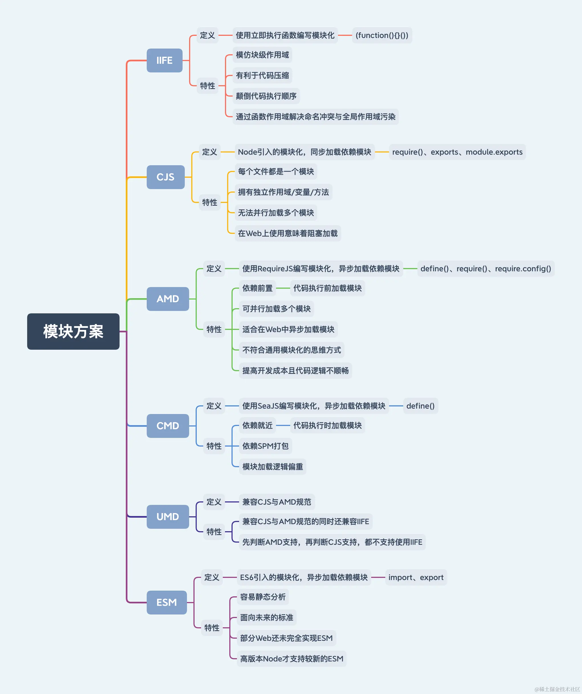

**工欲善其事，必先利其器**

这些经常重复使用的工具函数，包括但不限于

## 统一代码风格

应用代码规范有三点好处：

- 强制规范团队编码规范可让新旧成员编码习惯一样

- 增加项目代码的可维护性与可接入性，新成员能快速适应项目的架构与需求

- 保障项目整体质量，可减少无用代码、重复代码、错误代码和漏洞代码的产生几率

Lint

遍历

再将新的

- 配置Stylelint可查看

- 配置Eslint可查看

- 配置TypeScriptEslint可查看

- 配置VueEslint可查看

**可以考虑将配置文件打包为一个npm包,下下来后本地引用配置,或者编辑器配置**

### eslint

```javascript
//eslint-config-airbnb-base //(更严格,推荐)提供airbnb风格的代码规范
//eslint-config-standard    //(相对宽松)提供standard风格的代码规范
//eslint-plugin-import      //用于检查 ES6 的 import/export 语法
//eslint-plugin-vue         //帮助检查 Vue 特有的语法和最佳实践
//vite-plugin-eslint        //在 Vite 构建过程中集成 ESLint,自动执行代码检查

//保存自动格式化
//@vue/cli-plugin-eslint    // Vue CLI的一个插件,用这个vuecli会支持lintOnSave选项,同时会安装eslint及其相关依赖
//vue2
npm i eslint@8.57.0 eslint-plugin-import eslint-plugin-vue eslint-config-airbnb-base -D
//vue3
npm i eslint@8.57.0 eslint-plugin-import eslint-plugin-vue vite-plugin-eslint eslint-config-airbnb-base -D

//在package.json中的scripts配置项中添加lint配置项
    //若无效,手动添加
npm set-script lint "eslint --fix \"./src/**/*.{js,jsx,ts,tsx}\""
```

### stylelint

```javascript
//stylelint                         //CSS/SCSS/Less代码检查工具
    //stylelint-config-recess-order     //规定css属性的书写顺序(要折磨自己吗?)
    //stylelint-config-standard         //Stylelint 的标准配置,包含了一组常见的 CSS 编码最佳实践。
    //stylelint-config-standard-vue     //在 stylelint-config-standard 的基础上新增了一些 Vue 特有的规则
    //stylelint-config-standard-scss    //在 stylelint-config-standard 的基础上新增了stylelint-config-recommended-scss的大部分规则,同时适应与sass    
    //stylelint-config-standard-less    //在 stylelint-config-standard 的基础上新增了stylelint-config-recommended-less的大部分规则
    
    //stylelint-config-sass-guidelines  //包含了一组针对 仅sass 的最佳实践规则
    //stylelint-config-recommended-scss //包含了一组针对 仅SCSS 的最佳实践规则
    //stylelint-config-recommended-less //包含了一组针对 仅less 的最佳实践规则

//仅css的vue
npm i stylelint  stylelint-config-standard stylelint-config-standard-vue -D
​//仅css sass scss的vue
npm i stylelint  stylelint-config-standard stylelint-config-standard-vue stylelint-config-standard-scss -D
//仅css sass scss less的vue
npm i stylelint  stylelint-config-standard stylelint-config-standard-vue stylelint-config-standard-scss stylelint-config-standard-less -D

```

## 统一提交规范

```
//husky                            //操作 git 钩子的工具
//lint-staged                      //本地暂存代码检查工具
//commitlint                       //commit 信息校验工具
//@commitlint/config-conventional  //提供一些默认配置
//commitizen                       //辅助 commit 信息 ,就像这样,通过选择输入,规范提交信息
```

### husky

操作 git 钩子的工具,常见钩子如下：

- pre-commit   提交前的钩子

- commit-msg 提交信息钩子

- pre-push       push前的钩子

```javascript
npm i husky@^7.0.4 -D

//在package.json中的scripts配置项 添加 prepare 配置,9版本以上执行husky init会自动添加
    //如果无效建议手动添加
npm set-script prepare "husky install"             

//初始化husky,将 git hooks 钩子交由,husky执行
npm run prepare
```

### lint-staged

本地暂存代码检查工具

```javascript
npm i lint-staged@^9.5.0 -D
//在.husky目录下的pre-commit文件(如果没有会创建) 添加 npx lint-staged 命令                                    
npx husky add .husky/pre-commit "npx lint-staged"  

//根目录创建.lintstagedrc.json 文件或在package.json中添加lint-staged配置项 添加以下代码
{
    //提交时检验暂存区的js,jsx,ts,tsx文件
    "*.{js,jsx,ts,tsx,vue}": [
      "eslint . --ext .vue,.js,.jsx,.ts,.tsx --fix --ignore-path .gitignore",
      "prettier --write  \"src/**/*.{js,tsx,css,less,scss,vue,html,md}\"",
      "stylelint --cache --fix \"**/*.{vue}\" --cache --cache-location node_modules/.cache/stylelint/"
    ],
    "*.{scss,less}": [
      "prettier --write  \"src/**/*.{js,tsx,css,less,scss,vue,html,md}\"",
      "stylelint --cache --fix \"**/*.{less,postcss,css,scss}\" --cache --cache-location node_modules/.cache/stylelint/"
    ],
    "{!(package)*.json,*.code-snippets,.!(browserslist)*rc}": [
      "prettier --write"
    ],
    "package.json": [
      "prettier --write"
    ],
    "*.md": [
      "prettier --write"
    ]
}
```

### **commitlint**

- **commitlint：**commit 信息校验工具

- **@commitlint/config-conventional：**提供一些默认配置,标识采用什么规范来执行消息校验, 默认是**Angular**的提交规范

```javascript
npm i commitlint@^14.1.0 @commitlint/config-conventional@^14.1.0 -D
npx husky add .husky/commit-msg "npm run commitlint"

//添加文件.commitlintrc.js
module.exports = {
  extends: ['@commitlint/config-conventional']
};
//或者在package.json中添加
"commitlint": {
    "extends": [
        "@commitlint/config-conventional"
    ]
},      
```

**注意要加空格**

提供

<type>(<scope>): <short description>

[optional body]

[optional footer(s)]

```javascript
//如需修改@commitlint/config-conventional的默认配置,看自定义提交规范,用自定义的覆盖它

//添加commitlint.config.js或.commitlintrc.js
module.exports = {
    extends: ['@commitlint/config-conventional'],
}
//或者在package.json中添加
"commitlint": {
    "extends": ["@commitlint/config-conventional"]
}
```

| 类型 | 描述 | 
| -- | -- |
| feat | 新增功能，迭代项目需求 | 
| refactor | 重构代码，非新增功能也非修复缺陷 | 
| perf | 优化相关，比如提升性能、体验 | 
| test | 新增测试，追加测试用例验证代码 | 
| style | 代码格式修改, 注意不是 css 修改 | 
| fix | 修复缺陷 | 
|   |   | 
| revert | 回滚版本，撤销某次代码提交 | 
| merge | 合并分支，合并分支代码到其他分支 | 
|  |   | 
| docs | 更新文档，仅修改文档不修改代码 | 
| build | 编译相关的修改，例如发布版本、对项目构建或者依赖的改动 | 
| chore | 其他修改, 比如改变构建流程、或者增加依赖库、工具等 | 
|   |   | 
| ci | 更新脚本，改动CI或执行脚本配置 | 


#### 自定义提交规范

默认提交规范<type>(<scope>): <subject>

[commitlint中文文档](https://blog.csdn.net/qq_21197033/article/details/128609033)

如果自定义提交信息校验就不需要[@commitlint/config-conventional](https://github.com/conventional-changelog/commitlint/tree/master/%40commitlint/config-conventional)

[commitlint](https://commitlint.js.org/reference/plugins.html)可以声明本地插件,但是同时只能有一个本地插件

```javascript
//添加commitlint.config.js或.commitlintrc.js
//以下自定义了一个叫commit-message-rule的本地插件,并在rules中定义了它的使用范围

module.exports = {
  //extends: ['@commitlint/config-conventional'],
  //是否使用默认忽略规则
  //defaultIgnores: true,
  // 什么条件忽略提交信息
  ignores: [(commit) => commit.includes('init')],
  //提交验证失败时，将显示此 URL
  helpUrl: 'http://172.26.0.17:8090/pages/viewpage.action?pageId=66330',
  // [规则名称]:[level, applicable, value]
  // level 校验等级
      // 0 禁用
      // 1 警告
      // 2 错误
  // applicable 规则匹配模式
      // always 正匹配
      // never 反匹配
      // value 参数值
  // 规则可接收参数：
  // 规则数组 Array
  // 返回规则数组的函数 () => array
  // Promise规则数组 Promise《Array》
  rules: {
    'commit-message-rule': [2, 'always'],
  },
  plugins: [
    {
      rules: {
        'commit-message-rule': ({ header }) => {
          // const noIssueReg = /[N|n][O|o][I|i][S|s][S|s][U|u][E|e]\;\s*[^\s]+\s*/;
          const IssueReg = /\s*[I|i][S|s][S|s][U|u][E|e]\s*\:\s*[a-zA-Z]+-[0-9]+\s*\;[\s\S]*/;
          return [IssueReg.test(header), '您的提交信息不符合规范！正确的格式为(示例)：Issue:xxxx-000;xxxxxx'];
        },
      },
    },
  ],
};

```

### commitizen

辅助 commit 信息,只支持手动输入git cz命令触发

```javascript
//cz-conventional-changelog 提供默认的git cz提示
//cz-customizable           自定义git cz的提示
npm i commitizen cz-customizable -D

husky add .husky/commit-msg 'npx --no-install commitlint --edit "$1"'

//在package.json 的scripts配置项 中添加 commit 指令, 执行 `git-cz` 指令
    //无效请手动添加
npm set-script commit "git-cz"
//指定package.json中 config/commitizen/path 为"./node_modules/cz-customizable"
npx commitizen init cz-customizable --save-dev --save-exact
```

#### 自定义cz信息

```javascript
 //增加 .cz-config.js
   'use strict'
  module.exports = {
    types: [
      { value: '✨新增', name: '新增:    新的内容' },
      { value: '🐛修复', name: '修复:    修复一个Bug' },
      { value: '📝文档', name: '文档:    变更的只有文档' },
      { value: '💄格式', name: '格式:    空格, 分号等格式修复' },
      { value: '♻️重构', name: '重构:    代码重构，注意和特性、修复区分开' },
      { value: '⚡️性能', name: '性能:    提升性能' },
      { value: '✅测试', name: '测试:    添加一个测试' },
      { value: '🔧工具', name: '工具:    开发工具变动(构建、脚手架工具等)' },
      { value: '⏪回滚', name: '回滚:    代码回退' }
    ],
    scopes: [
      { name: 'leetcode' },
      { name: 'javascript' },
      { name: 'typescript' },
      { name: 'Vue' },
      { name: 'node' }
    ],
    // it needs to match the value for field type. Eg.: 'fix'
    /*  scopeOverrides: {
      fix: [
        {name: 'merge'},
        {name: 'style'},
        {name: 'e2eTest'},
        {name: 'unitTest'}
      ]
    },  */
    // override the messages, defaults are as follows
    messages: {
      type: '选择一种你的提交类型:',
      scope: '选择一个scope (可选):',
      // used if allowCustomScopes is true
      customScope: 'Denote the SCOPE of this change:',
      subject: '短说明:\n',
      body: '长说明，使用"|"换行(可选)：\n',
      breaking: '非兼容性说明 (可选):\n',
      footer: '关联关闭的issue，例如：#31, #34(可选):\n',
      confirmCommit: '确定提交说明?(yes/no)'
    },
    allowCustomScopes: true,
    allowBreakingChanges: ['特性', '修复'],
    // limit subject length
    subjectLimit: 100
  }

```

## CI/CD

gitlab提供了 CI/CD功能，gitlab-ci.yml 文件是 GitLab CI/CD 配置的核心文件，常见配置如下：

- stages：定义了流水线的不同阶段(作业)，按顺序依次执行。

- variables：定义了全局变量，这些变量可以在整个 gitlab-ci.yml 文件中使用。

- before_script：在每个作业之前运行的命令。

- jobs(可不显示声明,满足job结构的配置项会自动识别为job)：定义每个作业做的事情，这里build_job作业就是定义build阶段做的事情。

- stage：定义这个作业对应的流水线阶段

- artifacts：用于定义构建产物，可以在后续阶段或作业中使用。

- paths：构建产物所在目录

- cache：缓存依赖项或构建结果，以加快后续的构建速度。

- key：

- key相当于给缓存命别名，缓存空间具有这个名字的缓存就会使用缓存

- 默认是default，所有未指定缓存键的job将共享同一个缓存空间

- policy：默认 pull-push 表示先恢复缓存，然后更新缓存

- paths：应该缓存的目录

- dependencies：定义作业之间的依赖关系，也就是这个作业依赖哪个作业。

- services：为作业提供辅助服务，如数据库服务。

```javascript
//-代表一个新的命令
stages:
  - build
  - test
  - deploy

variables:
  NODE_ENV: production
  DEFAULT_BRANCH: main

before_script:
  - echo "Setting up the environment..."
  - npm install

build_job:
  stage: build
  script:
    - echo "Building the project..."
    - npm run build
  artifacts:
    paths:
      - dist/
  only:
    - $DEFAULT_BRANCH

test_job:
  stage: test
  script:
    - echo "Running tests..."
    - npm test
  services:
    -mysql:latest
  dependencies:
    -build_job
```

## 切换Npm镜像

npm i nrm -g

| 命令 | 功能 | 
| -- | -- |
| nrm add <name> <url> | 新增镜像 | 
| nrm del <name> | 删除镜像 | 
| nrm test <name> | 测试镜像 | 
| nrm use <name> | 切换镜像 | 
| nrm current | 查看镜像 | 
| nrm ls | 查看镜像列表 | 


## 切换node版本

npm i nvm -g

| 命令 | 功能 | 
| -- | -- |
| nvm ls | 查看本地node版本列表 | 
| nvm use <version> | 切换版本 | 
| nvm install <version> | 下载一个指定版本的node | 
| nvm uninstall <version> | 卸载一个指定版本的node | 


## node支持ESM

### 模块方案

在



### CJS与ESM

| - | CJS | ESM | 
| -- | -- | -- |
| 语法类型 | 动态 | 静态 | 
| 关键声明 | require | export与import | 
| 加载方式 | 运行时加载 | 编译时加载 | 
| 加载行为 | 同步加载 | 异步加载 | 
| 书写位置 | 任何位置 | 顶层位置 | 
| 指针指向 | this指向 | this指向 | 
| 执行顺序 | 首次引用时 | 引用时生成 | 
| 属性引用 | 基本类型属于 | 所有 | 


- 运行时加载指整体加载模块生成一个对象，再从对象中获取所需的属性方法去加载。最大特性是全部加载，只有运行时才能得到该对象，无法在编译时做静态优化。

- 编译时加载指直接从模块中获取所需的属性方法去加载。最大特性是按需加载，在编译时就完成模块加载，效率比其他方案高，无法引用模块本身(本身不是对象)，但可拓展JS高级语法(宏与类型校验)。

### node对ESM的原生支持

2017年10月31日

```bash
bash复制代码node --experimental-modules index.js

```

但

接着

--experimental-modules

- 使用type指定模块方案

- 在package.json中指定type为commonjs，则使用CJS

- 在package.json中指定type为module，则使用ESM

- 使用--input-type指定入口文件的模块方案，与type一样

- 命令中加上--input-type=commonjs，则使用CJS

- 命令中加上--input-type=module，则使用ESM

- 支持新文件后缀.cjs

- 文件后缀使用.cjs，则使用CJS

- 使用--es-module-specifier-resolution指定文件名称引用方式

- 命令中加上--es-module-specifier-resolution=explicit，则引用模块时必须使用文件后缀(默认)

- 命令中加上--es-module-specifier-resolution=node，则引用模块时无需使用文件后缀

- 使用main根据type指定模块方案加载文件

- 在package.json中指定mian后会根据type指定模块方案加载文件

### CJS/ESM判断方式

Node

简而言之，

当然还可通过命令参数处理，不过我认为这样做操作过多，所以就不讨论具体方法了。

刚才说了

1.  文件后缀为.mjs

1.  文件后缀为.js且在package.json中指定type为module

1.  命令中加上--input-type=module

1.  命令中加上--eval cmd

### esm中如何使用__dirname和__filename

```javascript
import { dirname } from "path";
import { fileURLToPath } from "url";

const __filename = fileURLToPath(import.meta.url);
const __dirname = dirname(__filename);
console.log(__filename, __dirname,import.meta.url);
```

示例引用我开源的[@yangzw/bruce-us](https://link.juejin.cn/?target=https%3A%2F%2Fgithub.com%2FJowayYoung%2Fbruce%2Ftree%2Fmain%2Fpackages%2Fus)，其中

```js
import { NodeType } from "@yangzw/bruce-us/dist/node";

console.log(NodeType());
```

### 查看node对应的npm版本

使用[Node Releases](https://link.juejin.cn/?target=https%3A%2F%2Fnodejs.org%2Fzh-cn%2Fdownload%2Freleases)

### 低版本node兼容

若需兼容

```javascript
{
    "babel": {
        "presets": [
            ["@babel/preset-env", { "targets": { "node": "8.0.0" } }]
        ]
    }
}

```

## 服务管理

- nodemon适用于开发环境，调试代码更方便；

- forever适用于无需监控且访问量较小的Node服务；

- pm2适用于需监控且访问量较大的Node服务；

| 工具 | 稳定性 | 运行环境 | 并发量级 | 后台运行 | 代码监听 | 状态监控 | 日志管理 | 集群模式 | 
| -- | -- | -- | -- | -- | -- | -- | -- | -- |
|  | 中等 | 开发环境 | 无 | ❌ | ✔️ | ❌ | ❌ | ❌ | 
|  | 中等 | 生产环境 | 较小 | ✔️ | ✔️ | ❌ | ✔️ | ❌ | 
|  | 较高 | 生产环境 | 较大 | ✔️ | ✔️ | ✔️ | ✔️ | ✔️ | 


### pm2

pm2 是node的 process manager(进程管理)的第二大版本

主要功能是

npm install -g pm2

| 命令 | 作用 | 
| -- | -- |
| pm2 ecosystem | 创建一个ecosystem.config.js文件, | 
| pm2 link xxx xxx | 链接远程app.pm2.io网站创建的bucket,用于在线监控 | 
| pm2 logs/flush | 查看/清空日志 | 
| pm2 logs/flush 进程名/进程id | 查看/清空单个进程的日志 | 
| pm2 list/stop/restart/delete all | 查看/停止/重启/删除所有进程 | 
| pm2 show/stop/restart/delete/monit 进程id | 查看单个进程的状态 | 
| pm2 save/resurrect | 保存/恢复进程状态 | 
| pm2 scale 应用程序名/id num/+num/-num | 动态调整进程数,指定个数/新增个数/减少个数 | 
| pm2 start 进程文件路径 | 启动进程 | 
| pm2 start 进程文件路径  --max-memory-restart 200M | 启动进程,并限制最大重启内存为200m,超出就自动重启 | 
| pm2 start app.js -i 0 | 根据CPU核数启动相应数量的进程,0/max表示使用所有可用的CPU核心 | 


### nodemon自动重启服务

使用[nodemon](https://nodemon.io/),在

```json
{
    "nodemonConfig": {
        "env": {
            "NODE_ENV": "dev"
        },
        "execMap": {
            "js": "node --harmony"
        },
        "ext": "js json",
        "ignore": [
            "dist/"
        ],
        "watch": [
            "src/"
        ]
    }
}
```