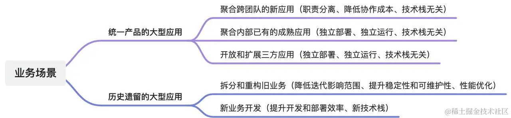
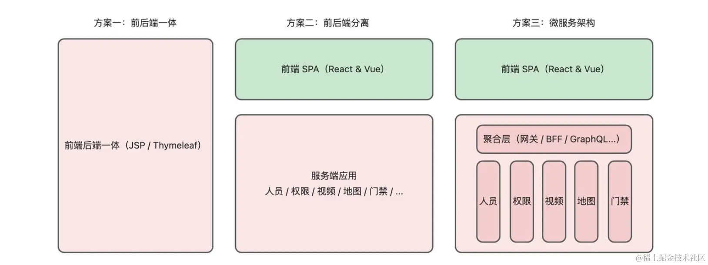
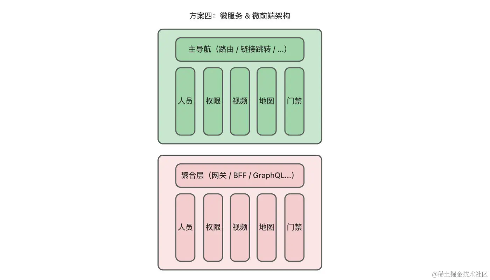
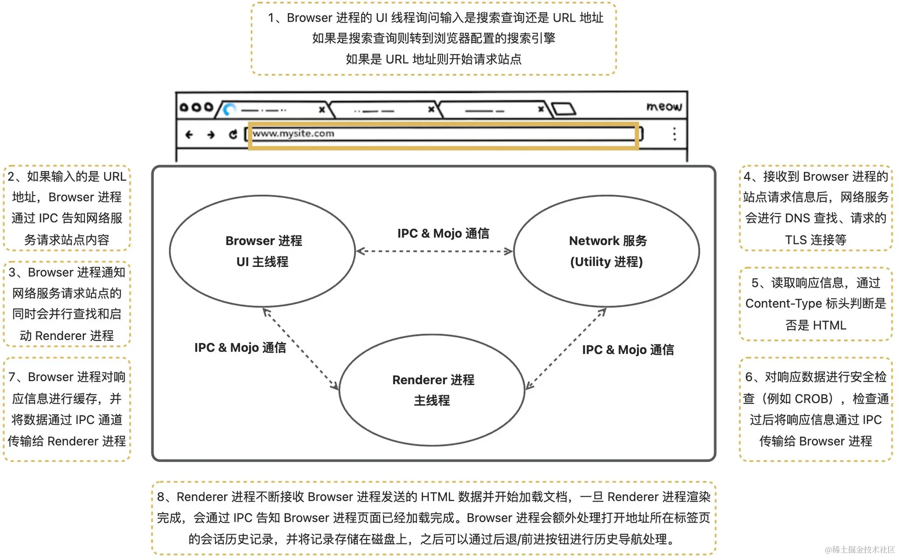
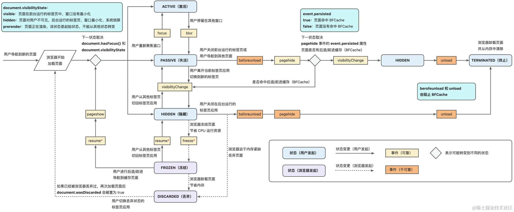
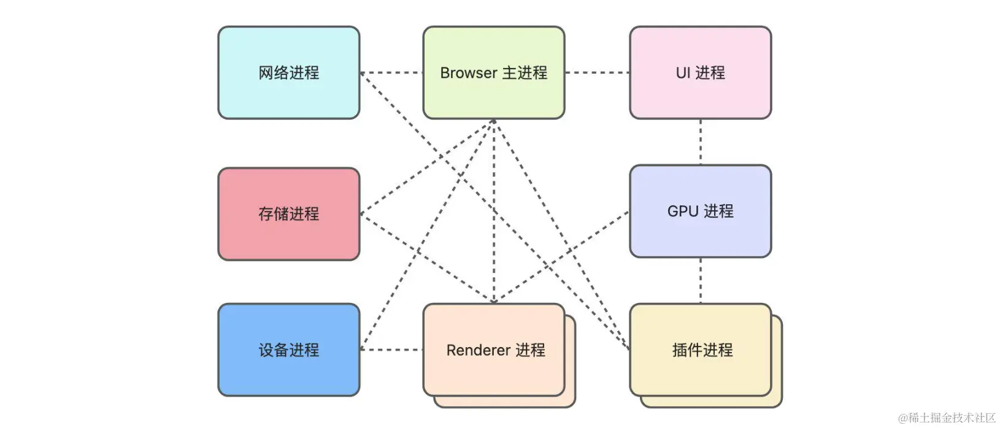
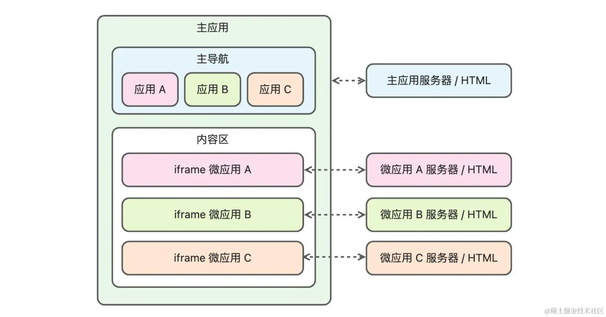
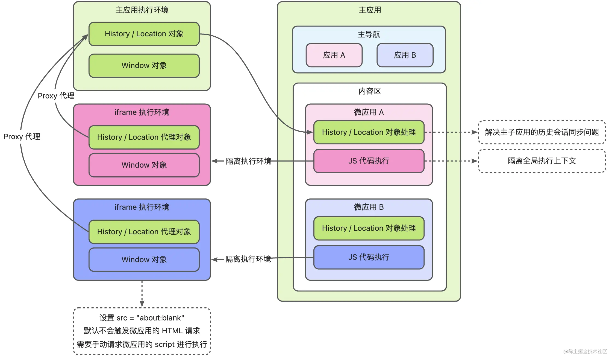
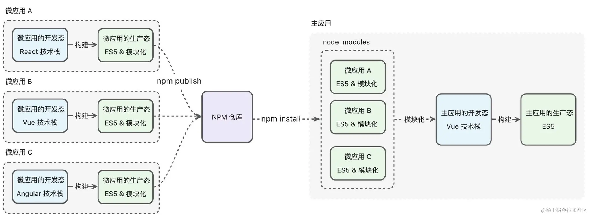
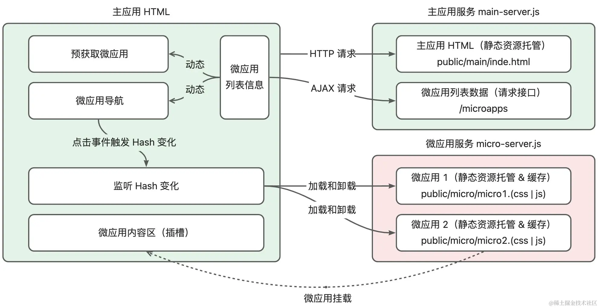

# 微前端

## **什么是微前端？**

一种架构风格，将前端应用程序拆分为多个独立的功能单元，类似于微服务架构中的服务拆分，从而实现前端项目的解耦和独立部署。
---
## 为什么要用微前端

**降低大型复杂应用的开发、升级、维护以及团队协作的成本。**

**解决历史遗留的难以开发、升级和维护的大型应用，也是使用微前端的一个重要原因。**

**当项目较小,无拆分需求,技术选型一致时不推荐使用**

- SPA 体验：微前端可以使所有的应用保持原有的 SPA 体验，统一品牌认知；
- 技术栈无关：可以使用不同的技术栈（例如 React、Vue、Svelte ）开发，支持独立部署；
- 性能优化： 在 MPA 和 iframe 中如果想要做性能优化，往往需要依赖浏览器和 HTTP 的能力，而在微前端中可以处理应用资源的去重、应用自身的预加载、预渲染和缓存处理，也可以对已加载的页面进行保活处理，增加了性能优化的手段；
- 解耦重构：部分低代码页面无法满足性能要求时，可以通过新的技术栈将页面进行重构，不影响其他低代码页面的运行，从而可以减少重构带来的影响面。
---






---
## MPA

MPA软件架构模式特点：

1. 微服务架构：专注于将应用程序拆分为独立可管理的微服务，每个微服务都有自己的数据存储、业务逻辑和API。
2. 前后端分离：前端和后端完全解耦,前端仅负责界面展示和交互逻辑，后端只提供API接口供前端调用。
3. 统一网关：所有前端请求都经过一个统一网关进行路由和转发，网关负责权限验证、负载均衡等功能。这使得整个系统具有更好的安全性和可维护性。
4. 事件驱动架构：微服务之间通过发布/订阅模式进行异步通信，彼此解耦。当一个微服务发生变化时,会通过事件通知其他相关的微服务。这提高了系统的可扩展性和容错性

---
# 浏览器相关
## **Browser,Renderer,Isolate,Context的关系**
从左到右都是一对多的关系

1. Browser是浏览器的主进程，负责处理网络资源请求，文件访问，标签页管理等操作系统级别操作，并负责与其他进程进行协调和通信
2. renderer由brower创建，负责解析HTML、CSS和JavaScript等前端代码并渲染，同站应用可能会共享一个renderer进程
3. 每个tab页和每个进程都拥有自己的Isolate，用于隔离JavaScript运行环境,有独立的堆和栈，负责内存管理和垃圾回收等操作
4. context由 js代码执行时由 js引擎（如V8）根据代码和当前执行环境(Isolate 所关联的环境)自动构建的。例如 `webWorker context`，`全局context`，`函数context`，用于实际执行代码，包含执行代码所需的必要变量
---
## 输入url到渲染的过程

这里不讲解页面渲染和 JS 解析的过程）：
> 上述图例是在多进程架构的情况下。在运行资源相对紧张的情况下，例如低端的安卓手机中，网络服务也可以是 Browser 进程中的一个处理线程。


---
## 一个页面的生命周期



如果在 SPA 模式下加载多个独立的微应用，这些微应用本身将处于同一个 Renderer 进程内，并且还会处于同一个浏览上下文和 V8 Isolate 中，因此微应用之间无法做到浏览器级别的导航、安全隔离、性能优化以及缓存处理，并且在 SPA 模式下多个微应用还可以共存，切换标签页会通过浏览器进行隔离处理，而切换 SPA 的路由则仍然可以使得多个微应用并存。总结来说，在 SPA 模式下微应用之间的切换并不是靠 Browser 进程进行处理，而是靠 Renderer 进程中的 JavaScript 逻辑进行处理，此时浏览器内部的运行机制无法起到细粒度的管控作用，需要额外处理以下一些问题：

- 状态：根据自定义逻辑来管控微应用的状态，包括（预）加载、加载、卸载、（预）渲染等
- 隔离：在同一个浏览上下文中进行 DOM 和 JS 隔离
- 性能：例如支持微应用的预加载、预渲染和缓存，微应用之间的资源共享
- 通信：如果几个微应用同时并存，如何实现微应用之间的通信
---

## 浏览器进程

要查看 Chrome 浏览器的进程运行情况，可以通过右上角的 `设置 / 更多工具 / 任务管理器` 打开

### 浏览器多进程架构的优点

- **稳定性**：每个标签页或扩展程序都在单独的进程中运行，一个标签页崩溃不会影响其他标签页的稳定性，提高了浏览器整体的稳定性。
- 安全性：每个进程都在沙箱环境中运行，相互隔离，一个进程受到攻击或崩溃不会波及其他进程，提高了浏览器的安全性。
- 性能：多进程架构可以充分利用多核处理器的优势，提高浏览器的并发处理能力和响应速度，提升用户体验。
- 资源管理：每个进程都有独立的内存空间，可以更好地管理内存资源，避免内存泄漏或过度占用内存的问题。
---
### Browser与Renderer

**浏览器运行时会常驻 Browser 主进程，而打开新标签页时会动态创建对应的 Renderer 进程**

> 温馨提示：新开的标签页和 Renderer 进程并不一定是 1: 1 的关系，例如，多个新开的空白标签页为了节省资源，有可能被合并成一个 Renderer 进程。


1. Browser 进程(浏览器主进程-常驻)：
	1. 主要负责处理网络资源请求、用户的输入输出 UI 事件、地址栏 URL 管理、书签管理、回退与前进按钮、文件访问、Cookie 数据存储等。
	2. 它也被称为代理进程，会派生进程(如Renderer进程)并监督它们的活动情况。
	3. 它对派生的进程进行沙箱隔离，具备沙箱策略引擎服务。
	4. Browser 进程通过内部的 I/O 线程与其他进程通信，通信的方式是 [IPC](https://link.juejin.cn/?target=https%3A%2F%2Fwww.chromium.org%2Fdevelopers%2Fdesign-documents%2Finter-process-communication%2F) & [Mojo](https://link.juejin.cn/?target=https%3A%2F%2Fchromium.googlesource.com%2Fchromium%2Fsrc%2F%2B%2FHEAD%2Fmojo%2FREADME.md)
2. Renderer 进程(浏览器的一个子进程)：
	1. 由 Browser 派生
	2. 负责执行tab页的JavaScript代码、渲染页面内容等任务。
	3. Renderer 进程本身无法对操作系统操作，需要通过IPC通知Browser进行代理操作，例如网络请求，文件操作等。
		1. 所有空白tab页可能会被合并为一个Renderer进程。
		2. 手动新开的tab页都会创建新的Renderer 进程。
		3. chrome67版本后默认情况下会开启站点隔离，可通过访问chrome://flags关闭：
		4. Browser进程会根据站点是否不同,创建/合并 Renderer 进程。
		5. 通过window.open创建的tab页相同站点会合并,不同站点创建新的Renderer 进程。
		6. 每个iframe都会单独创建Renderer进程用于沙箱隔离。



---
### url与host

url的组成：[协议]:[host]:[port]/[文件地址path]

例如         `http:www.baidu.com`

它的协议为	`http`

host为		`www.baidu.com

port为		默认端口80 (http是80) (https是443)

host的组成为：`[主机名/二级域名 的前缀].[二级域名].[顶级域名]`

- 同源：协议（protocol）、主机名（host）和端口（port）相同，则为同源；

- 同站：相同域名（Domain）或子域名（Subdomain）的网站,例如：`http://blog.example.com/post.html` 和 `http://shop.example.com/product.html` 虽然在不同的子域名下，但如果它们都属于同一个网站的所有者和管理下，并且遵循相同的cookie政策、存储机制等，那么在某种上下文中也可以被视为同站（尽管技术上它们遵循不同的源）

### 未开启站点隔离的风险

未启动站点隔离之前，标签页应用和内部的 iframe 应用会处于同一个 Renderer 进程，Web 应用有可能发现安全漏洞并绕过同源策略的限制，访问同一个进程中的其他 Web 应用，因此可能产生如下安全风险：

- 获取跨站点 Web 应用的 Cookie 和 HTML 5 存储数据；
- 获取跨站点 Web 应用的 HTML、XML 和 JSON 数据；
- 获取浏览器保存的密码数据；
- 共享跨站点 Web 应用的授权权限，例如地理位置；
- 绕过  [X-Frame-Options](https://link.juejin.cn/?target=https%3A%2F%2Fdeveloper.mozilla.org%2Fzh-CN%2Fdocs%2FWeb%2FHTTP%2FHeaders%2FX-Frame-Options) 加载 iframe 应用（例如百度的页面被 iframe 嵌套）；
- 获取跨站点 Web 应用的 DOM 元素。

---
## **Isolate与Context**

### Isolate

1. V8 中最基本的隔离单元。
2. **每个 Isolate 代表一个独立的执行环境**，包含了 V8 引擎的所有状态。
3. 浏览器环境下，isostate由浏览器引擎内部管理，浏览器会为每个页面（文档）创建一个 Isolate，这个 Isolate 负责执行页面中的 JavaScript 代码，并管理页面的内存。
4. node环境下，通常每个 Node.js 进程都会包含一个 V8 Isolate。
5. 独立性：每个 Isolate 拥有自己的堆、栈和垃圾回收机制，确保了完全的隔离。
6. 内存管理：每个 Isolate 负责自己的内存分配和垃圾回收因此内存使用情况可以更好地控制和优化。
7. 线程安全：V8 可以在多个线程中创建多个 Isolate，允许并行处理，但每个 Isolate 只能由一个线程在同一时间访问。

### **Context**

1. 是 **Isolate 中的一个执行环境**，
2. 主要作用是 **提供一个隔离的环境供代码执行**
3. 浏览器环境下，一个Isolate对应一个Context，Context通常对应一个页面/iframe/webworker，包含了js运行时所需要的信息，例如全局对象、内置对象和函数
4. node环境下，通常一个 Isolate 可以包含多个 Context，每个 Context 代表一个独立的执行环境。**可以用来实现模块的隔离**。

# 通信方案

## SPA应用

1. 跨域的SPA 应用，iframe 则可以通过 window.postMessage 实现通信
2. 同域的 SPA 应用，则可以通过浏览器原生的 EventTarget 或者自定义通信对象

## Cookie共享

- 同域：微应用主应用共享Cookie,子应用修改Cookie可能误修改主应用的Cookie
- 跨域同站：不可共享Cookie,微应用主应用通过document.domain共享Cookie
- 跨站：无法共享Cookie，而且子应用默认无法携带 Cookie（防止 CSRF 攻击），需要使用 HTTPS 协议并设置服务端 Cookie 属性  {sameSite: "none", secure: true };才能携带cookie

# 微前端方案

如果项目本身采用 SPA 模式进行开发，则可以通过以下方案进行微前端改造：

- `基于 iframe 的微前端 `：在主应用中使用 iframe 标签来加载不同的微应用，通过切换导航时动态修改iframe的url 来控制内容区微应用 A / B / C 的加载和卸载；

- `基于 NPM 包的微前端`：将微应用打包成独立的 NPM 包，通过在微应用入口暴露unmount和mount函数在主应用中动态挂载和卸载；

- `基于动态 Script 的微前端`：将微应用打包成纯js，通过script标签引入，；

- `基于框架（JavaScript SDK）的微前端`：使用 single-spa、qiankun、wujie 等通用框架。

- 

- 使用V8为每个js创建不同的isostate和context进行隔离(浏览器不支持)：isostate和context见[[#浏览器相关]]

- 

- 基于代码分割的微前端：在主应用中使用懒加载技术，在运行时动态加载不同的微应用；

- 基于 Web Components 的微前端：将微应用封装成自定义组件，在主应用中注册使用；

- 基于 Module Federation 的微前端：借助 Webpack 5 的 Module Federation 实现微前端；

## 隔离方案

### v8隔离

通过

无法实现,需要浏览器提供创建Isolate 或者 Context的能力

### iframe 隔离

具体见iframe方案的隔离类

- iframe 隔离： 
	- 空白页（src="about:blank"）的 iframe会新建context进行隔离。不仅可以利用不同的浏览上下文实现彻底的微应用隔离，与普通 iframe 方案而言，还可以解决白屏体验问题，是微前端框架实现隔离的重要手段；
	- 但是无法同步主应用的history api状态

- iframe + Proxy 隔离： 
	- 利用proxy,在使用history时，proxy到主应用window上的history，解决空白页 iframe 隔离无法调用 history API 的问题，并可用于解决 iframe 方案中无法处理的 URL 状态同步问题；

### 快照隔离

- [快照隔离](https://juejin.cn/book/7258893482318626868/section/7259192774364004392?enter_from=course_center&utm_source=course_center)：
	- 就是保留以前的状态挂载在window上，称为快照隔离
	- 通过保存父子应用window上的属性，切换应用时，如果是新挂载的就添加属性，如果不是对比以前保存的属性值进行对比后动态修改属性值，会**存在属性冲突**
	- 浏览器无法兼容 Proxy 时，可以通过简单的快照实现 window 变量的隔离，但是这种隔离方案限制较多，例如无法实现主子应用的隔离，无法实现多个微应用并存的隔离。当然大多数场景是一个时刻运行一个微应用，因此是一种兼容性良好的隔离方案；

### CSS 隔离

CSS 隔离： 
- 如果主应用和微应用同处于一个 DOM 上下文，那么需要考虑 CSS 样式的隔离处理。
-  Shadow DOM 实现 CSS 隔离会导致shaowDom中的dom事件无法冒泡到主应用中，导致react事件机制失效，react17后修改委托机制,将事件委托在挂载的root上。

## iframe方案

### 特点

iframe 应用的特点主要包括：
- 站点隔离和浏览上下文隔离，可以使微应用在运行时天然隔离，适合集成三方应用，因此微应用也能用不同的技术栈；
- 移植性和复用性好，可以便捷地嵌在不同的主应用中。

### **问题**

使用 iframe 应用时，会产生如下一些问题：
- **主子应用之间的通信与数据共享**，
- 通信通过window.postMessage等，数据共享通过本地存储等；
- **首要解决的是主子应用的免登问题**，
- 通过主应用和微应用共享 Cookie 进行处理；
- 主应用刷新时， iframe 无法保持 URL 状态（会重新加载 src 对应的初始 URL）；
- 主应用和 iframe 处于不同的浏览上下文，无法使 iframe 中的模态框(弹窗)相对于主应用居中；
- 主子应用**在跨域情况下无法使用window.history API**,会报错,需要同源
	- (通过proxy隔离解决)
- 主子应用持久化数据的隔离处理；
- 解决主应用空白 HTML 请求的性能优化处理（例如 GET 请求空内容、请求渲染时中断请求等）；
- 对于非后台管理系统而言，使用 iframe 还需要考虑 SEO、移动端兼容性、加载性能等问题。

### 怎么实现demo

- 通过切换导航时 **动态修改iframe的url** 来控制内容区微应用 A / B / C 的加载和卸载
- script标签请求的资源天然支持跨域,而**iframe连接的页面会进行ajax请求,会导致跨域,需要后端配置跨域响应**

如下所示：



#### html部分设计

```javascript
<!-- public/main/index.html -->

<!DOCTYPE html>
<html lang="en">
  <head>
    <meta charset="UTF-8" />
    <meta http-equiv="X-UA-Compatible" content="IE=edge" />
    <meta name="viewport" content="width=device-width, initial-scale=1.0" />
    <title>Document</title>
  </head>

  <body>
    <h1>Hello，Sandbox Script!</h1>

    <!-- 主应用导航 -->
    <div id="nav"></div>

    <!-- 主应用内容区 -->
    <div id="container"></div>

    <script type="text/javascript">
      //引入MicroAppSandbox,MicroApp,MicroApps,MainApp
      new MainApp();
    </script>
  </body>
</html>

```

#### js部分设计

- MicroAppSandbox：负责维护微应用隔离，包括创建、激活和销毁隔离实例等
- MicroApp：负责维护微应用，包括请求和缓存静态资源、激活微应用、状态管理等
- MicroApps：负责维护微应用列表，包括预加载、添加和删除微应用等
- MainApp：负责管理主应用，包括获取微应用列表、创建微应用的导航、切换微应用
##### 隔离类
- MicroAppSandbox：负责维护微应用隔离，包括创建、激活和销毁隔离实例等
###### 普通iframe隔离

```javascript
// 隔离类
class MicroAppSandbox {
    // 配置信息
    options = null;
    // iframe 实例
    iframe = null;
    // iframe 的 Window 实例
    iframeWindow = null;
    // 是否执行过 JS
    exec = false;
    
    constructor(options) {
      this.options = options;
      // 当iframe被推入dom中时,浏览器会创建新的全局执行上下文，用于隔离主应用的全局执行上下文
      this.iframe = this.createIframe();
      this.iframeWindow = this.iframe.contentWindow;
    }
    
    // 当iframe被推入dom中时,浏览器会创建新的全局执行上下文，用于隔离主应用的全局执行上下文
    createIframe() {
      const { rootElm, id, url } = this.options;
      const iframe = window.document.createElement("iframe");
      // 创建一个空白的 iframe
      const attrs = {
        src: "about:blank",
        "app-id": id,
        "app-src": url,
        style: "border:none;width:100%;height:100%;",
      };
      Object.keys(attrs).forEach((name) => {
        iframe.setAttribute(name, attrs[name]);
      });
      rootElm?.appendChild(iframe);
      return iframe;
    }
    
    // 激活
    active() {
      this.iframe.style.display = "block";
      // 如果已经通过 Script 加载并执行过 JS，则无需重新加载处理
      if(this.exec) return;
      this.exec = true;
      const scriptElement = this.iframeWindow.document.createElement('script');
      scriptElement.textContent = this.options.scriptText;
      this.iframeWindow.document.head.appendChild(scriptElement);
    }
    
    // 失活
    // INFO: JS 加载以后无法通过移除 Script 标签去除执行状态
    // INFO: 因此这里不是指代失活 JS，如果是真正想要失活 JS，需要销毁 iframe 后重新加载 Script
    inactive() {
      this.iframe.style.display = "none";
    }
    
    // 销毁隔离实例
    destroy() {
      this.options = null;
      this.exec = false;
      if(this.iframe) {
        this.iframe.parentNode?.removeChild(this.iframe);
      }
      this.iframe = null;
    }
}
```

###### proxy隔离

1. 通过自调用包裹,使子应用this指向代理对象,
2. 再通过代理对象,使子应用的window.history指向主应用的history,其他非箭头和构造函数的指向子应用window
3. 通过with语句包裹,是var声明的变量能正常绑定到window上



```javascript
// 隔离类
class IframeSandbox {
    // 沙箱配置信息
    options = null;
    // iframe 实例
    iframe = null;
    // iframe 的 Window 实例
    iframeWindow = null;
    // 是否执行过 JS
    execScriptFlag = false;
    
    
    constructor(options) {
      this.options = options;
      // 当iframe被推入dom中时,浏览器会创建新的全局执行上下文，用于隔离主应用的全局执行上下文
      this.iframe = this.createIframe();
      this.iframeWindow = this.iframe.contentWindow;
      this.proxyIframeWindow();
    }
    execScript() {
      const scriptElement =
        this.iframeWindow.document.createElement("script");
        //with语句在es5+中的严格模式被禁用,
            //通常情况下 with 会受到严格模式的限制，但是在某些情况下可以通过技巧来绕过严格模式的限制，
            //例如 qiankun 中的做法：
                //"use strict";
                //(0, eval)("(function(window) {with(window) {console.log(window)}}).bind(window)(window);");
            // 当然也可以使用new Function：
                //new Function("(function(window) {with(window) {console.log(window)}}).bind(window)(window);");
            // eval和new Function接收的代码都会推入全局上下文中执行
            // eval通常性能更优一些,因为它不需要额外创建函数
            // (0,eval)是为了避免eval被严格模式检测
                
        //with语句是为了处理var 添加全局变量问题,
        //with语句会将接收对象作为作用域,with会导致作用域混淆,影响性能,
            //当使用外部变量时,js引擎会切换到外部作用域去查找使用,
            //当使用接收的对象的属性时,会切换到接收对象作用域
      scriptElement.textContent = `
          (function(window) {
            with(window) {
              ${this.options.scriptText}
            }
          }).bind(window.proxy)(window.proxy);
          `;
      this.iframeWindow.document.head.appendChild(scriptElement);
    }
    
    // 当iframe被推入dom中时,浏览器会创建新的全局执行上下文，用于隔离主应用的全局执行上下文
    createIframe() {
      const { rootElm, id, url } = this.options;
      const iframe = window.document.createElement("iframe");
      const attrs = {
        src: "about:blank",
        "app-id": id,
        "app-src": url,
        style: "border:none;width:100%;height:100%;",
      };
      Object.keys(attrs).forEach((name) => {
        iframe.setAttribute(name, attrs[name]);
      });
      rootElm?.appendChild(iframe);
      return iframe;
    }
    
    //判断是否是箭头函数
    isBoundedFunction(fn) {
      return (
        // 被绑定的函数本身没有 prototype
        fn.name.indexOf("bound ") === 0 && !fn.hasOwnProperty("prototype")
      );
    }
    
    //判断是否是构造函数
    isConstructable(fn) {
      // 可以识别 Object、Array 等原生构造函数，也可以识别用户自己创建的构造函数
      return (
        fn.prototype &&
        // 通常情况下构造函数和类的 prototype.constructor 指向本身
        fn.prototype.constructor === fn &&
        // 通常情况下构造函数和类都会存在 prototype.constructor，因此长度至少大于 1
        // 需要注意普通函数中也会存在 prototype.constructor，
        // 因此如果 prototype 有自定义属性或者方法，那么可以判定为类或者构造函数，因此这里的判断是大于 1
        // 注意不要使用 Object.keys 进行判断，Object.keys 无法获取 Object.defineProperty 定义的属性
        Object.getOwnPropertyNames(fn.prototype).length > 1
      );
      // TODO: 没有 constructor 的构造函数识别、class 识别、function Person() {} 识别等
      // 例如 function Person {};  Person.prototype = {}; 此时没有 prototype.constructor 属性
    }
    
    
    // 修复 window.alert、window.addEventListener 等报错 Illegal invocation 的问题
    // window.alert 内部的 this 不是指向 iframe 的 window，而是指向被代理后的 proxy，因此在调用 alert 等原生函数会报错 Illegal invocation
    // 因此这里需要重新将这些原生 native api 的 this 修正为 iframe 的 window
    getTargetValue(target, prop) {
      const value = target[prop];
    
    
      // 过滤出 window.alert、window.addEventListener 等 API
      //判断是否是普通函数,普通函数则
      if (
        typeof value === "function" &&
        !this.isBoundedFunction(value) &&
        !this.isConstructable(value)
      ) {
    
    
        console.log('修正 this: ', prop);
    
    
        // 修正 value 的 this 指向为 target
        const boundValue = Function.prototype.bind.call(value, target);
        // 重新恢复 value 在 bound 之前的属性和原型（bind 之后会丢失）
        for (const key in value) {
          boundValue[key] = value[key];
        }
        // 如果原来的函数存在 prototype 属性，而 bound 之后丢失了，那么重新设置回来
        if (
          value.hasOwnProperty("prototype") &&
          !boundValue.hasOwnProperty("prototype")
        ) {
          boundValue.prototype = value.prototye;
        }
        return boundValue;
      }
      return value;
    }
    
    
    proxyIframeWindow() {
      this.iframeWindow.proxy = new Proxy(this.iframeWindow, {
        get: (target, prop) => {
          // console.log("get target prop: ", prop);
    
    
          // TODO: 这里只是课程演示，主要用于解决 src:about:blank 下的 history 同域问题，并没有真正设计主子应用的路由冲突问题，后续的课程会进行该设计
          // 思考：为了防止 URL 冲突问题，是否也可以形成设计规范，比如主应用采用 History 路由，子应用采用 Hash 路由，从而确保主子应用的路由不会产生冲突的问题
          if (prop === "history" || prop === "location") {
            return window[prop];
          }
    
    
          if (prop === "window" || prop === "self") {
            return this.iframeWindow.proxy;
          }
    
    
          return this.getTargetValue(target, prop);
        },
    
    
        set: (target, prop, value) => {
    
          target[prop] = value;
          return true;
        },
    
    
        has: (target, prop) => true,
      });
    }
    
    
    // 激活
    async active() {
      this.iframe.style.display = "block";
      // 如果已经通过 Script 加载并执行过 JS，则无需重新加载处理
      if (this.execScriptFlag) return;
      this.execScript();
      this.execScriptFlag = true;
    }
    
    
    // 失活
    // INFO: JS 加载以后无法通过移除 Script 标签去除执行状态
    // INFO: 因此这里不是指代失活 JS，如果是真正想要失活 JS，需要销毁 iframe 后重新加载 Script
    inactive() {
      this.iframe.style.display = "none";
    }
    
    
    // 销毁沙箱
    destroy() {
      this.options = null;
      this.exec = false;
      if (this.iframe) {
        this.iframe.parentNode?.removeChild(this.iframe);
      }
      this.iframe = null;
    }
}
```

##### 微应用维护

- MicroApp：负责维护微应用，包括请求和缓存静态资源、激活微应用、状态管理等

```javascript
// 微应用维护
class MicroApp {
    // 缓存微应用的脚本文本（这里假设只有一个执行脚本）
    scriptText = "";
    // 隔离实例
    sandbox = null;
    // 微应用挂载的根节点
    rootElm = null;
    
    constructor(rootElm, app) {
      this.rootElm = rootElm;
      this.app = app;
    }
    
    // 获取 JS 文本（微应用服务需要支持跨域请求获取 JS 文件）
    async fetchScript(src) {
      try {
        const res = await window.fetch(src);
        return await res.text();
      } catch (err) {
        console.error(err);
      }
    }
    
    // 激活
    async active() {
      // 缓存资源处理
      if (!this.scriptText) {
        this.scriptText = await this.fetchScript(this.app.script);
      }
    
      // 如果没有创建隔离实例，则实时创建
      // 需要注意只给激活的微应用创建 iframe 隔离，因为创建 iframe 会产生内存损耗
      if (!this.sandbox) {
        this.sandbox = new MicroAppSandbox({
          rootElm: this.rootElm,
          scriptText: this.scriptText,
          url: this.app.script,
          id: this.app.id,
        });
      }
    
      this.sandbox.active();
    }
    
    // 失活
    inactive() {
      this.sandbox?.inactive();
    }
}
```

##### 微应用管理

- MicroApps：负责维护微应用列表，包括预加载、添加和删除微应用等

```javascript
// 微应用管理
class MicroApps {
    // 微应用实例映射表
    appsMap = new Map();
    // 微应用挂载的根节点信息
    rootElm = null;
    
    constructor(rootElm, apps) {
      this.rootElm = rootElm;
      this.setAppMaps(apps);
    }
    
    setAppMaps(apps) {
      apps.forEach((app) => {
        this.appsMap.set(app.id, new MicroApp(this.rootElm, app));
      });
    }
    
    // TODO: prefetch 微应用
    prefetchApps() {}
    
    // 激活微应用
    activeApp(id) {
      const app = this.appsMap.get(id);
      app?.active();
    }
    
    // 失活微应用
    inactiveApp(id) {
      const app = this.appsMap.get(id);
      app?.inactive();
    }
}
```

##### 主应用管理

- MainApp：负责管理主应用，包括获取微应用列表、创建微应用的导航、切换微应用

```javascript
// 主应用管理
class MainApp {
    microApps = [];
    microAppsManager = null;
    
    constructor() {
      this.init();
    }
    
    async init() {
      this.microApps = await this.fetchMicroApps();
      this.createNav();
      this.navClickListener();
      this.hashChangeListener();
      // 创建微前端管理实例
      this.microAppsManager = new MicroApps(
        document.getElementById("container"),
        this.microApps
      );
    }
    
    // 从主应用服务器获请求微应用列表信息
    async fetchMicroApps() {
      try {
        const res = await window.fetch("/microapps", {
          method: "post",
        });
        return await res.json();
      } catch (err) {
        console.error(err);
      }
    }
    
    // 根据微应用列表创建主导航
    createNav(microApps) {
      const fragment = new DocumentFragment();
      this.microApps?.forEach((microApp) => {
        // TODO: APP 数据规范检测 (例如是否有 script）
        const button = document.createElement("button");
        button.textContent = microApp.name;
        button.id = microApp.id;
        fragment.appendChild(button);
      });
      nav.appendChild(fragment);
    }
    
    // 导航点击的监听事件
    navClickListener() {
      const nav = document.getElementById("nav");
      nav.addEventListener("click", (e) => {
        // 并不是只有 button 可以触发导航变更，例如 a 标签也可以，因此这里不直接处理微应用切换，只是改变 Hash 地址
        // 不会触发刷新，类似于框架的 Hash 路由
        window.location.hash = event?.target?.id;
      });
    }
    
    // hash 路由变化的监听事件
    hashChangeListener() {
      // 监听 Hash 路由的变化，切换微应用（这里设定一个时刻只能切换一个微应用）
      window.addEventListener("hashchange", () => {
        this.microApps?.forEach(async ({ id }) => {
          id === window.location.hash.replace("#", "")
            ? this.microAppsManager.activeApp(id)
            : this.microAppsManager.inactiveApp(id);
        });
      });
    }
}
```

## npm方案

### 特点

特点如下：

- 微应用可以使用不同的技术栈进行开发；
- 微应用不需要进行静态资源托管，只需要发布到 NPM 仓库即可；
- 移植性和复用性好，可以便捷地嵌在不同的主应用中；
- 微应用和主应用共享浏览器的 Renderer 进程、浏览上下文和内存数据。

### **问题**

使用

- 微应用发布后，主应用需要重新安装依赖并重新构建部署。
- 如何处理主应用和各个微应用的全局变量、CSS 样式和存储数据的冲突问题；
- 微应用的构建需要做额外的配置，构建的不是应用程序而是 [JavaScript 库](https://link.juejin.cn/?target=https%3A%2F%2Fwebpack.docschina.org%2Fguides%2Fauthor-libraries%2F)
- 由于微应用构建的是库包，因此不需要[代码分割](https://link.juejin.cn/?target=https%3A%2F%2Fwebpack.docschina.org%2Fguides%2Fcode-splitting%2F)

### 怎么实现demo

- 通过将vue/react等技术的项目打包为npm包,在入口文件中暴露unmount和mount方法
- 下载并引入微应用npm包
- 切换导航时 **动态调用微应用暴露的mount和unmount方法** 来控制内容区微应用 A / B / C 的加载和卸载

如下图所示：



#### vue微应用的方法暴露

```javascript
// 对外提供 mount 和 unmount 接口，用于加载和卸载 vue 微应用
import { createApp } from "vue";
import App from "./App.vue";
let app;


export function mount(containerId) {
  console.log("vue app mount");
  app = createApp(App);
  app.mount(`#${containerId}`);
}


export function unmount() {
  console.log("vue app unmount: ", app);
  app && app.unmount();
}
```

#### react微应用的方法暴露

```javascript
//入口文件
export function mount(containerId) {
  console.log("react app mount");
  root = ReactDOM.createRoot(document.getElementById(containerId));
  root.render(
    <React.StrictMode>
      <App />
    </React.StrictMode>
  );
}


export function unmount() {
  console.log("react app unmount: ", root);
  root && root.unmount();
}
```

## 动态script方案

### 特点

- 天然支持跨域

### 问题

### 怎么实现demo

- 通过将vue/react等技术的项目打包为纯js,在代码中往window挂载unmount和mount方法
- 预加载微应用js包与样式包
- 切换导航时 **动态装卸微应用 来控制内容区微应用 A / B / C 的加载和卸载**
	- **主应用动态调用微应用的mount和unmount方法(挂载在window上),**
	- **采用webComponent将微应用作为一个自定义元素,则无需抛出mount与unmount**
		- 复用性：不需要对外抛出加载和卸载的全局 API，可复用能力更强
		- 标准化：W3C 的标准，未来能力会得到持续升级（说不定支持了 JS 上下文隔离）
		- 插拔性：可以非常便捷的进行移植和组件替换
		- 可使用shadow



#### 大致结构

```javascript
<body>
    <!-- 主导航设计，这里可以根据后端数据动态渲染导航 -->
    <div id="nav">
      <button onclick="handleClick('x')">x 应用</button>
      <button onclick="handleClick('y')">y 应用</button>
    </div>
    <!-- 内容区设计 -->
    <div class="container">
      <!-- 微应用渲染的插槽 -->
      <div id="micro-app-slot"></div>
    </div>
    <!-- 微应用 x：webComponet方案 提供 自定义元素实现-->
    <!-- 微应用 x：iframe方案 提供 window.xMount 和 window.xUnmount 全局函数-->
    <script defer src="http://xxx/x.js"></script>
    <!-- 微应用 y：webComponet方案 提供 自定义元素实现-->
    <!-- 微应用 y：iframe方案 提供 window.yMount 和 window.yUnmount 全局函数-->
    <script defer src="http://yyy/y.js"></script>
    
    <script>
      function handleClick(type) {
        switch (type) {
          case "x":
            // 告诉微应用需要挂载在 #micro-app-slot 元素上
            window.xMount("#micro-app-slot");
            window.yUnmount();
          case "y":
            window.yMount("#micro-app-slot");
            window.xUnmount();
          default:
            break;
        }
      }
    </script>
</body>
```

#### webComponent生命周期

MDN: [webComponent](https://developer.mozilla.org/zh-CN/docs/Web/Web_Components)

MDN: [如何自定义元素](https://developer.mozilla.org/zh-CN/docs/Web/Web_Components/Using_custom_elements)

- connectedCallback()：每当元素添加到文档中时调用。规范建议开发人员尽可能在此回调中实现自定义元素的设定，而不是在构造函数中实现。
- disconnectedCallback()：每当元素从文档中移除时调用。
- adoptedCallback()：每当元素被移动到新文档中时调用。
- attributeChangedCallback()：在属性更改、添加、移除或替换时调用。

#### 主应用

关键在第二个script,动态加载资源,和插拔微应用

- processMicroApps获取微应用列表,添加应用的导航nav, 根据 prefetch属性 预加载js与css
- navClickListener添加nav的点击事件,动态改变hash值
- hashChangeListener监听hash改变
	- 判断 css和script是否已经创建,未创建就创建,否则隐藏
	- 判断微应用 是否已经挂载,未挂载则创建并挂载,否则隐藏

```javascript
<!-- public/main/index.html -->

<!DOCTYPE html>
<html lang="en">
  <head>...</head>

  <body>
    <h1>Hello，Web Components!</h1>
    <div id="nav"></div>
    <div class="container">
      <div id="micro-app-slot"></div>
    </div>
    <!-- 提供工具函数 -->
    <script type="text/javascript">
      class UtilsManager {
        constructor() {}
        getMicroApps() { //获取微应用
          return window.fetch("/microapps", {
              method: "post",
            })
            .then((res) => res.json()).catch((err) =>console.error(err)); 
        }

        isSupportPrefetch() { //判断link标签是否支持 prefetch 预加载属性
          const link = document.createElement("link");
          const relList = link?.relList;
          return relList && relList.supports && relList.supports("prefetch")&&link;
        }

        prefetchStatic(href, as) { //预加载静态资源
          const $link = this.isSupportPrefetch();
          if (!$link) return;
          $link.rel = "prefetch";
          $link.as = as;
          $link.href = href;
          document.head.appendChild($link);
        }

        loadScript({ script, id }) { //加载script
          return new Promise((resolve, reject) => {
            const $script = document.createElement("script");
            $script.src = script;
            $script.setAttribute("micro-script", id);
            $script.onload = resolve;
            $script.onerror = reject;
            document.body.appendChild($script);
          });
        }

        loadStyle({ style, id }) { //加载样式
          return new Promise((resolve, reject) => {
            const $style = document.createElement("link");
            $style.href = style;
            $style.setAttribute("micro-style", id);
            $style.rel = "stylesheet";
            $style.onload = resolve;
            $style.onerror = reject;
            document.head.appendChild($style);
          });
        }
        removeStyle({ id }) {
          const $style = document.querySelector(`[micro-style=${id}]`);
          $style && $style?.parentNode?.removeChild($style);
        }

        hasLoadScript({ id }) {
          return !!document.querySelector(`[micro-script=${id}]`);
        }

        hasLoadStyle({ id }) {
          return !!document.querySelector(`[micro-style=${id}]`);
        }
      }
    </script>

    <script type="text/javascript">
      class MicroAppManager extends UtilsManager {
        micrpApps = [];

        constructor() {
          super();
          this.init();
        }

        init() {
          this.processMicroApps();   //获取微应用列表后,添加应用的导航nav, 根据 prefetch属性 预加载js与css
          this.navClickListener();   //添加nav的点击事件,动态改变hash值
          this.hashChangeListener();
 //监听hash改变,判断css和script是否已经加载,未加载就加载,否则只显示隐藏
        }

        processMicroApps() {
          this.getMicroApps().then((res) => {
            this.microApps = res;
            this.prefetchMicroAppStatic(); //预加载app资源
            this.createMicroAppNav();      //根据应用添加导航栏
          });
        }

        prefetchMicroAppStatic() {
          const prefetchMicroApps = this.microApps?.filter(
            (microapp) => microapp.prefetch
          );
          prefetchMicroApps?.forEach((microApp) => {
            microApp.script && this.prefetchStatic(microApp.script, "script");
            microApp.style && this.prefetchStatic(microApp.style, "style");
          });
        }

        createMicroAppNav(microApps) {
          const fragment = new DocumentFragment();
          this.microApps?.forEach((microApp) => {
            const button = document.createElement("button");
            button.textContent = microApp.name;
            button.id = microApp.id;
            fragment.appendChild(button);
          });
          const nav = document.getElementById("nav");
          nav.appendChild(fragment);
        }

        navClickListener() {
          const nav = document.getElementById("nav");
          nav.addEventListener("click", (e) => {
            window.location.hash = event?.target?.id;
          });
        }
                         
        hashChangeListener() {
          // Web Components 方案
          // 微应用的插槽
          const $slot = document.getElementById("micro-app-slot");

          window.addEventListener("hashchange", () => {
            this.microApps?.forEach(async (microApp) => {
              // Web Components 方案
              const $webcomponent = document.querySelector(
                `[micro-id=${microApp.id}]`
              );

              if (microApp.id === window.location.hash.replace("#", "")) {
                console.time(`fetch microapp ${microApp.name} static`);
                // 加载 CSS 样式
                microApp?.style &&
                  !this.hasLoadStyle(microApp) &&
                  (await this.loadStyle(microApp));
                // 加载 Script 标签
                microApp?.script &&
                  !this.hasLoadScript(microApp) &&
                  (await this.loadScript(microApp));
                console.timeEnd(`fetch microapp ${microApp.name} static`);

                // 动态 Script 方案
                // window?.[microApp.mount]?.("#micro-app-slot");

                // Web Components 方案
                // 如果没有在 DOM 中添加自定义元素，则先添加处理
                if (!$webcomponent) {
                  // Web Components 方案
                  // 自定义元素的标签是微应用先定义出来的，然后在服务端的接口里通过 customElement 属性进行约定
                  const $webcomponent = document.createElement(
                    microApp.customElement
                  );
                  $webcomponent.setAttribute("micro-id", microApp.id);
                  
                  //shadow写法,好处是可以样式隔离,坏处是内部元素不再应用外部样式,且无法通过document获取
                  //const shadow=$slot.attachShadow({ mode: "open" });
                  //document.getElementById=function (id){
                  //    return shadow.querySelector(`#${id}`)
                  //}
                  //shadow.appendChild($webcomponent);
                  $slot.appendChild($webcomponent);
                // 如果已经存在自定义元素，则进行显示处理
                } else {
                  $webcomponent.style.display = "block";
                }
              } else {
                this.removeStyle(microApp);
                // 动态 Script 方案
                // window?.[microApp.unmount]?.();

                // Web Components 方案
                // 如果已经添加了自定义元素，则隐藏自定义元素
                if ($webcomponent) {
                  $webcomponent.style.display = "none";
                }
              }
            });
          });
        }
      }

      new MicroAppManager();
    </script>
  </body>
</html>

```

#### 微应用

- 采用webComponent,在connectedCallback挂载,disconnectedCallback卸载

```javascript
// micro1.js

// MDN: https://developer.mozilla.org/zh-CN/docs/Web/Web_Components
// MDN: https://developer.mozilla.org/zh-CN/docs/Web/Web_Components/Using_custom_elements

import { createApp } from "vue";
import App from "./App.vue";
class MicroApp1Element extends HTMLElement {
  constructor() {
    super();
  }

  // [生命周期回调函数] 当 custom element 自定义标签首次被插入文档 DOM 时，被调用
      // 类似于 React 中的  componentDidMount 周期函数
      // 类似于 Vue 中的 mounted 周期函数
  connectedCallback() {
    console.log(`[micro-app-1]：执行 connectedCallback 生命周期回调函数`);
    // 挂载应用
    // 相对动态 Script，组件内部可以自动进行 mount 操作，不需要对外提供手动调用的 mount 函数，从而防止不必要的全局属性冲突
    this.mount();
  }

  // [生命周期回调函数] 当 custom element 从文档 DOM 中删除时，被调用
      // 类似于 React 中的  componentWillUnmount 周期函数
      // 类似于 Vue 中的 destroyed 周期函数
  disconnectedCallback() {
    console.log(
      `[micro-app-1]：执行 disconnectedCallback 生命周期回调函数`
    );
    // 卸载处理
    this.unmount();
  }

  mount() {
    // 将微应用的内容挂载到当前自定义元素下
    app=createApp(App);
    app.mount(this)
  }

  unmount() {
    // 这里可以去除相应的副作用处理
    app && app.unmount()
  }
}

// MDN：https://developer.mozilla.org/zh-CN/docs/Web/API/CustomElementRegistry/define
// 创建自定义元素，可以在浏览器中使用 <micro-app-1> 自定义标签
window.customElements.define("micro-app-1", MicroApp1Element);
```

#### 后端设计

```javascript
// main-server.js
import express from "express";
import path from "path";
import morgan from "morgan";
import config from "./config.js";
const app = express();
const { port, host } = config;

// 打印请求日志
app.use(morgan("dev"));

app.use(express.static(path.join("public", "main")));

app.post("/microapps", function (req, res) {
  // 这里可以是管理后台新增菜单后存储到数据库的数据
  // 从而可以通过管理后台动态配置微应用的菜单
  res.json([
    {
      // 应用名称
      name: "micro1",
      // 应用标识
      id: "micro1",
      // Web Components 方案
      // 自定义元素名称
      customElement: 'micro-app-1',
      // 应用脚本（示例给出一个脚本，多个脚本也一样）
      script: `http://${host}:${port.micro}/micro1.js`,
      // 应用样式
      style: `http://${host}:${port.micro}/micro1.css`,
      // 动态 Script 方案
      // 挂载到 window 上的加载函数 window.micro1_mount
      // mount: "micro1_mount",
      // 动态 Script 方案
      // 挂载到 window 上的卸载函数 window.micro1_unmount
      // unmount: "micro1_unmount",
      // 是否需要预获取
      prefetch: true,
    },
    {
      name: "micro2",
      id: "micro2",
      customElement: 'micro-app-2',
      script: `http://${host}:${port.micro}/micro2.js`,
      style: `http://${host}:${port.micro}/micro2.css`,
      prefetch: true,
    },
  ]);
});

// 启动 Node 服务
app.listen(port.main, host);
console.log(`server start at http://${host}:${port.main}/`);
```