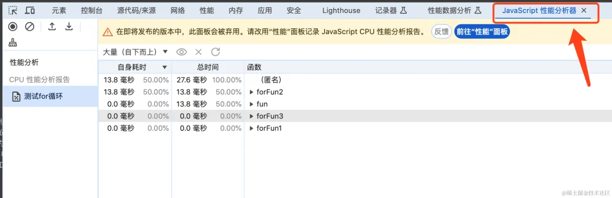

## 错误监控 sentry

sentry监控的原理：

1. window.onerror：
	1. 用于捕获传统的 JavaScript 错误，如 throw new Error('Something went wrong');。
2. window.addEventListener('unhandledrejection', ...)：
	1. 用于捕获未处理的 promise 拒绝。当 promise 被拒绝且没有相应的 .catch() 处理程序时，会触发此事件。
3. Source Maps(源码映射)：
	1. 由于生产环境中的代码通常是压缩和混淆的，Sentry 支持上传 source maps，以便在报告中显示原始、未压缩的代码行和文件名。
4. Breadcrumbs(面包屑导航)：
	1. 用于收集应用程序运行时的事件。这些事件可以包括用户交互、网络请求、导航中的路由跳转以及系统信息等。
	2. 支持多种类型，如default（默认）、http（将面包屑呈现为HTTP请求）和error（将面包屑渲染为硬错误）等。
5. 自动会话跟踪：
	1. 跟踪各种交互过程，例如点击事件，自定义事件，页面停留时间等。

### 创建项目并获取DSN码

1. 登录[sentry官网](https://sentry.io/welcome/)
2. 从左侧导航菜单中选择 Projects 以显示所有项目的列表
3. 单击 + Create Project 按钮
4. 根据您希望监控的代码为您的项目选择语言或框架在本例中为 JavaScript。
5. 给该项目一个 Name。
6. 在 Set your default alert settings 下，选择 i'll create my own alerts later。
7. 为该项目分配一个 Team。


8. 复制DSN key 并将其放在手边，因为我们会将密钥复制到源代码中。


> DSN（或数据源名称）告诉 SDK 将事件发送到何处，将它们与您刚刚创建的项目相关联。


9. 点击 `Got it!` 按钮以创建项目。

### 初始化sentry

配置后,sentry就会自动捕获错误

如果发生错误将具有以下信息：

1. 基本错误信息：
	1. 错误名称：通常与JavaScript中的错误类型相对应，如`TypeError、ReferenceError、SyntaxError`等。
	2. 错误消息：具体的错误描述，例如“Cannot read property 'length' of undefined”。
	3. 错误堆栈跟踪：显示错误发生时的函数调用堆栈，这有助于定位问题发生的具体位置。
2. Vue特定信息：
	1. 组件信息：如果错误发生在Vue组件中，可能会包含组件的名称、类型以及相关的渲染函数或生命周期钩子信息。
	2. 路由信息：如果配置了路由追踪（通过`Sentry.vueRouterInstrumentation(router)`），则可能包括发生错误时的路由路径和参数。
3. 其他信息,通过配置加的别的信息

#### vue2

```javascript
//npm install @sentry/vue @sentry/browser @sentry/tracing
//yarn add @sentry/vue @sentry/browser @sentry/tracing

import Vue from 'vue';  
import App from './App.vue';  
import * as Sentry from '@sentry/browser';  
import { Integrations } from '@sentry/tracing';  
import { Vue as VueIntegration } from '@sentry/vue'; // 引入Vue SDK  
import router from './router'; // 假设你的路由配置在router.js或router/index.js中

// 初始化Sentry  
Sentry.init({  
  dsn: 'YOUR_DSN', // 替换为你的DSN  
  integrations: [
    new VueIntegration({ Vue, attachProps: true }), // 使用Vue SDK
    new Integrations.BrowserTracing({  
      // 配置路由追踪  
      routingInstrumentation: Sentry.vueRouterInstrumentation(router), // 假设你已经导入了router  
      // ...其他BrowserTracing配置  
    }),  
    // ...其他integrations  
  ],  
  // 设置tracesSampleRate为1.0来捕获100%的交互用于性能监控  
  // 在生产环境中，建议调整这个值  
  tracesSampleRate: 1.0,  
  // ...其他Sentry配置  
});  
  
// 创建Vue实例并挂载  
new Vue({  
  router, // 假设你已经导入了router  
  render: h => h(App),  
}).$mount('#app');
```

#### vue3

```javascript
//npm install @sentry/vue @sentry/tracing
//yarn add @sentry/vue @sentry/tracing

import { createApp } from 'vue';  
import App from './App.vue';  
import { createRouter, createWebHistory } from 'vue-router';  
import * as Sentry from '@sentry/vue';  
import { Integrations } from '@sentry/tracing';  

const router = createRouter({  
  // ...你的路由配置  
});  

Sentry.init({  
  app: createApp(App), // Vue 3的app实例  
  dsn: 'YOUR_DSN', // 替换成你的DSN  
  integrations: [  
    new Integrations.BrowserTracing({  
      routingInstrumentation: Sentry.vueRouterInstrumentation(router), // 路由追踪集成  
      // ...其他BrowserTracing配置  
    }),  
    // ...其他集成  
  ],  
  // ...其他Sentry配置选项  
});  

// 创建并挂载Vue应用  
const app = createApp(App);  
app.use(router);  
app.mount('#app');
```

### 手动添加Breadcrumbs

```javascript
//可以在router.beforeEach等路由守卫中添加
Sentry.addBreadcrumb({
  category: 'user', // 用于标记事件的类别，如 'user', 'network', 'ui' 等  
  message: 'User logged in', // 描述事件的字符串  
  level: Sentry.Severity.Info, // 事件的级别，可以是 'fatal', 'error', 'warning', 'info', 'debug'  
  data: { userId: '123', email: 'user@example.com' } // 事件周围的元数据，可以是任何键值对  
});
```

### 配置sourcemap

```javascript
npm install --save-dev @sentry/webpack-plugin
yarn add @sentry/webpack-plugin --dev

const SentryWebpackPlugin = require('@sentry/webpack-plugin');
module.exports = {  
  // ... 其他webpack配置 ...  
  plugins: [  
    // ... 其他插件 ...  
    new SentryWebpackPlugin({  
      include: './path/to/sourcemaps',  // 指定sourcemap文件的路径,一般位于dist中js的目录下,指定js目录即可
      urlPrefix: '~/js',  // 如果你的js文件在构建后有一个特定的url前缀，可以在这里设置  
      release: 'my-project-release',  // 你的项目发布版本，用于在Sentry中区分不同的构建  
      // 其他配置选项...  
    }),  
  ],  
};
```

## 性能分析

性能优化主要分为两类：

1. 加载时优化
2. 运行时优化
通常来说，没有必要性能优化规则都用上，根据网站用户群体来做针对性的调整是最好的，节省精力，节省时间。

加载时优化, 通常是用性能指标分析加载性能, 分析首屏时间等, 进行针对优化
运行时优化, 则是通过性能分析工具, 分析长任务和内存泄漏等, 进行优化

在解决问题之前，得先找出问题，否则无从下手。所以在做性能优化之前，最好先调查一下网站的加载性能和运行性能。


**常用主要面板,和网络面板,也可以专门用内存模块分析内存泄漏**

**渲染和 JS 执行都在主线程，在一个 Event Loop 中，会相互阻塞，如果 JS 有长时间执行的 Task，就会阻塞渲染，导致页面卡顿。所以，性能分析主要的目的是找到 long task，之后消除它。**
### Performance工具

利用Chrome DevTools 的 Performance工具排查，使用性能分析模块

1. 启用JavaScript示例：开启之后，会将函数的调用栈显示出来
2. 屏幕截图：开启之后录制的过程中每一帧都会截图
3. 内存：开启之后会显示内存变化图
4. CPU：可以调节CPU的性能，一般用来模拟不好的设备
5. 网络：调节网络的速度
6. 硬件并发：设置CPU的核数，下图是谷歌官方文档的解释，是一个比较新的功能

#### 主面板分析大体耗时

主要面板会把你操作过程中的所有事情记录下来，并且用不同的颜色矩形绘制出来（也叫火焰图）。

- 灰色：task
- 橙色：浏览器内部的 JS
- 蓝色：html parse(html解析)
- 紫色：reflow、repaint(重绘重排)
- 绿色：渲染
- 其余：用户的js

1. 如果你一眼看过去发现没点绿，那说明这个性能是不行的。
2. 颜色越深，说明性能越差
3. 矩形的长度就表示耗时的长短
4. 浏览器会将耗时的长任务在矩形的右上角进行红色的标记
5. 从上到下是调用栈（但是这个是类似事件捕获），从外到里的
6. 点击某一个任务可以定位到对应的源码上，方便定位问题


#### 网络面板分析接口卡顿

网络面板可以帮助我们分析某一个操作发起了多少的网络请求，每一个请求的耗时

第一部分：表示的是等待时间

中间部分：表示的是发起请求的时间到接收到第一个 字节的时间

最后部分：表示的是解析请求内容的时间

知道了一个请求的各个阶段耗时之后，当遇到一个请求耗时很久的情况，就可以确定到底是后端的问题还是前端的问题

顺便一提：

使用网络面板来分析一个网络请求其实更好用，毕竟是专门干这个的

每一个阶段的耗时清清楚楚


#### devTool分析组件耗时

需要开启app.config.performance=true

下图可以看出来，VxeTable这个组件被标红了，并且显示了具体的时间，以及每个阶段的耗时，此处是update耗时。

PS：被标红说明是有性能问题，颜色越深性能问题越严重。


#### 内存面板分析内存泄漏


也可以打开内存选项，选择第二项，点开始，会产生一堆柱状图，灰色代表回收，蓝色代表还在使用，但是全局变量闭包什么的都在，不知道怎么排查


#### 高级插桩分析绘制时间

启用高级插装绘制：启用之后，当点击某一帧的时候，会显示出这个帧详细的图层出来，里面有很多详细的信息可以参考。


### 性能指标分析
#### [LCP](https://link.juejin.cn/?target=https%3A%2F%2Fweb.dev%2Flcp)(最大内容绘制）

Largest Contentful Paint，最大的内容（文字/图片）渲染的时间

计算方式是从网页开始渲染到渲染完成，每次渲染内容都对比下大小，如果是更大的内容，就更新下 LCP 的值：


```javascript
let LCP = 0
const performanceObserver = new PerformanceObserver((entryList, observer) => {
  const entries = entryList.getEntries()
  observer.disconnect()
  LCP = entries[entries.length - 1].startTime
})
performanceObserver.observe({ entryTypes: ['largest-contentful-paint'] })
```

#### [FID](https://link.juejin.cn/?target=https%3A%2F%2Fweb.dev%2Ffid)(首次输入延迟）
First Input Delay，用户第一次与网页交互（点击按钮、点击链接、输入文字等）到网页响应事件的时间。

记录在 FCP 和 TTI 之间用户首次与页面交互时响应的延迟。

```javascript
let FID = 0

const performanceObserver = new PerformanceObserver((entryList, observer) => {
  const entries = entryList.getEntries()
  observer.disconnect()

  FID = entries[0].processingStart - entries[0].startTime
})

performanceObserver.observe({ type: ['first-input'], buffered: true })
```

#### [CLS](https://link.juejin.cn/?target=https%3A%2F%2Fweb.dev%2Fcls)(累积布局偏移）
Cumulative Layout Shift，累计布局偏移，记录了页面上非预期的位移波动。计算方式为：位移影响的面积 * 位移距离（完整计算过程感兴趣可以看[官方文档](https://link.juejin.cn/?target=https%3A%2F%2Fweb.dev%2Fcls%2F%23%25E5%25B8%2583%25E5%25B1%2580%25E5%2581%258F%25E7%25A7%25BB%25E5%2588%2586%25E6%2595%25B0)）


举个例子，比如一个图片没加载完的时候是 50 * 50 的大小，但是加载完之后变为了 100 * 100，这就是布局的波动，会影响体验。

这时候 lighthouse 等工具给出的优化建议是给 img 设置固定的 width 和 height。

### console分析

#### 排查性能问题


嗯，打印了两句话，性能分析器开启和结束。这就完了？？

在哪儿查看性能分析结果呢？别急，继续往下看⬇️



在控制台可以找到这个 javaScript性能分析器，英文  javaScript Profiler, 如果你在自己浏览器找不到， 可能是你没有启动这个试验性功能。


#### 分析堆栈

在函数里调用console.trace();

1. 使用这个工具的时候，最好是使用浏览器的无痕模式打开，这样可以减少浏览器插件的干扰。
2. 这个工具只是一个性能指标监视器，不能帮你定位是哪一行代码有问题。
3. 如果某个操作，导致CPU总是被拉满，就可以排查一下是不是有大量数据在计算，消耗CPU。
4. 如果某个操作，导致页面白屏、卡顿等，就关注一下【样式重新计算次数/秒】 这个指标的变化。
5. 如果某个操作，导致页面奔溃，就关注一下【js堆大小】指标的变化，如果这个指标呈现一个上升的趋势，则说明是有严重的内存泄露问题。

```javascript
//例如以下 baz调用bar,bar调用foo,打印信息如下
    //foo@VM4470:2
    //bar@VM4470:6
    //baz@VM4470:10
    //（匿名）@VM4470:13

function foo() {  
  console.trace();  
}  
  
function bar() {  
  foo();  
}  
  
function baz() {  
  bar();  
}  
  
baz();
```
