# 注解

```java
-->函数注解,用于声明函数式接口,继承函数式接口的类可以使用labmbda表达式
@FunctionalInterface

-->检测此方法是否为重写方法
@Override

-->自定义注解
public @interface 注解名{
    String bookName();
}

-->注解的使用
@注解名(bookName = "金瓶梅")
public class BookShelf {
}
```

# 环境变量

环境变量相当于路径别名的集合

当我们想在任意路径下打开指定的文件,输入文件名时,window会先在当前目录下查找这个文件,找不到会找到环境变量Path中配置的路径 按照顺序依次去指定的路径中去查找这个文件

```java
//假设我们新建了一个系统变量A,路径为E:\javaYingYong\jdk
​
//环境变量引用系统变量
%A%/bin //E:\javaYingYong\jdk\bin
```

# cmd命令

| 命令    | 作用                  |
| ----- | ------------------- |
| 盘符名称: | 切换到指定的盘             |
| dir   | 查看当前路径下的内容          |
| cd 目录 | 进入指定目录              |
| cd .. | 返回上一级               |
| cd \  | 回到根目录,也就盘符目录        |
| cls   | 清屏                  |
| exit  | 退出终端                |
| 文件名   | 打开指定文件,例如qq.exe打开qq |


# IDEA快捷

```java
变量.fori //快速生成遍历语句
shift+ctrl+, //生成标准javabean,需要ptg插件
alt+insert //快速重写方法
psvm //快速生成 public static void main(String[] args)
要打印的信息.sout //快速生成System.out.println(要打印的信息)
ctrl+f12 //查看当前类中的方法/属性/内部类等 m是方法 f是属性 c是内部类
​
选中 然后 ctrl+b //跳转到具体实现
```

# 基础学习

项目->模块->包->类

## 异常

指的是程序在执行过程中，出现的非正常的情况，最终会导致JVM的非正常停止

异常的根类是

运行时异常：RuntimeException及其子类，编译阶段不会出现异常提醒。运行时出现的异常（如：数组索引越界异常）编译时异常：编译阶段就会出现异常提醒的。（如：日期解析异常)

```java
//可以自定义异常,运行异常继承RuntimeException,编译时异常继承Exception
//格式: class 自定义异常名 extends 要继承的异常{}
//ArrayIndexOutofBoundsException索引越界
//ArithmeticException 算术异常
//NullPointerException空指针异常
try{
    可能异常代码
}catch(异常类型 e){
    异常处理
    //e.printStackTrace() //打印所有错误信息
}finally{
    收尾代码,无论是否异常都会执行
}
```

## 基本数据类型

- float在储存大型浮点数组的时候可节省内存空间；

- 浮点数不能用来表示精确的值，如货币；

- 一般来说

**浮点数加F为float,不加为double**

double>float>long>int>short>byte

 

1. 整数类型：

- byte：8位，有符号，范围为-128到127。 

- short：16位，有符号，范围为-32768到32767。 三万二多

- int：32位，有符号，范围为-2147483648到2147483647。 21多亿

- long：64位，有符号，范围为-9223372036854775808到9223372036854775807。

2. 浮点数类型：

- float：32位，单精度，表示范围较大，但精度较低。

- double：64位，双精度，表示范围广且具有较高的精度。

3. 字符类型：

- char：16位，表示Unicode字符。

4. 布尔类型：

- boolean：表示真或假。

| 数据类型    | 默认值      | 取值范围             | 示例             | 对应包装对象        |
| ------- | -------- | ---------------- | -------------- | ------------- |
| boolean | false    |                  | boolean A=true | Boolean       |
| char    | '\u0000' | 单个字符或单个字符对应的编码   | char A='A'     | Character     |
|         |          |                  |                | 以下全是Number的子类 |
| byte    | 0        | -2^7 ~ 2^7-1     | byte A=1       | Byte          |
| short   | 0        | -2^15 ~ 2^15 - 1 | short A=1      | Short         |
| int     | 0        | -2^31 ~ 2^31 - 1 | int A=1        | Integer       |
| long    | 0L       | -2^63 ~  2^63 -1 | long A=1       | Long          |
| float   | 0.0f     | 单精度浮点型,32位       | float A=1.0F   | Float         |
| double  | 0.0d     | 双精度浮点型,64位       | double A=1.00  | Double        |


## 复杂数据类型

| 数据类型                   | 默认值  | 取值范围 | 示例           | 对应包装对象 |
| ---------------------- | ---- | ---- | ------------ | ------ |
| String (or any object) | null |      | String A="A" | 还不晓得   |
|                        |      |      |              |        |
|                        |      |      |              |        |


## 隐式转换

又称**自动类型提升**

1. 取值范围小的数据，和取值范围大的数据进行

**运算/赋值给它**，小的会先提升为大的之后，再进行运算/赋值

1. byte short char

 三种数据在运算的时候，都会提升为int，然后再进行运算

```java
init C;
type D, A=1, B=2;
C=A+B; //莫问题
D
```

## 强制转换

当一个取值范围小的赋值给取值范围大的,或者毫不相干的类型赋值过来,需要进行强制转换

格式:

```java
目标数据类型 变量名 = (目标数据类型) 被强转的数据;
```

## 逻辑运算符

| 符号     | 介绍  | 说明                       |
| ------ | --- | ------------------------ |
| ^      | 异或  | 相同为false,不同为true         |
| &&     | 短路且 | 当左侧为false,停止运算           |
| &      | 且   | 无论左侧是true/false,都会运算完    |
| "\|\|" | 短路或 | 当左侧为 true, 停止运算          |
| "\|"   | 或   | 或无论左侧是 true/false, 都会运算完 |
| !      | 非   | 取反                       |


## 包

包通常使用所在公司域名的倒置：com.atgvigv.XXX。

包本质上是文件夹,使用

- java.lang

-打包基础的类

- java.io

-包含输入输出功能的函数

### package

声明包

```java
//格式,多重包,也就是.分割的,会创建多个文件
package pkg1[．pkg2[．pkg3…]];
​
//例如,一个Something.java文件,内容如下:
package net.java.util;
public class Something{}
​
//它在包中的路径应该是:
net/java/util/Something.java
```

### import

import 用于引入类 或 包

```java
import com.runoob.mypackage.*; //引入包中的所有类
//这种写法又叫全类名/全限定名
import com.runoob.MyClass; //引入包中的指定类
```

1. 使用同一个包中的类时，不需要导包。

1. 使用ava.lang包中的类时，不需要导包。

1. 如果同时使用两个包中的同名类，需要用全类名。

1. 甚他情况都需要导包

## 方法

```java
//语法
    访问修饰符 非访问控制修饰符(可选) 返回类型(可选) 方法名(形参类型 形参名,...)
```

### 可变参数

```java
//允许定义同类型的剩余参数,与js一样,会变成一个数组
	访问修饰符 非访问控制修饰符(可选) 返回类型(可选) 方法名(形参类型... 形参名,...)
	public static void main(String... a){}

```

## 泛型

1. 用于统一数据类型。

2. 把类型确定从运行期间提前到了编译期间，避免了强制类型转换可能出现的异常。

3. 不能写基本数据类型,因为添加到集合中时,会被转成包装类

4. 指定泛型后,可以传该泛型指定泛型和其子类类型

5. 未指定时,默认是Object

6. java中支持?代表未知的泛型

```java
class 类名<泛型别名>{}
方法名<泛型别名>{}

//? extends E:表示可以传递E或者E所有的子类类型
//? super E:表示可以传递E或者E所有的父类类型
//F extends E:表示可以传递E或者E所有的子类类型
class 类名<? extends 泛型别名>{}
class 类名<泛型别名1 extends 泛型别名2>{}

```

## 源文件声明规则

- 一个源文件中

**只能有一个 public 类**,但可以有多个非 public 类

- 源文件的名称应该和 public 类的类名保持一致。例如：源文件中 public 类的类名是 Employee，那么源文件应该命名为Employee.java。

- 如果一个类定义在某个包中，那么 package 语句应该在源文件的首行。

- 如果源文件包含 import 语句，那么应该放在 package 语句和类定义之间。如果没有 package 语句，那么 import 语句应该在源文件中最前面。

## 内存

jdk8以前,方法区和堆是连在一起的

从8开始,将方法区移除改为独立的元空间

1. 栈

2. 堆

3. 方法区,存储可运行的class文件

4. 本地方法栈,JVM操作系统功能时使用,与我们无关

5. 寄存器,CPU使用,与我们无关

## 数组

数组的长度是固定的,一旦创建完毕就不能变化了

定义格式如下,使用下标取值

java中用{}代表数组,对应js的 `[]`

```java
//简化格式
数据类型[] 数组名 = { 元素1，元素2，元素3… };  //简化只有这一种写法
数据类型[] 数组名 = { {元素1，..},元素2，元素3… }; //多维数组写法
数据类型[] 数组名 = new 数据类型[数组的长度] //动态初始化,定义指定长度的数组,值是各类型的默认值

//完整格式
数据类型[]  数组名 = new 数据类型[] { 元素1，元素2，元素3… };
数据类型 数组名[] = new 数据类型[] { 元素1，元素2，元素3… };


//例子
int[] a= { 11，22，33 };
int[] a= new int[]{ 11，22，33 };

```

## 接口

更像中文说的插件,用于定义几个类公共的部分,是对类行为的抽象

**由于抽象方法没有方法体,如果新增了抽象方法,没人实现具体方法会报错,**

特点:

1. 成员变量

- 只能是常量,默认用public修饰,常见写法public static final 类型 变量名

2. 成员方法

- 只能是抽象方法,默认用public修饰,如果是抽象方法,还会默认abstract

- JDK8新增default方法和static方法

- JDK9新增私有方法,用于抽离默认方法和静态方法中公共的部分

### 接口的多继承

```java
public interface 接口名 extends 要继承的接口1 , 要继承的接口2{}
```

### 普通接口

最常见的接口形式，包含一组抽象方法和常量

```java
interface 接口名{
	void abstract Method()
	公共部分
}
class A implements 接口名{
	欸嘿,我会接口里的东西了
}

```

### 函数式接口

一种特殊的接口，只包含一个抽象方法。可以使用注解 

```java
@FunctionalInterface
interface MyFunctionalInterface {
    void myMethod();
}

```

### 单方法接口

仅包含一个抽象方法,和多个 

```java
interface MyInterface {
    void myMethod();
    default void printMessage() {
        System.out.println("Calculating...");
    }
}
```

### 标记性接口

若一个接口没有定义任何方法,表示这个接口是标记性接口,用于传达一些关于类能力或属性的信息,例如

```java
interface Serializable {}
```

## 成员变量和方法的编译与运行

```java
//调用成员变量：编译看左边，运行也看左边
//编译看左边：jvac编译代码的时候，会看左边的父类中有没有这个变量，如果有，编译成功，如果没有编译失败。
//运行也看左边：jva运行代码的时候，实际获取的就是左边父类中成员变量的值


/1调用成员方法：编译看左边，运行看右边
//编译看左边：javac编译代码的时候，会看左边的父类中有没有这个方法，如果有，编译成功，如果没有编译失败。
//运行看右边：java运行代码的时候，实际上运行的是子类中的方法。
a.show();///Dog--show方法
//理解：
//Animal a = new Dog(); //Dog是Animal的子类
//现在用a去调用变量和方法,而a是Animal类型的，所以默认都会从Animal这个类中去找
//成员变量：在子类的对象中，会把父类的成员变量也继承下的。父：name子：name
/成员方法：如果子类对方法进行了重写，那么在虚方法表中是会把父类的方法进行覆盖的。

```

# 增强for与lambda表达式

lambda表达式:

根据“可推导就是可省略”的原则

1. 省略函数式接口实例化和方法名,根据参数类型调用接口中对应的方法

2. 可省略形参类型,仅留参数与函数体

3. 参数只有一个时,可以省略括号

```java
//增强for,跟for of功能一致,遍历每个元素
for (元素类型 元素变量 : 数组或集合) {
    // 循环体
}

//forEach的lambda表达式,跟for of功能一致
ts.forEach(i->System.out.println(i));
//等于
ts.forEach(new Consumer<Integer>(){
    @Override
    public void accept(Integerinteger){
    	System.out.println(i);
    }
}
           
//Comarator接口的lambda表达式
TreeSet<string>ts = new Treeset<>((o1,o2)->{
    //按照长度排的
    int i =o1.length()-o2.length();
    //如果一样长则按照首字母排的
    i =i ==0?o1.compareTo(o2):i;
    return i;
})
//等于
TreeSet<string>ts = new Treeset<>(new Comparator<String>(){
    @Override
    public int compare(String o1,String o2){
        //按照长度排的
        int i =o1.length()-o2.length();
        //如果一·样长则按照首字母排的
        i = i==0?o1.compareTo(o2):i;
        return i;
    })
}

```

# 方法引用

方法引用的出现原因

在使用Lambda表达式的时候，我们实际上传递进去的代码就是一种解决方案：拿参数做操作

如果我们在Lambda中所指定的操作方案，已经有地方存在相同方案，没有必要再写重复逻辑，重用这个方法的过程就叫方法引用，我们是通过方法引用来使用已经存在的方案

**有以下必要条件**

1. 使用方法引用处,**必须是函数式接口**

2. 被引用方法必须存在,可以是java内置的

3. 被引用方法,**形参和返回值需要跟接口方法的形参和返回值一致**

```java
// ::是方法引用符
//引用类的静态方法
类名::静态方法名

//引用类的实例方法
类名::成员方法

//引用类的构造器方法,会调用形参和返回值满足条件的那个构造函数
类名::new
//引用数组的构造方法,仅适用于接受长度,返回指定长度数组的函数接口
数据类型[]::new
//eg
new ArrayList().stream().toArray(Integer[]::new)

//引用对象的实例方法
//其他类
其他类实例对象::成员方法名
//当前类
this::成员方法名
//父类
super::成员方法名

//引用数组构造方法,仅适用于接受长度,返回指定长度数组的函数接口
new ArrayList().stream().toArray(Integer[]::new)
//等于
Integer[]arr new ArrayList().stream().toArray(new IntFunction<Integer[]>(){
    @Override
    public Integer[] apply(int value){
    	return new Integer[value]
    }
}

```

# 类与对象

类用于描述对象的行为和状态,对象是类的一个实例

行为->成员方法

状态/属性->成员变量

一个类只能有一个主方法,可以有多个构造方法,

主方法在类被加载时就执行,构造方法在new时执行

## 命名规范

1. 如果使用了设计模式,建议使用类名+设计模式命名,例如LoginProxy

2. 接口类不要加修饰符

## Service/DAO层命名规范

Service层主要负责业务逻辑的处理

DAO层负责数据的访问和存储

1. get 用于获取单个对象

2. list 用于获取多个对象

3. count 用于获取统计值

4. save（推荐）或insert 用于插入

5. remove（推荐）或delete 用于删除

6. update 用于修改

## 工具类

用于做一些操作的工具人,简化其他类的操作

- 提供通用的、可重用的功能，如数学运算、日期处理、字符串操作等。

- 包含静态方法，不需要实例化对象即可调用。

- 通常构造方法私有化,因为它不需要创建对象

- 通常不包含状态（成员变量），方法的参数和返回值足以完成任务。

## 测试类

检查其他类是否书写正确,需要带main方法,是程序的入口

## javaBean类

javabean类简单来说就是创建对象用的类,用于描述 一类事物(对象)

写main方法的叫测试类,不写的叫javabean类

标准如下:

1. 不写main方法

2. 一个无参的构造函数

3. 一个接收所有参数的构造函数

4. 为类的每个成员变量提供getXxx/setXxx方法

5. 如果对象存在其他行为,也需要写上

```java
public class A{
	private String name;
	 // 无参构造方法
    public Person() {
    }
    // 带参构造方法
    public Person(String name) {
        this.name = name;
    }
    // Getter 和 Setter 方法
    public String getName() {
        return name;
    }
    public void setName(String name) {
        this.name = name;
    }
}

```

## 构造函数

类的构造函数有以下几个特点：

1. this指向实例,通过this访问成员

2. 构造函数的**名称必须与类名相同**

3. 构造函数默认返回当前实例,它无需也不能指定返回类型

4. 构造函数**可以有一个或多个参数，用于初始化对象的属性**

5. 如果**没有显式地定义构造函数，则Java会提供一个无参的默认构造函数，这个函数不执行除super外的任何操作**

6. 如果**定义了一个或多个构造函数，则Java不会提供默认构造函数。此时需要无参的构造函数，需要显式地定义它**

7. 提供多个构造函数时,称为构造方法重载,java根据new 类时传参不同调用不同的构造方法

构造函数的主要作用是创建对象并初始化其属性。当创建一个类的新对象时，Java会自动调用该类的构造函数来初始化对象。

作用: **确保对象在创建时具有正确的状态和属性值**

```java
//new构造函数的格式: 构造函数名 实例名 = new 构造函数名(参数)
public class Employee {
    String name="A";
    //定义一个字符串类型的构造方法
    public Employee(String name) {
        System.out.println(this.name) //A
        System.out.println(name) //你好
    }
    //类的主方法
    public static void main(String[] args){ //String[] args等同于String args[]
		Employee name = new Employee("你好"); 
	}
}

```

## 内部类

在类中定义的类,可以访问类中的成员

用于单独存在没有意义,仅当前类需要使用

JDK16之前内部类不能定义静态变量，JDK16开始才行

分为:

成员内部类:
可以用修饰符修饰,写在成员位置,就是类的最前面静态内部类:使用static修饰的内部类,不依赖于外部类的实例，可以直接通过外部类名访问，而无需创建外部类的实例。局部内部类:定义在方法内或者局部块内的类,使用完就销毁匿名内部类(有用):通过将类的代码块传递给接口,实现无名字的内部类

```java
// 定义一个简单的接口
interface MyInterface {
    void myMethod();
}
public class A{
	public class B{} //成员内部类
	static class C{} //静态内部类
	public static void main(){
		public class D{} //局部内部类
		D d=new D();//局部内部类实例化
		//匿名内部类
		MyInterface myInterface = new MyInterface() { //匿名内部类实例化
            @Override
            public void myMethod() {}
        };
        B b= new A().new B(); //成员内部类实例化
		C c=new A.C() //静态内部类实例化
        myInterface.myMethod();
	}
}

```

匿名内部类

```java
// 定义一个简单的接口
interface MyInterface {
    void myMethod();
}
//正常类是这样使用接口的
class B implements MyInterface{
	public void myMethod() {}
}
//当我们去掉类的名字,类便只剩下代码块
{
	public void myMethod() {}
}
//我们将这个代码块传递给接口于是就使用并重写了接口的抽象方法
new MyInterface(){
	public void myMethod() {}
}

```

## 枚举类

采用enum关键字定义

```java
enum 枚举类类名{
	//这种写法等同于public static final 枚举类类名 枚举实例1=new 枚举类类名();
	枚举实例1 , ...
	//这种写法等同于public static final 枚举类类名 枚举实例1=new 枚举类类名(参数1,...);
	枚举实例1(参数1,..) , ...
}

```

## 修饰符

用于修饰类、接口、变量、方法

**访问修饰符可与非访问修饰符同用**

### 语法

```java
函数 语法: 
	访问修饰符 非访问控制修饰符(可选) 返回类型(可选) 方法名(形参类型 形参名,...)
	
类 语法:
	访问修饰符 class 类名
	
变量 语法:
	访问修饰符 变量名

运行方式:
	javac 文件名
    	or javac -encoding 编码方式(例如UTF-8) 文件名
	java 方法名

```

### 访问控制/权限修饰符

 用于保护对类、变量、对象、方法和构造方法的访问

- default (默认，什么也不写) 同一包内可见

- public (公共的) 所有类可见,

- protected (受保护的) 同一包内的类和所有子类可见

- private (私有的)  同一类内可见

**用public定义的类,名称要与文件名保持一致**

**以下仅写了Y的,代表可以通过new,也可以通过继承**

开发中一般只用private和public,公共方法和成员变量一般私有

| 修饰符       | 当前类 | 同一包内的其他类和子孙类 | 不同包子孙类            | 不同包的无关类     |
| --------- | --- | ------------ | ----------------- | ----------- |
| private   | Y   |              |                   |             |
| default   | Y   | Y            |                   |             |
| protected | Y   | Y            | Y/N(不能通过new的实例访问) |             |
| public    | Y   | Y            | Y                 | Y/N(不能通过继承) |


### 非访问控制修饰符

- static (静态):仅能访问静态成员,在类加载时调用

- final (常量/最终类/最终方法):不可变,修饰类时,类不可继承

- abstract (抽象):强制方法重写

- synchronized(同步): **同一时间只能被一个线程访问**

### 静态和非静态的区别

- 静态方法属于类,非静态方法属于实例

- 静态方法只能访问静态方法/属性,非静态方法可以访问所有方法/属性

- 静态方法没有this,非静态方法具有this

- 静态属性/方法在类加载中创建,存在堆内存的静态区中(JDK7以前和非静态变量一块在方法区里),非静态方法在实例化时创建

### 静态代码块

java中除了js那种普通代码块外,还能通过修饰符修饰代码块

静态代码块用于进行复杂的初始化工作

```java
//只会指向一次
static {
  ...初始化工作
}
//随着载体执行而执行,比如写在类中,每次实例化都会执行,写在方法中,每次方法调用都会执行
{
  ...一些操作
}

```

## 抽象类

抽象类指不能实例化的类

抽象方法只能在抽象类中,用于强制方法重写,不提供方法的具体实现

由于抽象方法没有方法体,如果新增了抽象方法,没人实现具体方法会报错

```java
// 抽象类
abstract class AbstractClass {
    // 抽象方法
    abstract void abstractMethod();

    // 非抽象方法
    void concreteMethod() {
        System.out.println("Concrete method in abstract class");
    }
}

```

# 面向对象

面向 : 拿/找

对象 : 干活的东西

面向对象编程 : 找到并拿东西做对应的事情

## 封装

封装对象的实现细节(状态,与状态处理),仅对外提供接口(状态对应的行为)

## 继承

final修饰类时,类不可继承

1. java中所有的类都直接或间接继承于Object类

2. 子类只能访问父类的非私有成员

3. 子类继承父类所有非私有和私有的成员,但是私有的不能访问,可以通过特权方法访问私有变量

4. 子类不继承父类的构造函数,子类构造函数通过super(参数)调用父类的构造函数,如果

**没写会默认添加个无参的super(),写了则不添加**

```java
public class Student extends Person{}
Student称为子类（派生类），Person称为父类（基类或超类）

```

## 方法重载

在同一个类中，定义多个方法,它们使用同一方法名,具有不同参数,称为方法重载

## 方法重写与多态

方法重写指子类继承父类方法后,重新定义个与父类方法同名同参数的方法覆盖继承的方法

多态指同类型的对象,具有不同的表现(功能)

多态实现方法:

1. 继承 + 有父类引用指向子类实例(父类 作为子类的类型) + 方法重写

2. 接口 + implements实现

```java
//继承实现
class Animal {
    void makeSound() {
        System.out.println("Some sound");
    }
}

class Dog extends Animal {
    @Override
    void makeSound() {
        System.out.println("Bark");
    }
}

class Cat extends Animal {
    @Override
    void makeSound() {
        System.out.println("Meow");
    }
}
// 父类引用指向子类实例
Animal dog = new Dog();

```

```java
//接口实现
interface SoundMaker {
    void makeSound();
}

class Dog implements SoundMaker {
    @Override
    public void makeSound() {
        System.out.println("Bark");
    }
}

class Cat implements SoundMaker {
    @Override
    public void makeSound() {
        System.out.println("Meow");
    }
}

```

## instanceof与多态的优缺点

instanceof用于判断左边的变量是否是右边的实例

```java
dog instanceof Dog

```

多态的优点

1. 动态绑定,运行时才确定实例的实际类型

多态的弊端

1. 当使用继承实现多态时,不能调用子类的特有功能(子类中定义的,父类没有)

```java
//因为动态绑定的特点,编译时无法确定a的类型是Dog,而父类中又没有niHao方法,会报错
class Parent{}
class Children extends Parent{
	void niHao(){
        System.out.println("我是z类");
    }
}
Parent children=new Children("你好");
children.Nihao();

```

# 数组操作相关

## Arrays

操作数组的工具类。

| 方法                                            | 说明                        | 使用(int[] numbers = {1, 2, 3, 4, 5}) |
| --------------------------------------------- | ------------------------- | ----------------------------------- |
| public static String toString(数组)             | 把数组拼接成一个字符串               | Arrays.toString(numbers)            |
| public static int binarySearch(数组，查找的元素)      | 二分查找法查找元素                 | Arrays.binarySearch(numbers, 6)     |
| public static int copyOf(原数组，新数组长度)           | 拷贝数组                      | Arrays.copyOf(numbers, 3)           |
| public static int切copyOfRanger(原数组，起始索引，结束索引) | 拷贝数组（指定范围）                | Arrays.copyOfRange(numbers, 1, 4)   |
| public static void fill(数组，元素)                | 填充数组                      | Arrays.fill(numbers, 'A')           |
| public static void sort(数组)                   | 按照升序进行数组排序                | Arrays.sort(numbers)                |
| public static void sort(数组，排序规则)              | 根据指定规则的返回值排序,负放前面,0或正数放后面 | Arrays.sort((p,c)=>{return p-c})    |


二分查找法的前提：

1. 数组中的元素必须是有序，数组中的元素必须是升序的

2. 如果要查找的元素是存在的，那么返国的是真实的索引

3. 如果要查找的元素是不存在的，返回的是 负插入点减1( -插入点 - 1)

	- 插入点是指,这个查找的元素如果插入到数组中,应该在哪个索引位置,插入点就是几
	
	- 例如数组{1,2,3} 则Arrays.binarySearch(arr,4)得到的是插入点3,再取反-1,是-4

sort示例

```java
//负数：表示当前要插入的元素是小的，放在前面
//正数：表示当前要插入的元素是大的，放在后面
//0：表示当前要插入的元素跟现在的元素比是一样的也会放在后面
Arrays.sort(arr,(p,c)=>{return p-c})

//等于
Arrays.sort(arr,new Comparator<Integer>(){
	@Override
	public int compare(Integer p,Integer c){
		return p-c
	}
}

```

# 字符操作相关

## String常用方法

| 方法                                                     | 说明                    | 使用                                         |
| ------------------------------------------------------ | --------------------- | ------------------------------------------ |
| public void String()                                   | 创建空字符串                | new String()                               |
| public String(String original)                         | 根据指定字符串创建字符串          | new String("aaa")                          |
| public String(char[] chs)                              | 根据字符数组拼接为字符串          | new String(new char[]{'A','B'})            |
| public String(byte[] bts)                              | 根据编码将字节翻译成字符再拼接为字符串   | String str = new String(new byte[]{98,99}) |
| public boolean equals/equalsIgnoreCase(String 要比较的字符串) | 比较内容/忽略大小写比较          | str1.equals("张")                           |
| public boolean start/endWith(String 要比较的字符串)           | 是否以某字符串开头/结尾          | str1.startWith("张")                        |
| public char[]  toCharArray()                           | 将字符串转换为字符数组           | "st".toCharArray()-->["s","t"]             |
| public char chatAt(int index)                          | 根据索引找字符               | str.charAt(1)                              |
| public int length()                                    | 返回字符串的长度              | str.length()                               |
| public String substring(int beginIndex)                | 截取到末尾                 | str.substring(999)                         |
| public String substring(int beginIndex, int endIndex)  | 根据开始和结束索引做截取, 包含头不包含尾 | str.substring(7, 12)                       |
| public String replace(旧值,新值)                           | 将指定字符替换另外一个字符         | str.replace("Java", "World")               |
| public String[] split(String regex)                    | 以指定字符切割为字符数组          | "A,B".split(",")-->["A","B"]               |
| public byte[]                                          | 将指定字符转成字节数组           | str.getBytes()                             |


```java
//String
public class test {
    public static void main(String[] args) {
    	String A="A"; //字面量创建
        String A=new String(); //创建空字符串
        String A=new String("aaa") //创建自定义字符
        //通过数组创建字符串,可以是字符数组,也可以是字节数组,字节数组会将字节按编码转成字符
        String A=new String(new char[]{'A','B'}); //"AB"
        String A=new String(new byte[]{98,99}); //"cd"
    }
}

```

### String的内存

```java
//String在java中是复杂数据类型
//字面量创建的String,会被保存在串池中
StringTable(串池) : 存储直接赋值的字符串,字符串赋值时会去串池中找是否存在这个字符串,存在则直接使用引用,没有就会创建这个字符存在串池中再使用引用,jdk7以前在方法区,7开始挪到了堆内存中
//new String的内存分配
每次new都会在堆中开辟新空间,无法复用

```

## StringBuilder常用方法

高效的拼接和反转字符

一种可变字符序列,是字符串的缓冲区, 我们可以将其理解为是一种容器

| 方法                                 | 说明                                       | 使用                                         |
| ---------------------------------- | ---------------------------------------- | ------------------------------------------ |
| public StringBuilder()             | 创建一个空的字符串缓冲区(容器)                         | new StringBuilder()                        |
| public StringBuilder(String str)   | 创建一个字符串缓冲区, 并初始化好指定的参数内容                 | StringBuilder sb = new StringBuilder("AA") |
| public StringBuilder append (任意类型) | 添加数据，并返回对象本身                             | sb.append(1)                               |
| public StringBuilder reverse()     | 反转容器中的内容                                 | sb.reverse()                               |
| public int  length()               | 返回长度 ( 字符出现的个数)                          | sb.length()                                |
| public String toString()           | 通过toString()就可以实现把StringBuilder转换为String | sb.toString()                              |
| public int  capacity()             | 返回当前容量                                   | sb.capacity()                              |


### 内存分析

1. 普通的字符串拼接,会在编译阶段直接拼接,会复用串池的字符串

2. 使用变量的字符串拼接,会调用StringBuilder,产生sb对象,最后toString再new一个String对象出来

3. 使用StringBuilder直接拼接,由于只会调用一次StringBuilder和它的toString方法,减少了多余的String对象和sb对象

4. StringBuilder默认只有16字节数容量,当存储超过16字节时,会开辟新的空间,新空间是原来的两倍+2,如果扩容后还不够,就会按存储的实际字节数扩容,最后将之前的内容拷贝过来并将新添加的内容存起来

```java
String s1="a";
String s2=s1+"b";
String s3=s2+"c";
String s4="abc";
String s5="a"+"b"+"c";
s3==s4 //false; 使用了变量,代码执行时进行拼接,产生的abc存在堆中
s4==s5 //true; 因为没有使用变量,编译时会直接拼接,会复用串池的字符串abc
    
//String s2=s1+"b"等同于
new StringBuilder().append(s1).append("b").tostring(); //new一个String对象
//String s3=s2+"c"等同于
new StringBuilder().append(s2).append("c").tostring(); //new一个String对象

//内存分析
JDK8以前,String内部通过new StringBuilder连接字符,
字面量创建的String会被分配到串池中,
StringBuilder的toString方法会new String返回新的String对象

因此,以上代码实际上创建了两个String对象存在堆内存中,创建了3个字面量String存在串池中

```

## StringJoiner常用方法

高效的拼接字符,JDK8出现的一个可变的操作字符串的容器

可以理解为对象版js的join

| 构造方法                                | 说明                                      | 使用                                            |
| ----------------------------------- | --------------------------------------- | --------------------------------------------- |
| public StringJoiner(间隔符号)           | 创建一个StringJoiner对象，指定拼接时的间隔符号           | new StringJoiner(",")                         |
| public StringJoiner(间隔符号，开始符号，结束符号) | 创建一个StringJoiner对象，指定拼接时的间隔符号、开始符号、结束符号 | StringJoiner sj=new StringJoiner(",","[","]") |
| public StringJoiner add(添加的内容)      | 添加数据,并返回对象本身                            | sj.add("A")                                   |
| public int  length()                | 返回长度 ( 字符出现的个数)                         | sj.length()                                   |
| public String toString()            | 返回开始符号+add内容被分割符号连接+结束符号拼成的字符串          | sj.toString()                                 |


StringJoiner内存分析

还没有嘞,先不卷辣

# 数字运算相关

## Math常用方法

数字运算的方法

| 方法                                           | 说明                    | 使用                |
| -------------------------------------------- | --------------------- | ----------------- |
| public static int abs(int a)                 | 返回参数的绝对值              | Math.abs(-2)      |
| public static double ceil(double a)          | 返回大于或等于参数的最小整数        | Math.ceil(23.45)  |
| public static double floor(double a)         | 返回小于或等于参数的最大整数        | Math.floor(23.45) |
| public static int round(float a)             | 按照四舍五入返回最接近参数的int类型的值 | Math.round(23.45) |
| public static int max(int a,int b)           | 获取两个int值中的较大值         | Math.max(12, 45)  |
| public static int min(int a,int b)           | 获取两个int值中的较小值         | Math.min(12 , 34) |
| public static double pow (double a,double b) | 计算a的b次幂的值             | Math.pow(2,3)     |
| public static double random()                | 返回一个[0.0,1.0)的随机值     | Math.random()     |


# 系统操作相关

## System常用方法

系统操作的一些常用的方法

| 方法                                                                                                  | 说明                                | 使用                                                |
| --------------------------------------------------------------------------------------------------- | --------------------------------- | ------------------------------------------------- |
| public static void exit(int status)                                                                 | 终止当前正在运行的Java虚拟机，0表示正常退出，非零表示异常退出 | System.exit(0)                                    |
| public static native void arraycopy(Object src,  int  srcPos, Object dest, int destPos, int length) | 将数组的指定个数元素复制到目标数组                 | System.arraycopy(srcArray , 0 , desArray , 1 , 3) |


1. 如果目标数组从destPos开始不够装下拷贝个数的元素,会报错

1. arraycopy允许将 子类类型的值 赋值给 父类类型的目标数组,但最好不要这么做,类型会很混乱

```java
// 定义源数组
int[] srcArray = {23 , 45 , 67 , 89 , 14 , 56 } ;
// 定义目标数组
int[] desArray = new int[10] ;

// 进行数组元素的copy: 把srcArray数组中从0索引开始的3个元素，从desArray数组中的1索引开始复制过去
System.arraycopy(srcArray , 0 , desArray , 1 , 3);

//此时desArray长这样 {0, 23, 45, 67, 0, 0, 0, 0, 0, 0}

```

## Runtime常用方法

Java中运行时对象，可以获取到程序运行时涉及到的一些信息

| 方法                                  | 说明                       | 使用                                |
| ----------------------------------- | ------------------------ | --------------------------------- |
| public static Runtime getRuntime()  | 当前系统的运行环境对象              | Runtime rt = Runtime.getRuntime() |
| public void exit(int status)        | 停止虚拟机                    | rt.exit()                         |
| public int availableProcessors()    | 获得CPU的线程数                | rt.availableProcessors()          |
| public long maxMemory()             | JVM能从系统中获取总内存大小（单位byte）  | rt.maxMemory()                    |
| public long totalMemory()           | JVM已经从系统中获取总内存大小（单位byte） | rt.totalMemory()                  |
| public long freeMemory()            | JVM剩余内存大小（单位byte）        | rt.freeMemory()                   |
| public Process exec(String command) | 运行cmd命令                  | rt.exec("shutdown -s -t 3600")    |


```java
一些cmd命令
//shutdown 参数 :关机
//加上参数才能执行
//-s :默认在1分钟之后关机
//-s -t 指定时间 : 指定关机时间
//-a :取消关机操作
//-r: 关机并重启

```

# 对象相关

## Object常被重写方法

是所有类的超类,所有类都直接或间接的继承Object

也就是说,该类的所有方法,其他类都继承了

**以下三个方法都能使用alt+insert快捷重写,但是clone需要被拷贝的对象所对应的类实现Cloneable接口**

**clone默认是浅克隆**

| 方法(全没用,都要重写)                      | 说明                     | 使用            |
| --------------------------------- | ---------------------- | ------------- |
| public String toString()          | 返回该对象的字符串表示形式(可认为是地址值) | s1.toString() |
| public boolean equals(Object obj) | 比较两个对象地址值是否相等,返回布尔值    | s1.equals(s2) |
| protected Object clone()          | 对象克隆                   | s1.clone()    |


```java
public class Parent implements Cloneable{
	@Override
    protected Object clone() throws CloneNotSupportedException {
        return super.clone();
    }
}

```

## 深拷贝的不同

js深拷贝复杂数据类型都会创建新对象

java中深拷贝,遇到String对象,不会创建新对象,会复用串池中的字符串

## Objects常用方法

| 方法                                               | 说明                 | 使用                    |
| ------------------------------------------------ | ------------------ | --------------------- |
| public static String toString(Object o)          | 获取对象的字符串表现形式       | Objects.toString(s1)  |
| public static boolean equals(Object a, Object b) | 先做非空判断,再比较两个对象是否相等 | Objects.equals(s1,s2) |
| public static boolean isNull(Object obj)         | 判断对象是否为null        | Objects.isNull(s1)    |
| public static boolean nonNull(Object obj)        | 判断对象是否不为null       | Objects.nonNull(s1)   |


### Objects.equals原理

```java
//Objects.equals(s1,s2)
//原理 return (a =b)(a !null && a.equals(b));
1.方法的底层先判断s1是否等于s2,相等返回true,如果不等,
2.如果s1不为nu11,那么就s1.equals(s2)
3.如果s1没有重写equals，则调用Object的equals比较地址值，如果重写了，就比较属性值。

//Objects.isNull(s1)

```

# 长整型BigInteger

用于Long都装不下的时候的超大整型,理论上最大到42亿的21亿次方,基本上在内存撑爆之前，都无法达到这个上限

- 如果BigInteger表示的数字没有超出long的范围，可以用静态方法valueOf获取。

- 如果BigInteger表示的超出long的范围,或不清楚，可以用构造方法获取。

- 对象一旦创建，BigInteger内部记录的值不能发生改变。

- 只要进行计算都会产生一个新的BigInteger对象。

| 方法                                                     | 说明                      | 使用                                                |
| ------------------------------------------------------ | ----------------------- | ------------------------------------------------- |
| public BigInteger(int num, Random rnd)                 | 获取随机大整数，范围：0 ~ 2^num-1  | BigInteger bd = new BigInteger(123, new Random()) |
| (最常用)public BigInteger(String val)                     | 获取指定                    | BigInteger bd = new BigInteger("123")             |
| public BigInteger(String val, int radix)               | 获取                      | BigInteger bd = new BigInteger("10", 2)           |
| public static BigInteger valueOf(long val)             | 获取long范围内的bg对象          | BigInteger.valueOf(bd)                            |
| public BigInteger add(BigInteger val)                  | 加法                      | bd.add(bd1)                                       |
| public BigInteger subtract(BigInteger val)             | 减法                      | bd.subtract(bd1)                                  |
| public BigInteger multiply(BigInteger val)             | 乘法                      | bd.multiply(bd1)                                  |
| public BigInteger divide(BigInteger val)               | 除法                      | bd.divide(bd1)                                    |
| public BigInteger[] divideAndRemainder(BigInteger val) | 除法，获取商和余数               | bd.divideAndRemainder(bd1)                        |
| public  boolean equals(Object x)                       | 比较是否相同                  | bd.equals(bd1)                                    |
| public  BigInteger pow(int exponent)                   | 次幂、次方                   | bd.pow(2)                                         |
| public  BigInteger max/min(BigInteger val)             | 二者比较取最大/小               | bd.max/min(bd1)                                   |
| public  int int/longValue(BigInteger val)              | 转为int/long类型整数，超出范围数据有误 | intValue.add(bd1)                                 |


### BigInteger的valueOf原理

```java
BigInteger内部存储了0对应的bg实例,和存储[1~16]与[-1~16]对应的bg实例
valueOf时,如果为-16~16,则直接返回存储的对应实例,否则才会new新的BigInteger

```

### BigInteger存储原理

数组的最大长度是int的长度,是21亿多

bg存的数字会以被分割为多个32位一组的二进制数字,再转成十进制存在一个数组中,以一个属性代表正负,格式这样 [1,32位一组的数字,0],

再将这个数组存在mag数组里面

由于正负范围加一块达到42亿多,int长度又有21亿多,因此范围为42亿多的21亿多次方

# 解决浮点型精度丢失BigDecimal

解决浮点型精度丢失问题

| 方法                                                                        | 说明                | 使用                                       |
| ------------------------------------------------------------------------- | ----------------- | ---------------------------------------- |
| public BigDecimal(int/long/String val)                                    | 将xx类型转成BigDecimal | BigDecimal bd = new BigDecimal("0.3")    |
| public BigDecimal add(BigDecimal value)                                   | 加法运算              | bd.add(b2)                               |
| public BigDecimal subtract(BigDecimal value)                              | 减法运算              | bd.subtract(b2)                          |
| public BigDecimal multiply(BigDecimal value)                              | 乘法运算              | bd.multiply(b2)                          |
| public BigDecimal divide(BigDecimal value)                                | 除法运算,结果为无限循环小数会报错 | bd.divide(b2)                            |
| public BigDecimal divide(BigDecimal divisor, int scale, int roundingMode) |                   | bd.divide(b2 , 2 , RoundingMode.HALF_UP) |


### divide演示

```java
divisor:			除数对应的BigDecimal对象
scale:				保留几位小数
roundingMode:		取舍模式
取舍模式被封装到了RoundingMode这个枚举类中（关于枚举我们后期再做重点讲解），在这个枚举类中定义了很多种取舍方式。最常见的取舍方式有如下几个：
UP(直接进1) ， FLOOR(直接删除) ， HALF_UP(4舍五入),我们可以通过如下格式直接访问这些取舍模式：枚举类名.变量名

//demo
// 创建两个BigDecimal对象
BigDecimal b1 = new BigDecimal("1") ;
BigDecimal b2 = new BigDecimal("3") ;

// 调用方法进行b1和b2的除法运算，并且将计算结果在控制台进行输出
System.out.println(b1.divide(b2 , 2 , RoundingMode.UP)); //0.34
System.out.println(b1.divide(b2 , 2 , RoundingMode.FLOOR)); //0.33
System.out.println(b1.divide(b2 , 2 , RoundingMode.HALF_UP)); //0.33

```

### BigDecimal存储原理

将传入的值转成字符串,然后将字符串的每个字符转成ASCII码存在数组中

# 时间相关

## 时区ZoneId

```java
//创建Java中支持的所有时区组成的set集合
static Set<string> getAvailableZoneIds()
//创建系统默认时区的Zoneld对象
static ZoneId systemDefault()
//创建指定时区的Zoneld对象
static Zoneld of(string zoneld)


//demo
//创建Java中支持的所有时区组成的set集合
Set<String> zoneIds = ZoneId.getAvailableZoneIds();
System.out.println(zoneIds); // [Asia/ShangHai,...]

//获取所有时区的总个数
System.out.println(zoneIds.size());// 600

//创建系统默认时区的Zoneld对象
System.out.println(zoneIds.systemDefault());

```

## 时间戳Instant

```java
Xxxx范围:EpochMilli 毫秒 Nano 纳秒 EpochSecond秒
//创建当前时间的Instant对象(标准时间)
static Instant now()
//根据 (秒/毫秒/纳秒) 创建/增加/减少时间并返回Instant对象
Instant of/plus/minusXxx(long millisToSubtract)
//判断另一个Instant对象的时间在之前或之后
boolean isAfter/Before(Instant otherInstant)
//获取Instant对象对应的(秒/毫秒/纳秒)数
long getXxxx()
//以指定时区转换为ZonedDateTime对象
ZonedDateTime atZone(ZoneId)


//demo
// 获取当前时间戳
Instant currentInstant = Instant.now();

// 通过秒数 创建 Instant
Instant customInstant = Instant.ofEpochSecond(1L);
// 通过(秒数,纳秒数)创建 Instant
Instant customInstant = Instant.ofEpochSecond(1L, 1000L);

// 获取秒数和纳秒数
long seconds = customInstant.getEpochSecond();
int epochMilli = customInstant.getEpochMilli();
int nano = customInstant.getNano();

// 操作 Instant
Instant laterInstant = currentInstant.plusSeconds(10); // 当前时间戳之后的 10 秒
Instant laterInstant = currentInstant.minusSeconds(10); // 当前时间戳之前的 10 秒

//比较 Instant
boolean isAfter = currentInstant.isAfter(laterInstant);
boolean isBefore = currentInstant.isBefore(laterInstant);

// 转换为 ZonedDateTime
ZoneId zoneId = ZoneId.of("America/New_York");
ZonedDateTime zonedDateTime = currentInstant.atZone(zoneId);

```

## 带时区的时间ZoneDateTime

```java
Xxxx范围:Days Hours
//创建当前时间的ZonedDateTime对象
static ZonedDateTime now()
//创建指定时间的ZonedDateTime对象
static ZonedDateTime ofXxxx(...)
//修改/增加/减少时间的方法
ZonedDateTime with/plus/minusXxx(时间)
//转换为Instant类型,还可以转很多类型
Instant toInstant()

```

## 时间格式化DateTimeFormatter

```java
//按照格式字符串格式化时间返回DateTimeFormatter对象
static DateTimeFormatter ofPattern(格式)
//按照指定时区格式化
String format(ZonedDateTime 时间对象)

//创建时间对象
ZonedDateTime time = Instant.now().atZone(ZoneId.of("Asia/Shanghai"));

// 解析/格式化器
DateTimeFormatter dtf1=DateTimeFormatter.ofPattern("yyyy-MM-dd HH:mm;ss EE a");
// 格式化
System.out.println(dtf1.format(time));

```

## LocalDateTime  年、月、日、时、分、秒

```java
// 当前时间的的日历对象(包含年月日时分秒)
LocalDateTime nowDateTime = LocalDateTime.now();

System.out.println("今天是:" + nowDateTime);//当前时间的的日历对象(包含年月日时分秒)
System.out.println(nowDateTime.getYear());//年
System.out.println(nowDateTime.getMonthValue());//月
System.out.println(nowDateTime.getDayOfMonth());//日
System.out.println(nowDateTime.getHour());//时
System.out.println(nowDateTime.getMinute());//分
System.out.println(nowDateTime.getSecond());//秒
System.out.println(nowDateTime.getNano());//纳秒
// 日:当年的第几天
System.out.println("dayofYear:" + nowDateTime.getDayOfYear());
//星期
System.out.println(nowDateTime.getDayOfWeek());
System.out.println(nowDateTime.getDayOfWeek().getValue());
//月份
System.out.println(nowDateTime.getMonth());
System.out.println(nowDateTime.getMonth().getValue());

LocalDate ld = nowDateTime.toLocalDate();
System.out.println(ld);

LocalTime lt = nowDateTime.toLocalTime();
System.out.println(lt.getHour());
System.out.println(lt.getMinute());
System.out.println(lt.getSecond());

```

## ChronoUnit  时间间隔（所有单位）

```java
// 当前时间
LocalDateTime today = LocalDateTime.now();
System.out.println(today);
// 生日时间
LocalDateTime birthDate = LocalDateTime.of(2000, 1, 1,0, 0, 0);
System.out.println(birthDate);

System.out.println("相差的年数:" + ChronoUnit.YEARS.between(birthDate, today));
System.out.println("相差的月数:" + ChronoUnit.MONTHS.between(birthDate, today));
System.out.println("相差的周数:" + ChronoUnit.WEEKS.between(birthDate, today));
System.out.println("相差的天数:" + ChronoUnit.DAYS.between(birthDate, today));
System.out.println("相差的时数:" + ChronoUnit.HOURS.between(birthDate, today));
System.out.println("相差的分数:" + ChronoUnit.MINUTES.between(birthDate, today));
System.out.println("相差的秒数:" + ChronoUnit.SECONDS.between(birthDate, today));
System.out.println("相差的毫秒数:" + ChronoUnit.MILLIS.between(birthDate, today));
System.out.println("相差的微秒数:" + ChronoUnit.MICROS.between(birthDate, today));
System.out.println("相差的纳秒数:" + ChronoUnit.NANOS.between(birthDate, today));
System.out.println("相差的半天数:" + ChronoUnit.HALF_DAYS.between(birthDate, today));
System.out.println("相差的十年数:" + ChronoUnit.DECADES.between(birthDate, today));
System.out.println("相差的世纪(百年)数:" + ChronoUnit.CENTURIES.between(birthDate, today));
System.out.println("相差的千年数:" + ChronoUnit.MILLENNIA.between(birthDate, today));
System.out.println("相差的纪元数:" + ChronoUnit.ERAS.between(birthDate, today));

```

## System获取当前时间

| 方法                                     | 说明                           | 使用                         |
| -------------------------------------- | ---------------------------- | -------------------------- |
| public static long currentTimeMillis() | 获取从1970年1月1日 00:00:00到现在的毫秒值 | System.currentTimeMillis() |


## JDK8以前的垃圾

### 获取设置Date

| 方法                             | 说明                           | 使用                                       |
| ------------------------------ | ---------------------------- | ---------------------------------------- |
| public Date()                  | 创建时间对象                       | Date date=new Date()                     |
| public long getTime()          | 获取从1970年1月1日 00:00:00到现在的毫秒值 | date.getTime()                           |
| public void setTime(long time) | 接收毫秒值,设置时间                   | date.setTime(System.currentTimeMillis()) |


### 格式化SimpleDateFormat

| 方法                                      | 说明                         | 使用                                                               |
| --------------------------------------- | -------------------------- | ---------------------------------------------------------------- |
| public SimpleDateFormat(String pattern) | 格式化日期                      | SimpleDateFormat sdf=new SimpleDateFormat("yyyy-MM-dd HH:mm:ss") |
| public String format(Date date)         | 将Date对象按sdf的格式转换为字符串       | sdf.format(new Date(0L))                                         |
| public Date parse(String source)        | 将符合sdf格式的字符串解析为Date对象,否则报错 | sdf.parse("2023-11-11 11:11:11")                                 |


```java
//1.利用带参构造创建simpleDateFormat对象，指定格式
String str = "2023-11-11 11:11:11";
SimpleDateFormat sdf1 = new SimpleDateFormat("yyyy年MM月dd日HH:mm:ss");
//str的格式要跟sdf1的格式完全一致
Date date = sdf.parse(str);

//1.利用空参构造创建simpleDateFormat对象，默认格式
SimpleDateFormat sdf2 = new SimpleDateFormat();
String str2 = sdf2.format(date);
System.out.println(str2);//1970/1/1 上午8:00

```

## 计算Calendar

用于日期计算

| 方法名                                   | 说明                           | 写法                                         |
| ------------------------------------- | ---------------------------- | ------------------------------------------ |
| public static Calendar getInstance()  | 获取一个它的子类GregorianCalendar对象。 | Calendar instance = Calendar.getInstance() |
| public int get(int field)             | 获取某个字段的值。field参数表示获取哪个字段的值，  | instance.get(Calendar.YEAR)                |
| public void set(int field,int value)  | 设置某个字段的值                     | instance.set(Calendar.YEAR, 1998);         |
| public void add(int field,int amount) | 为某个字段增加/减少指定的值               | instance.add(Calendar.DAY_OF_MONTH, 200);  |


# 包装类

共有Byte  Short  **Integer** Long Float Double **Character** Boolean

## Integer类

| 方法名                                     | 说明                      | 使用                          |
| --------------------------------------- | ----------------------- | --------------------------- |
| public static Integer valueOf(int i)    | 返回指定的 int 值的 Integer 实例 | Integer.valueOf(100)        |
| public static Integer valueOf(String s) | 返回指定String值的 Integer 实例 | Integer.valueOf("100")      |
| static string toBinarystring(int i)     | 把整数换成二进制的字符串            | Integer.toBinarystring(100) |
| static string toOctalstring(int i)      | 把整数换成八进制的字符串            | Integer.toOctalString(100)  |
| static string toHexstring(int i)        | 把整数换成十六进制的字符串           | Integer.toHexString(100)    |
| static int parseInt(string s)           | 将字符串类型的整数转成int类型的整数     | Integer.parseInt("123")     |


## 装箱与拆箱

基本类型与对应的包装类对象之间，来回转换的过程称为”装箱“与”拆箱“：

- 装箱

：从基本类型转换为对应的包装类对象。

- 拆箱

：从包装类对象转换为对应的基本类型。

用Integer与 int为例：（看懂代码即可）

基本数值---->包装对象

```java
Integer i = new Integer(4);//使用构造函数函数
Integer iii = Integer.valueOf(4);//使用包装类中的valueOf方法

```

包装对象---->基本数值

```java
int num = i.intValue();

```

## 自动装箱与自动拆箱

由于我们经常要做基本类型与包装类之间的转换，从Java 5（JDK 1.5）开始，基本类型与包装类的装箱、拆箱动作可以自动完成。例如：

```java
Integer i = 4;//自动装箱。相当于Integer i = Integer.valueOf(4);
i = i + 5;//等号右边：将i对象转成基本数值(自动拆箱) i.intValue() + 5;
//加法运算完成后，再次装箱，把基本数值转成对象。

```

## 基本类型与字符串之间的转换

### 基本类型转换为String

- 转换方式

- 方式一：直接在数字后加一个空字符串

- 方式二：通过String类静态方法valueOf()

- 示例代码

```java
public class IntegerDemo {
    public static void main(String[] args) {
        //int --- String
        int number = 100;
        //方式1
        String s1 = number + "";
        System.out.println(s1);
        //方式2
        //public static String valueOf(int i)
        String s2 = String.valueOf(number);
        System.out.println(s2);
        System.out.println("--------");
    }
}

```

### String转换成基本类型 

除了Character类之外，其他所有包装类都具有parseXxx静态方法可以将字符串参数转换为对应的基本类型：

- public static byte parseByte(String s)

：将字符串参数转换为对应的byte基本类型。

- public static short parseShort(String s)

：将字符串参数转换为对应的short基本类型。

- public static int parseInt(String s)

**：将字符串参数转换为对应的int基本类型。**

- public static long parseLong(String s)

**：将字符串参数转换为对应的long基本类型。**

- public static float parseFloat(String s)

：将字符串参数转换为对应的float基本类型。

- public static double parseDouble(String s)

：将字符串参数转换为对应的double基本类型。

- public static boolean parseBoolean(String s)

：将字符串参数转换为对应的boolean基本类型。

代码使用（仅以Integer类的静态方法parseXxx为例）如：

- 转换方式

- 方式一：先将字符串数字转成Integer，再调用valueOf()方法

- 方式二：通过Integer静态方法parseInt()进行转换

- 示例代码

```java
public class IntegerDemo {
    public static void main(String[] args) {
        //String --- int
        String s = "100";
        //方式1：String --- Integer --- int
        Integer i = Integer.valueOf(s);
        //public int intValue()
        int x = i.intValue();
        System.out.println(x);
        //方式2
        //public static int parseInt(String s)
        int y = Integer.parseInt(s);
        System.out.println(y);
    }
}

```

> 注意:如果字符串参数的内容无法正确转换为对应的基本类型，则会抛出java.lang.NumberFormatException异常。


## Integer底层原理

建议：获取Integer对象的时候不要自己new，而是采取直接赋值或者静态方法valueOf的方式

因为在实际开发中，-128~127之间的数据，用的比较多。如果每次使用都是new对象，那么太浪费内存了。

所以，提前把这个范围之内的每一个数据都创建好对象，如果要用到了不会创建新的，而是返回已经创建好的对象。

```java
//底层原理：
//因为在实际开发中，-128~127之间的数据，用的比较多。
//如果每次使用都是new对象，那么太浪费内存了
//所以，提前把这个范围之内的每一个数据都创建好对象
//如果要用到了不会创建新的，而是返回已经创建好的对象。
Integer i6 = Integer.valueOf(127);
Integer i7 = Integer.valueOf(127);
System.out.println(i6 == i7);//true

//超出-128~127,new新的对象
Integer i8 = Integer.valueOf(128);
Integer i9 = Integer.valueOf(128);
System.out.println(i8 == i9);//false

//因为看到了new关键字，在Java中，每一次new都是创建了一个新的对象,所以下面的两个对象都是new出来，地址值不一样。
Integer i10 = new Integer(127);
Integer i11 = new Integer(127);
System.out.println(i10 == i11); //false

```

# 数据结构

是计算机存储、组织数据的方式,

是为了更方便的使用和管理数据

1. 栈: 先进后出,单向单口,如杯子

2. 队列: 先进先出,单向双口,如管道

3. 数组: 连续的空间,便于查找元素,但删除新增缓慢,因为要移动其它元素保证连续性,例如往中间插入一个元素,后面的元素全部要后移

4. 单向链表:每个元素都是独立的对象，在内存中是不连续的，每个元素包含存储的数据和下一个元素的地址。

- 查询慢，无论查询哪个数据都要从头开始找。

- 相比数据增删快，只需要改一下地址值，例如新增一个元素,将前一个元素的地址值指向这个新元素，新元素地址值指向下一个就行

- `首`操作极快

5. 双向链表:与双向链表类似,但是每个元素存储的是 `[上一个元素的地址,数据,下一个元素的地址]`

- `首尾`操作极快

- 相比数据增删快

- 相比单向链表查询快，因为结构的不同,可以双端查找

6. 二叉树:每个节点最多有两个子节点,没有特点存储顺序

7. 二叉查找树:比根节点小存左边,大存右边

8. 平衡二叉树:通过旋转保证树的平衡,任意节点左右子树高度不超过1,也就是左右子节点存满才能存下一层,不能有一层以上的单节点(即父节点下的单个子节点连单个孙节点)

9. 红黑树:又称平衡二叉B树

## 红黑树规则

1. 节点只能是黑色或者红色

2. 根节点必须是黑色

3. 叶节点是黑色的，如果一个节点没有子节点或者父节点，则该节点相应的指针属性值为Nil,这些Nil视为叶节点，每个叶节点是黑色的

4. 两个红色节点不能相连，如果某一个节点是红色，那么它的子节点必须是黑色

5. 任意节点到其所有后代叶节点的简单路径上，黑色节点数量相同，简单路径指单向路径，即左左左，右右右之类，不能是左左右

**旋转时,丢掉叶子节点,旋转完毕后再添加**

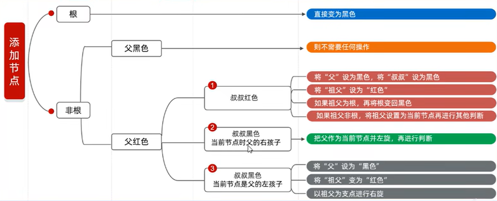

## 平衡二叉树旋转

### 确定支点

从添加的节点开始,不断的向父节点查找,直到某个父节点左右子节点不满足平衡规则(不超过1),例如下图添加12,从10开始左边是0,右边是2,超过1,10就是支点

### 支点仅单侧子节点

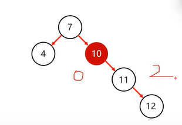

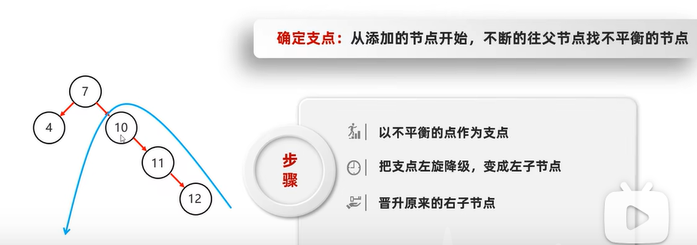

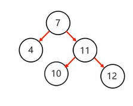

### 支点有两侧子节点

#### 添加同侧节点

即左子节点添加左子节点

或右子节点添加右子节点,例如下图右子节点11添加右子节点12

右子节点添加右子节点,需左旋,将

左子节点添加左子节点,需右旋,将

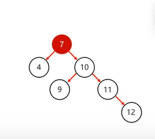

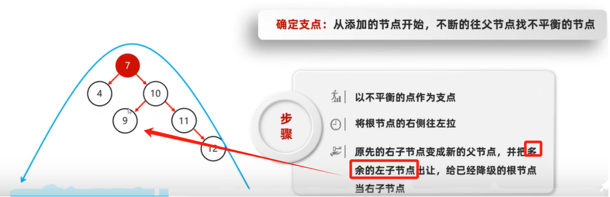

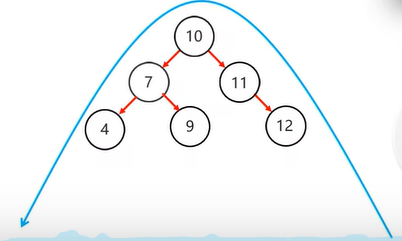

#### 添加不同侧节点

不同侧节点一次旋转无法完成,如下图,需要先回旋,再进行旋转

1. 左子节点添加右子节点,需先局部左旋,再右旋

- 局部左旋:将

- 右旋:将

1. 右子节点添加左子节点,需先局部右旋,再左旋

- 局部右旋

:将

- 左旋

:将

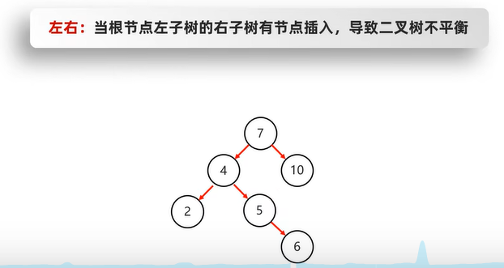

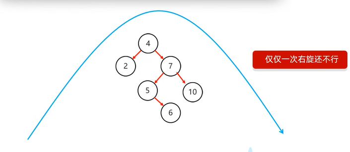

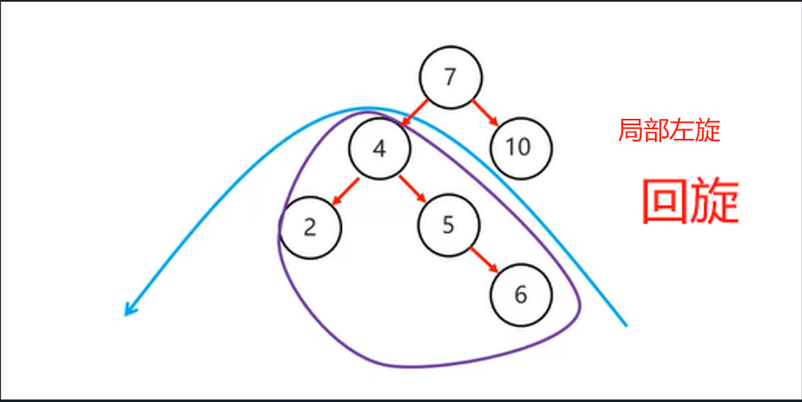

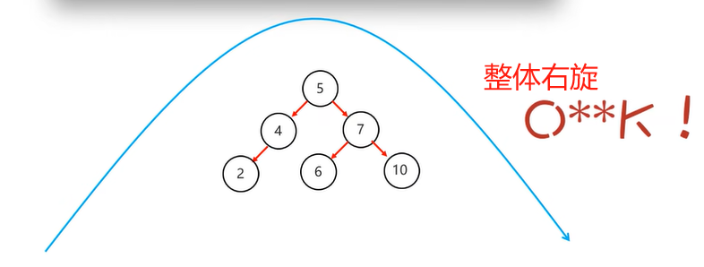

## 链表结构

单向链表:[数据,地址值]->[数据,地址值]->[数据,空指针]

双向链表:[空指针,数据,地址值]->[上一个元素的地址值,数据,下一个元素的地址值]->[数据,空指针]

## 二叉树不同遍历

前序遍历(

中序遍历(左

后序遍历(左右

层序遍历(从左到右,从上到下一层层遍历):20 18 23 16 19 22 24

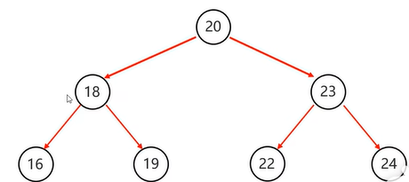

# 集合

集合相当于长度会随存储内容长度自动变化的数组

相当于js的数组

集合

单列集合一次添加一个

双列集合一次添加一对(键值对)


## 不可变集合

当一个集合其中的长度与所有元素不想被修改时,需要转为不可变集合

不可变集合不能添加,删除,修改,仅能查询

| 方法 | 说明 | 示例 | 
| -- | -- | -- |
| static  | 创建一个指定元素的不可变List/Set集合 | List | 
| static <K,V>Map<K,V>of(E...elements) | 创建一个键值对对象组成的不可变Map集合 | Map<String,String>list=Map.of(键1，值1,键2,值2,...) | 


## toArray

用于将集合转换为数组

| 方法 | 说明 | 示例 | 
| -- | -- | -- |
| toArray() | 返回一个包含集合所有元素的数组 | list.toArray() | 
| toArray(T[] a) | 返回一个与指定数组类型相同的数组,包含集合的所有元素,如果指定数组的大小足够容纳集合中的元素，则将元素存储在指定数组中，否则，将创建一个新的数组并将元素存储在其中。 | list.toArray(new String[0]) | 


# 单列集合

1. 如果想要集合中的元素可重复

- 用ArrayList集合，基于数组的。（

**用的最多**

1. 如果想要集合中的元素可重复，而且当前的增删操作明显多于查询

- 用LinkedList集合，基于链表的。

1. 如果想对集合中的元素去重

- 用HashSet集合，基于哈希表+单链表/红黑树。（

**用的最多**

1. 如果想对集合中的元素去重，而且保证存取顺序

- 用LinkedHashSet集合，基于哈希表+双链表，效率低于HashSet。

1. 如果想对集合中的元素进行排序

- 用TreeSet:集合，基于红黑树。后续也可以用List集合实现排序。

## Collection接口常用方法

是单列集合的顶层

| 方法名 | 说明 | 使用(set是实例) | 
| -- | -- | -- |
| boolean add(E e) | 在集合末尾添加元素,返回是否成功 | set.add("你好") | 
| boolean remove(Object o) | 从集合中移除指定的元素 | set.remove("你好") | 
| boolean contains(Object o) | 判断集合中是否存在指定的元素, | set.contains("你好") | 
| boolean isEmpty() | 判断集合是否为空 | set.isEmpty() | 
| void clear() | 清空集合中的元素 | set.clear() | 
| int size() | 返回集合的长度(元素的个数) | set.size() | 


## List接口常用方法

添加的元素是有序、有索引、可重复

| 方法名(标红的是方法重写) | 说明 | 使用(set是实例) | 
| -- | -- | -- |
| boolean add(int index,E e) | 添加元素,返回是否成功 | set.add(1,"你好") | 
| E remove(int index) | 删除指定索引的元素,返回删除的元素 | set.remove(1) | 
| E get(int index) | 获取指定索引的元素 | set.get(1) | 
| E set(int index,E e) | 修改指定索引的元素,返回被修改的元素 | set.set(1,"你好") | 


### Arraylist常用方法

```
ArrayList list= new ArrayList() //不做类型限制的
//JDK7
ArrayList<E> 变量名= new ArrayList<E>()
//7以后
ArrayList<E> 变量名= new ArrayList<>()

```

| 方法名 | 说明 | 使用 | 
| -- | -- | -- |
| public ArrayList(Object e) | 创建空列表 | ArrayList list= new ArrayList() | 
| public ArrayList(Object e) | 当不指定泛型时,不做类型限制 | ArrayList list= new ArrayList(List.of("张三丰","张无忌")) | 
| public ArrayList(E e) | E接收包装对象,代表类型 | ArrayList | 


#### iterator

```
ArrayList<String> list = new ArrayList();
//普通迭代器,ArrayList内部实现了一个内部类用于迭代,list.iterator()实际上是实例化这个类
Iterator iter=list.iterator()
//迭代器有两个常用方法
iter.next() //返回下一个元素,并将指针后移
iter.hasNext() //是否还有下一个元素

while(iter.hasNext()){
	String str=iter.next()
}

//列表迭代器,额外添加了一个方法：在遍历的过程中，可以添加元素
ListIterator<String> it = list.listIterator();
while(it.hasNext()){
    String str = it.next();
    if("bbb".equals(str)){it.add("qqq")}
}

```

#### ArrayList扩容原理

利用空参构造创建的集合，即什么元素都没有时，底层会创建一个空数组，

添加元素时，底层会调用grow进行扩容，

底层会将 添加元素的个数 与 数组之前长度的一半 进行对比，取大值作为默认扩容容量，

创建新数组,将之前的元素拷贝到新数组,并将新增的存到新数组中

#### 小demo

```
//1.创建集合并添加元素
List<Integer>list new ArrayList<>();
list.add(1);
list.add(2);
list.add(3);
/在调用方法的时候，如果方法出现了重载现象,优先调用，实参跟形参类型一致的那个方法
//1ist.remove(1); //调用List的remove,删除第一个
//手动装箱，手动把基本数据类型的1，变成Integer类型
Integer i Integer.valueof(1);
list.remove(i); //调用connection的remove,删除对应元素

```

### LinkedList常用方法

| 方法名 | 说明 | 
| -- | -- |
| public void addFirst/Last(E e) | 在该列开头/末尾插入指定元素 | 
| public E getFirst/Last() | 返回集合中的第一个/最后一个元素 | 
| public E removeFirst/Last() | 移除集合的第一个/最后一个元素,并返回移除的元素 | 


#### linkedList添加元素原理

采用Node类创建每一个元素,node实例有三个属性prev,item,next,分别对应上一个元素的地址,新增的元素,下一个元素的地址,

linkedList会将头节点和尾节点用first和last存起来,并在每次添加元素时,更新first和last

## Set接口(无常用方法)

添加的元素是无序、无索引、不重复

linkedHashSet有序

TreeSet可排序

### HashSet

无序、无索引、不重复,采用哈希表存储数据

#### 哈希表组成

JDK8之前：数组+链表JDK8开始：数组+链表/红黑树

#### 哈希值

- 根据hashCode方法算出来的int类型的整数

- 该方法定义在Objecta类中，所有对象都可以调用，默认使用地址值进行计算

- 一般情况下，会重写hashCode方法，利用对象内部的属性值计算哈希值

#### 对象的哈希值特点

- 如果没有重写hashCode方法，不同对象计算出的哈希值是不同的

- 如果已经重写hashcode方法，不同的对象只要属性值相同，计算出的哈希值就是一样的

- 在小部分情况下，不同的属性值或者不同的地址值计算出米的哈希值也有可能一样（哈希碰撞)

```
//哈希碰撞
System.out.println("abe".hashCode())://96354
System.out.println("acD".hashCode());//96354

```

#### HashSet原理

HashSet

**HashSet无索引**

**HashSet不重复**

**注意,比较时如果是链表或者是红黑树,会全部比较直到有相同或者比较完毕**

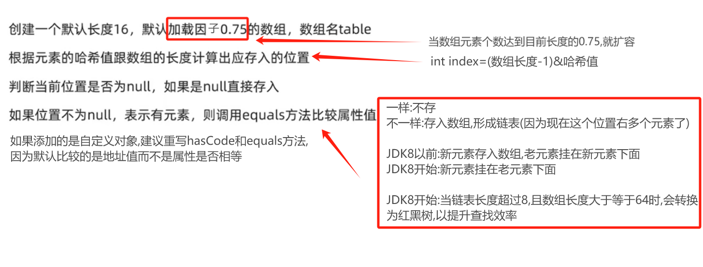

### LinkedHashSet原理

有序、无索引、不重复,与HashSet实现方式几乎相同

采用双向链表,与上一个添加的元素间互相存储地址,实现双向链表,以此实现有序性

结构: [null,当前元素的值,下一个存储元素的地址]->[上一个存储元素的地址,当前元素的值,null]

### TreeSet原理

底层采用红黑树

对于数值类型：Integer,Double,默认按值从小到大的顺序进行排序对于字符、字符串类型：默认从左到右按字符的ASCII值比较每个字符,发现不相等时,中断比较,小的去左边,大的去右边,例如"aac"默认是比"ab"小的,会挂在"ab"的左节点

方式一：Javabean类实现Comparable接口，指定比较规则方式二：创建集合时，自定义Comparator比较器对象，指定比较规则

```
//方式一:Javabean类实现Comparable接口，指定比较规则
//重写Comparable接口的compareTo方法覆盖默认比较
//此处泛型用于指定compareTo方法的形参类型
public class Student implements Comparable<Student>{
    private String name;
    private int age;
    public Student(String name,int age){
		this.name=name;
		this.age=age;
    }
    int getAge(){
		return this.age;
    }
	@Override
	public int compareTo(Student o){
		//指定排序的规则,正大存右负小存左0舍弃
		//只看年龄，我想要按照年龄的升序进行排列
		return this.getAge()-o.getAge();
    }
}

```

```
//方式二：创建集合时，自定义Comparator比较器对象，指定比较规则
//指定排序的规则,正大存右负小存左0舍弃
TreeSet<string>ts = new Treeset<>((o1,o2)->{
    //按照长度排的
    int i =o1.length()-o2.length();
    //如果一样长则按照首字母排的
    i = i==0?o1.compareTo(o2):i;
    return i;
})

```

# 双列集合

## Map接口常用方法

是双列集合的顶层

Map.Entry

| 方法名 | 说明 | 使用(map是实例) | 
| -- | -- | -- |
| V put(K key,V value) | 添加元素 | map.put("张无忌", "赵敏") | 
| V remove(Object key) | 根据键删除键值对元素 | map.remove("张无忌") | 
| void clear() | 移除所有的键值对元素 | map.clear() | 
| boolean containsKey/Value(Object key/value) | 判断集合是否包含指定的键/值 | map.containsKey("张无忌") | 
| boolean isEmpty() | 判断集合是否为空 | map.isEmpty() | 
| int size() | 集合的长度，也就是集合中键值对的个数 | map.size() | 
| Set key/value/entrySet() | 获取键/值/键值对对象组成的单列集合,键值对对象身上有getKey/Value方法获取键/值 | map.entrySet() | 
| get(Object key) | 分解键获取对应的值 | map.get("张无忌") | 


三种遍历方式

```
//创建集合对象
Map<String, String> map = new HashMap<String, String>();

//添加元素
map.put("张无忌", "赵敏");
map.put("郭靖", "黄蓉");
map.put("杨过", "小龙女");

//通过键遍历
//获取所有键的集合。用keySet()方法实现
Set<String> keySet = map.keySet();

//遍历键的集合，获取到每一个键。用增强for实现
for (String key : keySet) {
    //根据键去找值。用get(Object key)方法实现
    String value = map.get(key);
}

//通过键值对遍历
Set<Map.Entry<String, String>> entrySet = map.entrySet();
//遍历键值对对象的集合，得到每一个键值对对象
for (Map.Entry<String, String> me : entrySet) {
    //根据键值对对象获取键和值
    String key = me.getKey();
    String value = me.getValue();
}

//通过lambda表达式遍历,本质上是获取键值对,再分别将键值传入accept函数
map.forEach((key,value)->{})

```

## HashMap与LinkedHashMap与TreeMap

HashMap与HashSet几乎一样,但是存的是键值对,通过equals比较时默认比较的是键

LinkedHashMap和TreeMap也是一样的道理

# 集合工具类Connections

```
public static <T>void sort(List<T>list)
排序
public static <T>void sort(List<T>list,Comparator<T>c)
根据指定的规则进行排序
public static <T>int binarySearch (List<T>list,T key)
以二分查找法查找元素
public static <T>void copy(List<T>dest,List<T>src)
拷贝集合中的元素
public static <T>int fill (List<T>list,T obj)
使用指定的元素填充集合
public static <T>void max/min(Collection<T>coll)
根据默认的自然排序获取最大/小值
public static <T>void swap(List<?>list,int i,int j)
交换集合中指定位置的元素

```

| 方法(标红比较常用) | 说明 | 使用 | 
| -- | -- | -- |
| public static  | 批量添加元素 | Collections.addAll(集合, "Yellow", "Orange") | 
| public static void shuffle(List<?>list) | 打乱List集合元素的顺序 | Collections.shuffle(集合) | 
| public static  | 升序排序 | Collections.sort(集合) | 
| public static  | 根据Comparator指定的规则排序 | Collections.sort(集合,(p,c)->{}) | 
| public static  | 以二分查找法查找元素 | Collections.binarySearch(集合, 3) | 
| public static  | 拷贝List1中的元素到List2 | Collections.copy(集合1, 集合2); | 
| public static  | 使用指定的元素填充集合 | Collections.fill(集合, "New Value") | 
| public static  | 根据默认的自然排序获取最大/小值 | Collections.max(集合) | 
| public static  | 交换集合中指定位置的元素 | Collections.swap(集合, 0, 2) | 


# Stream流

**Stream流的三类方法**

1. 获取Stream流

- 创建一条流水线,并把数据放到流水线上准备进行操作

1. 中间方法

- 流水线上的操作

- 一次操作完毕之后,还可以继续进行其他操作

1. 终结方法

- 一个Stream流只能有一个终结方法

- 是流水线上的最后一个操作,操作完毕就不能再操作了

**生成Stream流的方式**

1. Collection体系集合

- 使用默认方法stream()生成流， default Stream

<E>

1. Map体系集合

- 把Map转成Set集合，再利用Collection体系生成stream流

1. 数组

- 通过Arrays中的静态方法stream生成流

1. 同种数据类型的多个数据

- 通过Stream接口的静态方法of(T... values)生成流,Stream.of("hello", "world", "java")

**代码演示**

```
public class StreamDemo {
    public static void main(String[] args) {
        //Collection体系的集合可以使用默认方法stream()生成流
        List<String> list = new ArrayList<String>();
        Stream<String> listStream = list.stream();

        Set<String> set = new HashSet<String>();
        Stream<String> setStream = set.stream();

        //Map体系的集合间接的生成流
        Map<String,Integer> map = new HashMap<String, Integer>();
        Stream<String> keyStream = map.keySet().stream();
        Stream<Integer> valueStream = map.values().stream();
        Stream<Map.Entry<String, Integer>> entryStream = map.entrySet().stream();

        //数组可以通过Arrays中的静态方法stream生成流
        String[] strArray = {"hello","world","java"};
        Stream<String> strArrayStream = Arrays.stream(strArray);
      
      	//同种数据类型的多个数据可以通过Stream接口的静态方法of(T... values)生成流
        Stream<String> strArrayStream2 = Stream.of("hello", "world", "java");
        Stream<Integer> intStream = Stream.of(10, 20, 30);
    }
}

```

## Stream流中间操作方法

中间操作的意思是,执行完此方法之后,Stream流依然可以继续执行其他操作

也就是流水线

常见方法

| 方法名 | 说明 | 
| -- | -- |
| Stream | 对流中的数据进行过滤 | 
| Stream | 返回截取指定参数个数的数据组成的流 | 
| Stream | 跳过指定参数个数的数据，返回由该流的剩余元素组成的流 | 
| static  | 合并a和b两个流为一个流 | 
| Stream | 将流中的元素通过equals方法去重后返回新的流 | 


filter代码演示

```
public class MyStream3 {
    public static void main(String[] args) {
    ArrayList<String> list = new ArrayList<>(List.of("张三丰","王二麻子"));

    //Stream<T> filter(Predicate predicate)：过滤
    //Predicate接口中的方法 boolean test(T t) 对给定的参数进行判断，返回一个布尔值
    //filter的Predicate接口的test方法中的s,依次表示流中的每一个数据
    //返回值为true,当前的数据留下
    //返回值为false,当前数据就不要
    list.stream().filter(s ->s.startsWith("张")).forEach(s-> System.out.println(s));
    //等于
	list.stream().filter(new Predicate<String>() {
        @Override
        public boolean test(String s) {
        boolean result = s.startsWith("张");
        return result;
         }
    }).forEach(s-> System.out.println(s));
}

```

## Stream流终结操作方法

终结操作的意思是,执行完此方法之后,Stream流将不能再执行其他操作

常见方法

| 方法名 | 说明 | 
| -- | -- |
| void forEach(Consumer action) | 对此流的每个元素执行操作 | 
| long count() | 返回此流中的元素数 | 
| T toArray() | 把流变为长度与与元素个数等同的数组 | 
| T toArray(IntFunction apply) | 把流变为指定长度的数组,长度不够会报错 | 


```
//forEach演示
list.stream().forEach((s)->{System.out.println(s)})
//等于
list.stream().forEach(new Consumer<String>() {
    @Override
    public void accept(String s) {
        System.out.println(s);
    }
});

//toArray演示
//lambda表达式
list.stream().toArray(value->{return new Integer[value]})
//方法引用
list.stream().toArray(Integer[]:new);

//等于
Integer[]arr list.stream().toArray(new IntFunction<Integer[]>(){
    @Override
    public Integer[] apply(int value){
    	return new Integer[value]
    }
}

```

## Stream流的收集操作

对数据使用Stream流的方式操作完毕后,可以把流中的数据收集到集合中

常用方法

| 方法名 | 说明 | 
| -- | -- |
| R collect(Collector collector) | 把结果收集到集合中 | 


工具类Collectors提供了具体的收集方式

| 方法名 | 说明 | 
| -- | -- |
| public static  | 把流中的元素收集到List/Set集合中 | 
| public static  Collector toMap(Function keyMapper,Function valueMapper) | 把流中的元素收集到Map集合中 | 


代码演示

```
// toList和toSet方法演示 
public class MyStream7 {
    public static void main(String[] args) {
        ArrayList<Integer> list1 = new ArrayList<>();
        for (int i = 1; i <= 10; i++) {
            list1.add(i);
        }

        Stream<Integer> stream = list1.stream().filter(number -> number % 2 == 0);
        //Collectors.toList() : 在底层会创建一个List集合.并把所有的数据添加到List集合中
		List<Integer> list = stream.collect(Collectors.toList());
        //Collectors.toMap 创建一个set集合并将数据添加到集合当中
   		Set<Integer> set = stream.collect(Collectors.toSet());
        //Collectors.toMap 创建一个map集合并将数据添加到集合当中
        //第一个lambda表达式就是如何获取到Map中的键
        //第二个lambda表达式就是如何获取Map中的值
        Map<String, Integer> map =stream.collect(Collectors.toMap(
            s -> s.split(",")[0],
            s -> Integer.parseInt(s.split(",")[1]) )
        )
	}
}

```

# File

## 构造方法

| 方法 | 说明 | 使用 | 
| -- | -- | -- |
| public File(String pathname) | 通过 | new File("D:\\aaa.txt") | 
| public File(String parent, String child) | 通过拼接 | new File("d:\\aaa","bbb.txt") | 
| public File(File parent, String child) | 通过 | new File(new File("d:\\aaa"),"bbb.txt") | 


## 获取功能的方法

| 方法 | 说明 | 使用 | 
| -- | -- | -- |
| public String getAbsolutePath() | 获取文件的绝对路径，包括盘符（或根路径） | file.getAbsolutePath() | 
| public String getPath() | 返回相对路径或绝对路径，取决于创建 | file.getPath() | 
| public String getName() | 返回文件或目录的名称，取决于创建 | file.getName() | 
| public long length() | 返回文件的长度(多少字节) | file.length() | 


## 判断功能的方法

| 方法 | 说明 | 使用 | 
| -- | -- | -- |
| public boolean exists() | 判断创建 | file.exists() | 
| public boolean isDirectory() | 创建 | file.isDirectory() | 
| public boolean isFile() | 创建 | file.isFile() | 


## 创建删除功能的方法

| 方法 | 说明 | 使用 | 
| -- | -- | -- |
| public boolean createNewFile() | isFile为false时，创建一个新的空文件 | file.exists() | 
| public boolean delete() | 删除文件对象对应的目录或者文件 | file.delete() | 
| public boolean mkdir() | 创建 | file.mkdir() | 
| public boolean mkdirs() | 创建 | file.mkdirs() | 


```
//如果parentDirectory目录不存在,则mkdirs能创建成功,mkdir会失败
//如果如果parentDirectory目录存在,mkdirs,mkdir都能成功
File directory = new File("parentDirectory/childDirectory");

```

## 遍历目录的方法

| 方法 | 说明 | 使用 | 
| -- | -- | -- |
| public String[] list() | 获取目录中的文件和子目录的名称组成的String数组 | file.list() | 
| public File[] listFiles() | 获取获取目录中的文件和子目录的的File对象组成的数组 | file.listFiles() | 


# IO流

存与读数据的方案,分为字节流和字符流

## 顶级父类

输入:读取文件数据并输入到内存中

输出:将内存中的数据输出到文件中

|   | 输入流 | 输出流 | 
| -- | -- | -- |
| 字节流 | 字节输入流 | 字节输出流 | 
| 字符流 | 字符输入流 | 字符输出流 | 


## 字节流

以字节为单位,最终传输的仍然是二进制

**按ASCII编码转义,或直接写入字节**

### 字节输出流超类OutputStream

是字节输出流的顶级父类,即超类

| 方法 | 说明( | 使用FileOutputStream fos=new FileOutputStream("文件地址") | 
| -- | -- | -- |
| public void close() | 关闭此输出流,并释放与此流相关联的任何系统资源 | fos.close() | 
| public void flush() | 用于将缓冲中的数据强制输出到目的地，而不是等到缓冲满了才输出。 | fos.flush() | 
| public void write(byte[] b) | 将字节数组中的b.length个字节的数据写入输出流中 | fos.write({"A"}) | 
| public void write(byte[] b, int off, int len) | 从off开始将字节数组中的数据的len个字节的数据读取出来并写入输出流 | fos.write({"A"},1,0) | 
| public abstract void write(int b) | 将指定的字节写入输出流 | fos.write("A") | 


### FileOutputStream的方法

OutputStream

是文件输出流,用于将数据写入文件

1. 参数可以是

**转义后的绝对/相对路径**

1. 文件不存在会在保证父级路径存在的情况下创建一个新的文件

1. 文件已存在会清空文件内容,除非第二个参数为true才会续写

换行:

```
换行写：
windows: \r\n
Linux:   \n
Mac:     \r

FileOutputStream fos=new FileOutputStream("文件地址")
fos.write("\r".getBytes())

细节：
在windows操作系统当中，java对回车换行进行了优化。
虽然完整的是\r\n,但是我们写其中一个\r或者\n,
java也可以实现换行，因为java在底层会补全。

```

| 方法 | 说明 | 使用 | 
| -- | -- | -- |
| public FileOutputStream(File file) | 清空 | new FileOutputStream(new File("文件地址")) | 
| public FileOutputStream(String name) | 清空 | new FileOutputStream("myio\\a.txt") | 
| public FileOutputStream(File file, boolean append) | 创建用于写入 | new FileOutputStream(new File("文件地址"),true) | 
| public FileOutputStream(String name, boolean append) | 创建 | new FileOutputStream("文件地址",true) | 


### 字节输入流超类InputStream

字节输入流

| 方法 | 说明 | 使用(FileInputStream fis = new FileInputStream("文件地址")) | 
| -- | -- | -- |
| public void close() | 关闭输入流,释放相关系统资源 | fis.close() | 
| public abstract int read() | 令输入流读取一个字节并提升为int类型输出,读取到末尾时，返回 | int read = fis.read() | 
| public int read(byte[] b) | 令输入流读取  | fis.read(new byte[1024]) | 


### FileInputStream的方法

文件输入流，从文件中

1. 参数可以是

**转义后的绝对/相对路径**

1. 文件不存在则报错

| 方法 | 说明 | 使用 | 
| -- | -- | -- |
| public FileInputStream(File file) | 读取 | new FileInputStream(new File("文件地址")) | 
| public FileInputStream(String name) | 读取 | new FileInputStream("文件地址") | 


## 字符流

**按UTF-8编码转义,或直接写入字符**

### 缓冲区

由于字符流每次需要读取多个字节,

每次读取数据都从硬盘中读取,速度太慢,

因此输出流会创建缓冲区(本质上是一个数组)用于读取数据,

每次读取数据只需要从缓冲区读取,加快读取速率

### 字符输入流超类Reader

所有字符输入流的超类

字符输入流用于读取字符信息到内存中

| 方法 | 说明 | 使用FileReader fr = new FileReader("文件地址") | 
| -- | -- | -- |
| public void close() | 关闭输入流,释放相关系统资源 | fr.close() | 
| public abstract int read() | 令输入流读取一个字符并提升为int类型输出,读取到末尾时，返回 | int read = fr.read() | 
| public int read(byte[] b) | 令输入流读取  | fr.read(new byte[1024]) | 


### FileReader的方法

1. 参数可以是

**转义后的绝对/相对路径**

| 方法 | 说明 | 使用 | 
| -- | -- | -- |
| FileReader(File file) | 创建用于读取指定文件对象所对应文件的输入流 | new FileReader(new File("文件地址")) | 
| FileReader(String fileName) | 创建指定文件的输入流 | new FileReader("文件地址") | 


### 字符输出流超类Writer

| 方法 | 说明 | 使用FileWriter fw=new FileWriter("文件地址") | 
| -- | -- | -- |
| void write(int c) | 将指定的字节写入输出流 | fw.write(25105) | 
| void write(char[] cbuf) | 将字节数组中的b.length个字节的数据写入输出流中 | fw.write({'a','b','c'}) | 
| abstract  void write(char[] cbuf, int off, int len) | 从off开始将字节数组中的数据的len个字节的数据读取出来并写入输出流 | fw.write({'a','b','c'},0,3) | 
| void write(String str) | 将字符串读取出来写入输出流 | fw.write("我测你的码") | 
| void write(String str, int off, int len) | 从off开始将字符串中的len个字符读取出来写入输出流 | fw.write("我测你的码",0,4) | 
| void flush() | 用于将缓冲区中的数据强制输出到目的地，而不是等到缓冲区满了才输出 | fw.flush() | 
| void close() | 关闭此输出流,并释放与此流相关联的任何系统资源 | fw.close() | 


### FileWriter的方法

1. 参数可以是

**转义后的绝对/相对路径**

1. 文件不存在会在保证父级路径存在的情况下创建一个新的文件

1. 文件已存在会清空文件内容,除非第二个参数为true才会续写

| 方法 | 说明 | 使用 | 
| -- | -- | -- |
| public FileWriter(File file) | 清空 | new FileWriter(new File("文件地址")) | 
| public FileWriter(String name) | 清空 | new FileWriter("myio\\a.txt") | 
| public FileWriter(File file, boolean append) | 创建用于写入 | new FileWriter(new File("文件地址"),true) | 
| public FileWriter(String name, boolean append) | 创建 | new FileWriter("文件地址",true) | 


# 多线程

## 并发与并行

并发:

	在同一时刻，有多个指令在

并行:

 	在同一时刻，有多个指令在

## 进程和线程

进程：是正在运行的程序

	独立性：进程是一个能独立运行的基本单位，同时也是系统分配资源和调度的独立单位​	动态性：进程的实质是程序的一次执行过程，进程是动态产生，动态消亡的​	并发性：任何进程都可以同其他进程一起并发执行

线程：是进程中的单个顺序控制流，是一条执行路径

	单线程：一个进程如果只有一条执行路径，则称为单线程程序

	多线程：一个进程如果有多条执行路径，则称为多线程程序

## 实现多线程的三种方式

### Thread的方法

| 方法名 | 说明 | 
| -- | -- |
| Thread(Runnable target) | 接收runnable接口实现类的实例,开启一个线程 | 
| Thread(Runnable target, String name) | 接收runnable接口实现类的实例,开启一个线程并定义线程的别名 | 
| void run() | 常被重写 | 
| void start() | 使此线程开始执行，Java虚拟机会调用run方法() | 
| Thread currentThread() | 获取当前正在运行的线程对应的Thread对象引用 | 
| void  setName(String name) | 更改此线程的别名为参数name | 
| String  getName() | 返回此线程的别名 | 
| static void sleep(long millis) | 使当前正在执行的线程停留（暂停执行）指定的毫秒数 | 
| final int getPriority() | 返回此线程的优先级 | 
| final void setPriority(int newPriority) | 更改此线程的优先级线程默认优先级是5；线程优先级的范围是：1-10 | 
| void setDaemon(boolean on) | 将此线程标记为守护线程，当所有用户线程执行完毕后，java虚拟机不会等待守护线程执行完毕，会直接退出 | 
| public static void yield() | 出让/礼让线程,指一个线程在执行过程中，主动让出当前的 CPU 执行权，让其他具有相同或更高优先级的线程有机会运行( | 
| public final void join() | 插入/插队线程,打断当前线程执行,将指定线程(注意这里不是静态,是实例方法)插入到当前线程之前执行( | 


### 继承Thread类

实现步骤

- 定义一个继承Thread类的类,假设叫MyThread

- 在MyThread类中重写run()方法

- 实例化MyThread类

- 利用MyThread实例调用start启动线程去触发run方法

代码演示

```
public class MyThread extends Thread {
    @Override
    public void run() {
        for(int i=0; i<100; i++) {
            System.out.println(i);
        }
    }
}

public class MyThreadDemo {
    public static void main(String[] args) {
        MyThread my1 = new MyThread();
        MyThread my2 = new MyThread();

        //void start() 导致此线程开始执行; Java虚拟机调用此线程的run方法
        my1.start();
        my2.start();
    }
}

```

### 实现Runnable接口

Thread有两种构造方法,接受runnable接口,开启一个线程,返回一个新的Thread对象现步骤

- 定义一个类假设叫MyRunnable实现Runnable接口

- 在MyRunnable类中重写run()方法

- 实例化MyRunnable类

- 实例化Thread类，传入MyRunnable类的实例 作为Thread类构造方法的参数

- 利用Thread类的实例调用start方法启动线程去触发run方法

代码演示

```
public class MyRunnable implements Runnable {
    @Override
    public void run() {
        for(int i=0; i<100; i++) {
            System.out.println(Thread.currentThread().getName()+":"+i);
        }
    }
}
public class MyRunnableDemo {
    public static void main(String[] args) {
        //实例化MyRunnable类
        MyRunnable my = new MyRunnable();

        //实例化Thread类，传入MyRunnable类的实例
        //Thread(Runnable target)
		//Thread t1 = new Thread(my);
		//Thread t2 = new Thread(my);
        //Thread(Runnable target, String name)
        Thread t1 = new Thread(my,"坦克");
        Thread t2 = new Thread(my,"飞机");

        //利用Thread类的实例调用start方法启动线程去触发run方法
        t1.start();
        t2.start();
    }
}

```

### FutureTask+实现callable接口

实现步骤

- 定义一个Callable接口的实现类MyCallable

- 在MyCallable类中重写call()方法

- 实例化MyCallable类

- 实例化 

Future的实现类FutureTask

- 实例化Thread类，把FutureTask类的实例作为构造方法的参数

- Thread类的实例调用start启动线程并触发call方法

- FutureTask类的实例调用get可以获取线程结束之后的结果即call方法的返回值。

```
//定义一个Callable接口的实现类MyCallable
public class MyCallable implements Callable<String> {
    @Override
    //在MyCallable类中重写call()方法
    public String call() throws Exception {
        for (int i = 0; i < 100; i++) {
            System.out.println("跟女孩表白" + i);
        }
        //返回值就表示线程运行完毕之后的结果
        return "答应";
    }
}
public class Demo {
    public static void main(String[] args) throws ExecutionException, InterruptedException {
        //线程开启之后需要执行里面的call方法
        MyCallable mc = new MyCallable();

        //Thread t1 = new Thread(mc);
        //可以获取线程执行完毕之后的结果.也可以作为参数传递给Thread对象
        FutureTask<String> ft = new FutureTask<>(mc);

        //创建线程对象
        Thread t1 = new Thread(ft);

        String s = ft.get();
        //开启线程
        t1.start();

        //String s = ft.get();
        System.out.println(s);
    }
}

```

## 线程生命周期

1. 新建: 创建线程对象

1. 就绪:有执行资格没有执行权(也就是可以抢CPU了)

1. 运行:有执行资格有执行权(抢到了CPU)

1. 阻塞/等待: 因为sleep等原因,导致当前线程不能执行了(让出CPU,等待阻塞/等待完毕重新抢CPU也就是回到第2步的状态)

1. 终止:线程运行完毕

## 线程安全

1. 竞态条件（Race Condition）：

 当两个或多个线程同时访问共享资源，并且最终的结果取决于线程执行的顺序时，就可能发生竞态条件。这可能导致意外的结果，因为线程的执行顺序是不确定的。

1. 数据不一致性（Data Inconsistency）：

 多线程环境下，由于线程之间的交互，共享数据的状态可能变得不一致。例如，一个线程正在修改某个共享变量的值，而另一个线程同时读取了这个值，但此时该值可能还未被修改完成。

1. 死锁（Deadlock）：

 死锁是指两个或多个线程因为争夺资源而互相等待的状态，导致程序无法继续执行。这种情况发生时，每个线程都在等待其他线程释放资源，形成了一个相互等待的循环。

1. 资源争夺（Resource Contention）：

 多个线程竞争有限的资源，可能导致性能下降或者程序的不稳定。

1. 非原子性操作（Non-Atomic Operations）：

 由于多线程交替执行，可能导致某个操作在执行的过程中被中断，导致了部分操作执行完而部分未执行的情况。

为了解决线程安全问题，可以采用以下一些手段：

- 锁机制（Locking）：

 使用锁来确保在同一时刻只有一个线程可以访问共享资源。Java 提供了 

- 原子性操作（Atomic Operations）：

 使用原子类（

- 线程安全的数据结构：

 使用线程安全的集合类（如 

- 使用 

**volatile**

- 并发工具类：

 使用 Java 的并发工具类，如 

- 避免死锁：

 设计良好的锁顺序、限制锁的持有时间、使用 

# 打包成exe

1. 把所有代码打包成一个jar后缀的压缩包

1. 把jar包转换成exe安装包

把第二步的exe，图片，JDK合在一起，变成最终的exe安装包

# 第三方包

## Gson

转成JSON

```
Gson gson=new Gson();
String s = gson.toJson(要转换的对象)
gson.formJson(s,要转换的对象对应的类.class)

```

# 内置类

### java.util

#### Random

#### Scanner

用于键盘录入,运行后会在终端等待用户输入结果

**等待终端输入指终端未执行完毕,等待用户输入**

| 方法 | 作用 | 
| -- | -- |
| scan.hasNext() | 判断是否有输入 | 
| scan.hasNextLine() | 判断是否有enter结尾的输入,基本没啥用 | 
| scan.hasNext类型() | 判断是否有Xxx类型的输入, | 
| scan.next() | 等待一次终端输入,接收第一个完整字符,会过滤掉输入有效字符前后字符,例如"   111  222"结果为"111" | 
| scan.next类型() | 等待一次终端输入,接收该类型的第一个完整字符 | 
| scan.nextLine() | 等待一次终端输入,接收直到按enter之前的所有输入结果 | 


```
//demo
import java.util.Scanner;
public class ScannerDemo {
    public static void main(String[] args) {
        Scanner scan = new Scanner(System.in);
        // 判断是否还有输入
        if (scan.hasNextLine()) {
        	//接收输入的字符
            String str2 = scan.nextLine();
        }
        scan.close();
    }
}

```