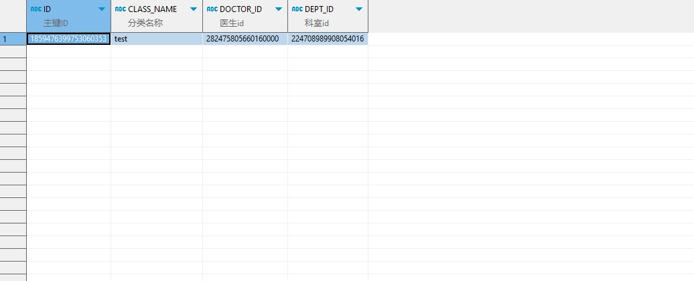

# 领域服务/临床领域 - 保存处方模板分类 - 保存处方模板分类 正向用例
## 请求参数：
``` json
{
  "orgName": "版本测试环境",
  "hospCode": "NXRY",
  "hospName": "版本测试环境",
  "orgCode": "NXRMYY",
  "list": [
    {
      "hospCode": "NXRY",
      "deptId": "224708989908054016",
      "className": "test",
      "layer": "2",
      "mngType": "0",
      "sortNo": 1,
      "useArea": "1",
      "doctorId": "282475805660160000",
      "orgCode": "NXRMYY"
    }
  ],
  "operatorId": "282475805660160000",
  "operatorName": "CS彭彭彭"
}
```
## 返回参数：
``` json
{
  "exception": null,
  "apiCode": null,
  "data": [
    {
      "id": "1859476399753060353",
      "sourceId": null
    }
  ],
  "Code": 200,
  "Message": "操作成功"
}
```
## 数据校验：


# 领域服务/临床领域 - 保存处方模板分类 - 必填校验-[orgCode]为空
## 请求参数：
``` json
{
  "orgName": "版本测试环境",
  "hospCode": "NXRY",
  "hospName": "版本测试环境",
  "orgCode": "",
  "list": [
    {
      "hospCode": "NXRY",
      "deptId": "224708989908054016",
      "className": "test",
      "layer": "2",
      "mngType": "0",
      "sortNo": 1,
      "useArea": "1",
      "doctorId": "282475805660160000",
      "orgCode": "NXRMYY"
    }
  ],
  "operatorId": "282475805660160000",
  "operatorName": "CS彭彭彭"
}
```
## 返回参数：
``` json
{
  "exception": null,
  "apiCode": null,
  "data": null,
  "Code": 1,
  "Message": "医院编码不能为空"
}
```
# 领域服务/临床领域 - 保存处方模板分类 - 必填校验-[hospCode]为空
## 请求参数：
``` json
{
  "orgName": "版本测试环境",
  "hospCode": "",
  "hospName": "版本测试环境",
  "orgCode": "NXRMYY",
  "list": [
    {
      "hospCode": "NXRY",
      "deptId": "224708989908054016",
      "className": "test",
      "layer": "2",
      "mngType": "0",
      "sortNo": 1,
      "useArea": "1",
      "doctorId": "282475805660160000",
      "orgCode": "NXRMYY"
    }
  ],
  "operatorId": "282475805660160000",
  "operatorName": "CS彭彭彭"
}
```
## 返回参数：
``` json
{
  "exception": null,
  "apiCode": null,
  "data": null,
  "Code": 1,
  "Message": "院区编码不能为空"
}
```
# 领域服务/临床领域 - 保存处方模板分类 - 必填校验-[operatorId]为空
## 请求参数：
``` json
{
  "orgName": "版本测试环境",
  "hospCode": "NXRY",
  "hospName": "版本测试环境",
  "orgCode": "NXRMYY",
  "list": [
    {
      "hospCode": "NXRY",
      "deptId": "224708989908054016",
      "className": "test",
      "layer": "2",
      "mngType": "0",
      "sortNo": 1,
      "useArea": "1",
      "doctorId": "282475805660160000",
      "orgCode": "NXRMYY"
    }
  ],
  "operatorId": "",
  "operatorName": "CS彭彭彭"
}
```
## 返回参数：
``` json
{
  "exception": null,
  "apiCode": null,
  "data": null,
  "Code": 1,
  "Message": "操作人id不能为空"
}
```
# 领域服务/临床领域 - 保存处方模板分类 - 必填校验-[operatorName]为空
## 请求参数：
``` json
{
  "orgName": "版本测试环境",
  "hospCode": "NXRY",
  "hospName": "版本测试环境",
  "orgCode": "NXRMYY",
  "list": [
    {
      "hospCode": "NXRY",
      "deptId": "224708989908054016",
      "className": "test",
      "layer": "2",
      "mngType": "0",
      "sortNo": 1,
      "useArea": "1",
      "doctorId": "282475805660160000",
      "orgCode": "NXRMYY"
    }
  ],
  "operatorId": "282475805660160000",
  "operatorName": ""
}
```
## 返回参数：
``` json
{
  "exception": null,
  "apiCode": null,
  "data": null,
  "Code": 1,
  "Message": "操作人姓名不能为空"
}
```
# 领域服务/临床领域 - 保存处方模板分类 - 必填校验-[list]为空
## 请求参数：
``` json
{
  "orgName": "版本测试环境",
  "hospCode": "NXRY",
  "hospName": "版本测试环境",
  "orgCode": "NXRMYY",
  "list": null,
  "operatorId": "282475805660160000",
  "operatorName": "CS彭彭彭"
}
```
## 返回参数：
``` json
{
  "exception": null,
  "apiCode": null,
  "data": null,
  "Code": 1,
  "Message": "保存对象不能为空"
}
```
# 领域服务/临床领域 - 保存处方模板分类 - 必填校验-[list.orgCode]为空
## 请求参数：
``` json
{
  "orgName": "版本测试环境",
  "hospCode": "NXRY",
  "hospName": "版本测试环境",
  "orgCode": "NXRMYY",
  "list": [
    {
      "hospCode": "NXRY",
      "deptId": "224708989908054016",
      "className": "test",
      "layer": "2",
      "mngType": "0",
      "sortNo": 1,
      "useArea": "1",
      "doctorId": "282475805660160000",
      "orgCode": null
    }
  ],
  "operatorId": "282475805660160000",
  "operatorName": "CS彭彭彭"
}
```
## 返回参数：
``` json
{
  "exception": null,
  "apiCode": null,
  "data": [
    {
      "id": "1859476438164496386",
      "sourceId": null
    }
  ],
  "Code": 200,
  "Message": "操作成功"
}
```
# 领域服务/临床领域 - 保存处方模板分类 - 必填校验-[list.hospCode]为空
## 请求参数：
``` json
{
  "orgName": "版本测试环境",
  "hospCode": "NXRY",
  "hospName": "版本测试环境",
  "orgCode": "NXRMYY",
  "list": [
    {
      "hospCode": null,
      "deptId": "224708989908054016",
      "className": "test",
      "layer": "2",
      "mngType": "0",
      "sortNo": 1,
      "useArea": "1",
      "doctorId": "282475805660160000",
      "orgCode": "NXRMYY"
    }
  ],
  "operatorId": "282475805660160000",
  "operatorName": "CS彭彭彭"
}
```
## 返回参数：
``` json
{
  "exception": null,
  "apiCode": null,
  "data": [
    {
      "id": "1859476444355289090",
      "sourceId": null
    }
  ],
  "Code": 200,
  "Message": "操作成功"
}
```
# 领域服务/临床领域 - 保存处方模板分类 - 必填校验-[list.className]为空
## 请求参数：
``` json
{
  "orgName": "版本测试环境",
  "hospCode": "NXRY",
  "hospName": "版本测试环境",
  "orgCode": "NXRMYY",
  "list": [
    {
      "hospCode": "NXRY",
      "deptId": "224708989908054016",
      "className": null,
      "layer": "2",
      "mngType": "0",
      "sortNo": 1,
      "useArea": "1",
      "doctorId": "282475805660160000",
      "orgCode": "NXRMYY"
    }
  ],
  "operatorId": "282475805660160000",
  "operatorName": "CS彭彭彭"
}
```
## 返回参数：
``` json
{
  "exception": null,
  "apiCode": null,
  "data": null,
  "Code": 1,
  "Message": "分类名称不能为空"
}
```
# 领域服务/临床领域 - 保存处方模板分类 - 必填校验-[list.layer]为空
## 请求参数：
``` json
{
  "orgName": "版本测试环境",
  "hospCode": "NXRY",
  "hospName": "版本测试环境",
  "orgCode": "NXRMYY",
  "list": [
    {
      "hospCode": "NXRY",
      "deptId": "224708989908054016",
      "className": "test",
      "layer": null,
      "mngType": "0",
      "sortNo": 1,
      "useArea": "1",
      "doctorId": "282475805660160000",
      "orgCode": "NXRMYY"
    }
  ],
  "operatorId": "282475805660160000",
  "operatorName": "CS彭彭彭"
}
```
## 返回参数：
``` json
{
  "exception": null,
  "apiCode": null,
  "data": null,
  "Code": 1,
  "Message": "模板级别不能为空"
}
```
# 领域服务/临床领域 - 保存处方模板分类 - 必填校验-[list.useArea]为空
## 请求参数：
``` json
{
  "orgName": "版本测试环境",
  "hospCode": "NXRY",
  "hospName": "版本测试环境",
  "orgCode": "NXRMYY",
  "list": [
    {
      "hospCode": "NXRY",
      "deptId": "224708989908054016",
      "className": "test",
      "layer": "2",
      "mngType": "0",
      "sortNo": 1,
      "useArea": null,
      "doctorId": "282475805660160000",
      "orgCode": "NXRMYY"
    }
  ],
  "operatorId": "282475805660160000",
  "operatorName": "CS彭彭彭"
}
```
## 返回参数：
``` json
{
  "exception": null,
  "apiCode": null,
  "data": null,
  "Code": 1,
  "Message": "使用范围不能为空"
}
```
# 领域服务/临床领域 - 保存处方模板分类 - 必填校验-[list.mngType]为空
## 请求参数：
``` json
{
  "orgName": "版本测试环境",
  "hospCode": "NXRY",
  "hospName": "版本测试环境",
  "orgCode": "NXRMYY",
  "list": [
    {
      "hospCode": "NXRY",
      "deptId": "224708989908054016",
      "className": "test",
      "layer": "2",
      "mngType": null,
      "sortNo": 1,
      "useArea": "1",
      "doctorId": "282475805660160000",
      "orgCode": "NXRMYY"
    }
  ],
  "operatorId": "282475805660160000",
  "operatorName": "CS彭彭彭"
}
```
## 返回参数：
``` json
{
  "exception": null,
  "apiCode": null,
  "data": null,
  "Code": 1,
  "Message": "模板管理类型不能为空"
}
```
# 领域服务/临床领域 - 保存处方模板分类 - 必填校验-[list.sortNo]为空
## 请求参数：
``` json
{
  "orgName": "版本测试环境",
  "hospCode": "NXRY",
  "hospName": "版本测试环境",
  "orgCode": "NXRMYY",
  "list": [
    {
      "hospCode": "NXRY",
      "deptId": "224708989908054016",
      "className": "test",
      "layer": "2",
      "mngType": "0",
      "sortNo": null,
      "useArea": "1",
      "doctorId": "282475805660160000",
      "orgCode": "NXRMYY"
    }
  ],
  "operatorId": "282475805660160000",
  "operatorName": "CS彭彭彭"
}
```
## 返回参数：
``` json
{
  "exception": null,
  "apiCode": null,
  "data": null,
  "Code": 1,
  "Message": "排序号不能为空"
}
```
# 领域服务/临床领域 - 保存处方模板分类 - 类型校验-[list.sortNo]类型错误
## 请求参数：
``` json
{
  "orgName": "版本测试环境",
  "hospCode": "NXRY",
  "hospName": "版本测试环境",
  "orgCode": "NXRMYY",
  "list": [
    {
      "hospCode": "NXRY",
      "deptId": "224708989908054016",
      "className": "test",
      "layer": "2",
      "mngType": "0",
      "sortNo": "\"abc\"",
      "useArea": "1",
      "doctorId": "282475805660160000",
      "orgCode": "NXRMYY"
    }
  ],
  "operatorId": "282475805660160000",
  "operatorName": "CS彭彭彭"
}
```
## 返回参数：
``` json
{
  "exception": null,
  "apiCode": null,
  "data": null,
  "Code": 1,
  "Message": "请求参数错误"
}
```
# 领域服务/临床领域 - 保存处方模板分类 - 枚举用例-[list.layer] 枚举值为 0(模板级别为[STRUCTURE_LAYER])
## 请求参数：
``` json
{
  "orgName": "版本测试环境",
  "hospCode": "NXRY",
  "hospName": "版本测试环境",
  "orgCode": "NXRMYY",
  "list": [
    {
      "hospCode": "NXRY",
      "deptId": "224708989908054016",
      "className": "test",
      "layer": "0",
      "mngType": "0",
      "sortNo": 1,
      "useArea": "1",
      "doctorId": "282475805660160000",
      "orgCode": "NXRMYY"
    }
  ],
  "operatorId": "282475805660160000",
  "operatorName": "CS彭彭彭"
}
```
## 返回参数：
``` json
{
  "exception": null,
  "apiCode": null,
  "data": [
    {
      "id": "1859476484087930881",
      "sourceId": null
    }
  ],
  "Code": 200,
  "Message": "操作成功"
}
```
# 领域服务/临床领域 - 保存处方模板分类 - 枚举用例-[list.layer] 枚举值为 1(模板级别为院级)
## 请求参数：
``` json
{
  "orgName": "版本测试环境",
  "hospCode": "NXRY",
  "hospName": "版本测试环境",
  "orgCode": "NXRMYY",
  "list": [
    {
      "hospCode": "NXRY",
      "deptId": "224708989908054016",
      "className": "test",
      "layer": "1",
      "mngType": "0",
      "sortNo": 1,
      "useArea": "1",
      "doctorId": "282475805660160000",
      "orgCode": "NXRMYY"
    }
  ],
  "operatorId": "282475805660160000",
  "operatorName": "CS彭彭彭"
}
```
## 返回参数：
``` json
{
  "exception": null,
  "apiCode": null,
  "data": [
    {
      "id": "1859476489477611521",
      "sourceId": null
    }
  ],
  "Code": 200,
  "Message": "操作成功"
}
```
# 领域服务/临床领域 - 保存处方模板分类 - 枚举用例-[list.layer] 枚举值为 2(模板级别为科级)
## 请求参数：
``` json
{
  "orgName": "版本测试环境",
  "hospCode": "NXRY",
  "hospName": "版本测试环境",
  "orgCode": "NXRMYY",
  "list": [
    {
      "hospCode": "NXRY",
      "deptId": "224708989908054016",
      "className": "test",
      "layer": "2",
      "mngType": "0",
      "sortNo": 1,
      "useArea": "1",
      "doctorId": "282475805660160000",
      "orgCode": "NXRMYY"
    }
  ],
  "operatorId": "282475805660160000",
  "operatorName": "CS彭彭彭"
}
```
## 返回参数：
``` json
{
  "exception": null,
  "apiCode": null,
  "data": [
    {
      "id": "1859476495509020674",
      "sourceId": null
    }
  ],
  "Code": 200,
  "Message": "操作成功"
}
```
# 领域服务/临床领域 - 保存处方模板分类 - 枚举用例-[list.layer] 枚举值为 3(模板级别为个人)
## 请求参数：
``` json
{
  "orgName": "版本测试环境",
  "hospCode": "NXRY",
  "hospName": "版本测试环境",
  "orgCode": "NXRMYY",
  "list": [
    {
      "hospCode": "NXRY",
      "deptId": "224708989908054016",
      "className": "test",
      "layer": "3",
      "mngType": "0",
      "sortNo": 1,
      "useArea": "1",
      "doctorId": "282475805660160000",
      "orgCode": "NXRMYY"
    }
  ],
  "operatorId": "282475805660160000",
  "operatorName": "CS彭彭彭"
}
```
## 返回参数：
``` json
{
  "exception": null,
  "apiCode": null,
  "data": [
    {
      "id": "1859476501708201985",
      "sourceId": null
    }
  ],
  "Code": 200,
  "Message": "操作成功"
}
```
# 领域服务/临床领域 - 保存处方模板分类 - 枚举用例-[list.mngType] 枚举值为 0(模板管理类型为[MNG_TYPE])
## 请求参数：
``` json
{
  "orgName": "版本测试环境",
  "hospCode": "NXRY",
  "hospName": "版本测试环境",
  "orgCode": "NXRMYY",
  "list": [
    {
      "hospCode": "NXRY",
      "deptId": "224708989908054016",
      "className": "test",
      "layer": "2",
      "mngType": "0",
      "sortNo": 1,
      "useArea": "1",
      "doctorId": "282475805660160000",
      "orgCode": "NXRMYY"
    }
  ],
  "operatorId": "282475805660160000",
  "operatorName": "CS彭彭彭"
}
```
## 返回参数：
``` json
{
  "exception": null,
  "apiCode": null,
  "data": [
    {
      "id": "1859476507810914306",
      "sourceId": null
    }
  ],
  "Code": 200,
  "Message": "操作成功"
}
```
# 领域服务/临床领域 - 保存处方模板分类 - 枚举用例-[list.mngType] 枚举值为 4(模板管理类型为普通)
## 请求参数：
``` json
{
  "orgName": "版本测试环境",
  "hospCode": "NXRY",
  "hospName": "版本测试环境",
  "orgCode": "NXRMYY",
  "list": [
    {
      "hospCode": "NXRY",
      "deptId": "224708989908054016",
      "className": "test",
      "layer": "2",
      "mngType": "4",
      "sortNo": 1,
      "useArea": "1",
      "doctorId": "282475805660160000",
      "orgCode": "NXRMYY"
    }
  ],
  "operatorId": "282475805660160000",
  "operatorName": "CS彭彭彭"
}
```
## 返回参数：
``` json
{
  "exception": null,
  "apiCode": null,
  "data": [
    {
      "id": "1859476515129974785",
      "sourceId": null
    }
  ],
  "Code": 200,
  "Message": "操作成功"
}
```
# 领域服务/临床领域 - 保存处方模板分类 - 枚举用例-[list.mngType] 枚举值为 5(模板管理类型为检查)
## 请求参数：
``` json
{
  "orgName": "版本测试环境",
  "hospCode": "NXRY",
  "hospName": "版本测试环境",
  "orgCode": "NXRMYY",
  "list": [
    {
      "hospCode": "NXRY",
      "deptId": "224708989908054016",
      "className": "test",
      "layer": "2",
      "mngType": "5",
      "sortNo": 1,
      "useArea": "1",
      "doctorId": "282475805660160000",
      "orgCode": "NXRMYY"
    }
  ],
  "operatorId": "282475805660160000",
  "operatorName": "CS彭彭彭"
}
```
## 返回参数：
``` json
{
  "exception": null,
  "apiCode": null,
  "data": [
    {
      "id": "1859476522717470721",
      "sourceId": null
    }
  ],
  "Code": 200,
  "Message": "操作成功"
}
```
# 领域服务/临床领域 - 保存处方模板分类 - 枚举用例-[list.useArea] 枚举值为 0(使用范围为[USE_AREA])
## 请求参数：
``` json
{
  "orgName": "版本测试环境",
  "hospCode": "NXRY",
  "hospName": "版本测试环境",
  "orgCode": "NXRMYY",
  "list": [
    {
      "hospCode": "NXRY",
      "deptId": "224708989908054016",
      "className": "test",
      "layer": "2",
      "mngType": "0",
      "sortNo": 1,
      "useArea": "0",
      "doctorId": "282475805660160000",
      "orgCode": "NXRMYY"
    }
  ],
  "operatorId": "282475805660160000",
  "operatorName": "CS彭彭彭"
}
```
## 返回参数：
``` json
{
  "exception": null,
  "apiCode": null,
  "data": [
    {
      "id": "1859476529965228033",
      "sourceId": null
    }
  ],
  "Code": 200,
  "Message": "操作成功"
}
```
# 领域服务/临床领域 - 保存处方模板分类 - 枚举用例-[list.useArea] 枚举值为 1(使用范围为所有)
## 请求参数：
``` json
{
  "orgName": "版本测试环境",
  "hospCode": "NXRY",
  "hospName": "版本测试环境",
  "orgCode": "NXRMYY",
  "list": [
    {
      "hospCode": "NXRY",
      "deptId": "224708989908054016",
      "className": "test",
      "layer": "2",
      "mngType": "0",
      "sortNo": 1,
      "useArea": "1",
      "doctorId": "282475805660160000",
      "orgCode": "NXRMYY"
    }
  ],
  "operatorId": "282475805660160000",
  "operatorName": "CS彭彭彭"
}
```
## 返回参数：
``` json
{
  "exception": null,
  "apiCode": null,
  "data": [
    {
      "id": "1859476538198646785",
      "sourceId": null
    }
  ],
  "Code": 200,
  "Message": "操作成功"
}
```
# 领域服务/临床领域 - 保存处方模板分类 - 枚举用例-[list.useArea] 枚举值为 2(使用范围为门诊)
## 请求参数：
``` json
{
  "orgName": "版本测试环境",
  "hospCode": "NXRY",
  "hospName": "版本测试环境",
  "orgCode": "NXRMYY",
  "list": [
    {
      "hospCode": "NXRY",
      "deptId": "224708989908054016",
      "className": "test",
      "layer": "2",
      "mngType": "0",
      "sortNo": 1,
      "useArea": "2",
      "doctorId": "282475805660160000",
      "orgCode": "NXRMYY"
    }
  ],
  "operatorId": "282475805660160000",
  "operatorName": "CS彭彭彭"
}
```
## 返回参数：
``` json
{
  "exception": null,
  "apiCode": null,
  "data": [
    {
      "id": "1859476543630270465",
      "sourceId": null
    }
  ],
  "Code": 200,
  "Message": "操作成功"
}
```
# 领域服务/临床领域 - 保存处方模板分类 - 依赖用例-[operatorName]赋值为依赖用例测试值
## 请求参数：
``` json
{
  "orgName": "版本测试环境",
  "hospCode": "NXRY",
  "hospName": "版本测试环境",
  "orgCode": "NXRMYY",
  "list": [
    {
      "hospCode": "NXRY",
      "deptId": "224708989908054016",
      "className": "test",
      "layer": "2",
      "mngType": "0",
      "sortNo": 1,
      "useArea": "1",
      "doctorId": "282475805660160000",
      "orgCode": "NXRMYY"
    }
  ],
  "operatorId": "282475805660160000",
  "operatorName": "依赖用例测试值"
}
```
## 返回参数：
``` json
{
  "exception": null,
  "apiCode": null,
  "data": [
    {
      "id": "1859476549082865666",
      "sourceId": null
    }
  ],
  "Code": 200,
  "Message": "操作成功"
}
```
# 领域服务/临床领域 - 保存处方模板分类 - 依赖用例-[operatorId]赋值为依赖用例测试值
## 请求参数：
``` json
{
  "orgName": "版本测试环境",
  "hospCode": "NXRY",
  "hospName": "版本测试环境",
  "orgCode": "NXRMYY",
  "list": [
    {
      "hospCode": "NXRY",
      "deptId": "224708989908054016",
      "className": "test",
      "layer": "2",
      "mngType": "0",
      "sortNo": 1,
      "useArea": "1",
      "doctorId": "282475805660160000",
      "orgCode": "NXRMYY"
    }
  ],
  "operatorId": "依赖用例测试值",
  "operatorName": "CS彭彭彭"
}
```
## 返回参数：
``` json
{
  "exception": null,
  "apiCode": null,
  "data": [
    {
      "id": "1859476553885343745",
      "sourceId": null
    }
  ],
  "Code": 200,
  "Message": "操作成功"
}
```
# 领域服务/临床领域 - 保存处方模板分类 - 依赖用例-[list.hospCode]赋值为依赖用例测试值
## 请求参数：
``` json
{
  "orgName": "版本测试环境",
  "hospCode": "NXRY",
  "hospName": "版本测试环境",
  "orgCode": "NXRMYY",
  "list": [
    {
      "hospCode": "依赖用例测试值",
      "deptId": "224708989908054016",
      "className": "test",
      "layer": "2",
      "mngType": "0",
      "sortNo": 1,
      "useArea": "1",
      "doctorId": "282475805660160000",
      "orgCode": "NXRMYY"
    }
  ],
  "operatorId": "282475805660160000",
  "operatorName": "CS彭彭彭"
}
```
## 返回参数：
``` json
{
  "exception": null,
  "apiCode": null,
  "data": [
    {
      "id": "1859476559086280706",
      "sourceId": null
    }
  ],
  "Code": 200,
  "Message": "操作成功"
}
```
# 领域服务/临床领域 - 保存处方模板分类 - 依赖用例-[list.className]赋值为依赖用例测试值
## 请求参数：
``` json
{
  "orgName": "版本测试环境",
  "hospCode": "NXRY",
  "hospName": "版本测试环境",
  "orgCode": "NXRMYY",
  "list": [
    {
      "hospCode": "NXRY",
      "deptId": "224708989908054016",
      "className": "依赖用例测试值",
      "layer": "2",
      "mngType": "0",
      "sortNo": 1,
      "useArea": "1",
      "doctorId": "282475805660160000",
      "orgCode": "NXRMYY"
    }
  ],
  "operatorId": "282475805660160000",
  "operatorName": "CS彭彭彭"
}
```
## 返回参数：
``` json
{
  "exception": null,
  "apiCode": null,
  "data": [
    {
      "id": "1859476564144611329",
      "sourceId": null
    }
  ],
  "Code": 200,
  "Message": "操作成功"
}
```
# 领域服务/临床领域 - 保存处方模板分类 - 依赖用例-[list.orgCode]赋值为依赖用例测试值
## 请求参数：
``` json
{
  "orgName": "版本测试环境",
  "hospCode": "NXRY",
  "hospName": "版本测试环境",
  "orgCode": "NXRMYY",
  "list": [
    {
      "hospCode": "NXRY",
      "deptId": "224708989908054016",
      "className": "test",
      "layer": "2",
      "mngType": "0",
      "sortNo": 1,
      "useArea": "1",
      "doctorId": "282475805660160000",
      "orgCode": "依赖用例测试值"
    }
  ],
  "operatorId": "282475805660160000",
  "operatorName": "CS彭彭彭"
}
```
## 返回参数：
``` json
{
  "exception": null,
  "apiCode": null,
  "data": [
    {
      "id": "1859476569295216642",
      "sourceId": null
    }
  ],
  "Code": 200,
  "Message": "操作成功"
}
```
# 领域服务/临床领域 - 保存处方模板分类 - 依赖用例-[orgCode]赋值为依赖用例测试值
## 请求参数：
``` json
{
  "orgName": "版本测试环境",
  "hospCode": "NXRY",
  "hospName": "版本测试环境",
  "orgCode": "依赖用例测试值",
  "list": [
    {
      "hospCode": "NXRY",
      "deptId": "224708989908054016",
      "className": "test",
      "layer": "2",
      "mngType": "0",
      "sortNo": 1,
      "useArea": "1",
      "doctorId": "282475805660160000",
      "orgCode": "NXRMYY"
    }
  ],
  "operatorId": "282475805660160000",
  "operatorName": "CS彭彭彭"
}
```
## 返回参数：
``` json
{
  "exception": null,
  "apiCode": null,
  "data": [
    {
      "id": "1859476574936555521",
      "sourceId": null
    }
  ],
  "Code": 200,
  "Message": "操作成功"
}
```
# 领域服务/临床领域 - 保存处方模板分类 - 依赖用例-[hospCode]赋值为依赖用例测试值
## 请求参数：
``` json
{
  "orgName": "版本测试环境",
  "hospCode": "依赖用例测试值",
  "hospName": "版本测试环境",
  "orgCode": "NXRMYY",
  "list": [
    {
      "hospCode": "NXRY",
      "deptId": "224708989908054016",
      "className": "test",
      "layer": "2",
      "mngType": "0",
      "sortNo": 1,
      "useArea": "1",
      "doctorId": "282475805660160000",
      "orgCode": "NXRMYY"
    }
  ],
  "operatorId": "282475805660160000",
  "operatorName": "CS彭彭彭"
}
```
## 返回参数：
``` json
{
  "exception": null,
  "apiCode": null,
  "data": [
    {
      "id": "1859476579973914626",
      "sourceId": null
    }
  ],
  "Code": 200,
  "Message": "操作成功"
}
```