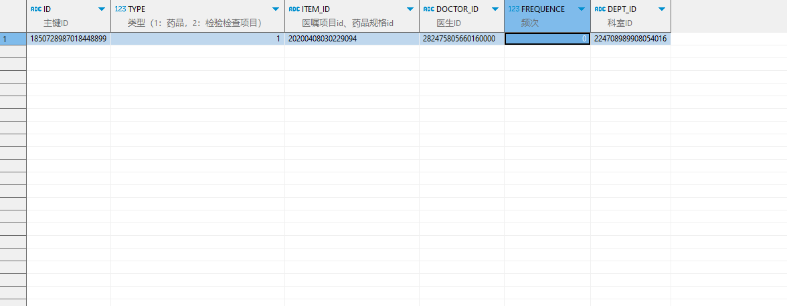

# 领域服务/临床领域 - 保存常用项目 - 保存常用项目 正向用例
## 请求参数：
``` json
{
  "orgName": "版本测试环境",
  "hospCode": "NXRY",
  "hospName": "版本测试环境",
  "orgCode": "NXRMYY",
  "list": [
    {
      "dosage": 250,
      "usageId": "",
      "dosageUnitId": "20200408030204776",
      "deptId": "224708989908054016",
      "type": 1,
      "usageName": "",
      "frequency": 0,
      "frequencyId": "",
      "itemId": "20200408030229094",
      "doctorId": "282475805660160000",
      "frequencyName": ""
    }
  ],
  "operatorId": "282475805660160000",
  "operatorName": "CS彭彭彭"
}
```
## 返回参数：
``` json
{
  "exception": null,
  "apiCode": null,
  "data": [
    {
      "id": "1850728987018448899",
      "sourceId": null
    }
  ],
  "Code": 200,
  "Message": "操作成功"
}
```
## 数据校验：

# 领域服务/临床领域 - 保存常用项目 - 必填校验-[orgCode]为空
## 请求参数：
``` json
{
  "orgName": "版本测试环境",
  "hospCode": "NXRY",
  "hospName": "版本测试环境",
  "orgCode": "",
  "list": [
    {
      "dosage": 250,
      "usageId": "",
      "dosageUnitId": "20200408030204776",
      "deptId": "224708989908054016",
      "type": 1,
      "usageName": "",
      "frequency": 0,
      "frequencyId": "",
      "itemId": "20200408030229094",
      "doctorId": "282475805660160000",
      "frequencyName": ""
    }
  ],
  "operatorId": "282475805660160000",
  "operatorName": "CS彭彭彭"
}
```
## 返回参数：
``` json
{
  "exception": null,
  "apiCode": null,
  "data": null,
  "Code": 1,
  "Message": "医院编码不能为空"
}
```
# 领域服务/临床领域 - 保存常用项目 - 必填校验-[hospCode]为空
## 请求参数：
``` json
{
  "orgName": "版本测试环境",
  "hospCode": "",
  "hospName": "版本测试环境",
  "orgCode": "NXRMYY",
  "list": [
    {
      "dosage": 250,
      "usageId": "",
      "dosageUnitId": "20200408030204776",
      "deptId": "224708989908054016",
      "type": 1,
      "usageName": "",
      "frequency": 0,
      "frequencyId": "",
      "itemId": "20200408030229094",
      "doctorId": "282475805660160000",
      "frequencyName": ""
    }
  ],
  "operatorId": "282475805660160000",
  "operatorName": "CS彭彭彭"
}
```
## 返回参数：
``` json
{
  "exception": null,
  "apiCode": null,
  "data": null,
  "Code": 1,
  "Message": "院区编码不能为空"
}
```
# 领域服务/临床领域 - 保存常用项目 - 必填校验-[operatorId]为空
## 请求参数：
``` json
{
  "orgName": "版本测试环境",
  "hospCode": "NXRY",
  "hospName": "版本测试环境",
  "orgCode": "NXRMYY",
  "list": [
    {
      "dosage": 250,
      "usageId": "",
      "dosageUnitId": "20200408030204776",
      "deptId": "224708989908054016",
      "type": 1,
      "usageName": "",
      "frequency": 0,
      "frequencyId": "",
      "itemId": "20200408030229094",
      "doctorId": "282475805660160000",
      "frequencyName": ""
    }
  ],
  "operatorId": "",
  "operatorName": "CS彭彭彭"
}
```
## 返回参数：
``` json
{
  "exception": null,
  "apiCode": null,
  "data": null,
  "Code": 1,
  "Message": "操作人id不能为空"
}
```
# 领域服务/临床领域 - 保存常用项目 - 必填校验-[operatorName]为空
## 请求参数：
``` json
{
  "orgName": "版本测试环境",
  "hospCode": "NXRY",
  "hospName": "版本测试环境",
  "orgCode": "NXRMYY",
  "list": [
    {
      "dosage": 250,
      "usageId": "",
      "dosageUnitId": "20200408030204776",
      "deptId": "224708989908054016",
      "type": 1,
      "usageName": "",
      "frequency": 0,
      "frequencyId": "",
      "itemId": "20200408030229094",
      "doctorId": "282475805660160000",
      "frequencyName": ""
    }
  ],
  "operatorId": "282475805660160000",
  "operatorName": ""
}
```
## 返回参数：
``` json
{
  "exception": null,
  "apiCode": null,
  "data": null,
  "Code": 1,
  "Message": "操作人姓名不能为空"
}
```
# 领域服务/临床领域 - 保存常用项目 - 必填校验-[list]为空
## 请求参数：
``` json
{
  "orgName": "版本测试环境",
  "hospCode": "NXRY",
  "hospName": "版本测试环境",
  "orgCode": "NXRMYY",
  "list": null,
  "operatorId": "282475805660160000",
  "operatorName": "CS彭彭彭"
}
```
## 返回参数：
``` json
{
  "exception": null,
  "apiCode": null,
  "data": null,
  "Code": 1,
  "Message": "保存对象不能为空"
}
```
# 领域服务/临床领域 - 保存常用项目 - 必填校验-[list.type]为空
## 请求参数：
``` json
{
  "orgName": "版本测试环境",
  "hospCode": "NXRY",
  "hospName": "版本测试环境",
  "orgCode": "NXRMYY",
  "list": [
    {
      "dosage": 250,
      "usageId": "",
      "dosageUnitId": "20200408030204776",
      "deptId": "224708989908054016",
      "type": null,
      "usageName": "",
      "frequency": 0,
      "frequencyId": "",
      "itemId": "20200408030229094",
      "doctorId": "282475805660160000",
      "frequencyName": ""
    }
  ],
  "operatorId": "282475805660160000",
  "operatorName": "CS彭彭彭"
}
```
## 返回参数：
``` json
{
  "exception": null,
  "apiCode": null,
  "data": null,
  "Code": 1,
  "Message": "类型不能为空"
}
```
# 领域服务/临床领域 - 保存常用项目 - 必填校验-[list.itemId]为空
## 请求参数：
``` json
{
  "orgName": "版本测试环境",
  "hospCode": "NXRY",
  "hospName": "版本测试环境",
  "orgCode": "NXRMYY",
  "list": [
    {
      "dosage": 250,
      "usageId": "",
      "dosageUnitId": "20200408030204776",
      "deptId": "224708989908054016",
      "type": 1,
      "usageName": "",
      "frequency": 0,
      "frequencyId": "",
      "itemId": null,
      "doctorId": "282475805660160000",
      "frequencyName": ""
    }
  ],
  "operatorId": "282475805660160000",
  "operatorName": "CS彭彭彭"
}
```
## 返回参数：
``` json
{
  "exception": null,
  "apiCode": null,
  "data": null,
  "Code": 1,
  "Message": "项目id不能为空"
}
```
# 领域服务/临床领域 - 保存常用项目 - 必填校验-[list.doctorId]为空
## 请求参数：
``` json
{
  "orgName": "版本测试环境",
  "hospCode": "NXRY",
  "hospName": "版本测试环境",
  "orgCode": "NXRMYY",
  "list": [
    {
      "dosage": 250,
      "usageId": "",
      "dosageUnitId": "20200408030204776",
      "deptId": "224708989908054016",
      "type": 1,
      "usageName": "",
      "frequency": 0,
      "frequencyId": "",
      "itemId": "20200408030229094",
      "doctorId": null,
      "frequencyName": ""
    }
  ],
  "operatorId": "282475805660160000",
  "operatorName": "CS彭彭彭"
}
```
## 返回参数：
``` json
{
  "exception": null,
  "apiCode": null,
  "data": null,
  "Code": 1,
  "Message": "医生id不能为空"
}
```
# 领域服务/临床领域 - 保存常用项目 - 必填校验-[list.frequency]为空
## 请求参数：
``` json
{
  "orgName": "版本测试环境",
  "hospCode": "NXRY",
  "hospName": "版本测试环境",
  "orgCode": "NXRMYY",
  "list": [
    {
      "dosage": 250,
      "usageId": "",
      "dosageUnitId": "20200408030204776",
      "deptId": "224708989908054016",
      "type": 1,
      "usageName": "",
      "frequency": null,
      "frequencyId": "",
      "itemId": "20200408030229094",
      "doctorId": "282475805660160000",
      "frequencyName": ""
    }
  ],
  "operatorId": "282475805660160000",
  "operatorName": "CS彭彭彭"
}
```
## 返回参数：
``` json
{
  "exception": null,
  "apiCode": null,
  "data": null,
  "Code": 1,
  "Message": "次数不能为空"
}
```
# 领域服务/临床领域 - 保存常用项目 - 必填校验-[list.deptId]为空
## 请求参数：
``` json
{
  "orgName": "版本测试环境",
  "hospCode": "NXRY",
  "hospName": "版本测试环境",
  "orgCode": "NXRMYY",
  "list": [
    {
      "dosage": 250,
      "usageId": "",
      "dosageUnitId": "20200408030204776",
      "deptId": null,
      "type": 1,
      "usageName": "",
      "frequency": 0,
      "frequencyId": "",
      "itemId": "20200408030229094",
      "doctorId": "282475805660160000",
      "frequencyName": ""
    }
  ],
  "operatorId": "282475805660160000",
  "operatorName": "CS彭彭彭"
}
```
## 返回参数：
``` json
{
  "exception": null,
  "apiCode": null,
  "data": null,
  "Code": 1,
  "Message": "科室ID不能为空"
}
```
# 领域服务/临床领域 - 保存常用项目 - 类型校验-[list.type]类型错误
## 请求参数：
``` json
{
  "orgName": "版本测试环境",
  "hospCode": "NXRY",
  "hospName": "版本测试环境",
  "orgCode": "NXRMYY",
  "list": [
    {
      "dosage": 250,
      "usageId": "",
      "dosageUnitId": "20200408030204776",
      "deptId": "224708989908054016",
      "type": "\"abc\"",
      "usageName": "",
      "frequency": 0,
      "frequencyId": "",
      "itemId": "20200408030229094",
      "doctorId": "282475805660160000",
      "frequencyName": ""
    }
  ],
  "operatorId": "282475805660160000",
  "operatorName": "CS彭彭彭"
}
```
## 返回参数：
``` json
{
  "exception": null,
  "apiCode": null,
  "data": null,
  "Code": 1,
  "Message": "请求参数错误"
}
```
# 领域服务/临床领域 - 保存常用项目 - 类型校验-[list.frequency]类型错误
## 请求参数：
``` json
{
  "orgName": "版本测试环境",
  "hospCode": "NXRY",
  "hospName": "版本测试环境",
  "orgCode": "NXRMYY",
  "list": [
    {
      "dosage": 250,
      "usageId": "",
      "dosageUnitId": "20200408030204776",
      "deptId": "224708989908054016",
      "type": 1,
      "usageName": "",
      "frequency": "\"abc\"",
      "frequencyId": "",
      "itemId": "20200408030229094",
      "doctorId": "282475805660160000",
      "frequencyName": ""
    }
  ],
  "operatorId": "282475805660160000",
  "operatorName": "CS彭彭彭"
}
```
## 返回参数：
``` json
{
  "exception": null,
  "apiCode": null,
  "data": null,
  "Code": 1,
  "Message": "请求参数错误"
}
```
# 领域服务/临床领域 - 保存常用项目 - 枚举用例-[list.type] 枚举值为 1(类型为[TYPE])
## 请求参数：
``` json
{
  "orgName": "版本测试环境",
  "hospCode": "NXRY",
  "hospName": "版本测试环境",
  "orgCode": "NXRMYY",
  "list": [
    {
      "dosage": 250,
      "usageId": "",
      "dosageUnitId": "20200408030204776",
      "deptId": "224708989908054016",
      "type": "1",
      "usageName": "",
      "frequency": 0,
      "frequencyId": "",
      "itemId": "20200408030229094",
      "doctorId": "282475805660160000",
      "frequencyName": ""
    }
  ],
  "operatorId": "282475805660160000",
  "operatorName": "CS彭彭彭"
}
```
## 返回参数：
``` json
{
  "exception": null,
  "apiCode": null,
  "data": [
    {
      "id": "1850728987018448899",
      "sourceId": null
    }
  ],
  "Code": 200,
  "Message": "操作成功"
}
```
# 领域服务/临床领域 - 保存常用项目 - 枚举用例-[list.type] 枚举值为 2(类型为药品)
## 请求参数：
``` json
{
  "orgName": "版本测试环境",
  "hospCode": "NXRY",
  "hospName": "版本测试环境",
  "orgCode": "NXRMYY",
  "list": [
    {
      "dosage": 250,
      "usageId": "",
      "dosageUnitId": "20200408030204776",
      "deptId": "224708989908054016",
      "type": "2",
      "usageName": "",
      "frequency": 0,
      "frequencyId": "",
      "itemId": "20200408030229094",
      "doctorId": "282475805660160000",
      "frequencyName": ""
    }
  ],
  "operatorId": "282475805660160000",
  "operatorName": "CS彭彭彭"
}
```
## 返回参数：
``` json
{
  "exception": null,
  "apiCode": null,
  "data": [
    {
      "id": "1850728990210314243",
      "sourceId": null
    }
  ],
  "Code": 200,
  "Message": "操作成功"
}
```
# 领域服务/临床领域 - 保存常用项目 - 枚举用例-[list.type] 枚举值为 3(类型为医嘱项目)
## 请求参数：
``` json
{
  "orgName": "版本测试环境",
  "hospCode": "NXRY",
  "hospName": "版本测试环境",
  "orgCode": "NXRMYY",
  "list": [
    {
      "dosage": 250,
      "usageId": "",
      "dosageUnitId": "20200408030204776",
      "deptId": "224708989908054016",
      "type": "3",
      "usageName": "",
      "frequency": 0,
      "frequencyId": "",
      "itemId": "20200408030229094",
      "doctorId": "282475805660160000",
      "frequencyName": ""
    }
  ],
  "operatorId": "282475805660160000",
  "operatorName": "CS彭彭彭"
}
```
## 返回参数：
``` json
{
  "exception": null,
  "apiCode": null,
  "data": [
    {
      "id": "1850728992856920066",
      "sourceId": null
    }
  ],
  "Code": 200,
  "Message": "操作成功"
}
```
# 领域服务/临床领域 - 保存常用项目 - 依赖用例-[operatorName]赋值为依赖用例测试值
## 请求参数：
``` json
{
  "orgName": "版本测试环境",
  "hospCode": "NXRY",
  "hospName": "版本测试环境",
  "orgCode": "NXRMYY",
  "list": [
    {
      "dosage": 250,
      "usageId": "",
      "dosageUnitId": "20200408030204776",
      "deptId": "224708989908054016",
      "type": 1,
      "usageName": "",
      "frequency": 0,
      "frequencyId": "",
      "itemId": "20200408030229094",
      "doctorId": "282475805660160000",
      "frequencyName": ""
    }
  ],
  "operatorId": "282475805660160000",
  "operatorName": "依赖用例测试值"
}
```
## 返回参数：
``` json
{
  "exception": null,
  "apiCode": null,
  "data": [
    {
      "id": "1850728987018448899",
      "sourceId": null
    }
  ],
  "Code": 200,
  "Message": "操作成功"
}
```
# 领域服务/临床领域 - 保存常用项目 - 依赖用例-[operatorId]赋值为依赖用例测试值
## 请求参数：
``` json
{
  "orgName": "版本测试环境",
  "hospCode": "NXRY",
  "hospName": "版本测试环境",
  "orgCode": "NXRMYY",
  "list": [
    {
      "dosage": 250,
      "usageId": "",
      "dosageUnitId": "20200408030204776",
      "deptId": "224708989908054016",
      "type": 1,
      "usageName": "",
      "frequency": 0,
      "frequencyId": "",
      "itemId": "20200408030229094",
      "doctorId": "282475805660160000",
      "frequencyName": ""
    }
  ],
  "operatorId": "依赖用例测试值",
  "operatorName": "CS彭彭彭"
}
```
## 返回参数：
``` json
{
  "exception": null,
  "apiCode": null,
  "data": [
    {
      "id": "1850728987018448899",
      "sourceId": null
    }
  ],
  "Code": 200,
  "Message": "操作成功"
}
```
# 领域服务/临床领域 - 保存常用项目 - 依赖用例-[list.deptId]赋值为依赖用例测试值
## 请求参数：
``` json
{
  "orgName": "版本测试环境",
  "hospCode": "NXRY",
  "hospName": "版本测试环境",
  "orgCode": "NXRMYY",
  "list": [
    {
      "dosage": 250,
      "usageId": "",
      "dosageUnitId": "20200408030204776",
      "deptId": "依赖用例测试值",
      "type": 1,
      "usageName": "",
      "frequency": 0,
      "frequencyId": "",
      "itemId": "20200408030229094",
      "doctorId": "282475805660160000",
      "frequencyName": ""
    }
  ],
  "operatorId": "282475805660160000",
  "operatorName": "CS彭彭彭"
}
```
## 返回参数：
``` json
{
  "exception": null,
  "apiCode": null,
  "data": [
    {
      "id": "1857362198318407683",
      "sourceId": null
    }
  ],
  "Code": 200,
  "Message": "操作成功"
}
```
# 领域服务/临床领域 - 保存常用项目 - 依赖用例-[list.itemId]赋值为依赖用例测试值
## 请求参数：
``` json
{
  "orgName": "版本测试环境",
  "hospCode": "NXRY",
  "hospName": "版本测试环境",
  "orgCode": "NXRMYY",
  "list": [
    {
      "dosage": 250,
      "usageId": "",
      "dosageUnitId": "20200408030204776",
      "deptId": "224708989908054016",
      "type": 1,
      "usageName": "",
      "frequency": 0,
      "frequencyId": "",
      "itemId": "依赖用例测试值",
      "doctorId": "282475805660160000",
      "frequencyName": ""
    }
  ],
  "operatorId": "282475805660160000",
  "operatorName": "CS彭彭彭"
}
```
## 返回参数：
``` json
{
  "exception": null,
  "apiCode": null,
  "data": [
    {
      "id": "1857362211773734915",
      "sourceId": null
    }
  ],
  "Code": 200,
  "Message": "操作成功"
}
```
# 领域服务/临床领域 - 保存常用项目 - 依赖用例-[list.doctorId]赋值为依赖用例测试值
## 请求参数：
``` json
{
  "orgName": "版本测试环境",
  "hospCode": "NXRY",
  "hospName": "版本测试环境",
  "orgCode": "NXRMYY",
  "list": [
    {
      "dosage": 250,
      "usageId": "",
      "dosageUnitId": "20200408030204776",
      "deptId": "224708989908054016",
      "type": 1,
      "usageName": "",
      "frequency": 0,
      "frequencyId": "",
      "itemId": "20200408030229094",
      "doctorId": "依赖用例测试值",
      "frequencyName": ""
    }
  ],
  "operatorId": "282475805660160000",
  "operatorName": "CS彭彭彭"
}
```
## 返回参数：
``` json
{
  "exception": null,
  "apiCode": null,
  "data": [
    {
      "id": "1857362226579628035",
      "sourceId": null
    }
  ],
  "Code": 200,
  "Message": "操作成功"
}
```
# 领域服务/临床领域 - 保存常用项目 - 依赖用例-[orgCode]赋值为依赖用例测试值
## 请求参数：
``` json
{
  "orgName": "版本测试环境",
  "hospCode": "NXRY",
  "hospName": "版本测试环境",
  "orgCode": "依赖用例测试值",
  "list": [
    {
      "dosage": 250,
      "usageId": "",
      "dosageUnitId": "20200408030204776",
      "deptId": "224708989908054016",
      "type": 1,
      "usageName": "",
      "frequency": 0,
      "frequencyId": "",
      "itemId": "20200408030229094",
      "doctorId": "282475805660160000",
      "frequencyName": ""
    }
  ],
  "operatorId": "282475805660160000",
  "operatorName": "CS彭彭彭"
}
```
## 返回参数：
``` json
{
  "exception": null,
  "apiCode": null,
  "data": [
    {
      "id": "1850728987018448899",
      "sourceId": null
    }
  ],
  "Code": 200,
  "Message": "操作成功"
}
```
# 领域服务/临床领域 - 保存常用项目 - 依赖用例-[hospCode]赋值为依赖用例测试值
## 请求参数：
``` json
{
  "orgName": "版本测试环境",
  "hospCode": "依赖用例测试值",
  "hospName": "版本测试环境",
  "orgCode": "NXRMYY",
  "list": [
    {
      "dosage": 250,
      "usageId": "",
      "dosageUnitId": "20200408030204776",
      "deptId": "224708989908054016",
      "type": 1,
      "usageName": "",
      "frequency": 0,
      "frequencyId": "",
      "itemId": "20200408030229094",
      "doctorId": "282475805660160000",
      "frequencyName": ""
    }
  ],
  "operatorId": "282475805660160000",
  "operatorName": "CS彭彭彭"
}
```
## 返回参数：
``` json
{
  "exception": null,
  "apiCode": null,
  "data": [
    {
      "id": "1850728987018448899",
      "sourceId": null
    }
  ],
  "Code": 200,
  "Message": "操作成功"
}
```