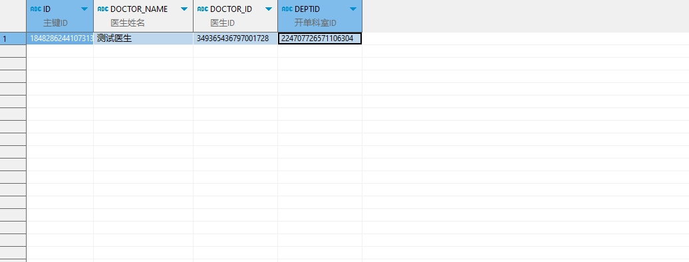

# 领域服务/临床领域 - 保存门诊处方 - 保存门诊处方 正向用例
## 请求参数：
``` json
{
  "hospCode": "NXRY",
  "orgCode": "NXRMYY",
  "list": [
    {
      "sourceId": "31b3e0",
      "deptName": "呼吸内科(门)",
      "createUserId": "349365436797001728",
      "patientId": "93587a7c8028404c85b09f8bc9803a7c",
      "execDeptId": "224718893381218304",
      "prescLists": [
        {
          "unitRate": 1,
          "memo5": "31b3e0",
          "price": 36.5,
          "orderItemName": "碳酸钙D3片(II)",
          "id": "1848286381323968513",
          "preInHospitalBit": "0",
          "printTimes": "0",
          "dosage": 1,
          "actualPrice": 36.5,
          "reDelete": "N",
          "unitId": "20200408030204878",
          "prescDate": "2024-10-21 16:53:03",
          "createDate": "2024-10-21 16:53:07",
          "orderName": "碳酸钙D3片(II)",
          "skinTestResult": "-1",
          "usageId": "576",
          "hospCode": "NXRY",
          "dosageUnitId": "20200408030206175",
          "orderItemId": "20200408030302211",
          "dosageUnitType": "1",
          "auditStatus": 0,
          "days": 1,
          "sourceId": "31b3e0",
          "createUserId": "349365436797001728",
          "orderTypeCode": "1",
          "groupId": "1000",
          "num": 2,
          "spec": "36片/瓶",
          "frequencyId": "897520b5db1f42a8aad70f41fab03b3a",
          "bagNum": 1,
          "specId": "20200408030302194",
          "rescueFlag": "0",
          "unitName": "瓶",
          "groupSortNo": "1",
          "prescId": "1848286244107313153",
          "bmove": "0",
          "circulationAuditStatus": "0",
          "frequencyName": "Bid",
          "execStatus": "0",
          "orgCode": "NXRMYY",
          "orginalPrice": 36.5,
          "prescChargeLists": [
            {
              "deptName": "呼吸内科(门)",
              "createUserId": "1",
              "patientId": "93587a7c8028404c85b09f8bc9803a7c",
              "groupId": "1000",
              "num": 2,
              "unitRate": 1,
              "execDeptId": "224718893381218304",
              "priceItemName": "碳酸钙D3片(II)",
              "spec": "36片/瓶",
              "frequencyId": "897520b5db1f42a8aad70f41fab03b3a",
              "materCode": "1",
              "visitId": "1848171145803902977",
              "price": 36.5,
              "complexFlag": "0",
              "primaryDiagNames": "反",
              "bagNum": 1,
              "outBillStatName": "西药费",
              "unitName": "瓶",
              "groupSortNo": "1",
              "execDeptName": "中药房",
              "deptId": "224707726571106304",
              "totalMoney": 36.5,
              "prescId": "1848286244107313153",
              "skinTestPrescFlag": "0",
              "frequencyName": "Bid",
              "visitNo": "2024102100002",
              "dosage": 1,
              "itemType": "1",
              "outBillStatCode": "01",
              "prescSource": "1",
              "prescListId": "1848286381323968513",
              "doctorName": "测试医生",
              "statItemCode": "01",
              "doctorId": "349365436797001728",
              "orgCode": "NXRMYY",
              "priceItemId": "20200408030302211",
              "orginalPrice": 36.5,
              "unitId": "20200408030204878",
              "prescWay": "1",
              "prescDate": "2024-10-21 16:53:03",
              "createDate": "2024-10-21 16:53:07",
              "dosageUnitName": "片",
              "orderName": "碳酸钙D3片(II)",
              "primaryDiagIds": "1848186862045540354",
              "usageId": "576",
              "hospCode": "NXRY",
              "isDelete": "N",
              "orderItemId": "20200408030302211",
              "prescType": "1",
              "discountMoney": 0,
              "execNum": 2,
              "usageName": "涂口",
              "days": 1,
              "statItemName": "西药费"
            }
          ],
          "groupNo": 1,
          "dosageUnitName": "片",
          "factory": "北京振东康远制药有限公司",
          "isDelete": "N",
          "usageName": "涂口",
          "money": 73,
          "refundFlag": "0",
          "drugAuditStatus": "0"
        }
      ],
      "balanceType": 0,
      "visitId": "1848171145803902977",
      "factorName": "",
      "isCirculation": "0",
      "patientIdCard": "",
      "id": "1848286244107313153",
      "primaryDiagNames": "反",
      "execDeptName": "中药房",
      "deptId": "224707726571106304",
      "skinTestPrescFlag": "0",
      "checkFlag": "0",
      "name": "与",
      "visitNo": "2024102100002",
      "chargeFlag": "0",
      "saveState": "0",
      "prescSource": "1",
      "factorIdCard": "",
      "factorContact": "",
      "doctorName": "测试医生",
      "prescSubType": "0",
      "doctorId": "349365436797001728",
      "orgCode": "NXRMYY",
      "expireDate": "2025-01-21 16:53:07",
      "prescWay": "1",
      "prescDate": "2024-10-21 16:53:03",
      "createDate": "2024-10-21 16:53:07",
      "primaryDiagIds": "1848186862045540354",
      "dispenseStatus": "0",
      "hospCode": "NXRY",
      "isDelete": "N",
      "sex": "2",
      "prescType": "1",
      "money": 73,
      "cipherPrescFlag": "0",
      "age": "24岁"
    }
  ],
  "operatorId": "349365436797001728",
  "operatorName": "测试医生"
}
```
## 返回参数：
``` json
{
  "exception": null,
  "apiCode": null,
  "data": {
    "list": [
      {
        "id": "1848286244107313153",
        "sourceId": "31b3e0",
        "prescLists": [
          {
            "id": "1848286381323968513",
            "sourceId": "31b3e0",
            "medTechRequestId": null
          }
        ]
      }
    ],
    "errors": null
  },
  "Code": 200,
  "Message": "操作成功"
}
```
## 数据校验：


# 领域服务/临床领域 - 保存门诊处方 - 必填校验-[orgCode]为空
## 请求参数：
``` json
{
  "hospCode": "NXRY",
  "orgCode": "",
  "list": [
    {
      "sourceId": "31b3e0",
      "deptName": "呼吸内科(门)",
      "createUserId": "349365436797001728",
      "patientId": "93587a7c8028404c85b09f8bc9803a7c",
      "execDeptId": "224718893381218304",
      "prescLists": [
        {
          "unitRate": 1,
          "memo5": "31b3e0",
          "price": 36.5,
          "orderItemName": "碳酸钙D3片(II)",
          "id": "1848286381323968513",
          "preInHospitalBit": "0",
          "printTimes": "0",
          "dosage": 1,
          "actualPrice": 36.5,
          "reDelete": "N",
          "unitId": "20200408030204878",
          "prescDate": "2024-10-21 16:53:03",
          "createDate": "2024-10-21 16:53:07",
          "orderName": "碳酸钙D3片(II)",
          "skinTestResult": "-1",
          "usageId": "576",
          "hospCode": "NXRY",
          "dosageUnitId": "20200408030206175",
          "orderItemId": "20200408030302211",
          "dosageUnitType": "1",
          "auditStatus": 0,
          "days": 1,
          "sourceId": "31b3e0",
          "createUserId": "349365436797001728",
          "orderTypeCode": "1",
          "groupId": "1000",
          "num": 2,
          "spec": "36片/瓶",
          "frequencyId": "897520b5db1f42a8aad70f41fab03b3a",
          "bagNum": 1,
          "specId": "20200408030302194",
          "rescueFlag": "0",
          "unitName": "瓶",
          "groupSortNo": "1",
          "prescId": "1848286244107313153",
          "bmove": "0",
          "circulationAuditStatus": "0",
          "frequencyName": "Bid",
          "execStatus": "0",
          "orgCode": "NXRMYY",
          "orginalPrice": 36.5,
          "prescChargeLists": [
            {
              "deptName": "呼吸内科(门)",
              "createUserId": "1",
              "patientId": "93587a7c8028404c85b09f8bc9803a7c",
              "groupId": "1000",
              "num": 2,
              "unitRate": 1,
              "execDeptId": "224718893381218304",
              "priceItemName": "碳酸钙D3片(II)",
              "spec": "36片/瓶",
              "frequencyId": "897520b5db1f42a8aad70f41fab03b3a",
              "materCode": "1",
              "visitId": "1848171145803902977",
              "price": 36.5,
              "complexFlag": "0",
              "primaryDiagNames": "反",
              "bagNum": 1,
              "outBillStatName": "西药费",
              "unitName": "瓶",
              "groupSortNo": "1",
              "execDeptName": "中药房",
              "deptId": "224707726571106304",
              "totalMoney": 36.5,
              "prescId": "1848286244107313153",
              "skinTestPrescFlag": "0",
              "frequencyName": "Bid",
              "visitNo": "2024102100002",
              "dosage": 1,
              "itemType": "1",
              "outBillStatCode": "01",
              "prescSource": "1",
              "prescListId": "1848286381323968513",
              "doctorName": "测试医生",
              "statItemCode": "01",
              "doctorId": "349365436797001728",
              "orgCode": "NXRMYY",
              "priceItemId": "20200408030302211",
              "orginalPrice": 36.5,
              "unitId": "20200408030204878",
              "prescWay": "1",
              "prescDate": "2024-10-21 16:53:03",
              "createDate": "2024-10-21 16:53:07",
              "dosageUnitName": "片",
              "orderName": "碳酸钙D3片(II)",
              "primaryDiagIds": "1848186862045540354",
              "usageId": "576",
              "hospCode": "NXRY",
              "isDelete": "N",
              "orderItemId": "20200408030302211",
              "prescType": "1",
              "discountMoney": 0,
              "execNum": 2,
              "usageName": "涂口",
              "days": 1,
              "statItemName": "西药费"
            }
          ],
          "groupNo": 1,
          "dosageUnitName": "片",
          "factory": "北京振东康远制药有限公司",
          "isDelete": "N",
          "usageName": "涂口",
          "money": 73,
          "refundFlag": "0",
          "drugAuditStatus": "0"
        }
      ],
      "balanceType": 0,
      "visitId": "1848171145803902977",
      "factorName": "",
      "isCirculation": "0",
      "patientIdCard": "",
      "id": "1848286244107313153",
      "primaryDiagNames": "反",
      "execDeptName": "中药房",
      "deptId": "224707726571106304",
      "skinTestPrescFlag": "0",
      "checkFlag": "0",
      "name": "与",
      "visitNo": "2024102100002",
      "chargeFlag": "0",
      "saveState": "0",
      "prescSource": "1",
      "factorIdCard": "",
      "factorContact": "",
      "doctorName": "测试医生",
      "prescSubType": "0",
      "doctorId": "349365436797001728",
      "orgCode": "NXRMYY",
      "expireDate": "2025-01-21 16:53:07",
      "prescWay": "1",
      "prescDate": "2024-10-21 16:53:03",
      "createDate": "2024-10-21 16:53:07",
      "primaryDiagIds": "1848186862045540354",
      "dispenseStatus": "0",
      "hospCode": "NXRY",
      "isDelete": "N",
      "sex": "2",
      "prescType": "1",
      "money": 73,
      "cipherPrescFlag": "0",
      "age": "24岁"
    }
  ],
  "operatorId": "349365436797001728",
  "operatorName": "测试医生"
}
```
## 返回参数：
``` json
{
  "exception": null,
  "apiCode": null,
  "data": null,
  "Code": 1,
  "Message": "医院编码不能为空"
}
```
# 领域服务/临床领域 - 保存门诊处方 - 必填校验-[hospCode]为空
## 请求参数：
``` json
{
  "hospCode": "",
  "orgCode": "NXRMYY",
  "list": [
    {
      "sourceId": "31b3e0",
      "deptName": "呼吸内科(门)",
      "createUserId": "349365436797001728",
      "patientId": "93587a7c8028404c85b09f8bc9803a7c",
      "execDeptId": "224718893381218304",
      "prescLists": [
        {
          "unitRate": 1,
          "memo5": "31b3e0",
          "price": 36.5,
          "orderItemName": "碳酸钙D3片(II)",
          "id": "1848286381323968513",
          "preInHospitalBit": "0",
          "printTimes": "0",
          "dosage": 1,
          "actualPrice": 36.5,
          "reDelete": "N",
          "unitId": "20200408030204878",
          "prescDate": "2024-10-21 16:53:03",
          "createDate": "2024-10-21 16:53:07",
          "orderName": "碳酸钙D3片(II)",
          "skinTestResult": "-1",
          "usageId": "576",
          "hospCode": "NXRY",
          "dosageUnitId": "20200408030206175",
          "orderItemId": "20200408030302211",
          "dosageUnitType": "1",
          "auditStatus": 0,
          "days": 1,
          "sourceId": "31b3e0",
          "createUserId": "349365436797001728",
          "orderTypeCode": "1",
          "groupId": "1000",
          "num": 2,
          "spec": "36片/瓶",
          "frequencyId": "897520b5db1f42a8aad70f41fab03b3a",
          "bagNum": 1,
          "specId": "20200408030302194",
          "rescueFlag": "0",
          "unitName": "瓶",
          "groupSortNo": "1",
          "prescId": "1848286244107313153",
          "bmove": "0",
          "circulationAuditStatus": "0",
          "frequencyName": "Bid",
          "execStatus": "0",
          "orgCode": "NXRMYY",
          "orginalPrice": 36.5,
          "prescChargeLists": [
            {
              "deptName": "呼吸内科(门)",
              "createUserId": "1",
              "patientId": "93587a7c8028404c85b09f8bc9803a7c",
              "groupId": "1000",
              "num": 2,
              "unitRate": 1,
              "execDeptId": "224718893381218304",
              "priceItemName": "碳酸钙D3片(II)",
              "spec": "36片/瓶",
              "frequencyId": "897520b5db1f42a8aad70f41fab03b3a",
              "materCode": "1",
              "visitId": "1848171145803902977",
              "price": 36.5,
              "complexFlag": "0",
              "primaryDiagNames": "反",
              "bagNum": 1,
              "outBillStatName": "西药费",
              "unitName": "瓶",
              "groupSortNo": "1",
              "execDeptName": "中药房",
              "deptId": "224707726571106304",
              "totalMoney": 36.5,
              "prescId": "1848286244107313153",
              "skinTestPrescFlag": "0",
              "frequencyName": "Bid",
              "visitNo": "2024102100002",
              "dosage": 1,
              "itemType": "1",
              "outBillStatCode": "01",
              "prescSource": "1",
              "prescListId": "1848286381323968513",
              "doctorName": "测试医生",
              "statItemCode": "01",
              "doctorId": "349365436797001728",
              "orgCode": "NXRMYY",
              "priceItemId": "20200408030302211",
              "orginalPrice": 36.5,
              "unitId": "20200408030204878",
              "prescWay": "1",
              "prescDate": "2024-10-21 16:53:03",
              "createDate": "2024-10-21 16:53:07",
              "dosageUnitName": "片",
              "orderName": "碳酸钙D3片(II)",
              "primaryDiagIds": "1848186862045540354",
              "usageId": "576",
              "hospCode": "NXRY",
              "isDelete": "N",
              "orderItemId": "20200408030302211",
              "prescType": "1",
              "discountMoney": 0,
              "execNum": 2,
              "usageName": "涂口",
              "days": 1,
              "statItemName": "西药费"
            }
          ],
          "groupNo": 1,
          "dosageUnitName": "片",
          "factory": "北京振东康远制药有限公司",
          "isDelete": "N",
          "usageName": "涂口",
          "money": 73,
          "refundFlag": "0",
          "drugAuditStatus": "0"
        }
      ],
      "balanceType": 0,
      "visitId": "1848171145803902977",
      "factorName": "",
      "isCirculation": "0",
      "patientIdCard": "",
      "id": "1848286244107313153",
      "primaryDiagNames": "反",
      "execDeptName": "中药房",
      "deptId": "224707726571106304",
      "skinTestPrescFlag": "0",
      "checkFlag": "0",
      "name": "与",
      "visitNo": "2024102100002",
      "chargeFlag": "0",
      "saveState": "0",
      "prescSource": "1",
      "factorIdCard": "",
      "factorContact": "",
      "doctorName": "测试医生",
      "prescSubType": "0",
      "doctorId": "349365436797001728",
      "orgCode": "NXRMYY",
      "expireDate": "2025-01-21 16:53:07",
      "prescWay": "1",
      "prescDate": "2024-10-21 16:53:03",
      "createDate": "2024-10-21 16:53:07",
      "primaryDiagIds": "1848186862045540354",
      "dispenseStatus": "0",
      "hospCode": "NXRY",
      "isDelete": "N",
      "sex": "2",
      "prescType": "1",
      "money": 73,
      "cipherPrescFlag": "0",
      "age": "24岁"
    }
  ],
  "operatorId": "349365436797001728",
  "operatorName": "测试医生"
}
```
## 返回参数：
``` json
{
  "exception": null,
  "apiCode": null,
  "data": null,
  "Code": 1,
  "Message": "院区编码不能为空"
}
```
# 领域服务/临床领域 - 保存门诊处方 - 必填校验-[operatorId]为空
## 请求参数：
``` json
{
  "hospCode": "NXRY",
  "orgCode": "NXRMYY",
  "list": [
    {
      "sourceId": "31b3e0",
      "deptName": "呼吸内科(门)",
      "createUserId": "349365436797001728",
      "patientId": "93587a7c8028404c85b09f8bc9803a7c",
      "execDeptId": "224718893381218304",
      "prescLists": [
        {
          "unitRate": 1,
          "memo5": "31b3e0",
          "price": 36.5,
          "orderItemName": "碳酸钙D3片(II)",
          "id": "1848286381323968513",
          "preInHospitalBit": "0",
          "printTimes": "0",
          "dosage": 1,
          "actualPrice": 36.5,
          "reDelete": "N",
          "unitId": "20200408030204878",
          "prescDate": "2024-10-21 16:53:03",
          "createDate": "2024-10-21 16:53:07",
          "orderName": "碳酸钙D3片(II)",
          "skinTestResult": "-1",
          "usageId": "576",
          "hospCode": "NXRY",
          "dosageUnitId": "20200408030206175",
          "orderItemId": "20200408030302211",
          "dosageUnitType": "1",
          "auditStatus": 0,
          "days": 1,
          "sourceId": "31b3e0",
          "createUserId": "349365436797001728",
          "orderTypeCode": "1",
          "groupId": "1000",
          "num": 2,
          "spec": "36片/瓶",
          "frequencyId": "897520b5db1f42a8aad70f41fab03b3a",
          "bagNum": 1,
          "specId": "20200408030302194",
          "rescueFlag": "0",
          "unitName": "瓶",
          "groupSortNo": "1",
          "prescId": "1848286244107313153",
          "bmove": "0",
          "circulationAuditStatus": "0",
          "frequencyName": "Bid",
          "execStatus": "0",
          "orgCode": "NXRMYY",
          "orginalPrice": 36.5,
          "prescChargeLists": [
            {
              "deptName": "呼吸内科(门)",
              "createUserId": "1",
              "patientId": "93587a7c8028404c85b09f8bc9803a7c",
              "groupId": "1000",
              "num": 2,
              "unitRate": 1,
              "execDeptId": "224718893381218304",
              "priceItemName": "碳酸钙D3片(II)",
              "spec": "36片/瓶",
              "frequencyId": "897520b5db1f42a8aad70f41fab03b3a",
              "materCode": "1",
              "visitId": "1848171145803902977",
              "price": 36.5,
              "complexFlag": "0",
              "primaryDiagNames": "反",
              "bagNum": 1,
              "outBillStatName": "西药费",
              "unitName": "瓶",
              "groupSortNo": "1",
              "execDeptName": "中药房",
              "deptId": "224707726571106304",
              "totalMoney": 36.5,
              "prescId": "1848286244107313153",
              "skinTestPrescFlag": "0",
              "frequencyName": "Bid",
              "visitNo": "2024102100002",
              "dosage": 1,
              "itemType": "1",
              "outBillStatCode": "01",
              "prescSource": "1",
              "prescListId": "1848286381323968513",
              "doctorName": "测试医生",
              "statItemCode": "01",
              "doctorId": "349365436797001728",
              "orgCode": "NXRMYY",
              "priceItemId": "20200408030302211",
              "orginalPrice": 36.5,
              "unitId": "20200408030204878",
              "prescWay": "1",
              "prescDate": "2024-10-21 16:53:03",
              "createDate": "2024-10-21 16:53:07",
              "dosageUnitName": "片",
              "orderName": "碳酸钙D3片(II)",
              "primaryDiagIds": "1848186862045540354",
              "usageId": "576",
              "hospCode": "NXRY",
              "isDelete": "N",
              "orderItemId": "20200408030302211",
              "prescType": "1",
              "discountMoney": 0,
              "execNum": 2,
              "usageName": "涂口",
              "days": 1,
              "statItemName": "西药费"
            }
          ],
          "groupNo": 1,
          "dosageUnitName": "片",
          "factory": "北京振东康远制药有限公司",
          "isDelete": "N",
          "usageName": "涂口",
          "money": 73,
          "refundFlag": "0",
          "drugAuditStatus": "0"
        }
      ],
      "balanceType": 0,
      "visitId": "1848171145803902977",
      "factorName": "",
      "isCirculation": "0",
      "patientIdCard": "",
      "id": "1848286244107313153",
      "primaryDiagNames": "反",
      "execDeptName": "中药房",
      "deptId": "224707726571106304",
      "skinTestPrescFlag": "0",
      "checkFlag": "0",
      "name": "与",
      "visitNo": "2024102100002",
      "chargeFlag": "0",
      "saveState": "0",
      "prescSource": "1",
      "factorIdCard": "",
      "factorContact": "",
      "doctorName": "测试医生",
      "prescSubType": "0",
      "doctorId": "349365436797001728",
      "orgCode": "NXRMYY",
      "expireDate": "2025-01-21 16:53:07",
      "prescWay": "1",
      "prescDate": "2024-10-21 16:53:03",
      "createDate": "2024-10-21 16:53:07",
      "primaryDiagIds": "1848186862045540354",
      "dispenseStatus": "0",
      "hospCode": "NXRY",
      "isDelete": "N",
      "sex": "2",
      "prescType": "1",
      "money": 73,
      "cipherPrescFlag": "0",
      "age": "24岁"
    }
  ],
  "operatorId": "",
  "operatorName": "测试医生"
}
```
## 返回参数：
``` json
{
  "exception": null,
  "apiCode": null,
  "data": null,
  "Code": 1,
  "Message": "操作人id不能为空"
}
```
# 领域服务/临床领域 - 保存门诊处方 - 必填校验-[operatorName]为空
## 请求参数：
``` json
{
  "hospCode": "NXRY",
  "orgCode": "NXRMYY",
  "list": [
    {
      "sourceId": "31b3e0",
      "deptName": "呼吸内科(门)",
      "createUserId": "349365436797001728",
      "patientId": "93587a7c8028404c85b09f8bc9803a7c",
      "execDeptId": "224718893381218304",
      "prescLists": [
        {
          "unitRate": 1,
          "memo5": "31b3e0",
          "price": 36.5,
          "orderItemName": "碳酸钙D3片(II)",
          "id": "1848286381323968513",
          "preInHospitalBit": "0",
          "printTimes": "0",
          "dosage": 1,
          "actualPrice": 36.5,
          "reDelete": "N",
          "unitId": "20200408030204878",
          "prescDate": "2024-10-21 16:53:03",
          "createDate": "2024-10-21 16:53:07",
          "orderName": "碳酸钙D3片(II)",
          "skinTestResult": "-1",
          "usageId": "576",
          "hospCode": "NXRY",
          "dosageUnitId": "20200408030206175",
          "orderItemId": "20200408030302211",
          "dosageUnitType": "1",
          "auditStatus": 0,
          "days": 1,
          "sourceId": "31b3e0",
          "createUserId": "349365436797001728",
          "orderTypeCode": "1",
          "groupId": "1000",
          "num": 2,
          "spec": "36片/瓶",
          "frequencyId": "897520b5db1f42a8aad70f41fab03b3a",
          "bagNum": 1,
          "specId": "20200408030302194",
          "rescueFlag": "0",
          "unitName": "瓶",
          "groupSortNo": "1",
          "prescId": "1848286244107313153",
          "bmove": "0",
          "circulationAuditStatus": "0",
          "frequencyName": "Bid",
          "execStatus": "0",
          "orgCode": "NXRMYY",
          "orginalPrice": 36.5,
          "prescChargeLists": [
            {
              "deptName": "呼吸内科(门)",
              "createUserId": "1",
              "patientId": "93587a7c8028404c85b09f8bc9803a7c",
              "groupId": "1000",
              "num": 2,
              "unitRate": 1,
              "execDeptId": "224718893381218304",
              "priceItemName": "碳酸钙D3片(II)",
              "spec": "36片/瓶",
              "frequencyId": "897520b5db1f42a8aad70f41fab03b3a",
              "materCode": "1",
              "visitId": "1848171145803902977",
              "price": 36.5,
              "complexFlag": "0",
              "primaryDiagNames": "反",
              "bagNum": 1,
              "outBillStatName": "西药费",
              "unitName": "瓶",
              "groupSortNo": "1",
              "execDeptName": "中药房",
              "deptId": "224707726571106304",
              "totalMoney": 36.5,
              "prescId": "1848286244107313153",
              "skinTestPrescFlag": "0",
              "frequencyName": "Bid",
              "visitNo": "2024102100002",
              "dosage": 1,
              "itemType": "1",
              "outBillStatCode": "01",
              "prescSource": "1",
              "prescListId": "1848286381323968513",
              "doctorName": "测试医生",
              "statItemCode": "01",
              "doctorId": "349365436797001728",
              "orgCode": "NXRMYY",
              "priceItemId": "20200408030302211",
              "orginalPrice": 36.5,
              "unitId": "20200408030204878",
              "prescWay": "1",
              "prescDate": "2024-10-21 16:53:03",
              "createDate": "2024-10-21 16:53:07",
              "dosageUnitName": "片",
              "orderName": "碳酸钙D3片(II)",
              "primaryDiagIds": "1848186862045540354",
              "usageId": "576",
              "hospCode": "NXRY",
              "isDelete": "N",
              "orderItemId": "20200408030302211",
              "prescType": "1",
              "discountMoney": 0,
              "execNum": 2,
              "usageName": "涂口",
              "days": 1,
              "statItemName": "西药费"
            }
          ],
          "groupNo": 1,
          "dosageUnitName": "片",
          "factory": "北京振东康远制药有限公司",
          "isDelete": "N",
          "usageName": "涂口",
          "money": 73,
          "refundFlag": "0",
          "drugAuditStatus": "0"
        }
      ],
      "balanceType": 0,
      "visitId": "1848171145803902977",
      "factorName": "",
      "isCirculation": "0",
      "patientIdCard": "",
      "id": "1848286244107313153",
      "primaryDiagNames": "反",
      "execDeptName": "中药房",
      "deptId": "224707726571106304",
      "skinTestPrescFlag": "0",
      "checkFlag": "0",
      "name": "与",
      "visitNo": "2024102100002",
      "chargeFlag": "0",
      "saveState": "0",
      "prescSource": "1",
      "factorIdCard": "",
      "factorContact": "",
      "doctorName": "测试医生",
      "prescSubType": "0",
      "doctorId": "349365436797001728",
      "orgCode": "NXRMYY",
      "expireDate": "2025-01-21 16:53:07",
      "prescWay": "1",
      "prescDate": "2024-10-21 16:53:03",
      "createDate": "2024-10-21 16:53:07",
      "primaryDiagIds": "1848186862045540354",
      "dispenseStatus": "0",
      "hospCode": "NXRY",
      "isDelete": "N",
      "sex": "2",
      "prescType": "1",
      "money": 73,
      "cipherPrescFlag": "0",
      "age": "24岁"
    }
  ],
  "operatorId": "349365436797001728",
  "operatorName": ""
}
```
## 返回参数：
``` json
{
  "exception": null,
  "apiCode": null,
  "data": null,
  "Code": 1,
  "Message": "操作人姓名不能为空"
}
```
# 领域服务/临床领域 - 保存门诊处方 - 必填校验-[list]为空
## 请求参数：
``` json
{
  "hospCode": "NXRY",
  "orgCode": "NXRMYY",
  "list": null,
  "operatorId": "349365436797001728",
  "operatorName": "测试医生"
}
```
## 返回参数：
``` json
{
  "exception": null,
  "apiCode": null,
  "data": null,
  "Code": 1,
  "Message": "保存对象不能为空"
}
```
# 领域服务/临床领域 - 保存门诊处方 - 必填校验-[list.orgCode]为空
## 请求参数：
``` json
{
  "hospCode": "NXRY",
  "orgCode": "NXRMYY",
  "list": [
    {
      "sourceId": "31b3e0",
      "deptName": "呼吸内科(门)",
      "createUserId": "349365436797001728",
      "patientId": "93587a7c8028404c85b09f8bc9803a7c",
      "execDeptId": "224718893381218304",
      "prescLists": [
        {
          "unitRate": 1,
          "memo5": "31b3e0",
          "price": 36.5,
          "orderItemName": "碳酸钙D3片(II)",
          "id": "1848286381323968513",
          "preInHospitalBit": "0",
          "printTimes": "0",
          "dosage": 1,
          "actualPrice": 36.5,
          "reDelete": "N",
          "unitId": "20200408030204878",
          "prescDate": "2024-10-21 16:53:03",
          "createDate": "2024-10-21 16:53:07",
          "orderName": "碳酸钙D3片(II)",
          "skinTestResult": "-1",
          "usageId": "576",
          "hospCode": "NXRY",
          "dosageUnitId": "20200408030206175",
          "orderItemId": "20200408030302211",
          "dosageUnitType": "1",
          "auditStatus": 0,
          "days": 1,
          "sourceId": "31b3e0",
          "createUserId": "349365436797001728",
          "orderTypeCode": "1",
          "groupId": "1000",
          "num": 2,
          "spec": "36片/瓶",
          "frequencyId": "897520b5db1f42a8aad70f41fab03b3a",
          "bagNum": 1,
          "specId": "20200408030302194",
          "rescueFlag": "0",
          "unitName": "瓶",
          "groupSortNo": "1",
          "prescId": "1848286244107313153",
          "bmove": "0",
          "circulationAuditStatus": "0",
          "frequencyName": "Bid",
          "execStatus": "0",
          "orgCode": "NXRMYY",
          "orginalPrice": 36.5,
          "prescChargeLists": [
            {
              "deptName": "呼吸内科(门)",
              "createUserId": "1",
              "patientId": "93587a7c8028404c85b09f8bc9803a7c",
              "groupId": "1000",
              "num": 2,
              "unitRate": 1,
              "execDeptId": "224718893381218304",
              "priceItemName": "碳酸钙D3片(II)",
              "spec": "36片/瓶",
              "frequencyId": "897520b5db1f42a8aad70f41fab03b3a",
              "materCode": "1",
              "visitId": "1848171145803902977",
              "price": 36.5,
              "complexFlag": "0",
              "primaryDiagNames": "反",
              "bagNum": 1,
              "outBillStatName": "西药费",
              "unitName": "瓶",
              "groupSortNo": "1",
              "execDeptName": "中药房",
              "deptId": "224707726571106304",
              "totalMoney": 36.5,
              "prescId": "1848286244107313153",
              "skinTestPrescFlag": "0",
              "frequencyName": "Bid",
              "visitNo": "2024102100002",
              "dosage": 1,
              "itemType": "1",
              "outBillStatCode": "01",
              "prescSource": "1",
              "prescListId": "1848286381323968513",
              "doctorName": "测试医生",
              "statItemCode": "01",
              "doctorId": "349365436797001728",
              "orgCode": "NXRMYY",
              "priceItemId": "20200408030302211",
              "orginalPrice": 36.5,
              "unitId": "20200408030204878",
              "prescWay": "1",
              "prescDate": "2024-10-21 16:53:03",
              "createDate": "2024-10-21 16:53:07",
              "dosageUnitName": "片",
              "orderName": "碳酸钙D3片(II)",
              "primaryDiagIds": "1848186862045540354",
              "usageId": "576",
              "hospCode": "NXRY",
              "isDelete": "N",
              "orderItemId": "20200408030302211",
              "prescType": "1",
              "discountMoney": 0,
              "execNum": 2,
              "usageName": "涂口",
              "days": 1,
              "statItemName": "西药费"
            }
          ],
          "groupNo": 1,
          "dosageUnitName": "片",
          "factory": "北京振东康远制药有限公司",
          "isDelete": "N",
          "usageName": "涂口",
          "money": 73,
          "refundFlag": "0",
          "drugAuditStatus": "0"
        }
      ],
      "balanceType": 0,
      "visitId": "1848171145803902977",
      "factorName": "",
      "isCirculation": "0",
      "patientIdCard": "",
      "id": "1848286244107313153",
      "primaryDiagNames": "反",
      "execDeptName": "中药房",
      "deptId": "224707726571106304",
      "skinTestPrescFlag": "0",
      "checkFlag": "0",
      "name": "与",
      "visitNo": "2024102100002",
      "chargeFlag": "0",
      "saveState": "0",
      "prescSource": "1",
      "factorIdCard": "",
      "factorContact": "",
      "doctorName": "测试医生",
      "prescSubType": "0",
      "doctorId": "349365436797001728",
      "orgCode": null,
      "expireDate": "2025-01-21 16:53:07",
      "prescWay": "1",
      "prescDate": "2024-10-21 16:53:03",
      "createDate": "2024-10-21 16:53:07",
      "primaryDiagIds": "1848186862045540354",
      "dispenseStatus": "0",
      "hospCode": "NXRY",
      "isDelete": "N",
      "sex": "2",
      "prescType": "1",
      "money": 73,
      "cipherPrescFlag": "0",
      "age": "24岁"
    }
  ],
  "operatorId": "349365436797001728",
  "operatorName": "测试医生"
}
```
## 返回参数：
``` json
{
  "exception": null,
  "apiCode": null,
  "data": null,
  "Code": 1,
  "Message": "医院编码不能为空"
}
```
# 领域服务/临床领域 - 保存门诊处方 - 必填校验-[list.hospCode]为空
## 请求参数：
``` json
{
  "hospCode": "NXRY",
  "orgCode": "NXRMYY",
  "list": [
    {
      "sourceId": "31b3e0",
      "deptName": "呼吸内科(门)",
      "createUserId": "349365436797001728",
      "patientId": "93587a7c8028404c85b09f8bc9803a7c",
      "execDeptId": "224718893381218304",
      "prescLists": [
        {
          "unitRate": 1,
          "memo5": "31b3e0",
          "price": 36.5,
          "orderItemName": "碳酸钙D3片(II)",
          "id": "1848286381323968513",
          "preInHospitalBit": "0",
          "printTimes": "0",
          "dosage": 1,
          "actualPrice": 36.5,
          "reDelete": "N",
          "unitId": "20200408030204878",
          "prescDate": "2024-10-21 16:53:03",
          "createDate": "2024-10-21 16:53:07",
          "orderName": "碳酸钙D3片(II)",
          "skinTestResult": "-1",
          "usageId": "576",
          "hospCode": "NXRY",
          "dosageUnitId": "20200408030206175",
          "orderItemId": "20200408030302211",
          "dosageUnitType": "1",
          "auditStatus": 0,
          "days": 1,
          "sourceId": "31b3e0",
          "createUserId": "349365436797001728",
          "orderTypeCode": "1",
          "groupId": "1000",
          "num": 2,
          "spec": "36片/瓶",
          "frequencyId": "897520b5db1f42a8aad70f41fab03b3a",
          "bagNum": 1,
          "specId": "20200408030302194",
          "rescueFlag": "0",
          "unitName": "瓶",
          "groupSortNo": "1",
          "prescId": "1848286244107313153",
          "bmove": "0",
          "circulationAuditStatus": "0",
          "frequencyName": "Bid",
          "execStatus": "0",
          "orgCode": "NXRMYY",
          "orginalPrice": 36.5,
          "prescChargeLists": [
            {
              "deptName": "呼吸内科(门)",
              "createUserId": "1",
              "patientId": "93587a7c8028404c85b09f8bc9803a7c",
              "groupId": "1000",
              "num": 2,
              "unitRate": 1,
              "execDeptId": "224718893381218304",
              "priceItemName": "碳酸钙D3片(II)",
              "spec": "36片/瓶",
              "frequencyId": "897520b5db1f42a8aad70f41fab03b3a",
              "materCode": "1",
              "visitId": "1848171145803902977",
              "price": 36.5,
              "complexFlag": "0",
              "primaryDiagNames": "反",
              "bagNum": 1,
              "outBillStatName": "西药费",
              "unitName": "瓶",
              "groupSortNo": "1",
              "execDeptName": "中药房",
              "deptId": "224707726571106304",
              "totalMoney": 36.5,
              "prescId": "1848286244107313153",
              "skinTestPrescFlag": "0",
              "frequencyName": "Bid",
              "visitNo": "2024102100002",
              "dosage": 1,
              "itemType": "1",
              "outBillStatCode": "01",
              "prescSource": "1",
              "prescListId": "1848286381323968513",
              "doctorName": "测试医生",
              "statItemCode": "01",
              "doctorId": "349365436797001728",
              "orgCode": "NXRMYY",
              "priceItemId": "20200408030302211",
              "orginalPrice": 36.5,
              "unitId": "20200408030204878",
              "prescWay": "1",
              "prescDate": "2024-10-21 16:53:03",
              "createDate": "2024-10-21 16:53:07",
              "dosageUnitName": "片",
              "orderName": "碳酸钙D3片(II)",
              "primaryDiagIds": "1848186862045540354",
              "usageId": "576",
              "hospCode": "NXRY",
              "isDelete": "N",
              "orderItemId": "20200408030302211",
              "prescType": "1",
              "discountMoney": 0,
              "execNum": 2,
              "usageName": "涂口",
              "days": 1,
              "statItemName": "西药费"
            }
          ],
          "groupNo": 1,
          "dosageUnitName": "片",
          "factory": "北京振东康远制药有限公司",
          "isDelete": "N",
          "usageName": "涂口",
          "money": 73,
          "refundFlag": "0",
          "drugAuditStatus": "0"
        }
      ],
      "balanceType": 0,
      "visitId": "1848171145803902977",
      "factorName": "",
      "isCirculation": "0",
      "patientIdCard": "",
      "id": "1848286244107313153",
      "primaryDiagNames": "反",
      "execDeptName": "中药房",
      "deptId": "224707726571106304",
      "skinTestPrescFlag": "0",
      "checkFlag": "0",
      "name": "与",
      "visitNo": "2024102100002",
      "chargeFlag": "0",
      "saveState": "0",
      "prescSource": "1",
      "factorIdCard": "",
      "factorContact": "",
      "doctorName": "测试医生",
      "prescSubType": "0",
      "doctorId": "349365436797001728",
      "orgCode": "NXRMYY",
      "expireDate": "2025-01-21 16:53:07",
      "prescWay": "1",
      "prescDate": "2024-10-21 16:53:03",
      "createDate": "2024-10-21 16:53:07",
      "primaryDiagIds": "1848186862045540354",
      "dispenseStatus": "0",
      "hospCode": null,
      "isDelete": "N",
      "sex": "2",
      "prescType": "1",
      "money": 73,
      "cipherPrescFlag": "0",
      "age": "24岁"
    }
  ],
  "operatorId": "349365436797001728",
  "operatorName": "测试医生"
}
```
## 返回参数：
``` json
{
  "exception": null,
  "apiCode": null,
  "data": null,
  "Code": 1,
  "Message": "院区编码不能为空"
}
```
# 领域服务/临床领域 - 保存门诊处方 - 必填校验-[list.createUserId]为空
## 请求参数：
``` json
{
  "hospCode": "NXRY",
  "orgCode": "NXRMYY",
  "list": [
    {
      "sourceId": "31b3e0",
      "deptName": "呼吸内科(门)",
      "createUserId": null,
      "patientId": "93587a7c8028404c85b09f8bc9803a7c",
      "execDeptId": "224718893381218304",
      "prescLists": [
        {
          "unitRate": 1,
          "memo5": "31b3e0",
          "price": 36.5,
          "orderItemName": "碳酸钙D3片(II)",
          "id": "1848286381323968513",
          "preInHospitalBit": "0",
          "printTimes": "0",
          "dosage": 1,
          "actualPrice": 36.5,
          "reDelete": "N",
          "unitId": "20200408030204878",
          "prescDate": "2024-10-21 16:53:03",
          "createDate": "2024-10-21 16:53:07",
          "orderName": "碳酸钙D3片(II)",
          "skinTestResult": "-1",
          "usageId": "576",
          "hospCode": "NXRY",
          "dosageUnitId": "20200408030206175",
          "orderItemId": "20200408030302211",
          "dosageUnitType": "1",
          "auditStatus": 0,
          "days": 1,
          "sourceId": "31b3e0",
          "createUserId": "349365436797001728",
          "orderTypeCode": "1",
          "groupId": "1000",
          "num": 2,
          "spec": "36片/瓶",
          "frequencyId": "897520b5db1f42a8aad70f41fab03b3a",
          "bagNum": 1,
          "specId": "20200408030302194",
          "rescueFlag": "0",
          "unitName": "瓶",
          "groupSortNo": "1",
          "prescId": "1848286244107313153",
          "bmove": "0",
          "circulationAuditStatus": "0",
          "frequencyName": "Bid",
          "execStatus": "0",
          "orgCode": "NXRMYY",
          "orginalPrice": 36.5,
          "prescChargeLists": [
            {
              "deptName": "呼吸内科(门)",
              "createUserId": "1",
              "patientId": "93587a7c8028404c85b09f8bc9803a7c",
              "groupId": "1000",
              "num": 2,
              "unitRate": 1,
              "execDeptId": "224718893381218304",
              "priceItemName": "碳酸钙D3片(II)",
              "spec": "36片/瓶",
              "frequencyId": "897520b5db1f42a8aad70f41fab03b3a",
              "materCode": "1",
              "visitId": "1848171145803902977",
              "price": 36.5,
              "complexFlag": "0",
              "primaryDiagNames": "反",
              "bagNum": 1,
              "outBillStatName": "西药费",
              "unitName": "瓶",
              "groupSortNo": "1",
              "execDeptName": "中药房",
              "deptId": "224707726571106304",
              "totalMoney": 36.5,
              "prescId": "1848286244107313153",
              "skinTestPrescFlag": "0",
              "frequencyName": "Bid",
              "visitNo": "2024102100002",
              "dosage": 1,
              "itemType": "1",
              "outBillStatCode": "01",
              "prescSource": "1",
              "prescListId": "1848286381323968513",
              "doctorName": "测试医生",
              "statItemCode": "01",
              "doctorId": "349365436797001728",
              "orgCode": "NXRMYY",
              "priceItemId": "20200408030302211",
              "orginalPrice": 36.5,
              "unitId": "20200408030204878",
              "prescWay": "1",
              "prescDate": "2024-10-21 16:53:03",
              "createDate": "2024-10-21 16:53:07",
              "dosageUnitName": "片",
              "orderName": "碳酸钙D3片(II)",
              "primaryDiagIds": "1848186862045540354",
              "usageId": "576",
              "hospCode": "NXRY",
              "isDelete": "N",
              "orderItemId": "20200408030302211",
              "prescType": "1",
              "discountMoney": 0,
              "execNum": 2,
              "usageName": "涂口",
              "days": 1,
              "statItemName": "西药费"
            }
          ],
          "groupNo": 1,
          "dosageUnitName": "片",
          "factory": "北京振东康远制药有限公司",
          "isDelete": "N",
          "usageName": "涂口",
          "money": 73,
          "refundFlag": "0",
          "drugAuditStatus": "0"
        }
      ],
      "balanceType": 0,
      "visitId": "1848171145803902977",
      "factorName": "",
      "isCirculation": "0",
      "patientIdCard": "",
      "id": "1848286244107313153",
      "primaryDiagNames": "反",
      "execDeptName": "中药房",
      "deptId": "224707726571106304",
      "skinTestPrescFlag": "0",
      "checkFlag": "0",
      "name": "与",
      "visitNo": "2024102100002",
      "chargeFlag": "0",
      "saveState": "0",
      "prescSource": "1",
      "factorIdCard": "",
      "factorContact": "",
      "doctorName": "测试医生",
      "prescSubType": "0",
      "doctorId": "349365436797001728",
      "orgCode": "NXRMYY",
      "expireDate": "2025-01-21 16:53:07",
      "prescWay": "1",
      "prescDate": "2024-10-21 16:53:03",
      "createDate": "2024-10-21 16:53:07",
      "primaryDiagIds": "1848186862045540354",
      "dispenseStatus": "0",
      "hospCode": "NXRY",
      "isDelete": "N",
      "sex": "2",
      "prescType": "1",
      "money": 73,
      "cipherPrescFlag": "0",
      "age": "24岁"
    }
  ],
  "operatorId": "349365436797001728",
  "operatorName": "测试医生"
}
```
## 返回参数：
``` json
{
  "exception": null,
  "apiCode": null,
  "data": null,
  "Code": 1,
  "Message": "创建人id不能为空"
}
```
# 领域服务/临床领域 - 保存门诊处方 - 必填校验-[list.createDate]为空
## 请求参数：
``` json
{
  "hospCode": "NXRY",
  "orgCode": "NXRMYY",
  "list": [
    {
      "sourceId": "31b3e0",
      "deptName": "呼吸内科(门)",
      "createUserId": "349365436797001728",
      "patientId": "93587a7c8028404c85b09f8bc9803a7c",
      "execDeptId": "224718893381218304",
      "prescLists": [
        {
          "unitRate": 1,
          "memo5": "31b3e0",
          "price": 36.5,
          "orderItemName": "碳酸钙D3片(II)",
          "id": "1848286381323968513",
          "preInHospitalBit": "0",
          "printTimes": "0",
          "dosage": 1,
          "actualPrice": 36.5,
          "reDelete": "N",
          "unitId": "20200408030204878",
          "prescDate": "2024-10-21 16:53:03",
          "createDate": "2024-10-21 16:53:07",
          "orderName": "碳酸钙D3片(II)",
          "skinTestResult": "-1",
          "usageId": "576",
          "hospCode": "NXRY",
          "dosageUnitId": "20200408030206175",
          "orderItemId": "20200408030302211",
          "dosageUnitType": "1",
          "auditStatus": 0,
          "days": 1,
          "sourceId": "31b3e0",
          "createUserId": "349365436797001728",
          "orderTypeCode": "1",
          "groupId": "1000",
          "num": 2,
          "spec": "36片/瓶",
          "frequencyId": "897520b5db1f42a8aad70f41fab03b3a",
          "bagNum": 1,
          "specId": "20200408030302194",
          "rescueFlag": "0",
          "unitName": "瓶",
          "groupSortNo": "1",
          "prescId": "1848286244107313153",
          "bmove": "0",
          "circulationAuditStatus": "0",
          "frequencyName": "Bid",
          "execStatus": "0",
          "orgCode": "NXRMYY",
          "orginalPrice": 36.5,
          "prescChargeLists": [
            {
              "deptName": "呼吸内科(门)",
              "createUserId": "1",
              "patientId": "93587a7c8028404c85b09f8bc9803a7c",
              "groupId": "1000",
              "num": 2,
              "unitRate": 1,
              "execDeptId": "224718893381218304",
              "priceItemName": "碳酸钙D3片(II)",
              "spec": "36片/瓶",
              "frequencyId": "897520b5db1f42a8aad70f41fab03b3a",
              "materCode": "1",
              "visitId": "1848171145803902977",
              "price": 36.5,
              "complexFlag": "0",
              "primaryDiagNames": "反",
              "bagNum": 1,
              "outBillStatName": "西药费",
              "unitName": "瓶",
              "groupSortNo": "1",
              "execDeptName": "中药房",
              "deptId": "224707726571106304",
              "totalMoney": 36.5,
              "prescId": "1848286244107313153",
              "skinTestPrescFlag": "0",
              "frequencyName": "Bid",
              "visitNo": "2024102100002",
              "dosage": 1,
              "itemType": "1",
              "outBillStatCode": "01",
              "prescSource": "1",
              "prescListId": "1848286381323968513",
              "doctorName": "测试医生",
              "statItemCode": "01",
              "doctorId": "349365436797001728",
              "orgCode": "NXRMYY",
              "priceItemId": "20200408030302211",
              "orginalPrice": 36.5,
              "unitId": "20200408030204878",
              "prescWay": "1",
              "prescDate": "2024-10-21 16:53:03",
              "createDate": "2024-10-21 16:53:07",
              "dosageUnitName": "片",
              "orderName": "碳酸钙D3片(II)",
              "primaryDiagIds": "1848186862045540354",
              "usageId": "576",
              "hospCode": "NXRY",
              "isDelete": "N",
              "orderItemId": "20200408030302211",
              "prescType": "1",
              "discountMoney": 0,
              "execNum": 2,
              "usageName": "涂口",
              "days": 1,
              "statItemName": "西药费"
            }
          ],
          "groupNo": 1,
          "dosageUnitName": "片",
          "factory": "北京振东康远制药有限公司",
          "isDelete": "N",
          "usageName": "涂口",
          "money": 73,
          "refundFlag": "0",
          "drugAuditStatus": "0"
        }
      ],
      "balanceType": 0,
      "visitId": "1848171145803902977",
      "factorName": "",
      "isCirculation": "0",
      "patientIdCard": "",
      "id": "1848286244107313153",
      "primaryDiagNames": "反",
      "execDeptName": "中药房",
      "deptId": "224707726571106304",
      "skinTestPrescFlag": "0",
      "checkFlag": "0",
      "name": "与",
      "visitNo": "2024102100002",
      "chargeFlag": "0",
      "saveState": "0",
      "prescSource": "1",
      "factorIdCard": "",
      "factorContact": "",
      "doctorName": "测试医生",
      "prescSubType": "0",
      "doctorId": "349365436797001728",
      "orgCode": "NXRMYY",
      "expireDate": "2025-01-21 16:53:07",
      "prescWay": "1",
      "prescDate": "2024-10-21 16:53:03",
      "createDate": null,
      "primaryDiagIds": "1848186862045540354",
      "dispenseStatus": "0",
      "hospCode": "NXRY",
      "isDelete": "N",
      "sex": "2",
      "prescType": "1",
      "money": 73,
      "cipherPrescFlag": "0",
      "age": "24岁"
    }
  ],
  "operatorId": "349365436797001728",
  "operatorName": "测试医生"
}
```
## 返回参数：
``` json
{
  "exception": null,
  "apiCode": null,
  "data": null,
  "Code": 1,
  "Message": "创建时间不能为空"
}
```
# 领域服务/临床领域 - 保存门诊处方 - 必填校验-[list.isDelete]为空
## 请求参数：
``` json
{
  "hospCode": "NXRY",
  "orgCode": "NXRMYY",
  "list": [
    {
      "sourceId": "31b3e0",
      "deptName": "呼吸内科(门)",
      "createUserId": "349365436797001728",
      "patientId": "93587a7c8028404c85b09f8bc9803a7c",
      "execDeptId": "224718893381218304",
      "prescLists": [
        {
          "unitRate": 1,
          "memo5": "31b3e0",
          "price": 36.5,
          "orderItemName": "碳酸钙D3片(II)",
          "id": "1848286381323968513",
          "preInHospitalBit": "0",
          "printTimes": "0",
          "dosage": 1,
          "actualPrice": 36.5,
          "reDelete": "N",
          "unitId": "20200408030204878",
          "prescDate": "2024-10-21 16:53:03",
          "createDate": "2024-10-21 16:53:07",
          "orderName": "碳酸钙D3片(II)",
          "skinTestResult": "-1",
          "usageId": "576",
          "hospCode": "NXRY",
          "dosageUnitId": "20200408030206175",
          "orderItemId": "20200408030302211",
          "dosageUnitType": "1",
          "auditStatus": 0,
          "days": 1,
          "sourceId": "31b3e0",
          "createUserId": "349365436797001728",
          "orderTypeCode": "1",
          "groupId": "1000",
          "num": 2,
          "spec": "36片/瓶",
          "frequencyId": "897520b5db1f42a8aad70f41fab03b3a",
          "bagNum": 1,
          "specId": "20200408030302194",
          "rescueFlag": "0",
          "unitName": "瓶",
          "groupSortNo": "1",
          "prescId": "1848286244107313153",
          "bmove": "0",
          "circulationAuditStatus": "0",
          "frequencyName": "Bid",
          "execStatus": "0",
          "orgCode": "NXRMYY",
          "orginalPrice": 36.5,
          "prescChargeLists": [
            {
              "deptName": "呼吸内科(门)",
              "createUserId": "1",
              "patientId": "93587a7c8028404c85b09f8bc9803a7c",
              "groupId": "1000",
              "num": 2,
              "unitRate": 1,
              "execDeptId": "224718893381218304",
              "priceItemName": "碳酸钙D3片(II)",
              "spec": "36片/瓶",
              "frequencyId": "897520b5db1f42a8aad70f41fab03b3a",
              "materCode": "1",
              "visitId": "1848171145803902977",
              "price": 36.5,
              "complexFlag": "0",
              "primaryDiagNames": "反",
              "bagNum": 1,
              "outBillStatName": "西药费",
              "unitName": "瓶",
              "groupSortNo": "1",
              "execDeptName": "中药房",
              "deptId": "224707726571106304",
              "totalMoney": 36.5,
              "prescId": "1848286244107313153",
              "skinTestPrescFlag": "0",
              "frequencyName": "Bid",
              "visitNo": "2024102100002",
              "dosage": 1,
              "itemType": "1",
              "outBillStatCode": "01",
              "prescSource": "1",
              "prescListId": "1848286381323968513",
              "doctorName": "测试医生",
              "statItemCode": "01",
              "doctorId": "349365436797001728",
              "orgCode": "NXRMYY",
              "priceItemId": "20200408030302211",
              "orginalPrice": 36.5,
              "unitId": "20200408030204878",
              "prescWay": "1",
              "prescDate": "2024-10-21 16:53:03",
              "createDate": "2024-10-21 16:53:07",
              "dosageUnitName": "片",
              "orderName": "碳酸钙D3片(II)",
              "primaryDiagIds": "1848186862045540354",
              "usageId": "576",
              "hospCode": "NXRY",
              "isDelete": "N",
              "orderItemId": "20200408030302211",
              "prescType": "1",
              "discountMoney": 0,
              "execNum": 2,
              "usageName": "涂口",
              "days": 1,
              "statItemName": "西药费"
            }
          ],
          "groupNo": 1,
          "dosageUnitName": "片",
          "factory": "北京振东康远制药有限公司",
          "isDelete": "N",
          "usageName": "涂口",
          "money": 73,
          "refundFlag": "0",
          "drugAuditStatus": "0"
        }
      ],
      "balanceType": 0,
      "visitId": "1848171145803902977",
      "factorName": "",
      "isCirculation": "0",
      "patientIdCard": "",
      "id": "1848286244107313153",
      "primaryDiagNames": "反",
      "execDeptName": "中药房",
      "deptId": "224707726571106304",
      "skinTestPrescFlag": "0",
      "checkFlag": "0",
      "name": "与",
      "visitNo": "2024102100002",
      "chargeFlag": "0",
      "saveState": "0",
      "prescSource": "1",
      "factorIdCard": "",
      "factorContact": "",
      "doctorName": "测试医生",
      "prescSubType": "0",
      "doctorId": "349365436797001728",
      "orgCode": "NXRMYY",
      "expireDate": "2025-01-21 16:53:07",
      "prescWay": "1",
      "prescDate": "2024-10-21 16:53:03",
      "createDate": "2024-10-21 16:53:07",
      "primaryDiagIds": "1848186862045540354",
      "dispenseStatus": "0",
      "hospCode": "NXRY",
      "isDelete": null,
      "sex": "2",
      "prescType": "1",
      "money": 73,
      "cipherPrescFlag": "0",
      "age": "24岁"
    }
  ],
  "operatorId": "349365436797001728",
  "operatorName": "测试医生"
}
```
## 返回参数：
``` json
{
  "exception": null,
  "apiCode": null,
  "data": null,
  "Code": 1,
  "Message": "删除标志不能为空"
}
```
# 领域服务/临床领域 - 保存门诊处方 - 必填校验-[list.prescType]为空
## 请求参数：
``` json
{
  "hospCode": "NXRY",
  "orgCode": "NXRMYY",
  "list": [
    {
      "sourceId": "31b3e0",
      "deptName": "呼吸内科(门)",
      "createUserId": "349365436797001728",
      "patientId": "93587a7c8028404c85b09f8bc9803a7c",
      "execDeptId": "224718893381218304",
      "prescLists": [
        {
          "unitRate": 1,
          "memo5": "31b3e0",
          "price": 36.5,
          "orderItemName": "碳酸钙D3片(II)",
          "id": "1848286381323968513",
          "preInHospitalBit": "0",
          "printTimes": "0",
          "dosage": 1,
          "actualPrice": 36.5,
          "reDelete": "N",
          "unitId": "20200408030204878",
          "prescDate": "2024-10-21 16:53:03",
          "createDate": "2024-10-21 16:53:07",
          "orderName": "碳酸钙D3片(II)",
          "skinTestResult": "-1",
          "usageId": "576",
          "hospCode": "NXRY",
          "dosageUnitId": "20200408030206175",
          "orderItemId": "20200408030302211",
          "dosageUnitType": "1",
          "auditStatus": 0,
          "days": 1,
          "sourceId": "31b3e0",
          "createUserId": "349365436797001728",
          "orderTypeCode": "1",
          "groupId": "1000",
          "num": 2,
          "spec": "36片/瓶",
          "frequencyId": "897520b5db1f42a8aad70f41fab03b3a",
          "bagNum": 1,
          "specId": "20200408030302194",
          "rescueFlag": "0",
          "unitName": "瓶",
          "groupSortNo": "1",
          "prescId": "1848286244107313153",
          "bmove": "0",
          "circulationAuditStatus": "0",
          "frequencyName": "Bid",
          "execStatus": "0",
          "orgCode": "NXRMYY",
          "orginalPrice": 36.5,
          "prescChargeLists": [
            {
              "deptName": "呼吸内科(门)",
              "createUserId": "1",
              "patientId": "93587a7c8028404c85b09f8bc9803a7c",
              "groupId": "1000",
              "num": 2,
              "unitRate": 1,
              "execDeptId": "224718893381218304",
              "priceItemName": "碳酸钙D3片(II)",
              "spec": "36片/瓶",
              "frequencyId": "897520b5db1f42a8aad70f41fab03b3a",
              "materCode": "1",
              "visitId": "1848171145803902977",
              "price": 36.5,
              "complexFlag": "0",
              "primaryDiagNames": "反",
              "bagNum": 1,
              "outBillStatName": "西药费",
              "unitName": "瓶",
              "groupSortNo": "1",
              "execDeptName": "中药房",
              "deptId": "224707726571106304",
              "totalMoney": 36.5,
              "prescId": "1848286244107313153",
              "skinTestPrescFlag": "0",
              "frequencyName": "Bid",
              "visitNo": "2024102100002",
              "dosage": 1,
              "itemType": "1",
              "outBillStatCode": "01",
              "prescSource": "1",
              "prescListId": "1848286381323968513",
              "doctorName": "测试医生",
              "statItemCode": "01",
              "doctorId": "349365436797001728",
              "orgCode": "NXRMYY",
              "priceItemId": "20200408030302211",
              "orginalPrice": 36.5,
              "unitId": "20200408030204878",
              "prescWay": "1",
              "prescDate": "2024-10-21 16:53:03",
              "createDate": "2024-10-21 16:53:07",
              "dosageUnitName": "片",
              "orderName": "碳酸钙D3片(II)",
              "primaryDiagIds": "1848186862045540354",
              "usageId": "576",
              "hospCode": "NXRY",
              "isDelete": "N",
              "orderItemId": "20200408030302211",
              "prescType": "1",
              "discountMoney": 0,
              "execNum": 2,
              "usageName": "涂口",
              "days": 1,
              "statItemName": "西药费"
            }
          ],
          "groupNo": 1,
          "dosageUnitName": "片",
          "factory": "北京振东康远制药有限公司",
          "isDelete": "N",
          "usageName": "涂口",
          "money": 73,
          "refundFlag": "0",
          "drugAuditStatus": "0"
        }
      ],
      "balanceType": 0,
      "visitId": "1848171145803902977",
      "factorName": "",
      "isCirculation": "0",
      "patientIdCard": "",
      "id": "1848286244107313153",
      "primaryDiagNames": "反",
      "execDeptName": "中药房",
      "deptId": "224707726571106304",
      "skinTestPrescFlag": "0",
      "checkFlag": "0",
      "name": "与",
      "visitNo": "2024102100002",
      "chargeFlag": "0",
      "saveState": "0",
      "prescSource": "1",
      "factorIdCard": "",
      "factorContact": "",
      "doctorName": "测试医生",
      "prescSubType": "0",
      "doctorId": "349365436797001728",
      "orgCode": "NXRMYY",
      "expireDate": "2025-01-21 16:53:07",
      "prescWay": "1",
      "prescDate": "2024-10-21 16:53:03",
      "createDate": "2024-10-21 16:53:07",
      "primaryDiagIds": "1848186862045540354",
      "dispenseStatus": "0",
      "hospCode": "NXRY",
      "isDelete": "N",
      "sex": "2",
      "prescType": null,
      "money": 73,
      "cipherPrescFlag": "0",
      "age": "24岁"
    }
  ],
  "operatorId": "349365436797001728",
  "operatorName": "测试医生"
}
```
## 返回参数：
``` json
{
  "exception": null,
  "apiCode": null,
  "data": null,
  "Code": 1,
  "Message": "处方类型编码不能为空"
}
```
# 领域服务/临床领域 - 保存门诊处方 - 必填校验-[list.prescDate]为空
## 请求参数：
``` json
{
  "hospCode": "NXRY",
  "orgCode": "NXRMYY",
  "list": [
    {
      "sourceId": "31b3e0",
      "deptName": "呼吸内科(门)",
      "createUserId": "349365436797001728",
      "patientId": "93587a7c8028404c85b09f8bc9803a7c",
      "execDeptId": "224718893381218304",
      "prescLists": [
        {
          "unitRate": 1,
          "memo5": "31b3e0",
          "price": 36.5,
          "orderItemName": "碳酸钙D3片(II)",
          "id": "1848286381323968513",
          "preInHospitalBit": "0",
          "printTimes": "0",
          "dosage": 1,
          "actualPrice": 36.5,
          "reDelete": "N",
          "unitId": "20200408030204878",
          "prescDate": "2024-10-21 16:53:03",
          "createDate": "2024-10-21 16:53:07",
          "orderName": "碳酸钙D3片(II)",
          "skinTestResult": "-1",
          "usageId": "576",
          "hospCode": "NXRY",
          "dosageUnitId": "20200408030206175",
          "orderItemId": "20200408030302211",
          "dosageUnitType": "1",
          "auditStatus": 0,
          "days": 1,
          "sourceId": "31b3e0",
          "createUserId": "349365436797001728",
          "orderTypeCode": "1",
          "groupId": "1000",
          "num": 2,
          "spec": "36片/瓶",
          "frequencyId": "897520b5db1f42a8aad70f41fab03b3a",
          "bagNum": 1,
          "specId": "20200408030302194",
          "rescueFlag": "0",
          "unitName": "瓶",
          "groupSortNo": "1",
          "prescId": "1848286244107313153",
          "bmove": "0",
          "circulationAuditStatus": "0",
          "frequencyName": "Bid",
          "execStatus": "0",
          "orgCode": "NXRMYY",
          "orginalPrice": 36.5,
          "prescChargeLists": [
            {
              "deptName": "呼吸内科(门)",
              "createUserId": "1",
              "patientId": "93587a7c8028404c85b09f8bc9803a7c",
              "groupId": "1000",
              "num": 2,
              "unitRate": 1,
              "execDeptId": "224718893381218304",
              "priceItemName": "碳酸钙D3片(II)",
              "spec": "36片/瓶",
              "frequencyId": "897520b5db1f42a8aad70f41fab03b3a",
              "materCode": "1",
              "visitId": "1848171145803902977",
              "price": 36.5,
              "complexFlag": "0",
              "primaryDiagNames": "反",
              "bagNum": 1,
              "outBillStatName": "西药费",
              "unitName": "瓶",
              "groupSortNo": "1",
              "execDeptName": "中药房",
              "deptId": "224707726571106304",
              "totalMoney": 36.5,
              "prescId": "1848286244107313153",
              "skinTestPrescFlag": "0",
              "frequencyName": "Bid",
              "visitNo": "2024102100002",
              "dosage": 1,
              "itemType": "1",
              "outBillStatCode": "01",
              "prescSource": "1",
              "prescListId": "1848286381323968513",
              "doctorName": "测试医生",
              "statItemCode": "01",
              "doctorId": "349365436797001728",
              "orgCode": "NXRMYY",
              "priceItemId": "20200408030302211",
              "orginalPrice": 36.5,
              "unitId": "20200408030204878",
              "prescWay": "1",
              "prescDate": "2024-10-21 16:53:03",
              "createDate": "2024-10-21 16:53:07",
              "dosageUnitName": "片",
              "orderName": "碳酸钙D3片(II)",
              "primaryDiagIds": "1848186862045540354",
              "usageId": "576",
              "hospCode": "NXRY",
              "isDelete": "N",
              "orderItemId": "20200408030302211",
              "prescType": "1",
              "discountMoney": 0,
              "execNum": 2,
              "usageName": "涂口",
              "days": 1,
              "statItemName": "西药费"
            }
          ],
          "groupNo": 1,
          "dosageUnitName": "片",
          "factory": "北京振东康远制药有限公司",
          "isDelete": "N",
          "usageName": "涂口",
          "money": 73,
          "refundFlag": "0",
          "drugAuditStatus": "0"
        }
      ],
      "balanceType": 0,
      "visitId": "1848171145803902977",
      "factorName": "",
      "isCirculation": "0",
      "patientIdCard": "",
      "id": "1848286244107313153",
      "primaryDiagNames": "反",
      "execDeptName": "中药房",
      "deptId": "224707726571106304",
      "skinTestPrescFlag": "0",
      "checkFlag": "0",
      "name": "与",
      "visitNo": "2024102100002",
      "chargeFlag": "0",
      "saveState": "0",
      "prescSource": "1",
      "factorIdCard": "",
      "factorContact": "",
      "doctorName": "测试医生",
      "prescSubType": "0",
      "doctorId": "349365436797001728",
      "orgCode": "NXRMYY",
      "expireDate": "2025-01-21 16:53:07",
      "prescWay": "1",
      "prescDate": null,
      "createDate": "2024-10-21 16:53:07",
      "primaryDiagIds": "1848186862045540354",
      "dispenseStatus": "0",
      "hospCode": "NXRY",
      "isDelete": "N",
      "sex": "2",
      "prescType": "1",
      "money": 73,
      "cipherPrescFlag": "0",
      "age": "24岁"
    }
  ],
  "operatorId": "349365436797001728",
  "operatorName": "测试医生"
}
```
## 返回参数：
``` json
{
  "exception": null,
  "apiCode": null,
  "data": null,
  "Code": 1,
  "Message": "处方日期不能为空"
}
```
# 领域服务/临床领域 - 保存门诊处方 - 必填校验-[list.expireDate]为空
## 请求参数：
``` json
{
  "hospCode": "NXRY",
  "orgCode": "NXRMYY",
  "list": [
    {
      "sourceId": "31b3e0",
      "deptName": "呼吸内科(门)",
      "createUserId": "349365436797001728",
      "patientId": "93587a7c8028404c85b09f8bc9803a7c",
      "execDeptId": "224718893381218304",
      "prescLists": [
        {
          "unitRate": 1,
          "memo5": "31b3e0",
          "price": 36.5,
          "orderItemName": "碳酸钙D3片(II)",
          "id": "1848286381323968513",
          "preInHospitalBit": "0",
          "printTimes": "0",
          "dosage": 1,
          "actualPrice": 36.5,
          "reDelete": "N",
          "unitId": "20200408030204878",
          "prescDate": "2024-10-21 16:53:03",
          "createDate": "2024-10-21 16:53:07",
          "orderName": "碳酸钙D3片(II)",
          "skinTestResult": "-1",
          "usageId": "576",
          "hospCode": "NXRY",
          "dosageUnitId": "20200408030206175",
          "orderItemId": "20200408030302211",
          "dosageUnitType": "1",
          "auditStatus": 0,
          "days": 1,
          "sourceId": "31b3e0",
          "createUserId": "349365436797001728",
          "orderTypeCode": "1",
          "groupId": "1000",
          "num": 2,
          "spec": "36片/瓶",
          "frequencyId": "897520b5db1f42a8aad70f41fab03b3a",
          "bagNum": 1,
          "specId": "20200408030302194",
          "rescueFlag": "0",
          "unitName": "瓶",
          "groupSortNo": "1",
          "prescId": "1848286244107313153",
          "bmove": "0",
          "circulationAuditStatus": "0",
          "frequencyName": "Bid",
          "execStatus": "0",
          "orgCode": "NXRMYY",
          "orginalPrice": 36.5,
          "prescChargeLists": [
            {
              "deptName": "呼吸内科(门)",
              "createUserId": "1",
              "patientId": "93587a7c8028404c85b09f8bc9803a7c",
              "groupId": "1000",
              "num": 2,
              "unitRate": 1,
              "execDeptId": "224718893381218304",
              "priceItemName": "碳酸钙D3片(II)",
              "spec": "36片/瓶",
              "frequencyId": "897520b5db1f42a8aad70f41fab03b3a",
              "materCode": "1",
              "visitId": "1848171145803902977",
              "price": 36.5,
              "complexFlag": "0",
              "primaryDiagNames": "反",
              "bagNum": 1,
              "outBillStatName": "西药费",
              "unitName": "瓶",
              "groupSortNo": "1",
              "execDeptName": "中药房",
              "deptId": "224707726571106304",
              "totalMoney": 36.5,
              "prescId": "1848286244107313153",
              "skinTestPrescFlag": "0",
              "frequencyName": "Bid",
              "visitNo": "2024102100002",
              "dosage": 1,
              "itemType": "1",
              "outBillStatCode": "01",
              "prescSource": "1",
              "prescListId": "1848286381323968513",
              "doctorName": "测试医生",
              "statItemCode": "01",
              "doctorId": "349365436797001728",
              "orgCode": "NXRMYY",
              "priceItemId": "20200408030302211",
              "orginalPrice": 36.5,
              "unitId": "20200408030204878",
              "prescWay": "1",
              "prescDate": "2024-10-21 16:53:03",
              "createDate": "2024-10-21 16:53:07",
              "dosageUnitName": "片",
              "orderName": "碳酸钙D3片(II)",
              "primaryDiagIds": "1848186862045540354",
              "usageId": "576",
              "hospCode": "NXRY",
              "isDelete": "N",
              "orderItemId": "20200408030302211",
              "prescType": "1",
              "discountMoney": 0,
              "execNum": 2,
              "usageName": "涂口",
              "days": 1,
              "statItemName": "西药费"
            }
          ],
          "groupNo": 1,
          "dosageUnitName": "片",
          "factory": "北京振东康远制药有限公司",
          "isDelete": "N",
          "usageName": "涂口",
          "money": 73,
          "refundFlag": "0",
          "drugAuditStatus": "0"
        }
      ],
      "balanceType": 0,
      "visitId": "1848171145803902977",
      "factorName": "",
      "isCirculation": "0",
      "patientIdCard": "",
      "id": "1848286244107313153",
      "primaryDiagNames": "反",
      "execDeptName": "中药房",
      "deptId": "224707726571106304",
      "skinTestPrescFlag": "0",
      "checkFlag": "0",
      "name": "与",
      "visitNo": "2024102100002",
      "chargeFlag": "0",
      "saveState": "0",
      "prescSource": "1",
      "factorIdCard": "",
      "factorContact": "",
      "doctorName": "测试医生",
      "prescSubType": "0",
      "doctorId": "349365436797001728",
      "orgCode": "NXRMYY",
      "expireDate": null,
      "prescWay": "1",
      "prescDate": "2024-10-21 16:53:03",
      "createDate": "2024-10-21 16:53:07",
      "primaryDiagIds": "1848186862045540354",
      "dispenseStatus": "0",
      "hospCode": "NXRY",
      "isDelete": "N",
      "sex": "2",
      "prescType": "1",
      "money": 73,
      "cipherPrescFlag": "0",
      "age": "24岁"
    }
  ],
  "operatorId": "349365436797001728",
  "operatorName": "测试医生"
}
```
## 返回参数：
``` json
{
  "exception": null,
  "apiCode": null,
  "data": null,
  "Code": 1,
  "Message": "处方效期不能为空"
}
```
# 领域服务/临床领域 - 保存门诊处方 - 必填校验-[list.patientId]为空
## 请求参数：
``` json
{
  "hospCode": "NXRY",
  "orgCode": "NXRMYY",
  "list": [
    {
      "sourceId": "31b3e0",
      "deptName": "呼吸内科(门)",
      "createUserId": "349365436797001728",
      "patientId": null,
      "execDeptId": "224718893381218304",
      "prescLists": [
        {
          "unitRate": 1,
          "memo5": "31b3e0",
          "price": 36.5,
          "orderItemName": "碳酸钙D3片(II)",
          "id": "1848286381323968513",
          "preInHospitalBit": "0",
          "printTimes": "0",
          "dosage": 1,
          "actualPrice": 36.5,
          "reDelete": "N",
          "unitId": "20200408030204878",
          "prescDate": "2024-10-21 16:53:03",
          "createDate": "2024-10-21 16:53:07",
          "orderName": "碳酸钙D3片(II)",
          "skinTestResult": "-1",
          "usageId": "576",
          "hospCode": "NXRY",
          "dosageUnitId": "20200408030206175",
          "orderItemId": "20200408030302211",
          "dosageUnitType": "1",
          "auditStatus": 0,
          "days": 1,
          "sourceId": "31b3e0",
          "createUserId": "349365436797001728",
          "orderTypeCode": "1",
          "groupId": "1000",
          "num": 2,
          "spec": "36片/瓶",
          "frequencyId": "897520b5db1f42a8aad70f41fab03b3a",
          "bagNum": 1,
          "specId": "20200408030302194",
          "rescueFlag": "0",
          "unitName": "瓶",
          "groupSortNo": "1",
          "prescId": "1848286244107313153",
          "bmove": "0",
          "circulationAuditStatus": "0",
          "frequencyName": "Bid",
          "execStatus": "0",
          "orgCode": "NXRMYY",
          "orginalPrice": 36.5,
          "prescChargeLists": [
            {
              "deptName": "呼吸内科(门)",
              "createUserId": "1",
              "patientId": "93587a7c8028404c85b09f8bc9803a7c",
              "groupId": "1000",
              "num": 2,
              "unitRate": 1,
              "execDeptId": "224718893381218304",
              "priceItemName": "碳酸钙D3片(II)",
              "spec": "36片/瓶",
              "frequencyId": "897520b5db1f42a8aad70f41fab03b3a",
              "materCode": "1",
              "visitId": "1848171145803902977",
              "price": 36.5,
              "complexFlag": "0",
              "primaryDiagNames": "反",
              "bagNum": 1,
              "outBillStatName": "西药费",
              "unitName": "瓶",
              "groupSortNo": "1",
              "execDeptName": "中药房",
              "deptId": "224707726571106304",
              "totalMoney": 36.5,
              "prescId": "1848286244107313153",
              "skinTestPrescFlag": "0",
              "frequencyName": "Bid",
              "visitNo": "2024102100002",
              "dosage": 1,
              "itemType": "1",
              "outBillStatCode": "01",
              "prescSource": "1",
              "prescListId": "1848286381323968513",
              "doctorName": "测试医生",
              "statItemCode": "01",
              "doctorId": "349365436797001728",
              "orgCode": "NXRMYY",
              "priceItemId": "20200408030302211",
              "orginalPrice": 36.5,
              "unitId": "20200408030204878",
              "prescWay": "1",
              "prescDate": "2024-10-21 16:53:03",
              "createDate": "2024-10-21 16:53:07",
              "dosageUnitName": "片",
              "orderName": "碳酸钙D3片(II)",
              "primaryDiagIds": "1848186862045540354",
              "usageId": "576",
              "hospCode": "NXRY",
              "isDelete": "N",
              "orderItemId": "20200408030302211",
              "prescType": "1",
              "discountMoney": 0,
              "execNum": 2,
              "usageName": "涂口",
              "days": 1,
              "statItemName": "西药费"
            }
          ],
          "groupNo": 1,
          "dosageUnitName": "片",
          "factory": "北京振东康远制药有限公司",
          "isDelete": "N",
          "usageName": "涂口",
          "money": 73,
          "refundFlag": "0",
          "drugAuditStatus": "0"
        }
      ],
      "balanceType": 0,
      "visitId": "1848171145803902977",
      "factorName": "",
      "isCirculation": "0",
      "patientIdCard": "",
      "id": "1848286244107313153",
      "primaryDiagNames": "反",
      "execDeptName": "中药房",
      "deptId": "224707726571106304",
      "skinTestPrescFlag": "0",
      "checkFlag": "0",
      "name": "与",
      "visitNo": "2024102100002",
      "chargeFlag": "0",
      "saveState": "0",
      "prescSource": "1",
      "factorIdCard": "",
      "factorContact": "",
      "doctorName": "测试医生",
      "prescSubType": "0",
      "doctorId": "349365436797001728",
      "orgCode": "NXRMYY",
      "expireDate": "2025-01-21 16:53:07",
      "prescWay": "1",
      "prescDate": "2024-10-21 16:53:03",
      "createDate": "2024-10-21 16:53:07",
      "primaryDiagIds": "1848186862045540354",
      "dispenseStatus": "0",
      "hospCode": "NXRY",
      "isDelete": "N",
      "sex": "2",
      "prescType": "1",
      "money": 73,
      "cipherPrescFlag": "0",
      "age": "24岁"
    }
  ],
  "operatorId": "349365436797001728",
  "operatorName": "测试医生"
}
```
## 返回参数：
``` json
{
  "exception": null,
  "apiCode": null,
  "data": null,
  "Code": 1,
  "Message": "病人id不能为空"
}
```
# 领域服务/临床领域 - 保存门诊处方 - 必填校验-[list.name]为空
## 请求参数：
``` json
{
  "hospCode": "NXRY",
  "orgCode": "NXRMYY",
  "list": [
    {
      "sourceId": "31b3e0",
      "deptName": "呼吸内科(门)",
      "createUserId": "349365436797001728",
      "patientId": "93587a7c8028404c85b09f8bc9803a7c",
      "execDeptId": "224718893381218304",
      "prescLists": [
        {
          "unitRate": 1,
          "memo5": "31b3e0",
          "price": 36.5,
          "orderItemName": "碳酸钙D3片(II)",
          "id": "1848286381323968513",
          "preInHospitalBit": "0",
          "printTimes": "0",
          "dosage": 1,
          "actualPrice": 36.5,
          "reDelete": "N",
          "unitId": "20200408030204878",
          "prescDate": "2024-10-21 16:53:03",
          "createDate": "2024-10-21 16:53:07",
          "orderName": "碳酸钙D3片(II)",
          "skinTestResult": "-1",
          "usageId": "576",
          "hospCode": "NXRY",
          "dosageUnitId": "20200408030206175",
          "orderItemId": "20200408030302211",
          "dosageUnitType": "1",
          "auditStatus": 0,
          "days": 1,
          "sourceId": "31b3e0",
          "createUserId": "349365436797001728",
          "orderTypeCode": "1",
          "groupId": "1000",
          "num": 2,
          "spec": "36片/瓶",
          "frequencyId": "897520b5db1f42a8aad70f41fab03b3a",
          "bagNum": 1,
          "specId": "20200408030302194",
          "rescueFlag": "0",
          "unitName": "瓶",
          "groupSortNo": "1",
          "prescId": "1848286244107313153",
          "bmove": "0",
          "circulationAuditStatus": "0",
          "frequencyName": "Bid",
          "execStatus": "0",
          "orgCode": "NXRMYY",
          "orginalPrice": 36.5,
          "prescChargeLists": [
            {
              "deptName": "呼吸内科(门)",
              "createUserId": "1",
              "patientId": "93587a7c8028404c85b09f8bc9803a7c",
              "groupId": "1000",
              "num": 2,
              "unitRate": 1,
              "execDeptId": "224718893381218304",
              "priceItemName": "碳酸钙D3片(II)",
              "spec": "36片/瓶",
              "frequencyId": "897520b5db1f42a8aad70f41fab03b3a",
              "materCode": "1",
              "visitId": "1848171145803902977",
              "price": 36.5,
              "complexFlag": "0",
              "primaryDiagNames": "反",
              "bagNum": 1,
              "outBillStatName": "西药费",
              "unitName": "瓶",
              "groupSortNo": "1",
              "execDeptName": "中药房",
              "deptId": "224707726571106304",
              "totalMoney": 36.5,
              "prescId": "1848286244107313153",
              "skinTestPrescFlag": "0",
              "frequencyName": "Bid",
              "visitNo": "2024102100002",
              "dosage": 1,
              "itemType": "1",
              "outBillStatCode": "01",
              "prescSource": "1",
              "prescListId": "1848286381323968513",
              "doctorName": "测试医生",
              "statItemCode": "01",
              "doctorId": "349365436797001728",
              "orgCode": "NXRMYY",
              "priceItemId": "20200408030302211",
              "orginalPrice": 36.5,
              "unitId": "20200408030204878",
              "prescWay": "1",
              "prescDate": "2024-10-21 16:53:03",
              "createDate": "2024-10-21 16:53:07",
              "dosageUnitName": "片",
              "orderName": "碳酸钙D3片(II)",
              "primaryDiagIds": "1848186862045540354",
              "usageId": "576",
              "hospCode": "NXRY",
              "isDelete": "N",
              "orderItemId": "20200408030302211",
              "prescType": "1",
              "discountMoney": 0,
              "execNum": 2,
              "usageName": "涂口",
              "days": 1,
              "statItemName": "西药费"
            }
          ],
          "groupNo": 1,
          "dosageUnitName": "片",
          "factory": "北京振东康远制药有限公司",
          "isDelete": "N",
          "usageName": "涂口",
          "money": 73,
          "refundFlag": "0",
          "drugAuditStatus": "0"
        }
      ],
      "balanceType": 0,
      "visitId": "1848171145803902977",
      "factorName": "",
      "isCirculation": "0",
      "patientIdCard": "",
      "id": "1848286244107313153",
      "primaryDiagNames": "反",
      "execDeptName": "中药房",
      "deptId": "224707726571106304",
      "skinTestPrescFlag": "0",
      "checkFlag": "0",
      "name": null,
      "visitNo": "2024102100002",
      "chargeFlag": "0",
      "saveState": "0",
      "prescSource": "1",
      "factorIdCard": "",
      "factorContact": "",
      "doctorName": "测试医生",
      "prescSubType": "0",
      "doctorId": "349365436797001728",
      "orgCode": "NXRMYY",
      "expireDate": "2025-01-21 16:53:07",
      "prescWay": "1",
      "prescDate": "2024-10-21 16:53:03",
      "createDate": "2024-10-21 16:53:07",
      "primaryDiagIds": "1848186862045540354",
      "dispenseStatus": "0",
      "hospCode": "NXRY",
      "isDelete": "N",
      "sex": "2",
      "prescType": "1",
      "money": 73,
      "cipherPrescFlag": "0",
      "age": "24岁"
    }
  ],
  "operatorId": "349365436797001728",
  "operatorName": "测试医生"
}
```
## 返回参数：
``` json
{
  "exception": null,
  "apiCode": null,
  "data": null,
  "Code": 1,
  "Message": "病人姓名不能为空"
}
```
# 领域服务/临床领域 - 保存门诊处方 - 必填校验-[list.sex]为空
## 请求参数：
``` json
{
  "hospCode": "NXRY",
  "orgCode": "NXRMYY",
  "list": [
    {
      "sourceId": "31b3e0",
      "deptName": "呼吸内科(门)",
      "createUserId": "349365436797001728",
      "patientId": "93587a7c8028404c85b09f8bc9803a7c",
      "execDeptId": "224718893381218304",
      "prescLists": [
        {
          "unitRate": 1,
          "memo5": "31b3e0",
          "price": 36.5,
          "orderItemName": "碳酸钙D3片(II)",
          "id": "1848286381323968513",
          "preInHospitalBit": "0",
          "printTimes": "0",
          "dosage": 1,
          "actualPrice": 36.5,
          "reDelete": "N",
          "unitId": "20200408030204878",
          "prescDate": "2024-10-21 16:53:03",
          "createDate": "2024-10-21 16:53:07",
          "orderName": "碳酸钙D3片(II)",
          "skinTestResult": "-1",
          "usageId": "576",
          "hospCode": "NXRY",
          "dosageUnitId": "20200408030206175",
          "orderItemId": "20200408030302211",
          "dosageUnitType": "1",
          "auditStatus": 0,
          "days": 1,
          "sourceId": "31b3e0",
          "createUserId": "349365436797001728",
          "orderTypeCode": "1",
          "groupId": "1000",
          "num": 2,
          "spec": "36片/瓶",
          "frequencyId": "897520b5db1f42a8aad70f41fab03b3a",
          "bagNum": 1,
          "specId": "20200408030302194",
          "rescueFlag": "0",
          "unitName": "瓶",
          "groupSortNo": "1",
          "prescId": "1848286244107313153",
          "bmove": "0",
          "circulationAuditStatus": "0",
          "frequencyName": "Bid",
          "execStatus": "0",
          "orgCode": "NXRMYY",
          "orginalPrice": 36.5,
          "prescChargeLists": [
            {
              "deptName": "呼吸内科(门)",
              "createUserId": "1",
              "patientId": "93587a7c8028404c85b09f8bc9803a7c",
              "groupId": "1000",
              "num": 2,
              "unitRate": 1,
              "execDeptId": "224718893381218304",
              "priceItemName": "碳酸钙D3片(II)",
              "spec": "36片/瓶",
              "frequencyId": "897520b5db1f42a8aad70f41fab03b3a",
              "materCode": "1",
              "visitId": "1848171145803902977",
              "price": 36.5,
              "complexFlag": "0",
              "primaryDiagNames": "反",
              "bagNum": 1,
              "outBillStatName": "西药费",
              "unitName": "瓶",
              "groupSortNo": "1",
              "execDeptName": "中药房",
              "deptId": "224707726571106304",
              "totalMoney": 36.5,
              "prescId": "1848286244107313153",
              "skinTestPrescFlag": "0",
              "frequencyName": "Bid",
              "visitNo": "2024102100002",
              "dosage": 1,
              "itemType": "1",
              "outBillStatCode": "01",
              "prescSource": "1",
              "prescListId": "1848286381323968513",
              "doctorName": "测试医生",
              "statItemCode": "01",
              "doctorId": "349365436797001728",
              "orgCode": "NXRMYY",
              "priceItemId": "20200408030302211",
              "orginalPrice": 36.5,
              "unitId": "20200408030204878",
              "prescWay": "1",
              "prescDate": "2024-10-21 16:53:03",
              "createDate": "2024-10-21 16:53:07",
              "dosageUnitName": "片",
              "orderName": "碳酸钙D3片(II)",
              "primaryDiagIds": "1848186862045540354",
              "usageId": "576",
              "hospCode": "NXRY",
              "isDelete": "N",
              "orderItemId": "20200408030302211",
              "prescType": "1",
              "discountMoney": 0,
              "execNum": 2,
              "usageName": "涂口",
              "days": 1,
              "statItemName": "西药费"
            }
          ],
          "groupNo": 1,
          "dosageUnitName": "片",
          "factory": "北京振东康远制药有限公司",
          "isDelete": "N",
          "usageName": "涂口",
          "money": 73,
          "refundFlag": "0",
          "drugAuditStatus": "0"
        }
      ],
      "balanceType": 0,
      "visitId": "1848171145803902977",
      "factorName": "",
      "isCirculation": "0",
      "patientIdCard": "",
      "id": "1848286244107313153",
      "primaryDiagNames": "反",
      "execDeptName": "中药房",
      "deptId": "224707726571106304",
      "skinTestPrescFlag": "0",
      "checkFlag": "0",
      "name": "与",
      "visitNo": "2024102100002",
      "chargeFlag": "0",
      "saveState": "0",
      "prescSource": "1",
      "factorIdCard": "",
      "factorContact": "",
      "doctorName": "测试医生",
      "prescSubType": "0",
      "doctorId": "349365436797001728",
      "orgCode": "NXRMYY",
      "expireDate": "2025-01-21 16:53:07",
      "prescWay": "1",
      "prescDate": "2024-10-21 16:53:03",
      "createDate": "2024-10-21 16:53:07",
      "primaryDiagIds": "1848186862045540354",
      "dispenseStatus": "0",
      "hospCode": "NXRY",
      "isDelete": "N",
      "sex": null,
      "prescType": "1",
      "money": 73,
      "cipherPrescFlag": "0",
      "age": "24岁"
    }
  ],
  "operatorId": "349365436797001728",
  "operatorName": "测试医生"
}
```
## 返回参数：
``` json
{
  "exception": null,
  "apiCode": null,
  "data": null,
  "Code": 1,
  "Message": "性别代码不能为空"
}
```
# 领域服务/临床领域 - 保存门诊处方 - 必填校验-[list.visitId]为空
## 请求参数：
``` json
{
  "hospCode": "NXRY",
  "orgCode": "NXRMYY",
  "list": [
    {
      "sourceId": "31b3e0",
      "deptName": "呼吸内科(门)",
      "createUserId": "349365436797001728",
      "patientId": "93587a7c8028404c85b09f8bc9803a7c",
      "execDeptId": "224718893381218304",
      "prescLists": [
        {
          "unitRate": 1,
          "memo5": "31b3e0",
          "price": 36.5,
          "orderItemName": "碳酸钙D3片(II)",
          "id": "1848286381323968513",
          "preInHospitalBit": "0",
          "printTimes": "0",
          "dosage": 1,
          "actualPrice": 36.5,
          "reDelete": "N",
          "unitId": "20200408030204878",
          "prescDate": "2024-10-21 16:53:03",
          "createDate": "2024-10-21 16:53:07",
          "orderName": "碳酸钙D3片(II)",
          "skinTestResult": "-1",
          "usageId": "576",
          "hospCode": "NXRY",
          "dosageUnitId": "20200408030206175",
          "orderItemId": "20200408030302211",
          "dosageUnitType": "1",
          "auditStatus": 0,
          "days": 1,
          "sourceId": "31b3e0",
          "createUserId": "349365436797001728",
          "orderTypeCode": "1",
          "groupId": "1000",
          "num": 2,
          "spec": "36片/瓶",
          "frequencyId": "897520b5db1f42a8aad70f41fab03b3a",
          "bagNum": 1,
          "specId": "20200408030302194",
          "rescueFlag": "0",
          "unitName": "瓶",
          "groupSortNo": "1",
          "prescId": "1848286244107313153",
          "bmove": "0",
          "circulationAuditStatus": "0",
          "frequencyName": "Bid",
          "execStatus": "0",
          "orgCode": "NXRMYY",
          "orginalPrice": 36.5,
          "prescChargeLists": [
            {
              "deptName": "呼吸内科(门)",
              "createUserId": "1",
              "patientId": "93587a7c8028404c85b09f8bc9803a7c",
              "groupId": "1000",
              "num": 2,
              "unitRate": 1,
              "execDeptId": "224718893381218304",
              "priceItemName": "碳酸钙D3片(II)",
              "spec": "36片/瓶",
              "frequencyId": "897520b5db1f42a8aad70f41fab03b3a",
              "materCode": "1",
              "visitId": "1848171145803902977",
              "price": 36.5,
              "complexFlag": "0",
              "primaryDiagNames": "反",
              "bagNum": 1,
              "outBillStatName": "西药费",
              "unitName": "瓶",
              "groupSortNo": "1",
              "execDeptName": "中药房",
              "deptId": "224707726571106304",
              "totalMoney": 36.5,
              "prescId": "1848286244107313153",
              "skinTestPrescFlag": "0",
              "frequencyName": "Bid",
              "visitNo": "2024102100002",
              "dosage": 1,
              "itemType": "1",
              "outBillStatCode": "01",
              "prescSource": "1",
              "prescListId": "1848286381323968513",
              "doctorName": "测试医生",
              "statItemCode": "01",
              "doctorId": "349365436797001728",
              "orgCode": "NXRMYY",
              "priceItemId": "20200408030302211",
              "orginalPrice": 36.5,
              "unitId": "20200408030204878",
              "prescWay": "1",
              "prescDate": "2024-10-21 16:53:03",
              "createDate": "2024-10-21 16:53:07",
              "dosageUnitName": "片",
              "orderName": "碳酸钙D3片(II)",
              "primaryDiagIds": "1848186862045540354",
              "usageId": "576",
              "hospCode": "NXRY",
              "isDelete": "N",
              "orderItemId": "20200408030302211",
              "prescType": "1",
              "discountMoney": 0,
              "execNum": 2,
              "usageName": "涂口",
              "days": 1,
              "statItemName": "西药费"
            }
          ],
          "groupNo": 1,
          "dosageUnitName": "片",
          "factory": "北京振东康远制药有限公司",
          "isDelete": "N",
          "usageName": "涂口",
          "money": 73,
          "refundFlag": "0",
          "drugAuditStatus": "0"
        }
      ],
      "balanceType": 0,
      "visitId": null,
      "factorName": "",
      "isCirculation": "0",
      "patientIdCard": "",
      "id": "1848286244107313153",
      "primaryDiagNames": "反",
      "execDeptName": "中药房",
      "deptId": "224707726571106304",
      "skinTestPrescFlag": "0",
      "checkFlag": "0",
      "name": "与",
      "visitNo": "2024102100002",
      "chargeFlag": "0",
      "saveState": "0",
      "prescSource": "1",
      "factorIdCard": "",
      "factorContact": "",
      "doctorName": "测试医生",
      "prescSubType": "0",
      "doctorId": "349365436797001728",
      "orgCode": "NXRMYY",
      "expireDate": "2025-01-21 16:53:07",
      "prescWay": "1",
      "prescDate": "2024-10-21 16:53:03",
      "createDate": "2024-10-21 16:53:07",
      "primaryDiagIds": "1848186862045540354",
      "dispenseStatus": "0",
      "hospCode": "NXRY",
      "isDelete": "N",
      "sex": "2",
      "prescType": "1",
      "money": 73,
      "cipherPrescFlag": "0",
      "age": "24岁"
    }
  ],
  "operatorId": "349365436797001728",
  "operatorName": "测试医生"
}
```
## 返回参数：
``` json
{
  "exception": null,
  "apiCode": null,
  "data": null,
  "Code": 1,
  "Message": "挂号id不能为空"
}
```
# 领域服务/临床领域 - 保存门诊处方 - 必填校验-[list.visitNo]为空
## 请求参数：
``` json
{
  "hospCode": "NXRY",
  "orgCode": "NXRMYY",
  "list": [
    {
      "sourceId": "31b3e0",
      "deptName": "呼吸内科(门)",
      "createUserId": "349365436797001728",
      "patientId": "93587a7c8028404c85b09f8bc9803a7c",
      "execDeptId": "224718893381218304",
      "prescLists": [
        {
          "unitRate": 1,
          "memo5": "31b3e0",
          "price": 36.5,
          "orderItemName": "碳酸钙D3片(II)",
          "id": "1848286381323968513",
          "preInHospitalBit": "0",
          "printTimes": "0",
          "dosage": 1,
          "actualPrice": 36.5,
          "reDelete": "N",
          "unitId": "20200408030204878",
          "prescDate": "2024-10-21 16:53:03",
          "createDate": "2024-10-21 16:53:07",
          "orderName": "碳酸钙D3片(II)",
          "skinTestResult": "-1",
          "usageId": "576",
          "hospCode": "NXRY",
          "dosageUnitId": "20200408030206175",
          "orderItemId": "20200408030302211",
          "dosageUnitType": "1",
          "auditStatus": 0,
          "days": 1,
          "sourceId": "31b3e0",
          "createUserId": "349365436797001728",
          "orderTypeCode": "1",
          "groupId": "1000",
          "num": 2,
          "spec": "36片/瓶",
          "frequencyId": "897520b5db1f42a8aad70f41fab03b3a",
          "bagNum": 1,
          "specId": "20200408030302194",
          "rescueFlag": "0",
          "unitName": "瓶",
          "groupSortNo": "1",
          "prescId": "1848286244107313153",
          "bmove": "0",
          "circulationAuditStatus": "0",
          "frequencyName": "Bid",
          "execStatus": "0",
          "orgCode": "NXRMYY",
          "orginalPrice": 36.5,
          "prescChargeLists": [
            {
              "deptName": "呼吸内科(门)",
              "createUserId": "1",
              "patientId": "93587a7c8028404c85b09f8bc9803a7c",
              "groupId": "1000",
              "num": 2,
              "unitRate": 1,
              "execDeptId": "224718893381218304",
              "priceItemName": "碳酸钙D3片(II)",
              "spec": "36片/瓶",
              "frequencyId": "897520b5db1f42a8aad70f41fab03b3a",
              "materCode": "1",
              "visitId": "1848171145803902977",
              "price": 36.5,
              "complexFlag": "0",
              "primaryDiagNames": "反",
              "bagNum": 1,
              "outBillStatName": "西药费",
              "unitName": "瓶",
              "groupSortNo": "1",
              "execDeptName": "中药房",
              "deptId": "224707726571106304",
              "totalMoney": 36.5,
              "prescId": "1848286244107313153",
              "skinTestPrescFlag": "0",
              "frequencyName": "Bid",
              "visitNo": "2024102100002",
              "dosage": 1,
              "itemType": "1",
              "outBillStatCode": "01",
              "prescSource": "1",
              "prescListId": "1848286381323968513",
              "doctorName": "测试医生",
              "statItemCode": "01",
              "doctorId": "349365436797001728",
              "orgCode": "NXRMYY",
              "priceItemId": "20200408030302211",
              "orginalPrice": 36.5,
              "unitId": "20200408030204878",
              "prescWay": "1",
              "prescDate": "2024-10-21 16:53:03",
              "createDate": "2024-10-21 16:53:07",
              "dosageUnitName": "片",
              "orderName": "碳酸钙D3片(II)",
              "primaryDiagIds": "1848186862045540354",
              "usageId": "576",
              "hospCode": "NXRY",
              "isDelete": "N",
              "orderItemId": "20200408030302211",
              "prescType": "1",
              "discountMoney": 0,
              "execNum": 2,
              "usageName": "涂口",
              "days": 1,
              "statItemName": "西药费"
            }
          ],
          "groupNo": 1,
          "dosageUnitName": "片",
          "factory": "北京振东康远制药有限公司",
          "isDelete": "N",
          "usageName": "涂口",
          "money": 73,
          "refundFlag": "0",
          "drugAuditStatus": "0"
        }
      ],
      "balanceType": 0,
      "visitId": "1848171145803902977",
      "factorName": "",
      "isCirculation": "0",
      "patientIdCard": "",
      "id": "1848286244107313153",
      "primaryDiagNames": "反",
      "execDeptName": "中药房",
      "deptId": "224707726571106304",
      "skinTestPrescFlag": "0",
      "checkFlag": "0",
      "name": "与",
      "visitNo": null,
      "chargeFlag": "0",
      "saveState": "0",
      "prescSource": "1",
      "factorIdCard": "",
      "factorContact": "",
      "doctorName": "测试医生",
      "prescSubType": "0",
      "doctorId": "349365436797001728",
      "orgCode": "NXRMYY",
      "expireDate": "2025-01-21 16:53:07",
      "prescWay": "1",
      "prescDate": "2024-10-21 16:53:03",
      "createDate": "2024-10-21 16:53:07",
      "primaryDiagIds": "1848186862045540354",
      "dispenseStatus": "0",
      "hospCode": "NXRY",
      "isDelete": "N",
      "sex": "2",
      "prescType": "1",
      "money": 73,
      "cipherPrescFlag": "0",
      "age": "24岁"
    }
  ],
  "operatorId": "349365436797001728",
  "operatorName": "测试医生"
}
```
## 返回参数：
``` json
{
  "exception": null,
  "apiCode": null,
  "data": null,
  "Code": 1,
  "Message": "门诊号不能为空"
}
```
# 领域服务/临床领域 - 保存门诊处方 - 必填校验-[list.doctorId]为空
## 请求参数：
``` json
{
  "hospCode": "NXRY",
  "orgCode": "NXRMYY",
  "list": [
    {
      "sourceId": "31b3e0",
      "deptName": "呼吸内科(门)",
      "createUserId": "349365436797001728",
      "patientId": "93587a7c8028404c85b09f8bc9803a7c",
      "execDeptId": "224718893381218304",
      "prescLists": [
        {
          "unitRate": 1,
          "memo5": "31b3e0",
          "price": 36.5,
          "orderItemName": "碳酸钙D3片(II)",
          "id": "1848286381323968513",
          "preInHospitalBit": "0",
          "printTimes": "0",
          "dosage": 1,
          "actualPrice": 36.5,
          "reDelete": "N",
          "unitId": "20200408030204878",
          "prescDate": "2024-10-21 16:53:03",
          "createDate": "2024-10-21 16:53:07",
          "orderName": "碳酸钙D3片(II)",
          "skinTestResult": "-1",
          "usageId": "576",
          "hospCode": "NXRY",
          "dosageUnitId": "20200408030206175",
          "orderItemId": "20200408030302211",
          "dosageUnitType": "1",
          "auditStatus": 0,
          "days": 1,
          "sourceId": "31b3e0",
          "createUserId": "349365436797001728",
          "orderTypeCode": "1",
          "groupId": "1000",
          "num": 2,
          "spec": "36片/瓶",
          "frequencyId": "897520b5db1f42a8aad70f41fab03b3a",
          "bagNum": 1,
          "specId": "20200408030302194",
          "rescueFlag": "0",
          "unitName": "瓶",
          "groupSortNo": "1",
          "prescId": "1848286244107313153",
          "bmove": "0",
          "circulationAuditStatus": "0",
          "frequencyName": "Bid",
          "execStatus": "0",
          "orgCode": "NXRMYY",
          "orginalPrice": 36.5,
          "prescChargeLists": [
            {
              "deptName": "呼吸内科(门)",
              "createUserId": "1",
              "patientId": "93587a7c8028404c85b09f8bc9803a7c",
              "groupId": "1000",
              "num": 2,
              "unitRate": 1,
              "execDeptId": "224718893381218304",
              "priceItemName": "碳酸钙D3片(II)",
              "spec": "36片/瓶",
              "frequencyId": "897520b5db1f42a8aad70f41fab03b3a",
              "materCode": "1",
              "visitId": "1848171145803902977",
              "price": 36.5,
              "complexFlag": "0",
              "primaryDiagNames": "反",
              "bagNum": 1,
              "outBillStatName": "西药费",
              "unitName": "瓶",
              "groupSortNo": "1",
              "execDeptName": "中药房",
              "deptId": "224707726571106304",
              "totalMoney": 36.5,
              "prescId": "1848286244107313153",
              "skinTestPrescFlag": "0",
              "frequencyName": "Bid",
              "visitNo": "2024102100002",
              "dosage": 1,
              "itemType": "1",
              "outBillStatCode": "01",
              "prescSource": "1",
              "prescListId": "1848286381323968513",
              "doctorName": "测试医生",
              "statItemCode": "01",
              "doctorId": "349365436797001728",
              "orgCode": "NXRMYY",
              "priceItemId": "20200408030302211",
              "orginalPrice": 36.5,
              "unitId": "20200408030204878",
              "prescWay": "1",
              "prescDate": "2024-10-21 16:53:03",
              "createDate": "2024-10-21 16:53:07",
              "dosageUnitName": "片",
              "orderName": "碳酸钙D3片(II)",
              "primaryDiagIds": "1848186862045540354",
              "usageId": "576",
              "hospCode": "NXRY",
              "isDelete": "N",
              "orderItemId": "20200408030302211",
              "prescType": "1",
              "discountMoney": 0,
              "execNum": 2,
              "usageName": "涂口",
              "days": 1,
              "statItemName": "西药费"
            }
          ],
          "groupNo": 1,
          "dosageUnitName": "片",
          "factory": "北京振东康远制药有限公司",
          "isDelete": "N",
          "usageName": "涂口",
          "money": 73,
          "refundFlag": "0",
          "drugAuditStatus": "0"
        }
      ],
      "balanceType": 0,
      "visitId": "1848171145803902977",
      "factorName": "",
      "isCirculation": "0",
      "patientIdCard": "",
      "id": "1848286244107313153",
      "primaryDiagNames": "反",
      "execDeptName": "中药房",
      "deptId": "224707726571106304",
      "skinTestPrescFlag": "0",
      "checkFlag": "0",
      "name": "与",
      "visitNo": "2024102100002",
      "chargeFlag": "0",
      "saveState": "0",
      "prescSource": "1",
      "factorIdCard": "",
      "factorContact": "",
      "doctorName": "测试医生",
      "prescSubType": "0",
      "doctorId": null,
      "orgCode": "NXRMYY",
      "expireDate": "2025-01-21 16:53:07",
      "prescWay": "1",
      "prescDate": "2024-10-21 16:53:03",
      "createDate": "2024-10-21 16:53:07",
      "primaryDiagIds": "1848186862045540354",
      "dispenseStatus": "0",
      "hospCode": "NXRY",
      "isDelete": "N",
      "sex": "2",
      "prescType": "1",
      "money": 73,
      "cipherPrescFlag": "0",
      "age": "24岁"
    }
  ],
  "operatorId": "349365436797001728",
  "operatorName": "测试医生"
}
```
## 返回参数：
``` json
{
  "exception": null,
  "apiCode": null,
  "data": null,
  "Code": 1,
  "Message": "开单医生id不能为空"
}
```
# 领域服务/临床领域 - 保存门诊处方 - 必填校验-[list.doctorName]为空
## 请求参数：
``` json
{
  "hospCode": "NXRY",
  "orgCode": "NXRMYY",
  "list": [
    {
      "sourceId": "31b3e0",
      "deptName": "呼吸内科(门)",
      "createUserId": "349365436797001728",
      "patientId": "93587a7c8028404c85b09f8bc9803a7c",
      "execDeptId": "224718893381218304",
      "prescLists": [
        {
          "unitRate": 1,
          "memo5": "31b3e0",
          "price": 36.5,
          "orderItemName": "碳酸钙D3片(II)",
          "id": "1848286381323968513",
          "preInHospitalBit": "0",
          "printTimes": "0",
          "dosage": 1,
          "actualPrice": 36.5,
          "reDelete": "N",
          "unitId": "20200408030204878",
          "prescDate": "2024-10-21 16:53:03",
          "createDate": "2024-10-21 16:53:07",
          "orderName": "碳酸钙D3片(II)",
          "skinTestResult": "-1",
          "usageId": "576",
          "hospCode": "NXRY",
          "dosageUnitId": "20200408030206175",
          "orderItemId": "20200408030302211",
          "dosageUnitType": "1",
          "auditStatus": 0,
          "days": 1,
          "sourceId": "31b3e0",
          "createUserId": "349365436797001728",
          "orderTypeCode": "1",
          "groupId": "1000",
          "num": 2,
          "spec": "36片/瓶",
          "frequencyId": "897520b5db1f42a8aad70f41fab03b3a",
          "bagNum": 1,
          "specId": "20200408030302194",
          "rescueFlag": "0",
          "unitName": "瓶",
          "groupSortNo": "1",
          "prescId": "1848286244107313153",
          "bmove": "0",
          "circulationAuditStatus": "0",
          "frequencyName": "Bid",
          "execStatus": "0",
          "orgCode": "NXRMYY",
          "orginalPrice": 36.5,
          "prescChargeLists": [
            {
              "deptName": "呼吸内科(门)",
              "createUserId": "1",
              "patientId": "93587a7c8028404c85b09f8bc9803a7c",
              "groupId": "1000",
              "num": 2,
              "unitRate": 1,
              "execDeptId": "224718893381218304",
              "priceItemName": "碳酸钙D3片(II)",
              "spec": "36片/瓶",
              "frequencyId": "897520b5db1f42a8aad70f41fab03b3a",
              "materCode": "1",
              "visitId": "1848171145803902977",
              "price": 36.5,
              "complexFlag": "0",
              "primaryDiagNames": "反",
              "bagNum": 1,
              "outBillStatName": "西药费",
              "unitName": "瓶",
              "groupSortNo": "1",
              "execDeptName": "中药房",
              "deptId": "224707726571106304",
              "totalMoney": 36.5,
              "prescId": "1848286244107313153",
              "skinTestPrescFlag": "0",
              "frequencyName": "Bid",
              "visitNo": "2024102100002",
              "dosage": 1,
              "itemType": "1",
              "outBillStatCode": "01",
              "prescSource": "1",
              "prescListId": "1848286381323968513",
              "doctorName": "测试医生",
              "statItemCode": "01",
              "doctorId": "349365436797001728",
              "orgCode": "NXRMYY",
              "priceItemId": "20200408030302211",
              "orginalPrice": 36.5,
              "unitId": "20200408030204878",
              "prescWay": "1",
              "prescDate": "2024-10-21 16:53:03",
              "createDate": "2024-10-21 16:53:07",
              "dosageUnitName": "片",
              "orderName": "碳酸钙D3片(II)",
              "primaryDiagIds": "1848186862045540354",
              "usageId": "576",
              "hospCode": "NXRY",
              "isDelete": "N",
              "orderItemId": "20200408030302211",
              "prescType": "1",
              "discountMoney": 0,
              "execNum": 2,
              "usageName": "涂口",
              "days": 1,
              "statItemName": "西药费"
            }
          ],
          "groupNo": 1,
          "dosageUnitName": "片",
          "factory": "北京振东康远制药有限公司",
          "isDelete": "N",
          "usageName": "涂口",
          "money": 73,
          "refundFlag": "0",
          "drugAuditStatus": "0"
        }
      ],
      "balanceType": 0,
      "visitId": "1848171145803902977",
      "factorName": "",
      "isCirculation": "0",
      "patientIdCard": "",
      "id": "1848286244107313153",
      "primaryDiagNames": "反",
      "execDeptName": "中药房",
      "deptId": "224707726571106304",
      "skinTestPrescFlag": "0",
      "checkFlag": "0",
      "name": "与",
      "visitNo": "2024102100002",
      "chargeFlag": "0",
      "saveState": "0",
      "prescSource": "1",
      "factorIdCard": "",
      "factorContact": "",
      "doctorName": null,
      "prescSubType": "0",
      "doctorId": "349365436797001728",
      "orgCode": "NXRMYY",
      "expireDate": "2025-01-21 16:53:07",
      "prescWay": "1",
      "prescDate": "2024-10-21 16:53:03",
      "createDate": "2024-10-21 16:53:07",
      "primaryDiagIds": "1848186862045540354",
      "dispenseStatus": "0",
      "hospCode": "NXRY",
      "isDelete": "N",
      "sex": "2",
      "prescType": "1",
      "money": 73,
      "cipherPrescFlag": "0",
      "age": "24岁"
    }
  ],
  "operatorId": "349365436797001728",
  "operatorName": "测试医生"
}
```
## 返回参数：
``` json
{
  "exception": null,
  "apiCode": null,
  "data": null,
  "Code": 1,
  "Message": "开单医生姓名不能为空"
}
```
# 领域服务/临床领域 - 保存门诊处方 - 必填校验-[list.deptId]为空
## 请求参数：
``` json
{
  "hospCode": "NXRY",
  "orgCode": "NXRMYY",
  "list": [
    {
      "sourceId": "31b3e0",
      "deptName": "呼吸内科(门)",
      "createUserId": "349365436797001728",
      "patientId": "93587a7c8028404c85b09f8bc9803a7c",
      "execDeptId": "224718893381218304",
      "prescLists": [
        {
          "unitRate": 1,
          "memo5": "31b3e0",
          "price": 36.5,
          "orderItemName": "碳酸钙D3片(II)",
          "id": "1848286381323968513",
          "preInHospitalBit": "0",
          "printTimes": "0",
          "dosage": 1,
          "actualPrice": 36.5,
          "reDelete": "N",
          "unitId": "20200408030204878",
          "prescDate": "2024-10-21 16:53:03",
          "createDate": "2024-10-21 16:53:07",
          "orderName": "碳酸钙D3片(II)",
          "skinTestResult": "-1",
          "usageId": "576",
          "hospCode": "NXRY",
          "dosageUnitId": "20200408030206175",
          "orderItemId": "20200408030302211",
          "dosageUnitType": "1",
          "auditStatus": 0,
          "days": 1,
          "sourceId": "31b3e0",
          "createUserId": "349365436797001728",
          "orderTypeCode": "1",
          "groupId": "1000",
          "num": 2,
          "spec": "36片/瓶",
          "frequencyId": "897520b5db1f42a8aad70f41fab03b3a",
          "bagNum": 1,
          "specId": "20200408030302194",
          "rescueFlag": "0",
          "unitName": "瓶",
          "groupSortNo": "1",
          "prescId": "1848286244107313153",
          "bmove": "0",
          "circulationAuditStatus": "0",
          "frequencyName": "Bid",
          "execStatus": "0",
          "orgCode": "NXRMYY",
          "orginalPrice": 36.5,
          "prescChargeLists": [
            {
              "deptName": "呼吸内科(门)",
              "createUserId": "1",
              "patientId": "93587a7c8028404c85b09f8bc9803a7c",
              "groupId": "1000",
              "num": 2,
              "unitRate": 1,
              "execDeptId": "224718893381218304",
              "priceItemName": "碳酸钙D3片(II)",
              "spec": "36片/瓶",
              "frequencyId": "897520b5db1f42a8aad70f41fab03b3a",
              "materCode": "1",
              "visitId": "1848171145803902977",
              "price": 36.5,
              "complexFlag": "0",
              "primaryDiagNames": "反",
              "bagNum": 1,
              "outBillStatName": "西药费",
              "unitName": "瓶",
              "groupSortNo": "1",
              "execDeptName": "中药房",
              "deptId": "224707726571106304",
              "totalMoney": 36.5,
              "prescId": "1848286244107313153",
              "skinTestPrescFlag": "0",
              "frequencyName": "Bid",
              "visitNo": "2024102100002",
              "dosage": 1,
              "itemType": "1",
              "outBillStatCode": "01",
              "prescSource": "1",
              "prescListId": "1848286381323968513",
              "doctorName": "测试医生",
              "statItemCode": "01",
              "doctorId": "349365436797001728",
              "orgCode": "NXRMYY",
              "priceItemId": "20200408030302211",
              "orginalPrice": 36.5,
              "unitId": "20200408030204878",
              "prescWay": "1",
              "prescDate": "2024-10-21 16:53:03",
              "createDate": "2024-10-21 16:53:07",
              "dosageUnitName": "片",
              "orderName": "碳酸钙D3片(II)",
              "primaryDiagIds": "1848186862045540354",
              "usageId": "576",
              "hospCode": "NXRY",
              "isDelete": "N",
              "orderItemId": "20200408030302211",
              "prescType": "1",
              "discountMoney": 0,
              "execNum": 2,
              "usageName": "涂口",
              "days": 1,
              "statItemName": "西药费"
            }
          ],
          "groupNo": 1,
          "dosageUnitName": "片",
          "factory": "北京振东康远制药有限公司",
          "isDelete": "N",
          "usageName": "涂口",
          "money": 73,
          "refundFlag": "0",
          "drugAuditStatus": "0"
        }
      ],
      "balanceType": 0,
      "visitId": "1848171145803902977",
      "factorName": "",
      "isCirculation": "0",
      "patientIdCard": "",
      "id": "1848286244107313153",
      "primaryDiagNames": "反",
      "execDeptName": "中药房",
      "deptId": null,
      "skinTestPrescFlag": "0",
      "checkFlag": "0",
      "name": "与",
      "visitNo": "2024102100002",
      "chargeFlag": "0",
      "saveState": "0",
      "prescSource": "1",
      "factorIdCard": "",
      "factorContact": "",
      "doctorName": "测试医生",
      "prescSubType": "0",
      "doctorId": "349365436797001728",
      "orgCode": "NXRMYY",
      "expireDate": "2025-01-21 16:53:07",
      "prescWay": "1",
      "prescDate": "2024-10-21 16:53:03",
      "createDate": "2024-10-21 16:53:07",
      "primaryDiagIds": "1848186862045540354",
      "dispenseStatus": "0",
      "hospCode": "NXRY",
      "isDelete": "N",
      "sex": "2",
      "prescType": "1",
      "money": 73,
      "cipherPrescFlag": "0",
      "age": "24岁"
    }
  ],
  "operatorId": "349365436797001728",
  "operatorName": "测试医生"
}
```
## 返回参数：
``` json
{
  "exception": null,
  "apiCode": null,
  "data": null,
  "Code": 1,
  "Message": "开单科室id不能为空"
}
```
# 领域服务/临床领域 - 保存门诊处方 - 必填校验-[list.deptName]为空
## 请求参数：
``` json
{
  "hospCode": "NXRY",
  "orgCode": "NXRMYY",
  "list": [
    {
      "sourceId": "31b3e0",
      "deptName": null,
      "createUserId": "349365436797001728",
      "patientId": "93587a7c8028404c85b09f8bc9803a7c",
      "execDeptId": "224718893381218304",
      "prescLists": [
        {
          "unitRate": 1,
          "memo5": "31b3e0",
          "price": 36.5,
          "orderItemName": "碳酸钙D3片(II)",
          "id": "1848286381323968513",
          "preInHospitalBit": "0",
          "printTimes": "0",
          "dosage": 1,
          "actualPrice": 36.5,
          "reDelete": "N",
          "unitId": "20200408030204878",
          "prescDate": "2024-10-21 16:53:03",
          "createDate": "2024-10-21 16:53:07",
          "orderName": "碳酸钙D3片(II)",
          "skinTestResult": "-1",
          "usageId": "576",
          "hospCode": "NXRY",
          "dosageUnitId": "20200408030206175",
          "orderItemId": "20200408030302211",
          "dosageUnitType": "1",
          "auditStatus": 0,
          "days": 1,
          "sourceId": "31b3e0",
          "createUserId": "349365436797001728",
          "orderTypeCode": "1",
          "groupId": "1000",
          "num": 2,
          "spec": "36片/瓶",
          "frequencyId": "897520b5db1f42a8aad70f41fab03b3a",
          "bagNum": 1,
          "specId": "20200408030302194",
          "rescueFlag": "0",
          "unitName": "瓶",
          "groupSortNo": "1",
          "prescId": "1848286244107313153",
          "bmove": "0",
          "circulationAuditStatus": "0",
          "frequencyName": "Bid",
          "execStatus": "0",
          "orgCode": "NXRMYY",
          "orginalPrice": 36.5,
          "prescChargeLists": [
            {
              "deptName": "呼吸内科(门)",
              "createUserId": "1",
              "patientId": "93587a7c8028404c85b09f8bc9803a7c",
              "groupId": "1000",
              "num": 2,
              "unitRate": 1,
              "execDeptId": "224718893381218304",
              "priceItemName": "碳酸钙D3片(II)",
              "spec": "36片/瓶",
              "frequencyId": "897520b5db1f42a8aad70f41fab03b3a",
              "materCode": "1",
              "visitId": "1848171145803902977",
              "price": 36.5,
              "complexFlag": "0",
              "primaryDiagNames": "反",
              "bagNum": 1,
              "outBillStatName": "西药费",
              "unitName": "瓶",
              "groupSortNo": "1",
              "execDeptName": "中药房",
              "deptId": "224707726571106304",
              "totalMoney": 36.5,
              "prescId": "1848286244107313153",
              "skinTestPrescFlag": "0",
              "frequencyName": "Bid",
              "visitNo": "2024102100002",
              "dosage": 1,
              "itemType": "1",
              "outBillStatCode": "01",
              "prescSource": "1",
              "prescListId": "1848286381323968513",
              "doctorName": "测试医生",
              "statItemCode": "01",
              "doctorId": "349365436797001728",
              "orgCode": "NXRMYY",
              "priceItemId": "20200408030302211",
              "orginalPrice": 36.5,
              "unitId": "20200408030204878",
              "prescWay": "1",
              "prescDate": "2024-10-21 16:53:03",
              "createDate": "2024-10-21 16:53:07",
              "dosageUnitName": "片",
              "orderName": "碳酸钙D3片(II)",
              "primaryDiagIds": "1848186862045540354",
              "usageId": "576",
              "hospCode": "NXRY",
              "isDelete": "N",
              "orderItemId": "20200408030302211",
              "prescType": "1",
              "discountMoney": 0,
              "execNum": 2,
              "usageName": "涂口",
              "days": 1,
              "statItemName": "西药费"
            }
          ],
          "groupNo": 1,
          "dosageUnitName": "片",
          "factory": "北京振东康远制药有限公司",
          "isDelete": "N",
          "usageName": "涂口",
          "money": 73,
          "refundFlag": "0",
          "drugAuditStatus": "0"
        }
      ],
      "balanceType": 0,
      "visitId": "1848171145803902977",
      "factorName": "",
      "isCirculation": "0",
      "patientIdCard": "",
      "id": "1848286244107313153",
      "primaryDiagNames": "反",
      "execDeptName": "中药房",
      "deptId": "224707726571106304",
      "skinTestPrescFlag": "0",
      "checkFlag": "0",
      "name": "与",
      "visitNo": "2024102100002",
      "chargeFlag": "0",
      "saveState": "0",
      "prescSource": "1",
      "factorIdCard": "",
      "factorContact": "",
      "doctorName": "测试医生",
      "prescSubType": "0",
      "doctorId": "349365436797001728",
      "orgCode": "NXRMYY",
      "expireDate": "2025-01-21 16:53:07",
      "prescWay": "1",
      "prescDate": "2024-10-21 16:53:03",
      "createDate": "2024-10-21 16:53:07",
      "primaryDiagIds": "1848186862045540354",
      "dispenseStatus": "0",
      "hospCode": "NXRY",
      "isDelete": "N",
      "sex": "2",
      "prescType": "1",
      "money": 73,
      "cipherPrescFlag": "0",
      "age": "24岁"
    }
  ],
  "operatorId": "349365436797001728",
  "operatorName": "测试医生"
}
```
## 返回参数：
``` json
{
  "exception": null,
  "apiCode": null,
  "data": null,
  "Code": 1,
  "Message": "开单科室名称不能为空"
}
```
# 领域服务/临床领域 - 保存门诊处方 - 必填校验-[list.money]为空
## 请求参数：
``` json
{
  "hospCode": "NXRY",
  "orgCode": "NXRMYY",
  "list": [
    {
      "sourceId": "31b3e0",
      "deptName": "呼吸内科(门)",
      "createUserId": "349365436797001728",
      "patientId": "93587a7c8028404c85b09f8bc9803a7c",
      "execDeptId": "224718893381218304",
      "prescLists": [
        {
          "unitRate": 1,
          "memo5": "31b3e0",
          "price": 36.5,
          "orderItemName": "碳酸钙D3片(II)",
          "id": "1848286381323968513",
          "preInHospitalBit": "0",
          "printTimes": "0",
          "dosage": 1,
          "actualPrice": 36.5,
          "reDelete": "N",
          "unitId": "20200408030204878",
          "prescDate": "2024-10-21 16:53:03",
          "createDate": "2024-10-21 16:53:07",
          "orderName": "碳酸钙D3片(II)",
          "skinTestResult": "-1",
          "usageId": "576",
          "hospCode": "NXRY",
          "dosageUnitId": "20200408030206175",
          "orderItemId": "20200408030302211",
          "dosageUnitType": "1",
          "auditStatus": 0,
          "days": 1,
          "sourceId": "31b3e0",
          "createUserId": "349365436797001728",
          "orderTypeCode": "1",
          "groupId": "1000",
          "num": 2,
          "spec": "36片/瓶",
          "frequencyId": "897520b5db1f42a8aad70f41fab03b3a",
          "bagNum": 1,
          "specId": "20200408030302194",
          "rescueFlag": "0",
          "unitName": "瓶",
          "groupSortNo": "1",
          "prescId": "1848286244107313153",
          "bmove": "0",
          "circulationAuditStatus": "0",
          "frequencyName": "Bid",
          "execStatus": "0",
          "orgCode": "NXRMYY",
          "orginalPrice": 36.5,
          "prescChargeLists": [
            {
              "deptName": "呼吸内科(门)",
              "createUserId": "1",
              "patientId": "93587a7c8028404c85b09f8bc9803a7c",
              "groupId": "1000",
              "num": 2,
              "unitRate": 1,
              "execDeptId": "224718893381218304",
              "priceItemName": "碳酸钙D3片(II)",
              "spec": "36片/瓶",
              "frequencyId": "897520b5db1f42a8aad70f41fab03b3a",
              "materCode": "1",
              "visitId": "1848171145803902977",
              "price": 36.5,
              "complexFlag": "0",
              "primaryDiagNames": "反",
              "bagNum": 1,
              "outBillStatName": "西药费",
              "unitName": "瓶",
              "groupSortNo": "1",
              "execDeptName": "中药房",
              "deptId": "224707726571106304",
              "totalMoney": 36.5,
              "prescId": "1848286244107313153",
              "skinTestPrescFlag": "0",
              "frequencyName": "Bid",
              "visitNo": "2024102100002",
              "dosage": 1,
              "itemType": "1",
              "outBillStatCode": "01",
              "prescSource": "1",
              "prescListId": "1848286381323968513",
              "doctorName": "测试医生",
              "statItemCode": "01",
              "doctorId": "349365436797001728",
              "orgCode": "NXRMYY",
              "priceItemId": "20200408030302211",
              "orginalPrice": 36.5,
              "unitId": "20200408030204878",
              "prescWay": "1",
              "prescDate": "2024-10-21 16:53:03",
              "createDate": "2024-10-21 16:53:07",
              "dosageUnitName": "片",
              "orderName": "碳酸钙D3片(II)",
              "primaryDiagIds": "1848186862045540354",
              "usageId": "576",
              "hospCode": "NXRY",
              "isDelete": "N",
              "orderItemId": "20200408030302211",
              "prescType": "1",
              "discountMoney": 0,
              "execNum": 2,
              "usageName": "涂口",
              "days": 1,
              "statItemName": "西药费"
            }
          ],
          "groupNo": 1,
          "dosageUnitName": "片",
          "factory": "北京振东康远制药有限公司",
          "isDelete": "N",
          "usageName": "涂口",
          "money": 73,
          "refundFlag": "0",
          "drugAuditStatus": "0"
        }
      ],
      "balanceType": 0,
      "visitId": "1848171145803902977",
      "factorName": "",
      "isCirculation": "0",
      "patientIdCard": "",
      "id": "1848286244107313153",
      "primaryDiagNames": "反",
      "execDeptName": "中药房",
      "deptId": "224707726571106304",
      "skinTestPrescFlag": "0",
      "checkFlag": "0",
      "name": "与",
      "visitNo": "2024102100002",
      "chargeFlag": "0",
      "saveState": "0",
      "prescSource": "1",
      "factorIdCard": "",
      "factorContact": "",
      "doctorName": "测试医生",
      "prescSubType": "0",
      "doctorId": "349365436797001728",
      "orgCode": "NXRMYY",
      "expireDate": "2025-01-21 16:53:07",
      "prescWay": "1",
      "prescDate": "2024-10-21 16:53:03",
      "createDate": "2024-10-21 16:53:07",
      "primaryDiagIds": "1848186862045540354",
      "dispenseStatus": "0",
      "hospCode": "NXRY",
      "isDelete": "N",
      "sex": "2",
      "prescType": "1",
      "money": null,
      "cipherPrescFlag": "0",
      "age": "24岁"
    }
  ],
  "operatorId": "349365436797001728",
  "operatorName": "测试医生"
}
```
## 返回参数：
``` json
{
  "exception": null,
  "apiCode": null,
  "data": null,
  "Code": 1,
  "Message": "处方金额不能为空"
}
```
# 领域服务/临床领域 - 保存门诊处方 - 必填校验-[list.prescLists]为空
## 请求参数：
``` json
{
  "hospCode": "NXRY",
  "orgCode": "NXRMYY",
  "list": [
    {
      "sourceId": "31b3e0",
      "deptName": "呼吸内科(门)",
      "createUserId": "349365436797001728",
      "patientId": "93587a7c8028404c85b09f8bc9803a7c",
      "execDeptId": "224718893381218304",
      "prescLists": null,
      "balanceType": 0,
      "visitId": "1848171145803902977",
      "factorName": "",
      "isCirculation": "0",
      "patientIdCard": "",
      "id": "1848286244107313153",
      "primaryDiagNames": "反",
      "execDeptName": "中药房",
      "deptId": "224707726571106304",
      "skinTestPrescFlag": "0",
      "checkFlag": "0",
      "name": "与",
      "visitNo": "2024102100002",
      "chargeFlag": "0",
      "saveState": "0",
      "prescSource": "1",
      "factorIdCard": "",
      "factorContact": "",
      "doctorName": "测试医生",
      "prescSubType": "0",
      "doctorId": "349365436797001728",
      "orgCode": "NXRMYY",
      "expireDate": "2025-01-21 16:53:07",
      "prescWay": "1",
      "prescDate": "2024-10-21 16:53:03",
      "createDate": "2024-10-21 16:53:07",
      "primaryDiagIds": "1848186862045540354",
      "dispenseStatus": "0",
      "hospCode": "NXRY",
      "isDelete": "N",
      "sex": "2",
      "prescType": "1",
      "money": 73,
      "cipherPrescFlag": "0",
      "age": "24岁"
    }
  ],
  "operatorId": "349365436797001728",
  "operatorName": "测试医生"
}
```
## 返回参数：
``` json
{
  "exception": null,
  "apiCode": null,
  "data": null,
  "Code": 1,
  "Message": "处方明细不能为空"
}
```
# 领域服务/临床领域 - 保存门诊处方 - 必填校验-[list.prescLists.orgCode]为空
## 请求参数：
``` json
{
  "hospCode": "NXRY",
  "orgCode": "NXRMYY",
  "list": [
    {
      "sourceId": "31b3e0",
      "deptName": "呼吸内科(门)",
      "createUserId": "349365436797001728",
      "patientId": "93587a7c8028404c85b09f8bc9803a7c",
      "execDeptId": "224718893381218304",
      "prescLists": [
        {
          "unitRate": 1,
          "memo5": "31b3e0",
          "price": 36.5,
          "orderItemName": "碳酸钙D3片(II)",
          "id": "1848286381323968513",
          "preInHospitalBit": "0",
          "printTimes": "0",
          "dosage": 1,
          "actualPrice": 36.5,
          "reDelete": "N",
          "unitId": "20200408030204878",
          "prescDate": "2024-10-21 16:53:03",
          "createDate": "2024-10-21 16:53:07",
          "orderName": "碳酸钙D3片(II)",
          "skinTestResult": "-1",
          "usageId": "576",
          "hospCode": "NXRY",
          "dosageUnitId": "20200408030206175",
          "orderItemId": "20200408030302211",
          "dosageUnitType": "1",
          "auditStatus": 0,
          "days": 1,
          "sourceId": "31b3e0",
          "createUserId": "349365436797001728",
          "orderTypeCode": "1",
          "groupId": "1000",
          "num": 2,
          "spec": "36片/瓶",
          "frequencyId": "897520b5db1f42a8aad70f41fab03b3a",
          "bagNum": 1,
          "specId": "20200408030302194",
          "rescueFlag": "0",
          "unitName": "瓶",
          "groupSortNo": "1",
          "prescId": "1848286244107313153",
          "bmove": "0",
          "circulationAuditStatus": "0",
          "frequencyName": "Bid",
          "execStatus": "0",
          "orgCode": null,
          "orginalPrice": 36.5,
          "prescChargeLists": [
            {
              "deptName": "呼吸内科(门)",
              "createUserId": "1",
              "patientId": "93587a7c8028404c85b09f8bc9803a7c",
              "groupId": "1000",
              "num": 2,
              "unitRate": 1,
              "execDeptId": "224718893381218304",
              "priceItemName": "碳酸钙D3片(II)",
              "spec": "36片/瓶",
              "frequencyId": "897520b5db1f42a8aad70f41fab03b3a",
              "materCode": "1",
              "visitId": "1848171145803902977",
              "price": 36.5,
              "complexFlag": "0",
              "primaryDiagNames": "反",
              "bagNum": 1,
              "outBillStatName": "西药费",
              "unitName": "瓶",
              "groupSortNo": "1",
              "execDeptName": "中药房",
              "deptId": "224707726571106304",
              "totalMoney": 36.5,
              "prescId": "1848286244107313153",
              "skinTestPrescFlag": "0",
              "frequencyName": "Bid",
              "visitNo": "2024102100002",
              "dosage": 1,
              "itemType": "1",
              "outBillStatCode": "01",
              "prescSource": "1",
              "prescListId": "1848286381323968513",
              "doctorName": "测试医生",
              "statItemCode": "01",
              "doctorId": "349365436797001728",
              "orgCode": "NXRMYY",
              "priceItemId": "20200408030302211",
              "orginalPrice": 36.5,
              "unitId": "20200408030204878",
              "prescWay": "1",
              "prescDate": "2024-10-21 16:53:03",
              "createDate": "2024-10-21 16:53:07",
              "dosageUnitName": "片",
              "orderName": "碳酸钙D3片(II)",
              "primaryDiagIds": "1848186862045540354",
              "usageId": "576",
              "hospCode": "NXRY",
              "isDelete": "N",
              "orderItemId": "20200408030302211",
              "prescType": "1",
              "discountMoney": 0,
              "execNum": 2,
              "usageName": "涂口",
              "days": 1,
              "statItemName": "西药费"
            }
          ],
          "groupNo": 1,
          "dosageUnitName": "片",
          "factory": "北京振东康远制药有限公司",
          "isDelete": "N",
          "usageName": "涂口",
          "money": 73,
          "refundFlag": "0",
          "drugAuditStatus": "0"
        }
      ],
      "balanceType": 0,
      "visitId": "1848171145803902977",
      "factorName": "",
      "isCirculation": "0",
      "patientIdCard": "",
      "id": "1848286244107313153",
      "primaryDiagNames": "反",
      "execDeptName": "中药房",
      "deptId": "224707726571106304",
      "skinTestPrescFlag": "0",
      "checkFlag": "0",
      "name": "与",
      "visitNo": "2024102100002",
      "chargeFlag": "0",
      "saveState": "0",
      "prescSource": "1",
      "factorIdCard": "",
      "factorContact": "",
      "doctorName": "测试医生",
      "prescSubType": "0",
      "doctorId": "349365436797001728",
      "orgCode": "NXRMYY",
      "expireDate": "2025-01-21 16:53:07",
      "prescWay": "1",
      "prescDate": "2024-10-21 16:53:03",
      "createDate": "2024-10-21 16:53:07",
      "primaryDiagIds": "1848186862045540354",
      "dispenseStatus": "0",
      "hospCode": "NXRY",
      "isDelete": "N",
      "sex": "2",
      "prescType": "1",
      "money": 73,
      "cipherPrescFlag": "0",
      "age": "24岁"
    }
  ],
  "operatorId": "349365436797001728",
  "operatorName": "测试医生"
}
```
## 返回参数：
``` json
{
  "exception": null,
  "apiCode": null,
  "data": null,
  "Code": 1,
  "Message": "医院编码不能为空"
}
```
# 领域服务/临床领域 - 保存门诊处方 - 必填校验-[list.prescLists.hospCode]为空
## 请求参数：
``` json
{
  "hospCode": "NXRY",
  "orgCode": "NXRMYY",
  "list": [
    {
      "sourceId": "31b3e0",
      "deptName": "呼吸内科(门)",
      "createUserId": "349365436797001728",
      "patientId": "93587a7c8028404c85b09f8bc9803a7c",
      "execDeptId": "224718893381218304",
      "prescLists": [
        {
          "unitRate": 1,
          "memo5": "31b3e0",
          "price": 36.5,
          "orderItemName": "碳酸钙D3片(II)",
          "id": "1848286381323968513",
          "preInHospitalBit": "0",
          "printTimes": "0",
          "dosage": 1,
          "actualPrice": 36.5,
          "reDelete": "N",
          "unitId": "20200408030204878",
          "prescDate": "2024-10-21 16:53:03",
          "createDate": "2024-10-21 16:53:07",
          "orderName": "碳酸钙D3片(II)",
          "skinTestResult": "-1",
          "usageId": "576",
          "hospCode": null,
          "dosageUnitId": "20200408030206175",
          "orderItemId": "20200408030302211",
          "dosageUnitType": "1",
          "auditStatus": 0,
          "days": 1,
          "sourceId": "31b3e0",
          "createUserId": "349365436797001728",
          "orderTypeCode": "1",
          "groupId": "1000",
          "num": 2,
          "spec": "36片/瓶",
          "frequencyId": "897520b5db1f42a8aad70f41fab03b3a",
          "bagNum": 1,
          "specId": "20200408030302194",
          "rescueFlag": "0",
          "unitName": "瓶",
          "groupSortNo": "1",
          "prescId": "1848286244107313153",
          "bmove": "0",
          "circulationAuditStatus": "0",
          "frequencyName": "Bid",
          "execStatus": "0",
          "orgCode": "NXRMYY",
          "orginalPrice": 36.5,
          "prescChargeLists": [
            {
              "deptName": "呼吸内科(门)",
              "createUserId": "1",
              "patientId": "93587a7c8028404c85b09f8bc9803a7c",
              "groupId": "1000",
              "num": 2,
              "unitRate": 1,
              "execDeptId": "224718893381218304",
              "priceItemName": "碳酸钙D3片(II)",
              "spec": "36片/瓶",
              "frequencyId": "897520b5db1f42a8aad70f41fab03b3a",
              "materCode": "1",
              "visitId": "1848171145803902977",
              "price": 36.5,
              "complexFlag": "0",
              "primaryDiagNames": "反",
              "bagNum": 1,
              "outBillStatName": "西药费",
              "unitName": "瓶",
              "groupSortNo": "1",
              "execDeptName": "中药房",
              "deptId": "224707726571106304",
              "totalMoney": 36.5,
              "prescId": "1848286244107313153",
              "skinTestPrescFlag": "0",
              "frequencyName": "Bid",
              "visitNo": "2024102100002",
              "dosage": 1,
              "itemType": "1",
              "outBillStatCode": "01",
              "prescSource": "1",
              "prescListId": "1848286381323968513",
              "doctorName": "测试医生",
              "statItemCode": "01",
              "doctorId": "349365436797001728",
              "orgCode": "NXRMYY",
              "priceItemId": "20200408030302211",
              "orginalPrice": 36.5,
              "unitId": "20200408030204878",
              "prescWay": "1",
              "prescDate": "2024-10-21 16:53:03",
              "createDate": "2024-10-21 16:53:07",
              "dosageUnitName": "片",
              "orderName": "碳酸钙D3片(II)",
              "primaryDiagIds": "1848186862045540354",
              "usageId": "576",
              "hospCode": "NXRY",
              "isDelete": "N",
              "orderItemId": "20200408030302211",
              "prescType": "1",
              "discountMoney": 0,
              "execNum": 2,
              "usageName": "涂口",
              "days": 1,
              "statItemName": "西药费"
            }
          ],
          "groupNo": 1,
          "dosageUnitName": "片",
          "factory": "北京振东康远制药有限公司",
          "isDelete": "N",
          "usageName": "涂口",
          "money": 73,
          "refundFlag": "0",
          "drugAuditStatus": "0"
        }
      ],
      "balanceType": 0,
      "visitId": "1848171145803902977",
      "factorName": "",
      "isCirculation": "0",
      "patientIdCard": "",
      "id": "1848286244107313153",
      "primaryDiagNames": "反",
      "execDeptName": "中药房",
      "deptId": "224707726571106304",
      "skinTestPrescFlag": "0",
      "checkFlag": "0",
      "name": "与",
      "visitNo": "2024102100002",
      "chargeFlag": "0",
      "saveState": "0",
      "prescSource": "1",
      "factorIdCard": "",
      "factorContact": "",
      "doctorName": "测试医生",
      "prescSubType": "0",
      "doctorId": "349365436797001728",
      "orgCode": "NXRMYY",
      "expireDate": "2025-01-21 16:53:07",
      "prescWay": "1",
      "prescDate": "2024-10-21 16:53:03",
      "createDate": "2024-10-21 16:53:07",
      "primaryDiagIds": "1848186862045540354",
      "dispenseStatus": "0",
      "hospCode": "NXRY",
      "isDelete": "N",
      "sex": "2",
      "prescType": "1",
      "money": 73,
      "cipherPrescFlag": "0",
      "age": "24岁"
    }
  ],
  "operatorId": "349365436797001728",
  "operatorName": "测试医生"
}
```
## 返回参数：
``` json
{
  "exception": null,
  "apiCode": null,
  "data": null,
  "Code": 1,
  "Message": "院区编码不能为空"
}
```
# 领域服务/临床领域 - 保存门诊处方 - 必填校验-[list.prescLists.createUserId]为空
## 请求参数：
``` json
{
  "hospCode": "NXRY",
  "orgCode": "NXRMYY",
  "list": [
    {
      "sourceId": "31b3e0",
      "deptName": "呼吸内科(门)",
      "createUserId": "349365436797001728",
      "patientId": "93587a7c8028404c85b09f8bc9803a7c",
      "execDeptId": "224718893381218304",
      "prescLists": [
        {
          "unitRate": 1,
          "memo5": "31b3e0",
          "price": 36.5,
          "orderItemName": "碳酸钙D3片(II)",
          "id": "1848286381323968513",
          "preInHospitalBit": "0",
          "printTimes": "0",
          "dosage": 1,
          "actualPrice": 36.5,
          "reDelete": "N",
          "unitId": "20200408030204878",
          "prescDate": "2024-10-21 16:53:03",
          "createDate": "2024-10-21 16:53:07",
          "orderName": "碳酸钙D3片(II)",
          "skinTestResult": "-1",
          "usageId": "576",
          "hospCode": "NXRY",
          "dosageUnitId": "20200408030206175",
          "orderItemId": "20200408030302211",
          "dosageUnitType": "1",
          "auditStatus": 0,
          "days": 1,
          "sourceId": "31b3e0",
          "createUserId": null,
          "orderTypeCode": "1",
          "groupId": "1000",
          "num": 2,
          "spec": "36片/瓶",
          "frequencyId": "897520b5db1f42a8aad70f41fab03b3a",
          "bagNum": 1,
          "specId": "20200408030302194",
          "rescueFlag": "0",
          "unitName": "瓶",
          "groupSortNo": "1",
          "prescId": "1848286244107313153",
          "bmove": "0",
          "circulationAuditStatus": "0",
          "frequencyName": "Bid",
          "execStatus": "0",
          "orgCode": "NXRMYY",
          "orginalPrice": 36.5,
          "prescChargeLists": [
            {
              "deptName": "呼吸内科(门)",
              "createUserId": "1",
              "patientId": "93587a7c8028404c85b09f8bc9803a7c",
              "groupId": "1000",
              "num": 2,
              "unitRate": 1,
              "execDeptId": "224718893381218304",
              "priceItemName": "碳酸钙D3片(II)",
              "spec": "36片/瓶",
              "frequencyId": "897520b5db1f42a8aad70f41fab03b3a",
              "materCode": "1",
              "visitId": "1848171145803902977",
              "price": 36.5,
              "complexFlag": "0",
              "primaryDiagNames": "反",
              "bagNum": 1,
              "outBillStatName": "西药费",
              "unitName": "瓶",
              "groupSortNo": "1",
              "execDeptName": "中药房",
              "deptId": "224707726571106304",
              "totalMoney": 36.5,
              "prescId": "1848286244107313153",
              "skinTestPrescFlag": "0",
              "frequencyName": "Bid",
              "visitNo": "2024102100002",
              "dosage": 1,
              "itemType": "1",
              "outBillStatCode": "01",
              "prescSource": "1",
              "prescListId": "1848286381323968513",
              "doctorName": "测试医生",
              "statItemCode": "01",
              "doctorId": "349365436797001728",
              "orgCode": "NXRMYY",
              "priceItemId": "20200408030302211",
              "orginalPrice": 36.5,
              "unitId": "20200408030204878",
              "prescWay": "1",
              "prescDate": "2024-10-21 16:53:03",
              "createDate": "2024-10-21 16:53:07",
              "dosageUnitName": "片",
              "orderName": "碳酸钙D3片(II)",
              "primaryDiagIds": "1848186862045540354",
              "usageId": "576",
              "hospCode": "NXRY",
              "isDelete": "N",
              "orderItemId": "20200408030302211",
              "prescType": "1",
              "discountMoney": 0,
              "execNum": 2,
              "usageName": "涂口",
              "days": 1,
              "statItemName": "西药费"
            }
          ],
          "groupNo": 1,
          "dosageUnitName": "片",
          "factory": "北京振东康远制药有限公司",
          "isDelete": "N",
          "usageName": "涂口",
          "money": 73,
          "refundFlag": "0",
          "drugAuditStatus": "0"
        }
      ],
      "balanceType": 0,
      "visitId": "1848171145803902977",
      "factorName": "",
      "isCirculation": "0",
      "patientIdCard": "",
      "id": "1848286244107313153",
      "primaryDiagNames": "反",
      "execDeptName": "中药房",
      "deptId": "224707726571106304",
      "skinTestPrescFlag": "0",
      "checkFlag": "0",
      "name": "与",
      "visitNo": "2024102100002",
      "chargeFlag": "0",
      "saveState": "0",
      "prescSource": "1",
      "factorIdCard": "",
      "factorContact": "",
      "doctorName": "测试医生",
      "prescSubType": "0",
      "doctorId": "349365436797001728",
      "orgCode": "NXRMYY",
      "expireDate": "2025-01-21 16:53:07",
      "prescWay": "1",
      "prescDate": "2024-10-21 16:53:03",
      "createDate": "2024-10-21 16:53:07",
      "primaryDiagIds": "1848186862045540354",
      "dispenseStatus": "0",
      "hospCode": "NXRY",
      "isDelete": "N",
      "sex": "2",
      "prescType": "1",
      "money": 73,
      "cipherPrescFlag": "0",
      "age": "24岁"
    }
  ],
  "operatorId": "349365436797001728",
  "operatorName": "测试医生"
}
```
## 返回参数：
``` json
{
  "exception": null,
  "apiCode": null,
  "data": null,
  "Code": 1,
  "Message": "创建人id不能为空"
}
```
# 领域服务/临床领域 - 保存门诊处方 - 必填校验-[list.prescLists.createDate]为空
## 请求参数：
``` json
{
  "hospCode": "NXRY",
  "orgCode": "NXRMYY",
  "list": [
    {
      "sourceId": "31b3e0",
      "deptName": "呼吸内科(门)",
      "createUserId": "349365436797001728",
      "patientId": "93587a7c8028404c85b09f8bc9803a7c",
      "execDeptId": "224718893381218304",
      "prescLists": [
        {
          "unitRate": 1,
          "memo5": "31b3e0",
          "price": 36.5,
          "orderItemName": "碳酸钙D3片(II)",
          "id": "1848286381323968513",
          "preInHospitalBit": "0",
          "printTimes": "0",
          "dosage": 1,
          "actualPrice": 36.5,
          "reDelete": "N",
          "unitId": "20200408030204878",
          "prescDate": "2024-10-21 16:53:03",
          "createDate": null,
          "orderName": "碳酸钙D3片(II)",
          "skinTestResult": "-1",
          "usageId": "576",
          "hospCode": "NXRY",
          "dosageUnitId": "20200408030206175",
          "orderItemId": "20200408030302211",
          "dosageUnitType": "1",
          "auditStatus": 0,
          "days": 1,
          "sourceId": "31b3e0",
          "createUserId": "349365436797001728",
          "orderTypeCode": "1",
          "groupId": "1000",
          "num": 2,
          "spec": "36片/瓶",
          "frequencyId": "897520b5db1f42a8aad70f41fab03b3a",
          "bagNum": 1,
          "specId": "20200408030302194",
          "rescueFlag": "0",
          "unitName": "瓶",
          "groupSortNo": "1",
          "prescId": "1848286244107313153",
          "bmove": "0",
          "circulationAuditStatus": "0",
          "frequencyName": "Bid",
          "execStatus": "0",
          "orgCode": "NXRMYY",
          "orginalPrice": 36.5,
          "prescChargeLists": [
            {
              "deptName": "呼吸内科(门)",
              "createUserId": "1",
              "patientId": "93587a7c8028404c85b09f8bc9803a7c",
              "groupId": "1000",
              "num": 2,
              "unitRate": 1,
              "execDeptId": "224718893381218304",
              "priceItemName": "碳酸钙D3片(II)",
              "spec": "36片/瓶",
              "frequencyId": "897520b5db1f42a8aad70f41fab03b3a",
              "materCode": "1",
              "visitId": "1848171145803902977",
              "price": 36.5,
              "complexFlag": "0",
              "primaryDiagNames": "反",
              "bagNum": 1,
              "outBillStatName": "西药费",
              "unitName": "瓶",
              "groupSortNo": "1",
              "execDeptName": "中药房",
              "deptId": "224707726571106304",
              "totalMoney": 36.5,
              "prescId": "1848286244107313153",
              "skinTestPrescFlag": "0",
              "frequencyName": "Bid",
              "visitNo": "2024102100002",
              "dosage": 1,
              "itemType": "1",
              "outBillStatCode": "01",
              "prescSource": "1",
              "prescListId": "1848286381323968513",
              "doctorName": "测试医生",
              "statItemCode": "01",
              "doctorId": "349365436797001728",
              "orgCode": "NXRMYY",
              "priceItemId": "20200408030302211",
              "orginalPrice": 36.5,
              "unitId": "20200408030204878",
              "prescWay": "1",
              "prescDate": "2024-10-21 16:53:03",
              "createDate": "2024-10-21 16:53:07",
              "dosageUnitName": "片",
              "orderName": "碳酸钙D3片(II)",
              "primaryDiagIds": "1848186862045540354",
              "usageId": "576",
              "hospCode": "NXRY",
              "isDelete": "N",
              "orderItemId": "20200408030302211",
              "prescType": "1",
              "discountMoney": 0,
              "execNum": 2,
              "usageName": "涂口",
              "days": 1,
              "statItemName": "西药费"
            }
          ],
          "groupNo": 1,
          "dosageUnitName": "片",
          "factory": "北京振东康远制药有限公司",
          "isDelete": "N",
          "usageName": "涂口",
          "money": 73,
          "refundFlag": "0",
          "drugAuditStatus": "0"
        }
      ],
      "balanceType": 0,
      "visitId": "1848171145803902977",
      "factorName": "",
      "isCirculation": "0",
      "patientIdCard": "",
      "id": "1848286244107313153",
      "primaryDiagNames": "反",
      "execDeptName": "中药房",
      "deptId": "224707726571106304",
      "skinTestPrescFlag": "0",
      "checkFlag": "0",
      "name": "与",
      "visitNo": "2024102100002",
      "chargeFlag": "0",
      "saveState": "0",
      "prescSource": "1",
      "factorIdCard": "",
      "factorContact": "",
      "doctorName": "测试医生",
      "prescSubType": "0",
      "doctorId": "349365436797001728",
      "orgCode": "NXRMYY",
      "expireDate": "2025-01-21 16:53:07",
      "prescWay": "1",
      "prescDate": "2024-10-21 16:53:03",
      "createDate": "2024-10-21 16:53:07",
      "primaryDiagIds": "1848186862045540354",
      "dispenseStatus": "0",
      "hospCode": "NXRY",
      "isDelete": "N",
      "sex": "2",
      "prescType": "1",
      "money": 73,
      "cipherPrescFlag": "0",
      "age": "24岁"
    }
  ],
  "operatorId": "349365436797001728",
  "operatorName": "测试医生"
}
```
## 返回参数：
``` json
{
  "exception": null,
  "apiCode": null,
  "data": null,
  "Code": 1,
  "Message": "创建时间不能为空"
}
```
# 领域服务/临床领域 - 保存门诊处方 - 必填校验-[list.prescLists.isDelete]为空
## 请求参数：
``` json
{
  "hospCode": "NXRY",
  "orgCode": "NXRMYY",
  "list": [
    {
      "sourceId": "31b3e0",
      "deptName": "呼吸内科(门)",
      "createUserId": "349365436797001728",
      "patientId": "93587a7c8028404c85b09f8bc9803a7c",
      "execDeptId": "224718893381218304",
      "prescLists": [
        {
          "unitRate": 1,
          "memo5": "31b3e0",
          "price": 36.5,
          "orderItemName": "碳酸钙D3片(II)",
          "id": "1848286381323968513",
          "preInHospitalBit": "0",
          "printTimes": "0",
          "dosage": 1,
          "actualPrice": 36.5,
          "reDelete": "N",
          "unitId": "20200408030204878",
          "prescDate": "2024-10-21 16:53:03",
          "createDate": "2024-10-21 16:53:07",
          "orderName": "碳酸钙D3片(II)",
          "skinTestResult": "-1",
          "usageId": "576",
          "hospCode": "NXRY",
          "dosageUnitId": "20200408030206175",
          "orderItemId": "20200408030302211",
          "dosageUnitType": "1",
          "auditStatus": 0,
          "days": 1,
          "sourceId": "31b3e0",
          "createUserId": "349365436797001728",
          "orderTypeCode": "1",
          "groupId": "1000",
          "num": 2,
          "spec": "36片/瓶",
          "frequencyId": "897520b5db1f42a8aad70f41fab03b3a",
          "bagNum": 1,
          "specId": "20200408030302194",
          "rescueFlag": "0",
          "unitName": "瓶",
          "groupSortNo": "1",
          "prescId": "1848286244107313153",
          "bmove": "0",
          "circulationAuditStatus": "0",
          "frequencyName": "Bid",
          "execStatus": "0",
          "orgCode": "NXRMYY",
          "orginalPrice": 36.5,
          "prescChargeLists": [
            {
              "deptName": "呼吸内科(门)",
              "createUserId": "1",
              "patientId": "93587a7c8028404c85b09f8bc9803a7c",
              "groupId": "1000",
              "num": 2,
              "unitRate": 1,
              "execDeptId": "224718893381218304",
              "priceItemName": "碳酸钙D3片(II)",
              "spec": "36片/瓶",
              "frequencyId": "897520b5db1f42a8aad70f41fab03b3a",
              "materCode": "1",
              "visitId": "1848171145803902977",
              "price": 36.5,
              "complexFlag": "0",
              "primaryDiagNames": "反",
              "bagNum": 1,
              "outBillStatName": "西药费",
              "unitName": "瓶",
              "groupSortNo": "1",
              "execDeptName": "中药房",
              "deptId": "224707726571106304",
              "totalMoney": 36.5,
              "prescId": "1848286244107313153",
              "skinTestPrescFlag": "0",
              "frequencyName": "Bid",
              "visitNo": "2024102100002",
              "dosage": 1,
              "itemType": "1",
              "outBillStatCode": "01",
              "prescSource": "1",
              "prescListId": "1848286381323968513",
              "doctorName": "测试医生",
              "statItemCode": "01",
              "doctorId": "349365436797001728",
              "orgCode": "NXRMYY",
              "priceItemId": "20200408030302211",
              "orginalPrice": 36.5,
              "unitId": "20200408030204878",
              "prescWay": "1",
              "prescDate": "2024-10-21 16:53:03",
              "createDate": "2024-10-21 16:53:07",
              "dosageUnitName": "片",
              "orderName": "碳酸钙D3片(II)",
              "primaryDiagIds": "1848186862045540354",
              "usageId": "576",
              "hospCode": "NXRY",
              "isDelete": "N",
              "orderItemId": "20200408030302211",
              "prescType": "1",
              "discountMoney": 0,
              "execNum": 2,
              "usageName": "涂口",
              "days": 1,
              "statItemName": "西药费"
            }
          ],
          "groupNo": 1,
          "dosageUnitName": "片",
          "factory": "北京振东康远制药有限公司",
          "isDelete": null,
          "usageName": "涂口",
          "money": 73,
          "refundFlag": "0",
          "drugAuditStatus": "0"
        }
      ],
      "balanceType": 0,
      "visitId": "1848171145803902977",
      "factorName": "",
      "isCirculation": "0",
      "patientIdCard": "",
      "id": "1848286244107313153",
      "primaryDiagNames": "反",
      "execDeptName": "中药房",
      "deptId": "224707726571106304",
      "skinTestPrescFlag": "0",
      "checkFlag": "0",
      "name": "与",
      "visitNo": "2024102100002",
      "chargeFlag": "0",
      "saveState": "0",
      "prescSource": "1",
      "factorIdCard": "",
      "factorContact": "",
      "doctorName": "测试医生",
      "prescSubType": "0",
      "doctorId": "349365436797001728",
      "orgCode": "NXRMYY",
      "expireDate": "2025-01-21 16:53:07",
      "prescWay": "1",
      "prescDate": "2024-10-21 16:53:03",
      "createDate": "2024-10-21 16:53:07",
      "primaryDiagIds": "1848186862045540354",
      "dispenseStatus": "0",
      "hospCode": "NXRY",
      "isDelete": "N",
      "sex": "2",
      "prescType": "1",
      "money": 73,
      "cipherPrescFlag": "0",
      "age": "24岁"
    }
  ],
  "operatorId": "349365436797001728",
  "operatorName": "测试医生"
}
```
## 返回参数：
``` json
{
  "exception": null,
  "apiCode": null,
  "data": null,
  "Code": 1,
  "Message": "删除标志不能为空"
}
```
# 领域服务/临床领域 - 保存门诊处方 - 必填校验-[list.prescLists.prescDate]为空
## 请求参数：
``` json
{
  "hospCode": "NXRY",
  "orgCode": "NXRMYY",
  "list": [
    {
      "sourceId": "31b3e0",
      "deptName": "呼吸内科(门)",
      "createUserId": "349365436797001728",
      "patientId": "93587a7c8028404c85b09f8bc9803a7c",
      "execDeptId": "224718893381218304",
      "prescLists": [
        {
          "unitRate": 1,
          "memo5": "31b3e0",
          "price": 36.5,
          "orderItemName": "碳酸钙D3片(II)",
          "id": "1848286381323968513",
          "preInHospitalBit": "0",
          "printTimes": "0",
          "dosage": 1,
          "actualPrice": 36.5,
          "reDelete": "N",
          "unitId": "20200408030204878",
          "prescDate": null,
          "createDate": "2024-10-21 16:53:07",
          "orderName": "碳酸钙D3片(II)",
          "skinTestResult": "-1",
          "usageId": "576",
          "hospCode": "NXRY",
          "dosageUnitId": "20200408030206175",
          "orderItemId": "20200408030302211",
          "dosageUnitType": "1",
          "auditStatus": 0,
          "days": 1,
          "sourceId": "31b3e0",
          "createUserId": "349365436797001728",
          "orderTypeCode": "1",
          "groupId": "1000",
          "num": 2,
          "spec": "36片/瓶",
          "frequencyId": "897520b5db1f42a8aad70f41fab03b3a",
          "bagNum": 1,
          "specId": "20200408030302194",
          "rescueFlag": "0",
          "unitName": "瓶",
          "groupSortNo": "1",
          "prescId": "1848286244107313153",
          "bmove": "0",
          "circulationAuditStatus": "0",
          "frequencyName": "Bid",
          "execStatus": "0",
          "orgCode": "NXRMYY",
          "orginalPrice": 36.5,
          "prescChargeLists": [
            {
              "deptName": "呼吸内科(门)",
              "createUserId": "1",
              "patientId": "93587a7c8028404c85b09f8bc9803a7c",
              "groupId": "1000",
              "num": 2,
              "unitRate": 1,
              "execDeptId": "224718893381218304",
              "priceItemName": "碳酸钙D3片(II)",
              "spec": "36片/瓶",
              "frequencyId": "897520b5db1f42a8aad70f41fab03b3a",
              "materCode": "1",
              "visitId": "1848171145803902977",
              "price": 36.5,
              "complexFlag": "0",
              "primaryDiagNames": "反",
              "bagNum": 1,
              "outBillStatName": "西药费",
              "unitName": "瓶",
              "groupSortNo": "1",
              "execDeptName": "中药房",
              "deptId": "224707726571106304",
              "totalMoney": 36.5,
              "prescId": "1848286244107313153",
              "skinTestPrescFlag": "0",
              "frequencyName": "Bid",
              "visitNo": "2024102100002",
              "dosage": 1,
              "itemType": "1",
              "outBillStatCode": "01",
              "prescSource": "1",
              "prescListId": "1848286381323968513",
              "doctorName": "测试医生",
              "statItemCode": "01",
              "doctorId": "349365436797001728",
              "orgCode": "NXRMYY",
              "priceItemId": "20200408030302211",
              "orginalPrice": 36.5,
              "unitId": "20200408030204878",
              "prescWay": "1",
              "prescDate": "2024-10-21 16:53:03",
              "createDate": "2024-10-21 16:53:07",
              "dosageUnitName": "片",
              "orderName": "碳酸钙D3片(II)",
              "primaryDiagIds": "1848186862045540354",
              "usageId": "576",
              "hospCode": "NXRY",
              "isDelete": "N",
              "orderItemId": "20200408030302211",
              "prescType": "1",
              "discountMoney": 0,
              "execNum": 2,
              "usageName": "涂口",
              "days": 1,
              "statItemName": "西药费"
            }
          ],
          "groupNo": 1,
          "dosageUnitName": "片",
          "factory": "北京振东康远制药有限公司",
          "isDelete": "N",
          "usageName": "涂口",
          "money": 73,
          "refundFlag": "0",
          "drugAuditStatus": "0"
        }
      ],
      "balanceType": 0,
      "visitId": "1848171145803902977",
      "factorName": "",
      "isCirculation": "0",
      "patientIdCard": "",
      "id": "1848286244107313153",
      "primaryDiagNames": "反",
      "execDeptName": "中药房",
      "deptId": "224707726571106304",
      "skinTestPrescFlag": "0",
      "checkFlag": "0",
      "name": "与",
      "visitNo": "2024102100002",
      "chargeFlag": "0",
      "saveState": "0",
      "prescSource": "1",
      "factorIdCard": "",
      "factorContact": "",
      "doctorName": "测试医生",
      "prescSubType": "0",
      "doctorId": "349365436797001728",
      "orgCode": "NXRMYY",
      "expireDate": "2025-01-21 16:53:07",
      "prescWay": "1",
      "prescDate": "2024-10-21 16:53:03",
      "createDate": "2024-10-21 16:53:07",
      "primaryDiagIds": "1848186862045540354",
      "dispenseStatus": "0",
      "hospCode": "NXRY",
      "isDelete": "N",
      "sex": "2",
      "prescType": "1",
      "money": 73,
      "cipherPrescFlag": "0",
      "age": "24岁"
    }
  ],
  "operatorId": "349365436797001728",
  "operatorName": "测试医生"
}
```
## 返回参数：
``` json
{
  "exception": null,
  "apiCode": null,
  "data": null,
  "Code": 1,
  "Message": "处方日期不能为空"
}
```
# 领域服务/临床领域 - 保存门诊处方 - 必填校验-[list.prescLists.orderTypeCode]为空
## 请求参数：
``` json
{
  "hospCode": "NXRY",
  "orgCode": "NXRMYY",
  "list": [
    {
      "sourceId": "31b3e0",
      "deptName": "呼吸内科(门)",
      "createUserId": "349365436797001728",
      "patientId": "93587a7c8028404c85b09f8bc9803a7c",
      "execDeptId": "224718893381218304",
      "prescLists": [
        {
          "unitRate": 1,
          "memo5": "31b3e0",
          "price": 36.5,
          "orderItemName": "碳酸钙D3片(II)",
          "id": "1848286381323968513",
          "preInHospitalBit": "0",
          "printTimes": "0",
          "dosage": 1,
          "actualPrice": 36.5,
          "reDelete": "N",
          "unitId": "20200408030204878",
          "prescDate": "2024-10-21 16:53:03",
          "createDate": "2024-10-21 16:53:07",
          "orderName": "碳酸钙D3片(II)",
          "skinTestResult": "-1",
          "usageId": "576",
          "hospCode": "NXRY",
          "dosageUnitId": "20200408030206175",
          "orderItemId": "20200408030302211",
          "dosageUnitType": "1",
          "auditStatus": 0,
          "days": 1,
          "sourceId": "31b3e0",
          "createUserId": "349365436797001728",
          "orderTypeCode": null,
          "groupId": "1000",
          "num": 2,
          "spec": "36片/瓶",
          "frequencyId": "897520b5db1f42a8aad70f41fab03b3a",
          "bagNum": 1,
          "specId": "20200408030302194",
          "rescueFlag": "0",
          "unitName": "瓶",
          "groupSortNo": "1",
          "prescId": "1848286244107313153",
          "bmove": "0",
          "circulationAuditStatus": "0",
          "frequencyName": "Bid",
          "execStatus": "0",
          "orgCode": "NXRMYY",
          "orginalPrice": 36.5,
          "prescChargeLists": [
            {
              "deptName": "呼吸内科(门)",
              "createUserId": "1",
              "patientId": "93587a7c8028404c85b09f8bc9803a7c",
              "groupId": "1000",
              "num": 2,
              "unitRate": 1,
              "execDeptId": "224718893381218304",
              "priceItemName": "碳酸钙D3片(II)",
              "spec": "36片/瓶",
              "frequencyId": "897520b5db1f42a8aad70f41fab03b3a",
              "materCode": "1",
              "visitId": "1848171145803902977",
              "price": 36.5,
              "complexFlag": "0",
              "primaryDiagNames": "反",
              "bagNum": 1,
              "outBillStatName": "西药费",
              "unitName": "瓶",
              "groupSortNo": "1",
              "execDeptName": "中药房",
              "deptId": "224707726571106304",
              "totalMoney": 36.5,
              "prescId": "1848286244107313153",
              "skinTestPrescFlag": "0",
              "frequencyName": "Bid",
              "visitNo": "2024102100002",
              "dosage": 1,
              "itemType": "1",
              "outBillStatCode": "01",
              "prescSource": "1",
              "prescListId": "1848286381323968513",
              "doctorName": "测试医生",
              "statItemCode": "01",
              "doctorId": "349365436797001728",
              "orgCode": "NXRMYY",
              "priceItemId": "20200408030302211",
              "orginalPrice": 36.5,
              "unitId": "20200408030204878",
              "prescWay": "1",
              "prescDate": "2024-10-21 16:53:03",
              "createDate": "2024-10-21 16:53:07",
              "dosageUnitName": "片",
              "orderName": "碳酸钙D3片(II)",
              "primaryDiagIds": "1848186862045540354",
              "usageId": "576",
              "hospCode": "NXRY",
              "isDelete": "N",
              "orderItemId": "20200408030302211",
              "prescType": "1",
              "discountMoney": 0,
              "execNum": 2,
              "usageName": "涂口",
              "days": 1,
              "statItemName": "西药费"
            }
          ],
          "groupNo": 1,
          "dosageUnitName": "片",
          "factory": "北京振东康远制药有限公司",
          "isDelete": "N",
          "usageName": "涂口",
          "money": 73,
          "refundFlag": "0",
          "drugAuditStatus": "0"
        }
      ],
      "balanceType": 0,
      "visitId": "1848171145803902977",
      "factorName": "",
      "isCirculation": "0",
      "patientIdCard": "",
      "id": "1848286244107313153",
      "primaryDiagNames": "反",
      "execDeptName": "中药房",
      "deptId": "224707726571106304",
      "skinTestPrescFlag": "0",
      "checkFlag": "0",
      "name": "与",
      "visitNo": "2024102100002",
      "chargeFlag": "0",
      "saveState": "0",
      "prescSource": "1",
      "factorIdCard": "",
      "factorContact": "",
      "doctorName": "测试医生",
      "prescSubType": "0",
      "doctorId": "349365436797001728",
      "orgCode": "NXRMYY",
      "expireDate": "2025-01-21 16:53:07",
      "prescWay": "1",
      "prescDate": "2024-10-21 16:53:03",
      "createDate": "2024-10-21 16:53:07",
      "primaryDiagIds": "1848186862045540354",
      "dispenseStatus": "0",
      "hospCode": "NXRY",
      "isDelete": "N",
      "sex": "2",
      "prescType": "1",
      "money": 73,
      "cipherPrescFlag": "0",
      "age": "24岁"
    }
  ],
  "operatorId": "349365436797001728",
  "operatorName": "测试医生"
}
```
## 返回参数：
``` json
{
  "exception": null,
  "apiCode": null,
  "data": null,
  "Code": 1,
  "Message": "医嘱类型编码不能为空"
}
```
# 领域服务/临床领域 - 保存门诊处方 - 必填校验-[list.prescLists.orderItemId]为空
## 请求参数：
``` json
{
  "hospCode": "NXRY",
  "orgCode": "NXRMYY",
  "list": [
    {
      "sourceId": "31b3e0",
      "deptName": "呼吸内科(门)",
      "createUserId": "349365436797001728",
      "patientId": "93587a7c8028404c85b09f8bc9803a7c",
      "execDeptId": "224718893381218304",
      "prescLists": [
        {
          "unitRate": 1,
          "memo5": "31b3e0",
          "price": 36.5,
          "orderItemName": "碳酸钙D3片(II)",
          "id": "1848286381323968513",
          "preInHospitalBit": "0",
          "printTimes": "0",
          "dosage": 1,
          "actualPrice": 36.5,
          "reDelete": "N",
          "unitId": "20200408030204878",
          "prescDate": "2024-10-21 16:53:03",
          "createDate": "2024-10-21 16:53:07",
          "orderName": "碳酸钙D3片(II)",
          "skinTestResult": "-1",
          "usageId": "576",
          "hospCode": "NXRY",
          "dosageUnitId": "20200408030206175",
          "orderItemId": null,
          "dosageUnitType": "1",
          "auditStatus": 0,
          "days": 1,
          "sourceId": "31b3e0",
          "createUserId": "349365436797001728",
          "orderTypeCode": "1",
          "groupId": "1000",
          "num": 2,
          "spec": "36片/瓶",
          "frequencyId": "897520b5db1f42a8aad70f41fab03b3a",
          "bagNum": 1,
          "specId": "20200408030302194",
          "rescueFlag": "0",
          "unitName": "瓶",
          "groupSortNo": "1",
          "prescId": "1848286244107313153",
          "bmove": "0",
          "circulationAuditStatus": "0",
          "frequencyName": "Bid",
          "execStatus": "0",
          "orgCode": "NXRMYY",
          "orginalPrice": 36.5,
          "prescChargeLists": [
            {
              "deptName": "呼吸内科(门)",
              "createUserId": "1",
              "patientId": "93587a7c8028404c85b09f8bc9803a7c",
              "groupId": "1000",
              "num": 2,
              "unitRate": 1,
              "execDeptId": "224718893381218304",
              "priceItemName": "碳酸钙D3片(II)",
              "spec": "36片/瓶",
              "frequencyId": "897520b5db1f42a8aad70f41fab03b3a",
              "materCode": "1",
              "visitId": "1848171145803902977",
              "price": 36.5,
              "complexFlag": "0",
              "primaryDiagNames": "反",
              "bagNum": 1,
              "outBillStatName": "西药费",
              "unitName": "瓶",
              "groupSortNo": "1",
              "execDeptName": "中药房",
              "deptId": "224707726571106304",
              "totalMoney": 36.5,
              "prescId": "1848286244107313153",
              "skinTestPrescFlag": "0",
              "frequencyName": "Bid",
              "visitNo": "2024102100002",
              "dosage": 1,
              "itemType": "1",
              "outBillStatCode": "01",
              "prescSource": "1",
              "prescListId": "1848286381323968513",
              "doctorName": "测试医生",
              "statItemCode": "01",
              "doctorId": "349365436797001728",
              "orgCode": "NXRMYY",
              "priceItemId": "20200408030302211",
              "orginalPrice": 36.5,
              "unitId": "20200408030204878",
              "prescWay": "1",
              "prescDate": "2024-10-21 16:53:03",
              "createDate": "2024-10-21 16:53:07",
              "dosageUnitName": "片",
              "orderName": "碳酸钙D3片(II)",
              "primaryDiagIds": "1848186862045540354",
              "usageId": "576",
              "hospCode": "NXRY",
              "isDelete": "N",
              "orderItemId": "20200408030302211",
              "prescType": "1",
              "discountMoney": 0,
              "execNum": 2,
              "usageName": "涂口",
              "days": 1,
              "statItemName": "西药费"
            }
          ],
          "groupNo": 1,
          "dosageUnitName": "片",
          "factory": "北京振东康远制药有限公司",
          "isDelete": "N",
          "usageName": "涂口",
          "money": 73,
          "refundFlag": "0",
          "drugAuditStatus": "0"
        }
      ],
      "balanceType": 0,
      "visitId": "1848171145803902977",
      "factorName": "",
      "isCirculation": "0",
      "patientIdCard": "",
      "id": "1848286244107313153",
      "primaryDiagNames": "反",
      "execDeptName": "中药房",
      "deptId": "224707726571106304",
      "skinTestPrescFlag": "0",
      "checkFlag": "0",
      "name": "与",
      "visitNo": "2024102100002",
      "chargeFlag": "0",
      "saveState": "0",
      "prescSource": "1",
      "factorIdCard": "",
      "factorContact": "",
      "doctorName": "测试医生",
      "prescSubType": "0",
      "doctorId": "349365436797001728",
      "orgCode": "NXRMYY",
      "expireDate": "2025-01-21 16:53:07",
      "prescWay": "1",
      "prescDate": "2024-10-21 16:53:03",
      "createDate": "2024-10-21 16:53:07",
      "primaryDiagIds": "1848186862045540354",
      "dispenseStatus": "0",
      "hospCode": "NXRY",
      "isDelete": "N",
      "sex": "2",
      "prescType": "1",
      "money": 73,
      "cipherPrescFlag": "0",
      "age": "24岁"
    }
  ],
  "operatorId": "349365436797001728",
  "operatorName": "测试医生"
}
```
## 返回参数：
``` json
{
  "exception": null,
  "apiCode": null,
  "data": null,
  "Code": 1,
  "Message": "医嘱项目id不能为空"
}
```
# 领域服务/临床领域 - 保存门诊处方 - 必填校验-[list.prescLists.orderName]为空
## 请求参数：
``` json
{
  "hospCode": "NXRY",
  "orgCode": "NXRMYY",
  "list": [
    {
      "sourceId": "31b3e0",
      "deptName": "呼吸内科(门)",
      "createUserId": "349365436797001728",
      "patientId": "93587a7c8028404c85b09f8bc9803a7c",
      "execDeptId": "224718893381218304",
      "prescLists": [
        {
          "unitRate": 1,
          "memo5": "31b3e0",
          "price": 36.5,
          "orderItemName": "碳酸钙D3片(II)",
          "id": "1848286381323968513",
          "preInHospitalBit": "0",
          "printTimes": "0",
          "dosage": 1,
          "actualPrice": 36.5,
          "reDelete": "N",
          "unitId": "20200408030204878",
          "prescDate": "2024-10-21 16:53:03",
          "createDate": "2024-10-21 16:53:07",
          "orderName": null,
          "skinTestResult": "-1",
          "usageId": "576",
          "hospCode": "NXRY",
          "dosageUnitId": "20200408030206175",
          "orderItemId": "20200408030302211",
          "dosageUnitType": "1",
          "auditStatus": 0,
          "days": 1,
          "sourceId": "31b3e0",
          "createUserId": "349365436797001728",
          "orderTypeCode": "1",
          "groupId": "1000",
          "num": 2,
          "spec": "36片/瓶",
          "frequencyId": "897520b5db1f42a8aad70f41fab03b3a",
          "bagNum": 1,
          "specId": "20200408030302194",
          "rescueFlag": "0",
          "unitName": "瓶",
          "groupSortNo": "1",
          "prescId": "1848286244107313153",
          "bmove": "0",
          "circulationAuditStatus": "0",
          "frequencyName": "Bid",
          "execStatus": "0",
          "orgCode": "NXRMYY",
          "orginalPrice": 36.5,
          "prescChargeLists": [
            {
              "deptName": "呼吸内科(门)",
              "createUserId": "1",
              "patientId": "93587a7c8028404c85b09f8bc9803a7c",
              "groupId": "1000",
              "num": 2,
              "unitRate": 1,
              "execDeptId": "224718893381218304",
              "priceItemName": "碳酸钙D3片(II)",
              "spec": "36片/瓶",
              "frequencyId": "897520b5db1f42a8aad70f41fab03b3a",
              "materCode": "1",
              "visitId": "1848171145803902977",
              "price": 36.5,
              "complexFlag": "0",
              "primaryDiagNames": "反",
              "bagNum": 1,
              "outBillStatName": "西药费",
              "unitName": "瓶",
              "groupSortNo": "1",
              "execDeptName": "中药房",
              "deptId": "224707726571106304",
              "totalMoney": 36.5,
              "prescId": "1848286244107313153",
              "skinTestPrescFlag": "0",
              "frequencyName": "Bid",
              "visitNo": "2024102100002",
              "dosage": 1,
              "itemType": "1",
              "outBillStatCode": "01",
              "prescSource": "1",
              "prescListId": "1848286381323968513",
              "doctorName": "测试医生",
              "statItemCode": "01",
              "doctorId": "349365436797001728",
              "orgCode": "NXRMYY",
              "priceItemId": "20200408030302211",
              "orginalPrice": 36.5,
              "unitId": "20200408030204878",
              "prescWay": "1",
              "prescDate": "2024-10-21 16:53:03",
              "createDate": "2024-10-21 16:53:07",
              "dosageUnitName": "片",
              "orderName": "碳酸钙D3片(II)",
              "primaryDiagIds": "1848186862045540354",
              "usageId": "576",
              "hospCode": "NXRY",
              "isDelete": "N",
              "orderItemId": "20200408030302211",
              "prescType": "1",
              "discountMoney": 0,
              "execNum": 2,
              "usageName": "涂口",
              "days": 1,
              "statItemName": "西药费"
            }
          ],
          "groupNo": 1,
          "dosageUnitName": "片",
          "factory": "北京振东康远制药有限公司",
          "isDelete": "N",
          "usageName": "涂口",
          "money": 73,
          "refundFlag": "0",
          "drugAuditStatus": "0"
        }
      ],
      "balanceType": 0,
      "visitId": "1848171145803902977",
      "factorName": "",
      "isCirculation": "0",
      "patientIdCard": "",
      "id": "1848286244107313153",
      "primaryDiagNames": "反",
      "execDeptName": "中药房",
      "deptId": "224707726571106304",
      "skinTestPrescFlag": "0",
      "checkFlag": "0",
      "name": "与",
      "visitNo": "2024102100002",
      "chargeFlag": "0",
      "saveState": "0",
      "prescSource": "1",
      "factorIdCard": "",
      "factorContact": "",
      "doctorName": "测试医生",
      "prescSubType": "0",
      "doctorId": "349365436797001728",
      "orgCode": "NXRMYY",
      "expireDate": "2025-01-21 16:53:07",
      "prescWay": "1",
      "prescDate": "2024-10-21 16:53:03",
      "createDate": "2024-10-21 16:53:07",
      "primaryDiagIds": "1848186862045540354",
      "dispenseStatus": "0",
      "hospCode": "NXRY",
      "isDelete": "N",
      "sex": "2",
      "prescType": "1",
      "money": 73,
      "cipherPrescFlag": "0",
      "age": "24岁"
    }
  ],
  "operatorId": "349365436797001728",
  "operatorName": "测试医生"
}
```
## 返回参数：
``` json
{
  "exception": null,
  "apiCode": null,
  "data": null,
  "Code": 1,
  "Message": "医嘱内容不能为空"
}
```
# 领域服务/临床领域 - 保存门诊处方 - 必填校验-[list.prescLists.dosage]为空
## 请求参数：
``` json
{
  "hospCode": "NXRY",
  "orgCode": "NXRMYY",
  "list": [
    {
      "sourceId": "31b3e0",
      "deptName": "呼吸内科(门)",
      "createUserId": "349365436797001728",
      "patientId": "93587a7c8028404c85b09f8bc9803a7c",
      "execDeptId": "224718893381218304",
      "prescLists": [
        {
          "unitRate": 1,
          "memo5": "31b3e0",
          "price": 36.5,
          "orderItemName": "碳酸钙D3片(II)",
          "id": "1848286381323968513",
          "preInHospitalBit": "0",
          "printTimes": "0",
          "dosage": null,
          "actualPrice": 36.5,
          "reDelete": "N",
          "unitId": "20200408030204878",
          "prescDate": "2024-10-21 16:53:03",
          "createDate": "2024-10-21 16:53:07",
          "orderName": "碳酸钙D3片(II)",
          "skinTestResult": "-1",
          "usageId": "576",
          "hospCode": "NXRY",
          "dosageUnitId": "20200408030206175",
          "orderItemId": "20200408030302211",
          "dosageUnitType": "1",
          "auditStatus": 0,
          "days": 1,
          "sourceId": "31b3e0",
          "createUserId": "349365436797001728",
          "orderTypeCode": "1",
          "groupId": "1000",
          "num": 2,
          "spec": "36片/瓶",
          "frequencyId": "897520b5db1f42a8aad70f41fab03b3a",
          "bagNum": 1,
          "specId": "20200408030302194",
          "rescueFlag": "0",
          "unitName": "瓶",
          "groupSortNo": "1",
          "prescId": "1848286244107313153",
          "bmove": "0",
          "circulationAuditStatus": "0",
          "frequencyName": "Bid",
          "execStatus": "0",
          "orgCode": "NXRMYY",
          "orginalPrice": 36.5,
          "prescChargeLists": [
            {
              "deptName": "呼吸内科(门)",
              "createUserId": "1",
              "patientId": "93587a7c8028404c85b09f8bc9803a7c",
              "groupId": "1000",
              "num": 2,
              "unitRate": 1,
              "execDeptId": "224718893381218304",
              "priceItemName": "碳酸钙D3片(II)",
              "spec": "36片/瓶",
              "frequencyId": "897520b5db1f42a8aad70f41fab03b3a",
              "materCode": "1",
              "visitId": "1848171145803902977",
              "price": 36.5,
              "complexFlag": "0",
              "primaryDiagNames": "反",
              "bagNum": 1,
              "outBillStatName": "西药费",
              "unitName": "瓶",
              "groupSortNo": "1",
              "execDeptName": "中药房",
              "deptId": "224707726571106304",
              "totalMoney": 36.5,
              "prescId": "1848286244107313153",
              "skinTestPrescFlag": "0",
              "frequencyName": "Bid",
              "visitNo": "2024102100002",
              "dosage": 1,
              "itemType": "1",
              "outBillStatCode": "01",
              "prescSource": "1",
              "prescListId": "1848286381323968513",
              "doctorName": "测试医生",
              "statItemCode": "01",
              "doctorId": "349365436797001728",
              "orgCode": "NXRMYY",
              "priceItemId": "20200408030302211",
              "orginalPrice": 36.5,
              "unitId": "20200408030204878",
              "prescWay": "1",
              "prescDate": "2024-10-21 16:53:03",
              "createDate": "2024-10-21 16:53:07",
              "dosageUnitName": "片",
              "orderName": "碳酸钙D3片(II)",
              "primaryDiagIds": "1848186862045540354",
              "usageId": "576",
              "hospCode": "NXRY",
              "isDelete": "N",
              "orderItemId": "20200408030302211",
              "prescType": "1",
              "discountMoney": 0,
              "execNum": 2,
              "usageName": "涂口",
              "days": 1,
              "statItemName": "西药费"
            }
          ],
          "groupNo": 1,
          "dosageUnitName": "片",
          "factory": "北京振东康远制药有限公司",
          "isDelete": "N",
          "usageName": "涂口",
          "money": 73,
          "refundFlag": "0",
          "drugAuditStatus": "0"
        }
      ],
      "balanceType": 0,
      "visitId": "1848171145803902977",
      "factorName": "",
      "isCirculation": "0",
      "patientIdCard": "",
      "id": "1848286244107313153",
      "primaryDiagNames": "反",
      "execDeptName": "中药房",
      "deptId": "224707726571106304",
      "skinTestPrescFlag": "0",
      "checkFlag": "0",
      "name": "与",
      "visitNo": "2024102100002",
      "chargeFlag": "0",
      "saveState": "0",
      "prescSource": "1",
      "factorIdCard": "",
      "factorContact": "",
      "doctorName": "测试医生",
      "prescSubType": "0",
      "doctorId": "349365436797001728",
      "orgCode": "NXRMYY",
      "expireDate": "2025-01-21 16:53:07",
      "prescWay": "1",
      "prescDate": "2024-10-21 16:53:03",
      "createDate": "2024-10-21 16:53:07",
      "primaryDiagIds": "1848186862045540354",
      "dispenseStatus": "0",
      "hospCode": "NXRY",
      "isDelete": "N",
      "sex": "2",
      "prescType": "1",
      "money": 73,
      "cipherPrescFlag": "0",
      "age": "24岁"
    }
  ],
  "operatorId": "349365436797001728",
  "operatorName": "测试医生"
}
```
## 返回参数：
``` json
{
  "exception": null,
  "apiCode": null,
  "data": null,
  "Code": 1,
  "Message": "剂量不能为空"
}
```
# 领域服务/临床领域 - 保存门诊处方 - 必填校验-[list.prescLists.dosageUnitName]为空
## 请求参数：
``` json
{
  "hospCode": "NXRY",
  "orgCode": "NXRMYY",
  "list": [
    {
      "sourceId": "31b3e0",
      "deptName": "呼吸内科(门)",
      "createUserId": "349365436797001728",
      "patientId": "93587a7c8028404c85b09f8bc9803a7c",
      "execDeptId": "224718893381218304",
      "prescLists": [
        {
          "unitRate": 1,
          "memo5": "31b3e0",
          "price": 36.5,
          "orderItemName": "碳酸钙D3片(II)",
          "id": "1848286381323968513",
          "preInHospitalBit": "0",
          "printTimes": "0",
          "dosage": 1,
          "actualPrice": 36.5,
          "reDelete": "N",
          "unitId": "20200408030204878",
          "prescDate": "2024-10-21 16:53:03",
          "createDate": "2024-10-21 16:53:07",
          "orderName": "碳酸钙D3片(II)",
          "skinTestResult": "-1",
          "usageId": "576",
          "hospCode": "NXRY",
          "dosageUnitId": "20200408030206175",
          "orderItemId": "20200408030302211",
          "dosageUnitType": "1",
          "auditStatus": 0,
          "days": 1,
          "sourceId": "31b3e0",
          "createUserId": "349365436797001728",
          "orderTypeCode": "1",
          "groupId": "1000",
          "num": 2,
          "spec": "36片/瓶",
          "frequencyId": "897520b5db1f42a8aad70f41fab03b3a",
          "bagNum": 1,
          "specId": "20200408030302194",
          "rescueFlag": "0",
          "unitName": "瓶",
          "groupSortNo": "1",
          "prescId": "1848286244107313153",
          "bmove": "0",
          "circulationAuditStatus": "0",
          "frequencyName": "Bid",
          "execStatus": "0",
          "orgCode": "NXRMYY",
          "orginalPrice": 36.5,
          "prescChargeLists": [
            {
              "deptName": "呼吸内科(门)",
              "createUserId": "1",
              "patientId": "93587a7c8028404c85b09f8bc9803a7c",
              "groupId": "1000",
              "num": 2,
              "unitRate": 1,
              "execDeptId": "224718893381218304",
              "priceItemName": "碳酸钙D3片(II)",
              "spec": "36片/瓶",
              "frequencyId": "897520b5db1f42a8aad70f41fab03b3a",
              "materCode": "1",
              "visitId": "1848171145803902977",
              "price": 36.5,
              "complexFlag": "0",
              "primaryDiagNames": "反",
              "bagNum": 1,
              "outBillStatName": "西药费",
              "unitName": "瓶",
              "groupSortNo": "1",
              "execDeptName": "中药房",
              "deptId": "224707726571106304",
              "totalMoney": 36.5,
              "prescId": "1848286244107313153",
              "skinTestPrescFlag": "0",
              "frequencyName": "Bid",
              "visitNo": "2024102100002",
              "dosage": 1,
              "itemType": "1",
              "outBillStatCode": "01",
              "prescSource": "1",
              "prescListId": "1848286381323968513",
              "doctorName": "测试医生",
              "statItemCode": "01",
              "doctorId": "349365436797001728",
              "orgCode": "NXRMYY",
              "priceItemId": "20200408030302211",
              "orginalPrice": 36.5,
              "unitId": "20200408030204878",
              "prescWay": "1",
              "prescDate": "2024-10-21 16:53:03",
              "createDate": "2024-10-21 16:53:07",
              "dosageUnitName": "片",
              "orderName": "碳酸钙D3片(II)",
              "primaryDiagIds": "1848186862045540354",
              "usageId": "576",
              "hospCode": "NXRY",
              "isDelete": "N",
              "orderItemId": "20200408030302211",
              "prescType": "1",
              "discountMoney": 0,
              "execNum": 2,
              "usageName": "涂口",
              "days": 1,
              "statItemName": "西药费"
            }
          ],
          "groupNo": 1,
          "dosageUnitName": null,
          "factory": "北京振东康远制药有限公司",
          "isDelete": "N",
          "usageName": "涂口",
          "money": 73,
          "refundFlag": "0",
          "drugAuditStatus": "0"
        }
      ],
      "balanceType": 0,
      "visitId": "1848171145803902977",
      "factorName": "",
      "isCirculation": "0",
      "patientIdCard": "",
      "id": "1848286244107313153",
      "primaryDiagNames": "反",
      "execDeptName": "中药房",
      "deptId": "224707726571106304",
      "skinTestPrescFlag": "0",
      "checkFlag": "0",
      "name": "与",
      "visitNo": "2024102100002",
      "chargeFlag": "0",
      "saveState": "0",
      "prescSource": "1",
      "factorIdCard": "",
      "factorContact": "",
      "doctorName": "测试医生",
      "prescSubType": "0",
      "doctorId": "349365436797001728",
      "orgCode": "NXRMYY",
      "expireDate": "2025-01-21 16:53:07",
      "prescWay": "1",
      "prescDate": "2024-10-21 16:53:03",
      "createDate": "2024-10-21 16:53:07",
      "primaryDiagIds": "1848186862045540354",
      "dispenseStatus": "0",
      "hospCode": "NXRY",
      "isDelete": "N",
      "sex": "2",
      "prescType": "1",
      "money": 73,
      "cipherPrescFlag": "0",
      "age": "24岁"
    }
  ],
  "operatorId": "349365436797001728",
  "operatorName": "测试医生"
}
```
## 返回参数：
``` json
{
  "exception": null,
  "apiCode": null,
  "data": null,
  "Code": 1,
  "Message": "剂量单位名称不能为空"
}
```
# 领域服务/临床领域 - 保存门诊处方 - 必填校验-[list.prescLists.bagNum]为空
## 请求参数：
``` json
{
  "hospCode": "NXRY",
  "orgCode": "NXRMYY",
  "list": [
    {
      "sourceId": "31b3e0",
      "deptName": "呼吸内科(门)",
      "createUserId": "349365436797001728",
      "patientId": "93587a7c8028404c85b09f8bc9803a7c",
      "execDeptId": "224718893381218304",
      "prescLists": [
        {
          "unitRate": 1,
          "memo5": "31b3e0",
          "price": 36.5,
          "orderItemName": "碳酸钙D3片(II)",
          "id": "1848286381323968513",
          "preInHospitalBit": "0",
          "printTimes": "0",
          "dosage": 1,
          "actualPrice": 36.5,
          "reDelete": "N",
          "unitId": "20200408030204878",
          "prescDate": "2024-10-21 16:53:03",
          "createDate": "2024-10-21 16:53:07",
          "orderName": "碳酸钙D3片(II)",
          "skinTestResult": "-1",
          "usageId": "576",
          "hospCode": "NXRY",
          "dosageUnitId": "20200408030206175",
          "orderItemId": "20200408030302211",
          "dosageUnitType": "1",
          "auditStatus": 0,
          "days": 1,
          "sourceId": "31b3e0",
          "createUserId": "349365436797001728",
          "orderTypeCode": "1",
          "groupId": "1000",
          "num": 2,
          "spec": "36片/瓶",
          "frequencyId": "897520b5db1f42a8aad70f41fab03b3a",
          "bagNum": null,
          "specId": "20200408030302194",
          "rescueFlag": "0",
          "unitName": "瓶",
          "groupSortNo": "1",
          "prescId": "1848286244107313153",
          "bmove": "0",
          "circulationAuditStatus": "0",
          "frequencyName": "Bid",
          "execStatus": "0",
          "orgCode": "NXRMYY",
          "orginalPrice": 36.5,
          "prescChargeLists": [
            {
              "deptName": "呼吸内科(门)",
              "createUserId": "1",
              "patientId": "93587a7c8028404c85b09f8bc9803a7c",
              "groupId": "1000",
              "num": 2,
              "unitRate": 1,
              "execDeptId": "224718893381218304",
              "priceItemName": "碳酸钙D3片(II)",
              "spec": "36片/瓶",
              "frequencyId": "897520b5db1f42a8aad70f41fab03b3a",
              "materCode": "1",
              "visitId": "1848171145803902977",
              "price": 36.5,
              "complexFlag": "0",
              "primaryDiagNames": "反",
              "bagNum": 1,
              "outBillStatName": "西药费",
              "unitName": "瓶",
              "groupSortNo": "1",
              "execDeptName": "中药房",
              "deptId": "224707726571106304",
              "totalMoney": 36.5,
              "prescId": "1848286244107313153",
              "skinTestPrescFlag": "0",
              "frequencyName": "Bid",
              "visitNo": "2024102100002",
              "dosage": 1,
              "itemType": "1",
              "outBillStatCode": "01",
              "prescSource": "1",
              "prescListId": "1848286381323968513",
              "doctorName": "测试医生",
              "statItemCode": "01",
              "doctorId": "349365436797001728",
              "orgCode": "NXRMYY",
              "priceItemId": "20200408030302211",
              "orginalPrice": 36.5,
              "unitId": "20200408030204878",
              "prescWay": "1",
              "prescDate": "2024-10-21 16:53:03",
              "createDate": "2024-10-21 16:53:07",
              "dosageUnitName": "片",
              "orderName": "碳酸钙D3片(II)",
              "primaryDiagIds": "1848186862045540354",
              "usageId": "576",
              "hospCode": "NXRY",
              "isDelete": "N",
              "orderItemId": "20200408030302211",
              "prescType": "1",
              "discountMoney": 0,
              "execNum": 2,
              "usageName": "涂口",
              "days": 1,
              "statItemName": "西药费"
            }
          ],
          "groupNo": 1,
          "dosageUnitName": "片",
          "factory": "北京振东康远制药有限公司",
          "isDelete": "N",
          "usageName": "涂口",
          "money": 73,
          "refundFlag": "0",
          "drugAuditStatus": "0"
        }
      ],
      "balanceType": 0,
      "visitId": "1848171145803902977",
      "factorName": "",
      "isCirculation": "0",
      "patientIdCard": "",
      "id": "1848286244107313153",
      "primaryDiagNames": "反",
      "execDeptName": "中药房",
      "deptId": "224707726571106304",
      "skinTestPrescFlag": "0",
      "checkFlag": "0",
      "name": "与",
      "visitNo": "2024102100002",
      "chargeFlag": "0",
      "saveState": "0",
      "prescSource": "1",
      "factorIdCard": "",
      "factorContact": "",
      "doctorName": "测试医生",
      "prescSubType": "0",
      "doctorId": "349365436797001728",
      "orgCode": "NXRMYY",
      "expireDate": "2025-01-21 16:53:07",
      "prescWay": "1",
      "prescDate": "2024-10-21 16:53:03",
      "createDate": "2024-10-21 16:53:07",
      "primaryDiagIds": "1848186862045540354",
      "dispenseStatus": "0",
      "hospCode": "NXRY",
      "isDelete": "N",
      "sex": "2",
      "prescType": "1",
      "money": 73,
      "cipherPrescFlag": "0",
      "age": "24岁"
    }
  ],
  "operatorId": "349365436797001728",
  "operatorName": "测试医生"
}
```
## 返回参数：
``` json
{
  "exception": null,
  "apiCode": null,
  "data": null,
  "Code": 1,
  "Message": "剂数不能为空"
}
```
# 领域服务/临床领域 - 保存门诊处方 - 必填校验-[list.prescLists.num]为空
## 请求参数：
``` json
{
  "hospCode": "NXRY",
  "orgCode": "NXRMYY",
  "list": [
    {
      "sourceId": "31b3e0",
      "deptName": "呼吸内科(门)",
      "createUserId": "349365436797001728",
      "patientId": "93587a7c8028404c85b09f8bc9803a7c",
      "execDeptId": "224718893381218304",
      "prescLists": [
        {
          "unitRate": 1,
          "memo5": "31b3e0",
          "price": 36.5,
          "orderItemName": "碳酸钙D3片(II)",
          "id": "1848286381323968513",
          "preInHospitalBit": "0",
          "printTimes": "0",
          "dosage": 1,
          "actualPrice": 36.5,
          "reDelete": "N",
          "unitId": "20200408030204878",
          "prescDate": "2024-10-21 16:53:03",
          "createDate": "2024-10-21 16:53:07",
          "orderName": "碳酸钙D3片(II)",
          "skinTestResult": "-1",
          "usageId": "576",
          "hospCode": "NXRY",
          "dosageUnitId": "20200408030206175",
          "orderItemId": "20200408030302211",
          "dosageUnitType": "1",
          "auditStatus": 0,
          "days": 1,
          "sourceId": "31b3e0",
          "createUserId": "349365436797001728",
          "orderTypeCode": "1",
          "groupId": "1000",
          "num": null,
          "spec": "36片/瓶",
          "frequencyId": "897520b5db1f42a8aad70f41fab03b3a",
          "bagNum": 1,
          "specId": "20200408030302194",
          "rescueFlag": "0",
          "unitName": "瓶",
          "groupSortNo": "1",
          "prescId": "1848286244107313153",
          "bmove": "0",
          "circulationAuditStatus": "0",
          "frequencyName": "Bid",
          "execStatus": "0",
          "orgCode": "NXRMYY",
          "orginalPrice": 36.5,
          "prescChargeLists": [
            {
              "deptName": "呼吸内科(门)",
              "createUserId": "1",
              "patientId": "93587a7c8028404c85b09f8bc9803a7c",
              "groupId": "1000",
              "num": 2,
              "unitRate": 1,
              "execDeptId": "224718893381218304",
              "priceItemName": "碳酸钙D3片(II)",
              "spec": "36片/瓶",
              "frequencyId": "897520b5db1f42a8aad70f41fab03b3a",
              "materCode": "1",
              "visitId": "1848171145803902977",
              "price": 36.5,
              "complexFlag": "0",
              "primaryDiagNames": "反",
              "bagNum": 1,
              "outBillStatName": "西药费",
              "unitName": "瓶",
              "groupSortNo": "1",
              "execDeptName": "中药房",
              "deptId": "224707726571106304",
              "totalMoney": 36.5,
              "prescId": "1848286244107313153",
              "skinTestPrescFlag": "0",
              "frequencyName": "Bid",
              "visitNo": "2024102100002",
              "dosage": 1,
              "itemType": "1",
              "outBillStatCode": "01",
              "prescSource": "1",
              "prescListId": "1848286381323968513",
              "doctorName": "测试医生",
              "statItemCode": "01",
              "doctorId": "349365436797001728",
              "orgCode": "NXRMYY",
              "priceItemId": "20200408030302211",
              "orginalPrice": 36.5,
              "unitId": "20200408030204878",
              "prescWay": "1",
              "prescDate": "2024-10-21 16:53:03",
              "createDate": "2024-10-21 16:53:07",
              "dosageUnitName": "片",
              "orderName": "碳酸钙D3片(II)",
              "primaryDiagIds": "1848186862045540354",
              "usageId": "576",
              "hospCode": "NXRY",
              "isDelete": "N",
              "orderItemId": "20200408030302211",
              "prescType": "1",
              "discountMoney": 0,
              "execNum": 2,
              "usageName": "涂口",
              "days": 1,
              "statItemName": "西药费"
            }
          ],
          "groupNo": 1,
          "dosageUnitName": "片",
          "factory": "北京振东康远制药有限公司",
          "isDelete": "N",
          "usageName": "涂口",
          "money": 73,
          "refundFlag": "0",
          "drugAuditStatus": "0"
        }
      ],
      "balanceType": 0,
      "visitId": "1848171145803902977",
      "factorName": "",
      "isCirculation": "0",
      "patientIdCard": "",
      "id": "1848286244107313153",
      "primaryDiagNames": "反",
      "execDeptName": "中药房",
      "deptId": "224707726571106304",
      "skinTestPrescFlag": "0",
      "checkFlag": "0",
      "name": "与",
      "visitNo": "2024102100002",
      "chargeFlag": "0",
      "saveState": "0",
      "prescSource": "1",
      "factorIdCard": "",
      "factorContact": "",
      "doctorName": "测试医生",
      "prescSubType": "0",
      "doctorId": "349365436797001728",
      "orgCode": "NXRMYY",
      "expireDate": "2025-01-21 16:53:07",
      "prescWay": "1",
      "prescDate": "2024-10-21 16:53:03",
      "createDate": "2024-10-21 16:53:07",
      "primaryDiagIds": "1848186862045540354",
      "dispenseStatus": "0",
      "hospCode": "NXRY",
      "isDelete": "N",
      "sex": "2",
      "prescType": "1",
      "money": 73,
      "cipherPrescFlag": "0",
      "age": "24岁"
    }
  ],
  "operatorId": "349365436797001728",
  "operatorName": "测试医生"
}
```
## 返回参数：
``` json
{
  "exception": null,
  "apiCode": null,
  "data": null,
  "Code": 1,
  "Message": "总量不能为空"
}
```
# 领域服务/临床领域 - 保存门诊处方 - 必填校验-[list.prescLists.price]为空
## 请求参数：
``` json
{
  "hospCode": "NXRY",
  "orgCode": "NXRMYY",
  "list": [
    {
      "sourceId": "31b3e0",
      "deptName": "呼吸内科(门)",
      "createUserId": "349365436797001728",
      "patientId": "93587a7c8028404c85b09f8bc9803a7c",
      "execDeptId": "224718893381218304",
      "prescLists": [
        {
          "unitRate": 1,
          "memo5": "31b3e0",
          "price": null,
          "orderItemName": "碳酸钙D3片(II)",
          "id": "1848286381323968513",
          "preInHospitalBit": "0",
          "printTimes": "0",
          "dosage": 1,
          "actualPrice": 36.5,
          "reDelete": "N",
          "unitId": "20200408030204878",
          "prescDate": "2024-10-21 16:53:03",
          "createDate": "2024-10-21 16:53:07",
          "orderName": "碳酸钙D3片(II)",
          "skinTestResult": "-1",
          "usageId": "576",
          "hospCode": "NXRY",
          "dosageUnitId": "20200408030206175",
          "orderItemId": "20200408030302211",
          "dosageUnitType": "1",
          "auditStatus": 0,
          "days": 1,
          "sourceId": "31b3e0",
          "createUserId": "349365436797001728",
          "orderTypeCode": "1",
          "groupId": "1000",
          "num": 2,
          "spec": "36片/瓶",
          "frequencyId": "897520b5db1f42a8aad70f41fab03b3a",
          "bagNum": 1,
          "specId": "20200408030302194",
          "rescueFlag": "0",
          "unitName": "瓶",
          "groupSortNo": "1",
          "prescId": "1848286244107313153",
          "bmove": "0",
          "circulationAuditStatus": "0",
          "frequencyName": "Bid",
          "execStatus": "0",
          "orgCode": "NXRMYY",
          "orginalPrice": 36.5,
          "prescChargeLists": [
            {
              "deptName": "呼吸内科(门)",
              "createUserId": "1",
              "patientId": "93587a7c8028404c85b09f8bc9803a7c",
              "groupId": "1000",
              "num": 2,
              "unitRate": 1,
              "execDeptId": "224718893381218304",
              "priceItemName": "碳酸钙D3片(II)",
              "spec": "36片/瓶",
              "frequencyId": "897520b5db1f42a8aad70f41fab03b3a",
              "materCode": "1",
              "visitId": "1848171145803902977",
              "price": 36.5,
              "complexFlag": "0",
              "primaryDiagNames": "反",
              "bagNum": 1,
              "outBillStatName": "西药费",
              "unitName": "瓶",
              "groupSortNo": "1",
              "execDeptName": "中药房",
              "deptId": "224707726571106304",
              "totalMoney": 36.5,
              "prescId": "1848286244107313153",
              "skinTestPrescFlag": "0",
              "frequencyName": "Bid",
              "visitNo": "2024102100002",
              "dosage": 1,
              "itemType": "1",
              "outBillStatCode": "01",
              "prescSource": "1",
              "prescListId": "1848286381323968513",
              "doctorName": "测试医生",
              "statItemCode": "01",
              "doctorId": "349365436797001728",
              "orgCode": "NXRMYY",
              "priceItemId": "20200408030302211",
              "orginalPrice": 36.5,
              "unitId": "20200408030204878",
              "prescWay": "1",
              "prescDate": "2024-10-21 16:53:03",
              "createDate": "2024-10-21 16:53:07",
              "dosageUnitName": "片",
              "orderName": "碳酸钙D3片(II)",
              "primaryDiagIds": "1848186862045540354",
              "usageId": "576",
              "hospCode": "NXRY",
              "isDelete": "N",
              "orderItemId": "20200408030302211",
              "prescType": "1",
              "discountMoney": 0,
              "execNum": 2,
              "usageName": "涂口",
              "days": 1,
              "statItemName": "西药费"
            }
          ],
          "groupNo": 1,
          "dosageUnitName": "片",
          "factory": "北京振东康远制药有限公司",
          "isDelete": "N",
          "usageName": "涂口",
          "money": 73,
          "refundFlag": "0",
          "drugAuditStatus": "0"
        }
      ],
      "balanceType": 0,
      "visitId": "1848171145803902977",
      "factorName": "",
      "isCirculation": "0",
      "patientIdCard": "",
      "id": "1848286244107313153",
      "primaryDiagNames": "反",
      "execDeptName": "中药房",
      "deptId": "224707726571106304",
      "skinTestPrescFlag": "0",
      "checkFlag": "0",
      "name": "与",
      "visitNo": "2024102100002",
      "chargeFlag": "0",
      "saveState": "0",
      "prescSource": "1",
      "factorIdCard": "",
      "factorContact": "",
      "doctorName": "测试医生",
      "prescSubType": "0",
      "doctorId": "349365436797001728",
      "orgCode": "NXRMYY",
      "expireDate": "2025-01-21 16:53:07",
      "prescWay": "1",
      "prescDate": "2024-10-21 16:53:03",
      "createDate": "2024-10-21 16:53:07",
      "primaryDiagIds": "1848186862045540354",
      "dispenseStatus": "0",
      "hospCode": "NXRY",
      "isDelete": "N",
      "sex": "2",
      "prescType": "1",
      "money": 73,
      "cipherPrescFlag": "0",
      "age": "24岁"
    }
  ],
  "operatorId": "349365436797001728",
  "operatorName": "测试医生"
}
```
## 返回参数：
``` json
{
  "exception": null,
  "apiCode": null,
  "data": null,
  "Code": 1,
  "Message": "总量单价不能为空"
}
```
# 领域服务/临床领域 - 保存门诊处方 - 必填校验-[list.prescLists.unitName]为空
## 请求参数：
``` json
{
  "hospCode": "NXRY",
  "orgCode": "NXRMYY",
  "list": [
    {
      "sourceId": "31b3e0",
      "deptName": "呼吸内科(门)",
      "createUserId": "349365436797001728",
      "patientId": "93587a7c8028404c85b09f8bc9803a7c",
      "execDeptId": "224718893381218304",
      "prescLists": [
        {
          "unitRate": 1,
          "memo5": "31b3e0",
          "price": 36.5,
          "orderItemName": "碳酸钙D3片(II)",
          "id": "1848286381323968513",
          "preInHospitalBit": "0",
          "printTimes": "0",
          "dosage": 1,
          "actualPrice": 36.5,
          "reDelete": "N",
          "unitId": "20200408030204878",
          "prescDate": "2024-10-21 16:53:03",
          "createDate": "2024-10-21 16:53:07",
          "orderName": "碳酸钙D3片(II)",
          "skinTestResult": "-1",
          "usageId": "576",
          "hospCode": "NXRY",
          "dosageUnitId": "20200408030206175",
          "orderItemId": "20200408030302211",
          "dosageUnitType": "1",
          "auditStatus": 0,
          "days": 1,
          "sourceId": "31b3e0",
          "createUserId": "349365436797001728",
          "orderTypeCode": "1",
          "groupId": "1000",
          "num": 2,
          "spec": "36片/瓶",
          "frequencyId": "897520b5db1f42a8aad70f41fab03b3a",
          "bagNum": 1,
          "specId": "20200408030302194",
          "rescueFlag": "0",
          "unitName": null,
          "groupSortNo": "1",
          "prescId": "1848286244107313153",
          "bmove": "0",
          "circulationAuditStatus": "0",
          "frequencyName": "Bid",
          "execStatus": "0",
          "orgCode": "NXRMYY",
          "orginalPrice": 36.5,
          "prescChargeLists": [
            {
              "deptName": "呼吸内科(门)",
              "createUserId": "1",
              "patientId": "93587a7c8028404c85b09f8bc9803a7c",
              "groupId": "1000",
              "num": 2,
              "unitRate": 1,
              "execDeptId": "224718893381218304",
              "priceItemName": "碳酸钙D3片(II)",
              "spec": "36片/瓶",
              "frequencyId": "897520b5db1f42a8aad70f41fab03b3a",
              "materCode": "1",
              "visitId": "1848171145803902977",
              "price": 36.5,
              "complexFlag": "0",
              "primaryDiagNames": "反",
              "bagNum": 1,
              "outBillStatName": "西药费",
              "unitName": "瓶",
              "groupSortNo": "1",
              "execDeptName": "中药房",
              "deptId": "224707726571106304",
              "totalMoney": 36.5,
              "prescId": "1848286244107313153",
              "skinTestPrescFlag": "0",
              "frequencyName": "Bid",
              "visitNo": "2024102100002",
              "dosage": 1,
              "itemType": "1",
              "outBillStatCode": "01",
              "prescSource": "1",
              "prescListId": "1848286381323968513",
              "doctorName": "测试医生",
              "statItemCode": "01",
              "doctorId": "349365436797001728",
              "orgCode": "NXRMYY",
              "priceItemId": "20200408030302211",
              "orginalPrice": 36.5,
              "unitId": "20200408030204878",
              "prescWay": "1",
              "prescDate": "2024-10-21 16:53:03",
              "createDate": "2024-10-21 16:53:07",
              "dosageUnitName": "片",
              "orderName": "碳酸钙D3片(II)",
              "primaryDiagIds": "1848186862045540354",
              "usageId": "576",
              "hospCode": "NXRY",
              "isDelete": "N",
              "orderItemId": "20200408030302211",
              "prescType": "1",
              "discountMoney": 0,
              "execNum": 2,
              "usageName": "涂口",
              "days": 1,
              "statItemName": "西药费"
            }
          ],
          "groupNo": 1,
          "dosageUnitName": "片",
          "factory": "北京振东康远制药有限公司",
          "isDelete": "N",
          "usageName": "涂口",
          "money": 73,
          "refundFlag": "0",
          "drugAuditStatus": "0"
        }
      ],
      "balanceType": 0,
      "visitId": "1848171145803902977",
      "factorName": "",
      "isCirculation": "0",
      "patientIdCard": "",
      "id": "1848286244107313153",
      "primaryDiagNames": "反",
      "execDeptName": "中药房",
      "deptId": "224707726571106304",
      "skinTestPrescFlag": "0",
      "checkFlag": "0",
      "name": "与",
      "visitNo": "2024102100002",
      "chargeFlag": "0",
      "saveState": "0",
      "prescSource": "1",
      "factorIdCard": "",
      "factorContact": "",
      "doctorName": "测试医生",
      "prescSubType": "0",
      "doctorId": "349365436797001728",
      "orgCode": "NXRMYY",
      "expireDate": "2025-01-21 16:53:07",
      "prescWay": "1",
      "prescDate": "2024-10-21 16:53:03",
      "createDate": "2024-10-21 16:53:07",
      "primaryDiagIds": "1848186862045540354",
      "dispenseStatus": "0",
      "hospCode": "NXRY",
      "isDelete": "N",
      "sex": "2",
      "prescType": "1",
      "money": 73,
      "cipherPrescFlag": "0",
      "age": "24岁"
    }
  ],
  "operatorId": "349365436797001728",
  "operatorName": "测试医生"
}
```
## 返回参数：
``` json
{
  "exception": null,
  "apiCode": null,
  "data": null,
  "Code": 1,
  "Message": "总量单位名称不能为空"
}
```
# 领域服务/临床领域 - 保存门诊处方 - 必填校验-[list.prescLists.unitRate]为空
## 请求参数：
``` json
{
  "hospCode": "NXRY",
  "orgCode": "NXRMYY",
  "list": [
    {
      "sourceId": "31b3e0",
      "deptName": "呼吸内科(门)",
      "createUserId": "349365436797001728",
      "patientId": "93587a7c8028404c85b09f8bc9803a7c",
      "execDeptId": "224718893381218304",
      "prescLists": [
        {
          "unitRate": null,
          "memo5": "31b3e0",
          "price": 36.5,
          "orderItemName": "碳酸钙D3片(II)",
          "id": "1848286381323968513",
          "preInHospitalBit": "0",
          "printTimes": "0",
          "dosage": 1,
          "actualPrice": 36.5,
          "reDelete": "N",
          "unitId": "20200408030204878",
          "prescDate": "2024-10-21 16:53:03",
          "createDate": "2024-10-21 16:53:07",
          "orderName": "碳酸钙D3片(II)",
          "skinTestResult": "-1",
          "usageId": "576",
          "hospCode": "NXRY",
          "dosageUnitId": "20200408030206175",
          "orderItemId": "20200408030302211",
          "dosageUnitType": "1",
          "auditStatus": 0,
          "days": 1,
          "sourceId": "31b3e0",
          "createUserId": "349365436797001728",
          "orderTypeCode": "1",
          "groupId": "1000",
          "num": 2,
          "spec": "36片/瓶",
          "frequencyId": "897520b5db1f42a8aad70f41fab03b3a",
          "bagNum": 1,
          "specId": "20200408030302194",
          "rescueFlag": "0",
          "unitName": "瓶",
          "groupSortNo": "1",
          "prescId": "1848286244107313153",
          "bmove": "0",
          "circulationAuditStatus": "0",
          "frequencyName": "Bid",
          "execStatus": "0",
          "orgCode": "NXRMYY",
          "orginalPrice": 36.5,
          "prescChargeLists": [
            {
              "deptName": "呼吸内科(门)",
              "createUserId": "1",
              "patientId": "93587a7c8028404c85b09f8bc9803a7c",
              "groupId": "1000",
              "num": 2,
              "unitRate": 1,
              "execDeptId": "224718893381218304",
              "priceItemName": "碳酸钙D3片(II)",
              "spec": "36片/瓶",
              "frequencyId": "897520b5db1f42a8aad70f41fab03b3a",
              "materCode": "1",
              "visitId": "1848171145803902977",
              "price": 36.5,
              "complexFlag": "0",
              "primaryDiagNames": "反",
              "bagNum": 1,
              "outBillStatName": "西药费",
              "unitName": "瓶",
              "groupSortNo": "1",
              "execDeptName": "中药房",
              "deptId": "224707726571106304",
              "totalMoney": 36.5,
              "prescId": "1848286244107313153",
              "skinTestPrescFlag": "0",
              "frequencyName": "Bid",
              "visitNo": "2024102100002",
              "dosage": 1,
              "itemType": "1",
              "outBillStatCode": "01",
              "prescSource": "1",
              "prescListId": "1848286381323968513",
              "doctorName": "测试医生",
              "statItemCode": "01",
              "doctorId": "349365436797001728",
              "orgCode": "NXRMYY",
              "priceItemId": "20200408030302211",
              "orginalPrice": 36.5,
              "unitId": "20200408030204878",
              "prescWay": "1",
              "prescDate": "2024-10-21 16:53:03",
              "createDate": "2024-10-21 16:53:07",
              "dosageUnitName": "片",
              "orderName": "碳酸钙D3片(II)",
              "primaryDiagIds": "1848186862045540354",
              "usageId": "576",
              "hospCode": "NXRY",
              "isDelete": "N",
              "orderItemId": "20200408030302211",
              "prescType": "1",
              "discountMoney": 0,
              "execNum": 2,
              "usageName": "涂口",
              "days": 1,
              "statItemName": "西药费"
            }
          ],
          "groupNo": 1,
          "dosageUnitName": "片",
          "factory": "北京振东康远制药有限公司",
          "isDelete": "N",
          "usageName": "涂口",
          "money": 73,
          "refundFlag": "0",
          "drugAuditStatus": "0"
        }
      ],
      "balanceType": 0,
      "visitId": "1848171145803902977",
      "factorName": "",
      "isCirculation": "0",
      "patientIdCard": "",
      "id": "1848286244107313153",
      "primaryDiagNames": "反",
      "execDeptName": "中药房",
      "deptId": "224707726571106304",
      "skinTestPrescFlag": "0",
      "checkFlag": "0",
      "name": "与",
      "visitNo": "2024102100002",
      "chargeFlag": "0",
      "saveState": "0",
      "prescSource": "1",
      "factorIdCard": "",
      "factorContact": "",
      "doctorName": "测试医生",
      "prescSubType": "0",
      "doctorId": "349365436797001728",
      "orgCode": "NXRMYY",
      "expireDate": "2025-01-21 16:53:07",
      "prescWay": "1",
      "prescDate": "2024-10-21 16:53:03",
      "createDate": "2024-10-21 16:53:07",
      "primaryDiagIds": "1848186862045540354",
      "dispenseStatus": "0",
      "hospCode": "NXRY",
      "isDelete": "N",
      "sex": "2",
      "prescType": "1",
      "money": 73,
      "cipherPrescFlag": "0",
      "age": "24岁"
    }
  ],
  "operatorId": "349365436797001728",
  "operatorName": "测试医生"
}
```
## 返回参数：
``` json
{
  "exception": null,
  "apiCode": null,
  "data": null,
  "Code": 1,
  "Message": "总量单位比例不能为空"
}
```
# 领域服务/临床领域 - 保存门诊处方 - 必填校验-[list.prescLists.money]为空
## 请求参数：
``` json
{
  "hospCode": "NXRY",
  "orgCode": "NXRMYY",
  "list": [
    {
      "sourceId": "31b3e0",
      "deptName": "呼吸内科(门)",
      "createUserId": "349365436797001728",
      "patientId": "93587a7c8028404c85b09f8bc9803a7c",
      "execDeptId": "224718893381218304",
      "prescLists": [
        {
          "unitRate": 1,
          "memo5": "31b3e0",
          "price": 36.5,
          "orderItemName": "碳酸钙D3片(II)",
          "id": "1848286381323968513",
          "preInHospitalBit": "0",
          "printTimes": "0",
          "dosage": 1,
          "actualPrice": 36.5,
          "reDelete": "N",
          "unitId": "20200408030204878",
          "prescDate": "2024-10-21 16:53:03",
          "createDate": "2024-10-21 16:53:07",
          "orderName": "碳酸钙D3片(II)",
          "skinTestResult": "-1",
          "usageId": "576",
          "hospCode": "NXRY",
          "dosageUnitId": "20200408030206175",
          "orderItemId": "20200408030302211",
          "dosageUnitType": "1",
          "auditStatus": 0,
          "days": 1,
          "sourceId": "31b3e0",
          "createUserId": "349365436797001728",
          "orderTypeCode": "1",
          "groupId": "1000",
          "num": 2,
          "spec": "36片/瓶",
          "frequencyId": "897520b5db1f42a8aad70f41fab03b3a",
          "bagNum": 1,
          "specId": "20200408030302194",
          "rescueFlag": "0",
          "unitName": "瓶",
          "groupSortNo": "1",
          "prescId": "1848286244107313153",
          "bmove": "0",
          "circulationAuditStatus": "0",
          "frequencyName": "Bid",
          "execStatus": "0",
          "orgCode": "NXRMYY",
          "orginalPrice": 36.5,
          "prescChargeLists": [
            {
              "deptName": "呼吸内科(门)",
              "createUserId": "1",
              "patientId": "93587a7c8028404c85b09f8bc9803a7c",
              "groupId": "1000",
              "num": 2,
              "unitRate": 1,
              "execDeptId": "224718893381218304",
              "priceItemName": "碳酸钙D3片(II)",
              "spec": "36片/瓶",
              "frequencyId": "897520b5db1f42a8aad70f41fab03b3a",
              "materCode": "1",
              "visitId": "1848171145803902977",
              "price": 36.5,
              "complexFlag": "0",
              "primaryDiagNames": "反",
              "bagNum": 1,
              "outBillStatName": "西药费",
              "unitName": "瓶",
              "groupSortNo": "1",
              "execDeptName": "中药房",
              "deptId": "224707726571106304",
              "totalMoney": 36.5,
              "prescId": "1848286244107313153",
              "skinTestPrescFlag": "0",
              "frequencyName": "Bid",
              "visitNo": "2024102100002",
              "dosage": 1,
              "itemType": "1",
              "outBillStatCode": "01",
              "prescSource": "1",
              "prescListId": "1848286381323968513",
              "doctorName": "测试医生",
              "statItemCode": "01",
              "doctorId": "349365436797001728",
              "orgCode": "NXRMYY",
              "priceItemId": "20200408030302211",
              "orginalPrice": 36.5,
              "unitId": "20200408030204878",
              "prescWay": "1",
              "prescDate": "2024-10-21 16:53:03",
              "createDate": "2024-10-21 16:53:07",
              "dosageUnitName": "片",
              "orderName": "碳酸钙D3片(II)",
              "primaryDiagIds": "1848186862045540354",
              "usageId": "576",
              "hospCode": "NXRY",
              "isDelete": "N",
              "orderItemId": "20200408030302211",
              "prescType": "1",
              "discountMoney": 0,
              "execNum": 2,
              "usageName": "涂口",
              "days": 1,
              "statItemName": "西药费"
            }
          ],
          "groupNo": 1,
          "dosageUnitName": "片",
          "factory": "北京振东康远制药有限公司",
          "isDelete": "N",
          "usageName": "涂口",
          "money": null,
          "refundFlag": "0",
          "drugAuditStatus": "0"
        }
      ],
      "balanceType": 0,
      "visitId": "1848171145803902977",
      "factorName": "",
      "isCirculation": "0",
      "patientIdCard": "",
      "id": "1848286244107313153",
      "primaryDiagNames": "反",
      "execDeptName": "中药房",
      "deptId": "224707726571106304",
      "skinTestPrescFlag": "0",
      "checkFlag": "0",
      "name": "与",
      "visitNo": "2024102100002",
      "chargeFlag": "0",
      "saveState": "0",
      "prescSource": "1",
      "factorIdCard": "",
      "factorContact": "",
      "doctorName": "测试医生",
      "prescSubType": "0",
      "doctorId": "349365436797001728",
      "orgCode": "NXRMYY",
      "expireDate": "2025-01-21 16:53:07",
      "prescWay": "1",
      "prescDate": "2024-10-21 16:53:03",
      "createDate": "2024-10-21 16:53:07",
      "primaryDiagIds": "1848186862045540354",
      "dispenseStatus": "0",
      "hospCode": "NXRY",
      "isDelete": "N",
      "sex": "2",
      "prescType": "1",
      "money": 73,
      "cipherPrescFlag": "0",
      "age": "24岁"
    }
  ],
  "operatorId": "349365436797001728",
  "operatorName": "测试医生"
}
```
## 返回参数：
``` json
{
  "exception": null,
  "apiCode": null,
  "data": null,
  "Code": 1,
  "Message": "总金额不能为空"
}
```
# 领域服务/临床领域 - 保存门诊处方 - 必填校验-[list.prescLists.prescChargeLists]为空
## 请求参数：
``` json
{
  "hospCode": "NXRY",
  "orgCode": "NXRMYY",
  "list": [
    {
      "sourceId": "31b3e0",
      "deptName": "呼吸内科(门)",
      "createUserId": "349365436797001728",
      "patientId": "93587a7c8028404c85b09f8bc9803a7c",
      "execDeptId": "224718893381218304",
      "prescLists": [
        {
          "unitRate": 1,
          "memo5": "31b3e0",
          "price": 36.5,
          "orderItemName": "碳酸钙D3片(II)",
          "id": "1848286381323968513",
          "preInHospitalBit": "0",
          "printTimes": "0",
          "dosage": 1,
          "actualPrice": 36.5,
          "reDelete": "N",
          "unitId": "20200408030204878",
          "prescDate": "2024-10-21 16:53:03",
          "createDate": "2024-10-21 16:53:07",
          "orderName": "碳酸钙D3片(II)",
          "skinTestResult": "-1",
          "usageId": "576",
          "hospCode": "NXRY",
          "dosageUnitId": "20200408030206175",
          "orderItemId": "20200408030302211",
          "dosageUnitType": "1",
          "auditStatus": 0,
          "days": 1,
          "sourceId": "31b3e0",
          "createUserId": "349365436797001728",
          "orderTypeCode": "1",
          "groupId": "1000",
          "num": 2,
          "spec": "36片/瓶",
          "frequencyId": "897520b5db1f42a8aad70f41fab03b3a",
          "bagNum": 1,
          "specId": "20200408030302194",
          "rescueFlag": "0",
          "unitName": "瓶",
          "groupSortNo": "1",
          "prescId": "1848286244107313153",
          "bmove": "0",
          "circulationAuditStatus": "0",
          "frequencyName": "Bid",
          "execStatus": "0",
          "orgCode": "NXRMYY",
          "orginalPrice": 36.5,
          "prescChargeLists": null,
          "groupNo": 1,
          "dosageUnitName": "片",
          "factory": "北京振东康远制药有限公司",
          "isDelete": "N",
          "usageName": "涂口",
          "money": 73,
          "refundFlag": "0",
          "drugAuditStatus": "0"
        }
      ],
      "balanceType": 0,
      "visitId": "1848171145803902977",
      "factorName": "",
      "isCirculation": "0",
      "patientIdCard": "",
      "id": "1848286244107313153",
      "primaryDiagNames": "反",
      "execDeptName": "中药房",
      "deptId": "224707726571106304",
      "skinTestPrescFlag": "0",
      "checkFlag": "0",
      "name": "与",
      "visitNo": "2024102100002",
      "chargeFlag": "0",
      "saveState": "0",
      "prescSource": "1",
      "factorIdCard": "",
      "factorContact": "",
      "doctorName": "测试医生",
      "prescSubType": "0",
      "doctorId": "349365436797001728",
      "orgCode": "NXRMYY",
      "expireDate": "2025-01-21 16:53:07",
      "prescWay": "1",
      "prescDate": "2024-10-21 16:53:03",
      "createDate": "2024-10-21 16:53:07",
      "primaryDiagIds": "1848186862045540354",
      "dispenseStatus": "0",
      "hospCode": "NXRY",
      "isDelete": "N",
      "sex": "2",
      "prescType": "1",
      "money": 73,
      "cipherPrescFlag": "0",
      "age": "24岁"
    }
  ],
  "operatorId": "349365436797001728",
  "operatorName": "测试医生"
}
```
## 返回参数：
``` json
{
  "exception": null,
  "apiCode": null,
  "data": null,
  "Code": 1,
  "Message": "处方划价明细集合不能为空"
}
```
# 领域服务/临床领域 - 保存门诊处方 - 必填校验-[list.prescLists.prescChargeLists.orgCode]为空
## 请求参数：
``` json
{
  "hospCode": "NXRY",
  "orgCode": "NXRMYY",
  "list": [
    {
      "sourceId": "31b3e0",
      "deptName": "呼吸内科(门)",
      "createUserId": "349365436797001728",
      "patientId": "93587a7c8028404c85b09f8bc9803a7c",
      "execDeptId": "224718893381218304",
      "prescLists": [
        {
          "unitRate": 1,
          "memo5": "31b3e0",
          "price": 36.5,
          "orderItemName": "碳酸钙D3片(II)",
          "id": "1848286381323968513",
          "preInHospitalBit": "0",
          "printTimes": "0",
          "dosage": 1,
          "actualPrice": 36.5,
          "reDelete": "N",
          "unitId": "20200408030204878",
          "prescDate": "2024-10-21 16:53:03",
          "createDate": "2024-10-21 16:53:07",
          "orderName": "碳酸钙D3片(II)",
          "skinTestResult": "-1",
          "usageId": "576",
          "hospCode": "NXRY",
          "dosageUnitId": "20200408030206175",
          "orderItemId": "20200408030302211",
          "dosageUnitType": "1",
          "auditStatus": 0,
          "days": 1,
          "sourceId": "31b3e0",
          "createUserId": "349365436797001728",
          "orderTypeCode": "1",
          "groupId": "1000",
          "num": 2,
          "spec": "36片/瓶",
          "frequencyId": "897520b5db1f42a8aad70f41fab03b3a",
          "bagNum": 1,
          "specId": "20200408030302194",
          "rescueFlag": "0",
          "unitName": "瓶",
          "groupSortNo": "1",
          "prescId": "1848286244107313153",
          "bmove": "0",
          "circulationAuditStatus": "0",
          "frequencyName": "Bid",
          "execStatus": "0",
          "orgCode": "NXRMYY",
          "orginalPrice": 36.5,
          "prescChargeLists": [
            {
              "deptName": "呼吸内科(门)",
              "createUserId": "1",
              "patientId": "93587a7c8028404c85b09f8bc9803a7c",
              "groupId": "1000",
              "num": 2,
              "unitRate": 1,
              "execDeptId": "224718893381218304",
              "priceItemName": "碳酸钙D3片(II)",
              "spec": "36片/瓶",
              "frequencyId": "897520b5db1f42a8aad70f41fab03b3a",
              "materCode": "1",
              "visitId": "1848171145803902977",
              "price": 36.5,
              "complexFlag": "0",
              "primaryDiagNames": "反",
              "bagNum": 1,
              "outBillStatName": "西药费",
              "unitName": "瓶",
              "groupSortNo": "1",
              "execDeptName": "中药房",
              "deptId": "224707726571106304",
              "totalMoney": 36.5,
              "prescId": "1848286244107313153",
              "skinTestPrescFlag": "0",
              "frequencyName": "Bid",
              "visitNo": "2024102100002",
              "dosage": 1,
              "itemType": "1",
              "outBillStatCode": "01",
              "prescSource": "1",
              "prescListId": "1848286381323968513",
              "doctorName": "测试医生",
              "statItemCode": "01",
              "doctorId": "349365436797001728",
              "orgCode": null,
              "priceItemId": "20200408030302211",
              "orginalPrice": 36.5,
              "unitId": "20200408030204878",
              "prescWay": "1",
              "prescDate": "2024-10-21 16:53:03",
              "createDate": "2024-10-21 16:53:07",
              "dosageUnitName": "片",
              "orderName": "碳酸钙D3片(II)",
              "primaryDiagIds": "1848186862045540354",
              "usageId": "576",
              "hospCode": "NXRY",
              "isDelete": "N",
              "orderItemId": "20200408030302211",
              "prescType": "1",
              "discountMoney": 0,
              "execNum": 2,
              "usageName": "涂口",
              "days": 1,
              "statItemName": "西药费"
            }
          ],
          "groupNo": 1,
          "dosageUnitName": "片",
          "factory": "北京振东康远制药有限公司",
          "isDelete": "N",
          "usageName": "涂口",
          "money": 73,
          "refundFlag": "0",
          "drugAuditStatus": "0"
        }
      ],
      "balanceType": 0,
      "visitId": "1848171145803902977",
      "factorName": "",
      "isCirculation": "0",
      "patientIdCard": "",
      "id": "1848286244107313153",
      "primaryDiagNames": "反",
      "execDeptName": "中药房",
      "deptId": "224707726571106304",
      "skinTestPrescFlag": "0",
      "checkFlag": "0",
      "name": "与",
      "visitNo": "2024102100002",
      "chargeFlag": "0",
      "saveState": "0",
      "prescSource": "1",
      "factorIdCard": "",
      "factorContact": "",
      "doctorName": "测试医生",
      "prescSubType": "0",
      "doctorId": "349365436797001728",
      "orgCode": "NXRMYY",
      "expireDate": "2025-01-21 16:53:07",
      "prescWay": "1",
      "prescDate": "2024-10-21 16:53:03",
      "createDate": "2024-10-21 16:53:07",
      "primaryDiagIds": "1848186862045540354",
      "dispenseStatus": "0",
      "hospCode": "NXRY",
      "isDelete": "N",
      "sex": "2",
      "prescType": "1",
      "money": 73,
      "cipherPrescFlag": "0",
      "age": "24岁"
    }
  ],
  "operatorId": "349365436797001728",
  "operatorName": "测试医生"
}
```
## 返回参数：
``` json
{
  "exception": null,
  "apiCode": null,
  "data": null,
  "Code": 1,
  "Message": "医院编码不能为空"
}
```
# 领域服务/临床领域 - 保存门诊处方 - 必填校验-[list.prescLists.prescChargeLists.hospCode]为空
## 请求参数：
``` json
{
  "hospCode": "NXRY",
  "orgCode": "NXRMYY",
  "list": [
    {
      "sourceId": "31b3e0",
      "deptName": "呼吸内科(门)",
      "createUserId": "349365436797001728",
      "patientId": "93587a7c8028404c85b09f8bc9803a7c",
      "execDeptId": "224718893381218304",
      "prescLists": [
        {
          "unitRate": 1,
          "memo5": "31b3e0",
          "price": 36.5,
          "orderItemName": "碳酸钙D3片(II)",
          "id": "1848286381323968513",
          "preInHospitalBit": "0",
          "printTimes": "0",
          "dosage": 1,
          "actualPrice": 36.5,
          "reDelete": "N",
          "unitId": "20200408030204878",
          "prescDate": "2024-10-21 16:53:03",
          "createDate": "2024-10-21 16:53:07",
          "orderName": "碳酸钙D3片(II)",
          "skinTestResult": "-1",
          "usageId": "576",
          "hospCode": "NXRY",
          "dosageUnitId": "20200408030206175",
          "orderItemId": "20200408030302211",
          "dosageUnitType": "1",
          "auditStatus": 0,
          "days": 1,
          "sourceId": "31b3e0",
          "createUserId": "349365436797001728",
          "orderTypeCode": "1",
          "groupId": "1000",
          "num": 2,
          "spec": "36片/瓶",
          "frequencyId": "897520b5db1f42a8aad70f41fab03b3a",
          "bagNum": 1,
          "specId": "20200408030302194",
          "rescueFlag": "0",
          "unitName": "瓶",
          "groupSortNo": "1",
          "prescId": "1848286244107313153",
          "bmove": "0",
          "circulationAuditStatus": "0",
          "frequencyName": "Bid",
          "execStatus": "0",
          "orgCode": "NXRMYY",
          "orginalPrice": 36.5,
          "prescChargeLists": [
            {
              "deptName": "呼吸内科(门)",
              "createUserId": "1",
              "patientId": "93587a7c8028404c85b09f8bc9803a7c",
              "groupId": "1000",
              "num": 2,
              "unitRate": 1,
              "execDeptId": "224718893381218304",
              "priceItemName": "碳酸钙D3片(II)",
              "spec": "36片/瓶",
              "frequencyId": "897520b5db1f42a8aad70f41fab03b3a",
              "materCode": "1",
              "visitId": "1848171145803902977",
              "price": 36.5,
              "complexFlag": "0",
              "primaryDiagNames": "反",
              "bagNum": 1,
              "outBillStatName": "西药费",
              "unitName": "瓶",
              "groupSortNo": "1",
              "execDeptName": "中药房",
              "deptId": "224707726571106304",
              "totalMoney": 36.5,
              "prescId": "1848286244107313153",
              "skinTestPrescFlag": "0",
              "frequencyName": "Bid",
              "visitNo": "2024102100002",
              "dosage": 1,
              "itemType": "1",
              "outBillStatCode": "01",
              "prescSource": "1",
              "prescListId": "1848286381323968513",
              "doctorName": "测试医生",
              "statItemCode": "01",
              "doctorId": "349365436797001728",
              "orgCode": "NXRMYY",
              "priceItemId": "20200408030302211",
              "orginalPrice": 36.5,
              "unitId": "20200408030204878",
              "prescWay": "1",
              "prescDate": "2024-10-21 16:53:03",
              "createDate": "2024-10-21 16:53:07",
              "dosageUnitName": "片",
              "orderName": "碳酸钙D3片(II)",
              "primaryDiagIds": "1848186862045540354",
              "usageId": "576",
              "hospCode": null,
              "isDelete": "N",
              "orderItemId": "20200408030302211",
              "prescType": "1",
              "discountMoney": 0,
              "execNum": 2,
              "usageName": "涂口",
              "days": 1,
              "statItemName": "西药费"
            }
          ],
          "groupNo": 1,
          "dosageUnitName": "片",
          "factory": "北京振东康远制药有限公司",
          "isDelete": "N",
          "usageName": "涂口",
          "money": 73,
          "refundFlag": "0",
          "drugAuditStatus": "0"
        }
      ],
      "balanceType": 0,
      "visitId": "1848171145803902977",
      "factorName": "",
      "isCirculation": "0",
      "patientIdCard": "",
      "id": "1848286244107313153",
      "primaryDiagNames": "反",
      "execDeptName": "中药房",
      "deptId": "224707726571106304",
      "skinTestPrescFlag": "0",
      "checkFlag": "0",
      "name": "与",
      "visitNo": "2024102100002",
      "chargeFlag": "0",
      "saveState": "0",
      "prescSource": "1",
      "factorIdCard": "",
      "factorContact": "",
      "doctorName": "测试医生",
      "prescSubType": "0",
      "doctorId": "349365436797001728",
      "orgCode": "NXRMYY",
      "expireDate": "2025-01-21 16:53:07",
      "prescWay": "1",
      "prescDate": "2024-10-21 16:53:03",
      "createDate": "2024-10-21 16:53:07",
      "primaryDiagIds": "1848186862045540354",
      "dispenseStatus": "0",
      "hospCode": "NXRY",
      "isDelete": "N",
      "sex": "2",
      "prescType": "1",
      "money": 73,
      "cipherPrescFlag": "0",
      "age": "24岁"
    }
  ],
  "operatorId": "349365436797001728",
  "operatorName": "测试医生"
}
```
## 返回参数：
``` json
{
  "exception": null,
  "apiCode": null,
  "data": null,
  "Code": 1,
  "Message": "院区编码不能为空"
}
```
# 领域服务/临床领域 - 保存门诊处方 - 必填校验-[list.prescLists.prescChargeLists.createUserId]为空
## 请求参数：
``` json
{
  "hospCode": "NXRY",
  "orgCode": "NXRMYY",
  "list": [
    {
      "sourceId": "31b3e0",
      "deptName": "呼吸内科(门)",
      "createUserId": "349365436797001728",
      "patientId": "93587a7c8028404c85b09f8bc9803a7c",
      "execDeptId": "224718893381218304",
      "prescLists": [
        {
          "unitRate": 1,
          "memo5": "31b3e0",
          "price": 36.5,
          "orderItemName": "碳酸钙D3片(II)",
          "id": "1848286381323968513",
          "preInHospitalBit": "0",
          "printTimes": "0",
          "dosage": 1,
          "actualPrice": 36.5,
          "reDelete": "N",
          "unitId": "20200408030204878",
          "prescDate": "2024-10-21 16:53:03",
          "createDate": "2024-10-21 16:53:07",
          "orderName": "碳酸钙D3片(II)",
          "skinTestResult": "-1",
          "usageId": "576",
          "hospCode": "NXRY",
          "dosageUnitId": "20200408030206175",
          "orderItemId": "20200408030302211",
          "dosageUnitType": "1",
          "auditStatus": 0,
          "days": 1,
          "sourceId": "31b3e0",
          "createUserId": "349365436797001728",
          "orderTypeCode": "1",
          "groupId": "1000",
          "num": 2,
          "spec": "36片/瓶",
          "frequencyId": "897520b5db1f42a8aad70f41fab03b3a",
          "bagNum": 1,
          "specId": "20200408030302194",
          "rescueFlag": "0",
          "unitName": "瓶",
          "groupSortNo": "1",
          "prescId": "1848286244107313153",
          "bmove": "0",
          "circulationAuditStatus": "0",
          "frequencyName": "Bid",
          "execStatus": "0",
          "orgCode": "NXRMYY",
          "orginalPrice": 36.5,
          "prescChargeLists": [
            {
              "deptName": "呼吸内科(门)",
              "createUserId": null,
              "patientId": "93587a7c8028404c85b09f8bc9803a7c",
              "groupId": "1000",
              "num": 2,
              "unitRate": 1,
              "execDeptId": "224718893381218304",
              "priceItemName": "碳酸钙D3片(II)",
              "spec": "36片/瓶",
              "frequencyId": "897520b5db1f42a8aad70f41fab03b3a",
              "materCode": "1",
              "visitId": "1848171145803902977",
              "price": 36.5,
              "complexFlag": "0",
              "primaryDiagNames": "反",
              "bagNum": 1,
              "outBillStatName": "西药费",
              "unitName": "瓶",
              "groupSortNo": "1",
              "execDeptName": "中药房",
              "deptId": "224707726571106304",
              "totalMoney": 36.5,
              "prescId": "1848286244107313153",
              "skinTestPrescFlag": "0",
              "frequencyName": "Bid",
              "visitNo": "2024102100002",
              "dosage": 1,
              "itemType": "1",
              "outBillStatCode": "01",
              "prescSource": "1",
              "prescListId": "1848286381323968513",
              "doctorName": "测试医生",
              "statItemCode": "01",
              "doctorId": "349365436797001728",
              "orgCode": "NXRMYY",
              "priceItemId": "20200408030302211",
              "orginalPrice": 36.5,
              "unitId": "20200408030204878",
              "prescWay": "1",
              "prescDate": "2024-10-21 16:53:03",
              "createDate": "2024-10-21 16:53:07",
              "dosageUnitName": "片",
              "orderName": "碳酸钙D3片(II)",
              "primaryDiagIds": "1848186862045540354",
              "usageId": "576",
              "hospCode": "NXRY",
              "isDelete": "N",
              "orderItemId": "20200408030302211",
              "prescType": "1",
              "discountMoney": 0,
              "execNum": 2,
              "usageName": "涂口",
              "days": 1,
              "statItemName": "西药费"
            }
          ],
          "groupNo": 1,
          "dosageUnitName": "片",
          "factory": "北京振东康远制药有限公司",
          "isDelete": "N",
          "usageName": "涂口",
          "money": 73,
          "refundFlag": "0",
          "drugAuditStatus": "0"
        }
      ],
      "balanceType": 0,
      "visitId": "1848171145803902977",
      "factorName": "",
      "isCirculation": "0",
      "patientIdCard": "",
      "id": "1848286244107313153",
      "primaryDiagNames": "反",
      "execDeptName": "中药房",
      "deptId": "224707726571106304",
      "skinTestPrescFlag": "0",
      "checkFlag": "0",
      "name": "与",
      "visitNo": "2024102100002",
      "chargeFlag": "0",
      "saveState": "0",
      "prescSource": "1",
      "factorIdCard": "",
      "factorContact": "",
      "doctorName": "测试医生",
      "prescSubType": "0",
      "doctorId": "349365436797001728",
      "orgCode": "NXRMYY",
      "expireDate": "2025-01-21 16:53:07",
      "prescWay": "1",
      "prescDate": "2024-10-21 16:53:03",
      "createDate": "2024-10-21 16:53:07",
      "primaryDiagIds": "1848186862045540354",
      "dispenseStatus": "0",
      "hospCode": "NXRY",
      "isDelete": "N",
      "sex": "2",
      "prescType": "1",
      "money": 73,
      "cipherPrescFlag": "0",
      "age": "24岁"
    }
  ],
  "operatorId": "349365436797001728",
  "operatorName": "测试医生"
}
```
## 返回参数：
``` json
{
  "exception": null,
  "apiCode": null,
  "data": null,
  "Code": 1,
  "Message": "创建人id不能为空"
}
```
# 领域服务/临床领域 - 保存门诊处方 - 必填校验-[list.prescLists.prescChargeLists.createDate]为空
## 请求参数：
``` json
{
  "hospCode": "NXRY",
  "orgCode": "NXRMYY",
  "list": [
    {
      "sourceId": "31b3e0",
      "deptName": "呼吸内科(门)",
      "createUserId": "349365436797001728",
      "patientId": "93587a7c8028404c85b09f8bc9803a7c",
      "execDeptId": "224718893381218304",
      "prescLists": [
        {
          "unitRate": 1,
          "memo5": "31b3e0",
          "price": 36.5,
          "orderItemName": "碳酸钙D3片(II)",
          "id": "1848286381323968513",
          "preInHospitalBit": "0",
          "printTimes": "0",
          "dosage": 1,
          "actualPrice": 36.5,
          "reDelete": "N",
          "unitId": "20200408030204878",
          "prescDate": "2024-10-21 16:53:03",
          "createDate": "2024-10-21 16:53:07",
          "orderName": "碳酸钙D3片(II)",
          "skinTestResult": "-1",
          "usageId": "576",
          "hospCode": "NXRY",
          "dosageUnitId": "20200408030206175",
          "orderItemId": "20200408030302211",
          "dosageUnitType": "1",
          "auditStatus": 0,
          "days": 1,
          "sourceId": "31b3e0",
          "createUserId": "349365436797001728",
          "orderTypeCode": "1",
          "groupId": "1000",
          "num": 2,
          "spec": "36片/瓶",
          "frequencyId": "897520b5db1f42a8aad70f41fab03b3a",
          "bagNum": 1,
          "specId": "20200408030302194",
          "rescueFlag": "0",
          "unitName": "瓶",
          "groupSortNo": "1",
          "prescId": "1848286244107313153",
          "bmove": "0",
          "circulationAuditStatus": "0",
          "frequencyName": "Bid",
          "execStatus": "0",
          "orgCode": "NXRMYY",
          "orginalPrice": 36.5,
          "prescChargeLists": [
            {
              "deptName": "呼吸内科(门)",
              "createUserId": "1",
              "patientId": "93587a7c8028404c85b09f8bc9803a7c",
              "groupId": "1000",
              "num": 2,
              "unitRate": 1,
              "execDeptId": "224718893381218304",
              "priceItemName": "碳酸钙D3片(II)",
              "spec": "36片/瓶",
              "frequencyId": "897520b5db1f42a8aad70f41fab03b3a",
              "materCode": "1",
              "visitId": "1848171145803902977",
              "price": 36.5,
              "complexFlag": "0",
              "primaryDiagNames": "反",
              "bagNum": 1,
              "outBillStatName": "西药费",
              "unitName": "瓶",
              "groupSortNo": "1",
              "execDeptName": "中药房",
              "deptId": "224707726571106304",
              "totalMoney": 36.5,
              "prescId": "1848286244107313153",
              "skinTestPrescFlag": "0",
              "frequencyName": "Bid",
              "visitNo": "2024102100002",
              "dosage": 1,
              "itemType": "1",
              "outBillStatCode": "01",
              "prescSource": "1",
              "prescListId": "1848286381323968513",
              "doctorName": "测试医生",
              "statItemCode": "01",
              "doctorId": "349365436797001728",
              "orgCode": "NXRMYY",
              "priceItemId": "20200408030302211",
              "orginalPrice": 36.5,
              "unitId": "20200408030204878",
              "prescWay": "1",
              "prescDate": "2024-10-21 16:53:03",
              "createDate": null,
              "dosageUnitName": "片",
              "orderName": "碳酸钙D3片(II)",
              "primaryDiagIds": "1848186862045540354",
              "usageId": "576",
              "hospCode": "NXRY",
              "isDelete": "N",
              "orderItemId": "20200408030302211",
              "prescType": "1",
              "discountMoney": 0,
              "execNum": 2,
              "usageName": "涂口",
              "days": 1,
              "statItemName": "西药费"
            }
          ],
          "groupNo": 1,
          "dosageUnitName": "片",
          "factory": "北京振东康远制药有限公司",
          "isDelete": "N",
          "usageName": "涂口",
          "money": 73,
          "refundFlag": "0",
          "drugAuditStatus": "0"
        }
      ],
      "balanceType": 0,
      "visitId": "1848171145803902977",
      "factorName": "",
      "isCirculation": "0",
      "patientIdCard": "",
      "id": "1848286244107313153",
      "primaryDiagNames": "反",
      "execDeptName": "中药房",
      "deptId": "224707726571106304",
      "skinTestPrescFlag": "0",
      "checkFlag": "0",
      "name": "与",
      "visitNo": "2024102100002",
      "chargeFlag": "0",
      "saveState": "0",
      "prescSource": "1",
      "factorIdCard": "",
      "factorContact": "",
      "doctorName": "测试医生",
      "prescSubType": "0",
      "doctorId": "349365436797001728",
      "orgCode": "NXRMYY",
      "expireDate": "2025-01-21 16:53:07",
      "prescWay": "1",
      "prescDate": "2024-10-21 16:53:03",
      "createDate": "2024-10-21 16:53:07",
      "primaryDiagIds": "1848186862045540354",
      "dispenseStatus": "0",
      "hospCode": "NXRY",
      "isDelete": "N",
      "sex": "2",
      "prescType": "1",
      "money": 73,
      "cipherPrescFlag": "0",
      "age": "24岁"
    }
  ],
  "operatorId": "349365436797001728",
  "operatorName": "测试医生"
}
```
## 返回参数：
``` json
{
  "exception": null,
  "apiCode": null,
  "data": null,
  "Code": 1,
  "Message": "创建时间不能为空"
}
```
# 领域服务/临床领域 - 保存门诊处方 - 必填校验-[list.prescLists.prescChargeLists.isDelete]为空
## 请求参数：
``` json
{
  "hospCode": "NXRY",
  "orgCode": "NXRMYY",
  "list": [
    {
      "sourceId": "31b3e0",
      "deptName": "呼吸内科(门)",
      "createUserId": "349365436797001728",
      "patientId": "93587a7c8028404c85b09f8bc9803a7c",
      "execDeptId": "224718893381218304",
      "prescLists": [
        {
          "unitRate": 1,
          "memo5": "31b3e0",
          "price": 36.5,
          "orderItemName": "碳酸钙D3片(II)",
          "id": "1848286381323968513",
          "preInHospitalBit": "0",
          "printTimes": "0",
          "dosage": 1,
          "actualPrice": 36.5,
          "reDelete": "N",
          "unitId": "20200408030204878",
          "prescDate": "2024-10-21 16:53:03",
          "createDate": "2024-10-21 16:53:07",
          "orderName": "碳酸钙D3片(II)",
          "skinTestResult": "-1",
          "usageId": "576",
          "hospCode": "NXRY",
          "dosageUnitId": "20200408030206175",
          "orderItemId": "20200408030302211",
          "dosageUnitType": "1",
          "auditStatus": 0,
          "days": 1,
          "sourceId": "31b3e0",
          "createUserId": "349365436797001728",
          "orderTypeCode": "1",
          "groupId": "1000",
          "num": 2,
          "spec": "36片/瓶",
          "frequencyId": "897520b5db1f42a8aad70f41fab03b3a",
          "bagNum": 1,
          "specId": "20200408030302194",
          "rescueFlag": "0",
          "unitName": "瓶",
          "groupSortNo": "1",
          "prescId": "1848286244107313153",
          "bmove": "0",
          "circulationAuditStatus": "0",
          "frequencyName": "Bid",
          "execStatus": "0",
          "orgCode": "NXRMYY",
          "orginalPrice": 36.5,
          "prescChargeLists": [
            {
              "deptName": "呼吸内科(门)",
              "createUserId": "1",
              "patientId": "93587a7c8028404c85b09f8bc9803a7c",
              "groupId": "1000",
              "num": 2,
              "unitRate": 1,
              "execDeptId": "224718893381218304",
              "priceItemName": "碳酸钙D3片(II)",
              "spec": "36片/瓶",
              "frequencyId": "897520b5db1f42a8aad70f41fab03b3a",
              "materCode": "1",
              "visitId": "1848171145803902977",
              "price": 36.5,
              "complexFlag": "0",
              "primaryDiagNames": "反",
              "bagNum": 1,
              "outBillStatName": "西药费",
              "unitName": "瓶",
              "groupSortNo": "1",
              "execDeptName": "中药房",
              "deptId": "224707726571106304",
              "totalMoney": 36.5,
              "prescId": "1848286244107313153",
              "skinTestPrescFlag": "0",
              "frequencyName": "Bid",
              "visitNo": "2024102100002",
              "dosage": 1,
              "itemType": "1",
              "outBillStatCode": "01",
              "prescSource": "1",
              "prescListId": "1848286381323968513",
              "doctorName": "测试医生",
              "statItemCode": "01",
              "doctorId": "349365436797001728",
              "orgCode": "NXRMYY",
              "priceItemId": "20200408030302211",
              "orginalPrice": 36.5,
              "unitId": "20200408030204878",
              "prescWay": "1",
              "prescDate": "2024-10-21 16:53:03",
              "createDate": "2024-10-21 16:53:07",
              "dosageUnitName": "片",
              "orderName": "碳酸钙D3片(II)",
              "primaryDiagIds": "1848186862045540354",
              "usageId": "576",
              "hospCode": "NXRY",
              "isDelete": null,
              "orderItemId": "20200408030302211",
              "prescType": "1",
              "discountMoney": 0,
              "execNum": 2,
              "usageName": "涂口",
              "days": 1,
              "statItemName": "西药费"
            }
          ],
          "groupNo": 1,
          "dosageUnitName": "片",
          "factory": "北京振东康远制药有限公司",
          "isDelete": "N",
          "usageName": "涂口",
          "money": 73,
          "refundFlag": "0",
          "drugAuditStatus": "0"
        }
      ],
      "balanceType": 0,
      "visitId": "1848171145803902977",
      "factorName": "",
      "isCirculation": "0",
      "patientIdCard": "",
      "id": "1848286244107313153",
      "primaryDiagNames": "反",
      "execDeptName": "中药房",
      "deptId": "224707726571106304",
      "skinTestPrescFlag": "0",
      "checkFlag": "0",
      "name": "与",
      "visitNo": "2024102100002",
      "chargeFlag": "0",
      "saveState": "0",
      "prescSource": "1",
      "factorIdCard": "",
      "factorContact": "",
      "doctorName": "测试医生",
      "prescSubType": "0",
      "doctorId": "349365436797001728",
      "orgCode": "NXRMYY",
      "expireDate": "2025-01-21 16:53:07",
      "prescWay": "1",
      "prescDate": "2024-10-21 16:53:03",
      "createDate": "2024-10-21 16:53:07",
      "primaryDiagIds": "1848186862045540354",
      "dispenseStatus": "0",
      "hospCode": "NXRY",
      "isDelete": "N",
      "sex": "2",
      "prescType": "1",
      "money": 73,
      "cipherPrescFlag": "0",
      "age": "24岁"
    }
  ],
  "operatorId": "349365436797001728",
  "operatorName": "测试医生"
}
```
## 返回参数：
``` json
{
  "exception": null,
  "apiCode": null,
  "data": null,
  "Code": 1,
  "Message": "删除标志不能为空"
}
```
# 领域服务/临床领域 - 保存门诊处方 - 必填校验-[list.prescLists.prescChargeLists.patientId]为空
## 请求参数：
``` json
{
  "hospCode": "NXRY",
  "orgCode": "NXRMYY",
  "list": [
    {
      "sourceId": "31b3e0",
      "deptName": "呼吸内科(门)",
      "createUserId": "349365436797001728",
      "patientId": "93587a7c8028404c85b09f8bc9803a7c",
      "execDeptId": "224718893381218304",
      "prescLists": [
        {
          "unitRate": 1,
          "memo5": "31b3e0",
          "price": 36.5,
          "orderItemName": "碳酸钙D3片(II)",
          "id": "1848286381323968513",
          "preInHospitalBit": "0",
          "printTimes": "0",
          "dosage": 1,
          "actualPrice": 36.5,
          "reDelete": "N",
          "unitId": "20200408030204878",
          "prescDate": "2024-10-21 16:53:03",
          "createDate": "2024-10-21 16:53:07",
          "orderName": "碳酸钙D3片(II)",
          "skinTestResult": "-1",
          "usageId": "576",
          "hospCode": "NXRY",
          "dosageUnitId": "20200408030206175",
          "orderItemId": "20200408030302211",
          "dosageUnitType": "1",
          "auditStatus": 0,
          "days": 1,
          "sourceId": "31b3e0",
          "createUserId": "349365436797001728",
          "orderTypeCode": "1",
          "groupId": "1000",
          "num": 2,
          "spec": "36片/瓶",
          "frequencyId": "897520b5db1f42a8aad70f41fab03b3a",
          "bagNum": 1,
          "specId": "20200408030302194",
          "rescueFlag": "0",
          "unitName": "瓶",
          "groupSortNo": "1",
          "prescId": "1848286244107313153",
          "bmove": "0",
          "circulationAuditStatus": "0",
          "frequencyName": "Bid",
          "execStatus": "0",
          "orgCode": "NXRMYY",
          "orginalPrice": 36.5,
          "prescChargeLists": [
            {
              "deptName": "呼吸内科(门)",
              "createUserId": "1",
              "patientId": null,
              "groupId": "1000",
              "num": 2,
              "unitRate": 1,
              "execDeptId": "224718893381218304",
              "priceItemName": "碳酸钙D3片(II)",
              "spec": "36片/瓶",
              "frequencyId": "897520b5db1f42a8aad70f41fab03b3a",
              "materCode": "1",
              "visitId": "1848171145803902977",
              "price": 36.5,
              "complexFlag": "0",
              "primaryDiagNames": "反",
              "bagNum": 1,
              "outBillStatName": "西药费",
              "unitName": "瓶",
              "groupSortNo": "1",
              "execDeptName": "中药房",
              "deptId": "224707726571106304",
              "totalMoney": 36.5,
              "prescId": "1848286244107313153",
              "skinTestPrescFlag": "0",
              "frequencyName": "Bid",
              "visitNo": "2024102100002",
              "dosage": 1,
              "itemType": "1",
              "outBillStatCode": "01",
              "prescSource": "1",
              "prescListId": "1848286381323968513",
              "doctorName": "测试医生",
              "statItemCode": "01",
              "doctorId": "349365436797001728",
              "orgCode": "NXRMYY",
              "priceItemId": "20200408030302211",
              "orginalPrice": 36.5,
              "unitId": "20200408030204878",
              "prescWay": "1",
              "prescDate": "2024-10-21 16:53:03",
              "createDate": "2024-10-21 16:53:07",
              "dosageUnitName": "片",
              "orderName": "碳酸钙D3片(II)",
              "primaryDiagIds": "1848186862045540354",
              "usageId": "576",
              "hospCode": "NXRY",
              "isDelete": "N",
              "orderItemId": "20200408030302211",
              "prescType": "1",
              "discountMoney": 0,
              "execNum": 2,
              "usageName": "涂口",
              "days": 1,
              "statItemName": "西药费"
            }
          ],
          "groupNo": 1,
          "dosageUnitName": "片",
          "factory": "北京振东康远制药有限公司",
          "isDelete": "N",
          "usageName": "涂口",
          "money": 73,
          "refundFlag": "0",
          "drugAuditStatus": "0"
        }
      ],
      "balanceType": 0,
      "visitId": "1848171145803902977",
      "factorName": "",
      "isCirculation": "0",
      "patientIdCard": "",
      "id": "1848286244107313153",
      "primaryDiagNames": "反",
      "execDeptName": "中药房",
      "deptId": "224707726571106304",
      "skinTestPrescFlag": "0",
      "checkFlag": "0",
      "name": "与",
      "visitNo": "2024102100002",
      "chargeFlag": "0",
      "saveState": "0",
      "prescSource": "1",
      "factorIdCard": "",
      "factorContact": "",
      "doctorName": "测试医生",
      "prescSubType": "0",
      "doctorId": "349365436797001728",
      "orgCode": "NXRMYY",
      "expireDate": "2025-01-21 16:53:07",
      "prescWay": "1",
      "prescDate": "2024-10-21 16:53:03",
      "createDate": "2024-10-21 16:53:07",
      "primaryDiagIds": "1848186862045540354",
      "dispenseStatus": "0",
      "hospCode": "NXRY",
      "isDelete": "N",
      "sex": "2",
      "prescType": "1",
      "money": 73,
      "cipherPrescFlag": "0",
      "age": "24岁"
    }
  ],
  "operatorId": "349365436797001728",
  "operatorName": "测试医生"
}
```
## 返回参数：
``` json
{
  "exception": null,
  "apiCode": null,
  "data": null,
  "Code": 1,
  "Message": "病人id不能为空"
}
```
# 领域服务/临床领域 - 保存门诊处方 - 必填校验-[list.prescLists.prescChargeLists.visitId]为空
## 请求参数：
``` json
{
  "hospCode": "NXRY",
  "orgCode": "NXRMYY",
  "list": [
    {
      "sourceId": "31b3e0",
      "deptName": "呼吸内科(门)",
      "createUserId": "349365436797001728",
      "patientId": "93587a7c8028404c85b09f8bc9803a7c",
      "execDeptId": "224718893381218304",
      "prescLists": [
        {
          "unitRate": 1,
          "memo5": "31b3e0",
          "price": 36.5,
          "orderItemName": "碳酸钙D3片(II)",
          "id": "1848286381323968513",
          "preInHospitalBit": "0",
          "printTimes": "0",
          "dosage": 1,
          "actualPrice": 36.5,
          "reDelete": "N",
          "unitId": "20200408030204878",
          "prescDate": "2024-10-21 16:53:03",
          "createDate": "2024-10-21 16:53:07",
          "orderName": "碳酸钙D3片(II)",
          "skinTestResult": "-1",
          "usageId": "576",
          "hospCode": "NXRY",
          "dosageUnitId": "20200408030206175",
          "orderItemId": "20200408030302211",
          "dosageUnitType": "1",
          "auditStatus": 0,
          "days": 1,
          "sourceId": "31b3e0",
          "createUserId": "349365436797001728",
          "orderTypeCode": "1",
          "groupId": "1000",
          "num": 2,
          "spec": "36片/瓶",
          "frequencyId": "897520b5db1f42a8aad70f41fab03b3a",
          "bagNum": 1,
          "specId": "20200408030302194",
          "rescueFlag": "0",
          "unitName": "瓶",
          "groupSortNo": "1",
          "prescId": "1848286244107313153",
          "bmove": "0",
          "circulationAuditStatus": "0",
          "frequencyName": "Bid",
          "execStatus": "0",
          "orgCode": "NXRMYY",
          "orginalPrice": 36.5,
          "prescChargeLists": [
            {
              "deptName": "呼吸内科(门)",
              "createUserId": "1",
              "patientId": "93587a7c8028404c85b09f8bc9803a7c",
              "groupId": "1000",
              "num": 2,
              "unitRate": 1,
              "execDeptId": "224718893381218304",
              "priceItemName": "碳酸钙D3片(II)",
              "spec": "36片/瓶",
              "frequencyId": "897520b5db1f42a8aad70f41fab03b3a",
              "materCode": "1",
              "visitId": null,
              "price": 36.5,
              "complexFlag": "0",
              "primaryDiagNames": "反",
              "bagNum": 1,
              "outBillStatName": "西药费",
              "unitName": "瓶",
              "groupSortNo": "1",
              "execDeptName": "中药房",
              "deptId": "224707726571106304",
              "totalMoney": 36.5,
              "prescId": "1848286244107313153",
              "skinTestPrescFlag": "0",
              "frequencyName": "Bid",
              "visitNo": "2024102100002",
              "dosage": 1,
              "itemType": "1",
              "outBillStatCode": "01",
              "prescSource": "1",
              "prescListId": "1848286381323968513",
              "doctorName": "测试医生",
              "statItemCode": "01",
              "doctorId": "349365436797001728",
              "orgCode": "NXRMYY",
              "priceItemId": "20200408030302211",
              "orginalPrice": 36.5,
              "unitId": "20200408030204878",
              "prescWay": "1",
              "prescDate": "2024-10-21 16:53:03",
              "createDate": "2024-10-21 16:53:07",
              "dosageUnitName": "片",
              "orderName": "碳酸钙D3片(II)",
              "primaryDiagIds": "1848186862045540354",
              "usageId": "576",
              "hospCode": "NXRY",
              "isDelete": "N",
              "orderItemId": "20200408030302211",
              "prescType": "1",
              "discountMoney": 0,
              "execNum": 2,
              "usageName": "涂口",
              "days": 1,
              "statItemName": "西药费"
            }
          ],
          "groupNo": 1,
          "dosageUnitName": "片",
          "factory": "北京振东康远制药有限公司",
          "isDelete": "N",
          "usageName": "涂口",
          "money": 73,
          "refundFlag": "0",
          "drugAuditStatus": "0"
        }
      ],
      "balanceType": 0,
      "visitId": "1848171145803902977",
      "factorName": "",
      "isCirculation": "0",
      "patientIdCard": "",
      "id": "1848286244107313153",
      "primaryDiagNames": "反",
      "execDeptName": "中药房",
      "deptId": "224707726571106304",
      "skinTestPrescFlag": "0",
      "checkFlag": "0",
      "name": "与",
      "visitNo": "2024102100002",
      "chargeFlag": "0",
      "saveState": "0",
      "prescSource": "1",
      "factorIdCard": "",
      "factorContact": "",
      "doctorName": "测试医生",
      "prescSubType": "0",
      "doctorId": "349365436797001728",
      "orgCode": "NXRMYY",
      "expireDate": "2025-01-21 16:53:07",
      "prescWay": "1",
      "prescDate": "2024-10-21 16:53:03",
      "createDate": "2024-10-21 16:53:07",
      "primaryDiagIds": "1848186862045540354",
      "dispenseStatus": "0",
      "hospCode": "NXRY",
      "isDelete": "N",
      "sex": "2",
      "prescType": "1",
      "money": 73,
      "cipherPrescFlag": "0",
      "age": "24岁"
    }
  ],
  "operatorId": "349365436797001728",
  "operatorName": "测试医生"
}
```
## 返回参数：
``` json
{
  "exception": null,
  "apiCode": null,
  "data": null,
  "Code": 1,
  "Message": "挂号id不能为空"
}
```
# 领域服务/临床领域 - 保存门诊处方 - 必填校验-[list.prescLists.prescChargeLists.visitNo]为空
## 请求参数：
``` json
{
  "hospCode": "NXRY",
  "orgCode": "NXRMYY",
  "list": [
    {
      "sourceId": "31b3e0",
      "deptName": "呼吸内科(门)",
      "createUserId": "349365436797001728",
      "patientId": "93587a7c8028404c85b09f8bc9803a7c",
      "execDeptId": "224718893381218304",
      "prescLists": [
        {
          "unitRate": 1,
          "memo5": "31b3e0",
          "price": 36.5,
          "orderItemName": "碳酸钙D3片(II)",
          "id": "1848286381323968513",
          "preInHospitalBit": "0",
          "printTimes": "0",
          "dosage": 1,
          "actualPrice": 36.5,
          "reDelete": "N",
          "unitId": "20200408030204878",
          "prescDate": "2024-10-21 16:53:03",
          "createDate": "2024-10-21 16:53:07",
          "orderName": "碳酸钙D3片(II)",
          "skinTestResult": "-1",
          "usageId": "576",
          "hospCode": "NXRY",
          "dosageUnitId": "20200408030206175",
          "orderItemId": "20200408030302211",
          "dosageUnitType": "1",
          "auditStatus": 0,
          "days": 1,
          "sourceId": "31b3e0",
          "createUserId": "349365436797001728",
          "orderTypeCode": "1",
          "groupId": "1000",
          "num": 2,
          "spec": "36片/瓶",
          "frequencyId": "897520b5db1f42a8aad70f41fab03b3a",
          "bagNum": 1,
          "specId": "20200408030302194",
          "rescueFlag": "0",
          "unitName": "瓶",
          "groupSortNo": "1",
          "prescId": "1848286244107313153",
          "bmove": "0",
          "circulationAuditStatus": "0",
          "frequencyName": "Bid",
          "execStatus": "0",
          "orgCode": "NXRMYY",
          "orginalPrice": 36.5,
          "prescChargeLists": [
            {
              "deptName": "呼吸内科(门)",
              "createUserId": "1",
              "patientId": "93587a7c8028404c85b09f8bc9803a7c",
              "groupId": "1000",
              "num": 2,
              "unitRate": 1,
              "execDeptId": "224718893381218304",
              "priceItemName": "碳酸钙D3片(II)",
              "spec": "36片/瓶",
              "frequencyId": "897520b5db1f42a8aad70f41fab03b3a",
              "materCode": "1",
              "visitId": "1848171145803902977",
              "price": 36.5,
              "complexFlag": "0",
              "primaryDiagNames": "反",
              "bagNum": 1,
              "outBillStatName": "西药费",
              "unitName": "瓶",
              "groupSortNo": "1",
              "execDeptName": "中药房",
              "deptId": "224707726571106304",
              "totalMoney": 36.5,
              "prescId": "1848286244107313153",
              "skinTestPrescFlag": "0",
              "frequencyName": "Bid",
              "visitNo": null,
              "dosage": 1,
              "itemType": "1",
              "outBillStatCode": "01",
              "prescSource": "1",
              "prescListId": "1848286381323968513",
              "doctorName": "测试医生",
              "statItemCode": "01",
              "doctorId": "349365436797001728",
              "orgCode": "NXRMYY",
              "priceItemId": "20200408030302211",
              "orginalPrice": 36.5,
              "unitId": "20200408030204878",
              "prescWay": "1",
              "prescDate": "2024-10-21 16:53:03",
              "createDate": "2024-10-21 16:53:07",
              "dosageUnitName": "片",
              "orderName": "碳酸钙D3片(II)",
              "primaryDiagIds": "1848186862045540354",
              "usageId": "576",
              "hospCode": "NXRY",
              "isDelete": "N",
              "orderItemId": "20200408030302211",
              "prescType": "1",
              "discountMoney": 0,
              "execNum": 2,
              "usageName": "涂口",
              "days": 1,
              "statItemName": "西药费"
            }
          ],
          "groupNo": 1,
          "dosageUnitName": "片",
          "factory": "北京振东康远制药有限公司",
          "isDelete": "N",
          "usageName": "涂口",
          "money": 73,
          "refundFlag": "0",
          "drugAuditStatus": "0"
        }
      ],
      "balanceType": 0,
      "visitId": "1848171145803902977",
      "factorName": "",
      "isCirculation": "0",
      "patientIdCard": "",
      "id": "1848286244107313153",
      "primaryDiagNames": "反",
      "execDeptName": "中药房",
      "deptId": "224707726571106304",
      "skinTestPrescFlag": "0",
      "checkFlag": "0",
      "name": "与",
      "visitNo": "2024102100002",
      "chargeFlag": "0",
      "saveState": "0",
      "prescSource": "1",
      "factorIdCard": "",
      "factorContact": "",
      "doctorName": "测试医生",
      "prescSubType": "0",
      "doctorId": "349365436797001728",
      "orgCode": "NXRMYY",
      "expireDate": "2025-01-21 16:53:07",
      "prescWay": "1",
      "prescDate": "2024-10-21 16:53:03",
      "createDate": "2024-10-21 16:53:07",
      "primaryDiagIds": "1848186862045540354",
      "dispenseStatus": "0",
      "hospCode": "NXRY",
      "isDelete": "N",
      "sex": "2",
      "prescType": "1",
      "money": 73,
      "cipherPrescFlag": "0",
      "age": "24岁"
    }
  ],
  "operatorId": "349365436797001728",
  "operatorName": "测试医生"
}
```
## 返回参数：
``` json
{
  "exception": null,
  "apiCode": null,
  "data": null,
  "Code": 1,
  "Message": "门诊号不能为空"
}
```
# 领域服务/临床领域 - 保存门诊处方 - 必填校验-[list.prescLists.prescChargeLists.prescId]为空
## 请求参数：
``` json
{
  "hospCode": "NXRY",
  "orgCode": "NXRMYY",
  "list": [
    {
      "sourceId": "31b3e0",
      "deptName": "呼吸内科(门)",
      "createUserId": "349365436797001728",
      "patientId": "93587a7c8028404c85b09f8bc9803a7c",
      "execDeptId": "224718893381218304",
      "prescLists": [
        {
          "unitRate": 1,
          "memo5": "31b3e0",
          "price": 36.5,
          "orderItemName": "碳酸钙D3片(II)",
          "id": "1848286381323968513",
          "preInHospitalBit": "0",
          "printTimes": "0",
          "dosage": 1,
          "actualPrice": 36.5,
          "reDelete": "N",
          "unitId": "20200408030204878",
          "prescDate": "2024-10-21 16:53:03",
          "createDate": "2024-10-21 16:53:07",
          "orderName": "碳酸钙D3片(II)",
          "skinTestResult": "-1",
          "usageId": "576",
          "hospCode": "NXRY",
          "dosageUnitId": "20200408030206175",
          "orderItemId": "20200408030302211",
          "dosageUnitType": "1",
          "auditStatus": 0,
          "days": 1,
          "sourceId": "31b3e0",
          "createUserId": "349365436797001728",
          "orderTypeCode": "1",
          "groupId": "1000",
          "num": 2,
          "spec": "36片/瓶",
          "frequencyId": "897520b5db1f42a8aad70f41fab03b3a",
          "bagNum": 1,
          "specId": "20200408030302194",
          "rescueFlag": "0",
          "unitName": "瓶",
          "groupSortNo": "1",
          "prescId": "1848286244107313153",
          "bmove": "0",
          "circulationAuditStatus": "0",
          "frequencyName": "Bid",
          "execStatus": "0",
          "orgCode": "NXRMYY",
          "orginalPrice": 36.5,
          "prescChargeLists": [
            {
              "deptName": "呼吸内科(门)",
              "createUserId": "1",
              "patientId": "93587a7c8028404c85b09f8bc9803a7c",
              "groupId": "1000",
              "num": 2,
              "unitRate": 1,
              "execDeptId": "224718893381218304",
              "priceItemName": "碳酸钙D3片(II)",
              "spec": "36片/瓶",
              "frequencyId": "897520b5db1f42a8aad70f41fab03b3a",
              "materCode": "1",
              "visitId": "1848171145803902977",
              "price": 36.5,
              "complexFlag": "0",
              "primaryDiagNames": "反",
              "bagNum": 1,
              "outBillStatName": "西药费",
              "unitName": "瓶",
              "groupSortNo": "1",
              "execDeptName": "中药房",
              "deptId": "224707726571106304",
              "totalMoney": 36.5,
              "prescId": null,
              "skinTestPrescFlag": "0",
              "frequencyName": "Bid",
              "visitNo": "2024102100002",
              "dosage": 1,
              "itemType": "1",
              "outBillStatCode": "01",
              "prescSource": "1",
              "prescListId": "1848286381323968513",
              "doctorName": "测试医生",
              "statItemCode": "01",
              "doctorId": "349365436797001728",
              "orgCode": "NXRMYY",
              "priceItemId": "20200408030302211",
              "orginalPrice": 36.5,
              "unitId": "20200408030204878",
              "prescWay": "1",
              "prescDate": "2024-10-21 16:53:03",
              "createDate": "2024-10-21 16:53:07",
              "dosageUnitName": "片",
              "orderName": "碳酸钙D3片(II)",
              "primaryDiagIds": "1848186862045540354",
              "usageId": "576",
              "hospCode": "NXRY",
              "isDelete": "N",
              "orderItemId": "20200408030302211",
              "prescType": "1",
              "discountMoney": 0,
              "execNum": 2,
              "usageName": "涂口",
              "days": 1,
              "statItemName": "西药费"
            }
          ],
          "groupNo": 1,
          "dosageUnitName": "片",
          "factory": "北京振东康远制药有限公司",
          "isDelete": "N",
          "usageName": "涂口",
          "money": 73,
          "refundFlag": "0",
          "drugAuditStatus": "0"
        }
      ],
      "balanceType": 0,
      "visitId": "1848171145803902977",
      "factorName": "",
      "isCirculation": "0",
      "patientIdCard": "",
      "id": "1848286244107313153",
      "primaryDiagNames": "反",
      "execDeptName": "中药房",
      "deptId": "224707726571106304",
      "skinTestPrescFlag": "0",
      "checkFlag": "0",
      "name": "与",
      "visitNo": "2024102100002",
      "chargeFlag": "0",
      "saveState": "0",
      "prescSource": "1",
      "factorIdCard": "",
      "factorContact": "",
      "doctorName": "测试医生",
      "prescSubType": "0",
      "doctorId": "349365436797001728",
      "orgCode": "NXRMYY",
      "expireDate": "2025-01-21 16:53:07",
      "prescWay": "1",
      "prescDate": "2024-10-21 16:53:03",
      "createDate": "2024-10-21 16:53:07",
      "primaryDiagIds": "1848186862045540354",
      "dispenseStatus": "0",
      "hospCode": "NXRY",
      "isDelete": "N",
      "sex": "2",
      "prescType": "1",
      "money": 73,
      "cipherPrescFlag": "0",
      "age": "24岁"
    }
  ],
  "operatorId": "349365436797001728",
  "operatorName": "测试医生"
}
```
## 返回参数：
``` json
{
  "exception": null,
  "apiCode": null,
  "data": null,
  "Code": 1,
  "Message": "处方id不能为空"
}
```
# 领域服务/临床领域 - 保存门诊处方 - 必填校验-[list.prescLists.prescChargeLists.prescType]为空
## 请求参数：
``` json
{
  "hospCode": "NXRY",
  "orgCode": "NXRMYY",
  "list": [
    {
      "sourceId": "31b3e0",
      "deptName": "呼吸内科(门)",
      "createUserId": "349365436797001728",
      "patientId": "93587a7c8028404c85b09f8bc9803a7c",
      "execDeptId": "224718893381218304",
      "prescLists": [
        {
          "unitRate": 1,
          "memo5": "31b3e0",
          "price": 36.5,
          "orderItemName": "碳酸钙D3片(II)",
          "id": "1848286381323968513",
          "preInHospitalBit": "0",
          "printTimes": "0",
          "dosage": 1,
          "actualPrice": 36.5,
          "reDelete": "N",
          "unitId": "20200408030204878",
          "prescDate": "2024-10-21 16:53:03",
          "createDate": "2024-10-21 16:53:07",
          "orderName": "碳酸钙D3片(II)",
          "skinTestResult": "-1",
          "usageId": "576",
          "hospCode": "NXRY",
          "dosageUnitId": "20200408030206175",
          "orderItemId": "20200408030302211",
          "dosageUnitType": "1",
          "auditStatus": 0,
          "days": 1,
          "sourceId": "31b3e0",
          "createUserId": "349365436797001728",
          "orderTypeCode": "1",
          "groupId": "1000",
          "num": 2,
          "spec": "36片/瓶",
          "frequencyId": "897520b5db1f42a8aad70f41fab03b3a",
          "bagNum": 1,
          "specId": "20200408030302194",
          "rescueFlag": "0",
          "unitName": "瓶",
          "groupSortNo": "1",
          "prescId": "1848286244107313153",
          "bmove": "0",
          "circulationAuditStatus": "0",
          "frequencyName": "Bid",
          "execStatus": "0",
          "orgCode": "NXRMYY",
          "orginalPrice": 36.5,
          "prescChargeLists": [
            {
              "deptName": "呼吸内科(门)",
              "createUserId": "1",
              "patientId": "93587a7c8028404c85b09f8bc9803a7c",
              "groupId": "1000",
              "num": 2,
              "unitRate": 1,
              "execDeptId": "224718893381218304",
              "priceItemName": "碳酸钙D3片(II)",
              "spec": "36片/瓶",
              "frequencyId": "897520b5db1f42a8aad70f41fab03b3a",
              "materCode": "1",
              "visitId": "1848171145803902977",
              "price": 36.5,
              "complexFlag": "0",
              "primaryDiagNames": "反",
              "bagNum": 1,
              "outBillStatName": "西药费",
              "unitName": "瓶",
              "groupSortNo": "1",
              "execDeptName": "中药房",
              "deptId": "224707726571106304",
              "totalMoney": 36.5,
              "prescId": "1848286244107313153",
              "skinTestPrescFlag": "0",
              "frequencyName": "Bid",
              "visitNo": "2024102100002",
              "dosage": 1,
              "itemType": "1",
              "outBillStatCode": "01",
              "prescSource": "1",
              "prescListId": "1848286381323968513",
              "doctorName": "测试医生",
              "statItemCode": "01",
              "doctorId": "349365436797001728",
              "orgCode": "NXRMYY",
              "priceItemId": "20200408030302211",
              "orginalPrice": 36.5,
              "unitId": "20200408030204878",
              "prescWay": "1",
              "prescDate": "2024-10-21 16:53:03",
              "createDate": "2024-10-21 16:53:07",
              "dosageUnitName": "片",
              "orderName": "碳酸钙D3片(II)",
              "primaryDiagIds": "1848186862045540354",
              "usageId": "576",
              "hospCode": "NXRY",
              "isDelete": "N",
              "orderItemId": "20200408030302211",
              "prescType": null,
              "discountMoney": 0,
              "execNum": 2,
              "usageName": "涂口",
              "days": 1,
              "statItemName": "西药费"
            }
          ],
          "groupNo": 1,
          "dosageUnitName": "片",
          "factory": "北京振东康远制药有限公司",
          "isDelete": "N",
          "usageName": "涂口",
          "money": 73,
          "refundFlag": "0",
          "drugAuditStatus": "0"
        }
      ],
      "balanceType": 0,
      "visitId": "1848171145803902977",
      "factorName": "",
      "isCirculation": "0",
      "patientIdCard": "",
      "id": "1848286244107313153",
      "primaryDiagNames": "反",
      "execDeptName": "中药房",
      "deptId": "224707726571106304",
      "skinTestPrescFlag": "0",
      "checkFlag": "0",
      "name": "与",
      "visitNo": "2024102100002",
      "chargeFlag": "0",
      "saveState": "0",
      "prescSource": "1",
      "factorIdCard": "",
      "factorContact": "",
      "doctorName": "测试医生",
      "prescSubType": "0",
      "doctorId": "349365436797001728",
      "orgCode": "NXRMYY",
      "expireDate": "2025-01-21 16:53:07",
      "prescWay": "1",
      "prescDate": "2024-10-21 16:53:03",
      "createDate": "2024-10-21 16:53:07",
      "primaryDiagIds": "1848186862045540354",
      "dispenseStatus": "0",
      "hospCode": "NXRY",
      "isDelete": "N",
      "sex": "2",
      "prescType": "1",
      "money": 73,
      "cipherPrescFlag": "0",
      "age": "24岁"
    }
  ],
  "operatorId": "349365436797001728",
  "operatorName": "测试医生"
}
```
## 返回参数：
``` json
{
  "exception": null,
  "apiCode": null,
  "data": null,
  "Code": 1,
  "Message": "处方类型不能为空"
}
```
# 领域服务/临床领域 - 保存门诊处方 - 必填校验-[list.prescLists.prescChargeLists.deptId]为空
## 请求参数：
``` json
{
  "hospCode": "NXRY",
  "orgCode": "NXRMYY",
  "list": [
    {
      "sourceId": "31b3e0",
      "deptName": "呼吸内科(门)",
      "createUserId": "349365436797001728",
      "patientId": "93587a7c8028404c85b09f8bc9803a7c",
      "execDeptId": "224718893381218304",
      "prescLists": [
        {
          "unitRate": 1,
          "memo5": "31b3e0",
          "price": 36.5,
          "orderItemName": "碳酸钙D3片(II)",
          "id": "1848286381323968513",
          "preInHospitalBit": "0",
          "printTimes": "0",
          "dosage": 1,
          "actualPrice": 36.5,
          "reDelete": "N",
          "unitId": "20200408030204878",
          "prescDate": "2024-10-21 16:53:03",
          "createDate": "2024-10-21 16:53:07",
          "orderName": "碳酸钙D3片(II)",
          "skinTestResult": "-1",
          "usageId": "576",
          "hospCode": "NXRY",
          "dosageUnitId": "20200408030206175",
          "orderItemId": "20200408030302211",
          "dosageUnitType": "1",
          "auditStatus": 0,
          "days": 1,
          "sourceId": "31b3e0",
          "createUserId": "349365436797001728",
          "orderTypeCode": "1",
          "groupId": "1000",
          "num": 2,
          "spec": "36片/瓶",
          "frequencyId": "897520b5db1f42a8aad70f41fab03b3a",
          "bagNum": 1,
          "specId": "20200408030302194",
          "rescueFlag": "0",
          "unitName": "瓶",
          "groupSortNo": "1",
          "prescId": "1848286244107313153",
          "bmove": "0",
          "circulationAuditStatus": "0",
          "frequencyName": "Bid",
          "execStatus": "0",
          "orgCode": "NXRMYY",
          "orginalPrice": 36.5,
          "prescChargeLists": [
            {
              "deptName": "呼吸内科(门)",
              "createUserId": "1",
              "patientId": "93587a7c8028404c85b09f8bc9803a7c",
              "groupId": "1000",
              "num": 2,
              "unitRate": 1,
              "execDeptId": "224718893381218304",
              "priceItemName": "碳酸钙D3片(II)",
              "spec": "36片/瓶",
              "frequencyId": "897520b5db1f42a8aad70f41fab03b3a",
              "materCode": "1",
              "visitId": "1848171145803902977",
              "price": 36.5,
              "complexFlag": "0",
              "primaryDiagNames": "反",
              "bagNum": 1,
              "outBillStatName": "西药费",
              "unitName": "瓶",
              "groupSortNo": "1",
              "execDeptName": "中药房",
              "deptId": null,
              "totalMoney": 36.5,
              "prescId": "1848286244107313153",
              "skinTestPrescFlag": "0",
              "frequencyName": "Bid",
              "visitNo": "2024102100002",
              "dosage": 1,
              "itemType": "1",
              "outBillStatCode": "01",
              "prescSource": "1",
              "prescListId": "1848286381323968513",
              "doctorName": "测试医生",
              "statItemCode": "01",
              "doctorId": "349365436797001728",
              "orgCode": "NXRMYY",
              "priceItemId": "20200408030302211",
              "orginalPrice": 36.5,
              "unitId": "20200408030204878",
              "prescWay": "1",
              "prescDate": "2024-10-21 16:53:03",
              "createDate": "2024-10-21 16:53:07",
              "dosageUnitName": "片",
              "orderName": "碳酸钙D3片(II)",
              "primaryDiagIds": "1848186862045540354",
              "usageId": "576",
              "hospCode": "NXRY",
              "isDelete": "N",
              "orderItemId": "20200408030302211",
              "prescType": "1",
              "discountMoney": 0,
              "execNum": 2,
              "usageName": "涂口",
              "days": 1,
              "statItemName": "西药费"
            }
          ],
          "groupNo": 1,
          "dosageUnitName": "片",
          "factory": "北京振东康远制药有限公司",
          "isDelete": "N",
          "usageName": "涂口",
          "money": 73,
          "refundFlag": "0",
          "drugAuditStatus": "0"
        }
      ],
      "balanceType": 0,
      "visitId": "1848171145803902977",
      "factorName": "",
      "isCirculation": "0",
      "patientIdCard": "",
      "id": "1848286244107313153",
      "primaryDiagNames": "反",
      "execDeptName": "中药房",
      "deptId": "224707726571106304",
      "skinTestPrescFlag": "0",
      "checkFlag": "0",
      "name": "与",
      "visitNo": "2024102100002",
      "chargeFlag": "0",
      "saveState": "0",
      "prescSource": "1",
      "factorIdCard": "",
      "factorContact": "",
      "doctorName": "测试医生",
      "prescSubType": "0",
      "doctorId": "349365436797001728",
      "orgCode": "NXRMYY",
      "expireDate": "2025-01-21 16:53:07",
      "prescWay": "1",
      "prescDate": "2024-10-21 16:53:03",
      "createDate": "2024-10-21 16:53:07",
      "primaryDiagIds": "1848186862045540354",
      "dispenseStatus": "0",
      "hospCode": "NXRY",
      "isDelete": "N",
      "sex": "2",
      "prescType": "1",
      "money": 73,
      "cipherPrescFlag": "0",
      "age": "24岁"
    }
  ],
  "operatorId": "349365436797001728",
  "operatorName": "测试医生"
}
```
## 返回参数：
``` json
{
  "exception": null,
  "apiCode": null,
  "data": null,
  "Code": 1,
  "Message": "开单科室id不能为空"
}
```
# 领域服务/临床领域 - 保存门诊处方 - 必填校验-[list.prescLists.prescChargeLists.deptName]为空
## 请求参数：
``` json
{
  "hospCode": "NXRY",
  "orgCode": "NXRMYY",
  "list": [
    {
      "sourceId": "31b3e0",
      "deptName": "呼吸内科(门)",
      "createUserId": "349365436797001728",
      "patientId": "93587a7c8028404c85b09f8bc9803a7c",
      "execDeptId": "224718893381218304",
      "prescLists": [
        {
          "unitRate": 1,
          "memo5": "31b3e0",
          "price": 36.5,
          "orderItemName": "碳酸钙D3片(II)",
          "id": "1848286381323968513",
          "preInHospitalBit": "0",
          "printTimes": "0",
          "dosage": 1,
          "actualPrice": 36.5,
          "reDelete": "N",
          "unitId": "20200408030204878",
          "prescDate": "2024-10-21 16:53:03",
          "createDate": "2024-10-21 16:53:07",
          "orderName": "碳酸钙D3片(II)",
          "skinTestResult": "-1",
          "usageId": "576",
          "hospCode": "NXRY",
          "dosageUnitId": "20200408030206175",
          "orderItemId": "20200408030302211",
          "dosageUnitType": "1",
          "auditStatus": 0,
          "days": 1,
          "sourceId": "31b3e0",
          "createUserId": "349365436797001728",
          "orderTypeCode": "1",
          "groupId": "1000",
          "num": 2,
          "spec": "36片/瓶",
          "frequencyId": "897520b5db1f42a8aad70f41fab03b3a",
          "bagNum": 1,
          "specId": "20200408030302194",
          "rescueFlag": "0",
          "unitName": "瓶",
          "groupSortNo": "1",
          "prescId": "1848286244107313153",
          "bmove": "0",
          "circulationAuditStatus": "0",
          "frequencyName": "Bid",
          "execStatus": "0",
          "orgCode": "NXRMYY",
          "orginalPrice": 36.5,
          "prescChargeLists": [
            {
              "deptName": null,
              "createUserId": "1",
              "patientId": "93587a7c8028404c85b09f8bc9803a7c",
              "groupId": "1000",
              "num": 2,
              "unitRate": 1,
              "execDeptId": "224718893381218304",
              "priceItemName": "碳酸钙D3片(II)",
              "spec": "36片/瓶",
              "frequencyId": "897520b5db1f42a8aad70f41fab03b3a",
              "materCode": "1",
              "visitId": "1848171145803902977",
              "price": 36.5,
              "complexFlag": "0",
              "primaryDiagNames": "反",
              "bagNum": 1,
              "outBillStatName": "西药费",
              "unitName": "瓶",
              "groupSortNo": "1",
              "execDeptName": "中药房",
              "deptId": "224707726571106304",
              "totalMoney": 36.5,
              "prescId": "1848286244107313153",
              "skinTestPrescFlag": "0",
              "frequencyName": "Bid",
              "visitNo": "2024102100002",
              "dosage": 1,
              "itemType": "1",
              "outBillStatCode": "01",
              "prescSource": "1",
              "prescListId": "1848286381323968513",
              "doctorName": "测试医生",
              "statItemCode": "01",
              "doctorId": "349365436797001728",
              "orgCode": "NXRMYY",
              "priceItemId": "20200408030302211",
              "orginalPrice": 36.5,
              "unitId": "20200408030204878",
              "prescWay": "1",
              "prescDate": "2024-10-21 16:53:03",
              "createDate": "2024-10-21 16:53:07",
              "dosageUnitName": "片",
              "orderName": "碳酸钙D3片(II)",
              "primaryDiagIds": "1848186862045540354",
              "usageId": "576",
              "hospCode": "NXRY",
              "isDelete": "N",
              "orderItemId": "20200408030302211",
              "prescType": "1",
              "discountMoney": 0,
              "execNum": 2,
              "usageName": "涂口",
              "days": 1,
              "statItemName": "西药费"
            }
          ],
          "groupNo": 1,
          "dosageUnitName": "片",
          "factory": "北京振东康远制药有限公司",
          "isDelete": "N",
          "usageName": "涂口",
          "money": 73,
          "refundFlag": "0",
          "drugAuditStatus": "0"
        }
      ],
      "balanceType": 0,
      "visitId": "1848171145803902977",
      "factorName": "",
      "isCirculation": "0",
      "patientIdCard": "",
      "id": "1848286244107313153",
      "primaryDiagNames": "反",
      "execDeptName": "中药房",
      "deptId": "224707726571106304",
      "skinTestPrescFlag": "0",
      "checkFlag": "0",
      "name": "与",
      "visitNo": "2024102100002",
      "chargeFlag": "0",
      "saveState": "0",
      "prescSource": "1",
      "factorIdCard": "",
      "factorContact": "",
      "doctorName": "测试医生",
      "prescSubType": "0",
      "doctorId": "349365436797001728",
      "orgCode": "NXRMYY",
      "expireDate": "2025-01-21 16:53:07",
      "prescWay": "1",
      "prescDate": "2024-10-21 16:53:03",
      "createDate": "2024-10-21 16:53:07",
      "primaryDiagIds": "1848186862045540354",
      "dispenseStatus": "0",
      "hospCode": "NXRY",
      "isDelete": "N",
      "sex": "2",
      "prescType": "1",
      "money": 73,
      "cipherPrescFlag": "0",
      "age": "24岁"
    }
  ],
  "operatorId": "349365436797001728",
  "operatorName": "测试医生"
}
```
## 返回参数：
``` json
{
  "exception": null,
  "apiCode": null,
  "data": null,
  "Code": 1,
  "Message": "开单科室名称不能为空"
}
```
# 领域服务/临床领域 - 保存门诊处方 - 必填校验-[list.prescLists.prescChargeLists.doctorId]为空
## 请求参数：
``` json
{
  "hospCode": "NXRY",
  "orgCode": "NXRMYY",
  "list": [
    {
      "sourceId": "31b3e0",
      "deptName": "呼吸内科(门)",
      "createUserId": "349365436797001728",
      "patientId": "93587a7c8028404c85b09f8bc9803a7c",
      "execDeptId": "224718893381218304",
      "prescLists": [
        {
          "unitRate": 1,
          "memo5": "31b3e0",
          "price": 36.5,
          "orderItemName": "碳酸钙D3片(II)",
          "id": "1848286381323968513",
          "preInHospitalBit": "0",
          "printTimes": "0",
          "dosage": 1,
          "actualPrice": 36.5,
          "reDelete": "N",
          "unitId": "20200408030204878",
          "prescDate": "2024-10-21 16:53:03",
          "createDate": "2024-10-21 16:53:07",
          "orderName": "碳酸钙D3片(II)",
          "skinTestResult": "-1",
          "usageId": "576",
          "hospCode": "NXRY",
          "dosageUnitId": "20200408030206175",
          "orderItemId": "20200408030302211",
          "dosageUnitType": "1",
          "auditStatus": 0,
          "days": 1,
          "sourceId": "31b3e0",
          "createUserId": "349365436797001728",
          "orderTypeCode": "1",
          "groupId": "1000",
          "num": 2,
          "spec": "36片/瓶",
          "frequencyId": "897520b5db1f42a8aad70f41fab03b3a",
          "bagNum": 1,
          "specId": "20200408030302194",
          "rescueFlag": "0",
          "unitName": "瓶",
          "groupSortNo": "1",
          "prescId": "1848286244107313153",
          "bmove": "0",
          "circulationAuditStatus": "0",
          "frequencyName": "Bid",
          "execStatus": "0",
          "orgCode": "NXRMYY",
          "orginalPrice": 36.5,
          "prescChargeLists": [
            {
              "deptName": "呼吸内科(门)",
              "createUserId": "1",
              "patientId": "93587a7c8028404c85b09f8bc9803a7c",
              "groupId": "1000",
              "num": 2,
              "unitRate": 1,
              "execDeptId": "224718893381218304",
              "priceItemName": "碳酸钙D3片(II)",
              "spec": "36片/瓶",
              "frequencyId": "897520b5db1f42a8aad70f41fab03b3a",
              "materCode": "1",
              "visitId": "1848171145803902977",
              "price": 36.5,
              "complexFlag": "0",
              "primaryDiagNames": "反",
              "bagNum": 1,
              "outBillStatName": "西药费",
              "unitName": "瓶",
              "groupSortNo": "1",
              "execDeptName": "中药房",
              "deptId": "224707726571106304",
              "totalMoney": 36.5,
              "prescId": "1848286244107313153",
              "skinTestPrescFlag": "0",
              "frequencyName": "Bid",
              "visitNo": "2024102100002",
              "dosage": 1,
              "itemType": "1",
              "outBillStatCode": "01",
              "prescSource": "1",
              "prescListId": "1848286381323968513",
              "doctorName": "测试医生",
              "statItemCode": "01",
              "doctorId": null,
              "orgCode": "NXRMYY",
              "priceItemId": "20200408030302211",
              "orginalPrice": 36.5,
              "unitId": "20200408030204878",
              "prescWay": "1",
              "prescDate": "2024-10-21 16:53:03",
              "createDate": "2024-10-21 16:53:07",
              "dosageUnitName": "片",
              "orderName": "碳酸钙D3片(II)",
              "primaryDiagIds": "1848186862045540354",
              "usageId": "576",
              "hospCode": "NXRY",
              "isDelete": "N",
              "orderItemId": "20200408030302211",
              "prescType": "1",
              "discountMoney": 0,
              "execNum": 2,
              "usageName": "涂口",
              "days": 1,
              "statItemName": "西药费"
            }
          ],
          "groupNo": 1,
          "dosageUnitName": "片",
          "factory": "北京振东康远制药有限公司",
          "isDelete": "N",
          "usageName": "涂口",
          "money": 73,
          "refundFlag": "0",
          "drugAuditStatus": "0"
        }
      ],
      "balanceType": 0,
      "visitId": "1848171145803902977",
      "factorName": "",
      "isCirculation": "0",
      "patientIdCard": "",
      "id": "1848286244107313153",
      "primaryDiagNames": "反",
      "execDeptName": "中药房",
      "deptId": "224707726571106304",
      "skinTestPrescFlag": "0",
      "checkFlag": "0",
      "name": "与",
      "visitNo": "2024102100002",
      "chargeFlag": "0",
      "saveState": "0",
      "prescSource": "1",
      "factorIdCard": "",
      "factorContact": "",
      "doctorName": "测试医生",
      "prescSubType": "0",
      "doctorId": "349365436797001728",
      "orgCode": "NXRMYY",
      "expireDate": "2025-01-21 16:53:07",
      "prescWay": "1",
      "prescDate": "2024-10-21 16:53:03",
      "createDate": "2024-10-21 16:53:07",
      "primaryDiagIds": "1848186862045540354",
      "dispenseStatus": "0",
      "hospCode": "NXRY",
      "isDelete": "N",
      "sex": "2",
      "prescType": "1",
      "money": 73,
      "cipherPrescFlag": "0",
      "age": "24岁"
    }
  ],
  "operatorId": "349365436797001728",
  "operatorName": "测试医生"
}
```
## 返回参数：
``` json
{
  "exception": null,
  "apiCode": null,
  "data": null,
  "Code": 1,
  "Message": "开单医生id不能为空"
}
```
# 领域服务/临床领域 - 保存门诊处方 - 必填校验-[list.prescLists.prescChargeLists.doctorName]为空
## 请求参数：
``` json
{
  "hospCode": "NXRY",
  "orgCode": "NXRMYY",
  "list": [
    {
      "sourceId": "31b3e0",
      "deptName": "呼吸内科(门)",
      "createUserId": "349365436797001728",
      "patientId": "93587a7c8028404c85b09f8bc9803a7c",
      "execDeptId": "224718893381218304",
      "prescLists": [
        {
          "unitRate": 1,
          "memo5": "31b3e0",
          "price": 36.5,
          "orderItemName": "碳酸钙D3片(II)",
          "id": "1848286381323968513",
          "preInHospitalBit": "0",
          "printTimes": "0",
          "dosage": 1,
          "actualPrice": 36.5,
          "reDelete": "N",
          "unitId": "20200408030204878",
          "prescDate": "2024-10-21 16:53:03",
          "createDate": "2024-10-21 16:53:07",
          "orderName": "碳酸钙D3片(II)",
          "skinTestResult": "-1",
          "usageId": "576",
          "hospCode": "NXRY",
          "dosageUnitId": "20200408030206175",
          "orderItemId": "20200408030302211",
          "dosageUnitType": "1",
          "auditStatus": 0,
          "days": 1,
          "sourceId": "31b3e0",
          "createUserId": "349365436797001728",
          "orderTypeCode": "1",
          "groupId": "1000",
          "num": 2,
          "spec": "36片/瓶",
          "frequencyId": "897520b5db1f42a8aad70f41fab03b3a",
          "bagNum": 1,
          "specId": "20200408030302194",
          "rescueFlag": "0",
          "unitName": "瓶",
          "groupSortNo": "1",
          "prescId": "1848286244107313153",
          "bmove": "0",
          "circulationAuditStatus": "0",
          "frequencyName": "Bid",
          "execStatus": "0",
          "orgCode": "NXRMYY",
          "orginalPrice": 36.5,
          "prescChargeLists": [
            {
              "deptName": "呼吸内科(门)",
              "createUserId": "1",
              "patientId": "93587a7c8028404c85b09f8bc9803a7c",
              "groupId": "1000",
              "num": 2,
              "unitRate": 1,
              "execDeptId": "224718893381218304",
              "priceItemName": "碳酸钙D3片(II)",
              "spec": "36片/瓶",
              "frequencyId": "897520b5db1f42a8aad70f41fab03b3a",
              "materCode": "1",
              "visitId": "1848171145803902977",
              "price": 36.5,
              "complexFlag": "0",
              "primaryDiagNames": "反",
              "bagNum": 1,
              "outBillStatName": "西药费",
              "unitName": "瓶",
              "groupSortNo": "1",
              "execDeptName": "中药房",
              "deptId": "224707726571106304",
              "totalMoney": 36.5,
              "prescId": "1848286244107313153",
              "skinTestPrescFlag": "0",
              "frequencyName": "Bid",
              "visitNo": "2024102100002",
              "dosage": 1,
              "itemType": "1",
              "outBillStatCode": "01",
              "prescSource": "1",
              "prescListId": "1848286381323968513",
              "doctorName": null,
              "statItemCode": "01",
              "doctorId": "349365436797001728",
              "orgCode": "NXRMYY",
              "priceItemId": "20200408030302211",
              "orginalPrice": 36.5,
              "unitId": "20200408030204878",
              "prescWay": "1",
              "prescDate": "2024-10-21 16:53:03",
              "createDate": "2024-10-21 16:53:07",
              "dosageUnitName": "片",
              "orderName": "碳酸钙D3片(II)",
              "primaryDiagIds": "1848186862045540354",
              "usageId": "576",
              "hospCode": "NXRY",
              "isDelete": "N",
              "orderItemId": "20200408030302211",
              "prescType": "1",
              "discountMoney": 0,
              "execNum": 2,
              "usageName": "涂口",
              "days": 1,
              "statItemName": "西药费"
            }
          ],
          "groupNo": 1,
          "dosageUnitName": "片",
          "factory": "北京振东康远制药有限公司",
          "isDelete": "N",
          "usageName": "涂口",
          "money": 73,
          "refundFlag": "0",
          "drugAuditStatus": "0"
        }
      ],
      "balanceType": 0,
      "visitId": "1848171145803902977",
      "factorName": "",
      "isCirculation": "0",
      "patientIdCard": "",
      "id": "1848286244107313153",
      "primaryDiagNames": "反",
      "execDeptName": "中药房",
      "deptId": "224707726571106304",
      "skinTestPrescFlag": "0",
      "checkFlag": "0",
      "name": "与",
      "visitNo": "2024102100002",
      "chargeFlag": "0",
      "saveState": "0",
      "prescSource": "1",
      "factorIdCard": "",
      "factorContact": "",
      "doctorName": "测试医生",
      "prescSubType": "0",
      "doctorId": "349365436797001728",
      "orgCode": "NXRMYY",
      "expireDate": "2025-01-21 16:53:07",
      "prescWay": "1",
      "prescDate": "2024-10-21 16:53:03",
      "createDate": "2024-10-21 16:53:07",
      "primaryDiagIds": "1848186862045540354",
      "dispenseStatus": "0",
      "hospCode": "NXRY",
      "isDelete": "N",
      "sex": "2",
      "prescType": "1",
      "money": 73,
      "cipherPrescFlag": "0",
      "age": "24岁"
    }
  ],
  "operatorId": "349365436797001728",
  "operatorName": "测试医生"
}
```
## 返回参数：
``` json
{
  "exception": null,
  "apiCode": null,
  "data": null,
  "Code": 1,
  "Message": "开单医生姓名不能为空"
}
```
# 领域服务/临床领域 - 保存门诊处方 - 必填校验-[list.prescLists.prescChargeLists.prescDate]为空
## 请求参数：
``` json
{
  "hospCode": "NXRY",
  "orgCode": "NXRMYY",
  "list": [
    {
      "sourceId": "31b3e0",
      "deptName": "呼吸内科(门)",
      "createUserId": "349365436797001728",
      "patientId": "93587a7c8028404c85b09f8bc9803a7c",
      "execDeptId": "224718893381218304",
      "prescLists": [
        {
          "unitRate": 1,
          "memo5": "31b3e0",
          "price": 36.5,
          "orderItemName": "碳酸钙D3片(II)",
          "id": "1848286381323968513",
          "preInHospitalBit": "0",
          "printTimes": "0",
          "dosage": 1,
          "actualPrice": 36.5,
          "reDelete": "N",
          "unitId": "20200408030204878",
          "prescDate": "2024-10-21 16:53:03",
          "createDate": "2024-10-21 16:53:07",
          "orderName": "碳酸钙D3片(II)",
          "skinTestResult": "-1",
          "usageId": "576",
          "hospCode": "NXRY",
          "dosageUnitId": "20200408030206175",
          "orderItemId": "20200408030302211",
          "dosageUnitType": "1",
          "auditStatus": 0,
          "days": 1,
          "sourceId": "31b3e0",
          "createUserId": "349365436797001728",
          "orderTypeCode": "1",
          "groupId": "1000",
          "num": 2,
          "spec": "36片/瓶",
          "frequencyId": "897520b5db1f42a8aad70f41fab03b3a",
          "bagNum": 1,
          "specId": "20200408030302194",
          "rescueFlag": "0",
          "unitName": "瓶",
          "groupSortNo": "1",
          "prescId": "1848286244107313153",
          "bmove": "0",
          "circulationAuditStatus": "0",
          "frequencyName": "Bid",
          "execStatus": "0",
          "orgCode": "NXRMYY",
          "orginalPrice": 36.5,
          "prescChargeLists": [
            {
              "deptName": "呼吸内科(门)",
              "createUserId": "1",
              "patientId": "93587a7c8028404c85b09f8bc9803a7c",
              "groupId": "1000",
              "num": 2,
              "unitRate": 1,
              "execDeptId": "224718893381218304",
              "priceItemName": "碳酸钙D3片(II)",
              "spec": "36片/瓶",
              "frequencyId": "897520b5db1f42a8aad70f41fab03b3a",
              "materCode": "1",
              "visitId": "1848171145803902977",
              "price": 36.5,
              "complexFlag": "0",
              "primaryDiagNames": "反",
              "bagNum": 1,
              "outBillStatName": "西药费",
              "unitName": "瓶",
              "groupSortNo": "1",
              "execDeptName": "中药房",
              "deptId": "224707726571106304",
              "totalMoney": 36.5,
              "prescId": "1848286244107313153",
              "skinTestPrescFlag": "0",
              "frequencyName": "Bid",
              "visitNo": "2024102100002",
              "dosage": 1,
              "itemType": "1",
              "outBillStatCode": "01",
              "prescSource": "1",
              "prescListId": "1848286381323968513",
              "doctorName": "测试医生",
              "statItemCode": "01",
              "doctorId": "349365436797001728",
              "orgCode": "NXRMYY",
              "priceItemId": "20200408030302211",
              "orginalPrice": 36.5,
              "unitId": "20200408030204878",
              "prescWay": "1",
              "prescDate": null,
              "createDate": "2024-10-21 16:53:07",
              "dosageUnitName": "片",
              "orderName": "碳酸钙D3片(II)",
              "primaryDiagIds": "1848186862045540354",
              "usageId": "576",
              "hospCode": "NXRY",
              "isDelete": "N",
              "orderItemId": "20200408030302211",
              "prescType": "1",
              "discountMoney": 0,
              "execNum": 2,
              "usageName": "涂口",
              "days": 1,
              "statItemName": "西药费"
            }
          ],
          "groupNo": 1,
          "dosageUnitName": "片",
          "factory": "北京振东康远制药有限公司",
          "isDelete": "N",
          "usageName": "涂口",
          "money": 73,
          "refundFlag": "0",
          "drugAuditStatus": "0"
        }
      ],
      "balanceType": 0,
      "visitId": "1848171145803902977",
      "factorName": "",
      "isCirculation": "0",
      "patientIdCard": "",
      "id": "1848286244107313153",
      "primaryDiagNames": "反",
      "execDeptName": "中药房",
      "deptId": "224707726571106304",
      "skinTestPrescFlag": "0",
      "checkFlag": "0",
      "name": "与",
      "visitNo": "2024102100002",
      "chargeFlag": "0",
      "saveState": "0",
      "prescSource": "1",
      "factorIdCard": "",
      "factorContact": "",
      "doctorName": "测试医生",
      "prescSubType": "0",
      "doctorId": "349365436797001728",
      "orgCode": "NXRMYY",
      "expireDate": "2025-01-21 16:53:07",
      "prescWay": "1",
      "prescDate": "2024-10-21 16:53:03",
      "createDate": "2024-10-21 16:53:07",
      "primaryDiagIds": "1848186862045540354",
      "dispenseStatus": "0",
      "hospCode": "NXRY",
      "isDelete": "N",
      "sex": "2",
      "prescType": "1",
      "money": 73,
      "cipherPrescFlag": "0",
      "age": "24岁"
    }
  ],
  "operatorId": "349365436797001728",
  "operatorName": "测试医生"
}
```
## 返回参数：
``` json
{
  "exception": null,
  "apiCode": null,
  "data": null,
  "Code": 1,
  "Message": "处方日期不能为空"
}
```
# 领域服务/临床领域 - 保存门诊处方 - 必填校验-[list.prescLists.prescChargeLists.prescListId]为空
## 请求参数：
``` json
{
  "hospCode": "NXRY",
  "orgCode": "NXRMYY",
  "list": [
    {
      "sourceId": "31b3e0",
      "deptName": "呼吸内科(门)",
      "createUserId": "349365436797001728",
      "patientId": "93587a7c8028404c85b09f8bc9803a7c",
      "execDeptId": "224718893381218304",
      "prescLists": [
        {
          "unitRate": 1,
          "memo5": "31b3e0",
          "price": 36.5,
          "orderItemName": "碳酸钙D3片(II)",
          "id": "1848286381323968513",
          "preInHospitalBit": "0",
          "printTimes": "0",
          "dosage": 1,
          "actualPrice": 36.5,
          "reDelete": "N",
          "unitId": "20200408030204878",
          "prescDate": "2024-10-21 16:53:03",
          "createDate": "2024-10-21 16:53:07",
          "orderName": "碳酸钙D3片(II)",
          "skinTestResult": "-1",
          "usageId": "576",
          "hospCode": "NXRY",
          "dosageUnitId": "20200408030206175",
          "orderItemId": "20200408030302211",
          "dosageUnitType": "1",
          "auditStatus": 0,
          "days": 1,
          "sourceId": "31b3e0",
          "createUserId": "349365436797001728",
          "orderTypeCode": "1",
          "groupId": "1000",
          "num": 2,
          "spec": "36片/瓶",
          "frequencyId": "897520b5db1f42a8aad70f41fab03b3a",
          "bagNum": 1,
          "specId": "20200408030302194",
          "rescueFlag": "0",
          "unitName": "瓶",
          "groupSortNo": "1",
          "prescId": "1848286244107313153",
          "bmove": "0",
          "circulationAuditStatus": "0",
          "frequencyName": "Bid",
          "execStatus": "0",
          "orgCode": "NXRMYY",
          "orginalPrice": 36.5,
          "prescChargeLists": [
            {
              "deptName": "呼吸内科(门)",
              "createUserId": "1",
              "patientId": "93587a7c8028404c85b09f8bc9803a7c",
              "groupId": "1000",
              "num": 2,
              "unitRate": 1,
              "execDeptId": "224718893381218304",
              "priceItemName": "碳酸钙D3片(II)",
              "spec": "36片/瓶",
              "frequencyId": "897520b5db1f42a8aad70f41fab03b3a",
              "materCode": "1",
              "visitId": "1848171145803902977",
              "price": 36.5,
              "complexFlag": "0",
              "primaryDiagNames": "反",
              "bagNum": 1,
              "outBillStatName": "西药费",
              "unitName": "瓶",
              "groupSortNo": "1",
              "execDeptName": "中药房",
              "deptId": "224707726571106304",
              "totalMoney": 36.5,
              "prescId": "1848286244107313153",
              "skinTestPrescFlag": "0",
              "frequencyName": "Bid",
              "visitNo": "2024102100002",
              "dosage": 1,
              "itemType": "1",
              "outBillStatCode": "01",
              "prescSource": "1",
              "prescListId": null,
              "doctorName": "测试医生",
              "statItemCode": "01",
              "doctorId": "349365436797001728",
              "orgCode": "NXRMYY",
              "priceItemId": "20200408030302211",
              "orginalPrice": 36.5,
              "unitId": "20200408030204878",
              "prescWay": "1",
              "prescDate": "2024-10-21 16:53:03",
              "createDate": "2024-10-21 16:53:07",
              "dosageUnitName": "片",
              "orderName": "碳酸钙D3片(II)",
              "primaryDiagIds": "1848186862045540354",
              "usageId": "576",
              "hospCode": "NXRY",
              "isDelete": "N",
              "orderItemId": "20200408030302211",
              "prescType": "1",
              "discountMoney": 0,
              "execNum": 2,
              "usageName": "涂口",
              "days": 1,
              "statItemName": "西药费"
            }
          ],
          "groupNo": 1,
          "dosageUnitName": "片",
          "factory": "北京振东康远制药有限公司",
          "isDelete": "N",
          "usageName": "涂口",
          "money": 73,
          "refundFlag": "0",
          "drugAuditStatus": "0"
        }
      ],
      "balanceType": 0,
      "visitId": "1848171145803902977",
      "factorName": "",
      "isCirculation": "0",
      "patientIdCard": "",
      "id": "1848286244107313153",
      "primaryDiagNames": "反",
      "execDeptName": "中药房",
      "deptId": "224707726571106304",
      "skinTestPrescFlag": "0",
      "checkFlag": "0",
      "name": "与",
      "visitNo": "2024102100002",
      "chargeFlag": "0",
      "saveState": "0",
      "prescSource": "1",
      "factorIdCard": "",
      "factorContact": "",
      "doctorName": "测试医生",
      "prescSubType": "0",
      "doctorId": "349365436797001728",
      "orgCode": "NXRMYY",
      "expireDate": "2025-01-21 16:53:07",
      "prescWay": "1",
      "prescDate": "2024-10-21 16:53:03",
      "createDate": "2024-10-21 16:53:07",
      "primaryDiagIds": "1848186862045540354",
      "dispenseStatus": "0",
      "hospCode": "NXRY",
      "isDelete": "N",
      "sex": "2",
      "prescType": "1",
      "money": 73,
      "cipherPrescFlag": "0",
      "age": "24岁"
    }
  ],
  "operatorId": "349365436797001728",
  "operatorName": "测试医生"
}
```
## 返回参数：
``` json
{
  "exception": null,
  "apiCode": null,
  "data": null,
  "Code": 1,
  "Message": "处方明细id不能为空"
}
```
# 领域服务/临床领域 - 保存门诊处方 - 必填校验-[list.prescLists.prescChargeLists.orderItemId]为空
## 请求参数：
``` json
{
  "hospCode": "NXRY",
  "orgCode": "NXRMYY",
  "list": [
    {
      "sourceId": "31b3e0",
      "deptName": "呼吸内科(门)",
      "createUserId": "349365436797001728",
      "patientId": "93587a7c8028404c85b09f8bc9803a7c",
      "execDeptId": "224718893381218304",
      "prescLists": [
        {
          "unitRate": 1,
          "memo5": "31b3e0",
          "price": 36.5,
          "orderItemName": "碳酸钙D3片(II)",
          "id": "1848286381323968513",
          "preInHospitalBit": "0",
          "printTimes": "0",
          "dosage": 1,
          "actualPrice": 36.5,
          "reDelete": "N",
          "unitId": "20200408030204878",
          "prescDate": "2024-10-21 16:53:03",
          "createDate": "2024-10-21 16:53:07",
          "orderName": "碳酸钙D3片(II)",
          "skinTestResult": "-1",
          "usageId": "576",
          "hospCode": "NXRY",
          "dosageUnitId": "20200408030206175",
          "orderItemId": "20200408030302211",
          "dosageUnitType": "1",
          "auditStatus": 0,
          "days": 1,
          "sourceId": "31b3e0",
          "createUserId": "349365436797001728",
          "orderTypeCode": "1",
          "groupId": "1000",
          "num": 2,
          "spec": "36片/瓶",
          "frequencyId": "897520b5db1f42a8aad70f41fab03b3a",
          "bagNum": 1,
          "specId": "20200408030302194",
          "rescueFlag": "0",
          "unitName": "瓶",
          "groupSortNo": "1",
          "prescId": "1848286244107313153",
          "bmove": "0",
          "circulationAuditStatus": "0",
          "frequencyName": "Bid",
          "execStatus": "0",
          "orgCode": "NXRMYY",
          "orginalPrice": 36.5,
          "prescChargeLists": [
            {
              "deptName": "呼吸内科(门)",
              "createUserId": "1",
              "patientId": "93587a7c8028404c85b09f8bc9803a7c",
              "groupId": "1000",
              "num": 2,
              "unitRate": 1,
              "execDeptId": "224718893381218304",
              "priceItemName": "碳酸钙D3片(II)",
              "spec": "36片/瓶",
              "frequencyId": "897520b5db1f42a8aad70f41fab03b3a",
              "materCode": "1",
              "visitId": "1848171145803902977",
              "price": 36.5,
              "complexFlag": "0",
              "primaryDiagNames": "反",
              "bagNum": 1,
              "outBillStatName": "西药费",
              "unitName": "瓶",
              "groupSortNo": "1",
              "execDeptName": "中药房",
              "deptId": "224707726571106304",
              "totalMoney": 36.5,
              "prescId": "1848286244107313153",
              "skinTestPrescFlag": "0",
              "frequencyName": "Bid",
              "visitNo": "2024102100002",
              "dosage": 1,
              "itemType": "1",
              "outBillStatCode": "01",
              "prescSource": "1",
              "prescListId": "1848286381323968513",
              "doctorName": "测试医生",
              "statItemCode": "01",
              "doctorId": "349365436797001728",
              "orgCode": "NXRMYY",
              "priceItemId": "20200408030302211",
              "orginalPrice": 36.5,
              "unitId": "20200408030204878",
              "prescWay": "1",
              "prescDate": "2024-10-21 16:53:03",
              "createDate": "2024-10-21 16:53:07",
              "dosageUnitName": "片",
              "orderName": "碳酸钙D3片(II)",
              "primaryDiagIds": "1848186862045540354",
              "usageId": "576",
              "hospCode": "NXRY",
              "isDelete": "N",
              "orderItemId": null,
              "prescType": "1",
              "discountMoney": 0,
              "execNum": 2,
              "usageName": "涂口",
              "days": 1,
              "statItemName": "西药费"
            }
          ],
          "groupNo": 1,
          "dosageUnitName": "片",
          "factory": "北京振东康远制药有限公司",
          "isDelete": "N",
          "usageName": "涂口",
          "money": 73,
          "refundFlag": "0",
          "drugAuditStatus": "0"
        }
      ],
      "balanceType": 0,
      "visitId": "1848171145803902977",
      "factorName": "",
      "isCirculation": "0",
      "patientIdCard": "",
      "id": "1848286244107313153",
      "primaryDiagNames": "反",
      "execDeptName": "中药房",
      "deptId": "224707726571106304",
      "skinTestPrescFlag": "0",
      "checkFlag": "0",
      "name": "与",
      "visitNo": "2024102100002",
      "chargeFlag": "0",
      "saveState": "0",
      "prescSource": "1",
      "factorIdCard": "",
      "factorContact": "",
      "doctorName": "测试医生",
      "prescSubType": "0",
      "doctorId": "349365436797001728",
      "orgCode": "NXRMYY",
      "expireDate": "2025-01-21 16:53:07",
      "prescWay": "1",
      "prescDate": "2024-10-21 16:53:03",
      "createDate": "2024-10-21 16:53:07",
      "primaryDiagIds": "1848186862045540354",
      "dispenseStatus": "0",
      "hospCode": "NXRY",
      "isDelete": "N",
      "sex": "2",
      "prescType": "1",
      "money": 73,
      "cipherPrescFlag": "0",
      "age": "24岁"
    }
  ],
  "operatorId": "349365436797001728",
  "operatorName": "测试医生"
}
```
## 返回参数：
``` json
{
  "exception": null,
  "apiCode": null,
  "data": null,
  "Code": 1,
  "Message": "医嘱项目id不能为空"
}
```
# 领域服务/临床领域 - 保存门诊处方 - 必填校验-[list.prescLists.prescChargeLists.orderName]为空
## 请求参数：
``` json
{
  "hospCode": "NXRY",
  "orgCode": "NXRMYY",
  "list": [
    {
      "sourceId": "31b3e0",
      "deptName": "呼吸内科(门)",
      "createUserId": "349365436797001728",
      "patientId": "93587a7c8028404c85b09f8bc9803a7c",
      "execDeptId": "224718893381218304",
      "prescLists": [
        {
          "unitRate": 1,
          "memo5": "31b3e0",
          "price": 36.5,
          "orderItemName": "碳酸钙D3片(II)",
          "id": "1848286381323968513",
          "preInHospitalBit": "0",
          "printTimes": "0",
          "dosage": 1,
          "actualPrice": 36.5,
          "reDelete": "N",
          "unitId": "20200408030204878",
          "prescDate": "2024-10-21 16:53:03",
          "createDate": "2024-10-21 16:53:07",
          "orderName": "碳酸钙D3片(II)",
          "skinTestResult": "-1",
          "usageId": "576",
          "hospCode": "NXRY",
          "dosageUnitId": "20200408030206175",
          "orderItemId": "20200408030302211",
          "dosageUnitType": "1",
          "auditStatus": 0,
          "days": 1,
          "sourceId": "31b3e0",
          "createUserId": "349365436797001728",
          "orderTypeCode": "1",
          "groupId": "1000",
          "num": 2,
          "spec": "36片/瓶",
          "frequencyId": "897520b5db1f42a8aad70f41fab03b3a",
          "bagNum": 1,
          "specId": "20200408030302194",
          "rescueFlag": "0",
          "unitName": "瓶",
          "groupSortNo": "1",
          "prescId": "1848286244107313153",
          "bmove": "0",
          "circulationAuditStatus": "0",
          "frequencyName": "Bid",
          "execStatus": "0",
          "orgCode": "NXRMYY",
          "orginalPrice": 36.5,
          "prescChargeLists": [
            {
              "deptName": "呼吸内科(门)",
              "createUserId": "1",
              "patientId": "93587a7c8028404c85b09f8bc9803a7c",
              "groupId": "1000",
              "num": 2,
              "unitRate": 1,
              "execDeptId": "224718893381218304",
              "priceItemName": "碳酸钙D3片(II)",
              "spec": "36片/瓶",
              "frequencyId": "897520b5db1f42a8aad70f41fab03b3a",
              "materCode": "1",
              "visitId": "1848171145803902977",
              "price": 36.5,
              "complexFlag": "0",
              "primaryDiagNames": "反",
              "bagNum": 1,
              "outBillStatName": "西药费",
              "unitName": "瓶",
              "groupSortNo": "1",
              "execDeptName": "中药房",
              "deptId": "224707726571106304",
              "totalMoney": 36.5,
              "prescId": "1848286244107313153",
              "skinTestPrescFlag": "0",
              "frequencyName": "Bid",
              "visitNo": "2024102100002",
              "dosage": 1,
              "itemType": "1",
              "outBillStatCode": "01",
              "prescSource": "1",
              "prescListId": "1848286381323968513",
              "doctorName": "测试医生",
              "statItemCode": "01",
              "doctorId": "349365436797001728",
              "orgCode": "NXRMYY",
              "priceItemId": "20200408030302211",
              "orginalPrice": 36.5,
              "unitId": "20200408030204878",
              "prescWay": "1",
              "prescDate": "2024-10-21 16:53:03",
              "createDate": "2024-10-21 16:53:07",
              "dosageUnitName": "片",
              "orderName": null,
              "primaryDiagIds": "1848186862045540354",
              "usageId": "576",
              "hospCode": "NXRY",
              "isDelete": "N",
              "orderItemId": "20200408030302211",
              "prescType": "1",
              "discountMoney": 0,
              "execNum": 2,
              "usageName": "涂口",
              "days": 1,
              "statItemName": "西药费"
            }
          ],
          "groupNo": 1,
          "dosageUnitName": "片",
          "factory": "北京振东康远制药有限公司",
          "isDelete": "N",
          "usageName": "涂口",
          "money": 73,
          "refundFlag": "0",
          "drugAuditStatus": "0"
        }
      ],
      "balanceType": 0,
      "visitId": "1848171145803902977",
      "factorName": "",
      "isCirculation": "0",
      "patientIdCard": "",
      "id": "1848286244107313153",
      "primaryDiagNames": "反",
      "execDeptName": "中药房",
      "deptId": "224707726571106304",
      "skinTestPrescFlag": "0",
      "checkFlag": "0",
      "name": "与",
      "visitNo": "2024102100002",
      "chargeFlag": "0",
      "saveState": "0",
      "prescSource": "1",
      "factorIdCard": "",
      "factorContact": "",
      "doctorName": "测试医生",
      "prescSubType": "0",
      "doctorId": "349365436797001728",
      "orgCode": "NXRMYY",
      "expireDate": "2025-01-21 16:53:07",
      "prescWay": "1",
      "prescDate": "2024-10-21 16:53:03",
      "createDate": "2024-10-21 16:53:07",
      "primaryDiagIds": "1848186862045540354",
      "dispenseStatus": "0",
      "hospCode": "NXRY",
      "isDelete": "N",
      "sex": "2",
      "prescType": "1",
      "money": 73,
      "cipherPrescFlag": "0",
      "age": "24岁"
    }
  ],
  "operatorId": "349365436797001728",
  "operatorName": "测试医生"
}
```
## 返回参数：
``` json
{
  "exception": null,
  "apiCode": null,
  "data": null,
  "Code": 1,
  "Message": "医嘱内容不能为空"
}
```
# 领域服务/临床领域 - 保存门诊处方 - 必填校验-[list.prescLists.prescChargeLists.itemType]为空
## 请求参数：
``` json
{
  "hospCode": "NXRY",
  "orgCode": "NXRMYY",
  "list": [
    {
      "sourceId": "31b3e0",
      "deptName": "呼吸内科(门)",
      "createUserId": "349365436797001728",
      "patientId": "93587a7c8028404c85b09f8bc9803a7c",
      "execDeptId": "224718893381218304",
      "prescLists": [
        {
          "unitRate": 1,
          "memo5": "31b3e0",
          "price": 36.5,
          "orderItemName": "碳酸钙D3片(II)",
          "id": "1848286381323968513",
          "preInHospitalBit": "0",
          "printTimes": "0",
          "dosage": 1,
          "actualPrice": 36.5,
          "reDelete": "N",
          "unitId": "20200408030204878",
          "prescDate": "2024-10-21 16:53:03",
          "createDate": "2024-10-21 16:53:07",
          "orderName": "碳酸钙D3片(II)",
          "skinTestResult": "-1",
          "usageId": "576",
          "hospCode": "NXRY",
          "dosageUnitId": "20200408030206175",
          "orderItemId": "20200408030302211",
          "dosageUnitType": "1",
          "auditStatus": 0,
          "days": 1,
          "sourceId": "31b3e0",
          "createUserId": "349365436797001728",
          "orderTypeCode": "1",
          "groupId": "1000",
          "num": 2,
          "spec": "36片/瓶",
          "frequencyId": "897520b5db1f42a8aad70f41fab03b3a",
          "bagNum": 1,
          "specId": "20200408030302194",
          "rescueFlag": "0",
          "unitName": "瓶",
          "groupSortNo": "1",
          "prescId": "1848286244107313153",
          "bmove": "0",
          "circulationAuditStatus": "0",
          "frequencyName": "Bid",
          "execStatus": "0",
          "orgCode": "NXRMYY",
          "orginalPrice": 36.5,
          "prescChargeLists": [
            {
              "deptName": "呼吸内科(门)",
              "createUserId": "1",
              "patientId": "93587a7c8028404c85b09f8bc9803a7c",
              "groupId": "1000",
              "num": 2,
              "unitRate": 1,
              "execDeptId": "224718893381218304",
              "priceItemName": "碳酸钙D3片(II)",
              "spec": "36片/瓶",
              "frequencyId": "897520b5db1f42a8aad70f41fab03b3a",
              "materCode": "1",
              "visitId": "1848171145803902977",
              "price": 36.5,
              "complexFlag": "0",
              "primaryDiagNames": "反",
              "bagNum": 1,
              "outBillStatName": "西药费",
              "unitName": "瓶",
              "groupSortNo": "1",
              "execDeptName": "中药房",
              "deptId": "224707726571106304",
              "totalMoney": 36.5,
              "prescId": "1848286244107313153",
              "skinTestPrescFlag": "0",
              "frequencyName": "Bid",
              "visitNo": "2024102100002",
              "dosage": 1,
              "itemType": null,
              "outBillStatCode": "01",
              "prescSource": "1",
              "prescListId": "1848286381323968513",
              "doctorName": "测试医生",
              "statItemCode": "01",
              "doctorId": "349365436797001728",
              "orgCode": "NXRMYY",
              "priceItemId": "20200408030302211",
              "orginalPrice": 36.5,
              "unitId": "20200408030204878",
              "prescWay": "1",
              "prescDate": "2024-10-21 16:53:03",
              "createDate": "2024-10-21 16:53:07",
              "dosageUnitName": "片",
              "orderName": "碳酸钙D3片(II)",
              "primaryDiagIds": "1848186862045540354",
              "usageId": "576",
              "hospCode": "NXRY",
              "isDelete": "N",
              "orderItemId": "20200408030302211",
              "prescType": "1",
              "discountMoney": 0,
              "execNum": 2,
              "usageName": "涂口",
              "days": 1,
              "statItemName": "西药费"
            }
          ],
          "groupNo": 1,
          "dosageUnitName": "片",
          "factory": "北京振东康远制药有限公司",
          "isDelete": "N",
          "usageName": "涂口",
          "money": 73,
          "refundFlag": "0",
          "drugAuditStatus": "0"
        }
      ],
      "balanceType": 0,
      "visitId": "1848171145803902977",
      "factorName": "",
      "isCirculation": "0",
      "patientIdCard": "",
      "id": "1848286244107313153",
      "primaryDiagNames": "反",
      "execDeptName": "中药房",
      "deptId": "224707726571106304",
      "skinTestPrescFlag": "0",
      "checkFlag": "0",
      "name": "与",
      "visitNo": "2024102100002",
      "chargeFlag": "0",
      "saveState": "0",
      "prescSource": "1",
      "factorIdCard": "",
      "factorContact": "",
      "doctorName": "测试医生",
      "prescSubType": "0",
      "doctorId": "349365436797001728",
      "orgCode": "NXRMYY",
      "expireDate": "2025-01-21 16:53:07",
      "prescWay": "1",
      "prescDate": "2024-10-21 16:53:03",
      "createDate": "2024-10-21 16:53:07",
      "primaryDiagIds": "1848186862045540354",
      "dispenseStatus": "0",
      "hospCode": "NXRY",
      "isDelete": "N",
      "sex": "2",
      "prescType": "1",
      "money": 73,
      "cipherPrescFlag": "0",
      "age": "24岁"
    }
  ],
  "operatorId": "349365436797001728",
  "operatorName": "测试医生"
}
```
## 返回参数：
``` json
{
  "exception": null,
  "apiCode": null,
  "data": null,
  "Code": 1,
  "Message": "项目类型不能为空"
}
```
# 领域服务/临床领域 - 保存门诊处方 - 必填校验-[list.prescLists.prescChargeLists.priceItemId]为空
## 请求参数：
``` json
{
  "hospCode": "NXRY",
  "orgCode": "NXRMYY",
  "list": [
    {
      "sourceId": "31b3e0",
      "deptName": "呼吸内科(门)",
      "createUserId": "349365436797001728",
      "patientId": "93587a7c8028404c85b09f8bc9803a7c",
      "execDeptId": "224718893381218304",
      "prescLists": [
        {
          "unitRate": 1,
          "memo5": "31b3e0",
          "price": 36.5,
          "orderItemName": "碳酸钙D3片(II)",
          "id": "1848286381323968513",
          "preInHospitalBit": "0",
          "printTimes": "0",
          "dosage": 1,
          "actualPrice": 36.5,
          "reDelete": "N",
          "unitId": "20200408030204878",
          "prescDate": "2024-10-21 16:53:03",
          "createDate": "2024-10-21 16:53:07",
          "orderName": "碳酸钙D3片(II)",
          "skinTestResult": "-1",
          "usageId": "576",
          "hospCode": "NXRY",
          "dosageUnitId": "20200408030206175",
          "orderItemId": "20200408030302211",
          "dosageUnitType": "1",
          "auditStatus": 0,
          "days": 1,
          "sourceId": "31b3e0",
          "createUserId": "349365436797001728",
          "orderTypeCode": "1",
          "groupId": "1000",
          "num": 2,
          "spec": "36片/瓶",
          "frequencyId": "897520b5db1f42a8aad70f41fab03b3a",
          "bagNum": 1,
          "specId": "20200408030302194",
          "rescueFlag": "0",
          "unitName": "瓶",
          "groupSortNo": "1",
          "prescId": "1848286244107313153",
          "bmove": "0",
          "circulationAuditStatus": "0",
          "frequencyName": "Bid",
          "execStatus": "0",
          "orgCode": "NXRMYY",
          "orginalPrice": 36.5,
          "prescChargeLists": [
            {
              "deptName": "呼吸内科(门)",
              "createUserId": "1",
              "patientId": "93587a7c8028404c85b09f8bc9803a7c",
              "groupId": "1000",
              "num": 2,
              "unitRate": 1,
              "execDeptId": "224718893381218304",
              "priceItemName": "碳酸钙D3片(II)",
              "spec": "36片/瓶",
              "frequencyId": "897520b5db1f42a8aad70f41fab03b3a",
              "materCode": "1",
              "visitId": "1848171145803902977",
              "price": 36.5,
              "complexFlag": "0",
              "primaryDiagNames": "反",
              "bagNum": 1,
              "outBillStatName": "西药费",
              "unitName": "瓶",
              "groupSortNo": "1",
              "execDeptName": "中药房",
              "deptId": "224707726571106304",
              "totalMoney": 36.5,
              "prescId": "1848286244107313153",
              "skinTestPrescFlag": "0",
              "frequencyName": "Bid",
              "visitNo": "2024102100002",
              "dosage": 1,
              "itemType": "1",
              "outBillStatCode": "01",
              "prescSource": "1",
              "prescListId": "1848286381323968513",
              "doctorName": "测试医生",
              "statItemCode": "01",
              "doctorId": "349365436797001728",
              "orgCode": "NXRMYY",
              "priceItemId": null,
              "orginalPrice": 36.5,
              "unitId": "20200408030204878",
              "prescWay": "1",
              "prescDate": "2024-10-21 16:53:03",
              "createDate": "2024-10-21 16:53:07",
              "dosageUnitName": "片",
              "orderName": "碳酸钙D3片(II)",
              "primaryDiagIds": "1848186862045540354",
              "usageId": "576",
              "hospCode": "NXRY",
              "isDelete": "N",
              "orderItemId": "20200408030302211",
              "prescType": "1",
              "discountMoney": 0,
              "execNum": 2,
              "usageName": "涂口",
              "days": 1,
              "statItemName": "西药费"
            }
          ],
          "groupNo": 1,
          "dosageUnitName": "片",
          "factory": "北京振东康远制药有限公司",
          "isDelete": "N",
          "usageName": "涂口",
          "money": 73,
          "refundFlag": "0",
          "drugAuditStatus": "0"
        }
      ],
      "balanceType": 0,
      "visitId": "1848171145803902977",
      "factorName": "",
      "isCirculation": "0",
      "patientIdCard": "",
      "id": "1848286244107313153",
      "primaryDiagNames": "反",
      "execDeptName": "中药房",
      "deptId": "224707726571106304",
      "skinTestPrescFlag": "0",
      "checkFlag": "0",
      "name": "与",
      "visitNo": "2024102100002",
      "chargeFlag": "0",
      "saveState": "0",
      "prescSource": "1",
      "factorIdCard": "",
      "factorContact": "",
      "doctorName": "测试医生",
      "prescSubType": "0",
      "doctorId": "349365436797001728",
      "orgCode": "NXRMYY",
      "expireDate": "2025-01-21 16:53:07",
      "prescWay": "1",
      "prescDate": "2024-10-21 16:53:03",
      "createDate": "2024-10-21 16:53:07",
      "primaryDiagIds": "1848186862045540354",
      "dispenseStatus": "0",
      "hospCode": "NXRY",
      "isDelete": "N",
      "sex": "2",
      "prescType": "1",
      "money": 73,
      "cipherPrescFlag": "0",
      "age": "24岁"
    }
  ],
  "operatorId": "349365436797001728",
  "operatorName": "测试医生"
}
```
## 返回参数：
``` json
{
  "exception": null,
  "apiCode": null,
  "data": null,
  "Code": 1,
  "Message": "收费项目id不能为空"
}
```
# 领域服务/临床领域 - 保存门诊处方 - 必填校验-[list.prescLists.prescChargeLists.priceItemName]为空
## 请求参数：
``` json
{
  "hospCode": "NXRY",
  "orgCode": "NXRMYY",
  "list": [
    {
      "sourceId": "31b3e0",
      "deptName": "呼吸内科(门)",
      "createUserId": "349365436797001728",
      "patientId": "93587a7c8028404c85b09f8bc9803a7c",
      "execDeptId": "224718893381218304",
      "prescLists": [
        {
          "unitRate": 1,
          "memo5": "31b3e0",
          "price": 36.5,
          "orderItemName": "碳酸钙D3片(II)",
          "id": "1848286381323968513",
          "preInHospitalBit": "0",
          "printTimes": "0",
          "dosage": 1,
          "actualPrice": 36.5,
          "reDelete": "N",
          "unitId": "20200408030204878",
          "prescDate": "2024-10-21 16:53:03",
          "createDate": "2024-10-21 16:53:07",
          "orderName": "碳酸钙D3片(II)",
          "skinTestResult": "-1",
          "usageId": "576",
          "hospCode": "NXRY",
          "dosageUnitId": "20200408030206175",
          "orderItemId": "20200408030302211",
          "dosageUnitType": "1",
          "auditStatus": 0,
          "days": 1,
          "sourceId": "31b3e0",
          "createUserId": "349365436797001728",
          "orderTypeCode": "1",
          "groupId": "1000",
          "num": 2,
          "spec": "36片/瓶",
          "frequencyId": "897520b5db1f42a8aad70f41fab03b3a",
          "bagNum": 1,
          "specId": "20200408030302194",
          "rescueFlag": "0",
          "unitName": "瓶",
          "groupSortNo": "1",
          "prescId": "1848286244107313153",
          "bmove": "0",
          "circulationAuditStatus": "0",
          "frequencyName": "Bid",
          "execStatus": "0",
          "orgCode": "NXRMYY",
          "orginalPrice": 36.5,
          "prescChargeLists": [
            {
              "deptName": "呼吸内科(门)",
              "createUserId": "1",
              "patientId": "93587a7c8028404c85b09f8bc9803a7c",
              "groupId": "1000",
              "num": 2,
              "unitRate": 1,
              "execDeptId": "224718893381218304",
              "priceItemName": null,
              "spec": "36片/瓶",
              "frequencyId": "897520b5db1f42a8aad70f41fab03b3a",
              "materCode": "1",
              "visitId": "1848171145803902977",
              "price": 36.5,
              "complexFlag": "0",
              "primaryDiagNames": "反",
              "bagNum": 1,
              "outBillStatName": "西药费",
              "unitName": "瓶",
              "groupSortNo": "1",
              "execDeptName": "中药房",
              "deptId": "224707726571106304",
              "totalMoney": 36.5,
              "prescId": "1848286244107313153",
              "skinTestPrescFlag": "0",
              "frequencyName": "Bid",
              "visitNo": "2024102100002",
              "dosage": 1,
              "itemType": "1",
              "outBillStatCode": "01",
              "prescSource": "1",
              "prescListId": "1848286381323968513",
              "doctorName": "测试医生",
              "statItemCode": "01",
              "doctorId": "349365436797001728",
              "orgCode": "NXRMYY",
              "priceItemId": "20200408030302211",
              "orginalPrice": 36.5,
              "unitId": "20200408030204878",
              "prescWay": "1",
              "prescDate": "2024-10-21 16:53:03",
              "createDate": "2024-10-21 16:53:07",
              "dosageUnitName": "片",
              "orderName": "碳酸钙D3片(II)",
              "primaryDiagIds": "1848186862045540354",
              "usageId": "576",
              "hospCode": "NXRY",
              "isDelete": "N",
              "orderItemId": "20200408030302211",
              "prescType": "1",
              "discountMoney": 0,
              "execNum": 2,
              "usageName": "涂口",
              "days": 1,
              "statItemName": "西药费"
            }
          ],
          "groupNo": 1,
          "dosageUnitName": "片",
          "factory": "北京振东康远制药有限公司",
          "isDelete": "N",
          "usageName": "涂口",
          "money": 73,
          "refundFlag": "0",
          "drugAuditStatus": "0"
        }
      ],
      "balanceType": 0,
      "visitId": "1848171145803902977",
      "factorName": "",
      "isCirculation": "0",
      "patientIdCard": "",
      "id": "1848286244107313153",
      "primaryDiagNames": "反",
      "execDeptName": "中药房",
      "deptId": "224707726571106304",
      "skinTestPrescFlag": "0",
      "checkFlag": "0",
      "name": "与",
      "visitNo": "2024102100002",
      "chargeFlag": "0",
      "saveState": "0",
      "prescSource": "1",
      "factorIdCard": "",
      "factorContact": "",
      "doctorName": "测试医生",
      "prescSubType": "0",
      "doctorId": "349365436797001728",
      "orgCode": "NXRMYY",
      "expireDate": "2025-01-21 16:53:07",
      "prescWay": "1",
      "prescDate": "2024-10-21 16:53:03",
      "createDate": "2024-10-21 16:53:07",
      "primaryDiagIds": "1848186862045540354",
      "dispenseStatus": "0",
      "hospCode": "NXRY",
      "isDelete": "N",
      "sex": "2",
      "prescType": "1",
      "money": 73,
      "cipherPrescFlag": "0",
      "age": "24岁"
    }
  ],
  "operatorId": "349365436797001728",
  "operatorName": "测试医生"
}
```
## 返回参数：
``` json
{
  "exception": null,
  "apiCode": null,
  "data": null,
  "Code": 1,
  "Message": "收费项目名称不能为空"
}
```
# 领域服务/临床领域 - 保存门诊处方 - 必填校验-[list.prescLists.prescChargeLists.price]为空
## 请求参数：
``` json
{
  "hospCode": "NXRY",
  "orgCode": "NXRMYY",
  "list": [
    {
      "sourceId": "31b3e0",
      "deptName": "呼吸内科(门)",
      "createUserId": "349365436797001728",
      "patientId": "93587a7c8028404c85b09f8bc9803a7c",
      "execDeptId": "224718893381218304",
      "prescLists": [
        {
          "unitRate": 1,
          "memo5": "31b3e0",
          "price": 36.5,
          "orderItemName": "碳酸钙D3片(II)",
          "id": "1848286381323968513",
          "preInHospitalBit": "0",
          "printTimes": "0",
          "dosage": 1,
          "actualPrice": 36.5,
          "reDelete": "N",
          "unitId": "20200408030204878",
          "prescDate": "2024-10-21 16:53:03",
          "createDate": "2024-10-21 16:53:07",
          "orderName": "碳酸钙D3片(II)",
          "skinTestResult": "-1",
          "usageId": "576",
          "hospCode": "NXRY",
          "dosageUnitId": "20200408030206175",
          "orderItemId": "20200408030302211",
          "dosageUnitType": "1",
          "auditStatus": 0,
          "days": 1,
          "sourceId": "31b3e0",
          "createUserId": "349365436797001728",
          "orderTypeCode": "1",
          "groupId": "1000",
          "num": 2,
          "spec": "36片/瓶",
          "frequencyId": "897520b5db1f42a8aad70f41fab03b3a",
          "bagNum": 1,
          "specId": "20200408030302194",
          "rescueFlag": "0",
          "unitName": "瓶",
          "groupSortNo": "1",
          "prescId": "1848286244107313153",
          "bmove": "0",
          "circulationAuditStatus": "0",
          "frequencyName": "Bid",
          "execStatus": "0",
          "orgCode": "NXRMYY",
          "orginalPrice": 36.5,
          "prescChargeLists": [
            {
              "deptName": "呼吸内科(门)",
              "createUserId": "1",
              "patientId": "93587a7c8028404c85b09f8bc9803a7c",
              "groupId": "1000",
              "num": 2,
              "unitRate": 1,
              "execDeptId": "224718893381218304",
              "priceItemName": "碳酸钙D3片(II)",
              "spec": "36片/瓶",
              "frequencyId": "897520b5db1f42a8aad70f41fab03b3a",
              "materCode": "1",
              "visitId": "1848171145803902977",
              "price": null,
              "complexFlag": "0",
              "primaryDiagNames": "反",
              "bagNum": 1,
              "outBillStatName": "西药费",
              "unitName": "瓶",
              "groupSortNo": "1",
              "execDeptName": "中药房",
              "deptId": "224707726571106304",
              "totalMoney": 36.5,
              "prescId": "1848286244107313153",
              "skinTestPrescFlag": "0",
              "frequencyName": "Bid",
              "visitNo": "2024102100002",
              "dosage": 1,
              "itemType": "1",
              "outBillStatCode": "01",
              "prescSource": "1",
              "prescListId": "1848286381323968513",
              "doctorName": "测试医生",
              "statItemCode": "01",
              "doctorId": "349365436797001728",
              "orgCode": "NXRMYY",
              "priceItemId": "20200408030302211",
              "orginalPrice": 36.5,
              "unitId": "20200408030204878",
              "prescWay": "1",
              "prescDate": "2024-10-21 16:53:03",
              "createDate": "2024-10-21 16:53:07",
              "dosageUnitName": "片",
              "orderName": "碳酸钙D3片(II)",
              "primaryDiagIds": "1848186862045540354",
              "usageId": "576",
              "hospCode": "NXRY",
              "isDelete": "N",
              "orderItemId": "20200408030302211",
              "prescType": "1",
              "discountMoney": 0,
              "execNum": 2,
              "usageName": "涂口",
              "days": 1,
              "statItemName": "西药费"
            }
          ],
          "groupNo": 1,
          "dosageUnitName": "片",
          "factory": "北京振东康远制药有限公司",
          "isDelete": "N",
          "usageName": "涂口",
          "money": 73,
          "refundFlag": "0",
          "drugAuditStatus": "0"
        }
      ],
      "balanceType": 0,
      "visitId": "1848171145803902977",
      "factorName": "",
      "isCirculation": "0",
      "patientIdCard": "",
      "id": "1848286244107313153",
      "primaryDiagNames": "反",
      "execDeptName": "中药房",
      "deptId": "224707726571106304",
      "skinTestPrescFlag": "0",
      "checkFlag": "0",
      "name": "与",
      "visitNo": "2024102100002",
      "chargeFlag": "0",
      "saveState": "0",
      "prescSource": "1",
      "factorIdCard": "",
      "factorContact": "",
      "doctorName": "测试医生",
      "prescSubType": "0",
      "doctorId": "349365436797001728",
      "orgCode": "NXRMYY",
      "expireDate": "2025-01-21 16:53:07",
      "prescWay": "1",
      "prescDate": "2024-10-21 16:53:03",
      "createDate": "2024-10-21 16:53:07",
      "primaryDiagIds": "1848186862045540354",
      "dispenseStatus": "0",
      "hospCode": "NXRY",
      "isDelete": "N",
      "sex": "2",
      "prescType": "1",
      "money": 73,
      "cipherPrescFlag": "0",
      "age": "24岁"
    }
  ],
  "operatorId": "349365436797001728",
  "operatorName": "测试医生"
}
```
## 返回参数：
``` json
{
  "exception": null,
  "apiCode": null,
  "data": null,
  "Code": 1,
  "Message": "单价不能为空"
}
```
# 领域服务/临床领域 - 保存门诊处方 - 必填校验-[list.prescLists.prescChargeLists.num]为空
## 请求参数：
``` json
{
  "hospCode": "NXRY",
  "orgCode": "NXRMYY",
  "list": [
    {
      "sourceId": "31b3e0",
      "deptName": "呼吸内科(门)",
      "createUserId": "349365436797001728",
      "patientId": "93587a7c8028404c85b09f8bc9803a7c",
      "execDeptId": "224718893381218304",
      "prescLists": [
        {
          "unitRate": 1,
          "memo5": "31b3e0",
          "price": 36.5,
          "orderItemName": "碳酸钙D3片(II)",
          "id": "1848286381323968513",
          "preInHospitalBit": "0",
          "printTimes": "0",
          "dosage": 1,
          "actualPrice": 36.5,
          "reDelete": "N",
          "unitId": "20200408030204878",
          "prescDate": "2024-10-21 16:53:03",
          "createDate": "2024-10-21 16:53:07",
          "orderName": "碳酸钙D3片(II)",
          "skinTestResult": "-1",
          "usageId": "576",
          "hospCode": "NXRY",
          "dosageUnitId": "20200408030206175",
          "orderItemId": "20200408030302211",
          "dosageUnitType": "1",
          "auditStatus": 0,
          "days": 1,
          "sourceId": "31b3e0",
          "createUserId": "349365436797001728",
          "orderTypeCode": "1",
          "groupId": "1000",
          "num": 2,
          "spec": "36片/瓶",
          "frequencyId": "897520b5db1f42a8aad70f41fab03b3a",
          "bagNum": 1,
          "specId": "20200408030302194",
          "rescueFlag": "0",
          "unitName": "瓶",
          "groupSortNo": "1",
          "prescId": "1848286244107313153",
          "bmove": "0",
          "circulationAuditStatus": "0",
          "frequencyName": "Bid",
          "execStatus": "0",
          "orgCode": "NXRMYY",
          "orginalPrice": 36.5,
          "prescChargeLists": [
            {
              "deptName": "呼吸内科(门)",
              "createUserId": "1",
              "patientId": "93587a7c8028404c85b09f8bc9803a7c",
              "groupId": "1000",
              "num": null,
              "unitRate": 1,
              "execDeptId": "224718893381218304",
              "priceItemName": "碳酸钙D3片(II)",
              "spec": "36片/瓶",
              "frequencyId": "897520b5db1f42a8aad70f41fab03b3a",
              "materCode": "1",
              "visitId": "1848171145803902977",
              "price": 36.5,
              "complexFlag": "0",
              "primaryDiagNames": "反",
              "bagNum": 1,
              "outBillStatName": "西药费",
              "unitName": "瓶",
              "groupSortNo": "1",
              "execDeptName": "中药房",
              "deptId": "224707726571106304",
              "totalMoney": 36.5,
              "prescId": "1848286244107313153",
              "skinTestPrescFlag": "0",
              "frequencyName": "Bid",
              "visitNo": "2024102100002",
              "dosage": 1,
              "itemType": "1",
              "outBillStatCode": "01",
              "prescSource": "1",
              "prescListId": "1848286381323968513",
              "doctorName": "测试医生",
              "statItemCode": "01",
              "doctorId": "349365436797001728",
              "orgCode": "NXRMYY",
              "priceItemId": "20200408030302211",
              "orginalPrice": 36.5,
              "unitId": "20200408030204878",
              "prescWay": "1",
              "prescDate": "2024-10-21 16:53:03",
              "createDate": "2024-10-21 16:53:07",
              "dosageUnitName": "片",
              "orderName": "碳酸钙D3片(II)",
              "primaryDiagIds": "1848186862045540354",
              "usageId": "576",
              "hospCode": "NXRY",
              "isDelete": "N",
              "orderItemId": "20200408030302211",
              "prescType": "1",
              "discountMoney": 0,
              "execNum": 2,
              "usageName": "涂口",
              "days": 1,
              "statItemName": "西药费"
            }
          ],
          "groupNo": 1,
          "dosageUnitName": "片",
          "factory": "北京振东康远制药有限公司",
          "isDelete": "N",
          "usageName": "涂口",
          "money": 73,
          "refundFlag": "0",
          "drugAuditStatus": "0"
        }
      ],
      "balanceType": 0,
      "visitId": "1848171145803902977",
      "factorName": "",
      "isCirculation": "0",
      "patientIdCard": "",
      "id": "1848286244107313153",
      "primaryDiagNames": "反",
      "execDeptName": "中药房",
      "deptId": "224707726571106304",
      "skinTestPrescFlag": "0",
      "checkFlag": "0",
      "name": "与",
      "visitNo": "2024102100002",
      "chargeFlag": "0",
      "saveState": "0",
      "prescSource": "1",
      "factorIdCard": "",
      "factorContact": "",
      "doctorName": "测试医生",
      "prescSubType": "0",
      "doctorId": "349365436797001728",
      "orgCode": "NXRMYY",
      "expireDate": "2025-01-21 16:53:07",
      "prescWay": "1",
      "prescDate": "2024-10-21 16:53:03",
      "createDate": "2024-10-21 16:53:07",
      "primaryDiagIds": "1848186862045540354",
      "dispenseStatus": "0",
      "hospCode": "NXRY",
      "isDelete": "N",
      "sex": "2",
      "prescType": "1",
      "money": 73,
      "cipherPrescFlag": "0",
      "age": "24岁"
    }
  ],
  "operatorId": "349365436797001728",
  "operatorName": "测试医生"
}
```
## 返回参数：
``` json
{
  "exception": null,
  "apiCode": null,
  "data": null,
  "Code": 1,
  "Message": "数量不能为空"
}
```
# 领域服务/临床领域 - 保存门诊处方 - 必填校验-[list.prescLists.prescChargeLists.unitRate]为空
## 请求参数：
``` json
{
  "hospCode": "NXRY",
  "orgCode": "NXRMYY",
  "list": [
    {
      "sourceId": "31b3e0",
      "deptName": "呼吸内科(门)",
      "createUserId": "349365436797001728",
      "patientId": "93587a7c8028404c85b09f8bc9803a7c",
      "execDeptId": "224718893381218304",
      "prescLists": [
        {
          "unitRate": 1,
          "memo5": "31b3e0",
          "price": 36.5,
          "orderItemName": "碳酸钙D3片(II)",
          "id": "1848286381323968513",
          "preInHospitalBit": "0",
          "printTimes": "0",
          "dosage": 1,
          "actualPrice": 36.5,
          "reDelete": "N",
          "unitId": "20200408030204878",
          "prescDate": "2024-10-21 16:53:03",
          "createDate": "2024-10-21 16:53:07",
          "orderName": "碳酸钙D3片(II)",
          "skinTestResult": "-1",
          "usageId": "576",
          "hospCode": "NXRY",
          "dosageUnitId": "20200408030206175",
          "orderItemId": "20200408030302211",
          "dosageUnitType": "1",
          "auditStatus": 0,
          "days": 1,
          "sourceId": "31b3e0",
          "createUserId": "349365436797001728",
          "orderTypeCode": "1",
          "groupId": "1000",
          "num": 2,
          "spec": "36片/瓶",
          "frequencyId": "897520b5db1f42a8aad70f41fab03b3a",
          "bagNum": 1,
          "specId": "20200408030302194",
          "rescueFlag": "0",
          "unitName": "瓶",
          "groupSortNo": "1",
          "prescId": "1848286244107313153",
          "bmove": "0",
          "circulationAuditStatus": "0",
          "frequencyName": "Bid",
          "execStatus": "0",
          "orgCode": "NXRMYY",
          "orginalPrice": 36.5,
          "prescChargeLists": [
            {
              "deptName": "呼吸内科(门)",
              "createUserId": "1",
              "patientId": "93587a7c8028404c85b09f8bc9803a7c",
              "groupId": "1000",
              "num": 2,
              "unitRate": null,
              "execDeptId": "224718893381218304",
              "priceItemName": "碳酸钙D3片(II)",
              "spec": "36片/瓶",
              "frequencyId": "897520b5db1f42a8aad70f41fab03b3a",
              "materCode": "1",
              "visitId": "1848171145803902977",
              "price": 36.5,
              "complexFlag": "0",
              "primaryDiagNames": "反",
              "bagNum": 1,
              "outBillStatName": "西药费",
              "unitName": "瓶",
              "groupSortNo": "1",
              "execDeptName": "中药房",
              "deptId": "224707726571106304",
              "totalMoney": 36.5,
              "prescId": "1848286244107313153",
              "skinTestPrescFlag": "0",
              "frequencyName": "Bid",
              "visitNo": "2024102100002",
              "dosage": 1,
              "itemType": "1",
              "outBillStatCode": "01",
              "prescSource": "1",
              "prescListId": "1848286381323968513",
              "doctorName": "测试医生",
              "statItemCode": "01",
              "doctorId": "349365436797001728",
              "orgCode": "NXRMYY",
              "priceItemId": "20200408030302211",
              "orginalPrice": 36.5,
              "unitId": "20200408030204878",
              "prescWay": "1",
              "prescDate": "2024-10-21 16:53:03",
              "createDate": "2024-10-21 16:53:07",
              "dosageUnitName": "片",
              "orderName": "碳酸钙D3片(II)",
              "primaryDiagIds": "1848186862045540354",
              "usageId": "576",
              "hospCode": "NXRY",
              "isDelete": "N",
              "orderItemId": "20200408030302211",
              "prescType": "1",
              "discountMoney": 0,
              "execNum": 2,
              "usageName": "涂口",
              "days": 1,
              "statItemName": "西药费"
            }
          ],
          "groupNo": 1,
          "dosageUnitName": "片",
          "factory": "北京振东康远制药有限公司",
          "isDelete": "N",
          "usageName": "涂口",
          "money": 73,
          "refundFlag": "0",
          "drugAuditStatus": "0"
        }
      ],
      "balanceType": 0,
      "visitId": "1848171145803902977",
      "factorName": "",
      "isCirculation": "0",
      "patientIdCard": "",
      "id": "1848286244107313153",
      "primaryDiagNames": "反",
      "execDeptName": "中药房",
      "deptId": "224707726571106304",
      "skinTestPrescFlag": "0",
      "checkFlag": "0",
      "name": "与",
      "visitNo": "2024102100002",
      "chargeFlag": "0",
      "saveState": "0",
      "prescSource": "1",
      "factorIdCard": "",
      "factorContact": "",
      "doctorName": "测试医生",
      "prescSubType": "0",
      "doctorId": "349365436797001728",
      "orgCode": "NXRMYY",
      "expireDate": "2025-01-21 16:53:07",
      "prescWay": "1",
      "prescDate": "2024-10-21 16:53:03",
      "createDate": "2024-10-21 16:53:07",
      "primaryDiagIds": "1848186862045540354",
      "dispenseStatus": "0",
      "hospCode": "NXRY",
      "isDelete": "N",
      "sex": "2",
      "prescType": "1",
      "money": 73,
      "cipherPrescFlag": "0",
      "age": "24岁"
    }
  ],
  "operatorId": "349365436797001728",
  "operatorName": "测试医生"
}
```
## 返回参数：
``` json
{
  "exception": null,
  "apiCode": null,
  "data": null,
  "Code": 1,
  "Message": "单位比例不能为空"
}
```
# 领域服务/临床领域 - 保存门诊处方 - 必填校验-[list.prescLists.prescChargeLists.unitName]为空
## 请求参数：
``` json
{
  "hospCode": "NXRY",
  "orgCode": "NXRMYY",
  "list": [
    {
      "sourceId": "31b3e0",
      "deptName": "呼吸内科(门)",
      "createUserId": "349365436797001728",
      "patientId": "93587a7c8028404c85b09f8bc9803a7c",
      "execDeptId": "224718893381218304",
      "prescLists": [
        {
          "unitRate": 1,
          "memo5": "31b3e0",
          "price": 36.5,
          "orderItemName": "碳酸钙D3片(II)",
          "id": "1848286381323968513",
          "preInHospitalBit": "0",
          "printTimes": "0",
          "dosage": 1,
          "actualPrice": 36.5,
          "reDelete": "N",
          "unitId": "20200408030204878",
          "prescDate": "2024-10-21 16:53:03",
          "createDate": "2024-10-21 16:53:07",
          "orderName": "碳酸钙D3片(II)",
          "skinTestResult": "-1",
          "usageId": "576",
          "hospCode": "NXRY",
          "dosageUnitId": "20200408030206175",
          "orderItemId": "20200408030302211",
          "dosageUnitType": "1",
          "auditStatus": 0,
          "days": 1,
          "sourceId": "31b3e0",
          "createUserId": "349365436797001728",
          "orderTypeCode": "1",
          "groupId": "1000",
          "num": 2,
          "spec": "36片/瓶",
          "frequencyId": "897520b5db1f42a8aad70f41fab03b3a",
          "bagNum": 1,
          "specId": "20200408030302194",
          "rescueFlag": "0",
          "unitName": "瓶",
          "groupSortNo": "1",
          "prescId": "1848286244107313153",
          "bmove": "0",
          "circulationAuditStatus": "0",
          "frequencyName": "Bid",
          "execStatus": "0",
          "orgCode": "NXRMYY",
          "orginalPrice": 36.5,
          "prescChargeLists": [
            {
              "deptName": "呼吸内科(门)",
              "createUserId": "1",
              "patientId": "93587a7c8028404c85b09f8bc9803a7c",
              "groupId": "1000",
              "num": 2,
              "unitRate": 1,
              "execDeptId": "224718893381218304",
              "priceItemName": "碳酸钙D3片(II)",
              "spec": "36片/瓶",
              "frequencyId": "897520b5db1f42a8aad70f41fab03b3a",
              "materCode": "1",
              "visitId": "1848171145803902977",
              "price": 36.5,
              "complexFlag": "0",
              "primaryDiagNames": "反",
              "bagNum": 1,
              "outBillStatName": "西药费",
              "unitName": null,
              "groupSortNo": "1",
              "execDeptName": "中药房",
              "deptId": "224707726571106304",
              "totalMoney": 36.5,
              "prescId": "1848286244107313153",
              "skinTestPrescFlag": "0",
              "frequencyName": "Bid",
              "visitNo": "2024102100002",
              "dosage": 1,
              "itemType": "1",
              "outBillStatCode": "01",
              "prescSource": "1",
              "prescListId": "1848286381323968513",
              "doctorName": "测试医生",
              "statItemCode": "01",
              "doctorId": "349365436797001728",
              "orgCode": "NXRMYY",
              "priceItemId": "20200408030302211",
              "orginalPrice": 36.5,
              "unitId": "20200408030204878",
              "prescWay": "1",
              "prescDate": "2024-10-21 16:53:03",
              "createDate": "2024-10-21 16:53:07",
              "dosageUnitName": "片",
              "orderName": "碳酸钙D3片(II)",
              "primaryDiagIds": "1848186862045540354",
              "usageId": "576",
              "hospCode": "NXRY",
              "isDelete": "N",
              "orderItemId": "20200408030302211",
              "prescType": "1",
              "discountMoney": 0,
              "execNum": 2,
              "usageName": "涂口",
              "days": 1,
              "statItemName": "西药费"
            }
          ],
          "groupNo": 1,
          "dosageUnitName": "片",
          "factory": "北京振东康远制药有限公司",
          "isDelete": "N",
          "usageName": "涂口",
          "money": 73,
          "refundFlag": "0",
          "drugAuditStatus": "0"
        }
      ],
      "balanceType": 0,
      "visitId": "1848171145803902977",
      "factorName": "",
      "isCirculation": "0",
      "patientIdCard": "",
      "id": "1848286244107313153",
      "primaryDiagNames": "反",
      "execDeptName": "中药房",
      "deptId": "224707726571106304",
      "skinTestPrescFlag": "0",
      "checkFlag": "0",
      "name": "与",
      "visitNo": "2024102100002",
      "chargeFlag": "0",
      "saveState": "0",
      "prescSource": "1",
      "factorIdCard": "",
      "factorContact": "",
      "doctorName": "测试医生",
      "prescSubType": "0",
      "doctorId": "349365436797001728",
      "orgCode": "NXRMYY",
      "expireDate": "2025-01-21 16:53:07",
      "prescWay": "1",
      "prescDate": "2024-10-21 16:53:03",
      "createDate": "2024-10-21 16:53:07",
      "primaryDiagIds": "1848186862045540354",
      "dispenseStatus": "0",
      "hospCode": "NXRY",
      "isDelete": "N",
      "sex": "2",
      "prescType": "1",
      "money": 73,
      "cipherPrescFlag": "0",
      "age": "24岁"
    }
  ],
  "operatorId": "349365436797001728",
  "operatorName": "测试医生"
}
```
## 返回参数：
``` json
{
  "exception": null,
  "apiCode": null,
  "data": null,
  "Code": 1,
  "Message": "单位名称不能为空"
}
```
# 领域服务/临床领域 - 保存门诊处方 - 必填校验-[list.prescLists.prescChargeLists.totalMoney]为空
## 请求参数：
``` json
{
  "hospCode": "NXRY",
  "orgCode": "NXRMYY",
  "list": [
    {
      "sourceId": "31b3e0",
      "deptName": "呼吸内科(门)",
      "createUserId": "349365436797001728",
      "patientId": "93587a7c8028404c85b09f8bc9803a7c",
      "execDeptId": "224718893381218304",
      "prescLists": [
        {
          "unitRate": 1,
          "memo5": "31b3e0",
          "price": 36.5,
          "orderItemName": "碳酸钙D3片(II)",
          "id": "1848286381323968513",
          "preInHospitalBit": "0",
          "printTimes": "0",
          "dosage": 1,
          "actualPrice": 36.5,
          "reDelete": "N",
          "unitId": "20200408030204878",
          "prescDate": "2024-10-21 16:53:03",
          "createDate": "2024-10-21 16:53:07",
          "orderName": "碳酸钙D3片(II)",
          "skinTestResult": "-1",
          "usageId": "576",
          "hospCode": "NXRY",
          "dosageUnitId": "20200408030206175",
          "orderItemId": "20200408030302211",
          "dosageUnitType": "1",
          "auditStatus": 0,
          "days": 1,
          "sourceId": "31b3e0",
          "createUserId": "349365436797001728",
          "orderTypeCode": "1",
          "groupId": "1000",
          "num": 2,
          "spec": "36片/瓶",
          "frequencyId": "897520b5db1f42a8aad70f41fab03b3a",
          "bagNum": 1,
          "specId": "20200408030302194",
          "rescueFlag": "0",
          "unitName": "瓶",
          "groupSortNo": "1",
          "prescId": "1848286244107313153",
          "bmove": "0",
          "circulationAuditStatus": "0",
          "frequencyName": "Bid",
          "execStatus": "0",
          "orgCode": "NXRMYY",
          "orginalPrice": 36.5,
          "prescChargeLists": [
            {
              "deptName": "呼吸内科(门)",
              "createUserId": "1",
              "patientId": "93587a7c8028404c85b09f8bc9803a7c",
              "groupId": "1000",
              "num": 2,
              "unitRate": 1,
              "execDeptId": "224718893381218304",
              "priceItemName": "碳酸钙D3片(II)",
              "spec": "36片/瓶",
              "frequencyId": "897520b5db1f42a8aad70f41fab03b3a",
              "materCode": "1",
              "visitId": "1848171145803902977",
              "price": 36.5,
              "complexFlag": "0",
              "primaryDiagNames": "反",
              "bagNum": 1,
              "outBillStatName": "西药费",
              "unitName": "瓶",
              "groupSortNo": "1",
              "execDeptName": "中药房",
              "deptId": "224707726571106304",
              "totalMoney": null,
              "prescId": "1848286244107313153",
              "skinTestPrescFlag": "0",
              "frequencyName": "Bid",
              "visitNo": "2024102100002",
              "dosage": 1,
              "itemType": "1",
              "outBillStatCode": "01",
              "prescSource": "1",
              "prescListId": "1848286381323968513",
              "doctorName": "测试医生",
              "statItemCode": "01",
              "doctorId": "349365436797001728",
              "orgCode": "NXRMYY",
              "priceItemId": "20200408030302211",
              "orginalPrice": 36.5,
              "unitId": "20200408030204878",
              "prescWay": "1",
              "prescDate": "2024-10-21 16:53:03",
              "createDate": "2024-10-21 16:53:07",
              "dosageUnitName": "片",
              "orderName": "碳酸钙D3片(II)",
              "primaryDiagIds": "1848186862045540354",
              "usageId": "576",
              "hospCode": "NXRY",
              "isDelete": "N",
              "orderItemId": "20200408030302211",
              "prescType": "1",
              "discountMoney": 0,
              "execNum": 2,
              "usageName": "涂口",
              "days": 1,
              "statItemName": "西药费"
            }
          ],
          "groupNo": 1,
          "dosageUnitName": "片",
          "factory": "北京振东康远制药有限公司",
          "isDelete": "N",
          "usageName": "涂口",
          "money": 73,
          "refundFlag": "0",
          "drugAuditStatus": "0"
        }
      ],
      "balanceType": 0,
      "visitId": "1848171145803902977",
      "factorName": "",
      "isCirculation": "0",
      "patientIdCard": "",
      "id": "1848286244107313153",
      "primaryDiagNames": "反",
      "execDeptName": "中药房",
      "deptId": "224707726571106304",
      "skinTestPrescFlag": "0",
      "checkFlag": "0",
      "name": "与",
      "visitNo": "2024102100002",
      "chargeFlag": "0",
      "saveState": "0",
      "prescSource": "1",
      "factorIdCard": "",
      "factorContact": "",
      "doctorName": "测试医生",
      "prescSubType": "0",
      "doctorId": "349365436797001728",
      "orgCode": "NXRMYY",
      "expireDate": "2025-01-21 16:53:07",
      "prescWay": "1",
      "prescDate": "2024-10-21 16:53:03",
      "createDate": "2024-10-21 16:53:07",
      "primaryDiagIds": "1848186862045540354",
      "dispenseStatus": "0",
      "hospCode": "NXRY",
      "isDelete": "N",
      "sex": "2",
      "prescType": "1",
      "money": 73,
      "cipherPrescFlag": "0",
      "age": "24岁"
    }
  ],
  "operatorId": "349365436797001728",
  "operatorName": "测试医生"
}
```
## 返回参数：
``` json
{
  "exception": null,
  "apiCode": null,
  "data": null,
  "Code": 1,
  "Message": "总金额不能为空"
}
```
# 领域服务/临床领域 - 保存门诊处方 - 必填校验-[list.prescLists.prescChargeLists.bagNum]为空
## 请求参数：
``` json
{
  "hospCode": "NXRY",
  "orgCode": "NXRMYY",
  "list": [
    {
      "sourceId": "31b3e0",
      "deptName": "呼吸内科(门)",
      "createUserId": "349365436797001728",
      "patientId": "93587a7c8028404c85b09f8bc9803a7c",
      "execDeptId": "224718893381218304",
      "prescLists": [
        {
          "unitRate": 1,
          "memo5": "31b3e0",
          "price": 36.5,
          "orderItemName": "碳酸钙D3片(II)",
          "id": "1848286381323968513",
          "preInHospitalBit": "0",
          "printTimes": "0",
          "dosage": 1,
          "actualPrice": 36.5,
          "reDelete": "N",
          "unitId": "20200408030204878",
          "prescDate": "2024-10-21 16:53:03",
          "createDate": "2024-10-21 16:53:07",
          "orderName": "碳酸钙D3片(II)",
          "skinTestResult": "-1",
          "usageId": "576",
          "hospCode": "NXRY",
          "dosageUnitId": "20200408030206175",
          "orderItemId": "20200408030302211",
          "dosageUnitType": "1",
          "auditStatus": 0,
          "days": 1,
          "sourceId": "31b3e0",
          "createUserId": "349365436797001728",
          "orderTypeCode": "1",
          "groupId": "1000",
          "num": 2,
          "spec": "36片/瓶",
          "frequencyId": "897520b5db1f42a8aad70f41fab03b3a",
          "bagNum": 1,
          "specId": "20200408030302194",
          "rescueFlag": "0",
          "unitName": "瓶",
          "groupSortNo": "1",
          "prescId": "1848286244107313153",
          "bmove": "0",
          "circulationAuditStatus": "0",
          "frequencyName": "Bid",
          "execStatus": "0",
          "orgCode": "NXRMYY",
          "orginalPrice": 36.5,
          "prescChargeLists": [
            {
              "deptName": "呼吸内科(门)",
              "createUserId": "1",
              "patientId": "93587a7c8028404c85b09f8bc9803a7c",
              "groupId": "1000",
              "num": 2,
              "unitRate": 1,
              "execDeptId": "224718893381218304",
              "priceItemName": "碳酸钙D3片(II)",
              "spec": "36片/瓶",
              "frequencyId": "897520b5db1f42a8aad70f41fab03b3a",
              "materCode": "1",
              "visitId": "1848171145803902977",
              "price": 36.5,
              "complexFlag": "0",
              "primaryDiagNames": "反",
              "bagNum": null,
              "outBillStatName": "西药费",
              "unitName": "瓶",
              "groupSortNo": "1",
              "execDeptName": "中药房",
              "deptId": "224707726571106304",
              "totalMoney": 36.5,
              "prescId": "1848286244107313153",
              "skinTestPrescFlag": "0",
              "frequencyName": "Bid",
              "visitNo": "2024102100002",
              "dosage": 1,
              "itemType": "1",
              "outBillStatCode": "01",
              "prescSource": "1",
              "prescListId": "1848286381323968513",
              "doctorName": "测试医生",
              "statItemCode": "01",
              "doctorId": "349365436797001728",
              "orgCode": "NXRMYY",
              "priceItemId": "20200408030302211",
              "orginalPrice": 36.5,
              "unitId": "20200408030204878",
              "prescWay": "1",
              "prescDate": "2024-10-21 16:53:03",
              "createDate": "2024-10-21 16:53:07",
              "dosageUnitName": "片",
              "orderName": "碳酸钙D3片(II)",
              "primaryDiagIds": "1848186862045540354",
              "usageId": "576",
              "hospCode": "NXRY",
              "isDelete": "N",
              "orderItemId": "20200408030302211",
              "prescType": "1",
              "discountMoney": 0,
              "execNum": 2,
              "usageName": "涂口",
              "days": 1,
              "statItemName": "西药费"
            }
          ],
          "groupNo": 1,
          "dosageUnitName": "片",
          "factory": "北京振东康远制药有限公司",
          "isDelete": "N",
          "usageName": "涂口",
          "money": 73,
          "refundFlag": "0",
          "drugAuditStatus": "0"
        }
      ],
      "balanceType": 0,
      "visitId": "1848171145803902977",
      "factorName": "",
      "isCirculation": "0",
      "patientIdCard": "",
      "id": "1848286244107313153",
      "primaryDiagNames": "反",
      "execDeptName": "中药房",
      "deptId": "224707726571106304",
      "skinTestPrescFlag": "0",
      "checkFlag": "0",
      "name": "与",
      "visitNo": "2024102100002",
      "chargeFlag": "0",
      "saveState": "0",
      "prescSource": "1",
      "factorIdCard": "",
      "factorContact": "",
      "doctorName": "测试医生",
      "prescSubType": "0",
      "doctorId": "349365436797001728",
      "orgCode": "NXRMYY",
      "expireDate": "2025-01-21 16:53:07",
      "prescWay": "1",
      "prescDate": "2024-10-21 16:53:03",
      "createDate": "2024-10-21 16:53:07",
      "primaryDiagIds": "1848186862045540354",
      "dispenseStatus": "0",
      "hospCode": "NXRY",
      "isDelete": "N",
      "sex": "2",
      "prescType": "1",
      "money": 73,
      "cipherPrescFlag": "0",
      "age": "24岁"
    }
  ],
  "operatorId": "349365436797001728",
  "operatorName": "测试医生"
}
```
## 返回参数：
``` json
{
  "exception": null,
  "apiCode": null,
  "data": null,
  "Code": 1,
  "Message": "剂数不能为空"
}
```
# 领域服务/临床领域 - 保存门诊处方 - 必填校验-[list.prescLists.prescChargeLists.dosage]为空
## 请求参数：
``` json
{
  "hospCode": "NXRY",
  "orgCode": "NXRMYY",
  "list": [
    {
      "sourceId": "31b3e0",
      "deptName": "呼吸内科(门)",
      "createUserId": "349365436797001728",
      "patientId": "93587a7c8028404c85b09f8bc9803a7c",
      "execDeptId": "224718893381218304",
      "prescLists": [
        {
          "unitRate": 1,
          "memo5": "31b3e0",
          "price": 36.5,
          "orderItemName": "碳酸钙D3片(II)",
          "id": "1848286381323968513",
          "preInHospitalBit": "0",
          "printTimes": "0",
          "dosage": 1,
          "actualPrice": 36.5,
          "reDelete": "N",
          "unitId": "20200408030204878",
          "prescDate": "2024-10-21 16:53:03",
          "createDate": "2024-10-21 16:53:07",
          "orderName": "碳酸钙D3片(II)",
          "skinTestResult": "-1",
          "usageId": "576",
          "hospCode": "NXRY",
          "dosageUnitId": "20200408030206175",
          "orderItemId": "20200408030302211",
          "dosageUnitType": "1",
          "auditStatus": 0,
          "days": 1,
          "sourceId": "31b3e0",
          "createUserId": "349365436797001728",
          "orderTypeCode": "1",
          "groupId": "1000",
          "num": 2,
          "spec": "36片/瓶",
          "frequencyId": "897520b5db1f42a8aad70f41fab03b3a",
          "bagNum": 1,
          "specId": "20200408030302194",
          "rescueFlag": "0",
          "unitName": "瓶",
          "groupSortNo": "1",
          "prescId": "1848286244107313153",
          "bmove": "0",
          "circulationAuditStatus": "0",
          "frequencyName": "Bid",
          "execStatus": "0",
          "orgCode": "NXRMYY",
          "orginalPrice": 36.5,
          "prescChargeLists": [
            {
              "deptName": "呼吸内科(门)",
              "createUserId": "1",
              "patientId": "93587a7c8028404c85b09f8bc9803a7c",
              "groupId": "1000",
              "num": 2,
              "unitRate": 1,
              "execDeptId": "224718893381218304",
              "priceItemName": "碳酸钙D3片(II)",
              "spec": "36片/瓶",
              "frequencyId": "897520b5db1f42a8aad70f41fab03b3a",
              "materCode": "1",
              "visitId": "1848171145803902977",
              "price": 36.5,
              "complexFlag": "0",
              "primaryDiagNames": "反",
              "bagNum": 1,
              "outBillStatName": "西药费",
              "unitName": "瓶",
              "groupSortNo": "1",
              "execDeptName": "中药房",
              "deptId": "224707726571106304",
              "totalMoney": 36.5,
              "prescId": "1848286244107313153",
              "skinTestPrescFlag": "0",
              "frequencyName": "Bid",
              "visitNo": "2024102100002",
              "dosage": null,
              "itemType": "1",
              "outBillStatCode": "01",
              "prescSource": "1",
              "prescListId": "1848286381323968513",
              "doctorName": "测试医生",
              "statItemCode": "01",
              "doctorId": "349365436797001728",
              "orgCode": "NXRMYY",
              "priceItemId": "20200408030302211",
              "orginalPrice": 36.5,
              "unitId": "20200408030204878",
              "prescWay": "1",
              "prescDate": "2024-10-21 16:53:03",
              "createDate": "2024-10-21 16:53:07",
              "dosageUnitName": "片",
              "orderName": "碳酸钙D3片(II)",
              "primaryDiagIds": "1848186862045540354",
              "usageId": "576",
              "hospCode": "NXRY",
              "isDelete": "N",
              "orderItemId": "20200408030302211",
              "prescType": "1",
              "discountMoney": 0,
              "execNum": 2,
              "usageName": "涂口",
              "days": 1,
              "statItemName": "西药费"
            }
          ],
          "groupNo": 1,
          "dosageUnitName": "片",
          "factory": "北京振东康远制药有限公司",
          "isDelete": "N",
          "usageName": "涂口",
          "money": 73,
          "refundFlag": "0",
          "drugAuditStatus": "0"
        }
      ],
      "balanceType": 0,
      "visitId": "1848171145803902977",
      "factorName": "",
      "isCirculation": "0",
      "patientIdCard": "",
      "id": "1848286244107313153",
      "primaryDiagNames": "反",
      "execDeptName": "中药房",
      "deptId": "224707726571106304",
      "skinTestPrescFlag": "0",
      "checkFlag": "0",
      "name": "与",
      "visitNo": "2024102100002",
      "chargeFlag": "0",
      "saveState": "0",
      "prescSource": "1",
      "factorIdCard": "",
      "factorContact": "",
      "doctorName": "测试医生",
      "prescSubType": "0",
      "doctorId": "349365436797001728",
      "orgCode": "NXRMYY",
      "expireDate": "2025-01-21 16:53:07",
      "prescWay": "1",
      "prescDate": "2024-10-21 16:53:03",
      "createDate": "2024-10-21 16:53:07",
      "primaryDiagIds": "1848186862045540354",
      "dispenseStatus": "0",
      "hospCode": "NXRY",
      "isDelete": "N",
      "sex": "2",
      "prescType": "1",
      "money": 73,
      "cipherPrescFlag": "0",
      "age": "24岁"
    }
  ],
  "operatorId": "349365436797001728",
  "operatorName": "测试医生"
}
```
## 返回参数：
``` json
{
  "exception": null,
  "apiCode": null,
  "data": null,
  "Code": 1,
  "Message": "剂量不能为空"
}
```
# 领域服务/临床领域 - 保存门诊处方 - 必填校验-[list.prescLists.prescChargeLists.dosageUnitName]为空
## 请求参数：
``` json
{
  "hospCode": "NXRY",
  "orgCode": "NXRMYY",
  "list": [
    {
      "sourceId": "31b3e0",
      "deptName": "呼吸内科(门)",
      "createUserId": "349365436797001728",
      "patientId": "93587a7c8028404c85b09f8bc9803a7c",
      "execDeptId": "224718893381218304",
      "prescLists": [
        {
          "unitRate": 1,
          "memo5": "31b3e0",
          "price": 36.5,
          "orderItemName": "碳酸钙D3片(II)",
          "id": "1848286381323968513",
          "preInHospitalBit": "0",
          "printTimes": "0",
          "dosage": 1,
          "actualPrice": 36.5,
          "reDelete": "N",
          "unitId": "20200408030204878",
          "prescDate": "2024-10-21 16:53:03",
          "createDate": "2024-10-21 16:53:07",
          "orderName": "碳酸钙D3片(II)",
          "skinTestResult": "-1",
          "usageId": "576",
          "hospCode": "NXRY",
          "dosageUnitId": "20200408030206175",
          "orderItemId": "20200408030302211",
          "dosageUnitType": "1",
          "auditStatus": 0,
          "days": 1,
          "sourceId": "31b3e0",
          "createUserId": "349365436797001728",
          "orderTypeCode": "1",
          "groupId": "1000",
          "num": 2,
          "spec": "36片/瓶",
          "frequencyId": "897520b5db1f42a8aad70f41fab03b3a",
          "bagNum": 1,
          "specId": "20200408030302194",
          "rescueFlag": "0",
          "unitName": "瓶",
          "groupSortNo": "1",
          "prescId": "1848286244107313153",
          "bmove": "0",
          "circulationAuditStatus": "0",
          "frequencyName": "Bid",
          "execStatus": "0",
          "orgCode": "NXRMYY",
          "orginalPrice": 36.5,
          "prescChargeLists": [
            {
              "deptName": "呼吸内科(门)",
              "createUserId": "1",
              "patientId": "93587a7c8028404c85b09f8bc9803a7c",
              "groupId": "1000",
              "num": 2,
              "unitRate": 1,
              "execDeptId": "224718893381218304",
              "priceItemName": "碳酸钙D3片(II)",
              "spec": "36片/瓶",
              "frequencyId": "897520b5db1f42a8aad70f41fab03b3a",
              "materCode": "1",
              "visitId": "1848171145803902977",
              "price": 36.5,
              "complexFlag": "0",
              "primaryDiagNames": "反",
              "bagNum": 1,
              "outBillStatName": "西药费",
              "unitName": "瓶",
              "groupSortNo": "1",
              "execDeptName": "中药房",
              "deptId": "224707726571106304",
              "totalMoney": 36.5,
              "prescId": "1848286244107313153",
              "skinTestPrescFlag": "0",
              "frequencyName": "Bid",
              "visitNo": "2024102100002",
              "dosage": 1,
              "itemType": "1",
              "outBillStatCode": "01",
              "prescSource": "1",
              "prescListId": "1848286381323968513",
              "doctorName": "测试医生",
              "statItemCode": "01",
              "doctorId": "349365436797001728",
              "orgCode": "NXRMYY",
              "priceItemId": "20200408030302211",
              "orginalPrice": 36.5,
              "unitId": "20200408030204878",
              "prescWay": "1",
              "prescDate": "2024-10-21 16:53:03",
              "createDate": "2024-10-21 16:53:07",
              "dosageUnitName": null,
              "orderName": "碳酸钙D3片(II)",
              "primaryDiagIds": "1848186862045540354",
              "usageId": "576",
              "hospCode": "NXRY",
              "isDelete": "N",
              "orderItemId": "20200408030302211",
              "prescType": "1",
              "discountMoney": 0,
              "execNum": 2,
              "usageName": "涂口",
              "days": 1,
              "statItemName": "西药费"
            }
          ],
          "groupNo": 1,
          "dosageUnitName": "片",
          "factory": "北京振东康远制药有限公司",
          "isDelete": "N",
          "usageName": "涂口",
          "money": 73,
          "refundFlag": "0",
          "drugAuditStatus": "0"
        }
      ],
      "balanceType": 0,
      "visitId": "1848171145803902977",
      "factorName": "",
      "isCirculation": "0",
      "patientIdCard": "",
      "id": "1848286244107313153",
      "primaryDiagNames": "反",
      "execDeptName": "中药房",
      "deptId": "224707726571106304",
      "skinTestPrescFlag": "0",
      "checkFlag": "0",
      "name": "与",
      "visitNo": "2024102100002",
      "chargeFlag": "0",
      "saveState": "0",
      "prescSource": "1",
      "factorIdCard": "",
      "factorContact": "",
      "doctorName": "测试医生",
      "prescSubType": "0",
      "doctorId": "349365436797001728",
      "orgCode": "NXRMYY",
      "expireDate": "2025-01-21 16:53:07",
      "prescWay": "1",
      "prescDate": "2024-10-21 16:53:03",
      "createDate": "2024-10-21 16:53:07",
      "primaryDiagIds": "1848186862045540354",
      "dispenseStatus": "0",
      "hospCode": "NXRY",
      "isDelete": "N",
      "sex": "2",
      "prescType": "1",
      "money": 73,
      "cipherPrescFlag": "0",
      "age": "24岁"
    }
  ],
  "operatorId": "349365436797001728",
  "operatorName": "测试医生"
}
```
## 返回参数：
``` json
{
  "exception": null,
  "apiCode": null,
  "data": null,
  "Code": 1,
  "Message": "剂量单位名称不能为空"
}
```
# 领域服务/临床领域 - 保存门诊处方 - 类型校验-[list.prescLists.unitRate]类型错误
## 请求参数：
``` json
{
  "hospCode": "NXRY",
  "orgCode": "NXRMYY",
  "list": [
    {
      "sourceId": "31b3e0",
      "deptName": "呼吸内科(门)",
      "createUserId": "349365436797001728",
      "patientId": "93587a7c8028404c85b09f8bc9803a7c",
      "execDeptId": "224718893381218304",
      "prescLists": [
        {
          "unitRate": "\"abc\"",
          "memo5": "31b3e0",
          "price": 36.5,
          "orderItemName": "碳酸钙D3片(II)",
          "id": "1848286381323968513",
          "preInHospitalBit": "0",
          "printTimes": "0",
          "dosage": 1,
          "actualPrice": 36.5,
          "reDelete": "N",
          "unitId": "20200408030204878",
          "prescDate": "2024-10-21 16:53:03",
          "createDate": "2024-10-21 16:53:07",
          "orderName": "碳酸钙D3片(II)",
          "skinTestResult": "-1",
          "usageId": "576",
          "hospCode": "NXRY",
          "dosageUnitId": "20200408030206175",
          "orderItemId": "20200408030302211",
          "dosageUnitType": "1",
          "auditStatus": 0,
          "days": 1,
          "sourceId": "31b3e0",
          "createUserId": "349365436797001728",
          "orderTypeCode": "1",
          "groupId": "1000",
          "num": 2,
          "spec": "36片/瓶",
          "frequencyId": "897520b5db1f42a8aad70f41fab03b3a",
          "bagNum": 1,
          "specId": "20200408030302194",
          "rescueFlag": "0",
          "unitName": "瓶",
          "groupSortNo": "1",
          "prescId": "1848286244107313153",
          "bmove": "0",
          "circulationAuditStatus": "0",
          "frequencyName": "Bid",
          "execStatus": "0",
          "orgCode": "NXRMYY",
          "orginalPrice": 36.5,
          "prescChargeLists": [
            {
              "deptName": "呼吸内科(门)",
              "createUserId": "1",
              "patientId": "93587a7c8028404c85b09f8bc9803a7c",
              "groupId": "1000",
              "num": 2,
              "unitRate": 1,
              "execDeptId": "224718893381218304",
              "priceItemName": "碳酸钙D3片(II)",
              "spec": "36片/瓶",
              "frequencyId": "897520b5db1f42a8aad70f41fab03b3a",
              "materCode": "1",
              "visitId": "1848171145803902977",
              "price": 36.5,
              "complexFlag": "0",
              "primaryDiagNames": "反",
              "bagNum": 1,
              "outBillStatName": "西药费",
              "unitName": "瓶",
              "groupSortNo": "1",
              "execDeptName": "中药房",
              "deptId": "224707726571106304",
              "totalMoney": 36.5,
              "prescId": "1848286244107313153",
              "skinTestPrescFlag": "0",
              "frequencyName": "Bid",
              "visitNo": "2024102100002",
              "dosage": 1,
              "itemType": "1",
              "outBillStatCode": "01",
              "prescSource": "1",
              "prescListId": "1848286381323968513",
              "doctorName": "测试医生",
              "statItemCode": "01",
              "doctorId": "349365436797001728",
              "orgCode": "NXRMYY",
              "priceItemId": "20200408030302211",
              "orginalPrice": 36.5,
              "unitId": "20200408030204878",
              "prescWay": "1",
              "prescDate": "2024-10-21 16:53:03",
              "createDate": "2024-10-21 16:53:07",
              "dosageUnitName": "片",
              "orderName": "碳酸钙D3片(II)",
              "primaryDiagIds": "1848186862045540354",
              "usageId": "576",
              "hospCode": "NXRY",
              "isDelete": "N",
              "orderItemId": "20200408030302211",
              "prescType": "1",
              "discountMoney": 0,
              "execNum": 2,
              "usageName": "涂口",
              "days": 1,
              "statItemName": "西药费"
            }
          ],
          "groupNo": 1,
          "dosageUnitName": "片",
          "factory": "北京振东康远制药有限公司",
          "isDelete": "N",
          "usageName": "涂口",
          "money": 73,
          "refundFlag": "0",
          "drugAuditStatus": "0"
        }
      ],
      "balanceType": 0,
      "visitId": "1848171145803902977",
      "factorName": "",
      "isCirculation": "0",
      "patientIdCard": "",
      "id": "1848286244107313153",
      "primaryDiagNames": "反",
      "execDeptName": "中药房",
      "deptId": "224707726571106304",
      "skinTestPrescFlag": "0",
      "checkFlag": "0",
      "name": "与",
      "visitNo": "2024102100002",
      "chargeFlag": "0",
      "saveState": "0",
      "prescSource": "1",
      "factorIdCard": "",
      "factorContact": "",
      "doctorName": "测试医生",
      "prescSubType": "0",
      "doctorId": "349365436797001728",
      "orgCode": "NXRMYY",
      "expireDate": "2025-01-21 16:53:07",
      "prescWay": "1",
      "prescDate": "2024-10-21 16:53:03",
      "createDate": "2024-10-21 16:53:07",
      "primaryDiagIds": "1848186862045540354",
      "dispenseStatus": "0",
      "hospCode": "NXRY",
      "isDelete": "N",
      "sex": "2",
      "prescType": "1",
      "money": 73,
      "cipherPrescFlag": "0",
      "age": "24岁"
    }
  ],
  "operatorId": "349365436797001728",
  "operatorName": "测试医生"
}
```
## 返回参数：
``` json
{
  "exception": null,
  "apiCode": null,
  "data": null,
  "Code": 1,
  "Message": "请求参数错误"
}
```
# 领域服务/临床领域 - 保存门诊处方 - 类型校验-[list.prescLists.price]类型错误
## 请求参数：
``` json
{
  "hospCode": "NXRY",
  "orgCode": "NXRMYY",
  "list": [
    {
      "sourceId": "31b3e0",
      "deptName": "呼吸内科(门)",
      "createUserId": "349365436797001728",
      "patientId": "93587a7c8028404c85b09f8bc9803a7c",
      "execDeptId": "224718893381218304",
      "prescLists": [
        {
          "unitRate": 1,
          "memo5": "31b3e0",
          "price": "\"abc\"",
          "orderItemName": "碳酸钙D3片(II)",
          "id": "1848286381323968513",
          "preInHospitalBit": "0",
          "printTimes": "0",
          "dosage": 1,
          "actualPrice": 36.5,
          "reDelete": "N",
          "unitId": "20200408030204878",
          "prescDate": "2024-10-21 16:53:03",
          "createDate": "2024-10-21 16:53:07",
          "orderName": "碳酸钙D3片(II)",
          "skinTestResult": "-1",
          "usageId": "576",
          "hospCode": "NXRY",
          "dosageUnitId": "20200408030206175",
          "orderItemId": "20200408030302211",
          "dosageUnitType": "1",
          "auditStatus": 0,
          "days": 1,
          "sourceId": "31b3e0",
          "createUserId": "349365436797001728",
          "orderTypeCode": "1",
          "groupId": "1000",
          "num": 2,
          "spec": "36片/瓶",
          "frequencyId": "897520b5db1f42a8aad70f41fab03b3a",
          "bagNum": 1,
          "specId": "20200408030302194",
          "rescueFlag": "0",
          "unitName": "瓶",
          "groupSortNo": "1",
          "prescId": "1848286244107313153",
          "bmove": "0",
          "circulationAuditStatus": "0",
          "frequencyName": "Bid",
          "execStatus": "0",
          "orgCode": "NXRMYY",
          "orginalPrice": 36.5,
          "prescChargeLists": [
            {
              "deptName": "呼吸内科(门)",
              "createUserId": "1",
              "patientId": "93587a7c8028404c85b09f8bc9803a7c",
              "groupId": "1000",
              "num": 2,
              "unitRate": 1,
              "execDeptId": "224718893381218304",
              "priceItemName": "碳酸钙D3片(II)",
              "spec": "36片/瓶",
              "frequencyId": "897520b5db1f42a8aad70f41fab03b3a",
              "materCode": "1",
              "visitId": "1848171145803902977",
              "price": 36.5,
              "complexFlag": "0",
              "primaryDiagNames": "反",
              "bagNum": 1,
              "outBillStatName": "西药费",
              "unitName": "瓶",
              "groupSortNo": "1",
              "execDeptName": "中药房",
              "deptId": "224707726571106304",
              "totalMoney": 36.5,
              "prescId": "1848286244107313153",
              "skinTestPrescFlag": "0",
              "frequencyName": "Bid",
              "visitNo": "2024102100002",
              "dosage": 1,
              "itemType": "1",
              "outBillStatCode": "01",
              "prescSource": "1",
              "prescListId": "1848286381323968513",
              "doctorName": "测试医生",
              "statItemCode": "01",
              "doctorId": "349365436797001728",
              "orgCode": "NXRMYY",
              "priceItemId": "20200408030302211",
              "orginalPrice": 36.5,
              "unitId": "20200408030204878",
              "prescWay": "1",
              "prescDate": "2024-10-21 16:53:03",
              "createDate": "2024-10-21 16:53:07",
              "dosageUnitName": "片",
              "orderName": "碳酸钙D3片(II)",
              "primaryDiagIds": "1848186862045540354",
              "usageId": "576",
              "hospCode": "NXRY",
              "isDelete": "N",
              "orderItemId": "20200408030302211",
              "prescType": "1",
              "discountMoney": 0,
              "execNum": 2,
              "usageName": "涂口",
              "days": 1,
              "statItemName": "西药费"
            }
          ],
          "groupNo": 1,
          "dosageUnitName": "片",
          "factory": "北京振东康远制药有限公司",
          "isDelete": "N",
          "usageName": "涂口",
          "money": 73,
          "refundFlag": "0",
          "drugAuditStatus": "0"
        }
      ],
      "balanceType": 0,
      "visitId": "1848171145803902977",
      "factorName": "",
      "isCirculation": "0",
      "patientIdCard": "",
      "id": "1848286244107313153",
      "primaryDiagNames": "反",
      "execDeptName": "中药房",
      "deptId": "224707726571106304",
      "skinTestPrescFlag": "0",
      "checkFlag": "0",
      "name": "与",
      "visitNo": "2024102100002",
      "chargeFlag": "0",
      "saveState": "0",
      "prescSource": "1",
      "factorIdCard": "",
      "factorContact": "",
      "doctorName": "测试医生",
      "prescSubType": "0",
      "doctorId": "349365436797001728",
      "orgCode": "NXRMYY",
      "expireDate": "2025-01-21 16:53:07",
      "prescWay": "1",
      "prescDate": "2024-10-21 16:53:03",
      "createDate": "2024-10-21 16:53:07",
      "primaryDiagIds": "1848186862045540354",
      "dispenseStatus": "0",
      "hospCode": "NXRY",
      "isDelete": "N",
      "sex": "2",
      "prescType": "1",
      "money": 73,
      "cipherPrescFlag": "0",
      "age": "24岁"
    }
  ],
  "operatorId": "349365436797001728",
  "operatorName": "测试医生"
}
```
## 返回参数：
``` json
{
  "exception": null,
  "apiCode": null,
  "data": null,
  "Code": 1,
  "Message": "请求参数错误"
}
```
# 领域服务/临床领域 - 保存门诊处方 - 类型校验-[list.prescLists.dosage]类型错误
## 请求参数：
``` json
{
  "hospCode": "NXRY",
  "orgCode": "NXRMYY",
  "list": [
    {
      "sourceId": "31b3e0",
      "deptName": "呼吸内科(门)",
      "createUserId": "349365436797001728",
      "patientId": "93587a7c8028404c85b09f8bc9803a7c",
      "execDeptId": "224718893381218304",
      "prescLists": [
        {
          "unitRate": 1,
          "memo5": "31b3e0",
          "price": 36.5,
          "orderItemName": "碳酸钙D3片(II)",
          "id": "1848286381323968513",
          "preInHospitalBit": "0",
          "printTimes": "0",
          "dosage": "\"abc\"",
          "actualPrice": 36.5,
          "reDelete": "N",
          "unitId": "20200408030204878",
          "prescDate": "2024-10-21 16:53:03",
          "createDate": "2024-10-21 16:53:07",
          "orderName": "碳酸钙D3片(II)",
          "skinTestResult": "-1",
          "usageId": "576",
          "hospCode": "NXRY",
          "dosageUnitId": "20200408030206175",
          "orderItemId": "20200408030302211",
          "dosageUnitType": "1",
          "auditStatus": 0,
          "days": 1,
          "sourceId": "31b3e0",
          "createUserId": "349365436797001728",
          "orderTypeCode": "1",
          "groupId": "1000",
          "num": 2,
          "spec": "36片/瓶",
          "frequencyId": "897520b5db1f42a8aad70f41fab03b3a",
          "bagNum": 1,
          "specId": "20200408030302194",
          "rescueFlag": "0",
          "unitName": "瓶",
          "groupSortNo": "1",
          "prescId": "1848286244107313153",
          "bmove": "0",
          "circulationAuditStatus": "0",
          "frequencyName": "Bid",
          "execStatus": "0",
          "orgCode": "NXRMYY",
          "orginalPrice": 36.5,
          "prescChargeLists": [
            {
              "deptName": "呼吸内科(门)",
              "createUserId": "1",
              "patientId": "93587a7c8028404c85b09f8bc9803a7c",
              "groupId": "1000",
              "num": 2,
              "unitRate": 1,
              "execDeptId": "224718893381218304",
              "priceItemName": "碳酸钙D3片(II)",
              "spec": "36片/瓶",
              "frequencyId": "897520b5db1f42a8aad70f41fab03b3a",
              "materCode": "1",
              "visitId": "1848171145803902977",
              "price": 36.5,
              "complexFlag": "0",
              "primaryDiagNames": "反",
              "bagNum": 1,
              "outBillStatName": "西药费",
              "unitName": "瓶",
              "groupSortNo": "1",
              "execDeptName": "中药房",
              "deptId": "224707726571106304",
              "totalMoney": 36.5,
              "prescId": "1848286244107313153",
              "skinTestPrescFlag": "0",
              "frequencyName": "Bid",
              "visitNo": "2024102100002",
              "dosage": 1,
              "itemType": "1",
              "outBillStatCode": "01",
              "prescSource": "1",
              "prescListId": "1848286381323968513",
              "doctorName": "测试医生",
              "statItemCode": "01",
              "doctorId": "349365436797001728",
              "orgCode": "NXRMYY",
              "priceItemId": "20200408030302211",
              "orginalPrice": 36.5,
              "unitId": "20200408030204878",
              "prescWay": "1",
              "prescDate": "2024-10-21 16:53:03",
              "createDate": "2024-10-21 16:53:07",
              "dosageUnitName": "片",
              "orderName": "碳酸钙D3片(II)",
              "primaryDiagIds": "1848186862045540354",
              "usageId": "576",
              "hospCode": "NXRY",
              "isDelete": "N",
              "orderItemId": "20200408030302211",
              "prescType": "1",
              "discountMoney": 0,
              "execNum": 2,
              "usageName": "涂口",
              "days": 1,
              "statItemName": "西药费"
            }
          ],
          "groupNo": 1,
          "dosageUnitName": "片",
          "factory": "北京振东康远制药有限公司",
          "isDelete": "N",
          "usageName": "涂口",
          "money": 73,
          "refundFlag": "0",
          "drugAuditStatus": "0"
        }
      ],
      "balanceType": 0,
      "visitId": "1848171145803902977",
      "factorName": "",
      "isCirculation": "0",
      "patientIdCard": "",
      "id": "1848286244107313153",
      "primaryDiagNames": "反",
      "execDeptName": "中药房",
      "deptId": "224707726571106304",
      "skinTestPrescFlag": "0",
      "checkFlag": "0",
      "name": "与",
      "visitNo": "2024102100002",
      "chargeFlag": "0",
      "saveState": "0",
      "prescSource": "1",
      "factorIdCard": "",
      "factorContact": "",
      "doctorName": "测试医生",
      "prescSubType": "0",
      "doctorId": "349365436797001728",
      "orgCode": "NXRMYY",
      "expireDate": "2025-01-21 16:53:07",
      "prescWay": "1",
      "prescDate": "2024-10-21 16:53:03",
      "createDate": "2024-10-21 16:53:07",
      "primaryDiagIds": "1848186862045540354",
      "dispenseStatus": "0",
      "hospCode": "NXRY",
      "isDelete": "N",
      "sex": "2",
      "prescType": "1",
      "money": 73,
      "cipherPrescFlag": "0",
      "age": "24岁"
    }
  ],
  "operatorId": "349365436797001728",
  "operatorName": "测试医生"
}
```
## 返回参数：
``` json
{
  "exception": null,
  "apiCode": null,
  "data": null,
  "Code": 1,
  "Message": "请求参数错误"
}
```
# 领域服务/临床领域 - 保存门诊处方 - 类型校验-[list.prescLists.num]类型错误
## 请求参数：
``` json
{
  "hospCode": "NXRY",
  "orgCode": "NXRMYY",
  "list": [
    {
      "sourceId": "31b3e0",
      "deptName": "呼吸内科(门)",
      "createUserId": "349365436797001728",
      "patientId": "93587a7c8028404c85b09f8bc9803a7c",
      "execDeptId": "224718893381218304",
      "prescLists": [
        {
          "unitRate": 1,
          "memo5": "31b3e0",
          "price": 36.5,
          "orderItemName": "碳酸钙D3片(II)",
          "id": "1848286381323968513",
          "preInHospitalBit": "0",
          "printTimes": "0",
          "dosage": 1,
          "actualPrice": 36.5,
          "reDelete": "N",
          "unitId": "20200408030204878",
          "prescDate": "2024-10-21 16:53:03",
          "createDate": "2024-10-21 16:53:07",
          "orderName": "碳酸钙D3片(II)",
          "skinTestResult": "-1",
          "usageId": "576",
          "hospCode": "NXRY",
          "dosageUnitId": "20200408030206175",
          "orderItemId": "20200408030302211",
          "dosageUnitType": "1",
          "auditStatus": 0,
          "days": 1,
          "sourceId": "31b3e0",
          "createUserId": "349365436797001728",
          "orderTypeCode": "1",
          "groupId": "1000",
          "num": "\"abc\"",
          "spec": "36片/瓶",
          "frequencyId": "897520b5db1f42a8aad70f41fab03b3a",
          "bagNum": 1,
          "specId": "20200408030302194",
          "rescueFlag": "0",
          "unitName": "瓶",
          "groupSortNo": "1",
          "prescId": "1848286244107313153",
          "bmove": "0",
          "circulationAuditStatus": "0",
          "frequencyName": "Bid",
          "execStatus": "0",
          "orgCode": "NXRMYY",
          "orginalPrice": 36.5,
          "prescChargeLists": [
            {
              "deptName": "呼吸内科(门)",
              "createUserId": "1",
              "patientId": "93587a7c8028404c85b09f8bc9803a7c",
              "groupId": "1000",
              "num": 2,
              "unitRate": 1,
              "execDeptId": "224718893381218304",
              "priceItemName": "碳酸钙D3片(II)",
              "spec": "36片/瓶",
              "frequencyId": "897520b5db1f42a8aad70f41fab03b3a",
              "materCode": "1",
              "visitId": "1848171145803902977",
              "price": 36.5,
              "complexFlag": "0",
              "primaryDiagNames": "反",
              "bagNum": 1,
              "outBillStatName": "西药费",
              "unitName": "瓶",
              "groupSortNo": "1",
              "execDeptName": "中药房",
              "deptId": "224707726571106304",
              "totalMoney": 36.5,
              "prescId": "1848286244107313153",
              "skinTestPrescFlag": "0",
              "frequencyName": "Bid",
              "visitNo": "2024102100002",
              "dosage": 1,
              "itemType": "1",
              "outBillStatCode": "01",
              "prescSource": "1",
              "prescListId": "1848286381323968513",
              "doctorName": "测试医生",
              "statItemCode": "01",
              "doctorId": "349365436797001728",
              "orgCode": "NXRMYY",
              "priceItemId": "20200408030302211",
              "orginalPrice": 36.5,
              "unitId": "20200408030204878",
              "prescWay": "1",
              "prescDate": "2024-10-21 16:53:03",
              "createDate": "2024-10-21 16:53:07",
              "dosageUnitName": "片",
              "orderName": "碳酸钙D3片(II)",
              "primaryDiagIds": "1848186862045540354",
              "usageId": "576",
              "hospCode": "NXRY",
              "isDelete": "N",
              "orderItemId": "20200408030302211",
              "prescType": "1",
              "discountMoney": 0,
              "execNum": 2,
              "usageName": "涂口",
              "days": 1,
              "statItemName": "西药费"
            }
          ],
          "groupNo": 1,
          "dosageUnitName": "片",
          "factory": "北京振东康远制药有限公司",
          "isDelete": "N",
          "usageName": "涂口",
          "money": 73,
          "refundFlag": "0",
          "drugAuditStatus": "0"
        }
      ],
      "balanceType": 0,
      "visitId": "1848171145803902977",
      "factorName": "",
      "isCirculation": "0",
      "patientIdCard": "",
      "id": "1848286244107313153",
      "primaryDiagNames": "反",
      "execDeptName": "中药房",
      "deptId": "224707726571106304",
      "skinTestPrescFlag": "0",
      "checkFlag": "0",
      "name": "与",
      "visitNo": "2024102100002",
      "chargeFlag": "0",
      "saveState": "0",
      "prescSource": "1",
      "factorIdCard": "",
      "factorContact": "",
      "doctorName": "测试医生",
      "prescSubType": "0",
      "doctorId": "349365436797001728",
      "orgCode": "NXRMYY",
      "expireDate": "2025-01-21 16:53:07",
      "prescWay": "1",
      "prescDate": "2024-10-21 16:53:03",
      "createDate": "2024-10-21 16:53:07",
      "primaryDiagIds": "1848186862045540354",
      "dispenseStatus": "0",
      "hospCode": "NXRY",
      "isDelete": "N",
      "sex": "2",
      "prescType": "1",
      "money": 73,
      "cipherPrescFlag": "0",
      "age": "24岁"
    }
  ],
  "operatorId": "349365436797001728",
  "operatorName": "测试医生"
}
```
## 返回参数：
``` json
{
  "exception": null,
  "apiCode": null,
  "data": null,
  "Code": 1,
  "Message": "请求参数错误"
}
```
# 领域服务/临床领域 - 保存门诊处方 - 类型校验-[list.prescLists.bagNum]类型错误
## 请求参数：
``` json
{
  "hospCode": "NXRY",
  "orgCode": "NXRMYY",
  "list": [
    {
      "sourceId": "31b3e0",
      "deptName": "呼吸内科(门)",
      "createUserId": "349365436797001728",
      "patientId": "93587a7c8028404c85b09f8bc9803a7c",
      "execDeptId": "224718893381218304",
      "prescLists": [
        {
          "unitRate": 1,
          "memo5": "31b3e0",
          "price": 36.5,
          "orderItemName": "碳酸钙D3片(II)",
          "id": "1848286381323968513",
          "preInHospitalBit": "0",
          "printTimes": "0",
          "dosage": 1,
          "actualPrice": 36.5,
          "reDelete": "N",
          "unitId": "20200408030204878",
          "prescDate": "2024-10-21 16:53:03",
          "createDate": "2024-10-21 16:53:07",
          "orderName": "碳酸钙D3片(II)",
          "skinTestResult": "-1",
          "usageId": "576",
          "hospCode": "NXRY",
          "dosageUnitId": "20200408030206175",
          "orderItemId": "20200408030302211",
          "dosageUnitType": "1",
          "auditStatus": 0,
          "days": 1,
          "sourceId": "31b3e0",
          "createUserId": "349365436797001728",
          "orderTypeCode": "1",
          "groupId": "1000",
          "num": 2,
          "spec": "36片/瓶",
          "frequencyId": "897520b5db1f42a8aad70f41fab03b3a",
          "bagNum": "\"abc\"",
          "specId": "20200408030302194",
          "rescueFlag": "0",
          "unitName": "瓶",
          "groupSortNo": "1",
          "prescId": "1848286244107313153",
          "bmove": "0",
          "circulationAuditStatus": "0",
          "frequencyName": "Bid",
          "execStatus": "0",
          "orgCode": "NXRMYY",
          "orginalPrice": 36.5,
          "prescChargeLists": [
            {
              "deptName": "呼吸内科(门)",
              "createUserId": "1",
              "patientId": "93587a7c8028404c85b09f8bc9803a7c",
              "groupId": "1000",
              "num": 2,
              "unitRate": 1,
              "execDeptId": "224718893381218304",
              "priceItemName": "碳酸钙D3片(II)",
              "spec": "36片/瓶",
              "frequencyId": "897520b5db1f42a8aad70f41fab03b3a",
              "materCode": "1",
              "visitId": "1848171145803902977",
              "price": 36.5,
              "complexFlag": "0",
              "primaryDiagNames": "反",
              "bagNum": 1,
              "outBillStatName": "西药费",
              "unitName": "瓶",
              "groupSortNo": "1",
              "execDeptName": "中药房",
              "deptId": "224707726571106304",
              "totalMoney": 36.5,
              "prescId": "1848286244107313153",
              "skinTestPrescFlag": "0",
              "frequencyName": "Bid",
              "visitNo": "2024102100002",
              "dosage": 1,
              "itemType": "1",
              "outBillStatCode": "01",
              "prescSource": "1",
              "prescListId": "1848286381323968513",
              "doctorName": "测试医生",
              "statItemCode": "01",
              "doctorId": "349365436797001728",
              "orgCode": "NXRMYY",
              "priceItemId": "20200408030302211",
              "orginalPrice": 36.5,
              "unitId": "20200408030204878",
              "prescWay": "1",
              "prescDate": "2024-10-21 16:53:03",
              "createDate": "2024-10-21 16:53:07",
              "dosageUnitName": "片",
              "orderName": "碳酸钙D3片(II)",
              "primaryDiagIds": "1848186862045540354",
              "usageId": "576",
              "hospCode": "NXRY",
              "isDelete": "N",
              "orderItemId": "20200408030302211",
              "prescType": "1",
              "discountMoney": 0,
              "execNum": 2,
              "usageName": "涂口",
              "days": 1,
              "statItemName": "西药费"
            }
          ],
          "groupNo": 1,
          "dosageUnitName": "片",
          "factory": "北京振东康远制药有限公司",
          "isDelete": "N",
          "usageName": "涂口",
          "money": 73,
          "refundFlag": "0",
          "drugAuditStatus": "0"
        }
      ],
      "balanceType": 0,
      "visitId": "1848171145803902977",
      "factorName": "",
      "isCirculation": "0",
      "patientIdCard": "",
      "id": "1848286244107313153",
      "primaryDiagNames": "反",
      "execDeptName": "中药房",
      "deptId": "224707726571106304",
      "skinTestPrescFlag": "0",
      "checkFlag": "0",
      "name": "与",
      "visitNo": "2024102100002",
      "chargeFlag": "0",
      "saveState": "0",
      "prescSource": "1",
      "factorIdCard": "",
      "factorContact": "",
      "doctorName": "测试医生",
      "prescSubType": "0",
      "doctorId": "349365436797001728",
      "orgCode": "NXRMYY",
      "expireDate": "2025-01-21 16:53:07",
      "prescWay": "1",
      "prescDate": "2024-10-21 16:53:03",
      "createDate": "2024-10-21 16:53:07",
      "primaryDiagIds": "1848186862045540354",
      "dispenseStatus": "0",
      "hospCode": "NXRY",
      "isDelete": "N",
      "sex": "2",
      "prescType": "1",
      "money": 73,
      "cipherPrescFlag": "0",
      "age": "24岁"
    }
  ],
  "operatorId": "349365436797001728",
  "operatorName": "测试医生"
}
```
## 返回参数：
``` json
{
  "exception": null,
  "apiCode": null,
  "data": null,
  "Code": 1,
  "Message": "请求参数错误"
}
```
# 领域服务/临床领域 - 保存门诊处方 - 类型校验-[list.prescLists.prescChargeLists.num]类型错误
## 请求参数：
``` json
{
  "hospCode": "NXRY",
  "orgCode": "NXRMYY",
  "list": [
    {
      "sourceId": "31b3e0",
      "deptName": "呼吸内科(门)",
      "createUserId": "349365436797001728",
      "patientId": "93587a7c8028404c85b09f8bc9803a7c",
      "execDeptId": "224718893381218304",
      "prescLists": [
        {
          "unitRate": 1,
          "memo5": "31b3e0",
          "price": 36.5,
          "orderItemName": "碳酸钙D3片(II)",
          "id": "1848286381323968513",
          "preInHospitalBit": "0",
          "printTimes": "0",
          "dosage": 1,
          "actualPrice": 36.5,
          "reDelete": "N",
          "unitId": "20200408030204878",
          "prescDate": "2024-10-21 16:53:03",
          "createDate": "2024-10-21 16:53:07",
          "orderName": "碳酸钙D3片(II)",
          "skinTestResult": "-1",
          "usageId": "576",
          "hospCode": "NXRY",
          "dosageUnitId": "20200408030206175",
          "orderItemId": "20200408030302211",
          "dosageUnitType": "1",
          "auditStatus": 0,
          "days": 1,
          "sourceId": "31b3e0",
          "createUserId": "349365436797001728",
          "orderTypeCode": "1",
          "groupId": "1000",
          "num": 2,
          "spec": "36片/瓶",
          "frequencyId": "897520b5db1f42a8aad70f41fab03b3a",
          "bagNum": 1,
          "specId": "20200408030302194",
          "rescueFlag": "0",
          "unitName": "瓶",
          "groupSortNo": "1",
          "prescId": "1848286244107313153",
          "bmove": "0",
          "circulationAuditStatus": "0",
          "frequencyName": "Bid",
          "execStatus": "0",
          "orgCode": "NXRMYY",
          "orginalPrice": 36.5,
          "prescChargeLists": [
            {
              "deptName": "呼吸内科(门)",
              "createUserId": "1",
              "patientId": "93587a7c8028404c85b09f8bc9803a7c",
              "groupId": "1000",
              "num": "\"abc\"",
              "unitRate": 1,
              "execDeptId": "224718893381218304",
              "priceItemName": "碳酸钙D3片(II)",
              "spec": "36片/瓶",
              "frequencyId": "897520b5db1f42a8aad70f41fab03b3a",
              "materCode": "1",
              "visitId": "1848171145803902977",
              "price": 36.5,
              "complexFlag": "0",
              "primaryDiagNames": "反",
              "bagNum": 1,
              "outBillStatName": "西药费",
              "unitName": "瓶",
              "groupSortNo": "1",
              "execDeptName": "中药房",
              "deptId": "224707726571106304",
              "totalMoney": 36.5,
              "prescId": "1848286244107313153",
              "skinTestPrescFlag": "0",
              "frequencyName": "Bid",
              "visitNo": "2024102100002",
              "dosage": 1,
              "itemType": "1",
              "outBillStatCode": "01",
              "prescSource": "1",
              "prescListId": "1848286381323968513",
              "doctorName": "测试医生",
              "statItemCode": "01",
              "doctorId": "349365436797001728",
              "orgCode": "NXRMYY",
              "priceItemId": "20200408030302211",
              "orginalPrice": 36.5,
              "unitId": "20200408030204878",
              "prescWay": "1",
              "prescDate": "2024-10-21 16:53:03",
              "createDate": "2024-10-21 16:53:07",
              "dosageUnitName": "片",
              "orderName": "碳酸钙D3片(II)",
              "primaryDiagIds": "1848186862045540354",
              "usageId": "576",
              "hospCode": "NXRY",
              "isDelete": "N",
              "orderItemId": "20200408030302211",
              "prescType": "1",
              "discountMoney": 0,
              "execNum": 2,
              "usageName": "涂口",
              "days": 1,
              "statItemName": "西药费"
            }
          ],
          "groupNo": 1,
          "dosageUnitName": "片",
          "factory": "北京振东康远制药有限公司",
          "isDelete": "N",
          "usageName": "涂口",
          "money": 73,
          "refundFlag": "0",
          "drugAuditStatus": "0"
        }
      ],
      "balanceType": 0,
      "visitId": "1848171145803902977",
      "factorName": "",
      "isCirculation": "0",
      "patientIdCard": "",
      "id": "1848286244107313153",
      "primaryDiagNames": "反",
      "execDeptName": "中药房",
      "deptId": "224707726571106304",
      "skinTestPrescFlag": "0",
      "checkFlag": "0",
      "name": "与",
      "visitNo": "2024102100002",
      "chargeFlag": "0",
      "saveState": "0",
      "prescSource": "1",
      "factorIdCard": "",
      "factorContact": "",
      "doctorName": "测试医生",
      "prescSubType": "0",
      "doctorId": "349365436797001728",
      "orgCode": "NXRMYY",
      "expireDate": "2025-01-21 16:53:07",
      "prescWay": "1",
      "prescDate": "2024-10-21 16:53:03",
      "createDate": "2024-10-21 16:53:07",
      "primaryDiagIds": "1848186862045540354",
      "dispenseStatus": "0",
      "hospCode": "NXRY",
      "isDelete": "N",
      "sex": "2",
      "prescType": "1",
      "money": 73,
      "cipherPrescFlag": "0",
      "age": "24岁"
    }
  ],
  "operatorId": "349365436797001728",
  "operatorName": "测试医生"
}
```
## 返回参数：
``` json
{
  "exception": null,
  "apiCode": null,
  "data": null,
  "Code": 1,
  "Message": "请求参数错误"
}
```
# 领域服务/临床领域 - 保存门诊处方 - 类型校验-[list.prescLists.prescChargeLists.unitRate]类型错误
## 请求参数：
``` json
{
  "hospCode": "NXRY",
  "orgCode": "NXRMYY",
  "list": [
    {
      "sourceId": "31b3e0",
      "deptName": "呼吸内科(门)",
      "createUserId": "349365436797001728",
      "patientId": "93587a7c8028404c85b09f8bc9803a7c",
      "execDeptId": "224718893381218304",
      "prescLists": [
        {
          "unitRate": 1,
          "memo5": "31b3e0",
          "price": 36.5,
          "orderItemName": "碳酸钙D3片(II)",
          "id": "1848286381323968513",
          "preInHospitalBit": "0",
          "printTimes": "0",
          "dosage": 1,
          "actualPrice": 36.5,
          "reDelete": "N",
          "unitId": "20200408030204878",
          "prescDate": "2024-10-21 16:53:03",
          "createDate": "2024-10-21 16:53:07",
          "orderName": "碳酸钙D3片(II)",
          "skinTestResult": "-1",
          "usageId": "576",
          "hospCode": "NXRY",
          "dosageUnitId": "20200408030206175",
          "orderItemId": "20200408030302211",
          "dosageUnitType": "1",
          "auditStatus": 0,
          "days": 1,
          "sourceId": "31b3e0",
          "createUserId": "349365436797001728",
          "orderTypeCode": "1",
          "groupId": "1000",
          "num": 2,
          "spec": "36片/瓶",
          "frequencyId": "897520b5db1f42a8aad70f41fab03b3a",
          "bagNum": 1,
          "specId": "20200408030302194",
          "rescueFlag": "0",
          "unitName": "瓶",
          "groupSortNo": "1",
          "prescId": "1848286244107313153",
          "bmove": "0",
          "circulationAuditStatus": "0",
          "frequencyName": "Bid",
          "execStatus": "0",
          "orgCode": "NXRMYY",
          "orginalPrice": 36.5,
          "prescChargeLists": [
            {
              "deptName": "呼吸内科(门)",
              "createUserId": "1",
              "patientId": "93587a7c8028404c85b09f8bc9803a7c",
              "groupId": "1000",
              "num": 2,
              "unitRate": "\"abc\"",
              "execDeptId": "224718893381218304",
              "priceItemName": "碳酸钙D3片(II)",
              "spec": "36片/瓶",
              "frequencyId": "897520b5db1f42a8aad70f41fab03b3a",
              "materCode": "1",
              "visitId": "1848171145803902977",
              "price": 36.5,
              "complexFlag": "0",
              "primaryDiagNames": "反",
              "bagNum": 1,
              "outBillStatName": "西药费",
              "unitName": "瓶",
              "groupSortNo": "1",
              "execDeptName": "中药房",
              "deptId": "224707726571106304",
              "totalMoney": 36.5,
              "prescId": "1848286244107313153",
              "skinTestPrescFlag": "0",
              "frequencyName": "Bid",
              "visitNo": "2024102100002",
              "dosage": 1,
              "itemType": "1",
              "outBillStatCode": "01",
              "prescSource": "1",
              "prescListId": "1848286381323968513",
              "doctorName": "测试医生",
              "statItemCode": "01",
              "doctorId": "349365436797001728",
              "orgCode": "NXRMYY",
              "priceItemId": "20200408030302211",
              "orginalPrice": 36.5,
              "unitId": "20200408030204878",
              "prescWay": "1",
              "prescDate": "2024-10-21 16:53:03",
              "createDate": "2024-10-21 16:53:07",
              "dosageUnitName": "片",
              "orderName": "碳酸钙D3片(II)",
              "primaryDiagIds": "1848186862045540354",
              "usageId": "576",
              "hospCode": "NXRY",
              "isDelete": "N",
              "orderItemId": "20200408030302211",
              "prescType": "1",
              "discountMoney": 0,
              "execNum": 2,
              "usageName": "涂口",
              "days": 1,
              "statItemName": "西药费"
            }
          ],
          "groupNo": 1,
          "dosageUnitName": "片",
          "factory": "北京振东康远制药有限公司",
          "isDelete": "N",
          "usageName": "涂口",
          "money": 73,
          "refundFlag": "0",
          "drugAuditStatus": "0"
        }
      ],
      "balanceType": 0,
      "visitId": "1848171145803902977",
      "factorName": "",
      "isCirculation": "0",
      "patientIdCard": "",
      "id": "1848286244107313153",
      "primaryDiagNames": "反",
      "execDeptName": "中药房",
      "deptId": "224707726571106304",
      "skinTestPrescFlag": "0",
      "checkFlag": "0",
      "name": "与",
      "visitNo": "2024102100002",
      "chargeFlag": "0",
      "saveState": "0",
      "prescSource": "1",
      "factorIdCard": "",
      "factorContact": "",
      "doctorName": "测试医生",
      "prescSubType": "0",
      "doctorId": "349365436797001728",
      "orgCode": "NXRMYY",
      "expireDate": "2025-01-21 16:53:07",
      "prescWay": "1",
      "prescDate": "2024-10-21 16:53:03",
      "createDate": "2024-10-21 16:53:07",
      "primaryDiagIds": "1848186862045540354",
      "dispenseStatus": "0",
      "hospCode": "NXRY",
      "isDelete": "N",
      "sex": "2",
      "prescType": "1",
      "money": 73,
      "cipherPrescFlag": "0",
      "age": "24岁"
    }
  ],
  "operatorId": "349365436797001728",
  "operatorName": "测试医生"
}
```
## 返回参数：
``` json
{
  "exception": null,
  "apiCode": null,
  "data": null,
  "Code": 1,
  "Message": "请求参数错误"
}
```
# 领域服务/临床领域 - 保存门诊处方 - 类型校验-[list.prescLists.prescChargeLists.price]类型错误
## 请求参数：
``` json
{
  "hospCode": "NXRY",
  "orgCode": "NXRMYY",
  "list": [
    {
      "sourceId": "31b3e0",
      "deptName": "呼吸内科(门)",
      "createUserId": "349365436797001728",
      "patientId": "93587a7c8028404c85b09f8bc9803a7c",
      "execDeptId": "224718893381218304",
      "prescLists": [
        {
          "unitRate": 1,
          "memo5": "31b3e0",
          "price": 36.5,
          "orderItemName": "碳酸钙D3片(II)",
          "id": "1848286381323968513",
          "preInHospitalBit": "0",
          "printTimes": "0",
          "dosage": 1,
          "actualPrice": 36.5,
          "reDelete": "N",
          "unitId": "20200408030204878",
          "prescDate": "2024-10-21 16:53:03",
          "createDate": "2024-10-21 16:53:07",
          "orderName": "碳酸钙D3片(II)",
          "skinTestResult": "-1",
          "usageId": "576",
          "hospCode": "NXRY",
          "dosageUnitId": "20200408030206175",
          "orderItemId": "20200408030302211",
          "dosageUnitType": "1",
          "auditStatus": 0,
          "days": 1,
          "sourceId": "31b3e0",
          "createUserId": "349365436797001728",
          "orderTypeCode": "1",
          "groupId": "1000",
          "num": 2,
          "spec": "36片/瓶",
          "frequencyId": "897520b5db1f42a8aad70f41fab03b3a",
          "bagNum": 1,
          "specId": "20200408030302194",
          "rescueFlag": "0",
          "unitName": "瓶",
          "groupSortNo": "1",
          "prescId": "1848286244107313153",
          "bmove": "0",
          "circulationAuditStatus": "0",
          "frequencyName": "Bid",
          "execStatus": "0",
          "orgCode": "NXRMYY",
          "orginalPrice": 36.5,
          "prescChargeLists": [
            {
              "deptName": "呼吸内科(门)",
              "createUserId": "1",
              "patientId": "93587a7c8028404c85b09f8bc9803a7c",
              "groupId": "1000",
              "num": 2,
              "unitRate": 1,
              "execDeptId": "224718893381218304",
              "priceItemName": "碳酸钙D3片(II)",
              "spec": "36片/瓶",
              "frequencyId": "897520b5db1f42a8aad70f41fab03b3a",
              "materCode": "1",
              "visitId": "1848171145803902977",
              "price": "\"abc\"",
              "complexFlag": "0",
              "primaryDiagNames": "反",
              "bagNum": 1,
              "outBillStatName": "西药费",
              "unitName": "瓶",
              "groupSortNo": "1",
              "execDeptName": "中药房",
              "deptId": "224707726571106304",
              "totalMoney": 36.5,
              "prescId": "1848286244107313153",
              "skinTestPrescFlag": "0",
              "frequencyName": "Bid",
              "visitNo": "2024102100002",
              "dosage": 1,
              "itemType": "1",
              "outBillStatCode": "01",
              "prescSource": "1",
              "prescListId": "1848286381323968513",
              "doctorName": "测试医生",
              "statItemCode": "01",
              "doctorId": "349365436797001728",
              "orgCode": "NXRMYY",
              "priceItemId": "20200408030302211",
              "orginalPrice": 36.5,
              "unitId": "20200408030204878",
              "prescWay": "1",
              "prescDate": "2024-10-21 16:53:03",
              "createDate": "2024-10-21 16:53:07",
              "dosageUnitName": "片",
              "orderName": "碳酸钙D3片(II)",
              "primaryDiagIds": "1848186862045540354",
              "usageId": "576",
              "hospCode": "NXRY",
              "isDelete": "N",
              "orderItemId": "20200408030302211",
              "prescType": "1",
              "discountMoney": 0,
              "execNum": 2,
              "usageName": "涂口",
              "days": 1,
              "statItemName": "西药费"
            }
          ],
          "groupNo": 1,
          "dosageUnitName": "片",
          "factory": "北京振东康远制药有限公司",
          "isDelete": "N",
          "usageName": "涂口",
          "money": 73,
          "refundFlag": "0",
          "drugAuditStatus": "0"
        }
      ],
      "balanceType": 0,
      "visitId": "1848171145803902977",
      "factorName": "",
      "isCirculation": "0",
      "patientIdCard": "",
      "id": "1848286244107313153",
      "primaryDiagNames": "反",
      "execDeptName": "中药房",
      "deptId": "224707726571106304",
      "skinTestPrescFlag": "0",
      "checkFlag": "0",
      "name": "与",
      "visitNo": "2024102100002",
      "chargeFlag": "0",
      "saveState": "0",
      "prescSource": "1",
      "factorIdCard": "",
      "factorContact": "",
      "doctorName": "测试医生",
      "prescSubType": "0",
      "doctorId": "349365436797001728",
      "orgCode": "NXRMYY",
      "expireDate": "2025-01-21 16:53:07",
      "prescWay": "1",
      "prescDate": "2024-10-21 16:53:03",
      "createDate": "2024-10-21 16:53:07",
      "primaryDiagIds": "1848186862045540354",
      "dispenseStatus": "0",
      "hospCode": "NXRY",
      "isDelete": "N",
      "sex": "2",
      "prescType": "1",
      "money": 73,
      "cipherPrescFlag": "0",
      "age": "24岁"
    }
  ],
  "operatorId": "349365436797001728",
  "operatorName": "测试医生"
}
```
## 返回参数：
``` json
{
  "exception": null,
  "apiCode": null,
  "data": null,
  "Code": 1,
  "Message": "请求参数错误"
}
```
# 领域服务/临床领域 - 保存门诊处方 - 类型校验-[list.prescLists.prescChargeLists.bagNum]类型错误
## 请求参数：
``` json
{
  "hospCode": "NXRY",
  "orgCode": "NXRMYY",
  "list": [
    {
      "sourceId": "31b3e0",
      "deptName": "呼吸内科(门)",
      "createUserId": "349365436797001728",
      "patientId": "93587a7c8028404c85b09f8bc9803a7c",
      "execDeptId": "224718893381218304",
      "prescLists": [
        {
          "unitRate": 1,
          "memo5": "31b3e0",
          "price": 36.5,
          "orderItemName": "碳酸钙D3片(II)",
          "id": "1848286381323968513",
          "preInHospitalBit": "0",
          "printTimes": "0",
          "dosage": 1,
          "actualPrice": 36.5,
          "reDelete": "N",
          "unitId": "20200408030204878",
          "prescDate": "2024-10-21 16:53:03",
          "createDate": "2024-10-21 16:53:07",
          "orderName": "碳酸钙D3片(II)",
          "skinTestResult": "-1",
          "usageId": "576",
          "hospCode": "NXRY",
          "dosageUnitId": "20200408030206175",
          "orderItemId": "20200408030302211",
          "dosageUnitType": "1",
          "auditStatus": 0,
          "days": 1,
          "sourceId": "31b3e0",
          "createUserId": "349365436797001728",
          "orderTypeCode": "1",
          "groupId": "1000",
          "num": 2,
          "spec": "36片/瓶",
          "frequencyId": "897520b5db1f42a8aad70f41fab03b3a",
          "bagNum": 1,
          "specId": "20200408030302194",
          "rescueFlag": "0",
          "unitName": "瓶",
          "groupSortNo": "1",
          "prescId": "1848286244107313153",
          "bmove": "0",
          "circulationAuditStatus": "0",
          "frequencyName": "Bid",
          "execStatus": "0",
          "orgCode": "NXRMYY",
          "orginalPrice": 36.5,
          "prescChargeLists": [
            {
              "deptName": "呼吸内科(门)",
              "createUserId": "1",
              "patientId": "93587a7c8028404c85b09f8bc9803a7c",
              "groupId": "1000",
              "num": 2,
              "unitRate": 1,
              "execDeptId": "224718893381218304",
              "priceItemName": "碳酸钙D3片(II)",
              "spec": "36片/瓶",
              "frequencyId": "897520b5db1f42a8aad70f41fab03b3a",
              "materCode": "1",
              "visitId": "1848171145803902977",
              "price": 36.5,
              "complexFlag": "0",
              "primaryDiagNames": "反",
              "bagNum": "\"abc\"",
              "outBillStatName": "西药费",
              "unitName": "瓶",
              "groupSortNo": "1",
              "execDeptName": "中药房",
              "deptId": "224707726571106304",
              "totalMoney": 36.5,
              "prescId": "1848286244107313153",
              "skinTestPrescFlag": "0",
              "frequencyName": "Bid",
              "visitNo": "2024102100002",
              "dosage": 1,
              "itemType": "1",
              "outBillStatCode": "01",
              "prescSource": "1",
              "prescListId": "1848286381323968513",
              "doctorName": "测试医生",
              "statItemCode": "01",
              "doctorId": "349365436797001728",
              "orgCode": "NXRMYY",
              "priceItemId": "20200408030302211",
              "orginalPrice": 36.5,
              "unitId": "20200408030204878",
              "prescWay": "1",
              "prescDate": "2024-10-21 16:53:03",
              "createDate": "2024-10-21 16:53:07",
              "dosageUnitName": "片",
              "orderName": "碳酸钙D3片(II)",
              "primaryDiagIds": "1848186862045540354",
              "usageId": "576",
              "hospCode": "NXRY",
              "isDelete": "N",
              "orderItemId": "20200408030302211",
              "prescType": "1",
              "discountMoney": 0,
              "execNum": 2,
              "usageName": "涂口",
              "days": 1,
              "statItemName": "西药费"
            }
          ],
          "groupNo": 1,
          "dosageUnitName": "片",
          "factory": "北京振东康远制药有限公司",
          "isDelete": "N",
          "usageName": "涂口",
          "money": 73,
          "refundFlag": "0",
          "drugAuditStatus": "0"
        }
      ],
      "balanceType": 0,
      "visitId": "1848171145803902977",
      "factorName": "",
      "isCirculation": "0",
      "patientIdCard": "",
      "id": "1848286244107313153",
      "primaryDiagNames": "反",
      "execDeptName": "中药房",
      "deptId": "224707726571106304",
      "skinTestPrescFlag": "0",
      "checkFlag": "0",
      "name": "与",
      "visitNo": "2024102100002",
      "chargeFlag": "0",
      "saveState": "0",
      "prescSource": "1",
      "factorIdCard": "",
      "factorContact": "",
      "doctorName": "测试医生",
      "prescSubType": "0",
      "doctorId": "349365436797001728",
      "orgCode": "NXRMYY",
      "expireDate": "2025-01-21 16:53:07",
      "prescWay": "1",
      "prescDate": "2024-10-21 16:53:03",
      "createDate": "2024-10-21 16:53:07",
      "primaryDiagIds": "1848186862045540354",
      "dispenseStatus": "0",
      "hospCode": "NXRY",
      "isDelete": "N",
      "sex": "2",
      "prescType": "1",
      "money": 73,
      "cipherPrescFlag": "0",
      "age": "24岁"
    }
  ],
  "operatorId": "349365436797001728",
  "operatorName": "测试医生"
}
```
## 返回参数：
``` json
{
  "exception": null,
  "apiCode": null,
  "data": null,
  "Code": 1,
  "Message": "请求参数错误"
}
```
# 领域服务/临床领域 - 保存门诊处方 - 类型校验-[list.prescLists.prescChargeLists.totalMoney]类型错误
## 请求参数：
``` json
{
  "hospCode": "NXRY",
  "orgCode": "NXRMYY",
  "list": [
    {
      "sourceId": "31b3e0",
      "deptName": "呼吸内科(门)",
      "createUserId": "349365436797001728",
      "patientId": "93587a7c8028404c85b09f8bc9803a7c",
      "execDeptId": "224718893381218304",
      "prescLists": [
        {
          "unitRate": 1,
          "memo5": "31b3e0",
          "price": 36.5,
          "orderItemName": "碳酸钙D3片(II)",
          "id": "1848286381323968513",
          "preInHospitalBit": "0",
          "printTimes": "0",
          "dosage": 1,
          "actualPrice": 36.5,
          "reDelete": "N",
          "unitId": "20200408030204878",
          "prescDate": "2024-10-21 16:53:03",
          "createDate": "2024-10-21 16:53:07",
          "orderName": "碳酸钙D3片(II)",
          "skinTestResult": "-1",
          "usageId": "576",
          "hospCode": "NXRY",
          "dosageUnitId": "20200408030206175",
          "orderItemId": "20200408030302211",
          "dosageUnitType": "1",
          "auditStatus": 0,
          "days": 1,
          "sourceId": "31b3e0",
          "createUserId": "349365436797001728",
          "orderTypeCode": "1",
          "groupId": "1000",
          "num": 2,
          "spec": "36片/瓶",
          "frequencyId": "897520b5db1f42a8aad70f41fab03b3a",
          "bagNum": 1,
          "specId": "20200408030302194",
          "rescueFlag": "0",
          "unitName": "瓶",
          "groupSortNo": "1",
          "prescId": "1848286244107313153",
          "bmove": "0",
          "circulationAuditStatus": "0",
          "frequencyName": "Bid",
          "execStatus": "0",
          "orgCode": "NXRMYY",
          "orginalPrice": 36.5,
          "prescChargeLists": [
            {
              "deptName": "呼吸内科(门)",
              "createUserId": "1",
              "patientId": "93587a7c8028404c85b09f8bc9803a7c",
              "groupId": "1000",
              "num": 2,
              "unitRate": 1,
              "execDeptId": "224718893381218304",
              "priceItemName": "碳酸钙D3片(II)",
              "spec": "36片/瓶",
              "frequencyId": "897520b5db1f42a8aad70f41fab03b3a",
              "materCode": "1",
              "visitId": "1848171145803902977",
              "price": 36.5,
              "complexFlag": "0",
              "primaryDiagNames": "反",
              "bagNum": 1,
              "outBillStatName": "西药费",
              "unitName": "瓶",
              "groupSortNo": "1",
              "execDeptName": "中药房",
              "deptId": "224707726571106304",
              "totalMoney": "\"abc\"",
              "prescId": "1848286244107313153",
              "skinTestPrescFlag": "0",
              "frequencyName": "Bid",
              "visitNo": "2024102100002",
              "dosage": 1,
              "itemType": "1",
              "outBillStatCode": "01",
              "prescSource": "1",
              "prescListId": "1848286381323968513",
              "doctorName": "测试医生",
              "statItemCode": "01",
              "doctorId": "349365436797001728",
              "orgCode": "NXRMYY",
              "priceItemId": "20200408030302211",
              "orginalPrice": 36.5,
              "unitId": "20200408030204878",
              "prescWay": "1",
              "prescDate": "2024-10-21 16:53:03",
              "createDate": "2024-10-21 16:53:07",
              "dosageUnitName": "片",
              "orderName": "碳酸钙D3片(II)",
              "primaryDiagIds": "1848186862045540354",
              "usageId": "576",
              "hospCode": "NXRY",
              "isDelete": "N",
              "orderItemId": "20200408030302211",
              "prescType": "1",
              "discountMoney": 0,
              "execNum": 2,
              "usageName": "涂口",
              "days": 1,
              "statItemName": "西药费"
            }
          ],
          "groupNo": 1,
          "dosageUnitName": "片",
          "factory": "北京振东康远制药有限公司",
          "isDelete": "N",
          "usageName": "涂口",
          "money": 73,
          "refundFlag": "0",
          "drugAuditStatus": "0"
        }
      ],
      "balanceType": 0,
      "visitId": "1848171145803902977",
      "factorName": "",
      "isCirculation": "0",
      "patientIdCard": "",
      "id": "1848286244107313153",
      "primaryDiagNames": "反",
      "execDeptName": "中药房",
      "deptId": "224707726571106304",
      "skinTestPrescFlag": "0",
      "checkFlag": "0",
      "name": "与",
      "visitNo": "2024102100002",
      "chargeFlag": "0",
      "saveState": "0",
      "prescSource": "1",
      "factorIdCard": "",
      "factorContact": "",
      "doctorName": "测试医生",
      "prescSubType": "0",
      "doctorId": "349365436797001728",
      "orgCode": "NXRMYY",
      "expireDate": "2025-01-21 16:53:07",
      "prescWay": "1",
      "prescDate": "2024-10-21 16:53:03",
      "createDate": "2024-10-21 16:53:07",
      "primaryDiagIds": "1848186862045540354",
      "dispenseStatus": "0",
      "hospCode": "NXRY",
      "isDelete": "N",
      "sex": "2",
      "prescType": "1",
      "money": 73,
      "cipherPrescFlag": "0",
      "age": "24岁"
    }
  ],
  "operatorId": "349365436797001728",
  "operatorName": "测试医生"
}
```
## 返回参数：
``` json
{
  "exception": null,
  "apiCode": null,
  "data": null,
  "Code": 1,
  "Message": "请求参数错误"
}
```
# 领域服务/临床领域 - 保存门诊处方 - 类型校验-[list.prescLists.prescChargeLists.dosage]类型错误
## 请求参数：
``` json
{
  "hospCode": "NXRY",
  "orgCode": "NXRMYY",
  "list": [
    {
      "sourceId": "31b3e0",
      "deptName": "呼吸内科(门)",
      "createUserId": "349365436797001728",
      "patientId": "93587a7c8028404c85b09f8bc9803a7c",
      "execDeptId": "224718893381218304",
      "prescLists": [
        {
          "unitRate": 1,
          "memo5": "31b3e0",
          "price": 36.5,
          "orderItemName": "碳酸钙D3片(II)",
          "id": "1848286381323968513",
          "preInHospitalBit": "0",
          "printTimes": "0",
          "dosage": 1,
          "actualPrice": 36.5,
          "reDelete": "N",
          "unitId": "20200408030204878",
          "prescDate": "2024-10-21 16:53:03",
          "createDate": "2024-10-21 16:53:07",
          "orderName": "碳酸钙D3片(II)",
          "skinTestResult": "-1",
          "usageId": "576",
          "hospCode": "NXRY",
          "dosageUnitId": "20200408030206175",
          "orderItemId": "20200408030302211",
          "dosageUnitType": "1",
          "auditStatus": 0,
          "days": 1,
          "sourceId": "31b3e0",
          "createUserId": "349365436797001728",
          "orderTypeCode": "1",
          "groupId": "1000",
          "num": 2,
          "spec": "36片/瓶",
          "frequencyId": "897520b5db1f42a8aad70f41fab03b3a",
          "bagNum": 1,
          "specId": "20200408030302194",
          "rescueFlag": "0",
          "unitName": "瓶",
          "groupSortNo": "1",
          "prescId": "1848286244107313153",
          "bmove": "0",
          "circulationAuditStatus": "0",
          "frequencyName": "Bid",
          "execStatus": "0",
          "orgCode": "NXRMYY",
          "orginalPrice": 36.5,
          "prescChargeLists": [
            {
              "deptName": "呼吸内科(门)",
              "createUserId": "1",
              "patientId": "93587a7c8028404c85b09f8bc9803a7c",
              "groupId": "1000",
              "num": 2,
              "unitRate": 1,
              "execDeptId": "224718893381218304",
              "priceItemName": "碳酸钙D3片(II)",
              "spec": "36片/瓶",
              "frequencyId": "897520b5db1f42a8aad70f41fab03b3a",
              "materCode": "1",
              "visitId": "1848171145803902977",
              "price": 36.5,
              "complexFlag": "0",
              "primaryDiagNames": "反",
              "bagNum": 1,
              "outBillStatName": "西药费",
              "unitName": "瓶",
              "groupSortNo": "1",
              "execDeptName": "中药房",
              "deptId": "224707726571106304",
              "totalMoney": 36.5,
              "prescId": "1848286244107313153",
              "skinTestPrescFlag": "0",
              "frequencyName": "Bid",
              "visitNo": "2024102100002",
              "dosage": "\"abc\"",
              "itemType": "1",
              "outBillStatCode": "01",
              "prescSource": "1",
              "prescListId": "1848286381323968513",
              "doctorName": "测试医生",
              "statItemCode": "01",
              "doctorId": "349365436797001728",
              "orgCode": "NXRMYY",
              "priceItemId": "20200408030302211",
              "orginalPrice": 36.5,
              "unitId": "20200408030204878",
              "prescWay": "1",
              "prescDate": "2024-10-21 16:53:03",
              "createDate": "2024-10-21 16:53:07",
              "dosageUnitName": "片",
              "orderName": "碳酸钙D3片(II)",
              "primaryDiagIds": "1848186862045540354",
              "usageId": "576",
              "hospCode": "NXRY",
              "isDelete": "N",
              "orderItemId": "20200408030302211",
              "prescType": "1",
              "discountMoney": 0,
              "execNum": 2,
              "usageName": "涂口",
              "days": 1,
              "statItemName": "西药费"
            }
          ],
          "groupNo": 1,
          "dosageUnitName": "片",
          "factory": "北京振东康远制药有限公司",
          "isDelete": "N",
          "usageName": "涂口",
          "money": 73,
          "refundFlag": "0",
          "drugAuditStatus": "0"
        }
      ],
      "balanceType": 0,
      "visitId": "1848171145803902977",
      "factorName": "",
      "isCirculation": "0",
      "patientIdCard": "",
      "id": "1848286244107313153",
      "primaryDiagNames": "反",
      "execDeptName": "中药房",
      "deptId": "224707726571106304",
      "skinTestPrescFlag": "0",
      "checkFlag": "0",
      "name": "与",
      "visitNo": "2024102100002",
      "chargeFlag": "0",
      "saveState": "0",
      "prescSource": "1",
      "factorIdCard": "",
      "factorContact": "",
      "doctorName": "测试医生",
      "prescSubType": "0",
      "doctorId": "349365436797001728",
      "orgCode": "NXRMYY",
      "expireDate": "2025-01-21 16:53:07",
      "prescWay": "1",
      "prescDate": "2024-10-21 16:53:03",
      "createDate": "2024-10-21 16:53:07",
      "primaryDiagIds": "1848186862045540354",
      "dispenseStatus": "0",
      "hospCode": "NXRY",
      "isDelete": "N",
      "sex": "2",
      "prescType": "1",
      "money": 73,
      "cipherPrescFlag": "0",
      "age": "24岁"
    }
  ],
  "operatorId": "349365436797001728",
  "operatorName": "测试医生"
}
```
## 返回参数：
``` json
{
  "exception": null,
  "apiCode": null,
  "data": null,
  "Code": 1,
  "Message": "请求参数错误"
}
```
# 领域服务/临床领域 - 保存门诊处方 - 类型校验-[list.prescLists.money]类型错误
## 请求参数：
``` json
{
  "hospCode": "NXRY",
  "orgCode": "NXRMYY",
  "list": [
    {
      "sourceId": "31b3e0",
      "deptName": "呼吸内科(门)",
      "createUserId": "349365436797001728",
      "patientId": "93587a7c8028404c85b09f8bc9803a7c",
      "execDeptId": "224718893381218304",
      "prescLists": [
        {
          "unitRate": 1,
          "memo5": "31b3e0",
          "price": 36.5,
          "orderItemName": "碳酸钙D3片(II)",
          "id": "1848286381323968513",
          "preInHospitalBit": "0",
          "printTimes": "0",
          "dosage": 1,
          "actualPrice": 36.5,
          "reDelete": "N",
          "unitId": "20200408030204878",
          "prescDate": "2024-10-21 16:53:03",
          "createDate": "2024-10-21 16:53:07",
          "orderName": "碳酸钙D3片(II)",
          "skinTestResult": "-1",
          "usageId": "576",
          "hospCode": "NXRY",
          "dosageUnitId": "20200408030206175",
          "orderItemId": "20200408030302211",
          "dosageUnitType": "1",
          "auditStatus": 0,
          "days": 1,
          "sourceId": "31b3e0",
          "createUserId": "349365436797001728",
          "orderTypeCode": "1",
          "groupId": "1000",
          "num": 2,
          "spec": "36片/瓶",
          "frequencyId": "897520b5db1f42a8aad70f41fab03b3a",
          "bagNum": 1,
          "specId": "20200408030302194",
          "rescueFlag": "0",
          "unitName": "瓶",
          "groupSortNo": "1",
          "prescId": "1848286244107313153",
          "bmove": "0",
          "circulationAuditStatus": "0",
          "frequencyName": "Bid",
          "execStatus": "0",
          "orgCode": "NXRMYY",
          "orginalPrice": 36.5,
          "prescChargeLists": [
            {
              "deptName": "呼吸内科(门)",
              "createUserId": "1",
              "patientId": "93587a7c8028404c85b09f8bc9803a7c",
              "groupId": "1000",
              "num": 2,
              "unitRate": 1,
              "execDeptId": "224718893381218304",
              "priceItemName": "碳酸钙D3片(II)",
              "spec": "36片/瓶",
              "frequencyId": "897520b5db1f42a8aad70f41fab03b3a",
              "materCode": "1",
              "visitId": "1848171145803902977",
              "price": 36.5,
              "complexFlag": "0",
              "primaryDiagNames": "反",
              "bagNum": 1,
              "outBillStatName": "西药费",
              "unitName": "瓶",
              "groupSortNo": "1",
              "execDeptName": "中药房",
              "deptId": "224707726571106304",
              "totalMoney": 36.5,
              "prescId": "1848286244107313153",
              "skinTestPrescFlag": "0",
              "frequencyName": "Bid",
              "visitNo": "2024102100002",
              "dosage": 1,
              "itemType": "1",
              "outBillStatCode": "01",
              "prescSource": "1",
              "prescListId": "1848286381323968513",
              "doctorName": "测试医生",
              "statItemCode": "01",
              "doctorId": "349365436797001728",
              "orgCode": "NXRMYY",
              "priceItemId": "20200408030302211",
              "orginalPrice": 36.5,
              "unitId": "20200408030204878",
              "prescWay": "1",
              "prescDate": "2024-10-21 16:53:03",
              "createDate": "2024-10-21 16:53:07",
              "dosageUnitName": "片",
              "orderName": "碳酸钙D3片(II)",
              "primaryDiagIds": "1848186862045540354",
              "usageId": "576",
              "hospCode": "NXRY",
              "isDelete": "N",
              "orderItemId": "20200408030302211",
              "prescType": "1",
              "discountMoney": 0,
              "execNum": 2,
              "usageName": "涂口",
              "days": 1,
              "statItemName": "西药费"
            }
          ],
          "groupNo": 1,
          "dosageUnitName": "片",
          "factory": "北京振东康远制药有限公司",
          "isDelete": "N",
          "usageName": "涂口",
          "money": "\"abc\"",
          "refundFlag": "0",
          "drugAuditStatus": "0"
        }
      ],
      "balanceType": 0,
      "visitId": "1848171145803902977",
      "factorName": "",
      "isCirculation": "0",
      "patientIdCard": "",
      "id": "1848286244107313153",
      "primaryDiagNames": "反",
      "execDeptName": "中药房",
      "deptId": "224707726571106304",
      "skinTestPrescFlag": "0",
      "checkFlag": "0",
      "name": "与",
      "visitNo": "2024102100002",
      "chargeFlag": "0",
      "saveState": "0",
      "prescSource": "1",
      "factorIdCard": "",
      "factorContact": "",
      "doctorName": "测试医生",
      "prescSubType": "0",
      "doctorId": "349365436797001728",
      "orgCode": "NXRMYY",
      "expireDate": "2025-01-21 16:53:07",
      "prescWay": "1",
      "prescDate": "2024-10-21 16:53:03",
      "createDate": "2024-10-21 16:53:07",
      "primaryDiagIds": "1848186862045540354",
      "dispenseStatus": "0",
      "hospCode": "NXRY",
      "isDelete": "N",
      "sex": "2",
      "prescType": "1",
      "money": 73,
      "cipherPrescFlag": "0",
      "age": "24岁"
    }
  ],
  "operatorId": "349365436797001728",
  "operatorName": "测试医生"
}
```
## 返回参数：
``` json
{
  "exception": null,
  "apiCode": null,
  "data": null,
  "Code": 1,
  "Message": "请求参数错误"
}
```
# 领域服务/临床领域 - 保存门诊处方 - 类型校验-[list.money]类型错误
## 请求参数：
``` json
{
  "hospCode": "NXRY",
  "orgCode": "NXRMYY",
  "list": [
    {
      "sourceId": "31b3e0",
      "deptName": "呼吸内科(门)",
      "createUserId": "349365436797001728",
      "patientId": "93587a7c8028404c85b09f8bc9803a7c",
      "execDeptId": "224718893381218304",
      "prescLists": [
        {
          "unitRate": 1,
          "memo5": "31b3e0",
          "price": 36.5,
          "orderItemName": "碳酸钙D3片(II)",
          "id": "1848286381323968513",
          "preInHospitalBit": "0",
          "printTimes": "0",
          "dosage": 1,
          "actualPrice": 36.5,
          "reDelete": "N",
          "unitId": "20200408030204878",
          "prescDate": "2024-10-21 16:53:03",
          "createDate": "2024-10-21 16:53:07",
          "orderName": "碳酸钙D3片(II)",
          "skinTestResult": "-1",
          "usageId": "576",
          "hospCode": "NXRY",
          "dosageUnitId": "20200408030206175",
          "orderItemId": "20200408030302211",
          "dosageUnitType": "1",
          "auditStatus": 0,
          "days": 1,
          "sourceId": "31b3e0",
          "createUserId": "349365436797001728",
          "orderTypeCode": "1",
          "groupId": "1000",
          "num": 2,
          "spec": "36片/瓶",
          "frequencyId": "897520b5db1f42a8aad70f41fab03b3a",
          "bagNum": 1,
          "specId": "20200408030302194",
          "rescueFlag": "0",
          "unitName": "瓶",
          "groupSortNo": "1",
          "prescId": "1848286244107313153",
          "bmove": "0",
          "circulationAuditStatus": "0",
          "frequencyName": "Bid",
          "execStatus": "0",
          "orgCode": "NXRMYY",
          "orginalPrice": 36.5,
          "prescChargeLists": [
            {
              "deptName": "呼吸内科(门)",
              "createUserId": "1",
              "patientId": "93587a7c8028404c85b09f8bc9803a7c",
              "groupId": "1000",
              "num": 2,
              "unitRate": 1,
              "execDeptId": "224718893381218304",
              "priceItemName": "碳酸钙D3片(II)",
              "spec": "36片/瓶",
              "frequencyId": "897520b5db1f42a8aad70f41fab03b3a",
              "materCode": "1",
              "visitId": "1848171145803902977",
              "price": 36.5,
              "complexFlag": "0",
              "primaryDiagNames": "反",
              "bagNum": 1,
              "outBillStatName": "西药费",
              "unitName": "瓶",
              "groupSortNo": "1",
              "execDeptName": "中药房",
              "deptId": "224707726571106304",
              "totalMoney": 36.5,
              "prescId": "1848286244107313153",
              "skinTestPrescFlag": "0",
              "frequencyName": "Bid",
              "visitNo": "2024102100002",
              "dosage": 1,
              "itemType": "1",
              "outBillStatCode": "01",
              "prescSource": "1",
              "prescListId": "1848286381323968513",
              "doctorName": "测试医生",
              "statItemCode": "01",
              "doctorId": "349365436797001728",
              "orgCode": "NXRMYY",
              "priceItemId": "20200408030302211",
              "orginalPrice": 36.5,
              "unitId": "20200408030204878",
              "prescWay": "1",
              "prescDate": "2024-10-21 16:53:03",
              "createDate": "2024-10-21 16:53:07",
              "dosageUnitName": "片",
              "orderName": "碳酸钙D3片(II)",
              "primaryDiagIds": "1848186862045540354",
              "usageId": "576",
              "hospCode": "NXRY",
              "isDelete": "N",
              "orderItemId": "20200408030302211",
              "prescType": "1",
              "discountMoney": 0,
              "execNum": 2,
              "usageName": "涂口",
              "days": 1,
              "statItemName": "西药费"
            }
          ],
          "groupNo": 1,
          "dosageUnitName": "片",
          "factory": "北京振东康远制药有限公司",
          "isDelete": "N",
          "usageName": "涂口",
          "money": 73,
          "refundFlag": "0",
          "drugAuditStatus": "0"
        }
      ],
      "balanceType": 0,
      "visitId": "1848171145803902977",
      "factorName": "",
      "isCirculation": "0",
      "patientIdCard": "",
      "id": "1848286244107313153",
      "primaryDiagNames": "反",
      "execDeptName": "中药房",
      "deptId": "224707726571106304",
      "skinTestPrescFlag": "0",
      "checkFlag": "0",
      "name": "与",
      "visitNo": "2024102100002",
      "chargeFlag": "0",
      "saveState": "0",
      "prescSource": "1",
      "factorIdCard": "",
      "factorContact": "",
      "doctorName": "测试医生",
      "prescSubType": "0",
      "doctorId": "349365436797001728",
      "orgCode": "NXRMYY",
      "expireDate": "2025-01-21 16:53:07",
      "prescWay": "1",
      "prescDate": "2024-10-21 16:53:03",
      "createDate": "2024-10-21 16:53:07",
      "primaryDiagIds": "1848186862045540354",
      "dispenseStatus": "0",
      "hospCode": "NXRY",
      "isDelete": "N",
      "sex": "2",
      "prescType": "1",
      "money": "\"abc\"",
      "cipherPrescFlag": "0",
      "age": "24岁"
    }
  ],
  "operatorId": "349365436797001728",
  "operatorName": "测试医生"
}
```
## 返回参数：
``` json
{
  "exception": null,
  "apiCode": null,
  "data": null,
  "Code": 1,
  "Message": "请求参数错误"
}
```
# 领域服务/临床领域 - 保存门诊处方 - 枚举用例-[list.prescLists.orderName] 枚举值为 1(医嘱内容为[ORDER_NAME]处方类型为()
## 请求参数：
``` json
{
  "hospCode": "NXRY",
  "orgCode": "NXRMYY",
  "list": [
    {
      "sourceId": "31b3e0",
      "deptName": "呼吸内科(门)",
      "createUserId": "349365436797001728",
      "patientId": "93587a7c8028404c85b09f8bc9803a7c",
      "execDeptId": "224718893381218304",
      "prescLists": [
        {
          "unitRate": 1,
          "memo5": "31b3e0",
          "price": 36.5,
          "orderItemName": "碳酸钙D3片(II)",
          "id": "1848286381323968513",
          "preInHospitalBit": "0",
          "printTimes": "0",
          "dosage": 1,
          "actualPrice": 36.5,
          "reDelete": "N",
          "unitId": "20200408030204878",
          "prescDate": "2024-10-21 16:53:03",
          "createDate": "2024-10-21 16:53:07",
          "orderName": "1",
          "skinTestResult": "-1",
          "usageId": "576",
          "hospCode": "NXRY",
          "dosageUnitId": "20200408030206175",
          "orderItemId": "20200408030302211",
          "dosageUnitType": "1",
          "auditStatus": 0,
          "days": 1,
          "sourceId": "31b3e0",
          "createUserId": "349365436797001728",
          "orderTypeCode": "1",
          "groupId": "1000",
          "num": 2,
          "spec": "36片/瓶",
          "frequencyId": "897520b5db1f42a8aad70f41fab03b3a",
          "bagNum": 1,
          "specId": "20200408030302194",
          "rescueFlag": "0",
          "unitName": "瓶",
          "groupSortNo": "1",
          "prescId": "1848286244107313153",
          "bmove": "0",
          "circulationAuditStatus": "0",
          "frequencyName": "Bid",
          "execStatus": "0",
          "orgCode": "NXRMYY",
          "orginalPrice": 36.5,
          "prescChargeLists": [
            {
              "deptName": "呼吸内科(门)",
              "createUserId": "1",
              "patientId": "93587a7c8028404c85b09f8bc9803a7c",
              "groupId": "1000",
              "num": 2,
              "unitRate": 1,
              "execDeptId": "224718893381218304",
              "priceItemName": "碳酸钙D3片(II)",
              "spec": "36片/瓶",
              "frequencyId": "897520b5db1f42a8aad70f41fab03b3a",
              "materCode": "1",
              "visitId": "1848171145803902977",
              "price": 36.5,
              "complexFlag": "0",
              "primaryDiagNames": "反",
              "bagNum": 1,
              "outBillStatName": "西药费",
              "unitName": "瓶",
              "groupSortNo": "1",
              "execDeptName": "中药房",
              "deptId": "224707726571106304",
              "totalMoney": 36.5,
              "prescId": "1848286244107313153",
              "skinTestPrescFlag": "0",
              "frequencyName": "Bid",
              "visitNo": "2024102100002",
              "dosage": 1,
              "itemType": "1",
              "outBillStatCode": "01",
              "prescSource": "1",
              "prescListId": "1848286381323968513",
              "doctorName": "测试医生",
              "statItemCode": "01",
              "doctorId": "349365436797001728",
              "orgCode": "NXRMYY",
              "priceItemId": "20200408030302211",
              "orginalPrice": 36.5,
              "unitId": "20200408030204878",
              "prescWay": "1",
              "prescDate": "2024-10-21 16:53:03",
              "createDate": "2024-10-21 16:53:07",
              "dosageUnitName": "片",
              "orderName": "碳酸钙D3片(II)",
              "primaryDiagIds": "1848186862045540354",
              "usageId": "576",
              "hospCode": "NXRY",
              "isDelete": "N",
              "orderItemId": "20200408030302211",
              "prescType": "1",
              "discountMoney": 0,
              "execNum": 2,
              "usageName": "涂口",
              "days": 1,
              "statItemName": "西药费"
            }
          ],
          "groupNo": 1,
          "dosageUnitName": "片",
          "factory": "北京振东康远制药有限公司",
          "isDelete": "N",
          "usageName": "涂口",
          "money": 73,
          "refundFlag": "0",
          "drugAuditStatus": "0"
        }
      ],
      "balanceType": 0,
      "visitId": "1848171145803902977",
      "factorName": "",
      "isCirculation": "0",
      "patientIdCard": "",
      "id": "1848286244107313153",
      "primaryDiagNames": "反",
      "execDeptName": "中药房",
      "deptId": "224707726571106304",
      "skinTestPrescFlag": "0",
      "checkFlag": "0",
      "name": "与",
      "visitNo": "2024102100002",
      "chargeFlag": "0",
      "saveState": "0",
      "prescSource": "1",
      "factorIdCard": "",
      "factorContact": "",
      "doctorName": "测试医生",
      "prescSubType": "0",
      "doctorId": "349365436797001728",
      "orgCode": "NXRMYY",
      "expireDate": "2025-01-21 16:53:07",
      "prescWay": "1",
      "prescDate": "2024-10-21 16:53:03",
      "createDate": "2024-10-21 16:53:07",
      "primaryDiagIds": "1848186862045540354",
      "dispenseStatus": "0",
      "hospCode": "NXRY",
      "isDelete": "N",
      "sex": "2",
      "prescType": "1",
      "money": 73,
      "cipherPrescFlag": "0",
      "age": "24岁"
    }
  ],
  "operatorId": "349365436797001728",
  "operatorName": "测试医生"
}
```
## 返回参数：
``` json
{
  "exception": null,
  "apiCode": null,
  "data": {
    "list": [
      {
        "id": "1848286244107313153",
        "sourceId": "31b3e0",
        "prescLists": [
          {
            "id": "1848286381323968513",
            "sourceId": "31b3e0",
            "medTechRequestId": null
          }
        ]
      }
    ],
    "errors": null
  },
  "Code": 200,
  "Message": "操作成功"
}
```
# 领域服务/临床领域 - 保存门诊处方 - 枚举用例-[list.prescLists.orderName] 枚举值为 2(医嘱内容为药品处方)时:药品名称,为()
## 请求参数：
``` json
{
  "hospCode": "NXRY",
  "orgCode": "NXRMYY",
  "list": [
    {
      "sourceId": "31b3e0",
      "deptName": "呼吸内科(门)",
      "createUserId": "349365436797001728",
      "patientId": "93587a7c8028404c85b09f8bc9803a7c",
      "execDeptId": "224718893381218304",
      "prescLists": [
        {
          "unitRate": 1,
          "memo5": "31b3e0",
          "price": 36.5,
          "orderItemName": "碳酸钙D3片(II)",
          "id": "1848286381323968513",
          "preInHospitalBit": "0",
          "printTimes": "0",
          "dosage": 1,
          "actualPrice": 36.5,
          "reDelete": "N",
          "unitId": "20200408030204878",
          "prescDate": "2024-10-21 16:53:03",
          "createDate": "2024-10-21 16:53:07",
          "orderName": "2",
          "skinTestResult": "-1",
          "usageId": "576",
          "hospCode": "NXRY",
          "dosageUnitId": "20200408030206175",
          "orderItemId": "20200408030302211",
          "dosageUnitType": "1",
          "auditStatus": 0,
          "days": 1,
          "sourceId": "31b3e0",
          "createUserId": "349365436797001728",
          "orderTypeCode": "1",
          "groupId": "1000",
          "num": 2,
          "spec": "36片/瓶",
          "frequencyId": "897520b5db1f42a8aad70f41fab03b3a",
          "bagNum": 1,
          "specId": "20200408030302194",
          "rescueFlag": "0",
          "unitName": "瓶",
          "groupSortNo": "1",
          "prescId": "1848286244107313153",
          "bmove": "0",
          "circulationAuditStatus": "0",
          "frequencyName": "Bid",
          "execStatus": "0",
          "orgCode": "NXRMYY",
          "orginalPrice": 36.5,
          "prescChargeLists": [
            {
              "deptName": "呼吸内科(门)",
              "createUserId": "1",
              "patientId": "93587a7c8028404c85b09f8bc9803a7c",
              "groupId": "1000",
              "num": 2,
              "unitRate": 1,
              "execDeptId": "224718893381218304",
              "priceItemName": "碳酸钙D3片(II)",
              "spec": "36片/瓶",
              "frequencyId": "897520b5db1f42a8aad70f41fab03b3a",
              "materCode": "1",
              "visitId": "1848171145803902977",
              "price": 36.5,
              "complexFlag": "0",
              "primaryDiagNames": "反",
              "bagNum": 1,
              "outBillStatName": "西药费",
              "unitName": "瓶",
              "groupSortNo": "1",
              "execDeptName": "中药房",
              "deptId": "224707726571106304",
              "totalMoney": 36.5,
              "prescId": "1848286244107313153",
              "skinTestPrescFlag": "0",
              "frequencyName": "Bid",
              "visitNo": "2024102100002",
              "dosage": 1,
              "itemType": "1",
              "outBillStatCode": "01",
              "prescSource": "1",
              "prescListId": "1848286381323968513",
              "doctorName": "测试医生",
              "statItemCode": "01",
              "doctorId": "349365436797001728",
              "orgCode": "NXRMYY",
              "priceItemId": "20200408030302211",
              "orginalPrice": 36.5,
              "unitId": "20200408030204878",
              "prescWay": "1",
              "prescDate": "2024-10-21 16:53:03",
              "createDate": "2024-10-21 16:53:07",
              "dosageUnitName": "片",
              "orderName": "碳酸钙D3片(II)",
              "primaryDiagIds": "1848186862045540354",
              "usageId": "576",
              "hospCode": "NXRY",
              "isDelete": "N",
              "orderItemId": "20200408030302211",
              "prescType": "1",
              "discountMoney": 0,
              "execNum": 2,
              "usageName": "涂口",
              "days": 1,
              "statItemName": "西药费"
            }
          ],
          "groupNo": 1,
          "dosageUnitName": "片",
          "factory": "北京振东康远制药有限公司",
          "isDelete": "N",
          "usageName": "涂口",
          "money": 73,
          "refundFlag": "0",
          "drugAuditStatus": "0"
        }
      ],
      "balanceType": 0,
      "visitId": "1848171145803902977",
      "factorName": "",
      "isCirculation": "0",
      "patientIdCard": "",
      "id": "1848286244107313153",
      "primaryDiagNames": "反",
      "execDeptName": "中药房",
      "deptId": "224707726571106304",
      "skinTestPrescFlag": "0",
      "checkFlag": "0",
      "name": "与",
      "visitNo": "2024102100002",
      "chargeFlag": "0",
      "saveState": "0",
      "prescSource": "1",
      "factorIdCard": "",
      "factorContact": "",
      "doctorName": "测试医生",
      "prescSubType": "0",
      "doctorId": "349365436797001728",
      "orgCode": "NXRMYY",
      "expireDate": "2025-01-21 16:53:07",
      "prescWay": "1",
      "prescDate": "2024-10-21 16:53:03",
      "createDate": "2024-10-21 16:53:07",
      "primaryDiagIds": "1848186862045540354",
      "dispenseStatus": "0",
      "hospCode": "NXRY",
      "isDelete": "N",
      "sex": "2",
      "prescType": "1",
      "money": 73,
      "cipherPrescFlag": "0",
      "age": "24岁"
    }
  ],
  "operatorId": "349365436797001728",
  "operatorName": "测试医生"
}
```
## 返回参数：
``` json
{
  "exception": null,
  "apiCode": null,
  "data": {
    "list": [
      {
        "id": "1848286244107313153",
        "sourceId": "31b3e0",
        "prescLists": [
          {
            "id": "1848286381323968513",
            "sourceId": "31b3e0",
            "medTechRequestId": null
          }
        ]
      }
    ],
    "errors": null
  },
  "Code": 200,
  "Message": "操作成功"
}
```
# 领域服务/临床领域 - 保存门诊处方 - 枚举用例-[list.prescLists.orderItemId] 枚举值为 1(医嘱项目id为[ORDER_ID]处方类型为()
## 请求参数：
``` json
{
  "hospCode": "NXRY",
  "orgCode": "NXRMYY",
  "list": [
    {
      "sourceId": "31b3e0",
      "deptName": "呼吸内科(门)",
      "createUserId": "349365436797001728",
      "patientId": "93587a7c8028404c85b09f8bc9803a7c",
      "execDeptId": "224718893381218304",
      "prescLists": [
        {
          "unitRate": 1,
          "memo5": "31b3e0",
          "price": 36.5,
          "orderItemName": "碳酸钙D3片(II)",
          "id": "1848286381323968513",
          "preInHospitalBit": "0",
          "printTimes": "0",
          "dosage": 1,
          "actualPrice": 36.5,
          "reDelete": "N",
          "unitId": "20200408030204878",
          "prescDate": "2024-10-21 16:53:03",
          "createDate": "2024-10-21 16:53:07",
          "orderName": "碳酸钙D3片(II)",
          "skinTestResult": "-1",
          "usageId": "576",
          "hospCode": "NXRY",
          "dosageUnitId": "20200408030206175",
          "orderItemId": "1",
          "dosageUnitType": "1",
          "auditStatus": 0,
          "days": 1,
          "sourceId": "31b3e0",
          "createUserId": "349365436797001728",
          "orderTypeCode": "1",
          "groupId": "1000",
          "num": 2,
          "spec": "36片/瓶",
          "frequencyId": "897520b5db1f42a8aad70f41fab03b3a",
          "bagNum": 1,
          "specId": "20200408030302194",
          "rescueFlag": "0",
          "unitName": "瓶",
          "groupSortNo": "1",
          "prescId": "1848286244107313153",
          "bmove": "0",
          "circulationAuditStatus": "0",
          "frequencyName": "Bid",
          "execStatus": "0",
          "orgCode": "NXRMYY",
          "orginalPrice": 36.5,
          "prescChargeLists": [
            {
              "deptName": "呼吸内科(门)",
              "createUserId": "1",
              "patientId": "93587a7c8028404c85b09f8bc9803a7c",
              "groupId": "1000",
              "num": 2,
              "unitRate": 1,
              "execDeptId": "224718893381218304",
              "priceItemName": "碳酸钙D3片(II)",
              "spec": "36片/瓶",
              "frequencyId": "897520b5db1f42a8aad70f41fab03b3a",
              "materCode": "1",
              "visitId": "1848171145803902977",
              "price": 36.5,
              "complexFlag": "0",
              "primaryDiagNames": "反",
              "bagNum": 1,
              "outBillStatName": "西药费",
              "unitName": "瓶",
              "groupSortNo": "1",
              "execDeptName": "中药房",
              "deptId": "224707726571106304",
              "totalMoney": 36.5,
              "prescId": "1848286244107313153",
              "skinTestPrescFlag": "0",
              "frequencyName": "Bid",
              "visitNo": "2024102100002",
              "dosage": 1,
              "itemType": "1",
              "outBillStatCode": "01",
              "prescSource": "1",
              "prescListId": "1848286381323968513",
              "doctorName": "测试医生",
              "statItemCode": "01",
              "doctorId": "349365436797001728",
              "orgCode": "NXRMYY",
              "priceItemId": "20200408030302211",
              "orginalPrice": 36.5,
              "unitId": "20200408030204878",
              "prescWay": "1",
              "prescDate": "2024-10-21 16:53:03",
              "createDate": "2024-10-21 16:53:07",
              "dosageUnitName": "片",
              "orderName": "碳酸钙D3片(II)",
              "primaryDiagIds": "1848186862045540354",
              "usageId": "576",
              "hospCode": "NXRY",
              "isDelete": "N",
              "orderItemId": "20200408030302211",
              "prescType": "1",
              "discountMoney": 0,
              "execNum": 2,
              "usageName": "涂口",
              "days": 1,
              "statItemName": "西药费"
            }
          ],
          "groupNo": 1,
          "dosageUnitName": "片",
          "factory": "北京振东康远制药有限公司",
          "isDelete": "N",
          "usageName": "涂口",
          "money": 73,
          "refundFlag": "0",
          "drugAuditStatus": "0"
        }
      ],
      "balanceType": 0,
      "visitId": "1848171145803902977",
      "factorName": "",
      "isCirculation": "0",
      "patientIdCard": "",
      "id": "1848286244107313153",
      "primaryDiagNames": "反",
      "execDeptName": "中药房",
      "deptId": "224707726571106304",
      "skinTestPrescFlag": "0",
      "checkFlag": "0",
      "name": "与",
      "visitNo": "2024102100002",
      "chargeFlag": "0",
      "saveState": "0",
      "prescSource": "1",
      "factorIdCard": "",
      "factorContact": "",
      "doctorName": "测试医生",
      "prescSubType": "0",
      "doctorId": "349365436797001728",
      "orgCode": "NXRMYY",
      "expireDate": "2025-01-21 16:53:07",
      "prescWay": "1",
      "prescDate": "2024-10-21 16:53:03",
      "createDate": "2024-10-21 16:53:07",
      "primaryDiagIds": "1848186862045540354",
      "dispenseStatus": "0",
      "hospCode": "NXRY",
      "isDelete": "N",
      "sex": "2",
      "prescType": "1",
      "money": 73,
      "cipherPrescFlag": "0",
      "age": "24岁"
    }
  ],
  "operatorId": "349365436797001728",
  "operatorName": "测试医生"
}
```
## 返回参数：
``` json
{
  "exception": null,
  "apiCode": null,
  "data": {
    "list": [
      {
        "id": "1848286244107313153",
        "sourceId": "31b3e0",
        "prescLists": [
          {
            "id": "1848286381323968513",
            "sourceId": "31b3e0",
            "medTechRequestId": null
          }
        ]
      }
    ],
    "errors": null
  },
  "Code": 200,
  "Message": "操作成功"
}
```
# 领域服务/临床领域 - 保存门诊处方 - 枚举用例-[list.prescLists.orderItemId] 枚举值为 2(医嘱项目id为药品处方)时:药品id,为()
## 请求参数：
``` json
{
  "hospCode": "NXRY",
  "orgCode": "NXRMYY",
  "list": [
    {
      "sourceId": "31b3e0",
      "deptName": "呼吸内科(门)",
      "createUserId": "349365436797001728",
      "patientId": "93587a7c8028404c85b09f8bc9803a7c",
      "execDeptId": "224718893381218304",
      "prescLists": [
        {
          "unitRate": 1,
          "memo5": "31b3e0",
          "price": 36.5,
          "orderItemName": "碳酸钙D3片(II)",
          "id": "1848286381323968513",
          "preInHospitalBit": "0",
          "printTimes": "0",
          "dosage": 1,
          "actualPrice": 36.5,
          "reDelete": "N",
          "unitId": "20200408030204878",
          "prescDate": "2024-10-21 16:53:03",
          "createDate": "2024-10-21 16:53:07",
          "orderName": "碳酸钙D3片(II)",
          "skinTestResult": "-1",
          "usageId": "576",
          "hospCode": "NXRY",
          "dosageUnitId": "20200408030206175",
          "orderItemId": "2",
          "dosageUnitType": "1",
          "auditStatus": 0,
          "days": 1,
          "sourceId": "31b3e0",
          "createUserId": "349365436797001728",
          "orderTypeCode": "1",
          "groupId": "1000",
          "num": 2,
          "spec": "36片/瓶",
          "frequencyId": "897520b5db1f42a8aad70f41fab03b3a",
          "bagNum": 1,
          "specId": "20200408030302194",
          "rescueFlag": "0",
          "unitName": "瓶",
          "groupSortNo": "1",
          "prescId": "1848286244107313153",
          "bmove": "0",
          "circulationAuditStatus": "0",
          "frequencyName": "Bid",
          "execStatus": "0",
          "orgCode": "NXRMYY",
          "orginalPrice": 36.5,
          "prescChargeLists": [
            {
              "deptName": "呼吸内科(门)",
              "createUserId": "1",
              "patientId": "93587a7c8028404c85b09f8bc9803a7c",
              "groupId": "1000",
              "num": 2,
              "unitRate": 1,
              "execDeptId": "224718893381218304",
              "priceItemName": "碳酸钙D3片(II)",
              "spec": "36片/瓶",
              "frequencyId": "897520b5db1f42a8aad70f41fab03b3a",
              "materCode": "1",
              "visitId": "1848171145803902977",
              "price": 36.5,
              "complexFlag": "0",
              "primaryDiagNames": "反",
              "bagNum": 1,
              "outBillStatName": "西药费",
              "unitName": "瓶",
              "groupSortNo": "1",
              "execDeptName": "中药房",
              "deptId": "224707726571106304",
              "totalMoney": 36.5,
              "prescId": "1848286244107313153",
              "skinTestPrescFlag": "0",
              "frequencyName": "Bid",
              "visitNo": "2024102100002",
              "dosage": 1,
              "itemType": "1",
              "outBillStatCode": "01",
              "prescSource": "1",
              "prescListId": "1848286381323968513",
              "doctorName": "测试医生",
              "statItemCode": "01",
              "doctorId": "349365436797001728",
              "orgCode": "NXRMYY",
              "priceItemId": "20200408030302211",
              "orginalPrice": 36.5,
              "unitId": "20200408030204878",
              "prescWay": "1",
              "prescDate": "2024-10-21 16:53:03",
              "createDate": "2024-10-21 16:53:07",
              "dosageUnitName": "片",
              "orderName": "碳酸钙D3片(II)",
              "primaryDiagIds": "1848186862045540354",
              "usageId": "576",
              "hospCode": "NXRY",
              "isDelete": "N",
              "orderItemId": "20200408030302211",
              "prescType": "1",
              "discountMoney": 0,
              "execNum": 2,
              "usageName": "涂口",
              "days": 1,
              "statItemName": "西药费"
            }
          ],
          "groupNo": 1,
          "dosageUnitName": "片",
          "factory": "北京振东康远制药有限公司",
          "isDelete": "N",
          "usageName": "涂口",
          "money": 73,
          "refundFlag": "0",
          "drugAuditStatus": "0"
        }
      ],
      "balanceType": 0,
      "visitId": "1848171145803902977",
      "factorName": "",
      "isCirculation": "0",
      "patientIdCard": "",
      "id": "1848286244107313153",
      "primaryDiagNames": "反",
      "execDeptName": "中药房",
      "deptId": "224707726571106304",
      "skinTestPrescFlag": "0",
      "checkFlag": "0",
      "name": "与",
      "visitNo": "2024102100002",
      "chargeFlag": "0",
      "saveState": "0",
      "prescSource": "1",
      "factorIdCard": "",
      "factorContact": "",
      "doctorName": "测试医生",
      "prescSubType": "0",
      "doctorId": "349365436797001728",
      "orgCode": "NXRMYY",
      "expireDate": "2025-01-21 16:53:07",
      "prescWay": "1",
      "prescDate": "2024-10-21 16:53:03",
      "createDate": "2024-10-21 16:53:07",
      "primaryDiagIds": "1848186862045540354",
      "dispenseStatus": "0",
      "hospCode": "NXRY",
      "isDelete": "N",
      "sex": "2",
      "prescType": "1",
      "money": 73,
      "cipherPrescFlag": "0",
      "age": "24岁"
    }
  ],
  "operatorId": "349365436797001728",
  "operatorName": "测试医生"
}
```
## 返回参数：
``` json
{
  "exception": null,
  "apiCode": null,
  "data": {
    "list": [
      {
        "id": "1848286244107313153",
        "sourceId": "31b3e0",
        "prescLists": [
          {
            "id": "1848286381323968513",
            "sourceId": "31b3e0",
            "medTechRequestId": null
          }
        ]
      }
    ],
    "errors": null
  },
  "Code": 200,
  "Message": "操作成功"
}
```
# 领域服务/临床领域 - 保存门诊处方 - 枚举用例-[list.prescLists.orderTypeCode] 枚举值为 1(医嘱类型编码为[ORDER_TYPE]医嘱项目时:取医嘱项目字典中的医嘱类型)
## 请求参数：
``` json
{
  "hospCode": "NXRY",
  "orgCode": "NXRMYY",
  "list": [
    {
      "sourceId": "31b3e0",
      "deptName": "呼吸内科(门)",
      "createUserId": "349365436797001728",
      "patientId": "93587a7c8028404c85b09f8bc9803a7c",
      "execDeptId": "224718893381218304",
      "prescLists": [
        {
          "unitRate": 1,
          "memo5": "31b3e0",
          "price": 36.5,
          "orderItemName": "碳酸钙D3片(II)",
          "id": "1848286381323968513",
          "preInHospitalBit": "0",
          "printTimes": "0",
          "dosage": 1,
          "actualPrice": 36.5,
          "reDelete": "N",
          "unitId": "20200408030204878",
          "prescDate": "2024-10-21 16:53:03",
          "createDate": "2024-10-21 16:53:07",
          "orderName": "碳酸钙D3片(II)",
          "skinTestResult": "-1",
          "usageId": "576",
          "hospCode": "NXRY",
          "dosageUnitId": "20200408030206175",
          "orderItemId": "20200408030302211",
          "dosageUnitType": "1",
          "auditStatus": 0,
          "days": 1,
          "sourceId": "31b3e0",
          "createUserId": "349365436797001728",
          "orderTypeCode": "1",
          "groupId": "1000",
          "num": 2,
          "spec": "36片/瓶",
          "frequencyId": "897520b5db1f42a8aad70f41fab03b3a",
          "bagNum": 1,
          "specId": "20200408030302194",
          "rescueFlag": "0",
          "unitName": "瓶",
          "groupSortNo": "1",
          "prescId": "1848286244107313153",
          "bmove": "0",
          "circulationAuditStatus": "0",
          "frequencyName": "Bid",
          "execStatus": "0",
          "orgCode": "NXRMYY",
          "orginalPrice": 36.5,
          "prescChargeLists": [
            {
              "deptName": "呼吸内科(门)",
              "createUserId": "1",
              "patientId": "93587a7c8028404c85b09f8bc9803a7c",
              "groupId": "1000",
              "num": 2,
              "unitRate": 1,
              "execDeptId": "224718893381218304",
              "priceItemName": "碳酸钙D3片(II)",
              "spec": "36片/瓶",
              "frequencyId": "897520b5db1f42a8aad70f41fab03b3a",
              "materCode": "1",
              "visitId": "1848171145803902977",
              "price": 36.5,
              "complexFlag": "0",
              "primaryDiagNames": "反",
              "bagNum": 1,
              "outBillStatName": "西药费",
              "unitName": "瓶",
              "groupSortNo": "1",
              "execDeptName": "中药房",
              "deptId": "224707726571106304",
              "totalMoney": 36.5,
              "prescId": "1848286244107313153",
              "skinTestPrescFlag": "0",
              "frequencyName": "Bid",
              "visitNo": "2024102100002",
              "dosage": 1,
              "itemType": "1",
              "outBillStatCode": "01",
              "prescSource": "1",
              "prescListId": "1848286381323968513",
              "doctorName": "测试医生",
              "statItemCode": "01",
              "doctorId": "349365436797001728",
              "orgCode": "NXRMYY",
              "priceItemId": "20200408030302211",
              "orginalPrice": 36.5,
              "unitId": "20200408030204878",
              "prescWay": "1",
              "prescDate": "2024-10-21 16:53:03",
              "createDate": "2024-10-21 16:53:07",
              "dosageUnitName": "片",
              "orderName": "碳酸钙D3片(II)",
              "primaryDiagIds": "1848186862045540354",
              "usageId": "576",
              "hospCode": "NXRY",
              "isDelete": "N",
              "orderItemId": "20200408030302211",
              "prescType": "1",
              "discountMoney": 0,
              "execNum": 2,
              "usageName": "涂口",
              "days": 1,
              "statItemName": "西药费"
            }
          ],
          "groupNo": 1,
          "dosageUnitName": "片",
          "factory": "北京振东康远制药有限公司",
          "isDelete": "N",
          "usageName": "涂口",
          "money": 73,
          "refundFlag": "0",
          "drugAuditStatus": "0"
        }
      ],
      "balanceType": 0,
      "visitId": "1848171145803902977",
      "factorName": "",
      "isCirculation": "0",
      "patientIdCard": "",
      "id": "1848286244107313153",
      "primaryDiagNames": "反",
      "execDeptName": "中药房",
      "deptId": "224707726571106304",
      "skinTestPrescFlag": "0",
      "checkFlag": "0",
      "name": "与",
      "visitNo": "2024102100002",
      "chargeFlag": "0",
      "saveState": "0",
      "prescSource": "1",
      "factorIdCard": "",
      "factorContact": "",
      "doctorName": "测试医生",
      "prescSubType": "0",
      "doctorId": "349365436797001728",
      "orgCode": "NXRMYY",
      "expireDate": "2025-01-21 16:53:07",
      "prescWay": "1",
      "prescDate": "2024-10-21 16:53:03",
      "createDate": "2024-10-21 16:53:07",
      "primaryDiagIds": "1848186862045540354",
      "dispenseStatus": "0",
      "hospCode": "NXRY",
      "isDelete": "N",
      "sex": "2",
      "prescType": "1",
      "money": 73,
      "cipherPrescFlag": "0",
      "age": "24岁"
    }
  ],
  "operatorId": "349365436797001728",
  "operatorName": "测试医生"
}
```
## 返回参数：
``` json
{
  "exception": null,
  "apiCode": null,
  "data": {
    "list": [
      {
        "id": "1848286244107313153",
        "sourceId": "31b3e0",
        "prescLists": [
          {
            "id": "1848286381323968513",
            "sourceId": "31b3e0",
            "medTechRequestId": null
          }
        ]
      }
    ],
    "errors": null
  },
  "Code": 200,
  "Message": "操作成功"
}
```
# 领域服务/临床领域 - 保存门诊处方 - 枚举用例-[list.prescLists.orderTypeCode] 枚举值为 2(医嘱类型编码为药品时:取药品真实类型编码)
## 请求参数：
``` json
{
  "hospCode": "NXRY",
  "orgCode": "NXRMYY",
  "list": [
    {
      "sourceId": "31b3e0",
      "deptName": "呼吸内科(门)",
      "createUserId": "349365436797001728",
      "patientId": "93587a7c8028404c85b09f8bc9803a7c",
      "execDeptId": "224718893381218304",
      "prescLists": [
        {
          "unitRate": 1,
          "memo5": "31b3e0",
          "price": 36.5,
          "orderItemName": "碳酸钙D3片(II)",
          "id": "1848286381323968513",
          "preInHospitalBit": "0",
          "printTimes": "0",
          "dosage": 1,
          "actualPrice": 36.5,
          "reDelete": "N",
          "unitId": "20200408030204878",
          "prescDate": "2024-10-21 16:53:03",
          "createDate": "2024-10-21 16:53:07",
          "orderName": "碳酸钙D3片(II)",
          "skinTestResult": "-1",
          "usageId": "576",
          "hospCode": "NXRY",
          "dosageUnitId": "20200408030206175",
          "orderItemId": "20200408030302211",
          "dosageUnitType": "1",
          "auditStatus": 0,
          "days": 1,
          "sourceId": "31b3e0",
          "createUserId": "349365436797001728",
          "orderTypeCode": "2",
          "groupId": "1000",
          "num": 2,
          "spec": "36片/瓶",
          "frequencyId": "897520b5db1f42a8aad70f41fab03b3a",
          "bagNum": 1,
          "specId": "20200408030302194",
          "rescueFlag": "0",
          "unitName": "瓶",
          "groupSortNo": "1",
          "prescId": "1848286244107313153",
          "bmove": "0",
          "circulationAuditStatus": "0",
          "frequencyName": "Bid",
          "execStatus": "0",
          "orgCode": "NXRMYY",
          "orginalPrice": 36.5,
          "prescChargeLists": [
            {
              "deptName": "呼吸内科(门)",
              "createUserId": "1",
              "patientId": "93587a7c8028404c85b09f8bc9803a7c",
              "groupId": "1000",
              "num": 2,
              "unitRate": 1,
              "execDeptId": "224718893381218304",
              "priceItemName": "碳酸钙D3片(II)",
              "spec": "36片/瓶",
              "frequencyId": "897520b5db1f42a8aad70f41fab03b3a",
              "materCode": "1",
              "visitId": "1848171145803902977",
              "price": 36.5,
              "complexFlag": "0",
              "primaryDiagNames": "反",
              "bagNum": 1,
              "outBillStatName": "西药费",
              "unitName": "瓶",
              "groupSortNo": "1",
              "execDeptName": "中药房",
              "deptId": "224707726571106304",
              "totalMoney": 36.5,
              "prescId": "1848286244107313153",
              "skinTestPrescFlag": "0",
              "frequencyName": "Bid",
              "visitNo": "2024102100002",
              "dosage": 1,
              "itemType": "1",
              "outBillStatCode": "01",
              "prescSource": "1",
              "prescListId": "1848286381323968513",
              "doctorName": "测试医生",
              "statItemCode": "01",
              "doctorId": "349365436797001728",
              "orgCode": "NXRMYY",
              "priceItemId": "20200408030302211",
              "orginalPrice": 36.5,
              "unitId": "20200408030204878",
              "prescWay": "1",
              "prescDate": "2024-10-21 16:53:03",
              "createDate": "2024-10-21 16:53:07",
              "dosageUnitName": "片",
              "orderName": "碳酸钙D3片(II)",
              "primaryDiagIds": "1848186862045540354",
              "usageId": "576",
              "hospCode": "NXRY",
              "isDelete": "N",
              "orderItemId": "20200408030302211",
              "prescType": "1",
              "discountMoney": 0,
              "execNum": 2,
              "usageName": "涂口",
              "days": 1,
              "statItemName": "西药费"
            }
          ],
          "groupNo": 1,
          "dosageUnitName": "片",
          "factory": "北京振东康远制药有限公司",
          "isDelete": "N",
          "usageName": "涂口",
          "money": 73,
          "refundFlag": "0",
          "drugAuditStatus": "0"
        }
      ],
      "balanceType": 0,
      "visitId": "1848171145803902977",
      "factorName": "",
      "isCirculation": "0",
      "patientIdCard": "",
      "id": "1848286244107313153",
      "primaryDiagNames": "反",
      "execDeptName": "中药房",
      "deptId": "224707726571106304",
      "skinTestPrescFlag": "0",
      "checkFlag": "0",
      "name": "与",
      "visitNo": "2024102100002",
      "chargeFlag": "0",
      "saveState": "0",
      "prescSource": "1",
      "factorIdCard": "",
      "factorContact": "",
      "doctorName": "测试医生",
      "prescSubType": "0",
      "doctorId": "349365436797001728",
      "orgCode": "NXRMYY",
      "expireDate": "2025-01-21 16:53:07",
      "prescWay": "1",
      "prescDate": "2024-10-21 16:53:03",
      "createDate": "2024-10-21 16:53:07",
      "primaryDiagIds": "1848186862045540354",
      "dispenseStatus": "0",
      "hospCode": "NXRY",
      "isDelete": "N",
      "sex": "2",
      "prescType": "1",
      "money": 73,
      "cipherPrescFlag": "0",
      "age": "24岁"
    }
  ],
  "operatorId": "349365436797001728",
  "operatorName": "测试医生"
}
```
## 返回参数：
``` json
{
  "exception": null,
  "apiCode": null,
  "data": {
    "list": [
      {
        "id": "1848286244107313153",
        "sourceId": "31b3e0",
        "prescLists": [
          {
            "id": "1848286381323968513",
            "sourceId": "31b3e0",
            "medTechRequestId": null
          }
        ]
      }
    ],
    "errors": null
  },
  "Code": 200,
  "Message": "操作成功"
}
```
# 领域服务/临床领域 - 保存门诊处方 - 枚举用例-[list.prescLists.orderTypeCode] 枚举值为 3(医嘱类型编码为西药)
## 请求参数：
``` json
{
  "hospCode": "NXRY",
  "orgCode": "NXRMYY",
  "list": [
    {
      "sourceId": "31b3e0",
      "deptName": "呼吸内科(门)",
      "createUserId": "349365436797001728",
      "patientId": "93587a7c8028404c85b09f8bc9803a7c",
      "execDeptId": "224718893381218304",
      "prescLists": [
        {
          "unitRate": 1,
          "memo5": "31b3e0",
          "price": 36.5,
          "orderItemName": "碳酸钙D3片(II)",
          "id": "1848286381323968513",
          "preInHospitalBit": "0",
          "printTimes": "0",
          "dosage": 1,
          "actualPrice": 36.5,
          "reDelete": "N",
          "unitId": "20200408030204878",
          "prescDate": "2024-10-21 16:53:03",
          "createDate": "2024-10-21 16:53:07",
          "orderName": "碳酸钙D3片(II)",
          "skinTestResult": "-1",
          "usageId": "576",
          "hospCode": "NXRY",
          "dosageUnitId": "20200408030206175",
          "orderItemId": "20200408030302211",
          "dosageUnitType": "1",
          "auditStatus": 0,
          "days": 1,
          "sourceId": "31b3e0",
          "createUserId": "349365436797001728",
          "orderTypeCode": "3",
          "groupId": "1000",
          "num": 2,
          "spec": "36片/瓶",
          "frequencyId": "897520b5db1f42a8aad70f41fab03b3a",
          "bagNum": 1,
          "specId": "20200408030302194",
          "rescueFlag": "0",
          "unitName": "瓶",
          "groupSortNo": "1",
          "prescId": "1848286244107313153",
          "bmove": "0",
          "circulationAuditStatus": "0",
          "frequencyName": "Bid",
          "execStatus": "0",
          "orgCode": "NXRMYY",
          "orginalPrice": 36.5,
          "prescChargeLists": [
            {
              "deptName": "呼吸内科(门)",
              "createUserId": "1",
              "patientId": "93587a7c8028404c85b09f8bc9803a7c",
              "groupId": "1000",
              "num": 2,
              "unitRate": 1,
              "execDeptId": "224718893381218304",
              "priceItemName": "碳酸钙D3片(II)",
              "spec": "36片/瓶",
              "frequencyId": "897520b5db1f42a8aad70f41fab03b3a",
              "materCode": "1",
              "visitId": "1848171145803902977",
              "price": 36.5,
              "complexFlag": "0",
              "primaryDiagNames": "反",
              "bagNum": 1,
              "outBillStatName": "西药费",
              "unitName": "瓶",
              "groupSortNo": "1",
              "execDeptName": "中药房",
              "deptId": "224707726571106304",
              "totalMoney": 36.5,
              "prescId": "1848286244107313153",
              "skinTestPrescFlag": "0",
              "frequencyName": "Bid",
              "visitNo": "2024102100002",
              "dosage": 1,
              "itemType": "1",
              "outBillStatCode": "01",
              "prescSource": "1",
              "prescListId": "1848286381323968513",
              "doctorName": "测试医生",
              "statItemCode": "01",
              "doctorId": "349365436797001728",
              "orgCode": "NXRMYY",
              "priceItemId": "20200408030302211",
              "orginalPrice": 36.5,
              "unitId": "20200408030204878",
              "prescWay": "1",
              "prescDate": "2024-10-21 16:53:03",
              "createDate": "2024-10-21 16:53:07",
              "dosageUnitName": "片",
              "orderName": "碳酸钙D3片(II)",
              "primaryDiagIds": "1848186862045540354",
              "usageId": "576",
              "hospCode": "NXRY",
              "isDelete": "N",
              "orderItemId": "20200408030302211",
              "prescType": "1",
              "discountMoney": 0,
              "execNum": 2,
              "usageName": "涂口",
              "days": 1,
              "statItemName": "西药费"
            }
          ],
          "groupNo": 1,
          "dosageUnitName": "片",
          "factory": "北京振东康远制药有限公司",
          "isDelete": "N",
          "usageName": "涂口",
          "money": 73,
          "refundFlag": "0",
          "drugAuditStatus": "0"
        }
      ],
      "balanceType": 0,
      "visitId": "1848171145803902977",
      "factorName": "",
      "isCirculation": "0",
      "patientIdCard": "",
      "id": "1848286244107313153",
      "primaryDiagNames": "反",
      "execDeptName": "中药房",
      "deptId": "224707726571106304",
      "skinTestPrescFlag": "0",
      "checkFlag": "0",
      "name": "与",
      "visitNo": "2024102100002",
      "chargeFlag": "0",
      "saveState": "0",
      "prescSource": "1",
      "factorIdCard": "",
      "factorContact": "",
      "doctorName": "测试医生",
      "prescSubType": "0",
      "doctorId": "349365436797001728",
      "orgCode": "NXRMYY",
      "expireDate": "2025-01-21 16:53:07",
      "prescWay": "1",
      "prescDate": "2024-10-21 16:53:03",
      "createDate": "2024-10-21 16:53:07",
      "primaryDiagIds": "1848186862045540354",
      "dispenseStatus": "0",
      "hospCode": "NXRY",
      "isDelete": "N",
      "sex": "2",
      "prescType": "1",
      "money": 73,
      "cipherPrescFlag": "0",
      "age": "24岁"
    }
  ],
  "operatorId": "349365436797001728",
  "operatorName": "测试医生"
}
```
## 返回参数：
``` json
{
  "exception": null,
  "apiCode": null,
  "data": {
    "list": [
      {
        "id": "1848286244107313153",
        "sourceId": "31b3e0",
        "prescLists": [
          {
            "id": "1848286381323968513",
            "sourceId": "31b3e0",
            "medTechRequestId": null
          }
        ]
      }
    ],
    "errors": null
  },
  "Code": 200,
  "Message": "操作成功"
}
```
# 领域服务/临床领域 - 保存门诊处方 - 枚举用例-[list.prescLists.orderTypeCode] 枚举值为 4(医嘱类型编码为中成药)
## 请求参数：
``` json
{
  "hospCode": "NXRY",
  "orgCode": "NXRMYY",
  "list": [
    {
      "sourceId": "31b3e0",
      "deptName": "呼吸内科(门)",
      "createUserId": "349365436797001728",
      "patientId": "93587a7c8028404c85b09f8bc9803a7c",
      "execDeptId": "224718893381218304",
      "prescLists": [
        {
          "unitRate": 1,
          "memo5": "31b3e0",
          "price": 36.5,
          "orderItemName": "碳酸钙D3片(II)",
          "id": "1848286381323968513",
          "preInHospitalBit": "0",
          "printTimes": "0",
          "dosage": 1,
          "actualPrice": 36.5,
          "reDelete": "N",
          "unitId": "20200408030204878",
          "prescDate": "2024-10-21 16:53:03",
          "createDate": "2024-10-21 16:53:07",
          "orderName": "碳酸钙D3片(II)",
          "skinTestResult": "-1",
          "usageId": "576",
          "hospCode": "NXRY",
          "dosageUnitId": "20200408030206175",
          "orderItemId": "20200408030302211",
          "dosageUnitType": "1",
          "auditStatus": 0,
          "days": 1,
          "sourceId": "31b3e0",
          "createUserId": "349365436797001728",
          "orderTypeCode": "4",
          "groupId": "1000",
          "num": 2,
          "spec": "36片/瓶",
          "frequencyId": "897520b5db1f42a8aad70f41fab03b3a",
          "bagNum": 1,
          "specId": "20200408030302194",
          "rescueFlag": "0",
          "unitName": "瓶",
          "groupSortNo": "1",
          "prescId": "1848286244107313153",
          "bmove": "0",
          "circulationAuditStatus": "0",
          "frequencyName": "Bid",
          "execStatus": "0",
          "orgCode": "NXRMYY",
          "orginalPrice": 36.5,
          "prescChargeLists": [
            {
              "deptName": "呼吸内科(门)",
              "createUserId": "1",
              "patientId": "93587a7c8028404c85b09f8bc9803a7c",
              "groupId": "1000",
              "num": 2,
              "unitRate": 1,
              "execDeptId": "224718893381218304",
              "priceItemName": "碳酸钙D3片(II)",
              "spec": "36片/瓶",
              "frequencyId": "897520b5db1f42a8aad70f41fab03b3a",
              "materCode": "1",
              "visitId": "1848171145803902977",
              "price": 36.5,
              "complexFlag": "0",
              "primaryDiagNames": "反",
              "bagNum": 1,
              "outBillStatName": "西药费",
              "unitName": "瓶",
              "groupSortNo": "1",
              "execDeptName": "中药房",
              "deptId": "224707726571106304",
              "totalMoney": 36.5,
              "prescId": "1848286244107313153",
              "skinTestPrescFlag": "0",
              "frequencyName": "Bid",
              "visitNo": "2024102100002",
              "dosage": 1,
              "itemType": "1",
              "outBillStatCode": "01",
              "prescSource": "1",
              "prescListId": "1848286381323968513",
              "doctorName": "测试医生",
              "statItemCode": "01",
              "doctorId": "349365436797001728",
              "orgCode": "NXRMYY",
              "priceItemId": "20200408030302211",
              "orginalPrice": 36.5,
              "unitId": "20200408030204878",
              "prescWay": "1",
              "prescDate": "2024-10-21 16:53:03",
              "createDate": "2024-10-21 16:53:07",
              "dosageUnitName": "片",
              "orderName": "碳酸钙D3片(II)",
              "primaryDiagIds": "1848186862045540354",
              "usageId": "576",
              "hospCode": "NXRY",
              "isDelete": "N",
              "orderItemId": "20200408030302211",
              "prescType": "1",
              "discountMoney": 0,
              "execNum": 2,
              "usageName": "涂口",
              "days": 1,
              "statItemName": "西药费"
            }
          ],
          "groupNo": 1,
          "dosageUnitName": "片",
          "factory": "北京振东康远制药有限公司",
          "isDelete": "N",
          "usageName": "涂口",
          "money": 73,
          "refundFlag": "0",
          "drugAuditStatus": "0"
        }
      ],
      "balanceType": 0,
      "visitId": "1848171145803902977",
      "factorName": "",
      "isCirculation": "0",
      "patientIdCard": "",
      "id": "1848286244107313153",
      "primaryDiagNames": "反",
      "execDeptName": "中药房",
      "deptId": "224707726571106304",
      "skinTestPrescFlag": "0",
      "checkFlag": "0",
      "name": "与",
      "visitNo": "2024102100002",
      "chargeFlag": "0",
      "saveState": "0",
      "prescSource": "1",
      "factorIdCard": "",
      "factorContact": "",
      "doctorName": "测试医生",
      "prescSubType": "0",
      "doctorId": "349365436797001728",
      "orgCode": "NXRMYY",
      "expireDate": "2025-01-21 16:53:07",
      "prescWay": "1",
      "prescDate": "2024-10-21 16:53:03",
      "createDate": "2024-10-21 16:53:07",
      "primaryDiagIds": "1848186862045540354",
      "dispenseStatus": "0",
      "hospCode": "NXRY",
      "isDelete": "N",
      "sex": "2",
      "prescType": "1",
      "money": 73,
      "cipherPrescFlag": "0",
      "age": "24岁"
    }
  ],
  "operatorId": "349365436797001728",
  "operatorName": "测试医生"
}
```
## 返回参数：
``` json
{
  "exception": null,
  "apiCode": null,
  "data": {
    "list": [
      {
        "id": "1848286244107313153",
        "sourceId": "31b3e0",
        "prescLists": [
          {
            "id": "1848286381323968513",
            "sourceId": "31b3e0",
            "medTechRequestId": null
          }
        ]
      }
    ],
    "errors": null
  },
  "Code": 200,
  "Message": "操作成功"
}
```
# 领域服务/临床领域 - 保存门诊处方 - 枚举用例-[list.prescLists.orderTypeCode] 枚举值为 5(医嘱类型编码为中草药)
## 请求参数：
``` json
{
  "hospCode": "NXRY",
  "orgCode": "NXRMYY",
  "list": [
    {
      "sourceId": "31b3e0",
      "deptName": "呼吸内科(门)",
      "createUserId": "349365436797001728",
      "patientId": "93587a7c8028404c85b09f8bc9803a7c",
      "execDeptId": "224718893381218304",
      "prescLists": [
        {
          "unitRate": 1,
          "memo5": "31b3e0",
          "price": 36.5,
          "orderItemName": "碳酸钙D3片(II)",
          "id": "1848286381323968513",
          "preInHospitalBit": "0",
          "printTimes": "0",
          "dosage": 1,
          "actualPrice": 36.5,
          "reDelete": "N",
          "unitId": "20200408030204878",
          "prescDate": "2024-10-21 16:53:03",
          "createDate": "2024-10-21 16:53:07",
          "orderName": "碳酸钙D3片(II)",
          "skinTestResult": "-1",
          "usageId": "576",
          "hospCode": "NXRY",
          "dosageUnitId": "20200408030206175",
          "orderItemId": "20200408030302211",
          "dosageUnitType": "1",
          "auditStatus": 0,
          "days": 1,
          "sourceId": "31b3e0",
          "createUserId": "349365436797001728",
          "orderTypeCode": "5",
          "groupId": "1000",
          "num": 2,
          "spec": "36片/瓶",
          "frequencyId": "897520b5db1f42a8aad70f41fab03b3a",
          "bagNum": 1,
          "specId": "20200408030302194",
          "rescueFlag": "0",
          "unitName": "瓶",
          "groupSortNo": "1",
          "prescId": "1848286244107313153",
          "bmove": "0",
          "circulationAuditStatus": "0",
          "frequencyName": "Bid",
          "execStatus": "0",
          "orgCode": "NXRMYY",
          "orginalPrice": 36.5,
          "prescChargeLists": [
            {
              "deptName": "呼吸内科(门)",
              "createUserId": "1",
              "patientId": "93587a7c8028404c85b09f8bc9803a7c",
              "groupId": "1000",
              "num": 2,
              "unitRate": 1,
              "execDeptId": "224718893381218304",
              "priceItemName": "碳酸钙D3片(II)",
              "spec": "36片/瓶",
              "frequencyId": "897520b5db1f42a8aad70f41fab03b3a",
              "materCode": "1",
              "visitId": "1848171145803902977",
              "price": 36.5,
              "complexFlag": "0",
              "primaryDiagNames": "反",
              "bagNum": 1,
              "outBillStatName": "西药费",
              "unitName": "瓶",
              "groupSortNo": "1",
              "execDeptName": "中药房",
              "deptId": "224707726571106304",
              "totalMoney": 36.5,
              "prescId": "1848286244107313153",
              "skinTestPrescFlag": "0",
              "frequencyName": "Bid",
              "visitNo": "2024102100002",
              "dosage": 1,
              "itemType": "1",
              "outBillStatCode": "01",
              "prescSource": "1",
              "prescListId": "1848286381323968513",
              "doctorName": "测试医生",
              "statItemCode": "01",
              "doctorId": "349365436797001728",
              "orgCode": "NXRMYY",
              "priceItemId": "20200408030302211",
              "orginalPrice": 36.5,
              "unitId": "20200408030204878",
              "prescWay": "1",
              "prescDate": "2024-10-21 16:53:03",
              "createDate": "2024-10-21 16:53:07",
              "dosageUnitName": "片",
              "orderName": "碳酸钙D3片(II)",
              "primaryDiagIds": "1848186862045540354",
              "usageId": "576",
              "hospCode": "NXRY",
              "isDelete": "N",
              "orderItemId": "20200408030302211",
              "prescType": "1",
              "discountMoney": 0,
              "execNum": 2,
              "usageName": "涂口",
              "days": 1,
              "statItemName": "西药费"
            }
          ],
          "groupNo": 1,
          "dosageUnitName": "片",
          "factory": "北京振东康远制药有限公司",
          "isDelete": "N",
          "usageName": "涂口",
          "money": 73,
          "refundFlag": "0",
          "drugAuditStatus": "0"
        }
      ],
      "balanceType": 0,
      "visitId": "1848171145803902977",
      "factorName": "",
      "isCirculation": "0",
      "patientIdCard": "",
      "id": "1848286244107313153",
      "primaryDiagNames": "反",
      "execDeptName": "中药房",
      "deptId": "224707726571106304",
      "skinTestPrescFlag": "0",
      "checkFlag": "0",
      "name": "与",
      "visitNo": "2024102100002",
      "chargeFlag": "0",
      "saveState": "0",
      "prescSource": "1",
      "factorIdCard": "",
      "factorContact": "",
      "doctorName": "测试医生",
      "prescSubType": "0",
      "doctorId": "349365436797001728",
      "orgCode": "NXRMYY",
      "expireDate": "2025-01-21 16:53:07",
      "prescWay": "1",
      "prescDate": "2024-10-21 16:53:03",
      "createDate": "2024-10-21 16:53:07",
      "primaryDiagIds": "1848186862045540354",
      "dispenseStatus": "0",
      "hospCode": "NXRY",
      "isDelete": "N",
      "sex": "2",
      "prescType": "1",
      "money": 73,
      "cipherPrescFlag": "0",
      "age": "24岁"
    }
  ],
  "operatorId": "349365436797001728",
  "operatorName": "测试医生"
}
```
## 返回参数：
``` json
{
  "exception": null,
  "apiCode": null,
  "data": {
    "list": [
      {
        "id": "1848286244107313153",
        "sourceId": "31b3e0",
        "prescLists": [
          {
            "id": "1848286381323968513",
            "sourceId": "31b3e0",
            "medTechRequestId": null
          }
        ]
      }
    ],
    "errors": null
  },
  "Code": 200,
  "Message": "操作成功"
}
```
# 领域服务/临床领域 - 保存门诊处方 - 枚举用例-[list.prescLists.prescChargeLists.itemType] 枚举值为 1(项目类型为[ITEM_TYPE])
## 请求参数：
``` json
{
  "hospCode": "NXRY",
  "orgCode": "NXRMYY",
  "list": [
    {
      "sourceId": "31b3e0",
      "deptName": "呼吸内科(门)",
      "createUserId": "349365436797001728",
      "patientId": "93587a7c8028404c85b09f8bc9803a7c",
      "execDeptId": "224718893381218304",
      "prescLists": [
        {
          "unitRate": 1,
          "memo5": "31b3e0",
          "price": 36.5,
          "orderItemName": "碳酸钙D3片(II)",
          "id": "1848286381323968513",
          "preInHospitalBit": "0",
          "printTimes": "0",
          "dosage": 1,
          "actualPrice": 36.5,
          "reDelete": "N",
          "unitId": "20200408030204878",
          "prescDate": "2024-10-21 16:53:03",
          "createDate": "2024-10-21 16:53:07",
          "orderName": "碳酸钙D3片(II)",
          "skinTestResult": "-1",
          "usageId": "576",
          "hospCode": "NXRY",
          "dosageUnitId": "20200408030206175",
          "orderItemId": "20200408030302211",
          "dosageUnitType": "1",
          "auditStatus": 0,
          "days": 1,
          "sourceId": "31b3e0",
          "createUserId": "349365436797001728",
          "orderTypeCode": "1",
          "groupId": "1000",
          "num": 2,
          "spec": "36片/瓶",
          "frequencyId": "897520b5db1f42a8aad70f41fab03b3a",
          "bagNum": 1,
          "specId": "20200408030302194",
          "rescueFlag": "0",
          "unitName": "瓶",
          "groupSortNo": "1",
          "prescId": "1848286244107313153",
          "bmove": "0",
          "circulationAuditStatus": "0",
          "frequencyName": "Bid",
          "execStatus": "0",
          "orgCode": "NXRMYY",
          "orginalPrice": 36.5,
          "prescChargeLists": [
            {
              "deptName": "呼吸内科(门)",
              "createUserId": "1",
              "patientId": "93587a7c8028404c85b09f8bc9803a7c",
              "groupId": "1000",
              "num": 2,
              "unitRate": 1,
              "execDeptId": "224718893381218304",
              "priceItemName": "碳酸钙D3片(II)",
              "spec": "36片/瓶",
              "frequencyId": "897520b5db1f42a8aad70f41fab03b3a",
              "materCode": "1",
              "visitId": "1848171145803902977",
              "price": 36.5,
              "complexFlag": "0",
              "primaryDiagNames": "反",
              "bagNum": 1,
              "outBillStatName": "西药费",
              "unitName": "瓶",
              "groupSortNo": "1",
              "execDeptName": "中药房",
              "deptId": "224707726571106304",
              "totalMoney": 36.5,
              "prescId": "1848286244107313153",
              "skinTestPrescFlag": "0",
              "frequencyName": "Bid",
              "visitNo": "2024102100002",
              "dosage": 1,
              "itemType": "1",
              "outBillStatCode": "01",
              "prescSource": "1",
              "prescListId": "1848286381323968513",
              "doctorName": "测试医生",
              "statItemCode": "01",
              "doctorId": "349365436797001728",
              "orgCode": "NXRMYY",
              "priceItemId": "20200408030302211",
              "orginalPrice": 36.5,
              "unitId": "20200408030204878",
              "prescWay": "1",
              "prescDate": "2024-10-21 16:53:03",
              "createDate": "2024-10-21 16:53:07",
              "dosageUnitName": "片",
              "orderName": "碳酸钙D3片(II)",
              "primaryDiagIds": "1848186862045540354",
              "usageId": "576",
              "hospCode": "NXRY",
              "isDelete": "N",
              "orderItemId": "20200408030302211",
              "prescType": "1",
              "discountMoney": 0,
              "execNum": 2,
              "usageName": "涂口",
              "days": 1,
              "statItemName": "西药费"
            }
          ],
          "groupNo": 1,
          "dosageUnitName": "片",
          "factory": "北京振东康远制药有限公司",
          "isDelete": "N",
          "usageName": "涂口",
          "money": 73,
          "refundFlag": "0",
          "drugAuditStatus": "0"
        }
      ],
      "balanceType": 0,
      "visitId": "1848171145803902977",
      "factorName": "",
      "isCirculation": "0",
      "patientIdCard": "",
      "id": "1848286244107313153",
      "primaryDiagNames": "反",
      "execDeptName": "中药房",
      "deptId": "224707726571106304",
      "skinTestPrescFlag": "0",
      "checkFlag": "0",
      "name": "与",
      "visitNo": "2024102100002",
      "chargeFlag": "0",
      "saveState": "0",
      "prescSource": "1",
      "factorIdCard": "",
      "factorContact": "",
      "doctorName": "测试医生",
      "prescSubType": "0",
      "doctorId": "349365436797001728",
      "orgCode": "NXRMYY",
      "expireDate": "2025-01-21 16:53:07",
      "prescWay": "1",
      "prescDate": "2024-10-21 16:53:03",
      "createDate": "2024-10-21 16:53:07",
      "primaryDiagIds": "1848186862045540354",
      "dispenseStatus": "0",
      "hospCode": "NXRY",
      "isDelete": "N",
      "sex": "2",
      "prescType": "1",
      "money": 73,
      "cipherPrescFlag": "0",
      "age": "24岁"
    }
  ],
  "operatorId": "349365436797001728",
  "operatorName": "测试医生"
}
```
## 返回参数：
``` json
{
  "exception": null,
  "apiCode": null,
  "data": {
    "list": [
      {
        "id": "1848286244107313153",
        "sourceId": "31b3e0",
        "prescLists": [
          {
            "id": "1848286381323968513",
            "sourceId": "31b3e0",
            "medTechRequestId": null
          }
        ]
      }
    ],
    "errors": null
  },
  "Code": 200,
  "Message": "操作成功"
}
```
# 领域服务/临床领域 - 保存门诊处方 - 枚举用例-[list.prescLists.prescChargeLists.itemType] 枚举值为 2(项目类型为药品)
## 请求参数：
``` json
{
  "hospCode": "NXRY",
  "orgCode": "NXRMYY",
  "list": [
    {
      "sourceId": "31b3e0",
      "deptName": "呼吸内科(门)",
      "createUserId": "349365436797001728",
      "patientId": "93587a7c8028404c85b09f8bc9803a7c",
      "execDeptId": "224718893381218304",
      "prescLists": [
        {
          "unitRate": 1,
          "memo5": "31b3e0",
          "price": 36.5,
          "orderItemName": "碳酸钙D3片(II)",
          "id": "1848286381323968513",
          "preInHospitalBit": "0",
          "printTimes": "0",
          "dosage": 1,
          "actualPrice": 36.5,
          "reDelete": "N",
          "unitId": "20200408030204878",
          "prescDate": "2024-10-21 16:53:03",
          "createDate": "2024-10-21 16:53:07",
          "orderName": "碳酸钙D3片(II)",
          "skinTestResult": "-1",
          "usageId": "576",
          "hospCode": "NXRY",
          "dosageUnitId": "20200408030206175",
          "orderItemId": "20200408030302211",
          "dosageUnitType": "1",
          "auditStatus": 0,
          "days": 1,
          "sourceId": "31b3e0",
          "createUserId": "349365436797001728",
          "orderTypeCode": "1",
          "groupId": "1000",
          "num": 2,
          "spec": "36片/瓶",
          "frequencyId": "897520b5db1f42a8aad70f41fab03b3a",
          "bagNum": 1,
          "specId": "20200408030302194",
          "rescueFlag": "0",
          "unitName": "瓶",
          "groupSortNo": "1",
          "prescId": "1848286244107313153",
          "bmove": "0",
          "circulationAuditStatus": "0",
          "frequencyName": "Bid",
          "execStatus": "0",
          "orgCode": "NXRMYY",
          "orginalPrice": 36.5,
          "prescChargeLists": [
            {
              "deptName": "呼吸内科(门)",
              "createUserId": "1",
              "patientId": "93587a7c8028404c85b09f8bc9803a7c",
              "groupId": "1000",
              "num": 2,
              "unitRate": 1,
              "execDeptId": "224718893381218304",
              "priceItemName": "碳酸钙D3片(II)",
              "spec": "36片/瓶",
              "frequencyId": "897520b5db1f42a8aad70f41fab03b3a",
              "materCode": "1",
              "visitId": "1848171145803902977",
              "price": 36.5,
              "complexFlag": "0",
              "primaryDiagNames": "反",
              "bagNum": 1,
              "outBillStatName": "西药费",
              "unitName": "瓶",
              "groupSortNo": "1",
              "execDeptName": "中药房",
              "deptId": "224707726571106304",
              "totalMoney": 36.5,
              "prescId": "1848286244107313153",
              "skinTestPrescFlag": "0",
              "frequencyName": "Bid",
              "visitNo": "2024102100002",
              "dosage": 1,
              "itemType": "2",
              "outBillStatCode": "01",
              "prescSource": "1",
              "prescListId": "1848286381323968513",
              "doctorName": "测试医生",
              "statItemCode": "01",
              "doctorId": "349365436797001728",
              "orgCode": "NXRMYY",
              "priceItemId": "20200408030302211",
              "orginalPrice": 36.5,
              "unitId": "20200408030204878",
              "prescWay": "1",
              "prescDate": "2024-10-21 16:53:03",
              "createDate": "2024-10-21 16:53:07",
              "dosageUnitName": "片",
              "orderName": "碳酸钙D3片(II)",
              "primaryDiagIds": "1848186862045540354",
              "usageId": "576",
              "hospCode": "NXRY",
              "isDelete": "N",
              "orderItemId": "20200408030302211",
              "prescType": "1",
              "discountMoney": 0,
              "execNum": 2,
              "usageName": "涂口",
              "days": 1,
              "statItemName": "西药费"
            }
          ],
          "groupNo": 1,
          "dosageUnitName": "片",
          "factory": "北京振东康远制药有限公司",
          "isDelete": "N",
          "usageName": "涂口",
          "money": 73,
          "refundFlag": "0",
          "drugAuditStatus": "0"
        }
      ],
      "balanceType": 0,
      "visitId": "1848171145803902977",
      "factorName": "",
      "isCirculation": "0",
      "patientIdCard": "",
      "id": "1848286244107313153",
      "primaryDiagNames": "反",
      "execDeptName": "中药房",
      "deptId": "224707726571106304",
      "skinTestPrescFlag": "0",
      "checkFlag": "0",
      "name": "与",
      "visitNo": "2024102100002",
      "chargeFlag": "0",
      "saveState": "0",
      "prescSource": "1",
      "factorIdCard": "",
      "factorContact": "",
      "doctorName": "测试医生",
      "prescSubType": "0",
      "doctorId": "349365436797001728",
      "orgCode": "NXRMYY",
      "expireDate": "2025-01-21 16:53:07",
      "prescWay": "1",
      "prescDate": "2024-10-21 16:53:03",
      "createDate": "2024-10-21 16:53:07",
      "primaryDiagIds": "1848186862045540354",
      "dispenseStatus": "0",
      "hospCode": "NXRY",
      "isDelete": "N",
      "sex": "2",
      "prescType": "1",
      "money": 73,
      "cipherPrescFlag": "0",
      "age": "24岁"
    }
  ],
  "operatorId": "349365436797001728",
  "operatorName": "测试医生"
}
```
## 返回参数：
``` json
{
  "exception": null,
  "apiCode": null,
  "data": {
    "list": [
      {
        "id": "1848286244107313153",
        "sourceId": "31b3e0",
        "prescLists": [
          {
            "id": "1848286381323968513",
            "sourceId": "31b3e0",
            "medTechRequestId": null
          }
        ]
      }
    ],
    "errors": null
  },
  "Code": 200,
  "Message": "操作成功"
}
```
# 领域服务/临床领域 - 保存门诊处方 - 枚举用例-[list.prescLists.prescChargeLists.isDelete] 枚举值为 N(删除标志为[IS_DELETE])
## 请求参数：
``` json
{
  "hospCode": "NXRY",
  "orgCode": "NXRMYY",
  "list": [
    {
      "sourceId": "31b3e0",
      "deptName": "呼吸内科(门)",
      "createUserId": "349365436797001728",
      "patientId": "93587a7c8028404c85b09f8bc9803a7c",
      "execDeptId": "224718893381218304",
      "prescLists": [
        {
          "unitRate": 1,
          "memo5": "31b3e0",
          "price": 36.5,
          "orderItemName": "碳酸钙D3片(II)",
          "id": "1848286381323968513",
          "preInHospitalBit": "0",
          "printTimes": "0",
          "dosage": 1,
          "actualPrice": 36.5,
          "reDelete": "N",
          "unitId": "20200408030204878",
          "prescDate": "2024-10-21 16:53:03",
          "createDate": "2024-10-21 16:53:07",
          "orderName": "碳酸钙D3片(II)",
          "skinTestResult": "-1",
          "usageId": "576",
          "hospCode": "NXRY",
          "dosageUnitId": "20200408030206175",
          "orderItemId": "20200408030302211",
          "dosageUnitType": "1",
          "auditStatus": 0,
          "days": 1,
          "sourceId": "31b3e0",
          "createUserId": "349365436797001728",
          "orderTypeCode": "1",
          "groupId": "1000",
          "num": 2,
          "spec": "36片/瓶",
          "frequencyId": "897520b5db1f42a8aad70f41fab03b3a",
          "bagNum": 1,
          "specId": "20200408030302194",
          "rescueFlag": "0",
          "unitName": "瓶",
          "groupSortNo": "1",
          "prescId": "1848286244107313153",
          "bmove": "0",
          "circulationAuditStatus": "0",
          "frequencyName": "Bid",
          "execStatus": "0",
          "orgCode": "NXRMYY",
          "orginalPrice": 36.5,
          "prescChargeLists": [
            {
              "deptName": "呼吸内科(门)",
              "createUserId": "1",
              "patientId": "93587a7c8028404c85b09f8bc9803a7c",
              "groupId": "1000",
              "num": 2,
              "unitRate": 1,
              "execDeptId": "224718893381218304",
              "priceItemName": "碳酸钙D3片(II)",
              "spec": "36片/瓶",
              "frequencyId": "897520b5db1f42a8aad70f41fab03b3a",
              "materCode": "1",
              "visitId": "1848171145803902977",
              "price": 36.5,
              "complexFlag": "0",
              "primaryDiagNames": "反",
              "bagNum": 1,
              "outBillStatName": "西药费",
              "unitName": "瓶",
              "groupSortNo": "1",
              "execDeptName": "中药房",
              "deptId": "224707726571106304",
              "totalMoney": 36.5,
              "prescId": "1848286244107313153",
              "skinTestPrescFlag": "0",
              "frequencyName": "Bid",
              "visitNo": "2024102100002",
              "dosage": 1,
              "itemType": "1",
              "outBillStatCode": "01",
              "prescSource": "1",
              "prescListId": "1848286381323968513",
              "doctorName": "测试医生",
              "statItemCode": "01",
              "doctorId": "349365436797001728",
              "orgCode": "NXRMYY",
              "priceItemId": "20200408030302211",
              "orginalPrice": 36.5,
              "unitId": "20200408030204878",
              "prescWay": "1",
              "prescDate": "2024-10-21 16:53:03",
              "createDate": "2024-10-21 16:53:07",
              "dosageUnitName": "片",
              "orderName": "碳酸钙D3片(II)",
              "primaryDiagIds": "1848186862045540354",
              "usageId": "576",
              "hospCode": "NXRY",
              "isDelete": "N",
              "orderItemId": "20200408030302211",
              "prescType": "1",
              "discountMoney": 0,
              "execNum": 2,
              "usageName": "涂口",
              "days": 1,
              "statItemName": "西药费"
            }
          ],
          "groupNo": 1,
          "dosageUnitName": "片",
          "factory": "北京振东康远制药有限公司",
          "isDelete": "N",
          "usageName": "涂口",
          "money": 73,
          "refundFlag": "0",
          "drugAuditStatus": "0"
        }
      ],
      "balanceType": 0,
      "visitId": "1848171145803902977",
      "factorName": "",
      "isCirculation": "0",
      "patientIdCard": "",
      "id": "1848286244107313153",
      "primaryDiagNames": "反",
      "execDeptName": "中药房",
      "deptId": "224707726571106304",
      "skinTestPrescFlag": "0",
      "checkFlag": "0",
      "name": "与",
      "visitNo": "2024102100002",
      "chargeFlag": "0",
      "saveState": "0",
      "prescSource": "1",
      "factorIdCard": "",
      "factorContact": "",
      "doctorName": "测试医生",
      "prescSubType": "0",
      "doctorId": "349365436797001728",
      "orgCode": "NXRMYY",
      "expireDate": "2025-01-21 16:53:07",
      "prescWay": "1",
      "prescDate": "2024-10-21 16:53:03",
      "createDate": "2024-10-21 16:53:07",
      "primaryDiagIds": "1848186862045540354",
      "dispenseStatus": "0",
      "hospCode": "NXRY",
      "isDelete": "N",
      "sex": "2",
      "prescType": "1",
      "money": 73,
      "cipherPrescFlag": "0",
      "age": "24岁"
    }
  ],
  "operatorId": "349365436797001728",
  "operatorName": "测试医生"
}
```
## 返回参数：
``` json
{
  "exception": null,
  "apiCode": null,
  "data": {
    "list": [
      {
        "id": "1848286244107313153",
        "sourceId": "31b3e0",
        "prescLists": [
          {
            "id": "1848286381323968513",
            "sourceId": "31b3e0",
            "medTechRequestId": null
          }
        ]
      }
    ],
    "errors": null
  },
  "Code": 200,
  "Message": "操作成功"
}
```
# 领域服务/临床领域 - 保存门诊处方 - 枚举用例-[list.prescLists.prescChargeLists.isDelete] 枚举值为 Y(删除标志为否)
## 请求参数：
``` json
{
  "hospCode": "NXRY",
  "orgCode": "NXRMYY",
  "list": [
    {
      "sourceId": "31b3e0",
      "deptName": "呼吸内科(门)",
      "createUserId": "349365436797001728",
      "patientId": "93587a7c8028404c85b09f8bc9803a7c",
      "execDeptId": "224718893381218304",
      "prescLists": [
        {
          "unitRate": 1,
          "memo5": "31b3e0",
          "price": 36.5,
          "orderItemName": "碳酸钙D3片(II)",
          "id": "1848286381323968513",
          "preInHospitalBit": "0",
          "printTimes": "0",
          "dosage": 1,
          "actualPrice": 36.5,
          "reDelete": "N",
          "unitId": "20200408030204878",
          "prescDate": "2024-10-21 16:53:03",
          "createDate": "2024-10-21 16:53:07",
          "orderName": "碳酸钙D3片(II)",
          "skinTestResult": "-1",
          "usageId": "576",
          "hospCode": "NXRY",
          "dosageUnitId": "20200408030206175",
          "orderItemId": "20200408030302211",
          "dosageUnitType": "1",
          "auditStatus": 0,
          "days": 1,
          "sourceId": "31b3e0",
          "createUserId": "349365436797001728",
          "orderTypeCode": "1",
          "groupId": "1000",
          "num": 2,
          "spec": "36片/瓶",
          "frequencyId": "897520b5db1f42a8aad70f41fab03b3a",
          "bagNum": 1,
          "specId": "20200408030302194",
          "rescueFlag": "0",
          "unitName": "瓶",
          "groupSortNo": "1",
          "prescId": "1848286244107313153",
          "bmove": "0",
          "circulationAuditStatus": "0",
          "frequencyName": "Bid",
          "execStatus": "0",
          "orgCode": "NXRMYY",
          "orginalPrice": 36.5,
          "prescChargeLists": [
            {
              "deptName": "呼吸内科(门)",
              "createUserId": "1",
              "patientId": "93587a7c8028404c85b09f8bc9803a7c",
              "groupId": "1000",
              "num": 2,
              "unitRate": 1,
              "execDeptId": "224718893381218304",
              "priceItemName": "碳酸钙D3片(II)",
              "spec": "36片/瓶",
              "frequencyId": "897520b5db1f42a8aad70f41fab03b3a",
              "materCode": "1",
              "visitId": "1848171145803902977",
              "price": 36.5,
              "complexFlag": "0",
              "primaryDiagNames": "反",
              "bagNum": 1,
              "outBillStatName": "西药费",
              "unitName": "瓶",
              "groupSortNo": "1",
              "execDeptName": "中药房",
              "deptId": "224707726571106304",
              "totalMoney": 36.5,
              "prescId": "1848286244107313153",
              "skinTestPrescFlag": "0",
              "frequencyName": "Bid",
              "visitNo": "2024102100002",
              "dosage": 1,
              "itemType": "1",
              "outBillStatCode": "01",
              "prescSource": "1",
              "prescListId": "1848286381323968513",
              "doctorName": "测试医生",
              "statItemCode": "01",
              "doctorId": "349365436797001728",
              "orgCode": "NXRMYY",
              "priceItemId": "20200408030302211",
              "orginalPrice": 36.5,
              "unitId": "20200408030204878",
              "prescWay": "1",
              "prescDate": "2024-10-21 16:53:03",
              "createDate": "2024-10-21 16:53:07",
              "dosageUnitName": "片",
              "orderName": "碳酸钙D3片(II)",
              "primaryDiagIds": "1848186862045540354",
              "usageId": "576",
              "hospCode": "NXRY",
              "isDelete": "Y",
              "orderItemId": "20200408030302211",
              "prescType": "1",
              "discountMoney": 0,
              "execNum": 2,
              "usageName": "涂口",
              "days": 1,
              "statItemName": "西药费"
            }
          ],
          "groupNo": 1,
          "dosageUnitName": "片",
          "factory": "北京振东康远制药有限公司",
          "isDelete": "N",
          "usageName": "涂口",
          "money": 73,
          "refundFlag": "0",
          "drugAuditStatus": "0"
        }
      ],
      "balanceType": 0,
      "visitId": "1848171145803902977",
      "factorName": "",
      "isCirculation": "0",
      "patientIdCard": "",
      "id": "1848286244107313153",
      "primaryDiagNames": "反",
      "execDeptName": "中药房",
      "deptId": "224707726571106304",
      "skinTestPrescFlag": "0",
      "checkFlag": "0",
      "name": "与",
      "visitNo": "2024102100002",
      "chargeFlag": "0",
      "saveState": "0",
      "prescSource": "1",
      "factorIdCard": "",
      "factorContact": "",
      "doctorName": "测试医生",
      "prescSubType": "0",
      "doctorId": "349365436797001728",
      "orgCode": "NXRMYY",
      "expireDate": "2025-01-21 16:53:07",
      "prescWay": "1",
      "prescDate": "2024-10-21 16:53:03",
      "createDate": "2024-10-21 16:53:07",
      "primaryDiagIds": "1848186862045540354",
      "dispenseStatus": "0",
      "hospCode": "NXRY",
      "isDelete": "N",
      "sex": "2",
      "prescType": "1",
      "money": 73,
      "cipherPrescFlag": "0",
      "age": "24岁"
    }
  ],
  "operatorId": "349365436797001728",
  "operatorName": "测试医生"
}
```
## 返回参数：
``` json
{
  "exception": null,
  "apiCode": null,
  "data": {
    "list": [
      {
        "id": "1848286244107313153",
        "sourceId": "31b3e0",
        "prescLists": [
          {
            "id": "1848286381323968513",
            "sourceId": "31b3e0",
            "medTechRequestId": null
          }
        ]
      }
    ],
    "errors": null
  },
  "Code": 200,
  "Message": "操作成功"
}
```
# 领域服务/临床领域 - 保存门诊处方 - 枚举用例-[list.prescLists.prescChargeLists.prescType] 枚举值为 1(处方类型为[PRES_TYPE])
## 请求参数：
``` json
{
  "hospCode": "NXRY",
  "orgCode": "NXRMYY",
  "list": [
    {
      "sourceId": "31b3e0",
      "deptName": "呼吸内科(门)",
      "createUserId": "349365436797001728",
      "patientId": "93587a7c8028404c85b09f8bc9803a7c",
      "execDeptId": "224718893381218304",
      "prescLists": [
        {
          "unitRate": 1,
          "memo5": "31b3e0",
          "price": 36.5,
          "orderItemName": "碳酸钙D3片(II)",
          "id": "1848286381323968513",
          "preInHospitalBit": "0",
          "printTimes": "0",
          "dosage": 1,
          "actualPrice": 36.5,
          "reDelete": "N",
          "unitId": "20200408030204878",
          "prescDate": "2024-10-21 16:53:03",
          "createDate": "2024-10-21 16:53:07",
          "orderName": "碳酸钙D3片(II)",
          "skinTestResult": "-1",
          "usageId": "576",
          "hospCode": "NXRY",
          "dosageUnitId": "20200408030206175",
          "orderItemId": "20200408030302211",
          "dosageUnitType": "1",
          "auditStatus": 0,
          "days": 1,
          "sourceId": "31b3e0",
          "createUserId": "349365436797001728",
          "orderTypeCode": "1",
          "groupId": "1000",
          "num": 2,
          "spec": "36片/瓶",
          "frequencyId": "897520b5db1f42a8aad70f41fab03b3a",
          "bagNum": 1,
          "specId": "20200408030302194",
          "rescueFlag": "0",
          "unitName": "瓶",
          "groupSortNo": "1",
          "prescId": "1848286244107313153",
          "bmove": "0",
          "circulationAuditStatus": "0",
          "frequencyName": "Bid",
          "execStatus": "0",
          "orgCode": "NXRMYY",
          "orginalPrice": 36.5,
          "prescChargeLists": [
            {
              "deptName": "呼吸内科(门)",
              "createUserId": "1",
              "patientId": "93587a7c8028404c85b09f8bc9803a7c",
              "groupId": "1000",
              "num": 2,
              "unitRate": 1,
              "execDeptId": "224718893381218304",
              "priceItemName": "碳酸钙D3片(II)",
              "spec": "36片/瓶",
              "frequencyId": "897520b5db1f42a8aad70f41fab03b3a",
              "materCode": "1",
              "visitId": "1848171145803902977",
              "price": 36.5,
              "complexFlag": "0",
              "primaryDiagNames": "反",
              "bagNum": 1,
              "outBillStatName": "西药费",
              "unitName": "瓶",
              "groupSortNo": "1",
              "execDeptName": "中药房",
              "deptId": "224707726571106304",
              "totalMoney": 36.5,
              "prescId": "1848286244107313153",
              "skinTestPrescFlag": "0",
              "frequencyName": "Bid",
              "visitNo": "2024102100002",
              "dosage": 1,
              "itemType": "1",
              "outBillStatCode": "01",
              "prescSource": "1",
              "prescListId": "1848286381323968513",
              "doctorName": "测试医生",
              "statItemCode": "01",
              "doctorId": "349365436797001728",
              "orgCode": "NXRMYY",
              "priceItemId": "20200408030302211",
              "orginalPrice": 36.5,
              "unitId": "20200408030204878",
              "prescWay": "1",
              "prescDate": "2024-10-21 16:53:03",
              "createDate": "2024-10-21 16:53:07",
              "dosageUnitName": "片",
              "orderName": "碳酸钙D3片(II)",
              "primaryDiagIds": "1848186862045540354",
              "usageId": "576",
              "hospCode": "NXRY",
              "isDelete": "N",
              "orderItemId": "20200408030302211",
              "prescType": "1",
              "discountMoney": 0,
              "execNum": 2,
              "usageName": "涂口",
              "days": 1,
              "statItemName": "西药费"
            }
          ],
          "groupNo": 1,
          "dosageUnitName": "片",
          "factory": "北京振东康远制药有限公司",
          "isDelete": "N",
          "usageName": "涂口",
          "money": 73,
          "refundFlag": "0",
          "drugAuditStatus": "0"
        }
      ],
      "balanceType": 0,
      "visitId": "1848171145803902977",
      "factorName": "",
      "isCirculation": "0",
      "patientIdCard": "",
      "id": "1848286244107313153",
      "primaryDiagNames": "反",
      "execDeptName": "中药房",
      "deptId": "224707726571106304",
      "skinTestPrescFlag": "0",
      "checkFlag": "0",
      "name": "与",
      "visitNo": "2024102100002",
      "chargeFlag": "0",
      "saveState": "0",
      "prescSource": "1",
      "factorIdCard": "",
      "factorContact": "",
      "doctorName": "测试医生",
      "prescSubType": "0",
      "doctorId": "349365436797001728",
      "orgCode": "NXRMYY",
      "expireDate": "2025-01-21 16:53:07",
      "prescWay": "1",
      "prescDate": "2024-10-21 16:53:03",
      "createDate": "2024-10-21 16:53:07",
      "primaryDiagIds": "1848186862045540354",
      "dispenseStatus": "0",
      "hospCode": "NXRY",
      "isDelete": "N",
      "sex": "2",
      "prescType": "1",
      "money": 73,
      "cipherPrescFlag": "0",
      "age": "24岁"
    }
  ],
  "operatorId": "349365436797001728",
  "operatorName": "测试医生"
}
```
## 返回参数：
``` json
{
  "exception": null,
  "apiCode": null,
  "data": {
    "list": [
      {
        "id": "1848286244107313153",
        "sourceId": "31b3e0",
        "prescLists": [
          {
            "id": "1848286381323968513",
            "sourceId": "31b3e0",
            "medTechRequestId": null
          }
        ]
      }
    ],
    "errors": null
  },
  "Code": 200,
  "Message": "操作成功"
}
```
# 领域服务/临床领域 - 保存门诊处方 - 枚举用例-[list.prescLists.prescChargeLists.prescType] 枚举值为 2(处方类型为药品)
## 请求参数：
``` json
{
  "hospCode": "NXRY",
  "orgCode": "NXRMYY",
  "list": [
    {
      "sourceId": "31b3e0",
      "deptName": "呼吸内科(门)",
      "createUserId": "349365436797001728",
      "patientId": "93587a7c8028404c85b09f8bc9803a7c",
      "execDeptId": "224718893381218304",
      "prescLists": [
        {
          "unitRate": 1,
          "memo5": "31b3e0",
          "price": 36.5,
          "orderItemName": "碳酸钙D3片(II)",
          "id": "1848286381323968513",
          "preInHospitalBit": "0",
          "printTimes": "0",
          "dosage": 1,
          "actualPrice": 36.5,
          "reDelete": "N",
          "unitId": "20200408030204878",
          "prescDate": "2024-10-21 16:53:03",
          "createDate": "2024-10-21 16:53:07",
          "orderName": "碳酸钙D3片(II)",
          "skinTestResult": "-1",
          "usageId": "576",
          "hospCode": "NXRY",
          "dosageUnitId": "20200408030206175",
          "orderItemId": "20200408030302211",
          "dosageUnitType": "1",
          "auditStatus": 0,
          "days": 1,
          "sourceId": "31b3e0",
          "createUserId": "349365436797001728",
          "orderTypeCode": "1",
          "groupId": "1000",
          "num": 2,
          "spec": "36片/瓶",
          "frequencyId": "897520b5db1f42a8aad70f41fab03b3a",
          "bagNum": 1,
          "specId": "20200408030302194",
          "rescueFlag": "0",
          "unitName": "瓶",
          "groupSortNo": "1",
          "prescId": "1848286244107313153",
          "bmove": "0",
          "circulationAuditStatus": "0",
          "frequencyName": "Bid",
          "execStatus": "0",
          "orgCode": "NXRMYY",
          "orginalPrice": 36.5,
          "prescChargeLists": [
            {
              "deptName": "呼吸内科(门)",
              "createUserId": "1",
              "patientId": "93587a7c8028404c85b09f8bc9803a7c",
              "groupId": "1000",
              "num": 2,
              "unitRate": 1,
              "execDeptId": "224718893381218304",
              "priceItemName": "碳酸钙D3片(II)",
              "spec": "36片/瓶",
              "frequencyId": "897520b5db1f42a8aad70f41fab03b3a",
              "materCode": "1",
              "visitId": "1848171145803902977",
              "price": 36.5,
              "complexFlag": "0",
              "primaryDiagNames": "反",
              "bagNum": 1,
              "outBillStatName": "西药费",
              "unitName": "瓶",
              "groupSortNo": "1",
              "execDeptName": "中药房",
              "deptId": "224707726571106304",
              "totalMoney": 36.5,
              "prescId": "1848286244107313153",
              "skinTestPrescFlag": "0",
              "frequencyName": "Bid",
              "visitNo": "2024102100002",
              "dosage": 1,
              "itemType": "1",
              "outBillStatCode": "01",
              "prescSource": "1",
              "prescListId": "1848286381323968513",
              "doctorName": "测试医生",
              "statItemCode": "01",
              "doctorId": "349365436797001728",
              "orgCode": "NXRMYY",
              "priceItemId": "20200408030302211",
              "orginalPrice": 36.5,
              "unitId": "20200408030204878",
              "prescWay": "1",
              "prescDate": "2024-10-21 16:53:03",
              "createDate": "2024-10-21 16:53:07",
              "dosageUnitName": "片",
              "orderName": "碳酸钙D3片(II)",
              "primaryDiagIds": "1848186862045540354",
              "usageId": "576",
              "hospCode": "NXRY",
              "isDelete": "N",
              "orderItemId": "20200408030302211",
              "prescType": "2",
              "discountMoney": 0,
              "execNum": 2,
              "usageName": "涂口",
              "days": 1,
              "statItemName": "西药费"
            }
          ],
          "groupNo": 1,
          "dosageUnitName": "片",
          "factory": "北京振东康远制药有限公司",
          "isDelete": "N",
          "usageName": "涂口",
          "money": 73,
          "refundFlag": "0",
          "drugAuditStatus": "0"
        }
      ],
      "balanceType": 0,
      "visitId": "1848171145803902977",
      "factorName": "",
      "isCirculation": "0",
      "patientIdCard": "",
      "id": "1848286244107313153",
      "primaryDiagNames": "反",
      "execDeptName": "中药房",
      "deptId": "224707726571106304",
      "skinTestPrescFlag": "0",
      "checkFlag": "0",
      "name": "与",
      "visitNo": "2024102100002",
      "chargeFlag": "0",
      "saveState": "0",
      "prescSource": "1",
      "factorIdCard": "",
      "factorContact": "",
      "doctorName": "测试医生",
      "prescSubType": "0",
      "doctorId": "349365436797001728",
      "orgCode": "NXRMYY",
      "expireDate": "2025-01-21 16:53:07",
      "prescWay": "1",
      "prescDate": "2024-10-21 16:53:03",
      "createDate": "2024-10-21 16:53:07",
      "primaryDiagIds": "1848186862045540354",
      "dispenseStatus": "0",
      "hospCode": "NXRY",
      "isDelete": "N",
      "sex": "2",
      "prescType": "1",
      "money": 73,
      "cipherPrescFlag": "0",
      "age": "24岁"
    }
  ],
  "operatorId": "349365436797001728",
  "operatorName": "测试医生"
}
```
## 返回参数：
``` json
{
  "exception": null,
  "apiCode": null,
  "data": {
    "list": [
      {
        "id": "1848286244107313153",
        "sourceId": "31b3e0",
        "prescLists": [
          {
            "id": "1848286381323968513",
            "sourceId": "31b3e0",
            "medTechRequestId": null
          }
        ]
      }
    ],
    "errors": null
  },
  "Code": 200,
  "Message": "操作成功"
}
```
# 领域服务/临床领域 - 保存门诊处方 - 枚举用例-[list.prescLists.isDelete] 枚举值为 N(删除标志为[IS_DELETE])
## 请求参数：
``` json
{
  "hospCode": "NXRY",
  "orgCode": "NXRMYY",
  "list": [
    {
      "sourceId": "31b3e0",
      "deptName": "呼吸内科(门)",
      "createUserId": "349365436797001728",
      "patientId": "93587a7c8028404c85b09f8bc9803a7c",
      "execDeptId": "224718893381218304",
      "prescLists": [
        {
          "unitRate": 1,
          "memo5": "31b3e0",
          "price": 36.5,
          "orderItemName": "碳酸钙D3片(II)",
          "id": "1848286381323968513",
          "preInHospitalBit": "0",
          "printTimes": "0",
          "dosage": 1,
          "actualPrice": 36.5,
          "reDelete": "N",
          "unitId": "20200408030204878",
          "prescDate": "2024-10-21 16:53:03",
          "createDate": "2024-10-21 16:53:07",
          "orderName": "碳酸钙D3片(II)",
          "skinTestResult": "-1",
          "usageId": "576",
          "hospCode": "NXRY",
          "dosageUnitId": "20200408030206175",
          "orderItemId": "20200408030302211",
          "dosageUnitType": "1",
          "auditStatus": 0,
          "days": 1,
          "sourceId": "31b3e0",
          "createUserId": "349365436797001728",
          "orderTypeCode": "1",
          "groupId": "1000",
          "num": 2,
          "spec": "36片/瓶",
          "frequencyId": "897520b5db1f42a8aad70f41fab03b3a",
          "bagNum": 1,
          "specId": "20200408030302194",
          "rescueFlag": "0",
          "unitName": "瓶",
          "groupSortNo": "1",
          "prescId": "1848286244107313153",
          "bmove": "0",
          "circulationAuditStatus": "0",
          "frequencyName": "Bid",
          "execStatus": "0",
          "orgCode": "NXRMYY",
          "orginalPrice": 36.5,
          "prescChargeLists": [
            {
              "deptName": "呼吸内科(门)",
              "createUserId": "1",
              "patientId": "93587a7c8028404c85b09f8bc9803a7c",
              "groupId": "1000",
              "num": 2,
              "unitRate": 1,
              "execDeptId": "224718893381218304",
              "priceItemName": "碳酸钙D3片(II)",
              "spec": "36片/瓶",
              "frequencyId": "897520b5db1f42a8aad70f41fab03b3a",
              "materCode": "1",
              "visitId": "1848171145803902977",
              "price": 36.5,
              "complexFlag": "0",
              "primaryDiagNames": "反",
              "bagNum": 1,
              "outBillStatName": "西药费",
              "unitName": "瓶",
              "groupSortNo": "1",
              "execDeptName": "中药房",
              "deptId": "224707726571106304",
              "totalMoney": 36.5,
              "prescId": "1848286244107313153",
              "skinTestPrescFlag": "0",
              "frequencyName": "Bid",
              "visitNo": "2024102100002",
              "dosage": 1,
              "itemType": "1",
              "outBillStatCode": "01",
              "prescSource": "1",
              "prescListId": "1848286381323968513",
              "doctorName": "测试医生",
              "statItemCode": "01",
              "doctorId": "349365436797001728",
              "orgCode": "NXRMYY",
              "priceItemId": "20200408030302211",
              "orginalPrice": 36.5,
              "unitId": "20200408030204878",
              "prescWay": "1",
              "prescDate": "2024-10-21 16:53:03",
              "createDate": "2024-10-21 16:53:07",
              "dosageUnitName": "片",
              "orderName": "碳酸钙D3片(II)",
              "primaryDiagIds": "1848186862045540354",
              "usageId": "576",
              "hospCode": "NXRY",
              "isDelete": "N",
              "orderItemId": "20200408030302211",
              "prescType": "1",
              "discountMoney": 0,
              "execNum": 2,
              "usageName": "涂口",
              "days": 1,
              "statItemName": "西药费"
            }
          ],
          "groupNo": 1,
          "dosageUnitName": "片",
          "factory": "北京振东康远制药有限公司",
          "isDelete": "N",
          "usageName": "涂口",
          "money": 73,
          "refundFlag": "0",
          "drugAuditStatus": "0"
        }
      ],
      "balanceType": 0,
      "visitId": "1848171145803902977",
      "factorName": "",
      "isCirculation": "0",
      "patientIdCard": "",
      "id": "1848286244107313153",
      "primaryDiagNames": "反",
      "execDeptName": "中药房",
      "deptId": "224707726571106304",
      "skinTestPrescFlag": "0",
      "checkFlag": "0",
      "name": "与",
      "visitNo": "2024102100002",
      "chargeFlag": "0",
      "saveState": "0",
      "prescSource": "1",
      "factorIdCard": "",
      "factorContact": "",
      "doctorName": "测试医生",
      "prescSubType": "0",
      "doctorId": "349365436797001728",
      "orgCode": "NXRMYY",
      "expireDate": "2025-01-21 16:53:07",
      "prescWay": "1",
      "prescDate": "2024-10-21 16:53:03",
      "createDate": "2024-10-21 16:53:07",
      "primaryDiagIds": "1848186862045540354",
      "dispenseStatus": "0",
      "hospCode": "NXRY",
      "isDelete": "N",
      "sex": "2",
      "prescType": "1",
      "money": 73,
      "cipherPrescFlag": "0",
      "age": "24岁"
    }
  ],
  "operatorId": "349365436797001728",
  "operatorName": "测试医生"
}
```
## 返回参数：
``` json
{
  "exception": null,
  "apiCode": null,
  "data": {
    "list": [
      {
        "id": "1848286244107313153",
        "sourceId": "31b3e0",
        "prescLists": [
          {
            "id": "1848286381323968513",
            "sourceId": "31b3e0",
            "medTechRequestId": null
          }
        ]
      }
    ],
    "errors": null
  },
  "Code": 200,
  "Message": "操作成功"
}
```
# 领域服务/临床领域 - 保存门诊处方 - 枚举用例-[list.prescLists.isDelete] 枚举值为 Y(删除标志为否)
## 请求参数：
``` json
{
  "hospCode": "NXRY",
  "orgCode": "NXRMYY",
  "list": [
    {
      "sourceId": "31b3e0",
      "deptName": "呼吸内科(门)",
      "createUserId": "349365436797001728",
      "patientId": "93587a7c8028404c85b09f8bc9803a7c",
      "execDeptId": "224718893381218304",
      "prescLists": [
        {
          "unitRate": 1,
          "memo5": "31b3e0",
          "price": 36.5,
          "orderItemName": "碳酸钙D3片(II)",
          "id": "1848286381323968513",
          "preInHospitalBit": "0",
          "printTimes": "0",
          "dosage": 1,
          "actualPrice": 36.5,
          "reDelete": "N",
          "unitId": "20200408030204878",
          "prescDate": "2024-10-21 16:53:03",
          "createDate": "2024-10-21 16:53:07",
          "orderName": "碳酸钙D3片(II)",
          "skinTestResult": "-1",
          "usageId": "576",
          "hospCode": "NXRY",
          "dosageUnitId": "20200408030206175",
          "orderItemId": "20200408030302211",
          "dosageUnitType": "1",
          "auditStatus": 0,
          "days": 1,
          "sourceId": "31b3e0",
          "createUserId": "349365436797001728",
          "orderTypeCode": "1",
          "groupId": "1000",
          "num": 2,
          "spec": "36片/瓶",
          "frequencyId": "897520b5db1f42a8aad70f41fab03b3a",
          "bagNum": 1,
          "specId": "20200408030302194",
          "rescueFlag": "0",
          "unitName": "瓶",
          "groupSortNo": "1",
          "prescId": "1848286244107313153",
          "bmove": "0",
          "circulationAuditStatus": "0",
          "frequencyName": "Bid",
          "execStatus": "0",
          "orgCode": "NXRMYY",
          "orginalPrice": 36.5,
          "prescChargeLists": [
            {
              "deptName": "呼吸内科(门)",
              "createUserId": "1",
              "patientId": "93587a7c8028404c85b09f8bc9803a7c",
              "groupId": "1000",
              "num": 2,
              "unitRate": 1,
              "execDeptId": "224718893381218304",
              "priceItemName": "碳酸钙D3片(II)",
              "spec": "36片/瓶",
              "frequencyId": "897520b5db1f42a8aad70f41fab03b3a",
              "materCode": "1",
              "visitId": "1848171145803902977",
              "price": 36.5,
              "complexFlag": "0",
              "primaryDiagNames": "反",
              "bagNum": 1,
              "outBillStatName": "西药费",
              "unitName": "瓶",
              "groupSortNo": "1",
              "execDeptName": "中药房",
              "deptId": "224707726571106304",
              "totalMoney": 36.5,
              "prescId": "1848286244107313153",
              "skinTestPrescFlag": "0",
              "frequencyName": "Bid",
              "visitNo": "2024102100002",
              "dosage": 1,
              "itemType": "1",
              "outBillStatCode": "01",
              "prescSource": "1",
              "prescListId": "1848286381323968513",
              "doctorName": "测试医生",
              "statItemCode": "01",
              "doctorId": "349365436797001728",
              "orgCode": "NXRMYY",
              "priceItemId": "20200408030302211",
              "orginalPrice": 36.5,
              "unitId": "20200408030204878",
              "prescWay": "1",
              "prescDate": "2024-10-21 16:53:03",
              "createDate": "2024-10-21 16:53:07",
              "dosageUnitName": "片",
              "orderName": "碳酸钙D3片(II)",
              "primaryDiagIds": "1848186862045540354",
              "usageId": "576",
              "hospCode": "NXRY",
              "isDelete": "N",
              "orderItemId": "20200408030302211",
              "prescType": "1",
              "discountMoney": 0,
              "execNum": 2,
              "usageName": "涂口",
              "days": 1,
              "statItemName": "西药费"
            }
          ],
          "groupNo": 1,
          "dosageUnitName": "片",
          "factory": "北京振东康远制药有限公司",
          "isDelete": "Y",
          "usageName": "涂口",
          "money": 73,
          "refundFlag": "0",
          "drugAuditStatus": "0"
        }
      ],
      "balanceType": 0,
      "visitId": "1848171145803902977",
      "factorName": "",
      "isCirculation": "0",
      "patientIdCard": "",
      "id": "1848286244107313153",
      "primaryDiagNames": "反",
      "execDeptName": "中药房",
      "deptId": "224707726571106304",
      "skinTestPrescFlag": "0",
      "checkFlag": "0",
      "name": "与",
      "visitNo": "2024102100002",
      "chargeFlag": "0",
      "saveState": "0",
      "prescSource": "1",
      "factorIdCard": "",
      "factorContact": "",
      "doctorName": "测试医生",
      "prescSubType": "0",
      "doctorId": "349365436797001728",
      "orgCode": "NXRMYY",
      "expireDate": "2025-01-21 16:53:07",
      "prescWay": "1",
      "prescDate": "2024-10-21 16:53:03",
      "createDate": "2024-10-21 16:53:07",
      "primaryDiagIds": "1848186862045540354",
      "dispenseStatus": "0",
      "hospCode": "NXRY",
      "isDelete": "N",
      "sex": "2",
      "prescType": "1",
      "money": 73,
      "cipherPrescFlag": "0",
      "age": "24岁"
    }
  ],
  "operatorId": "349365436797001728",
  "operatorName": "测试医生"
}
```
## 返回参数：
``` json
{
  "exception": null,
  "apiCode": null,
  "data": {
    "list": [
      {
        "id": "1848286244107313153",
        "sourceId": "31b3e0",
        "prescLists": [
          {
            "id": "1848286381323968513",
            "sourceId": "31b3e0",
            "medTechRequestId": null
          }
        ]
      }
    ],
    "errors": null
  },
  "Code": 200,
  "Message": "操作成功"
}
```
# 领域服务/临床领域 - 保存门诊处方 - 枚举用例-[list.isDelete] 枚举值为 N(删除标志为[IS_DELETE])
## 请求参数：
``` json
{
  "hospCode": "NXRY",
  "orgCode": "NXRMYY",
  "list": [
    {
      "sourceId": "31b3e0",
      "deptName": "呼吸内科(门)",
      "createUserId": "349365436797001728",
      "patientId": "93587a7c8028404c85b09f8bc9803a7c",
      "execDeptId": "224718893381218304",
      "prescLists": [
        {
          "unitRate": 1,
          "memo5": "31b3e0",
          "price": 36.5,
          "orderItemName": "碳酸钙D3片(II)",
          "id": "1848286381323968513",
          "preInHospitalBit": "0",
          "printTimes": "0",
          "dosage": 1,
          "actualPrice": 36.5,
          "reDelete": "N",
          "unitId": "20200408030204878",
          "prescDate": "2024-10-21 16:53:03",
          "createDate": "2024-10-21 16:53:07",
          "orderName": "碳酸钙D3片(II)",
          "skinTestResult": "-1",
          "usageId": "576",
          "hospCode": "NXRY",
          "dosageUnitId": "20200408030206175",
          "orderItemId": "20200408030302211",
          "dosageUnitType": "1",
          "auditStatus": 0,
          "days": 1,
          "sourceId": "31b3e0",
          "createUserId": "349365436797001728",
          "orderTypeCode": "1",
          "groupId": "1000",
          "num": 2,
          "spec": "36片/瓶",
          "frequencyId": "897520b5db1f42a8aad70f41fab03b3a",
          "bagNum": 1,
          "specId": "20200408030302194",
          "rescueFlag": "0",
          "unitName": "瓶",
          "groupSortNo": "1",
          "prescId": "1848286244107313153",
          "bmove": "0",
          "circulationAuditStatus": "0",
          "frequencyName": "Bid",
          "execStatus": "0",
          "orgCode": "NXRMYY",
          "orginalPrice": 36.5,
          "prescChargeLists": [
            {
              "deptName": "呼吸内科(门)",
              "createUserId": "1",
              "patientId": "93587a7c8028404c85b09f8bc9803a7c",
              "groupId": "1000",
              "num": 2,
              "unitRate": 1,
              "execDeptId": "224718893381218304",
              "priceItemName": "碳酸钙D3片(II)",
              "spec": "36片/瓶",
              "frequencyId": "897520b5db1f42a8aad70f41fab03b3a",
              "materCode": "1",
              "visitId": "1848171145803902977",
              "price": 36.5,
              "complexFlag": "0",
              "primaryDiagNames": "反",
              "bagNum": 1,
              "outBillStatName": "西药费",
              "unitName": "瓶",
              "groupSortNo": "1",
              "execDeptName": "中药房",
              "deptId": "224707726571106304",
              "totalMoney": 36.5,
              "prescId": "1848286244107313153",
              "skinTestPrescFlag": "0",
              "frequencyName": "Bid",
              "visitNo": "2024102100002",
              "dosage": 1,
              "itemType": "1",
              "outBillStatCode": "01",
              "prescSource": "1",
              "prescListId": "1848286381323968513",
              "doctorName": "测试医生",
              "statItemCode": "01",
              "doctorId": "349365436797001728",
              "orgCode": "NXRMYY",
              "priceItemId": "20200408030302211",
              "orginalPrice": 36.5,
              "unitId": "20200408030204878",
              "prescWay": "1",
              "prescDate": "2024-10-21 16:53:03",
              "createDate": "2024-10-21 16:53:07",
              "dosageUnitName": "片",
              "orderName": "碳酸钙D3片(II)",
              "primaryDiagIds": "1848186862045540354",
              "usageId": "576",
              "hospCode": "NXRY",
              "isDelete": "N",
              "orderItemId": "20200408030302211",
              "prescType": "1",
              "discountMoney": 0,
              "execNum": 2,
              "usageName": "涂口",
              "days": 1,
              "statItemName": "西药费"
            }
          ],
          "groupNo": 1,
          "dosageUnitName": "片",
          "factory": "北京振东康远制药有限公司",
          "isDelete": "N",
          "usageName": "涂口",
          "money": 73,
          "refundFlag": "0",
          "drugAuditStatus": "0"
        }
      ],
      "balanceType": 0,
      "visitId": "1848171145803902977",
      "factorName": "",
      "isCirculation": "0",
      "patientIdCard": "",
      "id": "1848286244107313153",
      "primaryDiagNames": "反",
      "execDeptName": "中药房",
      "deptId": "224707726571106304",
      "skinTestPrescFlag": "0",
      "checkFlag": "0",
      "name": "与",
      "visitNo": "2024102100002",
      "chargeFlag": "0",
      "saveState": "0",
      "prescSource": "1",
      "factorIdCard": "",
      "factorContact": "",
      "doctorName": "测试医生",
      "prescSubType": "0",
      "doctorId": "349365436797001728",
      "orgCode": "NXRMYY",
      "expireDate": "2025-01-21 16:53:07",
      "prescWay": "1",
      "prescDate": "2024-10-21 16:53:03",
      "createDate": "2024-10-21 16:53:07",
      "primaryDiagIds": "1848186862045540354",
      "dispenseStatus": "0",
      "hospCode": "NXRY",
      "isDelete": "N",
      "sex": "2",
      "prescType": "1",
      "money": 73,
      "cipherPrescFlag": "0",
      "age": "24岁"
    }
  ],
  "operatorId": "349365436797001728",
  "operatorName": "测试医生"
}
```
## 返回参数：
``` json
{
  "exception": null,
  "apiCode": null,
  "data": {
    "list": [
      {
        "id": "1848286244107313153",
        "sourceId": "31b3e0",
        "prescLists": [
          {
            "id": "1848286381323968513",
            "sourceId": "31b3e0",
            "medTechRequestId": null
          }
        ]
      }
    ],
    "errors": null
  },
  "Code": 200,
  "Message": "操作成功"
}
```
# 领域服务/临床领域 - 保存门诊处方 - 枚举用例-[list.isDelete] 枚举值为 Y(删除标志为否)
## 请求参数：
``` json
{
  "hospCode": "NXRY",
  "orgCode": "NXRMYY",
  "list": [
    {
      "sourceId": "31b3e0",
      "deptName": "呼吸内科(门)",
      "createUserId": "349365436797001728",
      "patientId": "93587a7c8028404c85b09f8bc9803a7c",
      "execDeptId": "224718893381218304",
      "prescLists": [
        {
          "unitRate": 1,
          "memo5": "31b3e0",
          "price": 36.5,
          "orderItemName": "碳酸钙D3片(II)",
          "id": "1848286381323968513",
          "preInHospitalBit": "0",
          "printTimes": "0",
          "dosage": 1,
          "actualPrice": 36.5,
          "reDelete": "N",
          "unitId": "20200408030204878",
          "prescDate": "2024-10-21 16:53:03",
          "createDate": "2024-10-21 16:53:07",
          "orderName": "碳酸钙D3片(II)",
          "skinTestResult": "-1",
          "usageId": "576",
          "hospCode": "NXRY",
          "dosageUnitId": "20200408030206175",
          "orderItemId": "20200408030302211",
          "dosageUnitType": "1",
          "auditStatus": 0,
          "days": 1,
          "sourceId": "31b3e0",
          "createUserId": "349365436797001728",
          "orderTypeCode": "1",
          "groupId": "1000",
          "num": 2,
          "spec": "36片/瓶",
          "frequencyId": "897520b5db1f42a8aad70f41fab03b3a",
          "bagNum": 1,
          "specId": "20200408030302194",
          "rescueFlag": "0",
          "unitName": "瓶",
          "groupSortNo": "1",
          "prescId": "1848286244107313153",
          "bmove": "0",
          "circulationAuditStatus": "0",
          "frequencyName": "Bid",
          "execStatus": "0",
          "orgCode": "NXRMYY",
          "orginalPrice": 36.5,
          "prescChargeLists": [
            {
              "deptName": "呼吸内科(门)",
              "createUserId": "1",
              "patientId": "93587a7c8028404c85b09f8bc9803a7c",
              "groupId": "1000",
              "num": 2,
              "unitRate": 1,
              "execDeptId": "224718893381218304",
              "priceItemName": "碳酸钙D3片(II)",
              "spec": "36片/瓶",
              "frequencyId": "897520b5db1f42a8aad70f41fab03b3a",
              "materCode": "1",
              "visitId": "1848171145803902977",
              "price": 36.5,
              "complexFlag": "0",
              "primaryDiagNames": "反",
              "bagNum": 1,
              "outBillStatName": "西药费",
              "unitName": "瓶",
              "groupSortNo": "1",
              "execDeptName": "中药房",
              "deptId": "224707726571106304",
              "totalMoney": 36.5,
              "prescId": "1848286244107313153",
              "skinTestPrescFlag": "0",
              "frequencyName": "Bid",
              "visitNo": "2024102100002",
              "dosage": 1,
              "itemType": "1",
              "outBillStatCode": "01",
              "prescSource": "1",
              "prescListId": "1848286381323968513",
              "doctorName": "测试医生",
              "statItemCode": "01",
              "doctorId": "349365436797001728",
              "orgCode": "NXRMYY",
              "priceItemId": "20200408030302211",
              "orginalPrice": 36.5,
              "unitId": "20200408030204878",
              "prescWay": "1",
              "prescDate": "2024-10-21 16:53:03",
              "createDate": "2024-10-21 16:53:07",
              "dosageUnitName": "片",
              "orderName": "碳酸钙D3片(II)",
              "primaryDiagIds": "1848186862045540354",
              "usageId": "576",
              "hospCode": "NXRY",
              "isDelete": "N",
              "orderItemId": "20200408030302211",
              "prescType": "1",
              "discountMoney": 0,
              "execNum": 2,
              "usageName": "涂口",
              "days": 1,
              "statItemName": "西药费"
            }
          ],
          "groupNo": 1,
          "dosageUnitName": "片",
          "factory": "北京振东康远制药有限公司",
          "isDelete": "N",
          "usageName": "涂口",
          "money": 73,
          "refundFlag": "0",
          "drugAuditStatus": "0"
        }
      ],
      "balanceType": 0,
      "visitId": "1848171145803902977",
      "factorName": "",
      "isCirculation": "0",
      "patientIdCard": "",
      "id": "1848286244107313153",
      "primaryDiagNames": "反",
      "execDeptName": "中药房",
      "deptId": "224707726571106304",
      "skinTestPrescFlag": "0",
      "checkFlag": "0",
      "name": "与",
      "visitNo": "2024102100002",
      "chargeFlag": "0",
      "saveState": "0",
      "prescSource": "1",
      "factorIdCard": "",
      "factorContact": "",
      "doctorName": "测试医生",
      "prescSubType": "0",
      "doctorId": "349365436797001728",
      "orgCode": "NXRMYY",
      "expireDate": "2025-01-21 16:53:07",
      "prescWay": "1",
      "prescDate": "2024-10-21 16:53:03",
      "createDate": "2024-10-21 16:53:07",
      "primaryDiagIds": "1848186862045540354",
      "dispenseStatus": "0",
      "hospCode": "NXRY",
      "isDelete": "Y",
      "sex": "2",
      "prescType": "1",
      "money": 73,
      "cipherPrescFlag": "0",
      "age": "24岁"
    }
  ],
  "operatorId": "349365436797001728",
  "operatorName": "测试医生"
}
```
## 返回参数：
``` json
{
  "exception": null,
  "apiCode": null,
  "data": {
    "list": [
      {
        "id": "1848286244107313153",
        "sourceId": "31b3e0",
        "prescLists": [
          {
            "id": "1848286381323968513",
            "sourceId": "31b3e0",
            "medTechRequestId": null
          }
        ]
      }
    ],
    "errors": null
  },
  "Code": 200,
  "Message": "操作成功"
}
```
# 领域服务/临床领域 - 保存门诊处方 - 枚举用例-[list.sex] 枚举值为 1(性别代码为[SEX])
## 请求参数：
``` json
{
  "hospCode": "NXRY",
  "orgCode": "NXRMYY",
  "list": [
    {
      "sourceId": "31b3e0",
      "deptName": "呼吸内科(门)",
      "createUserId": "349365436797001728",
      "patientId": "93587a7c8028404c85b09f8bc9803a7c",
      "execDeptId": "224718893381218304",
      "prescLists": [
        {
          "unitRate": 1,
          "memo5": "31b3e0",
          "price": 36.5,
          "orderItemName": "碳酸钙D3片(II)",
          "id": "1848286381323968513",
          "preInHospitalBit": "0",
          "printTimes": "0",
          "dosage": 1,
          "actualPrice": 36.5,
          "reDelete": "N",
          "unitId": "20200408030204878",
          "prescDate": "2024-10-21 16:53:03",
          "createDate": "2024-10-21 16:53:07",
          "orderName": "碳酸钙D3片(II)",
          "skinTestResult": "-1",
          "usageId": "576",
          "hospCode": "NXRY",
          "dosageUnitId": "20200408030206175",
          "orderItemId": "20200408030302211",
          "dosageUnitType": "1",
          "auditStatus": 0,
          "days": 1,
          "sourceId": "31b3e0",
          "createUserId": "349365436797001728",
          "orderTypeCode": "1",
          "groupId": "1000",
          "num": 2,
          "spec": "36片/瓶",
          "frequencyId": "897520b5db1f42a8aad70f41fab03b3a",
          "bagNum": 1,
          "specId": "20200408030302194",
          "rescueFlag": "0",
          "unitName": "瓶",
          "groupSortNo": "1",
          "prescId": "1848286244107313153",
          "bmove": "0",
          "circulationAuditStatus": "0",
          "frequencyName": "Bid",
          "execStatus": "0",
          "orgCode": "NXRMYY",
          "orginalPrice": 36.5,
          "prescChargeLists": [
            {
              "deptName": "呼吸内科(门)",
              "createUserId": "1",
              "patientId": "93587a7c8028404c85b09f8bc9803a7c",
              "groupId": "1000",
              "num": 2,
              "unitRate": 1,
              "execDeptId": "224718893381218304",
              "priceItemName": "碳酸钙D3片(II)",
              "spec": "36片/瓶",
              "frequencyId": "897520b5db1f42a8aad70f41fab03b3a",
              "materCode": "1",
              "visitId": "1848171145803902977",
              "price": 36.5,
              "complexFlag": "0",
              "primaryDiagNames": "反",
              "bagNum": 1,
              "outBillStatName": "西药费",
              "unitName": "瓶",
              "groupSortNo": "1",
              "execDeptName": "中药房",
              "deptId": "224707726571106304",
              "totalMoney": 36.5,
              "prescId": "1848286244107313153",
              "skinTestPrescFlag": "0",
              "frequencyName": "Bid",
              "visitNo": "2024102100002",
              "dosage": 1,
              "itemType": "1",
              "outBillStatCode": "01",
              "prescSource": "1",
              "prescListId": "1848286381323968513",
              "doctorName": "测试医生",
              "statItemCode": "01",
              "doctorId": "349365436797001728",
              "orgCode": "NXRMYY",
              "priceItemId": "20200408030302211",
              "orginalPrice": 36.5,
              "unitId": "20200408030204878",
              "prescWay": "1",
              "prescDate": "2024-10-21 16:53:03",
              "createDate": "2024-10-21 16:53:07",
              "dosageUnitName": "片",
              "orderName": "碳酸钙D3片(II)",
              "primaryDiagIds": "1848186862045540354",
              "usageId": "576",
              "hospCode": "NXRY",
              "isDelete": "N",
              "orderItemId": "20200408030302211",
              "prescType": "1",
              "discountMoney": 0,
              "execNum": 2,
              "usageName": "涂口",
              "days": 1,
              "statItemName": "西药费"
            }
          ],
          "groupNo": 1,
          "dosageUnitName": "片",
          "factory": "北京振东康远制药有限公司",
          "isDelete": "N",
          "usageName": "涂口",
          "money": 73,
          "refundFlag": "0",
          "drugAuditStatus": "0"
        }
      ],
      "balanceType": 0,
      "visitId": "1848171145803902977",
      "factorName": "",
      "isCirculation": "0",
      "patientIdCard": "",
      "id": "1848286244107313153",
      "primaryDiagNames": "反",
      "execDeptName": "中药房",
      "deptId": "224707726571106304",
      "skinTestPrescFlag": "0",
      "checkFlag": "0",
      "name": "与",
      "visitNo": "2024102100002",
      "chargeFlag": "0",
      "saveState": "0",
      "prescSource": "1",
      "factorIdCard": "",
      "factorContact": "",
      "doctorName": "测试医生",
      "prescSubType": "0",
      "doctorId": "349365436797001728",
      "orgCode": "NXRMYY",
      "expireDate": "2025-01-21 16:53:07",
      "prescWay": "1",
      "prescDate": "2024-10-21 16:53:03",
      "createDate": "2024-10-21 16:53:07",
      "primaryDiagIds": "1848186862045540354",
      "dispenseStatus": "0",
      "hospCode": "NXRY",
      "isDelete": "N",
      "sex": "1",
      "prescType": "1",
      "money": 73,
      "cipherPrescFlag": "0",
      "age": "24岁"
    }
  ],
  "operatorId": "349365436797001728",
  "operatorName": "测试医生"
}
```
## 返回参数：
``` json
{
  "exception": null,
  "apiCode": null,
  "data": {
    "list": [
      {
        "id": "1848286244107313153",
        "sourceId": "31b3e0",
        "prescLists": [
          {
            "id": "1848286381323968513",
            "sourceId": "31b3e0",
            "medTechRequestId": null
          }
        ]
      }
    ],
    "errors": null
  },
  "Code": 200,
  "Message": "操作成功"
}
```
# 领域服务/临床领域 - 保存门诊处方 - 枚举用例-[list.sex] 枚举值为 2(性别代码为男)
## 请求参数：
``` json
{
  "hospCode": "NXRY",
  "orgCode": "NXRMYY",
  "list": [
    {
      "sourceId": "31b3e0",
      "deptName": "呼吸内科(门)",
      "createUserId": "349365436797001728",
      "patientId": "93587a7c8028404c85b09f8bc9803a7c",
      "execDeptId": "224718893381218304",
      "prescLists": [
        {
          "unitRate": 1,
          "memo5": "31b3e0",
          "price": 36.5,
          "orderItemName": "碳酸钙D3片(II)",
          "id": "1848286381323968513",
          "preInHospitalBit": "0",
          "printTimes": "0",
          "dosage": 1,
          "actualPrice": 36.5,
          "reDelete": "N",
          "unitId": "20200408030204878",
          "prescDate": "2024-10-21 16:53:03",
          "createDate": "2024-10-21 16:53:07",
          "orderName": "碳酸钙D3片(II)",
          "skinTestResult": "-1",
          "usageId": "576",
          "hospCode": "NXRY",
          "dosageUnitId": "20200408030206175",
          "orderItemId": "20200408030302211",
          "dosageUnitType": "1",
          "auditStatus": 0,
          "days": 1,
          "sourceId": "31b3e0",
          "createUserId": "349365436797001728",
          "orderTypeCode": "1",
          "groupId": "1000",
          "num": 2,
          "spec": "36片/瓶",
          "frequencyId": "897520b5db1f42a8aad70f41fab03b3a",
          "bagNum": 1,
          "specId": "20200408030302194",
          "rescueFlag": "0",
          "unitName": "瓶",
          "groupSortNo": "1",
          "prescId": "1848286244107313153",
          "bmove": "0",
          "circulationAuditStatus": "0",
          "frequencyName": "Bid",
          "execStatus": "0",
          "orgCode": "NXRMYY",
          "orginalPrice": 36.5,
          "prescChargeLists": [
            {
              "deptName": "呼吸内科(门)",
              "createUserId": "1",
              "patientId": "93587a7c8028404c85b09f8bc9803a7c",
              "groupId": "1000",
              "num": 2,
              "unitRate": 1,
              "execDeptId": "224718893381218304",
              "priceItemName": "碳酸钙D3片(II)",
              "spec": "36片/瓶",
              "frequencyId": "897520b5db1f42a8aad70f41fab03b3a",
              "materCode": "1",
              "visitId": "1848171145803902977",
              "price": 36.5,
              "complexFlag": "0",
              "primaryDiagNames": "反",
              "bagNum": 1,
              "outBillStatName": "西药费",
              "unitName": "瓶",
              "groupSortNo": "1",
              "execDeptName": "中药房",
              "deptId": "224707726571106304",
              "totalMoney": 36.5,
              "prescId": "1848286244107313153",
              "skinTestPrescFlag": "0",
              "frequencyName": "Bid",
              "visitNo": "2024102100002",
              "dosage": 1,
              "itemType": "1",
              "outBillStatCode": "01",
              "prescSource": "1",
              "prescListId": "1848286381323968513",
              "doctorName": "测试医生",
              "statItemCode": "01",
              "doctorId": "349365436797001728",
              "orgCode": "NXRMYY",
              "priceItemId": "20200408030302211",
              "orginalPrice": 36.5,
              "unitId": "20200408030204878",
              "prescWay": "1",
              "prescDate": "2024-10-21 16:53:03",
              "createDate": "2024-10-21 16:53:07",
              "dosageUnitName": "片",
              "orderName": "碳酸钙D3片(II)",
              "primaryDiagIds": "1848186862045540354",
              "usageId": "576",
              "hospCode": "NXRY",
              "isDelete": "N",
              "orderItemId": "20200408030302211",
              "prescType": "1",
              "discountMoney": 0,
              "execNum": 2,
              "usageName": "涂口",
              "days": 1,
              "statItemName": "西药费"
            }
          ],
          "groupNo": 1,
          "dosageUnitName": "片",
          "factory": "北京振东康远制药有限公司",
          "isDelete": "N",
          "usageName": "涂口",
          "money": 73,
          "refundFlag": "0",
          "drugAuditStatus": "0"
        }
      ],
      "balanceType": 0,
      "visitId": "1848171145803902977",
      "factorName": "",
      "isCirculation": "0",
      "patientIdCard": "",
      "id": "1848286244107313153",
      "primaryDiagNames": "反",
      "execDeptName": "中药房",
      "deptId": "224707726571106304",
      "skinTestPrescFlag": "0",
      "checkFlag": "0",
      "name": "与",
      "visitNo": "2024102100002",
      "chargeFlag": "0",
      "saveState": "0",
      "prescSource": "1",
      "factorIdCard": "",
      "factorContact": "",
      "doctorName": "测试医生",
      "prescSubType": "0",
      "doctorId": "349365436797001728",
      "orgCode": "NXRMYY",
      "expireDate": "2025-01-21 16:53:07",
      "prescWay": "1",
      "prescDate": "2024-10-21 16:53:03",
      "createDate": "2024-10-21 16:53:07",
      "primaryDiagIds": "1848186862045540354",
      "dispenseStatus": "0",
      "hospCode": "NXRY",
      "isDelete": "N",
      "sex": "2",
      "prescType": "1",
      "money": 73,
      "cipherPrescFlag": "0",
      "age": "24岁"
    }
  ],
  "operatorId": "349365436797001728",
  "operatorName": "测试医生"
}
```
## 返回参数：
``` json
{
  "exception": null,
  "apiCode": null,
  "data": {
    "list": [
      {
        "id": "1848286244107313153",
        "sourceId": "31b3e0",
        "prescLists": [
          {
            "id": "1848286381323968513",
            "sourceId": "31b3e0",
            "medTechRequestId": null
          }
        ]
      }
    ],
    "errors": null
  },
  "Code": 200,
  "Message": "操作成功"
}
```
# 领域服务/临床领域 - 保存门诊处方 - 枚举用例-[list.sex] 枚举值为 0(性别代码为女)
## 请求参数：
``` json
{
  "hospCode": "NXRY",
  "orgCode": "NXRMYY",
  "list": [
    {
      "sourceId": "31b3e0",
      "deptName": "呼吸内科(门)",
      "createUserId": "349365436797001728",
      "patientId": "93587a7c8028404c85b09f8bc9803a7c",
      "execDeptId": "224718893381218304",
      "prescLists": [
        {
          "unitRate": 1,
          "memo5": "31b3e0",
          "price": 36.5,
          "orderItemName": "碳酸钙D3片(II)",
          "id": "1848286381323968513",
          "preInHospitalBit": "0",
          "printTimes": "0",
          "dosage": 1,
          "actualPrice": 36.5,
          "reDelete": "N",
          "unitId": "20200408030204878",
          "prescDate": "2024-10-21 16:53:03",
          "createDate": "2024-10-21 16:53:07",
          "orderName": "碳酸钙D3片(II)",
          "skinTestResult": "-1",
          "usageId": "576",
          "hospCode": "NXRY",
          "dosageUnitId": "20200408030206175",
          "orderItemId": "20200408030302211",
          "dosageUnitType": "1",
          "auditStatus": 0,
          "days": 1,
          "sourceId": "31b3e0",
          "createUserId": "349365436797001728",
          "orderTypeCode": "1",
          "groupId": "1000",
          "num": 2,
          "spec": "36片/瓶",
          "frequencyId": "897520b5db1f42a8aad70f41fab03b3a",
          "bagNum": 1,
          "specId": "20200408030302194",
          "rescueFlag": "0",
          "unitName": "瓶",
          "groupSortNo": "1",
          "prescId": "1848286244107313153",
          "bmove": "0",
          "circulationAuditStatus": "0",
          "frequencyName": "Bid",
          "execStatus": "0",
          "orgCode": "NXRMYY",
          "orginalPrice": 36.5,
          "prescChargeLists": [
            {
              "deptName": "呼吸内科(门)",
              "createUserId": "1",
              "patientId": "93587a7c8028404c85b09f8bc9803a7c",
              "groupId": "1000",
              "num": 2,
              "unitRate": 1,
              "execDeptId": "224718893381218304",
              "priceItemName": "碳酸钙D3片(II)",
              "spec": "36片/瓶",
              "frequencyId": "897520b5db1f42a8aad70f41fab03b3a",
              "materCode": "1",
              "visitId": "1848171145803902977",
              "price": 36.5,
              "complexFlag": "0",
              "primaryDiagNames": "反",
              "bagNum": 1,
              "outBillStatName": "西药费",
              "unitName": "瓶",
              "groupSortNo": "1",
              "execDeptName": "中药房",
              "deptId": "224707726571106304",
              "totalMoney": 36.5,
              "prescId": "1848286244107313153",
              "skinTestPrescFlag": "0",
              "frequencyName": "Bid",
              "visitNo": "2024102100002",
              "dosage": 1,
              "itemType": "1",
              "outBillStatCode": "01",
              "prescSource": "1",
              "prescListId": "1848286381323968513",
              "doctorName": "测试医生",
              "statItemCode": "01",
              "doctorId": "349365436797001728",
              "orgCode": "NXRMYY",
              "priceItemId": "20200408030302211",
              "orginalPrice": 36.5,
              "unitId": "20200408030204878",
              "prescWay": "1",
              "prescDate": "2024-10-21 16:53:03",
              "createDate": "2024-10-21 16:53:07",
              "dosageUnitName": "片",
              "orderName": "碳酸钙D3片(II)",
              "primaryDiagIds": "1848186862045540354",
              "usageId": "576",
              "hospCode": "NXRY",
              "isDelete": "N",
              "orderItemId": "20200408030302211",
              "prescType": "1",
              "discountMoney": 0,
              "execNum": 2,
              "usageName": "涂口",
              "days": 1,
              "statItemName": "西药费"
            }
          ],
          "groupNo": 1,
          "dosageUnitName": "片",
          "factory": "北京振东康远制药有限公司",
          "isDelete": "N",
          "usageName": "涂口",
          "money": 73,
          "refundFlag": "0",
          "drugAuditStatus": "0"
        }
      ],
      "balanceType": 0,
      "visitId": "1848171145803902977",
      "factorName": "",
      "isCirculation": "0",
      "patientIdCard": "",
      "id": "1848286244107313153",
      "primaryDiagNames": "反",
      "execDeptName": "中药房",
      "deptId": "224707726571106304",
      "skinTestPrescFlag": "0",
      "checkFlag": "0",
      "name": "与",
      "visitNo": "2024102100002",
      "chargeFlag": "0",
      "saveState": "0",
      "prescSource": "1",
      "factorIdCard": "",
      "factorContact": "",
      "doctorName": "测试医生",
      "prescSubType": "0",
      "doctorId": "349365436797001728",
      "orgCode": "NXRMYY",
      "expireDate": "2025-01-21 16:53:07",
      "prescWay": "1",
      "prescDate": "2024-10-21 16:53:03",
      "createDate": "2024-10-21 16:53:07",
      "primaryDiagIds": "1848186862045540354",
      "dispenseStatus": "0",
      "hospCode": "NXRY",
      "isDelete": "N",
      "sex": "0",
      "prescType": "1",
      "money": 73,
      "cipherPrescFlag": "0",
      "age": "24岁"
    }
  ],
  "operatorId": "349365436797001728",
  "operatorName": "测试医生"
}
```
## 返回参数：
``` json
{
  "exception": null,
  "apiCode": null,
  "data": {
    "list": [
      {
        "id": "1848286244107313153",
        "sourceId": "31b3e0",
        "prescLists": [
          {
            "id": "1848286381323968513",
            "sourceId": "31b3e0",
            "medTechRequestId": null
          }
        ]
      }
    ],
    "errors": null
  },
  "Code": 200,
  "Message": "操作成功"
}
```
# 领域服务/临床领域 - 保存门诊处方 - 枚举用例-[list.sex] 枚举值为 9(性别代码为未知)
## 请求参数：
``` json
{
  "hospCode": "NXRY",
  "orgCode": "NXRMYY",
  "list": [
    {
      "sourceId": "31b3e0",
      "deptName": "呼吸内科(门)",
      "createUserId": "349365436797001728",
      "patientId": "93587a7c8028404c85b09f8bc9803a7c",
      "execDeptId": "224718893381218304",
      "prescLists": [
        {
          "unitRate": 1,
          "memo5": "31b3e0",
          "price": 36.5,
          "orderItemName": "碳酸钙D3片(II)",
          "id": "1848286381323968513",
          "preInHospitalBit": "0",
          "printTimes": "0",
          "dosage": 1,
          "actualPrice": 36.5,
          "reDelete": "N",
          "unitId": "20200408030204878",
          "prescDate": "2024-10-21 16:53:03",
          "createDate": "2024-10-21 16:53:07",
          "orderName": "碳酸钙D3片(II)",
          "skinTestResult": "-1",
          "usageId": "576",
          "hospCode": "NXRY",
          "dosageUnitId": "20200408030206175",
          "orderItemId": "20200408030302211",
          "dosageUnitType": "1",
          "auditStatus": 0,
          "days": 1,
          "sourceId": "31b3e0",
          "createUserId": "349365436797001728",
          "orderTypeCode": "1",
          "groupId": "1000",
          "num": 2,
          "spec": "36片/瓶",
          "frequencyId": "897520b5db1f42a8aad70f41fab03b3a",
          "bagNum": 1,
          "specId": "20200408030302194",
          "rescueFlag": "0",
          "unitName": "瓶",
          "groupSortNo": "1",
          "prescId": "1848286244107313153",
          "bmove": "0",
          "circulationAuditStatus": "0",
          "frequencyName": "Bid",
          "execStatus": "0",
          "orgCode": "NXRMYY",
          "orginalPrice": 36.5,
          "prescChargeLists": [
            {
              "deptName": "呼吸内科(门)",
              "createUserId": "1",
              "patientId": "93587a7c8028404c85b09f8bc9803a7c",
              "groupId": "1000",
              "num": 2,
              "unitRate": 1,
              "execDeptId": "224718893381218304",
              "priceItemName": "碳酸钙D3片(II)",
              "spec": "36片/瓶",
              "frequencyId": "897520b5db1f42a8aad70f41fab03b3a",
              "materCode": "1",
              "visitId": "1848171145803902977",
              "price": 36.5,
              "complexFlag": "0",
              "primaryDiagNames": "反",
              "bagNum": 1,
              "outBillStatName": "西药费",
              "unitName": "瓶",
              "groupSortNo": "1",
              "execDeptName": "中药房",
              "deptId": "224707726571106304",
              "totalMoney": 36.5,
              "prescId": "1848286244107313153",
              "skinTestPrescFlag": "0",
              "frequencyName": "Bid",
              "visitNo": "2024102100002",
              "dosage": 1,
              "itemType": "1",
              "outBillStatCode": "01",
              "prescSource": "1",
              "prescListId": "1848286381323968513",
              "doctorName": "测试医生",
              "statItemCode": "01",
              "doctorId": "349365436797001728",
              "orgCode": "NXRMYY",
              "priceItemId": "20200408030302211",
              "orginalPrice": 36.5,
              "unitId": "20200408030204878",
              "prescWay": "1",
              "prescDate": "2024-10-21 16:53:03",
              "createDate": "2024-10-21 16:53:07",
              "dosageUnitName": "片",
              "orderName": "碳酸钙D3片(II)",
              "primaryDiagIds": "1848186862045540354",
              "usageId": "576",
              "hospCode": "NXRY",
              "isDelete": "N",
              "orderItemId": "20200408030302211",
              "prescType": "1",
              "discountMoney": 0,
              "execNum": 2,
              "usageName": "涂口",
              "days": 1,
              "statItemName": "西药费"
            }
          ],
          "groupNo": 1,
          "dosageUnitName": "片",
          "factory": "北京振东康远制药有限公司",
          "isDelete": "N",
          "usageName": "涂口",
          "money": 73,
          "refundFlag": "0",
          "drugAuditStatus": "0"
        }
      ],
      "balanceType": 0,
      "visitId": "1848171145803902977",
      "factorName": "",
      "isCirculation": "0",
      "patientIdCard": "",
      "id": "1848286244107313153",
      "primaryDiagNames": "反",
      "execDeptName": "中药房",
      "deptId": "224707726571106304",
      "skinTestPrescFlag": "0",
      "checkFlag": "0",
      "name": "与",
      "visitNo": "2024102100002",
      "chargeFlag": "0",
      "saveState": "0",
      "prescSource": "1",
      "factorIdCard": "",
      "factorContact": "",
      "doctorName": "测试医生",
      "prescSubType": "0",
      "doctorId": "349365436797001728",
      "orgCode": "NXRMYY",
      "expireDate": "2025-01-21 16:53:07",
      "prescWay": "1",
      "prescDate": "2024-10-21 16:53:03",
      "createDate": "2024-10-21 16:53:07",
      "primaryDiagIds": "1848186862045540354",
      "dispenseStatus": "0",
      "hospCode": "NXRY",
      "isDelete": "N",
      "sex": "9",
      "prescType": "1",
      "money": 73,
      "cipherPrescFlag": "0",
      "age": "24岁"
    }
  ],
  "operatorId": "349365436797001728",
  "operatorName": "测试医生"
}
```
## 返回参数：
``` json
{
  "exception": null,
  "apiCode": null,
  "data": {
    "list": [
      {
        "id": "1848286244107313153",
        "sourceId": "31b3e0",
        "prescLists": [
          {
            "id": "1848286381323968513",
            "sourceId": "31b3e0",
            "medTechRequestId": null
          }
        ]
      }
    ],
    "errors": null
  },
  "Code": 200,
  "Message": "操作成功"
}
```
# 领域服务/临床领域 - 保存门诊处方 - 枚举用例-[list.prescType] 枚举值为 1(处方类型编码为[PRES_TYPE])
## 请求参数：
``` json
{
  "hospCode": "NXRY",
  "orgCode": "NXRMYY",
  "list": [
    {
      "sourceId": "31b3e0",
      "deptName": "呼吸内科(门)",
      "createUserId": "349365436797001728",
      "patientId": "93587a7c8028404c85b09f8bc9803a7c",
      "execDeptId": "224718893381218304",
      "prescLists": [
        {
          "unitRate": 1,
          "memo5": "31b3e0",
          "price": 36.5,
          "orderItemName": "碳酸钙D3片(II)",
          "id": "1848286381323968513",
          "preInHospitalBit": "0",
          "printTimes": "0",
          "dosage": 1,
          "actualPrice": 36.5,
          "reDelete": "N",
          "unitId": "20200408030204878",
          "prescDate": "2024-10-21 16:53:03",
          "createDate": "2024-10-21 16:53:07",
          "orderName": "碳酸钙D3片(II)",
          "skinTestResult": "-1",
          "usageId": "576",
          "hospCode": "NXRY",
          "dosageUnitId": "20200408030206175",
          "orderItemId": "20200408030302211",
          "dosageUnitType": "1",
          "auditStatus": 0,
          "days": 1,
          "sourceId": "31b3e0",
          "createUserId": "349365436797001728",
          "orderTypeCode": "1",
          "groupId": "1000",
          "num": 2,
          "spec": "36片/瓶",
          "frequencyId": "897520b5db1f42a8aad70f41fab03b3a",
          "bagNum": 1,
          "specId": "20200408030302194",
          "rescueFlag": "0",
          "unitName": "瓶",
          "groupSortNo": "1",
          "prescId": "1848286244107313153",
          "bmove": "0",
          "circulationAuditStatus": "0",
          "frequencyName": "Bid",
          "execStatus": "0",
          "orgCode": "NXRMYY",
          "orginalPrice": 36.5,
          "prescChargeLists": [
            {
              "deptName": "呼吸内科(门)",
              "createUserId": "1",
              "patientId": "93587a7c8028404c85b09f8bc9803a7c",
              "groupId": "1000",
              "num": 2,
              "unitRate": 1,
              "execDeptId": "224718893381218304",
              "priceItemName": "碳酸钙D3片(II)",
              "spec": "36片/瓶",
              "frequencyId": "897520b5db1f42a8aad70f41fab03b3a",
              "materCode": "1",
              "visitId": "1848171145803902977",
              "price": 36.5,
              "complexFlag": "0",
              "primaryDiagNames": "反",
              "bagNum": 1,
              "outBillStatName": "西药费",
              "unitName": "瓶",
              "groupSortNo": "1",
              "execDeptName": "中药房",
              "deptId": "224707726571106304",
              "totalMoney": 36.5,
              "prescId": "1848286244107313153",
              "skinTestPrescFlag": "0",
              "frequencyName": "Bid",
              "visitNo": "2024102100002",
              "dosage": 1,
              "itemType": "1",
              "outBillStatCode": "01",
              "prescSource": "1",
              "prescListId": "1848286381323968513",
              "doctorName": "测试医生",
              "statItemCode": "01",
              "doctorId": "349365436797001728",
              "orgCode": "NXRMYY",
              "priceItemId": "20200408030302211",
              "orginalPrice": 36.5,
              "unitId": "20200408030204878",
              "prescWay": "1",
              "prescDate": "2024-10-21 16:53:03",
              "createDate": "2024-10-21 16:53:07",
              "dosageUnitName": "片",
              "orderName": "碳酸钙D3片(II)",
              "primaryDiagIds": "1848186862045540354",
              "usageId": "576",
              "hospCode": "NXRY",
              "isDelete": "N",
              "orderItemId": "20200408030302211",
              "prescType": "1",
              "discountMoney": 0,
              "execNum": 2,
              "usageName": "涂口",
              "days": 1,
              "statItemName": "西药费"
            }
          ],
          "groupNo": 1,
          "dosageUnitName": "片",
          "factory": "北京振东康远制药有限公司",
          "isDelete": "N",
          "usageName": "涂口",
          "money": 73,
          "refundFlag": "0",
          "drugAuditStatus": "0"
        }
      ],
      "balanceType": 0,
      "visitId": "1848171145803902977",
      "factorName": "",
      "isCirculation": "0",
      "patientIdCard": "",
      "id": "1848286244107313153",
      "primaryDiagNames": "反",
      "execDeptName": "中药房",
      "deptId": "224707726571106304",
      "skinTestPrescFlag": "0",
      "checkFlag": "0",
      "name": "与",
      "visitNo": "2024102100002",
      "chargeFlag": "0",
      "saveState": "0",
      "prescSource": "1",
      "factorIdCard": "",
      "factorContact": "",
      "doctorName": "测试医生",
      "prescSubType": "0",
      "doctorId": "349365436797001728",
      "orgCode": "NXRMYY",
      "expireDate": "2025-01-21 16:53:07",
      "prescWay": "1",
      "prescDate": "2024-10-21 16:53:03",
      "createDate": "2024-10-21 16:53:07",
      "primaryDiagIds": "1848186862045540354",
      "dispenseStatus": "0",
      "hospCode": "NXRY",
      "isDelete": "N",
      "sex": "2",
      "prescType": "1",
      "money": 73,
      "cipherPrescFlag": "0",
      "age": "24岁"
    }
  ],
  "operatorId": "349365436797001728",
  "operatorName": "测试医生"
}
```
## 返回参数：
``` json
{
  "exception": null,
  "apiCode": null,
  "data": {
    "list": [
      {
        "id": "1848286244107313153",
        "sourceId": "31b3e0",
        "prescLists": [
          {
            "id": "1848286381323968513",
            "sourceId": "31b3e0",
            "medTechRequestId": null
          }
        ]
      }
    ],
    "errors": null
  },
  "Code": 200,
  "Message": "操作成功"
}
```
# 领域服务/临床领域 - 保存门诊处方 - 枚举用例-[list.prescType] 枚举值为 2(处方类型编码为药品处方(药品))
## 请求参数：
``` json
{
  "hospCode": "NXRY",
  "orgCode": "NXRMYY",
  "list": [
    {
      "sourceId": "31b3e0",
      "deptName": "呼吸内科(门)",
      "createUserId": "349365436797001728",
      "patientId": "93587a7c8028404c85b09f8bc9803a7c",
      "execDeptId": "224718893381218304",
      "prescLists": [
        {
          "unitRate": 1,
          "memo5": "31b3e0",
          "price": 36.5,
          "orderItemName": "碳酸钙D3片(II)",
          "id": "1848286381323968513",
          "preInHospitalBit": "0",
          "printTimes": "0",
          "dosage": 1,
          "actualPrice": 36.5,
          "reDelete": "N",
          "unitId": "20200408030204878",
          "prescDate": "2024-10-21 16:53:03",
          "createDate": "2024-10-21 16:53:07",
          "orderName": "碳酸钙D3片(II)",
          "skinTestResult": "-1",
          "usageId": "576",
          "hospCode": "NXRY",
          "dosageUnitId": "20200408030206175",
          "orderItemId": "20200408030302211",
          "dosageUnitType": "1",
          "auditStatus": 0,
          "days": 1,
          "sourceId": "31b3e0",
          "createUserId": "349365436797001728",
          "orderTypeCode": "1",
          "groupId": "1000",
          "num": 2,
          "spec": "36片/瓶",
          "frequencyId": "897520b5db1f42a8aad70f41fab03b3a",
          "bagNum": 1,
          "specId": "20200408030302194",
          "rescueFlag": "0",
          "unitName": "瓶",
          "groupSortNo": "1",
          "prescId": "1848286244107313153",
          "bmove": "0",
          "circulationAuditStatus": "0",
          "frequencyName": "Bid",
          "execStatus": "0",
          "orgCode": "NXRMYY",
          "orginalPrice": 36.5,
          "prescChargeLists": [
            {
              "deptName": "呼吸内科(门)",
              "createUserId": "1",
              "patientId": "93587a7c8028404c85b09f8bc9803a7c",
              "groupId": "1000",
              "num": 2,
              "unitRate": 1,
              "execDeptId": "224718893381218304",
              "priceItemName": "碳酸钙D3片(II)",
              "spec": "36片/瓶",
              "frequencyId": "897520b5db1f42a8aad70f41fab03b3a",
              "materCode": "1",
              "visitId": "1848171145803902977",
              "price": 36.5,
              "complexFlag": "0",
              "primaryDiagNames": "反",
              "bagNum": 1,
              "outBillStatName": "西药费",
              "unitName": "瓶",
              "groupSortNo": "1",
              "execDeptName": "中药房",
              "deptId": "224707726571106304",
              "totalMoney": 36.5,
              "prescId": "1848286244107313153",
              "skinTestPrescFlag": "0",
              "frequencyName": "Bid",
              "visitNo": "2024102100002",
              "dosage": 1,
              "itemType": "1",
              "outBillStatCode": "01",
              "prescSource": "1",
              "prescListId": "1848286381323968513",
              "doctorName": "测试医生",
              "statItemCode": "01",
              "doctorId": "349365436797001728",
              "orgCode": "NXRMYY",
              "priceItemId": "20200408030302211",
              "orginalPrice": 36.5,
              "unitId": "20200408030204878",
              "prescWay": "1",
              "prescDate": "2024-10-21 16:53:03",
              "createDate": "2024-10-21 16:53:07",
              "dosageUnitName": "片",
              "orderName": "碳酸钙D3片(II)",
              "primaryDiagIds": "1848186862045540354",
              "usageId": "576",
              "hospCode": "NXRY",
              "isDelete": "N",
              "orderItemId": "20200408030302211",
              "prescType": "1",
              "discountMoney": 0,
              "execNum": 2,
              "usageName": "涂口",
              "days": 1,
              "statItemName": "西药费"
            }
          ],
          "groupNo": 1,
          "dosageUnitName": "片",
          "factory": "北京振东康远制药有限公司",
          "isDelete": "N",
          "usageName": "涂口",
          "money": 73,
          "refundFlag": "0",
          "drugAuditStatus": "0"
        }
      ],
      "balanceType": 0,
      "visitId": "1848171145803902977",
      "factorName": "",
      "isCirculation": "0",
      "patientIdCard": "",
      "id": "1848286244107313153",
      "primaryDiagNames": "反",
      "execDeptName": "中药房",
      "deptId": "224707726571106304",
      "skinTestPrescFlag": "0",
      "checkFlag": "0",
      "name": "与",
      "visitNo": "2024102100002",
      "chargeFlag": "0",
      "saveState": "0",
      "prescSource": "1",
      "factorIdCard": "",
      "factorContact": "",
      "doctorName": "测试医生",
      "prescSubType": "0",
      "doctorId": "349365436797001728",
      "orgCode": "NXRMYY",
      "expireDate": "2025-01-21 16:53:07",
      "prescWay": "1",
      "prescDate": "2024-10-21 16:53:03",
      "createDate": "2024-10-21 16:53:07",
      "primaryDiagIds": "1848186862045540354",
      "dispenseStatus": "0",
      "hospCode": "NXRY",
      "isDelete": "N",
      "sex": "2",
      "prescType": "2",
      "money": 73,
      "cipherPrescFlag": "0",
      "age": "24岁"
    }
  ],
  "operatorId": "349365436797001728",
  "operatorName": "测试医生"
}
```
## 返回参数：
``` json
{
  "exception": null,
  "apiCode": null,
  "data": {
    "list": [
      {
        "id": "1848286244107313153",
        "sourceId": "31b3e0",
        "prescLists": [
          {
            "id": "1848286381323968513",
            "sourceId": "31b3e0",
            "medTechRequestId": null
          }
        ]
      }
    ],
    "errors": null
  },
  "Code": 200,
  "Message": "操作成功"
}
```
# 领域服务/临床领域 - 保存门诊处方 - 依赖用例-[operatorName]赋值为依赖用例测试值
## 请求参数：
``` json
{
  "hospCode": "NXRY",
  "orgCode": "NXRMYY",
  "list": [
    {
      "sourceId": "31b3e0",
      "deptName": "呼吸内科(门)",
      "createUserId": "349365436797001728",
      "patientId": "93587a7c8028404c85b09f8bc9803a7c",
      "execDeptId": "224718893381218304",
      "prescLists": [
        {
          "unitRate": 1,
          "memo5": "31b3e0",
          "price": 36.5,
          "orderItemName": "碳酸钙D3片(II)",
          "id": "1848286381323968513",
          "preInHospitalBit": "0",
          "printTimes": "0",
          "dosage": 1,
          "actualPrice": 36.5,
          "reDelete": "N",
          "unitId": "20200408030204878",
          "prescDate": "2024-10-21 16:53:03",
          "createDate": "2024-10-21 16:53:07",
          "orderName": "碳酸钙D3片(II)",
          "skinTestResult": "-1",
          "usageId": "576",
          "hospCode": "NXRY",
          "dosageUnitId": "20200408030206175",
          "orderItemId": "20200408030302211",
          "dosageUnitType": "1",
          "auditStatus": 0,
          "days": 1,
          "sourceId": "31b3e0",
          "createUserId": "349365436797001728",
          "orderTypeCode": "1",
          "groupId": "1000",
          "num": 2,
          "spec": "36片/瓶",
          "frequencyId": "897520b5db1f42a8aad70f41fab03b3a",
          "bagNum": 1,
          "specId": "20200408030302194",
          "rescueFlag": "0",
          "unitName": "瓶",
          "groupSortNo": "1",
          "prescId": "1848286244107313153",
          "bmove": "0",
          "circulationAuditStatus": "0",
          "frequencyName": "Bid",
          "execStatus": "0",
          "orgCode": "NXRMYY",
          "orginalPrice": 36.5,
          "prescChargeLists": [
            {
              "deptName": "呼吸内科(门)",
              "createUserId": "1",
              "patientId": "93587a7c8028404c85b09f8bc9803a7c",
              "groupId": "1000",
              "num": 2,
              "unitRate": 1,
              "execDeptId": "224718893381218304",
              "priceItemName": "碳酸钙D3片(II)",
              "spec": "36片/瓶",
              "frequencyId": "897520b5db1f42a8aad70f41fab03b3a",
              "materCode": "1",
              "visitId": "1848171145803902977",
              "price": 36.5,
              "complexFlag": "0",
              "primaryDiagNames": "反",
              "bagNum": 1,
              "outBillStatName": "西药费",
              "unitName": "瓶",
              "groupSortNo": "1",
              "execDeptName": "中药房",
              "deptId": "224707726571106304",
              "totalMoney": 36.5,
              "prescId": "1848286244107313153",
              "skinTestPrescFlag": "0",
              "frequencyName": "Bid",
              "visitNo": "2024102100002",
              "dosage": 1,
              "itemType": "1",
              "outBillStatCode": "01",
              "prescSource": "1",
              "prescListId": "1848286381323968513",
              "doctorName": "测试医生",
              "statItemCode": "01",
              "doctorId": "349365436797001728",
              "orgCode": "NXRMYY",
              "priceItemId": "20200408030302211",
              "orginalPrice": 36.5,
              "unitId": "20200408030204878",
              "prescWay": "1",
              "prescDate": "2024-10-21 16:53:03",
              "createDate": "2024-10-21 16:53:07",
              "dosageUnitName": "片",
              "orderName": "碳酸钙D3片(II)",
              "primaryDiagIds": "1848186862045540354",
              "usageId": "576",
              "hospCode": "NXRY",
              "isDelete": "N",
              "orderItemId": "20200408030302211",
              "prescType": "1",
              "discountMoney": 0,
              "execNum": 2,
              "usageName": "涂口",
              "days": 1,
              "statItemName": "西药费"
            }
          ],
          "groupNo": 1,
          "dosageUnitName": "片",
          "factory": "北京振东康远制药有限公司",
          "isDelete": "N",
          "usageName": "涂口",
          "money": 73,
          "refundFlag": "0",
          "drugAuditStatus": "0"
        }
      ],
      "balanceType": 0,
      "visitId": "1848171145803902977",
      "factorName": "",
      "isCirculation": "0",
      "patientIdCard": "",
      "id": "1848286244107313153",
      "primaryDiagNames": "反",
      "execDeptName": "中药房",
      "deptId": "224707726571106304",
      "skinTestPrescFlag": "0",
      "checkFlag": "0",
      "name": "与",
      "visitNo": "2024102100002",
      "chargeFlag": "0",
      "saveState": "0",
      "prescSource": "1",
      "factorIdCard": "",
      "factorContact": "",
      "doctorName": "测试医生",
      "prescSubType": "0",
      "doctorId": "349365436797001728",
      "orgCode": "NXRMYY",
      "expireDate": "2025-01-21 16:53:07",
      "prescWay": "1",
      "prescDate": "2024-10-21 16:53:03",
      "createDate": "2024-10-21 16:53:07",
      "primaryDiagIds": "1848186862045540354",
      "dispenseStatus": "0",
      "hospCode": "NXRY",
      "isDelete": "N",
      "sex": "2",
      "prescType": "1",
      "money": 73,
      "cipherPrescFlag": "0",
      "age": "24岁"
    }
  ],
  "operatorId": "349365436797001728",
  "operatorName": "依赖用例测试值"
}
```
## 返回参数：
``` json
{
  "exception": null,
  "apiCode": null,
  "data": {
    "list": [
      {
        "id": "1848286244107313153",
        "sourceId": "31b3e0",
        "prescLists": [
          {
            "id": "1848286381323968513",
            "sourceId": "31b3e0",
            "medTechRequestId": null
          }
        ]
      }
    ],
    "errors": null
  },
  "Code": 200,
  "Message": "操作成功"
}
```
# 领域服务/临床领域 - 保存门诊处方 - 依赖用例-[operatorId]赋值为依赖用例测试值
## 请求参数：
``` json
{
  "hospCode": "NXRY",
  "orgCode": "NXRMYY",
  "list": [
    {
      "sourceId": "31b3e0",
      "deptName": "呼吸内科(门)",
      "createUserId": "349365436797001728",
      "patientId": "93587a7c8028404c85b09f8bc9803a7c",
      "execDeptId": "224718893381218304",
      "prescLists": [
        {
          "unitRate": 1,
          "memo5": "31b3e0",
          "price": 36.5,
          "orderItemName": "碳酸钙D3片(II)",
          "id": "1848286381323968513",
          "preInHospitalBit": "0",
          "printTimes": "0",
          "dosage": 1,
          "actualPrice": 36.5,
          "reDelete": "N",
          "unitId": "20200408030204878",
          "prescDate": "2024-10-21 16:53:03",
          "createDate": "2024-10-21 16:53:07",
          "orderName": "碳酸钙D3片(II)",
          "skinTestResult": "-1",
          "usageId": "576",
          "hospCode": "NXRY",
          "dosageUnitId": "20200408030206175",
          "orderItemId": "20200408030302211",
          "dosageUnitType": "1",
          "auditStatus": 0,
          "days": 1,
          "sourceId": "31b3e0",
          "createUserId": "349365436797001728",
          "orderTypeCode": "1",
          "groupId": "1000",
          "num": 2,
          "spec": "36片/瓶",
          "frequencyId": "897520b5db1f42a8aad70f41fab03b3a",
          "bagNum": 1,
          "specId": "20200408030302194",
          "rescueFlag": "0",
          "unitName": "瓶",
          "groupSortNo": "1",
          "prescId": "1848286244107313153",
          "bmove": "0",
          "circulationAuditStatus": "0",
          "frequencyName": "Bid",
          "execStatus": "0",
          "orgCode": "NXRMYY",
          "orginalPrice": 36.5,
          "prescChargeLists": [
            {
              "deptName": "呼吸内科(门)",
              "createUserId": "1",
              "patientId": "93587a7c8028404c85b09f8bc9803a7c",
              "groupId": "1000",
              "num": 2,
              "unitRate": 1,
              "execDeptId": "224718893381218304",
              "priceItemName": "碳酸钙D3片(II)",
              "spec": "36片/瓶",
              "frequencyId": "897520b5db1f42a8aad70f41fab03b3a",
              "materCode": "1",
              "visitId": "1848171145803902977",
              "price": 36.5,
              "complexFlag": "0",
              "primaryDiagNames": "反",
              "bagNum": 1,
              "outBillStatName": "西药费",
              "unitName": "瓶",
              "groupSortNo": "1",
              "execDeptName": "中药房",
              "deptId": "224707726571106304",
              "totalMoney": 36.5,
              "prescId": "1848286244107313153",
              "skinTestPrescFlag": "0",
              "frequencyName": "Bid",
              "visitNo": "2024102100002",
              "dosage": 1,
              "itemType": "1",
              "outBillStatCode": "01",
              "prescSource": "1",
              "prescListId": "1848286381323968513",
              "doctorName": "测试医生",
              "statItemCode": "01",
              "doctorId": "349365436797001728",
              "orgCode": "NXRMYY",
              "priceItemId": "20200408030302211",
              "orginalPrice": 36.5,
              "unitId": "20200408030204878",
              "prescWay": "1",
              "prescDate": "2024-10-21 16:53:03",
              "createDate": "2024-10-21 16:53:07",
              "dosageUnitName": "片",
              "orderName": "碳酸钙D3片(II)",
              "primaryDiagIds": "1848186862045540354",
              "usageId": "576",
              "hospCode": "NXRY",
              "isDelete": "N",
              "orderItemId": "20200408030302211",
              "prescType": "1",
              "discountMoney": 0,
              "execNum": 2,
              "usageName": "涂口",
              "days": 1,
              "statItemName": "西药费"
            }
          ],
          "groupNo": 1,
          "dosageUnitName": "片",
          "factory": "北京振东康远制药有限公司",
          "isDelete": "N",
          "usageName": "涂口",
          "money": 73,
          "refundFlag": "0",
          "drugAuditStatus": "0"
        }
      ],
      "balanceType": 0,
      "visitId": "1848171145803902977",
      "factorName": "",
      "isCirculation": "0",
      "patientIdCard": "",
      "id": "1848286244107313153",
      "primaryDiagNames": "反",
      "execDeptName": "中药房",
      "deptId": "224707726571106304",
      "skinTestPrescFlag": "0",
      "checkFlag": "0",
      "name": "与",
      "visitNo": "2024102100002",
      "chargeFlag": "0",
      "saveState": "0",
      "prescSource": "1",
      "factorIdCard": "",
      "factorContact": "",
      "doctorName": "测试医生",
      "prescSubType": "0",
      "doctorId": "349365436797001728",
      "orgCode": "NXRMYY",
      "expireDate": "2025-01-21 16:53:07",
      "prescWay": "1",
      "prescDate": "2024-10-21 16:53:03",
      "createDate": "2024-10-21 16:53:07",
      "primaryDiagIds": "1848186862045540354",
      "dispenseStatus": "0",
      "hospCode": "NXRY",
      "isDelete": "N",
      "sex": "2",
      "prescType": "1",
      "money": 73,
      "cipherPrescFlag": "0",
      "age": "24岁"
    }
  ],
  "operatorId": "依赖用例测试值",
  "operatorName": "测试医生"
}
```
## 返回参数：
``` json
{
  "exception": null,
  "apiCode": null,
  "data": {
    "list": [
      {
        "id": "1848286244107313153",
        "sourceId": "31b3e0",
        "prescLists": [
          {
            "id": "1848286381323968513",
            "sourceId": "31b3e0",
            "medTechRequestId": null
          }
        ]
      }
    ],
    "errors": null
  },
  "Code": 200,
  "Message": "操作成功"
}
```
# 领域服务/临床领域 - 保存门诊处方 - 依赖用例-[list.deptName]赋值为依赖用例测试值
## 请求参数：
``` json
{
  "hospCode": "NXRY",
  "orgCode": "NXRMYY",
  "list": [
    {
      "sourceId": "31b3e0",
      "deptName": "依赖用例测试值",
      "createUserId": "349365436797001728",
      "patientId": "93587a7c8028404c85b09f8bc9803a7c",
      "execDeptId": "224718893381218304",
      "prescLists": [
        {
          "unitRate": 1,
          "memo5": "31b3e0",
          "price": 36.5,
          "orderItemName": "碳酸钙D3片(II)",
          "id": "1848286381323968513",
          "preInHospitalBit": "0",
          "printTimes": "0",
          "dosage": 1,
          "actualPrice": 36.5,
          "reDelete": "N",
          "unitId": "20200408030204878",
          "prescDate": "2024-10-21 16:53:03",
          "createDate": "2024-10-21 16:53:07",
          "orderName": "碳酸钙D3片(II)",
          "skinTestResult": "-1",
          "usageId": "576",
          "hospCode": "NXRY",
          "dosageUnitId": "20200408030206175",
          "orderItemId": "20200408030302211",
          "dosageUnitType": "1",
          "auditStatus": 0,
          "days": 1,
          "sourceId": "31b3e0",
          "createUserId": "349365436797001728",
          "orderTypeCode": "1",
          "groupId": "1000",
          "num": 2,
          "spec": "36片/瓶",
          "frequencyId": "897520b5db1f42a8aad70f41fab03b3a",
          "bagNum": 1,
          "specId": "20200408030302194",
          "rescueFlag": "0",
          "unitName": "瓶",
          "groupSortNo": "1",
          "prescId": "1848286244107313153",
          "bmove": "0",
          "circulationAuditStatus": "0",
          "frequencyName": "Bid",
          "execStatus": "0",
          "orgCode": "NXRMYY",
          "orginalPrice": 36.5,
          "prescChargeLists": [
            {
              "deptName": "呼吸内科(门)",
              "createUserId": "1",
              "patientId": "93587a7c8028404c85b09f8bc9803a7c",
              "groupId": "1000",
              "num": 2,
              "unitRate": 1,
              "execDeptId": "224718893381218304",
              "priceItemName": "碳酸钙D3片(II)",
              "spec": "36片/瓶",
              "frequencyId": "897520b5db1f42a8aad70f41fab03b3a",
              "materCode": "1",
              "visitId": "1848171145803902977",
              "price": 36.5,
              "complexFlag": "0",
              "primaryDiagNames": "反",
              "bagNum": 1,
              "outBillStatName": "西药费",
              "unitName": "瓶",
              "groupSortNo": "1",
              "execDeptName": "中药房",
              "deptId": "224707726571106304",
              "totalMoney": 36.5,
              "prescId": "1848286244107313153",
              "skinTestPrescFlag": "0",
              "frequencyName": "Bid",
              "visitNo": "2024102100002",
              "dosage": 1,
              "itemType": "1",
              "outBillStatCode": "01",
              "prescSource": "1",
              "prescListId": "1848286381323968513",
              "doctorName": "测试医生",
              "statItemCode": "01",
              "doctorId": "349365436797001728",
              "orgCode": "NXRMYY",
              "priceItemId": "20200408030302211",
              "orginalPrice": 36.5,
              "unitId": "20200408030204878",
              "prescWay": "1",
              "prescDate": "2024-10-21 16:53:03",
              "createDate": "2024-10-21 16:53:07",
              "dosageUnitName": "片",
              "orderName": "碳酸钙D3片(II)",
              "primaryDiagIds": "1848186862045540354",
              "usageId": "576",
              "hospCode": "NXRY",
              "isDelete": "N",
              "orderItemId": "20200408030302211",
              "prescType": "1",
              "discountMoney": 0,
              "execNum": 2,
              "usageName": "涂口",
              "days": 1,
              "statItemName": "西药费"
            }
          ],
          "groupNo": 1,
          "dosageUnitName": "片",
          "factory": "北京振东康远制药有限公司",
          "isDelete": "N",
          "usageName": "涂口",
          "money": 73,
          "refundFlag": "0",
          "drugAuditStatus": "0"
        }
      ],
      "balanceType": 0,
      "visitId": "1848171145803902977",
      "factorName": "",
      "isCirculation": "0",
      "patientIdCard": "",
      "id": "1848286244107313153",
      "primaryDiagNames": "反",
      "execDeptName": "中药房",
      "deptId": "224707726571106304",
      "skinTestPrescFlag": "0",
      "checkFlag": "0",
      "name": "与",
      "visitNo": "2024102100002",
      "chargeFlag": "0",
      "saveState": "0",
      "prescSource": "1",
      "factorIdCard": "",
      "factorContact": "",
      "doctorName": "测试医生",
      "prescSubType": "0",
      "doctorId": "349365436797001728",
      "orgCode": "NXRMYY",
      "expireDate": "2025-01-21 16:53:07",
      "prescWay": "1",
      "prescDate": "2024-10-21 16:53:03",
      "createDate": "2024-10-21 16:53:07",
      "primaryDiagIds": "1848186862045540354",
      "dispenseStatus": "0",
      "hospCode": "NXRY",
      "isDelete": "N",
      "sex": "2",
      "prescType": "1",
      "money": 73,
      "cipherPrescFlag": "0",
      "age": "24岁"
    }
  ],
  "operatorId": "349365436797001728",
  "operatorName": "测试医生"
}
```
## 返回参数：
``` json
{
  "exception": null,
  "apiCode": null,
  "data": {
    "list": [
      {
        "id": "1848286244107313153",
        "sourceId": "31b3e0",
        "prescLists": [
          {
            "id": "1848286381323968513",
            "sourceId": "31b3e0",
            "medTechRequestId": null
          }
        ]
      }
    ],
    "errors": null
  },
  "Code": 200,
  "Message": "操作成功"
}
```
# 领域服务/临床领域 - 保存门诊处方 - 依赖用例-[list.createUserId]赋值为依赖用例测试值
## 请求参数：
``` json
{
  "hospCode": "NXRY",
  "orgCode": "NXRMYY",
  "list": [
    {
      "sourceId": "31b3e0",
      "deptName": "呼吸内科(门)",
      "createUserId": "依赖用例测试值",
      "patientId": "93587a7c8028404c85b09f8bc9803a7c",
      "execDeptId": "224718893381218304",
      "prescLists": [
        {
          "unitRate": 1,
          "memo5": "31b3e0",
          "price": 36.5,
          "orderItemName": "碳酸钙D3片(II)",
          "id": "1848286381323968513",
          "preInHospitalBit": "0",
          "printTimes": "0",
          "dosage": 1,
          "actualPrice": 36.5,
          "reDelete": "N",
          "unitId": "20200408030204878",
          "prescDate": "2024-10-21 16:53:03",
          "createDate": "2024-10-21 16:53:07",
          "orderName": "碳酸钙D3片(II)",
          "skinTestResult": "-1",
          "usageId": "576",
          "hospCode": "NXRY",
          "dosageUnitId": "20200408030206175",
          "orderItemId": "20200408030302211",
          "dosageUnitType": "1",
          "auditStatus": 0,
          "days": 1,
          "sourceId": "31b3e0",
          "createUserId": "349365436797001728",
          "orderTypeCode": "1",
          "groupId": "1000",
          "num": 2,
          "spec": "36片/瓶",
          "frequencyId": "897520b5db1f42a8aad70f41fab03b3a",
          "bagNum": 1,
          "specId": "20200408030302194",
          "rescueFlag": "0",
          "unitName": "瓶",
          "groupSortNo": "1",
          "prescId": "1848286244107313153",
          "bmove": "0",
          "circulationAuditStatus": "0",
          "frequencyName": "Bid",
          "execStatus": "0",
          "orgCode": "NXRMYY",
          "orginalPrice": 36.5,
          "prescChargeLists": [
            {
              "deptName": "呼吸内科(门)",
              "createUserId": "1",
              "patientId": "93587a7c8028404c85b09f8bc9803a7c",
              "groupId": "1000",
              "num": 2,
              "unitRate": 1,
              "execDeptId": "224718893381218304",
              "priceItemName": "碳酸钙D3片(II)",
              "spec": "36片/瓶",
              "frequencyId": "897520b5db1f42a8aad70f41fab03b3a",
              "materCode": "1",
              "visitId": "1848171145803902977",
              "price": 36.5,
              "complexFlag": "0",
              "primaryDiagNames": "反",
              "bagNum": 1,
              "outBillStatName": "西药费",
              "unitName": "瓶",
              "groupSortNo": "1",
              "execDeptName": "中药房",
              "deptId": "224707726571106304",
              "totalMoney": 36.5,
              "prescId": "1848286244107313153",
              "skinTestPrescFlag": "0",
              "frequencyName": "Bid",
              "visitNo": "2024102100002",
              "dosage": 1,
              "itemType": "1",
              "outBillStatCode": "01",
              "prescSource": "1",
              "prescListId": "1848286381323968513",
              "doctorName": "测试医生",
              "statItemCode": "01",
              "doctorId": "349365436797001728",
              "orgCode": "NXRMYY",
              "priceItemId": "20200408030302211",
              "orginalPrice": 36.5,
              "unitId": "20200408030204878",
              "prescWay": "1",
              "prescDate": "2024-10-21 16:53:03",
              "createDate": "2024-10-21 16:53:07",
              "dosageUnitName": "片",
              "orderName": "碳酸钙D3片(II)",
              "primaryDiagIds": "1848186862045540354",
              "usageId": "576",
              "hospCode": "NXRY",
              "isDelete": "N",
              "orderItemId": "20200408030302211",
              "prescType": "1",
              "discountMoney": 0,
              "execNum": 2,
              "usageName": "涂口",
              "days": 1,
              "statItemName": "西药费"
            }
          ],
          "groupNo": 1,
          "dosageUnitName": "片",
          "factory": "北京振东康远制药有限公司",
          "isDelete": "N",
          "usageName": "涂口",
          "money": 73,
          "refundFlag": "0",
          "drugAuditStatus": "0"
        }
      ],
      "balanceType": 0,
      "visitId": "1848171145803902977",
      "factorName": "",
      "isCirculation": "0",
      "patientIdCard": "",
      "id": "1848286244107313153",
      "primaryDiagNames": "反",
      "execDeptName": "中药房",
      "deptId": "224707726571106304",
      "skinTestPrescFlag": "0",
      "checkFlag": "0",
      "name": "与",
      "visitNo": "2024102100002",
      "chargeFlag": "0",
      "saveState": "0",
      "prescSource": "1",
      "factorIdCard": "",
      "factorContact": "",
      "doctorName": "测试医生",
      "prescSubType": "0",
      "doctorId": "349365436797001728",
      "orgCode": "NXRMYY",
      "expireDate": "2025-01-21 16:53:07",
      "prescWay": "1",
      "prescDate": "2024-10-21 16:53:03",
      "createDate": "2024-10-21 16:53:07",
      "primaryDiagIds": "1848186862045540354",
      "dispenseStatus": "0",
      "hospCode": "NXRY",
      "isDelete": "N",
      "sex": "2",
      "prescType": "1",
      "money": 73,
      "cipherPrescFlag": "0",
      "age": "24岁"
    }
  ],
  "operatorId": "349365436797001728",
  "operatorName": "测试医生"
}
```
## 返回参数：
``` json
{
  "exception": null,
  "apiCode": null,
  "data": {
    "list": [
      {
        "id": "1848286244107313153",
        "sourceId": "31b3e0",
        "prescLists": [
          {
            "id": "1848286381323968513",
            "sourceId": "31b3e0",
            "medTechRequestId": null
          }
        ]
      }
    ],
    "errors": null
  },
  "Code": 200,
  "Message": "操作成功"
}
```
# 领域服务/临床领域 - 保存门诊处方 - 依赖用例-[list.patientId]赋值为依赖用例测试值
## 请求参数：
``` json
{
  "hospCode": "NXRY",
  "orgCode": "NXRMYY",
  "list": [
    {
      "sourceId": "31b3e0",
      "deptName": "呼吸内科(门)",
      "createUserId": "349365436797001728",
      "patientId": "依赖用例测试值",
      "execDeptId": "224718893381218304",
      "prescLists": [
        {
          "unitRate": 1,
          "memo5": "31b3e0",
          "price": 36.5,
          "orderItemName": "碳酸钙D3片(II)",
          "id": "1848286381323968513",
          "preInHospitalBit": "0",
          "printTimes": "0",
          "dosage": 1,
          "actualPrice": 36.5,
          "reDelete": "N",
          "unitId": "20200408030204878",
          "prescDate": "2024-10-21 16:53:03",
          "createDate": "2024-10-21 16:53:07",
          "orderName": "碳酸钙D3片(II)",
          "skinTestResult": "-1",
          "usageId": "576",
          "hospCode": "NXRY",
          "dosageUnitId": "20200408030206175",
          "orderItemId": "20200408030302211",
          "dosageUnitType": "1",
          "auditStatus": 0,
          "days": 1,
          "sourceId": "31b3e0",
          "createUserId": "349365436797001728",
          "orderTypeCode": "1",
          "groupId": "1000",
          "num": 2,
          "spec": "36片/瓶",
          "frequencyId": "897520b5db1f42a8aad70f41fab03b3a",
          "bagNum": 1,
          "specId": "20200408030302194",
          "rescueFlag": "0",
          "unitName": "瓶",
          "groupSortNo": "1",
          "prescId": "1848286244107313153",
          "bmove": "0",
          "circulationAuditStatus": "0",
          "frequencyName": "Bid",
          "execStatus": "0",
          "orgCode": "NXRMYY",
          "orginalPrice": 36.5,
          "prescChargeLists": [
            {
              "deptName": "呼吸内科(门)",
              "createUserId": "1",
              "patientId": "93587a7c8028404c85b09f8bc9803a7c",
              "groupId": "1000",
              "num": 2,
              "unitRate": 1,
              "execDeptId": "224718893381218304",
              "priceItemName": "碳酸钙D3片(II)",
              "spec": "36片/瓶",
              "frequencyId": "897520b5db1f42a8aad70f41fab03b3a",
              "materCode": "1",
              "visitId": "1848171145803902977",
              "price": 36.5,
              "complexFlag": "0",
              "primaryDiagNames": "反",
              "bagNum": 1,
              "outBillStatName": "西药费",
              "unitName": "瓶",
              "groupSortNo": "1",
              "execDeptName": "中药房",
              "deptId": "224707726571106304",
              "totalMoney": 36.5,
              "prescId": "1848286244107313153",
              "skinTestPrescFlag": "0",
              "frequencyName": "Bid",
              "visitNo": "2024102100002",
              "dosage": 1,
              "itemType": "1",
              "outBillStatCode": "01",
              "prescSource": "1",
              "prescListId": "1848286381323968513",
              "doctorName": "测试医生",
              "statItemCode": "01",
              "doctorId": "349365436797001728",
              "orgCode": "NXRMYY",
              "priceItemId": "20200408030302211",
              "orginalPrice": 36.5,
              "unitId": "20200408030204878",
              "prescWay": "1",
              "prescDate": "2024-10-21 16:53:03",
              "createDate": "2024-10-21 16:53:07",
              "dosageUnitName": "片",
              "orderName": "碳酸钙D3片(II)",
              "primaryDiagIds": "1848186862045540354",
              "usageId": "576",
              "hospCode": "NXRY",
              "isDelete": "N",
              "orderItemId": "20200408030302211",
              "prescType": "1",
              "discountMoney": 0,
              "execNum": 2,
              "usageName": "涂口",
              "days": 1,
              "statItemName": "西药费"
            }
          ],
          "groupNo": 1,
          "dosageUnitName": "片",
          "factory": "北京振东康远制药有限公司",
          "isDelete": "N",
          "usageName": "涂口",
          "money": 73,
          "refundFlag": "0",
          "drugAuditStatus": "0"
        }
      ],
      "balanceType": 0,
      "visitId": "1848171145803902977",
      "factorName": "",
      "isCirculation": "0",
      "patientIdCard": "",
      "id": "1848286244107313153",
      "primaryDiagNames": "反",
      "execDeptName": "中药房",
      "deptId": "224707726571106304",
      "skinTestPrescFlag": "0",
      "checkFlag": "0",
      "name": "与",
      "visitNo": "2024102100002",
      "chargeFlag": "0",
      "saveState": "0",
      "prescSource": "1",
      "factorIdCard": "",
      "factorContact": "",
      "doctorName": "测试医生",
      "prescSubType": "0",
      "doctorId": "349365436797001728",
      "orgCode": "NXRMYY",
      "expireDate": "2025-01-21 16:53:07",
      "prescWay": "1",
      "prescDate": "2024-10-21 16:53:03",
      "createDate": "2024-10-21 16:53:07",
      "primaryDiagIds": "1848186862045540354",
      "dispenseStatus": "0",
      "hospCode": "NXRY",
      "isDelete": "N",
      "sex": "2",
      "prescType": "1",
      "money": 73,
      "cipherPrescFlag": "0",
      "age": "24岁"
    }
  ],
  "operatorId": "349365436797001728",
  "operatorName": "测试医生"
}
```
## 返回参数：
``` json
{
  "exception": null,
  "apiCode": null,
  "data": {
    "list": [
      {
        "id": "1848286244107313153",
        "sourceId": "31b3e0",
        "prescLists": [
          {
            "id": "1848286381323968513",
            "sourceId": "31b3e0",
            "medTechRequestId": null
          }
        ]
      }
    ],
    "errors": null
  },
  "Code": 200,
  "Message": "操作成功"
}
```
# 领域服务/临床领域 - 保存门诊处方 - 依赖用例-[list.prescLists.hospCode]赋值为依赖用例测试值
## 请求参数：
``` json
{
  "hospCode": "NXRY",
  "orgCode": "NXRMYY",
  "list": [
    {
      "sourceId": "31b3e0",
      "deptName": "呼吸内科(门)",
      "createUserId": "349365436797001728",
      "patientId": "93587a7c8028404c85b09f8bc9803a7c",
      "execDeptId": "224718893381218304",
      "prescLists": [
        {
          "unitRate": 1,
          "memo5": "31b3e0",
          "price": 36.5,
          "orderItemName": "碳酸钙D3片(II)",
          "id": "1848286381323968513",
          "preInHospitalBit": "0",
          "printTimes": "0",
          "dosage": 1,
          "actualPrice": 36.5,
          "reDelete": "N",
          "unitId": "20200408030204878",
          "prescDate": "2024-10-21 16:53:03",
          "createDate": "2024-10-21 16:53:07",
          "orderName": "碳酸钙D3片(II)",
          "skinTestResult": "-1",
          "usageId": "576",
          "hospCode": "依赖用例测试值",
          "dosageUnitId": "20200408030206175",
          "orderItemId": "20200408030302211",
          "dosageUnitType": "1",
          "auditStatus": 0,
          "days": 1,
          "sourceId": "31b3e0",
          "createUserId": "349365436797001728",
          "orderTypeCode": "1",
          "groupId": "1000",
          "num": 2,
          "spec": "36片/瓶",
          "frequencyId": "897520b5db1f42a8aad70f41fab03b3a",
          "bagNum": 1,
          "specId": "20200408030302194",
          "rescueFlag": "0",
          "unitName": "瓶",
          "groupSortNo": "1",
          "prescId": "1848286244107313153",
          "bmove": "0",
          "circulationAuditStatus": "0",
          "frequencyName": "Bid",
          "execStatus": "0",
          "orgCode": "NXRMYY",
          "orginalPrice": 36.5,
          "prescChargeLists": [
            {
              "deptName": "呼吸内科(门)",
              "createUserId": "1",
              "patientId": "93587a7c8028404c85b09f8bc9803a7c",
              "groupId": "1000",
              "num": 2,
              "unitRate": 1,
              "execDeptId": "224718893381218304",
              "priceItemName": "碳酸钙D3片(II)",
              "spec": "36片/瓶",
              "frequencyId": "897520b5db1f42a8aad70f41fab03b3a",
              "materCode": "1",
              "visitId": "1848171145803902977",
              "price": 36.5,
              "complexFlag": "0",
              "primaryDiagNames": "反",
              "bagNum": 1,
              "outBillStatName": "西药费",
              "unitName": "瓶",
              "groupSortNo": "1",
              "execDeptName": "中药房",
              "deptId": "224707726571106304",
              "totalMoney": 36.5,
              "prescId": "1848286244107313153",
              "skinTestPrescFlag": "0",
              "frequencyName": "Bid",
              "visitNo": "2024102100002",
              "dosage": 1,
              "itemType": "1",
              "outBillStatCode": "01",
              "prescSource": "1",
              "prescListId": "1848286381323968513",
              "doctorName": "测试医生",
              "statItemCode": "01",
              "doctorId": "349365436797001728",
              "orgCode": "NXRMYY",
              "priceItemId": "20200408030302211",
              "orginalPrice": 36.5,
              "unitId": "20200408030204878",
              "prescWay": "1",
              "prescDate": "2024-10-21 16:53:03",
              "createDate": "2024-10-21 16:53:07",
              "dosageUnitName": "片",
              "orderName": "碳酸钙D3片(II)",
              "primaryDiagIds": "1848186862045540354",
              "usageId": "576",
              "hospCode": "NXRY",
              "isDelete": "N",
              "orderItemId": "20200408030302211",
              "prescType": "1",
              "discountMoney": 0,
              "execNum": 2,
              "usageName": "涂口",
              "days": 1,
              "statItemName": "西药费"
            }
          ],
          "groupNo": 1,
          "dosageUnitName": "片",
          "factory": "北京振东康远制药有限公司",
          "isDelete": "N",
          "usageName": "涂口",
          "money": 73,
          "refundFlag": "0",
          "drugAuditStatus": "0"
        }
      ],
      "balanceType": 0,
      "visitId": "1848171145803902977",
      "factorName": "",
      "isCirculation": "0",
      "patientIdCard": "",
      "id": "1848286244107313153",
      "primaryDiagNames": "反",
      "execDeptName": "中药房",
      "deptId": "224707726571106304",
      "skinTestPrescFlag": "0",
      "checkFlag": "0",
      "name": "与",
      "visitNo": "2024102100002",
      "chargeFlag": "0",
      "saveState": "0",
      "prescSource": "1",
      "factorIdCard": "",
      "factorContact": "",
      "doctorName": "测试医生",
      "prescSubType": "0",
      "doctorId": "349365436797001728",
      "orgCode": "NXRMYY",
      "expireDate": "2025-01-21 16:53:07",
      "prescWay": "1",
      "prescDate": "2024-10-21 16:53:03",
      "createDate": "2024-10-21 16:53:07",
      "primaryDiagIds": "1848186862045540354",
      "dispenseStatus": "0",
      "hospCode": "NXRY",
      "isDelete": "N",
      "sex": "2",
      "prescType": "1",
      "money": 73,
      "cipherPrescFlag": "0",
      "age": "24岁"
    }
  ],
  "operatorId": "349365436797001728",
  "operatorName": "测试医生"
}
```
## 返回参数：
``` json
{
  "exception": null,
  "apiCode": null,
  "data": {
    "list": [
      {
        "id": "1848286244107313153",
        "sourceId": "31b3e0",
        "prescLists": [
          {
            "id": "1848286381323968513",
            "sourceId": "31b3e0",
            "medTechRequestId": null
          }
        ]
      }
    ],
    "errors": null
  },
  "Code": 200,
  "Message": "操作成功"
}
```
# 领域服务/临床领域 - 保存门诊处方 - 依赖用例-[list.prescLists.orderItemId]赋值为依赖用例测试值
## 请求参数：
``` json
{
  "hospCode": "NXRY",
  "orgCode": "NXRMYY",
  "list": [
    {
      "sourceId": "31b3e0",
      "deptName": "呼吸内科(门)",
      "createUserId": "349365436797001728",
      "patientId": "93587a7c8028404c85b09f8bc9803a7c",
      "execDeptId": "224718893381218304",
      "prescLists": [
        {
          "unitRate": 1,
          "memo5": "31b3e0",
          "price": 36.5,
          "orderItemName": "碳酸钙D3片(II)",
          "id": "1848286381323968513",
          "preInHospitalBit": "0",
          "printTimes": "0",
          "dosage": 1,
          "actualPrice": 36.5,
          "reDelete": "N",
          "unitId": "20200408030204878",
          "prescDate": "2024-10-21 16:53:03",
          "createDate": "2024-10-21 16:53:07",
          "orderName": "碳酸钙D3片(II)",
          "skinTestResult": "-1",
          "usageId": "576",
          "hospCode": "NXRY",
          "dosageUnitId": "20200408030206175",
          "orderItemId": "依赖用例测试值",
          "dosageUnitType": "1",
          "auditStatus": 0,
          "days": 1,
          "sourceId": "31b3e0",
          "createUserId": "349365436797001728",
          "orderTypeCode": "1",
          "groupId": "1000",
          "num": 2,
          "spec": "36片/瓶",
          "frequencyId": "897520b5db1f42a8aad70f41fab03b3a",
          "bagNum": 1,
          "specId": "20200408030302194",
          "rescueFlag": "0",
          "unitName": "瓶",
          "groupSortNo": "1",
          "prescId": "1848286244107313153",
          "bmove": "0",
          "circulationAuditStatus": "0",
          "frequencyName": "Bid",
          "execStatus": "0",
          "orgCode": "NXRMYY",
          "orginalPrice": 36.5,
          "prescChargeLists": [
            {
              "deptName": "呼吸内科(门)",
              "createUserId": "1",
              "patientId": "93587a7c8028404c85b09f8bc9803a7c",
              "groupId": "1000",
              "num": 2,
              "unitRate": 1,
              "execDeptId": "224718893381218304",
              "priceItemName": "碳酸钙D3片(II)",
              "spec": "36片/瓶",
              "frequencyId": "897520b5db1f42a8aad70f41fab03b3a",
              "materCode": "1",
              "visitId": "1848171145803902977",
              "price": 36.5,
              "complexFlag": "0",
              "primaryDiagNames": "反",
              "bagNum": 1,
              "outBillStatName": "西药费",
              "unitName": "瓶",
              "groupSortNo": "1",
              "execDeptName": "中药房",
              "deptId": "224707726571106304",
              "totalMoney": 36.5,
              "prescId": "1848286244107313153",
              "skinTestPrescFlag": "0",
              "frequencyName": "Bid",
              "visitNo": "2024102100002",
              "dosage": 1,
              "itemType": "1",
              "outBillStatCode": "01",
              "prescSource": "1",
              "prescListId": "1848286381323968513",
              "doctorName": "测试医生",
              "statItemCode": "01",
              "doctorId": "349365436797001728",
              "orgCode": "NXRMYY",
              "priceItemId": "20200408030302211",
              "orginalPrice": 36.5,
              "unitId": "20200408030204878",
              "prescWay": "1",
              "prescDate": "2024-10-21 16:53:03",
              "createDate": "2024-10-21 16:53:07",
              "dosageUnitName": "片",
              "orderName": "碳酸钙D3片(II)",
              "primaryDiagIds": "1848186862045540354",
              "usageId": "576",
              "hospCode": "NXRY",
              "isDelete": "N",
              "orderItemId": "20200408030302211",
              "prescType": "1",
              "discountMoney": 0,
              "execNum": 2,
              "usageName": "涂口",
              "days": 1,
              "statItemName": "西药费"
            }
          ],
          "groupNo": 1,
          "dosageUnitName": "片",
          "factory": "北京振东康远制药有限公司",
          "isDelete": "N",
          "usageName": "涂口",
          "money": 73,
          "refundFlag": "0",
          "drugAuditStatus": "0"
        }
      ],
      "balanceType": 0,
      "visitId": "1848171145803902977",
      "factorName": "",
      "isCirculation": "0",
      "patientIdCard": "",
      "id": "1848286244107313153",
      "primaryDiagNames": "反",
      "execDeptName": "中药房",
      "deptId": "224707726571106304",
      "skinTestPrescFlag": "0",
      "checkFlag": "0",
      "name": "与",
      "visitNo": "2024102100002",
      "chargeFlag": "0",
      "saveState": "0",
      "prescSource": "1",
      "factorIdCard": "",
      "factorContact": "",
      "doctorName": "测试医生",
      "prescSubType": "0",
      "doctorId": "349365436797001728",
      "orgCode": "NXRMYY",
      "expireDate": "2025-01-21 16:53:07",
      "prescWay": "1",
      "prescDate": "2024-10-21 16:53:03",
      "createDate": "2024-10-21 16:53:07",
      "primaryDiagIds": "1848186862045540354",
      "dispenseStatus": "0",
      "hospCode": "NXRY",
      "isDelete": "N",
      "sex": "2",
      "prescType": "1",
      "money": 73,
      "cipherPrescFlag": "0",
      "age": "24岁"
    }
  ],
  "operatorId": "349365436797001728",
  "operatorName": "测试医生"
}
```
## 返回参数：
``` json
{
  "exception": null,
  "apiCode": null,
  "data": {
    "list": [
      {
        "id": "1848286244107313153",
        "sourceId": "31b3e0",
        "prescLists": [
          {
            "id": "1848286381323968513",
            "sourceId": "31b3e0",
            "medTechRequestId": null
          }
        ]
      }
    ],
    "errors": null
  },
  "Code": 200,
  "Message": "操作成功"
}
```
# 领域服务/临床领域 - 保存门诊处方 - 依赖用例-[list.prescLists.createUserId]赋值为依赖用例测试值
## 请求参数：
``` json
{
  "hospCode": "NXRY",
  "orgCode": "NXRMYY",
  "list": [
    {
      "sourceId": "31b3e0",
      "deptName": "呼吸内科(门)",
      "createUserId": "349365436797001728",
      "patientId": "93587a7c8028404c85b09f8bc9803a7c",
      "execDeptId": "224718893381218304",
      "prescLists": [
        {
          "unitRate": 1,
          "memo5": "31b3e0",
          "price": 36.5,
          "orderItemName": "碳酸钙D3片(II)",
          "id": "1848286381323968513",
          "preInHospitalBit": "0",
          "printTimes": "0",
          "dosage": 1,
          "actualPrice": 36.5,
          "reDelete": "N",
          "unitId": "20200408030204878",
          "prescDate": "2024-10-21 16:53:03",
          "createDate": "2024-10-21 16:53:07",
          "orderName": "碳酸钙D3片(II)",
          "skinTestResult": "-1",
          "usageId": "576",
          "hospCode": "NXRY",
          "dosageUnitId": "20200408030206175",
          "orderItemId": "20200408030302211",
          "dosageUnitType": "1",
          "auditStatus": 0,
          "days": 1,
          "sourceId": "31b3e0",
          "createUserId": "依赖用例测试值",
          "orderTypeCode": "1",
          "groupId": "1000",
          "num": 2,
          "spec": "36片/瓶",
          "frequencyId": "897520b5db1f42a8aad70f41fab03b3a",
          "bagNum": 1,
          "specId": "20200408030302194",
          "rescueFlag": "0",
          "unitName": "瓶",
          "groupSortNo": "1",
          "prescId": "1848286244107313153",
          "bmove": "0",
          "circulationAuditStatus": "0",
          "frequencyName": "Bid",
          "execStatus": "0",
          "orgCode": "NXRMYY",
          "orginalPrice": 36.5,
          "prescChargeLists": [
            {
              "deptName": "呼吸内科(门)",
              "createUserId": "1",
              "patientId": "93587a7c8028404c85b09f8bc9803a7c",
              "groupId": "1000",
              "num": 2,
              "unitRate": 1,
              "execDeptId": "224718893381218304",
              "priceItemName": "碳酸钙D3片(II)",
              "spec": "36片/瓶",
              "frequencyId": "897520b5db1f42a8aad70f41fab03b3a",
              "materCode": "1",
              "visitId": "1848171145803902977",
              "price": 36.5,
              "complexFlag": "0",
              "primaryDiagNames": "反",
              "bagNum": 1,
              "outBillStatName": "西药费",
              "unitName": "瓶",
              "groupSortNo": "1",
              "execDeptName": "中药房",
              "deptId": "224707726571106304",
              "totalMoney": 36.5,
              "prescId": "1848286244107313153",
              "skinTestPrescFlag": "0",
              "frequencyName": "Bid",
              "visitNo": "2024102100002",
              "dosage": 1,
              "itemType": "1",
              "outBillStatCode": "01",
              "prescSource": "1",
              "prescListId": "1848286381323968513",
              "doctorName": "测试医生",
              "statItemCode": "01",
              "doctorId": "349365436797001728",
              "orgCode": "NXRMYY",
              "priceItemId": "20200408030302211",
              "orginalPrice": 36.5,
              "unitId": "20200408030204878",
              "prescWay": "1",
              "prescDate": "2024-10-21 16:53:03",
              "createDate": "2024-10-21 16:53:07",
              "dosageUnitName": "片",
              "orderName": "碳酸钙D3片(II)",
              "primaryDiagIds": "1848186862045540354",
              "usageId": "576",
              "hospCode": "NXRY",
              "isDelete": "N",
              "orderItemId": "20200408030302211",
              "prescType": "1",
              "discountMoney": 0,
              "execNum": 2,
              "usageName": "涂口",
              "days": 1,
              "statItemName": "西药费"
            }
          ],
          "groupNo": 1,
          "dosageUnitName": "片",
          "factory": "北京振东康远制药有限公司",
          "isDelete": "N",
          "usageName": "涂口",
          "money": 73,
          "refundFlag": "0",
          "drugAuditStatus": "0"
        }
      ],
      "balanceType": 0,
      "visitId": "1848171145803902977",
      "factorName": "",
      "isCirculation": "0",
      "patientIdCard": "",
      "id": "1848286244107313153",
      "primaryDiagNames": "反",
      "execDeptName": "中药房",
      "deptId": "224707726571106304",
      "skinTestPrescFlag": "0",
      "checkFlag": "0",
      "name": "与",
      "visitNo": "2024102100002",
      "chargeFlag": "0",
      "saveState": "0",
      "prescSource": "1",
      "factorIdCard": "",
      "factorContact": "",
      "doctorName": "测试医生",
      "prescSubType": "0",
      "doctorId": "349365436797001728",
      "orgCode": "NXRMYY",
      "expireDate": "2025-01-21 16:53:07",
      "prescWay": "1",
      "prescDate": "2024-10-21 16:53:03",
      "createDate": "2024-10-21 16:53:07",
      "primaryDiagIds": "1848186862045540354",
      "dispenseStatus": "0",
      "hospCode": "NXRY",
      "isDelete": "N",
      "sex": "2",
      "prescType": "1",
      "money": 73,
      "cipherPrescFlag": "0",
      "age": "24岁"
    }
  ],
  "operatorId": "349365436797001728",
  "operatorName": "测试医生"
}
```
## 返回参数：
``` json
{
  "exception": null,
  "apiCode": null,
  "data": {
    "list": [
      {
        "id": "1848286244107313153",
        "sourceId": "31b3e0",
        "prescLists": [
          {
            "id": "1848286381323968513",
            "sourceId": "31b3e0",
            "medTechRequestId": null
          }
        ]
      }
    ],
    "errors": null
  },
  "Code": 200,
  "Message": "操作成功"
}
```
# 领域服务/临床领域 - 保存门诊处方 - 依赖用例-[list.prescLists.unitName]赋值为依赖用例测试值
## 请求参数：
``` json
{
  "hospCode": "NXRY",
  "orgCode": "NXRMYY",
  "list": [
    {
      "sourceId": "31b3e0",
      "deptName": "呼吸内科(门)",
      "createUserId": "349365436797001728",
      "patientId": "93587a7c8028404c85b09f8bc9803a7c",
      "execDeptId": "224718893381218304",
      "prescLists": [
        {
          "unitRate": 1,
          "memo5": "31b3e0",
          "price": 36.5,
          "orderItemName": "碳酸钙D3片(II)",
          "id": "1848286381323968513",
          "preInHospitalBit": "0",
          "printTimes": "0",
          "dosage": 1,
          "actualPrice": 36.5,
          "reDelete": "N",
          "unitId": "20200408030204878",
          "prescDate": "2024-10-21 16:53:03",
          "createDate": "2024-10-21 16:53:07",
          "orderName": "碳酸钙D3片(II)",
          "skinTestResult": "-1",
          "usageId": "576",
          "hospCode": "NXRY",
          "dosageUnitId": "20200408030206175",
          "orderItemId": "20200408030302211",
          "dosageUnitType": "1",
          "auditStatus": 0,
          "days": 1,
          "sourceId": "31b3e0",
          "createUserId": "349365436797001728",
          "orderTypeCode": "1",
          "groupId": "1000",
          "num": 2,
          "spec": "36片/瓶",
          "frequencyId": "897520b5db1f42a8aad70f41fab03b3a",
          "bagNum": 1,
          "specId": "20200408030302194",
          "rescueFlag": "0",
          "unitName": "依赖用例测试值",
          "groupSortNo": "1",
          "prescId": "1848286244107313153",
          "bmove": "0",
          "circulationAuditStatus": "0",
          "frequencyName": "Bid",
          "execStatus": "0",
          "orgCode": "NXRMYY",
          "orginalPrice": 36.5,
          "prescChargeLists": [
            {
              "deptName": "呼吸内科(门)",
              "createUserId": "1",
              "patientId": "93587a7c8028404c85b09f8bc9803a7c",
              "groupId": "1000",
              "num": 2,
              "unitRate": 1,
              "execDeptId": "224718893381218304",
              "priceItemName": "碳酸钙D3片(II)",
              "spec": "36片/瓶",
              "frequencyId": "897520b5db1f42a8aad70f41fab03b3a",
              "materCode": "1",
              "visitId": "1848171145803902977",
              "price": 36.5,
              "complexFlag": "0",
              "primaryDiagNames": "反",
              "bagNum": 1,
              "outBillStatName": "西药费",
              "unitName": "瓶",
              "groupSortNo": "1",
              "execDeptName": "中药房",
              "deptId": "224707726571106304",
              "totalMoney": 36.5,
              "prescId": "1848286244107313153",
              "skinTestPrescFlag": "0",
              "frequencyName": "Bid",
              "visitNo": "2024102100002",
              "dosage": 1,
              "itemType": "1",
              "outBillStatCode": "01",
              "prescSource": "1",
              "prescListId": "1848286381323968513",
              "doctorName": "测试医生",
              "statItemCode": "01",
              "doctorId": "349365436797001728",
              "orgCode": "NXRMYY",
              "priceItemId": "20200408030302211",
              "orginalPrice": 36.5,
              "unitId": "20200408030204878",
              "prescWay": "1",
              "prescDate": "2024-10-21 16:53:03",
              "createDate": "2024-10-21 16:53:07",
              "dosageUnitName": "片",
              "orderName": "碳酸钙D3片(II)",
              "primaryDiagIds": "1848186862045540354",
              "usageId": "576",
              "hospCode": "NXRY",
              "isDelete": "N",
              "orderItemId": "20200408030302211",
              "prescType": "1",
              "discountMoney": 0,
              "execNum": 2,
              "usageName": "涂口",
              "days": 1,
              "statItemName": "西药费"
            }
          ],
          "groupNo": 1,
          "dosageUnitName": "片",
          "factory": "北京振东康远制药有限公司",
          "isDelete": "N",
          "usageName": "涂口",
          "money": 73,
          "refundFlag": "0",
          "drugAuditStatus": "0"
        }
      ],
      "balanceType": 0,
      "visitId": "1848171145803902977",
      "factorName": "",
      "isCirculation": "0",
      "patientIdCard": "",
      "id": "1848286244107313153",
      "primaryDiagNames": "反",
      "execDeptName": "中药房",
      "deptId": "224707726571106304",
      "skinTestPrescFlag": "0",
      "checkFlag": "0",
      "name": "与",
      "visitNo": "2024102100002",
      "chargeFlag": "0",
      "saveState": "0",
      "prescSource": "1",
      "factorIdCard": "",
      "factorContact": "",
      "doctorName": "测试医生",
      "prescSubType": "0",
      "doctorId": "349365436797001728",
      "orgCode": "NXRMYY",
      "expireDate": "2025-01-21 16:53:07",
      "prescWay": "1",
      "prescDate": "2024-10-21 16:53:03",
      "createDate": "2024-10-21 16:53:07",
      "primaryDiagIds": "1848186862045540354",
      "dispenseStatus": "0",
      "hospCode": "NXRY",
      "isDelete": "N",
      "sex": "2",
      "prescType": "1",
      "money": 73,
      "cipherPrescFlag": "0",
      "age": "24岁"
    }
  ],
  "operatorId": "349365436797001728",
  "operatorName": "测试医生"
}
```
## 返回参数：
``` json
{
  "exception": null,
  "apiCode": null,
  "data": {
    "list": [
      {
        "id": "1848286244107313153",
        "sourceId": "31b3e0",
        "prescLists": [
          {
            "id": "1848286381323968513",
            "sourceId": "31b3e0",
            "medTechRequestId": null
          }
        ]
      }
    ],
    "errors": null
  },
  "Code": 200,
  "Message": "操作成功"
}
```
# 领域服务/临床领域 - 保存门诊处方 - 依赖用例-[list.prescLists.orgCode]赋值为依赖用例测试值
## 请求参数：
``` json
{
  "hospCode": "NXRY",
  "orgCode": "NXRMYY",
  "list": [
    {
      "sourceId": "31b3e0",
      "deptName": "呼吸内科(门)",
      "createUserId": "349365436797001728",
      "patientId": "93587a7c8028404c85b09f8bc9803a7c",
      "execDeptId": "224718893381218304",
      "prescLists": [
        {
          "unitRate": 1,
          "memo5": "31b3e0",
          "price": 36.5,
          "orderItemName": "碳酸钙D3片(II)",
          "id": "1848286381323968513",
          "preInHospitalBit": "0",
          "printTimes": "0",
          "dosage": 1,
          "actualPrice": 36.5,
          "reDelete": "N",
          "unitId": "20200408030204878",
          "prescDate": "2024-10-21 16:53:03",
          "createDate": "2024-10-21 16:53:07",
          "orderName": "碳酸钙D3片(II)",
          "skinTestResult": "-1",
          "usageId": "576",
          "hospCode": "NXRY",
          "dosageUnitId": "20200408030206175",
          "orderItemId": "20200408030302211",
          "dosageUnitType": "1",
          "auditStatus": 0,
          "days": 1,
          "sourceId": "31b3e0",
          "createUserId": "349365436797001728",
          "orderTypeCode": "1",
          "groupId": "1000",
          "num": 2,
          "spec": "36片/瓶",
          "frequencyId": "897520b5db1f42a8aad70f41fab03b3a",
          "bagNum": 1,
          "specId": "20200408030302194",
          "rescueFlag": "0",
          "unitName": "瓶",
          "groupSortNo": "1",
          "prescId": "1848286244107313153",
          "bmove": "0",
          "circulationAuditStatus": "0",
          "frequencyName": "Bid",
          "execStatus": "0",
          "orgCode": "依赖用例测试值",
          "orginalPrice": 36.5,
          "prescChargeLists": [
            {
              "deptName": "呼吸内科(门)",
              "createUserId": "1",
              "patientId": "93587a7c8028404c85b09f8bc9803a7c",
              "groupId": "1000",
              "num": 2,
              "unitRate": 1,
              "execDeptId": "224718893381218304",
              "priceItemName": "碳酸钙D3片(II)",
              "spec": "36片/瓶",
              "frequencyId": "897520b5db1f42a8aad70f41fab03b3a",
              "materCode": "1",
              "visitId": "1848171145803902977",
              "price": 36.5,
              "complexFlag": "0",
              "primaryDiagNames": "反",
              "bagNum": 1,
              "outBillStatName": "西药费",
              "unitName": "瓶",
              "groupSortNo": "1",
              "execDeptName": "中药房",
              "deptId": "224707726571106304",
              "totalMoney": 36.5,
              "prescId": "1848286244107313153",
              "skinTestPrescFlag": "0",
              "frequencyName": "Bid",
              "visitNo": "2024102100002",
              "dosage": 1,
              "itemType": "1",
              "outBillStatCode": "01",
              "prescSource": "1",
              "prescListId": "1848286381323968513",
              "doctorName": "测试医生",
              "statItemCode": "01",
              "doctorId": "349365436797001728",
              "orgCode": "NXRMYY",
              "priceItemId": "20200408030302211",
              "orginalPrice": 36.5,
              "unitId": "20200408030204878",
              "prescWay": "1",
              "prescDate": "2024-10-21 16:53:03",
              "createDate": "2024-10-21 16:53:07",
              "dosageUnitName": "片",
              "orderName": "碳酸钙D3片(II)",
              "primaryDiagIds": "1848186862045540354",
              "usageId": "576",
              "hospCode": "NXRY",
              "isDelete": "N",
              "orderItemId": "20200408030302211",
              "prescType": "1",
              "discountMoney": 0,
              "execNum": 2,
              "usageName": "涂口",
              "days": 1,
              "statItemName": "西药费"
            }
          ],
          "groupNo": 1,
          "dosageUnitName": "片",
          "factory": "北京振东康远制药有限公司",
          "isDelete": "N",
          "usageName": "涂口",
          "money": 73,
          "refundFlag": "0",
          "drugAuditStatus": "0"
        }
      ],
      "balanceType": 0,
      "visitId": "1848171145803902977",
      "factorName": "",
      "isCirculation": "0",
      "patientIdCard": "",
      "id": "1848286244107313153",
      "primaryDiagNames": "反",
      "execDeptName": "中药房",
      "deptId": "224707726571106304",
      "skinTestPrescFlag": "0",
      "checkFlag": "0",
      "name": "与",
      "visitNo": "2024102100002",
      "chargeFlag": "0",
      "saveState": "0",
      "prescSource": "1",
      "factorIdCard": "",
      "factorContact": "",
      "doctorName": "测试医生",
      "prescSubType": "0",
      "doctorId": "349365436797001728",
      "orgCode": "NXRMYY",
      "expireDate": "2025-01-21 16:53:07",
      "prescWay": "1",
      "prescDate": "2024-10-21 16:53:03",
      "createDate": "2024-10-21 16:53:07",
      "primaryDiagIds": "1848186862045540354",
      "dispenseStatus": "0",
      "hospCode": "NXRY",
      "isDelete": "N",
      "sex": "2",
      "prescType": "1",
      "money": 73,
      "cipherPrescFlag": "0",
      "age": "24岁"
    }
  ],
  "operatorId": "349365436797001728",
  "operatorName": "测试医生"
}
```
## 返回参数：
``` json
{
  "exception": null,
  "apiCode": null,
  "data": {
    "list": [
      {
        "id": "1848286244107313153",
        "sourceId": "31b3e0",
        "prescLists": [
          {
            "id": "1848286381323968513",
            "sourceId": "31b3e0",
            "medTechRequestId": null
          }
        ]
      }
    ],
    "errors": null
  },
  "Code": 200,
  "Message": "操作成功"
}
```
# 领域服务/临床领域 - 保存门诊处方 - 依赖用例-[list.prescLists.prescChargeLists.deptName]赋值为依赖用例测试值
## 请求参数：
``` json
{
  "hospCode": "NXRY",
  "orgCode": "NXRMYY",
  "list": [
    {
      "sourceId": "31b3e0",
      "deptName": "呼吸内科(门)",
      "createUserId": "349365436797001728",
      "patientId": "93587a7c8028404c85b09f8bc9803a7c",
      "execDeptId": "224718893381218304",
      "prescLists": [
        {
          "unitRate": 1,
          "memo5": "31b3e0",
          "price": 36.5,
          "orderItemName": "碳酸钙D3片(II)",
          "id": "1848286381323968513",
          "preInHospitalBit": "0",
          "printTimes": "0",
          "dosage": 1,
          "actualPrice": 36.5,
          "reDelete": "N",
          "unitId": "20200408030204878",
          "prescDate": "2024-10-21 16:53:03",
          "createDate": "2024-10-21 16:53:07",
          "orderName": "碳酸钙D3片(II)",
          "skinTestResult": "-1",
          "usageId": "576",
          "hospCode": "NXRY",
          "dosageUnitId": "20200408030206175",
          "orderItemId": "20200408030302211",
          "dosageUnitType": "1",
          "auditStatus": 0,
          "days": 1,
          "sourceId": "31b3e0",
          "createUserId": "349365436797001728",
          "orderTypeCode": "1",
          "groupId": "1000",
          "num": 2,
          "spec": "36片/瓶",
          "frequencyId": "897520b5db1f42a8aad70f41fab03b3a",
          "bagNum": 1,
          "specId": "20200408030302194",
          "rescueFlag": "0",
          "unitName": "瓶",
          "groupSortNo": "1",
          "prescId": "1848286244107313153",
          "bmove": "0",
          "circulationAuditStatus": "0",
          "frequencyName": "Bid",
          "execStatus": "0",
          "orgCode": "NXRMYY",
          "orginalPrice": 36.5,
          "prescChargeLists": [
            {
              "deptName": "依赖用例测试值",
              "createUserId": "1",
              "patientId": "93587a7c8028404c85b09f8bc9803a7c",
              "groupId": "1000",
              "num": 2,
              "unitRate": 1,
              "execDeptId": "224718893381218304",
              "priceItemName": "碳酸钙D3片(II)",
              "spec": "36片/瓶",
              "frequencyId": "897520b5db1f42a8aad70f41fab03b3a",
              "materCode": "1",
              "visitId": "1848171145803902977",
              "price": 36.5,
              "complexFlag": "0",
              "primaryDiagNames": "反",
              "bagNum": 1,
              "outBillStatName": "西药费",
              "unitName": "瓶",
              "groupSortNo": "1",
              "execDeptName": "中药房",
              "deptId": "224707726571106304",
              "totalMoney": 36.5,
              "prescId": "1848286244107313153",
              "skinTestPrescFlag": "0",
              "frequencyName": "Bid",
              "visitNo": "2024102100002",
              "dosage": 1,
              "itemType": "1",
              "outBillStatCode": "01",
              "prescSource": "1",
              "prescListId": "1848286381323968513",
              "doctorName": "测试医生",
              "statItemCode": "01",
              "doctorId": "349365436797001728",
              "orgCode": "NXRMYY",
              "priceItemId": "20200408030302211",
              "orginalPrice": 36.5,
              "unitId": "20200408030204878",
              "prescWay": "1",
              "prescDate": "2024-10-21 16:53:03",
              "createDate": "2024-10-21 16:53:07",
              "dosageUnitName": "片",
              "orderName": "碳酸钙D3片(II)",
              "primaryDiagIds": "1848186862045540354",
              "usageId": "576",
              "hospCode": "NXRY",
              "isDelete": "N",
              "orderItemId": "20200408030302211",
              "prescType": "1",
              "discountMoney": 0,
              "execNum": 2,
              "usageName": "涂口",
              "days": 1,
              "statItemName": "西药费"
            }
          ],
          "groupNo": 1,
          "dosageUnitName": "片",
          "factory": "北京振东康远制药有限公司",
          "isDelete": "N",
          "usageName": "涂口",
          "money": 73,
          "refundFlag": "0",
          "drugAuditStatus": "0"
        }
      ],
      "balanceType": 0,
      "visitId": "1848171145803902977",
      "factorName": "",
      "isCirculation": "0",
      "patientIdCard": "",
      "id": "1848286244107313153",
      "primaryDiagNames": "反",
      "execDeptName": "中药房",
      "deptId": "224707726571106304",
      "skinTestPrescFlag": "0",
      "checkFlag": "0",
      "name": "与",
      "visitNo": "2024102100002",
      "chargeFlag": "0",
      "saveState": "0",
      "prescSource": "1",
      "factorIdCard": "",
      "factorContact": "",
      "doctorName": "测试医生",
      "prescSubType": "0",
      "doctorId": "349365436797001728",
      "orgCode": "NXRMYY",
      "expireDate": "2025-01-21 16:53:07",
      "prescWay": "1",
      "prescDate": "2024-10-21 16:53:03",
      "createDate": "2024-10-21 16:53:07",
      "primaryDiagIds": "1848186862045540354",
      "dispenseStatus": "0",
      "hospCode": "NXRY",
      "isDelete": "N",
      "sex": "2",
      "prescType": "1",
      "money": 73,
      "cipherPrescFlag": "0",
      "age": "24岁"
    }
  ],
  "operatorId": "349365436797001728",
  "operatorName": "测试医生"
}
```
## 返回参数：
``` json
{
  "exception": null,
  "apiCode": null,
  "data": {
    "list": [
      {
        "id": "1848286244107313153",
        "sourceId": "31b3e0",
        "prescLists": [
          {
            "id": "1848286381323968513",
            "sourceId": "31b3e0",
            "medTechRequestId": null
          }
        ]
      }
    ],
    "errors": null
  },
  "Code": 200,
  "Message": "操作成功"
}
```
# 领域服务/临床领域 - 保存门诊处方 - 依赖用例-[list.prescLists.prescChargeLists.createUserId]赋值为依赖用例测试值
## 请求参数：
``` json
{
  "hospCode": "NXRY",
  "orgCode": "NXRMYY",
  "list": [
    {
      "sourceId": "31b3e0",
      "deptName": "呼吸内科(门)",
      "createUserId": "349365436797001728",
      "patientId": "93587a7c8028404c85b09f8bc9803a7c",
      "execDeptId": "224718893381218304",
      "prescLists": [
        {
          "unitRate": 1,
          "memo5": "31b3e0",
          "price": 36.5,
          "orderItemName": "碳酸钙D3片(II)",
          "id": "1848286381323968513",
          "preInHospitalBit": "0",
          "printTimes": "0",
          "dosage": 1,
          "actualPrice": 36.5,
          "reDelete": "N",
          "unitId": "20200408030204878",
          "prescDate": "2024-10-21 16:53:03",
          "createDate": "2024-10-21 16:53:07",
          "orderName": "碳酸钙D3片(II)",
          "skinTestResult": "-1",
          "usageId": "576",
          "hospCode": "NXRY",
          "dosageUnitId": "20200408030206175",
          "orderItemId": "20200408030302211",
          "dosageUnitType": "1",
          "auditStatus": 0,
          "days": 1,
          "sourceId": "31b3e0",
          "createUserId": "349365436797001728",
          "orderTypeCode": "1",
          "groupId": "1000",
          "num": 2,
          "spec": "36片/瓶",
          "frequencyId": "897520b5db1f42a8aad70f41fab03b3a",
          "bagNum": 1,
          "specId": "20200408030302194",
          "rescueFlag": "0",
          "unitName": "瓶",
          "groupSortNo": "1",
          "prescId": "1848286244107313153",
          "bmove": "0",
          "circulationAuditStatus": "0",
          "frequencyName": "Bid",
          "execStatus": "0",
          "orgCode": "NXRMYY",
          "orginalPrice": 36.5,
          "prescChargeLists": [
            {
              "deptName": "呼吸内科(门)",
              "createUserId": "依赖用例测试值",
              "patientId": "93587a7c8028404c85b09f8bc9803a7c",
              "groupId": "1000",
              "num": 2,
              "unitRate": 1,
              "execDeptId": "224718893381218304",
              "priceItemName": "碳酸钙D3片(II)",
              "spec": "36片/瓶",
              "frequencyId": "897520b5db1f42a8aad70f41fab03b3a",
              "materCode": "1",
              "visitId": "1848171145803902977",
              "price": 36.5,
              "complexFlag": "0",
              "primaryDiagNames": "反",
              "bagNum": 1,
              "outBillStatName": "西药费",
              "unitName": "瓶",
              "groupSortNo": "1",
              "execDeptName": "中药房",
              "deptId": "224707726571106304",
              "totalMoney": 36.5,
              "prescId": "1848286244107313153",
              "skinTestPrescFlag": "0",
              "frequencyName": "Bid",
              "visitNo": "2024102100002",
              "dosage": 1,
              "itemType": "1",
              "outBillStatCode": "01",
              "prescSource": "1",
              "prescListId": "1848286381323968513",
              "doctorName": "测试医生",
              "statItemCode": "01",
              "doctorId": "349365436797001728",
              "orgCode": "NXRMYY",
              "priceItemId": "20200408030302211",
              "orginalPrice": 36.5,
              "unitId": "20200408030204878",
              "prescWay": "1",
              "prescDate": "2024-10-21 16:53:03",
              "createDate": "2024-10-21 16:53:07",
              "dosageUnitName": "片",
              "orderName": "碳酸钙D3片(II)",
              "primaryDiagIds": "1848186862045540354",
              "usageId": "576",
              "hospCode": "NXRY",
              "isDelete": "N",
              "orderItemId": "20200408030302211",
              "prescType": "1",
              "discountMoney": 0,
              "execNum": 2,
              "usageName": "涂口",
              "days": 1,
              "statItemName": "西药费"
            }
          ],
          "groupNo": 1,
          "dosageUnitName": "片",
          "factory": "北京振东康远制药有限公司",
          "isDelete": "N",
          "usageName": "涂口",
          "money": 73,
          "refundFlag": "0",
          "drugAuditStatus": "0"
        }
      ],
      "balanceType": 0,
      "visitId": "1848171145803902977",
      "factorName": "",
      "isCirculation": "0",
      "patientIdCard": "",
      "id": "1848286244107313153",
      "primaryDiagNames": "反",
      "execDeptName": "中药房",
      "deptId": "224707726571106304",
      "skinTestPrescFlag": "0",
      "checkFlag": "0",
      "name": "与",
      "visitNo": "2024102100002",
      "chargeFlag": "0",
      "saveState": "0",
      "prescSource": "1",
      "factorIdCard": "",
      "factorContact": "",
      "doctorName": "测试医生",
      "prescSubType": "0",
      "doctorId": "349365436797001728",
      "orgCode": "NXRMYY",
      "expireDate": "2025-01-21 16:53:07",
      "prescWay": "1",
      "prescDate": "2024-10-21 16:53:03",
      "createDate": "2024-10-21 16:53:07",
      "primaryDiagIds": "1848186862045540354",
      "dispenseStatus": "0",
      "hospCode": "NXRY",
      "isDelete": "N",
      "sex": "2",
      "prescType": "1",
      "money": 73,
      "cipherPrescFlag": "0",
      "age": "24岁"
    }
  ],
  "operatorId": "349365436797001728",
  "operatorName": "测试医生"
}
```
## 返回参数：
``` json
{
  "exception": null,
  "apiCode": null,
  "data": {
    "list": [
      {
        "id": "1848286244107313153",
        "sourceId": "31b3e0",
        "prescLists": [
          {
            "id": "1848286381323968513",
            "sourceId": "31b3e0",
            "medTechRequestId": null
          }
        ]
      }
    ],
    "errors": null
  },
  "Code": 200,
  "Message": "操作成功"
}
```
# 领域服务/临床领域 - 保存门诊处方 - 依赖用例-[list.prescLists.prescChargeLists.patientId]赋值为依赖用例测试值
## 请求参数：
``` json
{
  "hospCode": "NXRY",
  "orgCode": "NXRMYY",
  "list": [
    {
      "sourceId": "31b3e0",
      "deptName": "呼吸内科(门)",
      "createUserId": "349365436797001728",
      "patientId": "93587a7c8028404c85b09f8bc9803a7c",
      "execDeptId": "224718893381218304",
      "prescLists": [
        {
          "unitRate": 1,
          "memo5": "31b3e0",
          "price": 36.5,
          "orderItemName": "碳酸钙D3片(II)",
          "id": "1848286381323968513",
          "preInHospitalBit": "0",
          "printTimes": "0",
          "dosage": 1,
          "actualPrice": 36.5,
          "reDelete": "N",
          "unitId": "20200408030204878",
          "prescDate": "2024-10-21 16:53:03",
          "createDate": "2024-10-21 16:53:07",
          "orderName": "碳酸钙D3片(II)",
          "skinTestResult": "-1",
          "usageId": "576",
          "hospCode": "NXRY",
          "dosageUnitId": "20200408030206175",
          "orderItemId": "20200408030302211",
          "dosageUnitType": "1",
          "auditStatus": 0,
          "days": 1,
          "sourceId": "31b3e0",
          "createUserId": "349365436797001728",
          "orderTypeCode": "1",
          "groupId": "1000",
          "num": 2,
          "spec": "36片/瓶",
          "frequencyId": "897520b5db1f42a8aad70f41fab03b3a",
          "bagNum": 1,
          "specId": "20200408030302194",
          "rescueFlag": "0",
          "unitName": "瓶",
          "groupSortNo": "1",
          "prescId": "1848286244107313153",
          "bmove": "0",
          "circulationAuditStatus": "0",
          "frequencyName": "Bid",
          "execStatus": "0",
          "orgCode": "NXRMYY",
          "orginalPrice": 36.5,
          "prescChargeLists": [
            {
              "deptName": "呼吸内科(门)",
              "createUserId": "1",
              "patientId": "依赖用例测试值",
              "groupId": "1000",
              "num": 2,
              "unitRate": 1,
              "execDeptId": "224718893381218304",
              "priceItemName": "碳酸钙D3片(II)",
              "spec": "36片/瓶",
              "frequencyId": "897520b5db1f42a8aad70f41fab03b3a",
              "materCode": "1",
              "visitId": "1848171145803902977",
              "price": 36.5,
              "complexFlag": "0",
              "primaryDiagNames": "反",
              "bagNum": 1,
              "outBillStatName": "西药费",
              "unitName": "瓶",
              "groupSortNo": "1",
              "execDeptName": "中药房",
              "deptId": "224707726571106304",
              "totalMoney": 36.5,
              "prescId": "1848286244107313153",
              "skinTestPrescFlag": "0",
              "frequencyName": "Bid",
              "visitNo": "2024102100002",
              "dosage": 1,
              "itemType": "1",
              "outBillStatCode": "01",
              "prescSource": "1",
              "prescListId": "1848286381323968513",
              "doctorName": "测试医生",
              "statItemCode": "01",
              "doctorId": "349365436797001728",
              "orgCode": "NXRMYY",
              "priceItemId": "20200408030302211",
              "orginalPrice": 36.5,
              "unitId": "20200408030204878",
              "prescWay": "1",
              "prescDate": "2024-10-21 16:53:03",
              "createDate": "2024-10-21 16:53:07",
              "dosageUnitName": "片",
              "orderName": "碳酸钙D3片(II)",
              "primaryDiagIds": "1848186862045540354",
              "usageId": "576",
              "hospCode": "NXRY",
              "isDelete": "N",
              "orderItemId": "20200408030302211",
              "prescType": "1",
              "discountMoney": 0,
              "execNum": 2,
              "usageName": "涂口",
              "days": 1,
              "statItemName": "西药费"
            }
          ],
          "groupNo": 1,
          "dosageUnitName": "片",
          "factory": "北京振东康远制药有限公司",
          "isDelete": "N",
          "usageName": "涂口",
          "money": 73,
          "refundFlag": "0",
          "drugAuditStatus": "0"
        }
      ],
      "balanceType": 0,
      "visitId": "1848171145803902977",
      "factorName": "",
      "isCirculation": "0",
      "patientIdCard": "",
      "id": "1848286244107313153",
      "primaryDiagNames": "反",
      "execDeptName": "中药房",
      "deptId": "224707726571106304",
      "skinTestPrescFlag": "0",
      "checkFlag": "0",
      "name": "与",
      "visitNo": "2024102100002",
      "chargeFlag": "0",
      "saveState": "0",
      "prescSource": "1",
      "factorIdCard": "",
      "factorContact": "",
      "doctorName": "测试医生",
      "prescSubType": "0",
      "doctorId": "349365436797001728",
      "orgCode": "NXRMYY",
      "expireDate": "2025-01-21 16:53:07",
      "prescWay": "1",
      "prescDate": "2024-10-21 16:53:03",
      "createDate": "2024-10-21 16:53:07",
      "primaryDiagIds": "1848186862045540354",
      "dispenseStatus": "0",
      "hospCode": "NXRY",
      "isDelete": "N",
      "sex": "2",
      "prescType": "1",
      "money": 73,
      "cipherPrescFlag": "0",
      "age": "24岁"
    }
  ],
  "operatorId": "349365436797001728",
  "operatorName": "测试医生"
}
```
## 返回参数：
``` json
{
  "exception": null,
  "apiCode": null,
  "data": {
    "list": [
      {
        "id": "1848286244107313153",
        "sourceId": "31b3e0",
        "prescLists": [
          {
            "id": "1848286381323968513",
            "sourceId": "31b3e0",
            "medTechRequestId": null
          }
        ]
      }
    ],
    "errors": null
  },
  "Code": 200,
  "Message": "操作成功"
}
```
# 领域服务/临床领域 - 保存门诊处方 - 依赖用例-[list.prescLists.prescChargeLists.visitId]赋值为依赖用例测试值
## 请求参数：
``` json
{
  "hospCode": "NXRY",
  "orgCode": "NXRMYY",
  "list": [
    {
      "sourceId": "31b3e0",
      "deptName": "呼吸内科(门)",
      "createUserId": "349365436797001728",
      "patientId": "93587a7c8028404c85b09f8bc9803a7c",
      "execDeptId": "224718893381218304",
      "prescLists": [
        {
          "unitRate": 1,
          "memo5": "31b3e0",
          "price": 36.5,
          "orderItemName": "碳酸钙D3片(II)",
          "id": "1848286381323968513",
          "preInHospitalBit": "0",
          "printTimes": "0",
          "dosage": 1,
          "actualPrice": 36.5,
          "reDelete": "N",
          "unitId": "20200408030204878",
          "prescDate": "2024-10-21 16:53:03",
          "createDate": "2024-10-21 16:53:07",
          "orderName": "碳酸钙D3片(II)",
          "skinTestResult": "-1",
          "usageId": "576",
          "hospCode": "NXRY",
          "dosageUnitId": "20200408030206175",
          "orderItemId": "20200408030302211",
          "dosageUnitType": "1",
          "auditStatus": 0,
          "days": 1,
          "sourceId": "31b3e0",
          "createUserId": "349365436797001728",
          "orderTypeCode": "1",
          "groupId": "1000",
          "num": 2,
          "spec": "36片/瓶",
          "frequencyId": "897520b5db1f42a8aad70f41fab03b3a",
          "bagNum": 1,
          "specId": "20200408030302194",
          "rescueFlag": "0",
          "unitName": "瓶",
          "groupSortNo": "1",
          "prescId": "1848286244107313153",
          "bmove": "0",
          "circulationAuditStatus": "0",
          "frequencyName": "Bid",
          "execStatus": "0",
          "orgCode": "NXRMYY",
          "orginalPrice": 36.5,
          "prescChargeLists": [
            {
              "deptName": "呼吸内科(门)",
              "createUserId": "1",
              "patientId": "93587a7c8028404c85b09f8bc9803a7c",
              "groupId": "1000",
              "num": 2,
              "unitRate": 1,
              "execDeptId": "224718893381218304",
              "priceItemName": "碳酸钙D3片(II)",
              "spec": "36片/瓶",
              "frequencyId": "897520b5db1f42a8aad70f41fab03b3a",
              "materCode": "1",
              "visitId": "依赖用例测试值",
              "price": 36.5,
              "complexFlag": "0",
              "primaryDiagNames": "反",
              "bagNum": 1,
              "outBillStatName": "西药费",
              "unitName": "瓶",
              "groupSortNo": "1",
              "execDeptName": "中药房",
              "deptId": "224707726571106304",
              "totalMoney": 36.5,
              "prescId": "1848286244107313153",
              "skinTestPrescFlag": "0",
              "frequencyName": "Bid",
              "visitNo": "2024102100002",
              "dosage": 1,
              "itemType": "1",
              "outBillStatCode": "01",
              "prescSource": "1",
              "prescListId": "1848286381323968513",
              "doctorName": "测试医生",
              "statItemCode": "01",
              "doctorId": "349365436797001728",
              "orgCode": "NXRMYY",
              "priceItemId": "20200408030302211",
              "orginalPrice": 36.5,
              "unitId": "20200408030204878",
              "prescWay": "1",
              "prescDate": "2024-10-21 16:53:03",
              "createDate": "2024-10-21 16:53:07",
              "dosageUnitName": "片",
              "orderName": "碳酸钙D3片(II)",
              "primaryDiagIds": "1848186862045540354",
              "usageId": "576",
              "hospCode": "NXRY",
              "isDelete": "N",
              "orderItemId": "20200408030302211",
              "prescType": "1",
              "discountMoney": 0,
              "execNum": 2,
              "usageName": "涂口",
              "days": 1,
              "statItemName": "西药费"
            }
          ],
          "groupNo": 1,
          "dosageUnitName": "片",
          "factory": "北京振东康远制药有限公司",
          "isDelete": "N",
          "usageName": "涂口",
          "money": 73,
          "refundFlag": "0",
          "drugAuditStatus": "0"
        }
      ],
      "balanceType": 0,
      "visitId": "1848171145803902977",
      "factorName": "",
      "isCirculation": "0",
      "patientIdCard": "",
      "id": "1848286244107313153",
      "primaryDiagNames": "反",
      "execDeptName": "中药房",
      "deptId": "224707726571106304",
      "skinTestPrescFlag": "0",
      "checkFlag": "0",
      "name": "与",
      "visitNo": "2024102100002",
      "chargeFlag": "0",
      "saveState": "0",
      "prescSource": "1",
      "factorIdCard": "",
      "factorContact": "",
      "doctorName": "测试医生",
      "prescSubType": "0",
      "doctorId": "349365436797001728",
      "orgCode": "NXRMYY",
      "expireDate": "2025-01-21 16:53:07",
      "prescWay": "1",
      "prescDate": "2024-10-21 16:53:03",
      "createDate": "2024-10-21 16:53:07",
      "primaryDiagIds": "1848186862045540354",
      "dispenseStatus": "0",
      "hospCode": "NXRY",
      "isDelete": "N",
      "sex": "2",
      "prescType": "1",
      "money": 73,
      "cipherPrescFlag": "0",
      "age": "24岁"
    }
  ],
  "operatorId": "349365436797001728",
  "operatorName": "测试医生"
}
```
## 返回参数：
``` json
{
  "exception": null,
  "apiCode": null,
  "data": {
    "list": [
      {
        "id": "1848286244107313153",
        "sourceId": "31b3e0",
        "prescLists": [
          {
            "id": "1848286381323968513",
            "sourceId": "31b3e0",
            "medTechRequestId": null
          }
        ]
      }
    ],
    "errors": null
  },
  "Code": 200,
  "Message": "操作成功"
}
```
# 领域服务/临床领域 - 保存门诊处方 - 依赖用例-[list.prescLists.prescChargeLists.unitName]赋值为依赖用例测试值
## 请求参数：
``` json
{
  "hospCode": "NXRY",
  "orgCode": "NXRMYY",
  "list": [
    {
      "sourceId": "31b3e0",
      "deptName": "呼吸内科(门)",
      "createUserId": "349365436797001728",
      "patientId": "93587a7c8028404c85b09f8bc9803a7c",
      "execDeptId": "224718893381218304",
      "prescLists": [
        {
          "unitRate": 1,
          "memo5": "31b3e0",
          "price": 36.5,
          "orderItemName": "碳酸钙D3片(II)",
          "id": "1848286381323968513",
          "preInHospitalBit": "0",
          "printTimes": "0",
          "dosage": 1,
          "actualPrice": 36.5,
          "reDelete": "N",
          "unitId": "20200408030204878",
          "prescDate": "2024-10-21 16:53:03",
          "createDate": "2024-10-21 16:53:07",
          "orderName": "碳酸钙D3片(II)",
          "skinTestResult": "-1",
          "usageId": "576",
          "hospCode": "NXRY",
          "dosageUnitId": "20200408030206175",
          "orderItemId": "20200408030302211",
          "dosageUnitType": "1",
          "auditStatus": 0,
          "days": 1,
          "sourceId": "31b3e0",
          "createUserId": "349365436797001728",
          "orderTypeCode": "1",
          "groupId": "1000",
          "num": 2,
          "spec": "36片/瓶",
          "frequencyId": "897520b5db1f42a8aad70f41fab03b3a",
          "bagNum": 1,
          "specId": "20200408030302194",
          "rescueFlag": "0",
          "unitName": "瓶",
          "groupSortNo": "1",
          "prescId": "1848286244107313153",
          "bmove": "0",
          "circulationAuditStatus": "0",
          "frequencyName": "Bid",
          "execStatus": "0",
          "orgCode": "NXRMYY",
          "orginalPrice": 36.5,
          "prescChargeLists": [
            {
              "deptName": "呼吸内科(门)",
              "createUserId": "1",
              "patientId": "93587a7c8028404c85b09f8bc9803a7c",
              "groupId": "1000",
              "num": 2,
              "unitRate": 1,
              "execDeptId": "224718893381218304",
              "priceItemName": "碳酸钙D3片(II)",
              "spec": "36片/瓶",
              "frequencyId": "897520b5db1f42a8aad70f41fab03b3a",
              "materCode": "1",
              "visitId": "1848171145803902977",
              "price": 36.5,
              "complexFlag": "0",
              "primaryDiagNames": "反",
              "bagNum": 1,
              "outBillStatName": "西药费",
              "unitName": "依赖用例测试值",
              "groupSortNo": "1",
              "execDeptName": "中药房",
              "deptId": "224707726571106304",
              "totalMoney": 36.5,
              "prescId": "1848286244107313153",
              "skinTestPrescFlag": "0",
              "frequencyName": "Bid",
              "visitNo": "2024102100002",
              "dosage": 1,
              "itemType": "1",
              "outBillStatCode": "01",
              "prescSource": "1",
              "prescListId": "1848286381323968513",
              "doctorName": "测试医生",
              "statItemCode": "01",
              "doctorId": "349365436797001728",
              "orgCode": "NXRMYY",
              "priceItemId": "20200408030302211",
              "orginalPrice": 36.5,
              "unitId": "20200408030204878",
              "prescWay": "1",
              "prescDate": "2024-10-21 16:53:03",
              "createDate": "2024-10-21 16:53:07",
              "dosageUnitName": "片",
              "orderName": "碳酸钙D3片(II)",
              "primaryDiagIds": "1848186862045540354",
              "usageId": "576",
              "hospCode": "NXRY",
              "isDelete": "N",
              "orderItemId": "20200408030302211",
              "prescType": "1",
              "discountMoney": 0,
              "execNum": 2,
              "usageName": "涂口",
              "days": 1,
              "statItemName": "西药费"
            }
          ],
          "groupNo": 1,
          "dosageUnitName": "片",
          "factory": "北京振东康远制药有限公司",
          "isDelete": "N",
          "usageName": "涂口",
          "money": 73,
          "refundFlag": "0",
          "drugAuditStatus": "0"
        }
      ],
      "balanceType": 0,
      "visitId": "1848171145803902977",
      "factorName": "",
      "isCirculation": "0",
      "patientIdCard": "",
      "id": "1848286244107313153",
      "primaryDiagNames": "反",
      "execDeptName": "中药房",
      "deptId": "224707726571106304",
      "skinTestPrescFlag": "0",
      "checkFlag": "0",
      "name": "与",
      "visitNo": "2024102100002",
      "chargeFlag": "0",
      "saveState": "0",
      "prescSource": "1",
      "factorIdCard": "",
      "factorContact": "",
      "doctorName": "测试医生",
      "prescSubType": "0",
      "doctorId": "349365436797001728",
      "orgCode": "NXRMYY",
      "expireDate": "2025-01-21 16:53:07",
      "prescWay": "1",
      "prescDate": "2024-10-21 16:53:03",
      "createDate": "2024-10-21 16:53:07",
      "primaryDiagIds": "1848186862045540354",
      "dispenseStatus": "0",
      "hospCode": "NXRY",
      "isDelete": "N",
      "sex": "2",
      "prescType": "1",
      "money": 73,
      "cipherPrescFlag": "0",
      "age": "24岁"
    }
  ],
  "operatorId": "349365436797001728",
  "operatorName": "测试医生"
}
```
## 返回参数：
``` json
{
  "exception": null,
  "apiCode": null,
  "data": {
    "list": [
      {
        "id": "1848286244107313153",
        "sourceId": "31b3e0",
        "prescLists": [
          {
            "id": "1848286381323968513",
            "sourceId": "31b3e0",
            "medTechRequestId": null
          }
        ]
      }
    ],
    "errors": null
  },
  "Code": 200,
  "Message": "操作成功"
}
```
# 领域服务/临床领域 - 保存门诊处方 - 依赖用例-[list.prescLists.prescChargeLists.deptId]赋值为依赖用例测试值
## 请求参数：
``` json
{
  "hospCode": "NXRY",
  "orgCode": "NXRMYY",
  "list": [
    {
      "sourceId": "31b3e0",
      "deptName": "呼吸内科(门)",
      "createUserId": "349365436797001728",
      "patientId": "93587a7c8028404c85b09f8bc9803a7c",
      "execDeptId": "224718893381218304",
      "prescLists": [
        {
          "unitRate": 1,
          "memo5": "31b3e0",
          "price": 36.5,
          "orderItemName": "碳酸钙D3片(II)",
          "id": "1848286381323968513",
          "preInHospitalBit": "0",
          "printTimes": "0",
          "dosage": 1,
          "actualPrice": 36.5,
          "reDelete": "N",
          "unitId": "20200408030204878",
          "prescDate": "2024-10-21 16:53:03",
          "createDate": "2024-10-21 16:53:07",
          "orderName": "碳酸钙D3片(II)",
          "skinTestResult": "-1",
          "usageId": "576",
          "hospCode": "NXRY",
          "dosageUnitId": "20200408030206175",
          "orderItemId": "20200408030302211",
          "dosageUnitType": "1",
          "auditStatus": 0,
          "days": 1,
          "sourceId": "31b3e0",
          "createUserId": "349365436797001728",
          "orderTypeCode": "1",
          "groupId": "1000",
          "num": 2,
          "spec": "36片/瓶",
          "frequencyId": "897520b5db1f42a8aad70f41fab03b3a",
          "bagNum": 1,
          "specId": "20200408030302194",
          "rescueFlag": "0",
          "unitName": "瓶",
          "groupSortNo": "1",
          "prescId": "1848286244107313153",
          "bmove": "0",
          "circulationAuditStatus": "0",
          "frequencyName": "Bid",
          "execStatus": "0",
          "orgCode": "NXRMYY",
          "orginalPrice": 36.5,
          "prescChargeLists": [
            {
              "deptName": "呼吸内科(门)",
              "createUserId": "1",
              "patientId": "93587a7c8028404c85b09f8bc9803a7c",
              "groupId": "1000",
              "num": 2,
              "unitRate": 1,
              "execDeptId": "224718893381218304",
              "priceItemName": "碳酸钙D3片(II)",
              "spec": "36片/瓶",
              "frequencyId": "897520b5db1f42a8aad70f41fab03b3a",
              "materCode": "1",
              "visitId": "1848171145803902977",
              "price": 36.5,
              "complexFlag": "0",
              "primaryDiagNames": "反",
              "bagNum": 1,
              "outBillStatName": "西药费",
              "unitName": "瓶",
              "groupSortNo": "1",
              "execDeptName": "中药房",
              "deptId": "依赖用例测试值",
              "totalMoney": 36.5,
              "prescId": "1848286244107313153",
              "skinTestPrescFlag": "0",
              "frequencyName": "Bid",
              "visitNo": "2024102100002",
              "dosage": 1,
              "itemType": "1",
              "outBillStatCode": "01",
              "prescSource": "1",
              "prescListId": "1848286381323968513",
              "doctorName": "测试医生",
              "statItemCode": "01",
              "doctorId": "349365436797001728",
              "orgCode": "NXRMYY",
              "priceItemId": "20200408030302211",
              "orginalPrice": 36.5,
              "unitId": "20200408030204878",
              "prescWay": "1",
              "prescDate": "2024-10-21 16:53:03",
              "createDate": "2024-10-21 16:53:07",
              "dosageUnitName": "片",
              "orderName": "碳酸钙D3片(II)",
              "primaryDiagIds": "1848186862045540354",
              "usageId": "576",
              "hospCode": "NXRY",
              "isDelete": "N",
              "orderItemId": "20200408030302211",
              "prescType": "1",
              "discountMoney": 0,
              "execNum": 2,
              "usageName": "涂口",
              "days": 1,
              "statItemName": "西药费"
            }
          ],
          "groupNo": 1,
          "dosageUnitName": "片",
          "factory": "北京振东康远制药有限公司",
          "isDelete": "N",
          "usageName": "涂口",
          "money": 73,
          "refundFlag": "0",
          "drugAuditStatus": "0"
        }
      ],
      "balanceType": 0,
      "visitId": "1848171145803902977",
      "factorName": "",
      "isCirculation": "0",
      "patientIdCard": "",
      "id": "1848286244107313153",
      "primaryDiagNames": "反",
      "execDeptName": "中药房",
      "deptId": "224707726571106304",
      "skinTestPrescFlag": "0",
      "checkFlag": "0",
      "name": "与",
      "visitNo": "2024102100002",
      "chargeFlag": "0",
      "saveState": "0",
      "prescSource": "1",
      "factorIdCard": "",
      "factorContact": "",
      "doctorName": "测试医生",
      "prescSubType": "0",
      "doctorId": "349365436797001728",
      "orgCode": "NXRMYY",
      "expireDate": "2025-01-21 16:53:07",
      "prescWay": "1",
      "prescDate": "2024-10-21 16:53:03",
      "createDate": "2024-10-21 16:53:07",
      "primaryDiagIds": "1848186862045540354",
      "dispenseStatus": "0",
      "hospCode": "NXRY",
      "isDelete": "N",
      "sex": "2",
      "prescType": "1",
      "money": 73,
      "cipherPrescFlag": "0",
      "age": "24岁"
    }
  ],
  "operatorId": "349365436797001728",
  "operatorName": "测试医生"
}
```
## 返回参数：
``` json
{
  "exception": null,
  "apiCode": null,
  "data": {
    "list": [
      {
        "id": "1848286244107313153",
        "sourceId": "31b3e0",
        "prescLists": [
          {
            "id": "1848286381323968513",
            "sourceId": "31b3e0",
            "medTechRequestId": null
          }
        ]
      }
    ],
    "errors": null
  },
  "Code": 200,
  "Message": "操作成功"
}
```
# 领域服务/临床领域 - 保存门诊处方 - 依赖用例-[list.prescLists.prescChargeLists.prescId]赋值为依赖用例测试值
## 请求参数：
``` json
{
  "hospCode": "NXRY",
  "orgCode": "NXRMYY",
  "list": [
    {
      "sourceId": "31b3e0",
      "deptName": "呼吸内科(门)",
      "createUserId": "349365436797001728",
      "patientId": "93587a7c8028404c85b09f8bc9803a7c",
      "execDeptId": "224718893381218304",
      "prescLists": [
        {
          "unitRate": 1,
          "memo5": "31b3e0",
          "price": 36.5,
          "orderItemName": "碳酸钙D3片(II)",
          "id": "1848286381323968513",
          "preInHospitalBit": "0",
          "printTimes": "0",
          "dosage": 1,
          "actualPrice": 36.5,
          "reDelete": "N",
          "unitId": "20200408030204878",
          "prescDate": "2024-10-21 16:53:03",
          "createDate": "2024-10-21 16:53:07",
          "orderName": "碳酸钙D3片(II)",
          "skinTestResult": "-1",
          "usageId": "576",
          "hospCode": "NXRY",
          "dosageUnitId": "20200408030206175",
          "orderItemId": "20200408030302211",
          "dosageUnitType": "1",
          "auditStatus": 0,
          "days": 1,
          "sourceId": "31b3e0",
          "createUserId": "349365436797001728",
          "orderTypeCode": "1",
          "groupId": "1000",
          "num": 2,
          "spec": "36片/瓶",
          "frequencyId": "897520b5db1f42a8aad70f41fab03b3a",
          "bagNum": 1,
          "specId": "20200408030302194",
          "rescueFlag": "0",
          "unitName": "瓶",
          "groupSortNo": "1",
          "prescId": "1848286244107313153",
          "bmove": "0",
          "circulationAuditStatus": "0",
          "frequencyName": "Bid",
          "execStatus": "0",
          "orgCode": "NXRMYY",
          "orginalPrice": 36.5,
          "prescChargeLists": [
            {
              "deptName": "呼吸内科(门)",
              "createUserId": "1",
              "patientId": "93587a7c8028404c85b09f8bc9803a7c",
              "groupId": "1000",
              "num": 2,
              "unitRate": 1,
              "execDeptId": "224718893381218304",
              "priceItemName": "碳酸钙D3片(II)",
              "spec": "36片/瓶",
              "frequencyId": "897520b5db1f42a8aad70f41fab03b3a",
              "materCode": "1",
              "visitId": "1848171145803902977",
              "price": 36.5,
              "complexFlag": "0",
              "primaryDiagNames": "反",
              "bagNum": 1,
              "outBillStatName": "西药费",
              "unitName": "瓶",
              "groupSortNo": "1",
              "execDeptName": "中药房",
              "deptId": "224707726571106304",
              "totalMoney": 36.5,
              "prescId": "依赖用例测试值",
              "skinTestPrescFlag": "0",
              "frequencyName": "Bid",
              "visitNo": "2024102100002",
              "dosage": 1,
              "itemType": "1",
              "outBillStatCode": "01",
              "prescSource": "1",
              "prescListId": "1848286381323968513",
              "doctorName": "测试医生",
              "statItemCode": "01",
              "doctorId": "349365436797001728",
              "orgCode": "NXRMYY",
              "priceItemId": "20200408030302211",
              "orginalPrice": 36.5,
              "unitId": "20200408030204878",
              "prescWay": "1",
              "prescDate": "2024-10-21 16:53:03",
              "createDate": "2024-10-21 16:53:07",
              "dosageUnitName": "片",
              "orderName": "碳酸钙D3片(II)",
              "primaryDiagIds": "1848186862045540354",
              "usageId": "576",
              "hospCode": "NXRY",
              "isDelete": "N",
              "orderItemId": "20200408030302211",
              "prescType": "1",
              "discountMoney": 0,
              "execNum": 2,
              "usageName": "涂口",
              "days": 1,
              "statItemName": "西药费"
            }
          ],
          "groupNo": 1,
          "dosageUnitName": "片",
          "factory": "北京振东康远制药有限公司",
          "isDelete": "N",
          "usageName": "涂口",
          "money": 73,
          "refundFlag": "0",
          "drugAuditStatus": "0"
        }
      ],
      "balanceType": 0,
      "visitId": "1848171145803902977",
      "factorName": "",
      "isCirculation": "0",
      "patientIdCard": "",
      "id": "1848286244107313153",
      "primaryDiagNames": "反",
      "execDeptName": "中药房",
      "deptId": "224707726571106304",
      "skinTestPrescFlag": "0",
      "checkFlag": "0",
      "name": "与",
      "visitNo": "2024102100002",
      "chargeFlag": "0",
      "saveState": "0",
      "prescSource": "1",
      "factorIdCard": "",
      "factorContact": "",
      "doctorName": "测试医生",
      "prescSubType": "0",
      "doctorId": "349365436797001728",
      "orgCode": "NXRMYY",
      "expireDate": "2025-01-21 16:53:07",
      "prescWay": "1",
      "prescDate": "2024-10-21 16:53:03",
      "createDate": "2024-10-21 16:53:07",
      "primaryDiagIds": "1848186862045540354",
      "dispenseStatus": "0",
      "hospCode": "NXRY",
      "isDelete": "N",
      "sex": "2",
      "prescType": "1",
      "money": 73,
      "cipherPrescFlag": "0",
      "age": "24岁"
    }
  ],
  "operatorId": "349365436797001728",
  "operatorName": "测试医生"
}
```
## 返回参数：
``` json
{
  "exception": null,
  "apiCode": null,
  "data": {
    "list": [
      {
        "id": "1848286244107313153",
        "sourceId": "31b3e0",
        "prescLists": [
          {
            "id": "1848286381323968513",
            "sourceId": "31b3e0",
            "medTechRequestId": null
          }
        ]
      }
    ],
    "errors": null
  },
  "Code": 200,
  "Message": "操作成功"
}
```
# 领域服务/临床领域 - 保存门诊处方 - 依赖用例-[list.prescLists.prescChargeLists.visitNo]赋值为依赖用例测试值
## 请求参数：
``` json
{
  "hospCode": "NXRY",
  "orgCode": "NXRMYY",
  "list": [
    {
      "sourceId": "31b3e0",
      "deptName": "呼吸内科(门)",
      "createUserId": "349365436797001728",
      "patientId": "93587a7c8028404c85b09f8bc9803a7c",
      "execDeptId": "224718893381218304",
      "prescLists": [
        {
          "unitRate": 1,
          "memo5": "31b3e0",
          "price": 36.5,
          "orderItemName": "碳酸钙D3片(II)",
          "id": "1848286381323968513",
          "preInHospitalBit": "0",
          "printTimes": "0",
          "dosage": 1,
          "actualPrice": 36.5,
          "reDelete": "N",
          "unitId": "20200408030204878",
          "prescDate": "2024-10-21 16:53:03",
          "createDate": "2024-10-21 16:53:07",
          "orderName": "碳酸钙D3片(II)",
          "skinTestResult": "-1",
          "usageId": "576",
          "hospCode": "NXRY",
          "dosageUnitId": "20200408030206175",
          "orderItemId": "20200408030302211",
          "dosageUnitType": "1",
          "auditStatus": 0,
          "days": 1,
          "sourceId": "31b3e0",
          "createUserId": "349365436797001728",
          "orderTypeCode": "1",
          "groupId": "1000",
          "num": 2,
          "spec": "36片/瓶",
          "frequencyId": "897520b5db1f42a8aad70f41fab03b3a",
          "bagNum": 1,
          "specId": "20200408030302194",
          "rescueFlag": "0",
          "unitName": "瓶",
          "groupSortNo": "1",
          "prescId": "1848286244107313153",
          "bmove": "0",
          "circulationAuditStatus": "0",
          "frequencyName": "Bid",
          "execStatus": "0",
          "orgCode": "NXRMYY",
          "orginalPrice": 36.5,
          "prescChargeLists": [
            {
              "deptName": "呼吸内科(门)",
              "createUserId": "1",
              "patientId": "93587a7c8028404c85b09f8bc9803a7c",
              "groupId": "1000",
              "num": 2,
              "unitRate": 1,
              "execDeptId": "224718893381218304",
              "priceItemName": "碳酸钙D3片(II)",
              "spec": "36片/瓶",
              "frequencyId": "897520b5db1f42a8aad70f41fab03b3a",
              "materCode": "1",
              "visitId": "1848171145803902977",
              "price": 36.5,
              "complexFlag": "0",
              "primaryDiagNames": "反",
              "bagNum": 1,
              "outBillStatName": "西药费",
              "unitName": "瓶",
              "groupSortNo": "1",
              "execDeptName": "中药房",
              "deptId": "224707726571106304",
              "totalMoney": 36.5,
              "prescId": "1848286244107313153",
              "skinTestPrescFlag": "0",
              "frequencyName": "Bid",
              "visitNo": "依赖用例测试值",
              "dosage": 1,
              "itemType": "1",
              "outBillStatCode": "01",
              "prescSource": "1",
              "prescListId": "1848286381323968513",
              "doctorName": "测试医生",
              "statItemCode": "01",
              "doctorId": "349365436797001728",
              "orgCode": "NXRMYY",
              "priceItemId": "20200408030302211",
              "orginalPrice": 36.5,
              "unitId": "20200408030204878",
              "prescWay": "1",
              "prescDate": "2024-10-21 16:53:03",
              "createDate": "2024-10-21 16:53:07",
              "dosageUnitName": "片",
              "orderName": "碳酸钙D3片(II)",
              "primaryDiagIds": "1848186862045540354",
              "usageId": "576",
              "hospCode": "NXRY",
              "isDelete": "N",
              "orderItemId": "20200408030302211",
              "prescType": "1",
              "discountMoney": 0,
              "execNum": 2,
              "usageName": "涂口",
              "days": 1,
              "statItemName": "西药费"
            }
          ],
          "groupNo": 1,
          "dosageUnitName": "片",
          "factory": "北京振东康远制药有限公司",
          "isDelete": "N",
          "usageName": "涂口",
          "money": 73,
          "refundFlag": "0",
          "drugAuditStatus": "0"
        }
      ],
      "balanceType": 0,
      "visitId": "1848171145803902977",
      "factorName": "",
      "isCirculation": "0",
      "patientIdCard": "",
      "id": "1848286244107313153",
      "primaryDiagNames": "反",
      "execDeptName": "中药房",
      "deptId": "224707726571106304",
      "skinTestPrescFlag": "0",
      "checkFlag": "0",
      "name": "与",
      "visitNo": "2024102100002",
      "chargeFlag": "0",
      "saveState": "0",
      "prescSource": "1",
      "factorIdCard": "",
      "factorContact": "",
      "doctorName": "测试医生",
      "prescSubType": "0",
      "doctorId": "349365436797001728",
      "orgCode": "NXRMYY",
      "expireDate": "2025-01-21 16:53:07",
      "prescWay": "1",
      "prescDate": "2024-10-21 16:53:03",
      "createDate": "2024-10-21 16:53:07",
      "primaryDiagIds": "1848186862045540354",
      "dispenseStatus": "0",
      "hospCode": "NXRY",
      "isDelete": "N",
      "sex": "2",
      "prescType": "1",
      "money": 73,
      "cipherPrescFlag": "0",
      "age": "24岁"
    }
  ],
  "operatorId": "349365436797001728",
  "operatorName": "测试医生"
}
```
## 返回参数：
``` json
{
  "exception": null,
  "apiCode": null,
  "data": {
    "list": [
      {
        "id": "1848286244107313153",
        "sourceId": "31b3e0",
        "prescLists": [
          {
            "id": "1848286381323968513",
            "sourceId": "31b3e0",
            "medTechRequestId": null
          }
        ]
      }
    ],
    "errors": null
  },
  "Code": 200,
  "Message": "操作成功"
}
```
# 领域服务/临床领域 - 保存门诊处方 - 依赖用例-[list.prescLists.prescChargeLists.prescListId]赋值为依赖用例测试值
## 请求参数：
``` json
{
  "hospCode": "NXRY",
  "orgCode": "NXRMYY",
  "list": [
    {
      "sourceId": "31b3e0",
      "deptName": "呼吸内科(门)",
      "createUserId": "349365436797001728",
      "patientId": "93587a7c8028404c85b09f8bc9803a7c",
      "execDeptId": "224718893381218304",
      "prescLists": [
        {
          "unitRate": 1,
          "memo5": "31b3e0",
          "price": 36.5,
          "orderItemName": "碳酸钙D3片(II)",
          "id": "1848286381323968513",
          "preInHospitalBit": "0",
          "printTimes": "0",
          "dosage": 1,
          "actualPrice": 36.5,
          "reDelete": "N",
          "unitId": "20200408030204878",
          "prescDate": "2024-10-21 16:53:03",
          "createDate": "2024-10-21 16:53:07",
          "orderName": "碳酸钙D3片(II)",
          "skinTestResult": "-1",
          "usageId": "576",
          "hospCode": "NXRY",
          "dosageUnitId": "20200408030206175",
          "orderItemId": "20200408030302211",
          "dosageUnitType": "1",
          "auditStatus": 0,
          "days": 1,
          "sourceId": "31b3e0",
          "createUserId": "349365436797001728",
          "orderTypeCode": "1",
          "groupId": "1000",
          "num": 2,
          "spec": "36片/瓶",
          "frequencyId": "897520b5db1f42a8aad70f41fab03b3a",
          "bagNum": 1,
          "specId": "20200408030302194",
          "rescueFlag": "0",
          "unitName": "瓶",
          "groupSortNo": "1",
          "prescId": "1848286244107313153",
          "bmove": "0",
          "circulationAuditStatus": "0",
          "frequencyName": "Bid",
          "execStatus": "0",
          "orgCode": "NXRMYY",
          "orginalPrice": 36.5,
          "prescChargeLists": [
            {
              "deptName": "呼吸内科(门)",
              "createUserId": "1",
              "patientId": "93587a7c8028404c85b09f8bc9803a7c",
              "groupId": "1000",
              "num": 2,
              "unitRate": 1,
              "execDeptId": "224718893381218304",
              "priceItemName": "碳酸钙D3片(II)",
              "spec": "36片/瓶",
              "frequencyId": "897520b5db1f42a8aad70f41fab03b3a",
              "materCode": "1",
              "visitId": "1848171145803902977",
              "price": 36.5,
              "complexFlag": "0",
              "primaryDiagNames": "反",
              "bagNum": 1,
              "outBillStatName": "西药费",
              "unitName": "瓶",
              "groupSortNo": "1",
              "execDeptName": "中药房",
              "deptId": "224707726571106304",
              "totalMoney": 36.5,
              "prescId": "1848286244107313153",
              "skinTestPrescFlag": "0",
              "frequencyName": "Bid",
              "visitNo": "2024102100002",
              "dosage": 1,
              "itemType": "1",
              "outBillStatCode": "01",
              "prescSource": "1",
              "prescListId": "依赖用例测试值",
              "doctorName": "测试医生",
              "statItemCode": "01",
              "doctorId": "349365436797001728",
              "orgCode": "NXRMYY",
              "priceItemId": "20200408030302211",
              "orginalPrice": 36.5,
              "unitId": "20200408030204878",
              "prescWay": "1",
              "prescDate": "2024-10-21 16:53:03",
              "createDate": "2024-10-21 16:53:07",
              "dosageUnitName": "片",
              "orderName": "碳酸钙D3片(II)",
              "primaryDiagIds": "1848186862045540354",
              "usageId": "576",
              "hospCode": "NXRY",
              "isDelete": "N",
              "orderItemId": "20200408030302211",
              "prescType": "1",
              "discountMoney": 0,
              "execNum": 2,
              "usageName": "涂口",
              "days": 1,
              "statItemName": "西药费"
            }
          ],
          "groupNo": 1,
          "dosageUnitName": "片",
          "factory": "北京振东康远制药有限公司",
          "isDelete": "N",
          "usageName": "涂口",
          "money": 73,
          "refundFlag": "0",
          "drugAuditStatus": "0"
        }
      ],
      "balanceType": 0,
      "visitId": "1848171145803902977",
      "factorName": "",
      "isCirculation": "0",
      "patientIdCard": "",
      "id": "1848286244107313153",
      "primaryDiagNames": "反",
      "execDeptName": "中药房",
      "deptId": "224707726571106304",
      "skinTestPrescFlag": "0",
      "checkFlag": "0",
      "name": "与",
      "visitNo": "2024102100002",
      "chargeFlag": "0",
      "saveState": "0",
      "prescSource": "1",
      "factorIdCard": "",
      "factorContact": "",
      "doctorName": "测试医生",
      "prescSubType": "0",
      "doctorId": "349365436797001728",
      "orgCode": "NXRMYY",
      "expireDate": "2025-01-21 16:53:07",
      "prescWay": "1",
      "prescDate": "2024-10-21 16:53:03",
      "createDate": "2024-10-21 16:53:07",
      "primaryDiagIds": "1848186862045540354",
      "dispenseStatus": "0",
      "hospCode": "NXRY",
      "isDelete": "N",
      "sex": "2",
      "prescType": "1",
      "money": 73,
      "cipherPrescFlag": "0",
      "age": "24岁"
    }
  ],
  "operatorId": "349365436797001728",
  "operatorName": "测试医生"
}
```
## 返回参数：
``` json
{
  "exception": null,
  "apiCode": null,
  "data": {
    "list": [
      {
        "id": "1848286244107313153",
        "sourceId": "31b3e0",
        "prescLists": [
          {
            "id": "1848286381323968513",
            "sourceId": "31b3e0",
            "medTechRequestId": null
          }
        ]
      }
    ],
    "errors": null
  },
  "Code": 200,
  "Message": "操作成功"
}
```
# 领域服务/临床领域 - 保存门诊处方 - 依赖用例-[list.prescLists.prescChargeLists.doctorName]赋值为依赖用例测试值
## 请求参数：
``` json
{
  "hospCode": "NXRY",
  "orgCode": "NXRMYY",
  "list": [
    {
      "sourceId": "31b3e0",
      "deptName": "呼吸内科(门)",
      "createUserId": "349365436797001728",
      "patientId": "93587a7c8028404c85b09f8bc9803a7c",
      "execDeptId": "224718893381218304",
      "prescLists": [
        {
          "unitRate": 1,
          "memo5": "31b3e0",
          "price": 36.5,
          "orderItemName": "碳酸钙D3片(II)",
          "id": "1848286381323968513",
          "preInHospitalBit": "0",
          "printTimes": "0",
          "dosage": 1,
          "actualPrice": 36.5,
          "reDelete": "N",
          "unitId": "20200408030204878",
          "prescDate": "2024-10-21 16:53:03",
          "createDate": "2024-10-21 16:53:07",
          "orderName": "碳酸钙D3片(II)",
          "skinTestResult": "-1",
          "usageId": "576",
          "hospCode": "NXRY",
          "dosageUnitId": "20200408030206175",
          "orderItemId": "20200408030302211",
          "dosageUnitType": "1",
          "auditStatus": 0,
          "days": 1,
          "sourceId": "31b3e0",
          "createUserId": "349365436797001728",
          "orderTypeCode": "1",
          "groupId": "1000",
          "num": 2,
          "spec": "36片/瓶",
          "frequencyId": "897520b5db1f42a8aad70f41fab03b3a",
          "bagNum": 1,
          "specId": "20200408030302194",
          "rescueFlag": "0",
          "unitName": "瓶",
          "groupSortNo": "1",
          "prescId": "1848286244107313153",
          "bmove": "0",
          "circulationAuditStatus": "0",
          "frequencyName": "Bid",
          "execStatus": "0",
          "orgCode": "NXRMYY",
          "orginalPrice": 36.5,
          "prescChargeLists": [
            {
              "deptName": "呼吸内科(门)",
              "createUserId": "1",
              "patientId": "93587a7c8028404c85b09f8bc9803a7c",
              "groupId": "1000",
              "num": 2,
              "unitRate": 1,
              "execDeptId": "224718893381218304",
              "priceItemName": "碳酸钙D3片(II)",
              "spec": "36片/瓶",
              "frequencyId": "897520b5db1f42a8aad70f41fab03b3a",
              "materCode": "1",
              "visitId": "1848171145803902977",
              "price": 36.5,
              "complexFlag": "0",
              "primaryDiagNames": "反",
              "bagNum": 1,
              "outBillStatName": "西药费",
              "unitName": "瓶",
              "groupSortNo": "1",
              "execDeptName": "中药房",
              "deptId": "224707726571106304",
              "totalMoney": 36.5,
              "prescId": "1848286244107313153",
              "skinTestPrescFlag": "0",
              "frequencyName": "Bid",
              "visitNo": "2024102100002",
              "dosage": 1,
              "itemType": "1",
              "outBillStatCode": "01",
              "prescSource": "1",
              "prescListId": "1848286381323968513",
              "doctorName": "依赖用例测试值",
              "statItemCode": "01",
              "doctorId": "349365436797001728",
              "orgCode": "NXRMYY",
              "priceItemId": "20200408030302211",
              "orginalPrice": 36.5,
              "unitId": "20200408030204878",
              "prescWay": "1",
              "prescDate": "2024-10-21 16:53:03",
              "createDate": "2024-10-21 16:53:07",
              "dosageUnitName": "片",
              "orderName": "碳酸钙D3片(II)",
              "primaryDiagIds": "1848186862045540354",
              "usageId": "576",
              "hospCode": "NXRY",
              "isDelete": "N",
              "orderItemId": "20200408030302211",
              "prescType": "1",
              "discountMoney": 0,
              "execNum": 2,
              "usageName": "涂口",
              "days": 1,
              "statItemName": "西药费"
            }
          ],
          "groupNo": 1,
          "dosageUnitName": "片",
          "factory": "北京振东康远制药有限公司",
          "isDelete": "N",
          "usageName": "涂口",
          "money": 73,
          "refundFlag": "0",
          "drugAuditStatus": "0"
        }
      ],
      "balanceType": 0,
      "visitId": "1848171145803902977",
      "factorName": "",
      "isCirculation": "0",
      "patientIdCard": "",
      "id": "1848286244107313153",
      "primaryDiagNames": "反",
      "execDeptName": "中药房",
      "deptId": "224707726571106304",
      "skinTestPrescFlag": "0",
      "checkFlag": "0",
      "name": "与",
      "visitNo": "2024102100002",
      "chargeFlag": "0",
      "saveState": "0",
      "prescSource": "1",
      "factorIdCard": "",
      "factorContact": "",
      "doctorName": "测试医生",
      "prescSubType": "0",
      "doctorId": "349365436797001728",
      "orgCode": "NXRMYY",
      "expireDate": "2025-01-21 16:53:07",
      "prescWay": "1",
      "prescDate": "2024-10-21 16:53:03",
      "createDate": "2024-10-21 16:53:07",
      "primaryDiagIds": "1848186862045540354",
      "dispenseStatus": "0",
      "hospCode": "NXRY",
      "isDelete": "N",
      "sex": "2",
      "prescType": "1",
      "money": 73,
      "cipherPrescFlag": "0",
      "age": "24岁"
    }
  ],
  "operatorId": "349365436797001728",
  "operatorName": "测试医生"
}
```
## 返回参数：
``` json
{
  "exception": null,
  "apiCode": null,
  "data": {
    "list": [
      {
        "id": "1848286244107313153",
        "sourceId": "31b3e0",
        "prescLists": [
          {
            "id": "1848286381323968513",
            "sourceId": "31b3e0",
            "medTechRequestId": null
          }
        ]
      }
    ],
    "errors": null
  },
  "Code": 200,
  "Message": "操作成功"
}
```
# 领域服务/临床领域 - 保存门诊处方 - 依赖用例-[list.prescLists.prescChargeLists.doctorId]赋值为依赖用例测试值
## 请求参数：
``` json
{
  "hospCode": "NXRY",
  "orgCode": "NXRMYY",
  "list": [
    {
      "sourceId": "31b3e0",
      "deptName": "呼吸内科(门)",
      "createUserId": "349365436797001728",
      "patientId": "93587a7c8028404c85b09f8bc9803a7c",
      "execDeptId": "224718893381218304",
      "prescLists": [
        {
          "unitRate": 1,
          "memo5": "31b3e0",
          "price": 36.5,
          "orderItemName": "碳酸钙D3片(II)",
          "id": "1848286381323968513",
          "preInHospitalBit": "0",
          "printTimes": "0",
          "dosage": 1,
          "actualPrice": 36.5,
          "reDelete": "N",
          "unitId": "20200408030204878",
          "prescDate": "2024-10-21 16:53:03",
          "createDate": "2024-10-21 16:53:07",
          "orderName": "碳酸钙D3片(II)",
          "skinTestResult": "-1",
          "usageId": "576",
          "hospCode": "NXRY",
          "dosageUnitId": "20200408030206175",
          "orderItemId": "20200408030302211",
          "dosageUnitType": "1",
          "auditStatus": 0,
          "days": 1,
          "sourceId": "31b3e0",
          "createUserId": "349365436797001728",
          "orderTypeCode": "1",
          "groupId": "1000",
          "num": 2,
          "spec": "36片/瓶",
          "frequencyId": "897520b5db1f42a8aad70f41fab03b3a",
          "bagNum": 1,
          "specId": "20200408030302194",
          "rescueFlag": "0",
          "unitName": "瓶",
          "groupSortNo": "1",
          "prescId": "1848286244107313153",
          "bmove": "0",
          "circulationAuditStatus": "0",
          "frequencyName": "Bid",
          "execStatus": "0",
          "orgCode": "NXRMYY",
          "orginalPrice": 36.5,
          "prescChargeLists": [
            {
              "deptName": "呼吸内科(门)",
              "createUserId": "1",
              "patientId": "93587a7c8028404c85b09f8bc9803a7c",
              "groupId": "1000",
              "num": 2,
              "unitRate": 1,
              "execDeptId": "224718893381218304",
              "priceItemName": "碳酸钙D3片(II)",
              "spec": "36片/瓶",
              "frequencyId": "897520b5db1f42a8aad70f41fab03b3a",
              "materCode": "1",
              "visitId": "1848171145803902977",
              "price": 36.5,
              "complexFlag": "0",
              "primaryDiagNames": "反",
              "bagNum": 1,
              "outBillStatName": "西药费",
              "unitName": "瓶",
              "groupSortNo": "1",
              "execDeptName": "中药房",
              "deptId": "224707726571106304",
              "totalMoney": 36.5,
              "prescId": "1848286244107313153",
              "skinTestPrescFlag": "0",
              "frequencyName": "Bid",
              "visitNo": "2024102100002",
              "dosage": 1,
              "itemType": "1",
              "outBillStatCode": "01",
              "prescSource": "1",
              "prescListId": "1848286381323968513",
              "doctorName": "测试医生",
              "statItemCode": "01",
              "doctorId": "依赖用例测试值",
              "orgCode": "NXRMYY",
              "priceItemId": "20200408030302211",
              "orginalPrice": 36.5,
              "unitId": "20200408030204878",
              "prescWay": "1",
              "prescDate": "2024-10-21 16:53:03",
              "createDate": "2024-10-21 16:53:07",
              "dosageUnitName": "片",
              "orderName": "碳酸钙D3片(II)",
              "primaryDiagIds": "1848186862045540354",
              "usageId": "576",
              "hospCode": "NXRY",
              "isDelete": "N",
              "orderItemId": "20200408030302211",
              "prescType": "1",
              "discountMoney": 0,
              "execNum": 2,
              "usageName": "涂口",
              "days": 1,
              "statItemName": "西药费"
            }
          ],
          "groupNo": 1,
          "dosageUnitName": "片",
          "factory": "北京振东康远制药有限公司",
          "isDelete": "N",
          "usageName": "涂口",
          "money": 73,
          "refundFlag": "0",
          "drugAuditStatus": "0"
        }
      ],
      "balanceType": 0,
      "visitId": "1848171145803902977",
      "factorName": "",
      "isCirculation": "0",
      "patientIdCard": "",
      "id": "1848286244107313153",
      "primaryDiagNames": "反",
      "execDeptName": "中药房",
      "deptId": "224707726571106304",
      "skinTestPrescFlag": "0",
      "checkFlag": "0",
      "name": "与",
      "visitNo": "2024102100002",
      "chargeFlag": "0",
      "saveState": "0",
      "prescSource": "1",
      "factorIdCard": "",
      "factorContact": "",
      "doctorName": "测试医生",
      "prescSubType": "0",
      "doctorId": "349365436797001728",
      "orgCode": "NXRMYY",
      "expireDate": "2025-01-21 16:53:07",
      "prescWay": "1",
      "prescDate": "2024-10-21 16:53:03",
      "createDate": "2024-10-21 16:53:07",
      "primaryDiagIds": "1848186862045540354",
      "dispenseStatus": "0",
      "hospCode": "NXRY",
      "isDelete": "N",
      "sex": "2",
      "prescType": "1",
      "money": 73,
      "cipherPrescFlag": "0",
      "age": "24岁"
    }
  ],
  "operatorId": "349365436797001728",
  "operatorName": "测试医生"
}
```
## 返回参数：
``` json
{
  "exception": null,
  "apiCode": null,
  "data": {
    "list": [
      {
        "id": "1848286244107313153",
        "sourceId": "31b3e0",
        "prescLists": [
          {
            "id": "1848286381323968513",
            "sourceId": "31b3e0",
            "medTechRequestId": null
          }
        ]
      }
    ],
    "errors": null
  },
  "Code": 200,
  "Message": "操作成功"
}
```
# 领域服务/临床领域 - 保存门诊处方 - 依赖用例-[list.prescLists.prescChargeLists.orgCode]赋值为依赖用例测试值
## 请求参数：
``` json
{
  "hospCode": "NXRY",
  "orgCode": "NXRMYY",
  "list": [
    {
      "sourceId": "31b3e0",
      "deptName": "呼吸内科(门)",
      "createUserId": "349365436797001728",
      "patientId": "93587a7c8028404c85b09f8bc9803a7c",
      "execDeptId": "224718893381218304",
      "prescLists": [
        {
          "unitRate": 1,
          "memo5": "31b3e0",
          "price": 36.5,
          "orderItemName": "碳酸钙D3片(II)",
          "id": "1848286381323968513",
          "preInHospitalBit": "0",
          "printTimes": "0",
          "dosage": 1,
          "actualPrice": 36.5,
          "reDelete": "N",
          "unitId": "20200408030204878",
          "prescDate": "2024-10-21 16:53:03",
          "createDate": "2024-10-21 16:53:07",
          "orderName": "碳酸钙D3片(II)",
          "skinTestResult": "-1",
          "usageId": "576",
          "hospCode": "NXRY",
          "dosageUnitId": "20200408030206175",
          "orderItemId": "20200408030302211",
          "dosageUnitType": "1",
          "auditStatus": 0,
          "days": 1,
          "sourceId": "31b3e0",
          "createUserId": "349365436797001728",
          "orderTypeCode": "1",
          "groupId": "1000",
          "num": 2,
          "spec": "36片/瓶",
          "frequencyId": "897520b5db1f42a8aad70f41fab03b3a",
          "bagNum": 1,
          "specId": "20200408030302194",
          "rescueFlag": "0",
          "unitName": "瓶",
          "groupSortNo": "1",
          "prescId": "1848286244107313153",
          "bmove": "0",
          "circulationAuditStatus": "0",
          "frequencyName": "Bid",
          "execStatus": "0",
          "orgCode": "NXRMYY",
          "orginalPrice": 36.5,
          "prescChargeLists": [
            {
              "deptName": "呼吸内科(门)",
              "createUserId": "1",
              "patientId": "93587a7c8028404c85b09f8bc9803a7c",
              "groupId": "1000",
              "num": 2,
              "unitRate": 1,
              "execDeptId": "224718893381218304",
              "priceItemName": "碳酸钙D3片(II)",
              "spec": "36片/瓶",
              "frequencyId": "897520b5db1f42a8aad70f41fab03b3a",
              "materCode": "1",
              "visitId": "1848171145803902977",
              "price": 36.5,
              "complexFlag": "0",
              "primaryDiagNames": "反",
              "bagNum": 1,
              "outBillStatName": "西药费",
              "unitName": "瓶",
              "groupSortNo": "1",
              "execDeptName": "中药房",
              "deptId": "224707726571106304",
              "totalMoney": 36.5,
              "prescId": "1848286244107313153",
              "skinTestPrescFlag": "0",
              "frequencyName": "Bid",
              "visitNo": "2024102100002",
              "dosage": 1,
              "itemType": "1",
              "outBillStatCode": "01",
              "prescSource": "1",
              "prescListId": "1848286381323968513",
              "doctorName": "测试医生",
              "statItemCode": "01",
              "doctorId": "349365436797001728",
              "orgCode": "依赖用例测试值",
              "priceItemId": "20200408030302211",
              "orginalPrice": 36.5,
              "unitId": "20200408030204878",
              "prescWay": "1",
              "prescDate": "2024-10-21 16:53:03",
              "createDate": "2024-10-21 16:53:07",
              "dosageUnitName": "片",
              "orderName": "碳酸钙D3片(II)",
              "primaryDiagIds": "1848186862045540354",
              "usageId": "576",
              "hospCode": "NXRY",
              "isDelete": "N",
              "orderItemId": "20200408030302211",
              "prescType": "1",
              "discountMoney": 0,
              "execNum": 2,
              "usageName": "涂口",
              "days": 1,
              "statItemName": "西药费"
            }
          ],
          "groupNo": 1,
          "dosageUnitName": "片",
          "factory": "北京振东康远制药有限公司",
          "isDelete": "N",
          "usageName": "涂口",
          "money": 73,
          "refundFlag": "0",
          "drugAuditStatus": "0"
        }
      ],
      "balanceType": 0,
      "visitId": "1848171145803902977",
      "factorName": "",
      "isCirculation": "0",
      "patientIdCard": "",
      "id": "1848286244107313153",
      "primaryDiagNames": "反",
      "execDeptName": "中药房",
      "deptId": "224707726571106304",
      "skinTestPrescFlag": "0",
      "checkFlag": "0",
      "name": "与",
      "visitNo": "2024102100002",
      "chargeFlag": "0",
      "saveState": "0",
      "prescSource": "1",
      "factorIdCard": "",
      "factorContact": "",
      "doctorName": "测试医生",
      "prescSubType": "0",
      "doctorId": "349365436797001728",
      "orgCode": "NXRMYY",
      "expireDate": "2025-01-21 16:53:07",
      "prescWay": "1",
      "prescDate": "2024-10-21 16:53:03",
      "createDate": "2024-10-21 16:53:07",
      "primaryDiagIds": "1848186862045540354",
      "dispenseStatus": "0",
      "hospCode": "NXRY",
      "isDelete": "N",
      "sex": "2",
      "prescType": "1",
      "money": 73,
      "cipherPrescFlag": "0",
      "age": "24岁"
    }
  ],
  "operatorId": "349365436797001728",
  "operatorName": "测试医生"
}
```
## 返回参数：
``` json
{
  "exception": null,
  "apiCode": null,
  "data": {
    "list": [
      {
        "id": "1848286244107313153",
        "sourceId": "31b3e0",
        "prescLists": [
          {
            "id": "1848286381323968513",
            "sourceId": "31b3e0",
            "medTechRequestId": null
          }
        ]
      }
    ],
    "errors": null
  },
  "Code": 200,
  "Message": "操作成功"
}
```
# 领域服务/临床领域 - 保存门诊处方 - 依赖用例-[list.prescLists.prescChargeLists.dosageUnitName]赋值为依赖用例测试值
## 请求参数：
``` json
{
  "hospCode": "NXRY",
  "orgCode": "NXRMYY",
  "list": [
    {
      "sourceId": "31b3e0",
      "deptName": "呼吸内科(门)",
      "createUserId": "349365436797001728",
      "patientId": "93587a7c8028404c85b09f8bc9803a7c",
      "execDeptId": "224718893381218304",
      "prescLists": [
        {
          "unitRate": 1,
          "memo5": "31b3e0",
          "price": 36.5,
          "orderItemName": "碳酸钙D3片(II)",
          "id": "1848286381323968513",
          "preInHospitalBit": "0",
          "printTimes": "0",
          "dosage": 1,
          "actualPrice": 36.5,
          "reDelete": "N",
          "unitId": "20200408030204878",
          "prescDate": "2024-10-21 16:53:03",
          "createDate": "2024-10-21 16:53:07",
          "orderName": "碳酸钙D3片(II)",
          "skinTestResult": "-1",
          "usageId": "576",
          "hospCode": "NXRY",
          "dosageUnitId": "20200408030206175",
          "orderItemId": "20200408030302211",
          "dosageUnitType": "1",
          "auditStatus": 0,
          "days": 1,
          "sourceId": "31b3e0",
          "createUserId": "349365436797001728",
          "orderTypeCode": "1",
          "groupId": "1000",
          "num": 2,
          "spec": "36片/瓶",
          "frequencyId": "897520b5db1f42a8aad70f41fab03b3a",
          "bagNum": 1,
          "specId": "20200408030302194",
          "rescueFlag": "0",
          "unitName": "瓶",
          "groupSortNo": "1",
          "prescId": "1848286244107313153",
          "bmove": "0",
          "circulationAuditStatus": "0",
          "frequencyName": "Bid",
          "execStatus": "0",
          "orgCode": "NXRMYY",
          "orginalPrice": 36.5,
          "prescChargeLists": [
            {
              "deptName": "呼吸内科(门)",
              "createUserId": "1",
              "patientId": "93587a7c8028404c85b09f8bc9803a7c",
              "groupId": "1000",
              "num": 2,
              "unitRate": 1,
              "execDeptId": "224718893381218304",
              "priceItemName": "碳酸钙D3片(II)",
              "spec": "36片/瓶",
              "frequencyId": "897520b5db1f42a8aad70f41fab03b3a",
              "materCode": "1",
              "visitId": "1848171145803902977",
              "price": 36.5,
              "complexFlag": "0",
              "primaryDiagNames": "反",
              "bagNum": 1,
              "outBillStatName": "西药费",
              "unitName": "瓶",
              "groupSortNo": "1",
              "execDeptName": "中药房",
              "deptId": "224707726571106304",
              "totalMoney": 36.5,
              "prescId": "1848286244107313153",
              "skinTestPrescFlag": "0",
              "frequencyName": "Bid",
              "visitNo": "2024102100002",
              "dosage": 1,
              "itemType": "1",
              "outBillStatCode": "01",
              "prescSource": "1",
              "prescListId": "1848286381323968513",
              "doctorName": "测试医生",
              "statItemCode": "01",
              "doctorId": "349365436797001728",
              "orgCode": "NXRMYY",
              "priceItemId": "20200408030302211",
              "orginalPrice": 36.5,
              "unitId": "20200408030204878",
              "prescWay": "1",
              "prescDate": "2024-10-21 16:53:03",
              "createDate": "2024-10-21 16:53:07",
              "dosageUnitName": "依赖用例测试值",
              "orderName": "碳酸钙D3片(II)",
              "primaryDiagIds": "1848186862045540354",
              "usageId": "576",
              "hospCode": "NXRY",
              "isDelete": "N",
              "orderItemId": "20200408030302211",
              "prescType": "1",
              "discountMoney": 0,
              "execNum": 2,
              "usageName": "涂口",
              "days": 1,
              "statItemName": "西药费"
            }
          ],
          "groupNo": 1,
          "dosageUnitName": "片",
          "factory": "北京振东康远制药有限公司",
          "isDelete": "N",
          "usageName": "涂口",
          "money": 73,
          "refundFlag": "0",
          "drugAuditStatus": "0"
        }
      ],
      "balanceType": 0,
      "visitId": "1848171145803902977",
      "factorName": "",
      "isCirculation": "0",
      "patientIdCard": "",
      "id": "1848286244107313153",
      "primaryDiagNames": "反",
      "execDeptName": "中药房",
      "deptId": "224707726571106304",
      "skinTestPrescFlag": "0",
      "checkFlag": "0",
      "name": "与",
      "visitNo": "2024102100002",
      "chargeFlag": "0",
      "saveState": "0",
      "prescSource": "1",
      "factorIdCard": "",
      "factorContact": "",
      "doctorName": "测试医生",
      "prescSubType": "0",
      "doctorId": "349365436797001728",
      "orgCode": "NXRMYY",
      "expireDate": "2025-01-21 16:53:07",
      "prescWay": "1",
      "prescDate": "2024-10-21 16:53:03",
      "createDate": "2024-10-21 16:53:07",
      "primaryDiagIds": "1848186862045540354",
      "dispenseStatus": "0",
      "hospCode": "NXRY",
      "isDelete": "N",
      "sex": "2",
      "prescType": "1",
      "money": 73,
      "cipherPrescFlag": "0",
      "age": "24岁"
    }
  ],
  "operatorId": "349365436797001728",
  "operatorName": "测试医生"
}
```
## 返回参数：
``` json
{
  "exception": null,
  "apiCode": null,
  "data": {
    "list": [
      {
        "id": "1848286244107313153",
        "sourceId": "31b3e0",
        "prescLists": [
          {
            "id": "1848286381323968513",
            "sourceId": "31b3e0",
            "medTechRequestId": null
          }
        ]
      }
    ],
    "errors": null
  },
  "Code": 200,
  "Message": "操作成功"
}
```
# 领域服务/临床领域 - 保存门诊处方 - 依赖用例-[list.prescLists.prescChargeLists.hospCode]赋值为依赖用例测试值
## 请求参数：
``` json
{
  "hospCode": "NXRY",
  "orgCode": "NXRMYY",
  "list": [
    {
      "sourceId": "31b3e0",
      "deptName": "呼吸内科(门)",
      "createUserId": "349365436797001728",
      "patientId": "93587a7c8028404c85b09f8bc9803a7c",
      "execDeptId": "224718893381218304",
      "prescLists": [
        {
          "unitRate": 1,
          "memo5": "31b3e0",
          "price": 36.5,
          "orderItemName": "碳酸钙D3片(II)",
          "id": "1848286381323968513",
          "preInHospitalBit": "0",
          "printTimes": "0",
          "dosage": 1,
          "actualPrice": 36.5,
          "reDelete": "N",
          "unitId": "20200408030204878",
          "prescDate": "2024-10-21 16:53:03",
          "createDate": "2024-10-21 16:53:07",
          "orderName": "碳酸钙D3片(II)",
          "skinTestResult": "-1",
          "usageId": "576",
          "hospCode": "NXRY",
          "dosageUnitId": "20200408030206175",
          "orderItemId": "20200408030302211",
          "dosageUnitType": "1",
          "auditStatus": 0,
          "days": 1,
          "sourceId": "31b3e0",
          "createUserId": "349365436797001728",
          "orderTypeCode": "1",
          "groupId": "1000",
          "num": 2,
          "spec": "36片/瓶",
          "frequencyId": "897520b5db1f42a8aad70f41fab03b3a",
          "bagNum": 1,
          "specId": "20200408030302194",
          "rescueFlag": "0",
          "unitName": "瓶",
          "groupSortNo": "1",
          "prescId": "1848286244107313153",
          "bmove": "0",
          "circulationAuditStatus": "0",
          "frequencyName": "Bid",
          "execStatus": "0",
          "orgCode": "NXRMYY",
          "orginalPrice": 36.5,
          "prescChargeLists": [
            {
              "deptName": "呼吸内科(门)",
              "createUserId": "1",
              "patientId": "93587a7c8028404c85b09f8bc9803a7c",
              "groupId": "1000",
              "num": 2,
              "unitRate": 1,
              "execDeptId": "224718893381218304",
              "priceItemName": "碳酸钙D3片(II)",
              "spec": "36片/瓶",
              "frequencyId": "897520b5db1f42a8aad70f41fab03b3a",
              "materCode": "1",
              "visitId": "1848171145803902977",
              "price": 36.5,
              "complexFlag": "0",
              "primaryDiagNames": "反",
              "bagNum": 1,
              "outBillStatName": "西药费",
              "unitName": "瓶",
              "groupSortNo": "1",
              "execDeptName": "中药房",
              "deptId": "224707726571106304",
              "totalMoney": 36.5,
              "prescId": "1848286244107313153",
              "skinTestPrescFlag": "0",
              "frequencyName": "Bid",
              "visitNo": "2024102100002",
              "dosage": 1,
              "itemType": "1",
              "outBillStatCode": "01",
              "prescSource": "1",
              "prescListId": "1848286381323968513",
              "doctorName": "测试医生",
              "statItemCode": "01",
              "doctorId": "349365436797001728",
              "orgCode": "NXRMYY",
              "priceItemId": "20200408030302211",
              "orginalPrice": 36.5,
              "unitId": "20200408030204878",
              "prescWay": "1",
              "prescDate": "2024-10-21 16:53:03",
              "createDate": "2024-10-21 16:53:07",
              "dosageUnitName": "片",
              "orderName": "碳酸钙D3片(II)",
              "primaryDiagIds": "1848186862045540354",
              "usageId": "576",
              "hospCode": "依赖用例测试值",
              "isDelete": "N",
              "orderItemId": "20200408030302211",
              "prescType": "1",
              "discountMoney": 0,
              "execNum": 2,
              "usageName": "涂口",
              "days": 1,
              "statItemName": "西药费"
            }
          ],
          "groupNo": 1,
          "dosageUnitName": "片",
          "factory": "北京振东康远制药有限公司",
          "isDelete": "N",
          "usageName": "涂口",
          "money": 73,
          "refundFlag": "0",
          "drugAuditStatus": "0"
        }
      ],
      "balanceType": 0,
      "visitId": "1848171145803902977",
      "factorName": "",
      "isCirculation": "0",
      "patientIdCard": "",
      "id": "1848286244107313153",
      "primaryDiagNames": "反",
      "execDeptName": "中药房",
      "deptId": "224707726571106304",
      "skinTestPrescFlag": "0",
      "checkFlag": "0",
      "name": "与",
      "visitNo": "2024102100002",
      "chargeFlag": "0",
      "saveState": "0",
      "prescSource": "1",
      "factorIdCard": "",
      "factorContact": "",
      "doctorName": "测试医生",
      "prescSubType": "0",
      "doctorId": "349365436797001728",
      "orgCode": "NXRMYY",
      "expireDate": "2025-01-21 16:53:07",
      "prescWay": "1",
      "prescDate": "2024-10-21 16:53:03",
      "createDate": "2024-10-21 16:53:07",
      "primaryDiagIds": "1848186862045540354",
      "dispenseStatus": "0",
      "hospCode": "NXRY",
      "isDelete": "N",
      "sex": "2",
      "prescType": "1",
      "money": 73,
      "cipherPrescFlag": "0",
      "age": "24岁"
    }
  ],
  "operatorId": "349365436797001728",
  "operatorName": "测试医生"
}
```
## 返回参数：
``` json
{
  "exception": null,
  "apiCode": null,
  "data": {
    "list": [
      {
        "id": "1848286244107313153",
        "sourceId": "31b3e0",
        "prescLists": [
          {
            "id": "1848286381323968513",
            "sourceId": "31b3e0",
            "medTechRequestId": null
          }
        ]
      }
    ],
    "errors": null
  },
  "Code": 200,
  "Message": "操作成功"
}
```
# 领域服务/临床领域 - 保存门诊处方 - 依赖用例-[list.prescLists.prescChargeLists.orderItemId]赋值为依赖用例测试值
## 请求参数：
``` json
{
  "hospCode": "NXRY",
  "orgCode": "NXRMYY",
  "list": [
    {
      "sourceId": "31b3e0",
      "deptName": "呼吸内科(门)",
      "createUserId": "349365436797001728",
      "patientId": "93587a7c8028404c85b09f8bc9803a7c",
      "execDeptId": "224718893381218304",
      "prescLists": [
        {
          "unitRate": 1,
          "memo5": "31b3e0",
          "price": 36.5,
          "orderItemName": "碳酸钙D3片(II)",
          "id": "1848286381323968513",
          "preInHospitalBit": "0",
          "printTimes": "0",
          "dosage": 1,
          "actualPrice": 36.5,
          "reDelete": "N",
          "unitId": "20200408030204878",
          "prescDate": "2024-10-21 16:53:03",
          "createDate": "2024-10-21 16:53:07",
          "orderName": "碳酸钙D3片(II)",
          "skinTestResult": "-1",
          "usageId": "576",
          "hospCode": "NXRY",
          "dosageUnitId": "20200408030206175",
          "orderItemId": "20200408030302211",
          "dosageUnitType": "1",
          "auditStatus": 0,
          "days": 1,
          "sourceId": "31b3e0",
          "createUserId": "349365436797001728",
          "orderTypeCode": "1",
          "groupId": "1000",
          "num": 2,
          "spec": "36片/瓶",
          "frequencyId": "897520b5db1f42a8aad70f41fab03b3a",
          "bagNum": 1,
          "specId": "20200408030302194",
          "rescueFlag": "0",
          "unitName": "瓶",
          "groupSortNo": "1",
          "prescId": "1848286244107313153",
          "bmove": "0",
          "circulationAuditStatus": "0",
          "frequencyName": "Bid",
          "execStatus": "0",
          "orgCode": "NXRMYY",
          "orginalPrice": 36.5,
          "prescChargeLists": [
            {
              "deptName": "呼吸内科(门)",
              "createUserId": "1",
              "patientId": "93587a7c8028404c85b09f8bc9803a7c",
              "groupId": "1000",
              "num": 2,
              "unitRate": 1,
              "execDeptId": "224718893381218304",
              "priceItemName": "碳酸钙D3片(II)",
              "spec": "36片/瓶",
              "frequencyId": "897520b5db1f42a8aad70f41fab03b3a",
              "materCode": "1",
              "visitId": "1848171145803902977",
              "price": 36.5,
              "complexFlag": "0",
              "primaryDiagNames": "反",
              "bagNum": 1,
              "outBillStatName": "西药费",
              "unitName": "瓶",
              "groupSortNo": "1",
              "execDeptName": "中药房",
              "deptId": "224707726571106304",
              "totalMoney": 36.5,
              "prescId": "1848286244107313153",
              "skinTestPrescFlag": "0",
              "frequencyName": "Bid",
              "visitNo": "2024102100002",
              "dosage": 1,
              "itemType": "1",
              "outBillStatCode": "01",
              "prescSource": "1",
              "prescListId": "1848286381323968513",
              "doctorName": "测试医生",
              "statItemCode": "01",
              "doctorId": "349365436797001728",
              "orgCode": "NXRMYY",
              "priceItemId": "20200408030302211",
              "orginalPrice": 36.5,
              "unitId": "20200408030204878",
              "prescWay": "1",
              "prescDate": "2024-10-21 16:53:03",
              "createDate": "2024-10-21 16:53:07",
              "dosageUnitName": "片",
              "orderName": "碳酸钙D3片(II)",
              "primaryDiagIds": "1848186862045540354",
              "usageId": "576",
              "hospCode": "NXRY",
              "isDelete": "N",
              "orderItemId": "依赖用例测试值",
              "prescType": "1",
              "discountMoney": 0,
              "execNum": 2,
              "usageName": "涂口",
              "days": 1,
              "statItemName": "西药费"
            }
          ],
          "groupNo": 1,
          "dosageUnitName": "片",
          "factory": "北京振东康远制药有限公司",
          "isDelete": "N",
          "usageName": "涂口",
          "money": 73,
          "refundFlag": "0",
          "drugAuditStatus": "0"
        }
      ],
      "balanceType": 0,
      "visitId": "1848171145803902977",
      "factorName": "",
      "isCirculation": "0",
      "patientIdCard": "",
      "id": "1848286244107313153",
      "primaryDiagNames": "反",
      "execDeptName": "中药房",
      "deptId": "224707726571106304",
      "skinTestPrescFlag": "0",
      "checkFlag": "0",
      "name": "与",
      "visitNo": "2024102100002",
      "chargeFlag": "0",
      "saveState": "0",
      "prescSource": "1",
      "factorIdCard": "",
      "factorContact": "",
      "doctorName": "测试医生",
      "prescSubType": "0",
      "doctorId": "349365436797001728",
      "orgCode": "NXRMYY",
      "expireDate": "2025-01-21 16:53:07",
      "prescWay": "1",
      "prescDate": "2024-10-21 16:53:03",
      "createDate": "2024-10-21 16:53:07",
      "primaryDiagIds": "1848186862045540354",
      "dispenseStatus": "0",
      "hospCode": "NXRY",
      "isDelete": "N",
      "sex": "2",
      "prescType": "1",
      "money": 73,
      "cipherPrescFlag": "0",
      "age": "24岁"
    }
  ],
  "operatorId": "349365436797001728",
  "operatorName": "测试医生"
}
```
## 返回参数：
``` json
{
  "exception": null,
  "apiCode": null,
  "data": {
    "list": [
      {
        "id": "1848286244107313153",
        "sourceId": "31b3e0",
        "prescLists": [
          {
            "id": "1848286381323968513",
            "sourceId": "31b3e0",
            "medTechRequestId": null
          }
        ]
      }
    ],
    "errors": null
  },
  "Code": 200,
  "Message": "操作成功"
}
```
# 领域服务/临床领域 - 保存门诊处方 - 依赖用例-[list.prescLists.dosageUnitName]赋值为依赖用例测试值
## 请求参数：
``` json
{
  "hospCode": "NXRY",
  "orgCode": "NXRMYY",
  "list": [
    {
      "sourceId": "31b3e0",
      "deptName": "呼吸内科(门)",
      "createUserId": "349365436797001728",
      "patientId": "93587a7c8028404c85b09f8bc9803a7c",
      "execDeptId": "224718893381218304",
      "prescLists": [
        {
          "unitRate": 1,
          "memo5": "31b3e0",
          "price": 36.5,
          "orderItemName": "碳酸钙D3片(II)",
          "id": "1848286381323968513",
          "preInHospitalBit": "0",
          "printTimes": "0",
          "dosage": 1,
          "actualPrice": 36.5,
          "reDelete": "N",
          "unitId": "20200408030204878",
          "prescDate": "2024-10-21 16:53:03",
          "createDate": "2024-10-21 16:53:07",
          "orderName": "碳酸钙D3片(II)",
          "skinTestResult": "-1",
          "usageId": "576",
          "hospCode": "NXRY",
          "dosageUnitId": "20200408030206175",
          "orderItemId": "20200408030302211",
          "dosageUnitType": "1",
          "auditStatus": 0,
          "days": 1,
          "sourceId": "31b3e0",
          "createUserId": "349365436797001728",
          "orderTypeCode": "1",
          "groupId": "1000",
          "num": 2,
          "spec": "36片/瓶",
          "frequencyId": "897520b5db1f42a8aad70f41fab03b3a",
          "bagNum": 1,
          "specId": "20200408030302194",
          "rescueFlag": "0",
          "unitName": "瓶",
          "groupSortNo": "1",
          "prescId": "1848286244107313153",
          "bmove": "0",
          "circulationAuditStatus": "0",
          "frequencyName": "Bid",
          "execStatus": "0",
          "orgCode": "NXRMYY",
          "orginalPrice": 36.5,
          "prescChargeLists": [
            {
              "deptName": "呼吸内科(门)",
              "createUserId": "1",
              "patientId": "93587a7c8028404c85b09f8bc9803a7c",
              "groupId": "1000",
              "num": 2,
              "unitRate": 1,
              "execDeptId": "224718893381218304",
              "priceItemName": "碳酸钙D3片(II)",
              "spec": "36片/瓶",
              "frequencyId": "897520b5db1f42a8aad70f41fab03b3a",
              "materCode": "1",
              "visitId": "1848171145803902977",
              "price": 36.5,
              "complexFlag": "0",
              "primaryDiagNames": "反",
              "bagNum": 1,
              "outBillStatName": "西药费",
              "unitName": "瓶",
              "groupSortNo": "1",
              "execDeptName": "中药房",
              "deptId": "224707726571106304",
              "totalMoney": 36.5,
              "prescId": "1848286244107313153",
              "skinTestPrescFlag": "0",
              "frequencyName": "Bid",
              "visitNo": "2024102100002",
              "dosage": 1,
              "itemType": "1",
              "outBillStatCode": "01",
              "prescSource": "1",
              "prescListId": "1848286381323968513",
              "doctorName": "测试医生",
              "statItemCode": "01",
              "doctorId": "349365436797001728",
              "orgCode": "NXRMYY",
              "priceItemId": "20200408030302211",
              "orginalPrice": 36.5,
              "unitId": "20200408030204878",
              "prescWay": "1",
              "prescDate": "2024-10-21 16:53:03",
              "createDate": "2024-10-21 16:53:07",
              "dosageUnitName": "片",
              "orderName": "碳酸钙D3片(II)",
              "primaryDiagIds": "1848186862045540354",
              "usageId": "576",
              "hospCode": "NXRY",
              "isDelete": "N",
              "orderItemId": "20200408030302211",
              "prescType": "1",
              "discountMoney": 0,
              "execNum": 2,
              "usageName": "涂口",
              "days": 1,
              "statItemName": "西药费"
            }
          ],
          "groupNo": 1,
          "dosageUnitName": "依赖用例测试值",
          "factory": "北京振东康远制药有限公司",
          "isDelete": "N",
          "usageName": "涂口",
          "money": 73,
          "refundFlag": "0",
          "drugAuditStatus": "0"
        }
      ],
      "balanceType": 0,
      "visitId": "1848171145803902977",
      "factorName": "",
      "isCirculation": "0",
      "patientIdCard": "",
      "id": "1848286244107313153",
      "primaryDiagNames": "反",
      "execDeptName": "中药房",
      "deptId": "224707726571106304",
      "skinTestPrescFlag": "0",
      "checkFlag": "0",
      "name": "与",
      "visitNo": "2024102100002",
      "chargeFlag": "0",
      "saveState": "0",
      "prescSource": "1",
      "factorIdCard": "",
      "factorContact": "",
      "doctorName": "测试医生",
      "prescSubType": "0",
      "doctorId": "349365436797001728",
      "orgCode": "NXRMYY",
      "expireDate": "2025-01-21 16:53:07",
      "prescWay": "1",
      "prescDate": "2024-10-21 16:53:03",
      "createDate": "2024-10-21 16:53:07",
      "primaryDiagIds": "1848186862045540354",
      "dispenseStatus": "0",
      "hospCode": "NXRY",
      "isDelete": "N",
      "sex": "2",
      "prescType": "1",
      "money": 73,
      "cipherPrescFlag": "0",
      "age": "24岁"
    }
  ],
  "operatorId": "349365436797001728",
  "operatorName": "测试医生"
}
```
## 返回参数：
``` json
{
  "exception": null,
  "apiCode": null,
  "data": {
    "list": [
      {
        "id": "1848286244107313153",
        "sourceId": "31b3e0",
        "prescLists": [
          {
            "id": "1848286381323968513",
            "sourceId": "31b3e0",
            "medTechRequestId": null
          }
        ]
      }
    ],
    "errors": null
  },
  "Code": 200,
  "Message": "操作成功"
}
```
# 领域服务/临床领域 - 保存门诊处方 - 依赖用例-[list.visitId]赋值为依赖用例测试值
## 请求参数：
``` json
{
  "hospCode": "NXRY",
  "orgCode": "NXRMYY",
  "list": [
    {
      "sourceId": "31b3e0",
      "deptName": "呼吸内科(门)",
      "createUserId": "349365436797001728",
      "patientId": "93587a7c8028404c85b09f8bc9803a7c",
      "execDeptId": "224718893381218304",
      "prescLists": [
        {
          "unitRate": 1,
          "memo5": "31b3e0",
          "price": 36.5,
          "orderItemName": "碳酸钙D3片(II)",
          "id": "1848286381323968513",
          "preInHospitalBit": "0",
          "printTimes": "0",
          "dosage": 1,
          "actualPrice": 36.5,
          "reDelete": "N",
          "unitId": "20200408030204878",
          "prescDate": "2024-10-21 16:53:03",
          "createDate": "2024-10-21 16:53:07",
          "orderName": "碳酸钙D3片(II)",
          "skinTestResult": "-1",
          "usageId": "576",
          "hospCode": "NXRY",
          "dosageUnitId": "20200408030206175",
          "orderItemId": "20200408030302211",
          "dosageUnitType": "1",
          "auditStatus": 0,
          "days": 1,
          "sourceId": "31b3e0",
          "createUserId": "349365436797001728",
          "orderTypeCode": "1",
          "groupId": "1000",
          "num": 2,
          "spec": "36片/瓶",
          "frequencyId": "897520b5db1f42a8aad70f41fab03b3a",
          "bagNum": 1,
          "specId": "20200408030302194",
          "rescueFlag": "0",
          "unitName": "瓶",
          "groupSortNo": "1",
          "prescId": "1848286244107313153",
          "bmove": "0",
          "circulationAuditStatus": "0",
          "frequencyName": "Bid",
          "execStatus": "0",
          "orgCode": "NXRMYY",
          "orginalPrice": 36.5,
          "prescChargeLists": [
            {
              "deptName": "呼吸内科(门)",
              "createUserId": "1",
              "patientId": "93587a7c8028404c85b09f8bc9803a7c",
              "groupId": "1000",
              "num": 2,
              "unitRate": 1,
              "execDeptId": "224718893381218304",
              "priceItemName": "碳酸钙D3片(II)",
              "spec": "36片/瓶",
              "frequencyId": "897520b5db1f42a8aad70f41fab03b3a",
              "materCode": "1",
              "visitId": "1848171145803902977",
              "price": 36.5,
              "complexFlag": "0",
              "primaryDiagNames": "反",
              "bagNum": 1,
              "outBillStatName": "西药费",
              "unitName": "瓶",
              "groupSortNo": "1",
              "execDeptName": "中药房",
              "deptId": "224707726571106304",
              "totalMoney": 36.5,
              "prescId": "1848286244107313153",
              "skinTestPrescFlag": "0",
              "frequencyName": "Bid",
              "visitNo": "2024102100002",
              "dosage": 1,
              "itemType": "1",
              "outBillStatCode": "01",
              "prescSource": "1",
              "prescListId": "1848286381323968513",
              "doctorName": "测试医生",
              "statItemCode": "01",
              "doctorId": "349365436797001728",
              "orgCode": "NXRMYY",
              "priceItemId": "20200408030302211",
              "orginalPrice": 36.5,
              "unitId": "20200408030204878",
              "prescWay": "1",
              "prescDate": "2024-10-21 16:53:03",
              "createDate": "2024-10-21 16:53:07",
              "dosageUnitName": "片",
              "orderName": "碳酸钙D3片(II)",
              "primaryDiagIds": "1848186862045540354",
              "usageId": "576",
              "hospCode": "NXRY",
              "isDelete": "N",
              "orderItemId": "20200408030302211",
              "prescType": "1",
              "discountMoney": 0,
              "execNum": 2,
              "usageName": "涂口",
              "days": 1,
              "statItemName": "西药费"
            }
          ],
          "groupNo": 1,
          "dosageUnitName": "片",
          "factory": "北京振东康远制药有限公司",
          "isDelete": "N",
          "usageName": "涂口",
          "money": 73,
          "refundFlag": "0",
          "drugAuditStatus": "0"
        }
      ],
      "balanceType": 0,
      "visitId": "依赖用例测试值",
      "factorName": "",
      "isCirculation": "0",
      "patientIdCard": "",
      "id": "1848286244107313153",
      "primaryDiagNames": "反",
      "execDeptName": "中药房",
      "deptId": "224707726571106304",
      "skinTestPrescFlag": "0",
      "checkFlag": "0",
      "name": "与",
      "visitNo": "2024102100002",
      "chargeFlag": "0",
      "saveState": "0",
      "prescSource": "1",
      "factorIdCard": "",
      "factorContact": "",
      "doctorName": "测试医生",
      "prescSubType": "0",
      "doctorId": "349365436797001728",
      "orgCode": "NXRMYY",
      "expireDate": "2025-01-21 16:53:07",
      "prescWay": "1",
      "prescDate": "2024-10-21 16:53:03",
      "createDate": "2024-10-21 16:53:07",
      "primaryDiagIds": "1848186862045540354",
      "dispenseStatus": "0",
      "hospCode": "NXRY",
      "isDelete": "N",
      "sex": "2",
      "prescType": "1",
      "money": 73,
      "cipherPrescFlag": "0",
      "age": "24岁"
    }
  ],
  "operatorId": "349365436797001728",
  "operatorName": "测试医生"
}
```
## 返回参数：
``` json
{
  "exception": null,
  "apiCode": null,
  "data": {
    "list": [
      {
        "id": "1848286244107313153",
        "sourceId": "31b3e0",
        "prescLists": [
          {
            "id": "1848286381323968513",
            "sourceId": "31b3e0",
            "medTechRequestId": null
          }
        ]
      }
    ],
    "errors": null
  },
  "Code": 200,
  "Message": "操作成功"
}
```
# 领域服务/临床领域 - 保存门诊处方 - 依赖用例-[list.deptId]赋值为依赖用例测试值
## 请求参数：
``` json
{
  "hospCode": "NXRY",
  "orgCode": "NXRMYY",
  "list": [
    {
      "sourceId": "31b3e0",
      "deptName": "呼吸内科(门)",
      "createUserId": "349365436797001728",
      "patientId": "93587a7c8028404c85b09f8bc9803a7c",
      "execDeptId": "224718893381218304",
      "prescLists": [
        {
          "unitRate": 1,
          "memo5": "31b3e0",
          "price": 36.5,
          "orderItemName": "碳酸钙D3片(II)",
          "id": "1848286381323968513",
          "preInHospitalBit": "0",
          "printTimes": "0",
          "dosage": 1,
          "actualPrice": 36.5,
          "reDelete": "N",
          "unitId": "20200408030204878",
          "prescDate": "2024-10-21 16:53:03",
          "createDate": "2024-10-21 16:53:07",
          "orderName": "碳酸钙D3片(II)",
          "skinTestResult": "-1",
          "usageId": "576",
          "hospCode": "NXRY",
          "dosageUnitId": "20200408030206175",
          "orderItemId": "20200408030302211",
          "dosageUnitType": "1",
          "auditStatus": 0,
          "days": 1,
          "sourceId": "31b3e0",
          "createUserId": "349365436797001728",
          "orderTypeCode": "1",
          "groupId": "1000",
          "num": 2,
          "spec": "36片/瓶",
          "frequencyId": "897520b5db1f42a8aad70f41fab03b3a",
          "bagNum": 1,
          "specId": "20200408030302194",
          "rescueFlag": "0",
          "unitName": "瓶",
          "groupSortNo": "1",
          "prescId": "1848286244107313153",
          "bmove": "0",
          "circulationAuditStatus": "0",
          "frequencyName": "Bid",
          "execStatus": "0",
          "orgCode": "NXRMYY",
          "orginalPrice": 36.5,
          "prescChargeLists": [
            {
              "deptName": "呼吸内科(门)",
              "createUserId": "1",
              "patientId": "93587a7c8028404c85b09f8bc9803a7c",
              "groupId": "1000",
              "num": 2,
              "unitRate": 1,
              "execDeptId": "224718893381218304",
              "priceItemName": "碳酸钙D3片(II)",
              "spec": "36片/瓶",
              "frequencyId": "897520b5db1f42a8aad70f41fab03b3a",
              "materCode": "1",
              "visitId": "1848171145803902977",
              "price": 36.5,
              "complexFlag": "0",
              "primaryDiagNames": "反",
              "bagNum": 1,
              "outBillStatName": "西药费",
              "unitName": "瓶",
              "groupSortNo": "1",
              "execDeptName": "中药房",
              "deptId": "224707726571106304",
              "totalMoney": 36.5,
              "prescId": "1848286244107313153",
              "skinTestPrescFlag": "0",
              "frequencyName": "Bid",
              "visitNo": "2024102100002",
              "dosage": 1,
              "itemType": "1",
              "outBillStatCode": "01",
              "prescSource": "1",
              "prescListId": "1848286381323968513",
              "doctorName": "测试医生",
              "statItemCode": "01",
              "doctorId": "349365436797001728",
              "orgCode": "NXRMYY",
              "priceItemId": "20200408030302211",
              "orginalPrice": 36.5,
              "unitId": "20200408030204878",
              "prescWay": "1",
              "prescDate": "2024-10-21 16:53:03",
              "createDate": "2024-10-21 16:53:07",
              "dosageUnitName": "片",
              "orderName": "碳酸钙D3片(II)",
              "primaryDiagIds": "1848186862045540354",
              "usageId": "576",
              "hospCode": "NXRY",
              "isDelete": "N",
              "orderItemId": "20200408030302211",
              "prescType": "1",
              "discountMoney": 0,
              "execNum": 2,
              "usageName": "涂口",
              "days": 1,
              "statItemName": "西药费"
            }
          ],
          "groupNo": 1,
          "dosageUnitName": "片",
          "factory": "北京振东康远制药有限公司",
          "isDelete": "N",
          "usageName": "涂口",
          "money": 73,
          "refundFlag": "0",
          "drugAuditStatus": "0"
        }
      ],
      "balanceType": 0,
      "visitId": "1848171145803902977",
      "factorName": "",
      "isCirculation": "0",
      "patientIdCard": "",
      "id": "1848286244107313153",
      "primaryDiagNames": "反",
      "execDeptName": "中药房",
      "deptId": "依赖用例测试值",
      "skinTestPrescFlag": "0",
      "checkFlag": "0",
      "name": "与",
      "visitNo": "2024102100002",
      "chargeFlag": "0",
      "saveState": "0",
      "prescSource": "1",
      "factorIdCard": "",
      "factorContact": "",
      "doctorName": "测试医生",
      "prescSubType": "0",
      "doctorId": "349365436797001728",
      "orgCode": "NXRMYY",
      "expireDate": "2025-01-21 16:53:07",
      "prescWay": "1",
      "prescDate": "2024-10-21 16:53:03",
      "createDate": "2024-10-21 16:53:07",
      "primaryDiagIds": "1848186862045540354",
      "dispenseStatus": "0",
      "hospCode": "NXRY",
      "isDelete": "N",
      "sex": "2",
      "prescType": "1",
      "money": 73,
      "cipherPrescFlag": "0",
      "age": "24岁"
    }
  ],
  "operatorId": "349365436797001728",
  "operatorName": "测试医生"
}
```
## 返回参数：
``` json
{
  "exception": null,
  "apiCode": null,
  "data": {
    "list": [
      {
        "id": "1848286244107313153",
        "sourceId": "31b3e0",
        "prescLists": [
          {
            "id": "1848286381323968513",
            "sourceId": "31b3e0",
            "medTechRequestId": null
          }
        ]
      }
    ],
    "errors": null
  },
  "Code": 200,
  "Message": "操作成功"
}
```
# 领域服务/临床领域 - 保存门诊处方 - 依赖用例-[list.name]赋值为依赖用例测试值
## 请求参数：
``` json
{
  "hospCode": "NXRY",
  "orgCode": "NXRMYY",
  "list": [
    {
      "sourceId": "31b3e0",
      "deptName": "呼吸内科(门)",
      "createUserId": "349365436797001728",
      "patientId": "93587a7c8028404c85b09f8bc9803a7c",
      "execDeptId": "224718893381218304",
      "prescLists": [
        {
          "unitRate": 1,
          "memo5": "31b3e0",
          "price": 36.5,
          "orderItemName": "碳酸钙D3片(II)",
          "id": "1848286381323968513",
          "preInHospitalBit": "0",
          "printTimes": "0",
          "dosage": 1,
          "actualPrice": 36.5,
          "reDelete": "N",
          "unitId": "20200408030204878",
          "prescDate": "2024-10-21 16:53:03",
          "createDate": "2024-10-21 16:53:07",
          "orderName": "碳酸钙D3片(II)",
          "skinTestResult": "-1",
          "usageId": "576",
          "hospCode": "NXRY",
          "dosageUnitId": "20200408030206175",
          "orderItemId": "20200408030302211",
          "dosageUnitType": "1",
          "auditStatus": 0,
          "days": 1,
          "sourceId": "31b3e0",
          "createUserId": "349365436797001728",
          "orderTypeCode": "1",
          "groupId": "1000",
          "num": 2,
          "spec": "36片/瓶",
          "frequencyId": "897520b5db1f42a8aad70f41fab03b3a",
          "bagNum": 1,
          "specId": "20200408030302194",
          "rescueFlag": "0",
          "unitName": "瓶",
          "groupSortNo": "1",
          "prescId": "1848286244107313153",
          "bmove": "0",
          "circulationAuditStatus": "0",
          "frequencyName": "Bid",
          "execStatus": "0",
          "orgCode": "NXRMYY",
          "orginalPrice": 36.5,
          "prescChargeLists": [
            {
              "deptName": "呼吸内科(门)",
              "createUserId": "1",
              "patientId": "93587a7c8028404c85b09f8bc9803a7c",
              "groupId": "1000",
              "num": 2,
              "unitRate": 1,
              "execDeptId": "224718893381218304",
              "priceItemName": "碳酸钙D3片(II)",
              "spec": "36片/瓶",
              "frequencyId": "897520b5db1f42a8aad70f41fab03b3a",
              "materCode": "1",
              "visitId": "1848171145803902977",
              "price": 36.5,
              "complexFlag": "0",
              "primaryDiagNames": "反",
              "bagNum": 1,
              "outBillStatName": "西药费",
              "unitName": "瓶",
              "groupSortNo": "1",
              "execDeptName": "中药房",
              "deptId": "224707726571106304",
              "totalMoney": 36.5,
              "prescId": "1848286244107313153",
              "skinTestPrescFlag": "0",
              "frequencyName": "Bid",
              "visitNo": "2024102100002",
              "dosage": 1,
              "itemType": "1",
              "outBillStatCode": "01",
              "prescSource": "1",
              "prescListId": "1848286381323968513",
              "doctorName": "测试医生",
              "statItemCode": "01",
              "doctorId": "349365436797001728",
              "orgCode": "NXRMYY",
              "priceItemId": "20200408030302211",
              "orginalPrice": 36.5,
              "unitId": "20200408030204878",
              "prescWay": "1",
              "prescDate": "2024-10-21 16:53:03",
              "createDate": "2024-10-21 16:53:07",
              "dosageUnitName": "片",
              "orderName": "碳酸钙D3片(II)",
              "primaryDiagIds": "1848186862045540354",
              "usageId": "576",
              "hospCode": "NXRY",
              "isDelete": "N",
              "orderItemId": "20200408030302211",
              "prescType": "1",
              "discountMoney": 0,
              "execNum": 2,
              "usageName": "涂口",
              "days": 1,
              "statItemName": "西药费"
            }
          ],
          "groupNo": 1,
          "dosageUnitName": "片",
          "factory": "北京振东康远制药有限公司",
          "isDelete": "N",
          "usageName": "涂口",
          "money": 73,
          "refundFlag": "0",
          "drugAuditStatus": "0"
        }
      ],
      "balanceType": 0,
      "visitId": "1848171145803902977",
      "factorName": "",
      "isCirculation": "0",
      "patientIdCard": "",
      "id": "1848286244107313153",
      "primaryDiagNames": "反",
      "execDeptName": "中药房",
      "deptId": "224707726571106304",
      "skinTestPrescFlag": "0",
      "checkFlag": "0",
      "name": "依赖用例测试值",
      "visitNo": "2024102100002",
      "chargeFlag": "0",
      "saveState": "0",
      "prescSource": "1",
      "factorIdCard": "",
      "factorContact": "",
      "doctorName": "测试医生",
      "prescSubType": "0",
      "doctorId": "349365436797001728",
      "orgCode": "NXRMYY",
      "expireDate": "2025-01-21 16:53:07",
      "prescWay": "1",
      "prescDate": "2024-10-21 16:53:03",
      "createDate": "2024-10-21 16:53:07",
      "primaryDiagIds": "1848186862045540354",
      "dispenseStatus": "0",
      "hospCode": "NXRY",
      "isDelete": "N",
      "sex": "2",
      "prescType": "1",
      "money": 73,
      "cipherPrescFlag": "0",
      "age": "24岁"
    }
  ],
  "operatorId": "349365436797001728",
  "operatorName": "测试医生"
}
```
## 返回参数：
``` json
{
  "exception": null,
  "apiCode": null,
  "data": {
    "list": [
      {
        "id": "1848286244107313153",
        "sourceId": "31b3e0",
        "prescLists": [
          {
            "id": "1848286381323968513",
            "sourceId": "31b3e0",
            "medTechRequestId": null
          }
        ]
      }
    ],
    "errors": null
  },
  "Code": 200,
  "Message": "操作成功"
}
```
# 领域服务/临床领域 - 保存门诊处方 - 依赖用例-[list.visitNo]赋值为依赖用例测试值
## 请求参数：
``` json
{
  "hospCode": "NXRY",
  "orgCode": "NXRMYY",
  "list": [
    {
      "sourceId": "31b3e0",
      "deptName": "呼吸内科(门)",
      "createUserId": "349365436797001728",
      "patientId": "93587a7c8028404c85b09f8bc9803a7c",
      "execDeptId": "224718893381218304",
      "prescLists": [
        {
          "unitRate": 1,
          "memo5": "31b3e0",
          "price": 36.5,
          "orderItemName": "碳酸钙D3片(II)",
          "id": "1848286381323968513",
          "preInHospitalBit": "0",
          "printTimes": "0",
          "dosage": 1,
          "actualPrice": 36.5,
          "reDelete": "N",
          "unitId": "20200408030204878",
          "prescDate": "2024-10-21 16:53:03",
          "createDate": "2024-10-21 16:53:07",
          "orderName": "碳酸钙D3片(II)",
          "skinTestResult": "-1",
          "usageId": "576",
          "hospCode": "NXRY",
          "dosageUnitId": "20200408030206175",
          "orderItemId": "20200408030302211",
          "dosageUnitType": "1",
          "auditStatus": 0,
          "days": 1,
          "sourceId": "31b3e0",
          "createUserId": "349365436797001728",
          "orderTypeCode": "1",
          "groupId": "1000",
          "num": 2,
          "spec": "36片/瓶",
          "frequencyId": "897520b5db1f42a8aad70f41fab03b3a",
          "bagNum": 1,
          "specId": "20200408030302194",
          "rescueFlag": "0",
          "unitName": "瓶",
          "groupSortNo": "1",
          "prescId": "1848286244107313153",
          "bmove": "0",
          "circulationAuditStatus": "0",
          "frequencyName": "Bid",
          "execStatus": "0",
          "orgCode": "NXRMYY",
          "orginalPrice": 36.5,
          "prescChargeLists": [
            {
              "deptName": "呼吸内科(门)",
              "createUserId": "1",
              "patientId": "93587a7c8028404c85b09f8bc9803a7c",
              "groupId": "1000",
              "num": 2,
              "unitRate": 1,
              "execDeptId": "224718893381218304",
              "priceItemName": "碳酸钙D3片(II)",
              "spec": "36片/瓶",
              "frequencyId": "897520b5db1f42a8aad70f41fab03b3a",
              "materCode": "1",
              "visitId": "1848171145803902977",
              "price": 36.5,
              "complexFlag": "0",
              "primaryDiagNames": "反",
              "bagNum": 1,
              "outBillStatName": "西药费",
              "unitName": "瓶",
              "groupSortNo": "1",
              "execDeptName": "中药房",
              "deptId": "224707726571106304",
              "totalMoney": 36.5,
              "prescId": "1848286244107313153",
              "skinTestPrescFlag": "0",
              "frequencyName": "Bid",
              "visitNo": "2024102100002",
              "dosage": 1,
              "itemType": "1",
              "outBillStatCode": "01",
              "prescSource": "1",
              "prescListId": "1848286381323968513",
              "doctorName": "测试医生",
              "statItemCode": "01",
              "doctorId": "349365436797001728",
              "orgCode": "NXRMYY",
              "priceItemId": "20200408030302211",
              "orginalPrice": 36.5,
              "unitId": "20200408030204878",
              "prescWay": "1",
              "prescDate": "2024-10-21 16:53:03",
              "createDate": "2024-10-21 16:53:07",
              "dosageUnitName": "片",
              "orderName": "碳酸钙D3片(II)",
              "primaryDiagIds": "1848186862045540354",
              "usageId": "576",
              "hospCode": "NXRY",
              "isDelete": "N",
              "orderItemId": "20200408030302211",
              "prescType": "1",
              "discountMoney": 0,
              "execNum": 2,
              "usageName": "涂口",
              "days": 1,
              "statItemName": "西药费"
            }
          ],
          "groupNo": 1,
          "dosageUnitName": "片",
          "factory": "北京振东康远制药有限公司",
          "isDelete": "N",
          "usageName": "涂口",
          "money": 73,
          "refundFlag": "0",
          "drugAuditStatus": "0"
        }
      ],
      "balanceType": 0,
      "visitId": "1848171145803902977",
      "factorName": "",
      "isCirculation": "0",
      "patientIdCard": "",
      "id": "1848286244107313153",
      "primaryDiagNames": "反",
      "execDeptName": "中药房",
      "deptId": "224707726571106304",
      "skinTestPrescFlag": "0",
      "checkFlag": "0",
      "name": "与",
      "visitNo": "依赖用例测试值",
      "chargeFlag": "0",
      "saveState": "0",
      "prescSource": "1",
      "factorIdCard": "",
      "factorContact": "",
      "doctorName": "测试医生",
      "prescSubType": "0",
      "doctorId": "349365436797001728",
      "orgCode": "NXRMYY",
      "expireDate": "2025-01-21 16:53:07",
      "prescWay": "1",
      "prescDate": "2024-10-21 16:53:03",
      "createDate": "2024-10-21 16:53:07",
      "primaryDiagIds": "1848186862045540354",
      "dispenseStatus": "0",
      "hospCode": "NXRY",
      "isDelete": "N",
      "sex": "2",
      "prescType": "1",
      "money": 73,
      "cipherPrescFlag": "0",
      "age": "24岁"
    }
  ],
  "operatorId": "349365436797001728",
  "operatorName": "测试医生"
}
```
## 返回参数：
``` json
{
  "exception": null,
  "apiCode": null,
  "data": {
    "list": [
      {
        "id": "1848286244107313153",
        "sourceId": "31b3e0",
        "prescLists": [
          {
            "id": "1848286381323968513",
            "sourceId": "31b3e0",
            "medTechRequestId": null
          }
        ]
      }
    ],
    "errors": null
  },
  "Code": 200,
  "Message": "操作成功"
}
```
# 领域服务/临床领域 - 保存门诊处方 - 依赖用例-[list.doctorName]赋值为依赖用例测试值
## 请求参数：
``` json
{
  "hospCode": "NXRY",
  "orgCode": "NXRMYY",
  "list": [
    {
      "sourceId": "31b3e0",
      "deptName": "呼吸内科(门)",
      "createUserId": "349365436797001728",
      "patientId": "93587a7c8028404c85b09f8bc9803a7c",
      "execDeptId": "224718893381218304",
      "prescLists": [
        {
          "unitRate": 1,
          "memo5": "31b3e0",
          "price": 36.5,
          "orderItemName": "碳酸钙D3片(II)",
          "id": "1848286381323968513",
          "preInHospitalBit": "0",
          "printTimes": "0",
          "dosage": 1,
          "actualPrice": 36.5,
          "reDelete": "N",
          "unitId": "20200408030204878",
          "prescDate": "2024-10-21 16:53:03",
          "createDate": "2024-10-21 16:53:07",
          "orderName": "碳酸钙D3片(II)",
          "skinTestResult": "-1",
          "usageId": "576",
          "hospCode": "NXRY",
          "dosageUnitId": "20200408030206175",
          "orderItemId": "20200408030302211",
          "dosageUnitType": "1",
          "auditStatus": 0,
          "days": 1,
          "sourceId": "31b3e0",
          "createUserId": "349365436797001728",
          "orderTypeCode": "1",
          "groupId": "1000",
          "num": 2,
          "spec": "36片/瓶",
          "frequencyId": "897520b5db1f42a8aad70f41fab03b3a",
          "bagNum": 1,
          "specId": "20200408030302194",
          "rescueFlag": "0",
          "unitName": "瓶",
          "groupSortNo": "1",
          "prescId": "1848286244107313153",
          "bmove": "0",
          "circulationAuditStatus": "0",
          "frequencyName": "Bid",
          "execStatus": "0",
          "orgCode": "NXRMYY",
          "orginalPrice": 36.5,
          "prescChargeLists": [
            {
              "deptName": "呼吸内科(门)",
              "createUserId": "1",
              "patientId": "93587a7c8028404c85b09f8bc9803a7c",
              "groupId": "1000",
              "num": 2,
              "unitRate": 1,
              "execDeptId": "224718893381218304",
              "priceItemName": "碳酸钙D3片(II)",
              "spec": "36片/瓶",
              "frequencyId": "897520b5db1f42a8aad70f41fab03b3a",
              "materCode": "1",
              "visitId": "1848171145803902977",
              "price": 36.5,
              "complexFlag": "0",
              "primaryDiagNames": "反",
              "bagNum": 1,
              "outBillStatName": "西药费",
              "unitName": "瓶",
              "groupSortNo": "1",
              "execDeptName": "中药房",
              "deptId": "224707726571106304",
              "totalMoney": 36.5,
              "prescId": "1848286244107313153",
              "skinTestPrescFlag": "0",
              "frequencyName": "Bid",
              "visitNo": "2024102100002",
              "dosage": 1,
              "itemType": "1",
              "outBillStatCode": "01",
              "prescSource": "1",
              "prescListId": "1848286381323968513",
              "doctorName": "测试医生",
              "statItemCode": "01",
              "doctorId": "349365436797001728",
              "orgCode": "NXRMYY",
              "priceItemId": "20200408030302211",
              "orginalPrice": 36.5,
              "unitId": "20200408030204878",
              "prescWay": "1",
              "prescDate": "2024-10-21 16:53:03",
              "createDate": "2024-10-21 16:53:07",
              "dosageUnitName": "片",
              "orderName": "碳酸钙D3片(II)",
              "primaryDiagIds": "1848186862045540354",
              "usageId": "576",
              "hospCode": "NXRY",
              "isDelete": "N",
              "orderItemId": "20200408030302211",
              "prescType": "1",
              "discountMoney": 0,
              "execNum": 2,
              "usageName": "涂口",
              "days": 1,
              "statItemName": "西药费"
            }
          ],
          "groupNo": 1,
          "dosageUnitName": "片",
          "factory": "北京振东康远制药有限公司",
          "isDelete": "N",
          "usageName": "涂口",
          "money": 73,
          "refundFlag": "0",
          "drugAuditStatus": "0"
        }
      ],
      "balanceType": 0,
      "visitId": "1848171145803902977",
      "factorName": "",
      "isCirculation": "0",
      "patientIdCard": "",
      "id": "1848286244107313153",
      "primaryDiagNames": "反",
      "execDeptName": "中药房",
      "deptId": "224707726571106304",
      "skinTestPrescFlag": "0",
      "checkFlag": "0",
      "name": "与",
      "visitNo": "2024102100002",
      "chargeFlag": "0",
      "saveState": "0",
      "prescSource": "1",
      "factorIdCard": "",
      "factorContact": "",
      "doctorName": "依赖用例测试值",
      "prescSubType": "0",
      "doctorId": "349365436797001728",
      "orgCode": "NXRMYY",
      "expireDate": "2025-01-21 16:53:07",
      "prescWay": "1",
      "prescDate": "2024-10-21 16:53:03",
      "createDate": "2024-10-21 16:53:07",
      "primaryDiagIds": "1848186862045540354",
      "dispenseStatus": "0",
      "hospCode": "NXRY",
      "isDelete": "N",
      "sex": "2",
      "prescType": "1",
      "money": 73,
      "cipherPrescFlag": "0",
      "age": "24岁"
    }
  ],
  "operatorId": "349365436797001728",
  "operatorName": "测试医生"
}
```
## 返回参数：
``` json
{
  "exception": null,
  "apiCode": null,
  "data": {
    "list": [
      {
        "id": "1848286244107313153",
        "sourceId": "31b3e0",
        "prescLists": [
          {
            "id": "1848286381323968513",
            "sourceId": "31b3e0",
            "medTechRequestId": null
          }
        ]
      }
    ],
    "errors": null
  },
  "Code": 200,
  "Message": "操作成功"
}
```
# 领域服务/临床领域 - 保存门诊处方 - 依赖用例-[list.doctorId]赋值为依赖用例测试值
## 请求参数：
``` json
{
  "hospCode": "NXRY",
  "orgCode": "NXRMYY",
  "list": [
    {
      "sourceId": "31b3e0",
      "deptName": "呼吸内科(门)",
      "createUserId": "349365436797001728",
      "patientId": "93587a7c8028404c85b09f8bc9803a7c",
      "execDeptId": "224718893381218304",
      "prescLists": [
        {
          "unitRate": 1,
          "memo5": "31b3e0",
          "price": 36.5,
          "orderItemName": "碳酸钙D3片(II)",
          "id": "1848286381323968513",
          "preInHospitalBit": "0",
          "printTimes": "0",
          "dosage": 1,
          "actualPrice": 36.5,
          "reDelete": "N",
          "unitId": "20200408030204878",
          "prescDate": "2024-10-21 16:53:03",
          "createDate": "2024-10-21 16:53:07",
          "orderName": "碳酸钙D3片(II)",
          "skinTestResult": "-1",
          "usageId": "576",
          "hospCode": "NXRY",
          "dosageUnitId": "20200408030206175",
          "orderItemId": "20200408030302211",
          "dosageUnitType": "1",
          "auditStatus": 0,
          "days": 1,
          "sourceId": "31b3e0",
          "createUserId": "349365436797001728",
          "orderTypeCode": "1",
          "groupId": "1000",
          "num": 2,
          "spec": "36片/瓶",
          "frequencyId": "897520b5db1f42a8aad70f41fab03b3a",
          "bagNum": 1,
          "specId": "20200408030302194",
          "rescueFlag": "0",
          "unitName": "瓶",
          "groupSortNo": "1",
          "prescId": "1848286244107313153",
          "bmove": "0",
          "circulationAuditStatus": "0",
          "frequencyName": "Bid",
          "execStatus": "0",
          "orgCode": "NXRMYY",
          "orginalPrice": 36.5,
          "prescChargeLists": [
            {
              "deptName": "呼吸内科(门)",
              "createUserId": "1",
              "patientId": "93587a7c8028404c85b09f8bc9803a7c",
              "groupId": "1000",
              "num": 2,
              "unitRate": 1,
              "execDeptId": "224718893381218304",
              "priceItemName": "碳酸钙D3片(II)",
              "spec": "36片/瓶",
              "frequencyId": "897520b5db1f42a8aad70f41fab03b3a",
              "materCode": "1",
              "visitId": "1848171145803902977",
              "price": 36.5,
              "complexFlag": "0",
              "primaryDiagNames": "反",
              "bagNum": 1,
              "outBillStatName": "西药费",
              "unitName": "瓶",
              "groupSortNo": "1",
              "execDeptName": "中药房",
              "deptId": "224707726571106304",
              "totalMoney": 36.5,
              "prescId": "1848286244107313153",
              "skinTestPrescFlag": "0",
              "frequencyName": "Bid",
              "visitNo": "2024102100002",
              "dosage": 1,
              "itemType": "1",
              "outBillStatCode": "01",
              "prescSource": "1",
              "prescListId": "1848286381323968513",
              "doctorName": "测试医生",
              "statItemCode": "01",
              "doctorId": "349365436797001728",
              "orgCode": "NXRMYY",
              "priceItemId": "20200408030302211",
              "orginalPrice": 36.5,
              "unitId": "20200408030204878",
              "prescWay": "1",
              "prescDate": "2024-10-21 16:53:03",
              "createDate": "2024-10-21 16:53:07",
              "dosageUnitName": "片",
              "orderName": "碳酸钙D3片(II)",
              "primaryDiagIds": "1848186862045540354",
              "usageId": "576",
              "hospCode": "NXRY",
              "isDelete": "N",
              "orderItemId": "20200408030302211",
              "prescType": "1",
              "discountMoney": 0,
              "execNum": 2,
              "usageName": "涂口",
              "days": 1,
              "statItemName": "西药费"
            }
          ],
          "groupNo": 1,
          "dosageUnitName": "片",
          "factory": "北京振东康远制药有限公司",
          "isDelete": "N",
          "usageName": "涂口",
          "money": 73,
          "refundFlag": "0",
          "drugAuditStatus": "0"
        }
      ],
      "balanceType": 0,
      "visitId": "1848171145803902977",
      "factorName": "",
      "isCirculation": "0",
      "patientIdCard": "",
      "id": "1848286244107313153",
      "primaryDiagNames": "反",
      "execDeptName": "中药房",
      "deptId": "224707726571106304",
      "skinTestPrescFlag": "0",
      "checkFlag": "0",
      "name": "与",
      "visitNo": "2024102100002",
      "chargeFlag": "0",
      "saveState": "0",
      "prescSource": "1",
      "factorIdCard": "",
      "factorContact": "",
      "doctorName": "测试医生",
      "prescSubType": "0",
      "doctorId": "依赖用例测试值",
      "orgCode": "NXRMYY",
      "expireDate": "2025-01-21 16:53:07",
      "prescWay": "1",
      "prescDate": "2024-10-21 16:53:03",
      "createDate": "2024-10-21 16:53:07",
      "primaryDiagIds": "1848186862045540354",
      "dispenseStatus": "0",
      "hospCode": "NXRY",
      "isDelete": "N",
      "sex": "2",
      "prescType": "1",
      "money": 73,
      "cipherPrescFlag": "0",
      "age": "24岁"
    }
  ],
  "operatorId": "349365436797001728",
  "operatorName": "测试医生"
}
```
## 返回参数：
``` json
{
  "exception": null,
  "apiCode": null,
  "data": {
    "list": [
      {
        "id": "1848286244107313153",
        "sourceId": "31b3e0",
        "prescLists": [
          {
            "id": "1848286381323968513",
            "sourceId": "31b3e0",
            "medTechRequestId": null
          }
        ]
      }
    ],
    "errors": null
  },
  "Code": 200,
  "Message": "操作成功"
}
```
# 领域服务/临床领域 - 保存门诊处方 - 依赖用例-[list.orgCode]赋值为依赖用例测试值
## 请求参数：
``` json
{
  "hospCode": "NXRY",
  "orgCode": "NXRMYY",
  "list": [
    {
      "sourceId": "31b3e0",
      "deptName": "呼吸内科(门)",
      "createUserId": "349365436797001728",
      "patientId": "93587a7c8028404c85b09f8bc9803a7c",
      "execDeptId": "224718893381218304",
      "prescLists": [
        {
          "unitRate": 1,
          "memo5": "31b3e0",
          "price": 36.5,
          "orderItemName": "碳酸钙D3片(II)",
          "id": "1848286381323968513",
          "preInHospitalBit": "0",
          "printTimes": "0",
          "dosage": 1,
          "actualPrice": 36.5,
          "reDelete": "N",
          "unitId": "20200408030204878",
          "prescDate": "2024-10-21 16:53:03",
          "createDate": "2024-10-21 16:53:07",
          "orderName": "碳酸钙D3片(II)",
          "skinTestResult": "-1",
          "usageId": "576",
          "hospCode": "NXRY",
          "dosageUnitId": "20200408030206175",
          "orderItemId": "20200408030302211",
          "dosageUnitType": "1",
          "auditStatus": 0,
          "days": 1,
          "sourceId": "31b3e0",
          "createUserId": "349365436797001728",
          "orderTypeCode": "1",
          "groupId": "1000",
          "num": 2,
          "spec": "36片/瓶",
          "frequencyId": "897520b5db1f42a8aad70f41fab03b3a",
          "bagNum": 1,
          "specId": "20200408030302194",
          "rescueFlag": "0",
          "unitName": "瓶",
          "groupSortNo": "1",
          "prescId": "1848286244107313153",
          "bmove": "0",
          "circulationAuditStatus": "0",
          "frequencyName": "Bid",
          "execStatus": "0",
          "orgCode": "NXRMYY",
          "orginalPrice": 36.5,
          "prescChargeLists": [
            {
              "deptName": "呼吸内科(门)",
              "createUserId": "1",
              "patientId": "93587a7c8028404c85b09f8bc9803a7c",
              "groupId": "1000",
              "num": 2,
              "unitRate": 1,
              "execDeptId": "224718893381218304",
              "priceItemName": "碳酸钙D3片(II)",
              "spec": "36片/瓶",
              "frequencyId": "897520b5db1f42a8aad70f41fab03b3a",
              "materCode": "1",
              "visitId": "1848171145803902977",
              "price": 36.5,
              "complexFlag": "0",
              "primaryDiagNames": "反",
              "bagNum": 1,
              "outBillStatName": "西药费",
              "unitName": "瓶",
              "groupSortNo": "1",
              "execDeptName": "中药房",
              "deptId": "224707726571106304",
              "totalMoney": 36.5,
              "prescId": "1848286244107313153",
              "skinTestPrescFlag": "0",
              "frequencyName": "Bid",
              "visitNo": "2024102100002",
              "dosage": 1,
              "itemType": "1",
              "outBillStatCode": "01",
              "prescSource": "1",
              "prescListId": "1848286381323968513",
              "doctorName": "测试医生",
              "statItemCode": "01",
              "doctorId": "349365436797001728",
              "orgCode": "NXRMYY",
              "priceItemId": "20200408030302211",
              "orginalPrice": 36.5,
              "unitId": "20200408030204878",
              "prescWay": "1",
              "prescDate": "2024-10-21 16:53:03",
              "createDate": "2024-10-21 16:53:07",
              "dosageUnitName": "片",
              "orderName": "碳酸钙D3片(II)",
              "primaryDiagIds": "1848186862045540354",
              "usageId": "576",
              "hospCode": "NXRY",
              "isDelete": "N",
              "orderItemId": "20200408030302211",
              "prescType": "1",
              "discountMoney": 0,
              "execNum": 2,
              "usageName": "涂口",
              "days": 1,
              "statItemName": "西药费"
            }
          ],
          "groupNo": 1,
          "dosageUnitName": "片",
          "factory": "北京振东康远制药有限公司",
          "isDelete": "N",
          "usageName": "涂口",
          "money": 73,
          "refundFlag": "0",
          "drugAuditStatus": "0"
        }
      ],
      "balanceType": 0,
      "visitId": "1848171145803902977",
      "factorName": "",
      "isCirculation": "0",
      "patientIdCard": "",
      "id": "1848286244107313153",
      "primaryDiagNames": "反",
      "execDeptName": "中药房",
      "deptId": "224707726571106304",
      "skinTestPrescFlag": "0",
      "checkFlag": "0",
      "name": "与",
      "visitNo": "2024102100002",
      "chargeFlag": "0",
      "saveState": "0",
      "prescSource": "1",
      "factorIdCard": "",
      "factorContact": "",
      "doctorName": "测试医生",
      "prescSubType": "0",
      "doctorId": "349365436797001728",
      "orgCode": "依赖用例测试值",
      "expireDate": "2025-01-21 16:53:07",
      "prescWay": "1",
      "prescDate": "2024-10-21 16:53:03",
      "createDate": "2024-10-21 16:53:07",
      "primaryDiagIds": "1848186862045540354",
      "dispenseStatus": "0",
      "hospCode": "NXRY",
      "isDelete": "N",
      "sex": "2",
      "prescType": "1",
      "money": 73,
      "cipherPrescFlag": "0",
      "age": "24岁"
    }
  ],
  "operatorId": "349365436797001728",
  "operatorName": "测试医生"
}
```
## 返回参数：
``` json
{
  "exception": null,
  "apiCode": null,
  "data": {
    "list": [
      {
        "id": "1848286244107313153",
        "sourceId": "31b3e0",
        "prescLists": [
          {
            "id": "1848286381323968513",
            "sourceId": "31b3e0",
            "medTechRequestId": null
          }
        ]
      }
    ],
    "errors": null
  },
  "Code": 200,
  "Message": "操作成功"
}
```
# 领域服务/临床领域 - 保存门诊处方 - 依赖用例-[list.hospCode]赋值为依赖用例测试值
## 请求参数：
``` json
{
  "hospCode": "NXRY",
  "orgCode": "NXRMYY",
  "list": [
    {
      "sourceId": "31b3e0",
      "deptName": "呼吸内科(门)",
      "createUserId": "349365436797001728",
      "patientId": "93587a7c8028404c85b09f8bc9803a7c",
      "execDeptId": "224718893381218304",
      "prescLists": [
        {
          "unitRate": 1,
          "memo5": "31b3e0",
          "price": 36.5,
          "orderItemName": "碳酸钙D3片(II)",
          "id": "1848286381323968513",
          "preInHospitalBit": "0",
          "printTimes": "0",
          "dosage": 1,
          "actualPrice": 36.5,
          "reDelete": "N",
          "unitId": "20200408030204878",
          "prescDate": "2024-10-21 16:53:03",
          "createDate": "2024-10-21 16:53:07",
          "orderName": "碳酸钙D3片(II)",
          "skinTestResult": "-1",
          "usageId": "576",
          "hospCode": "NXRY",
          "dosageUnitId": "20200408030206175",
          "orderItemId": "20200408030302211",
          "dosageUnitType": "1",
          "auditStatus": 0,
          "days": 1,
          "sourceId": "31b3e0",
          "createUserId": "349365436797001728",
          "orderTypeCode": "1",
          "groupId": "1000",
          "num": 2,
          "spec": "36片/瓶",
          "frequencyId": "897520b5db1f42a8aad70f41fab03b3a",
          "bagNum": 1,
          "specId": "20200408030302194",
          "rescueFlag": "0",
          "unitName": "瓶",
          "groupSortNo": "1",
          "prescId": "1848286244107313153",
          "bmove": "0",
          "circulationAuditStatus": "0",
          "frequencyName": "Bid",
          "execStatus": "0",
          "orgCode": "NXRMYY",
          "orginalPrice": 36.5,
          "prescChargeLists": [
            {
              "deptName": "呼吸内科(门)",
              "createUserId": "1",
              "patientId": "93587a7c8028404c85b09f8bc9803a7c",
              "groupId": "1000",
              "num": 2,
              "unitRate": 1,
              "execDeptId": "224718893381218304",
              "priceItemName": "碳酸钙D3片(II)",
              "spec": "36片/瓶",
              "frequencyId": "897520b5db1f42a8aad70f41fab03b3a",
              "materCode": "1",
              "visitId": "1848171145803902977",
              "price": 36.5,
              "complexFlag": "0",
              "primaryDiagNames": "反",
              "bagNum": 1,
              "outBillStatName": "西药费",
              "unitName": "瓶",
              "groupSortNo": "1",
              "execDeptName": "中药房",
              "deptId": "224707726571106304",
              "totalMoney": 36.5,
              "prescId": "1848286244107313153",
              "skinTestPrescFlag": "0",
              "frequencyName": "Bid",
              "visitNo": "2024102100002",
              "dosage": 1,
              "itemType": "1",
              "outBillStatCode": "01",
              "prescSource": "1",
              "prescListId": "1848286381323968513",
              "doctorName": "测试医生",
              "statItemCode": "01",
              "doctorId": "349365436797001728",
              "orgCode": "NXRMYY",
              "priceItemId": "20200408030302211",
              "orginalPrice": 36.5,
              "unitId": "20200408030204878",
              "prescWay": "1",
              "prescDate": "2024-10-21 16:53:03",
              "createDate": "2024-10-21 16:53:07",
              "dosageUnitName": "片",
              "orderName": "碳酸钙D3片(II)",
              "primaryDiagIds": "1848186862045540354",
              "usageId": "576",
              "hospCode": "NXRY",
              "isDelete": "N",
              "orderItemId": "20200408030302211",
              "prescType": "1",
              "discountMoney": 0,
              "execNum": 2,
              "usageName": "涂口",
              "days": 1,
              "statItemName": "西药费"
            }
          ],
          "groupNo": 1,
          "dosageUnitName": "片",
          "factory": "北京振东康远制药有限公司",
          "isDelete": "N",
          "usageName": "涂口",
          "money": 73,
          "refundFlag": "0",
          "drugAuditStatus": "0"
        }
      ],
      "balanceType": 0,
      "visitId": "1848171145803902977",
      "factorName": "",
      "isCirculation": "0",
      "patientIdCard": "",
      "id": "1848286244107313153",
      "primaryDiagNames": "反",
      "execDeptName": "中药房",
      "deptId": "224707726571106304",
      "skinTestPrescFlag": "0",
      "checkFlag": "0",
      "name": "与",
      "visitNo": "2024102100002",
      "chargeFlag": "0",
      "saveState": "0",
      "prescSource": "1",
      "factorIdCard": "",
      "factorContact": "",
      "doctorName": "测试医生",
      "prescSubType": "0",
      "doctorId": "349365436797001728",
      "orgCode": "NXRMYY",
      "expireDate": "2025-01-21 16:53:07",
      "prescWay": "1",
      "prescDate": "2024-10-21 16:53:03",
      "createDate": "2024-10-21 16:53:07",
      "primaryDiagIds": "1848186862045540354",
      "dispenseStatus": "0",
      "hospCode": "依赖用例测试值",
      "isDelete": "N",
      "sex": "2",
      "prescType": "1",
      "money": 73,
      "cipherPrescFlag": "0",
      "age": "24岁"
    }
  ],
  "operatorId": "349365436797001728",
  "operatorName": "测试医生"
}
```
## 返回参数：
``` json
{
  "exception": null,
  "apiCode": null,
  "data": {
    "list": [
      {
        "id": "1848286244107313153",
        "sourceId": "31b3e0",
        "prescLists": [
          {
            "id": "1848286381323968513",
            "sourceId": "31b3e0",
            "medTechRequestId": null
          }
        ]
      }
    ],
    "errors": null
  },
  "Code": 200,
  "Message": "操作成功"
}
```
# 领域服务/临床领域 - 保存门诊处方 - 依赖用例-[orgCode]赋值为依赖用例测试值
## 请求参数：
``` json
{
  "hospCode": "NXRY",
  "orgCode": "依赖用例测试值",
  "list": [
    {
      "sourceId": "31b3e0",
      "deptName": "呼吸内科(门)",
      "createUserId": "349365436797001728",
      "patientId": "93587a7c8028404c85b09f8bc9803a7c",
      "execDeptId": "224718893381218304",
      "prescLists": [
        {
          "unitRate": 1,
          "memo5": "31b3e0",
          "price": 36.5,
          "orderItemName": "碳酸钙D3片(II)",
          "id": "1848286381323968513",
          "preInHospitalBit": "0",
          "printTimes": "0",
          "dosage": 1,
          "actualPrice": 36.5,
          "reDelete": "N",
          "unitId": "20200408030204878",
          "prescDate": "2024-10-21 16:53:03",
          "createDate": "2024-10-21 16:53:07",
          "orderName": "碳酸钙D3片(II)",
          "skinTestResult": "-1",
          "usageId": "576",
          "hospCode": "NXRY",
          "dosageUnitId": "20200408030206175",
          "orderItemId": "20200408030302211",
          "dosageUnitType": "1",
          "auditStatus": 0,
          "days": 1,
          "sourceId": "31b3e0",
          "createUserId": "349365436797001728",
          "orderTypeCode": "1",
          "groupId": "1000",
          "num": 2,
          "spec": "36片/瓶",
          "frequencyId": "897520b5db1f42a8aad70f41fab03b3a",
          "bagNum": 1,
          "specId": "20200408030302194",
          "rescueFlag": "0",
          "unitName": "瓶",
          "groupSortNo": "1",
          "prescId": "1848286244107313153",
          "bmove": "0",
          "circulationAuditStatus": "0",
          "frequencyName": "Bid",
          "execStatus": "0",
          "orgCode": "NXRMYY",
          "orginalPrice": 36.5,
          "prescChargeLists": [
            {
              "deptName": "呼吸内科(门)",
              "createUserId": "1",
              "patientId": "93587a7c8028404c85b09f8bc9803a7c",
              "groupId": "1000",
              "num": 2,
              "unitRate": 1,
              "execDeptId": "224718893381218304",
              "priceItemName": "碳酸钙D3片(II)",
              "spec": "36片/瓶",
              "frequencyId": "897520b5db1f42a8aad70f41fab03b3a",
              "materCode": "1",
              "visitId": "1848171145803902977",
              "price": 36.5,
              "complexFlag": "0",
              "primaryDiagNames": "反",
              "bagNum": 1,
              "outBillStatName": "西药费",
              "unitName": "瓶",
              "groupSortNo": "1",
              "execDeptName": "中药房",
              "deptId": "224707726571106304",
              "totalMoney": 36.5,
              "prescId": "1848286244107313153",
              "skinTestPrescFlag": "0",
              "frequencyName": "Bid",
              "visitNo": "2024102100002",
              "dosage": 1,
              "itemType": "1",
              "outBillStatCode": "01",
              "prescSource": "1",
              "prescListId": "1848286381323968513",
              "doctorName": "测试医生",
              "statItemCode": "01",
              "doctorId": "349365436797001728",
              "orgCode": "NXRMYY",
              "priceItemId": "20200408030302211",
              "orginalPrice": 36.5,
              "unitId": "20200408030204878",
              "prescWay": "1",
              "prescDate": "2024-10-21 16:53:03",
              "createDate": "2024-10-21 16:53:07",
              "dosageUnitName": "片",
              "orderName": "碳酸钙D3片(II)",
              "primaryDiagIds": "1848186862045540354",
              "usageId": "576",
              "hospCode": "NXRY",
              "isDelete": "N",
              "orderItemId": "20200408030302211",
              "prescType": "1",
              "discountMoney": 0,
              "execNum": 2,
              "usageName": "涂口",
              "days": 1,
              "statItemName": "西药费"
            }
          ],
          "groupNo": 1,
          "dosageUnitName": "片",
          "factory": "北京振东康远制药有限公司",
          "isDelete": "N",
          "usageName": "涂口",
          "money": 73,
          "refundFlag": "0",
          "drugAuditStatus": "0"
        }
      ],
      "balanceType": 0,
      "visitId": "1848171145803902977",
      "factorName": "",
      "isCirculation": "0",
      "patientIdCard": "",
      "id": "1848286244107313153",
      "primaryDiagNames": "反",
      "execDeptName": "中药房",
      "deptId": "224707726571106304",
      "skinTestPrescFlag": "0",
      "checkFlag": "0",
      "name": "与",
      "visitNo": "2024102100002",
      "chargeFlag": "0",
      "saveState": "0",
      "prescSource": "1",
      "factorIdCard": "",
      "factorContact": "",
      "doctorName": "测试医生",
      "prescSubType": "0",
      "doctorId": "349365436797001728",
      "orgCode": "NXRMYY",
      "expireDate": "2025-01-21 16:53:07",
      "prescWay": "1",
      "prescDate": "2024-10-21 16:53:03",
      "createDate": "2024-10-21 16:53:07",
      "primaryDiagIds": "1848186862045540354",
      "dispenseStatus": "0",
      "hospCode": "NXRY",
      "isDelete": "N",
      "sex": "2",
      "prescType": "1",
      "money": 73,
      "cipherPrescFlag": "0",
      "age": "24岁"
    }
  ],
  "operatorId": "349365436797001728",
  "operatorName": "测试医生"
}
```
## 返回参数：
``` json
{
  "exception": null,
  "apiCode": null,
  "data": {
    "list": [
      {
        "id": "1848286244107313153",
        "sourceId": "31b3e0",
        "prescLists": [
          {
            "id": "1848286381323968513",
            "sourceId": "31b3e0",
            "medTechRequestId": null
          }
        ]
      }
    ],
    "errors": null
  },
  "Code": 200,
  "Message": "操作成功"
}
```
# 领域服务/临床领域 - 保存门诊处方 - 依赖用例-[hospCode]赋值为依赖用例测试值
## 请求参数：
``` json
{
  "hospCode": "依赖用例测试值",
  "orgCode": "NXRMYY",
  "list": [
    {
      "sourceId": "31b3e0",
      "deptName": "呼吸内科(门)",
      "createUserId": "349365436797001728",
      "patientId": "93587a7c8028404c85b09f8bc9803a7c",
      "execDeptId": "224718893381218304",
      "prescLists": [
        {
          "unitRate": 1,
          "memo5": "31b3e0",
          "price": 36.5,
          "orderItemName": "碳酸钙D3片(II)",
          "id": "1848286381323968513",
          "preInHospitalBit": "0",
          "printTimes": "0",
          "dosage": 1,
          "actualPrice": 36.5,
          "reDelete": "N",
          "unitId": "20200408030204878",
          "prescDate": "2024-10-21 16:53:03",
          "createDate": "2024-10-21 16:53:07",
          "orderName": "碳酸钙D3片(II)",
          "skinTestResult": "-1",
          "usageId": "576",
          "hospCode": "NXRY",
          "dosageUnitId": "20200408030206175",
          "orderItemId": "20200408030302211",
          "dosageUnitType": "1",
          "auditStatus": 0,
          "days": 1,
          "sourceId": "31b3e0",
          "createUserId": "349365436797001728",
          "orderTypeCode": "1",
          "groupId": "1000",
          "num": 2,
          "spec": "36片/瓶",
          "frequencyId": "897520b5db1f42a8aad70f41fab03b3a",
          "bagNum": 1,
          "specId": "20200408030302194",
          "rescueFlag": "0",
          "unitName": "瓶",
          "groupSortNo": "1",
          "prescId": "1848286244107313153",
          "bmove": "0",
          "circulationAuditStatus": "0",
          "frequencyName": "Bid",
          "execStatus": "0",
          "orgCode": "NXRMYY",
          "orginalPrice": 36.5,
          "prescChargeLists": [
            {
              "deptName": "呼吸内科(门)",
              "createUserId": "1",
              "patientId": "93587a7c8028404c85b09f8bc9803a7c",
              "groupId": "1000",
              "num": 2,
              "unitRate": 1,
              "execDeptId": "224718893381218304",
              "priceItemName": "碳酸钙D3片(II)",
              "spec": "36片/瓶",
              "frequencyId": "897520b5db1f42a8aad70f41fab03b3a",
              "materCode": "1",
              "visitId": "1848171145803902977",
              "price": 36.5,
              "complexFlag": "0",
              "primaryDiagNames": "反",
              "bagNum": 1,
              "outBillStatName": "西药费",
              "unitName": "瓶",
              "groupSortNo": "1",
              "execDeptName": "中药房",
              "deptId": "224707726571106304",
              "totalMoney": 36.5,
              "prescId": "1848286244107313153",
              "skinTestPrescFlag": "0",
              "frequencyName": "Bid",
              "visitNo": "2024102100002",
              "dosage": 1,
              "itemType": "1",
              "outBillStatCode": "01",
              "prescSource": "1",
              "prescListId": "1848286381323968513",
              "doctorName": "测试医生",
              "statItemCode": "01",
              "doctorId": "349365436797001728",
              "orgCode": "NXRMYY",
              "priceItemId": "20200408030302211",
              "orginalPrice": 36.5,
              "unitId": "20200408030204878",
              "prescWay": "1",
              "prescDate": "2024-10-21 16:53:03",
              "createDate": "2024-10-21 16:53:07",
              "dosageUnitName": "片",
              "orderName": "碳酸钙D3片(II)",
              "primaryDiagIds": "1848186862045540354",
              "usageId": "576",
              "hospCode": "NXRY",
              "isDelete": "N",
              "orderItemId": "20200408030302211",
              "prescType": "1",
              "discountMoney": 0,
              "execNum": 2,
              "usageName": "涂口",
              "days": 1,
              "statItemName": "西药费"
            }
          ],
          "groupNo": 1,
          "dosageUnitName": "片",
          "factory": "北京振东康远制药有限公司",
          "isDelete": "N",
          "usageName": "涂口",
          "money": 73,
          "refundFlag": "0",
          "drugAuditStatus": "0"
        }
      ],
      "balanceType": 0,
      "visitId": "1848171145803902977",
      "factorName": "",
      "isCirculation": "0",
      "patientIdCard": "",
      "id": "1848286244107313153",
      "primaryDiagNames": "反",
      "execDeptName": "中药房",
      "deptId": "224707726571106304",
      "skinTestPrescFlag": "0",
      "checkFlag": "0",
      "name": "与",
      "visitNo": "2024102100002",
      "chargeFlag": "0",
      "saveState": "0",
      "prescSource": "1",
      "factorIdCard": "",
      "factorContact": "",
      "doctorName": "测试医生",
      "prescSubType": "0",
      "doctorId": "349365436797001728",
      "orgCode": "NXRMYY",
      "expireDate": "2025-01-21 16:53:07",
      "prescWay": "1",
      "prescDate": "2024-10-21 16:53:03",
      "createDate": "2024-10-21 16:53:07",
      "primaryDiagIds": "1848186862045540354",
      "dispenseStatus": "0",
      "hospCode": "NXRY",
      "isDelete": "N",
      "sex": "2",
      "prescType": "1",
      "money": 73,
      "cipherPrescFlag": "0",
      "age": "24岁"
    }
  ],
  "operatorId": "349365436797001728",
  "operatorName": "测试医生"
}
```
## 返回参数：
``` json
{
  "exception": null,
  "apiCode": null,
  "data": {
    "list": [
      {
        "id": "1848286244107313153",
        "sourceId": "31b3e0",
        "prescLists": [
          {
            "id": "1848286381323968513",
            "sourceId": "31b3e0",
            "medTechRequestId": null
          }
        ]
      }
    ],
    "errors": null
  },
  "Code": 200,
  "Message": "操作成功"
}
```