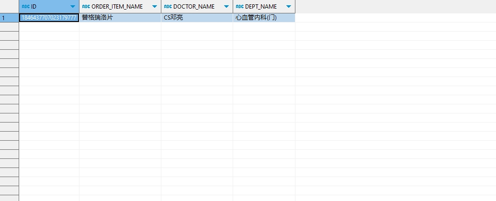

# 领域服务/临床领域 - 保存门诊处方草稿 - 保存门诊处方草稿 正向用例
## 请求参数：
``` json
{
  "hospCode": "NXRY",
  "orgCode": "NXRMYY",
  "list": [
    {
      "sourceId": "0c2623",
      "deptName": "心血管内科(门)",
      "createUserId": "20200327091607626",
      "orderTypeCode": "1",
      "patientId": "3cd055924ead43fda03491fe12c80354",
      "num": 1,
      "unitRate": "1",
      "execDeptId": "224718893381218304",
      "spec": "90mg*15片/盒",
      "frequencyId": "a244456158d74407abf40fd8576df15d",
      "visitId": "82277509998785150976",
      "price": 85.5,
      "factorName": "",
      "orderItemName": "替格瑞洛片",
      "patientIdCard": "",
      "id": "1846437707023179777",
      "primaryDiagNames": "肌炎",
      "bagNum": 1,
      "specId": "233755470669172736",
      "unitName": "盒",
      "rescueFlag": "0",
      "execDeptName": "中药房",
      "deptId": "224707564238958592",
      "prescId": "1846437221540880386",
      "skinTestPrescFlag": "0",
      "name": "吴满满",
      "frequencyName": "Tid",
      "visitNo": "2024101600007",
      "dosage": 90,
      "prescSource": "1",
      "prescListId": "1846437672629886977",
      "factorIdCard": "",
      "doctorName": "CS邓亮",
      "doctorId": "20200327091607626",
      "orgCode": "NXRMYY",
      "unitId": "20200408030204965",
      "prescWay": "1",
      "prescDate": "2024-10-16 14:24:23",
      "primaryDiagIds": "1846436905168973825",
      "orderName": "替格瑞洛片",
      "dosageUnitName": "mg",
      "createDate": "2024-10-16 14:27:09",
      "factory": "上海汇伦江苏药业有限公司",
      "usageId": "121",
      "hospCode": "NXRY",
      "dosageUnitId": "20200408030204885",
      "orderItemId": "233757841365291009",
      "isDelete": "N",
      "dosageUnitType": "1",
      "prescType": "1",
      "usageName": "口服",
      "sortNo": "0",
      "money": 85.5,
      "days": 1,
      "cipherPrescFlag": "0"
    }
  ],
  "operatorId": "20200327091607626",
  "operatorName": "CS邓亮"
}
```
## 返回参数：
``` json
{
  "exception": null,
  "apiCode": null,
  "data": {
    "errorLists": [],
    "list": [
      {
        "id": "1846437707023179777",
        "sourceId": "0c2623"
      }
    ]
  },
  "Code": 200,
  "Message": "操作成功"
}
```
## 数据校验：


# 领域服务/临床领域 - 保存门诊处方草稿 - 必填校验-[orgCode]为空
## 请求参数：
``` json
{
  "hospCode": "NXRY",
  "orgCode": "",
  "list": [
    {
      "sourceId": "0c2623",
      "deptName": "心血管内科(门)",
      "createUserId": "20200327091607626",
      "orderTypeCode": "1",
      "patientId": "3cd055924ead43fda03491fe12c80354",
      "num": 1,
      "unitRate": "1",
      "execDeptId": "224718893381218304",
      "spec": "90mg*15片/盒",
      "frequencyId": "a244456158d74407abf40fd8576df15d",
      "visitId": "82277509998785150976",
      "price": 85.5,
      "factorName": "",
      "orderItemName": "替格瑞洛片",
      "patientIdCard": "",
      "id": "1846437707023179777",
      "primaryDiagNames": "肌炎",
      "bagNum": 1,
      "specId": "233755470669172736",
      "unitName": "盒",
      "rescueFlag": "0",
      "execDeptName": "中药房",
      "deptId": "224707564238958592",
      "prescId": "1846437221540880386",
      "skinTestPrescFlag": "0",
      "name": "吴满满",
      "frequencyName": "Tid",
      "visitNo": "2024101600007",
      "dosage": 90,
      "prescSource": "1",
      "prescListId": "1846437672629886977",
      "factorIdCard": "",
      "doctorName": "CS邓亮",
      "doctorId": "20200327091607626",
      "orgCode": "NXRMYY",
      "unitId": "20200408030204965",
      "prescWay": "1",
      "prescDate": "2024-10-16 14:24:23",
      "primaryDiagIds": "1846436905168973825",
      "orderName": "替格瑞洛片",
      "dosageUnitName": "mg",
      "createDate": "2024-10-16 14:27:09",
      "factory": "上海汇伦江苏药业有限公司",
      "usageId": "121",
      "hospCode": "NXRY",
      "dosageUnitId": "20200408030204885",
      "orderItemId": "233757841365291009",
      "isDelete": "N",
      "dosageUnitType": "1",
      "prescType": "1",
      "usageName": "口服",
      "sortNo": "0",
      "money": 85.5,
      "days": 1,
      "cipherPrescFlag": "0"
    }
  ],
  "operatorId": "20200327091607626",
  "operatorName": "CS邓亮"
}
```
## 返回参数：
``` json
{
  "exception": null,
  "apiCode": null,
  "data": null,
  "Code": 1,
  "Message": "机构编码不能为空"
}
```
# 领域服务/临床领域 - 保存门诊处方草稿 - 必填校验-[hospCode]为空
## 请求参数：
``` json
{
  "hospCode": "",
  "orgCode": "NXRMYY",
  "list": [
    {
      "sourceId": "0c2623",
      "deptName": "心血管内科(门)",
      "createUserId": "20200327091607626",
      "orderTypeCode": "1",
      "patientId": "3cd055924ead43fda03491fe12c80354",
      "num": 1,
      "unitRate": "1",
      "execDeptId": "224718893381218304",
      "spec": "90mg*15片/盒",
      "frequencyId": "a244456158d74407abf40fd8576df15d",
      "visitId": "82277509998785150976",
      "price": 85.5,
      "factorName": "",
      "orderItemName": "替格瑞洛片",
      "patientIdCard": "",
      "id": "1846437707023179777",
      "primaryDiagNames": "肌炎",
      "bagNum": 1,
      "specId": "233755470669172736",
      "unitName": "盒",
      "rescueFlag": "0",
      "execDeptName": "中药房",
      "deptId": "224707564238958592",
      "prescId": "1846437221540880386",
      "skinTestPrescFlag": "0",
      "name": "吴满满",
      "frequencyName": "Tid",
      "visitNo": "2024101600007",
      "dosage": 90,
      "prescSource": "1",
      "prescListId": "1846437672629886977",
      "factorIdCard": "",
      "doctorName": "CS邓亮",
      "doctorId": "20200327091607626",
      "orgCode": "NXRMYY",
      "unitId": "20200408030204965",
      "prescWay": "1",
      "prescDate": "2024-10-16 14:24:23",
      "primaryDiagIds": "1846436905168973825",
      "orderName": "替格瑞洛片",
      "dosageUnitName": "mg",
      "createDate": "2024-10-16 14:27:09",
      "factory": "上海汇伦江苏药业有限公司",
      "usageId": "121",
      "hospCode": "NXRY",
      "dosageUnitId": "20200408030204885",
      "orderItemId": "233757841365291009",
      "isDelete": "N",
      "dosageUnitType": "1",
      "prescType": "1",
      "usageName": "口服",
      "sortNo": "0",
      "money": 85.5,
      "days": 1,
      "cipherPrescFlag": "0"
    }
  ],
  "operatorId": "20200327091607626",
  "operatorName": "CS邓亮"
}
```
## 返回参数：
``` json
{
  "exception": null,
  "apiCode": null,
  "data": null,
  "Code": 1,
  "Message": "院区编码不能为空"
}
```
# 领域服务/临床领域 - 保存门诊处方草稿 - 必填校验-[operatorId]为空
## 请求参数：
``` json
{
  "hospCode": "NXRY",
  "orgCode": "NXRMYY",
  "list": [
    {
      "sourceId": "0c2623",
      "deptName": "心血管内科(门)",
      "createUserId": "20200327091607626",
      "orderTypeCode": "1",
      "patientId": "3cd055924ead43fda03491fe12c80354",
      "num": 1,
      "unitRate": "1",
      "execDeptId": "224718893381218304",
      "spec": "90mg*15片/盒",
      "frequencyId": "a244456158d74407abf40fd8576df15d",
      "visitId": "82277509998785150976",
      "price": 85.5,
      "factorName": "",
      "orderItemName": "替格瑞洛片",
      "patientIdCard": "",
      "id": "1846437707023179777",
      "primaryDiagNames": "肌炎",
      "bagNum": 1,
      "specId": "233755470669172736",
      "unitName": "盒",
      "rescueFlag": "0",
      "execDeptName": "中药房",
      "deptId": "224707564238958592",
      "prescId": "1846437221540880386",
      "skinTestPrescFlag": "0",
      "name": "吴满满",
      "frequencyName": "Tid",
      "visitNo": "2024101600007",
      "dosage": 90,
      "prescSource": "1",
      "prescListId": "1846437672629886977",
      "factorIdCard": "",
      "doctorName": "CS邓亮",
      "doctorId": "20200327091607626",
      "orgCode": "NXRMYY",
      "unitId": "20200408030204965",
      "prescWay": "1",
      "prescDate": "2024-10-16 14:24:23",
      "primaryDiagIds": "1846436905168973825",
      "orderName": "替格瑞洛片",
      "dosageUnitName": "mg",
      "createDate": "2024-10-16 14:27:09",
      "factory": "上海汇伦江苏药业有限公司",
      "usageId": "121",
      "hospCode": "NXRY",
      "dosageUnitId": "20200408030204885",
      "orderItemId": "233757841365291009",
      "isDelete": "N",
      "dosageUnitType": "1",
      "prescType": "1",
      "usageName": "口服",
      "sortNo": "0",
      "money": 85.5,
      "days": 1,
      "cipherPrescFlag": "0"
    }
  ],
  "operatorId": "",
  "operatorName": "CS邓亮"
}
```
## 返回参数：
``` json
{
  "exception": null,
  "apiCode": null,
  "data": null,
  "Code": 1,
  "Message": "操作人id不能为空"
}
```
# 领域服务/临床领域 - 保存门诊处方草稿 - 必填校验-[operatorName]为空
## 请求参数：
``` json
{
  "hospCode": "NXRY",
  "orgCode": "NXRMYY",
  "list": [
    {
      "sourceId": "0c2623",
      "deptName": "心血管内科(门)",
      "createUserId": "20200327091607626",
      "orderTypeCode": "1",
      "patientId": "3cd055924ead43fda03491fe12c80354",
      "num": 1,
      "unitRate": "1",
      "execDeptId": "224718893381218304",
      "spec": "90mg*15片/盒",
      "frequencyId": "a244456158d74407abf40fd8576df15d",
      "visitId": "82277509998785150976",
      "price": 85.5,
      "factorName": "",
      "orderItemName": "替格瑞洛片",
      "patientIdCard": "",
      "id": "1846437707023179777",
      "primaryDiagNames": "肌炎",
      "bagNum": 1,
      "specId": "233755470669172736",
      "unitName": "盒",
      "rescueFlag": "0",
      "execDeptName": "中药房",
      "deptId": "224707564238958592",
      "prescId": "1846437221540880386",
      "skinTestPrescFlag": "0",
      "name": "吴满满",
      "frequencyName": "Tid",
      "visitNo": "2024101600007",
      "dosage": 90,
      "prescSource": "1",
      "prescListId": "1846437672629886977",
      "factorIdCard": "",
      "doctorName": "CS邓亮",
      "doctorId": "20200327091607626",
      "orgCode": "NXRMYY",
      "unitId": "20200408030204965",
      "prescWay": "1",
      "prescDate": "2024-10-16 14:24:23",
      "primaryDiagIds": "1846436905168973825",
      "orderName": "替格瑞洛片",
      "dosageUnitName": "mg",
      "createDate": "2024-10-16 14:27:09",
      "factory": "上海汇伦江苏药业有限公司",
      "usageId": "121",
      "hospCode": "NXRY",
      "dosageUnitId": "20200408030204885",
      "orderItemId": "233757841365291009",
      "isDelete": "N",
      "dosageUnitType": "1",
      "prescType": "1",
      "usageName": "口服",
      "sortNo": "0",
      "money": 85.5,
      "days": 1,
      "cipherPrescFlag": "0"
    }
  ],
  "operatorId": "20200327091607626",
  "operatorName": ""
}
```
## 返回参数：
``` json
{
  "exception": null,
  "apiCode": null,
  "data": null,
  "Code": 1,
  "Message": "操作人姓名不能为空"
}
```
# 领域服务/临床领域 - 保存门诊处方草稿 - 必填校验-[list]为空
## 请求参数：
``` json
{
  "hospCode": "NXRY",
  "orgCode": "NXRMYY",
  "list": null,
  "operatorId": "20200327091607626",
  "operatorName": "CS邓亮"
}
```
## 返回参数：
``` json
{
  "exception": null,
  "apiCode": null,
  "data": null,
  "Code": 1,
  "Message": "处方草稿集合不能为空"
}
```
# 领域服务/临床领域 - 保存门诊处方草稿 - 必填校验-[list.orgCode]为空
## 请求参数：
``` json
{
  "hospCode": "NXRY",
  "orgCode": "NXRMYY",
  "list": [
    {
      "sourceId": "0c2623",
      "deptName": "心血管内科(门)",
      "createUserId": "20200327091607626",
      "orderTypeCode": "1",
      "patientId": "3cd055924ead43fda03491fe12c80354",
      "num": 1,
      "unitRate": "1",
      "execDeptId": "224718893381218304",
      "spec": "90mg*15片/盒",
      "frequencyId": "a244456158d74407abf40fd8576df15d",
      "visitId": "82277509998785150976",
      "price": 85.5,
      "factorName": "",
      "orderItemName": "替格瑞洛片",
      "patientIdCard": "",
      "id": "1846437707023179777",
      "primaryDiagNames": "肌炎",
      "bagNum": 1,
      "specId": "233755470669172736",
      "unitName": "盒",
      "rescueFlag": "0",
      "execDeptName": "中药房",
      "deptId": "224707564238958592",
      "prescId": "1846437221540880386",
      "skinTestPrescFlag": "0",
      "name": "吴满满",
      "frequencyName": "Tid",
      "visitNo": "2024101600007",
      "dosage": 90,
      "prescSource": "1",
      "prescListId": "1846437672629886977",
      "factorIdCard": "",
      "doctorName": "CS邓亮",
      "doctorId": "20200327091607626",
      "orgCode": null,
      "unitId": "20200408030204965",
      "prescWay": "1",
      "prescDate": "2024-10-16 14:24:23",
      "primaryDiagIds": "1846436905168973825",
      "orderName": "替格瑞洛片",
      "dosageUnitName": "mg",
      "createDate": "2024-10-16 14:27:09",
      "factory": "上海汇伦江苏药业有限公司",
      "usageId": "121",
      "hospCode": "NXRY",
      "dosageUnitId": "20200408030204885",
      "orderItemId": "233757841365291009",
      "isDelete": "N",
      "dosageUnitType": "1",
      "prescType": "1",
      "usageName": "口服",
      "sortNo": "0",
      "money": 85.5,
      "days": 1,
      "cipherPrescFlag": "0"
    }
  ],
  "operatorId": "20200327091607626",
  "operatorName": "CS邓亮"
}
```
## 返回参数：
``` json
{
  "exception": null,
  "apiCode": null,
  "data": null,
  "Code": 1,
  "Message": "机构编码不能为空"
}
```
# 领域服务/临床领域 - 保存门诊处方草稿 - 必填校验-[list.hospCode]为空
## 请求参数：
``` json
{
  "hospCode": "NXRY",
  "orgCode": "NXRMYY",
  "list": [
    {
      "sourceId": "0c2623",
      "deptName": "心血管内科(门)",
      "createUserId": "20200327091607626",
      "orderTypeCode": "1",
      "patientId": "3cd055924ead43fda03491fe12c80354",
      "num": 1,
      "unitRate": "1",
      "execDeptId": "224718893381218304",
      "spec": "90mg*15片/盒",
      "frequencyId": "a244456158d74407abf40fd8576df15d",
      "visitId": "82277509998785150976",
      "price": 85.5,
      "factorName": "",
      "orderItemName": "替格瑞洛片",
      "patientIdCard": "",
      "id": "1846437707023179777",
      "primaryDiagNames": "肌炎",
      "bagNum": 1,
      "specId": "233755470669172736",
      "unitName": "盒",
      "rescueFlag": "0",
      "execDeptName": "中药房",
      "deptId": "224707564238958592",
      "prescId": "1846437221540880386",
      "skinTestPrescFlag": "0",
      "name": "吴满满",
      "frequencyName": "Tid",
      "visitNo": "2024101600007",
      "dosage": 90,
      "prescSource": "1",
      "prescListId": "1846437672629886977",
      "factorIdCard": "",
      "doctorName": "CS邓亮",
      "doctorId": "20200327091607626",
      "orgCode": "NXRMYY",
      "unitId": "20200408030204965",
      "prescWay": "1",
      "prescDate": "2024-10-16 14:24:23",
      "primaryDiagIds": "1846436905168973825",
      "orderName": "替格瑞洛片",
      "dosageUnitName": "mg",
      "createDate": "2024-10-16 14:27:09",
      "factory": "上海汇伦江苏药业有限公司",
      "usageId": "121",
      "hospCode": null,
      "dosageUnitId": "20200408030204885",
      "orderItemId": "233757841365291009",
      "isDelete": "N",
      "dosageUnitType": "1",
      "prescType": "1",
      "usageName": "口服",
      "sortNo": "0",
      "money": 85.5,
      "days": 1,
      "cipherPrescFlag": "0"
    }
  ],
  "operatorId": "20200327091607626",
  "operatorName": "CS邓亮"
}
```
## 返回参数：
``` json
{
  "exception": null,
  "apiCode": null,
  "data": null,
  "Code": 1,
  "Message": "院区编码不能为空"
}
```
# 领域服务/临床领域 - 保存门诊处方草稿 - 必填校验-[list.createUserId]为空
## 请求参数：
``` json
{
  "hospCode": "NXRY",
  "orgCode": "NXRMYY",
  "list": [
    {
      "sourceId": "0c2623",
      "deptName": "心血管内科(门)",
      "createUserId": null,
      "orderTypeCode": "1",
      "patientId": "3cd055924ead43fda03491fe12c80354",
      "num": 1,
      "unitRate": "1",
      "execDeptId": "224718893381218304",
      "spec": "90mg*15片/盒",
      "frequencyId": "a244456158d74407abf40fd8576df15d",
      "visitId": "82277509998785150976",
      "price": 85.5,
      "factorName": "",
      "orderItemName": "替格瑞洛片",
      "patientIdCard": "",
      "id": "1846437707023179777",
      "primaryDiagNames": "肌炎",
      "bagNum": 1,
      "specId": "233755470669172736",
      "unitName": "盒",
      "rescueFlag": "0",
      "execDeptName": "中药房",
      "deptId": "224707564238958592",
      "prescId": "1846437221540880386",
      "skinTestPrescFlag": "0",
      "name": "吴满满",
      "frequencyName": "Tid",
      "visitNo": "2024101600007",
      "dosage": 90,
      "prescSource": "1",
      "prescListId": "1846437672629886977",
      "factorIdCard": "",
      "doctorName": "CS邓亮",
      "doctorId": "20200327091607626",
      "orgCode": "NXRMYY",
      "unitId": "20200408030204965",
      "prescWay": "1",
      "prescDate": "2024-10-16 14:24:23",
      "primaryDiagIds": "1846436905168973825",
      "orderName": "替格瑞洛片",
      "dosageUnitName": "mg",
      "createDate": "2024-10-16 14:27:09",
      "factory": "上海汇伦江苏药业有限公司",
      "usageId": "121",
      "hospCode": "NXRY",
      "dosageUnitId": "20200408030204885",
      "orderItemId": "233757841365291009",
      "isDelete": "N",
      "dosageUnitType": "1",
      "prescType": "1",
      "usageName": "口服",
      "sortNo": "0",
      "money": 85.5,
      "days": 1,
      "cipherPrescFlag": "0"
    }
  ],
  "operatorId": "20200327091607626",
  "operatorName": "CS邓亮"
}
```
## 返回参数：
``` json
{
  "exception": null,
  "apiCode": null,
  "data": {
    "errorLists": [],
    "list": [
      {
        "id": "1846437707023179777",
        "sourceId": "0c2623"
      }
    ]
  },
  "Code": 200,
  "Message": "操作成功"
}
```
# 领域服务/临床领域 - 保存门诊处方草稿 - 必填校验-[list.createDate]为空
## 请求参数：
``` json
{
  "hospCode": "NXRY",
  "orgCode": "NXRMYY",
  "list": [
    {
      "sourceId": "0c2623",
      "deptName": "心血管内科(门)",
      "createUserId": "20200327091607626",
      "orderTypeCode": "1",
      "patientId": "3cd055924ead43fda03491fe12c80354",
      "num": 1,
      "unitRate": "1",
      "execDeptId": "224718893381218304",
      "spec": "90mg*15片/盒",
      "frequencyId": "a244456158d74407abf40fd8576df15d",
      "visitId": "82277509998785150976",
      "price": 85.5,
      "factorName": "",
      "orderItemName": "替格瑞洛片",
      "patientIdCard": "",
      "id": "1846437707023179777",
      "primaryDiagNames": "肌炎",
      "bagNum": 1,
      "specId": "233755470669172736",
      "unitName": "盒",
      "rescueFlag": "0",
      "execDeptName": "中药房",
      "deptId": "224707564238958592",
      "prescId": "1846437221540880386",
      "skinTestPrescFlag": "0",
      "name": "吴满满",
      "frequencyName": "Tid",
      "visitNo": "2024101600007",
      "dosage": 90,
      "prescSource": "1",
      "prescListId": "1846437672629886977",
      "factorIdCard": "",
      "doctorName": "CS邓亮",
      "doctorId": "20200327091607626",
      "orgCode": "NXRMYY",
      "unitId": "20200408030204965",
      "prescWay": "1",
      "prescDate": "2024-10-16 14:24:23",
      "primaryDiagIds": "1846436905168973825",
      "orderName": "替格瑞洛片",
      "dosageUnitName": "mg",
      "createDate": null,
      "factory": "上海汇伦江苏药业有限公司",
      "usageId": "121",
      "hospCode": "NXRY",
      "dosageUnitId": "20200408030204885",
      "orderItemId": "233757841365291009",
      "isDelete": "N",
      "dosageUnitType": "1",
      "prescType": "1",
      "usageName": "口服",
      "sortNo": "0",
      "money": 85.5,
      "days": 1,
      "cipherPrescFlag": "0"
    }
  ],
  "operatorId": "20200327091607626",
  "operatorName": "CS邓亮"
}
```
## 返回参数：
``` json
{
  "exception": null,
  "apiCode": null,
  "data": {
    "errorLists": [],
    "list": [
      {
        "id": "1846437707023179777",
        "sourceId": "0c2623"
      }
    ]
  },
  "Code": 200,
  "Message": "操作成功"
}
```
# 领域服务/临床领域 - 保存门诊处方草稿 - 必填校验-[list.isDelete]为空
## 请求参数：
``` json
{
  "hospCode": "NXRY",
  "orgCode": "NXRMYY",
  "list": [
    {
      "sourceId": "0c2623",
      "deptName": "心血管内科(门)",
      "createUserId": "20200327091607626",
      "orderTypeCode": "1",
      "patientId": "3cd055924ead43fda03491fe12c80354",
      "num": 1,
      "unitRate": "1",
      "execDeptId": "224718893381218304",
      "spec": "90mg*15片/盒",
      "frequencyId": "a244456158d74407abf40fd8576df15d",
      "visitId": "82277509998785150976",
      "price": 85.5,
      "factorName": "",
      "orderItemName": "替格瑞洛片",
      "patientIdCard": "",
      "id": "1846437707023179777",
      "primaryDiagNames": "肌炎",
      "bagNum": 1,
      "specId": "233755470669172736",
      "unitName": "盒",
      "rescueFlag": "0",
      "execDeptName": "中药房",
      "deptId": "224707564238958592",
      "prescId": "1846437221540880386",
      "skinTestPrescFlag": "0",
      "name": "吴满满",
      "frequencyName": "Tid",
      "visitNo": "2024101600007",
      "dosage": 90,
      "prescSource": "1",
      "prescListId": "1846437672629886977",
      "factorIdCard": "",
      "doctorName": "CS邓亮",
      "doctorId": "20200327091607626",
      "orgCode": "NXRMYY",
      "unitId": "20200408030204965",
      "prescWay": "1",
      "prescDate": "2024-10-16 14:24:23",
      "primaryDiagIds": "1846436905168973825",
      "orderName": "替格瑞洛片",
      "dosageUnitName": "mg",
      "createDate": "2024-10-16 14:27:09",
      "factory": "上海汇伦江苏药业有限公司",
      "usageId": "121",
      "hospCode": "NXRY",
      "dosageUnitId": "20200408030204885",
      "orderItemId": "233757841365291009",
      "isDelete": null,
      "dosageUnitType": "1",
      "prescType": "1",
      "usageName": "口服",
      "sortNo": "0",
      "money": 85.5,
      "days": 1,
      "cipherPrescFlag": "0"
    }
  ],
  "operatorId": "20200327091607626",
  "operatorName": "CS邓亮"
}
```
## 返回参数：
``` json
{
  "exception": null,
  "apiCode": null,
  "data": {
    "errorLists": [],
    "list": [
      {
        "id": "1846437707023179777",
        "sourceId": "0c2623"
      }
    ]
  },
  "Code": 200,
  "Message": "操作成功"
}
```
# 领域服务/临床领域 - 保存门诊处方草稿 - 必填校验-[list.sourceId]为空
## 请求参数：
``` json
{
  "hospCode": "NXRY",
  "orgCode": "NXRMYY",
  "list": [
    {
      "sourceId": null,
      "deptName": "心血管内科(门)",
      "createUserId": "20200327091607626",
      "orderTypeCode": "1",
      "patientId": "3cd055924ead43fda03491fe12c80354",
      "num": 1,
      "unitRate": "1",
      "execDeptId": "224718893381218304",
      "spec": "90mg*15片/盒",
      "frequencyId": "a244456158d74407abf40fd8576df15d",
      "visitId": "82277509998785150976",
      "price": 85.5,
      "factorName": "",
      "orderItemName": "替格瑞洛片",
      "patientIdCard": "",
      "id": "1846437707023179777",
      "primaryDiagNames": "肌炎",
      "bagNum": 1,
      "specId": "233755470669172736",
      "unitName": "盒",
      "rescueFlag": "0",
      "execDeptName": "中药房",
      "deptId": "224707564238958592",
      "prescId": "1846437221540880386",
      "skinTestPrescFlag": "0",
      "name": "吴满满",
      "frequencyName": "Tid",
      "visitNo": "2024101600007",
      "dosage": 90,
      "prescSource": "1",
      "prescListId": "1846437672629886977",
      "factorIdCard": "",
      "doctorName": "CS邓亮",
      "doctorId": "20200327091607626",
      "orgCode": "NXRMYY",
      "unitId": "20200408030204965",
      "prescWay": "1",
      "prescDate": "2024-10-16 14:24:23",
      "primaryDiagIds": "1846436905168973825",
      "orderName": "替格瑞洛片",
      "dosageUnitName": "mg",
      "createDate": "2024-10-16 14:27:09",
      "factory": "上海汇伦江苏药业有限公司",
      "usageId": "121",
      "hospCode": "NXRY",
      "dosageUnitId": "20200408030204885",
      "orderItemId": "233757841365291009",
      "isDelete": "N",
      "dosageUnitType": "1",
      "prescType": "1",
      "usageName": "口服",
      "sortNo": "0",
      "money": 85.5,
      "days": 1,
      "cipherPrescFlag": "0"
    }
  ],
  "operatorId": "20200327091607626",
  "operatorName": "CS邓亮"
}
```
## 返回参数：
``` json
{
  "exception": null,
  "apiCode": null,
  "data": null,
  "Code": 1,
  "Message": "源id不能为空"
}
```
# 领域服务/临床领域 - 保存门诊处方草稿 - 必填校验-[list.prescType]为空
## 请求参数：
``` json
{
  "hospCode": "NXRY",
  "orgCode": "NXRMYY",
  "list": [
    {
      "sourceId": "0c2623",
      "deptName": "心血管内科(门)",
      "createUserId": "20200327091607626",
      "orderTypeCode": "1",
      "patientId": "3cd055924ead43fda03491fe12c80354",
      "num": 1,
      "unitRate": "1",
      "execDeptId": "224718893381218304",
      "spec": "90mg*15片/盒",
      "frequencyId": "a244456158d74407abf40fd8576df15d",
      "visitId": "82277509998785150976",
      "price": 85.5,
      "factorName": "",
      "orderItemName": "替格瑞洛片",
      "patientIdCard": "",
      "id": "1846437707023179777",
      "primaryDiagNames": "肌炎",
      "bagNum": 1,
      "specId": "233755470669172736",
      "unitName": "盒",
      "rescueFlag": "0",
      "execDeptName": "中药房",
      "deptId": "224707564238958592",
      "prescId": "1846437221540880386",
      "skinTestPrescFlag": "0",
      "name": "吴满满",
      "frequencyName": "Tid",
      "visitNo": "2024101600007",
      "dosage": 90,
      "prescSource": "1",
      "prescListId": "1846437672629886977",
      "factorIdCard": "",
      "doctorName": "CS邓亮",
      "doctorId": "20200327091607626",
      "orgCode": "NXRMYY",
      "unitId": "20200408030204965",
      "prescWay": "1",
      "prescDate": "2024-10-16 14:24:23",
      "primaryDiagIds": "1846436905168973825",
      "orderName": "替格瑞洛片",
      "dosageUnitName": "mg",
      "createDate": "2024-10-16 14:27:09",
      "factory": "上海汇伦江苏药业有限公司",
      "usageId": "121",
      "hospCode": "NXRY",
      "dosageUnitId": "20200408030204885",
      "orderItemId": "233757841365291009",
      "isDelete": "N",
      "dosageUnitType": "1",
      "prescType": null,
      "usageName": "口服",
      "sortNo": "0",
      "money": 85.5,
      "days": 1,
      "cipherPrescFlag": "0"
    }
  ],
  "operatorId": "20200327091607626",
  "operatorName": "CS邓亮"
}
```
## 返回参数：
``` json
{
  "exception": null,
  "apiCode": null,
  "data": null,
  "Code": 1,
  "Message": "处方类型不能为空"
}
```
# 领域服务/临床领域 - 保存门诊处方草稿 - 必填校验-[list.prescSource]为空
## 请求参数：
``` json
{
  "hospCode": "NXRY",
  "orgCode": "NXRMYY",
  "list": [
    {
      "sourceId": "0c2623",
      "deptName": "心血管内科(门)",
      "createUserId": "20200327091607626",
      "orderTypeCode": "1",
      "patientId": "3cd055924ead43fda03491fe12c80354",
      "num": 1,
      "unitRate": "1",
      "execDeptId": "224718893381218304",
      "spec": "90mg*15片/盒",
      "frequencyId": "a244456158d74407abf40fd8576df15d",
      "visitId": "82277509998785150976",
      "price": 85.5,
      "factorName": "",
      "orderItemName": "替格瑞洛片",
      "patientIdCard": "",
      "id": "1846437707023179777",
      "primaryDiagNames": "肌炎",
      "bagNum": 1,
      "specId": "233755470669172736",
      "unitName": "盒",
      "rescueFlag": "0",
      "execDeptName": "中药房",
      "deptId": "224707564238958592",
      "prescId": "1846437221540880386",
      "skinTestPrescFlag": "0",
      "name": "吴满满",
      "frequencyName": "Tid",
      "visitNo": "2024101600007",
      "dosage": 90,
      "prescSource": null,
      "prescListId": "1846437672629886977",
      "factorIdCard": "",
      "doctorName": "CS邓亮",
      "doctorId": "20200327091607626",
      "orgCode": "NXRMYY",
      "unitId": "20200408030204965",
      "prescWay": "1",
      "prescDate": "2024-10-16 14:24:23",
      "primaryDiagIds": "1846436905168973825",
      "orderName": "替格瑞洛片",
      "dosageUnitName": "mg",
      "createDate": "2024-10-16 14:27:09",
      "factory": "上海汇伦江苏药业有限公司",
      "usageId": "121",
      "hospCode": "NXRY",
      "dosageUnitId": "20200408030204885",
      "orderItemId": "233757841365291009",
      "isDelete": "N",
      "dosageUnitType": "1",
      "prescType": "1",
      "usageName": "口服",
      "sortNo": "0",
      "money": 85.5,
      "days": 1,
      "cipherPrescFlag": "0"
    }
  ],
  "operatorId": "20200327091607626",
  "operatorName": "CS邓亮"
}
```
## 返回参数：
``` json
{
  "exception": null,
  "apiCode": null,
  "data": null,
  "Code": 1,
  "Message": "处方来源编码不能为空"
}
```
# 领域服务/临床领域 - 保存门诊处方草稿 - 必填校验-[list.prescWay]为空
## 请求参数：
``` json
{
  "hospCode": "NXRY",
  "orgCode": "NXRMYY",
  "list": [
    {
      "sourceId": "0c2623",
      "deptName": "心血管内科(门)",
      "createUserId": "20200327091607626",
      "orderTypeCode": "1",
      "patientId": "3cd055924ead43fda03491fe12c80354",
      "num": 1,
      "unitRate": "1",
      "execDeptId": "224718893381218304",
      "spec": "90mg*15片/盒",
      "frequencyId": "a244456158d74407abf40fd8576df15d",
      "visitId": "82277509998785150976",
      "price": 85.5,
      "factorName": "",
      "orderItemName": "替格瑞洛片",
      "patientIdCard": "",
      "id": "1846437707023179777",
      "primaryDiagNames": "肌炎",
      "bagNum": 1,
      "specId": "233755470669172736",
      "unitName": "盒",
      "rescueFlag": "0",
      "execDeptName": "中药房",
      "deptId": "224707564238958592",
      "prescId": "1846437221540880386",
      "skinTestPrescFlag": "0",
      "name": "吴满满",
      "frequencyName": "Tid",
      "visitNo": "2024101600007",
      "dosage": 90,
      "prescSource": "1",
      "prescListId": "1846437672629886977",
      "factorIdCard": "",
      "doctorName": "CS邓亮",
      "doctorId": "20200327091607626",
      "orgCode": "NXRMYY",
      "unitId": "20200408030204965",
      "prescWay": null,
      "prescDate": "2024-10-16 14:24:23",
      "primaryDiagIds": "1846436905168973825",
      "orderName": "替格瑞洛片",
      "dosageUnitName": "mg",
      "createDate": "2024-10-16 14:27:09",
      "factory": "上海汇伦江苏药业有限公司",
      "usageId": "121",
      "hospCode": "NXRY",
      "dosageUnitId": "20200408030204885",
      "orderItemId": "233757841365291009",
      "isDelete": "N",
      "dosageUnitType": "1",
      "prescType": "1",
      "usageName": "口服",
      "sortNo": "0",
      "money": 85.5,
      "days": 1,
      "cipherPrescFlag": "0"
    }
  ],
  "operatorId": "20200327091607626",
  "operatorName": "CS邓亮"
}
```
## 返回参数：
``` json
{
  "exception": null,
  "apiCode": null,
  "data": null,
  "Code": 1,
  "Message": "处方路径编码不能为空"
}
```
# 领域服务/临床领域 - 保存门诊处方草稿 - 必填校验-[list.prescDate]为空
## 请求参数：
``` json
{
  "hospCode": "NXRY",
  "orgCode": "NXRMYY",
  "list": [
    {
      "sourceId": "0c2623",
      "deptName": "心血管内科(门)",
      "createUserId": "20200327091607626",
      "orderTypeCode": "1",
      "patientId": "3cd055924ead43fda03491fe12c80354",
      "num": 1,
      "unitRate": "1",
      "execDeptId": "224718893381218304",
      "spec": "90mg*15片/盒",
      "frequencyId": "a244456158d74407abf40fd8576df15d",
      "visitId": "82277509998785150976",
      "price": 85.5,
      "factorName": "",
      "orderItemName": "替格瑞洛片",
      "patientIdCard": "",
      "id": "1846437707023179777",
      "primaryDiagNames": "肌炎",
      "bagNum": 1,
      "specId": "233755470669172736",
      "unitName": "盒",
      "rescueFlag": "0",
      "execDeptName": "中药房",
      "deptId": "224707564238958592",
      "prescId": "1846437221540880386",
      "skinTestPrescFlag": "0",
      "name": "吴满满",
      "frequencyName": "Tid",
      "visitNo": "2024101600007",
      "dosage": 90,
      "prescSource": "1",
      "prescListId": "1846437672629886977",
      "factorIdCard": "",
      "doctorName": "CS邓亮",
      "doctorId": "20200327091607626",
      "orgCode": "NXRMYY",
      "unitId": "20200408030204965",
      "prescWay": "1",
      "prescDate": null,
      "primaryDiagIds": "1846436905168973825",
      "orderName": "替格瑞洛片",
      "dosageUnitName": "mg",
      "createDate": "2024-10-16 14:27:09",
      "factory": "上海汇伦江苏药业有限公司",
      "usageId": "121",
      "hospCode": "NXRY",
      "dosageUnitId": "20200408030204885",
      "orderItemId": "233757841365291009",
      "isDelete": "N",
      "dosageUnitType": "1",
      "prescType": "1",
      "usageName": "口服",
      "sortNo": "0",
      "money": 85.5,
      "days": 1,
      "cipherPrescFlag": "0"
    }
  ],
  "operatorId": "20200327091607626",
  "operatorName": "CS邓亮"
}
```
## 返回参数：
``` json
{
  "exception": null,
  "apiCode": null,
  "data": null,
  "Code": 1,
  "Message": "处方日期不能为空"
}
```
# 领域服务/临床领域 - 保存门诊处方草稿 - 必填校验-[list.patientId]为空
## 请求参数：
``` json
{
  "hospCode": "NXRY",
  "orgCode": "NXRMYY",
  "list": [
    {
      "sourceId": "0c2623",
      "deptName": "心血管内科(门)",
      "createUserId": "20200327091607626",
      "orderTypeCode": "1",
      "patientId": null,
      "num": 1,
      "unitRate": "1",
      "execDeptId": "224718893381218304",
      "spec": "90mg*15片/盒",
      "frequencyId": "a244456158d74407abf40fd8576df15d",
      "visitId": "82277509998785150976",
      "price": 85.5,
      "factorName": "",
      "orderItemName": "替格瑞洛片",
      "patientIdCard": "",
      "id": "1846437707023179777",
      "primaryDiagNames": "肌炎",
      "bagNum": 1,
      "specId": "233755470669172736",
      "unitName": "盒",
      "rescueFlag": "0",
      "execDeptName": "中药房",
      "deptId": "224707564238958592",
      "prescId": "1846437221540880386",
      "skinTestPrescFlag": "0",
      "name": "吴满满",
      "frequencyName": "Tid",
      "visitNo": "2024101600007",
      "dosage": 90,
      "prescSource": "1",
      "prescListId": "1846437672629886977",
      "factorIdCard": "",
      "doctorName": "CS邓亮",
      "doctorId": "20200327091607626",
      "orgCode": "NXRMYY",
      "unitId": "20200408030204965",
      "prescWay": "1",
      "prescDate": "2024-10-16 14:24:23",
      "primaryDiagIds": "1846436905168973825",
      "orderName": "替格瑞洛片",
      "dosageUnitName": "mg",
      "createDate": "2024-10-16 14:27:09",
      "factory": "上海汇伦江苏药业有限公司",
      "usageId": "121",
      "hospCode": "NXRY",
      "dosageUnitId": "20200408030204885",
      "orderItemId": "233757841365291009",
      "isDelete": "N",
      "dosageUnitType": "1",
      "prescType": "1",
      "usageName": "口服",
      "sortNo": "0",
      "money": 85.5,
      "days": 1,
      "cipherPrescFlag": "0"
    }
  ],
  "operatorId": "20200327091607626",
  "operatorName": "CS邓亮"
}
```
## 返回参数：
``` json
{
  "exception": null,
  "apiCode": null,
  "data": null,
  "Code": 1,
  "Message": "病人id不能为空"
}
```
# 领域服务/临床领域 - 保存门诊处方草稿 - 必填校验-[list.name]为空
## 请求参数：
``` json
{
  "hospCode": "NXRY",
  "orgCode": "NXRMYY",
  "list": [
    {
      "sourceId": "0c2623",
      "deptName": "心血管内科(门)",
      "createUserId": "20200327091607626",
      "orderTypeCode": "1",
      "patientId": "3cd055924ead43fda03491fe12c80354",
      "num": 1,
      "unitRate": "1",
      "execDeptId": "224718893381218304",
      "spec": "90mg*15片/盒",
      "frequencyId": "a244456158d74407abf40fd8576df15d",
      "visitId": "82277509998785150976",
      "price": 85.5,
      "factorName": "",
      "orderItemName": "替格瑞洛片",
      "patientIdCard": "",
      "id": "1846437707023179777",
      "primaryDiagNames": "肌炎",
      "bagNum": 1,
      "specId": "233755470669172736",
      "unitName": "盒",
      "rescueFlag": "0",
      "execDeptName": "中药房",
      "deptId": "224707564238958592",
      "prescId": "1846437221540880386",
      "skinTestPrescFlag": "0",
      "name": null,
      "frequencyName": "Tid",
      "visitNo": "2024101600007",
      "dosage": 90,
      "prescSource": "1",
      "prescListId": "1846437672629886977",
      "factorIdCard": "",
      "doctorName": "CS邓亮",
      "doctorId": "20200327091607626",
      "orgCode": "NXRMYY",
      "unitId": "20200408030204965",
      "prescWay": "1",
      "prescDate": "2024-10-16 14:24:23",
      "primaryDiagIds": "1846436905168973825",
      "orderName": "替格瑞洛片",
      "dosageUnitName": "mg",
      "createDate": "2024-10-16 14:27:09",
      "factory": "上海汇伦江苏药业有限公司",
      "usageId": "121",
      "hospCode": "NXRY",
      "dosageUnitId": "20200408030204885",
      "orderItemId": "233757841365291009",
      "isDelete": "N",
      "dosageUnitType": "1",
      "prescType": "1",
      "usageName": "口服",
      "sortNo": "0",
      "money": 85.5,
      "days": 1,
      "cipherPrescFlag": "0"
    }
  ],
  "operatorId": "20200327091607626",
  "operatorName": "CS邓亮"
}
```
## 返回参数：
``` json
{
  "exception": null,
  "apiCode": null,
  "data": null,
  "Code": 1,
  "Message": "姓名不能为空"
}
```
# 领域服务/临床领域 - 保存门诊处方草稿 - 必填校验-[list.visitId]为空
## 请求参数：
``` json
{
  "hospCode": "NXRY",
  "orgCode": "NXRMYY",
  "list": [
    {
      "sourceId": "0c2623",
      "deptName": "心血管内科(门)",
      "createUserId": "20200327091607626",
      "orderTypeCode": "1",
      "patientId": "3cd055924ead43fda03491fe12c80354",
      "num": 1,
      "unitRate": "1",
      "execDeptId": "224718893381218304",
      "spec": "90mg*15片/盒",
      "frequencyId": "a244456158d74407abf40fd8576df15d",
      "visitId": null,
      "price": 85.5,
      "factorName": "",
      "orderItemName": "替格瑞洛片",
      "patientIdCard": "",
      "id": "1846437707023179777",
      "primaryDiagNames": "肌炎",
      "bagNum": 1,
      "specId": "233755470669172736",
      "unitName": "盒",
      "rescueFlag": "0",
      "execDeptName": "中药房",
      "deptId": "224707564238958592",
      "prescId": "1846437221540880386",
      "skinTestPrescFlag": "0",
      "name": "吴满满",
      "frequencyName": "Tid",
      "visitNo": "2024101600007",
      "dosage": 90,
      "prescSource": "1",
      "prescListId": "1846437672629886977",
      "factorIdCard": "",
      "doctorName": "CS邓亮",
      "doctorId": "20200327091607626",
      "orgCode": "NXRMYY",
      "unitId": "20200408030204965",
      "prescWay": "1",
      "prescDate": "2024-10-16 14:24:23",
      "primaryDiagIds": "1846436905168973825",
      "orderName": "替格瑞洛片",
      "dosageUnitName": "mg",
      "createDate": "2024-10-16 14:27:09",
      "factory": "上海汇伦江苏药业有限公司",
      "usageId": "121",
      "hospCode": "NXRY",
      "dosageUnitId": "20200408030204885",
      "orderItemId": "233757841365291009",
      "isDelete": "N",
      "dosageUnitType": "1",
      "prescType": "1",
      "usageName": "口服",
      "sortNo": "0",
      "money": 85.5,
      "days": 1,
      "cipherPrescFlag": "0"
    }
  ],
  "operatorId": "20200327091607626",
  "operatorName": "CS邓亮"
}
```
## 返回参数：
``` json
{
  "exception": null,
  "apiCode": null,
  "data": null,
  "Code": 1,
  "Message": "挂号id不能为空"
}
```
# 领域服务/临床领域 - 保存门诊处方草稿 - 必填校验-[list.visitNo]为空
## 请求参数：
``` json
{
  "hospCode": "NXRY",
  "orgCode": "NXRMYY",
  "list": [
    {
      "sourceId": "0c2623",
      "deptName": "心血管内科(门)",
      "createUserId": "20200327091607626",
      "orderTypeCode": "1",
      "patientId": "3cd055924ead43fda03491fe12c80354",
      "num": 1,
      "unitRate": "1",
      "execDeptId": "224718893381218304",
      "spec": "90mg*15片/盒",
      "frequencyId": "a244456158d74407abf40fd8576df15d",
      "visitId": "82277509998785150976",
      "price": 85.5,
      "factorName": "",
      "orderItemName": "替格瑞洛片",
      "patientIdCard": "",
      "id": "1846437707023179777",
      "primaryDiagNames": "肌炎",
      "bagNum": 1,
      "specId": "233755470669172736",
      "unitName": "盒",
      "rescueFlag": "0",
      "execDeptName": "中药房",
      "deptId": "224707564238958592",
      "prescId": "1846437221540880386",
      "skinTestPrescFlag": "0",
      "name": "吴满满",
      "frequencyName": "Tid",
      "visitNo": null,
      "dosage": 90,
      "prescSource": "1",
      "prescListId": "1846437672629886977",
      "factorIdCard": "",
      "doctorName": "CS邓亮",
      "doctorId": "20200327091607626",
      "orgCode": "NXRMYY",
      "unitId": "20200408030204965",
      "prescWay": "1",
      "prescDate": "2024-10-16 14:24:23",
      "primaryDiagIds": "1846436905168973825",
      "orderName": "替格瑞洛片",
      "dosageUnitName": "mg",
      "createDate": "2024-10-16 14:27:09",
      "factory": "上海汇伦江苏药业有限公司",
      "usageId": "121",
      "hospCode": "NXRY",
      "dosageUnitId": "20200408030204885",
      "orderItemId": "233757841365291009",
      "isDelete": "N",
      "dosageUnitType": "1",
      "prescType": "1",
      "usageName": "口服",
      "sortNo": "0",
      "money": 85.5,
      "days": 1,
      "cipherPrescFlag": "0"
    }
  ],
  "operatorId": "20200327091607626",
  "operatorName": "CS邓亮"
}
```
## 返回参数：
``` json
{
  "exception": null,
  "apiCode": null,
  "data": null,
  "Code": 1,
  "Message": "门诊号不能为空"
}
```
# 领域服务/临床领域 - 保存门诊处方草稿 - 必填校验-[list.doctorId]为空
## 请求参数：
``` json
{
  "hospCode": "NXRY",
  "orgCode": "NXRMYY",
  "list": [
    {
      "sourceId": "0c2623",
      "deptName": "心血管内科(门)",
      "createUserId": "20200327091607626",
      "orderTypeCode": "1",
      "patientId": "3cd055924ead43fda03491fe12c80354",
      "num": 1,
      "unitRate": "1",
      "execDeptId": "224718893381218304",
      "spec": "90mg*15片/盒",
      "frequencyId": "a244456158d74407abf40fd8576df15d",
      "visitId": "82277509998785150976",
      "price": 85.5,
      "factorName": "",
      "orderItemName": "替格瑞洛片",
      "patientIdCard": "",
      "id": "1846437707023179777",
      "primaryDiagNames": "肌炎",
      "bagNum": 1,
      "specId": "233755470669172736",
      "unitName": "盒",
      "rescueFlag": "0",
      "execDeptName": "中药房",
      "deptId": "224707564238958592",
      "prescId": "1846437221540880386",
      "skinTestPrescFlag": "0",
      "name": "吴满满",
      "frequencyName": "Tid",
      "visitNo": "2024101600007",
      "dosage": 90,
      "prescSource": "1",
      "prescListId": "1846437672629886977",
      "factorIdCard": "",
      "doctorName": "CS邓亮",
      "doctorId": null,
      "orgCode": "NXRMYY",
      "unitId": "20200408030204965",
      "prescWay": "1",
      "prescDate": "2024-10-16 14:24:23",
      "primaryDiagIds": "1846436905168973825",
      "orderName": "替格瑞洛片",
      "dosageUnitName": "mg",
      "createDate": "2024-10-16 14:27:09",
      "factory": "上海汇伦江苏药业有限公司",
      "usageId": "121",
      "hospCode": "NXRY",
      "dosageUnitId": "20200408030204885",
      "orderItemId": "233757841365291009",
      "isDelete": "N",
      "dosageUnitType": "1",
      "prescType": "1",
      "usageName": "口服",
      "sortNo": "0",
      "money": 85.5,
      "days": 1,
      "cipherPrescFlag": "0"
    }
  ],
  "operatorId": "20200327091607626",
  "operatorName": "CS邓亮"
}
```
## 返回参数：
``` json
{
  "exception": null,
  "apiCode": null,
  "data": null,
  "Code": 1,
  "Message": "开单医生id不能为空"
}
```
# 领域服务/临床领域 - 保存门诊处方草稿 - 必填校验-[list.doctorName]为空
## 请求参数：
``` json
{
  "hospCode": "NXRY",
  "orgCode": "NXRMYY",
  "list": [
    {
      "sourceId": "0c2623",
      "deptName": "心血管内科(门)",
      "createUserId": "20200327091607626",
      "orderTypeCode": "1",
      "patientId": "3cd055924ead43fda03491fe12c80354",
      "num": 1,
      "unitRate": "1",
      "execDeptId": "224718893381218304",
      "spec": "90mg*15片/盒",
      "frequencyId": "a244456158d74407abf40fd8576df15d",
      "visitId": "82277509998785150976",
      "price": 85.5,
      "factorName": "",
      "orderItemName": "替格瑞洛片",
      "patientIdCard": "",
      "id": "1846437707023179777",
      "primaryDiagNames": "肌炎",
      "bagNum": 1,
      "specId": "233755470669172736",
      "unitName": "盒",
      "rescueFlag": "0",
      "execDeptName": "中药房",
      "deptId": "224707564238958592",
      "prescId": "1846437221540880386",
      "skinTestPrescFlag": "0",
      "name": "吴满满",
      "frequencyName": "Tid",
      "visitNo": "2024101600007",
      "dosage": 90,
      "prescSource": "1",
      "prescListId": "1846437672629886977",
      "factorIdCard": "",
      "doctorName": null,
      "doctorId": "20200327091607626",
      "orgCode": "NXRMYY",
      "unitId": "20200408030204965",
      "prescWay": "1",
      "prescDate": "2024-10-16 14:24:23",
      "primaryDiagIds": "1846436905168973825",
      "orderName": "替格瑞洛片",
      "dosageUnitName": "mg",
      "createDate": "2024-10-16 14:27:09",
      "factory": "上海汇伦江苏药业有限公司",
      "usageId": "121",
      "hospCode": "NXRY",
      "dosageUnitId": "20200408030204885",
      "orderItemId": "233757841365291009",
      "isDelete": "N",
      "dosageUnitType": "1",
      "prescType": "1",
      "usageName": "口服",
      "sortNo": "0",
      "money": 85.5,
      "days": 1,
      "cipherPrescFlag": "0"
    }
  ],
  "operatorId": "20200327091607626",
  "operatorName": "CS邓亮"
}
```
## 返回参数：
``` json
{
  "exception": null,
  "apiCode": null,
  "data": null,
  "Code": 1,
  "Message": "开单医生姓名不能为空"
}
```
# 领域服务/临床领域 - 保存门诊处方草稿 - 必填校验-[list.deptId]为空
## 请求参数：
``` json
{
  "hospCode": "NXRY",
  "orgCode": "NXRMYY",
  "list": [
    {
      "sourceId": "0c2623",
      "deptName": "心血管内科(门)",
      "createUserId": "20200327091607626",
      "orderTypeCode": "1",
      "patientId": "3cd055924ead43fda03491fe12c80354",
      "num": 1,
      "unitRate": "1",
      "execDeptId": "224718893381218304",
      "spec": "90mg*15片/盒",
      "frequencyId": "a244456158d74407abf40fd8576df15d",
      "visitId": "82277509998785150976",
      "price": 85.5,
      "factorName": "",
      "orderItemName": "替格瑞洛片",
      "patientIdCard": "",
      "id": "1846437707023179777",
      "primaryDiagNames": "肌炎",
      "bagNum": 1,
      "specId": "233755470669172736",
      "unitName": "盒",
      "rescueFlag": "0",
      "execDeptName": "中药房",
      "deptId": null,
      "prescId": "1846437221540880386",
      "skinTestPrescFlag": "0",
      "name": "吴满满",
      "frequencyName": "Tid",
      "visitNo": "2024101600007",
      "dosage": 90,
      "prescSource": "1",
      "prescListId": "1846437672629886977",
      "factorIdCard": "",
      "doctorName": "CS邓亮",
      "doctorId": "20200327091607626",
      "orgCode": "NXRMYY",
      "unitId": "20200408030204965",
      "prescWay": "1",
      "prescDate": "2024-10-16 14:24:23",
      "primaryDiagIds": "1846436905168973825",
      "orderName": "替格瑞洛片",
      "dosageUnitName": "mg",
      "createDate": "2024-10-16 14:27:09",
      "factory": "上海汇伦江苏药业有限公司",
      "usageId": "121",
      "hospCode": "NXRY",
      "dosageUnitId": "20200408030204885",
      "orderItemId": "233757841365291009",
      "isDelete": "N",
      "dosageUnitType": "1",
      "prescType": "1",
      "usageName": "口服",
      "sortNo": "0",
      "money": 85.5,
      "days": 1,
      "cipherPrescFlag": "0"
    }
  ],
  "operatorId": "20200327091607626",
  "operatorName": "CS邓亮"
}
```
## 返回参数：
``` json
{
  "exception": null,
  "apiCode": null,
  "data": null,
  "Code": 1,
  "Message": "开单科室id不能为空"
}
```
# 领域服务/临床领域 - 保存门诊处方草稿 - 必填校验-[list.deptName]为空
## 请求参数：
``` json
{
  "hospCode": "NXRY",
  "orgCode": "NXRMYY",
  "list": [
    {
      "sourceId": "0c2623",
      "deptName": null,
      "createUserId": "20200327091607626",
      "orderTypeCode": "1",
      "patientId": "3cd055924ead43fda03491fe12c80354",
      "num": 1,
      "unitRate": "1",
      "execDeptId": "224718893381218304",
      "spec": "90mg*15片/盒",
      "frequencyId": "a244456158d74407abf40fd8576df15d",
      "visitId": "82277509998785150976",
      "price": 85.5,
      "factorName": "",
      "orderItemName": "替格瑞洛片",
      "patientIdCard": "",
      "id": "1846437707023179777",
      "primaryDiagNames": "肌炎",
      "bagNum": 1,
      "specId": "233755470669172736",
      "unitName": "盒",
      "rescueFlag": "0",
      "execDeptName": "中药房",
      "deptId": "224707564238958592",
      "prescId": "1846437221540880386",
      "skinTestPrescFlag": "0",
      "name": "吴满满",
      "frequencyName": "Tid",
      "visitNo": "2024101600007",
      "dosage": 90,
      "prescSource": "1",
      "prescListId": "1846437672629886977",
      "factorIdCard": "",
      "doctorName": "CS邓亮",
      "doctorId": "20200327091607626",
      "orgCode": "NXRMYY",
      "unitId": "20200408030204965",
      "prescWay": "1",
      "prescDate": "2024-10-16 14:24:23",
      "primaryDiagIds": "1846436905168973825",
      "orderName": "替格瑞洛片",
      "dosageUnitName": "mg",
      "createDate": "2024-10-16 14:27:09",
      "factory": "上海汇伦江苏药业有限公司",
      "usageId": "121",
      "hospCode": "NXRY",
      "dosageUnitId": "20200408030204885",
      "orderItemId": "233757841365291009",
      "isDelete": "N",
      "dosageUnitType": "1",
      "prescType": "1",
      "usageName": "口服",
      "sortNo": "0",
      "money": 85.5,
      "days": 1,
      "cipherPrescFlag": "0"
    }
  ],
  "operatorId": "20200327091607626",
  "operatorName": "CS邓亮"
}
```
## 返回参数：
``` json
{
  "exception": null,
  "apiCode": null,
  "data": null,
  "Code": 1,
  "Message": "开单科室名称不能为空"
}
```
# 领域服务/临床领域 - 保存门诊处方草稿 - 必填校验-[list.sortNo]为空
## 请求参数：
``` json
{
  "hospCode": "NXRY",
  "orgCode": "NXRMYY",
  "list": [
    {
      "sourceId": "0c2623",
      "deptName": "心血管内科(门)",
      "createUserId": "20200327091607626",
      "orderTypeCode": "1",
      "patientId": "3cd055924ead43fda03491fe12c80354",
      "num": 1,
      "unitRate": "1",
      "execDeptId": "224718893381218304",
      "spec": "90mg*15片/盒",
      "frequencyId": "a244456158d74407abf40fd8576df15d",
      "visitId": "82277509998785150976",
      "price": 85.5,
      "factorName": "",
      "orderItemName": "替格瑞洛片",
      "patientIdCard": "",
      "id": "1846437707023179777",
      "primaryDiagNames": "肌炎",
      "bagNum": 1,
      "specId": "233755470669172736",
      "unitName": "盒",
      "rescueFlag": "0",
      "execDeptName": "中药房",
      "deptId": "224707564238958592",
      "prescId": "1846437221540880386",
      "skinTestPrescFlag": "0",
      "name": "吴满满",
      "frequencyName": "Tid",
      "visitNo": "2024101600007",
      "dosage": 90,
      "prescSource": "1",
      "prescListId": "1846437672629886977",
      "factorIdCard": "",
      "doctorName": "CS邓亮",
      "doctorId": "20200327091607626",
      "orgCode": "NXRMYY",
      "unitId": "20200408030204965",
      "prescWay": "1",
      "prescDate": "2024-10-16 14:24:23",
      "primaryDiagIds": "1846436905168973825",
      "orderName": "替格瑞洛片",
      "dosageUnitName": "mg",
      "createDate": "2024-10-16 14:27:09",
      "factory": "上海汇伦江苏药业有限公司",
      "usageId": "121",
      "hospCode": "NXRY",
      "dosageUnitId": "20200408030204885",
      "orderItemId": "233757841365291009",
      "isDelete": "N",
      "dosageUnitType": "1",
      "prescType": "1",
      "usageName": "口服",
      "sortNo": null,
      "money": 85.5,
      "days": 1,
      "cipherPrescFlag": "0"
    }
  ],
  "operatorId": "20200327091607626",
  "operatorName": "CS邓亮"
}
```
## 返回参数：
``` json
{
  "exception": null,
  "apiCode": null,
  "data": null,
  "Code": 1,
  "Message": "排序号不能为空"
}
```
# 领域服务/临床领域 - 保存门诊处方草稿 - 必填校验-[list.orderTypeCode]为空
## 请求参数：
``` json
{
  "hospCode": "NXRY",
  "orgCode": "NXRMYY",
  "list": [
    {
      "sourceId": "0c2623",
      "deptName": "心血管内科(门)",
      "createUserId": "20200327091607626",
      "orderTypeCode": null,
      "patientId": "3cd055924ead43fda03491fe12c80354",
      "num": 1,
      "unitRate": "1",
      "execDeptId": "224718893381218304",
      "spec": "90mg*15片/盒",
      "frequencyId": "a244456158d74407abf40fd8576df15d",
      "visitId": "82277509998785150976",
      "price": 85.5,
      "factorName": "",
      "orderItemName": "替格瑞洛片",
      "patientIdCard": "",
      "id": "1846437707023179777",
      "primaryDiagNames": "肌炎",
      "bagNum": 1,
      "specId": "233755470669172736",
      "unitName": "盒",
      "rescueFlag": "0",
      "execDeptName": "中药房",
      "deptId": "224707564238958592",
      "prescId": "1846437221540880386",
      "skinTestPrescFlag": "0",
      "name": "吴满满",
      "frequencyName": "Tid",
      "visitNo": "2024101600007",
      "dosage": 90,
      "prescSource": "1",
      "prescListId": "1846437672629886977",
      "factorIdCard": "",
      "doctorName": "CS邓亮",
      "doctorId": "20200327091607626",
      "orgCode": "NXRMYY",
      "unitId": "20200408030204965",
      "prescWay": "1",
      "prescDate": "2024-10-16 14:24:23",
      "primaryDiagIds": "1846436905168973825",
      "orderName": "替格瑞洛片",
      "dosageUnitName": "mg",
      "createDate": "2024-10-16 14:27:09",
      "factory": "上海汇伦江苏药业有限公司",
      "usageId": "121",
      "hospCode": "NXRY",
      "dosageUnitId": "20200408030204885",
      "orderItemId": "233757841365291009",
      "isDelete": "N",
      "dosageUnitType": "1",
      "prescType": "1",
      "usageName": "口服",
      "sortNo": "0",
      "money": 85.5,
      "days": 1,
      "cipherPrescFlag": "0"
    }
  ],
  "operatorId": "20200327091607626",
  "operatorName": "CS邓亮"
}
```
## 返回参数：
``` json
{
  "exception": null,
  "apiCode": null,
  "data": null,
  "Code": 1,
  "Message": "医嘱类型编码不能为空"
}
```
# 领域服务/临床领域 - 保存门诊处方草稿 - 必填校验-[list.orderItemId]为空
## 请求参数：
``` json
{
  "hospCode": "NXRY",
  "orgCode": "NXRMYY",
  "list": [
    {
      "sourceId": "0c2623",
      "deptName": "心血管内科(门)",
      "createUserId": "20200327091607626",
      "orderTypeCode": "1",
      "patientId": "3cd055924ead43fda03491fe12c80354",
      "num": 1,
      "unitRate": "1",
      "execDeptId": "224718893381218304",
      "spec": "90mg*15片/盒",
      "frequencyId": "a244456158d74407abf40fd8576df15d",
      "visitId": "82277509998785150976",
      "price": 85.5,
      "factorName": "",
      "orderItemName": "替格瑞洛片",
      "patientIdCard": "",
      "id": "1846437707023179777",
      "primaryDiagNames": "肌炎",
      "bagNum": 1,
      "specId": "233755470669172736",
      "unitName": "盒",
      "rescueFlag": "0",
      "execDeptName": "中药房",
      "deptId": "224707564238958592",
      "prescId": "1846437221540880386",
      "skinTestPrescFlag": "0",
      "name": "吴满满",
      "frequencyName": "Tid",
      "visitNo": "2024101600007",
      "dosage": 90,
      "prescSource": "1",
      "prescListId": "1846437672629886977",
      "factorIdCard": "",
      "doctorName": "CS邓亮",
      "doctorId": "20200327091607626",
      "orgCode": "NXRMYY",
      "unitId": "20200408030204965",
      "prescWay": "1",
      "prescDate": "2024-10-16 14:24:23",
      "primaryDiagIds": "1846436905168973825",
      "orderName": "替格瑞洛片",
      "dosageUnitName": "mg",
      "createDate": "2024-10-16 14:27:09",
      "factory": "上海汇伦江苏药业有限公司",
      "usageId": "121",
      "hospCode": "NXRY",
      "dosageUnitId": "20200408030204885",
      "orderItemId": null,
      "isDelete": "N",
      "dosageUnitType": "1",
      "prescType": "1",
      "usageName": "口服",
      "sortNo": "0",
      "money": 85.5,
      "days": 1,
      "cipherPrescFlag": "0"
    }
  ],
  "operatorId": "20200327091607626",
  "operatorName": "CS邓亮"
}
```
## 返回参数：
``` json
{
  "exception": null,
  "apiCode": null,
  "data": null,
  "Code": 1,
  "Message": "医嘱项目id/药品id 不能为空"
}
```
# 领域服务/临床领域 - 保存门诊处方草稿 - 必填校验-[list.orderItemName]为空
## 请求参数：
``` json
{
  "hospCode": "NXRY",
  "orgCode": "NXRMYY",
  "list": [
    {
      "sourceId": "0c2623",
      "deptName": "心血管内科(门)",
      "createUserId": "20200327091607626",
      "orderTypeCode": "1",
      "patientId": "3cd055924ead43fda03491fe12c80354",
      "num": 1,
      "unitRate": "1",
      "execDeptId": "224718893381218304",
      "spec": "90mg*15片/盒",
      "frequencyId": "a244456158d74407abf40fd8576df15d",
      "visitId": "82277509998785150976",
      "price": 85.5,
      "factorName": "",
      "orderItemName": null,
      "patientIdCard": "",
      "id": "1846437707023179777",
      "primaryDiagNames": "肌炎",
      "bagNum": 1,
      "specId": "233755470669172736",
      "unitName": "盒",
      "rescueFlag": "0",
      "execDeptName": "中药房",
      "deptId": "224707564238958592",
      "prescId": "1846437221540880386",
      "skinTestPrescFlag": "0",
      "name": "吴满满",
      "frequencyName": "Tid",
      "visitNo": "2024101600007",
      "dosage": 90,
      "prescSource": "1",
      "prescListId": "1846437672629886977",
      "factorIdCard": "",
      "doctorName": "CS邓亮",
      "doctorId": "20200327091607626",
      "orgCode": "NXRMYY",
      "unitId": "20200408030204965",
      "prescWay": "1",
      "prescDate": "2024-10-16 14:24:23",
      "primaryDiagIds": "1846436905168973825",
      "orderName": "替格瑞洛片",
      "dosageUnitName": "mg",
      "createDate": "2024-10-16 14:27:09",
      "factory": "上海汇伦江苏药业有限公司",
      "usageId": "121",
      "hospCode": "NXRY",
      "dosageUnitId": "20200408030204885",
      "orderItemId": "233757841365291009",
      "isDelete": "N",
      "dosageUnitType": "1",
      "prescType": "1",
      "usageName": "口服",
      "sortNo": "0",
      "money": 85.5,
      "days": 1,
      "cipherPrescFlag": "0"
    }
  ],
  "operatorId": "20200327091607626",
  "operatorName": "CS邓亮"
}
```
## 返回参数：
``` json
{
  "exception": null,
  "apiCode": null,
  "data": null,
  "Code": 1,
  "Message": "医嘱项目名称/药品名称 不能为空"
}
```
# 领域服务/临床领域 - 保存门诊处方草稿 - 必填校验-[list.orderName]为空
## 请求参数：
``` json
{
  "hospCode": "NXRY",
  "orgCode": "NXRMYY",
  "list": [
    {
      "sourceId": "0c2623",
      "deptName": "心血管内科(门)",
      "createUserId": "20200327091607626",
      "orderTypeCode": "1",
      "patientId": "3cd055924ead43fda03491fe12c80354",
      "num": 1,
      "unitRate": "1",
      "execDeptId": "224718893381218304",
      "spec": "90mg*15片/盒",
      "frequencyId": "a244456158d74407abf40fd8576df15d",
      "visitId": "82277509998785150976",
      "price": 85.5,
      "factorName": "",
      "orderItemName": "替格瑞洛片",
      "patientIdCard": "",
      "id": "1846437707023179777",
      "primaryDiagNames": "肌炎",
      "bagNum": 1,
      "specId": "233755470669172736",
      "unitName": "盒",
      "rescueFlag": "0",
      "execDeptName": "中药房",
      "deptId": "224707564238958592",
      "prescId": "1846437221540880386",
      "skinTestPrescFlag": "0",
      "name": "吴满满",
      "frequencyName": "Tid",
      "visitNo": "2024101600007",
      "dosage": 90,
      "prescSource": "1",
      "prescListId": "1846437672629886977",
      "factorIdCard": "",
      "doctorName": "CS邓亮",
      "doctorId": "20200327091607626",
      "orgCode": "NXRMYY",
      "unitId": "20200408030204965",
      "prescWay": "1",
      "prescDate": "2024-10-16 14:24:23",
      "primaryDiagIds": "1846436905168973825",
      "orderName": null,
      "dosageUnitName": "mg",
      "createDate": "2024-10-16 14:27:09",
      "factory": "上海汇伦江苏药业有限公司",
      "usageId": "121",
      "hospCode": "NXRY",
      "dosageUnitId": "20200408030204885",
      "orderItemId": "233757841365291009",
      "isDelete": "N",
      "dosageUnitType": "1",
      "prescType": "1",
      "usageName": "口服",
      "sortNo": "0",
      "money": 85.5,
      "days": 1,
      "cipherPrescFlag": "0"
    }
  ],
  "operatorId": "20200327091607626",
  "operatorName": "CS邓亮"
}
```
## 返回参数：
``` json
{
  "exception": null,
  "apiCode": null,
  "data": null,
  "Code": 1,
  "Message": "医嘱内容不能为空"
}
```
# 领域服务/临床领域 - 保存门诊处方草稿 - 必填校验-[list.num]为空
## 请求参数：
``` json
{
  "hospCode": "NXRY",
  "orgCode": "NXRMYY",
  "list": [
    {
      "sourceId": "0c2623",
      "deptName": "心血管内科(门)",
      "createUserId": "20200327091607626",
      "orderTypeCode": "1",
      "patientId": "3cd055924ead43fda03491fe12c80354",
      "num": null,
      "unitRate": "1",
      "execDeptId": "224718893381218304",
      "spec": "90mg*15片/盒",
      "frequencyId": "a244456158d74407abf40fd8576df15d",
      "visitId": "82277509998785150976",
      "price": 85.5,
      "factorName": "",
      "orderItemName": "替格瑞洛片",
      "patientIdCard": "",
      "id": "1846437707023179777",
      "primaryDiagNames": "肌炎",
      "bagNum": 1,
      "specId": "233755470669172736",
      "unitName": "盒",
      "rescueFlag": "0",
      "execDeptName": "中药房",
      "deptId": "224707564238958592",
      "prescId": "1846437221540880386",
      "skinTestPrescFlag": "0",
      "name": "吴满满",
      "frequencyName": "Tid",
      "visitNo": "2024101600007",
      "dosage": 90,
      "prescSource": "1",
      "prescListId": "1846437672629886977",
      "factorIdCard": "",
      "doctorName": "CS邓亮",
      "doctorId": "20200327091607626",
      "orgCode": "NXRMYY",
      "unitId": "20200408030204965",
      "prescWay": "1",
      "prescDate": "2024-10-16 14:24:23",
      "primaryDiagIds": "1846436905168973825",
      "orderName": "替格瑞洛片",
      "dosageUnitName": "mg",
      "createDate": "2024-10-16 14:27:09",
      "factory": "上海汇伦江苏药业有限公司",
      "usageId": "121",
      "hospCode": "NXRY",
      "dosageUnitId": "20200408030204885",
      "orderItemId": "233757841365291009",
      "isDelete": "N",
      "dosageUnitType": "1",
      "prescType": "1",
      "usageName": "口服",
      "sortNo": "0",
      "money": 85.5,
      "days": 1,
      "cipherPrescFlag": "0"
    }
  ],
  "operatorId": "20200327091607626",
  "operatorName": "CS邓亮"
}
```
## 返回参数：
``` json
{
  "exception": null,
  "apiCode": null,
  "data": null,
  "Code": 1,
  "Message": "总量不能为空"
}
```
# 领域服务/临床领域 - 保存门诊处方草稿 - 必填校验-[list.price]为空
## 请求参数：
``` json
{
  "hospCode": "NXRY",
  "orgCode": "NXRMYY",
  "list": [
    {
      "sourceId": "0c2623",
      "deptName": "心血管内科(门)",
      "createUserId": "20200327091607626",
      "orderTypeCode": "1",
      "patientId": "3cd055924ead43fda03491fe12c80354",
      "num": 1,
      "unitRate": "1",
      "execDeptId": "224718893381218304",
      "spec": "90mg*15片/盒",
      "frequencyId": "a244456158d74407abf40fd8576df15d",
      "visitId": "82277509998785150976",
      "price": null,
      "factorName": "",
      "orderItemName": "替格瑞洛片",
      "patientIdCard": "",
      "id": "1846437707023179777",
      "primaryDiagNames": "肌炎",
      "bagNum": 1,
      "specId": "233755470669172736",
      "unitName": "盒",
      "rescueFlag": "0",
      "execDeptName": "中药房",
      "deptId": "224707564238958592",
      "prescId": "1846437221540880386",
      "skinTestPrescFlag": "0",
      "name": "吴满满",
      "frequencyName": "Tid",
      "visitNo": "2024101600007",
      "dosage": 90,
      "prescSource": "1",
      "prescListId": "1846437672629886977",
      "factorIdCard": "",
      "doctorName": "CS邓亮",
      "doctorId": "20200327091607626",
      "orgCode": "NXRMYY",
      "unitId": "20200408030204965",
      "prescWay": "1",
      "prescDate": "2024-10-16 14:24:23",
      "primaryDiagIds": "1846436905168973825",
      "orderName": "替格瑞洛片",
      "dosageUnitName": "mg",
      "createDate": "2024-10-16 14:27:09",
      "factory": "上海汇伦江苏药业有限公司",
      "usageId": "121",
      "hospCode": "NXRY",
      "dosageUnitId": "20200408030204885",
      "orderItemId": "233757841365291009",
      "isDelete": "N",
      "dosageUnitType": "1",
      "prescType": "1",
      "usageName": "口服",
      "sortNo": "0",
      "money": 85.5,
      "days": 1,
      "cipherPrescFlag": "0"
    }
  ],
  "operatorId": "20200327091607626",
  "operatorName": "CS邓亮"
}
```
## 返回参数：
``` json
{
  "exception": null,
  "apiCode": null,
  "data": null,
  "Code": 1,
  "Message": "总量单价不能为空"
}
```
# 领域服务/临床领域 - 保存门诊处方草稿 - 必填校验-[list.money]为空
## 请求参数：
``` json
{
  "hospCode": "NXRY",
  "orgCode": "NXRMYY",
  "list": [
    {
      "sourceId": "0c2623",
      "deptName": "心血管内科(门)",
      "createUserId": "20200327091607626",
      "orderTypeCode": "1",
      "patientId": "3cd055924ead43fda03491fe12c80354",
      "num": 1,
      "unitRate": "1",
      "execDeptId": "224718893381218304",
      "spec": "90mg*15片/盒",
      "frequencyId": "a244456158d74407abf40fd8576df15d",
      "visitId": "82277509998785150976",
      "price": 85.5,
      "factorName": "",
      "orderItemName": "替格瑞洛片",
      "patientIdCard": "",
      "id": "1846437707023179777",
      "primaryDiagNames": "肌炎",
      "bagNum": 1,
      "specId": "233755470669172736",
      "unitName": "盒",
      "rescueFlag": "0",
      "execDeptName": "中药房",
      "deptId": "224707564238958592",
      "prescId": "1846437221540880386",
      "skinTestPrescFlag": "0",
      "name": "吴满满",
      "frequencyName": "Tid",
      "visitNo": "2024101600007",
      "dosage": 90,
      "prescSource": "1",
      "prescListId": "1846437672629886977",
      "factorIdCard": "",
      "doctorName": "CS邓亮",
      "doctorId": "20200327091607626",
      "orgCode": "NXRMYY",
      "unitId": "20200408030204965",
      "prescWay": "1",
      "prescDate": "2024-10-16 14:24:23",
      "primaryDiagIds": "1846436905168973825",
      "orderName": "替格瑞洛片",
      "dosageUnitName": "mg",
      "createDate": "2024-10-16 14:27:09",
      "factory": "上海汇伦江苏药业有限公司",
      "usageId": "121",
      "hospCode": "NXRY",
      "dosageUnitId": "20200408030204885",
      "orderItemId": "233757841365291009",
      "isDelete": "N",
      "dosageUnitType": "1",
      "prescType": "1",
      "usageName": "口服",
      "sortNo": "0",
      "money": null,
      "days": 1,
      "cipherPrescFlag": "0"
    }
  ],
  "operatorId": "20200327091607626",
  "operatorName": "CS邓亮"
}
```
## 返回参数：
``` json
{
  "exception": null,
  "apiCode": null,
  "data": null,
  "Code": 1,
  "Message": "总金额不能为空"
}
```
# 领域服务/临床领域 - 保存门诊处方草稿 - 类型校验-[list.num]类型错误
## 请求参数：
``` json
{
  "hospCode": "NXRY",
  "orgCode": "NXRMYY",
  "list": [
    {
      "sourceId": "0c2623",
      "deptName": "心血管内科(门)",
      "createUserId": "20200327091607626",
      "orderTypeCode": "1",
      "patientId": "3cd055924ead43fda03491fe12c80354",
      "num": "\"abc\"",
      "unitRate": "1",
      "execDeptId": "224718893381218304",
      "spec": "90mg*15片/盒",
      "frequencyId": "a244456158d74407abf40fd8576df15d",
      "visitId": "82277509998785150976",
      "price": 85.5,
      "factorName": "",
      "orderItemName": "替格瑞洛片",
      "patientIdCard": "",
      "id": "1846437707023179777",
      "primaryDiagNames": "肌炎",
      "bagNum": 1,
      "specId": "233755470669172736",
      "unitName": "盒",
      "rescueFlag": "0",
      "execDeptName": "中药房",
      "deptId": "224707564238958592",
      "prescId": "1846437221540880386",
      "skinTestPrescFlag": "0",
      "name": "吴满满",
      "frequencyName": "Tid",
      "visitNo": "2024101600007",
      "dosage": 90,
      "prescSource": "1",
      "prescListId": "1846437672629886977",
      "factorIdCard": "",
      "doctorName": "CS邓亮",
      "doctorId": "20200327091607626",
      "orgCode": "NXRMYY",
      "unitId": "20200408030204965",
      "prescWay": "1",
      "prescDate": "2024-10-16 14:24:23",
      "primaryDiagIds": "1846436905168973825",
      "orderName": "替格瑞洛片",
      "dosageUnitName": "mg",
      "createDate": "2024-10-16 14:27:09",
      "factory": "上海汇伦江苏药业有限公司",
      "usageId": "121",
      "hospCode": "NXRY",
      "dosageUnitId": "20200408030204885",
      "orderItemId": "233757841365291009",
      "isDelete": "N",
      "dosageUnitType": "1",
      "prescType": "1",
      "usageName": "口服",
      "sortNo": "0",
      "money": 85.5,
      "days": 1,
      "cipherPrescFlag": "0"
    }
  ],
  "operatorId": "20200327091607626",
  "operatorName": "CS邓亮"
}
```
## 返回参数：
``` json
{
  "exception": null,
  "apiCode": null,
  "data": null,
  "Code": 1,
  "Message": "请求参数错误"
}
```
# 领域服务/临床领域 - 保存门诊处方草稿 - 类型校验-[list.price]类型错误
## 请求参数：
``` json
{
  "hospCode": "NXRY",
  "orgCode": "NXRMYY",
  "list": [
    {
      "sourceId": "0c2623",
      "deptName": "心血管内科(门)",
      "createUserId": "20200327091607626",
      "orderTypeCode": "1",
      "patientId": "3cd055924ead43fda03491fe12c80354",
      "num": 1,
      "unitRate": "1",
      "execDeptId": "224718893381218304",
      "spec": "90mg*15片/盒",
      "frequencyId": "a244456158d74407abf40fd8576df15d",
      "visitId": "82277509998785150976",
      "price": "\"abc\"",
      "factorName": "",
      "orderItemName": "替格瑞洛片",
      "patientIdCard": "",
      "id": "1846437707023179777",
      "primaryDiagNames": "肌炎",
      "bagNum": 1,
      "specId": "233755470669172736",
      "unitName": "盒",
      "rescueFlag": "0",
      "execDeptName": "中药房",
      "deptId": "224707564238958592",
      "prescId": "1846437221540880386",
      "skinTestPrescFlag": "0",
      "name": "吴满满",
      "frequencyName": "Tid",
      "visitNo": "2024101600007",
      "dosage": 90,
      "prescSource": "1",
      "prescListId": "1846437672629886977",
      "factorIdCard": "",
      "doctorName": "CS邓亮",
      "doctorId": "20200327091607626",
      "orgCode": "NXRMYY",
      "unitId": "20200408030204965",
      "prescWay": "1",
      "prescDate": "2024-10-16 14:24:23",
      "primaryDiagIds": "1846436905168973825",
      "orderName": "替格瑞洛片",
      "dosageUnitName": "mg",
      "createDate": "2024-10-16 14:27:09",
      "factory": "上海汇伦江苏药业有限公司",
      "usageId": "121",
      "hospCode": "NXRY",
      "dosageUnitId": "20200408030204885",
      "orderItemId": "233757841365291009",
      "isDelete": "N",
      "dosageUnitType": "1",
      "prescType": "1",
      "usageName": "口服",
      "sortNo": "0",
      "money": 85.5,
      "days": 1,
      "cipherPrescFlag": "0"
    }
  ],
  "operatorId": "20200327091607626",
  "operatorName": "CS邓亮"
}
```
## 返回参数：
``` json
{
  "exception": null,
  "apiCode": null,
  "data": null,
  "Code": 1,
  "Message": "请求参数错误"
}
```
# 领域服务/临床领域 - 保存门诊处方草稿 - 类型校验-[list.money]类型错误
## 请求参数：
``` json
{
  "hospCode": "NXRY",
  "orgCode": "NXRMYY",
  "list": [
    {
      "sourceId": "0c2623",
      "deptName": "心血管内科(门)",
      "createUserId": "20200327091607626",
      "orderTypeCode": "1",
      "patientId": "3cd055924ead43fda03491fe12c80354",
      "num": 1,
      "unitRate": "1",
      "execDeptId": "224718893381218304",
      "spec": "90mg*15片/盒",
      "frequencyId": "a244456158d74407abf40fd8576df15d",
      "visitId": "82277509998785150976",
      "price": 85.5,
      "factorName": "",
      "orderItemName": "替格瑞洛片",
      "patientIdCard": "",
      "id": "1846437707023179777",
      "primaryDiagNames": "肌炎",
      "bagNum": 1,
      "specId": "233755470669172736",
      "unitName": "盒",
      "rescueFlag": "0",
      "execDeptName": "中药房",
      "deptId": "224707564238958592",
      "prescId": "1846437221540880386",
      "skinTestPrescFlag": "0",
      "name": "吴满满",
      "frequencyName": "Tid",
      "visitNo": "2024101600007",
      "dosage": 90,
      "prescSource": "1",
      "prescListId": "1846437672629886977",
      "factorIdCard": "",
      "doctorName": "CS邓亮",
      "doctorId": "20200327091607626",
      "orgCode": "NXRMYY",
      "unitId": "20200408030204965",
      "prescWay": "1",
      "prescDate": "2024-10-16 14:24:23",
      "primaryDiagIds": "1846436905168973825",
      "orderName": "替格瑞洛片",
      "dosageUnitName": "mg",
      "createDate": "2024-10-16 14:27:09",
      "factory": "上海汇伦江苏药业有限公司",
      "usageId": "121",
      "hospCode": "NXRY",
      "dosageUnitId": "20200408030204885",
      "orderItemId": "233757841365291009",
      "isDelete": "N",
      "dosageUnitType": "1",
      "prescType": "1",
      "usageName": "口服",
      "sortNo": "0",
      "money": "\"abc\"",
      "days": 1,
      "cipherPrescFlag": "0"
    }
  ],
  "operatorId": "20200327091607626",
  "operatorName": "CS邓亮"
}
```
## 返回参数：
``` json
{
  "exception": null,
  "apiCode": null,
  "data": null,
  "Code": 1,
  "Message": "请求参数错误"
}
```
# 领域服务/临床领域 - 保存门诊处方草稿 - 枚举用例-[list.orderTypeCode] 枚举值为 1(医嘱类型编码为[ORDER_TYPE_CODE]医嘱项目时:取医嘱项目字典中的医嘱类型)
## 请求参数：
``` json
{
  "hospCode": "NXRY",
  "orgCode": "NXRMYY",
  "list": [
    {
      "sourceId": "0c2623",
      "deptName": "心血管内科(门)",
      "createUserId": "20200327091607626",
      "orderTypeCode": "1",
      "patientId": "3cd055924ead43fda03491fe12c80354",
      "num": 1,
      "unitRate": "1",
      "execDeptId": "224718893381218304",
      "spec": "90mg*15片/盒",
      "frequencyId": "a244456158d74407abf40fd8576df15d",
      "visitId": "82277509998785150976",
      "price": 85.5,
      "factorName": "",
      "orderItemName": "替格瑞洛片",
      "patientIdCard": "",
      "id": "1846437707023179777",
      "primaryDiagNames": "肌炎",
      "bagNum": 1,
      "specId": "233755470669172736",
      "unitName": "盒",
      "rescueFlag": "0",
      "execDeptName": "中药房",
      "deptId": "224707564238958592",
      "prescId": "1846437221540880386",
      "skinTestPrescFlag": "0",
      "name": "吴满满",
      "frequencyName": "Tid",
      "visitNo": "2024101600007",
      "dosage": 90,
      "prescSource": "1",
      "prescListId": "1846437672629886977",
      "factorIdCard": "",
      "doctorName": "CS邓亮",
      "doctorId": "20200327091607626",
      "orgCode": "NXRMYY",
      "unitId": "20200408030204965",
      "prescWay": "1",
      "prescDate": "2024-10-16 14:24:23",
      "primaryDiagIds": "1846436905168973825",
      "orderName": "替格瑞洛片",
      "dosageUnitName": "mg",
      "createDate": "2024-10-16 14:27:09",
      "factory": "上海汇伦江苏药业有限公司",
      "usageId": "121",
      "hospCode": "NXRY",
      "dosageUnitId": "20200408030204885",
      "orderItemId": "233757841365291009",
      "isDelete": "N",
      "dosageUnitType": "1",
      "prescType": "1",
      "usageName": "口服",
      "sortNo": "0",
      "money": 85.5,
      "days": 1,
      "cipherPrescFlag": "0"
    }
  ],
  "operatorId": "20200327091607626",
  "operatorName": "CS邓亮"
}
```
## 返回参数：
``` json
{
  "exception": null,
  "apiCode": null,
  "data": {
    "errorLists": [],
    "list": [
      {
        "id": "1846437707023179777",
        "sourceId": "0c2623"
      }
    ]
  },
  "Code": 200,
  "Message": "操作成功"
}
```
# 领域服务/临床领域 - 保存门诊处方草稿 - 枚举用例-[list.orderTypeCode] 枚举值为 2(医嘱类型编码为药品时:取药品真实类型编码)
## 请求参数：
``` json
{
  "hospCode": "NXRY",
  "orgCode": "NXRMYY",
  "list": [
    {
      "sourceId": "0c2623",
      "deptName": "心血管内科(门)",
      "createUserId": "20200327091607626",
      "orderTypeCode": "2",
      "patientId": "3cd055924ead43fda03491fe12c80354",
      "num": 1,
      "unitRate": "1",
      "execDeptId": "224718893381218304",
      "spec": "90mg*15片/盒",
      "frequencyId": "a244456158d74407abf40fd8576df15d",
      "visitId": "82277509998785150976",
      "price": 85.5,
      "factorName": "",
      "orderItemName": "替格瑞洛片",
      "patientIdCard": "",
      "id": "1846437707023179777",
      "primaryDiagNames": "肌炎",
      "bagNum": 1,
      "specId": "233755470669172736",
      "unitName": "盒",
      "rescueFlag": "0",
      "execDeptName": "中药房",
      "deptId": "224707564238958592",
      "prescId": "1846437221540880386",
      "skinTestPrescFlag": "0",
      "name": "吴满满",
      "frequencyName": "Tid",
      "visitNo": "2024101600007",
      "dosage": 90,
      "prescSource": "1",
      "prescListId": "1846437672629886977",
      "factorIdCard": "",
      "doctorName": "CS邓亮",
      "doctorId": "20200327091607626",
      "orgCode": "NXRMYY",
      "unitId": "20200408030204965",
      "prescWay": "1",
      "prescDate": "2024-10-16 14:24:23",
      "primaryDiagIds": "1846436905168973825",
      "orderName": "替格瑞洛片",
      "dosageUnitName": "mg",
      "createDate": "2024-10-16 14:27:09",
      "factory": "上海汇伦江苏药业有限公司",
      "usageId": "121",
      "hospCode": "NXRY",
      "dosageUnitId": "20200408030204885",
      "orderItemId": "233757841365291009",
      "isDelete": "N",
      "dosageUnitType": "1",
      "prescType": "1",
      "usageName": "口服",
      "sortNo": "0",
      "money": 85.5,
      "days": 1,
      "cipherPrescFlag": "0"
    }
  ],
  "operatorId": "20200327091607626",
  "operatorName": "CS邓亮"
}
```
## 返回参数：
``` json
{
  "exception": null,
  "apiCode": null,
  "data": {
    "errorLists": [],
    "list": [
      {
        "id": "1846437707023179777",
        "sourceId": "0c2623"
      }
    ]
  },
  "Code": 200,
  "Message": "操作成功"
}
```
# 领域服务/临床领域 - 保存门诊处方草稿 - 枚举用例-[list.orderTypeCode] 枚举值为 3(医嘱类型编码为西药)
## 请求参数：
``` json
{
  "hospCode": "NXRY",
  "orgCode": "NXRMYY",
  "list": [
    {
      "sourceId": "0c2623",
      "deptName": "心血管内科(门)",
      "createUserId": "20200327091607626",
      "orderTypeCode": "3",
      "patientId": "3cd055924ead43fda03491fe12c80354",
      "num": 1,
      "unitRate": "1",
      "execDeptId": "224718893381218304",
      "spec": "90mg*15片/盒",
      "frequencyId": "a244456158d74407abf40fd8576df15d",
      "visitId": "82277509998785150976",
      "price": 85.5,
      "factorName": "",
      "orderItemName": "替格瑞洛片",
      "patientIdCard": "",
      "id": "1846437707023179777",
      "primaryDiagNames": "肌炎",
      "bagNum": 1,
      "specId": "233755470669172736",
      "unitName": "盒",
      "rescueFlag": "0",
      "execDeptName": "中药房",
      "deptId": "224707564238958592",
      "prescId": "1846437221540880386",
      "skinTestPrescFlag": "0",
      "name": "吴满满",
      "frequencyName": "Tid",
      "visitNo": "2024101600007",
      "dosage": 90,
      "prescSource": "1",
      "prescListId": "1846437672629886977",
      "factorIdCard": "",
      "doctorName": "CS邓亮",
      "doctorId": "20200327091607626",
      "orgCode": "NXRMYY",
      "unitId": "20200408030204965",
      "prescWay": "1",
      "prescDate": "2024-10-16 14:24:23",
      "primaryDiagIds": "1846436905168973825",
      "orderName": "替格瑞洛片",
      "dosageUnitName": "mg",
      "createDate": "2024-10-16 14:27:09",
      "factory": "上海汇伦江苏药业有限公司",
      "usageId": "121",
      "hospCode": "NXRY",
      "dosageUnitId": "20200408030204885",
      "orderItemId": "233757841365291009",
      "isDelete": "N",
      "dosageUnitType": "1",
      "prescType": "1",
      "usageName": "口服",
      "sortNo": "0",
      "money": 85.5,
      "days": 1,
      "cipherPrescFlag": "0"
    }
  ],
  "operatorId": "20200327091607626",
  "operatorName": "CS邓亮"
}
```
## 返回参数：
``` json
{
  "exception": null,
  "apiCode": null,
  "data": {
    "errorLists": [],
    "list": [
      {
        "id": "1846437707023179777",
        "sourceId": "0c2623"
      }
    ]
  },
  "Code": 200,
  "Message": "操作成功"
}
```
# 领域服务/临床领域 - 保存门诊处方草稿 - 枚举用例-[list.orderTypeCode] 枚举值为 4(医嘱类型编码为中成药)
## 请求参数：
``` json
{
  "hospCode": "NXRY",
  "orgCode": "NXRMYY",
  "list": [
    {
      "sourceId": "0c2623",
      "deptName": "心血管内科(门)",
      "createUserId": "20200327091607626",
      "orderTypeCode": "4",
      "patientId": "3cd055924ead43fda03491fe12c80354",
      "num": 1,
      "unitRate": "1",
      "execDeptId": "224718893381218304",
      "spec": "90mg*15片/盒",
      "frequencyId": "a244456158d74407abf40fd8576df15d",
      "visitId": "82277509998785150976",
      "price": 85.5,
      "factorName": "",
      "orderItemName": "替格瑞洛片",
      "patientIdCard": "",
      "id": "1846437707023179777",
      "primaryDiagNames": "肌炎",
      "bagNum": 1,
      "specId": "233755470669172736",
      "unitName": "盒",
      "rescueFlag": "0",
      "execDeptName": "中药房",
      "deptId": "224707564238958592",
      "prescId": "1846437221540880386",
      "skinTestPrescFlag": "0",
      "name": "吴满满",
      "frequencyName": "Tid",
      "visitNo": "2024101600007",
      "dosage": 90,
      "prescSource": "1",
      "prescListId": "1846437672629886977",
      "factorIdCard": "",
      "doctorName": "CS邓亮",
      "doctorId": "20200327091607626",
      "orgCode": "NXRMYY",
      "unitId": "20200408030204965",
      "prescWay": "1",
      "prescDate": "2024-10-16 14:24:23",
      "primaryDiagIds": "1846436905168973825",
      "orderName": "替格瑞洛片",
      "dosageUnitName": "mg",
      "createDate": "2024-10-16 14:27:09",
      "factory": "上海汇伦江苏药业有限公司",
      "usageId": "121",
      "hospCode": "NXRY",
      "dosageUnitId": "20200408030204885",
      "orderItemId": "233757841365291009",
      "isDelete": "N",
      "dosageUnitType": "1",
      "prescType": "1",
      "usageName": "口服",
      "sortNo": "0",
      "money": 85.5,
      "days": 1,
      "cipherPrescFlag": "0"
    }
  ],
  "operatorId": "20200327091607626",
  "operatorName": "CS邓亮"
}
```
## 返回参数：
``` json
{
  "exception": null,
  "apiCode": null,
  "data": {
    "errorLists": [],
    "list": [
      {
        "id": "1846437707023179777",
        "sourceId": "0c2623"
      }
    ]
  },
  "Code": 200,
  "Message": "操作成功"
}
```
# 领域服务/临床领域 - 保存门诊处方草稿 - 枚举用例-[list.orderTypeCode] 枚举值为 5(医嘱类型编码为中草药)
## 请求参数：
``` json
{
  "hospCode": "NXRY",
  "orgCode": "NXRMYY",
  "list": [
    {
      "sourceId": "0c2623",
      "deptName": "心血管内科(门)",
      "createUserId": "20200327091607626",
      "orderTypeCode": "5",
      "patientId": "3cd055924ead43fda03491fe12c80354",
      "num": 1,
      "unitRate": "1",
      "execDeptId": "224718893381218304",
      "spec": "90mg*15片/盒",
      "frequencyId": "a244456158d74407abf40fd8576df15d",
      "visitId": "82277509998785150976",
      "price": 85.5,
      "factorName": "",
      "orderItemName": "替格瑞洛片",
      "patientIdCard": "",
      "id": "1846437707023179777",
      "primaryDiagNames": "肌炎",
      "bagNum": 1,
      "specId": "233755470669172736",
      "unitName": "盒",
      "rescueFlag": "0",
      "execDeptName": "中药房",
      "deptId": "224707564238958592",
      "prescId": "1846437221540880386",
      "skinTestPrescFlag": "0",
      "name": "吴满满",
      "frequencyName": "Tid",
      "visitNo": "2024101600007",
      "dosage": 90,
      "prescSource": "1",
      "prescListId": "1846437672629886977",
      "factorIdCard": "",
      "doctorName": "CS邓亮",
      "doctorId": "20200327091607626",
      "orgCode": "NXRMYY",
      "unitId": "20200408030204965",
      "prescWay": "1",
      "prescDate": "2024-10-16 14:24:23",
      "primaryDiagIds": "1846436905168973825",
      "orderName": "替格瑞洛片",
      "dosageUnitName": "mg",
      "createDate": "2024-10-16 14:27:09",
      "factory": "上海汇伦江苏药业有限公司",
      "usageId": "121",
      "hospCode": "NXRY",
      "dosageUnitId": "20200408030204885",
      "orderItemId": "233757841365291009",
      "isDelete": "N",
      "dosageUnitType": "1",
      "prescType": "1",
      "usageName": "口服",
      "sortNo": "0",
      "money": 85.5,
      "days": 1,
      "cipherPrescFlag": "0"
    }
  ],
  "operatorId": "20200327091607626",
  "operatorName": "CS邓亮"
}
```
## 返回参数：
``` json
{
  "exception": null,
  "apiCode": null,
  "data": {
    "errorLists": [],
    "list": [
      {
        "id": "1846437707023179777",
        "sourceId": "0c2623"
      }
    ]
  },
  "Code": 200,
  "Message": "操作成功"
}
```
# 领域服务/临床领域 - 保存门诊处方草稿 - 枚举用例-[list.prescSource] 枚举值为 0(处方来源编码为[PRESC_SOURCE])
## 请求参数：
``` json
{
  "hospCode": "NXRY",
  "orgCode": "NXRMYY",
  "list": [
    {
      "sourceId": "0c2623",
      "deptName": "心血管内科(门)",
      "createUserId": "20200327091607626",
      "orderTypeCode": "1",
      "patientId": "3cd055924ead43fda03491fe12c80354",
      "num": 1,
      "unitRate": "1",
      "execDeptId": "224718893381218304",
      "spec": "90mg*15片/盒",
      "frequencyId": "a244456158d74407abf40fd8576df15d",
      "visitId": "82277509998785150976",
      "price": 85.5,
      "factorName": "",
      "orderItemName": "替格瑞洛片",
      "patientIdCard": "",
      "id": "1846437707023179777",
      "primaryDiagNames": "肌炎",
      "bagNum": 1,
      "specId": "233755470669172736",
      "unitName": "盒",
      "rescueFlag": "0",
      "execDeptName": "中药房",
      "deptId": "224707564238958592",
      "prescId": "1846437221540880386",
      "skinTestPrescFlag": "0",
      "name": "吴满满",
      "frequencyName": "Tid",
      "visitNo": "2024101600007",
      "dosage": 90,
      "prescSource": "0",
      "prescListId": "1846437672629886977",
      "factorIdCard": "",
      "doctorName": "CS邓亮",
      "doctorId": "20200327091607626",
      "orgCode": "NXRMYY",
      "unitId": "20200408030204965",
      "prescWay": "1",
      "prescDate": "2024-10-16 14:24:23",
      "primaryDiagIds": "1846436905168973825",
      "orderName": "替格瑞洛片",
      "dosageUnitName": "mg",
      "createDate": "2024-10-16 14:27:09",
      "factory": "上海汇伦江苏药业有限公司",
      "usageId": "121",
      "hospCode": "NXRY",
      "dosageUnitId": "20200408030204885",
      "orderItemId": "233757841365291009",
      "isDelete": "N",
      "dosageUnitType": "1",
      "prescType": "1",
      "usageName": "口服",
      "sortNo": "0",
      "money": 85.5,
      "days": 1,
      "cipherPrescFlag": "0"
    }
  ],
  "operatorId": "20200327091607626",
  "operatorName": "CS邓亮"
}
```
## 返回参数：
``` json
{
  "exception": null,
  "apiCode": null,
  "data": {
    "errorLists": [],
    "list": [
      {
        "id": "1846437707023179777",
        "sourceId": "0c2623"
      }
    ]
  },
  "Code": 200,
  "Message": "操作成功"
}
```
# 领域服务/临床领域 - 保存门诊处方草稿 - 枚举用例-[list.prescSource] 枚举值为 1(处方来源编码为收费窗口)
## 请求参数：
``` json
{
  "hospCode": "NXRY",
  "orgCode": "NXRMYY",
  "list": [
    {
      "sourceId": "0c2623",
      "deptName": "心血管内科(门)",
      "createUserId": "20200327091607626",
      "orderTypeCode": "1",
      "patientId": "3cd055924ead43fda03491fe12c80354",
      "num": 1,
      "unitRate": "1",
      "execDeptId": "224718893381218304",
      "spec": "90mg*15片/盒",
      "frequencyId": "a244456158d74407abf40fd8576df15d",
      "visitId": "82277509998785150976",
      "price": 85.5,
      "factorName": "",
      "orderItemName": "替格瑞洛片",
      "patientIdCard": "",
      "id": "1846437707023179777",
      "primaryDiagNames": "肌炎",
      "bagNum": 1,
      "specId": "233755470669172736",
      "unitName": "盒",
      "rescueFlag": "0",
      "execDeptName": "中药房",
      "deptId": "224707564238958592",
      "prescId": "1846437221540880386",
      "skinTestPrescFlag": "0",
      "name": "吴满满",
      "frequencyName": "Tid",
      "visitNo": "2024101600007",
      "dosage": 90,
      "prescSource": "1",
      "prescListId": "1846437672629886977",
      "factorIdCard": "",
      "doctorName": "CS邓亮",
      "doctorId": "20200327091607626",
      "orgCode": "NXRMYY",
      "unitId": "20200408030204965",
      "prescWay": "1",
      "prescDate": "2024-10-16 14:24:23",
      "primaryDiagIds": "1846436905168973825",
      "orderName": "替格瑞洛片",
      "dosageUnitName": "mg",
      "createDate": "2024-10-16 14:27:09",
      "factory": "上海汇伦江苏药业有限公司",
      "usageId": "121",
      "hospCode": "NXRY",
      "dosageUnitId": "20200408030204885",
      "orderItemId": "233757841365291009",
      "isDelete": "N",
      "dosageUnitType": "1",
      "prescType": "1",
      "usageName": "口服",
      "sortNo": "0",
      "money": 85.5,
      "days": 1,
      "cipherPrescFlag": "0"
    }
  ],
  "operatorId": "20200327091607626",
  "operatorName": "CS邓亮"
}
```
## 返回参数：
``` json
{
  "exception": null,
  "apiCode": null,
  "data": {
    "errorLists": [],
    "list": [
      {
        "id": "1846437707023179777",
        "sourceId": "0c2623"
      }
    ]
  },
  "Code": 200,
  "Message": "操作成功"
}
```
# 领域服务/临床领域 - 保存门诊处方草稿 - 枚举用例-[list.prescSource] 枚举值为 2(处方来源编码为医生)
## 请求参数：
``` json
{
  "hospCode": "NXRY",
  "orgCode": "NXRMYY",
  "list": [
    {
      "sourceId": "0c2623",
      "deptName": "心血管内科(门)",
      "createUserId": "20200327091607626",
      "orderTypeCode": "1",
      "patientId": "3cd055924ead43fda03491fe12c80354",
      "num": 1,
      "unitRate": "1",
      "execDeptId": "224718893381218304",
      "spec": "90mg*15片/盒",
      "frequencyId": "a244456158d74407abf40fd8576df15d",
      "visitId": "82277509998785150976",
      "price": 85.5,
      "factorName": "",
      "orderItemName": "替格瑞洛片",
      "patientIdCard": "",
      "id": "1846437707023179777",
      "primaryDiagNames": "肌炎",
      "bagNum": 1,
      "specId": "233755470669172736",
      "unitName": "盒",
      "rescueFlag": "0",
      "execDeptName": "中药房",
      "deptId": "224707564238958592",
      "prescId": "1846437221540880386",
      "skinTestPrescFlag": "0",
      "name": "吴满满",
      "frequencyName": "Tid",
      "visitNo": "2024101600007",
      "dosage": 90,
      "prescSource": "2",
      "prescListId": "1846437672629886977",
      "factorIdCard": "",
      "doctorName": "CS邓亮",
      "doctorId": "20200327091607626",
      "orgCode": "NXRMYY",
      "unitId": "20200408030204965",
      "prescWay": "1",
      "prescDate": "2024-10-16 14:24:23",
      "primaryDiagIds": "1846436905168973825",
      "orderName": "替格瑞洛片",
      "dosageUnitName": "mg",
      "createDate": "2024-10-16 14:27:09",
      "factory": "上海汇伦江苏药业有限公司",
      "usageId": "121",
      "hospCode": "NXRY",
      "dosageUnitId": "20200408030204885",
      "orderItemId": "233757841365291009",
      "isDelete": "N",
      "dosageUnitType": "1",
      "prescType": "1",
      "usageName": "口服",
      "sortNo": "0",
      "money": 85.5,
      "days": 1,
      "cipherPrescFlag": "0"
    }
  ],
  "operatorId": "20200327091607626",
  "operatorName": "CS邓亮"
}
```
## 返回参数：
``` json
{
  "exception": null,
  "apiCode": null,
  "data": {
    "errorLists": [],
    "list": [
      {
        "id": "1846437707023179777",
        "sourceId": "0c2623"
      }
    ]
  },
  "Code": 200,
  "Message": "操作成功"
}
```
# 领域服务/临床领域 - 保存门诊处方草稿 - 枚举用例-[list.prescSource] 枚举值为 3(处方来源编码为护士)
## 请求参数：
``` json
{
  "hospCode": "NXRY",
  "orgCode": "NXRMYY",
  "list": [
    {
      "sourceId": "0c2623",
      "deptName": "心血管内科(门)",
      "createUserId": "20200327091607626",
      "orderTypeCode": "1",
      "patientId": "3cd055924ead43fda03491fe12c80354",
      "num": 1,
      "unitRate": "1",
      "execDeptId": "224718893381218304",
      "spec": "90mg*15片/盒",
      "frequencyId": "a244456158d74407abf40fd8576df15d",
      "visitId": "82277509998785150976",
      "price": 85.5,
      "factorName": "",
      "orderItemName": "替格瑞洛片",
      "patientIdCard": "",
      "id": "1846437707023179777",
      "primaryDiagNames": "肌炎",
      "bagNum": 1,
      "specId": "233755470669172736",
      "unitName": "盒",
      "rescueFlag": "0",
      "execDeptName": "中药房",
      "deptId": "224707564238958592",
      "prescId": "1846437221540880386",
      "skinTestPrescFlag": "0",
      "name": "吴满满",
      "frequencyName": "Tid",
      "visitNo": "2024101600007",
      "dosage": 90,
      "prescSource": "3",
      "prescListId": "1846437672629886977",
      "factorIdCard": "",
      "doctorName": "CS邓亮",
      "doctorId": "20200327091607626",
      "orgCode": "NXRMYY",
      "unitId": "20200408030204965",
      "prescWay": "1",
      "prescDate": "2024-10-16 14:24:23",
      "primaryDiagIds": "1846436905168973825",
      "orderName": "替格瑞洛片",
      "dosageUnitName": "mg",
      "createDate": "2024-10-16 14:27:09",
      "factory": "上海汇伦江苏药业有限公司",
      "usageId": "121",
      "hospCode": "NXRY",
      "dosageUnitId": "20200408030204885",
      "orderItemId": "233757841365291009",
      "isDelete": "N",
      "dosageUnitType": "1",
      "prescType": "1",
      "usageName": "口服",
      "sortNo": "0",
      "money": 85.5,
      "days": 1,
      "cipherPrescFlag": "0"
    }
  ],
  "operatorId": "20200327091607626",
  "operatorName": "CS邓亮"
}
```
## 返回参数：
``` json
{
  "exception": null,
  "apiCode": null,
  "data": {
    "errorLists": [],
    "list": [
      {
        "id": "1846437707023179777",
        "sourceId": "0c2623"
      }
    ]
  },
  "Code": 200,
  "Message": "操作成功"
}
```
# 领域服务/临床领域 - 保存门诊处方草稿 - 枚举用例-[list.prescSource] 枚举值为 4(处方来源编码为药房)
## 请求参数：
``` json
{
  "hospCode": "NXRY",
  "orgCode": "NXRMYY",
  "list": [
    {
      "sourceId": "0c2623",
      "deptName": "心血管内科(门)",
      "createUserId": "20200327091607626",
      "orderTypeCode": "1",
      "patientId": "3cd055924ead43fda03491fe12c80354",
      "num": 1,
      "unitRate": "1",
      "execDeptId": "224718893381218304",
      "spec": "90mg*15片/盒",
      "frequencyId": "a244456158d74407abf40fd8576df15d",
      "visitId": "82277509998785150976",
      "price": 85.5,
      "factorName": "",
      "orderItemName": "替格瑞洛片",
      "patientIdCard": "",
      "id": "1846437707023179777",
      "primaryDiagNames": "肌炎",
      "bagNum": 1,
      "specId": "233755470669172736",
      "unitName": "盒",
      "rescueFlag": "0",
      "execDeptName": "中药房",
      "deptId": "224707564238958592",
      "prescId": "1846437221540880386",
      "skinTestPrescFlag": "0",
      "name": "吴满满",
      "frequencyName": "Tid",
      "visitNo": "2024101600007",
      "dosage": 90,
      "prescSource": "4",
      "prescListId": "1846437672629886977",
      "factorIdCard": "",
      "doctorName": "CS邓亮",
      "doctorId": "20200327091607626",
      "orgCode": "NXRMYY",
      "unitId": "20200408030204965",
      "prescWay": "1",
      "prescDate": "2024-10-16 14:24:23",
      "primaryDiagIds": "1846436905168973825",
      "orderName": "替格瑞洛片",
      "dosageUnitName": "mg",
      "createDate": "2024-10-16 14:27:09",
      "factory": "上海汇伦江苏药业有限公司",
      "usageId": "121",
      "hospCode": "NXRY",
      "dosageUnitId": "20200408030204885",
      "orderItemId": "233757841365291009",
      "isDelete": "N",
      "dosageUnitType": "1",
      "prescType": "1",
      "usageName": "口服",
      "sortNo": "0",
      "money": 85.5,
      "days": 1,
      "cipherPrescFlag": "0"
    }
  ],
  "operatorId": "20200327091607626",
  "operatorName": "CS邓亮"
}
```
## 返回参数：
``` json
{
  "exception": null,
  "apiCode": null,
  "data": {
    "errorLists": [],
    "list": [
      {
        "id": "1846437707023179777",
        "sourceId": "0c2623"
      }
    ]
  },
  "Code": 200,
  "Message": "操作成功"
}
```
# 领域服务/临床领域 - 保存门诊处方草稿 - 枚举用例-[list.prescSource] 枚举值为 12(处方来源编码为体检)
## 请求参数：
``` json
{
  "hospCode": "NXRY",
  "orgCode": "NXRMYY",
  "list": [
    {
      "sourceId": "0c2623",
      "deptName": "心血管内科(门)",
      "createUserId": "20200327091607626",
      "orderTypeCode": "1",
      "patientId": "3cd055924ead43fda03491fe12c80354",
      "num": 1,
      "unitRate": "1",
      "execDeptId": "224718893381218304",
      "spec": "90mg*15片/盒",
      "frequencyId": "a244456158d74407abf40fd8576df15d",
      "visitId": "82277509998785150976",
      "price": 85.5,
      "factorName": "",
      "orderItemName": "替格瑞洛片",
      "patientIdCard": "",
      "id": "1846437707023179777",
      "primaryDiagNames": "肌炎",
      "bagNum": 1,
      "specId": "233755470669172736",
      "unitName": "盒",
      "rescueFlag": "0",
      "execDeptName": "中药房",
      "deptId": "224707564238958592",
      "prescId": "1846437221540880386",
      "skinTestPrescFlag": "0",
      "name": "吴满满",
      "frequencyName": "Tid",
      "visitNo": "2024101600007",
      "dosage": 90,
      "prescSource": "12",
      "prescListId": "1846437672629886977",
      "factorIdCard": "",
      "doctorName": "CS邓亮",
      "doctorId": "20200327091607626",
      "orgCode": "NXRMYY",
      "unitId": "20200408030204965",
      "prescWay": "1",
      "prescDate": "2024-10-16 14:24:23",
      "primaryDiagIds": "1846436905168973825",
      "orderName": "替格瑞洛片",
      "dosageUnitName": "mg",
      "createDate": "2024-10-16 14:27:09",
      "factory": "上海汇伦江苏药业有限公司",
      "usageId": "121",
      "hospCode": "NXRY",
      "dosageUnitId": "20200408030204885",
      "orderItemId": "233757841365291009",
      "isDelete": "N",
      "dosageUnitType": "1",
      "prescType": "1",
      "usageName": "口服",
      "sortNo": "0",
      "money": 85.5,
      "days": 1,
      "cipherPrescFlag": "0"
    }
  ],
  "operatorId": "20200327091607626",
  "operatorName": "CS邓亮"
}
```
## 返回参数：
``` json
{
  "exception": null,
  "apiCode": null,
  "data": {
    "errorLists": [],
    "list": [
      {
        "id": "1846437707023179777",
        "sourceId": "0c2623"
      }
    ]
  },
  "Code": 200,
  "Message": "操作成功"
}
```
# 领域服务/临床领域 - 保存门诊处方草稿 - 枚举用例-[list.prescWay] 枚举值为 1(处方路径编码为[PRESC_WAY])
## 请求参数：
``` json
{
  "hospCode": "NXRY",
  "orgCode": "NXRMYY",
  "list": [
    {
      "sourceId": "0c2623",
      "deptName": "心血管内科(门)",
      "createUserId": "20200327091607626",
      "orderTypeCode": "1",
      "patientId": "3cd055924ead43fda03491fe12c80354",
      "num": 1,
      "unitRate": "1",
      "execDeptId": "224718893381218304",
      "spec": "90mg*15片/盒",
      "frequencyId": "a244456158d74407abf40fd8576df15d",
      "visitId": "82277509998785150976",
      "price": 85.5,
      "factorName": "",
      "orderItemName": "替格瑞洛片",
      "patientIdCard": "",
      "id": "1846437707023179777",
      "primaryDiagNames": "肌炎",
      "bagNum": 1,
      "specId": "233755470669172736",
      "unitName": "盒",
      "rescueFlag": "0",
      "execDeptName": "中药房",
      "deptId": "224707564238958592",
      "prescId": "1846437221540880386",
      "skinTestPrescFlag": "0",
      "name": "吴满满",
      "frequencyName": "Tid",
      "visitNo": "2024101600007",
      "dosage": 90,
      "prescSource": "1",
      "prescListId": "1846437672629886977",
      "factorIdCard": "",
      "doctorName": "CS邓亮",
      "doctorId": "20200327091607626",
      "orgCode": "NXRMYY",
      "unitId": "20200408030204965",
      "prescWay": "1",
      "prescDate": "2024-10-16 14:24:23",
      "primaryDiagIds": "1846436905168973825",
      "orderName": "替格瑞洛片",
      "dosageUnitName": "mg",
      "createDate": "2024-10-16 14:27:09",
      "factory": "上海汇伦江苏药业有限公司",
      "usageId": "121",
      "hospCode": "NXRY",
      "dosageUnitId": "20200408030204885",
      "orderItemId": "233757841365291009",
      "isDelete": "N",
      "dosageUnitType": "1",
      "prescType": "1",
      "usageName": "口服",
      "sortNo": "0",
      "money": 85.5,
      "days": 1,
      "cipherPrescFlag": "0"
    }
  ],
  "operatorId": "20200327091607626",
  "operatorName": "CS邓亮"
}
```
## 返回参数：
``` json
{
  "exception": null,
  "apiCode": null,
  "data": {
    "errorLists": [],
    "list": [
      {
        "id": "1846437707023179777",
        "sourceId": "0c2623"
      }
    ]
  },
  "Code": 200,
  "Message": "操作成功"
}
```
# 领域服务/临床领域 - 保存门诊处方草稿 - 枚举用例-[list.prescWay] 枚举值为 2(处方路径编码为院内)
## 请求参数：
``` json
{
  "hospCode": "NXRY",
  "orgCode": "NXRMYY",
  "list": [
    {
      "sourceId": "0c2623",
      "deptName": "心血管内科(门)",
      "createUserId": "20200327091607626",
      "orderTypeCode": "1",
      "patientId": "3cd055924ead43fda03491fe12c80354",
      "num": 1,
      "unitRate": "1",
      "execDeptId": "224718893381218304",
      "spec": "90mg*15片/盒",
      "frequencyId": "a244456158d74407abf40fd8576df15d",
      "visitId": "82277509998785150976",
      "price": 85.5,
      "factorName": "",
      "orderItemName": "替格瑞洛片",
      "patientIdCard": "",
      "id": "1846437707023179777",
      "primaryDiagNames": "肌炎",
      "bagNum": 1,
      "specId": "233755470669172736",
      "unitName": "盒",
      "rescueFlag": "0",
      "execDeptName": "中药房",
      "deptId": "224707564238958592",
      "prescId": "1846437221540880386",
      "skinTestPrescFlag": "0",
      "name": "吴满满",
      "frequencyName": "Tid",
      "visitNo": "2024101600007",
      "dosage": 90,
      "prescSource": "1",
      "prescListId": "1846437672629886977",
      "factorIdCard": "",
      "doctorName": "CS邓亮",
      "doctorId": "20200327091607626",
      "orgCode": "NXRMYY",
      "unitId": "20200408030204965",
      "prescWay": "2",
      "prescDate": "2024-10-16 14:24:23",
      "primaryDiagIds": "1846436905168973825",
      "orderName": "替格瑞洛片",
      "dosageUnitName": "mg",
      "createDate": "2024-10-16 14:27:09",
      "factory": "上海汇伦江苏药业有限公司",
      "usageId": "121",
      "hospCode": "NXRY",
      "dosageUnitId": "20200408030204885",
      "orderItemId": "233757841365291009",
      "isDelete": "N",
      "dosageUnitType": "1",
      "prescType": "1",
      "usageName": "口服",
      "sortNo": "0",
      "money": 85.5,
      "days": 1,
      "cipherPrescFlag": "0"
    }
  ],
  "operatorId": "20200327091607626",
  "operatorName": "CS邓亮"
}
```
## 返回参数：
``` json
{
  "exception": null,
  "apiCode": null,
  "data": {
    "errorLists": [],
    "list": [
      {
        "id": "1846437707023179777",
        "sourceId": "0c2623"
      }
    ]
  },
  "Code": 200,
  "Message": "操作成功"
}
```
# 领域服务/临床领域 - 保存门诊处方草稿 - 枚举用例-[list.isDelete] 枚举值为 N(删除标志为[IS_DELETE])
## 请求参数：
``` json
{
  "hospCode": "NXRY",
  "orgCode": "NXRMYY",
  "list": [
    {
      "sourceId": "0c2623",
      "deptName": "心血管内科(门)",
      "createUserId": "20200327091607626",
      "orderTypeCode": "1",
      "patientId": "3cd055924ead43fda03491fe12c80354",
      "num": 1,
      "unitRate": "1",
      "execDeptId": "224718893381218304",
      "spec": "90mg*15片/盒",
      "frequencyId": "a244456158d74407abf40fd8576df15d",
      "visitId": "82277509998785150976",
      "price": 85.5,
      "factorName": "",
      "orderItemName": "替格瑞洛片",
      "patientIdCard": "",
      "id": "1846437707023179777",
      "primaryDiagNames": "肌炎",
      "bagNum": 1,
      "specId": "233755470669172736",
      "unitName": "盒",
      "rescueFlag": "0",
      "execDeptName": "中药房",
      "deptId": "224707564238958592",
      "prescId": "1846437221540880386",
      "skinTestPrescFlag": "0",
      "name": "吴满满",
      "frequencyName": "Tid",
      "visitNo": "2024101600007",
      "dosage": 90,
      "prescSource": "1",
      "prescListId": "1846437672629886977",
      "factorIdCard": "",
      "doctorName": "CS邓亮",
      "doctorId": "20200327091607626",
      "orgCode": "NXRMYY",
      "unitId": "20200408030204965",
      "prescWay": "1",
      "prescDate": "2024-10-16 14:24:23",
      "primaryDiagIds": "1846436905168973825",
      "orderName": "替格瑞洛片",
      "dosageUnitName": "mg",
      "createDate": "2024-10-16 14:27:09",
      "factory": "上海汇伦江苏药业有限公司",
      "usageId": "121",
      "hospCode": "NXRY",
      "dosageUnitId": "20200408030204885",
      "orderItemId": "233757841365291009",
      "isDelete": "N",
      "dosageUnitType": "1",
      "prescType": "1",
      "usageName": "口服",
      "sortNo": "0",
      "money": 85.5,
      "days": 1,
      "cipherPrescFlag": "0"
    }
  ],
  "operatorId": "20200327091607626",
  "operatorName": "CS邓亮"
}
```
## 返回参数：
``` json
{
  "exception": null,
  "apiCode": null,
  "data": {
    "errorLists": [],
    "list": [
      {
        "id": "1846437707023179777",
        "sourceId": "0c2623"
      }
    ]
  },
  "Code": 200,
  "Message": "操作成功"
}
```
# 领域服务/临床领域 - 保存门诊处方草稿 - 枚举用例-[list.isDelete] 枚举值为 Y(删除标志为否)
## 请求参数：
``` json
{
  "hospCode": "NXRY",
  "orgCode": "NXRMYY",
  "list": [
    {
      "sourceId": "0c2623",
      "deptName": "心血管内科(门)",
      "createUserId": "20200327091607626",
      "orderTypeCode": "1",
      "patientId": "3cd055924ead43fda03491fe12c80354",
      "num": 1,
      "unitRate": "1",
      "execDeptId": "224718893381218304",
      "spec": "90mg*15片/盒",
      "frequencyId": "a244456158d74407abf40fd8576df15d",
      "visitId": "82277509998785150976",
      "price": 85.5,
      "factorName": "",
      "orderItemName": "替格瑞洛片",
      "patientIdCard": "",
      "id": "1846437707023179777",
      "primaryDiagNames": "肌炎",
      "bagNum": 1,
      "specId": "233755470669172736",
      "unitName": "盒",
      "rescueFlag": "0",
      "execDeptName": "中药房",
      "deptId": "224707564238958592",
      "prescId": "1846437221540880386",
      "skinTestPrescFlag": "0",
      "name": "吴满满",
      "frequencyName": "Tid",
      "visitNo": "2024101600007",
      "dosage": 90,
      "prescSource": "1",
      "prescListId": "1846437672629886977",
      "factorIdCard": "",
      "doctorName": "CS邓亮",
      "doctorId": "20200327091607626",
      "orgCode": "NXRMYY",
      "unitId": "20200408030204965",
      "prescWay": "1",
      "prescDate": "2024-10-16 14:24:23",
      "primaryDiagIds": "1846436905168973825",
      "orderName": "替格瑞洛片",
      "dosageUnitName": "mg",
      "createDate": "2024-10-16 14:27:09",
      "factory": "上海汇伦江苏药业有限公司",
      "usageId": "121",
      "hospCode": "NXRY",
      "dosageUnitId": "20200408030204885",
      "orderItemId": "233757841365291009",
      "isDelete": "Y",
      "dosageUnitType": "1",
      "prescType": "1",
      "usageName": "口服",
      "sortNo": "0",
      "money": 85.5,
      "days": 1,
      "cipherPrescFlag": "0"
    }
  ],
  "operatorId": "20200327091607626",
  "operatorName": "CS邓亮"
}
```
## 返回参数：
``` json
{
  "exception": null,
  "apiCode": null,
  "data": {
    "errorLists": [],
    "list": [
      {
        "id": "1846437707023179777",
        "sourceId": "0c2623"
      }
    ]
  },
  "Code": 200,
  "Message": "操作成功"
}
```
# 领域服务/临床领域 - 保存门诊处方草稿 - 枚举用例-[list.prescType] 枚举值为 1(处方类型编码为[PRES_TYPE])
## 请求参数：
``` json
{
  "hospCode": "NXRY",
  "orgCode": "NXRMYY",
  "list": [
    {
      "sourceId": "0c2623",
      "deptName": "心血管内科(门)",
      "createUserId": "20200327091607626",
      "orderTypeCode": "1",
      "patientId": "3cd055924ead43fda03491fe12c80354",
      "num": 1,
      "unitRate": "1",
      "execDeptId": "224718893381218304",
      "spec": "90mg*15片/盒",
      "frequencyId": "a244456158d74407abf40fd8576df15d",
      "visitId": "82277509998785150976",
      "price": 85.5,
      "factorName": "",
      "orderItemName": "替格瑞洛片",
      "patientIdCard": "",
      "id": "1846437707023179777",
      "primaryDiagNames": "肌炎",
      "bagNum": 1,
      "specId": "233755470669172736",
      "unitName": "盒",
      "rescueFlag": "0",
      "execDeptName": "中药房",
      "deptId": "224707564238958592",
      "prescId": "1846437221540880386",
      "skinTestPrescFlag": "0",
      "name": "吴满满",
      "frequencyName": "Tid",
      "visitNo": "2024101600007",
      "dosage": 90,
      "prescSource": "1",
      "prescListId": "1846437672629886977",
      "factorIdCard": "",
      "doctorName": "CS邓亮",
      "doctorId": "20200327091607626",
      "orgCode": "NXRMYY",
      "unitId": "20200408030204965",
      "prescWay": "1",
      "prescDate": "2024-10-16 14:24:23",
      "primaryDiagIds": "1846436905168973825",
      "orderName": "替格瑞洛片",
      "dosageUnitName": "mg",
      "createDate": "2024-10-16 14:27:09",
      "factory": "上海汇伦江苏药业有限公司",
      "usageId": "121",
      "hospCode": "NXRY",
      "dosageUnitId": "20200408030204885",
      "orderItemId": "233757841365291009",
      "isDelete": "N",
      "dosageUnitType": "1",
      "prescType": "1",
      "usageName": "口服",
      "sortNo": "0",
      "money": 85.5,
      "days": 1,
      "cipherPrescFlag": "0"
    }
  ],
  "operatorId": "20200327091607626",
  "operatorName": "CS邓亮"
}
```
## 返回参数：
``` json
{
  "exception": null,
  "apiCode": null,
  "data": {
    "errorLists": [],
    "list": [
      {
        "id": "1846437707023179777",
        "sourceId": "0c2623"
      }
    ]
  },
  "Code": 200,
  "Message": "操作成功"
}
```
# 领域服务/临床领域 - 保存门诊处方草稿 - 枚举用例-[list.prescType] 枚举值为 2(处方类型编码为药品处方(药品))
## 请求参数：
``` json
{
  "hospCode": "NXRY",
  "orgCode": "NXRMYY",
  "list": [
    {
      "sourceId": "0c2623",
      "deptName": "心血管内科(门)",
      "createUserId": "20200327091607626",
      "orderTypeCode": "1",
      "patientId": "3cd055924ead43fda03491fe12c80354",
      "num": 1,
      "unitRate": "1",
      "execDeptId": "224718893381218304",
      "spec": "90mg*15片/盒",
      "frequencyId": "a244456158d74407abf40fd8576df15d",
      "visitId": "82277509998785150976",
      "price": 85.5,
      "factorName": "",
      "orderItemName": "替格瑞洛片",
      "patientIdCard": "",
      "id": "1846437707023179777",
      "primaryDiagNames": "肌炎",
      "bagNum": 1,
      "specId": "233755470669172736",
      "unitName": "盒",
      "rescueFlag": "0",
      "execDeptName": "中药房",
      "deptId": "224707564238958592",
      "prescId": "1846437221540880386",
      "skinTestPrescFlag": "0",
      "name": "吴满满",
      "frequencyName": "Tid",
      "visitNo": "2024101600007",
      "dosage": 90,
      "prescSource": "1",
      "prescListId": "1846437672629886977",
      "factorIdCard": "",
      "doctorName": "CS邓亮",
      "doctorId": "20200327091607626",
      "orgCode": "NXRMYY",
      "unitId": "20200408030204965",
      "prescWay": "1",
      "prescDate": "2024-10-16 14:24:23",
      "primaryDiagIds": "1846436905168973825",
      "orderName": "替格瑞洛片",
      "dosageUnitName": "mg",
      "createDate": "2024-10-16 14:27:09",
      "factory": "上海汇伦江苏药业有限公司",
      "usageId": "121",
      "hospCode": "NXRY",
      "dosageUnitId": "20200408030204885",
      "orderItemId": "233757841365291009",
      "isDelete": "N",
      "dosageUnitType": "1",
      "prescType": "2",
      "usageName": "口服",
      "sortNo": "0",
      "money": 85.5,
      "days": 1,
      "cipherPrescFlag": "0"
    }
  ],
  "operatorId": "20200327091607626",
  "operatorName": "CS邓亮"
}
```
## 返回参数：
``` json
{
  "exception": null,
  "apiCode": null,
  "data": {
    "errorLists": [],
    "list": [
      {
        "id": "1846437707023179777",
        "sourceId": "0c2623"
      }
    ]
  },
  "Code": 200,
  "Message": "操作成功"
}
```
# 领域服务/临床领域 - 保存门诊处方草稿 - 依赖用例-[operatorName]赋值为依赖用例测试值
## 请求参数：
``` json
{
  "hospCode": "NXRY",
  "orgCode": "NXRMYY",
  "list": [
    {
      "sourceId": "0c2623",
      "deptName": "心血管内科(门)",
      "createUserId": "20200327091607626",
      "orderTypeCode": "1",
      "patientId": "3cd055924ead43fda03491fe12c80354",
      "num": 1,
      "unitRate": "1",
      "execDeptId": "224718893381218304",
      "spec": "90mg*15片/盒",
      "frequencyId": "a244456158d74407abf40fd8576df15d",
      "visitId": "82277509998785150976",
      "price": 85.5,
      "factorName": "",
      "orderItemName": "替格瑞洛片",
      "patientIdCard": "",
      "id": "1846437707023179777",
      "primaryDiagNames": "肌炎",
      "bagNum": 1,
      "specId": "233755470669172736",
      "unitName": "盒",
      "rescueFlag": "0",
      "execDeptName": "中药房",
      "deptId": "224707564238958592",
      "prescId": "1846437221540880386",
      "skinTestPrescFlag": "0",
      "name": "吴满满",
      "frequencyName": "Tid",
      "visitNo": "2024101600007",
      "dosage": 90,
      "prescSource": "1",
      "prescListId": "1846437672629886977",
      "factorIdCard": "",
      "doctorName": "CS邓亮",
      "doctorId": "20200327091607626",
      "orgCode": "NXRMYY",
      "unitId": "20200408030204965",
      "prescWay": "1",
      "prescDate": "2024-10-16 14:24:23",
      "primaryDiagIds": "1846436905168973825",
      "orderName": "替格瑞洛片",
      "dosageUnitName": "mg",
      "createDate": "2024-10-16 14:27:09",
      "factory": "上海汇伦江苏药业有限公司",
      "usageId": "121",
      "hospCode": "NXRY",
      "dosageUnitId": "20200408030204885",
      "orderItemId": "233757841365291009",
      "isDelete": "N",
      "dosageUnitType": "1",
      "prescType": "1",
      "usageName": "口服",
      "sortNo": "0",
      "money": 85.5,
      "days": 1,
      "cipherPrescFlag": "0"
    }
  ],
  "operatorId": "20200327091607626",
  "operatorName": "依赖用例测试值"
}
```
## 返回参数：
``` json
{
  "exception": null,
  "apiCode": null,
  "data": {
    "errorLists": [],
    "list": [
      {
        "id": "1846437707023179777",
        "sourceId": "0c2623"
      }
    ]
  },
  "Code": 200,
  "Message": "操作成功"
}
```
# 领域服务/临床领域 - 保存门诊处方草稿 - 依赖用例-[operatorId]赋值为依赖用例测试值
## 请求参数：
``` json
{
  "hospCode": "NXRY",
  "orgCode": "NXRMYY",
  "list": [
    {
      "sourceId": "0c2623",
      "deptName": "心血管内科(门)",
      "createUserId": "20200327091607626",
      "orderTypeCode": "1",
      "patientId": "3cd055924ead43fda03491fe12c80354",
      "num": 1,
      "unitRate": "1",
      "execDeptId": "224718893381218304",
      "spec": "90mg*15片/盒",
      "frequencyId": "a244456158d74407abf40fd8576df15d",
      "visitId": "82277509998785150976",
      "price": 85.5,
      "factorName": "",
      "orderItemName": "替格瑞洛片",
      "patientIdCard": "",
      "id": "1846437707023179777",
      "primaryDiagNames": "肌炎",
      "bagNum": 1,
      "specId": "233755470669172736",
      "unitName": "盒",
      "rescueFlag": "0",
      "execDeptName": "中药房",
      "deptId": "224707564238958592",
      "prescId": "1846437221540880386",
      "skinTestPrescFlag": "0",
      "name": "吴满满",
      "frequencyName": "Tid",
      "visitNo": "2024101600007",
      "dosage": 90,
      "prescSource": "1",
      "prescListId": "1846437672629886977",
      "factorIdCard": "",
      "doctorName": "CS邓亮",
      "doctorId": "20200327091607626",
      "orgCode": "NXRMYY",
      "unitId": "20200408030204965",
      "prescWay": "1",
      "prescDate": "2024-10-16 14:24:23",
      "primaryDiagIds": "1846436905168973825",
      "orderName": "替格瑞洛片",
      "dosageUnitName": "mg",
      "createDate": "2024-10-16 14:27:09",
      "factory": "上海汇伦江苏药业有限公司",
      "usageId": "121",
      "hospCode": "NXRY",
      "dosageUnitId": "20200408030204885",
      "orderItemId": "233757841365291009",
      "isDelete": "N",
      "dosageUnitType": "1",
      "prescType": "1",
      "usageName": "口服",
      "sortNo": "0",
      "money": 85.5,
      "days": 1,
      "cipherPrescFlag": "0"
    }
  ],
  "operatorId": "依赖用例测试值",
  "operatorName": "CS邓亮"
}
```
## 返回参数：
``` json
{
  "exception": null,
  "apiCode": null,
  "data": {
    "errorLists": [],
    "list": [
      {
        "id": "1846437707023179777",
        "sourceId": "0c2623"
      }
    ]
  },
  "Code": 200,
  "Message": "操作成功"
}
```
# 领域服务/临床领域 - 保存门诊处方草稿 - 依赖用例-[list.sourceId]赋值为依赖用例测试值
## 请求参数：
``` json
{
  "hospCode": "NXRY",
  "orgCode": "NXRMYY",
  "list": [
    {
      "sourceId": "依赖用例测试值",
      "deptName": "心血管内科(门)",
      "createUserId": "20200327091607626",
      "orderTypeCode": "1",
      "patientId": "3cd055924ead43fda03491fe12c80354",
      "num": 1,
      "unitRate": "1",
      "execDeptId": "224718893381218304",
      "spec": "90mg*15片/盒",
      "frequencyId": "a244456158d74407abf40fd8576df15d",
      "visitId": "82277509998785150976",
      "price": 85.5,
      "factorName": "",
      "orderItemName": "替格瑞洛片",
      "patientIdCard": "",
      "id": "1846437707023179777",
      "primaryDiagNames": "肌炎",
      "bagNum": 1,
      "specId": "233755470669172736",
      "unitName": "盒",
      "rescueFlag": "0",
      "execDeptName": "中药房",
      "deptId": "224707564238958592",
      "prescId": "1846437221540880386",
      "skinTestPrescFlag": "0",
      "name": "吴满满",
      "frequencyName": "Tid",
      "visitNo": "2024101600007",
      "dosage": 90,
      "prescSource": "1",
      "prescListId": "1846437672629886977",
      "factorIdCard": "",
      "doctorName": "CS邓亮",
      "doctorId": "20200327091607626",
      "orgCode": "NXRMYY",
      "unitId": "20200408030204965",
      "prescWay": "1",
      "prescDate": "2024-10-16 14:24:23",
      "primaryDiagIds": "1846436905168973825",
      "orderName": "替格瑞洛片",
      "dosageUnitName": "mg",
      "createDate": "2024-10-16 14:27:09",
      "factory": "上海汇伦江苏药业有限公司",
      "usageId": "121",
      "hospCode": "NXRY",
      "dosageUnitId": "20200408030204885",
      "orderItemId": "233757841365291009",
      "isDelete": "N",
      "dosageUnitType": "1",
      "prescType": "1",
      "usageName": "口服",
      "sortNo": "0",
      "money": 85.5,
      "days": 1,
      "cipherPrescFlag": "0"
    }
  ],
  "operatorId": "20200327091607626",
  "operatorName": "CS邓亮"
}
```
## 返回参数：
``` json
{
  "exception": null,
  "apiCode": null,
  "data": {
    "errorLists": [],
    "list": [
      {
        "id": "1846437707023179777",
        "sourceId": "依赖用例测试值"
      }
    ]
  },
  "Code": 200,
  "Message": "操作成功"
}
```
# 领域服务/临床领域 - 保存门诊处方草稿 - 依赖用例-[list.deptName]赋值为依赖用例测试值
## 请求参数：
``` json
{
  "hospCode": "NXRY",
  "orgCode": "NXRMYY",
  "list": [
    {
      "sourceId": "0c2623",
      "deptName": "依赖用例测试值",
      "createUserId": "20200327091607626",
      "orderTypeCode": "1",
      "patientId": "3cd055924ead43fda03491fe12c80354",
      "num": 1,
      "unitRate": "1",
      "execDeptId": "224718893381218304",
      "spec": "90mg*15片/盒",
      "frequencyId": "a244456158d74407abf40fd8576df15d",
      "visitId": "82277509998785150976",
      "price": 85.5,
      "factorName": "",
      "orderItemName": "替格瑞洛片",
      "patientIdCard": "",
      "id": "1846437707023179777",
      "primaryDiagNames": "肌炎",
      "bagNum": 1,
      "specId": "233755470669172736",
      "unitName": "盒",
      "rescueFlag": "0",
      "execDeptName": "中药房",
      "deptId": "224707564238958592",
      "prescId": "1846437221540880386",
      "skinTestPrescFlag": "0",
      "name": "吴满满",
      "frequencyName": "Tid",
      "visitNo": "2024101600007",
      "dosage": 90,
      "prescSource": "1",
      "prescListId": "1846437672629886977",
      "factorIdCard": "",
      "doctorName": "CS邓亮",
      "doctorId": "20200327091607626",
      "orgCode": "NXRMYY",
      "unitId": "20200408030204965",
      "prescWay": "1",
      "prescDate": "2024-10-16 14:24:23",
      "primaryDiagIds": "1846436905168973825",
      "orderName": "替格瑞洛片",
      "dosageUnitName": "mg",
      "createDate": "2024-10-16 14:27:09",
      "factory": "上海汇伦江苏药业有限公司",
      "usageId": "121",
      "hospCode": "NXRY",
      "dosageUnitId": "20200408030204885",
      "orderItemId": "233757841365291009",
      "isDelete": "N",
      "dosageUnitType": "1",
      "prescType": "1",
      "usageName": "口服",
      "sortNo": "0",
      "money": 85.5,
      "days": 1,
      "cipherPrescFlag": "0"
    }
  ],
  "operatorId": "20200327091607626",
  "operatorName": "CS邓亮"
}
```
## 返回参数：
``` json
{
  "exception": null,
  "apiCode": null,
  "data": {
    "errorLists": [],
    "list": [
      {
        "id": "1846437707023179777",
        "sourceId": "0c2623"
      }
    ]
  },
  "Code": 200,
  "Message": "操作成功"
}
```
# 领域服务/临床领域 - 保存门诊处方草稿 - 依赖用例-[list.createUserId]赋值为依赖用例测试值
## 请求参数：
``` json
{
  "hospCode": "NXRY",
  "orgCode": "NXRMYY",
  "list": [
    {
      "sourceId": "0c2623",
      "deptName": "心血管内科(门)",
      "createUserId": "依赖用例测试值",
      "orderTypeCode": "1",
      "patientId": "3cd055924ead43fda03491fe12c80354",
      "num": 1,
      "unitRate": "1",
      "execDeptId": "224718893381218304",
      "spec": "90mg*15片/盒",
      "frequencyId": "a244456158d74407abf40fd8576df15d",
      "visitId": "82277509998785150976",
      "price": 85.5,
      "factorName": "",
      "orderItemName": "替格瑞洛片",
      "patientIdCard": "",
      "id": "1846437707023179777",
      "primaryDiagNames": "肌炎",
      "bagNum": 1,
      "specId": "233755470669172736",
      "unitName": "盒",
      "rescueFlag": "0",
      "execDeptName": "中药房",
      "deptId": "224707564238958592",
      "prescId": "1846437221540880386",
      "skinTestPrescFlag": "0",
      "name": "吴满满",
      "frequencyName": "Tid",
      "visitNo": "2024101600007",
      "dosage": 90,
      "prescSource": "1",
      "prescListId": "1846437672629886977",
      "factorIdCard": "",
      "doctorName": "CS邓亮",
      "doctorId": "20200327091607626",
      "orgCode": "NXRMYY",
      "unitId": "20200408030204965",
      "prescWay": "1",
      "prescDate": "2024-10-16 14:24:23",
      "primaryDiagIds": "1846436905168973825",
      "orderName": "替格瑞洛片",
      "dosageUnitName": "mg",
      "createDate": "2024-10-16 14:27:09",
      "factory": "上海汇伦江苏药业有限公司",
      "usageId": "121",
      "hospCode": "NXRY",
      "dosageUnitId": "20200408030204885",
      "orderItemId": "233757841365291009",
      "isDelete": "N",
      "dosageUnitType": "1",
      "prescType": "1",
      "usageName": "口服",
      "sortNo": "0",
      "money": 85.5,
      "days": 1,
      "cipherPrescFlag": "0"
    }
  ],
  "operatorId": "20200327091607626",
  "operatorName": "CS邓亮"
}
```
## 返回参数：
``` json
{
  "exception": null,
  "apiCode": null,
  "data": {
    "errorLists": [],
    "list": [
      {
        "id": "1846437707023179777",
        "sourceId": "0c2623"
      }
    ]
  },
  "Code": 200,
  "Message": "操作成功"
}
```
# 领域服务/临床领域 - 保存门诊处方草稿 - 依赖用例-[list.patientId]赋值为依赖用例测试值
## 请求参数：
``` json
{
  "hospCode": "NXRY",
  "orgCode": "NXRMYY",
  "list": [
    {
      "sourceId": "0c2623",
      "deptName": "心血管内科(门)",
      "createUserId": "20200327091607626",
      "orderTypeCode": "1",
      "patientId": "依赖用例测试值",
      "num": 1,
      "unitRate": "1",
      "execDeptId": "224718893381218304",
      "spec": "90mg*15片/盒",
      "frequencyId": "a244456158d74407abf40fd8576df15d",
      "visitId": "82277509998785150976",
      "price": 85.5,
      "factorName": "",
      "orderItemName": "替格瑞洛片",
      "patientIdCard": "",
      "id": "1846437707023179777",
      "primaryDiagNames": "肌炎",
      "bagNum": 1,
      "specId": "233755470669172736",
      "unitName": "盒",
      "rescueFlag": "0",
      "execDeptName": "中药房",
      "deptId": "224707564238958592",
      "prescId": "1846437221540880386",
      "skinTestPrescFlag": "0",
      "name": "吴满满",
      "frequencyName": "Tid",
      "visitNo": "2024101600007",
      "dosage": 90,
      "prescSource": "1",
      "prescListId": "1846437672629886977",
      "factorIdCard": "",
      "doctorName": "CS邓亮",
      "doctorId": "20200327091607626",
      "orgCode": "NXRMYY",
      "unitId": "20200408030204965",
      "prescWay": "1",
      "prescDate": "2024-10-16 14:24:23",
      "primaryDiagIds": "1846436905168973825",
      "orderName": "替格瑞洛片",
      "dosageUnitName": "mg",
      "createDate": "2024-10-16 14:27:09",
      "factory": "上海汇伦江苏药业有限公司",
      "usageId": "121",
      "hospCode": "NXRY",
      "dosageUnitId": "20200408030204885",
      "orderItemId": "233757841365291009",
      "isDelete": "N",
      "dosageUnitType": "1",
      "prescType": "1",
      "usageName": "口服",
      "sortNo": "0",
      "money": 85.5,
      "days": 1,
      "cipherPrescFlag": "0"
    }
  ],
  "operatorId": "20200327091607626",
  "operatorName": "CS邓亮"
}
```
## 返回参数：
``` json
{
  "exception": null,
  "apiCode": null,
  "data": {
    "errorLists": [],
    "list": [
      {
        "id": "1846437707023179777",
        "sourceId": "0c2623"
      }
    ]
  },
  "Code": 200,
  "Message": "操作成功"
}
```
# 领域服务/临床领域 - 保存门诊处方草稿 - 依赖用例-[list.visitId]赋值为依赖用例测试值
## 请求参数：
``` json
{
  "hospCode": "NXRY",
  "orgCode": "NXRMYY",
  "list": [
    {
      "sourceId": "0c2623",
      "deptName": "心血管内科(门)",
      "createUserId": "20200327091607626",
      "orderTypeCode": "1",
      "patientId": "3cd055924ead43fda03491fe12c80354",
      "num": 1,
      "unitRate": "1",
      "execDeptId": "224718893381218304",
      "spec": "90mg*15片/盒",
      "frequencyId": "a244456158d74407abf40fd8576df15d",
      "visitId": "依赖用例测试值",
      "price": 85.5,
      "factorName": "",
      "orderItemName": "替格瑞洛片",
      "patientIdCard": "",
      "id": "1846437707023179777",
      "primaryDiagNames": "肌炎",
      "bagNum": 1,
      "specId": "233755470669172736",
      "unitName": "盒",
      "rescueFlag": "0",
      "execDeptName": "中药房",
      "deptId": "224707564238958592",
      "prescId": "1846437221540880386",
      "skinTestPrescFlag": "0",
      "name": "吴满满",
      "frequencyName": "Tid",
      "visitNo": "2024101600007",
      "dosage": 90,
      "prescSource": "1",
      "prescListId": "1846437672629886977",
      "factorIdCard": "",
      "doctorName": "CS邓亮",
      "doctorId": "20200327091607626",
      "orgCode": "NXRMYY",
      "unitId": "20200408030204965",
      "prescWay": "1",
      "prescDate": "2024-10-16 14:24:23",
      "primaryDiagIds": "1846436905168973825",
      "orderName": "替格瑞洛片",
      "dosageUnitName": "mg",
      "createDate": "2024-10-16 14:27:09",
      "factory": "上海汇伦江苏药业有限公司",
      "usageId": "121",
      "hospCode": "NXRY",
      "dosageUnitId": "20200408030204885",
      "orderItemId": "233757841365291009",
      "isDelete": "N",
      "dosageUnitType": "1",
      "prescType": "1",
      "usageName": "口服",
      "sortNo": "0",
      "money": 85.5,
      "days": 1,
      "cipherPrescFlag": "0"
    }
  ],
  "operatorId": "20200327091607626",
  "operatorName": "CS邓亮"
}
```
## 返回参数：
``` json
{
  "exception": null,
  "apiCode": null,
  "data": {
    "errorLists": [],
    "list": [
      {
        "id": "1846437707023179777",
        "sourceId": "0c2623"
      }
    ]
  },
  "Code": 200,
  "Message": "操作成功"
}
```
# 领域服务/临床领域 - 保存门诊处方草稿 - 依赖用例-[list.orderItemName]赋值为依赖用例测试值
## 请求参数：
``` json
{
  "hospCode": "NXRY",
  "orgCode": "NXRMYY",
  "list": [
    {
      "sourceId": "0c2623",
      "deptName": "心血管内科(门)",
      "createUserId": "20200327091607626",
      "orderTypeCode": "1",
      "patientId": "3cd055924ead43fda03491fe12c80354",
      "num": 1,
      "unitRate": "1",
      "execDeptId": "224718893381218304",
      "spec": "90mg*15片/盒",
      "frequencyId": "a244456158d74407abf40fd8576df15d",
      "visitId": "82277509998785150976",
      "price": 85.5,
      "factorName": "",
      "orderItemName": "依赖用例测试值",
      "patientIdCard": "",
      "id": "1846437707023179777",
      "primaryDiagNames": "肌炎",
      "bagNum": 1,
      "specId": "233755470669172736",
      "unitName": "盒",
      "rescueFlag": "0",
      "execDeptName": "中药房",
      "deptId": "224707564238958592",
      "prescId": "1846437221540880386",
      "skinTestPrescFlag": "0",
      "name": "吴满满",
      "frequencyName": "Tid",
      "visitNo": "2024101600007",
      "dosage": 90,
      "prescSource": "1",
      "prescListId": "1846437672629886977",
      "factorIdCard": "",
      "doctorName": "CS邓亮",
      "doctorId": "20200327091607626",
      "orgCode": "NXRMYY",
      "unitId": "20200408030204965",
      "prescWay": "1",
      "prescDate": "2024-10-16 14:24:23",
      "primaryDiagIds": "1846436905168973825",
      "orderName": "替格瑞洛片",
      "dosageUnitName": "mg",
      "createDate": "2024-10-16 14:27:09",
      "factory": "上海汇伦江苏药业有限公司",
      "usageId": "121",
      "hospCode": "NXRY",
      "dosageUnitId": "20200408030204885",
      "orderItemId": "233757841365291009",
      "isDelete": "N",
      "dosageUnitType": "1",
      "prescType": "1",
      "usageName": "口服",
      "sortNo": "0",
      "money": 85.5,
      "days": 1,
      "cipherPrescFlag": "0"
    }
  ],
  "operatorId": "20200327091607626",
  "operatorName": "CS邓亮"
}
```
## 返回参数：
``` json
{
  "exception": null,
  "apiCode": null,
  "data": {
    "errorLists": [],
    "list": [
      {
        "id": "1846437707023179777",
        "sourceId": "0c2623"
      }
    ]
  },
  "Code": 200,
  "Message": "操作成功"
}
```
# 领域服务/临床领域 - 保存门诊处方草稿 - 依赖用例-[list.deptId]赋值为依赖用例测试值
## 请求参数：
``` json
{
  "hospCode": "NXRY",
  "orgCode": "NXRMYY",
  "list": [
    {
      "sourceId": "0c2623",
      "deptName": "心血管内科(门)",
      "createUserId": "20200327091607626",
      "orderTypeCode": "1",
      "patientId": "3cd055924ead43fda03491fe12c80354",
      "num": 1,
      "unitRate": "1",
      "execDeptId": "224718893381218304",
      "spec": "90mg*15片/盒",
      "frequencyId": "a244456158d74407abf40fd8576df15d",
      "visitId": "82277509998785150976",
      "price": 85.5,
      "factorName": "",
      "orderItemName": "替格瑞洛片",
      "patientIdCard": "",
      "id": "1846437707023179777",
      "primaryDiagNames": "肌炎",
      "bagNum": 1,
      "specId": "233755470669172736",
      "unitName": "盒",
      "rescueFlag": "0",
      "execDeptName": "中药房",
      "deptId": "依赖用例测试值",
      "prescId": "1846437221540880386",
      "skinTestPrescFlag": "0",
      "name": "吴满满",
      "frequencyName": "Tid",
      "visitNo": "2024101600007",
      "dosage": 90,
      "prescSource": "1",
      "prescListId": "1846437672629886977",
      "factorIdCard": "",
      "doctorName": "CS邓亮",
      "doctorId": "20200327091607626",
      "orgCode": "NXRMYY",
      "unitId": "20200408030204965",
      "prescWay": "1",
      "prescDate": "2024-10-16 14:24:23",
      "primaryDiagIds": "1846436905168973825",
      "orderName": "替格瑞洛片",
      "dosageUnitName": "mg",
      "createDate": "2024-10-16 14:27:09",
      "factory": "上海汇伦江苏药业有限公司",
      "usageId": "121",
      "hospCode": "NXRY",
      "dosageUnitId": "20200408030204885",
      "orderItemId": "233757841365291009",
      "isDelete": "N",
      "dosageUnitType": "1",
      "prescType": "1",
      "usageName": "口服",
      "sortNo": "0",
      "money": 85.5,
      "days": 1,
      "cipherPrescFlag": "0"
    }
  ],
  "operatorId": "20200327091607626",
  "operatorName": "CS邓亮"
}
```
## 返回参数：
``` json
{
  "exception": null,
  "apiCode": null,
  "data": {
    "errorLists": [],
    "list": [
      {
        "id": "1846437707023179777",
        "sourceId": "0c2623"
      }
    ]
  },
  "Code": 200,
  "Message": "操作成功"
}
```
# 领域服务/临床领域 - 保存门诊处方草稿 - 依赖用例-[list.name]赋值为依赖用例测试值
## 请求参数：
``` json
{
  "hospCode": "NXRY",
  "orgCode": "NXRMYY",
  "list": [
    {
      "sourceId": "0c2623",
      "deptName": "心血管内科(门)",
      "createUserId": "20200327091607626",
      "orderTypeCode": "1",
      "patientId": "3cd055924ead43fda03491fe12c80354",
      "num": 1,
      "unitRate": "1",
      "execDeptId": "224718893381218304",
      "spec": "90mg*15片/盒",
      "frequencyId": "a244456158d74407abf40fd8576df15d",
      "visitId": "82277509998785150976",
      "price": 85.5,
      "factorName": "",
      "orderItemName": "替格瑞洛片",
      "patientIdCard": "",
      "id": "1846437707023179777",
      "primaryDiagNames": "肌炎",
      "bagNum": 1,
      "specId": "233755470669172736",
      "unitName": "盒",
      "rescueFlag": "0",
      "execDeptName": "中药房",
      "deptId": "224707564238958592",
      "prescId": "1846437221540880386",
      "skinTestPrescFlag": "0",
      "name": "依赖用例测试值",
      "frequencyName": "Tid",
      "visitNo": "2024101600007",
      "dosage": 90,
      "prescSource": "1",
      "prescListId": "1846437672629886977",
      "factorIdCard": "",
      "doctorName": "CS邓亮",
      "doctorId": "20200327091607626",
      "orgCode": "NXRMYY",
      "unitId": "20200408030204965",
      "prescWay": "1",
      "prescDate": "2024-10-16 14:24:23",
      "primaryDiagIds": "1846436905168973825",
      "orderName": "替格瑞洛片",
      "dosageUnitName": "mg",
      "createDate": "2024-10-16 14:27:09",
      "factory": "上海汇伦江苏药业有限公司",
      "usageId": "121",
      "hospCode": "NXRY",
      "dosageUnitId": "20200408030204885",
      "orderItemId": "233757841365291009",
      "isDelete": "N",
      "dosageUnitType": "1",
      "prescType": "1",
      "usageName": "口服",
      "sortNo": "0",
      "money": 85.5,
      "days": 1,
      "cipherPrescFlag": "0"
    }
  ],
  "operatorId": "20200327091607626",
  "operatorName": "CS邓亮"
}
```
## 返回参数：
``` json
{
  "exception": null,
  "apiCode": null,
  "data": {
    "errorLists": [],
    "list": [
      {
        "id": "1846437707023179777",
        "sourceId": "0c2623"
      }
    ]
  },
  "Code": 200,
  "Message": "操作成功"
}
```
# 领域服务/临床领域 - 保存门诊处方草稿 - 依赖用例-[list.visitNo]赋值为依赖用例测试值
## 请求参数：
``` json
{
  "hospCode": "NXRY",
  "orgCode": "NXRMYY",
  "list": [
    {
      "sourceId": "0c2623",
      "deptName": "心血管内科(门)",
      "createUserId": "20200327091607626",
      "orderTypeCode": "1",
      "patientId": "3cd055924ead43fda03491fe12c80354",
      "num": 1,
      "unitRate": "1",
      "execDeptId": "224718893381218304",
      "spec": "90mg*15片/盒",
      "frequencyId": "a244456158d74407abf40fd8576df15d",
      "visitId": "82277509998785150976",
      "price": 85.5,
      "factorName": "",
      "orderItemName": "替格瑞洛片",
      "patientIdCard": "",
      "id": "1846437707023179777",
      "primaryDiagNames": "肌炎",
      "bagNum": 1,
      "specId": "233755470669172736",
      "unitName": "盒",
      "rescueFlag": "0",
      "execDeptName": "中药房",
      "deptId": "224707564238958592",
      "prescId": "1846437221540880386",
      "skinTestPrescFlag": "0",
      "name": "吴满满",
      "frequencyName": "Tid",
      "visitNo": "依赖用例测试值",
      "dosage": 90,
      "prescSource": "1",
      "prescListId": "1846437672629886977",
      "factorIdCard": "",
      "doctorName": "CS邓亮",
      "doctorId": "20200327091607626",
      "orgCode": "NXRMYY",
      "unitId": "20200408030204965",
      "prescWay": "1",
      "prescDate": "2024-10-16 14:24:23",
      "primaryDiagIds": "1846436905168973825",
      "orderName": "替格瑞洛片",
      "dosageUnitName": "mg",
      "createDate": "2024-10-16 14:27:09",
      "factory": "上海汇伦江苏药业有限公司",
      "usageId": "121",
      "hospCode": "NXRY",
      "dosageUnitId": "20200408030204885",
      "orderItemId": "233757841365291009",
      "isDelete": "N",
      "dosageUnitType": "1",
      "prescType": "1",
      "usageName": "口服",
      "sortNo": "0",
      "money": 85.5,
      "days": 1,
      "cipherPrescFlag": "0"
    }
  ],
  "operatorId": "20200327091607626",
  "operatorName": "CS邓亮"
}
```
## 返回参数：
``` json
{
  "exception": null,
  "apiCode": null,
  "data": {
    "errorLists": [],
    "list": [
      {
        "id": "1846437707023179777",
        "sourceId": "0c2623"
      }
    ]
  },
  "Code": 200,
  "Message": "操作成功"
}
```
# 领域服务/临床领域 - 保存门诊处方草稿 - 依赖用例-[list.doctorName]赋值为依赖用例测试值
## 请求参数：
``` json
{
  "hospCode": "NXRY",
  "orgCode": "NXRMYY",
  "list": [
    {
      "sourceId": "0c2623",
      "deptName": "心血管内科(门)",
      "createUserId": "20200327091607626",
      "orderTypeCode": "1",
      "patientId": "3cd055924ead43fda03491fe12c80354",
      "num": 1,
      "unitRate": "1",
      "execDeptId": "224718893381218304",
      "spec": "90mg*15片/盒",
      "frequencyId": "a244456158d74407abf40fd8576df15d",
      "visitId": "82277509998785150976",
      "price": 85.5,
      "factorName": "",
      "orderItemName": "替格瑞洛片",
      "patientIdCard": "",
      "id": "1846437707023179777",
      "primaryDiagNames": "肌炎",
      "bagNum": 1,
      "specId": "233755470669172736",
      "unitName": "盒",
      "rescueFlag": "0",
      "execDeptName": "中药房",
      "deptId": "224707564238958592",
      "prescId": "1846437221540880386",
      "skinTestPrescFlag": "0",
      "name": "吴满满",
      "frequencyName": "Tid",
      "visitNo": "2024101600007",
      "dosage": 90,
      "prescSource": "1",
      "prescListId": "1846437672629886977",
      "factorIdCard": "",
      "doctorName": "依赖用例测试值",
      "doctorId": "20200327091607626",
      "orgCode": "NXRMYY",
      "unitId": "20200408030204965",
      "prescWay": "1",
      "prescDate": "2024-10-16 14:24:23",
      "primaryDiagIds": "1846436905168973825",
      "orderName": "替格瑞洛片",
      "dosageUnitName": "mg",
      "createDate": "2024-10-16 14:27:09",
      "factory": "上海汇伦江苏药业有限公司",
      "usageId": "121",
      "hospCode": "NXRY",
      "dosageUnitId": "20200408030204885",
      "orderItemId": "233757841365291009",
      "isDelete": "N",
      "dosageUnitType": "1",
      "prescType": "1",
      "usageName": "口服",
      "sortNo": "0",
      "money": 85.5,
      "days": 1,
      "cipherPrescFlag": "0"
    }
  ],
  "operatorId": "20200327091607626",
  "operatorName": "CS邓亮"
}
```
## 返回参数：
``` json
{
  "exception": null,
  "apiCode": null,
  "data": {
    "errorLists": [],
    "list": [
      {
        "id": "1846437707023179777",
        "sourceId": "0c2623"
      }
    ]
  },
  "Code": 200,
  "Message": "操作成功"
}
```
# 领域服务/临床领域 - 保存门诊处方草稿 - 依赖用例-[list.doctorId]赋值为依赖用例测试值
## 请求参数：
``` json
{
  "hospCode": "NXRY",
  "orgCode": "NXRMYY",
  "list": [
    {
      "sourceId": "0c2623",
      "deptName": "心血管内科(门)",
      "createUserId": "20200327091607626",
      "orderTypeCode": "1",
      "patientId": "3cd055924ead43fda03491fe12c80354",
      "num": 1,
      "unitRate": "1",
      "execDeptId": "224718893381218304",
      "spec": "90mg*15片/盒",
      "frequencyId": "a244456158d74407abf40fd8576df15d",
      "visitId": "82277509998785150976",
      "price": 85.5,
      "factorName": "",
      "orderItemName": "替格瑞洛片",
      "patientIdCard": "",
      "id": "1846437707023179777",
      "primaryDiagNames": "肌炎",
      "bagNum": 1,
      "specId": "233755470669172736",
      "unitName": "盒",
      "rescueFlag": "0",
      "execDeptName": "中药房",
      "deptId": "224707564238958592",
      "prescId": "1846437221540880386",
      "skinTestPrescFlag": "0",
      "name": "吴满满",
      "frequencyName": "Tid",
      "visitNo": "2024101600007",
      "dosage": 90,
      "prescSource": "1",
      "prescListId": "1846437672629886977",
      "factorIdCard": "",
      "doctorName": "CS邓亮",
      "doctorId": "依赖用例测试值",
      "orgCode": "NXRMYY",
      "unitId": "20200408030204965",
      "prescWay": "1",
      "prescDate": "2024-10-16 14:24:23",
      "primaryDiagIds": "1846436905168973825",
      "orderName": "替格瑞洛片",
      "dosageUnitName": "mg",
      "createDate": "2024-10-16 14:27:09",
      "factory": "上海汇伦江苏药业有限公司",
      "usageId": "121",
      "hospCode": "NXRY",
      "dosageUnitId": "20200408030204885",
      "orderItemId": "233757841365291009",
      "isDelete": "N",
      "dosageUnitType": "1",
      "prescType": "1",
      "usageName": "口服",
      "sortNo": "0",
      "money": 85.5,
      "days": 1,
      "cipherPrescFlag": "0"
    }
  ],
  "operatorId": "20200327091607626",
  "operatorName": "CS邓亮"
}
```
## 返回参数：
``` json
{
  "exception": null,
  "apiCode": null,
  "data": {
    "errorLists": [],
    "list": [
      {
        "id": "1846437707023179777",
        "sourceId": "0c2623"
      }
    ]
  },
  "Code": 200,
  "Message": "操作成功"
}
```
# 领域服务/临床领域 - 保存门诊处方草稿 - 依赖用例-[list.orgCode]赋值为依赖用例测试值
## 请求参数：
``` json
{
  "hospCode": "NXRY",
  "orgCode": "NXRMYY",
  "list": [
    {
      "sourceId": "0c2623",
      "deptName": "心血管内科(门)",
      "createUserId": "20200327091607626",
      "orderTypeCode": "1",
      "patientId": "3cd055924ead43fda03491fe12c80354",
      "num": 1,
      "unitRate": "1",
      "execDeptId": "224718893381218304",
      "spec": "90mg*15片/盒",
      "frequencyId": "a244456158d74407abf40fd8576df15d",
      "visitId": "82277509998785150976",
      "price": 85.5,
      "factorName": "",
      "orderItemName": "替格瑞洛片",
      "patientIdCard": "",
      "id": "1846437707023179777",
      "primaryDiagNames": "肌炎",
      "bagNum": 1,
      "specId": "233755470669172736",
      "unitName": "盒",
      "rescueFlag": "0",
      "execDeptName": "中药房",
      "deptId": "224707564238958592",
      "prescId": "1846437221540880386",
      "skinTestPrescFlag": "0",
      "name": "吴满满",
      "frequencyName": "Tid",
      "visitNo": "2024101600007",
      "dosage": 90,
      "prescSource": "1",
      "prescListId": "1846437672629886977",
      "factorIdCard": "",
      "doctorName": "CS邓亮",
      "doctorId": "20200327091607626",
      "orgCode": "依赖用例测试值",
      "unitId": "20200408030204965",
      "prescWay": "1",
      "prescDate": "2024-10-16 14:24:23",
      "primaryDiagIds": "1846436905168973825",
      "orderName": "替格瑞洛片",
      "dosageUnitName": "mg",
      "createDate": "2024-10-16 14:27:09",
      "factory": "上海汇伦江苏药业有限公司",
      "usageId": "121",
      "hospCode": "NXRY",
      "dosageUnitId": "20200408030204885",
      "orderItemId": "233757841365291009",
      "isDelete": "N",
      "dosageUnitType": "1",
      "prescType": "1",
      "usageName": "口服",
      "sortNo": "0",
      "money": 85.5,
      "days": 1,
      "cipherPrescFlag": "0"
    }
  ],
  "operatorId": "20200327091607626",
  "operatorName": "CS邓亮"
}
```
## 返回参数：
``` json
{
  "exception": null,
  "apiCode": null,
  "data": {
    "errorLists": [],
    "list": [
      {
        "id": "1846437707023179777",
        "sourceId": "0c2623"
      }
    ]
  },
  "Code": 200,
  "Message": "操作成功"
}
```
# 领域服务/临床领域 - 保存门诊处方草稿 - 依赖用例-[list.hospCode]赋值为依赖用例测试值
## 请求参数：
``` json
{
  "hospCode": "NXRY",
  "orgCode": "NXRMYY",
  "list": [
    {
      "sourceId": "0c2623",
      "deptName": "心血管内科(门)",
      "createUserId": "20200327091607626",
      "orderTypeCode": "1",
      "patientId": "3cd055924ead43fda03491fe12c80354",
      "num": 1,
      "unitRate": "1",
      "execDeptId": "224718893381218304",
      "spec": "90mg*15片/盒",
      "frequencyId": "a244456158d74407abf40fd8576df15d",
      "visitId": "82277509998785150976",
      "price": 85.5,
      "factorName": "",
      "orderItemName": "替格瑞洛片",
      "patientIdCard": "",
      "id": "1846437707023179777",
      "primaryDiagNames": "肌炎",
      "bagNum": 1,
      "specId": "233755470669172736",
      "unitName": "盒",
      "rescueFlag": "0",
      "execDeptName": "中药房",
      "deptId": "224707564238958592",
      "prescId": "1846437221540880386",
      "skinTestPrescFlag": "0",
      "name": "吴满满",
      "frequencyName": "Tid",
      "visitNo": "2024101600007",
      "dosage": 90,
      "prescSource": "1",
      "prescListId": "1846437672629886977",
      "factorIdCard": "",
      "doctorName": "CS邓亮",
      "doctorId": "20200327091607626",
      "orgCode": "NXRMYY",
      "unitId": "20200408030204965",
      "prescWay": "1",
      "prescDate": "2024-10-16 14:24:23",
      "primaryDiagIds": "1846436905168973825",
      "orderName": "替格瑞洛片",
      "dosageUnitName": "mg",
      "createDate": "2024-10-16 14:27:09",
      "factory": "上海汇伦江苏药业有限公司",
      "usageId": "121",
      "hospCode": "依赖用例测试值",
      "dosageUnitId": "20200408030204885",
      "orderItemId": "233757841365291009",
      "isDelete": "N",
      "dosageUnitType": "1",
      "prescType": "1",
      "usageName": "口服",
      "sortNo": "0",
      "money": 85.5,
      "days": 1,
      "cipherPrescFlag": "0"
    }
  ],
  "operatorId": "20200327091607626",
  "operatorName": "CS邓亮"
}
```
## 返回参数：
``` json
{
  "exception": null,
  "apiCode": null,
  "data": {
    "errorLists": [],
    "list": [
      {
        "id": "1846437707023179777",
        "sourceId": "0c2623"
      }
    ]
  },
  "Code": 200,
  "Message": "操作成功"
}
```
# 领域服务/临床领域 - 保存门诊处方草稿 - 依赖用例-[list.orderItemId]赋值为依赖用例测试值
## 请求参数：
``` json
{
  "hospCode": "NXRY",
  "orgCode": "NXRMYY",
  "list": [
    {
      "sourceId": "0c2623",
      "deptName": "心血管内科(门)",
      "createUserId": "20200327091607626",
      "orderTypeCode": "1",
      "patientId": "3cd055924ead43fda03491fe12c80354",
      "num": 1,
      "unitRate": "1",
      "execDeptId": "224718893381218304",
      "spec": "90mg*15片/盒",
      "frequencyId": "a244456158d74407abf40fd8576df15d",
      "visitId": "82277509998785150976",
      "price": 85.5,
      "factorName": "",
      "orderItemName": "替格瑞洛片",
      "patientIdCard": "",
      "id": "1846437707023179777",
      "primaryDiagNames": "肌炎",
      "bagNum": 1,
      "specId": "233755470669172736",
      "unitName": "盒",
      "rescueFlag": "0",
      "execDeptName": "中药房",
      "deptId": "224707564238958592",
      "prescId": "1846437221540880386",
      "skinTestPrescFlag": "0",
      "name": "吴满满",
      "frequencyName": "Tid",
      "visitNo": "2024101600007",
      "dosage": 90,
      "prescSource": "1",
      "prescListId": "1846437672629886977",
      "factorIdCard": "",
      "doctorName": "CS邓亮",
      "doctorId": "20200327091607626",
      "orgCode": "NXRMYY",
      "unitId": "20200408030204965",
      "prescWay": "1",
      "prescDate": "2024-10-16 14:24:23",
      "primaryDiagIds": "1846436905168973825",
      "orderName": "替格瑞洛片",
      "dosageUnitName": "mg",
      "createDate": "2024-10-16 14:27:09",
      "factory": "上海汇伦江苏药业有限公司",
      "usageId": "121",
      "hospCode": "NXRY",
      "dosageUnitId": "20200408030204885",
      "orderItemId": "依赖用例测试值",
      "isDelete": "N",
      "dosageUnitType": "1",
      "prescType": "1",
      "usageName": "口服",
      "sortNo": "0",
      "money": 85.5,
      "days": 1,
      "cipherPrescFlag": "0"
    }
  ],
  "operatorId": "20200327091607626",
  "operatorName": "CS邓亮"
}
```
## 返回参数：
``` json
{
  "exception": null,
  "apiCode": null,
  "data": {
    "errorLists": [],
    "list": [
      {
        "id": "1846437707023179777",
        "sourceId": "0c2623"
      }
    ]
  },
  "Code": 200,
  "Message": "操作成功"
}
```
# 领域服务/临床领域 - 保存门诊处方草稿 - 依赖用例-[orgCode]赋值为依赖用例测试值
## 请求参数：
``` json
{
  "hospCode": "NXRY",
  "orgCode": "依赖用例测试值",
  "list": [
    {
      "sourceId": "0c2623",
      "deptName": "心血管内科(门)",
      "createUserId": "20200327091607626",
      "orderTypeCode": "1",
      "patientId": "3cd055924ead43fda03491fe12c80354",
      "num": 1,
      "unitRate": "1",
      "execDeptId": "224718893381218304",
      "spec": "90mg*15片/盒",
      "frequencyId": "a244456158d74407abf40fd8576df15d",
      "visitId": "82277509998785150976",
      "price": 85.5,
      "factorName": "",
      "orderItemName": "替格瑞洛片",
      "patientIdCard": "",
      "id": "1846437707023179777",
      "primaryDiagNames": "肌炎",
      "bagNum": 1,
      "specId": "233755470669172736",
      "unitName": "盒",
      "rescueFlag": "0",
      "execDeptName": "中药房",
      "deptId": "224707564238958592",
      "prescId": "1846437221540880386",
      "skinTestPrescFlag": "0",
      "name": "吴满满",
      "frequencyName": "Tid",
      "visitNo": "2024101600007",
      "dosage": 90,
      "prescSource": "1",
      "prescListId": "1846437672629886977",
      "factorIdCard": "",
      "doctorName": "CS邓亮",
      "doctorId": "20200327091607626",
      "orgCode": "NXRMYY",
      "unitId": "20200408030204965",
      "prescWay": "1",
      "prescDate": "2024-10-16 14:24:23",
      "primaryDiagIds": "1846436905168973825",
      "orderName": "替格瑞洛片",
      "dosageUnitName": "mg",
      "createDate": "2024-10-16 14:27:09",
      "factory": "上海汇伦江苏药业有限公司",
      "usageId": "121",
      "hospCode": "NXRY",
      "dosageUnitId": "20200408030204885",
      "orderItemId": "233757841365291009",
      "isDelete": "N",
      "dosageUnitType": "1",
      "prescType": "1",
      "usageName": "口服",
      "sortNo": "0",
      "money": 85.5,
      "days": 1,
      "cipherPrescFlag": "0"
    }
  ],
  "operatorId": "20200327091607626",
  "operatorName": "CS邓亮"
}
```
## 返回参数：
``` json
{
  "exception": null,
  "apiCode": null,
  "data": {
    "errorLists": [],
    "list": [
      {
        "id": "1846437707023179777",
        "sourceId": "0c2623"
      }
    ]
  },
  "Code": 200,
  "Message": "操作成功"
}
```
# 领域服务/临床领域 - 保存门诊处方草稿 - 依赖用例-[hospCode]赋值为依赖用例测试值
## 请求参数：
``` json
{
  "hospCode": "依赖用例测试值",
  "orgCode": "NXRMYY",
  "list": [
    {
      "sourceId": "0c2623",
      "deptName": "心血管内科(门)",
      "createUserId": "20200327091607626",
      "orderTypeCode": "1",
      "patientId": "3cd055924ead43fda03491fe12c80354",
      "num": 1,
      "unitRate": "1",
      "execDeptId": "224718893381218304",
      "spec": "90mg*15片/盒",
      "frequencyId": "a244456158d74407abf40fd8576df15d",
      "visitId": "82277509998785150976",
      "price": 85.5,
      "factorName": "",
      "orderItemName": "替格瑞洛片",
      "patientIdCard": "",
      "id": "1846437707023179777",
      "primaryDiagNames": "肌炎",
      "bagNum": 1,
      "specId": "233755470669172736",
      "unitName": "盒",
      "rescueFlag": "0",
      "execDeptName": "中药房",
      "deptId": "224707564238958592",
      "prescId": "1846437221540880386",
      "skinTestPrescFlag": "0",
      "name": "吴满满",
      "frequencyName": "Tid",
      "visitNo": "2024101600007",
      "dosage": 90,
      "prescSource": "1",
      "prescListId": "1846437672629886977",
      "factorIdCard": "",
      "doctorName": "CS邓亮",
      "doctorId": "20200327091607626",
      "orgCode": "NXRMYY",
      "unitId": "20200408030204965",
      "prescWay": "1",
      "prescDate": "2024-10-16 14:24:23",
      "primaryDiagIds": "1846436905168973825",
      "orderName": "替格瑞洛片",
      "dosageUnitName": "mg",
      "createDate": "2024-10-16 14:27:09",
      "factory": "上海汇伦江苏药业有限公司",
      "usageId": "121",
      "hospCode": "NXRY",
      "dosageUnitId": "20200408030204885",
      "orderItemId": "233757841365291009",
      "isDelete": "N",
      "dosageUnitType": "1",
      "prescType": "1",
      "usageName": "口服",
      "sortNo": "0",
      "money": 85.5,
      "days": 1,
      "cipherPrescFlag": "0"
    }
  ],
  "operatorId": "20200327091607626",
  "operatorName": "CS邓亮"
}
```
## 返回参数：
``` json
{
  "exception": null,
  "apiCode": null,
  "data": {
    "errorLists": [],
    "list": [
      {
        "id": "1846437707023179777",
        "sourceId": "0c2623"
      }
    ]
  },
  "Code": 200,
  "Message": "操作成功"
}
```