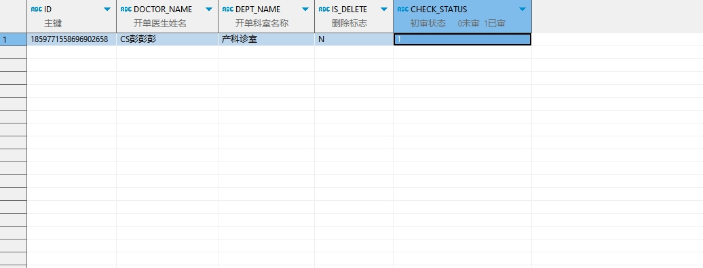

# 领域服务/临床领域 - 保存门诊处方退费申请 - 保存门诊处方退费申请 正向用例
## 请求参数：
``` json
{
  "deptName": "产科诊室",
  "orgCode": "NXRMYY",
  "deptId": "224708989908054016",
  "list": [
    {
      "refundNum": 2,
      "reason": "病人要求,",
      "checkStatus": "1",
      "reCheckStatus": "1",
      "prescId": "82518784615040575344",
      "id": "",
      "prescListId": "82516784615108251648",
      "visitNo": "2024102100004"
    }
  ],
  "operatorId": "282475805660160000",
  "operatorName": "CS彭彭彭"
}
```
## 返回参数：
``` json
{
    "exception": null,
    "apiCode": null,
    "data": [
        {
            "id": "1859771558696902658",
            "sourceId": null
        }
    ],
    "Code": 200,
    "Message": "操作成功"
}
```
## 数据校验：


# 领域服务/临床领域 - 保存门诊处方退费申请 - 必填校验-[orgCode]为空
## 请求参数：
``` json
{
  "deptName": "产科诊室",
  "orgCode": "",
  "deptId": "224708989908054016",
  "list": [
    {
      "refundNum": 2,
      "reason": "病人要求,",
      "checkStatus": "1",
      "reCheckStatus": "1",
      "prescId": "82518784615040575344",
      "id": "",
      "prescListId": "82516784615108251648",
      "visitNo": "2024102100004"
    }
  ],
  "operatorId": "282475805660160000",
  "operatorName": "CS彭彭彭"
}
```
## 返回参数：
``` json
{
  "exception": null,
  "apiCode": null,
  "data": null,
  "Code": 1,
  "Message": "医院编码不能为空"
}
```
# 领域服务/临床领域 - 保存门诊处方退费申请 - 必填校验-[operatorId]为空
## 请求参数：
``` json
{
  "deptName": "产科诊室",
  "orgCode": "NXRMYY",
  "deptId": "224708989908054016",
  "list": [
    {
      "refundNum": 2,
      "reason": "病人要求,",
      "checkStatus": "1",
      "reCheckStatus": "1",
      "prescId": "82518784615040575344",
      "id": "",
      "prescListId": "82516784615108251648",
      "visitNo": "2024102100004"
    }
  ],
  "operatorId": "",
  "operatorName": "CS彭彭彭"
}
```
## 返回参数：
``` json
{
  "exception": null,
  "apiCode": null,
  "data": null,
  "Code": 1,
  "Message": "操作人id不能为空"
}
```
# 领域服务/临床领域 - 保存门诊处方退费申请 - 必填校验-[operatorName]为空
## 请求参数：
``` json
{
  "deptName": "产科诊室",
  "orgCode": "NXRMYY",
  "deptId": "224708989908054016",
  "list": [
    {
      "refundNum": 2,
      "reason": "病人要求,",
      "checkStatus": "1",
      "reCheckStatus": "1",
      "prescId": "82518784615040575344",
      "id": "",
      "prescListId": "82516784615108251648",
      "visitNo": "2024102100004"
    }
  ],
  "operatorId": "282475805660160000",
  "operatorName": ""
}
```
## 返回参数：
``` json
{
  "exception": null,
  "apiCode": null,
  "data": null,
  "Code": 1,
  "Message": "操作人姓名不能为空"
}
```
# 领域服务/临床领域 - 保存门诊处方退费申请 - 必填校验-[deptId]为空
## 请求参数：
``` json
{
  "deptName": "产科诊室",
  "orgCode": "NXRMYY",
  "deptId": "",
  "list": [
    {
      "refundNum": 2,
      "reason": "病人要求,",
      "checkStatus": "1",
      "reCheckStatus": "1",
      "prescId": "82518784615040575344",
      "id": "",
      "prescListId": "82516784615108251648",
      "visitNo": "2024102100004"
    }
  ],
  "operatorId": "282475805660160000",
  "operatorName": "CS彭彭彭"
}
```
## 返回参数：
``` json
{
  "exception": null,
  "apiCode": null,
  "data": null,
  "Code": 1,
  "Message": "申请科室id不能为空"
}
```
# 领域服务/临床领域 - 保存门诊处方退费申请 - 必填校验-[deptName]为空
## 请求参数：
``` json
{
  "deptName": "",
  "orgCode": "NXRMYY",
  "deptId": "224708989908054016",
  "list": [
    {
      "refundNum": 2,
      "reason": "病人要求,",
      "checkStatus": "1",
      "reCheckStatus": "1",
      "prescId": "82518784615040575344",
      "id": "",
      "prescListId": "82516784615108251648",
      "visitNo": "2024102100004"
    }
  ],
  "operatorId": "282475805660160000",
  "operatorName": "CS彭彭彭"
}
```
## 返回参数：
``` json
{
  "exception": null,
  "apiCode": null,
  "data": null,
  "Code": 1,
  "Message": "申请科室名称不能为空"
}
```
# 领域服务/临床领域 - 保存门诊处方退费申请 - 必填校验-[list]为空
## 请求参数：
``` json
{
  "deptName": "产科诊室",
  "orgCode": "NXRMYY",
  "deptId": "224708989908054016",
  "list": null,
  "operatorId": "282475805660160000",
  "operatorName": "CS彭彭彭"
}
```
## 返回参数：
``` json
{
  "exception": null,
  "apiCode": null,
  "data": null,
  "Code": 1,
  "Message": "退费申请集合不能为空"
}
```
# 领域服务/临床领域 - 保存门诊处方退费申请 - 必填校验-[list.prescId]为空
## 请求参数：
``` json
{
  "deptName": "产科诊室",
  "orgCode": "NXRMYY",
  "deptId": "224708989908054016",
  "list": [
    {
      "refundNum": 2,
      "reason": "病人要求,",
      "checkStatus": "1",
      "reCheckStatus": "1",
      "prescId": null,
      "id": "",
      "prescListId": "82516784615108251648",
      "visitNo": "2024102100004"
    }
  ],
  "operatorId": "282475805660160000",
  "operatorName": "CS彭彭彭"
}
```
## 返回参数：
``` json
{
  "exception": null,
  "apiCode": null,
  "data": null,
  "Code": 1,
  "Message": "处方id不能为空"
}
```
# 领域服务/临床领域 - 保存门诊处方退费申请 - 必填校验-[list.visitNo]为空
## 请求参数：
``` json
{
  "deptName": "产科诊室",
  "orgCode": "NXRMYY",
  "deptId": "224708989908054016",
  "list": [
    {
      "refundNum": 2,
      "reason": "病人要求,",
      "checkStatus": "1",
      "reCheckStatus": "1",
      "prescId": "82518784615040575344",
      "id": "",
      "prescListId": "82516784615108251648",
      "visitNo": null
    }
  ],
  "operatorId": "282475805660160000",
  "operatorName": "CS彭彭彭"
}
```
## 返回参数：
``` json
{
  "exception": null,
  "apiCode": null,
  "data": null,
  "Code": 1,
  "Message": "门诊号不能为空"
}
```
# 领域服务/临床领域 - 保存门诊处方退费申请 - 必填校验-[list.prescListId]为空
## 请求参数：
``` json
{
  "deptName": "产科诊室",
  "orgCode": "NXRMYY",
  "deptId": "224708989908054016",
  "list": [
    {
      "refundNum": 2,
      "reason": "病人要求,",
      "checkStatus": "1",
      "reCheckStatus": "1",
      "prescId": "82518784615040575344",
      "id": "",
      "prescListId": null,
      "visitNo": "2024102100004"
    }
  ],
  "operatorId": "282475805660160000",
  "operatorName": "CS彭彭彭"
}
```
## 返回参数：
``` json
{
  "exception": null,
  "apiCode": null,
  "data": null,
  "Code": 1,
  "Message": "处方明细id不能为空"
}
```
# 领域服务/临床领域 - 保存门诊处方退费申请 - 必填校验-[list.refundNum]为空
## 请求参数：
``` json
{
  "deptName": "产科诊室",
  "orgCode": "NXRMYY",
  "deptId": "224708989908054016",
  "list": [
    {
      "refundNum": null,
      "reason": "病人要求,",
      "checkStatus": "1",
      "reCheckStatus": "1",
      "prescId": "82518784615040575344",
      "id": "",
      "prescListId": "82516784615108251648",
      "visitNo": "2024102100004"
    }
  ],
  "operatorId": "282475805660160000",
  "operatorName": "CS彭彭彭"
}
```
## 返回参数：
``` json
{
  "exception": null,
  "apiCode": null,
  "data": null,
  "Code": 1,
  "Message": "退数量不能为空"
}
```
# 领域服务/临床领域 - 保存门诊处方退费申请 - 必填校验-[list.checkStatus]为空
## 请求参数：
``` json
{
  "deptName": "产科诊室",
  "orgCode": "NXRMYY",
  "deptId": "224708989908054016",
  "list": [
    {
      "refundNum": 2,
      "reason": "病人要求,",
      "checkStatus": null,
      "reCheckStatus": "1",
      "prescId": "82518784615040575344",
      "id": "",
      "prescListId": "82516784615108251648",
      "visitNo": "2024102100004"
    }
  ],
  "operatorId": "282475805660160000",
  "operatorName": "CS彭彭彭"
}
```
## 返回参数：
``` json
{
  "exception": null,
  "apiCode": null,
  "data": null,
  "Code": 1,
  "Message": "初审标志不能为空"
}
```
# 领域服务/临床领域 - 保存门诊处方退费申请 - 类型校验-[list.refundNum]类型错误
## 请求参数：
``` json
{
  "deptName": "产科诊室",
  "orgCode": "NXRMYY",
  "deptId": "224708989908054016",
  "list": [
    {
      "refundNum": "\"abc\"",
      "reason": "病人要求,",
      "checkStatus": "1",
      "reCheckStatus": "1",
      "prescId": "82518784615040575344",
      "id": "",
      "prescListId": "82516784615108251648",
      "visitNo": "2024102100004"
    }
  ],
  "operatorId": "282475805660160000",
  "operatorName": "CS彭彭彭"
}
```
## 返回参数：
``` json
{
  "exception": null,
  "apiCode": null,
  "data": null,
  "Code": 1,
  "Message": "请求参数错误"
}
```
# 领域服务/临床领域 - 保存门诊处方退费申请 - 枚举用例-[list.checkStatus] 枚举值为 0(初审标志为否)
## 请求参数：
``` json
{
  "deptName": "产科诊室",
  "orgCode": "NXRMYY",
  "deptId": "224708989908054016",
  "list": [
    {
      "refundNum": 2,
      "reason": "病人要求,",
      "checkStatus": "0",
      "reCheckStatus": "1",
      "prescId": "82518784615040575344",
      "id": "",
      "prescListId": "82516784615108251648",
      "visitNo": "2024102100004"
    }
  ],
  "operatorId": "282475805660160000",
  "operatorName": "CS彭彭彭"
}
```
## 返回参数：
``` json
{
  "exception": null,
  "apiCode": null,
  "data": null,
  "Code": 1201,
  "Message": "存在未初审的退费申请"
}
```
# 领域服务/临床领域 - 保存门诊处方退费申请 - 枚举用例-[list.checkStatus] 枚举值为 1(初审标志为是)
## 请求参数：
``` json
{
  "deptName": "产科诊室",
  "orgCode": "NXRMYY",
  "deptId": "224708989908054016",
  "list": [
    {
      "refundNum": 2,
      "reason": "病人要求,",
      "checkStatus": "1",
      "reCheckStatus": "1",
      "prescId": "82518784615040575344",
      "id": "",
      "prescListId": "82516784615108251648",
      "visitNo": "2024102100004"
    }
  ],
  "operatorId": "282475805660160000",
  "operatorName": "CS彭彭彭"
}
```
## 返回参数：
``` json
{
  "exception": null,
  "apiCode": null,
  "data": null,
  "Code": 1201,
  "Message": "存在未初审的退费申请"
}
```
# 领域服务/临床领域 - 保存门诊处方退费申请 - 依赖用例-[operatorName]赋值为依赖用例测试值
## 请求参数：
``` json
{
  "deptName": "产科诊室",
  "orgCode": "NXRMYY",
  "deptId": "224708989908054016",
  "list": [
    {
      "refundNum": 2,
      "reason": "病人要求,",
      "checkStatus": "1",
      "reCheckStatus": "1",
      "prescId": "82518784615040575344",
      "id": "",
      "prescListId": "82516784615108251648",
      "visitNo": "2024102100004"
    }
  ],
  "operatorId": "282475805660160000",
  "operatorName": "依赖用例测试值"
}
```
## 返回参数：
``` json
{
  "exception": null,
  "apiCode": null,
  "data": null,
  "Code": 1201,
  "Message": "存在未初审的退费申请"
}
```
# 领域服务/临床领域 - 保存门诊处方退费申请 - 依赖用例-[operatorId]赋值为依赖用例测试值
## 请求参数：
``` json
{
  "deptName": "产科诊室",
  "orgCode": "NXRMYY",
  "deptId": "224708989908054016",
  "list": [
    {
      "refundNum": 2,
      "reason": "病人要求,",
      "checkStatus": "1",
      "reCheckStatus": "1",
      "prescId": "82518784615040575344",
      "id": "",
      "prescListId": "82516784615108251648",
      "visitNo": "2024102100004"
    }
  ],
  "operatorId": "依赖用例测试值",
  "operatorName": "CS彭彭彭"
}
```
## 返回参数：
``` json
{
  "exception": null,
  "apiCode": null,
  "data": null,
  "Code": 1201,
  "Message": "存在未初审的退费申请"
}
```
# 领域服务/临床领域 - 保存门诊处方退费申请 - 依赖用例-[list.prescId]赋值为依赖用例测试值
## 请求参数：
``` json
{
  "deptName": "产科诊室",
  "orgCode": "NXRMYY",
  "deptId": "224708989908054016",
  "list": [
    {
      "refundNum": 2,
      "reason": "病人要求,",
      "checkStatus": "1",
      "reCheckStatus": "1",
      "prescId": "依赖用例测试值",
      "id": "",
      "prescListId": "82516784615108251648",
      "visitNo": "2024102100004"
    }
  ],
  "operatorId": "282475805660160000",
  "operatorName": "CS彭彭彭"
}
```
## 返回参数：
``` json
{
  "exception": null,
  "apiCode": null,
  "data": null,
  "Code": 1201,
  "Message": "存在未初审的退费申请"
}
```
# 领域服务/临床领域 - 保存门诊处方退费申请 - 依赖用例-[list.prescListId]赋值为依赖用例测试值
## 请求参数：
``` json
{
  "deptName": "产科诊室",
  "orgCode": "NXRMYY",
  "deptId": "224708989908054016",
  "list": [
    {
      "refundNum": 2,
      "reason": "病人要求,",
      "checkStatus": "1",
      "reCheckStatus": "1",
      "prescId": "82518784615040575344",
      "id": "",
      "prescListId": "依赖用例测试值",
      "visitNo": "2024102100004"
    }
  ],
  "operatorId": "282475805660160000",
  "operatorName": "CS彭彭彭"
}
```
## 返回参数：
``` json
{
  "exception": null,
  "apiCode": null,
  "data": null,
  "Code": 1,
  "Message": "系统内部异常"
}
```
# 领域服务/临床领域 - 保存门诊处方退费申请 - 依赖用例-[list.visitNo]赋值为依赖用例测试值
## 请求参数：
``` json
{
  "deptName": "产科诊室",
  "orgCode": "NXRMYY",
  "deptId": "224708989908054016",
  "list": [
    {
      "refundNum": 2,
      "reason": "病人要求,",
      "checkStatus": "1",
      "reCheckStatus": "1",
      "prescId": "82518784615040575344",
      "id": "",
      "prescListId": "82516784615108251648",
      "visitNo": "依赖用例测试值"
    }
  ],
  "operatorId": "282475805660160000",
  "operatorName": "CS彭彭彭"
}
```
## 返回参数：
``` json
{
  "exception": null,
  "apiCode": null,
  "data": null,
  "Code": 1201,
  "Message": "存在未初审的退费申请"
}
```
# 领域服务/临床领域 - 保存门诊处方退费申请 - 依赖用例-[deptId]赋值为依赖用例测试值
## 请求参数：
``` json
{
  "deptName": "产科诊室",
  "orgCode": "NXRMYY",
  "deptId": "依赖用例测试值",
  "list": [
    {
      "refundNum": 2,
      "reason": "病人要求,",
      "checkStatus": "1",
      "reCheckStatus": "1",
      "prescId": "82518784615040575344",
      "id": "",
      "prescListId": "82516784615108251648",
      "visitNo": "2024102100004"
    }
  ],
  "operatorId": "282475805660160000",
  "operatorName": "CS彭彭彭"
}
```
## 返回参数：
``` json
{
  "exception": null,
  "apiCode": null,
  "data": null,
  "Code": 1201,
  "Message": "存在未初审的退费申请"
}
```
# 领域服务/临床领域 - 保存门诊处方退费申请 - 依赖用例-[orgCode]赋值为依赖用例测试值
## 请求参数：
``` json
{
  "deptName": "产科诊室",
  "orgCode": "依赖用例测试值",
  "deptId": "224708989908054016",
  "list": [
    {
      "refundNum": 2,
      "reason": "病人要求,",
      "checkStatus": "1",
      "reCheckStatus": "1",
      "prescId": "82518784615040575344",
      "id": "",
      "prescListId": "82516784615108251648",
      "visitNo": "2024102100004"
    }
  ],
  "operatorId": "282475805660160000",
  "operatorName": "CS彭彭彭"
}
```
## 返回参数：
``` json
{
  "exception": null,
  "apiCode": null,
  "data": null,
  "Code": 1,
  "Message": "系统内部异常"
}
```
# 领域服务/临床领域 - 保存门诊处方退费申请 - 依赖用例-[deptName]赋值为依赖用例测试值
## 请求参数：
``` json
{
  "deptName": "依赖用例测试值",
  "orgCode": "NXRMYY",
  "deptId": "224708989908054016",
  "list": [
    {
      "refundNum": 2,
      "reason": "病人要求,",
      "checkStatus": "1",
      "reCheckStatus": "1",
      "prescId": "82518784615040575344",
      "id": "",
      "prescListId": "82516784615108251648",
      "visitNo": "2024102100004"
    }
  ],
  "operatorId": "282475805660160000",
  "operatorName": "CS彭彭彭"
}
```
## 返回参数：
``` json
{
  "exception": null,
  "apiCode": null,
  "data": null,
  "Code": 1201,
  "Message": "存在未初审的退费申请"
}
```