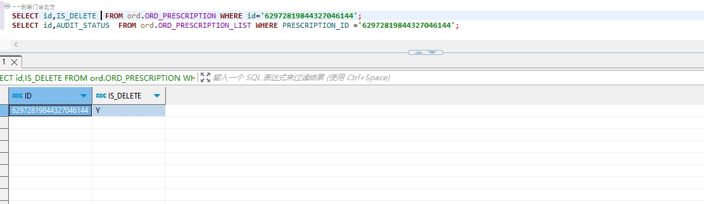

# 领域服务/临床领域 - 删除门诊处方 - 删除门诊处方 正向用例
## 请求参数：
``` json
{
  "hospCode": "NXRY",
  "orgCode": "NXRMYY",
  "deleteBy": "0",
  "operatorId": "20200327091607626",
  "operatorName": "CS邓亮"
}
```
## 返回参数：
``` json
{
    "exception": null,
    "apiCode": null,
    "data": true,
    "Code": 200,
    "Message": "操作成功"
}
```
## 数据校验：

目前功能未使用到该接口，测试返回异常

# 领域服务/临床领域 - 删除门诊处方 - 必填校验-[orgCode]为空
## 请求参数：
``` json
{
  "hospCode": "NXRY",
  "orgCode": "",
  "deleteBy": "0",
  "operatorId": "20200327091607626",
  "operatorName": "CS邓亮"
}
```
## 返回参数：
``` json
{
  "exception": null,
  "apiCode": null,
  "data": null,
  "Code": 1,
  "Message": "医院编码不能为空"
}
```
# 领域服务/临床领域 - 删除门诊处方 - 必填校验-[hospCode]为空
## 请求参数：
``` json
{
  "hospCode": "",
  "orgCode": "NXRMYY",
  "deleteBy": "0",
  "operatorId": "20200327091607626",
  "operatorName": "CS邓亮"
}
```
## 返回参数：
``` json
{
  "exception": null,
  "apiCode": null,
  "data": null,
  "Code": 1,
  "Message": "院区编码不能为空"
}
```
# 领域服务/临床领域 - 删除门诊处方 - 必填校验-[operatorId]为空
## 请求参数：
``` json
{
  "hospCode": "NXRY",
  "orgCode": "NXRMYY",
  "deleteBy": "0",
  "operatorId": "",
  "operatorName": "CS邓亮"
}
```
## 返回参数：
``` json
{
  "exception": null,
  "apiCode": null,
  "data": null,
  "Code": 1,
  "Message": "操作人id不能为空"
}
```
# 领域服务/临床领域 - 删除门诊处方 - 必填校验-[operatorName]为空
## 请求参数：
``` json
{
  "hospCode": "NXRY",
  "orgCode": "NXRMYY",
  "deleteBy": "0",
  "operatorId": "20200327091607626",
  "operatorName": ""
}
```
## 返回参数：
``` json
{
  "exception": null,
  "apiCode": null,
  "data": null,
  "Code": 1,
  "Message": "操作人姓名不能为空"
}
```
# 领域服务/临床领域 - 删除门诊处方 - 必填校验-[deleteBy]为空
## 请求参数：
``` json
{
  "hospCode": "NXRY",
  "orgCode": "NXRMYY",
  "deleteBy": "",
  "operatorId": "20200327091607626",
  "operatorName": "CS邓亮"
}
```
## 返回参数：
``` json
{
  "exception": null,
  "apiCode": null,
  "data": null,
  "Code": 1,
  "Message": "删除依据不能为空 \n 删除依据，0-按处方id集合进行删除  1-按第三方处方id集合进行删除"
}
```
# 领域服务/临床领域 - 删除门诊处方 - 枚举用例-[deleteBy] 枚举值为 0(删除依据为按处方id集合进行删除)
## 请求参数：
``` json
{
  "hospCode": "NXRY",
  "orgCode": "NXRMYY",
  "deleteBy": "0",
  "operatorId": "20200327091607626",
  "operatorName": "CS邓亮"
}
```
## 返回参数：
``` json
{
  "exception": null,
  "apiCode": null,
  "data": null,
  "Code": 1,
  "Message": "删除依据为0时，处方id不能为空"
}
```
# 领域服务/临床领域 - 删除门诊处方 - 枚举用例-[deleteBy] 枚举值为 1(删除依据为按源处方id集合进行删除)
## 请求参数：
``` json
{
  "hospCode": "NXRY",
  "orgCode": "NXRMYY",
  "deleteBy": "1",
  "operatorId": "20200327091607626",
  "operatorName": "CS邓亮"
}
```
## 返回参数：
``` json
{
  "exception": null,
  "apiCode": null,
  "data": null,
  "Code": 1,
  "Message": "删除依据为1时，源处方id不能为空"
}
```
# 领域服务/临床领域 - 删除门诊处方 - 依赖用例-[operatorName]赋值为依赖用例测试值
## 请求参数：
``` json
{
  "hospCode": "NXRY",
  "orgCode": "NXRMYY",
  "deleteBy": "0",
  "operatorId": "20200327091607626",
  "operatorName": "依赖用例测试值"
}
```
## 返回参数：
``` json
{
  "exception": null,
  "apiCode": null,
  "data": null,
  "Code": 1,
  "Message": "删除依据为0时，处方id不能为空"
}
```
# 领域服务/临床领域 - 删除门诊处方 - 依赖用例-[operatorId]赋值为依赖用例测试值
## 请求参数：
``` json
{
  "hospCode": "NXRY",
  "orgCode": "NXRMYY",
  "deleteBy": "0",
  "operatorId": "依赖用例测试值",
  "operatorName": "CS邓亮"
}
```
## 返回参数：
``` json
{
  "exception": null,
  "apiCode": null,
  "data": null,
  "Code": 1,
  "Message": "删除依据为0时，处方id不能为空"
}
```
# 领域服务/临床领域 - 删除门诊处方 - 依赖用例-[orgCode]赋值为依赖用例测试值
## 请求参数：
``` json
{
  "hospCode": "NXRY",
  "orgCode": "依赖用例测试值",
  "deleteBy": "0",
  "operatorId": "20200327091607626",
  "operatorName": "CS邓亮"
}
```
## 返回参数：
``` json
{
  "exception": null,
  "apiCode": null,
  "data": null,
  "Code": 1,
  "Message": "删除依据为0时，处方id不能为空"
}
```
# 领域服务/临床领域 - 删除门诊处方 - 依赖用例-[hospCode]赋值为依赖用例测试值
## 请求参数：
``` json
{
  "hospCode": "依赖用例测试值",
  "orgCode": "NXRMYY",
  "deleteBy": "0",
  "operatorId": "20200327091607626",
  "operatorName": "CS邓亮"
}
```
## 返回参数：
``` json
{
  "exception": null,
  "apiCode": null,
  "data": null,
  "Code": 1,
  "Message": "删除依据为0时，处方id不能为空"
}
```