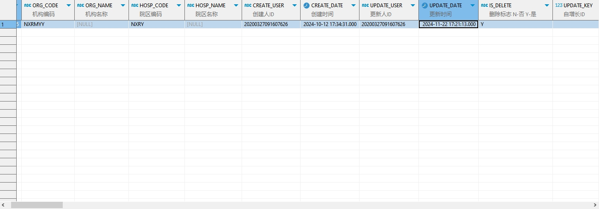

# 领域服务/临床领域 - 删除门诊处方草稿 - 删除门诊处方草稿 正向用例
## 请求参数：
``` json
{
  "hospCode": "NXRY",
  "orgCode": "NXRMYY",
  "operateType": "1",
  "operatorId": "20200327091607626",
  "operatorName": "CS邓亮",
  "ids": [
    "1845035307326595075"
  ]
}
```
## 返回参数：
``` json
{
  "exception": null,
  "apiCode": null,
  "data": true,
  "Code": 200,
  "Message": "操作成功"
}
```
## 数据校验：


# 领域服务/临床领域 - 删除门诊处方草稿 - 必填校验-[orgCode]为空
## 请求参数：
``` json
{
  "hospCode": "NXRY",
  "orgCode": "",
  "operateType": "2",
  "operatorId": "20200327091607626",
  "operatorName": "CS邓亮",
  "sourceIds": [
    "0c2623"
  ]
}
```
## 返回参数：
``` json
{
  "exception": null,
  "apiCode": null,
  "data": null,
  "Code": 1,
  "Message": "医院编码不能为空"
}
```
# 领域服务/临床领域 - 删除门诊处方草稿 - 必填校验-[hospCode]为空
## 请求参数：
``` json
{
  "hospCode": "",
  "orgCode": "NXRMYY",
  "operateType": "2",
  "operatorId": "20200327091607626",
  "operatorName": "CS邓亮",
  "sourceIds": [
    "0c2623"
  ]
}
```
## 返回参数：
``` json
{
  "exception": null,
  "apiCode": null,
  "data": null,
  "Code": 1,
  "Message": "院区编码不能为空"
}
```
# 领域服务/临床领域 - 删除门诊处方草稿 - 必填校验-[operatorId]为空
## 请求参数：
``` json
{
  "hospCode": "NXRY",
  "orgCode": "NXRMYY",
  "operateType": "2",
  "operatorId": "",
  "operatorName": "CS邓亮",
  "sourceIds": [
    "0c2623"
  ]
}
```
## 返回参数：
``` json
{
  "exception": null,
  "apiCode": null,
  "data": null,
  "Code": 1,
  "Message": "操作人id不能为空"
}
```
# 领域服务/临床领域 - 删除门诊处方草稿 - 必填校验-[operatorName]为空
## 请求参数：
``` json
{
  "hospCode": "NXRY",
  "orgCode": "NXRMYY",
  "operateType": "2",
  "operatorId": "20200327091607626",
  "operatorName": "",
  "sourceIds": [
    "0c2623"
  ]
}
```
## 返回参数：
``` json
{
  "exception": null,
  "apiCode": null,
  "data": null,
  "Code": 1,
  "Message": "操作人姓名不能为空"
}
```
# 领域服务/临床领域 - 删除门诊处方草稿 - 必填校验-[operateType]为空
## 请求参数：
``` json
{
  "hospCode": "NXRY",
  "orgCode": "NXRMYY",
  "operateType": "",
  "operatorId": "20200327091607626",
  "operatorName": "CS邓亮",
  "sourceIds": [
    "0c2623"
  ]
}
```
## 返回参数：
``` json
{
  "exception": null,
  "apiCode": null,
  "data": null,
  "Code": 1,
  "Message": "操作类型不能为空"
}
```
# 领域服务/临床领域 - 删除门诊处方草稿 - 枚举用例-[operateType] 枚举值为 1(操作类型为按草稿id集合删除)
## 请求参数：
``` json
{
  "hospCode": "NXRY",
  "orgCode": "NXRMYY",
  "operateType": "1",
  "operatorId": "20200327091607626",
  "operatorName": "CS邓亮",
  "sourceIds": [
    "0c2623"
  ]
}
```
## 返回参数：
``` json
{
  "exception": null,
  "apiCode": null,
  "data": null,
  "Code": 1100,
  "Message": "草稿id集合不能为空"
}
```
# 领域服务/临床领域 - 删除门诊处方草稿 - 枚举用例-[operateType] 枚举值为 2(操作类型为按草稿源id集合删除)
## 请求参数：
``` json
{
  "hospCode": "NXRY",
  "orgCode": "NXRMYY",
  "operateType": "2",
  "operatorId": "20200327091607626",
  "operatorName": "CS邓亮",
  "sourceIds": [
    "0c2623"
  ]
}
```
## 返回参数：
``` json
{
  "exception": null,
  "apiCode": null,
  "data": true,
  "Code": 200,
  "Message": "操作成功"
}
```
# 领域服务/临床领域 - 删除门诊处方草稿 - 枚举用例-[operateType] 枚举值为 3(操作类型为按挂号id删除)
## 请求参数：
``` json
{
  "hospCode": "NXRY",
  "orgCode": "NXRMYY",
  "operateType": "3",
  "operatorId": "20200327091607626",
  "operatorName": "CS邓亮",
  "sourceIds": [
    "0c2623"
  ]
}
```
## 返回参数：
``` json
{
  "exception": null,
  "apiCode": null,
  "data": null,
  "Code": 1100,
  "Message": "挂号id不能为空"
}
```
# 领域服务/临床领域 - 删除门诊处方草稿 - 依赖用例-[operatorName]赋值为依赖用例测试值
## 请求参数：
``` json
{
  "hospCode": "NXRY",
  "orgCode": "NXRMYY",
  "operateType": "2",
  "operatorId": "20200327091607626",
  "operatorName": "依赖用例测试值",
  "sourceIds": [
    "0c2623"
  ]
}
```
## 返回参数：
``` json
{
  "exception": null,
  "apiCode": null,
  "data": true,
  "Code": 200,
  "Message": "操作成功"
}
```
# 领域服务/临床领域 - 删除门诊处方草稿 - 依赖用例-[operatorId]赋值为依赖用例测试值
## 请求参数：
``` json
{
  "hospCode": "NXRY",
  "orgCode": "NXRMYY",
  "operateType": "2",
  "operatorId": "依赖用例测试值",
  "operatorName": "CS邓亮",
  "sourceIds": [
    "0c2623"
  ]
}
```
## 返回参数：
``` json
{
  "exception": null,
  "apiCode": null,
  "data": true,
  "Code": 200,
  "Message": "操作成功"
}
```
# 领域服务/临床领域 - 删除门诊处方草稿 - 依赖用例-[orgCode]赋值为依赖用例测试值
## 请求参数：
``` json
{
  "hospCode": "NXRY",
  "orgCode": "依赖用例测试值",
  "operateType": "2",
  "operatorId": "20200327091607626",
  "operatorName": "CS邓亮",
  "sourceIds": [
    "0c2623"
  ]
}
```
## 返回参数：
``` json
{
  "exception": null,
  "apiCode": null,
  "data": true,
  "Code": 200,
  "Message": "操作成功"
}
```
# 领域服务/临床领域 - 删除门诊处方草稿 - 依赖用例-[hospCode]赋值为依赖用例测试值
## 请求参数：
``` json
{
  "hospCode": "依赖用例测试值",
  "orgCode": "NXRMYY",
  "operateType": "2",
  "operatorId": "20200327091607626",
  "operatorName": "CS邓亮",
  "sourceIds": [
    "0c2623"
  ]
}
```
## 返回参数：
``` json
{
  "exception": null,
  "apiCode": null,
  "data": true,
  "Code": 200,
  "Message": "操作成功"
}
```