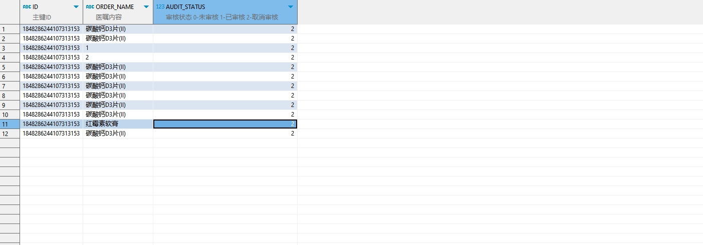

# 领域服务/临床领域 - 取消签署门诊处方 - 取消签署门诊处方 正向用例
## 请求参数：
``` json
{
  "hospCode": "NXRY",
  "orgCode": "NXRMYY",
  "ids": [
    "1848286244107313153"
  ],
  "operatorId": "349365436797001728",
  "operatorName": "测试医生",
  "operateDate": "2024-10-21 16:52:44"
}
```
## 返回参数：
``` json
{
  "exception": null,
  "apiCode": null,
  "data": true,
  "Code": 200,
  "Message": "操作成功"
}
```
## 数据校验：


# 领域服务/临床领域 - 取消签署门诊处方 - 必填校验-[orgCode]为空
## 请求参数：
``` json
{
  "hospCode": "NXRY",
  "orgCode": "",
  "ids": [
    "1848286244107313153"
  ],
  "operatorId": "349365436797001728",
  "operatorName": "测试医生",
  "operateDate": "2024-10-21 16:52:44"
}
```
## 返回参数：
``` json
{
  "exception": null,
  "apiCode": null,
  "data": null,
  "Code": 1,
  "Message": "医院编码不能为空"
}
```
# 领域服务/临床领域 - 取消签署门诊处方 - 必填校验-[hospCode]为空
## 请求参数：
``` json
{
  "hospCode": "",
  "orgCode": "NXRMYY",
  "ids": [
    "1848286244107313153"
  ],
  "operatorId": "349365436797001728",
  "operatorName": "测试医生",
  "operateDate": "2024-10-21 16:52:44"
}
```
## 返回参数：
``` json
{
  "exception": null,
  "apiCode": null,
  "data": null,
  "Code": 1201,
  "Message": "存在已取消签署的处方信息"
}
```
# 领域服务/临床领域 - 取消签署门诊处方 - 必填校验-[operatorId]为空
## 请求参数：
``` json
{
  "hospCode": "NXRY",
  "orgCode": "NXRMYY",
  "ids": [
    "1848286244107313153"
  ],
  "operatorId": "",
  "operatorName": "测试医生",
  "operateDate": "2024-10-21 16:52:44"
}
```
## 返回参数：
``` json
{
  "exception": null,
  "apiCode": null,
  "data": null,
  "Code": 1,
  "Message": "操作人id不能为空"
}
```
# 领域服务/临床领域 - 取消签署门诊处方 - 必填校验-[operatorName]为空
## 请求参数：
``` json
{
  "hospCode": "NXRY",
  "orgCode": "NXRMYY",
  "ids": [
    "1848286244107313153"
  ],
  "operatorId": "349365436797001728",
  "operatorName": "",
  "operateDate": "2024-10-21 16:52:44"
}
```
## 返回参数：
``` json
{
  "exception": null,
  "apiCode": null,
  "data": null,
  "Code": 1,
  "Message": "操作人姓名不能为空"
}
```
# 领域服务/临床领域 - 取消签署门诊处方 - 必填校验-[operateDate]为空
## 请求参数：
``` json
{
  "hospCode": "NXRY",
  "orgCode": "NXRMYY",
  "ids": [
    "1848286244107313153"
  ],
  "operatorId": "349365436797001728",
  "operatorName": "测试医生",
  "operateDate": ""
}
```
## 返回参数：
``` json
{
  "exception": null,
  "apiCode": null,
  "data": null,
  "Code": 1,
  "Message": "操作时间不能为空"
}
```
# 领域服务/临床领域 - 取消签署门诊处方 - 必填校验-[ids]为空
## 请求参数：
``` json
{
  "hospCode": "NXRY",
  "orgCode": "NXRMYY",
  "ids": null,
  "operatorId": "349365436797001728",
  "operatorName": "测试医生",
  "operateDate": "2024-10-21 16:52:44"
}
```
## 返回参数：
``` json
{
  "exception": null,
  "apiCode": null,
  "data": null,
  "Code": 1,
  "Message": "处方id集合不能为空"
}
```
# 领域服务/临床领域 - 取消签署门诊处方 - 类型校验-[ids]类型错误
## 请求参数：
``` json
{
  "hospCode": "NXRY",
  "orgCode": "NXRMYY",
  "ids": "abc",
  "operatorId": "349365436797001728",
  "operatorName": "测试医生",
  "operateDate": "2024-10-21 16:52:44"
}
```
## 返回参数：
``` json
{
  "exception": null,
  "apiCode": null,
  "data": null,
  "Code": 1,
  "Message": "请求参数错误"
}
```
# 领域服务/临床领域 - 取消签署门诊处方 - 依赖用例-[operatorName]赋值为依赖用例测试值
## 请求参数：
``` json
{
  "hospCode": "NXRY",
  "orgCode": "NXRMYY",
  "ids": [
    "1848286244107313153"
  ],
  "operatorId": "349365436797001728",
  "operatorName": "依赖用例测试值",
  "operateDate": "2024-10-21 16:52:44"
}
```
## 返回参数：
``` json
{
  "exception": null,
  "apiCode": null,
  "data": null,
  "Code": 1201,
  "Message": "存在已取消签署的处方信息"
}
```
# 领域服务/临床领域 - 取消签署门诊处方 - 依赖用例-[operatorId]赋值为依赖用例测试值
## 请求参数：
``` json
{
  "hospCode": "NXRY",
  "orgCode": "NXRMYY",
  "ids": [
    "1848286244107313153"
  ],
  "operatorId": "依赖用例测试值",
  "operatorName": "测试医生",
  "operateDate": "2024-10-21 16:52:44"
}
```
## 返回参数：
``` json
{
  "exception": null,
  "apiCode": null,
  "data": null,
  "Code": 1201,
  "Message": "存在已取消签署的处方信息"
}
```
# 领域服务/临床领域 - 取消签署门诊处方 - 依赖用例-[ids]赋值为[依赖用例测试值]
## 请求参数：
``` json
{
  "hospCode": "NXRY",
  "orgCode": "NXRMYY",
  "ids": [
    "依赖用例测试值"
  ],
  "operatorId": "349365436797001728",
  "operatorName": "测试医生",
  "operateDate": "2024-10-21 16:52:44"
}
```
## 返回参数：
``` json
{
  "exception": null,
  "apiCode": null,
  "data": true,
  "Code": 200,
  "Message": "操作成功"
}
```
# 领域服务/临床领域 - 取消签署门诊处方 - 依赖用例-[orgCode]赋值为依赖用例测试值
## 请求参数：
``` json
{
  "hospCode": "NXRY",
  "orgCode": "依赖用例测试值",
  "ids": [
    "1848286244107313153"
  ],
  "operatorId": "349365436797001728",
  "operatorName": "测试医生",
  "operateDate": "2024-10-21 16:52:44"
}
```
## 返回参数：
``` json
{
  "exception": null,
  "apiCode": null,
  "data": null,
  "Code": 1201,
  "Message": "存在已取消签署的处方信息"
}
```
# 领域服务/临床领域 - 取消签署门诊处方 - 依赖用例-[hospCode]赋值为依赖用例测试值
## 请求参数：
``` json
{
  "hospCode": "依赖用例测试值",
  "orgCode": "NXRMYY",
  "ids": [
    "1848286244107313153"
  ],
  "operatorId": "349365436797001728",
  "operatorName": "测试医生",
  "operateDate": "2024-10-21 16:52:44"
}
```
## 返回参数：
``` json
{
  "exception": null,
  "apiCode": null,
  "data": null,
  "Code": 1201,
  "Message": "存在已取消签署的处方信息"
}
```