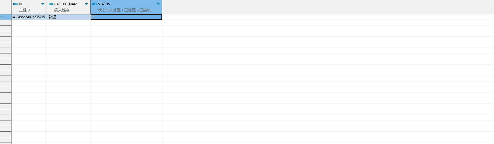

# 领域服务/临床领域 - 处理危急值 - 处理危急值 正向用例
## 请求参数：
``` json
{
  "hospCode": "NXRY",
  "orgCode": "NXRMYY",
  "operatorId": "282475805660160000",
  "operatorName": "CS彭彭彭",
  "list": [
    {
      "id": "433496654095236755",
      "patientId": "1e23c916748f42afa8d1967eb4debc20",
      "visitType": "1",
      "visitId": "b62f9132b62b4539880a76170e604639",
      "visitNo": "2023019205",
      "name": "邬迩",
      "processUserId": "349365436797001728",
      "processUserName": "测试医生",
      "processDeptId": "224707910793326592",
      "processDeptName": "内分泌科(门)",
      "processDesc": "123"
    }
  ]
}
```
## 返回参数：
``` json
{
  "exception": null,
  "apiCode": null,
  "data": null,
  "Code": 200,
  "Message": "操作成功"
}
```
## 数据校验：


# 领域服务/临床领域 - 处理危急值 - 必填校验-[orgCode]为空
## 请求参数：
``` json
{
  "hospCode": "NXRY",
  "orgCode": "",
  "operatorId": "282475805660160000",
  "operatorName": "CS彭彭彭",
  "list": [
    {
      "id": "433496654095236755",
      "patientId": "1e23c916748f42afa8d1967eb4debc20",
      "visitType": "1",
      "visitId": "b62f9132b62b4539880a76170e604639",
      "visitNo": "2023019205",
      "name": "邬迩",
      "processUserId": "349365436797001728",
      "processUserName": "测试医生",
      "processDeptId": "224707910793326592",
      "processDeptName": "内分泌科(门)",
      "processDesc": "123"
    }
  ]
}
```
## 返回参数：
``` json
{
  "exception": null,
  "apiCode": null,
  "data": null,
  "Code": 1,
  "Message": "医院编码不能为空"
}
```
# 领域服务/临床领域 - 处理危急值 - 必填校验-[hospCode]为空
## 请求参数：
``` json
{
  "hospCode": "",
  "orgCode": "NXRMYY",
  "operatorId": "282475805660160000",
  "operatorName": "CS彭彭彭",
  "list": [
    {
      "id": "433496654095236755",
      "patientId": "1e23c916748f42afa8d1967eb4debc20",
      "visitType": "1",
      "visitId": "b62f9132b62b4539880a76170e604639",
      "visitNo": "2023019205",
      "name": "邬迩",
      "processUserId": "349365436797001728",
      "processUserName": "测试医生",
      "processDeptId": "224707910793326592",
      "processDeptName": "内分泌科(门)",
      "processDesc": "123"
    }
  ]
}
```
## 返回参数：
``` json
{
  "exception": null,
  "apiCode": null,
  "data": null,
  "Code": 1,
  "Message": "院区编码不能为空"
}
```
# 领域服务/临床领域 - 处理危急值 - 必填校验-[operatorId]为空
## 请求参数：
``` json
{
  "hospCode": "NXRY",
  "orgCode": "NXRMYY",
  "operatorId": "",
  "operatorName": "CS彭彭彭",
  "list": [
    {
      "id": "433496654095236755",
      "patientId": "1e23c916748f42afa8d1967eb4debc20",
      "visitType": "1",
      "visitId": "b62f9132b62b4539880a76170e604639",
      "visitNo": "2023019205",
      "name": "邬迩",
      "processUserId": "349365436797001728",
      "processUserName": "测试医生",
      "processDeptId": "224707910793326592",
      "processDeptName": "内分泌科(门)",
      "processDesc": "123"
    }
  ]
}
```
## 返回参数：
``` json
{
  "exception": null,
  "apiCode": null,
  "data": null,
  "Code": 1,
  "Message": "操作人id不能为空"
}
```
# 领域服务/临床领域 - 处理危急值 - 必填校验-[operatorName]为空
## 请求参数：
``` json
{
  "hospCode": "NXRY",
  "orgCode": "NXRMYY",
  "operatorId": "282475805660160000",
  "operatorName": "",
  "list": [
    {
      "id": "433496654095236755",
      "patientId": "1e23c916748f42afa8d1967eb4debc20",
      "visitType": "1",
      "visitId": "b62f9132b62b4539880a76170e604639",
      "visitNo": "2023019205",
      "name": "邬迩",
      "processUserId": "349365436797001728",
      "processUserName": "测试医生",
      "processDeptId": "224707910793326592",
      "processDeptName": "内分泌科(门)",
      "processDesc": "123"
    }
  ]
}
```
## 返回参数：
``` json
{
  "exception": null,
  "apiCode": null,
  "data": null,
  "Code": 1,
  "Message": "操作人姓名不能为空"
}
```
# 领域服务/临床领域 - 处理危急值 - 必填校验-[list]为空
## 请求参数：
``` json
{
  "hospCode": "NXRY",
  "orgCode": "NXRMYY",
  "operatorId": "282475805660160000",
  "operatorName": "CS彭彭彭",
  "list": null
}
```
## 返回参数：
``` json
{
  "exception": null,
  "apiCode": null,
  "data": null,
  "Code": 1,
  "Message": "危急值集合不能为空"
}
```
# 领域服务/临床领域 - 处理危急值 - 必填校验-[list.id]为空
## 请求参数：
``` json
{
  "hospCode": "NXRY",
  "orgCode": "NXRMYY",
  "operatorId": "282475805660160000",
  "operatorName": "CS彭彭彭",
  "list": [
    {
      "id": null,
      "patientId": "1e23c916748f42afa8d1967eb4debc20",
      "visitType": "1",
      "visitId": "b62f9132b62b4539880a76170e604639",
      "visitNo": "2023019205",
      "name": "邬迩",
      "processUserId": "349365436797001728",
      "processUserName": "测试医生",
      "processDeptId": "224707910793326592",
      "processDeptName": "内分泌科(门)",
      "processDesc": "123"
    }
  ]
}
```
## 返回参数：
``` json
{
  "exception": null,
  "apiCode": null,
  "data": null,
  "Code": 1,
  "Message": "危急值id不能为空"
}
```
# 领域服务/临床领域 - 处理危急值 - 必填校验-[list.patientId]为空
## 请求参数：
``` json
{
  "hospCode": "NXRY",
  "orgCode": "NXRMYY",
  "operatorId": "282475805660160000",
  "operatorName": "CS彭彭彭",
  "list": [
    {
      "id": "433496654095236755",
      "patientId": null,
      "visitType": "1",
      "visitId": "b62f9132b62b4539880a76170e604639",
      "visitNo": "2023019205",
      "name": "邬迩",
      "processUserId": "349365436797001728",
      "processUserName": "测试医生",
      "processDeptId": "224707910793326592",
      "processDeptName": "内分泌科(门)",
      "processDesc": "123"
    }
  ]
}
```
## 返回参数：
``` json
{
  "exception": null,
  "apiCode": null,
  "data": null,
  "Code": 1,
  "Message": "病人id不能为空"
}
```
# 领域服务/临床领域 - 处理危急值 - 必填校验-[list.visitType]为空
## 请求参数：
``` json
{
  "hospCode": "NXRY",
  "orgCode": "NXRMYY",
  "operatorId": "282475805660160000",
  "operatorName": "CS彭彭彭",
  "list": [
    {
      "id": "433496654095236755",
      "patientId": "1e23c916748f42afa8d1967eb4debc20",
      "visitType": null,
      "visitId": "b62f9132b62b4539880a76170e604639",
      "visitNo": "2023019205",
      "name": "邬迩",
      "processUserId": "349365436797001728",
      "processUserName": "测试医生",
      "processDeptId": "224707910793326592",
      "processDeptName": "内分泌科(门)",
      "processDesc": "123"
    }
  ]
}
```
## 返回参数：
``` json
{
  "exception": null,
  "apiCode": null,
  "data": null,
  "Code": 1,
  "Message": "就诊类型不能为空"
}
```
# 领域服务/临床领域 - 处理危急值 - 必填校验-[list.visitId]为空
## 请求参数：
``` json
{
  "hospCode": "NXRY",
  "orgCode": "NXRMYY",
  "operatorId": "282475805660160000",
  "operatorName": "CS彭彭彭",
  "list": [
    {
      "id": "433496654095236755",
      "patientId": "1e23c916748f42afa8d1967eb4debc20",
      "visitType": "1",
      "visitId": null,
      "visitNo": "2023019205",
      "name": "邬迩",
      "processUserId": "349365436797001728",
      "processUserName": "测试医生",
      "processDeptId": "224707910793326592",
      "processDeptName": "内分泌科(门)",
      "processDesc": "123"
    }
  ]
}
```
## 返回参数：
``` json
{
  "exception": null,
  "apiCode": null,
  "data": null,
  "Code": 1,
  "Message": "就诊id不能为空"
}
```
# 领域服务/临床领域 - 处理危急值 - 必填校验-[list.visitNo]为空
## 请求参数：
``` json
{
  "hospCode": "NXRY",
  "orgCode": "NXRMYY",
  "operatorId": "282475805660160000",
  "operatorName": "CS彭彭彭",
  "list": [
    {
      "id": "433496654095236755",
      "patientId": "1e23c916748f42afa8d1967eb4debc20",
      "visitType": "1",
      "visitId": "b62f9132b62b4539880a76170e604639",
      "visitNo": null,
      "name": "邬迩",
      "processUserId": "349365436797001728",
      "processUserName": "测试医生",
      "processDeptId": "224707910793326592",
      "processDeptName": "内分泌科(门)",
      "processDesc": "123"
    }
  ]
}
```
## 返回参数：
``` json
{
  "exception": null,
  "apiCode": null,
  "data": null,
  "Code": 1,
  "Message": "就诊号不能为空"
}
```
# 领域服务/临床领域 - 处理危急值 - 必填校验-[list.name]为空
## 请求参数：
``` json
{
  "hospCode": "NXRY",
  "orgCode": "NXRMYY",
  "operatorId": "282475805660160000",
  "operatorName": "CS彭彭彭",
  "list": [
    {
      "id": "433496654095236755",
      "patientId": "1e23c916748f42afa8d1967eb4debc20",
      "visitType": "1",
      "visitId": "b62f9132b62b4539880a76170e604639",
      "visitNo": "2023019205",
      "name": null,
      "processUserId": "349365436797001728",
      "processUserName": "测试医生",
      "processDeptId": "224707910793326592",
      "processDeptName": "内分泌科(门)",
      "processDesc": "123"
    }
  ]
}
```
## 返回参数：
``` json
{
  "exception": null,
  "apiCode": null,
  "data": null,
  "Code": 1,
  "Message": "病人姓名不能为空"
}
```
# 领域服务/临床领域 - 处理危急值 - 必填校验-[list.processUserId]为空
## 请求参数：
``` json
{
  "hospCode": "NXRY",
  "orgCode": "NXRMYY",
  "operatorId": "282475805660160000",
  "operatorName": "CS彭彭彭",
  "list": [
    {
      "id": "433496654095236755",
      "patientId": "1e23c916748f42afa8d1967eb4debc20",
      "visitType": "1",
      "visitId": "b62f9132b62b4539880a76170e604639",
      "visitNo": "2023019205",
      "name": "邬迩",
      "processUserId": null,
      "processUserName": "测试医生",
      "processDeptId": "224707910793326592",
      "processDeptName": "内分泌科(门)",
      "processDesc": "123"
    }
  ]
}
```
## 返回参数：
``` json
{
  "exception": null,
  "apiCode": null,
  "data": null,
  "Code": 1,
  "Message": "临床处理人id不能为空"
}
```
# 领域服务/临床领域 - 处理危急值 - 必填校验-[list.processUserName]为空
## 请求参数：
``` json
{
  "hospCode": "NXRY",
  "orgCode": "NXRMYY",
  "operatorId": "282475805660160000",
  "operatorName": "CS彭彭彭",
  "list": [
    {
      "id": "433496654095236755",
      "patientId": "1e23c916748f42afa8d1967eb4debc20",
      "visitType": "1",
      "visitId": "b62f9132b62b4539880a76170e604639",
      "visitNo": "2023019205",
      "name": "邬迩",
      "processUserId": "349365436797001728",
      "processUserName": null,
      "processDeptId": "224707910793326592",
      "processDeptName": "内分泌科(门)",
      "processDesc": "123"
    }
  ]
}
```
## 返回参数：
``` json
{
  "exception": null,
  "apiCode": null,
  "data": null,
  "Code": 1,
  "Message": "临床处理人姓名不能为空"
}
```
# 领域服务/临床领域 - 处理危急值 - 必填校验-[list.processDeptId]为空
## 请求参数：
``` json
{
  "hospCode": "NXRY",
  "orgCode": "NXRMYY",
  "operatorId": "282475805660160000",
  "operatorName": "CS彭彭彭",
  "list": [
    {
      "id": "433496654095236755",
      "patientId": "1e23c916748f42afa8d1967eb4debc20",
      "visitType": "1",
      "visitId": "b62f9132b62b4539880a76170e604639",
      "visitNo": "2023019205",
      "name": "邬迩",
      "processUserId": "349365436797001728",
      "processUserName": "测试医生",
      "processDeptId": null,
      "processDeptName": "内分泌科(门)",
      "processDesc": "123"
    }
  ]
}
```
## 返回参数：
``` json
{
  "exception": null,
  "apiCode": null,
  "data": null,
  "Code": 1,
  "Message": "临床处理科室id不能为空"
}
```
# 领域服务/临床领域 - 处理危急值 - 必填校验-[list.processDeptName]为空
## 请求参数：
``` json
{
  "hospCode": "NXRY",
  "orgCode": "NXRMYY",
  "operatorId": "282475805660160000",
  "operatorName": "CS彭彭彭",
  "list": [
    {
      "id": "433496654095236755",
      "patientId": "1e23c916748f42afa8d1967eb4debc20",
      "visitType": "1",
      "visitId": "b62f9132b62b4539880a76170e604639",
      "visitNo": "2023019205",
      "name": "邬迩",
      "processUserId": "349365436797001728",
      "processUserName": "测试医生",
      "processDeptId": "224707910793326592",
      "processDeptName": null,
      "processDesc": "123"
    }
  ]
}
```
## 返回参数：
``` json
{
  "exception": null,
  "apiCode": null,
  "data": null,
  "Code": 1,
  "Message": "临床处理科室名称不能为空"
}
```
# 领域服务/临床领域 - 处理危急值 - 必填校验-[list.processDesc]为空
## 请求参数：
``` json
{
  "hospCode": "NXRY",
  "orgCode": "NXRMYY",
  "operatorId": "282475805660160000",
  "operatorName": "CS彭彭彭",
  "list": [
    {
      "id": "433496654095236755",
      "patientId": "1e23c916748f42afa8d1967eb4debc20",
      "visitType": "1",
      "visitId": "b62f9132b62b4539880a76170e604639",
      "visitNo": "2023019205",
      "name": "邬迩",
      "processUserId": "349365436797001728",
      "processUserName": "测试医生",
      "processDeptId": "224707910793326592",
      "processDeptName": "内分泌科(门)",
      "processDesc": null
    }
  ]
}
```
## 返回参数：
``` json
{
  "exception": null,
  "apiCode": null,
  "data": null,
  "Code": 1,
  "Message": "处理措施不能为空"
}
```
# 领域服务/临床领域 - 处理危急值 - 枚举用例-[list.visitType] 枚举值为 1(就诊类型为门诊)
## 请求参数：
``` json
{
  "hospCode": "NXRY",
  "orgCode": "NXRMYY",
  "operatorId": "282475805660160000",
  "operatorName": "CS彭彭彭",
  "list": [
    {
      "id": "433496654095236755",
      "patientId": "1e23c916748f42afa8d1967eb4debc20",
      "visitType": "1",
      "visitId": "b62f9132b62b4539880a76170e604639",
      "visitNo": "2023019205",
      "name": "邬迩",
      "processUserId": "349365436797001728",
      "processUserName": "测试医生",
      "processDeptId": "224707910793326592",
      "processDeptName": "内分泌科(门)",
      "processDesc": "123"
    }
  ]
}
```
## 返回参数：
``` json
{
  "exception": null,
  "apiCode": null,
  "data": null,
  "Code": 200,
  "Message": "操作成功"
}
```
# 领域服务/临床领域 - 处理危急值 - 枚举用例-[list.visitType] 枚举值为 2(就诊类型为住院)
## 请求参数：
``` json
{
  "hospCode": "NXRY",
  "orgCode": "NXRMYY",
  "operatorId": "282475805660160000",
  "operatorName": "CS彭彭彭",
  "list": [
    {
      "id": "433496654095236755",
      "patientId": "1e23c916748f42afa8d1967eb4debc20",
      "visitType": "2",
      "visitId": "b62f9132b62b4539880a76170e604639",
      "visitNo": "2023019205",
      "name": "邬迩",
      "processUserId": "349365436797001728",
      "processUserName": "测试医生",
      "processDeptId": "224707910793326592",
      "processDeptName": "内分泌科(门)",
      "processDesc": "123"
    }
  ]
}
```
## 返回参数：
``` json
{
  "exception": null,
  "apiCode": null,
  "data": null,
  "Code": 200,
  "Message": "操作成功"
}
```
# 领域服务/临床领域 - 处理危急值 - 依赖用例-[list.id]赋值为依赖用例测试值
## 请求参数：
``` json
{
  "hospCode": "NXRY",
  "orgCode": "NXRMYY",
  "operatorId": "282475805660160000",
  "operatorName": "CS彭彭彭",
  "list": [
    {
      "id": "依赖用例测试值",
      "patientId": "1e23c916748f42afa8d1967eb4debc20",
      "visitType": "1",
      "visitId": "b62f9132b62b4539880a76170e604639",
      "visitNo": "2023019205",
      "name": "邬迩",
      "processUserId": "349365436797001728",
      "processUserName": "测试医生",
      "processDeptId": "224707910793326592",
      "processDeptName": "内分泌科(门)",
      "processDesc": "123"
    }
  ]
}
```
## 返回参数：
``` json
{
  "exception": null,
  "apiCode": null,
  "data": null,
  "Code": 200,
  "Message": "操作成功"
}
```
# 领域服务/临床领域 - 处理危急值 - 依赖用例-[list.patientId]赋值为依赖用例测试值
## 请求参数：
``` json
{
  "hospCode": "NXRY",
  "orgCode": "NXRMYY",
  "operatorId": "282475805660160000",
  "operatorName": "CS彭彭彭",
  "list": [
    {
      "id": "433496654095236755",
      "patientId": "依赖用例测试值",
      "visitType": "1",
      "visitId": "b62f9132b62b4539880a76170e604639",
      "visitNo": "2023019205",
      "name": "邬迩",
      "processUserId": "349365436797001728",
      "processUserName": "测试医生",
      "processDeptId": "224707910793326592",
      "processDeptName": "内分泌科(门)",
      "processDesc": "123"
    }
  ]
}
```
## 返回参数：
``` json
{
  "exception": null,
  "apiCode": null,
  "data": null,
  "Code": 200,
  "Message": "操作成功"
}
```
# 领域服务/临床领域 - 处理危急值 - 依赖用例-[list.visitId]赋值为依赖用例测试值
## 请求参数：
``` json
{
  "hospCode": "NXRY",
  "orgCode": "NXRMYY",
  "operatorId": "282475805660160000",
  "operatorName": "CS彭彭彭",
  "list": [
    {
      "id": "433496654095236755",
      "patientId": "1e23c916748f42afa8d1967eb4debc20",
      "visitType": "1",
      "visitId": "依赖用例测试值",
      "visitNo": "2023019205",
      "name": "邬迩",
      "processUserId": "349365436797001728",
      "processUserName": "测试医生",
      "processDeptId": "224707910793326592",
      "processDeptName": "内分泌科(门)",
      "processDesc": "123"
    }
  ]
}
```
## 返回参数：
``` json
{
  "exception": null,
  "apiCode": null,
  "data": null,
  "Code": 200,
  "Message": "操作成功"
}
```
# 领域服务/临床领域 - 处理危急值 - 依赖用例-[list.visitNo]赋值为依赖用例测试值
## 请求参数：
``` json
{
  "hospCode": "NXRY",
  "orgCode": "NXRMYY",
  "operatorId": "282475805660160000",
  "operatorName": "CS彭彭彭",
  "list": [
    {
      "id": "433496654095236755",
      "patientId": "1e23c916748f42afa8d1967eb4debc20",
      "visitType": "1",
      "visitId": "b62f9132b62b4539880a76170e604639",
      "visitNo": "依赖用例测试值",
      "name": "邬迩",
      "processUserId": "349365436797001728",
      "processUserName": "测试医生",
      "processDeptId": "224707910793326592",
      "processDeptName": "内分泌科(门)",
      "processDesc": "123"
    }
  ]
}
```
## 返回参数：
``` json
{
  "exception": null,
  "apiCode": null,
  "data": null,
  "Code": 200,
  "Message": "操作成功"
}
```
# 领域服务/临床领域 - 处理危急值 - 依赖用例-[list.name]赋值为依赖用例测试值
## 请求参数：
``` json
{
  "hospCode": "NXRY",
  "orgCode": "NXRMYY",
  "operatorId": "282475805660160000",
  "operatorName": "CS彭彭彭",
  "list": [
    {
      "id": "433496654095236755",
      "patientId": "1e23c916748f42afa8d1967eb4debc20",
      "visitType": "1",
      "visitId": "b62f9132b62b4539880a76170e604639",
      "visitNo": "2023019205",
      "name": "依赖用例测试值",
      "processUserId": "349365436797001728",
      "processUserName": "测试医生",
      "processDeptId": "224707910793326592",
      "processDeptName": "内分泌科(门)",
      "processDesc": "123"
    }
  ]
}
```
## 返回参数：
``` json
{
  "exception": null,
  "apiCode": null,
  "data": null,
  "Code": 200,
  "Message": "操作成功"
}
```
# 领域服务/临床领域 - 处理危急值 - 依赖用例-[list.processUserId]赋值为依赖用例测试值
## 请求参数：
``` json
{
  "hospCode": "NXRY",
  "orgCode": "NXRMYY",
  "operatorId": "282475805660160000",
  "operatorName": "CS彭彭彭",
  "list": [
    {
      "id": "433496654095236755",
      "patientId": "1e23c916748f42afa8d1967eb4debc20",
      "visitType": "1",
      "visitId": "b62f9132b62b4539880a76170e604639",
      "visitNo": "2023019205",
      "name": "邬迩",
      "processUserId": "依赖用例测试值",
      "processUserName": "测试医生",
      "processDeptId": "224707910793326592",
      "processDeptName": "内分泌科(门)",
      "processDesc": "123"
    }
  ]
}
```
## 返回参数：
``` json
{
  "exception": null,
  "apiCode": null,
  "data": null,
  "Code": 200,
  "Message": "操作成功"
}
```
# 领域服务/临床领域 - 处理危急值 - 依赖用例-[list.processUserName]赋值为依赖用例测试值
## 请求参数：
``` json
{
  "hospCode": "NXRY",
  "orgCode": "NXRMYY",
  "operatorId": "282475805660160000",
  "operatorName": "CS彭彭彭",
  "list": [
    {
      "id": "433496654095236755",
      "patientId": "1e23c916748f42afa8d1967eb4debc20",
      "visitType": "1",
      "visitId": "b62f9132b62b4539880a76170e604639",
      "visitNo": "2023019205",
      "name": "邬迩",
      "processUserId": "349365436797001728",
      "processUserName": "依赖用例测试值",
      "processDeptId": "224707910793326592",
      "processDeptName": "内分泌科(门)",
      "processDesc": "123"
    }
  ]
}
```
## 返回参数：
``` json
{
  "exception": null,
  "apiCode": null,
  "data": null,
  "Code": 200,
  "Message": "操作成功"
}
```
# 领域服务/临床领域 - 处理危急值 - 依赖用例-[list.processDeptId]赋值为依赖用例测试值
## 请求参数：
``` json
{
  "hospCode": "NXRY",
  "orgCode": "NXRMYY",
  "operatorId": "282475805660160000",
  "operatorName": "CS彭彭彭",
  "list": [
    {
      "id": "433496654095236755",
      "patientId": "1e23c916748f42afa8d1967eb4debc20",
      "visitType": "1",
      "visitId": "b62f9132b62b4539880a76170e604639",
      "visitNo": "2023019205",
      "name": "邬迩",
      "processUserId": "349365436797001728",
      "processUserName": "测试医生",
      "processDeptId": "依赖用例测试值",
      "processDeptName": "内分泌科(门)",
      "processDesc": "123"
    }
  ]
}
```
## 返回参数：
``` json
{
  "exception": null,
  "apiCode": null,
  "data": null,
  "Code": 200,
  "Message": "操作成功"
}
```
# 领域服务/临床领域 - 处理危急值 - 依赖用例-[list.processDeptName]赋值为依赖用例测试值
## 请求参数：
``` json
{
  "hospCode": "NXRY",
  "orgCode": "NXRMYY",
  "operatorId": "282475805660160000",
  "operatorName": "CS彭彭彭",
  "list": [
    {
      "id": "433496654095236755",
      "patientId": "1e23c916748f42afa8d1967eb4debc20",
      "visitType": "1",
      "visitId": "b62f9132b62b4539880a76170e604639",
      "visitNo": "2023019205",
      "name": "邬迩",
      "processUserId": "349365436797001728",
      "processUserName": "测试医生",
      "processDeptId": "224707910793326592",
      "processDeptName": "依赖用例测试值",
      "processDesc": "123"
    }
  ]
}
```
## 返回参数：
``` json
{
  "exception": null,
  "apiCode": null,
  "data": null,
  "Code": 200,
  "Message": "操作成功"
}
```
# 领域服务/临床领域 - 处理危急值 - 依赖用例-[operatorName]赋值为依赖用例测试值
## 请求参数：
``` json
{
  "hospCode": "NXRY",
  "orgCode": "NXRMYY",
  "operatorId": "282475805660160000",
  "operatorName": "依赖用例测试值",
  "list": [
    {
      "id": "433496654095236755",
      "patientId": "1e23c916748f42afa8d1967eb4debc20",
      "visitType": "1",
      "visitId": "b62f9132b62b4539880a76170e604639",
      "visitNo": "2023019205",
      "name": "邬迩",
      "processUserId": "349365436797001728",
      "processUserName": "测试医生",
      "processDeptId": "224707910793326592",
      "processDeptName": "内分泌科(门)",
      "processDesc": "123"
    }
  ]
}
```
## 返回参数：
``` json
{
  "exception": null,
  "apiCode": null,
  "data": null,
  "Code": 200,
  "Message": "操作成功"
}
```
# 领域服务/临床领域 - 处理危急值 - 依赖用例-[operatorId]赋值为依赖用例测试值
## 请求参数：
``` json
{
  "hospCode": "NXRY",
  "orgCode": "NXRMYY",
  "operatorId": "依赖用例测试值",
  "operatorName": "CS彭彭彭",
  "list": [
    {
      "id": "433496654095236755",
      "patientId": "1e23c916748f42afa8d1967eb4debc20",
      "visitType": "1",
      "visitId": "b62f9132b62b4539880a76170e604639",
      "visitNo": "2023019205",
      "name": "邬迩",
      "processUserId": "349365436797001728",
      "processUserName": "测试医生",
      "processDeptId": "224707910793326592",
      "processDeptName": "内分泌科(门)",
      "processDesc": "123"
    }
  ]
}
```
## 返回参数：
``` json
{
  "exception": null,
  "apiCode": null,
  "data": null,
  "Code": 200,
  "Message": "操作成功"
}
```
# 领域服务/临床领域 - 处理危急值 - 依赖用例-[orgCode]赋值为依赖用例测试值
## 请求参数：
``` json
{
  "hospCode": "NXRY",
  "orgCode": "依赖用例测试值",
  "operatorId": "282475805660160000",
  "operatorName": "CS彭彭彭",
  "list": [
    {
      "id": "433496654095236755",
      "patientId": "1e23c916748f42afa8d1967eb4debc20",
      "visitType": "1",
      "visitId": "b62f9132b62b4539880a76170e604639",
      "visitNo": "2023019205",
      "name": "邬迩",
      "processUserId": "349365436797001728",
      "processUserName": "测试医生",
      "processDeptId": "224707910793326592",
      "processDeptName": "内分泌科(门)",
      "processDesc": "123"
    }
  ]
}
```
## 返回参数：
``` json
{
  "exception": null,
  "apiCode": null,
  "data": null,
  "Code": 200,
  "Message": "操作成功"
}
```
# 领域服务/临床领域 - 处理危急值 - 依赖用例-[hospCode]赋值为依赖用例测试值
## 请求参数：
``` json
{
  "hospCode": "依赖用例测试值",
  "orgCode": "NXRMYY",
  "operatorId": "282475805660160000",
  "operatorName": "CS彭彭彭",
  "list": [
    {
      "id": "433496654095236755",
      "patientId": "1e23c916748f42afa8d1967eb4debc20",
      "visitType": "1",
      "visitId": "b62f9132b62b4539880a76170e604639",
      "visitNo": "2023019205",
      "name": "邬迩",
      "processUserId": "349365436797001728",
      "processUserName": "测试医生",
      "processDeptId": "224707910793326592",
      "processDeptName": "内分泌科(门)",
      "processDesc": "123"
    }
  ]
}
```
## 返回参数：
``` json
{
  "exception": null,
  "apiCode": null,
  "data": null,
  "Code": 200,
  "Message": "操作成功"
}
```