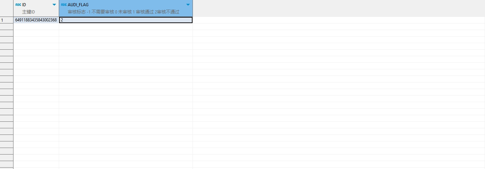

# 领域服务/临床领域 - 审核门诊抗菌药用药申请 - 审核门诊抗菌药用药申请 正向用例
## 请求参数：
``` json
{
  "hospCode": "NXRY",
  "orgCode": "NXRMYY",
  "operatorId": "282475805660160000",
  "operatorName": "CS彭彭彭",
  "ids": [
    "64911883435843002368"
  ],
  "audiFlag": "2"
}
```
## 返回参数：
``` json
{
  "exception": null,
  "apiCode": null,
  "data": true,
  "Code": 200,
  "Message": "操作成功"
}
```
## 数据校验：


# 领域服务/临床领域 - 审核门诊抗菌药用药申请 - 必填校验-[orgCode]为空
## 请求参数：
``` json
{
  "hospCode": "NXRY",
  "orgCode": "",
  "operatorId": "282475805660160000",
  "operatorName": "CS彭彭彭",
  "ids": [
    "64911883435843002368"
  ],
  "audiFlag": "1"
}
```
## 返回参数：
``` json
{
  "exception": null,
  "apiCode": null,
  "data": null,
  "Code": 1,
  "Message": "不能为空"
}
```
# 领域服务/临床领域 - 审核门诊抗菌药用药申请 - 必填校验-[hospCode]为空
## 请求参数：
``` json
{
  "hospCode": "",
  "orgCode": "NXRMYY",
  "operatorId": "282475805660160000",
  "operatorName": "CS彭彭彭",
  "ids": [
    "64911883435843002368"
  ],
  "audiFlag": "1"
}
```
## 返回参数：
``` json
{
  "exception": null,
  "apiCode": null,
  "data": null,
  "Code": 1,
  "Message": "不能为空"
}
```
# 领域服务/临床领域 - 审核门诊抗菌药用药申请 - 必填校验-[operatorId]为空
## 请求参数：
``` json
{
  "hospCode": "NXRY",
  "orgCode": "NXRMYY",
  "operatorId": "",
  "operatorName": "CS彭彭彭",
  "ids": [
    "64911883435843002368"
  ],
  "audiFlag": "1"
}
```
## 返回参数：
``` json
{
  "exception": null,
  "apiCode": null,
  "data": null,
  "Code": 1,
  "Message": "不能为空"
}
```
# 领域服务/临床领域 - 审核门诊抗菌药用药申请 - 必填校验-[operatorName]为空
## 请求参数：
``` json
{
  "hospCode": "NXRY",
  "orgCode": "NXRMYY",
  "operatorId": "282475805660160000",
  "operatorName": "",
  "ids": [
    "64911883435843002368"
  ],
  "audiFlag": "1"
}
```
## 返回参数：
``` json
{
  "exception": null,
  "apiCode": null,
  "data": null,
  "Code": 1,
  "Message": "不能为空"
}
```
# 领域服务/临床领域 - 审核门诊抗菌药用药申请 - 必填校验-[audiFlag]为空
## 请求参数：
``` json
{
  "hospCode": "NXRY",
  "orgCode": "NXRMYY",
  "operatorId": "282475805660160000",
  "operatorName": "CS彭彭彭",
  "ids": [
    "64911883435843002368"
  ],
  "audiFlag": ""
}
```
## 返回参数：
``` json
{
  "exception": null,
  "apiCode": null,
  "data": null,
  "Code": 1,
  "Message": "不能为空"
}
```
# 领域服务/临床领域 - 审核门诊抗菌药用药申请 - 枚举用例-[audiFlag] 枚举值为 1(审核标志为审核通过)
## 请求参数：
``` json
{
  "hospCode": "NXRY",
  "orgCode": "NXRMYY",
  "operatorId": "282475805660160000",
  "operatorName": "CS彭彭彭",
  "ids": [
    "64911883435843002368"
  ],
  "audiFlag": "1"
}
```
## 返回参数：
``` json
{
  "exception": null,
  "apiCode": null,
  "data": true,
  "Code": 200,
  "Message": "操作成功"
}
```
# 领域服务/临床领域 - 审核门诊抗菌药用药申请 - 枚举用例-[audiFlag] 枚举值为 2(审核标志为审核不通过)
## 请求参数：
``` json
{
  "hospCode": "NXRY",
  "orgCode": "NXRMYY",
  "operatorId": "282475805660160000",
  "operatorName": "CS彭彭彭",
  "ids": [
    "64911883435843002368"
  ],
  "audiFlag": "2"
}
```
## 返回参数：
``` json
{
  "exception": null,
  "apiCode": null,
  "data": true,
  "Code": 200,
  "Message": "操作成功"
}
```
# 领域服务/临床领域 - 审核门诊抗菌药用药申请 - 依赖用例-[operatorName]赋值为依赖用例测试值
## 请求参数：
``` json
{
  "hospCode": "NXRY",
  "orgCode": "NXRMYY",
  "operatorId": "282475805660160000",
  "operatorName": "依赖用例测试值",
  "ids": [
    "64911883435843002368"
  ],
  "audiFlag": "1"
}
```
## 返回参数：
``` json
{
  "exception": null,
  "apiCode": null,
  "data": true,
  "Code": 200,
  "Message": "操作成功"
}
```
# 领域服务/临床领域 - 审核门诊抗菌药用药申请 - 依赖用例-[operatorId]赋值为依赖用例测试值
## 请求参数：
``` json
{
  "hospCode": "NXRY",
  "orgCode": "NXRMYY",
  "operatorId": "依赖用例测试值",
  "operatorName": "CS彭彭彭",
  "ids": [
    "64911883435843002368"
  ],
  "audiFlag": "1"
}
```
## 返回参数：
``` json
{
  "exception": null,
  "apiCode": null,
  "data": true,
  "Code": 200,
  "Message": "操作成功"
}
```
# 领域服务/临床领域 - 审核门诊抗菌药用药申请 - 依赖用例-[orgCode]赋值为依赖用例测试值
## 请求参数：
``` json
{
  "hospCode": "NXRY",
  "orgCode": "依赖用例测试值",
  "operatorId": "282475805660160000",
  "operatorName": "CS彭彭彭",
  "ids": [
    "64911883435843002368"
  ],
  "audiFlag": "1"
}
```
## 返回参数：
``` json
{
  "exception": null,
  "apiCode": null,
  "data": false,
  "Code": 200,
  "Message": "操作成功"
}
```
# 领域服务/临床领域 - 审核门诊抗菌药用药申请 - 依赖用例-[hospCode]赋值为依赖用例测试值
## 请求参数：
``` json
{
  "hospCode": "依赖用例测试值",
  "orgCode": "NXRMYY",
  "operatorId": "282475805660160000",
  "operatorName": "CS彭彭彭",
  "ids": [
    "64911883435843002368"
  ],
  "audiFlag": "1"
}
```
## 返回参数：
``` json
{
  "exception": null,
  "apiCode": null,
  "data": false,
  "Code": 200,
  "Message": "操作成功"
}
```