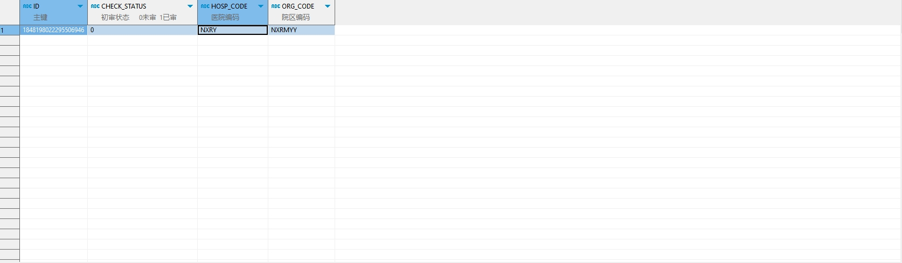

# 领域服务/临床领域 - 更新门诊处方退费申请状态 - 更新门诊处方退费申请状态 正向用例
## 请求参数：
``` json
{
  "hospCode": "NXRY",
  "orgCode": "NXRMYY",
  "statusValue": "0",
  "operateType": "12",
  "ids": [
    "1848198022295506946"
  ],
  "operatorId": "282475805660160000",
  "operatorName": "CS彭彭彭"
}
```
## 返回参数：
``` json
{
  "exception": null,
  "apiCode": null,
  "data": false,
  "Code": 200,
  "Message": "操作成功"
}
```
## 数据校验：


# 领域服务/临床领域 - 更新门诊处方退费申请状态 - 必填校验-[orgCode]为空
## 请求参数：
``` json
{
  "hospCode": "NXRY",
  "orgCode": "",
  "statusValue": "0",
  "operateType": "12",
  "ids": [
    "1848198022295506946"
  ],
  "operatorId": "282475805660160000",
  "operatorName": "CS彭彭彭"
}
```
## 返回参数：
``` json
{
  "exception": null,
  "apiCode": null,
  "data": null,
  "Code": 1,
  "Message": "医院编码不能为空"
}
```
# 领域服务/临床领域 - 更新门诊处方退费申请状态 - 必填校验-[hospCode]为空
## 请求参数：
``` json
{
  "hospCode": "",
  "orgCode": "NXRMYY",
  "statusValue": "0",
  "operateType": "12",
  "ids": [
    "1848198022295506946"
  ],
  "operatorId": "282475805660160000",
  "operatorName": "CS彭彭彭"
}
```
## 返回参数：
``` json
{
  "exception": null,
  "apiCode": null,
  "data": null,
  "Code": 1,
  "Message": "院区编码不能为空"
}
```
# 领域服务/临床领域 - 更新门诊处方退费申请状态 - 必填校验-[operatorId]为空
## 请求参数：
``` json
{
  "hospCode": "NXRY",
  "orgCode": "NXRMYY",
  "statusValue": "0",
  "operateType": "12",
  "ids": [
    "1848198022295506946"
  ],
  "operatorId": "",
  "operatorName": "CS彭彭彭"
}
```
## 返回参数：
``` json
{
  "exception": null,
  "apiCode": null,
  "data": null,
  "Code": 1,
  "Message": "操作人id不能为空"
}
```
# 领域服务/临床领域 - 更新门诊处方退费申请状态 - 必填校验-[operatorName]为空
## 请求参数：
``` json
{
  "hospCode": "NXRY",
  "orgCode": "NXRMYY",
  "statusValue": "0",
  "operateType": "12",
  "ids": [
    "1848198022295506946"
  ],
  "operatorId": "282475805660160000",
  "operatorName": ""
}
```
## 返回参数：
``` json
{
  "exception": null,
  "apiCode": null,
  "data": null,
  "Code": 1,
  "Message": "操作人姓名不能为空"
}
```
# 领域服务/临床领域 - 更新门诊处方退费申请状态 - 必填校验-[operateType]为空
## 请求参数：
``` json
{
  "hospCode": "NXRY",
  "orgCode": "NXRMYY",
  "statusValue": "0",
  "operateType": "",
  "ids": [
    "1848198022295506946"
  ],
  "operatorId": "282475805660160000",
  "operatorName": "CS彭彭彭"
}
```
## 返回参数：
``` json
{
  "exception": null,
  "apiCode": null,
  "data": null,
  "Code": 1,
  "Message": "操作类型不能为空"
}
```
# 领域服务/临床领域 - 更新门诊处方退费申请状态 - 必填校验-[statusValue]为空
## 请求参数：
``` json
{
  "hospCode": "NXRY",
  "orgCode": "NXRMYY",
  "statusValue": "",
  "operateType": "12",
  "ids": [
    "1848198022295506946"
  ],
  "operatorId": "282475805660160000",
  "operatorName": "CS彭彭彭"
}
```
## 返回参数：
``` json
{
  "exception": null,
  "apiCode": null,
  "data": null,
  "Code": 1,
  "Message": "状态值不能为空"
}
```
# 领域服务/临床领域 - 更新门诊处方退费申请状态 - 必填校验-[ids]为空
## 请求参数：
``` json
{
  "hospCode": "NXRY",
  "orgCode": "NXRMYY",
  "statusValue": "0",
  "operateType": "12",
  "ids": null,
  "operatorId": "282475805660160000",
  "operatorName": "CS彭彭彭"
}
```
## 返回参数：
``` json
{
  "exception": null,
  "apiCode": null,
  "data": null,
  "Code": 1,
  "Message": "退费申请id集合不能为空"
}
```
# 领域服务/临床领域 - 更新门诊处方退费申请状态 - 类型校验-[ids]类型错误
## 请求参数：
``` json
{
  "hospCode": "NXRY",
  "orgCode": "NXRMYY",
  "statusValue": "0",
  "operateType": "12",
  "ids": "abc",
  "operatorId": "282475805660160000",
  "operatorName": "CS彭彭彭"
}
```
## 返回参数：
``` json
{
  "exception": null,
  "apiCode": null,
  "data": null,
  "Code": 1,
  "Message": "请求参数错误"
}
```
# 领域服务/临床领域 - 更新门诊处方退费申请状态 - 枚举用例-[operateType] 枚举值为 1(操作类型为更新初审标志)
## 请求参数：
``` json
{
  "hospCode": "NXRY",
  "orgCode": "NXRMYY",
  "statusValue": "0",
  "operateType": "1",
  "ids": [
    "1848198022295506946"
  ],
  "operatorId": "282475805660160000",
  "operatorName": "CS彭彭彭"
}
```
## 返回参数：
``` json
{
  "exception": null,
  "apiCode": null,
  "data": false,
  "Code": 200,
  "Message": "操作成功"
}
```
# 领域服务/临床领域 - 更新门诊处方退费申请状态 - 枚举用例-[operateType] 枚举值为 2(操作类型为更新复审标志)
## 请求参数：
``` json
{
  "hospCode": "NXRY",
  "orgCode": "NXRMYY",
  "statusValue": "0",
  "operateType": "2",
  "ids": [
    "1848198022295506946"
  ],
  "operatorId": "282475805660160000",
  "operatorName": "CS彭彭彭"
}
```
## 返回参数：
``` json
{
  "exception": null,
  "apiCode": null,
  "data": false,
  "Code": 200,
  "Message": "操作成功"
}
```
# 领域服务/临床领域 - 更新门诊处方退费申请状态 - 枚举用例-[operateType] 枚举值为 3(操作类型为更新退费标志)
## 请求参数：
``` json
{
  "hospCode": "NXRY",
  "orgCode": "NXRMYY",
  "statusValue": "0",
  "operateType": "3",
  "ids": [
    "1848198022295506946"
  ],
  "operatorId": "282475805660160000",
  "operatorName": "CS彭彭彭"
}
```
## 返回参数：
``` json
{
  "exception": null,
  "apiCode": null,
  "data": true,
  "Code": 200,
  "Message": "操作成功"
}
```
# 领域服务/临床领域 - 更新门诊处方退费申请状态 - 枚举用例-[operateType] 枚举值为 12(操作类型为更新(初审+复审)标志)
## 请求参数：
``` json
{
  "hospCode": "NXRY",
  "orgCode": "NXRMYY",
  "statusValue": "0",
  "operateType": "12",
  "ids": [
    "1848198022295506946"
  ],
  "operatorId": "282475805660160000",
  "operatorName": "CS彭彭彭"
}
```
## 返回参数：
``` json
{
  "exception": null,
  "apiCode": null,
  "data": false,
  "Code": 200,
  "Message": "操作成功"
}
```
# 领域服务/临床领域 - 更新门诊处方退费申请状态 - 枚举用例-[statusValue] 枚举值为 0(状态值为未审)
## 请求参数：
``` json
{
  "hospCode": "NXRY",
  "orgCode": "NXRMYY",
  "statusValue": "0",
  "operateType": "12",
  "ids": [
    "1848198022295506946"
  ],
  "operatorId": "282475805660160000",
  "operatorName": "CS彭彭彭"
}
```
## 返回参数：
``` json
{
  "exception": null,
  "apiCode": null,
  "data": false,
  "Code": 200,
  "Message": "操作成功"
}
```
# 领域服务/临床领域 - 更新门诊处方退费申请状态 - 枚举用例-[statusValue] 枚举值为 1(状态值为已审)
## 请求参数：
``` json
{
  "hospCode": "NXRY",
  "orgCode": "NXRMYY",
  "statusValue": "1",
  "operateType": "12",
  "ids": [
    "1848198022295506946"
  ],
  "operatorId": "282475805660160000",
  "operatorName": "CS彭彭彭"
}
```
## 返回参数：
``` json
{
  "exception": null,
  "apiCode": null,
  "data": true,
  "Code": 200,
  "Message": "操作成功"
}
```
# 领域服务/临床领域 - 更新门诊处方退费申请状态 - 依赖用例-[operatorName]赋值为依赖用例测试值
## 请求参数：
``` json
{
  "hospCode": "NXRY",
  "orgCode": "NXRMYY",
  "statusValue": "0",
  "operateType": "12",
  "ids": [
    "1848198022295506946"
  ],
  "operatorId": "282475805660160000",
  "operatorName": "依赖用例测试值"
}
```
## 返回参数：
``` json
{
  "exception": null,
  "apiCode": null,
  "data": true,
  "Code": 200,
  "Message": "操作成功"
}
```
# 领域服务/临床领域 - 更新门诊处方退费申请状态 - 依赖用例-[operatorId]赋值为依赖用例测试值
## 请求参数：
``` json
{
  "hospCode": "NXRY",
  "orgCode": "NXRMYY",
  "statusValue": "0",
  "operateType": "12",
  "ids": [
    "1848198022295506946"
  ],
  "operatorId": "依赖用例测试值",
  "operatorName": "CS彭彭彭"
}
```
## 返回参数：
``` json
{
  "exception": null,
  "apiCode": null,
  "data": false,
  "Code": 200,
  "Message": "操作成功"
}
```
# 领域服务/临床领域 - 更新门诊处方退费申请状态 - 依赖用例-[ids]赋值为[依赖用例测试值]
## 请求参数：
``` json
{
  "hospCode": "NXRY",
  "orgCode": "NXRMYY",
  "statusValue": "0",
  "operateType": "12",
  "ids": [
    "依赖用例测试值"
  ],
  "operatorId": "282475805660160000",
  "operatorName": "CS彭彭彭"
}
```
## 返回参数：
``` json
{
  "exception": null,
  "apiCode": null,
  "data": true,
  "Code": 200,
  "Message": "操作成功"
}
```
# 领域服务/临床领域 - 更新门诊处方退费申请状态 - 依赖用例-[orgCode]赋值为依赖用例测试值
## 请求参数：
``` json
{
  "hospCode": "NXRY",
  "orgCode": "依赖用例测试值",
  "statusValue": "0",
  "operateType": "12",
  "ids": [
    "1848198022295506946"
  ],
  "operatorId": "282475805660160000",
  "operatorName": "CS彭彭彭"
}
```
## 返回参数：
``` json
{
  "exception": null,
  "apiCode": null,
  "data": false,
  "Code": 200,
  "Message": "操作成功"
}
```
# 领域服务/临床领域 - 更新门诊处方退费申请状态 - 依赖用例-[hospCode]赋值为依赖用例测试值
## 请求参数：
``` json
{
  "hospCode": "依赖用例测试值",
  "orgCode": "NXRMYY",
  "statusValue": "0",
  "operateType": "12",
  "ids": [
    "1848198022295506946"
  ],
  "operatorId": "282475805660160000",
  "operatorName": "CS彭彭彭"
}
```
## 返回参数：
``` json
{
  "exception": null,
  "apiCode": null,
  "data": false,
  "Code": 200,
  "Message": "操作成功"
}
```