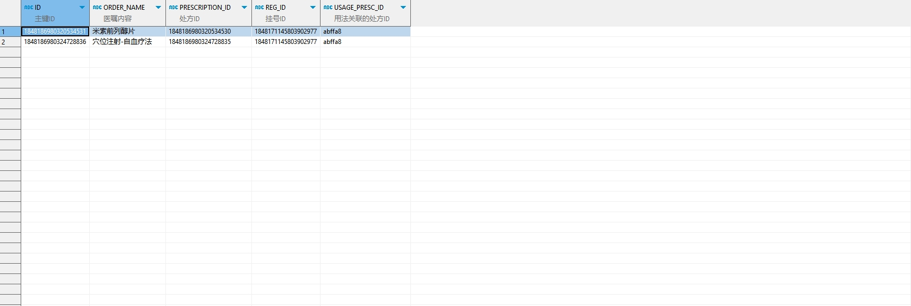

# 领域服务/临床领域 - 查询关联门诊处方明细 - 查询关联门诊处方明细 正向用例
## 请求参数：
``` json
{
  "orgCode": "NXRMYY",
  "list": [
    {
      "visitId": "1848171145803902977",
      "usagePrescId": "abffa8"
    }
  ]
}
```
## 返回参数：
``` json
{
  "exception": null,
  "apiCode": null,
  "data": {
    "list": [
      {
        "auditStatus": "1",
        "batchStockId": null,
        "chargeFlag": "1",
        "costRelatedFlag": "1",
        "deptId": "224707726571106304",
        "deptName": "呼吸内科(门)",
        "doctorId": "349365436797001728",
        "doctorName": "测试医生",
        "execDeptId": "224718893381218304",
        "execDeptName": "中药房",
        "factory": "浙江仙琚制药股份有限公司",
        "id": "1848186980320534531",
        "itemType": "1",
        "name": "与",
        "num": 1,
        "orderItemId": "20200408030220726",
        "orderItemName": "米索前列醇片",
        "orderName": "米索前列醇片",
        "orgCode": null,
        "prescId": "1848186980320534530",
        "price": 6.3,
        "skinTestPrescId": null,
        "spec": "200ug*3粒/盒",
        "unitId": "20200408030204965",
        "unitName": "盒",
        "unitRate": 1,
        "usagePrescId": "abffa8",
        "visitId": "1848171145803902977",
        "visitNo": "2024102100002",
        "orderTypeCode": "1",
        "skinDrugFlag": null
      },
      {
        "auditStatus": "1",
        "batchStockId": null,
        "chargeFlag": "1",
        "costRelatedFlag": "2",
        "deptId": "224707726571106304",
        "deptName": "呼吸内科(门)",
        "doctorId": "349365436797001728",
        "doctorName": "测试医生",
        "execDeptId": "224707726571106304",
        "execDeptName": "呼吸内科(门)",
        "factory": null,
        "id": "1848186980324728836",
        "itemType": "2",
        "name": "与",
        "num": 1,
        "orderItemId": "20200612080750055",
        "orderItemName": "穴位注射-自血疗法",
        "orderName": "穴位注射-自血疗法",
        "orgCode": null,
        "prescId": "1848186980324728835",
        "price": 27,
        "skinTestPrescId": null,
        "spec": null,
        "unitId": null,
        "unitName": "每个穴位",
        "unitRate": 1,
        "usagePrescId": "abffa8",
        "visitId": "1848171145803902977",
        "visitNo": "2024102100002",
        "orderTypeCode": "4",
        "skinDrugFlag": null
      }
    ]
  },
  "Code": 200,
  "Message": "操作成功"
}
```
## 数据校验：


# 领域服务/临床领域 - 查询关联门诊处方明细 - 必填校验-[orgCode]为空
## 请求参数：
``` json
{
  "orgCode": "",
  "list": [
    {
      "visitId": "1848171145803902977",
      "usagePrescId": "abffa8"
    }
  ]
}
```
## 返回参数：
``` json
{
  "exception": null,
  "apiCode": null,
  "data": null,
  "Code": 1,
  "Message": "医院编码不能为空"
}
```
# 领域服务/临床领域 - 查询关联门诊处方明细 - 必填校验-[list]为空
## 请求参数：
``` json
{
  "orgCode": "NXRMYY",
  "list": null
}
```
## 返回参数：
``` json
{
  "exception": null,
  "apiCode": null,
  "data": null,
  "Code": 1,
  "Message": "处方明细集合不能为空"
}
```
# 领域服务/临床领域 - 查询关联门诊处方明细 - 必填校验-[list.visitId]为空
## 请求参数：
``` json
{
  "orgCode": "NXRMYY",
  "list": [
    {
      "visitId": null,
      "usagePrescId": "abffa8"
    }
  ]
}
```
## 返回参数：
``` json
{
  "exception": null,
  "apiCode": null,
  "data": null,
  "Code": 1,
  "Message": "挂号id不能为空"
}
```
# 领域服务/临床领域 - 查询关联门诊处方明细 - 依赖用例-[list.visitId]赋值为依赖用例测试值
## 请求参数：
``` json
{
  "orgCode": "NXRMYY",
  "list": [
    {
      "visitId": "依赖用例测试值",
      "usagePrescId": "abffa8"
    }
  ]
}
```
## 返回参数：
``` json
{
  "exception": null,
  "apiCode": null,
  "data": {
    "list": []
  },
  "Code": 200,
  "Message": "操作成功"
}
```
# 领域服务/临床领域 - 查询关联门诊处方明细 - 依赖用例-[orgCode]赋值为依赖用例测试值
## 请求参数：
``` json
{
  "orgCode": "依赖用例测试值",
  "list": [
    {
      "visitId": "1848171145803902977",
      "usagePrescId": "abffa8"
    }
  ]
}
```
## 返回参数：
``` json
{
  "exception": null,
  "apiCode": null,
  "data": {
    "list": []
  },
  "Code": 200,
  "Message": "操作成功"
}
```