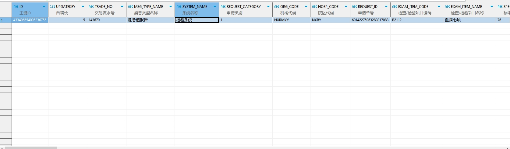

# 领域服务/临床领域 - 查询危急值 - 查询危急值 正向用例
## 请求参数：
``` json
{
  "hospCode": "NXRY",
  "pageSize": 3,
  "pageIndex": 1,
  "orgCode": "NXRMYY",
  "ids": [
    "433496654095236755"
  ]
}
```
## 返回参数：
``` json
{
    "exception": null,
    "apiCode": null,
    "data": {
        "list": [
            {
                "id": "433496654095236755",
                "orgCode": "NXRMYY",
                "hospCode": "NXRY",
                "age": "23岁",
                "bedDoctorId": null,
                "bedDoctorName": null,
                "bedNo": null,
                "bodyCode": null,
                "bodyName": null,
                "checkDate": "2023-10-06 11:25:42",
                "checkUserId": "1092",
                "checkUserName": "刘晨",
                "checkValue": "3.0",
                "chiefDoctorId": null,
                "chiefDoctorName": null,
                "createDate": "2023-10-08 11:34:42",
                "createUserId": null,
                "diagnosisId": null,
                "diagnosisName": "反",
                "interfaceCompanyName": null,
                "isDelete": "N",
                "isFromMedRequest": "0",
                "itemCode": "B2112",
                "itemName": "血脂七项",
                "itemUnit": "mmol/L",
                "mainDoctorId": null,
                "mainDoctorName": null,
                "memo": null,
                "memo5": null,
                "msgTypeCode": "WJZ0001",
                "msgTypeName": "危急值报告",
                "name": "邬迩",
                "orderItemId": null,
                "orderItemName": "DDDDD",
                "panicValue": "病人邬迩的甘油三酯结果为3.0mmol/L。",
                "patientId": "1e23c916748f42afa8d1967eb4debc20",
                "processDate": "2024-11-21 14:36:31",
                "processDeptId": "224707910793326592",
                "processDeptName": "内分泌科(门)",
                "processDesc": "123",
                "processUserId": "349365436797001728",
                "processUserName": "测试医生",
                "receiveDate": null,
                "receiveUserId": null,
                "receiveUserName": null,
                "refRange": "1.70 mmol/L-2.25 mmol/L",
                "reportDate": "2023-10-08 11:34:42",
                "reportNo": "10242333",
                "requestDeptId": "224707910793326592",
                "requestDeptName": "内分泌科(门)",
                "requestDocId": "349365436797001728",
                "requestDocName": "测试医生",
                "requestId": "69142275963289817088",
                "requestType": "1",
                "resultFlag": "偏高 ↑",
                "reveiveDeptId": null,
                "reveiveDeptName": null,
                "reveiveDesc": null,
                "reviewSituation": "已复查",
                "sampleCode": "76",
                "sampleName": "血清",
                "sexName": "男",
                "signDate": "2023-10-08 11:34:42",
                "signDeptId": "222",
                "signDeptName": "测试化验室",
                "signUserId": "1706",
                "signUserName": "谢小龙",
                "status": "1",
                "systemCode": "SY007",
                "systemName": "检验系统",
                "tradeNo": "143679",
                "updateDate": "2024-11-21 14:36:31",
                "updateUserId": "282475805660160000",
                "visitId": "b62f9132b62b4539880a76170e604639",
                "visitNo": "2023019205",
                "visitType": "1",
                "wardId": null
            }
        ],
        "totalCount": 1,
        "pageSize": 3,
        "pageNo": 1,
        "pageCount": 1
    },
    "Code": 200,
    "Message": "操作成功"
}
```
## 数据校验：


# 领域服务/临床领域 - 查询危急值 - 必填校验-[orgCode]为空
## 请求参数：
``` json
{
  "pageSize": 3,
  "requestDocIds": [
    "282475805660160000"
  ],
  "orgCode": "",
  "hospCode": "NXRY",
  "requestType": "",
  "statuss": [
    "1"
  ],
  "pageIndex": 1
}
```
## 返回参数：
``` json
{
  "exception": null,
  "apiCode": null,
  "data": null,
  "Code": 1,
  "Message": "医院编码不能为空"
}
```
# 领域服务/临床领域 - 查询危急值 - 必填校验-[hospCode]为空
## 请求参数：
``` json
{
  "pageSize": 3,
  "requestDocIds": [
    "282475805660160000"
  ],
  "orgCode": "NXRMYY",
  "hospCode": "",
  "requestType": "",
  "statuss": [
    "1"
  ],
  "pageIndex": 1
}
```
## 返回参数：
``` json
{
  "exception": null,
  "apiCode": null,
  "data": {
    "list": [],
    "totalCount": 0,
    "pageSize": 10,
    "pageNo": 1,
    "pageCount": 1
  },
  "Code": 200,
  "Message": "操作成功"
}
```
# 领域服务/临床领域 - 查询危急值 - 必填校验-[pageIndex]为空
## 请求参数：
``` json
{
  "pageSize": 3,
  "requestDocIds": [
    "282475805660160000"
  ],
  "orgCode": "NXRMYY",
  "hospCode": "NXRY",
  "requestType": "",
  "statuss": [
    "1"
  ],
  "pageIndex": null
}
```
## 返回参数：
``` json
{
  "exception": null,
  "apiCode": null,
  "data": null,
  "Code": 1,
  "Message": "系统内部异常"
}
```
# 领域服务/临床领域 - 查询危急值 - 必填校验-[pageSize]为空
## 请求参数：
``` json
{
  "pageSize": null,
  "requestDocIds": [
    "282475805660160000"
  ],
  "orgCode": "NXRMYY",
  "hospCode": "NXRY",
  "requestType": "",
  "statuss": [
    "1"
  ],
  "pageIndex": 1
}
```
## 返回参数：
``` json
{
  "exception": null,
  "apiCode": null,
  "data": null,
  "Code": 1,
  "Message": "系统内部异常"
}
```
# 领域服务/临床领域 - 查询危急值 - 类型校验-[pageIndex]类型错误
## 请求参数：
``` json
{
  "pageSize": 3,
  "requestDocIds": [
    "282475805660160000"
  ],
  "orgCode": "NXRMYY",
  "hospCode": "NXRY",
  "requestType": "",
  "statuss": [
    "1"
  ],
  "pageIndex": "abc"
}
```
## 返回参数：
``` json
{
  "exception": null,
  "apiCode": null,
  "data": null,
  "Code": 1,
  "Message": "请求参数错误"
}
```
# 领域服务/临床领域 - 查询危急值 - 类型校验-[pageSize]类型错误
## 请求参数：
``` json
{
  "pageSize": "abc",
  "requestDocIds": [
    "282475805660160000"
  ],
  "orgCode": "NXRMYY",
  "hospCode": "NXRY",
  "requestType": "",
  "statuss": [
    "1"
  ],
  "pageIndex": 1
}
```
## 返回参数：
``` json
{
  "exception": null,
  "apiCode": null,
  "data": null,
  "Code": 1,
  "Message": "请求参数错误"
}
```
# 领域服务/临床领域 - 查询危急值 - 依赖用例-[hospCode]赋值为依赖用例测试值
## 请求参数：
``` json
{
  "pageSize": 3,
  "requestDocIds": [
    "282475805660160000"
  ],
  "orgCode": "NXRMYY",
  "hospCode": "依赖用例测试值",
  "requestType": "",
  "statuss": [
    "1"
  ],
  "pageIndex": 1
}
```
## 返回参数：
``` json
{
  "exception": null,
  "apiCode": null,
  "data": {
    "list": [],
    "totalCount": 0,
    "pageSize": 10,
    "pageNo": 1,
    "pageCount": 1
  },
  "Code": 200,
  "Message": "操作成功"
}
```
# 领域服务/临床领域 - 查询危急值 - 依赖用例-[orgCode]赋值为依赖用例测试值
## 请求参数：
``` json
{
  "pageSize": 3,
  "requestDocIds": [
    "282475805660160000"
  ],
  "orgCode": "依赖用例测试值",
  "hospCode": "NXRY",
  "requestType": "",
  "statuss": [
    "1"
  ],
  "pageIndex": 1
}
```
## 返回参数：
``` json
{
  "exception": null,
  "apiCode": null,
  "data": {
    "list": [],
    "totalCount": 0,
    "pageSize": 10,
    "pageNo": 1,
    "pageCount": 1
  },
  "Code": 200,
  "Message": "操作成功"
}
```