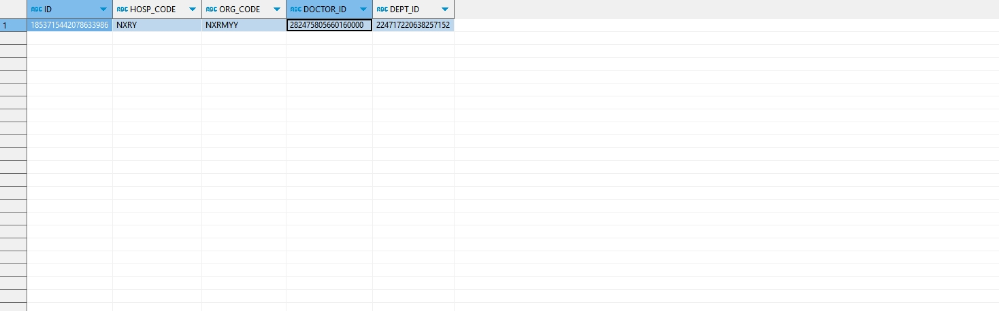

# 领域服务/临床领域 - 查询处方模板 - 查询处方模板 正向用例
## 请求参数：
``` json
{
  "templateMngTypes": [
    "0",
    "1"
  ],
  "hospCode": "NXRY",
  "pageSize": 1,
  "templateTypes": [
    "0"
  ],
  "doctorIds": [
    "282475805660160000"
  ],
  "pageIndex": 1,
  "templateLayers": [
    "2"
  ],
  "orgCode": "NXRMYY"
}
```
## 返回参数：
``` json
{
    "exception": null,
    "apiCode": null,
    "data": {
        "list": [
            {
                "isDelete": "N",
                "createDate": "2024-11-05 16:26:16",
                "updateDate": "2024-11-05 16:26:16",
                "id": "1853715442078633986",
                "updatekey": 6368,
                "orgCode": "NXRMYY",
                "hospCode": "NXRY",
                "deptId": "224717220638257152",
                "doctorId": "282475805660160000",
                "recorderId": null,
                "recorderTime": null,
                "templateName": "测试2",
                "memo": null,
                "templateLayer": "2",
                "templateType": "0",
                "classId": "1846476464959049729",
                "templateMoney": null,
                "templateMngType": "0",
                "sortNo": 2,
                "urgentFlag": "0",
                "useArea": "1",
                "dropsper": null,
                "shareDate": null,
                "shareId": null,
                "shareMemo": null,
                "auditFlag": "0",
                "openOrderRange": null,
                "templateLists": null,
                "createUserId": "282475805660160000",
                "updateUserId": "282475805660160000",
                "pyCode": "cs2",
                "wbCode": "IY2",
                "fitDiagnosisNames": null,
                "fitDiagnosisIds": null,
                "shareUserId": null,
                "auditUserId": null,
                "auditUserName": null,
                "oralProjectCode": null,
                "oralProjectName": null
            }
        ],
        "totalCount": 2,
        "pageSize": 1,
        "pageNo": 1,
        "pageCount": 2
    },
    "Code": 200,
    "Message": "操作成功"
}
```
## 数据校验：


# 领域服务/临床领域 - 查询处方模板 - 必填校验-[orgCode]为空
## 请求参数：
``` json
{
  "templateMngTypes": [
    "0",
    "1"
  ],
  "hospCode": "NXRY",
  "pageSize": 3,
  "templateTypes": [
    "0"
  ],
  "doctorIds": [
    "282475805660160000"
  ],
  "pageIndex": 1,
  "templateLayers": [
    "2"
  ],
  "orgCode": ""
}
```
## 返回参数：
``` json
{
  "exception": null,
  "apiCode": null,
  "data": null,
  "Code": 1,
  "Message": "院区编码不能为空"
}
```
# 领域服务/临床领域 - 查询处方模板 - 必填校验-[hospCode]为空
## 请求参数：
``` json
{
  "templateMngTypes": [
    "0",
    "1"
  ],
  "hospCode": "",
  "pageSize": 3,
  "templateTypes": [
    "0"
  ],
  "doctorIds": [
    "282475805660160000"
  ],
  "pageIndex": 1,
  "templateLayers": [
    "2"
  ],
  "orgCode": "NXRMYY"
}
```
## 返回参数：
``` json
{
  "exception": null,
  "apiCode": null,
  "data": {
    "list": [
      {
        "isDelete": "N",
        "createDate": "2024-11-05 16:26:16",
        "updateDate": "2024-11-05 16:26:16",
        "id": "1853715442078633986",
        "updatekey": 6368,
        "orgCode": "NXRMYY",
        "hospCode": "NXRY",
        "deptId": "224717220638257152",
        "doctorId": "282475805660160000",
        "recorderId": null,
        "recorderTime": null,
        "templateName": "测试2",
        "memo": null,
        "templateLayer": "2",
        "templateType": "0",
        "classId": "1846476464959049729",
        "templateMoney": null,
        "templateMngType": "0",
        "sortNo": 2,
        "urgentFlag": "0",
        "useArea": "1",
        "dropsper": null,
        "shareDate": null,
        "shareId": null,
        "shareMemo": null,
        "auditFlag": "0",
        "openOrderRange": null,
        "templateLists": null,
        "createUserId": "282475805660160000",
        "updateUserId": "282475805660160000",
        "pyCode": "cs2",
        "wbCode": "IY2",
        "fitDiagnosisNames": null,
        "fitDiagnosisIds": null,
        "shareUserId": null,
        "auditUserId": null,
        "auditUserName": null,
        "oralProjectCode": null,
        "oralProjectName": null
      },
      {
        "isDelete": "N",
        "createDate": null,
        "updateDate": "2024-11-15 17:48:05",
        "id": "1846795378276487170",
        "updatekey": 6255,
        "orgCode": "NXRMYY",
        "hospCode": "NXRY",
        "deptId": "224708989908054016",
        "doctorId": "282475805660160000",
        "recorderId": null,
        "recorderTime": null,
        "templateName": "新建模板",
        "memo": null,
        "templateLayer": "2",
        "templateType": "0",
        "classId": "1846476464959049729",
        "templateMoney": null,
        "templateMngType": "0",
        "sortNo": null,
        "urgentFlag": "0",
        "useArea": "1",
        "dropsper": null,
        "shareDate": null,
        "shareId": null,
        "shareMemo": null,
        "auditFlag": "0",
        "openOrderRange": "100",
        "templateLists": null,
        "createUserId": null,
        "updateUserId": "282475805660160000",
        "pyCode": "xjmb",
        "wbCode": "UVSS",
        "fitDiagnosisNames": null,
        "fitDiagnosisIds": null,
        "shareUserId": null,
        "auditUserId": null,
        "auditUserName": null,
        "oralProjectCode": null,
        "oralProjectName": null
      }
    ],
    "totalCount": 2,
    "pageSize": 3,
    "pageNo": 1,
    "pageCount": 1
  },
  "Code": 200,
  "Message": "操作成功"
}
```
# 领域服务/临床领域 - 查询处方模板 - 必填校验-[pageIndex]为空
## 请求参数：
``` json
{
  "templateMngTypes": [
    "0",
    "1"
  ],
  "hospCode": "NXRY",
  "pageSize": 3,
  "templateTypes": [
    "0"
  ],
  "doctorIds": [
    "282475805660160000"
  ],
  "pageIndex": null,
  "templateLayers": [
    "2"
  ],
  "orgCode": "NXRMYY"
}
```
## 返回参数：
``` json
{
  "exception": null,
  "apiCode": null,
  "data": null,
  "Code": 1,
  "Message": "系统内部异常"
}
```
# 领域服务/临床领域 - 查询处方模板 - 必填校验-[pageSize]为空
## 请求参数：
``` json
{
  "templateMngTypes": [
    "0",
    "1"
  ],
  "hospCode": "NXRY",
  "pageSize": null,
  "templateTypes": [
    "0"
  ],
  "doctorIds": [
    "282475805660160000"
  ],
  "pageIndex": 1,
  "templateLayers": [
    "2"
  ],
  "orgCode": "NXRMYY"
}
```
## 返回参数：
``` json
{
  "exception": null,
  "apiCode": null,
  "data": null,
  "Code": 1,
  "Message": "系统内部异常"
}
```
# 领域服务/临床领域 - 查询处方模板 - 类型校验-[pageIndex]类型错误
## 请求参数：
``` json
{
  "templateMngTypes": [
    "0",
    "1"
  ],
  "hospCode": "NXRY",
  "pageSize": 3,
  "templateTypes": [
    "0"
  ],
  "doctorIds": [
    "282475805660160000"
  ],
  "pageIndex": "abc",
  "templateLayers": [
    "2"
  ],
  "orgCode": "NXRMYY"
}
```
## 返回参数：
``` json
{
  "exception": null,
  "apiCode": null,
  "data": null,
  "Code": 1,
  "Message": "请求参数错误"
}
```
# 领域服务/临床领域 - 查询处方模板 - 类型校验-[pageSize]类型错误
## 请求参数：
``` json
{
  "templateMngTypes": [
    "0",
    "1"
  ],
  "hospCode": "NXRY",
  "pageSize": "abc",
  "templateTypes": [
    "0"
  ],
  "doctorIds": [
    "282475805660160000"
  ],
  "pageIndex": 1,
  "templateLayers": [
    "2"
  ],
  "orgCode": "NXRMYY"
}
```
## 返回参数：
``` json
{
  "exception": null,
  "apiCode": null,
  "data": null,
  "Code": 1,
  "Message": "请求参数错误"
}
```
# 领域服务/临床领域 - 查询处方模板 - 依赖用例-[orgCode]赋值为依赖用例测试值
## 请求参数：
``` json
{
  "templateMngTypes": [
    "0",
    "1"
  ],
  "hospCode": "NXRY",
  "pageSize": 3,
  "templateTypes": [
    "0"
  ],
  "doctorIds": [
    "282475805660160000"
  ],
  "pageIndex": 1,
  "templateLayers": [
    "2"
  ],
  "orgCode": "依赖用例测试值"
}
```
## 返回参数：
``` json
{
  "exception": null,
  "apiCode": null,
  "data": {
    "list": [],
    "totalCount": 0,
    "pageSize": 3,
    "pageNo": 1,
    "pageCount": 0
  },
  "Code": 200,
  "Message": "操作成功"
}
```
# 领域服务/临床领域 - 查询处方模板 - 依赖用例-[hospCode]赋值为依赖用例测试值
## 请求参数：
``` json
{
  "templateMngTypes": [
    "0",
    "1"
  ],
  "hospCode": "依赖用例测试值",
  "pageSize": 3,
  "templateTypes": [
    "0"
  ],
  "doctorIds": [
    "282475805660160000"
  ],
  "pageIndex": 1,
  "templateLayers": [
    "2"
  ],
  "orgCode": "NXRMYY"
}
```
## 返回参数：
``` json
{
  "exception": null,
  "apiCode": null,
  "data": {
    "list": [],
    "totalCount": 0,
    "pageSize": 3,
    "pageNo": 1,
    "pageCount": 0
  },
  "Code": 200,
  "Message": "操作成功"
}
```