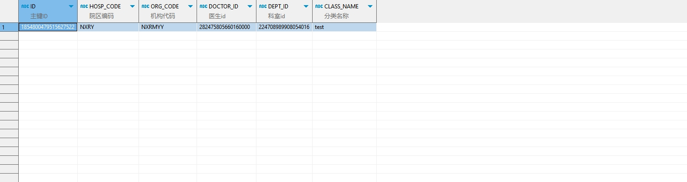

# 领域服务/临床领域 - 查询处方模板分类 - 查询处方模板分类 正向用例
## 请求参数：
``` json
{
    "hospCode": "NXRY",
    "pageSize": 3,
    "doctorIds": [
        "282475805660160000"
    ],
    "templateTypes": [
        "0"
    ],
    "pageIndex": 1,
    "templateLayers": [
        "2"
    ],
    "orgCode": "NXRMYY",
    "ids": [
        "1854800479515627522"
    ]
}
```
## 返回参数：
``` json
{
    "exception": null,
    "apiCode": null,
    "data": {
        "list": [
            {
                "isDelete": "N",
                "createDate": "2024-11-08 16:17:49",
                "id": "1854800479515627522",
                "updatekey": 1360,
                "hospCode": "NXRY",
                "orgCode": "NXRMYY",
                "className": "test",
                "parentId": null,
                "doctorId": "282475805660160000",
                "deptId": "224708989908054016",
                "sortNo": 1,
                "mngType": null,
                "useArea": "1",
                "shareDate": null,
                "shareId": null,
                "shareMemo": null,
                "createUserId": "282475805660160000",
                "updateUserId": "282475805660160000",
                "updateDate": null,
                "layer": "2",
                "shareUserId": null
            }
        ],
        "totalCount": 1,
        "pageSize": 3,
        "pageNo": 1,
        "pageCount": 1
    },
    "Code": 200,
    "Message": "操作成功"
}
```
## 数据校验：


# 领域服务/临床领域 - 查询处方模板分类 - 必填校验-[orgCode]为空
## 请求参数：
``` json
{
  "hospCode": "NXRY",
  "pageSize": 3,
  "doctorIds": [
    "282475805660160000"
  ],
  "templateTypes": [
    "0"
  ],
  "pageIndex": 1,
  "templateLayers": [
    "2"
  ],
  "orgCode": ""
}
```
## 返回参数：
``` json
{
  "exception": null,
  "apiCode": null,
  "data": null,
  "Code": 1,
  "Message": "医院编码不能为空"
}
```
# 领域服务/临床领域 - 查询处方模板分类 - 必填校验-[hospCode]为空
## 请求参数：
``` json
{
  "hospCode": "",
  "pageSize": 3,
  "doctorIds": [
    "282475805660160000"
  ],
  "templateTypes": [
    "0"
  ],
  "pageIndex": 1,
  "templateLayers": [
    "2"
  ],
  "orgCode": "NXRMYY"
}
```
## 返回参数：
``` json
{
  "exception": null,
  "apiCode": null,
  "data": {
    "list": [
      {
        "isDelete": "N",
        "createDate": "2024-11-08 16:17:43",
        "id": "1854800454484021249",
        "updatekey": 1359,
        "hospCode": null,
        "orgCode": "NXRMYY",
        "className": "test",
        "parentId": null,
        "doctorId": "282475805660160000",
        "deptId": "224708989908054016",
        "sortNo": 1,
        "mngType": "0",
        "useArea": "1",
        "shareDate": null,
        "shareId": null,
        "shareMemo": null,
        "createUserId": "282475805660160000",
        "updateUserId": "282475805660160000",
        "updateDate": null,
        "layer": "2",
        "shareUserId": null
      },
      {
        "isDelete": "N",
        "createDate": "2024-11-08 16:17:49",
        "id": "1854800479515627522",
        "updatekey": 1360,
        "hospCode": "NXRY",
        "orgCode": "NXRMYY",
        "className": "test",
        "parentId": null,
        "doctorId": "282475805660160000",
        "deptId": "224708989908054016",
        "sortNo": 1,
        "mngType": null,
        "useArea": "1",
        "shareDate": null,
        "shareId": null,
        "shareMemo": null,
        "createUserId": "282475805660160000",
        "updateUserId": "282475805660160000",
        "updateDate": null,
        "layer": "2",
        "shareUserId": null
      },
      {
        "isDelete": "N",
        "createDate": "2024-11-08 16:17:55",
        "id": "1854800506774409218",
        "updatekey": 1363,
        "hospCode": "NXRY",
        "orgCode": "NXRMYY",
        "className": "test",
        "parentId": null,
        "doctorId": "282475805660160000",
        "deptId": "224708989908054016",
        "sortNo": 1,
        "mngType": "0",
        "useArea": "1",
        "shareDate": null,
        "shareId": null,
        "shareMemo": null,
        "createUserId": "282475805660160000",
        "updateUserId": "282475805660160000",
        "updateDate": null,
        "layer": "2",
        "shareUserId": null
      }
    ],
    "totalCount": 27,
    "pageSize": 3,
    "pageNo": 1,
    "pageCount": 9
  },
  "Code": 200,
  "Message": "操作成功"
}
```
# 领域服务/临床领域 - 查询处方模板分类 - 必填校验-[pageIndex]为空
## 请求参数：
``` json
{
  "hospCode": "NXRY",
  "pageSize": 3,
  "doctorIds": [
    "282475805660160000"
  ],
  "templateTypes": [
    "0"
  ],
  "pageIndex": null,
  "templateLayers": [
    "2"
  ],
  "orgCode": "NXRMYY"
}
```
## 返回参数：
``` json
{
  "exception": null,
  "apiCode": null,
  "data": null,
  "Code": 1,
  "Message": "系统内部异常"
}
```
# 领域服务/临床领域 - 查询处方模板分类 - 必填校验-[pageSize]为空
## 请求参数：
``` json
{
  "hospCode": "NXRY",
  "pageSize": null,
  "doctorIds": [
    "282475805660160000"
  ],
  "templateTypes": [
    "0"
  ],
  "pageIndex": 1,
  "templateLayers": [
    "2"
  ],
  "orgCode": "NXRMYY"
}
```
## 返回参数：
``` json
{
  "exception": null,
  "apiCode": null,
  "data": null,
  "Code": 1,
  "Message": "系统内部异常"
}
```
# 领域服务/临床领域 - 查询处方模板分类 - 类型校验-[pageIndex]类型错误
## 请求参数：
``` json
{
  "hospCode": "NXRY",
  "pageSize": 3,
  "doctorIds": [
    "282475805660160000"
  ],
  "templateTypes": [
    "0"
  ],
  "pageIndex": "abc",
  "templateLayers": [
    "2"
  ],
  "orgCode": "NXRMYY"
}
```
## 返回参数：
``` json
{
  "exception": null,
  "apiCode": null,
  "data": null,
  "Code": 1,
  "Message": "请求参数错误"
}
```
# 领域服务/临床领域 - 查询处方模板分类 - 类型校验-[pageSize]类型错误
## 请求参数：
``` json
{
  "hospCode": "NXRY",
  "pageSize": "abc",
  "doctorIds": [
    "282475805660160000"
  ],
  "templateTypes": [
    "0"
  ],
  "pageIndex": 1,
  "templateLayers": [
    "2"
  ],
  "orgCode": "NXRMYY"
}
```
## 返回参数：
``` json
{
  "exception": null,
  "apiCode": null,
  "data": null,
  "Code": 1,
  "Message": "请求参数错误"
}
```
# 领域服务/临床领域 - 查询处方模板分类 - 依赖用例-[orgCode]赋值为依赖用例测试值
## 请求参数：
``` json
{
  "hospCode": "NXRY",
  "pageSize": 3,
  "doctorIds": [
    "282475805660160000"
  ],
  "templateTypes": [
    "0"
  ],
  "pageIndex": 1,
  "templateLayers": [
    "2"
  ],
  "orgCode": "依赖用例测试值"
}
```
## 返回参数：
``` json
{
  "exception": null,
  "apiCode": null,
  "data": {
    "list": [
      {
        "isDelete": "N",
        "createDate": "2024-11-20 17:48:10",
        "id": "1859171871245787138",
        "updatekey": 1398,
        "hospCode": "NXRY",
        "orgCode": "依赖用例测试值",
        "className": "test",
        "parentId": null,
        "doctorId": "282475805660160000",
        "deptId": "224708989908054016",
        "sortNo": 1,
        "mngType": "0",
        "useArea": "1",
        "shareDate": null,
        "shareId": null,
        "shareMemo": null,
        "createUserId": "282475805660160000",
        "updateUserId": "282475805660160000",
        "updateDate": null,
        "layer": "2",
        "shareUserId": null
      }
    ],
    "totalCount": 1,
    "pageSize": 3,
    "pageNo": 1,
    "pageCount": 1
  },
  "Code": 200,
  "Message": "操作成功"
}
```
# 领域服务/临床领域 - 查询处方模板分类 - 依赖用例-[hospCode]赋值为依赖用例测试值
## 请求参数：
``` json
{
  "hospCode": "依赖用例测试值",
  "pageSize": 3,
  "doctorIds": [
    "282475805660160000"
  ],
  "templateTypes": [
    "0"
  ],
  "pageIndex": 1,
  "templateLayers": [
    "2"
  ],
  "orgCode": "NXRMYY"
}
```
## 返回参数：
``` json
{
  "exception": null,
  "apiCode": null,
  "data": {
    "list": [
      {
        "isDelete": "N",
        "createDate": "2024-11-20 17:48:01",
        "id": "1859171833320890370",
        "updatekey": 1396,
        "hospCode": "依赖用例测试值",
        "orgCode": "NXRMYY",
        "className": "test",
        "parentId": null,
        "doctorId": "282475805660160000",
        "deptId": "224708989908054016",
        "sortNo": 1,
        "mngType": "0",
        "useArea": "1",
        "shareDate": null,
        "shareId": null,
        "shareMemo": null,
        "createUserId": "282475805660160000",
        "updateUserId": "282475805660160000",
        "updateDate": null,
        "layer": "2",
        "shareUserId": null
      }
    ],
    "totalCount": 1,
    "pageSize": 3,
    "pageNo": 1,
    "pageCount": 1
  },
  "Code": 200,
  "Message": "操作成功"
}
```