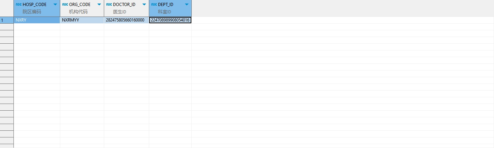

# 领域服务/临床领域 - 查询常用诊断 - 查询常用诊断 正向用例
## 请求参数：
``` json
{
  "hospCode": "NXRY",
  "pageSize": 3,
  "doctorIds": [
    "282475805660160000"
  ],
  "pageIndex": 1,
  "orgCode": "NXRMYY",
  "deptIds": [
    "224708989908054016"
  ]
}
```
## 返回参数：
``` json
{
    "exception": null,
    "apiCode": null,
    "data": {
        "list": [
            {
                "isDelete": "N",
                "createDate": "2024-10-16 10:53:10",
                "updateDate": null,
                "id": "1846383855742021633",
                "updatekey": null,
                "commonUseid": "1846383855737556993",
                "orgCode": "NXRMYY",
                "hospCode": "NXRY",
                "type": 1,
                "itemId": "20200408030220704",
                "doctorId": "282475805660160000",
                "diagnosisName": null,
                "deptId": "224708989908054016",
                "dosage": 0,
                "dosageUnitType": 0,
                "frequencyId": null,
                "frequencyName": null,
                "usageId": null,
                "usageName": null,
                "execDeptid": null,
                "execDeptName": null,
                "orderMemo": null,
                "orderMemoCode": null,
                "createUserId": "282475805660160000",
                "updateUserId": "282475805660160000",
                "frequency": 8,
                "diagnosisId": null,
                "dosageUnitId": null
            }
        ],
        "totalCount": 21,
        "pageSize": 1,
        "pageNo": 1,
        "pageCount": 21
    },
    "Code": 200,
    "Message": "操作成功"
}
```
## 数据校验：


# 领域服务/临床领域 - 查询常用诊断 - 必填校验-[orgCode]为空
## 请求参数：
``` json
{
  "hospCode": "NXRY",
  "pageSize": 3,
  "doctorIds": [
    "282475805660160000"
  ],
  "pageIndex": 1,
  "orgCode": "",
  "deptIds": [
    "224708989908054016"
  ]
}
```
## 返回参数：
``` json
{
  "exception": null,
  "apiCode": null,
  "data": null,
  "Code": 1,
  "Message": "医院编码不能为空"
}
```
# 领域服务/临床领域 - 查询常用诊断 - 必填校验-[hospCode]为空
## 请求参数：
``` json
{
  "hospCode": "",
  "pageSize": 3,
  "doctorIds": [
    "282475805660160000"
  ],
  "pageIndex": 1,
  "orgCode": "NXRMYY",
  "deptIds": [
    "224708989908054016"
  ]
}
```
## 返回参数：
``` json
{
  "exception": null,
  "apiCode": null,
  "data": {
    "list": [
      {
        "isDelete": "N",
        "createDate": "2024-10-16 17:23:51",
        "updateDate": null,
        "id": "1846482176204394497",
        "updatekey": null,
        "orgCode": "NXRMYY",
        "hospCode": "NXRY",
        "diagnosisName": "供干细胞者",
        "icdCode": "Z52.001",
        "icdName": "供干细胞者",
        "isWestern": "1",
        "doctorId": "282475805660160000",
        "deptId": "224708989908054016",
        "chnProveName": null,
        "classCode": "02",
        "className": "西医诊断",
        "createUserId": "282475805660160000",
        "updateUserId": "282475805660160000",
        "diagnosisId": "185688598816784384",
        "frequency": 0,
        "chnProveId": null
      },
      {
        "isDelete": "N",
        "createDate": "2024-10-21 10:26:38",
        "updateDate": null,
        "id": "82250238502601869312",
        "updatekey": null,
        "orgCode": "NXRMYY",
        "hospCode": "NXRY",
        "diagnosisName": "痣",
        "icdCode": "D22.900x002",
        "icdName": "痣",
        "isWestern": "1",
        "doctorId": "282475805660160000",
        "deptId": "224708989908054016",
        "chnProveName": null,
        "classCode": "05",
        "className": "肿瘤诊断",
        "createUserId": null,
        "updateUserId": null,
        "diagnosisId": "185689374653972480",
        "frequency": 1,
        "chnProveId": null
      },
      {
        "isDelete": "N",
        "createDate": "2024-11-15 17:52:20",
        "updateDate": null,
        "id": "1857360981097832449",
        "updatekey": null,
        "orgCode": "NXRMYY",
        "hospCode": "NXRY",
        "diagnosisName": "颈动脉体瘤",
        "icdCode": "M86920/1",
        "icdName": "颈动脉体瘤",
        "isWestern": "1",
        "doctorId": "282475805660160000",
        "deptId": "224708989908054016",
        "chnProveName": null,
        "classCode": "02",
        "className": "西医诊断",
        "createUserId": "282475805660160000",
        "updateUserId": "282475805660160000",
        "diagnosisId": "依赖用例测试值",
        "frequency": 0,
        "chnProveId": null
      }
    ],
    "totalCount": 3,
    "pageSize": 3,
    "pageNo": 1,
    "pageCount": 1
  },
  "Code": 200,
  "Message": "操作成功"
}
```
# 领域服务/临床领域 - 查询常用诊断 - 必填校验-[pageIndex]为空
## 请求参数：
``` json
{
  "hospCode": "NXRY",
  "pageSize": 3,
  "doctorIds": [
    "282475805660160000"
  ],
  "pageIndex": null,
  "orgCode": "NXRMYY",
  "deptIds": [
    "224708989908054016"
  ]
}
```
## 返回参数：
``` json
{
  "exception": null,
  "apiCode": null,
  "data": null,
  "Code": 1,
  "Message": "系统内部异常"
}
```
# 领域服务/临床领域 - 查询常用诊断 - 必填校验-[pageSize]为空
## 请求参数：
``` json
{
  "hospCode": "NXRY",
  "pageSize": null,
  "doctorIds": [
    "282475805660160000"
  ],
  "pageIndex": 1,
  "orgCode": "NXRMYY",
  "deptIds": [
    "224708989908054016"
  ]
}
```
## 返回参数：
``` json
{
  "exception": null,
  "apiCode": null,
  "data": null,
  "Code": 1,
  "Message": "系统内部异常"
}
```
# 领域服务/临床领域 - 查询常用诊断 - 类型校验-[pageIndex]类型错误
## 请求参数：
``` json
{
  "hospCode": "NXRY",
  "pageSize": 3,
  "doctorIds": [
    "282475805660160000"
  ],
  "pageIndex": "abc",
  "orgCode": "NXRMYY",
  "deptIds": [
    "224708989908054016"
  ]
}
```
## 返回参数：
``` json
{
  "exception": null,
  "apiCode": null,
  "data": null,
  "Code": 1,
  "Message": "请求参数错误"
}
```
# 领域服务/临床领域 - 查询常用诊断 - 类型校验-[pageSize]类型错误
## 请求参数：
``` json
{
  "hospCode": "NXRY",
  "pageSize": "abc",
  "doctorIds": [
    "282475805660160000"
  ],
  "pageIndex": 1,
  "orgCode": "NXRMYY",
  "deptIds": [
    "224708989908054016"
  ]
}
```
## 返回参数：
``` json
{
  "exception": null,
  "apiCode": null,
  "data": null,
  "Code": 1,
  "Message": "请求参数错误"
}
```
# 领域服务/临床领域 - 查询常用诊断 - 依赖用例-[orgCode]赋值为依赖用例测试值
## 请求参数：
``` json
{
  "hospCode": "NXRY",
  "pageSize": 3,
  "doctorIds": [
    "282475805660160000"
  ],
  "pageIndex": 1,
  "orgCode": "依赖用例测试值",
  "deptIds": [
    "224708989908054016"
  ]
}
```
## 返回参数：
``` json
{
  "exception": null,
  "apiCode": null,
  "data": {
    "list": [],
    "totalCount": 0,
    "pageSize": 3,
    "pageNo": 1,
    "pageCount": 0
  },
  "Code": 200,
  "Message": "操作成功"
}
```
# 领域服务/临床领域 - 查询常用诊断 - 依赖用例-[hospCode]赋值为依赖用例测试值
## 请求参数：
``` json
{
  "hospCode": "依赖用例测试值",
  "pageSize": 3,
  "doctorIds": [
    "282475805660160000"
  ],
  "pageIndex": 1,
  "orgCode": "NXRMYY",
  "deptIds": [
    "224708989908054016"
  ]
}
```
## 返回参数：
``` json
{
  "exception": null,
  "apiCode": null,
  "data": {
    "list": [],
    "totalCount": 0,
    "pageSize": 3,
    "pageNo": 1,
    "pageCount": 0
  },
  "Code": 200,
  "Message": "操作成功"
}
```