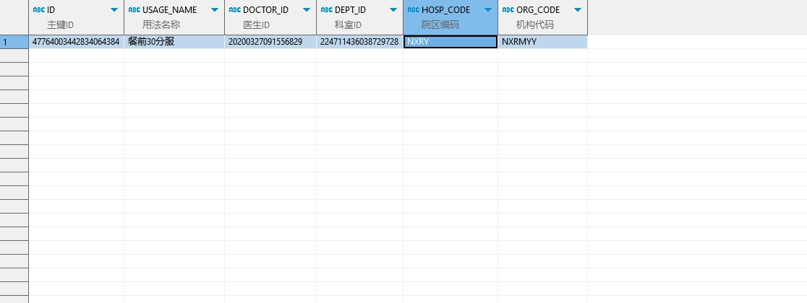

# 领域服务/临床领域 - 查询常用项目 - 查询常用项目 正向用例
## 请求参数：
``` json
{
  "doctorIds": [
    "20200327091556829"
  ],
  "hospCode": "NXRY",
  "pageIndex": 1,
  "orgCode": "NXRMYY",
  "pageSize": 1,
  "deptIds": [
    "224711436038729728"
  ]
}
```
## 返回参数：
``` json
{
    "exception": null,
    "apiCode": null,
    "data": {
        "list": [
            {
                "isDelete": "N",
                "createDate": "2022-02-22 08:51:20",
                "updateDate": null,
                "id": "47764003442834064384",
                "updatekey": null,
                "commonUseid": "47764003442838258688",
                "orgCode": "NXRMYY",
                "hospCode": "NXRY",
                "type": 1,
                "itemId": "20200408030223612",
                "doctorId": "20200327091556829",
                "diagnosisName": null,
                "deptId": "224711436038729728",
                "dosage": 250,
                "dosageUnitType": 1,
                "frequencyId": "897520b5db1f42a8aad70f41fab03b3a",
                "frequencyName": "Bid",
                "usageId": "529",
                "usageName": "餐前30分服",
                "execDeptid": null,
                "execDeptName": null,
                "orderMemo": null,
                "orderMemoCode": null,
                "createUserId": "20200327091556829",
                "updateUserId": null,
                "frequency": 1,
                "diagnosisId": null,
                "dosageUnitId": null
            }
        ],
        "totalCount": 114,
        "pageSize": 1,
        "pageNo": 1,
        "pageCount": 114
    },
    "Code": 200,
    "Message": "操作成功"
}
```
## 数据校验：


# 领域服务/临床领域 - 查询常用项目 - 必填校验-[orgCode]为空
## 请求参数：
``` json
{
  "doctorIds": [
    "20200327091605891"
  ],
  "hospCode": "NXRY",
  "pageIndex": 1,
  "orgCode": "",
  "pageSize": 3,
  "deptIds": [
    "224712655205462016"
  ],
  "type": 1
}
```
## 返回参数：
``` json
{
  "exception": null,
  "apiCode": null,
  "data": null,
  "Code": 1,
  "Message": "医院编码不能为空"
}
```
# 领域服务/临床领域 - 查询常用项目 - 必填校验-[hospCode]为空
## 请求参数：
``` json
{
  "doctorIds": [
    "20200327091605891"
  ],
  "hospCode": "",
  "pageIndex": 1,
  "orgCode": "NXRMYY",
  "pageSize": 3,
  "deptIds": [
    "224712655205462016"
  ],
  "type": 1
}
```
## 返回参数：
``` json
{
  "exception": null,
  "apiCode": null,
  "data": {
    "list": [],
    "totalCount": 0,
    "pageSize": 3,
    "pageNo": 1,
    "pageCount": 0
  },
  "Code": 200,
  "Message": "操作成功"
}
```
# 领域服务/临床领域 - 查询常用项目 - 必填校验-[pageIndex]为空
## 请求参数：
``` json
{
  "doctorIds": [
    "20200327091605891"
  ],
  "hospCode": "NXRY",
  "pageIndex": null,
  "orgCode": "NXRMYY",
  "pageSize": 3,
  "deptIds": [
    "224712655205462016"
  ],
  "type": 1
}
```
## 返回参数：
``` json
{
  "exception": null,
  "apiCode": null,
  "data": null,
  "Code": 1,
  "Message": "系统内部异常"
}
```
# 领域服务/临床领域 - 查询常用项目 - 必填校验-[pageSize]为空
## 请求参数：
``` json
{
  "doctorIds": [
    "20200327091605891"
  ],
  "hospCode": "NXRY",
  "pageIndex": 1,
  "orgCode": "NXRMYY",
  "pageSize": null,
  "deptIds": [
    "224712655205462016"
  ],
  "type": 1
}
```
## 返回参数：
``` json
{
  "exception": null,
  "apiCode": null,
  "data": null,
  "Code": 1,
  "Message": "系统内部异常"
}
```
# 领域服务/临床领域 - 查询常用项目 - 类型校验-[pageSize]类型错误
## 请求参数：
``` json
{
  "doctorIds": [
    "20200327091605891"
  ],
  "hospCode": "NXRY",
  "pageIndex": 1,
  "orgCode": "NXRMYY",
  "pageSize": "abc",
  "deptIds": [
    "224712655205462016"
  ],
  "type": 1
}
```
## 返回参数：
``` json
{
  "exception": null,
  "apiCode": null,
  "data": null,
  "Code": 1,
  "Message": "请求参数错误"
}
```
# 领域服务/临床领域 - 查询常用项目 - 类型校验-[pageIndex]类型错误
## 请求参数：
``` json
{
  "doctorIds": [
    "20200327091605891"
  ],
  "hospCode": "NXRY",
  "pageIndex": "abc",
  "orgCode": "NXRMYY",
  "pageSize": 3,
  "deptIds": [
    "224712655205462016"
  ],
  "type": 1
}
```
## 返回参数：
``` json
{
  "exception": null,
  "apiCode": null,
  "data": null,
  "Code": 1,
  "Message": "请求参数错误"
}
```
# 领域服务/临床领域 - 查询常用项目 - 依赖用例-[orgCode]赋值为依赖用例测试值
## 请求参数：
``` json
{
  "doctorIds": [
    "20200327091605891"
  ],
  "hospCode": "NXRY",
  "pageIndex": 1,
  "orgCode": "依赖用例测试值",
  "pageSize": 3,
  "deptIds": [
    "224712655205462016"
  ],
  "type": 1
}
```
## 返回参数：
``` json
{
  "exception": null,
  "apiCode": null,
  "data": {
    "list": [],
    "totalCount": 0,
    "pageSize": 3,
    "pageNo": 1,
    "pageCount": 0
  },
  "Code": 200,
  "Message": "操作成功"
}
```
# 领域服务/临床领域 - 查询常用项目 - 依赖用例-[hospCode]赋值为依赖用例测试值
## 请求参数：
``` json
{
  "doctorIds": [
    "20200327091605891"
  ],
  "hospCode": "依赖用例测试值",
  "pageIndex": 1,
  "orgCode": "NXRMYY",
  "pageSize": 3,
  "deptIds": [
    "224712655205462016"
  ],
  "type": 1
}
```
## 返回参数：
``` json
{
  "exception": null,
  "apiCode": null,
  "data": {
    "list": [],
    "totalCount": 0,
    "pageSize": 3,
    "pageNo": 1,
    "pageCount": 0
  },
  "Code": 200,
  "Message": "操作成功"
}
```