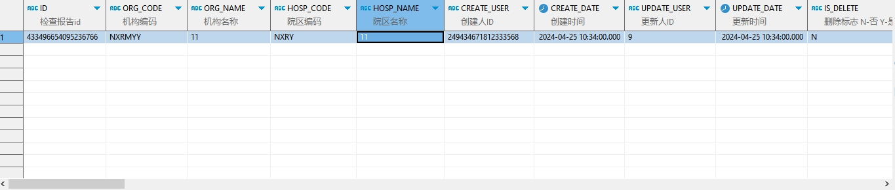

# 领域服务/临床领域 - 查询检查报告 - 查询检查报告 正向用例
## 请求参数：
``` json
{
  "hospCode": "NXRY",
  "pageSize": 1,
  "pageIndex": 1,
  "orgCode": "NXRMYY"
}
```
## 返回参数：
``` json
{
    "exception": null,
    "apiCode": null,
    "data": {
        "list": [
            {
                "age": "34岁",
                "auditDate": "2024-04-25 14:00:31",
                "auditUserId": "349365436797001728",
                "auditUserName": "测试医生",
                "bedNo": null,
                "birthday": null,
                "clinicalDiagIcdCode": null,
                "clinicalDiagId": "222",
                "clinicalDiagName": "心绞痛",
                "createDate": "2024-04-25 10:34:00",
                "createUserId": "249434671812333568",
                "crisisDesc": " ",
                "crisisFlag": "0",
                "examBodyName": "甲状腺",
                "examDate": "2023-12-26 10:28:50",
                "examEquipment": "CT机",
                "examFinding": "甲状腺左右叶大小分别为[左叶大小]和[右叶大小]，形态正常，密度均匀，边界清晰",
                "examTypeLargeName": "CT",
                "examTypeName": "CT检查",
                "examUserId": "1001",
                "examUserName": "医生A",
                "examWayName": "甲状腺CT平扫及增强扫描",
                "exeLink": "  ",
                "fileLink": "  ",
                "hospCode": "NXRY",
                "id": "433496654095236766",
                "isDelete": "N",
                "name": "叭叭",
                "orgCode": "NXRMYY",
                "patientId": "eeccd249562848d29f6adf5c70224214",
                "reporDeptId": "224717296399970304",
                "reportDate": "2024-04-25 14:28:31",
                "reportDeptName": "CT室",
                "reportName": "CT检查报告",
                "reportNo": "CT0012",
                "reportRemarks": "  ",
                "reportResult": "根据本次CT扫描结果，患者甲状腺未见明显异常",
                "reportUserId": "349365436797001728",
                "reportUserName": "测试医生",
                "requestDate": "2024-04-25 11:00:12",
                "requestDeptId": "224710203634774016",
                "requestDeptName": "产后康复",
                "requestUserId": "349365436797001728",
                "requestUserName": "测试医生",
                "sabc": null,
                "sendExamMaterial": null,
                "sex": "2",
                "sexName": "女",
                "systemCode": "SY001",
                "systemName": "放射系统",
                "updateDate": "2024-04-25 10:34:00",
                "updateUserId": "9",
                "visitId": "76465800457966323904",
                "visitNo": "2024042500001",
                "visitType": "1",
                "wardId": null,
                "wardName": null,
                "requests": null
            }
        ],
        "totalCount": 1,
        "pageSize": 1,
        "pageNo": 1,
        "pageCount": 1
    },
    "Code": 200,
    "Message": "操作成功"
}
```
## 数据校验：


# 领域服务/临床领域 - 查询检查报告 - 必填校验-[orgCode]为空
## 请求参数：
``` json
{
  "hospCode": "NXRY",
  "pageSize": 3,
  "pageIndex": 1,
  "orgCode": ""
}
```
## 返回参数：
``` json
{
  "exception": null,
  "apiCode": null,
  "data": null,
  "Code": 1,
  "Message": "医院编码不能为空"
}
```
# 领域服务/临床领域 - 查询检查报告 - 必填校验-[pageIndex]为空
## 请求参数：
``` json
{
  "hospCode": "NXRY",
  "pageSize": 3,
  "pageIndex": null,
  "orgCode": "NXRMYY"
}
```
## 返回参数：
``` json
{
  "exception": null,
  "apiCode": null,
  "data": null,
  "Code": 1101,
  "Message": "分页参数不能为空"
}
```
# 领域服务/临床领域 - 查询检查报告 - 必填校验-[pageSize]为空
## 请求参数：
``` json
{
  "hospCode": "NXRY",
  "pageSize": null,
  "pageIndex": 1,
  "orgCode": "NXRMYY"
}
```
## 返回参数：
``` json
{
  "exception": null,
  "apiCode": null,
  "data": null,
  "Code": 1101,
  "Message": "分页参数不能为空"
}
```
# 领域服务/临床领域 - 查询检查报告 - 类型校验-[pageIndex]类型错误
## 请求参数：
``` json
{
  "hospCode": "NXRY",
  "pageSize": 3,
  "pageIndex": "abc",
  "orgCode": "NXRMYY"
}
```
## 返回参数：
``` json
{
  "exception": null,
  "apiCode": null,
  "data": null,
  "Code": 1,
  "Message": "请求参数错误"
}
```
# 领域服务/临床领域 - 查询检查报告 - 类型校验-[pageSize]类型错误
## 请求参数：
``` json
{
  "hospCode": "NXRY",
  "pageSize": "abc",
  "pageIndex": 1,
  "orgCode": "NXRMYY"
}
```
## 返回参数：
``` json
{
  "exception": null,
  "apiCode": null,
  "data": null,
  "Code": 1,
  "Message": "请求参数错误"
}
```
# 领域服务/临床领域 - 查询检查报告 - 依赖用例-[orgCode]赋值为依赖用例测试值
## 请求参数：
``` json
{
  "hospCode": "NXRY",
  "pageSize": 3,
  "pageIndex": 1,
  "orgCode": "依赖用例测试值"
}
```
## 返回参数：
``` json
{
  "exception": null,
  "apiCode": null,
  "data": {
    "list": [],
    "totalCount": 0,
    "pageSize": 3,
    "pageNo": 1,
    "pageCount": 0
  },
  "Code": 200,
  "Message": "操作成功"
}
```