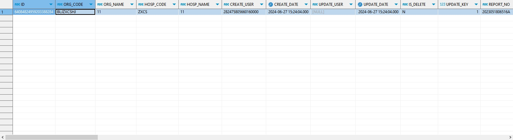

# 领域服务/临床领域 - 查询检验报告 - 查询检验报告 正向用例
## 请求参数：
``` json
{
  "hospCode": "NXRY",
  "pageSize": 1,
  "pageIndex": 1,
  "orgCode": "NXRMYY"
}
```
## 返回参数：
``` json
{
    "exception": null,
    "apiCode": null,
    "data": {
        "list": [
            {
                "age": "2岁1月",
                "auditDate": "2024-06-27 15:24:04",
                "auditUserId": "282475805660160000",
                "auditUserName": "CS彭彭彭",
                "barCode": "88888888",
                "bedNo": null,
                "birthday": null,
                "cardNo": "2",
                "cardType": "1",
                "clinicalDiagIcdCode": null,
                "clinicalDiagId": null,
                "clinicalDiagName": "细菌感染",
                "collectDate": "2024-06-27 15:24:04",
                "collectUserId": "1",
                "collectUserName": "1",
                "createDate": "2024-06-27 15:24:04",
                "createUserId": "282475805660160000",
                "crisisDesc": null,
                "crisisFlag": "0",
                "fileLink": null,
                "hospCode": "NXRY",
                "id": "64084824959203388284",
                "idCard": "2",
                "isDelete": "N",
                "name": "贰贰",
                "orgCode": "NXRMYY",
                "patientId": "373060ac206b4fa3ba77f91e9af82569",
                "reporDeptId": "62806123465166803648",
                "reportDate": "2024-06-27 15:24:04",
                "reportDeptName": "检验科",
                "reportName": "粪便一般培养（体检）",
                "reportNo": "2023051806516A",
                "reportRemark": null,
                "reportType": "2",
                "reportUserId": "282475805660160000",
                "reportUserName": "CS彭彭彭",
                "requestDate": "2024-06-26 15:24:04",
                "requestDeptId": "224711436038729728",
                "requestDeptName": "发热门诊",
                "requestId": "1805502201716637699",
                "requestUserId": "282475805660160000",
                "requestUserName": "CS彭彭彭",
                "sampleCode": "1003",
                "sampleName": "粪便",
                "sampleRecieveDate": "2024-06-25 15:24:02",
                "sex": "2",
                "sexName": "女",
                "testDate": "2024-06-27 15:24:04",
                "testUserId": "282475805660160000",
                "testUserName": "CS彭彭彭",
                "updateDate": "2024-06-27 15:24:04",
                "updateUserId": null,
                "visitCount": 1,
                "visitId": "1806153134293204993",
                "visitNo": "2024062500004",
                "visitType": "2",
                "wardId": null,
                "wardName": null,
                "germResults": null,
                "routineResults": null
            }
        ],
        "totalCount": 1,
        "pageSize": 1,
        "pageNo": 1,
        "pageCount": 1
    },
    "Code": 200,
    "Message": "操作成功"
}
```
## 数据校验：


# 领域服务/临床领域 - 查询检验报告 - 必填校验-[orgCode]为空
## 请求参数：
``` json
{
  "hospCode": "NXRY",
  "pageSize": 3,
  "visitType": "1",
  "pageIndex": 1,
  "orgCode": "",
  "isGetTestItems": "1"
}
```
## 返回参数：
``` json
{
  "exception": null,
  "apiCode": null,
  "data": null,
  "Code": 1,
  "Message": "医院编码不能为空"
}
```
# 领域服务/临床领域 - 查询检验报告 - 必填校验-[pageIndex]为空
## 请求参数：
``` json
{
  "hospCode": "NXRY",
  "pageSize": 3,
  "visitType": "1",
  "pageIndex": null,
  "orgCode": "NXRMYY",
  "isGetTestItems": "1"
}
```
## 返回参数：
``` json
{
  "exception": null,
  "apiCode": null,
  "data": null,
  "Code": 1101,
  "Message": "分页参数不能为空"
}
```
# 领域服务/临床领域 - 查询检验报告 - 必填校验-[pageSize]为空
## 请求参数：
``` json
{
  "hospCode": "NXRY",
  "pageSize": null,
  "visitType": "1",
  "pageIndex": 1,
  "orgCode": "NXRMYY",
  "isGetTestItems": "1"
}
```
## 返回参数：
``` json
{
  "exception": null,
  "apiCode": null,
  "data": null,
  "Code": 1101,
  "Message": "分页参数不能为空"
}
```
# 领域服务/临床领域 - 查询检验报告 - 类型校验-[pageIndex]类型错误
## 请求参数：
``` json
{
  "hospCode": "NXRY",
  "pageSize": 3,
  "visitType": "1",
  "pageIndex": "abc",
  "orgCode": "NXRMYY",
  "isGetTestItems": "1"
}
```
## 返回参数：
``` json
{
  "exception": null,
  "apiCode": null,
  "data": null,
  "Code": 1,
  "Message": "请求参数错误"
}
```
# 领域服务/临床领域 - 查询检验报告 - 类型校验-[pageSize]类型错误
## 请求参数：
``` json
{
  "hospCode": "NXRY",
  "pageSize": "abc",
  "visitType": "1",
  "pageIndex": 1,
  "orgCode": "NXRMYY",
  "isGetTestItems": "1"
}
```
## 返回参数：
``` json
{
  "exception": null,
  "apiCode": null,
  "data": null,
  "Code": 1,
  "Message": "请求参数错误"
}
```
# 领域服务/临床领域 - 查询检验报告 - 依赖用例-[orgCode]赋值为依赖用例测试值
## 请求参数：
``` json
{
  "hospCode": "NXRY",
  "pageSize": 3,
  "visitType": "1",
  "pageIndex": 1,
  "orgCode": "依赖用例测试值",
  "isGetTestItems": "1"
}
```
## 返回参数：
``` json
{
  "exception": null,
  "apiCode": null,
  "data": {
    "list": [],
    "totalCount": 0,
    "pageSize": 10,
    "pageNo": 1,
    "pageCount": 1
  },
  "Code": 200,
  "Message": "操作成功"
}
```