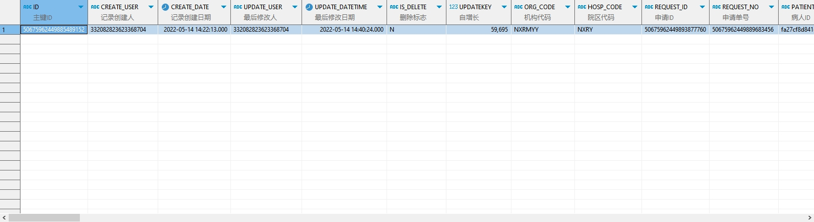

# 领域服务/临床领域 - 查询门诊医技申请 - 查询门诊医技申请 正向用例
## 请求参数：
``` json
{
  "hospCode": "NXRY",
  "pageSize": 3,
  "pageIndex": 1,
  "orgCode": "NXRMYY",
  "ids": [
    "50675962449885489152"
  ]
}
```
## 返回参数：
``` json
{
    "exception": null,
    "apiCode": null,
    "data": {
        "list": [
            {
                "id": "50675962449885489152",
                "createDate": "2022-05-14 14:22:13",
                "isDelete": "N",
                "updatekey": 59695,
                "orgCode": "NXRMYY",
                "hospCode": "NXRY",
                "requestId": "50675962449893877760",
                "requestNo": "50675962449889683456",
                "patientId": "fa27cf8d841e4bd48fd2ec0ef9dcbd4c",
                "patientName": "测试病人",
                "sex": "1",
                "age": "30岁",
                "requestDate": "2022-05-14 14:22:11",
                "execDeptId": "224718099806318592",
                "execDeptName": "病理科",
                "orderName": "病理科住院手术标本",
                "chargeFlag": 0,
                "medicalHistory": null,
                "requestLevel": "0",
                "patientSource": 2,
                "amount": 1,
                "unitName": "次",
                "money": 176.4,
                "sourceGroupSortNo": null,
                "inpatientId": "47301771594434775600",
                "inpatientNo": "2202090003",
                "orderregroupId": "50674554339094771184",
                "orderrecordId": "50674554339513775488",
                "managecordId": "50674554338674776880",
                "orderFinishFlag": "0",
                "orderFinishDate": null,
                "orderreexeId": null,
                "templateId": null,
                "templateName": null,
                "partNum": 1,
                "roomId": null,
                "isPrintBarcode": null,
                "printName": null,
                "printDate": null,
                "printNum": null,
                "appointmentId": null,
                "appointmentName": null,
                "appointmentDate": null,
                "scheduleId": null,
                "havepast": null,
                "havepastIsown": null,
                "havepastNo": null,
                "isBariummeal": null,
                "isHavemetal": null,
                "isPacemake": null,
                "positive": null,
                "isDiabetes": null,
                "bloodFee": null,
                "tubeFee": null,
                "jobTypeName": null,
                "transportationWay": null,
                "physiologicalCycleCode": null,
                "physiologicalCycleName": null,
                "orderItemTypeCode": null,
                "orderItemTypeName": null,
                "medLargeTypeCode": null,
                "medLargeTypeName": null,
                "appointmentStatusName": "未预约",
                "auditDate": null,
                "auditStatus": null,
                "auditUserId": null,
                "auditUserName": null,
                "refundFlag": null,
                "createUserId": "332082823623368704",
                "updateUserId": "332082823623368704",
                "updateDate": "2022-05-14 14:40:24",
                "visitId": null,
                "visitNo": null,
                "diagnosisIds": "50674224274429464576",
                "diagnosisNames": "疣",
                "requestDoctorId": "332082823623368704",
                "requestDoctorName": "xiaoming",
                "requestDeptId": "224712251436593152",
                "requestDeptName": "妇科",
                "prescId": null,
                "prescListId": null,
                "orderItemId": "256705148796821504",
                "bodyCodes": null,
                "bodyNames": null,
                "sampleCode": null,
                "sampleName": null,
                "examResult": null,
                "examPurpose": "50674537627317790912",
                "complaint": null,
                "reminderCode": null,
                "reminderText": null,
                "requestType": 0,
                "medTypeCode": "20",
                "medTypeName": "病理检查",
                "barCodeNo": null,
                "medOperateDate": null,
                "medStatusCode": null,
                "medStatusName": null,
                "medOperatorId": null,
                "medOperatorName": null,
                "printFlag": null,
                "scientificFlag": null,
                "appointmentTimeInterval": null,
                "appointmentStatusCode": null,
                "isDrugAllergy": null,
                "mainSymptomsCode": null,
                "mainSymptomsName": null,
                "existingDiseasesId": null,
                "existingDiseasesName": null,
                "jobTypeCode": null,
                "healthCheckUp": null,
                "limosisFlag": null,
                "diagnosisIcdCodes": null
            }
        ],
        "totalCount": 1,
        "pageSize": 3,
        "pageNo": 1,
        "pageCount": 1
    },
    "Code": 200,
    "Message": "操作成功"
}
```
## 数据校验：


# 领域服务/临床领域 - 查询门诊医技申请 - 必填校验-[orgCode]为空
## 请求参数：
``` json
{
  "hospCode": "NXRY",
  "pageSize": 3,
  "pageIndex": 1,
  "orgCode": "",
  "visitIds": [
    "82270999878936452780"
  ]
}
```
## 返回参数：
``` json
{
  "exception": null,
  "apiCode": null,
  "data": null,
  "Code": 1,
  "Message": "医院编码不能为空"
}
```
# 领域服务/临床领域 - 查询门诊医技申请 - 必填校验-[hospCode]为空
## 请求参数：
``` json
{
  "hospCode": "",
  "pageSize": 3,
  "pageIndex": 1,
  "orgCode": "NXRMYY",
  "visitIds": [
    "82270999878936452780"
  ]
}
```
## 返回参数：
``` json
{
  "exception": null,
  "apiCode": null,
  "data": {
    "list": [],
    "totalCount": 0,
    "pageSize": 3,
    "pageNo": 1,
    "pageCount": 0
  },
  "Code": 200,
  "Message": "操作成功"
}
```
# 领域服务/临床领域 - 查询门诊医技申请 - 必填校验-[pageIndex]为空
## 请求参数：
``` json
{
  "hospCode": "NXRY",
  "pageSize": 3,
  "pageIndex": null,
  "orgCode": "NXRMYY",
  "visitIds": [
    "82270999878936452780"
  ]
}
```
## 返回参数：
``` json
{
  "exception": null,
  "apiCode": null,
  "data": null,
  "Code": 1,
  "Message": "系统内部异常"
}
```
# 领域服务/临床领域 - 查询门诊医技申请 - 必填校验-[pageSize]为空
## 请求参数：
``` json
{
  "hospCode": "NXRY",
  "pageSize": null,
  "pageIndex": 1,
  "orgCode": "NXRMYY",
  "visitIds": [
    "82270999878936452780"
  ]
}
```
## 返回参数：
``` json
{
  "exception": null,
  "apiCode": null,
  "data": null,
  "Code": 1,
  "Message": "系统内部异常"
}
```
# 领域服务/临床领域 - 查询门诊医技申请 - 类型校验-[pageIndex]类型错误
## 请求参数：
``` json
{
  "hospCode": "NXRY",
  "pageSize": 3,
  "pageIndex": "abc",
  "orgCode": "NXRMYY",
  "visitIds": [
    "82270999878936452780"
  ]
}
```
## 返回参数：
``` json
{
  "exception": null,
  "apiCode": null,
  "data": null,
  "Code": 1,
  "Message": "请求参数错误"
}
```
# 领域服务/临床领域 - 查询门诊医技申请 - 类型校验-[pageSize]类型错误
## 请求参数：
``` json
{
  "hospCode": "NXRY",
  "pageSize": "abc",
  "pageIndex": 1,
  "orgCode": "NXRMYY",
  "visitIds": [
    "82270999878936452780"
  ]
}
```
## 返回参数：
``` json
{
  "exception": null,
  "apiCode": null,
  "data": null,
  "Code": 1,
  "Message": "请求参数错误"
}
```
# 领域服务/临床领域 - 查询门诊医技申请 - 依赖用例-[orgCode]赋值为依赖用例测试值
## 请求参数：
``` json
{
  "hospCode": "NXRY",
  "pageSize": 3,
  "pageIndex": 1,
  "orgCode": "依赖用例测试值",
  "visitIds": [
    "82270999878936452780"
  ]
}
```
## 返回参数：
``` json
{
  "exception": null,
  "apiCode": null,
  "data": {
    "list": [],
    "totalCount": 0,
    "pageSize": 3,
    "pageNo": 1,
    "pageCount": 0
  },
  "Code": 200,
  "Message": "操作成功"
}
```
# 领域服务/临床领域 - 查询门诊医技申请 - 依赖用例-[hospCode]赋值为依赖用例测试值
## 请求参数：
``` json
{
  "hospCode": "依赖用例测试值",
  "pageSize": 3,
  "pageIndex": 1,
  "orgCode": "NXRMYY",
  "visitIds": [
    "82270999878936452780"
  ]
}
```
## 返回参数：
``` json
{
  "exception": null,
  "apiCode": null,
  "data": {
    "list": [],
    "totalCount": 0,
    "pageSize": 3,
    "pageNo": 1,
    "pageCount": 0
  },
  "Code": 200,
  "Message": "操作成功"
}
```