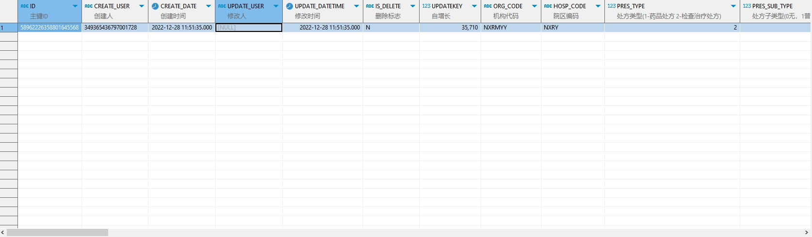

# 领域服务/临床领域 - 查询门诊处方 - 查询门诊处方 正向用例
## 请求参数：
``` json
{
  "hospCode": "NXRY",
  "pageSize": 3,
  "pageIndex": 1,
  "orgCode": "NXRMYY",
  "visitIds": [
    "081bd59d4d124e34b83da62874de53f8"
  ]
}
```
## 返回参数：
``` json
{
    "exception": null,
    "apiCode": null,
    "data": {
        "list": [
            {
                "isDelete": "N",
                "createDate": "2022-12-28 11:51:35",
                "updateDate": "2022-12-28 11:51:35",
                "id": "58962226358801645568",
                "updatekey": null,
                "orgCode": "NXRMYY",
                "hospCode": "NXRY",
                "balanceType": "0",
                "prescDate": "2022-12-28 11:51:34",
                "expireDate": "2023-01-04 11:51:35",
                "patientId": "75c3951bf42448e7a324e2e54e17f005",
                "sex": "2",
                "age": "23岁",
                "doctorId": "349365436797001728",
                "doctorName": "测试医生",
                "deptName": "妇科",
                "execDeptName": "妇科",
                "chargeFlag": "1",
                "money": 6,
                "factorName": null,
                "drugRemarks": null,
                "gcpId": null,
                "gcpName": null,
                "isCirculation": null,
                "prescNo": null,
                "logisticsCompanyName": null,
                "juniorCollegeRequirements": null,
                "batchNo": null,
                "commentKey": null,
                "factorContact": null,
                "prescLists": null,
                "createUserId": "349365436797001728",
                "updateUserId": null,
                "prescType": "2",
                "prescSubType": "10",
                "medicarePrescFlag": "0",
                "cipherPrescFlag": "0",
                "skinTestPrescFlag": "0",
                "prescSource": "1",
                "prescWay": null,
                "name": "测试",
                "visitId": "081bd59d4d124e34b83da62874de53f8",
                "cardId": null,
                "visitNo": "2022122800005",
                "primaryDiagIds": null,
                "primaryDiagNames": null,
                "deptId": "224712251436593152",
                "checkFlag": null,
                "checkUserId": null,
                "checkUserName": null,
                "execDeptId": "224712251436593152",
                "dispenseWindowName": null,
                "sourceId": "40503ae5fb0c44b5bc4cabcceeb024d3",
                "clinicalDiagId": null,
                "lockFlag": "0",
                "additionalRemark": null,
                "takeWayCode": null,
                "decoctTypeCode": null,
                "saveState": "0",
                "medStatusCode": null,
                "medStatusName": null,
                "medOperatorId": null,
                "medOperatorName": null,
                "medOperateDate": null,
                "patientIdCard": null,
                "factorIdCard": null,
                "bMove": null,
                "moveTime": null,
                "customTypeCode": null,
                "customTypeName": null,
                "gcpRecordId": null,
                "insDiagCode": null,
                "insDiagName": null,
                "dispenseStatus": null,
                "mailAddressId": null,
                "decoctTypeName": null
            }
        ],
        "totalCount": 1,
        "pageSize": 3,
        "pageNo": 1,
        "pageCount": 1
    },
    "Code": 200,
    "Message": "操作成功"
}
```
## 数据校验：


# 领域服务/临床领域 - 查询门诊处方 - 必填校验-[orgCode]为空
## 请求参数：
``` json
{
  "hospCode": "NXRY",
  "pageSize": 3,
  "isGetPrescList": "1",
  "pageIndex": 1,
  "orgCode": "",
  "orderClassCode": "1",
  "visitIds": [
    "82270999878936452780"
  ]
}
```
## 返回参数：
``` json
{
  "exception": null,
  "apiCode": null,
  "data": null,
  "Code": 1,
  "Message": "医院编码不能为空"
}
```
# 领域服务/临床领域 - 查询门诊处方 - 必填校验-[pageIndex]为空
## 请求参数：
``` json
{
  "hospCode": "NXRY",
  "pageSize": 3,
  "isGetPrescList": "1",
  "pageIndex": null,
  "orgCode": "NXRMYY",
  "orderClassCode": "1",
  "visitIds": [
    "82270999878936452780"
  ]
}
```
## 返回参数：
``` json
{
  "exception": null,
  "apiCode": null,
  "data": null,
  "Code": 1,
  "Message": "系统内部异常"
}
```
# 领域服务/临床领域 - 查询门诊处方 - 必填校验-[pageSize]为空
## 请求参数：
``` json
{
  "hospCode": "NXRY",
  "pageSize": null,
  "isGetPrescList": "1",
  "pageIndex": 1,
  "orgCode": "NXRMYY",
  "orderClassCode": "1",
  "visitIds": [
    "82270999878936452780"
  ]
}
```
## 返回参数：
``` json
{
  "exception": null,
  "apiCode": null,
  "data": null,
  "Code": 1,
  "Message": "系统内部异常"
}
```
# 领域服务/临床领域 - 查询门诊处方 - 类型校验-[pageIndex]类型错误
## 请求参数：
``` json
{
  "hospCode": "NXRY",
  "pageSize": 3,
  "isGetPrescList": "1",
  "pageIndex": "abc",
  "orgCode": "NXRMYY",
  "orderClassCode": "1",
  "visitIds": [
    "82270999878936452780"
  ]
}
```
## 返回参数：
``` json
{
  "exception": null,
  "apiCode": null,
  "data": null,
  "Code": 1,
  "Message": "请求参数错误"
}
```
# 领域服务/临床领域 - 查询门诊处方 - 类型校验-[pageSize]类型错误
## 请求参数：
``` json
{
  "hospCode": "NXRY",
  "pageSize": "abc",
  "isGetPrescList": "1",
  "pageIndex": 1,
  "orgCode": "NXRMYY",
  "orderClassCode": "1",
  "visitIds": [
    "82270999878936452780"
  ]
}
```
## 返回参数：
``` json
{
  "exception": null,
  "apiCode": null,
  "data": null,
  "Code": 1,
  "Message": "请求参数错误"
}
```
# 领域服务/临床领域 - 查询门诊处方 - 依赖用例-[orgCode]赋值为依赖用例测试值
## 请求参数：
``` json
{
  "hospCode": "NXRY",
  "pageSize": 3,
  "isGetPrescList": "1",
  "pageIndex": 1,
  "orgCode": "依赖用例测试值",
  "orderClassCode": "1",
  "visitIds": [
    "82270999878936452780"
  ]
}
```
## 返回参数：
``` json
{
  "exception": null,
  "apiCode": null,
  "data": {
    "list": [],
    "totalCount": 0,
    "pageSize": 3,
    "pageNo": 1,
    "pageCount": 0
  },
  "Code": 200,
  "Message": "操作成功"
}
```