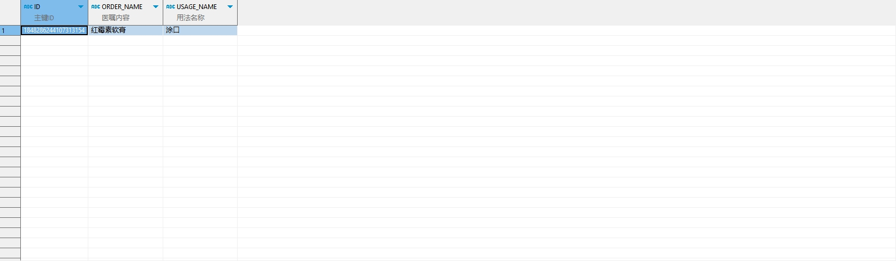

# 领域服务/临床领域 - 查询门诊处方明细 - 查询门诊处方明细 正向用例
## 请求参数：
``` json
{
  "prescIds": [],
  "hospCode": "NXRY",
  "pageSize": 3,
  "pageIndex": 1,
  "orgCode": "NXRMYY",
  "ids": [
    "1848286244107313154"
  ]
}
```
## 返回参数：
``` json
{
  "exception": null,
  "apiCode": null,
  "data": {
    "list": [
      {
        "id": "1848286244107313154",
        "createDate": "2024-10-21 16:52:34",
        "updateDate": "2024-10-21 17:27:18",
        "isDelete": "Y",
        "updatekey": null,
        "groupId": "1000",
        "groupSortNo": 1,
        "specId": "20200408030207957",
        "dosage": 10,
        "dosageUnitName": "g",
        "dosageUnitType": 1,
        "bagNum": 1,
        "frequencyId": "897520b5db1f42a8aad70f41fab03b3a",
        "frequencyName": "Bid",
        "usageId": "576",
        "usageName": "涂口",
        "days": 1,
        "skinTestPrescId": null,
        "skinTestResult": -1,
        "usagePrescId": null,
        "orginalPrice": 2,
        "prescDate": "2024-10-21 16:33:36",
        "complexFlag": null,
        "execStatus": "0",
        "urgentFlag": null,
        "selfPreFlag": null,
        "attachText": null,
        "rescueFlag": "0",
        "favourablecheckFlag": null,
        "createUsername": null,
        "updateUsername": null,
        "reDelete": "N",
        "auditStatus": 2,
        "auditUser": "349365436797001728",
        "dropsper": null,
        "batchNumber": null,
        "memo5": "31b3e0",
        "selfFeeItems": null,
        "convertDosage": null,
        "convertDosageUnitName": null,
        "convertDosageUnitId": null,
        "isPrint": null,
        "drugAuditUserId": null,
        "drugAuditUserName": null,
        "drugAuditStatus": "0",
        "orgCode": null,
        "signDataId": null,
        "signResult": null,
        "doubleSignUserId": null,
        "doubleSignUserName": null,
        "circulationAuditUserId": null,
        "circulationAuditUserName": null,
        "circulationAuditStatus": "0",
        "dedupItemIds": null,
        "orderItemTypeCode": null,
        "orderItemTypeName": null,
        "treatmentOrderFlag": null,
        "medTechRequest": null,
        "antiUseRequest": null,
        "createUserId": null,
        "updateUserId": "349365436797001728",
        "prescId": "1848286244107313153",
        "orderTypeCode": 1,
        "orderItemId": "20200408030207976",
        "orderItemName": "红霉素软膏",
        "spec": "10g/支",
        "factory": "福元药业有限公司",
        "dosageUnitId": "20200408030205419",
        "actualPrice": 2,
        "num": 2,
        "unitRate": 1,
        "unitId": "20200408030204765",
        "unitName": "支",
        "money": 4,
        "batchStockId": null,
        "footnote": null,
        "exhortation": null,
        "bodyNames": null,
        "bodyCodes": null,
        "attchTextCode": null,
        "sampleCode": null,
        "sampleName": null,
        "price": 2,
        "refundFlag": "0",
        "costRelatedFlag": null,
        "skinDrugFlag": null,
        "selExecDeptAddress": null,
        "medOperateDate": null,
        "medStatusCode": null,
        "medStatusName": null,
        "medOperatorId": null,
        "medOperatorName": null,
        "beyondMemo": null,
        "drugPropertys": null,
        "templateId": null,
        "templateListId": null,
        "auditDate": "2024-10-21 16:52:44",
        "scientificFlag": null,
        "isAddChargeByTimeQuantum": null,
        "arrearsChargeFlag": null,
        "printTimes": "0",
        "excessiveDrugUseFlag": null,
        "nationInsCode": null,
        "bMove": null,
        "moveTime": null,
        "nationInsName": null,
        "isNeedDocSign": null,
        "dispenseAuditUserId": null,
        "dispenseAuditUser": null,
        "deployUserId": null,
        "deployUserName": null,
        "drugAuditDate": null,
        "doubleSignDate": null,
        "circulationAuditDate": null,
        "oralProjectItemId": null,
        "oralProjectCode": "1",
        "sourceId": "31b3e0",
        "preInHospitalBit": "0",
        "preInHospitalId": null
      }
    ],
    "totalCount": 1,
    "pageSize": 3,
    "pageNo": 1,
    "pageCount": 1
  },
  "Code": 200,
  "Message": "操作成功"
}
```
## 数据校验：


# 领域服务/临床领域 - 查询门诊处方明细 - 必填校验-[orgCode]为空
## 请求参数：
``` json
{
  "prescIds": [],
  "hospCode": "NXRY",
  "pageSize": 3,
  "pageIndex": 1,
  "orgCode": "",
  "ids": [
    "1848286244107313154"
  ]
}
```
## 返回参数：
``` json
{
  "exception": null,
  "apiCode": null,
  "data": null,
  "Code": 1,
  "Message": "医院编码不能为空"
}
```
# 领域服务/临床领域 - 查询门诊处方明细 - 必填校验-[pageIndex]为空
## 请求参数：
``` json
{
  "prescIds": [],
  "hospCode": "NXRY",
  "pageSize": 3,
  "pageIndex": null,
  "orgCode": "NXRMYY",
  "ids": [
    "1848286244107313154"
  ]
}
```
## 返回参数：
``` json
{
  "exception": null,
  "apiCode": null,
  "data": null,
  "Code": 1,
  "Message": "系统内部异常"
}
```
# 领域服务/临床领域 - 查询门诊处方明细 - 必填校验-[pageSize]为空
## 请求参数：
``` json
{
  "prescIds": [],
  "hospCode": "NXRY",
  "pageSize": null,
  "pageIndex": 1,
  "orgCode": "NXRMYY",
  "ids": [
    "1848286244107313154"
  ]
}
```
## 返回参数：
``` json
{
  "exception": null,
  "apiCode": null,
  "data": null,
  "Code": 1,
  "Message": "系统内部异常"
}
```
# 领域服务/临床领域 - 查询门诊处方明细 - 类型校验-[pageIndex]类型错误
## 请求参数：
``` json
{
  "prescIds": [],
  "hospCode": "NXRY",
  "pageSize": 3,
  "pageIndex": "abc",
  "orgCode": "NXRMYY",
  "ids": [
    "1848286244107313154"
  ]
}
```
## 返回参数：
``` json
{
  "exception": null,
  "apiCode": null,
  "data": null,
  "Code": 1,
  "Message": "请求参数错误"
}
```
# 领域服务/临床领域 - 查询门诊处方明细 - 类型校验-[pageSize]类型错误
## 请求参数：
``` json
{
  "prescIds": [],
  "hospCode": "NXRY",
  "pageSize": "abc",
  "pageIndex": 1,
  "orgCode": "NXRMYY",
  "ids": [
    "1848286244107313154"
  ]
}
```
## 返回参数：
``` json
{
  "exception": null,
  "apiCode": null,
  "data": null,
  "Code": 1,
  "Message": "请求参数错误"
}
```
# 领域服务/临床领域 - 查询门诊处方明细 - 依赖用例-[orgCode]赋值为依赖用例测试值
## 请求参数：
``` json
{
  "prescIds": [],
  "hospCode": "NXRY",
  "pageSize": 3,
  "pageIndex": 1,
  "orgCode": "依赖用例测试值",
  "ids": [
    "1848286244107313154"
  ]
}
```
## 返回参数：
``` json
{
  "exception": null,
  "apiCode": null,
  "data": {
    "list": [
      {
        "id": "1848286244107313154",
        "createDate": "2024-10-21 16:52:34",
        "updateDate": "2024-10-21 17:27:18",
        "isDelete": "Y",
        "updatekey": null,
        "groupId": "1000",
        "groupSortNo": 1,
        "specId": "20200408030207957",
        "dosage": 10,
        "dosageUnitName": "g",
        "dosageUnitType": 1,
        "bagNum": 1,
        "frequencyId": "897520b5db1f42a8aad70f41fab03b3a",
        "frequencyName": "Bid",
        "usageId": "576",
        "usageName": "涂口",
        "days": 1,
        "skinTestPrescId": null,
        "skinTestResult": -1,
        "usagePrescId": null,
        "orginalPrice": 2,
        "prescDate": "2024-10-21 16:33:36",
        "complexFlag": null,
        "execStatus": "0",
        "urgentFlag": null,
        "selfPreFlag": null,
        "attachText": null,
        "rescueFlag": "0",
        "favourablecheckFlag": null,
        "createUsername": null,
        "updateUsername": null,
        "reDelete": "N",
        "auditStatus": 2,
        "auditUser": "349365436797001728",
        "dropsper": null,
        "batchNumber": null,
        "memo5": "31b3e0",
        "selfFeeItems": null,
        "convertDosage": null,
        "convertDosageUnitName": null,
        "convertDosageUnitId": null,
        "isPrint": null,
        "drugAuditUserId": null,
        "drugAuditUserName": null,
        "drugAuditStatus": "0",
        "orgCode": null,
        "signDataId": null,
        "signResult": null,
        "doubleSignUserId": null,
        "doubleSignUserName": null,
        "circulationAuditUserId": null,
        "circulationAuditUserName": null,
        "circulationAuditStatus": "0",
        "dedupItemIds": null,
        "orderItemTypeCode": null,
        "orderItemTypeName": null,
        "treatmentOrderFlag": null,
        "medTechRequest": null,
        "antiUseRequest": null,
        "createUserId": null,
        "updateUserId": "349365436797001728",
        "prescId": "1848286244107313153",
        "orderTypeCode": 1,
        "orderItemId": "20200408030207976",
        "orderItemName": "红霉素软膏",
        "spec": "10g/支",
        "factory": "福元药业有限公司",
        "dosageUnitId": "20200408030205419",
        "actualPrice": 2,
        "num": 2,
        "unitRate": 1,
        "unitId": "20200408030204765",
        "unitName": "支",
        "money": 4,
        "batchStockId": null,
        "footnote": null,
        "exhortation": null,
        "bodyNames": null,
        "bodyCodes": null,
        "attchTextCode": null,
        "sampleCode": null,
        "sampleName": null,
        "price": 2,
        "refundFlag": "0",
        "costRelatedFlag": null,
        "skinDrugFlag": null,
        "selExecDeptAddress": null,
        "medOperateDate": null,
        "medStatusCode": null,
        "medStatusName": null,
        "medOperatorId": null,
        "medOperatorName": null,
        "beyondMemo": null,
        "drugPropertys": null,
        "templateId": null,
        "templateListId": null,
        "auditDate": "2024-10-21 16:52:44",
        "scientificFlag": null,
        "isAddChargeByTimeQuantum": null,
        "arrearsChargeFlag": null,
        "printTimes": "0",
        "excessiveDrugUseFlag": null,
        "nationInsCode": null,
        "bMove": null,
        "moveTime": null,
        "nationInsName": null,
        "isNeedDocSign": null,
        "dispenseAuditUserId": null,
        "dispenseAuditUser": null,
        "deployUserId": null,
        "deployUserName": null,
        "drugAuditDate": null,
        "doubleSignDate": null,
        "circulationAuditDate": null,
        "oralProjectItemId": null,
        "oralProjectCode": "1",
        "sourceId": "31b3e0",
        "preInHospitalBit": "0",
        "preInHospitalId": null
      }
    ],
    "totalCount": 1,
    "pageSize": 3,
    "pageNo": 1,
    "pageCount": 1
  },
  "Code": 200,
  "Message": "操作成功"
}
```