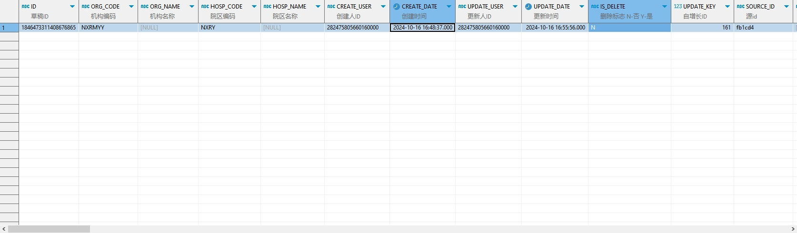

# 领域服务/临床领域 - 查询门诊处方草稿 - 查询门诊处方草稿 正向用例
## 请求参数：
``` json
{
  "hospCode": "NXRY",
  "pageSize": 3,
  "visitId": "1846435449783234561",
  "pageIndex": 1,
  "orgCode": "NXRMYY"
}
```
## 返回参数：
``` json
{
    "exception": null,
    "apiCode": null,
    "data": {
        "list": [
            {
                "id": "1846473311408676865",
                "orgCode": "NXRMYY",
                "orgName": null,
                "hospCode": "NXRY",
                "hospName": null,
                "updateKey": 161,
                "sourceId": "fb1cd4",
                "prescId": null,
                "prescListId": null,
                "medicarePrescFlag": null,
                "cipherPrescFlag": "0",
                "skinTestPrescFlag": "0",
                "prescSource": "1",
                "prescWay": "1",
                "prescDate": "2024-10-16 16:48:32",
                "expireDate": null,
                "patientId": "39542b4771894578a1d6a9ad8568a894",
                "name": "测试优惠2",
                "visitId": "1846435449783234561",
                "visitNo": "2024101600006",
                "takeWayCode": null,
                "decoctTypeCode": null,
                "factorIdCard": null,
                "factorName": null,
                "patientIdCard": null,
                "insDiagCode": null,
                "insDiagName": null,
                "primaryDiagIds": "1846468327212625921",
                "primaryDiagNames": "孕痈病",
                "doctorId": "282475805660160000",
                "doctorName": "CS彭彭彭",
                "deptId": "224708989908054016",
                "deptName": "产科诊室",
                "execDeptId": "224718893381218304",
                "execDeptName": "中药房",
                "sourceGroupSortNo": null,
                "sourceGroupId": null,
                "sortNo": "0",
                "orderItemId": "20200408030220726",
                "orderItemName": "米索前列醇片",
                "orderName": "米索前列醇片",
                "specId": "20200408030220704",
                "spec": "200ug*3粒/盒",
                "factory": "浙江仙琚制药股份有限公司",
                "dosageUnitId": "20200408030206335",
                "dosageUnitName": "ug",
                "dosageUnitType": "1",
                "bagNum": 1,
                "frequencyId": "d8fdbcf535fc43dc8d56844c0b6ac96a",
                "frequencyName": "阿斯顿",
                "usageId": "2",
                "usageName": "肌注",
                "days": 1,
                "dropsper": null,
                "footnote": null,
                "exhortation": null,
                "skinTestPrescId": null,
                "usagePrescId": null,
                "num": 1,
                "unitId": "20200408030204965",
                "unitName": "盒",
                "unitRate": "1",
                "price": 6.3,
                "money": 6.3,
                "bodyCodes": null,
                "bodyNames": null,
                "sampleCode": null,
                "sampleName": null,
                "costRelatedFlag": null,
                "attachTextCode": null,
                "attachText": null,
                "selfPreFlag": null,
                "urgentFlag": null,
                "scientificFlag": null,
                "isAddChargeByTimeQuantum": null,
                "arrearsChargeFlag": null,
                "excessiveDrugUseFlag": null,
                "selExecDeptAddress": null,
                "beyondMemo": null,
                "templateId": null,
                "templateListId": null,
                "isDelete": "N",
                "createDate": "2024-10-16 16:48:37",
                "createUserId": "282475805660160000",
                "updateDate": "2024-10-16 16:55:56",
                "updateUserId": "282475805660160000",
                "decotingTypeName": null,
                "dosage": 200,
                "prescType": "1",
                "rescueFlag": "0",
                "orderTypeCode": "1",
                "medicalTypeCode": null,
                "antiUseRequest": null
            }
        ],
        "totalCount": 1,
        "pageSize": 3,
        "pageNo": 1,
        "pageCount": 1
    },
    "Code": 200,
    "Message": "操作成功"
}
```
## 数据校验：


# 领域服务/临床领域 - 查询门诊处方草稿 - 必填校验-[orgCode]为空
## 请求参数：
``` json
{
  "hospCode": "NXRY",
  "pageSize": 3,
  "visitId": "82270999878936452780",
  "pageIndex": 1,
  "doctorId": "282475805660160000",
  "orgCode": "",
  "orderClassCode": "2"
}
```
## 返回参数：
``` json
{
  "exception": null,
  "apiCode": null,
  "data": null,
  "Code": 1,
  "Message": "医院编码不能为空"
}
```
# 领域服务/临床领域 - 查询门诊处方草稿 - 必填校验-[hospCode]为空
## 请求参数：
``` json
{
  "hospCode": "",
  "pageSize": 3,
  "visitId": "82270999878936452780",
  "pageIndex": 1,
  "doctorId": "282475805660160000",
  "orgCode": "NXRMYY",
  "orderClassCode": "2"
}
```
## 返回参数：
``` json
{
  "exception": null,
  "apiCode": null,
  "data": null,
  "Code": 1,
  "Message": "院区编码不能为空"
}
```
# 领域服务/临床领域 - 查询门诊处方草稿 - 必填校验-[pageIndex]为空
## 请求参数：
``` json
{
  "hospCode": "NXRY",
  "pageSize": 3,
  "visitId": "82270999878936452780",
  "pageIndex": null,
  "doctorId": "282475805660160000",
  "orgCode": "NXRMYY",
  "orderClassCode": "2"
}
```
## 返回参数：
``` json
{
  "exception": null,
  "apiCode": null,
  "data": null,
  "Code": 1102,
  "Message": "分页参数不能为空"
}
```
# 领域服务/临床领域 - 查询门诊处方草稿 - 必填校验-[pageSize]为空
## 请求参数：
``` json
{
  "hospCode": "NXRY",
  "pageSize": null,
  "visitId": "82270999878936452780",
  "pageIndex": 1,
  "doctorId": "282475805660160000",
  "orgCode": "NXRMYY",
  "orderClassCode": "2"
}
```
## 返回参数：
``` json
{
  "exception": null,
  "apiCode": null,
  "data": null,
  "Code": 1102,
  "Message": "分页参数不能为空"
}
```
# 领域服务/临床领域 - 查询门诊处方草稿 - 类型校验-[pageIndex]类型错误
## 请求参数：
``` json
{
  "hospCode": "NXRY",
  "pageSize": 3,
  "visitId": "82270999878936452780",
  "pageIndex": "abc",
  "doctorId": "282475805660160000",
  "orgCode": "NXRMYY",
  "orderClassCode": "2"
}
```
## 返回参数：
``` json
{
  "exception": null,
  "apiCode": null,
  "data": null,
  "Code": 1,
  "Message": "请求参数错误"
}
```
# 领域服务/临床领域 - 查询门诊处方草稿 - 类型校验-[pageSize]类型错误
## 请求参数：
``` json
{
  "hospCode": "NXRY",
  "pageSize": "abc",
  "visitId": "82270999878936452780",
  "pageIndex": 1,
  "doctorId": "282475805660160000",
  "orgCode": "NXRMYY",
  "orderClassCode": "2"
}
```
## 返回参数：
``` json
{
  "exception": null,
  "apiCode": null,
  "data": null,
  "Code": 1,
  "Message": "请求参数错误"
}
```
# 领域服务/临床领域 - 查询门诊处方草稿 - 依赖用例-[orgCode]赋值为依赖用例测试值
## 请求参数：
``` json
{
  "hospCode": "NXRY",
  "pageSize": 3,
  "visitId": "82270999878936452780",
  "pageIndex": 1,
  "doctorId": "282475805660160000",
  "orgCode": "依赖用例测试值",
  "orderClassCode": "2"
}
```
## 返回参数：
``` json
{
  "exception": null,
  "apiCode": null,
  "data": {
    "list": [],
    "totalCount": 0,
    "pageSize": 10,
    "pageNo": 1,
    "pageCount": 1
  },
  "Code": 200,
  "Message": "操作成功"
}
```
# 领域服务/临床领域 - 查询门诊处方草稿 - 依赖用例-[hospCode]赋值为依赖用例测试值
## 请求参数：
``` json
{
  "hospCode": "依赖用例测试值",
  "pageSize": 3,
  "visitId": "82270999878936452780",
  "pageIndex": 1,
  "doctorId": "282475805660160000",
  "orgCode": "NXRMYY",
  "orderClassCode": "2"
}
```
## 返回参数：
``` json
{
  "exception": null,
  "apiCode": null,
  "data": {
    "list": [],
    "totalCount": 0,
    "pageSize": 10,
    "pageNo": 1,
    "pageCount": 1
  },
  "Code": 200,
  "Message": "操作成功"
}
```