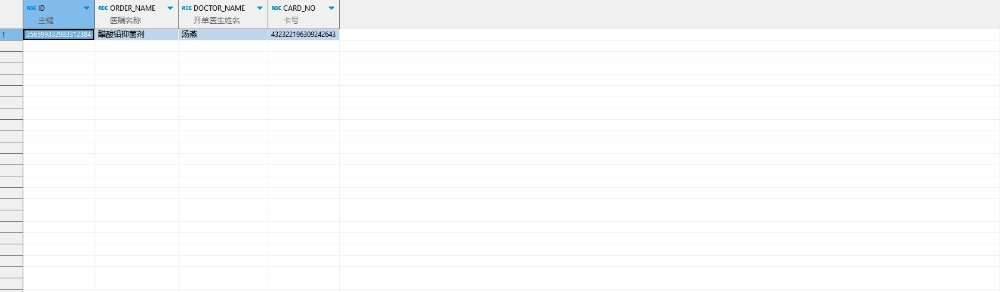

# 领域服务/临床领域 - 查询门诊处方退费申请 - 查询门诊处方退费申请 正向用例
## 请求参数：
``` json
{
  "pageSize": 1,
  "orgCode": "NXRMYY",
  "pageIndex": 1,
  "ids": [
    "256599332983312384"
  ]
}
```
## 返回参数：
``` json
{
  "exception": null,
  "apiCode": null,
  "data": {
    "list": [],
    "totalCount": 0,
    "pageSize": 10,
    "pageNo": 1,
    "pageCount": 1
  },
  "Code": 200,
  "Message": "操作成功"
}
```
## 数据校验：


# 领域服务/临床领域 - 查询门诊处方退费申请 - 必填校验-[orgCode]为空
## 请求参数：
``` json
{
  "pageSize": 3,
  "orgCode": "",
  "prescIds": [
    "1"
  ],
  "prescListIds": [
    "82516784615108251648"
  ],
  "visitNos": [
    null
  ],
  "pageIndex": 1,
  "ids": [
    ""
  ]
}
```
## 返回参数：
``` json
{
  "exception": null,
  "apiCode": null,
  "data": null,
  "Code": 1,
  "Message": "医院编码不能为空"
}
```
# 领域服务/临床领域 - 查询门诊处方退费申请 - 必填校验-[pageIndex]为空
## 请求参数：
``` json
{
  "pageSize": 3,
  "orgCode": "NXRMYY",
  "prescIds": [
    "1"
  ],
  "prescListIds": [
    "82516784615108251648"
  ],
  "visitNos": [
    null
  ],
  "pageIndex": null,
  "ids": [
    ""
  ]
}
```
## 返回参数：
``` json
{
  "exception": null,
  "apiCode": null,
  "data": null,
  "Code": 1101,
  "Message": "分页参数不能为空"
}
```
# 领域服务/临床领域 - 查询门诊处方退费申请 - 必填校验-[pageSize]为空
## 请求参数：
``` json
{
  "pageSize": null,
  "orgCode": "NXRMYY",
  "prescIds": [
    "1"
  ],
  "prescListIds": [
    "82516784615108251648"
  ],
  "visitNos": [
    null
  ],
  "pageIndex": 1,
  "ids": [
    ""
  ]
}
```
## 返回参数：
``` json
{
  "exception": null,
  "apiCode": null,
  "data": null,
  "Code": 1101,
  "Message": "分页参数不能为空"
}
```
# 领域服务/临床领域 - 查询门诊处方退费申请 - 类型校验-[pageIndex]类型错误
## 请求参数：
``` json
{
  "pageSize": 3,
  "orgCode": "NXRMYY",
  "prescIds": [
    "1"
  ],
  "prescListIds": [
    "82516784615108251648"
  ],
  "visitNos": [
    null
  ],
  "pageIndex": "abc",
  "ids": [
    ""
  ]
}
```
## 返回参数：
``` json
{
  "exception": null,
  "apiCode": null,
  "data": null,
  "Code": 1,
  "Message": "请求参数错误"
}
```
# 领域服务/临床领域 - 查询门诊处方退费申请 - 类型校验-[pageSize]类型错误
## 请求参数：
``` json
{
  "pageSize": "abc",
  "orgCode": "NXRMYY",
  "prescIds": [
    "1"
  ],
  "prescListIds": [
    "82516784615108251648"
  ],
  "visitNos": [
    null
  ],
  "pageIndex": 1,
  "ids": [
    ""
  ]
}
```
## 返回参数：
``` json
{
  "exception": null,
  "apiCode": null,
  "data": null,
  "Code": 1,
  "Message": "请求参数错误"
}
```
# 领域服务/临床领域 - 查询门诊处方退费申请 - 依赖用例-[orgCode]赋值为依赖用例测试值
## 请求参数：
``` json
{
  "pageSize": 3,
  "orgCode": "依赖用例测试值",
  "prescIds": [
    "1"
  ],
  "prescListIds": [
    "82516784615108251648"
  ],
  "visitNos": [
    null
  ],
  "pageIndex": 1,
  "ids": [
    ""
  ]
}
```
## 返回参数：
``` json
{
  "exception": null,
  "apiCode": null,
  "data": {
    "list": [],
    "totalCount": 0,
    "pageSize": 10,
    "pageNo": 1,
    "pageCount": 1
  },
  "Code": 200,
  "Message": "操作成功"
}
```