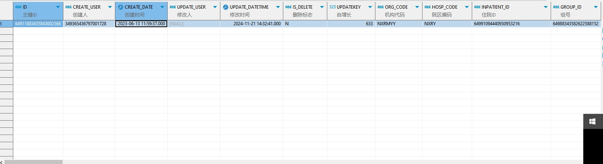

# 领域服务/临床领域 - 查询门诊抗菌药用药申请 - 查询门诊抗菌药用药申请 正向用例
## 请求参数：
``` json
{
    "hospCode": "NXRY",
    "pageSize": 1,
    "pageIndex": 1,
    "orgCode": "NXRMYY",
    "Ids": [
        "64911883435843002368"
    ]
}
```
## 返回参数：
``` json
{
    "exception": null,
    "apiCode": null,
    "data": {
        "list": [
            {
                "isDelete": "N",
                "createDate": "2023-06-13 11:59:37",
                "updateDate": "2024-11-21 14:32:41",
                "id": "64911883435843002368",
                "orgCode": "NXRMYY",
                "hospCode": "NXRY",
                "visitId": "64991094440930953216",
                "visitType": "1",
                "prescId": "64988343582622588152",
                "prescListId": "64988343583880888064",
                "deptId": null,
                "deptName": null,
                "doctorId": null,
                "doctorName": null,
                "antiDrugName": null,
                "antiDrugId": "20200408030219564",
                "antiDrugLevel": "2",
                "docAntiLevel": "3",
                "mngType": "0",
                "useDrugPurpose": "0",
                "purposeTypeCode": "3",
                "purposeTypeName": "非手术预防用",
                "indicationsCode": null,
                "indicationsName": null,
                "bactDrugSensitivity": null,
                "opportunityCode": "0",
                "opportunityName": "普通",
                "treatmentDays": "1",
                "operationName": null,
                "operationApplyId": null,
                "incisionCode": null,
                "incisionName": null,
                "reasons": "是的发",
                "timeoutReasons": null,
                "excessReasonss": null,
                "infectionTypeCode": null,
                "infectionTypeName": null,
                "contactAntiFlag": "0",
                "contactAntiReasonCode": null,
                "contactAntiReasonName": null,
                "beyondDrugFlag": "0",
                "consultationApplyId": null,
                "consultationFinishFlag": null,
                "audiFlag": "1",
                "audiUserId": "依赖用例测试值",
                "audiUserName": "CS彭彭彭",
                "audiDateTime": null,
                "audiMemo": null,
                "audiType": "0",
                "openMode": null,
                "treatPosition": null,
                "patientName": "吴花",
                "sexName": "女",
                "age": "23岁",
                "spec": "1.6MIU/瓶",
                "dosage": "1",
                "dosageUnitName": "瓶",
                "usageName": "静滴",
                "frequencyName": "Qd",
                "days": "3",
                "num": "3",
                "unitName": "瓶",
                "orderItemTypeName": null,
                "auditStatus": null,
                "createUserId": "349365436797001728",
                "updateUserId": null
            }
        ],
        "totalCount": 398,
        "pageSize": 1,
        "pageNo": 1,
        "pageCount": 398
    },
    "Code": 200,
    "Message": "操作成功"
}
```
## 数据校验：


# 领域服务/临床领域 - 查询门诊抗菌药用药申请 - 必填校验-[orgCode]为空
## 请求参数：
``` json
{
  "hospCode": "NXRY",
  "pageSize": 3,
  "pageIndex": 1,
  "orgCode": "",
  "deptIds": [],
  "audiFlag": ""
}
```
## 返回参数：
``` json
{
  "exception": null,
  "apiCode": null,
  "data": null,
  "Code": 1,
  "Message": "医院编码不能为空"
}
```
# 领域服务/临床领域 - 查询门诊抗菌药用药申请 - 必填校验-[pageIndex]为空
## 请求参数：
``` json
{
  "hospCode": "NXRY",
  "pageSize": 3,
  "pageIndex": null,
  "orgCode": "NXRMYY",
  "deptIds": [],
  "audiFlag": ""
}
```
## 返回参数：
``` json
{
  "exception": null,
  "apiCode": null,
  "data": null,
  "Code": 1,
  "Message": "系统内部异常"
}
```
# 领域服务/临床领域 - 查询门诊抗菌药用药申请 - 必填校验-[pageSize]为空
## 请求参数：
``` json
{
  "hospCode": "NXRY",
  "pageSize": null,
  "pageIndex": 1,
  "orgCode": "NXRMYY",
  "deptIds": [],
  "audiFlag": ""
}
```
## 返回参数：
``` json
{
  "exception": null,
  "apiCode": null,
  "data": null,
  "Code": 1,
  "Message": "系统内部异常"
}
```
# 领域服务/临床领域 - 查询门诊抗菌药用药申请 - 类型校验-[pageIndex]类型错误
## 请求参数：
``` json
{
  "hospCode": "NXRY",
  "pageSize": 3,
  "pageIndex": "abc",
  "orgCode": "NXRMYY",
  "deptIds": [],
  "audiFlag": ""
}
```
## 返回参数：
``` json
{
  "exception": null,
  "apiCode": null,
  "data": null,
  "Code": 1,
  "Message": "请求参数错误"
}
```
# 领域服务/临床领域 - 查询门诊抗菌药用药申请 - 类型校验-[pageSize]类型错误
## 请求参数：
``` json
{
  "hospCode": "NXRY",
  "pageSize": "abc",
  "pageIndex": 1,
  "orgCode": "NXRMYY",
  "deptIds": [],
  "audiFlag": ""
}
```
## 返回参数：
``` json
{
  "exception": null,
  "apiCode": null,
  "data": null,
  "Code": 1,
  "Message": "请求参数错误"
}
```
# 领域服务/临床领域 - 查询门诊抗菌药用药申请 - 依赖用例-[orgCode]赋值为依赖用例测试值
## 请求参数：
``` json
{
  "hospCode": "NXRY",
  "pageSize": 3,
  "pageIndex": 1,
  "orgCode": "依赖用例测试值",
  "deptIds": [],
  "audiFlag": ""
}
```
## 返回参数：
``` json
{
  "exception": null,
  "apiCode": null,
  "data": {
    "list": [],
    "totalCount": 0,
    "pageSize": 3,
    "pageNo": 1,
    "pageCount": 0
  },
  "Code": 200,
  "Message": "操作成功"
}
```