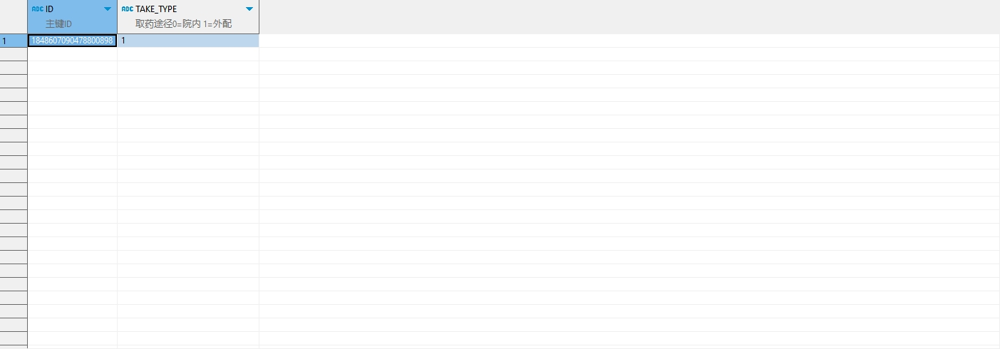

# 领域服务/临床领域 - 设置门诊处方取药途径 - 设置门诊处方取药途径 正向用例
## 请求参数：
``` json
{
  "hospCode": "NXRY",
  "orgCode": "NXRMYY",
  "operatorId": "282475805660160000",
  "operatorName": "CS彭彭彭",
  "prescIds": [
    "1848607090478800898"
  ],
  "takeWayCode": "1"
}
```
## 返回参数：
``` json
{
  "exception": null,
  "apiCode": null,
  "data": true,
  "Code": 200,
  "Message": "操作成功"
}
```
## 数据校验：


# 领域服务/临床领域 - 设置门诊处方取药途径 - 必填校验-[orgCode]为空
## 请求参数：
``` json
{
  "hospCode": "NXRY",
  "orgCode": "",
  "operatorId": "282475805660160000",
  "operatorName": "CS彭彭彭",
  "prescIds": [
    "1848607090478800898"
  ],
  "takeWayCode": "0"
}
```
## 返回参数：
``` json
{
  "exception": null,
  "apiCode": null,
  "data": null,
  "Code": 1,
  "Message": "医院编码不能为空"
}
```
# 领域服务/临床领域 - 设置门诊处方取药途径 - 必填校验-[hospCode]为空
## 请求参数：
``` json
{
  "hospCode": "",
  "orgCode": "NXRMYY",
  "operatorId": "282475805660160000",
  "operatorName": "CS彭彭彭",
  "prescIds": [
    "1848607090478800898"
  ],
  "takeWayCode": "0"
}
```
## 返回参数：
``` json
{
  "exception": null,
  "apiCode": null,
  "data": null,
  "Code": 1,
  "Message": "院区编码不能为空"
}
```
# 领域服务/临床领域 - 设置门诊处方取药途径 - 必填校验-[operatorId]为空
## 请求参数：
``` json
{
  "hospCode": "NXRY",
  "orgCode": "NXRMYY",
  "operatorId": "",
  "operatorName": "CS彭彭彭",
  "prescIds": [
    "1848607090478800898"
  ],
  "takeWayCode": "0"
}
```
## 返回参数：
``` json
{
  "exception": null,
  "apiCode": null,
  "data": null,
  "Code": 1,
  "Message": "操作人id不能为空"
}
```
# 领域服务/临床领域 - 设置门诊处方取药途径 - 必填校验-[operatorName]为空
## 请求参数：
``` json
{
  "hospCode": "NXRY",
  "orgCode": "NXRMYY",
  "operatorId": "282475805660160000",
  "operatorName": "",
  "prescIds": [
    "1848607090478800898"
  ],
  "takeWayCode": "0"
}
```
## 返回参数：
``` json
{
  "exception": null,
  "apiCode": null,
  "data": null,
  "Code": 1,
  "Message": "操作人姓名不能为空"
}
```
# 领域服务/临床领域 - 设置门诊处方取药途径 - 必填校验-[prescIds]为空
## 请求参数：
``` json
{
  "hospCode": "NXRY",
  "orgCode": "NXRMYY",
  "operatorId": "282475805660160000",
  "operatorName": "CS彭彭彭",
  "prescIds": null,
  "takeWayCode": "0"
}
```
## 返回参数：
``` json
{
  "exception": null,
  "apiCode": null,
  "data": null,
  "Code": 1,
  "Message": "处方id集合不能为空"
}
```
# 领域服务/临床领域 - 设置门诊处方取药途径 - 必填校验-[takeWayCode]为空
## 请求参数：
``` json
{
  "hospCode": "NXRY",
  "orgCode": "NXRMYY",
  "operatorId": "282475805660160000",
  "operatorName": "CS彭彭彭",
  "prescIds": [
    "1848607090478800898"
  ],
  "takeWayCode": ""
}
```
## 返回参数：
``` json
{
  "exception": null,
  "apiCode": null,
  "data": null,
  "Code": 1,
  "Message": "取药途径不能为空"
}
```
# 领域服务/临床领域 - 设置门诊处方取药途径 - 类型校验-[prescIds]类型错误
## 请求参数：
``` json
{
  "hospCode": "NXRY",
  "orgCode": "NXRMYY",
  "operatorId": "282475805660160000",
  "operatorName": "CS彭彭彭",
  "prescIds": "abc",
  "takeWayCode": "0"
}
```
## 返回参数：
``` json
{
  "exception": null,
  "apiCode": null,
  "data": null,
  "Code": 1,
  "Message": "请求参数错误"
}
```
# 领域服务/临床领域 - 设置门诊处方取药途径 - 枚举用例-[takeWayCode] 枚举值为 0(取药途径为院内)
## 请求参数：
``` json
{
  "hospCode": "NXRY",
  "orgCode": "NXRMYY",
  "operatorId": "282475805660160000",
  "operatorName": "CS彭彭彭",
  "prescIds": [
    "1848607090478800898"
  ],
  "takeWayCode": "0"
}
```
## 返回参数：
``` json
{
  "exception": null,
  "apiCode": null,
  "data": true,
  "Code": 200,
  "Message": "操作成功"
}
```
# 领域服务/临床领域 - 设置门诊处方取药途径 - 枚举用例-[takeWayCode] 枚举值为 1(取药途径为院外)
## 请求参数：
``` json
{
  "hospCode": "NXRY",
  "orgCode": "NXRMYY",
  "operatorId": "282475805660160000",
  "operatorName": "CS彭彭彭",
  "prescIds": [
    "1848607090478800898"
  ],
  "takeWayCode": "1"
}
```
## 返回参数：
``` json
{
  "exception": null,
  "apiCode": null,
  "data": true,
  "Code": 200,
  "Message": "操作成功"
}
```
# 领域服务/临床领域 - 设置门诊处方取药途径 - 依赖用例-[prescIds]赋值为[依赖用例测试值]
## 请求参数：
``` json
{
  "hospCode": "NXRY",
  "orgCode": "NXRMYY",
  "operatorId": "282475805660160000",
  "operatorName": "CS彭彭彭",
  "prescIds": [
    "依赖用例测试值"
  ],
  "takeWayCode": "0"
}
```
## 返回参数：
``` json
{
  "exception": null,
  "apiCode": null,
  "data": false,
  "Code": 200,
  "Message": "操作成功"
}
```
# 领域服务/临床领域 - 设置门诊处方取药途径 - 依赖用例-[operatorName]赋值为依赖用例测试值
## 请求参数：
``` json
{
  "hospCode": "NXRY",
  "orgCode": "NXRMYY",
  "operatorId": "282475805660160000",
  "operatorName": "依赖用例测试值",
  "prescIds": [
    "1848607090478800898"
  ],
  "takeWayCode": "0"
}
```
## 返回参数：
``` json
{
  "exception": null,
  "apiCode": null,
  "data": true,
  "Code": 200,
  "Message": "操作成功"
}
```
# 领域服务/临床领域 - 设置门诊处方取药途径 - 依赖用例-[operatorId]赋值为依赖用例测试值
## 请求参数：
``` json
{
  "hospCode": "NXRY",
  "orgCode": "NXRMYY",
  "operatorId": "依赖用例测试值",
  "operatorName": "CS彭彭彭",
  "prescIds": [
    "1848607090478800898"
  ],
  "takeWayCode": "0"
}
```
## 返回参数：
``` json
{
  "exception": null,
  "apiCode": null,
  "data": true,
  "Code": 200,
  "Message": "操作成功"
}
```
# 领域服务/临床领域 - 设置门诊处方取药途径 - 依赖用例-[orgCode]赋值为依赖用例测试值
## 请求参数：
``` json
{
  "hospCode": "NXRY",
  "orgCode": "依赖用例测试值",
  "operatorId": "282475805660160000",
  "operatorName": "CS彭彭彭",
  "prescIds": [
    "1848607090478800898"
  ],
  "takeWayCode": "0"
}
```
## 返回参数：
``` json
{
  "exception": null,
  "apiCode": null,
  "data": false,
  "Code": 200,
  "Message": "操作成功"
}
```
# 领域服务/临床领域 - 设置门诊处方取药途径 - 依赖用例-[hospCode]赋值为依赖用例测试值
## 请求参数：
``` json
{
  "hospCode": "依赖用例测试值",
  "orgCode": "NXRMYY",
  "operatorId": "282475805660160000",
  "operatorName": "CS彭彭彭",
  "prescIds": [
    "1848607090478800898"
  ],
  "takeWayCode": "0"
}
```
## 返回参数：
``` json
{
  "exception": null,
  "apiCode": null,
  "data": false,
  "Code": 200,
  "Message": "操作成功"
}
```