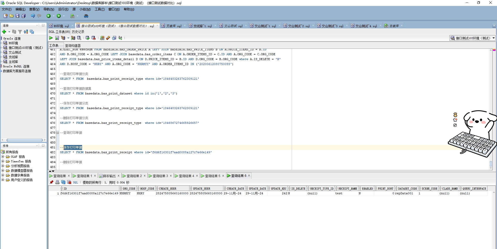

# 领域服务/基础领域 - 保存打印单据 - 保存打印单据 正向用例
## 请求参数：
``` json
{
    "hospCode": "NXRY",
    "orgCode": "NXRMYY",
    "list": [
        {
            "sceneCode": "1",
            "id": "",
            "receiptTypeName": "test1",
            "dataSetCode": "repData001",
            "enabled": "N",
            "isDelete": "N",
            "printSort": 0,
            "receiptName": "test"
        }
    ],
    "operatorId": "282475805660160000",
    "operatorName": "CS彭彭彭"
}
```
## 返回参数：
``` json
{
    "exception": null,
    "apiCode": null,
    "data": [
        {
            "id": "f6d6f16301f7aad0088a127c7e66e149",
            "sourceId": null
        }
    ],
    "Code": 200,
    "Message": "操作成功"
}
```
## 数据校验：

# 领域服务/基础领域 - 保存打印单据 - 必填校验-[orgCode]为空
## 请求参数：
``` json
{
  "data": {
    "dataSetCode": "repData001",
    "enabled": "N",
    "id": "",
    "isDelete": "N",
    "printSort": 0,
    "receiptLimits": [
      {
        "id": "",
        "limitField": "prescType",
        "limitMode": "1",
        "limitType": "2",
        "operator": "in",
        "operatorValue": "1,2"
      },
      {
        "id": "",
        "limitField": "prescSubType",
        "limitMode": "1",
        "limitType": "2",
        "operator": "in",
        "operatorValue": "0"
      },
      {
        "id": "",
        "limitField": "orderTypeCode",
        "limitMode": "1",
        "limitType": "2",
        "operator": "in",
        "operatorValue": "1"
      }
    ],
    "receiptName": "病历",
    "receiptReports": [
      {
        "deptId": "224698439396388864",
        "deptName": "院办",
        "reportFileName": "-院办.grf"
      },
      {
        "id": "",
        "reportFileName": "111.grf"
      }
    ],
    "receiptTypeId": "1846483263762309121",
    "sceneCode": "1"
  },
  "hospCode": "NXRY",
  "hospName": "版本测试环境",
  "operatorId": "282475805660160000",
  "operatorName": "CS彭彭彭",
  "orgCode": "",
  "orgName": "版本测试环境"
}
```
## 返回参数：
``` json
{
  "exception": null,
  "apiCode": null,
  "data": null,
  "Code": 1,
  "Message": "医院编码不能为空 \n 打印单据表保存对象不能为空"
}
```
# 领域服务/基础领域 - 保存打印单据 - 必填校验-[hospCode]为空
## 请求参数：
``` json
{
  "data": {
    "dataSetCode": "repData001",
    "enabled": "N",
    "id": "",
    "isDelete": "N",
    "printSort": 0,
    "receiptLimits": [
      {
        "id": "",
        "limitField": "prescType",
        "limitMode": "1",
        "limitType": "2",
        "operator": "in",
        "operatorValue": "1,2"
      },
      {
        "id": "",
        "limitField": "prescSubType",
        "limitMode": "1",
        "limitType": "2",
        "operator": "in",
        "operatorValue": "0"
      },
      {
        "id": "",
        "limitField": "orderTypeCode",
        "limitMode": "1",
        "limitType": "2",
        "operator": "in",
        "operatorValue": "1"
      }
    ],
    "receiptName": "病历",
    "receiptReports": [
      {
        "deptId": "224698439396388864",
        "deptName": "院办",
        "reportFileName": "-院办.grf"
      },
      {
        "id": "",
        "reportFileName": "111.grf"
      }
    ],
    "receiptTypeId": "1846483263762309121",
    "sceneCode": "1"
  },
  "hospCode": "",
  "hospName": "版本测试环境",
  "operatorId": "282475805660160000",
  "operatorName": "CS彭彭彭",
  "orgCode": "NXRMYY",
  "orgName": "版本测试环境"
}
```
## 返回参数：
``` json
{
  "exception": null,
  "apiCode": null,
  "data": null,
  "Code": 1,
  "Message": "打印单据表保存对象不能为空 \n 院区编码不能为空"
}
```
# 领域服务/基础领域 - 保存打印单据 - 必填校验-[operatorId]为空
## 请求参数：
``` json
{
  "data": {
    "dataSetCode": "repData001",
    "enabled": "N",
    "id": "",
    "isDelete": "N",
    "printSort": 0,
    "receiptLimits": [
      {
        "id": "",
        "limitField": "prescType",
        "limitMode": "1",
        "limitType": "2",
        "operator": "in",
        "operatorValue": "1,2"
      },
      {
        "id": "",
        "limitField": "prescSubType",
        "limitMode": "1",
        "limitType": "2",
        "operator": "in",
        "operatorValue": "0"
      },
      {
        "id": "",
        "limitField": "orderTypeCode",
        "limitMode": "1",
        "limitType": "2",
        "operator": "in",
        "operatorValue": "1"
      }
    ],
    "receiptName": "病历",
    "receiptReports": [
      {
        "deptId": "224698439396388864",
        "deptName": "院办",
        "reportFileName": "-院办.grf"
      },
      {
        "id": "",
        "reportFileName": "111.grf"
      }
    ],
    "receiptTypeId": "1846483263762309121",
    "sceneCode": "1"
  },
  "hospCode": "NXRY",
  "hospName": "版本测试环境",
  "operatorId": "",
  "operatorName": "CS彭彭彭",
  "orgCode": "NXRMYY",
  "orgName": "版本测试环境"
}
```
## 返回参数：
``` json
{
  "exception": null,
  "apiCode": null,
  "data": null,
  "Code": 1,
  "Message": "打印单据表保存对象不能为空 \n 操作人id不能为空"
}
```
# 领域服务/基础领域 - 保存打印单据 - 必填校验-[operatorName]为空
## 请求参数：
``` json
{
  "data": {
    "dataSetCode": "repData001",
    "enabled": "N",
    "id": "",
    "isDelete": "N",
    "printSort": 0,
    "receiptLimits": [
      {
        "id": "",
        "limitField": "prescType",
        "limitMode": "1",
        "limitType": "2",
        "operator": "in",
        "operatorValue": "1,2"
      },
      {
        "id": "",
        "limitField": "prescSubType",
        "limitMode": "1",
        "limitType": "2",
        "operator": "in",
        "operatorValue": "0"
      },
      {
        "id": "",
        "limitField": "orderTypeCode",
        "limitMode": "1",
        "limitType": "2",
        "operator": "in",
        "operatorValue": "1"
      }
    ],
    "receiptName": "病历",
    "receiptReports": [
      {
        "deptId": "224698439396388864",
        "deptName": "院办",
        "reportFileName": "-院办.grf"
      },
      {
        "id": "",
        "reportFileName": "111.grf"
      }
    ],
    "receiptTypeId": "1846483263762309121",
    "sceneCode": "1"
  },
  "hospCode": "NXRY",
  "hospName": "版本测试环境",
  "operatorId": "282475805660160000",
  "operatorName": "",
  "orgCode": "NXRMYY",
  "orgName": "版本测试环境"
}
```
## 返回参数：
``` json
{
  "exception": null,
  "apiCode": null,
  "data": null,
  "Code": 1,
  "Message": "操作人姓名不能为空 \n 打印单据表保存对象不能为空"
}
```
# 领域服务/基础领域 - 保存打印单据 - 必填校验-[data.isDelete]为空
## 请求参数：
``` json
{
  "data": {
    "dataSetCode": "repData001",
    "enabled": "N",
    "id": "",
    "isDelete": null,
    "printSort": 0,
    "receiptLimits": [
      {
        "id": "",
        "limitField": "prescType",
        "limitMode": "1",
        "limitType": "2",
        "operator": "in",
        "operatorValue": "1,2"
      },
      {
        "id": "",
        "limitField": "prescSubType",
        "limitMode": "1",
        "limitType": "2",
        "operator": "in",
        "operatorValue": "0"
      },
      {
        "id": "",
        "limitField": "orderTypeCode",
        "limitMode": "1",
        "limitType": "2",
        "operator": "in",
        "operatorValue": "1"
      }
    ],
    "receiptName": "病历",
    "receiptReports": [
      {
        "deptId": "224698439396388864",
        "deptName": "院办",
        "reportFileName": "-院办.grf"
      },
      {
        "id": "",
        "reportFileName": "111.grf"
      }
    ],
    "receiptTypeId": "1846483263762309121",
    "sceneCode": "1"
  },
  "hospCode": "NXRY",
  "hospName": "版本测试环境",
  "operatorId": "282475805660160000",
  "operatorName": "CS彭彭彭",
  "orgCode": "NXRMYY",
  "orgName": "版本测试环境"
}
```
## 返回参数：
``` json
{
  "exception": null,
  "apiCode": null,
  "data": null,
  "Code": 1,
  "Message": "打印单据表保存对象不能为空"
}
```
# 领域服务/基础领域 - 保存打印单据 - 必填校验-[data.receiptName]为空
## 请求参数：
``` json
{
  "data": {
    "dataSetCode": "repData001",
    "enabled": "N",
    "id": "",
    "isDelete": "N",
    "printSort": 0,
    "receiptLimits": [
      {
        "id": "",
        "limitField": "prescType",
        "limitMode": "1",
        "limitType": "2",
        "operator": "in",
        "operatorValue": "1,2"
      },
      {
        "id": "",
        "limitField": "prescSubType",
        "limitMode": "1",
        "limitType": "2",
        "operator": "in",
        "operatorValue": "0"
      },
      {
        "id": "",
        "limitField": "orderTypeCode",
        "limitMode": "1",
        "limitType": "2",
        "operator": "in",
        "operatorValue": "1"
      }
    ],
    "receiptName": null,
    "receiptReports": [
      {
        "deptId": "224698439396388864",
        "deptName": "院办",
        "reportFileName": "-院办.grf"
      },
      {
        "id": "",
        "reportFileName": "111.grf"
      }
    ],
    "receiptTypeId": "1846483263762309121",
    "sceneCode": "1"
  },
  "hospCode": "NXRY",
  "hospName": "版本测试环境",
  "operatorId": "282475805660160000",
  "operatorName": "CS彭彭彭",
  "orgCode": "NXRMYY",
  "orgName": "版本测试环境"
}
```
## 返回参数：
``` json
{
  "exception": null,
  "apiCode": null,
  "data": null,
  "Code": 1,
  "Message": "打印单据表保存对象不能为空"
}
```
# 领域服务/基础领域 - 保存打印单据 - 必填校验-[data.dataSetCode]为空
## 请求参数：
``` json
{
  "data": {
    "dataSetCode": null,
    "enabled": "N",
    "id": "",
    "isDelete": "N",
    "printSort": 0,
    "receiptLimits": [
      {
        "id": "",
        "limitField": "prescType",
        "limitMode": "1",
        "limitType": "2",
        "operator": "in",
        "operatorValue": "1,2"
      },
      {
        "id": "",
        "limitField": "prescSubType",
        "limitMode": "1",
        "limitType": "2",
        "operator": "in",
        "operatorValue": "0"
      },
      {
        "id": "",
        "limitField": "orderTypeCode",
        "limitMode": "1",
        "limitType": "2",
        "operator": "in",
        "operatorValue": "1"
      }
    ],
    "receiptName": "病历",
    "receiptReports": [
      {
        "deptId": "224698439396388864",
        "deptName": "院办",
        "reportFileName": "-院办.grf"
      },
      {
        "id": "",
        "reportFileName": "111.grf"
      }
    ],
    "receiptTypeId": "1846483263762309121",
    "sceneCode": "1"
  },
  "hospCode": "NXRY",
  "hospName": "版本测试环境",
  "operatorId": "282475805660160000",
  "operatorName": "CS彭彭彭",
  "orgCode": "NXRMYY",
  "orgName": "版本测试环境"
}
```
## 返回参数：
``` json
{
  "exception": null,
  "apiCode": null,
  "data": null,
  "Code": 1,
  "Message": "打印单据表保存对象不能为空"
}
```
# 领域服务/基础领域 - 保存打印单据 - 必填校验-[data.sceneCode]为空
## 请求参数：
``` json
{
  "data": {
    "dataSetCode": "repData001",
    "enabled": "N",
    "id": "",
    "isDelete": "N",
    "printSort": 0,
    "receiptLimits": [
      {
        "id": "",
        "limitField": "prescType",
        "limitMode": "1",
        "limitType": "2",
        "operator": "in",
        "operatorValue": "1,2"
      },
      {
        "id": "",
        "limitField": "prescSubType",
        "limitMode": "1",
        "limitType": "2",
        "operator": "in",
        "operatorValue": "0"
      },
      {
        "id": "",
        "limitField": "orderTypeCode",
        "limitMode": "1",
        "limitType": "2",
        "operator": "in",
        "operatorValue": "1"
      }
    ],
    "receiptName": "病历",
    "receiptReports": [
      {
        "deptId": "224698439396388864",
        "deptName": "院办",
        "reportFileName": "-院办.grf"
      },
      {
        "id": "",
        "reportFileName": "111.grf"
      }
    ],
    "receiptTypeId": "1846483263762309121",
    "sceneCode": null
  },
  "hospCode": "NXRY",
  "hospName": "版本测试环境",
  "operatorId": "282475805660160000",
  "operatorName": "CS彭彭彭",
  "orgCode": "NXRMYY",
  "orgName": "版本测试环境"
}
```
## 返回参数：
``` json
{
  "exception": null,
  "apiCode": null,
  "data": null,
  "Code": 1,
  "Message": "打印单据表保存对象不能为空"
}
```
# 领域服务/基础领域 - 保存打印单据 - 必填校验-[data.enabled]为空
## 请求参数：
``` json
{
  "data": {
    "dataSetCode": "repData001",
    "enabled": null,
    "id": "",
    "isDelete": "N",
    "printSort": 0,
    "receiptLimits": [
      {
        "id": "",
        "limitField": "prescType",
        "limitMode": "1",
        "limitType": "2",
        "operator": "in",
        "operatorValue": "1,2"
      },
      {
        "id": "",
        "limitField": "prescSubType",
        "limitMode": "1",
        "limitType": "2",
        "operator": "in",
        "operatorValue": "0"
      },
      {
        "id": "",
        "limitField": "orderTypeCode",
        "limitMode": "1",
        "limitType": "2",
        "operator": "in",
        "operatorValue": "1"
      }
    ],
    "receiptName": "病历",
    "receiptReports": [
      {
        "deptId": "224698439396388864",
        "deptName": "院办",
        "reportFileName": "-院办.grf"
      },
      {
        "id": "",
        "reportFileName": "111.grf"
      }
    ],
    "receiptTypeId": "1846483263762309121",
    "sceneCode": "1"
  },
  "hospCode": "NXRY",
  "hospName": "版本测试环境",
  "operatorId": "282475805660160000",
  "operatorName": "CS彭彭彭",
  "orgCode": "NXRMYY",
  "orgName": "版本测试环境"
}
```
## 返回参数：
``` json
{
  "exception": null,
  "apiCode": null,
  "data": null,
  "Code": 1,
  "Message": "打印单据表保存对象不能为空"
}
```
# 领域服务/基础领域 - 保存打印单据 - 必填校验-[data.printSort]为空
## 请求参数：
``` json
{
  "data": {
    "dataSetCode": "repData001",
    "enabled": "N",
    "id": "",
    "isDelete": "N",
    "printSort": null,
    "receiptLimits": [
      {
        "id": "",
        "limitField": "prescType",
        "limitMode": "1",
        "limitType": "2",
        "operator": "in",
        "operatorValue": "1,2"
      },
      {
        "id": "",
        "limitField": "prescSubType",
        "limitMode": "1",
        "limitType": "2",
        "operator": "in",
        "operatorValue": "0"
      },
      {
        "id": "",
        "limitField": "orderTypeCode",
        "limitMode": "1",
        "limitType": "2",
        "operator": "in",
        "operatorValue": "1"
      }
    ],
    "receiptName": "病历",
    "receiptReports": [
      {
        "deptId": "224698439396388864",
        "deptName": "院办",
        "reportFileName": "-院办.grf"
      },
      {
        "id": "",
        "reportFileName": "111.grf"
      }
    ],
    "receiptTypeId": "1846483263762309121",
    "sceneCode": "1"
  },
  "hospCode": "NXRY",
  "hospName": "版本测试环境",
  "operatorId": "282475805660160000",
  "operatorName": "CS彭彭彭",
  "orgCode": "NXRMYY",
  "orgName": "版本测试环境"
}
```
## 返回参数：
``` json
{
  "exception": null,
  "apiCode": null,
  "data": null,
  "Code": 1,
  "Message": "打印单据表保存对象不能为空"
}
```
# 领域服务/基础领域 - 保存打印单据 - 必填校验-[data.receiptReports.reportFileName]为空
## 请求参数：
``` json
{
  "data": {
    "dataSetCode": "repData001",
    "enabled": "N",
    "id": "",
    "isDelete": "N",
    "printSort": 0,
    "receiptLimits": [
      {
        "id": "",
        "limitField": "prescType",
        "limitMode": "1",
        "limitType": "2",
        "operator": "in",
        "operatorValue": "1,2"
      },
      {
        "id": "",
        "limitField": "prescSubType",
        "limitMode": "1",
        "limitType": "2",
        "operator": "in",
        "operatorValue": "0"
      },
      {
        "id": "",
        "limitField": "orderTypeCode",
        "limitMode": "1",
        "limitType": "2",
        "operator": "in",
        "operatorValue": "1"
      }
    ],
    "receiptName": "病历",
    "receiptReports": [
      {
        "deptId": "224698439396388864",
        "deptName": "院办",
        "reportFileName": null
      },
      {
        "id": "",
        "reportFileName": "111.grf"
      }
    ],
    "receiptTypeId": "1846483263762309121",
    "sceneCode": "1"
  },
  "hospCode": "NXRY",
  "hospName": "版本测试环境",
  "operatorId": "282475805660160000",
  "operatorName": "CS彭彭彭",
  "orgCode": "NXRMYY",
  "orgName": "版本测试环境"
}
```
## 返回参数：
``` json
{
  "exception": null,
  "apiCode": null,
  "data": null,
  "Code": 1,
  "Message": "打印单据表保存对象不能为空"
}
```
# 领域服务/基础领域 - 保存打印单据 - 必填校验-[data.receiptLimits.limitType]为空
## 请求参数：
``` json
{
  "data": {
    "dataSetCode": "repData001",
    "enabled": "N",
    "id": "",
    "isDelete": "N",
    "printSort": 0,
    "receiptLimits": [
      {
        "id": "",
        "limitField": "prescType",
        "limitMode": "1",
        "limitType": null,
        "operator": "in",
        "operatorValue": "1,2"
      },
      {
        "id": "",
        "limitField": "prescSubType",
        "limitMode": "1",
        "limitType": "2",
        "operator": "in",
        "operatorValue": "0"
      },
      {
        "id": "",
        "limitField": "orderTypeCode",
        "limitMode": "1",
        "limitType": "2",
        "operator": "in",
        "operatorValue": "1"
      }
    ],
    "receiptName": "病历",
    "receiptReports": [
      {
        "deptId": "224698439396388864",
        "deptName": "院办",
        "reportFileName": "-院办.grf"
      },
      {
        "id": "",
        "reportFileName": "111.grf"
      }
    ],
    "receiptTypeId": "1846483263762309121",
    "sceneCode": "1"
  },
  "hospCode": "NXRY",
  "hospName": "版本测试环境",
  "operatorId": "282475805660160000",
  "operatorName": "CS彭彭彭",
  "orgCode": "NXRMYY",
  "orgName": "版本测试环境"
}
```
## 返回参数：
``` json
{
  "exception": null,
  "apiCode": null,
  "data": null,
  "Code": 1,
  "Message": "打印单据表保存对象不能为空"
}
```
# 领域服务/基础领域 - 保存打印单据 - 必填校验-[data.receiptLimits.limitField]为空
## 请求参数：
``` json
{
  "data": {
    "dataSetCode": "repData001",
    "enabled": "N",
    "id": "",
    "isDelete": "N",
    "printSort": 0,
    "receiptLimits": [
      {
        "id": "",
        "limitField": null,
        "limitMode": "1",
        "limitType": "2",
        "operator": "in",
        "operatorValue": "1,2"
      },
      {
        "id": "",
        "limitField": "prescSubType",
        "limitMode": "1",
        "limitType": "2",
        "operator": "in",
        "operatorValue": "0"
      },
      {
        "id": "",
        "limitField": "orderTypeCode",
        "limitMode": "1",
        "limitType": "2",
        "operator": "in",
        "operatorValue": "1"
      }
    ],
    "receiptName": "病历",
    "receiptReports": [
      {
        "deptId": "224698439396388864",
        "deptName": "院办",
        "reportFileName": "-院办.grf"
      },
      {
        "id": "",
        "reportFileName": "111.grf"
      }
    ],
    "receiptTypeId": "1846483263762309121",
    "sceneCode": "1"
  },
  "hospCode": "NXRY",
  "hospName": "版本测试环境",
  "operatorId": "282475805660160000",
  "operatorName": "CS彭彭彭",
  "orgCode": "NXRMYY",
  "orgName": "版本测试环境"
}
```
## 返回参数：
``` json
{
  "exception": null,
  "apiCode": null,
  "data": null,
  "Code": 1,
  "Message": "打印单据表保存对象不能为空"
}
```
# 领域服务/基础领域 - 保存打印单据 - 必填校验-[data.receiptLimits.operator]为空
## 请求参数：
``` json
{
  "data": {
    "dataSetCode": "repData001",
    "enabled": "N",
    "id": "",
    "isDelete": "N",
    "printSort": 0,
    "receiptLimits": [
      {
        "id": "",
        "limitField": "prescType",
        "limitMode": "1",
        "limitType": "2",
        "operator": null,
        "operatorValue": "1,2"
      },
      {
        "id": "",
        "limitField": "prescSubType",
        "limitMode": "1",
        "limitType": "2",
        "operator": "in",
        "operatorValue": "0"
      },
      {
        "id": "",
        "limitField": "orderTypeCode",
        "limitMode": "1",
        "limitType": "2",
        "operator": "in",
        "operatorValue": "1"
      }
    ],
    "receiptName": "病历",
    "receiptReports": [
      {
        "deptId": "224698439396388864",
        "deptName": "院办",
        "reportFileName": "-院办.grf"
      },
      {
        "id": "",
        "reportFileName": "111.grf"
      }
    ],
    "receiptTypeId": "1846483263762309121",
    "sceneCode": "1"
  },
  "hospCode": "NXRY",
  "hospName": "版本测试环境",
  "operatorId": "282475805660160000",
  "operatorName": "CS彭彭彭",
  "orgCode": "NXRMYY",
  "orgName": "版本测试环境"
}
```
## 返回参数：
``` json
{
  "exception": null,
  "apiCode": null,
  "data": null,
  "Code": 1,
  "Message": "打印单据表保存对象不能为空"
}
```
# 领域服务/基础领域 - 保存打印单据 - 必填校验-[data.receiptLimits.operatorValue]为空
## 请求参数：
``` json
{
  "data": {
    "dataSetCode": "repData001",
    "enabled": "N",
    "id": "",
    "isDelete": "N",
    "printSort": 0,
    "receiptLimits": [
      {
        "id": "",
        "limitField": "prescType",
        "limitMode": "1",
        "limitType": "2",
        "operator": "in",
        "operatorValue": null
      },
      {
        "id": "",
        "limitField": "prescSubType",
        "limitMode": "1",
        "limitType": "2",
        "operator": "in",
        "operatorValue": "0"
      },
      {
        "id": "",
        "limitField": "orderTypeCode",
        "limitMode": "1",
        "limitType": "2",
        "operator": "in",
        "operatorValue": "1"
      }
    ],
    "receiptName": "病历",
    "receiptReports": [
      {
        "deptId": "224698439396388864",
        "deptName": "院办",
        "reportFileName": "-院办.grf"
      },
      {
        "id": "",
        "reportFileName": "111.grf"
      }
    ],
    "receiptTypeId": "1846483263762309121",
    "sceneCode": "1"
  },
  "hospCode": "NXRY",
  "hospName": "版本测试环境",
  "operatorId": "282475805660160000",
  "operatorName": "CS彭彭彭",
  "orgCode": "NXRMYY",
  "orgName": "版本测试环境"
}
```
## 返回参数：
``` json
{
  "exception": null,
  "apiCode": null,
  "data": null,
  "Code": 1,
  "Message": "打印单据表保存对象不能为空"
}
```
# 领域服务/基础领域 - 保存打印单据 - 类型校验-[data.printSort]类型错误
## 请求参数：
``` json
{
  "data": {
    "dataSetCode": "repData001",
    "enabled": "N",
    "id": "",
    "isDelete": "N",
    "printSort": "\"abc\"",
    "receiptLimits": [
      {
        "id": "",
        "limitField": "prescType",
        "limitMode": "1",
        "limitType": "2",
        "operator": "in",
        "operatorValue": "1,2"
      },
      {
        "id": "",
        "limitField": "prescSubType",
        "limitMode": "1",
        "limitType": "2",
        "operator": "in",
        "operatorValue": "0"
      },
      {
        "id": "",
        "limitField": "orderTypeCode",
        "limitMode": "1",
        "limitType": "2",
        "operator": "in",
        "operatorValue": "1"
      }
    ],
    "receiptName": "病历",
    "receiptReports": [
      {
        "deptId": "224698439396388864",
        "deptName": "院办",
        "reportFileName": "-院办.grf"
      },
      {
        "id": "",
        "reportFileName": "111.grf"
      }
    ],
    "receiptTypeId": "1846483263762309121",
    "sceneCode": "1"
  },
  "hospCode": "NXRY",
  "hospName": "版本测试环境",
  "operatorId": "282475805660160000",
  "operatorName": "CS彭彭彭",
  "orgCode": "NXRMYY",
  "orgName": "版本测试环境"
}
```
## 返回参数：
``` json
{
  "exception": null,
  "apiCode": null,
  "data": null,
  "Code": 1,
  "Message": "打印单据表保存对象不能为空"
}
```
# 领域服务/基础领域 - 保存打印单据 - 枚举用例-[data.enabled] 枚举值为 N(启用标志为[rept.ENABLED])
## 请求参数：
``` json
{
  "data": {
    "dataSetCode": "repData001",
    "enabled": "N",
    "id": "",
    "isDelete": "N",
    "printSort": 0,
    "receiptLimits": [
      {
        "id": "",
        "limitField": "prescType",
        "limitMode": "1",
        "limitType": "2",
        "operator": "in",
        "operatorValue": "1,2"
      },
      {
        "id": "",
        "limitField": "prescSubType",
        "limitMode": "1",
        "limitType": "2",
        "operator": "in",
        "operatorValue": "0"
      },
      {
        "id": "",
        "limitField": "orderTypeCode",
        "limitMode": "1",
        "limitType": "2",
        "operator": "in",
        "operatorValue": "1"
      }
    ],
    "receiptName": "病历",
    "receiptReports": [
      {
        "deptId": "224698439396388864",
        "deptName": "院办",
        "reportFileName": "-院办.grf"
      },
      {
        "id": "",
        "reportFileName": "111.grf"
      }
    ],
    "receiptTypeId": "1846483263762309121",
    "sceneCode": "1"
  },
  "hospCode": "NXRY",
  "hospName": "版本测试环境",
  "operatorId": "282475805660160000",
  "operatorName": "CS彭彭彭",
  "orgCode": "NXRMYY",
  "orgName": "版本测试环境"
}
```
## 返回参数：
``` json
{
  "exception": null,
  "apiCode": null,
  "data": null,
  "Code": 1,
  "Message": "打印单据表保存对象不能为空"
}
```
# 领域服务/基础领域 - 保存打印单据 - 枚举用例-[data.enabled] 枚举值为 Y(启用标志为未启用)
## 请求参数：
``` json
{
  "data": {
    "dataSetCode": "repData001",
    "enabled": "Y",
    "id": "",
    "isDelete": "N",
    "printSort": 0,
    "receiptLimits": [
      {
        "id": "",
        "limitField": "prescType",
        "limitMode": "1",
        "limitType": "2",
        "operator": "in",
        "operatorValue": "1,2"
      },
      {
        "id": "",
        "limitField": "prescSubType",
        "limitMode": "1",
        "limitType": "2",
        "operator": "in",
        "operatorValue": "0"
      },
      {
        "id": "",
        "limitField": "orderTypeCode",
        "limitMode": "1",
        "limitType": "2",
        "operator": "in",
        "operatorValue": "1"
      }
    ],
    "receiptName": "病历",
    "receiptReports": [
      {
        "deptId": "224698439396388864",
        "deptName": "院办",
        "reportFileName": "-院办.grf"
      },
      {
        "id": "",
        "reportFileName": "111.grf"
      }
    ],
    "receiptTypeId": "1846483263762309121",
    "sceneCode": "1"
  },
  "hospCode": "NXRY",
  "hospName": "版本测试环境",
  "operatorId": "282475805660160000",
  "operatorName": "CS彭彭彭",
  "orgCode": "NXRMYY",
  "orgName": "版本测试环境"
}
```
## 返回参数：
``` json
{
  "exception": null,
  "apiCode": null,
  "data": null,
  "Code": 1,
  "Message": "打印单据表保存对象不能为空"
}
```
# 领域服务/基础领域 - 保存打印单据 - 枚举用例-[data.isDelete] 枚举值为 N(删除标志为否)
## 请求参数：
``` json
{
  "data": {
    "dataSetCode": "repData001",
    "enabled": "N",
    "id": "",
    "isDelete": "N",
    "printSort": 0,
    "receiptLimits": [
      {
        "id": "",
        "limitField": "prescType",
        "limitMode": "1",
        "limitType": "2",
        "operator": "in",
        "operatorValue": "1,2"
      },
      {
        "id": "",
        "limitField": "prescSubType",
        "limitMode": "1",
        "limitType": "2",
        "operator": "in",
        "operatorValue": "0"
      },
      {
        "id": "",
        "limitField": "orderTypeCode",
        "limitMode": "1",
        "limitType": "2",
        "operator": "in",
        "operatorValue": "1"
      }
    ],
    "receiptName": "病历",
    "receiptReports": [
      {
        "deptId": "224698439396388864",
        "deptName": "院办",
        "reportFileName": "-院办.grf"
      },
      {
        "id": "",
        "reportFileName": "111.grf"
      }
    ],
    "receiptTypeId": "1846483263762309121",
    "sceneCode": "1"
  },
  "hospCode": "NXRY",
  "hospName": "版本测试环境",
  "operatorId": "282475805660160000",
  "operatorName": "CS彭彭彭",
  "orgCode": "NXRMYY",
  "orgName": "版本测试环境"
}
```
## 返回参数：
``` json
{
  "exception": null,
  "apiCode": null,
  "data": null,
  "Code": 1,
  "Message": "打印单据表保存对象不能为空"
}
```
# 领域服务/基础领域 - 保存打印单据 - 枚举用例-[data.isDelete] 枚举值为 Y(删除标志为是)
## 请求参数：
``` json
{
  "data": {
    "dataSetCode": "repData001",
    "enabled": "N",
    "id": "",
    "isDelete": "Y",
    "printSort": 0,
    "receiptLimits": [
      {
        "id": "",
        "limitField": "prescType",
        "limitMode": "1",
        "limitType": "2",
        "operator": "in",
        "operatorValue": "1,2"
      },
      {
        "id": "",
        "limitField": "prescSubType",
        "limitMode": "1",
        "limitType": "2",
        "operator": "in",
        "operatorValue": "0"
      },
      {
        "id": "",
        "limitField": "orderTypeCode",
        "limitMode": "1",
        "limitType": "2",
        "operator": "in",
        "operatorValue": "1"
      }
    ],
    "receiptName": "病历",
    "receiptReports": [
      {
        "deptId": "224698439396388864",
        "deptName": "院办",
        "reportFileName": "-院办.grf"
      },
      {
        "id": "",
        "reportFileName": "111.grf"
      }
    ],
    "receiptTypeId": "1846483263762309121",
    "sceneCode": "1"
  },
  "hospCode": "NXRY",
  "hospName": "版本测试环境",
  "operatorId": "282475805660160000",
  "operatorName": "CS彭彭彭",
  "orgCode": "NXRMYY",
  "orgName": "版本测试环境"
}
```
## 返回参数：
``` json
{
  "exception": null,
  "apiCode": null,
  "data": null,
  "Code": 1,
  "Message": "打印单据表保存对象不能为空"
}
```
# 领域服务/基础领域 - 保存打印单据 - 枚举用例-[data.receiptLimits.limitType] 枚举值为 1(限制类型为[repli.LIMIT_TYPE])
## 请求参数：
``` json
{
  "data": {
    "dataSetCode": "repData001",
    "enabled": "N",
    "id": "",
    "isDelete": "N",
    "printSort": 0,
    "receiptLimits": [
      {
        "id": "",
        "limitField": "prescType",
        "limitMode": "1",
        "limitType": "1",
        "operator": "in",
        "operatorValue": "1,2"
      },
      {
        "id": "",
        "limitField": "prescSubType",
        "limitMode": "1",
        "limitType": "2",
        "operator": "in",
        "operatorValue": "0"
      },
      {
        "id": "",
        "limitField": "orderTypeCode",
        "limitMode": "1",
        "limitType": "2",
        "operator": "in",
        "operatorValue": "1"
      }
    ],
    "receiptName": "病历",
    "receiptReports": [
      {
        "deptId": "224698439396388864",
        "deptName": "院办",
        "reportFileName": "-院办.grf"
      },
      {
        "id": "",
        "reportFileName": "111.grf"
      }
    ],
    "receiptTypeId": "1846483263762309121",
    "sceneCode": "1"
  },
  "hospCode": "NXRY",
  "hospName": "版本测试环境",
  "operatorId": "282475805660160000",
  "operatorName": "CS彭彭彭",
  "orgCode": "NXRMYY",
  "orgName": "版本测试环境"
}
```
## 返回参数：
``` json
{
  "exception": null,
  "apiCode": null,
  "data": null,
  "Code": 1,
  "Message": "打印单据表保存对象不能为空"
}
```
# 领域服务/基础领域 - 保存打印单据 - 枚举用例-[data.receiptLimits.limitType] 枚举值为 2(限制类型为单据限制条件)
## 请求参数：
``` json
{
  "data": {
    "dataSetCode": "repData001",
    "enabled": "N",
    "id": "",
    "isDelete": "N",
    "printSort": 0,
    "receiptLimits": [
      {
        "id": "",
        "limitField": "prescType",
        "limitMode": "1",
        "limitType": "2",
        "operator": "in",
        "operatorValue": "1,2"
      },
      {
        "id": "",
        "limitField": "prescSubType",
        "limitMode": "1",
        "limitType": "2",
        "operator": "in",
        "operatorValue": "0"
      },
      {
        "id": "",
        "limitField": "orderTypeCode",
        "limitMode": "1",
        "limitType": "2",
        "operator": "in",
        "operatorValue": "1"
      }
    ],
    "receiptName": "病历",
    "receiptReports": [
      {
        "deptId": "224698439396388864",
        "deptName": "院办",
        "reportFileName": "-院办.grf"
      },
      {
        "id": "",
        "reportFileName": "111.grf"
      }
    ],
    "receiptTypeId": "1846483263762309121",
    "sceneCode": "1"
  },
  "hospCode": "NXRY",
  "hospName": "版本测试环境",
  "operatorId": "282475805660160000",
  "operatorName": "CS彭彭彭",
  "orgCode": "NXRMYY",
  "orgName": "版本测试环境"
}
```
## 返回参数：
``` json
{
  "exception": null,
  "apiCode": null,
  "data": null,
  "Code": 1,
  "Message": "打印单据表保存对象不能为空"
}
```
# 领域服务/基础领域 - 保存打印单据 - 枚举用例-[data.sceneCode] 枚举值为 1(场景编码为[rept.SCENE_CODE])
## 请求参数：
``` json
{
  "data": {
    "dataSetCode": "repData001",
    "enabled": "N",
    "id": "",
    "isDelete": "N",
    "printSort": 0,
    "receiptLimits": [
      {
        "id": "",
        "limitField": "prescType",
        "limitMode": "1",
        "limitType": "2",
        "operator": "in",
        "operatorValue": "1,2"
      },
      {
        "id": "",
        "limitField": "prescSubType",
        "limitMode": "1",
        "limitType": "2",
        "operator": "in",
        "operatorValue": "0"
      },
      {
        "id": "",
        "limitField": "orderTypeCode",
        "limitMode": "1",
        "limitType": "2",
        "operator": "in",
        "operatorValue": "1"
      }
    ],
    "receiptName": "病历",
    "receiptReports": [
      {
        "deptId": "224698439396388864",
        "deptName": "院办",
        "reportFileName": "-院办.grf"
      },
      {
        "id": "",
        "reportFileName": "111.grf"
      }
    ],
    "receiptTypeId": "1846483263762309121",
    "sceneCode": "1"
  },
  "hospCode": "NXRY",
  "hospName": "版本测试环境",
  "operatorId": "282475805660160000",
  "operatorName": "CS彭彭彭",
  "orgCode": "NXRMYY",
  "orgName": "版本测试环境"
}
```
## 返回参数：
``` json
{
  "exception": null,
  "apiCode": null,
  "data": null,
  "Code": 1,
  "Message": "打印单据表保存对象不能为空"
}
```
# 领域服务/基础领域 - 保存打印单据 - 枚举用例-[data.sceneCode] 枚举值为 2(场景编码为门诊医生站打印)
## 请求参数：
``` json
{
  "data": {
    "dataSetCode": "repData001",
    "enabled": "N",
    "id": "",
    "isDelete": "N",
    "printSort": 0,
    "receiptLimits": [
      {
        "id": "",
        "limitField": "prescType",
        "limitMode": "1",
        "limitType": "2",
        "operator": "in",
        "operatorValue": "1,2"
      },
      {
        "id": "",
        "limitField": "prescSubType",
        "limitMode": "1",
        "limitType": "2",
        "operator": "in",
        "operatorValue": "0"
      },
      {
        "id": "",
        "limitField": "orderTypeCode",
        "limitMode": "1",
        "limitType": "2",
        "operator": "in",
        "operatorValue": "1"
      }
    ],
    "receiptName": "病历",
    "receiptReports": [
      {
        "deptId": "224698439396388864",
        "deptName": "院办",
        "reportFileName": "-院办.grf"
      },
      {
        "id": "",
        "reportFileName": "111.grf"
      }
    ],
    "receiptTypeId": "1846483263762309121",
    "sceneCode": "2"
  },
  "hospCode": "NXRY",
  "hospName": "版本测试环境",
  "operatorId": "282475805660160000",
  "operatorName": "CS彭彭彭",
  "orgCode": "NXRMYY",
  "orgName": "版本测试环境"
}
```
## 返回参数：
``` json
{
  "exception": null,
  "apiCode": null,
  "data": null,
  "Code": 1,
  "Message": "打印单据表保存对象不能为空"
}
```
# 领域服务/基础领域 - 保存打印单据 - 枚举用例-[data.sceneCode] 枚举值为 3(场景编码为住院护士站执行单打印)
## 请求参数：
``` json
{
  "data": {
    "dataSetCode": "repData001",
    "enabled": "N",
    "id": "",
    "isDelete": "N",
    "printSort": 0,
    "receiptLimits": [
      {
        "id": "",
        "limitField": "prescType",
        "limitMode": "1",
        "limitType": "2",
        "operator": "in",
        "operatorValue": "1,2"
      },
      {
        "id": "",
        "limitField": "prescSubType",
        "limitMode": "1",
        "limitType": "2",
        "operator": "in",
        "operatorValue": "0"
      },
      {
        "id": "",
        "limitField": "orderTypeCode",
        "limitMode": "1",
        "limitType": "2",
        "operator": "in",
        "operatorValue": "1"
      }
    ],
    "receiptName": "病历",
    "receiptReports": [
      {
        "deptId": "224698439396388864",
        "deptName": "院办",
        "reportFileName": "-院办.grf"
      },
      {
        "id": "",
        "reportFileName": "111.grf"
      }
    ],
    "receiptTypeId": "1846483263762309121",
    "sceneCode": "3"
  },
  "hospCode": "NXRY",
  "hospName": "版本测试环境",
  "operatorId": "282475805660160000",
  "operatorName": "CS彭彭彭",
  "orgCode": "NXRMYY",
  "orgName": "版本测试环境"
}
```
## 返回参数：
``` json
{
  "exception": null,
  "apiCode": null,
  "data": null,
  "Code": 1,
  "Message": "打印单据表保存对象不能为空"
}
```
# 领域服务/基础领域 - 保存打印单据 - 依赖用例-[orgCode]赋值为依赖用例测试值
## 请求参数：
``` json
{
  "data": {
    "dataSetCode": "repData001",
    "enabled": "N",
    "id": "",
    "isDelete": "N",
    "printSort": 0,
    "receiptLimits": [
      {
        "id": "",
        "limitField": "prescType",
        "limitMode": "1",
        "limitType": "2",
        "operator": "in",
        "operatorValue": "1,2"
      },
      {
        "id": "",
        "limitField": "prescSubType",
        "limitMode": "1",
        "limitType": "2",
        "operator": "in",
        "operatorValue": "0"
      },
      {
        "id": "",
        "limitField": "orderTypeCode",
        "limitMode": "1",
        "limitType": "2",
        "operator": "in",
        "operatorValue": "1"
      }
    ],
    "receiptName": "病历",
    "receiptReports": [
      {
        "deptId": "224698439396388864",
        "deptName": "院办",
        "reportFileName": "-院办.grf"
      },
      {
        "id": "",
        "reportFileName": "111.grf"
      }
    ],
    "receiptTypeId": "1846483263762309121",
    "sceneCode": "1"
  },
  "hospCode": "NXRY",
  "hospName": "版本测试环境",
  "operatorId": "282475805660160000",
  "operatorName": "CS彭彭彭",
  "orgCode": "依赖用例测试值",
  "orgName": "版本测试环境"
}
```
## 返回参数：
``` json
{
  "exception": null,
  "apiCode": null,
  "data": null,
  "Code": 1,
  "Message": "打印单据表保存对象不能为空"
}
```
# 领域服务/基础领域 - 保存打印单据 - 依赖用例-[operatorName]赋值为依赖用例测试值
## 请求参数：
``` json
{
  "data": {
    "dataSetCode": "repData001",
    "enabled": "N",
    "id": "",
    "isDelete": "N",
    "printSort": 0,
    "receiptLimits": [
      {
        "id": "",
        "limitField": "prescType",
        "limitMode": "1",
        "limitType": "2",
        "operator": "in",
        "operatorValue": "1,2"
      },
      {
        "id": "",
        "limitField": "prescSubType",
        "limitMode": "1",
        "limitType": "2",
        "operator": "in",
        "operatorValue": "0"
      },
      {
        "id": "",
        "limitField": "orderTypeCode",
        "limitMode": "1",
        "limitType": "2",
        "operator": "in",
        "operatorValue": "1"
      }
    ],
    "receiptName": "病历",
    "receiptReports": [
      {
        "deptId": "224698439396388864",
        "deptName": "院办",
        "reportFileName": "-院办.grf"
      },
      {
        "id": "",
        "reportFileName": "111.grf"
      }
    ],
    "receiptTypeId": "1846483263762309121",
    "sceneCode": "1"
  },
  "hospCode": "NXRY",
  "hospName": "版本测试环境",
  "operatorId": "282475805660160000",
  "operatorName": "依赖用例测试值",
  "orgCode": "NXRMYY",
  "orgName": "版本测试环境"
}
```
## 返回参数：
``` json
{
  "exception": null,
  "apiCode": null,
  "data": null,
  "Code": 1,
  "Message": "打印单据表保存对象不能为空"
}
```
# 领域服务/基础领域 - 保存打印单据 - 依赖用例-[operatorId]赋值为依赖用例测试值
## 请求参数：
``` json
{
  "data": {
    "dataSetCode": "repData001",
    "enabled": "N",
    "id": "",
    "isDelete": "N",
    "printSort": 0,
    "receiptLimits": [
      {
        "id": "",
        "limitField": "prescType",
        "limitMode": "1",
        "limitType": "2",
        "operator": "in",
        "operatorValue": "1,2"
      },
      {
        "id": "",
        "limitField": "prescSubType",
        "limitMode": "1",
        "limitType": "2",
        "operator": "in",
        "operatorValue": "0"
      },
      {
        "id": "",
        "limitField": "orderTypeCode",
        "limitMode": "1",
        "limitType": "2",
        "operator": "in",
        "operatorValue": "1"
      }
    ],
    "receiptName": "病历",
    "receiptReports": [
      {
        "deptId": "224698439396388864",
        "deptName": "院办",
        "reportFileName": "-院办.grf"
      },
      {
        "id": "",
        "reportFileName": "111.grf"
      }
    ],
    "receiptTypeId": "1846483263762309121",
    "sceneCode": "1"
  },
  "hospCode": "NXRY",
  "hospName": "版本测试环境",
  "operatorId": "依赖用例测试值",
  "operatorName": "CS彭彭彭",
  "orgCode": "NXRMYY",
  "orgName": "版本测试环境"
}
```
## 返回参数：
``` json
{
  "exception": null,
  "apiCode": null,
  "data": null,
  "Code": 1,
  "Message": "打印单据表保存对象不能为空"
}
```
# 领域服务/基础领域 - 保存打印单据 - 依赖用例-[hospCode]赋值为依赖用例测试值
## 请求参数：
``` json
{
  "data": {
    "dataSetCode": "repData001",
    "enabled": "N",
    "id": "",
    "isDelete": "N",
    "printSort": 0,
    "receiptLimits": [
      {
        "id": "",
        "limitField": "prescType",
        "limitMode": "1",
        "limitType": "2",
        "operator": "in",
        "operatorValue": "1,2"
      },
      {
        "id": "",
        "limitField": "prescSubType",
        "limitMode": "1",
        "limitType": "2",
        "operator": "in",
        "operatorValue": "0"
      },
      {
        "id": "",
        "limitField": "orderTypeCode",
        "limitMode": "1",
        "limitType": "2",
        "operator": "in",
        "operatorValue": "1"
      }
    ],
    "receiptName": "病历",
    "receiptReports": [
      {
        "deptId": "224698439396388864",
        "deptName": "院办",
        "reportFileName": "-院办.grf"
      },
      {
        "id": "",
        "reportFileName": "111.grf"
      }
    ],
    "receiptTypeId": "1846483263762309121",
    "sceneCode": "1"
  },
  "hospCode": "依赖用例测试值",
  "hospName": "版本测试环境",
  "operatorId": "282475805660160000",
  "operatorName": "CS彭彭彭",
  "orgCode": "NXRMYY",
  "orgName": "版本测试环境"
}
```
## 返回参数：
``` json
{
  "exception": null,
  "apiCode": null,
  "data": null,
  "Code": 1,
  "Message": "打印单据表保存对象不能为空"
}
```
# 领域服务/基础领域 - 保存打印单据 - 依赖用例-[data.receiptName]赋值为依赖用例测试值
## 请求参数：
``` json
{
  "data": {
    "dataSetCode": "repData001",
    "enabled": "N",
    "id": "",
    "isDelete": "N",
    "printSort": 0,
    "receiptLimits": [
      {
        "id": "",
        "limitField": "prescType",
        "limitMode": "1",
        "limitType": "2",
        "operator": "in",
        "operatorValue": "1,2"
      },
      {
        "id": "",
        "limitField": "prescSubType",
        "limitMode": "1",
        "limitType": "2",
        "operator": "in",
        "operatorValue": "0"
      },
      {
        "id": "",
        "limitField": "orderTypeCode",
        "limitMode": "1",
        "limitType": "2",
        "operator": "in",
        "operatorValue": "1"
      }
    ],
    "receiptName": "依赖用例测试值",
    "receiptReports": [
      {
        "deptId": "224698439396388864",
        "deptName": "院办",
        "reportFileName": "-院办.grf"
      },
      {
        "id": "",
        "reportFileName": "111.grf"
      }
    ],
    "receiptTypeId": "1846483263762309121",
    "sceneCode": "1"
  },
  "hospCode": "NXRY",
  "hospName": "版本测试环境",
  "operatorId": "282475805660160000",
  "operatorName": "CS彭彭彭",
  "orgCode": "NXRMYY",
  "orgName": "版本测试环境"
}
```
## 返回参数：
``` json
{
  "exception": null,
  "apiCode": null,
  "data": null,
  "Code": 1,
  "Message": "打印单据表保存对象不能为空"
}
```