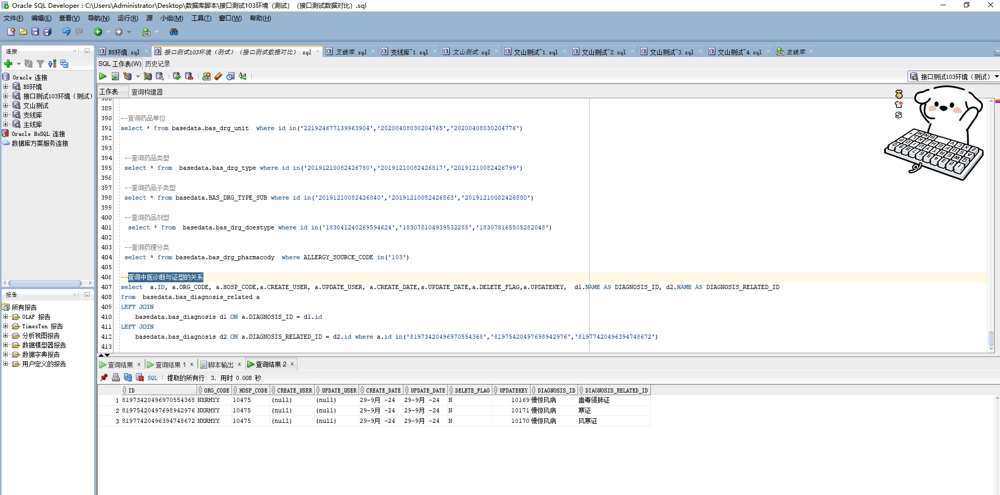

# 领域服务/基础领域 - 查询中医诊断与证型的关系 - 查询中医诊断与证型的关系 正向用例
## 请求参数：
``` json
{
  "pageIndex": 1,
  "orgCode": "NXRMYY",
  "pageSize": 3
}
```
## 返回参数：
``` json
{
    "exception": null,
    "apiCode": null,
    "data": {
        "list": [
            {
                "id": "81973420496970554368",
                "orgCode": "NXRMYY",
                "hospCode": "10475",
                "createDate": "2024-09-29 14:25:17",
                "updateDate": "2024-09-29 14:25:17",
                "isDelete": "N",
                "diagnosisId": "187040707944415232",
                "diagnosisRelatedId": "187040741440126976",
                "diagnosisName": "慢惊风病",
                "diagnosisRelatedName": "蛊毒侵肺证",
                "createUserId": null,
                "updateUserId": null,
                "updatekey": 10169
            },
            {
                "id": "81975420497698942976",
                "orgCode": "NXRMYY",
                "hospCode": "10475",
                "createDate": "2024-09-29 14:25:17",
                "updateDate": "2024-09-29 14:25:17",
                "isDelete": "N",
                "diagnosisId": "187040707944415232",
                "diagnosisRelatedId": "187040751175106560",
                "diagnosisName": "慢惊风病",
                "diagnosisRelatedName": "寒证",
                "createUserId": null,
                "updateUserId": null,
                "updatekey": 10171
            },
            {
                "id": "81977420496394748672",
                "orgCode": "NXRMYY",
                "hospCode": "10475",
                "createDate": "2024-09-29 14:25:17",
                "updateDate": "2024-09-29 14:25:17",
                "isDelete": "N",
                "diagnosisId": "187040707944415232",
                "diagnosisRelatedId": "187040746938859520",
                "diagnosisName": "慢惊风病",
                "diagnosisRelatedName": "风寒证",
                "createUserId": null,
                "updateUserId": null,
                "updatekey": 10170
            }
        ],
        "totalCount": 196,
        "pageSize": 3,
        "pageNo": 1,
        "pageCount": 66
    },
    "Code": 200,
    "Message": "操作成功"
}
```
## 数据校验：

# 领域服务/基础领域 - 查询中医诊断与证型的关系 - 必填校验-[orgCode]为空
## 请求参数：
``` json
{
  "pageIndex": 1,
  "diagnosisId": "187040709475336192",
  "orgCode": "",
  "pageSize": 3
}
```
## 返回参数：
``` json
{
  "exception": null,
  "apiCode": null,
  "data": null,
  "Code": 1,
  "Message": "医院编码不能为空"
}
```
# 领域服务/基础领域 - 查询中医诊断与证型的关系 - 必填校验-[pageIndex]为空
## 请求参数：
``` json
{
  "pageIndex": null,
  "diagnosisId": "187040709475336192",
  "orgCode": "NXRMYY",
  "pageSize": 3
}
```
## 返回参数：
``` json
{
  "exception": null,
  "apiCode": null,
  "data": null,
  "Code": 1,
  "Message": "系统内部异常"
}
```
# 领域服务/基础领域 - 查询中医诊断与证型的关系 - 必填校验-[pageSize]为空
## 请求参数：
``` json
{
  "pageIndex": 1,
  "diagnosisId": "187040709475336192",
  "orgCode": "NXRMYY",
  "pageSize": null
}
```
## 返回参数：
``` json
{
  "exception": null,
  "apiCode": null,
  "data": null,
  "Code": 1,
  "Message": "系统内部异常"
}
```
# 领域服务/基础领域 - 查询中医诊断与证型的关系 - 类型校验-[pageSize]类型错误
## 请求参数：
``` json
{
  "pageIndex": 1,
  "diagnosisId": "187040709475336192",
  "orgCode": "NXRMYY",
  "pageSize": "abc"
}
```
## 返回参数：
``` json
{
  "exception": null,
  "apiCode": null,
  "data": null,
  "Code": 1,
  "Message": "请求参数错误"
}
```
# 领域服务/基础领域 - 查询中医诊断与证型的关系 - 类型校验-[pageIndex]类型错误
## 请求参数：
``` json
{
  "pageIndex": "abc",
  "diagnosisId": "187040709475336192",
  "orgCode": "NXRMYY",
  "pageSize": 3
}
```
## 返回参数：
``` json
{
  "exception": null,
  "apiCode": null,
  "data": null,
  "Code": 1,
  "Message": "请求参数错误"
}
```
# 领域服务/基础领域 - 查询中医诊断与证型的关系 - 依赖用例-[orgCode]赋值为依赖用例测试值
## 请求参数：
``` json
{
  "pageIndex": 1,
  "diagnosisId": "187040709475336192",
  "orgCode": "依赖用例测试值",
  "pageSize": 3
}
```
## 返回参数：
``` json
{
  "exception": null,
  "apiCode": null,
  "data": {
    "list": [],
    "totalCount": 0,
    "pageSize": 3,
    "pageNo": 1,
    "pageCount": 0
  },
  "Code": 200,
  "Message": "操作成功"
}
```