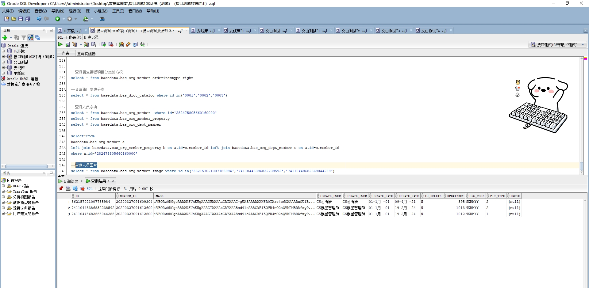

# 领域服务/基础领域 - 查询人员图片 - 查询人员图片 正向用例
## 请求参数：
``` json
{
  "hospCode": "NXRY",
  "orgCode": "NXRMYY",
  "pageSize": 3,
  "pageIndex": 1
}
```
## 返回参数：
``` json
{
  "exception": null,
  "apiCode": null,
  "data": {
    "list": [
      {
        "createDate": "0001-01-01 00:00:00",
        "createUserId": "CS刘倩倩",
        "hospCode": null,
        "id": "362157021007785984",
        "image": "iVBORw0KGgoAAAANSUhEUgAAAGUAAAAuCAIAAAC+gUA3AAAAAXNSR0IArs4c6QAAAARnQU1BAACxjwv8YQUAAAAJcEhZcwAADsMAAA7DAcdvqGQAAATjSURBVGhD7VmJjdwwDNy6XJDrcTVuxsVchp9EybYk6jZAgGiAXNaP+AyHlPbu87MQweIrhsVXDIuvGBZfMUzxdZ37tn0+n20/Lr31DVzneR47gYyz+fOb9p9w7uxqP/W6h2l9XYcm9Q3KqABs7Y6v2E+4DikxomfD4Sz+Ab7MUsK2Q1b57vcY855YUenGN/WFmlhRjmxWXf0mmYuXmtWLgZaUHnS5DSdTIttieLIKtkJTZURf3OMbxoq3q87mJ5gY2HYL98LssowgMB0swAxdrr+tonUB1AEPya/ylRyxZ5IABMfz3jApAKNkO46cC4OKYx/jBXFcCzQ+rbuTliLgI8LXO2a70mqMEqsT3RNTxnHLaGr9kOMurNSbS8jFO18XZEoDJXdJA5MKSywdJzYsUKXeNpNvmC62KNE4vkRT5wHr6Z4g6qChr1rVd2DMBNOpkXNKFGXwPhmEBM0sONvlZYEgYe1+vB+LeDq7oH6LOguojEgiWVcbzBDMHMWWTdv8InnRaCxcutYYqH53fuE0oYat3BoHtQ8EnoBQNNZYc8IBrZN2tIZMCNjincgW0zprECvsfbikJ7mXOg77897KJPTcu+YBUeVViRB14I7Hp74xAOU9I4XKFNRCJpAj84AQ5IV28D2+KJW7I3h6hj7t8kVnSTJd5EgKox2G7wVVKngcuRoNE8YiLhIqY+1W6I0vrri3C1eWW1Q+d9yLDXZKkcFLnDCzmypH8OHmswRNF349VpeKL66u86U1Zz08lI+HzhR5GrcmxucJ+qCY2BgZyhfa2VmTdqyqISw5wvB8hDjiiwfFbRTaeGfceCwwLzhJsMyIBqWyGbVr+sJSRK8X+ZNUX0tDTkVu4h53hbkmPs6HgaVKD+W3HzRIGdqQKjlGjkmug5Dl4s7yKADGIpRpOBKNiw2mlaosCpa25IRH3DlDfCW7ZMKYEuAJzkBW5JyQ0Af92tJJgT2OZ4IGIuYjxnPeKSte/tAeNkpSEEN+bH49lpF9IvK6V2+YkpdkhHq4miOHNAXKjEeQV2Tt6GrKgQ+J8oI7R8iaUR9v+yND+IJYi9pAWKLCFN4UXVxXCVNLjMrILAVMy8NcAdeBY1tWiw39FJ1MK6aRXNENy2DYTZMvJSz5Y+swjXTon4U2Q5fYkpWJ9xoRsiozsGzxkROhSoIv5iTvanhz1FWbL0fYe1PO0MW5WIxysZ+kY3KBn7q10O3AgcUYEsPGH8VHjMBS+m4HeMv06lgaHb5yDA6UTuZugi6xaQslr6rArN/ko96IXoE19WjyhqkiGnoVNkIaSqTLVyoT1yO7tq/JtEsTRrIRlGyZAx8tMcXXjjIBgiii6IH+OFC+bekQHLcUFZjlY3kLfb7g4txlPr5BRtlQfW5sAcVqlVV6weeXAb3p8yjYHtEupXDqI8ZwfGobfuOLKKL/eWx1g3sg4RFCbNV6kgJKnTuwtJTvZ7QL2MPzxiilqaMr8c4XjV022qKrqH7TU9ovHt4qNfRihk4ZBL2Mg+dG8SupmycRXyuNN74shX4dUXwNoKUvUeBrLPoYaEb7W3DROFo/ujw470Yi7/OLUhgOnlqm2Y4ItH0ykAL9VbYGId+aX9Ca993N4j9Ei6+FOxZfMSy+Ylh8xbD4imHxFcPiK4bFVwyLrxgWXzEsviL4+fkDacM7pjokJPoAAAAASUVORK5CYII=",
        "isDelete": "N",
        "memberId": "20200327091609304",
        "orgCode": "NXRMYY",
        "picType": "2",
        "updateDate": "2021-04-09 16:42:42",
        "updateUserId": "CS刘倩倩"
      },
      {
        "createDate": "0001-01-01 00:00:00",
        "createUserId": "CS创星管理员",
        "hospCode": null,
        "id": "74110443386832238592",
        "image": "iVBORw0KGgoAAAANSUhEUgAAAGIAAAAzCAYAAABsd91cAAACkElEQVR4nO2aQVKDMBRAfxyPYjceAU6gbjxFuqwH6NID0KVLL5HewBM4LqS36L4xJKEJJIRSO9Nf8t8MY0vgQ//jJxBkUgHE1bnf7/fXPgdCcX84HK59DoSC3UrXxBiDGznVs7i79gkQBhKBBBKBBBKBhBERW1iqQbLc7MKm3QZK1bbcTjhaap/tUg/Ik+LNCKoILEhLXRXNveFlFi6kFPxi8Zpw3qnOkpFfJyRXCSiqOmyqK1nYJJ2Mv4/9DG0AK24oXqYialkVcQG6copKRtRMpq3CU2RmKULwoW6CS9FeyUPLUZKR+e+uycabu4hgsN4uGTx/V1AbSXYRwJtG/gpPDytYN1+K7jbq6tb78/UKHvyAXHhxpiw12JB54FvRlWCvQPfZXtmd7qg3doz078ExmsrqrG2rp7/eATOviOOv0wlSmWz6bS5U+mu/i4okqB14uZEQHdBd8GNXY7ZT8YXr4opK6ONJv9vrWc1GhKO92iv9Nzkwi7SE4y1xv1SCW9tQdH8gz1CE7CU4Meg2WerfhibxYxXS+HPrUiEyE2GqIdVXx2mT2SY3pHMnFsm4e6CMHzsbESZRw4k8iaA6etU0+vwRqxh7ormI6HDO9EQnyRd6hvAqKE8RQ2hBZ1TNlP0Gpk7mLiIx+2qmwNngvPQONqVqLzcQmSQnJhKKsO8MGHuHx1pVzMeTa/r97mz68qna1z+w0NuXEHtt4fiCtwXT7xySy+JNbZkhrjhE9LkhmB4fvMe0+8faqWsahf6dBgn0hg4JJAIJJAIJNyNizuNDw82ImDskAgkkAgkkAgkkAgkkAgkkAgkkAgkkAgkkAgkkAgkkAgkkAgkkAgkkAgkkAgkkAgkkAgkkAgkkAgl/q7XWjl5zEf0AAAAASUVORK5CYII=",
        "isDelete": "N",
        "memberId": "20200327091612600",
        "orgCode": "NXRMYY",
        "picType": "2",
        "updateDate": "2024-02-19 17:33:42",
        "updateUserId": "CS创星管理员"
      },
      {
        "createDate": "0001-01-01 00:00:00",
        "createUserId": "CS创星管理员",
        "hospCode": null,
        "id": "74110448682668044288",
        "image": "iVBORw0KGgoAAAANSUhEUgAAAGIAAAAzCAYAAABsd91cAAACkElEQVR4nO2aQVKDMBRAfxyPYjceAU6gbjxFuqwH6NID0KVLL5HewBM4LqS36L4xJKEJJIRSO9Nf8t8MY0vgQ//jJxBkUgHE1bnf7/fXPgdCcX84HK59DoSC3UrXxBiDGznVs7i79gkQBhKBBBKBBBKBhBERW1iqQbLc7MKm3QZK1bbcTjhaap/tUg/Ik+LNCKoILEhLXRXNveFlFi6kFPxi8Zpw3qnOkpFfJyRXCSiqOmyqK1nYJJ2Mv4/9DG0AK24oXqYialkVcQG6copKRtRMpq3CU2RmKULwoW6CS9FeyUPLUZKR+e+uycabu4hgsN4uGTx/V1AbSXYRwJtG/gpPDytYN1+K7jbq6tb78/UKHvyAXHhxpiw12JB54FvRlWCvQPfZXtmd7qg3doz078ExmsrqrG2rp7/eATOviOOv0wlSmWz6bS5U+mu/i4okqB14uZEQHdBd8GNXY7ZT8YXr4opK6ONJv9vrWc1GhKO92iv9Nzkwi7SE4y1xv1SCW9tQdH8gz1CE7CU4Meg2WerfhibxYxXS+HPrUiEyE2GqIdVXx2mT2SY3pHMnFsm4e6CMHzsbESZRw4k8iaA6etU0+vwRqxh7ormI6HDO9EQnyRd6hvAqKE8RQ2hBZ1TNlP0Gpk7mLiIx+2qmwNngvPQONqVqLzcQmSQnJhKKsO8MGHuHx1pVzMeTa/r97mz68qna1z+w0NuXEHtt4fiCtwXT7xySy+JNbZkhrjhE9LkhmB4fvMe0+8faqWsahf6dBgn0hg4JJAIJJAIJNyNizuNDw82ImDskAgkkAgkkAgkkAgkkAgkkAgkkAgkkAgkkAgkkAgkkAgkkAgkkAgkkAgkkAgkkAgkkAgkkAgkkAgl/q7XWjl5zEf0AAAAASUVORK5CYII=",
        "isDelete": "N",
        "memberId": "20200327091612600",
        "orgCode": "NXRMYY",
        "picType": "1",
        "updateDate": "2024-02-19 17:33:42",
        "updateUserId": "CS创星管理员"
      }
    ],
    "totalCount": 40,
    "pageSize": 1,
    "pageNo": 3,
    "pageCount": 14
  },
  "Code": 200,
  "Message": "操作成功"
}
```
## 数据校验：

# 领域服务/基础领域 - 查询人员图片 - 必填校验-[orgCode]为空
## 请求参数：
``` json
{
  "hospCode": "NXRY",
  "orgCode": "",
  "pageSize": 3,
  "pageIndex": 1
}
```
## 返回参数：
``` json
{
  "exception": null,
  "apiCode": null,
  "data": null,
  "Code": 1,
  "Message": "医院编码不可为空"
}
```
# 领域服务/基础领域 - 查询人员图片 - 必填校验-[pageIndex]为空
## 请求参数：
``` json
{
  "hospCode": "NXRY",
  "orgCode": "NXRMYY",
  "pageSize": 3,
  "pageIndex": null
}
```
## 返回参数：
``` json
{
  "exception": null,
  "apiCode": null,
  "data": null,
  "Code": 1,
  "Message": "系统内部异常"
}
```
# 领域服务/基础领域 - 查询人员图片 - 必填校验-[pageSize]为空
## 请求参数：
``` json
{
  "hospCode": "NXRY",
  "orgCode": "NXRMYY",
  "pageSize": null,
  "pageIndex": 1
}
```
## 返回参数：
``` json
{
  "exception": null,
  "apiCode": null,
  "data": null,
  "Code": 1,
  "Message": "系统内部异常"
}
```
# 领域服务/基础领域 - 查询人员图片 - 类型校验-[pageIndex]类型错误
## 请求参数：
``` json
{
  "hospCode": "NXRY",
  "orgCode": "NXRMYY",
  "pageSize": 3,
  "pageIndex": "abc"
}
```
## 返回参数：
``` json
{
  "exception": null,
  "apiCode": null,
  "data": null,
  "Code": 1,
  "Message": "请求参数错误"
}
```
# 领域服务/基础领域 - 查询人员图片 - 类型校验-[pageSize]类型错误
## 请求参数：
``` json
{
  "hospCode": "NXRY",
  "orgCode": "NXRMYY",
  "pageSize": "abc",
  "pageIndex": 1
}
```
## 返回参数：
``` json
{
  "exception": null,
  "apiCode": null,
  "data": null,
  "Code": 1,
  "Message": "请求参数错误"
}
```
# 领域服务/基础领域 - 查询人员图片 - 依赖用例-[orgCode]赋值为依赖用例测试值
## 请求参数：
``` json
{
  "hospCode": "NXRY",
  "orgCode": "依赖用例测试值",
  "pageSize": 3,
  "pageIndex": 1
}
```
## 返回参数：
``` json
{
  "exception": null,
  "apiCode": null,
  "data": {
    "list": [],
    "totalCount": 0,
    "pageSize": 1,
    "pageNo": 3,
    "pageCount": 0
  },
  "Code": 200,
  "Message": "操作成功"
}
```